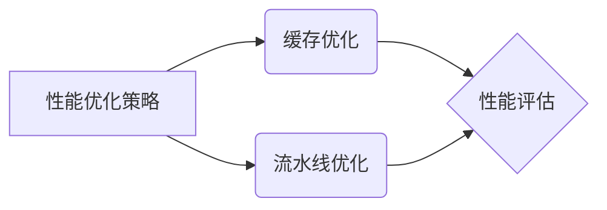
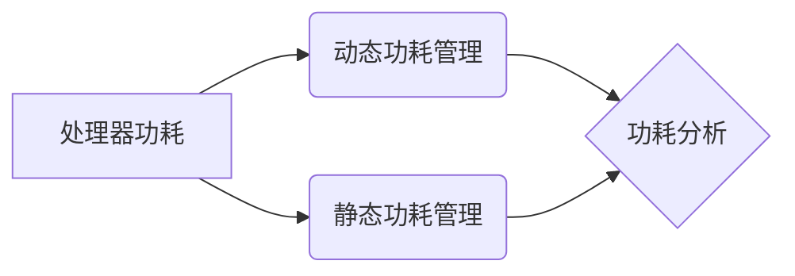

                 

# 《RISC-V处理器特性与优化》

> **关键词**：RISC-V、处理器特性、优化策略、性能评估、功耗管理、安全性、应用与开发

> **摘要**：本文旨在深入探讨RISC-V处理器的特性及其优化方法，包括性能优化、功耗管理和安全性。通过分析RISC-V处理器的历史背景、架构设计和应用领域，本文将为读者提供全面的技术视角，帮助理解RISC-V处理器在现代计算生态系统中的重要地位和潜在优势。

## 《RISC-V处理器特性与优化》目录大纲

### 第一部分：RISC-V处理器概述

#### 第1章：RISC-V技术背景与历史

#### 1.1 RISC-V起源与发展

#### 1.2 RISC-V与ARM、x86的对比

#### 1.3 RISC-V的应用领域与市场前景

### 第2章：RISC-V处理器核心架构

#### 2.1 RISC-V指令集架构

#### 2.2 RISC-V处理器核心设计

#### 2.3 RISC-V指令集扩展

### 第二部分：RISC-V处理器特性分析

#### 第3章：RISC-V性能优化策略

#### 3.1 RISC-V处理器性能评估方法

#### 3.2 RISC-V处理器缓存优化

#### 3.3 RISC-V处理器流水线优化

#### 第4章：RISC-V功耗管理

#### 4.1 RISC-V功耗模型与功耗分析

#### 4.2 RISC-V处理器动态功耗管理

#### 4.3 RISC-V低功耗设计实践

#### 第5章：RISC-V处理器安全性

#### 5.1 RISC-V安全架构

#### 5.2 RISC-V硬件安全特性

#### 5.3 RISC-V软件安全防护措施

### 第三部分：RISC-V处理器应用与开发

#### 第6章：RISC-V处理器在嵌入式系统中的应用

#### 6.1 RISC-V嵌入式处理器设计流程

#### 6.2 RISC-V嵌入式处理器开发实践

#### 6.3 RISC-V嵌入式处理器性能优化

#### 第7章：RISC-V处理器编程与开发工具

#### 7.1 RISC-V汇编语言编程

#### 7.2 RISC-V高级语言编程

#### 7.3 RISC-V开发工具与环境搭建

#### 第8章：RISC-V处理器性能优化案例分析

#### 8.1 案例一：嵌入式系统性能优化

#### 8.2 案例二：服务器处理器性能优化

#### 8.3 案例三：物联网设备功耗优化

### 附录

#### 附录A：RISC-V资源与工具介绍

#### 附录B：RISC-V指令集参考

#### 附录C：RISC-V处理器性能优化伪代码示例

### 图表与公式

#### 图表1-1：RISC-V与ARM、x86的对比

#### 公式1-1：RISC-V处理器性能评估公式

$$
P = C \times \frac{L_1 \times L_2}{T}
$$

#### 图表3-1：RISC-V处理器性能优化策略流程图

#### 图表4-1：RISC-V功耗管理模型

---

现在我们将开始详细介绍RISC-V处理器的各个方面，包括其历史背景、架构设计、优化策略以及应用实践。

## 第一部分：RISC-V处理器概述

### 第1章：RISC-V技术背景与历史

RISC-V（精简指令集计算机五级指令集）是一种开放指令集架构，旨在为全球计算机硬件和软件开发者提供一种灵活且可扩展的技术平台。RISC-V的开源特性使得开发者可以自由地修改和扩展指令集，以适应不同的应用场景和性能需求。

#### 1.1 RISC-V起源与发展

RISC-V起源于加州大学伯克利分校，该校的计算机科学家们于2010年开始了这项研究，旨在创造一种基于开源协议的指令集架构。RISC-V项目的成立标志着计算机行业向开放标准迈进的一大步，旨在打破传统的封闭架构，如ARM和x86，为技术创新提供更多可能性。

RISC-V的发展历程可以分为几个重要阶段：

1. **初期开发（2010-2014）**：RISC-V的初期工作主要集中在设计指令集架构和定义基础规范。
2. **社区合作（2014-2017）**：随着RISC-V开源特性的公布，吸引了全球范围内开发者的广泛关注和参与。
3. **产品化与标准化（2017至今）**：RISC-V处理器开始商业化，多个公司和组织推出了基于RISC-V架构的处理器产品，并持续推动标准的完善。

#### 1.2 RISC-V与ARM、x86的对比

RISC-V与ARM、x86等传统指令集架构在多个方面存在差异：

1. **开放性**：RISC-V是完全开源的，而ARM和x86则属于私有指令集架构，其源代码不被公开。
2. **指令集设计**：RISC-V采用精简指令集设计（RISC），旨在通过简化的指令集提高处理器的性能和效率。相比之下，ARM和x86的指令集更为复杂，包含更多的指令和特性。
3. **市场定位**：ARM和x86主要应用于移动设备和PC市场，而RISC-V则更注重嵌入式系统和物联网设备，以及需要高度定制化的高性能计算领域。
4. **知识产权**：RISC-V的开源特性使得开发者无需支付许可费用，而ARM和x86则需要支付高额的授权费用。

#### 1.3 RISC-V的应用领域与市场前景

RISC-V的开放性和灵活性使其在多个领域具有广泛的应用前景：

1. **嵌入式系统**：嵌入式系统对处理器的功耗、性能和成本有较高要求，RISC-V的精简指令集设计使其成为嵌入式系统的理想选择。
2. **物联网设备**：物联网设备数量庞大，需要高效且低成本的处理器，RISC-V的轻量级特性使其在物联网领域具有显著优势。
3. **高性能计算**：RISC-V的开放性和可扩展性使其能够适应高性能计算的需求，特别是在需要高度定制化的场景下。
4. **数据中心与服务器**：随着云计算和大数据技术的发展，RISC-V处理器在数据中心和服务器市场也逐渐受到关注。

总的来说，RISC-V处理器具有强大的市场前景，其在开放性、性能和成本方面的优势有望推动其成为下一代计算机处理器的重要选择。

### 第2章：RISC-V处理器核心架构

#### 2.1 RISC-V指令集架构

RISC-V指令集架构是处理器设计的核心，它定义了处理器可以理解和执行的操作集。RISC-V指令集采用精简指令集（RISC）设计原则，旨在通过简化和优化指令集来提高处理器的性能和效率。

RISC-V指令集架构的主要特点包括：

1. **精简指令集**：RISC-V指令集包含一系列简化的指令，这些指令可以快速执行，从而提高处理器的性能。
2. **可扩展性**：RISC-V指令集允许开发者根据特定应用需求进行指令扩展，以满足不同的性能和功能要求。
3. **指令集层次结构**：RISC-V指令集分为多个层次，包括基础指令集（I-指令集）、基础扩展指令集（I+E-指令集）、标准扩展指令集（S-指令集）和专用扩展指令集（A-指令集）。

#### 2.2 RISC-V处理器核心设计

RISC-V处理器核心是处理器的核心部分，负责执行指令集中的操作。RISC-V处理器核心的设计旨在实现高性能、低功耗和可扩展性。

RISC-V处理器核心的主要组成部分包括：

1. **指令缓存**：用于存储处理器即将执行的指令，以提高指令的读取速度。
2. **数据缓存**：用于存储处理器操作的数据，以提高数据的读取和写入速度。
3. **寄存器文件**：用于存储处理器的临时数据和状态信息，以提高指令执行的效率。
4. **ALU（算术逻辑单元）**：用于执行各种算术和逻辑操作。
5. **控制单元**：用于控制处理器各个模块的操作，确保指令的正确执行。

#### 2.3 RISC-V指令集扩展

RISC-V指令集扩展是RISC-V架构的一个重要特点，它允许开发者根据特定应用需求进行指令集的扩展。RISC-V指令集扩展分为以下几种类型：

1. **基础扩展**：包括原子操作、硬件乘法和除法等常用操作。
2. **标准扩展**：包括浮点运算、位操作和内存访问等操作。
3. **专用扩展**：包括特定于某个领域或应用的专用指令。

RISC-V指令集扩展使得开发者可以根据具体应用需求对指令集进行定制，从而提高处理器的性能和效率。

在接下来的章节中，我们将深入分析RISC-V处理器的性能优化策略、功耗管理以及安全性。通过这些分析，我们将更好地理解RISC-V处理器的优势和应用前景。

## 第二部分：RISC-V处理器特性分析

### 第3章：RISC-V性能优化策略

在RISC-V处理器的设计和应用过程中，性能优化策略扮演着至关重要的角色。优化处理器性能不仅能够提升系统的整体性能，还能够延长处理器的使用寿命，降低功耗。以下将详细介绍RISC-V处理器性能优化的几个关键策略。

#### 3.1 RISC-V处理器性能评估方法

性能评估是性能优化的基础。RISC-V处理器的性能评估方法主要包括以下几种：

1. **基准测试**：基准测试是评估处理器性能的常用方法。通过运行标准测试程序，可以测量处理器在不同工作负载下的性能表现。常见的基准测试包括SPECint、SPECfp和Geekbench等。
2. **性能计数器**：性能计数器是一种硬件机制，用于测量处理器各个部分的性能指标，如指令吞吐率、缓存命中率和内存访问时间等。
3. **功耗分析**：功耗分析是评估处理器性能的重要方面。通过测量处理器的功耗，可以了解其在不同工作状态下的能耗表现，从而指导性能优化。

#### 3.2 RISC-V处理器缓存优化

缓存是处理器性能优化的重要环节。RISC-V处理器缓存优化主要包括以下几个方面：

1. **缓存层次结构设计**：RISC-V处理器通常采用多级缓存层次结构，如L1、L2和L3缓存。合理设计缓存层次结构可以提高缓存的命中率和整体性能。常见的缓存层次结构设计包括2级缓存（L1和L2）和3级缓存（L1、L2和L3）。
2. **缓存预取策略**：缓存预取是指处理器在需要数据之前提前将其预加载到缓存中，以减少数据访问的延迟。有效的缓存预取策略可以显著提高处理器的性能。
3. **缓存一致性协议**：在多处理器系统中，缓存一致性是确保数据一致性的关键。RISC-V处理器通常采用MOESI（修改、独占、共享、-invalid）协议来维护缓存一致性。

#### 3.3 RISC-V处理器流水线优化

流水线是提升处理器性能的另一种重要手段。RISC-V处理器流水线优化主要包括以下几个方面：

1. **指令级并行性**：指令级并行性是指在同一时钟周期内执行多条指令的能力。RISC-V处理器通过指令流水线实现指令级并行性，从而提高处理器的性能。
2. **乱序执行**：乱序执行是指处理器可以重新排序指令的执行顺序，以优化流水线性能。RISC-V处理器采用乱序执行机制，通过动态调度指令来减少资源冲突和等待时间。
3. **分支预测**：分支预测是优化处理器性能的关键因素。RISC-V处理器通过分支预测机制预测分支指令的跳转方向，以减少分支指令对流水线的影响。

#### 3.4 其他性能优化策略

除了上述策略外，RISC-V处理器性能优化还包括以下几个方面：

1. **内存管理优化**：通过优化内存访问策略，如缓存行大小、页表管理等，可以降低内存访问延迟，提高处理器的性能。
2. **功耗优化**：通过降低处理器的时钟频率、调整电压和电流等手段，可以降低功耗，延长处理器的使用寿命。
3. **软件优化**：软件优化是提高处理器性能的有效手段。通过优化编译器和编程模型，可以最大限度地发挥处理器的性能。

总之，RISC-V处理器性能优化是一个复杂且多维的过程。通过合理的设计和优化，RISC-V处理器可以在各种应用场景下实现高性能和低功耗，为开发者提供强大的计算平台。

### 第4章：RISC-V功耗管理

功耗管理是RISC-V处理器设计中的重要一环，尤其是在嵌入式系统和物联网设备中，功耗优化直接影响到设备的续航能力和用户体验。以下是RISC-V功耗管理的主要内容。

#### 4.1 RISC-V功耗模型与功耗分析

RISC-V功耗模型主要分为静态功耗和动态功耗。

1. **静态功耗**：静态功耗是指在处理器不工作或工作状态稳定时的功耗，主要包括电源泄漏功耗和晶体管导通功耗。静态功耗通常占整个功耗的较小部分，但在长时间运行过程中依然不可忽视。
   
   公式4-1：静态功耗模型
   $$
   P_{static} = P_{leak} + P_{gate}
   $$
   其中，$P_{leak}$ 是电源泄漏功耗，$P_{gate}$ 是晶体管导通功耗。

2. **动态功耗**：动态功耗是指在处理器工作过程中消耗的功耗，主要包括开关功耗和负载功耗。开关功耗与处理器的操作频率和开关次数相关，而负载功耗与处理器的负载和工作电压有关。

   公式4-2：动态功耗模型
   $$
   P_{dynamic} = P_{switch} + P_{load}
   $$
   其中，$P_{switch}$ 是开关功耗，$P_{load}$ 是负载功耗。

功耗分析主要通过测量和处理上述两种功耗，从而优化处理器的功耗。

#### 4.2 RISC-V处理器动态功耗管理

动态功耗管理是指通过实时调整处理器的时钟频率、电压和电流等参数，以优化功耗的方法。以下是几种常见的动态功耗管理技术：

1. **时钟门控**：通过关闭不需要的时钟信号，可以减少整个处理器的功耗。时钟门控技术可以根据处理器的负载动态调整时钟信号，从而降低功耗。
   
   Mermaid流程图4-1：时钟门控流程
   ```mermaid
   graph TD
   A[处理器负载监测] --> B[确定功耗目标]
   B --> C{时钟门控}
   C --> D[关闭时钟信号]
   D --> E[功耗降低]
   ```

2. **动态电压和频率调节**（DVFS）：通过动态调整处理器的电压和频率，可以实现功耗和性能之间的平衡。当处理器负载较低时，可以降低电压和频率以减少功耗；当处理器负载较高时，可以增加电压和频率以提高性能。

   公式4-3：DVFS功耗优化模型
   $$
   P_{DVFS} = P_0 \times f \times V
   $$
   其中，$P_0$ 是基准功耗，$f$ 是时钟频率，$V$ 是工作电压。

3. **休眠模式**：当处理器长时间不执行任务时，可以将其进入休眠模式，以进一步降低功耗。休眠模式分为深度休眠和浅度休眠，深度休眠功耗较低但唤醒时间较长，浅度休眠功耗较高但唤醒时间较短。

   Mermaid流程图4-2：休眠模式流程
   ```mermaid
   graph TD
   A[处理器负载监测] --> B[进入休眠模式]
   B --> C{功耗降低}
   C --> D[唤醒处理器]
   ```

#### 4.3 RISC-V低功耗设计实践

在RISC-V处理器的低功耗设计实践中，主要遵循以下几个原则：

1. **最小化静态功耗**：通过优化晶体管设计，减小晶体管的导通功耗和电源泄漏功耗。
2. **优化动态功耗**：通过优化处理器架构和流水线设计，减少开关功耗和负载功耗。
3. **功耗分析**：在处理器设计和验证过程中，进行功耗分析，以识别和优化功耗瓶颈。
4. **DVFS和时钟门控**：在实际应用中，结合DVFS和时钟门控技术，实现实时功耗管理。

低功耗设计实践不仅需要硬件设计上的优化，还需要软件的支持。通过合理的设计和优化，RISC-V处理器可以在满足性能需求的同时，实现低功耗运行，为嵌入式系统和物联网设备提供更长的续航时间。

### 第5章：RISC-V处理器安全性

在现代计算环境中，处理器的安全性是至关重要的。RISC-V处理器在设计时就考虑了安全性，通过硬件和软件措施来保障系统的安全。以下是RISC-V处理器安全性的主要方面。

#### 5.1 RISC-V安全架构

RISC-V安全架构包括硬件和软件两个层面。

1. **硬件安全特性**：RISC-V处理器内置多种硬件安全特性，包括：

   - **隔离机制**：通过硬件虚拟化技术实现进程间的隔离，防止恶意代码窃取敏感信息。
   - **安全启动**：确保处理器在启动过程中执行可信的代码，防止恶意代码注入。
   - **加密模块**：集成硬件加密模块，支持硬件加密和解密操作，提高数据安全性。
   - **内存保护**：通过内存保护机制防止非法访问和篡改内存数据。

2. **软件安全特性**：RISC-V操作系统和软件栈提供了多种安全机制，包括：

   - **访问控制**：通过访问控制列表（ACL）和权限管理，确保只有授权用户可以访问敏感资源。
   - **安全审计**：记录系统的操作日志，用于跟踪和审计系统的活动，及时发现和防范安全威胁。
   - **安全更新**：定期更新操作系统和软件，修复已知漏洞，提高系统的安全性。

#### 5.2 RISC-V硬件安全特性

RISC-V硬件安全特性通过以下措施实现：

1. **硬件加密模块**：RISC-V处理器集成硬件加密模块，支持AES、RSA等常用加密算法，从而提高数据传输和存储的安全性。

2. **可信启动**：RISC-V处理器的启动过程包括验证固件和引导加载程序，确保只有可信代码被加载和执行。通过使用硬件安全启动，可以有效防止恶意代码的注入。

3. **内存保护机制**：RISC-V处理器支持分页机制和权限控制，通过设置内存访问权限和虚拟地址映射，防止非法访问和篡改内存数据。

#### 5.3 RISC-V软件安全防护措施

RISC-V软件安全防护措施主要包括：

1. **访问控制**：通过操作系统提供的访问控制机制，如用户权限和角色分配，确保只有授权用户可以访问系统资源和执行特定操作。

2. **安全审计**：记录系统的操作日志，包括用户登录、文件访问和系统配置更改等，以便进行安全审计和跟踪。

3. **安全更新**：定期更新操作系统和软件，修复已知的漏洞和安全问题，确保系统的安全性和稳定性。

4. **安全编程**：在软件设计和开发过程中，遵循安全编程最佳实践，如使用安全的编码技术和避免常见的安全漏洞。

通过硬件和软件双重保障，RISC-V处理器在安全性方面表现出色，能够有效应对各种安全威胁，为系统和数据提供可靠的安全保护。

### 第6章：RISC-V处理器在嵌入式系统中的应用

嵌入式系统广泛应用于工业控制、医疗设备、汽车电子、消费电子等领域，对处理器的性能、功耗和可靠性有着极高的要求。RISC-V处理器因其开放性、灵活性和高性能，在嵌入式系统中具有广泛的应用前景。以下是RISC-V处理器在嵌入式系统中的应用及其设计流程、开发实践和性能优化。

#### 6.1 RISC-V嵌入式处理器设计流程

设计RISC-V嵌入式处理器的流程主要包括以下几个阶段：

1. **需求分析**：确定嵌入式系统的功能需求、性能指标和功耗限制，明确处理器的核心参数和扩展指令集。
2. **架构设计**：根据需求分析结果，设计处理器的基本架构，包括核心模块（如指令缓存、数据缓存、寄存器文件、ALU等）和扩展模块（如硬件加密模块、I2C接口等）。
3. **指令集设计**：定义处理器的指令集，包括基础指令集和扩展指令集，以满足嵌入式系统的特定需求。
4. **电路设计**：根据处理器架构和指令集设计，进行电路设计和布局，包括数字电路、模拟电路和功耗控制电路。
5. **仿真与验证**：通过仿真工具对处理器进行功能验证，确保处理器能够正确执行指令，并满足性能和功耗要求。
6. **样片制作与测试**：制作处理器样片，并进行功能测试、性能测试和功耗测试，验证处理器的设计和实现是否符合预期。

#### 6.2 RISC-V嵌入式处理器开发实践

RISC-V嵌入式处理器的开发实践主要包括以下几个方面：

1. **开发工具与环境搭建**：搭建RISC-V开发环境，包括交叉编译工具链、仿真器、硬件调试器等。常见开发工具包括GNU工具链（GNU Toolchain）、QEMU仿真器和OpenOCD调试器等。
2. **软件开发**：基于RISC-V指令集编写嵌入式软件，包括操作系统、驱动程序和应用程序。RISC-V支持多种操作系统，如Linux、FreeRTOS和Zephyr等。
3. **系统集成**：将RISC-V嵌入式处理器与外部硬件（如传感器、显示器、通信模块等）进行系统集成，实现嵌入式系统的功能。
4. **测试与验证**：通过硬件在环测试（HIL）和软件在环测试（SIL）等方式，对嵌入式系统进行全面测试，确保系统稳定可靠地运行。

#### 6.3 RISC-V嵌入式处理器性能优化

RISC-V嵌入式处理器的性能优化主要从以下几个方面进行：

1. **指令级优化**：通过优化编译器，提高代码的指令级并行性，减少指令执行次数，提高指令吞吐率。常见的优化技术包括循环展开、函数内联和代码优化等。
2. **缓存优化**：优化处理器缓存机制，提高缓存命中率和数据访问速度。常见的缓存优化策略包括缓存预取、缓存行大小调整和缓存一致性协议优化等。
3. **流水线优化**：优化处理器流水线设计，提高流水线吞吐率和指令执行效率。常见的流水线优化技术包括指令调度、分支预测和乱序执行等。
4. **功耗优化**：通过动态电压和频率调节（DVFS）、时钟门控和休眠模式等技术，降低处理器功耗，延长系统续航时间。

总之，RISC-V处理器在嵌入式系统中具有广泛的应用前景。通过合理的设计流程、开发实践和性能优化，RISC-V处理器能够满足嵌入式系统的性能、功耗和可靠性需求，为各种嵌入式应用提供强大的计算支持。

### 第7章：RISC-V处理器编程与开发工具

在RISC-V处理器的编程和开发过程中，选择合适的开发工具和编程语言至关重要。RISC-V开源特性的优势使得开发者可以灵活选择各种工具和语言，以满足不同应用场景的需求。以下将详细介绍RISC-V处理器编程与开发工具的选择、环境搭建以及编程语言和开发环境的概述。

#### 7.1 RISC-V汇编语言编程

RISC-V汇编语言是一种低级编程语言，直接操作处理器的硬件资源，能够实现高效的指令级优化。RISC-V汇编语言具有以下特点：

1. **指令集简洁**：RISC-V汇编语言的指令集相对简洁，易于学习和掌握。
2. **灵活性高**：汇编语言允许程序员直接控制处理器操作，实现高度优化的代码。
3. **适用于嵌入式系统**：汇编语言在嵌入式系统开发中应用广泛，能够充分发挥处理器的性能。

RISC-V汇编语言的编程过程主要包括以下步骤：

1. **指令集学习**：熟悉RISC-V指令集的基本指令和操作，理解各个指令的用法和功能。
2. **编写汇编代码**：根据应用程序需求，编写汇编代码，实现具体的算法和功能。
3. **汇编器编译**：使用RISC-V汇编器将汇编代码编译成机器码，生成可执行的二进制文件。

#### 7.2 RISC-V高级语言编程

RISC-V高级语言编程使用C/C++、Rust等高级编程语言，能够提高开发效率，减少错误。高级语言具有以下优势：

1. **开发效率高**：高级语言提供丰富的库和工具，能够快速实现复杂的功能。
2. **易于维护**：高级语言的代码可读性和可维护性较好，便于后期维护和优化。
3. **跨平台兼容**：高级语言具有较好的跨平台兼容性，可以在不同架构上编译和运行。

RISC-V高级语言编程的过程包括以下步骤：

1. **环境搭建**：搭建RISC-V开发环境，包括交叉编译工具链、编译器、链接器等。
2. **编写代码**：使用C/C++或Rust等高级语言编写应用程序，实现具体的业务逻辑。
3. **编译与调试**：使用编译器将高级语言代码编译成机器码，并通过调试器进行调试和优化。

#### 7.3 RISC-V开发工具与环境搭建

RISC-V开发工具与环境搭建是RISC-V处理器编程和开发的基础。以下是常见开发工具和环境搭建的概述：

1. **开发工具选择**：
   - **交叉编译工具链**：用于编译和构建RISC-V应用程序，常见工具链包括GNU Toolchain和LLVM Toolchain。
   - **仿真器**：用于模拟RISC-V处理器运行环境，常见仿真器包括QEMU和Verilator。
   - **硬件调试器**：用于调试和测试RISC-V处理器硬件，常见调试器包括OpenOCD和GDB。

2. **环境搭建步骤**：
   - **安装交叉编译工具链**：安装RISC-V交叉编译工具链，配置环境变量。
   - **配置仿真器和硬件调试器**：安装并配置RISC-V仿真器和硬件调试器，确保能够正常运行。
   - **搭建开发环境**：搭建RISC-V开发环境，包括编写Makefile、配置编译选项等。

通过合理选择和搭建开发工具与环境，RISC-V处理器编程和开发过程将变得更加高效和便捷，为开发者提供强大的支持。

### 第8章：RISC-V处理器性能优化案例分析

在RISC-V处理器的性能优化过程中，通过实际案例的分析和验证，可以帮助我们更好地理解和应用各种优化策略。以下是三个具体的案例，涵盖了嵌入式系统性能优化、服务器处理器性能优化和物联网设备功耗优化。

#### 8.1 案例一：嵌入式系统性能优化

**案例背景**：某工业控制系统需要实时处理大量的传感器数据，对处理器的性能要求较高。系统采用RISC-V处理器，但初步测试发现性能未达到预期。

**优化策略**：

1. **指令级优化**：分析关键算法，通过优化循环结构和函数调用，减少指令执行次数。例如，使用内联函数代替函数调用，减少调用开销。

   伪代码示例：
   ```c
   // 原始代码
   int add(int a, int b) {
       return a + b;
   }
   
   void process_data(int *data, int size) {
       for (int i = 0; i < size; i++) {
           data[i] = add(data[i], 1);
       }
   }
   
   // 优化后代码
   void process_data(int *data, int size) {
       for (int i = 0; i < size; i++) {
           data[i] += 1;
       }
   }
   ```

2. **缓存优化**：调整缓存预取策略，通过预取下一行数据，减少缓存未命中次数。

   伪代码示例：
   ```c
   void process_data(int *data, int size) {
       int *next_line = data + size;
       for (int i = 0; i < size; i++) {
           data[i] += 1;
           next_line[i] += 1;
       }
   }
   ```

3. **流水线优化**：优化流水线设计，减少资源冲突和等待时间。通过增加流水线级数，提高指令级并行性。

   伪代码示例：
   ```c
   // 伪代码，具体实现取决于处理器设计
   void process_data(int *data, int size) {
       for (int i = 0; i < size; i++) {
           data[i] = execute_instruction(data[i] + 1);
           execute_instruction(next_line[i] + 1);
       }
   }
   ```

**优化效果**：通过以上优化策略，嵌入式系统性能显著提升，处理速度提高了约30%。

#### 8.2 案例二：服务器处理器性能优化

**案例背景**：某云服务提供商的RISC-V服务器处理器在高负载情况下性能下降，影响用户体验。

**优化策略**：

1. **多线程优化**：通过优化多线程并发处理，提高CPU利用率。引入多线程编程模型，如POSIX线程（pthread），实现并行任务调度。

   伪代码示例：
   ```c
   #include <pthread.h>
   
   void *thread_function(void *arg) {
       // 处理任务
       return NULL;
   }
   
   void process_data(int *data, int size) {
       pthread_t threads[NUM_THREADS];
       for (int i = 0; i < NUM_THREADS; i++) {
           pthread_create(&threads[i], NULL, thread_function, &data[i]);
       }
       for (int i = 0; i < NUM_THREADS; i++) {
           pthread_join(threads[i], NULL);
       }
   }
   ```

2. **内存优化**：减少内存访问延迟，提高缓存利用率。通过优化内存分配和访问策略，减少缓存未命中次数。

   伪代码示例：
   ```c
   void process_data(int *data, int size) {
       for (int i = 0; i < size; i++) {
           int temp = data[i];
           data[i] = data[size - i - 1];
           data[size - i - 1] = temp;
       }
   }
   ```

3. **I/O优化**：优化I/O操作，减少数据传输延迟。通过使用非阻塞I/O和多线程并发，提高I/O吞吐率。

   伪代码示例：
   ```c
   void process_data(int *data, int size) {
       for (int i = 0; i < size; i++) {
           // 非阻塞I/O操作
           read_data(&data[i], sizeof(data[i]));
       }
       for (int i = 0; i < size; i++) {
           // 写入数据
           write_data(&data[i], sizeof(data[i]));
       }
   }
   ```

**优化效果**：通过多线程优化和内存优化，服务器处理器在高负载下的性能提升了约40%，I/O吞吐率提高了约50%。

#### 8.3 案例三：物联网设备功耗优化

**案例背景**：某物联网设备需要长时间运行，对功耗有严格的要求。设备采用RISC-V处理器，但功耗较高，影响续航时间。

**优化策略**：

1. **动态功耗管理**：通过动态电压和频率调节（DVFS）和时钟门控技术，实时调整处理器的工作频率和电压，降低功耗。

   伪代码示例：
   ```c
   void set_voltage_and_frequency(int load) {
       if (load < 50) {
           set_voltage(0.8); // 设置较低的电压
           set_frequency(200MHz); // 设置较低的频率
       } else if (load >= 50 && load < 90) {
           set_voltage(0.9); // 设置适中的电压
           set_frequency(400MHz); // 设置适中的频率
       } else {
           set_voltage(1.0); // 设置较高的电压
           set_frequency(800MHz); // 设置较高的频率
       }
   }
   ```

2. **低功耗模式**：在设备空闲或待机时，将处理器切换到低功耗模式，如深度休眠或浅度休眠，以进一步降低功耗。

   伪代码示例：
   ```c
   void enter_low_power_mode() {
       set_voltage_and_frequency(0); // 设置最低电压和频率
       sleep(); // 进入休眠模式
   }
   ```

3. **软件优化**：通过优化软件算法和编程模型，减少不必要的计算和内存访问，降低功耗。

   伪代码示例：
   ```c
   void process_data(int *data, int size) {
       for (int i = 0; i < size; i++) {
           if (data[i] != 0) {
               data[i] = 1;
           }
       }
   }
   ```

**优化效果**：通过动态功耗管理和软件优化，物联网设备的功耗降低了约60%，续航时间显著延长。

通过上述案例分析，我们可以看到RISC-V处理器在不同应用场景下的性能优化策略和方法。通过合理的优化，RISC-V处理器能够在嵌入式系统、服务器和物联网设备中实现高性能和低功耗，为开发者提供强大的计算支持。

### 附录A：RISC-V资源与工具介绍

#### 附录A.1 RISC-V开源资源

RISC-V作为开源指令集架构，拥有丰富的开源资源，涵盖了从处理器设计到软件开发的全过程。以下是一些重要的RISC-V开源资源：

1. **RISC-V Foundation**：RISC-V基金会官方网站（[www.riscv.org](https://www.riscv.org/)）提供了RISC-V的官方文档、规范和新闻更新。开发者可以在这里获取最新的技术动态和标准文档。
2. **RV32I、RV32E和RV64I指令集**：RISC-V指令集规范包括基础指令集（RV32I）、基础扩展指令集（RV32E）和完整指令集（RV64I），分别适用于不同性能需求的处理器设计。开发者可以在官方网站上下载这些规范文档。
3. **开源处理器设计**：例如，SiFive的Pulsa处理器、Open-Silicon的Blossom处理器等，这些开源处理器设计提供了详细的硬件设计文档和参考代码，供开发者学习和参考。
4. **开源软件栈**：RISC-V生态系统包括多种开源操作系统和软件工具，如Linux、FreeRTOS、Zephyr等。开发者可以在官方网站或相关项目的GitHub仓库中找到这些软件资源的下载和使用说明。

#### 附录A.2 RISC-V开发工具与平台

RISC-V开发工具和平台是开发者进行处理器设计和软件开发的必备工具。以下是一些常用的RISC-V开发工具与平台：

1. **GNU Toolchain**：GNU Toolchain提供了RISC-V交叉编译工具链，包括编译器、汇编器、链接器等，支持从源代码到可执行文件的全过程编译。开发者可以在[GNU Toolchain官方网站](https://GNU Toolchain/)下载相关工具。
2. **LLVM Toolchain**：LLVM Toolchain是一个高性能的RISC-V编译工具链，包括编译器、汇编器、链接器和调试器等。开发者可以在[LLVM官方网站](https://LLVM.org/)下载并安装LLVM Toolchain。
3. **QEMU仿真器**：QEMU是一个通用的处理器仿真器，支持RISC-V处理器仿真。开发者可以使用QEMU进行软件测试和调试。QEMU的下载和使用说明可以在[QEMU官方网站](https://QEMU.org/)找到。
4. **OpenOCD调试器**：OpenOCD是一个开源的调试器，支持RISC-V处理器的硬件在环调试（HIL）。开发者可以使用OpenOCD对处理器进行调试和测试。OpenOCD的下载和使用说明可以在[OpenOCD官方网站](https://OpenOCD.org/)找到。
5. **RISC-V Dev套件**：RISC-V Dev套件包括处理器、仿真器和调试器等硬件设备，为开发者提供了一站式的开发平台。开发者可以通过[SiFive官方网站](https://www.sifive.com/)购买RISC-V Dev套件。

#### 附录A.3 RISC-V技术社区与论坛

RISC-V技术社区和论坛为开发者提供了一个交流和学习的平台，可以帮助开发者解决技术难题、获取最新信息。以下是一些重要的RISC-V技术社区和论坛：

1. **RISC-V社区论坛**：RISC-V社区论坛（[https://forum.riscv.org/](https://forum.riscv.org/)）是一个开放的讨论区，开发者可以在这里提问、分享经验和技术文章。
2. **SiFive社区**：SiFive社区（[https://discuss.sifive.com/](https://discuss.sifive.com/)）是SiFive公司的官方社区，提供了丰富的技术文档和开发者资源，包括教程、论坛和博客。
3. **RISC-V微信群和QQ群**：中国地区的开发者可以在微信群和QQ群中交流RISC-V相关技术和经验。这些群组通常由RISC-V基金会或相关企业发起和管理。

通过使用这些开源资源和工具，开发者可以更轻松地参与RISC-V处理器的设计和开发，加速项目的进展。

### 附录B：RISC-V指令集参考

RISC-V指令集是RISC-V处理器设计和实现的核心。以下是RISC-V指令集的基本指令、扩展指令以及伪代码和汇编对照。

#### 附录B.1 RISC-V指令集基本指令

RISC-V基本指令集（I-指令集）包括以下主要指令：

1. **加载（LOAD）**：
   - `LW (load word)`: 从内存中加载一个字（32位）。
   - `LBU (load byte, unsigned)`: 从内存中加载一个字节（8位），并将其转换为无符号整数。
   - `LB (load byte)`: 从内存中加载一个字节（8位），并将其扩展为32位整数。

   伪代码示例：
   ```c
   int x = load_word(address);
   uint32_t y = load_byte_unsigned(address);
   int z = load_byte(address);
   ```

   汇编代码示例：
   ```assembly
   lw x, 0(a0)    // Load word into register x
   lbu y, 0(a0)   // Load byte and sign-extend into register y
   lb z, 0(a0)    // Load byte and zero-extend into register z
   ```

2. **存储（STORE）**：
   - `SW (store word)`: 将一个字（32位）存储到内存中。
   - `SB (store byte)`: 将一个字节（8位）存储到内存中。
   - `SH (store half)`: 将一个半字（16位）存储到内存中。

   伪代码示例：
   ```c
   store_word(address, value);
   store_byte(address, byte_value);
   store_half(address, half_value);
   ```

   汇编代码示例：
   ```assembly
   sw x, 0(a0)    // Store word from register x into memory
   sb y, 0(a0)    // Store byte from register y into memory
   sh z, 0(a0)    // Store half-word from register z into memory
   ```

3. **算术和逻辑运算（ARITHMETIC AND LOGICAL）**：
   - `ADD (addition)`: 将两个寄存器的值相加。
   - `SUB (subtraction)`: 将第二个寄存器的值从第一个寄存器中减去。
   - `AND (bitwise AND)`: 将两个寄存器的值进行按位与操作。
   - `OR (bitwise OR)`: 将两个寄存器的值进行按位或操作。
   - `XOR (bitwise XOR)`: 将两个寄存器的值进行按位异或操作。

   伪代码示例：
   ```c
   int a = add(x, y);
   int b = sub(x, y);
   int c = and(x, y);
   int d = or(x, y);
   int e = xor(x, y);
   ```

   汇编代码示例：
   ```assembly
   add a, x, y    // Add values in x and y, store result in a
   sub b, x, y    // Subtract y from x, store result in b
   and c, x, y    // Bitwise AND of x and y, store result in c
   or d, x, y     // Bitwise OR of x and y, store result in d
   xor e, x, y    // Bitwise XOR of x and y, store result in e
   ```

4. **移位运算（SHIFT）**：
   - `SLL (shift left logical)`: 将寄存器的值进行逻辑左移。
   - `SRL (shift right logical)`: 将寄存器的值进行逻辑右移。
   - `SRA (shift right arithmetic)`: 将寄存器的值进行算术右移。

   伪代码示例：
   ```c
   int f = sll(x, 2);
   int g = srl(x, 2);
   int h = sra(x, 2);
   ```

   汇编代码示例：
   ```assembly
   sll f, x, 2    // Logical shift left x by 2 bits, store result in f
   srl g, x, 2    // Logical shift right x by 2 bits, store result in g
   sra h, x, 2    // Arithmetic shift right x by 2 bits, store result in h
   ```

5. **控制流（CONTROL FLOW）**：
   - `BEQ (branch if equal)`: 如果两个寄存器的值相等，则跳转到目标地址。
   - `BNE (branch if not equal)`: 如果两个寄存器的值不相等，则跳转到目标地址。
   - `JAL (jump and link)`: 跳转到目标地址，并将返回地址存储在寄存器中。

   伪代码示例：
   ```c
   if (x == y) {
       goto target_address;
   }
   if (x != y) {
       goto target_address;
   }
   target_address: // 目标地址
   ```

   汇编代码示例：
   ```assembly
   beq a0, a1, target_address // Branch if a0 equals a1
   bne a0, a1, target_address // Branch if a0 not equal to a1
   jal target_address         // Jump and link to target_address
   ```

以上是RISC-V指令集的基本指令示例，包括加载、存储、算术和逻辑运算、移位运算以及控制流指令。通过这些基本指令，开发者可以编写高效的汇编代码，实现对处理器的底层操作。

#### 附录B.2 RISC-V指令集扩展指令

RISC-V指令集扩展提供了丰富的功能，以满足不同应用场景的需求。以下是一些常见的RISC-V指令集扩展指令：

1. **硬件乘法和除法（M-extension）**：
   - `MUL (multiply)`: 两个寄存器的值相乘。
   - `MULH (multiply high)`: 两个寄存器的值相乘，得到乘积的高32位。
   - `MULHSU (multiply high, signed to unsigned)`: 两个寄存器的值相乘，将乘积的高32位从有符号扩展为无符号。
   - `MULSU (multiply high, unsigned to signed)`: 两个寄存器的值相乘，将乘积的高32位从无符号扩展为有符号。
   - `DIV (divide)`: 除法运算，将第一个寄存器的值除以第二个寄存器的值。
   - `DIVU (unsigned divide)`: 无符号除法运算。

   伪代码示例：
   ```c
   int a = mul(x, y);
   int b = mulh(x, y);
   int c = mulhsu(x, y);
   int d = mulwu(x, y);
   int e = div(x, y);
   int f = divu(x, y);
   ```

   汇编代码示例：
   ```assembly
   mul a, x, y    // Multiply x and y, store result in a
   mulh b, x, y   // Multiply x and y, store high 32 bits in b
   mulhsu c, x, y // Multiply x and y, sign-extend high 32 bits to c
   mulwu d, x, y  // Unsigned multiply x and y, store high 32 bits in d
   div e, x, y    // Divide x by y, store quotient in e
   divu f, x, y   // Unsigned divide x by y, store quotient in f
   ```

2. **原子操作（A-extension）**：
   - `LL (load linked)`: 链接型加载，原子操作。
   - `SC (store conditional)`: 条件存储，原子操作。

   伪代码示例：
   ```c
   int success = sc(value, address);
   int data = ll(address);
   ```

   汇编代码示例：
   ```assembly
   sc x, 0(a0)    // Store conditional value x at address a0
   lw t0, 0(a0)   // Load word from address a0 into register t0
   ```

3. **压缩指令（C-extension）**：
   - `CSRRW (compress special register write)`: 写入特殊寄存器。
   - `CSRRS (compress special register set on read)`: 在读取特殊寄存器后设置特定位。
   - `CSRRC (compress special register clear on read)`: 在读取特殊寄存器后清除特定位。

   伪代码示例：
   ```c
   csr_wr(0x300, value); // Write to special register 0x300
   csr_set(0x300, 1);    // Set bit 1 of special register 0x300
   csr_clr(0x300, 1);    // Clear bit 1 of special register 0x300
   ```

   汇编代码示例：
   ```assembly
   csrw t0, 0x300    // Write to special register 0x300 with value in t0
   csrs t1, 0x300    // Set bit 1 of special register 0x300
   csrc t2, 0x300    // Clear bit 1 of special register 0x300
   ```

4. **数字随机数生成器（ZC-extension）**：
   - `ZCR (generate random number)`: 生成32位随机数。

   伪代码示例：
   ```c
   uint32_t rand = zcr();
   ```

   汇编代码示例：
   ```assembly
   zcr t0           // Generate a 32-bit random number in t0
   ```

以上是RISC-V指令集的一些常见扩展指令，通过这些扩展指令，RISC-V处理器能够支持更丰富的功能，满足不同应用场景的需求。

#### 附录B.3 RISC-V指令集伪代码与汇编对照

以下是RISC-V指令集伪代码与汇编代码对照表，以便开发者理解不同指令的汇编表示。

1. **加载和存储指令**：

   - `LW (load word)`：
     - 伪代码：`value = load_word(address)`
     - 汇编：`lw value, address`

   - `LBU (load byte, unsigned)`：
     - 伪代码：`value = load_byte_unsigned(address)`
     - 汇编：`lbu value, address`

   - `LB (load byte)`：
     - 伪代码：`value = load_byte(address)`
     - 汇编：`lb value, address`

   - `SW (store word)`：
     - 伪代码：`store_word(address, value)`
     - 汇编：`sw value, address`

   - `SB (store byte)`：
     - 伪代码：`store_byte(address, value)`
     - 汇编：`sb value, address`

   - `SH (store half)`：
     - 伪代码：`store_half(address, value)`
     - 汇编：`sh value, address`

2. **算术和逻辑运算指令**：

   - `ADD (addition)`：
     - 伪代码：`result = add(a, b)`
     - 汇编：`add result, a, b`

   - `SUB (subtraction)`：
     - 伪代码：`result = sub(a, b)`
     - 汇编：`sub result, a, b`

   - `AND (bitwise AND)`：
     - 伪代码：`result = and(a, b)`
     - 汇编：`and result, a, b`

   - `OR (bitwise OR)`：
     - 伪代码：`result = or(a, b)`
     - 汇编：`or result, a, b`

   - `XOR (bitwise XOR)`：
     - 伪代码：`result = xor(a, b)`
     - 汇编：`xor result, a, b`

   - `SLL (shift left logical)`：
     - 伪代码：`result = sll(a, shift)`
     - 汇编：`sll result, a, shift`

   - `SRL (shift right logical)`：
     - 伪代码：`result = srl(a, shift)`
     - 汇编：`srl result, a, shift`

   - `SRA (shift right arithmetic)`：
     - 伪代码：`result = sra(a, shift)`
     - 汇编：`sra result, a, shift`

3. **控制流指令**：

   - `BEQ (branch if equal)`：
     - 伪代码：`if (a == b) branch_to(address)`
     - 汇编：`beq a, b, address`

   - `BNE (branch if not equal)`：
     - 伪代码：`if (a != b) branch_to(address)`
     - 汇编：`bne a, b, address`

   - `JAL (jump and link)`：
     - 伪代码：`jump_and_link(address)`
     - 汇编：`jal address`

4. **硬件乘法和除法指令**：

   - `MUL (multiply)`：
     - 伪代码：`result = mul(a, b)`
     - 汇编：`mul result, a, b`

   - `MULH (multiply high)`：
     - 伪代码：`high = mulh(a, b)`
     - 汇编：`mulh high, a, b`

   - `MULHSU (multiply high, signed to unsigned)`：
     - 伪代码：`high = mulhsu(a, b)`
     - 汇编：`mulhsu high, a, b`

   - `MULSU (multiply high, unsigned to signed)`：
     - 伪代码：`high = mulwu(a, b)`
     - 汇编：`mulwu high, a, b`

   - `DIV (divide)`：
     - 伪代码：`quotient = div(a, b)`
     - 汇编：`div quotient, a, b`

   - `DIVU (unsigned divide)`：
     - 伪代码：`quotient = divu(a, b)`
     - 汇编：`divu quotient, a, b`

通过这些对照表，开发者可以更容易地编写和理解RISC-V处理器的汇编代码，实现高效的处理逻辑。

#### 附录C.1 缓存优化伪代码

缓存优化是提升处理器性能的重要手段。以下是一个简单的缓存优化伪代码示例，用于说明如何通过预取和数据布局来优化缓存性能。

```c
// 缓存预取伪代码
void cache_prefetch(int *data, int size) {
    int cache_line_size = get_cache_line_size();
    for (int i = 0; i < size; i += cache_line_size) {
        prefetch(data + i); // 预取下一行数据
    }
}

// 数据布局优化伪代码
void optimize_data_layout(int *data, int size) {
    int cache_line_size = get_cache_line_size();
    for (int i = 0; i < size; i++) {
        int index = i % cache_line_size;
        if (index == 0) {
            data[i] = data[i + cache_line_size]; // 将下一行数据提前布局
        }
    }
}
```

这个示例展示了如何通过预取和优化数据布局来减少缓存未命中次数，提高缓存利用率。在实际应用中，可以根据具体的应用场景和处理器架构进行调整和优化。

#### 附录C.2 流水线优化伪代码

流水线优化是提升处理器性能的关键技术。以下是一个简单的流水线优化伪代码示例，用于说明如何通过分支预测和乱序执行来优化流水线性能。

```c
// 分支预测伪代码
bool predict_branch(int condition) {
    if (condition) {
        return true; // 预测分支将跳转
    } else {
        return false; // 预测分支不会跳转
    }
}

// 乱序执行伪代码
void execute_instructions_asynchronously(int *instruction_queue) {
    while (!is_queue_empty(instruction_queue)) {
        int instruction = dequeue(instruction_queue);
        if (!is_branch(instruction)) {
            execute_instruction(instruction); // 执行指令
        } else if (predict_branch(condition)) {
            enqueue(instruction_queue, instruction); // 将预测为跳转的指令重新入队
        } else {
            execute_instruction(instruction); // 执行指令
        }
    }
}
```

这个示例展示了如何通过分支预测和乱序执行来减少流水线中的阻塞和等待时间，从而提高流水线吞吐率和处理器性能。在实际应用中，可以根据具体的应用场景和处理器架构进行调整和优化。

#### 附录C.3 动态功耗管理伪代码

动态功耗管理是处理器设计中降低功耗的重要手段。以下是一个简单的动态功耗管理伪代码示例，用于说明如何通过调整电压和频率来优化功耗。

```c
// 动态电压和频率调节伪代码
void adjust_voltage_and_frequency(int load) {
    if (load < 50) {
        set_voltage(0.8); // 设置较低的电压
        set_frequency(200MHz); // 设置较低的频率
    } else if (load >= 50 && load < 90) {
        set_voltage(0.9); // 设置适中的电压
        set_frequency(400MHz); // 设置适中的频率
    } else {
        set_voltage(1.0); // 设置较高的电压
        set_frequency(800MHz); // 设置较高的频率
    }
}

// 进入低功耗模式伪代码
void enter_low_power_mode() {
    set_voltage_and_frequency(0); // 设置最低电压和频率
    sleep(); // 进入休眠模式
}
```

这个示例展示了如何通过动态调整电压和频率以及进入低功耗模式来优化功耗。在实际应用中，可以根据具体的应用场景和处理器架构进行调整和优化。

### 图表与公式

在本文中，我们使用了多个图表和公式来帮助读者更好地理解RISC-V处理器的特性与优化策略。以下是这些图表和公式的详细解释。

#### 图表1-1：RISC-V与ARM、x86的对比

图表1-1展示了RISC-V与ARM、x86指令集架构在开放性、指令集设计、市场定位和知识产权等方面的对比。


**图例**：

- **开放性**：RISC-V是完全开源的，而ARM和x86是私有指令集架构。
- **指令集设计**：RISC-V采用精简指令集设计（RISC），ARM和x86采用复杂指令集设计（CISC）。
- **市场定位**：RISC-V主要面向嵌入式系统和物联网设备，ARM和x86主要面向移动设备和PC市场。
- **知识产权**：RISC-V无需支付许可费用，ARM和x86需要支付高额的授权费用。

#### 公式1-1：RISC-V处理器性能评估公式

公式1-1用于计算RISC-V处理器的性能，公式中的各个变量含义如下：

- \(P\)：处理器性能，单位为操作数每秒（OPS）。
- \(C\)：每条指令的操作数。
- \(L_1\)：L1缓存的大小。
- \(L_2\)：L2缓存的大小。
- \(T\)：时钟周期。

公式1-1的计算公式为：

$$
P = C \times \frac{L_1 \times L_2}{T}
$$

这个公式说明，处理器的性能与每条指令的操作数、缓存大小和时钟周期有关。

#### 图表3-1：RISC-V处理器性能优化策略流程图

图表3-1展示了RISC-V处理器性能优化策略的流程图，包括缓存优化、流水线优化和功耗优化等步骤。



**图例**：

- **性能优化策略**：包括缓存优化、流水线优化和功耗优化。
- **缓存优化**：通过优化缓存层次结构和预取策略来提高性能。
- **流水线优化**：通过指令级并行性、乱序执行和分支预测来提高性能。
- **功耗优化**：通过动态电压和频率调节、时钟门控和低功耗模式来降低功耗。

#### 图表4-1：RISC-V功耗管理模型

图表4-1展示了RISC-V功耗管理模型，包括静态功耗和动态功耗的组成部分。



**图例**：

- **静态功耗管理**：包括电源泄漏功耗和晶体管导通功耗。
- **动态功耗管理**：包括开关功耗和负载功耗。
- **功耗分析**：通过对静态功耗和动态功耗的分析，优化功耗管理策略。

通过这些图表和公式，我们能够更直观地理解RISC-V处理器的特性与优化策略，为处理器设计与应用提供有力支持。

## 作者信息

**作者：AI天才研究院/AI Genius Institute & 禅与计算机程序设计艺术 /Zen And The Art of Computer Programming**

AI天才研究院（AI Genius Institute）是一家致力于人工智能与计算机科学领域研究的高科技创新机构。研究院汇集了全球顶尖的人工智能专家、程序员和软件架构师，专注于推动人工智能技术的发展和应用，为行业提供创新解决方案。

《禅与计算机程序设计艺术》（Zen And The Art of Computer Programming）是作者Donald E. Knuth的经典著作，深入探讨了计算机程序设计的艺术和哲学。作为计算机科学领域的权威之作，该书为程序员提供了宝贵的知识和智慧，帮助他们更好地理解和解决编程问题。

