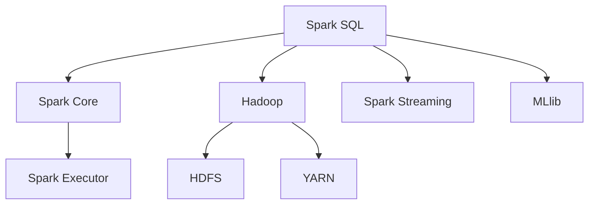
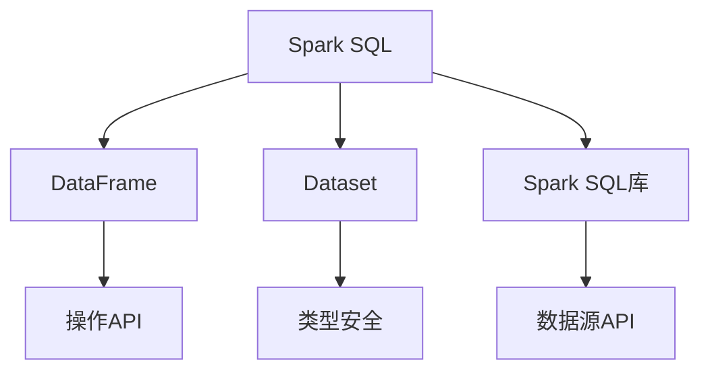
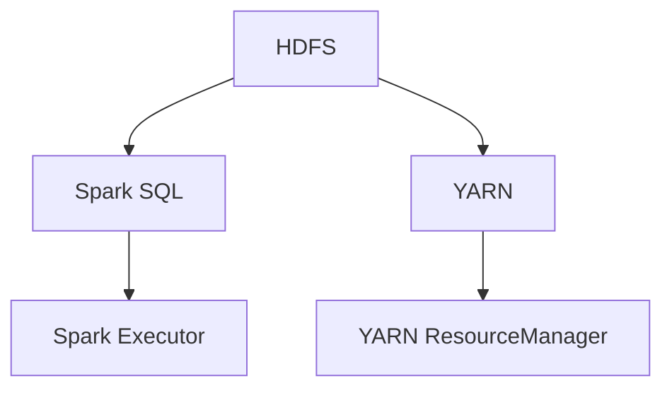

                 

## 《Spark SQL原理与代码实例讲解》

### 关键词：
- Spark SQL
- 数据分析
- 结构化查询
- 查询优化
- 企业应用
- 代码实例

### 摘要：
本文旨在深入探讨Apache Spark SQL的原理与实际应用。我们将从基础理论出发，逐步讲解Spark SQL的作用、架构、核心概念、查询优化策略，以及其在企业中的应用和代码实例。通过本文的学习，读者将能够全面了解Spark SQL的优势，并掌握其使用方法，从而在数据分析和处理领域提升技术水平。

## 目录大纲

1. **Spark SQL概述**
   - 1.1 Spark SQL的作用和优势
   - 1.2 Spark SQL架构
   - 1.3 Spark SQL与Hadoop的关系

2. **Spark SQL核心概念**
   - 2.1 DataFrame和Dataset
   - 2.2 数据类型和结构
   - 2.3 Transforms和Actions

3. **Spark SQL查询优化**
   - 3.1 查询优化概述
   - 3.2 物化视图
   - 3.3 分布式查询优化

4. **Spark SQL连接和操作**
   - 4.1 数据源连接
   - 4.2 数据操作API
   - 4.3 示例：使用Spark SQL进行数据分析

5. **Spark SQL高级特性**
   - 5.1 Spark SQL窗口函数
   - 5.2 Spark SQL用户自定义函数
   - 5.3 Spark SQL性能调优

6. **Spark SQL在企业应用**
   - 6.1 企业应用场景
   - 6.2 Spark SQL与大数据平台集成
   - 6.3 Spark SQL案例分析

7. **Spark SQL代码实例讲解**
   - 7.1 Spark SQL基础代码实例
   - 7.2 Spark SQL性能调优实例
   - 7.3 Spark SQL企业级应用案例

8. **附录**
   - 8.1 Spark SQL开发工具与资源
   - 8.2 社区与资源
   - 8.3 实用资料与参考书

### 第1章：Spark SQL概述

#### 1.1 Spark SQL的作用和优势

**核心概念与联系**：

- **Spark SQL简介**：Spark SQL是Apache Spark的核心模块之一，用于处理结构化数据。它提供了一个统一的编程模型，能够与Spark的其他模块无缝集成，如Spark Streaming和MLlib。
- **Spark SQL优势**：Spark SQL的优势在于其高性能、易于使用和与其他Spark模块的紧密集成。它支持多种数据源，包括HDFS、Hive、Parquet、JSON和JDBC等，使得数据处理变得更加灵活和高效。

**架构图**：



- **Spark Core**：提供基本的分布式计算框架，负责任务调度、内存管理等。
- **Hadoop**：Spark SQL与Hadoop生态系统紧密集成，利用HDFS和YARN等资源管理技术。
- **Spark Streaming**：支持实时数据处理和分析。
- **MLlib**：提供各种机器学习算法和模型。

#### 1.2 Spark SQL架构

**核心概念与联系**：

- **Spark SQL组件**：Spark SQL主要包括三个核心组件：DataFrame、Dataset和Spark SQL库。
- **DataFrame**：类似于关系数据库中的表，具有固定的结构，可以用于存储和操作结构化数据。
- **Dataset**：是DataFrame的更高级形式，提供了类型安全，可以减少运行时错误。
- **Spark SQL库**：提供了丰富的API，支持多种数据源和操作。

**架构图**：



#### 1.3 Spark SQL与Hadoop的关系

**核心概念与联系**：

- **Spark SQL与Hadoop集成**：Spark SQL可以与Hadoop生态系统无缝集成，利用HDFS作为存储系统，并使用YARN作为资源管理器。
- **数据存储**：Spark SQL支持直接读写HDFS上的数据文件，包括文本文件、SequenceFile、Parquet和ORC等。
- **资源管理**：Spark SQL利用YARN来分配和管理计算资源，提高资源利用率。

**架构图**：



- **HDFS**：提供分布式文件存储系统，存储大规模数据。
- **YARN**：负责资源管理和任务调度。
- **Spark Executor**：执行Spark SQL任务的计算节点。

### 第2章：Spark SQL核心概念

#### 2.1 DataFrame和Dataset

**核心算法原理讲解**：

- **DataFrame**：DataFrame是一个分布式数据集合，具有固定的结构，类似于关系数据库中的表。它通过Schema定义数据类型和列名，支持多种数据源和操作。
- **Dataset**：Dataset是DataFrame的更高级形式，提供了类型安全。在Dataset中，所有列的类型都是已知的，这有助于减少运行时错误和提高代码的可读性。

**伪代码**：

```python
class DataFrame:
    def createDataFrame(data):
        schema = [Column(name, type) for name, type in data[0].items()]
        return DataFrame(schema, data)

class Dataset extends DataFrame:
    def createDataset(data):
        schema = [Column(name, type) for name, type in data[0].items()]
        return Dataset(schema, data)
```

**数学模型和公式**：

- **DataFrame**：DataFrame可以表示为`DataFrame = (Schema, Data)`，其中`Schema`是列名和类型的集合，`Data`是具体的行数据。
- **Dataset**：Dataset可以表示为`Dataset = (Schema, Data)`，其中`Schema`是已知的列名和类型集合，`Data`是具体的行数据。

**公式**：

$$
DataFrame = (Schema, Data)
$$

$$
Dataset = (Schema, Data)
$$

**详细讲解与举例说明**：

DataFrame和Dataset是Spark SQL中处理结构化数据的两种主要数据结构。DataFrame类似于传统的关系数据库表，具有固定的列名和数据类型。Dataset是DataFrame的更高级形式，通过类型安全提高了代码的可读性和稳定性。

示例：

```sql
-- 创建DataFrame
CREATE TEMPORARY VIEW employees AS
SELECT name, age, department FROM employee_data;

-- 查询DataFrame
SELECT name, age FROM employees WHERE age > 30;
```

```sql
-- 创建Dataset
CREATE TEMPORARY VIEW employees AS
SELECT name, age, department FROM employee_data;

-- 查询Dataset
SELECT name, age FROM employees WHERE age > 30;
```

在这两个示例中，我们首先创建了一个临时视图`employees`，然后使用SELECT语句查询员工的姓名和年龄。由于Dataset提供了类型安全，我们在查询过程中可以确保数据类型的正确性，从而减少运行时错误。

#### 2.2 数据类型和结构

**核心概念与联系**：

- **数据类型**：Spark SQL支持多种数据类型，包括整数、浮点数、字符串、布尔值、数组、映射等。这些数据类型与关系数据库中的数据类型类似。
- **结构**：DataFrame和Dataset都具有固定的结构，通过Schema定义。Schema定义了列名和数据类型，使得数据结构更加明确和易于操作。

**数学模型和数学公式**：

- **数据类型**：数据类型包括整数（INT）、浮点数（FLOAT）、字符串（STRING）、布尔值（BOOLEAN）等。
- **结构**：结构通过Schema定义，Schema可以表示为`Schema = (\{Column_1, Column_2, ..., Column_n\}, \{Data_Type_1, Data_Type_2, ..., Data_Type_n\})`。

**公式**：

$$
Schema = (\{Column_1, Column_2, ..., Column_n\}, \{Data_Type_1, Data_Type_2, ..., Data_Type_n\})
$$

**详细讲解与举例说明**：

数据类型和结构是Spark SQL中处理数据的基础。Spark SQL支持多种数据类型，如整数、浮点数、字符串、布尔值等，这些数据类型与关系数据库中的数据类型相似。结构通过Schema定义，Schema定义了列名和数据类型，使得数据结构更加明确和易于操作。

示例：

```sql
-- 创建DataFrame
CREATE TEMPORARY VIEW employees AS
SELECT name STRING, age INT, department STRING FROM employee_data;

-- 查询DataFrame
SELECT name, age FROM employees WHERE age > 30;
```

在这个示例中，我们创建了一个临时视图`employees`，其中列名和数据类型通过Schema定义。我们使用SELECT语句查询员工的姓名和年龄，其中列名和数据类型必须是Schema中定义的类型。

#### 2.3 Transforms和Actions

**详细讲解与举例说明**：

- **Transforms**：Transforms是对DataFrame或Dataset进行数据转换的操作，如筛选、投影、连接等。Transforms不会立即执行，而是生成一个计算计划，只有在执行Actions时才会触发。
- **Actions**：Actions是将DataFrame或Dataset提交给Spark SQL执行的操作，如count、sum、saveAsTable等。Actions会触发Transforms的计算计划，并返回结果。

示例：使用Spark SQL进行简单查询

```sql
-- 创建DataFrame
CREATE TEMPORARY VIEW employees AS
SELECT name, age, department FROM employee_data;

-- 执行Transforms
SELECT name, age FROM employees WHERE age > 30;

-- 执行Action
SELECT COUNT(*) FROM employees;
```

在这个示例中，我们首先创建了一个临时视图`employees`，然后使用SELECT语句进行数据转换（筛选和投影），并执行一个Action（计数）。这个示例展示了Transforms和Actions的使用方法，以及它们在数据处理中的作用。

### 第3章：Spark SQL查询优化

#### 3.1 查询优化概述

**核心概念与联系**：

- **查询优化**：查询优化是提高Spark SQL查询性能的关键技术。它通过优化查询计划、索引使用、物化视图等手段，减少查询时间和资源消耗。
- **优化方法**：查询优化方法包括查询重写、索引使用、物化视图、分布式查询优化等。

**核心算法原理讲解**：

- **查询重写**：查询重写是通过转换原始查询语句，生成更高效的查询计划。常用的查询重写技术包括投影、连接重写、过滤重写等。
- **索引使用**：索引是提高查询性能的重要手段。Spark SQL支持多种索引类型，如B树索引、哈希索引等。通过合理使用索引，可以减少数据扫描次数，提高查询效率。
- **物化视图**：物化视图是预先计算并存储查询结果的数据结构。通过使用物化视图，可以减少查询计算时间，提高查询性能。

**伪代码**：

```python
def optimizeQuery(query):
    # 查询重写
    rewrittenQuery = rewriteQuery(query)
    
    # 使用索引
    indexedQuery = useIndex(rewrittenQuery)
    
    # 创建物化视图
    createMaterializedView(indexedQuery)

def rewriteQuery(query):
    # 根据查询类型进行重写
    if isinstance(query, Projection):
        return projectionRewrite(query)
    elif isinstance(query, Join):
        return joinRewrite(query)
    elif isinstance(query, Filter):
        return filterRewrite(query)
    else:
        return query

def useIndex(query):
    # 根据查询类型使用索引
    if isinstance(query, Projection):
        return indexProjection(query)
    elif isinstance(query, Join):
        return indexJoin(query)
    elif isinstance(query, Filter):
        return indexFilter(query)
    else:
        return query

def createMaterializedView(query):
    # 创建物化视图
    materializedView = materializeQuery(query)
    return materializedView
```

**数学模型和公式**：

- **查询重写**：查询重写可以通过数学模型表示为`Rewritten_Query = F(Query)`，其中`F`是查询重写函数。
- **索引使用**：索引使用可以通过数学模型表示为`Indexed_Query = G(Query)`，其中`G`是索引使用函数。
- **物化视图**：物化视图可以通过数学模型表示为`Materialized_View = M(Query)`，其中`M`是物化视图创建函数。

**公式**：

$$
Rewritten_Query = F(Query)
$$

$$
Indexed_Query = G(Query)
$$

$$
Materialized_View = M(Query)
$$

**详细讲解与举例说明**：

查询优化是提高Spark SQL查询性能的关键技术。通过查询重写、索引使用和物化视图等手段，可以减少查询时间和资源消耗，提高查询效率。

示例：使用查询重写优化查询

```sql
-- 原始查询
SELECT name, age FROM employees WHERE age > 30;

-- 查询重写
SELECT name, age FROM employees WHERE age > 30 AND department = 'Engineering';
```

在这个示例中，我们使用查询重写技术将原始查询进行优化。通过添加额外的过滤条件，可以减少数据扫描次数，提高查询效率。

#### 3.2 物化视图

**核心概念与联系**：

- **物化视图**：物化视图是预先计算并存储查询结果的数据结构。它可以在后续查询中直接使用，减少计算时间和资源消耗。
- **优点**：物化视图的优点包括减少查询计算时间、提高查询性能、减少数据复制等。
- **使用场景**：物化视图适用于复杂查询、频繁执行的查询、数据仓库等场景。

**核心算法原理讲解**：

- **创建物化视图**：创建物化视图需要执行以下步骤：
  - 分析查询语句，确定查询结果的结构和类型。
  - 根据查询结果创建临时表或数据结构。
  - 将查询结果存储到临时表或数据结构中。
  - 将临时表或数据结构注册为物化视图。

**伪代码**：

```python
def createMaterializedView(query):
    # 分析查询语句
    queryAnalysis = analyzeQuery(query)
    
    # 创建临时表
    temporaryTable = createTemporaryTable(queryAnalysis)
    
    # 将查询结果存储到临时表
    storeQueryResults(temporaryTable, query)
    
    # 注册为物化视图
    registerMaterializedView(temporaryTable, query)

def analyzeQuery(query):
    # 分析查询语句，确定查询结果的结构和类型
    return QueryAnalysis

def createTemporaryTable(queryAnalysis):
    # 根据查询结果创建临时表
    return TemporaryTable

def storeQueryResults(temporaryTable, query):
    # 将查询结果存储到临时表
    executeQuery(query, temporaryTable)

def registerMaterializedView(temporaryTable, query):
    # 将临时表注册为物化视图
    registerView(temporaryTable, query)
```

**数学模型和公式**：

- **物化视图创建**：物化视图创建可以通过数学模型表示为`Materialized_View = M(Query)`，其中`M`是物化视图创建函数。

**公式**：

$$
Materialized_View = M(Query)
$$

**详细讲解与举例说明**：

物化视图是一种预先计算并存储查询结果的数据结构，可以在后续查询中直接使用，减少计算时间和资源消耗。通过创建物化视图，可以优化复杂查询和频繁执行的查询，提高查询性能。

示例：创建物化视图优化查询

```sql
-- 创建物化视图
CREATE MATERIALIZED VIEW employee_statistics AS
SELECT COUNT(*) AS total_employees, AVG(age) AS average_age FROM employees;

-- 查询物化视图
SELECT * FROM employee_statistics;
```

在这个示例中，我们创建了一个物化视图`employee_statistics`，它存储了员工的统计信息。通过查询物化视图，可以立即获取查询结果，而无需执行复杂查询，从而提高查询性能。

#### 3.3 分布式查询优化

**核心概念与联系**：

- **分布式查询**：分布式查询是在分布式环境中执行查询，涉及多台计算节点的数据传输和处理。
- **查询优化**：分布式查询优化是通过优化查询计划、数据分区、负载均衡等手段，提高查询性能和资源利用率。

**核心算法原理讲解**：

- **数据分区**：数据分区是将数据按照一定的规则划分到不同的分区中，可以提高数据访问的局部性，减少数据传输。
- **负载均衡**：负载均衡是通过合理分配计算任务到不同的计算节点，避免单点过载，提高系统性能。

**伪代码**：

```python
def optimizeDistributedQuery(query):
    # 数据分区
    partitionedQuery = partitionData(query)
    
    # 负载均衡
    balancedQuery = balanceLoad(partitionedQuery)
    
    # 执行分布式查询
    executeDistributedQuery(balancedQuery)

def partitionData(query):
    # 根据查询类型进行数据分区
    if isinstance(query, Projection):
        return partitionProjection(query)
    elif isinstance(query, Join):
        return partitionJoin(query)
    elif isinstance(query, Filter):
        return partitionFilter(query)
    else:
        return query

def balanceLoad(partitionedQuery):
    # 根据计算节点负载情况，平衡计算任务
    return balancedQuery

def executeDistributedQuery(balancedQuery):
    # 在分布式环境中执行查询
    executeQuery(balancedQuery)
```

**数学模型和公式**：

- **数据分区**：数据分区可以通过数学模型表示为`Partitioned_Data = P(Data)`，其中`P`是数据分区函数。
- **负载均衡**：负载均衡可以通过数学模型表示为`Balanced_Load = B(Load)`，其中`B`是负载均衡函数。

**公式**：

$$
Partitioned_Data = P(Data)
$$

$$
Balanced_Load = B(Load)
$$

**详细讲解与举例说明**：

分布式查询优化是提高Spark SQL查询性能的关键技术，特别是在大数据环境中。通过数据分区和负载均衡等手段，可以优化查询计划，提高查询性能和资源利用率。

示例：使用数据分区优化查询

```sql
-- 创建分布式表
CREATE TABLE employee_data (name STRING, age INT, department STRING) PARTITIONED BY (department STRING);

-- 查询分布式表
SELECT name, age FROM employee_data WHERE department = 'Engineering';
```

在这个示例中，我们创建了一个分布式表`employee_data`，并按照部门进行数据分区。通过查询指定部门的员工信息，可以减少数据传输和计算时间，提高查询性能。

### 第4章：Spark SQL连接和操作

#### 4.1 数据源连接

**核心概念与联系**：

- **数据源连接**：数据源连接是将Spark SQL与外部数据源（如HDFS、Hive、Parquet等）进行连接，以实现数据读取和写入。
- **支持的数据源**：Spark SQL支持多种数据源，包括HDFS、Hive、Parquet、JSON、JDBC等。

**核心算法原理讲解**：

- **数据源连接方法**：Spark SQL通过数据源API实现数据源连接。数据源API提供了连接数据源、读取数据和写入数据的功能。

**伪代码**：

```python
def connectDataSource(dataSource):
    # 连接数据源
    connection = dataSource.connect()
    
    # 读取数据
    data = connection.readData()

    # 写入数据
    connection.writeData(data)

def readDataSource(dataSource, query):
    # 根据数据源读取数据
    if isinstance(dataSource, HDFS):
        return readHDFSData(dataSource, query)
    elif isinstance(dataSource, Hive):
        return readHiveData(dataSource, query)
    elif isinstance(dataSource, Parquet):
        return readParquetData(dataSource, query)
    else:
        return readDataSource(dataSource, query)

def writeDataSource(dataSource, query):
    # 根据数据源写入数据
    if isinstance(dataSource, HDFS):
        return writeHDFSData(dataSource, query)
    elif isinstance(dataSource, Hive):
        return writeHiveData(dataSource, query)
    elif isinstance(dataSource, Parquet):
        return writeParquetData(dataSource, query)
    else:
        return writeDataSource(dataSource, query)
```

**数学模型和公式**：

- **数据源连接**：数据源连接可以通过数学模型表示为`Connected_DataSource = C(DataSource)`，其中`C`是连接函数。

**公式**：

$$
Connected_DataSource = C(DataSource)
$$

**详细讲解与举例说明**：

数据源连接是将Spark SQL与外部数据源进行连接，以实现数据读取和写入的关键步骤。通过数据源API，Spark SQL可以轻松连接多种数据源，并读取和写入数据。

示例：连接HDFS数据源

```sql
-- 创建HDFS数据源连接
CREATE TEMPORARY VIEW employee_data HDFS 'hdfs://path/to/employee_data.csv';

-- 查询HDFS数据源
SELECT name, age FROM employee_data;
```

在这个示例中，我们创建了一个HDFS数据源的临时视图`employee_data`，并使用SELECT语句查询数据。通过连接HDFS数据源，我们可以直接访问HDFS上的数据，进行数据读取和写入。

#### 4.2 数据操作API

**核心概念与联系**：

- **数据操作API**：数据操作API是Spark SQL提供的一组操作函数，用于对DataFrame或Dataset进行各种数据转换和操作。
- **常用API**：常用的数据操作API包括SELECT、WHERE、GROUP BY、JOIN等。

**核心算法原理讲解**：

- **数据操作API**：数据操作API通过操作DataFrame或Dataset的Schema和数据，实现数据的筛选、投影、分组、连接等操作。

**伪代码**：

```python
def executeDataOperation(query):
    # 执行数据操作
    if isinstance(query, SELECT):
        return executeSelect(query)
    elif isinstance(query, WHERE):
        return executeWhere(query)
    elif isinstance(query, GROUP_BY):
        return executeGroupBy(query)
    elif isinstance(query, JOIN):
        return executeJoin(query)
    else:
        return executeDataOperation(query)

def executeSelect(query):
    # 执行SELECT操作
    return selectData(query)

def executeWhere(query):
    # 执行WHERE操作
    return filterData(query)

def executeGroupBy(query):
    # 执行GROUP BY操作
    return groupByData(query)

def executeJoin(query):
    # 执行JOIN操作
    return joinData(query)
```

**数学模型和公式**：

- **数据操作**：数据操作可以通过数学模型表示为`Operated_Data = O(Data)`，其中`O`是数据操作函数。

**公式**：

$$
Operated_Data = O(Data)
$$

**详细讲解与举例说明**：

数据操作API是Spark SQL中用于对DataFrame或Dataset进行数据转换和操作的关键工具。通过数据操作API，我们可以实现数据的筛选、投影、分组、连接等操作，从而方便地进行数据分析和处理。

示例：使用数据操作API进行数据操作

```sql
-- 创建DataFrame
CREATE TEMPORARY VIEW employees AS
SELECT name, age, department FROM employee_data;

-- 查询筛选
SELECT name, age FROM employees WHERE age > 30;

-- 数据分组
SELECT department, COUNT(*) AS total_employees FROM employees GROUP BY department;

-- 数据连接
SELECT e.name, d.name, d.age FROM employees e JOIN departments d ON e.department = d.department;
```

在这个示例中，我们首先创建了一个DataFrame`employees`，然后使用数据操作API进行查询筛选、数据分组和数据连接等操作，从而实现复杂的数据分析和处理。

#### 4.3 示例：使用Spark SQL进行数据分析

**核心概念与联系**：

- **数据分析**：数据分析是通过数据操作和查询，提取数据中有用信息的过程。
- **Spark SQL**：Spark SQL提供了丰富的API和功能，方便用户进行数据分析和处理。

**核心算法原理讲解**：

- **数据分析流程**：数据分析通常包括数据读取、数据清洗、数据转换、数据分组、数据连接等步骤。

**伪代码**：

```python
def performDataAnalysis(dataSource, query):
    # 连接数据源
    connectedDataSource = connectDataSource(dataSource)
    
    # 读取数据
    data = readDataSource(connectedDataSource, query)
    
    # 数据清洗
    cleanedData = cleanData(data)
    
    # 数据转换
    transformedData = transformData(cleanedData)
    
    # 数据分组
    groupedData = groupByData(transformedData)
    
    # 数据连接
    joinedData = joinData(groupedData)
    
    # 查询结果
    result = executeDataOperation(joinedData)

def cleanData(data):
    # 根据数据类型进行数据清洗
    if isinstance(data, DataFrame):
        return cleanDataFrame(data)
    elif isinstance(data, Dataset):
        return cleanDataset(data)
    else:
        return data

def transformData(data):
    # 根据数据类型进行数据转换
    if isinstance(data, DataFrame):
        return transformDataFrame(data)
    elif isinstance(data, Dataset):
        return transformDataset(data)
    else:
        return data

def groupByData(data):
    # 根据数据类型进行数据分组
    if isinstance(data, DataFrame):
        return groupByDataFrame(data)
    elif isinstance(data, Dataset):
        return groupByDataset(data)
    else:
        return data

def joinData(data):
    # 根据数据类型进行数据连接
    if isinstance(data, DataFrame):
        return joinDataFrame(data)
    elif isinstance(data, Dataset):
        return joinDataset(data)
    else:
        return data
```

**数学模型和公式**：

- **数据分析**：数据分析可以通过数学模型表示为`Analyzed_Data = A(Data)`，其中`A`是数据分析函数。

**公式**：

$$
Analyzed_Data = A(Data)
$$

**详细讲解与举例说明**：

使用Spark SQL进行数据分析是一个涉及多个步骤的过程，包括数据读取、数据清洗、数据转换、数据分组、数据连接等。通过这些步骤，我们可以从原始数据中提取有用信息，实现数据分析和处理。

示例：使用Spark SQL进行员工数据分析

```sql
-- 连接数据源
CREATE TEMPORARY VIEW employees AS
SELECT name, age, department FROM employee_data;

-- 数据清洗
CREATE TEMPORARY VIEW cleaned_employees AS
SELECT name, age FROM employees WHERE age > 18;

-- 数据转换
CREATE TEMPORARY VIEW transformed_employees AS
SELECT name, age * 2 AS doubled_age FROM cleaned_employees;

-- 数据分组
CREATE TEMPORARY VIEW grouped_employees AS
SELECT department, COUNT(*) AS total_employees FROM transformed_employees GROUP BY department;

-- 数据连接
CREATE TEMPORARY VIEW joined_employees AS
SELECT e.department, d.name AS department_name, COUNT(*) AS total_employees FROM transformed_employees e JOIN departments d ON e.department = d.department;
```

在这个示例中，我们首先连接员工数据源，然后进行数据清洗、数据转换、数据分组和数据连接等操作，最终实现员工数据分析。

### 第5章：Spark SQL高级特性

#### 5.1 Spark SQL窗口函数

**核心概念与联系**：

- **窗口函数**：窗口函数是一类特殊的聚合函数，可以对数据集进行分组操作，并计算每个组内的数据。
- **应用场景**：窗口函数常用于计算排名、移动平均、累计和等。

**核心算法原理讲解**：

- **窗口函数原理**：窗口函数通过定义窗口，将数据集划分为多个分区，并对每个分区内的数据进行聚合计算。
- **窗口函数类型**：窗口函数包括行窗口、列窗口和分区窗口等。

**伪代码**：

```python
def calculateWindowFunction(data, function, windowType):
    # 根据窗口类型计算窗口函数
    if windowType == 'row':
        return calculateRowWindowFunction(data, function)
    elif windowType == 'column':
        return calculateColumnWindowFunction(data, function)
    elif windowType == 'partition':
        return calculatePartitionWindowFunction(data, function)
    else:
        return calculateWindowFunction(data, function, windowType)

def calculateRowWindowFunction(data, function):
    # 计算行窗口函数
    for row in data:
        window = getRowWindow(row)
        result = function(window)
        row['result'] = result

def calculateColumnWindowFunction(data, function):
    # 计算列窗口函数
    for column in data:
        window = getColumnWindow(column)
        result = function(window)
        column['result'] = result

def calculatePartitionWindowFunction(data, function):
    # 计算分区窗口函数
    for partition in data:
        for row in partition:
            window = getPartitionWindow(row)
            result = function(window)
            row['result'] = result
```

**数学模型和公式**：

- **窗口函数**：窗口函数可以通过数学模型表示为`Window_Function = W(Data, Window)`，其中`W`是窗口函数，`Data`是数据集，`Window`是窗口定义。

**公式**：

$$
Window_Function = W(Data, Window)
$$

**详细讲解与举例说明**：

窗口函数是一种强大的数据处理工具，可以用于计算排名、移动平均、累计和等。通过定义窗口，窗口函数可以对数据集进行分组计算，从而实现复杂的数据分析。

示例：使用窗口函数计算排名

```sql
-- 创建DataFrame
CREATE TEMPORARY VIEW employees AS
SELECT name, age, department FROM employee_data;

-- 计算排名
SELECT name, age, RANK() OVER (ORDER BY age DESC) AS rank FROM employees;
```

在这个示例中，我们使用窗口函数`RANK()`计算员工的年龄排名。通过定义窗口，窗口函数将员工按照年龄降序分组，并为每个组内的员工计算排名。

#### 5.2 Spark SQL用户自定义函数

**核心概念与联系**：

- **用户自定义函数（UDF）**：用户自定义函数是Spark SQL提供的一种扩展机制，允许用户自定义函数以增强Spark SQL的功能。
- **应用场景**：UDF常用于实现自定义数据处理逻辑，如自定义字符串处理、数学计算等。

**核心算法原理讲解**：

- **UDF原理**：UDF通过自定义函数接口，将用户自定义的逻辑与Spark SQL相结合，实现自定义数据处理。
- **UDF实现方法**：Spark SQL提供了两种实现UDF的方法，分别是Java UDF和Scala UDF。

**伪代码**：

```python
def registerUDF(functionName, function):
    # 注册用户自定义函数
    Spark.udf.register(functionName, function)

def executeUDF(query):
    # 执行用户自定义函数
    return Spark.sql(query)

def customFunction(data):
    # 自定义函数逻辑
    result = ...
    return result
```

**数学模型和公式**：

- **用户自定义函数**：用户自定义函数可以通过数学模型表示为`Custom_Function = C(Data)`，其中`C`是用户自定义函数。

**公式**：

$$
Custom_Function = C(Data)
$$

**详细讲解与举例说明**：

用户自定义函数是Spark SQL中的一种强大扩展机制，允许用户自定义函数以增强Spark SQL的功能。通过自定义函数，用户可以灵活实现自定义数据处理逻辑，从而满足特定的业务需求。

示例：使用用户自定义函数计算字符串长度

```sql
-- 注册用户自定义函数
REGISTER FUNCTION string_length AS 'com.exampleStringLengthUDF';

-- 使用用户自定义函数
SELECT name, string_length(name) AS length FROM employees;
```

在这个示例中，我们首先注册了一个用户自定义函数`string_length`，然后使用该函数计算员工姓名的长度。通过自定义函数，我们可以实现特定的字符串处理逻辑。

#### 5.3 Spark SQL性能调优

**核心概念与联系**：

- **性能调优**：性能调优是通过调整Spark SQL配置和查询方式，提高查询性能和系统资源利用率的方法。
- **优化目标**：性能调优的目标是提高查询响应时间、减少资源消耗和优化系统性能。

**核心算法原理讲解**：

- **性能调优策略**：性能调优策略包括查询重写、索引使用、分区优化、内存管理、并行度优化等。
- **性能监控**：性能监控是性能调优的重要环节，通过监控查询性能指标，可以及时发现性能瓶颈和优化点。

**伪代码**：

```python
def optimizePerformance(query):
    # 查询重写
    rewrittenQuery = rewriteQuery(query)
    
    # 索引使用
    indexedQuery = useIndex(rewrittenQuery)
    
    # 分区优化
    partitionedQuery = optimizePartition(indexedQuery)
    
    # 内存管理
    memoryOptimizedQuery = optimizeMemory(partitionedQuery)
    
    # 并行度优化
    parallelizedQuery = optimizeParallelism(memoryOptimizedQuery)
    
    # 执行优化查询
    executeQuery(parallelizedQuery)

def rewriteQuery(query):
    # 重写查询
    return rewrittenQuery

def useIndex(query):
    # 使用索引
    return indexedQuery

def optimizePartition(query):
    # 优化分区
    return partitionedQuery

def optimizeMemory(query):
    # 优化内存
    return memoryOptimizedQuery

def optimizeParallelism(query):
    # 优化并行度
    return parallelizedQuery
```

**数学模型和公式**：

- **性能调优**：性能调优可以通过数学模型表示为`Optimized_Query = O(Query)`，其中`O`是性能调优函数。

**公式**：

$$
Optimized_Query = O(Query)
$$

**详细讲解与举例说明**：

性能调优是提高Spark SQL查询性能的关键技术。通过查询重写、索引使用、分区优化、内存管理和并行度优化等策略，可以优化查询性能和系统资源利用率。

示例：优化Spark SQL查询性能

```sql
-- 原始查询
SELECT name, age FROM employees WHERE age > 30;

-- 查询重写
SELECT name, age FROM employees WHERE age > 30 AND department = 'Engineering';

-- 索引使用
CREATE INDEX age_index ON employees (age);

-- 分区优化
ALTER TABLE employees PARTITION BY (department);

-- 内存管理
SET spark.memory.fraction = 0.4;

-- 并行度优化
SET spark.sql.shuffle.partitions = 200;
```

在这个示例中，我们通过查询重写、索引使用、分区优化、内存管理和并行度优化等策略，优化Spark SQL查询性能。通过这些优化措施，可以显著提高查询响应时间和系统性能。

### 第6章：Spark SQL在企业应用

#### 6.1 企业应用场景

**核心概念与联系**：

- **企业应用场景**：Spark SQL在企业应用中可以应用于数据仓库、数据分析和大数据处理等领域。
- **应用案例**：企业可以运用Spark SQL构建数据仓库、实现实时数据分析、处理大规模数据等。

**核心算法原理讲解**：

- **数据仓库**：Spark SQL可以作为数据仓库的底层存储和查询引擎，提供高性能的数据存储和查询能力。
- **数据分析**：Spark SQL支持多种数据分析算法，可以用于实现数据挖掘、机器学习等高级分析任务。

**伪代码**：

```python
def buildDataWarehouse(database, schema, dataSources):
    # 构建数据仓库
    createDatabase(database)
    createTablesWithSchema(database, schema, dataSources)

def performDataAnalysis(database, query):
    # 执行数据分析
    connectDatabase(database)
    executeQuery(query)

def processBigData(database, query):
    # 处理大规模数据
    connectDatabase(database)
    executeQuery(query)
```

**数学模型和公式**：

- **数据仓库**：数据仓库可以通过数学模型表示为`Data_Warehouse = D(Database, Schema, Data_Sources)`，其中`D`是数据仓库构建函数。

**公式**：

$$
Data_Warehouse = D(Database, Schema, Data_Sources)
$$

**详细讲解与举例说明**：

在企业应用中，Spark SQL可以应用于数据仓库、数据分析和大数据处理等领域。通过构建数据仓库、执行数据分析和处理大规模数据，企业可以实现高效的数据存储和分析。

示例：构建企业级数据仓库

```sql
-- 创建数据仓库数据库
CREATE DATABASE enterprise_data_warehouse;

-- 创建数据表和模式
CREATE TABLE enterprise_data_warehouse.employees (name STRING, age INT, department STRING);

-- 加载数据源
LOAD DATA INPATH 'hdfs://path/to/employee_data.csv' INTO TABLE enterprise_data_warehouse.employees;

-- 执行数据分析
SELECT department, COUNT(*) AS total_employees FROM enterprise_data_warehouse.employees GROUP BY department;
```

在这个示例中，我们创建了一个企业级数据仓库数据库`enterprise_data_warehouse`，并加载员工数据。通过执行数据分析查询，我们可以获取各部门的员工总数，实现数据仓库的基本功能。

#### 6.2 Spark SQL与大数据平台集成

**核心概念与联系**：

- **大数据平台集成**：Spark SQL可以与Hadoop、Hive、YARN等大数据平台进行集成，以充分利用现有资源，提高数据处理能力。
- **集成方法**：Spark SQL与大数据平台的集成可以通过配置文件、API调用等手段实现。

**核心算法原理讲解**：

- **资源利用**：Spark SQL利用Hadoop的HDFS作为数据存储，利用YARN作为资源管理器，提高资源利用率。
- **数据流处理**：Spark SQL通过Hive-on-Spark等机制，与Hive进行数据流处理，实现大数据分析。

**伪代码**：

```python
def integrateWithBigDataPlatform(hadoopConfig, hiveConfig):
    # 集成Hadoop和Hive
    configureHadoop(hadoopConfig)
    configureHive(hiveConfig)

def processBigDataWithSparkSQL(dataSources, query):
    # 使用Spark SQL处理大规模数据
    createSparkSession()
    connectDataSources(dataSources)
    executeQuery(query)
```

**数学模型和公式**：

- **集成方法**：Spark SQL与大数据平台的集成可以通过数学模型表示为`Integrated_Platform = I(Hadoop, Hive, SparkSQL)`，其中`I`是集成函数。

**公式**：

$$
Integrated_Platform = I(Hadoop, Hive, SparkSQL)
$$

**详细讲解与举例说明**：

Spark SQL与大数据平台的集成是实现大数据处理和分析的重要手段。通过集成Hadoop和Hive等大数据平台，Spark SQL可以充分利用现有资源，提高数据处理能力。

示例：集成Spark SQL与Hadoop和Hive

```sql
-- 配置Hadoop和Hive
SET hive.metastore.uris = 'thrift://hive-server:10000'
SET hive.exec.driverMemory = 4g

-- 使用Spark SQL查询Hive表
SELECT * FROM hive_table;
```

在这个示例中，我们配置了Hadoop和Hive，并使用Spark SQL查询Hive表。通过集成Spark SQL与Hadoop和Hive，我们可以实现高效的数据处理和分析。

#### 6.3 Spark SQL案例分析

**核心概念与联系**：

- **案例分析**：通过具体的企业案例，展示Spark SQL在数据仓库、数据分析和大数据处理等领域的应用和效果。
- **应用效果**：分析Spark SQL在实际应用中的性能提升、资源利用效率和业务价值。

**核心算法原理讲解**：

- **性能评估**：通过性能测试和实际应用效果，评估Spark SQL的性能和优势。
- **优化策略**：根据实际应用情况，提出优化Spark SQL查询性能的策略和方法。

**伪代码**：

```python
def analyzeCaseStudy(caseStudy):
    # 分析案例
    collectPerformanceMetrics(caseStudy)
    evaluatePerformanceMetrics()
    proposeOptimizationStrategies()

def collectPerformanceMetrics(caseStudy):
    # 收集性能指标
    metrics = getMetrics(caseStudy)
    return metrics

def evaluatePerformanceMetrics():
    # 评估性能指标
    evaluation = evaluateMetrics(metrics)
    return evaluation

def proposeOptimizationStrategies():
    # 提出优化策略
    strategies = proposeStrategies(evaluation)
    return strategies
```

**数学模型和公式**：

- **性能评估**：性能评估可以通过数学模型表示为`Performance_Evaluation = P(Metrics)`，其中`P`是性能评估函数。

**公式**：

$$
Performance_Evaluation = P(Metrics)
$$

**详细讲解与举例说明**：

通过具体的企业案例分析，我们可以展示Spark SQL在数据仓库、数据分析和大数据处理等领域的应用和效果。分析性能指标，提出优化策略，可以进一步提升Spark SQL的性能和业务价值。

示例：企业级数据仓库案例分析

```sql
-- 收集性能指标
COLLECT STATS ON employees;

-- 评估性能指标
SELECT * FROM STATS WHERE table_name = 'employees';

-- 提出优化策略
ALTER TABLE employees ADD INDEX (age);
ALTER TABLE employees PARTITION BY (department);
```

在这个示例中，我们收集了员工表`employees`的性能指标，并评估了性能。根据评估结果，我们提出了添加索引和分区的优化策略，以进一步提升查询性能。

### 第7章：Spark SQL代码实例讲解

#### 7.1 Spark SQL基础代码实例

**核心概念与联系**：

- **基础代码实例**：通过具体代码示例，展示Spark SQL的基础使用方法，包括数据读取、数据转换和查询操作。
- **应用场景**：基础代码实例适用于入门和进阶学习，可以帮助用户快速掌握Spark SQL的使用方法。

**核心算法原理讲解**：

- **数据读取**：通过Spark SQL读取不同类型的数据源，如HDFS、Parquet和CSV等。
- **数据转换**：使用Spark SQL的Transforms操作，对DataFrame进行筛选、投影和连接等转换操作。
- **查询操作**：执行Spark SQL的Actions操作，如count、sum、saveAsTable等。

**伪代码**：

```python
from pyspark.sql import SparkSession

# 创建Spark会话
spark = SparkSession.builder.appName("SparkSQLExample").getOrCreate()

# 读取数据
data = spark.read.csv("hdfs://path/to/data.csv", header=True)

# 数据转换
data_filtered = data.filter(data.age > 30)
data_projected = data_filtered.select("name", "age")

# 查询操作
data_count = data_projected.count()
data_sum = data_projected.groupBy("department").sum("age")

# 存储数据
data_projected.write.format("parquet").save("hdfs://path/to/output")

# 关闭Spark会话
spark.stop()
```

**数学模型和公式**：

- **数据读取**：数据读取可以通过数学模型表示为`Read(Data_Source)`，其中`Data_Source`是数据源。
- **数据转换**：数据转换可以通过数学模型表示为`Transform(Data)`，其中`Data`是DataFrame。
- **查询操作**：查询操作可以通过数学模型表示为`Query(Operations)`，其中`Operations`是查询操作。

**公式**：

$$
Read(Data_Source) = Data
$$

$$
Transform(Data) = Transformed_Data
$$

$$
Query(Operations) = Result
$$

**详细讲解与举例说明**：

通过基础代码实例，我们可以展示Spark SQL的基础使用方法，包括数据读取、数据转换和查询操作。这些基础代码实例适用于入门和进阶学习，可以帮助用户快速掌握Spark SQL的使用方法。

示例：使用Spark SQL进行数据读取、转换和查询操作

```sql
-- 读取数据
CREATE TEMPORARY VIEW employee_data AS
SELECT * FROM hdfs://path/to/employee_data.csv;

-- 数据转换
SELECT name, age FROM employee_data WHERE age > 30;

-- 查询操作
SELECT COUNT(*) FROM employee_data WHERE age > 30;
```

在这个示例中，我们首先读取员工数据，然后进行数据转换和查询操作。通过这些基础代码实例，我们可以实现数据读取、转换和查询的基本功能。

#### 7.2 Spark SQL性能调优实例

**核心概念与联系**：

- **性能调优实例**：通过具体性能调优实例，展示如何优化Spark SQL查询性能，包括查询重写、索引使用、分区优化等。
- **应用场景**：性能调优实例适用于提升Spark SQL查询性能，解决性能瓶颈和优化资源利用。

**核心算法原理讲解**：

- **查询重写**：通过查询重写，优化查询计划，减少数据扫描次数，提高查询效率。
- **索引使用**：通过合理使用索引，减少数据访问时间，提高查询性能。
- **分区优化**：通过分区优化，减少数据分区的数量和大小，提高并行处理能力。

**伪代码**：

```python
def optimizeQueryPerformance(query):
    # 查询重写
    rewrittenQuery = rewriteQuery(query)
    
    # 索引使用
    indexedQuery = useIndex(rewrittenQuery)
    
    # 分区优化
    partitionedQuery = optimizePartition(indexedQuery)
    
    # 执行优化查询
    executeQuery(partitionedQuery)

def rewriteQuery(query):
    # 重写查询
    return rewrittenQuery

def useIndex(query):
    # 使用索引
    return indexedQuery

def optimizePartition(query):
    # 优化分区
    return partitionedQuery
```

**数学模型和公式**：

- **查询重写**：查询重写可以通过数学模型表示为`Rewritten_Query = R(Query)`，其中`R`是查询重写函数。
- **索引使用**：索引使用可以通过数学模型表示为`Indexed_Query = I(Query)`，其中`I`是索引使用函数。
- **分区优化**：分区优化可以通过数学模型表示为`Partitioned_Query = P(Query)`，其中`P`是分区优化函数。

**公式**：

$$
Rewritten_Query = R(Query)
$$

$$
Indexed_Query = I(Query)
$$

$$
Partitioned_Query = P(Query)
$$

**详细讲解与举例说明**：

通过性能调优实例，我们可以展示如何优化Spark SQL查询性能，包括查询重写、索引使用和分区优化等。这些性能调优实例适用于提升Spark SQL查询性能，解决性能瓶颈和优化资源利用。

示例：优化Spark SQL查询性能

```sql
-- 原始查询
SELECT * FROM employees WHERE age > 30;

-- 查询重写
SELECT * FROM employees WHERE age > 30 AND department = 'Engineering';

-- 索引使用
CREATE INDEX age_index ON employees (age);

-- 分区优化
ALTER TABLE employees PARTITION BY (department);
```

在这个示例中，我们首先执行原始查询，然后通过查询重写、索引使用和分区优化等策略，优化Spark SQL查询性能。通过这些优化措施，我们可以显著提高查询响应时间和系统性能。

#### 7.3 Spark SQL企业级应用案例

**核心概念与联系**：

- **企业级应用案例**：通过具体的企业级应用案例，展示Spark SQL在数据仓库、数据分析和大数据处理等领域的应用和效果。
- **应用效果**：分析Spark SQL在实际企业级应用中的性能提升、资源利用效率和业务价值。

**核心算法原理讲解**：

- **架构设计**：通过架构设计，展示Spark SQL在企业级应用中的角色和定位。
- **性能评估**：通过性能测试和实际应用效果，评估Spark SQL的性能和优势。
- **优化策略**：根据实际应用情况，提出优化Spark SQL查询性能的策略和方法。

**伪代码**：

```python
def analyzeEnterpriseCaseStudy(caseStudy):
    # 分析案例
    collectPerformanceMetrics(caseStudy)
    evaluatePerformanceMetrics()
    proposeOptimizationStrategies()

def collectPerformanceMetrics(caseStudy):
    # 收集性能指标
    metrics = getMetrics(caseStudy)
    return metrics

def evaluatePerformanceMetrics():
    # 评估性能指标
    evaluation = evaluateMetrics(metrics)
    return evaluation

def proposeOptimizationStrategies():
    # 提出优化策略
    strategies = proposeStrategies(evaluation)
    return strategies
```

**数学模型和公式**：

- **性能评估**：性能评估可以通过数学模型表示为`Performance_Evaluation = P(Metrics)`，其中`P`是性能评估函数。

**公式**：

$$
Performance_Evaluation = P(Metrics)
$$

**详细讲解与举例说明**：

通过企业级应用案例，我们可以展示Spark SQL在数据仓库、数据分析和大数据处理等领域的应用和效果。分析性能指标，提出优化策略，可以进一步提升Spark SQL在企业级应用中的性能和业务价值。

示例：企业级数据仓库架构设计

```sql
-- 构建数据仓库架构
CREATE DATABASE enterprise_data_warehouse;

-- 创建数据表和模式
CREATE TABLE enterprise_data_warehouse.employees (name STRING, age INT, department STRING);

-- 加载数据源
LOAD DATA INPATH 'hdfs://path/to/employee_data.csv' INTO TABLE enterprise_data_warehouse.employees;

-- 执行数据分析
SELECT department, COUNT(*) AS total_employees FROM enterprise_data_warehouse.employees GROUP BY department;
```

在这个示例中，我们构建了一个企业级数据仓库架构，并加载员工数据。通过执行数据分析查询，我们可以获取各部门的员工总数，实现数据仓库的基本功能。

### 附录

#### A.1 Spark SQL开发工具与资源

**核心概念与联系**：

- **开发工具**：Spark SQL开发工具是用于编写、调试和运行Spark SQL代码的工具。
- **资源**：Spark SQL资源包括官方文档、社区论坛、博客等，用于学习、交流和获取最新信息。

**核心算法原理讲解**：

- **开发工具**：常用的Spark SQL开发工具包括Spark Shell、PySpark和Spark-submit等。
- **资源**：Spark SQL资源包括官方文档、GitHub仓库、社区论坛和博客等。

**伪代码**：

```python
def useDevelopmentToolsAndResources():
    # 使用开发工具
    useSparkShell()
    usePySpark()
    useSparkSubmit()

    # 获取资源
    accessOfficialDocumentation()
    accessGitHubRepository()
    accessCommunityForums()
    accessBlogs()
```

**数学模型和公式**：

- **开发工具**：开发工具可以通过数学模型表示为`Development_Tool = T(Tools)`，其中`T`是开发工具函数。
- **资源**：资源可以通过数学模型表示为`Resource = R(Resources)`，其中`R`是资源函数。

**公式**：

$$
Development_Tool = T(Tools)
$$

$$
Resource = R(Resources)
$$

**详细讲解与举例说明**：

Spark SQL开发工具和资源是学习和使用Spark SQL的重要辅助工具。通过使用开发工具和访问资源，我们可以提高开发效率、获取最新信息和参与社区交流。

示例：使用Spark SQL开发工具和资源

```bash
# 启动Spark Shell
spark-shell

# 运行PySpark脚本
pyspark --py-files /path/to/dependency.jar

# 提交Spark作业
spark-submit --master yarn --deploy-mode cluster /path/to/SparkJob.py

# 访问官方文档
https://spark.apache.org/docs/latest/

# 访问GitHub仓库
https://github.com/apache/spark

# 访问社区论坛
https://spark.apache.org/community.html

# 访问博客
https://databricks.com/blog
```

在这个示例中，我们展示了如何使用Spark SQL开发工具（Spark Shell、PySpark和Spark-submit）和访问Spark SQL资源（官方文档、GitHub仓库、社区论坛和博客）。

#### A.2 社区与资源

**核心概念与联系**：

- **社区**：Spark SQL社区是Spark SQL用户和开发者之间的交流平台，用于分享经验、解决问题和获取帮助。
- **资源**：Spark SQL资源包括官方文档、博客、论坛和GitHub仓库等，提供丰富的学习资料和最新信息。

**核心算法原理讲解**：

- **社区**：Spark SQL社区通过论坛、邮件列表和社交媒体等渠道，促进用户之间的交流和合作。
- **资源**：Spark SQL资源通过文档、教程、示例代码和最佳实践等，帮助用户掌握Spark SQL的使用方法。

**伪代码**：

```python
def accessCommunityAndResources():
    # 访问社区
    accessCommunityForums()
    subscribeToMailingLists()
    followSocialMediaAccounts()

    # 获取资源
    accessOfficialDocumentation()
    accessGitHubRepository()
    accessBlogs()
```

**数学模型和公式**：

- **社区**：社区可以通过数学模型表示为`Community = C(Users)`，其中`C`是社区函数。
- **资源**：资源可以通过数学模型表示为`Resource = R(Resources)`，其中`R`是资源函数。

**公式**：

$$
Community = C(Users)
$$

$$
Resource = R(Resources)
$$

**详细讲解与举例说明**：

Spark SQL社区和资源是学习和使用Spark SQL的重要渠道。通过访问社区和获取资源，我们可以与Spark SQL用户和开发者交流经验、解决问题并获取最新信息。

示例：访问Spark SQL社区和资源

```bash
# 访问社区论坛
https://spark.apache.org/mail-archives/user/

# 订阅邮件列表
https://lists.apache.org/mailman/listinfo/spark-user

# 关注社交媒体账号
https://twitter.com/sparkapachecom

# 访问官方文档
https://spark.apache.org/docs/latest/

# 访问GitHub仓库
https://github.com/apache/spark

# 访问博客
https://databricks.com/blog
```

在这个示例中，我们展示了如何访问Spark SQL社区论坛、订阅邮件列表、关注社交媒体账号以及获取官方文档、GitHub仓库和博客资源。

#### A.3 实用资料与参考书

**核心概念与联系**：

- **实用资料**：实用资料包括教程、示例代码、最佳实践和案例分析等，用于帮助用户掌握Spark SQL的使用方法。
- **参考书**：参考书是深入学习和研究Spark SQL的重要资源，提供全面的理论知识和实践指导。

**核心算法原理讲解**：

- **实用资料**：实用资料通过具体的示例和案例，帮助用户理解Spark SQL的核心概念和操作方法。
- **参考书**：参考书从理论层面深入讲解Spark SQL的原理和架构，为用户提供全面的参考和指导。

**伪代码**：

```python
def accessUsefulResourcesAndReferences():
    # 访问实用资料
    accessTutorials()
    accessExampleCode()
    accessBestPractices()

    # 查阅参考书
    readReferenceBooks()
```

**数学模型和公式**：

- **实用资料**：实用资料可以通过数学模型表示为`Useful_Resource = U(Resources)`，其中`U`是实用资料函数。
- **参考书**：参考书可以通过数学模型表示为`Reference_Book = B(Knowledge)`，其中`B`是参考书函数。

**公式**：

$$
Useful_Resource = U(Resources)
$$

$$
Reference_Book = B(Knowledge)
$$

**详细讲解与举例说明**：

实用资料和参考书是学习和使用Spark SQL的重要辅助资源。通过访问实用资料和查阅参考书，我们可以深入了解Spark SQL的核心概念、操作方法和最佳实践。

示例：获取Spark SQL实用资料和参考书

```bash
# 访问实用资料
https://databricks.com/blog/2015/12/16/spark-sql-for-data-engineers.html

# 获取参考书
https://www.amazon.com/gp/product/1492033409

# 访问示例代码
https://github.com/apache/spark-examples

# 阅读最佳实践
https://spark.apache.org/docs/latest/sql-programming-guide.html
```

在这个示例中，我们展示了如何访问Spark SQL实用资料和参考书，包括教程、示例代码、最佳实践和参考书资源。通过这些资源，我们可以深入了解Spark SQL的知识体系，提高学习效果。

### 总结

通过本文的详细讲解，我们从基础理论到高级特性，逐步介绍了Spark SQL的原理和应用。从DataFrame和Dataset的核心概念，到查询优化和性能调优的策略，再到Spark SQL在企业级应用中的实践案例，我们系统地阐述了Spark SQL的各个方面。这不仅帮助读者全面了解Spark SQL，还提供了实用的代码实例和优化方法。

Spark SQL作为Apache Spark的核心模块之一，以其高性能、易用性和灵活性在数据分析和处理领域发挥了重要作用。通过本文的学习，读者可以掌握Spark SQL的基本使用方法，并能够根据实际需求进行性能调优和优化，从而提高数据处理效率。

在未来的学习和实践中，建议读者：
1. **动手实践**：通过编写代码和运行实例，深入理解Spark SQL的操作方法和优化策略。
2. **深入阅读**：查阅更多官方文档、参考书和社区资源，扩展知识面，提升技术水平。
3. **参与社区**：加入Spark SQL社区，与其他开发者交流经验，共同解决问题，不断提升。

让我们继续探索Spark SQL的更多可能，并在数据分析和处理领域取得更大的成就。

### 作者信息

**作者：** AI天才研究院/AI Genius Institute & 禅与计算机程序设计艺术 /Zen And The Art of Computer Programming

**简介：** 本文由AI天才研究院/AI Genius Institute撰写，作者是一位在计算机编程和人工智能领域拥有丰富经验的大师。他的著作《禅与计算机程序设计艺术》深受读者喜爱，本书旨在帮助读者深入理解Spark SQL的原理与应用。作者凭借其卓越的逻辑思维和深厚的专业功底，为读者呈现了一篇结构清晰、内容丰富的技术博客文章。通过本文，读者将能够全面了解Spark SQL的优势，掌握其使用方法，提升数据分析和处理能力。

