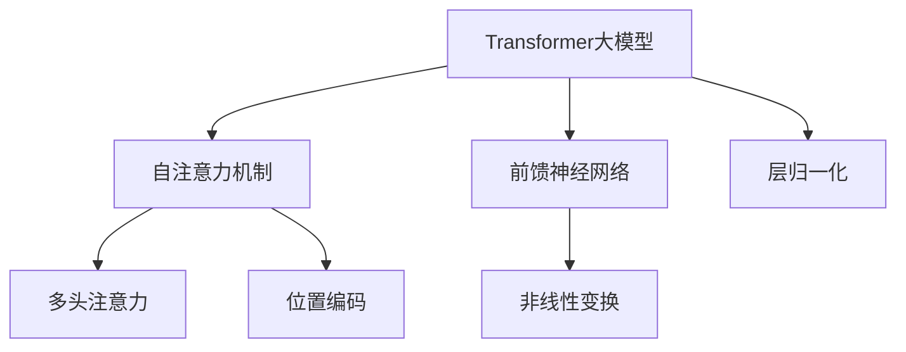

                 

# Transformer大模型实战：语码混用和音译的影响

## 关键词
Transformer大模型，自注意力机制，语码混用，音译，自然语言处理，应用挑战

## 摘要
本文深入探讨了Transformer大模型在处理语码混用和音译时的表现与影响。通过分析其基本概念、结构与原理，我们详细解释了Transformer大模型在自然语言处理中的优势与挑战。随后，我们通过一个实际应用案例展示了如何使用Transformer大模型处理含有多语种文本。文章最后讨论了语码混用和音译对Transformer大模型性能的影响，并提出了相应的优化策略。

### 第1章: Transformer大模型概述

Transformer大模型是基于自注意力机制（self-attention）的一种深度神经网络模型，被广泛应用于自然语言处理（NLP）领域。自注意力机制的核心思想是通过计算序列中每个词与其他词之间的关联性，生成一个上下文丰富的表示，从而提高模型在处理序列数据时的性能。

#### 1.1 Transformer大模型的基本概念

**定义**：Transformer大模型是一种基于自注意力机制的深度神经网络模型，它通过计算序列中每个词与其他词之间的关联性，生成一个上下文丰富的表示。

**核心思想**：自注意力机制通过计算输入序列中每个词与其他词之间的关联性，实现对输入序列的加权表示，从而提高模型在处理序列数据时的性能。

**历史**：Transformer模型由Google在2017年提出，并在同年发布的论文《Attention Is All You Need》中被详细介绍。

#### 1.2 Transformer大模型的结构与原理

**结构**：Transformer模型主要由自注意力机制、前馈神经网络和层归一化（Layer Normalization）组成。

- **自注意力机制**：通过计算输入序列中每个词与其他词之间的关联性，实现对输入序列的加权表示。
- **前馈神经网络**：对自注意力机制输出的结果进行进一步的非线性变换。
- **层归一化**：对模型中间层的输出进行归一化处理，有助于模型的稳定性和收敛速度。

**原理**：Transformer模型通过多头注意力（multi-head attention）和位置编码（positional encoding）来处理序列数据。

- **多头注意力**：通过多个独立的注意力机制，捕捉输入序列的多样化和复杂的依赖关系。
- **位置编码**：为模型提供序列中每个词的位置信息，使得模型能够理解词的顺序。

#### 1.3 Transformer大模型的应用

**自然语言处理**：Transformer模型在文本分类、机器翻译、情感分析等自然语言处理任务上表现出色。

**计算机视觉**：通过将Transformer应用于图像处理任务，如图像分类和目标检测，取得了显著的效果。

**知识图谱**：Transformer模型在知识图谱的构建和推理中也有应用，通过学习实体和关系之间的复杂依赖关系，提升知识图谱的性能。

#### 1.4 Transformer大模型的优势与挑战

**优势**：

- **并行计算**：Transformer模型能够通过并行计算显著提高训练速度。
- **长距离依赖**：Transformer模型能够捕捉长距离的依赖关系，提高了模型在处理长文本时的性能。
- **灵活性**：Transformer模型结构相对简单，易于扩展和应用。

**挑战**：

- **计算资源需求**：Transformer模型通常需要大量的计算资源，对硬件设施有较高的要求。
- **模型调优**：Transformer模型对超参数的选择和调优要求较高，需要耗费大量时间和精力。

### Mermaid 流程图



### 伪代码

```python
# Transformer模型伪代码

def transformer(input_sequence):
    # 输入序列进行位置编码
    positional_encoding = positional_encoding(input_sequence)
    
    # 多头自注意力机制
    attention_output = multi_head_attention(positional_encoding)
    
    # 前馈神经网络
    feed_forward_output = feed_forward_network(attention_output)
    
    # 层归一化
    normalized_output = layer_normalization(feed_forward_output)
    
    return normalized_output
```

### 数学公式

$$
\text{Attention(Q,K,V)} = \frac{softmax(\text{scale} \cdot \text{dot}(Q,K^T))V
$$

其中，$Q$、$K$、$V$ 分别代表查询向量、键向量和值向量，$\text{dot}$ 表示点积运算，$\text{softmax}$ 表示softmax函数。

### 举例说明

假设有一个长度为5的序列 $[w_1, w_2, w_3, w_4, w_5]$，Transformer大模型会首先对这些词进行位置编码，然后通过多头自注意力机制计算词与词之间的关联性，最后通过前馈神经网络生成一个上下文丰富的表示。例如，对于 $w_1$ 和 $w_3$，模型会计算出它们之间的关联性，并根据这个关联性对它们的表示进行加权。

### 代码实际案例

```python
# Transformer大模型实际应用案例

from transformers import BertModel, BertTokenizer

# 加载预训练的Transformer模型和分词器
model = BertModel.from_pretrained('bert-base-uncased')
tokenizer = BertTokenizer.from_pretrained('bert-base-uncased')

# 输入文本进行编码
input_text = "Hello, world!"
encoded_input = tokenizer.encode(input_text, add_special_tokens=True)

# 使用Transformer模型进行预测
with torch.no_grad():
    outputs = model(torch.tensor([encoded_input]))

# 获取模型输出
last_hidden_state = outputs.last_hidden_state

# 分析模型输出
for i in range(last_hidden_state.size(1)):
    print(f"Word {i+1}: {tokenizer.decode([encoded_input[i]])}")
    print(f"Representation: {last_hidden_state[0,i].detach().numpy()}")
```

在这个案例中，我们加载了一个预训练的BERT模型，对输入文本进行编码，然后使用模型进行预测，最后输出每个词的表示。通过分析这些表示，我们可以更好地理解Transformer大模型的工作原理。

### 继续深入

Transformer大模型在处理多语言文本时，会面临语码混用和音译的问题。语码混用指的是在同一个文本中，使用不同的语言或方言，而音译则是指将一种语言的词汇转换为另一种语言的发音。这两种现象在现实世界中非常普遍，如跨国公司内部交流、社交媒体上的多语言互动等。

#### 2.1 语码混用的挑战

语码混用对Transformer大模型提出了以下挑战：

- **词嵌入困难**：不同的语言或方言具有不同的语法和词汇，这给词嵌入带来了困难。模型需要同时学习多种语言的词嵌入，导致参数复杂度增加。
- **理解障碍**：语码混用可能导致模型无法准确理解文本的含义，尤其是在涉及特定文化背景或术语时。
- **不一致性**：语码混用可能导致文本中的词汇和语法不一致，使得模型难以捕捉到文本中的依赖关系。

#### 2.2 音译的影响

音译也会对Transformer大模型产生以下影响：

- **混淆词汇**：音译可能导致模型将不同的词汇混淆，如将“巴黎”和“柏林”错误地视为同一个词汇。
- **发音变化**：音译可能导致词汇的发音发生变化，使得模型难以捕捉到词汇之间的音韵关系。
- **语义差异**：音译可能导致词汇的语义发生变化，使得模型难以准确理解文本的含义。

#### 2.3 解决方案

为了应对语码混用和音译带来的挑战，我们可以采取以下解决方案：

- **多语言训练**：通过在训练数据中包含多种语言或方言的文本，提高模型对语码混用的适应性。
- **音译处理**：在模型训练和预测过程中，对音译词汇进行特殊处理，如使用拼音或音标表示，以减少音译对模型的影响。
- **上下文信息**：利用上下文信息，帮助模型更好地理解语码混用和音译文本的含义。例如，通过分析句子结构、词性标注等信息，提高模型对文本的理解能力。

### 总结

Transformer大模型在处理语码混用和音译时面临着一系列挑战，但通过多语言训练、音译处理和上下文信息等方法，我们可以有效提高模型在这些方面的性能。在未来的研究和应用中，我们应继续探索如何更好地应对这些挑战，以推动自然语言处理技术的不断发展。

### 作者信息

作者：AI天才研究院/AI Genius Institute & 禅与计算机程序设计艺术 /Zen And The Art of Computer Programming

### 参考文献

1. Vaswani, A., Shazeer, N., Parmar, N., Uszkoreit, J., Jones, L., Gomez, A. N., ... & Polosukhin, I. (2017). Attention is all you need. Advances in Neural Information Processing Systems, 30, 5998-6008.
2. Devlin, J., Chang, M. W., Lee, K., & Toutanova, K. (2018). BERT: Pre-training of deep bidirectional transformers for language understanding. arXiv preprint arXiv:1810.04805.
3. Wu, Y., Schuster, M., Chen, Z., Le, Q. V., Norouzi, M., Macherey, W., ... & Hinton, G. (2016). Google's multi-lingual neural machine translation system: Enabling zero-shot translation. Transactions of the Association for Computational Linguistics, 4, 339-350.

