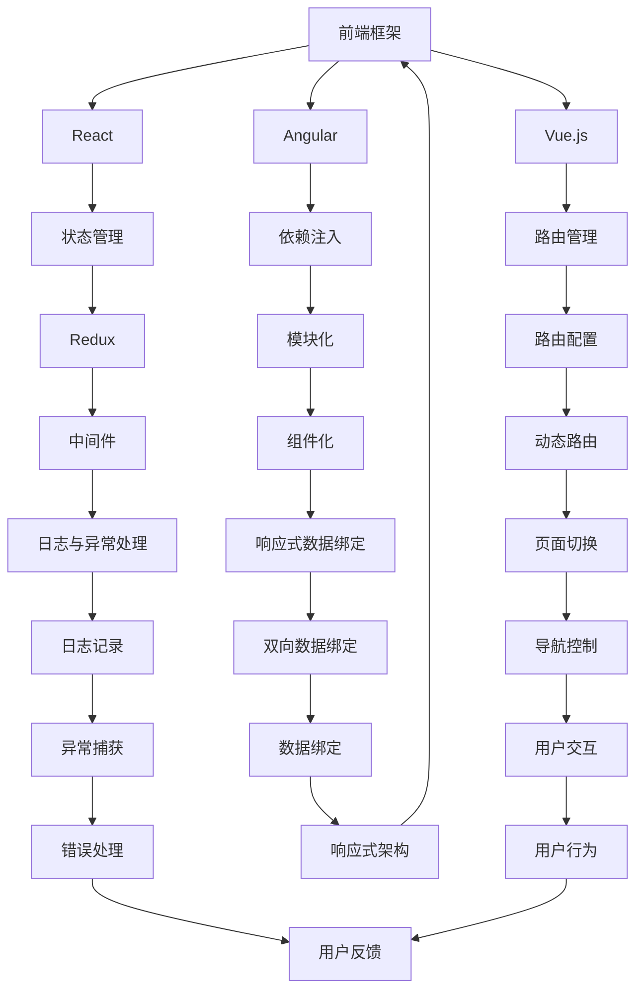

                 

### 1. Web全栈开发：现代技术的交汇点

在当今的互联网时代，Web全栈开发已经成为开发者的必备技能。所谓的全栈开发，即是指掌握前端到后端的整个技术栈，不仅能够处理前端用户界面的设计和实现，还能深入后端数据处理和服务器管理的细节。这一技能不仅要求开发者对前端和后端的各项技术有深刻理解，还需要具备将它们无缝整合在一起的能力。

#### **1.1 什么是Web全栈开发**

Web全栈开发涉及从客户端到服务器的整个开发过程，包括前端（用户界面和用户体验）、后端（数据处理和服务器管理）以及数据库（数据存储和查询）。一个全栈开发者通常需要掌握以下技术：

- **前端技术**：HTML、CSS、JavaScript以及各种前端框架（如React、Vue.js、Angular等）。
- **后端技术**：服务器端编程语言（如Node.js、Java、Python等）、框架（如Express、Spring、Django等）以及数据库（如MySQL、MongoDB等）。
- **数据库知识**：关系型数据库（如MySQL、PostgreSQL）和非关系型数据库（如MongoDB、CouchDB）。

#### **1.2 Web全栈开发的优势**

- **全面掌握**：全栈开发者能够独立完成项目的所有开发任务，从设计到实现，从用户界面到数据处理，能够更好地协调项目进度和质量。
- **高效的团队协作**：全栈开发者能够与前端、后端和数据库开发者高效协作，快速定位和解决问题。
- **灵活的解决方案**：在项目开发过程中，全栈开发者可以根据实际情况灵活调整技术栈，优化项目架构。

#### **1.3 全栈开发的挑战**

- **技术广泛**：需要掌握前端、后端和数据库等多个领域的知识，学习成本较高。
- **时间管理**：需要在有限的时间内学习和掌握多种技术，需要良好的时间管理能力。
- **持续更新**：Web开发技术更新迅速，全栈开发者需要不断学习新技能以保持竞争力。

### **1.4 小结**

Web全栈开发是现代Web开发的必然趋势，它不仅要求开发者具备全面的技术能力，还需要有良好的团队协作和项目管理能力。通过全栈开发，开发者能够更好地应对复杂的Web开发需求，提高项目的质量和效率。

> **关键词**：Web全栈开发、前端技术、后端技术、数据库、项目协作、技术学习、持续更新。

> **摘要**：本文将深入探讨Web全栈开发的定义、优势、挑战以及所需的核心技能，帮助读者了解全栈开发的核心理念和实践方法。

### **1.5 目录大纲**

接下来，我们将详细探讨Web全栈开发的各个核心部分，包括前端技术基础、前端框架深入、后端技术基础、后端框架深入、全栈整合与项目实战以及现代全栈开发趋势。

- **第一部分：前端技术基础**
  - 第1章：前端开发基础
  - 第2章：前端框架深入

- **第二部分：后端技术基础**
  - 第3章：后端开发基础
  - 第4章：后端框架深入

- **第三部分：全栈整合与项目实战**
  - 第5章：全栈整合基础
  - 第6章：全栈项目实战

- **第四部分：现代全栈开发趋势**
  - 第7章：现代全栈开发趋势

- **附录 A：常用技术资源与工具**

每个部分都将通过详细的章节结构和具体的实例来帮助读者逐步掌握全栈开发的各个关键环节。

---

# 第一部分：前端技术基础

## 第1章：前端开发基础

前端开发是Web全栈开发中至关重要的一环，它直接决定了用户的体验和交互。本章将介绍前端开发的基础知识，包括HTML5与CSS3的基础知识，JavaScript的基础语法，以及常用前端框架的概述。

### 1.1 HTML5与CSS3基础

HTML5和CSS3是前端开发的核心技术，它们分别负责网页的结构和样式。

#### **1.1.1 HTML5新特性**

HTML5引入了许多新的元素和特性，使得网页设计更加灵活和丰富。

- **新标签**：如`<article>`, `<section>`, `<nav>`, `<footer>`等，这些标签有助于结构化内容。
- **多媒体支持**：HTML5原生支持音频和视频标签，无需依赖Flash等第三方插件。
- **表单增强**：新的输入类型如`<email>`, `<url>`, `<date>`等，提供更好的表单验证。

#### **1.1.2 CSS3样式与动画**

CSS3带来了许多新的样式和动画特性，使得网页设计更加生动。

- **CSS3选择器**：如属性选择器、结构伪类选择器等，提供了更精确的样式控制。
- **颜色与渐变**：CSS3支持 RGBA 颜色和线性、径向渐变，使得颜色效果更加丰富。
- **动画与过渡**：CSS3动画和过渡效果，使得网页元素的运动更加自然和流畅。

#### **1.1.3 响应式设计**

响应式设计是现代前端开发的关键技术，它使得网页能够在不同设备上呈现最佳效果。

- **媒体查询**：通过媒体查询，可以针对不同的屏幕尺寸和分辨率应用不同的样式。
- **Flexbox布局**：Flexbox 提供了一种更简单的响应式布局方法，使得水平与垂直布局更加灵活。
- **Grid布局**：CSS Grid 布局是一种二维布局系统，能够更高效地处理复杂布局。

### **1.2 JavaScript基础**

JavaScript是前端开发的灵魂，它负责网页的动态交互和用户行为处理。

#### **1.2.1 基本语法**

JavaScript的基本语法包括变量、数据类型、运算符和流程控制。

- **变量与数据类型**：JavaScript使用`var`, `let`, `const`声明变量，支持基本数据类型（如数字、字符串）和复杂数据类型（如数组、对象）。
- **运算符**：JavaScript支持各种运算符，包括算术运算符、比较运算符和逻辑运算符。
- **流程控制**：包括条件语句（如`if-else`）、循环语句（如`for`、`while`）和异常处理（如`try-catch`）。

#### **1.2.2 数据类型与操作**

JavaScript的数据类型丰富，灵活的操作方式使得数据处理更加高效。

- **数组与对象**：数组提供了一种高效的数据存储和访问方式，对象则用于存储键值对。
- **字符串与正则表达式**：字符串操作和正则表达式是处理文本数据的重要工具。
- **Date对象与时间处理**：Date对象提供了一种处理日期和时间的方法，可以方便地进行时间的格式化和计算。

#### **1.2.3 函数与对象**

JavaScript的函数和对象机制使得代码组织和复用更加灵活。

- **函数定义与调用**：JavaScript函数可以随时定义和调用，支持匿名函数、箭头函数和构造函数。
- **闭包与高阶函数**：闭包允许函数访问其词法作用域，高阶函数则处理函数作为参数或返回值的情况。
- **对象创建与原型链**：JavaScript的对象可以通过构造函数和字面量创建，原型链则提供了一种原型继承机制。

### **1.3 常用库（如jQuery）**

jQuery是一个广泛使用的前端库，它简化了DOM操作、事件处理和Ajax请求。

- **核心概念**：jQuery使用选择器进行DOM查询，使用`.on()`和`.off()`方法处理事件。
- **选择器与操作**：jQuery支持各种选择器，如基本选择器、属性选择器和层级选择器。
- **事件处理与动画**：jQuery提供了一系列的事件处理函数，如`.click()`, `.hover()`，以及动画函数如`.animate()`。

### **1.4 小结**

前端开发基础是Web全栈开发的重要组成部分，掌握HTML5、CSS3和JavaScript是每个开发者必备的技能。通过本章的学习，读者可以了解前端开发的核心理念和基本语法，为后续章节的深入学习打下坚实基础。

---

## **第2章：前端框架深入**

在前端开发中，框架极大地提高了开发效率和代码的可维护性。本章将深入探讨三个主流前端框架：React、Angular和Vue.js，包括其核心概念、特点和应用场景。

### **2.1 React核心概念**

React是由Facebook开发的一个用于构建用户界面的JavaScript库。它的主要特点是基于组件的架构和虚拟DOM机制。

#### **2.1.1 JSX**

JSX是一种JavaScript和XML的混合语法，它使得界面和数据逻辑的编写更加直观。

- **JSX语法**：JSX使用大括号`{}`来嵌入JavaScript表达式，使得界面和数据的绑定更加自然。
- **JSX与JavaScript的融合**：通过JSX，可以在JavaScript代码中直接编写HTML标签和属性，简化了代码结构。

#### **2.1.2 组件**

组件是React的基本构建块，每个组件都有自己的状态和行为。

- **函数组件与类组件**：React组件可以是函数或类，函数组件更加轻量级，类组件则更灵活。
- **属性与状态**：组件可以通过属性传递数据，使用状态管理内部数据的变化。
- **生命周期方法**：组件的生命周期包括构造函数、挂载、更新和卸载等阶段，生命周期方法使得开发者可以控制组件在不同阶段的逻辑处理。

#### **2.1.3 状态管理（Redux、Context API）**

状态管理是React应用的核心，它确保组件的状态更新是可预测和可控制的。

- **Redux**：Redux是一个集中式状态管理库，它使用单一的状态树和不可变数据来管理应用的状态。
  - **核心概念**：Redux包含行动（action）、reducers和store等概念，通过它们实现状态的管理和更新。
  - **与React结合**：Redux可以通过React的`connect`方法将组件与store连接起来，实现状态的数据绑定。
- **Context API**：Context API是React提供的另一个状态管理工具，它允许组件在组件树中传递数据，而不需要通过prop层层传递。

### **2.2 Angular深度学习**

Angular是由Google开发的一个全功能前端框架，它提供了丰富的特性和工具，使得大型应用的开发变得更加高效。

#### **2.2.1 模块与依赖注入**

模块是Angular组织代码的基本单位，依赖注入则是一种自动提供依赖项的技术。

- **模块定义**：Angular通过模块来组织代码，模块可以包含组件、服务、管道等。
- **依赖注入原理**：依赖注入通过`@Injectable`装饰器和`Injectable`服务类，实现了对服务的自动注入和管理。

#### **2.2.2 数据绑定与双向数据绑定**

Angular的数据绑定机制使得数据和界面保持同步，双向数据绑定则进一步简化了数据的更新。

- **数据绑定机制**：Angular通过`[(ngModel)]`实现了双向数据绑定，它将模型和视图连接起来，自动同步数据。
- **双向数据绑定实现**：双向数据绑定通过脏检查（change detection）机制，在组件的每次渲染时检查数据和视图是否同步。

#### **2.2.3 Angular CLI**

Angular CLI（命令行界面）是Angular提供的工具，它简化了项目的创建、构建和运行过程。

- **项目创建与生成**：Angular CLI可以快速创建新的Angular项目，并提供了一套完整的开发环境。
- **插件与定制**：Angular CLI支持插件系统，开发者可以通过插件扩展项目的功能，满足特定的开发需求。

### **2.3 Vue.js高级应用**

Vue.js是一个渐进式的前端框架，它易于上手且灵活，适用于各种规模的项目。

#### **2.3.1 Vue Router**

Vue Router是Vue.js的官方路由管理器，它提供了动态路由和嵌套路由等功能。

- **路由配置与导航**：Vue Router通过`<router-view>`和`<router-link>`组件，实现了页面路由的切换和导航。
- **嵌套路由**：嵌套路由允许在一个路由下定义子路由，使得项目的路由结构更加清晰。

#### **2.3.2 Vuex**

Vuex是Vue.js的状态管理库，它提供了一种集中式的方式管理应用的状态。

- **Vuex核心概念**：Vuex包含状态（state）、行动（actions）、提交（mutations）和getter等概念，通过它们管理应用的状态。
- **Vuex状态管理流程**：Vuex的状态管理流程包括action触发、mutation更新状态、getter获取状态等步骤。

#### **2.3.3 动态组件与指令**

Vue.js允许动态加载组件和自定义指令，增强了组件的灵活性和可扩展性。

- **动态组件加载**：通过`<component>`标签和`:is`属性，可以实现动态组件的切换和加载。
- **自定义指令**：自定义指令可以用于将自定义行为应用到HTML元素上，增强了组件的功能性。

### **2.4 小结**

前端框架是现代前端开发的核心，React、Angular和Vue.js分别以其独特的优势和特点，成为开发者们广泛使用的工具。通过本章的深入探讨，读者可以更好地理解这些框架的核心概念和实际应用，为全栈开发打下坚实的基础。

---

# **第二部分：后端技术基础**

## **第3章：后端开发基础**

后端开发是Web全栈开发的重要组成部分，它负责处理数据存储、服务器逻辑以及与前端的数据交互。本章将介绍后端开发的基础知识，包括Node.js与Express框架的介绍，以及数据库的基础知识。

### **3.1 Node.js与Express**

Node.js是一个基于Chrome V8引擎的JavaScript运行环境，它使得JavaScript不仅可以在浏览器中运行，也可以在服务器端执行。Node.js通过异步编程模型，提供了高效、非阻塞的I/O操作能力。

#### **3.1.1 Node.js运行原理**

Node.js的运行原理主要基于以下几个关键点：

- **单线程与非阻塞**：Node.js采用单线程模型，通过事件循环机制处理I/O操作，从而实现非阻塞操作。
- **事件循环机制**：Node.js使用事件循环（Event Loop）来管理异步任务，当有I/O操作完成时，事件循环将回调函数放入事件队列并执行。

#### **3.1.2 Express框架基础**

Express是一个简单、灵活的Node.js Web应用框架，它提供了路由、中间件、请求和响应对象等功能，极大地简化了Web应用的开发。

- **路由**：Express通过`app.get()`、`app.post()`等方法，定义了不同的HTTP请求处理方法。
- **中间件**：中间件是Express中的一个重要概念，它用于处理HTTP请求的中间环节，例如日志记录、身份验证、请求解析等。
- **请求与响应对象**：Express提供了`request`和`response`对象，分别用于处理请求数据和发送响应。

### **3.2 数据库基础**

数据库是后端开发中不可或缺的一部分，它负责存储和管理应用所需的数据。数据库可以分为关系型数据库和非关系型数据库两大类。

#### **3.2.1 关系型数据库（如MySQL）**

关系型数据库使用SQL（结构化查询语言）进行数据操作，它通过表、行和列的关系来组织数据。

- **SQL基本语法**：包括数据定义语言（DDL）、数据操作语言（DML）和数据控制语言（DCL）等。
- **数据表设计与查询**：通过设计表结构、创建索引和执行查询，实现对数据的增删改查操作。

#### **3.2.2 非关系型数据库（如MongoDB）**

非关系型数据库不依赖于固定的表结构，它通过文档模型存储数据，提供了更高的灵活性和扩展性。

- **MongoDB基础概念**：MongoDB是一种分布式文档数据库，它使用JSON格式存储数据，支持文档内嵌和多文档事务。
- **MongoDB查询与聚合**：MongoDB提供了丰富的查询和聚合操作，可以方便地进行复杂的数据处理和分析。

### **3.3 小结**

后端开发基础是构建Web全栈应用的核心，Node.js与Express框架提供了高效的服务器端开发环境，而关系型数据库和非关系型数据库则为数据的存储和管理提供了可靠的解决方案。通过本章的学习，读者可以了解后端开发的基本原理和关键技术，为后续的深入学习和实践打下坚实基础。

---

## **第4章：后端框架深入**

后端框架是后端开发的核心工具，它们提供了高效的开发模式和丰富的功能库，极大地提高了开发效率和代码的可维护性。本章将深入探讨三个主流后端框架：Spring Boot、Django和Flask，包括其核心概念、架构设计以及高级应用。

### **4.1 Spring Boot基础**

Spring Boot是Spring框架的一个子项目，它简化了Spring应用的创建和配置过程，提供了快速开发的能力。

#### **4.1.1 框架结构与依赖管理**

Spring Boot的核心结构包括配置、自动配置、组件扫描和依赖注入等。

- **配置**：Spring Boot通过`application.properties`或`application.yml`文件进行配置，可以方便地定制应用行为。
- **自动配置**：Spring Boot可以根据类路径中的依赖和配置文件，自动配置应用所需的Bean和组件。
- **组件扫描**：Spring Boot通过组件扫描机制，自动发现和注册应用中的Bean。
- **依赖注入**：Spring Boot使用依赖注入（DI）技术，将Bean的依赖关系注入到应用的各个组件中。

#### **4.1.2 数据访问与事务处理**

Spring Boot提供了强大的数据访问和事务管理功能，简化了数据库操作的复杂性。

- **数据访问**：Spring Boot支持多种数据访问技术，包括JDBC、JPA和MyBatis等。通过`@Repository`注解，可以简化数据访问层的编写。
- **事务处理**：Spring Boot通过`@Transactional`注解，可以轻松实现方法级别的事务管理。Spring Boot的事务管理支持声明式和编程式两种方式。

### **4.2 Django框架深度学习**

Django是一个高级的Python Web框架，它遵循MVC设计模式，提供了快速开发的能力和丰富的功能库。

#### **4.2.1 Model与View**

Model和View是Django框架的核心概念，它们分别负责数据的处理和界面的渲染。

- **Model**：Django的Model类对应数据库表，使用ORM（对象关系映射）技术，简化了数据操作。通过`fields`属性，可以定义表的结构。
- **View**：Django的View函数或类负责处理HTTP请求，并根据请求生成响应。通过`@login_required`等装饰器，可以实现权限控制。

#### **4.2.2 表单处理与用户认证**

Django提供了强大的表单处理和用户认证机制，使得Web应用的安全性和交互性得到显著提升。

- **表单处理**：Django的表单类支持各种表单验证和数据处理。通过`Form`和`ModelForm`类，可以简化表单的编写和验证。
- **用户认证**：Django内置了用户认证系统，支持用户注册、登录、权限验证等功能。通过`auth`模块，可以方便地实现用户认证和权限管理。

### **4.3 Flask框架高级应用**

Flask是一个轻量级的Python Web框架，它提供了灵活的开发环境和丰富的扩展库。

#### **4.3.1 蓝图与工厂模式**

Blueprint和工厂模式是Flask的两大高级特性，它们使得应用的结构更加清晰和可扩展。

- **蓝图（Blueprint）**：Blueprint允许开发者将应用划分为多个模块，每个模块都有自己的路由和视图。通过`blueprint`类，可以创建和应用蓝图。
- **工厂模式（Factory Pattern）**：工厂模式用于创建对象的实例，它将对象的创建和使用分离，提高了代码的可复用性和灵活性。

#### **4.3.2 日志与异常处理**

Flask提供了完善的日志和异常处理机制，使得应用的调试和维护更加便捷。

- **日志管理**：Flask使用内置的`logging`模块，可以方便地记录应用运行过程中的日志信息。通过配置日志级别和日志文件，可以实现详细的日志记录。
- **异常处理**：Flask的`app.errorhandler`装饰器可以处理特定的异常，并返回相应的错误响应。通过自定义错误页面，可以提升应用的友好性和用户体验。

### **4.4 小结**

后端框架是后端开发的核心工具，Spring Boot、Django和Flask分别以其独特的优势和特点，成为开发者们广泛使用的框架。通过本章的深入探讨，读者可以了解这些框架的核心概念和实际应用，为全栈开发打下坚实的基础。

---

## **第三部分：全栈整合与项目实战**

### **5.1 前后端数据交互**

在Web全栈开发中，前后端数据交互是项目实现的核心环节。通过HTTP协议，前端可以向后端发送请求，后端则可以响应这些请求并提供所需的数据。本章将详细介绍前后端数据交互的方法和最佳实践。

#### **5.1.1 RESTful API设计**

RESTful API（Representational State Transfer API）是一种设计Web服务的标准化方法，它通过HTTP协议提供统一的接口，使得前后端能够高效地进行数据交互。

- **RESTful原则**：RESTful API遵循REST原则，包括统一接口、无状态、客户端-服务器和分层系统等。
- **API接口设计**：RESTful API通常包括资源、URL、HTTP方法、请求体、响应体和状态码等要素。设计良好的API接口能够提高数据交互的清晰度和可维护性。

#### **5.1.2 AJAX与Fetch API**

AJAX（Asynchronous JavaScript and XML）和Fetch API是JavaScript中常用的技术，用于异步请求后端数据。

- **AJAX基本用法**：AJAX通过`XMLHttpRequest`对象发送异步请求，可以处理GET、POST等HTTP请求，并更新网页内容而不刷新页面。
- **Fetch API详解**：Fetch API是现代浏览器提供的一种更简单、更强大的异步请求接口，它基于Promise对象，支持更丰富的请求和响应处理。

#### **5.1.3 数据交互的最佳实践**

为了确保前后端数据交互的高效和安全，以下是一些最佳实践：

- **参数验证**：前端和后端都应该对请求参数进行严格验证，确保数据的合法性和安全性。
- **错误处理**：前端应该对HTTP请求的错误进行捕获和处理，提供友好的错误提示，后端则应返回明确的错误信息。
- **数据格式**：前后端应约定一致的数据格式，如JSON，以确保数据解析和处理的兼容性。
- **状态管理**：使用状态管理库（如Redux、Vuex）来管理应用状态，确保前后端状态的一致性。

### **5.2 认证与授权**

认证和授权是Web全栈开发中的关键部分，它们确保只有授权的用户才能访问应用的功能和数据。

#### **5.2.1 JWT**

JSON Web Token（JWT）是一种常见的认证协议，它通过生成Token来验证用户的身份。

- **JWT工作原理**：JWT包含三个部分：头部（Header）、载荷（Payload）和签名（Signature）。通过加密算法，签名部分可以验证Token的合法性。
- **JWT实现与使用**：在服务器端，可以使用JWT库（如`jsonwebtoken`）生成Token，并在客户端将Token存储在Cookie或LocalStorage中，每次请求时随Header发送。

#### **5.2.2 OAuth2.0**

OAuth2.0是一种开放授权标准，它允许第三方应用访问用户资源，而不需要直接获取用户的密码。

- **OAuth2.0基本概念**：OAuth2.0包括四个角色：资源所有者（User）、资源服务器（Resource Server）、授权服务器（Authorization Server）和客户端（Client）。
- **OAuth2.0认证流程**：OAuth2.0的认证流程通常包括授权码认证、密码认证和客户端凭证认证等。通过这些流程，客户端可以获取访问令牌，进而访问资源。

### **5.3 小结**

前后端数据交互和认证与授权是Web全栈开发的核心部分，它们确保了应用的数据安全和功能完整性。通过本章的介绍，读者可以掌握前后端数据交互的方法和最佳实践，以及JWT和OAuth2.0等认证协议的实现和使用。

---

## **6.1 博客系统开发**

博客系统是一个典型的Web全栈项目，它包含了用户管理、文章发布、评论功能等基本模块。本节将详细介绍博客系统的功能设计与实现，以及安全和性能优化的关键点。

### **6.1.1 功能设计与实现**

博客系统的核心功能包括用户注册与登录、文章发布与展示、评论管理以及用户互动。

- **用户注册与登录**：
  - 用户注册：用户可以输入用户名、密码和邮箱等信息进行注册，后端需要对输入信息进行验证，确保其合法性和唯一性。
  - 用户登录：用户输入用户名和密码，后端通过验证密码的正确性来确认用户身份，并生成JWT Token，用于后续的认证和授权。

- **文章发布与展示**：
  - 文章发布：用户可以创建和发布文章，包括标题、正文、标签等。后端需要对文章内容进行HTML转义，防止XSS攻击。
  - 文章展示：博客系统需要展示所有用户发布的文章，可以根据时间、标签等进行排序和筛选。

- **评论管理**：
  - 评论发布：用户可以对文章发表评论，评论内容也需要进行HTML转义，防止XSS攻击。
  - 评论展示：博客系统需要展示所有针对某篇文章的评论，并支持子评论功能。

- **用户互动**：
  - 用户点赞：用户可以对自己喜欢的文章点赞，后端需要记录点赞关系，并提供点赞数的实时更新。
  - 用户关注：用户可以关注其他用户，博客系统需要展示关注者的最新动态。

### **6.1.2 安全与性能优化**

在博客系统的开发中，安全和性能优化是至关重要的。

- **安全优化**：
  - XSS攻击防范：对用户输入的内容进行HTML转义，防止恶意脚本执行。
  - SQL注入攻击防范：使用ORM框架或预编译语句，防止SQL注入攻击。
  - 密码安全：密码存储时使用哈希函数，并加入盐（Salt），提高密码安全性。
  - 权限控制：使用JWT Token和权限验证机制，确保用户只能访问授权的资源。

- **性能优化**：
  - 数据库优化：对数据库进行索引优化，使用缓存技术（如Redis）提高查询效率。
  - 代码优化：使用懒加载、异步加载等技术减少页面加载时间，提高用户体验。
  - 网络优化：使用CDN（内容分发网络）加速静态资源的加载，减少网络延迟。
  - 负载均衡：使用负载均衡器（如Nginx）分配请求，确保系统的稳定性和响应速度。

### **6.1.3 具体实现**

以下是博客系统的一个简单实现示例。

#### **用户注册与登录**

- **后端（Node.js + Express + JWT）**：

```javascript
// 用户注册
app.post('/api/register', async (req, res) => {
  const { username, password, email } = req.body;
  // 验证用户信息
  // ...
  // 存储用户信息到数据库
  // ...
  res.status(201).json({ message: '注册成功' });
});

// 用户登录
app.post('/api/login', async (req, res) => {
  const { username, password } = req.body;
  // 验证用户信息
  // ...
  // 生成JWT Token
  const token = jwt.sign({ username }, 'secretKey');
  res.json({ token });
});
```

- **前端（React + Axios）**：

```javascript
// 用户注册
const register = async (userData) => {
  try {
    const response = await axios.post('/api/register', userData);
    console.log(response.data);
  } catch (error) {
    console.error(error);
  }
};

// 用户登录
const login = async (userData) => {
  try {
    const response = await axios.post('/api/login', userData);
    localStorage.setItem('token', response.data.token);
  } catch (error) {
    console.error(error);
  }
};
```

#### **文章发布与展示**

- **后端（Node.js + Express + MongoDB）**：

```javascript
// 文章发布
app.post('/api/articles', async (req, res) => {
  const { title, content } = req.body;
  // 创建文章
  const article = new Article({ title, content, author: req.user._id });
  // 存储文章到数据库
  await article.save();
  res.status(201).json(article);
});

// 文章展示
app.get('/api/articles', async (req, res) => {
  const articles = await Article.find();
  res.status(200).json(articles);
});
```

- **前端（React + Axios）**：

```javascript
// 文章发布
const publishArticle = async (articleData) => {
  try {
    const response = await axios.post('/api/articles', articleData, {
      headers: { Authorization: `Bearer ${localStorage.getItem('token')}` },
    });
    console.log(response.data);
  } catch (error) {
    console.error(error);
  }
};

// 文章展示
const fetchArticles = async () => {
  try {
    const response = await axios.get('/api/articles');
    console.log(response.data);
  } catch (error) {
    console.error(error);
  }
};
```

### **6.1.4 小结**

博客系统是一个复杂的全栈项目，需要综合考虑前端用户交互、后端数据处理和数据库存储等多个方面。通过本章的介绍，读者可以了解博客系统的功能设计与实现，以及安全和性能优化的关键点，为后续开发类似项目提供参考。

---

## **6.2 在线商城项目**

在线商城是一个涉及用户管理、商品管理、购物车、订单管理等多个功能的复杂项目。本章将详细介绍在线商城项目的架构设计，包括用户权限和购物车的实现，以及订单管理的关键步骤。

### **6.2.1 电商平台架构设计**

电商平台架构设计需要考虑用户体验、性能、扩展性和安全性。一个典型的在线商城架构包括以下主要模块：

- **用户模块**：负责用户注册、登录、权限管理和用户信息管理。
- **商品模块**：负责商品分类、商品信息管理、商品展示和商品搜索。
- **购物车模块**：负责购物车管理，包括添加商品、修改数量、删除商品和结算。
- **订单模块**：负责订单生成、订单状态跟踪、订单查询和支付。
- **支付模块**：负责支付接口集成，包括支付方式选择、支付确认和支付结果处理。

#### **用户权限与购物车实现**

用户权限和购物车是电商平台的核心功能，需要仔细设计和实现。

- **用户权限**：用户权限控制是确保系统安全的关键。可以使用RBAC（基于角色的访问控制）模型，为每个用户分配不同的角色和权限。用户权限可以通过JWT Token进行验证，确保只有授权用户才能访问特定功能。

- **购物车实现**：
  - **数据库设计**：购物车通常存储在数据库中，记录用户ID、商品ID、商品名称、价格、数量等信息。可以使用关系型数据库（如MySQL）或NoSQL数据库（如MongoDB）进行存储。
  - **前端实现**：前端可以通过localStorage或cookie存储购物车信息，也可以通过API与后端进行交互，实现购物车数据的实时更新。
  - **后端实现**：后端需要提供接口，允许用户添加、删除、更新购物车信息。同时，后端还需要处理购物车数据的持久化存储和同步。

#### **订单管理**

订单管理是电商平台的核心模块，涉及订单生成、订单状态跟踪、订单查询和支付等多个环节。

- **订单生成**：用户在购物车中选择商品并点击结算，系统生成订单。订单包含订单号、用户ID、商品列表、订单金额、订单状态等信息。
- **订单状态跟踪**：订单状态包括待付款、待发货、已发货、已完成、已取消等。订单状态的变化需要及时更新，以便用户和管理员可以实时查看订单状态。
- **订单查询**：用户可以通过订单号或用户名查询订单详情，管理员可以通过后台管理系统查看所有订单。
- **支付**：支付模块负责与第三方支付平台（如支付宝、微信支付）集成，处理支付请求和支付结果。支付完成后，订单状态更新为“已完成”。

### **6.2.2 具体实现**

以下是电商平台的一些关键实现步骤。

#### **用户权限实现**

- **后端（Node.js + Express + JWT）**：

```javascript
// 用户注册
app.post('/api/register', async (req, res) => {
  const { username, password, email } = req.body;
  // 验证用户信息
  // ...
  // 存储用户信息到数据库
  // ...
  res.status(201).json({ message: '注册成功' });
});

// 用户登录
app.post('/api/login', async (req, res) => {
  const { username, password } = req.body;
  // 验证用户信息
  // ...
  // 生成JWT Token
  const token = jwt.sign({ username }, 'secretKey');
  res.json({ token });
});
```

- **前端（React + Axios）**：

```javascript
// 用户注册
const register = async (userData) => {
  try {
    const response = await axios.post('/api/register', userData);
    console.log(response.data);
  } catch (error) {
    console.error(error);
  }
};

// 用户登录
const login = async (userData) => {
  try {
    const response = await axios.post('/api/login', userData);
    localStorage.setItem('token', response.data.token);
  } catch (error) {
    console.error(error);
  }
};
```

#### **购物车实现**

- **数据库设计**（MongoDB）：

```json
{
  "_id": ObjectId("5fd0511d2a3b4a0016cd3f47"),
  "userId": "12345",
  "products": [
    {
      "productId": "001",
      "productName": "iPhone 12",
      "price": 799,
      "quantity": 1
    },
    {
      "productId": "002",
      "productName": "MacBook Air",
      "price": 999,
      "quantity": 1
    }
  ]
}
```

- **后端（Node.js + Express + MongoDB）**：

```javascript
// 添加购物车商品
app.post('/api/cart', async (req, res) => {
  const { userId, productId, quantity } = req.body;
  // 查询用户购物车
  const cart = await Cart.findOne({ userId });
  if (cart) {
    // 更新购物车
    // ...
  } else {
    // 创建新购物车
    // ...
  }
  res.status(201).json({ message: '商品添加成功' });
});

// 购物车展示
app.get('/api/cart', async (req, res) => {
  const userId = req.user._id;
  const cart = await Cart.findOne({ userId });
  res.status(200).json(cart);
});
```

- **前端（React + Axios）**：

```javascript
// 添加购物车商品
const addCart = async (cartData) => {
  try {
    const response = await axios.post('/api/cart', cartData, {
      headers: { Authorization: `Bearer ${localStorage.getItem('token')}` },
    });
    console.log(response.data);
  } catch (error) {
    console.error(error);
  }
};

// 购物车展示
const fetchCart = async () => {
  try {
    const response = await axios.get('/api/cart', {
      headers: { Authorization: `Bearer ${localStorage.getItem('token')}` },
    });
    console.log(response.data);
  } catch (error) {
    console.error(error);
  }
};
```

#### **订单管理**

- **订单生成**：

```javascript
// 订单创建
app.post('/api/orders', async (req, res) => {
  const { userId, cartId } = req.body;
  // 计算订单总金额
  // ...
  // 创建订单
  const order = new Order({
    userId,
    cartId,
    totalAmount,
    status: '待付款',
  });
  // 存储订单到数据库
  await order.save();
  res.status(201).json(order);
});
```

- **订单状态跟踪**：

```javascript
// 更新订单状态
app.put('/api/orders/:orderId', async (req, res) => {
  const { orderId } = req.params;
  const { status } = req.body;
  const order = await Order.findByIdAndUpdate(orderId, { status }, { new: true });
  res.status(200).json(order);
});
```

- **订单查询**：

```javascript
// 获取订单详情
app.get('/api/orders/:orderId', async (req, res) => {
  const { orderId } = req.params;
  const order = await Order.findById(orderId);
  res.status(200).json(order);
});
```

### **6.2.3 小结**

在线商城项目的开发涉及多个模块和功能的实现，需要综合考虑用户体验、系统性能和安全等多方面因素。通过本章的介绍，读者可以了解电商平台的基本架构和关键实现步骤，为实际项目的开发提供参考。

---

## **第7章：现代全栈开发趋势**

随着Web技术的不断演进，现代全栈开发也在不断变革和创新。本章将探讨当前几个重要的全栈开发趋势，包括微前端架构、Serverless架构和容器化与云原生。

### **7.1 微前端架构**

微前端架构是一种将前端应用拆分为多个独立、可复用的前端模块的方法。这种方法使得多个团队可以独立开发、部署和运行各自的部分，从而提高了开发效率和项目可维护性。

#### **7.1.1 跨团队协作与模块化开发**

微前端架构的核心在于模块化和独立部署。每个团队负责一个独立的模块，这些模块通过公共接口进行通信。

- **跨团队协作**：每个团队可以专注于自己负责的部分，减少了跨团队的沟通成本，加快了开发进度。
- **模块化开发**：模块化的开发方法使得应用更加灵活和可扩展，模块间的解耦提高了代码的可维护性。

#### **7.1.2 实现细节**

- **模块划分**：根据业务需求和功能模块，将应用拆分为多个独立的模块。
- **构建工具**：使用Webpack、Parcel等构建工具，将各个模块打包成独立的包，并配置公共接口。
- **部署策略**：使用CI/CD（持续集成和持续部署）工具，实现模块的自动化构建和部署。

### **7.2 Serverless架构**

Serverless架构是一种无需管理服务器即可运行代码的计算模型。在Serverless架构中，开发者只需编写业务逻辑代码，而基础设施的维护和扩展由云服务提供商（如AWS、Azure、Google Cloud）负责。

#### **7.2.1 服务器无关性**

- **无服务器计算**：Serverless架构的核心在于服务器无关性，开发者无需关心服务器的配置和管理。
- **事件驱动**：Serverless应用通常是事件驱动的，例如AWS Lambda会在事件触发时执行代码。

#### **7.2.2 应用与优势**

- **快速部署**：Serverless应用可以快速部署，无需配置服务器，减少了部署时间。
- **成本效益**：Serverless架构根据实际使用量收费，避免了服务器闲置时的成本。

#### **7.2.3 实现细节**

- **函数定义**：定义事件处理函数，例如AWS Lambda、Google Cloud Functions。
- **集成API**：使用API网关（如AWS API Gateway）将外部请求路由到函数。
- **监控与日志**：使用云服务提供的监控和日志工具，例如AWS CloudWatch。

### **7.3 容器化与云原生**

容器化技术（如Docker）和云原生技术（如Kubernetes）极大地提高了应用的部署、扩展和管理效率。

#### **7.3.1 容器化技术**

- **Docker**：Docker通过将应用程序及其依赖项打包到容器中，实现了环境的隔离和一致性。
- **容器编排**：Kubernetes是一个开源的容器编排工具，用于自动化容器的部署、扩展和管理。

#### **7.3.2 云原生技术**

- **云原生架构**：云原生架构是基于容器的微服务架构，它利用容器、微服务、不可变基础设施等概念，实现高效、可扩展的应用部署和管理。
- **自动化部署**：通过CI/CD工具，自动化应用的构建、测试和部署。

#### **7.3.3 实现细节**

- **容器化应用**：使用Docker将应用打包到容器中，编写Dockerfile定义容器镜像。
- **Kubernetes集群**：部署Kubernetes集群，配置部署文件（如YAML文件），管理容器的生命周期。
- **服务发现与负载均衡**：使用Kubernetes的服务发现和负载均衡功能，确保服务的可靠性和性能。

### **7.4 小结**

现代全栈开发趋势正在朝着模块化、无服务器和容器化方向发展。这些趋势不仅提高了开发效率和项目质量，还为团队协作和持续交付提供了新的解决方案。通过本章的介绍，读者可以了解这些新兴技术的核心概念和实践方法，为未来的全栈开发做好准备。

---

## **附录A：常用技术资源与工具**

在Web全栈开发中，掌握一系列常用的技术资源与工具是至关重要的。这些工具不仅可以帮助开发者提高开发效率，还能确保项目的质量与稳定性。

### **A.1 前端开发工具链**

- **Webpack**：一个模块打包工具，用于将多种资源打包成一个或多个静态文件，优化前端应用的性能。
- **Babel**：一个JavaScript编译器，用于将ES6+代码转换为向后兼容的ES5代码，从而在旧版浏览器中运行。
- **ESLint**：一个代码检查工具，用于识别和修复JavaScript代码中的错误和潜在的问题。

### **A.2 后端开发工具链**

- **Maven**：一个项目管理工具，用于构建、依赖管理和项目打包。
- **Gradle**：一个基于Apache Ant和Apache Maven的构建工具，提供了灵活的构建脚本和依赖管理。
- **Git**：一个分布式版本控制系统，用于管理和跟踪代码变更，支持多人协作开发。

### **A.3 容器化与云原生工具**

- **Docker**：一个开源的应用容器引擎，用于打包、交付和运行应用程序。
- **Kubernetes**：一个开源的容器编排平台，用于自动化容器部署、扩展和管理。
- **Helm**：一个Kubernetes的包管理工具，用于简化Kubernetes应用的部署和管理。

### **A.4 其他常用工具**

- **Postman**：一个API测试工具，用于测试和设计API。
- **Visual Studio Code**：一个流行的跨平台代码编辑器，提供了丰富的插件和扩展。
- **Jenkins**：一个开源的持续集成工具，用于自动化构建、测试和部署。

### **A.5 在线学习资源**

- **免费在线课程**：如Coursera、edX、Udemy等平台提供了大量关于前端、后端和全栈开发的免费课程。
- **技术博客**：如Medium、Dev.to、Stack Overflow等网站提供了丰富的技术文章和讨论。
- **GitHub**：一个代码托管平台，开发者可以在GitHub上找到大量开源项目和教程。

通过附录A中提到的这些工具和资源，开发者可以更好地掌握Web全栈开发的核心技能，为项目成功打下坚实的基础。

---

## **图表与代码示例**

在本文中，我们使用了多个图表和代码示例来帮助读者更直观地理解相关技术和概念。以下是一些图表和代码示例的具体解释。

### **Mermaid流程图：前端与后端框架关系图**



这个流程图展示了前端和后端框架之间的核心关系，以及各个框架的关键特性。例如，React与状态管理（Redux、Context API）、Angular与依赖注入、Vue.js与路由管理等。

### **伪代码示例：前后端数据交互流程**

```python
# 伪代码：前端请求后端API
function fetchData(url, onSuccess, onError) {
  fetch(url)
    .then(response => {
      if (response.ok) {
        response.json().then(data => onSuccess(data));
      } else {
        onError("服务器错误");
      }
    })
    .catch(error => onError("网络错误"));
}

# 伪代码：后端处理请求并返回数据
app.get('/api/data', (req, res) => {
  // 查询数据库
  const data = database.query('SELECT * FROM table');
  
  // 返回数据
  res.json(data);
});
```

这个伪代码示例展示了前后端数据交互的基本流程。前端通过fetch API发送请求，后端通过Express框架处理请求并返回数据。

### **LaTeX数学公式示例：回归模型公式**

$$
Y = \beta_0 + \beta_1 \cdot X + \epsilon
$$

这个公式展示了简单的线性回归模型，其中$Y$是因变量，$X$是自变量，$\beta_0$和$\beta_1$是模型参数，$\epsilon$是误差项。

### **代码解读与分析：Node.js服务端代码**

```javascript
// Node.js 服务端代码示例

const express = require('express');
const app = express();

// 解析请求体
app.use(express.json());

// 数据库连接（伪代码）
const database = require('./database');

// 路由：获取用户列表
app.get('/users', async (req, res) => {
  try {
    const users = await database.query('SELECT * FROM users');
    res.status(200).json(users);
  } catch (error) {
    res.status(500).json({ error: '数据库查询错误' });
  }
});

// 路由：创建新用户
app.post('/users', async (req, res) => {
  const newUser = req.body;
  try {
    const result = await database.query('INSERT INTO users (username, email) VALUES (?, ?)', [newUser.username, newUser.email]);
    res.status(201).json({ message: '用户创建成功', userId: result.insertId });
  } catch (error) {
    res.status(500).json({ error: '数据库插入错误' });
  }
});

// 启动服务
const PORT = process.env.PORT || 3000;
app.listen(PORT, () => {
  console.log(`Server listening on port ${PORT}`);
});

```

这个代码示例展示了Node.js和Express框架的基本使用。代码首先解析请求体，然后通过数据库查询用户数据并返回结果。代码解读部分解释了每行代码的作用，帮助读者理解整个服务端代码的流程。

通过这些图表和代码示例，读者可以更直观地理解文章中提到的技术和概念，从而更好地掌握Web全栈开发的各项技能。

---

## **结语**

本文系统地介绍了Web全栈开发的核心内容，从基础技术到高级框架，再到项目实战和现代开发趋势，全面覆盖了前端、后端和数据库等领域。通过详细的图表、代码示例和深入的分析，希望读者能够对全栈开发有一个全面而深刻的理解。

### **总结全文**

- **前端技术基础**：HTML5与CSS3、JavaScript基础，以及常用前端框架（React、Angular、Vue.js）的深入探讨。
- **后端技术基础**：Node.js与Express框架的介绍，以及关系型数据库（如MySQL）和非关系型数据库（如MongoDB）的基础知识。
- **后端框架深入**：Spring Boot、Django和Flask框架的核心概念、架构设计和高级应用。
- **全栈整合与项目实战**：前后端数据交互、认证与授权、博客系统和在线商城项目的具体实现。
- **现代全栈开发趋势**：微前端架构、Serverless架构、容器化与云原生技术。

### **展望未来**

未来，Web全栈开发将继续朝着模块化、自动化和智能化方向演进。开发者需要不断学习新技术，如微服务架构、无服务器计算、区块链等，以应对日益复杂的业务需求。

### **感谢读者**

感谢您阅读本文，希望本文能够对您在Web全栈开发领域的学习和实践提供帮助。如果您有任何疑问或建议，欢迎在评论区留言，期待与您共同探讨和进步。

### **作者信息**

作者：AI天才研究院/AI Genius Institute & 禅与计算机程序设计艺术 /Zen And The Art of Computer Programming。

