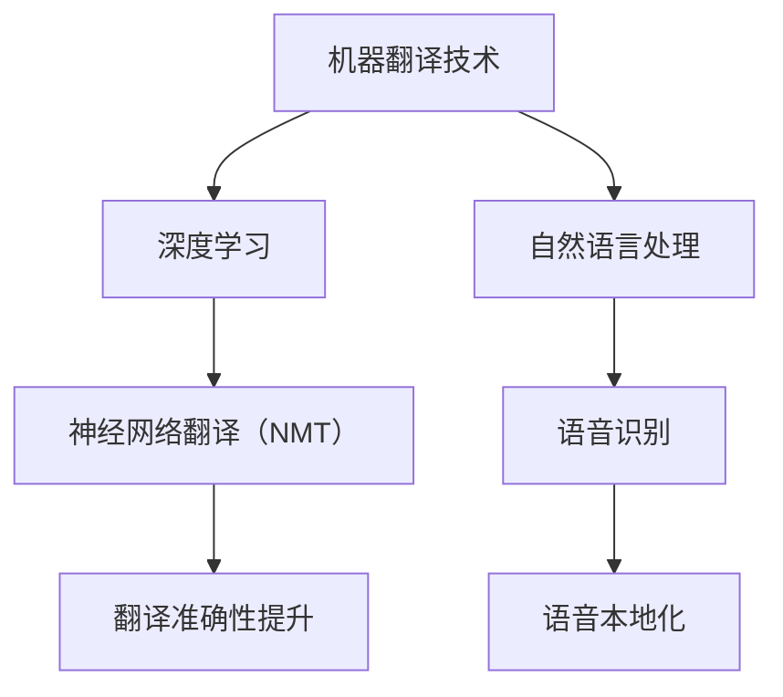
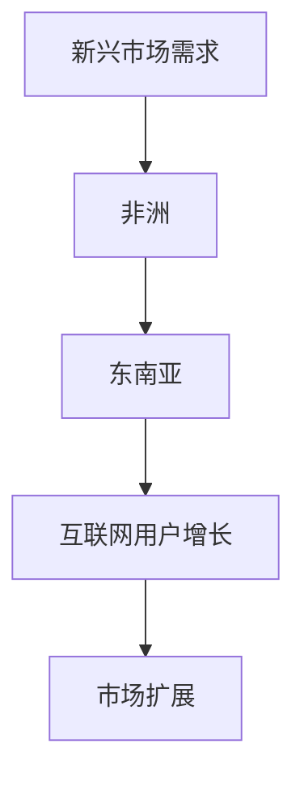
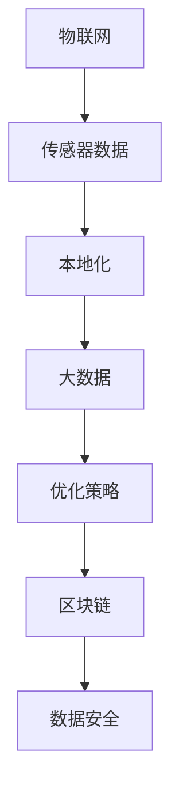
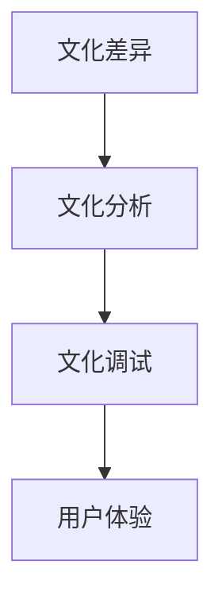
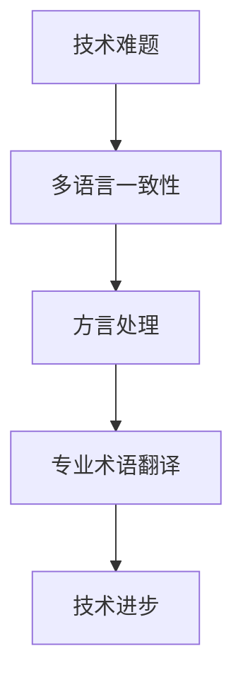
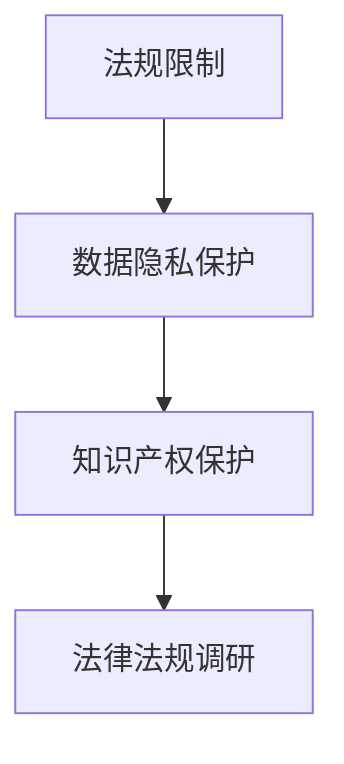

                 

# 一人公司的产品本地化：适应不同市场需求

> 关键词：本地化、市场需求、产品定位、跨文化沟通、法规遵循

> 摘要：随着全球化的不断深入，产品本地化已成为企业拓展国际市场的关键策略。对于一人公司而言，如何在有限的资源下实现产品本地化，满足不同市场的需求，成为亟待解决的问题。本文将从本地化概述、产品本地化流程、本地化技术与方法、案例与实践、本地化工具与应用以及未来展望与挑战六个部分进行详细阐述，旨在为一人公司提供一套完整的本地化策略。

### 《一人公司的产品本地化：适应不同市场需求》目录大纲

#### 第一部分：本地化概述

- # 1. 本地化概述
  - ## 1.1 本地化的定义与重要性
    - ### 1.1.1 本地化的定义
    - ### 1.1.2 本地化的重要性
  - ## 1.2 本地化的目标与原则
    - ### 1.2.1 本地化的目标
    - ### 1.2.2 本地化的原则
  - ## 1.3 本地化的核心要素
    - ### 1.3.1 语言
    - ### 1.3.2 文化
    - ### 1.3.3 法律法规

#### 第二部分：产品本地化流程

- # 2. 产品本地化流程
  - ## 2.1 市场调研
    - ### 2.1.1 了解目标市场
    - ### 2.1.2 收集市场数据
    - ### 2.1.3 分析市场需求
  - ## 2.2 产品规划
    - ### 2.2.1 确定本地化策略
    - ### 2.2.2 制定本地化计划
    - ### 2.2.3 设计本地化需求文档
  - ## 2.3 本地化实施
    - ### 2.3.1 语言本地化
    - ### 2.3.2 文化适应
    - ### 2.3.3 法律法规遵循
  - ## 2.4 测试与优化
    - ### 2.4.1 本地化测试
    - ### 2.4.2 用户反馈收集
    - ### 2.4.3 优化本地化方案

#### 第三部分：本地化技术与方法

- # 3. 本地化技术与方法
  - ## 3.1 语言翻译技术
    - ### 3.1.1 机器翻译
    - ### 3.1.2 翻译记忆
    - ### 3.1.3 翻译质量控制
  - ## 3.2 文化适应方法
    - ### 3.2.1 文化分析
    - ### 3.2.2 文化调试
    - ### 3.2.3 文化敏感性培训
  - ## 3.3 法律法规遵循
    - ### 3.3.1 法律法规调研
    - ### 3.3.2 法律合规审查
    - ### 3.3.3 法律风险控制

#### 第四部分：案例与实践

- # 4. 案例与实践
  - ## 4.1 成功案例解析
    - ### 4.1.1 案例一：亚马逊的产品本地化
    - ### 4.1.2 案例二：谷歌的产品本地化
    - ### 4.1.3 案例三：腾讯的产品本地化
  - ## 4.2 实践经验分享
    - ### 4.2.1 本地化项目管理
    - ### 4.2.2 跨文化沟通与协作
    - ### 4.2.3 本地化成本控制

#### 第五部分：本地化工具与应用

- # 5. 本地化工具与应用
  - ## 5.1 常用本地化工具介绍
    - ### 5.1.1 翻译工具
    - ### 5.1.2 文化适应工具
    - ### 5.1.3 法律法规检查工具
  - ## 5.2 本地化应用案例分析
    - ### 5.2.1 企业级本地化应用
    - ### 5.2.2 开源项目本地化
    - ### 5.2.3 本地化服务供应商选择

#### 第六部分：未来展望与挑战

- # 6. 未来展望与挑战
  - ## 6.1 本地化发展趋势
    - ### 6.1.1 技术创新
    - ### 6.1.2 市场扩展
    - ### 6.1.3 跨界融合
  - ## 6.2 本地化面临的挑战
    - ### 6.2.1 文化差异
    - ### 6.2.2 技术难题
    - ### 6.2.3 法规限制

# 附录

- ## 附录 A：本地化资源与参考资料
  - ### A.1 在线本地化资源
  - ### A.2 本地化案例库

---

现在，我们将逐步深入探讨本地化的各个方面，为一人公司提供实用的本地化策略。

#### 第一部分：本地化概述

在全球化的大背景下，产品本地化成为企业成功进入国际市场的重要策略。一人公司，由于资源有限，更需要精准的市场定位和有效的本地化策略来适应不同市场需求。接下来，我们将从本地化的定义与重要性、本地化的目标与原则、以及本地化的核心要素三个方面进行概述。

### 1.1 本地化的定义与重要性

#### 1.1.1 本地化的定义

本地化（Localization）是将产品或服务根据目标市场的语言、文化、法规等特定因素进行适应性调整的过程。这一过程不仅包括语言的翻译，还涉及到文化的适应、法规的遵循以及用户体验的优化。

#### 1.1.2 本地化的重要性

本地化的重要性体现在以下几个方面：

1. **提升用户体验**：本地化能够让产品更好地适应目标市场的用户习惯和文化背景，从而提高用户满意度。
2. **降低市场风险**：通过深入了解目标市场的法规和文化，企业可以减少因文化冲突或法规违规带来的市场风险。
3. **扩大市场份额**：本地化能够帮助企业进入更多国际市场，从而扩大市场份额和收益。

### 1.2 本地化的目标与原则

#### 1.2.1 本地化的目标

本地化的目标主要包括：

1. **市场适应性**：使产品能够无缝融入目标市场，满足当地用户的需求。
2. **用户体验优化**：通过本地化，提升产品的用户体验，增加用户粘性。
3. **品牌建设**：通过本地化策略，建立和强化品牌形象，提升品牌价值。

#### 1.2.2 本地化的原则

本地化的原则包括：

1. **用户导向**：始终以用户为中心，深入了解用户需求和文化背景。
2. **灵活性**：根据目标市场的不同，灵活调整本地化策略和实施方法。
3. **合规性**：确保本地化过程中遵循当地法律法规，避免法律风险。

### 1.3 本地化的核心要素

本地化的核心要素主要包括：

#### 1.3.1 语言

语言是本地化的基础。高质量的翻译和本地化语言内容能够提高产品的可用性和用户满意度。

#### 1.3.2 文化

文化适应是本地化的关键。理解并尊重目标市场的文化差异，避免文化冲突，是本地化成功的关键。

#### 1.3.3 法律法规

遵循当地法律法规是本地化的必要条件。了解并遵守目标市场的法律法规，能够降低法律风险，保障企业利益。

本地化不仅是一种市场策略，更是一种文化理解和适应的过程。一人公司需要深入了解目标市场的语言、文化和法规，制定符合市场需求的本地化策略，以实现国际市场的成功拓展。在下一部分，我们将详细探讨产品本地化的具体流程。

---

#### 第二部分：产品本地化流程

产品本地化是一个复杂而细致的过程，涉及到市场调研、产品规划、本地化实施、测试与优化等多个环节。对于一人公司来说，如何在资源有限的情况下有效进行产品本地化，是成功拓展国际市场的重要课题。下面我们将逐步解析产品本地化的各个流程。

### 2.1 市场调研

市场调研是产品本地化的第一步，也是至关重要的一步。通过市场调研，可以深入了解目标市场的需求、用户习惯、文化背景以及竞争态势。

#### 2.1.1 了解目标市场

了解目标市场包括以下几个方面：

1. **市场规模**：分析目标市场的潜在用户数量和市场规模。
2. **用户需求**：研究目标市场用户的需求和偏好。
3. **文化背景**：了解目标市场的文化习俗、价值观和语言特点。

#### 2.1.2 收集市场数据

收集市场数据的方法包括：

1. **问卷调查**：通过在线或线下的问卷调查，收集用户反馈和需求。
2. **访谈**：与目标市场的用户进行深入访谈，获取更详细的用户需求和市场信息。
3. **数据分析**：通过市场研究公司的数据报告，获取相关的市场数据和分析。

#### 2.1.3 分析市场需求

分析市场需求主要包括：

1. **用户需求匹配**：将产品功能与用户需求进行匹配，确定哪些功能需要进行本地化调整。
2. **竞争分析**：分析竞争对手的产品特点和市场策略，找出差异化和竞争优势。
3. **市场定位**：根据市场需求和竞争态势，明确产品的市场定位和目标用户群体。

### 2.2 产品规划

在完成市场调研后，下一步是产品规划，即确定本地化策略、制定本地化计划和设计本地化需求文档。

#### 2.2.1 确定本地化策略

确定本地化策略包括以下几个方面：

1. **语言策略**：确定需要翻译的语言和翻译的质量标准。
2. **文化策略**：确定文化适应的具体措施，如文化敏感性的培训、文化调试等。
3. **法规策略**：确定遵循当地法律法规的具体措施，如法律合规审查、法律风险控制等。

#### 2.2.2 制定本地化计划

制定本地化计划包括以下几个步骤：

1. **制定时间表**：确定本地化的时间表和里程碑，确保项目按时完成。
2. **分配资源**：根据本地化需求，合理分配人力资源、技术资源和财务资源。
3. **风险评估**：评估本地化过程中可能遇到的风险，并制定相应的应对措施。

#### 2.2.3 设计本地化需求文档

设计本地化需求文档包括以下几个方面：

1. **功能需求**：明确需要本地化的功能模块和具体需求。
2. **界面需求**：设计符合目标市场文化习惯的用户界面。
3. **文档需求**：制定本地化后的用户手册、帮助文档和技术文档。

### 2.3 本地化实施

在完成产品规划和需求文档设计后，进入本地化实施阶段，这一阶段包括语言本地化、文化适应和法律法规遵循。

#### 2.3.1 语言本地化

语言本地化是本地化的核心环节，包括以下几个方面：

1. **翻译**：根据本地化需求文档，进行高质量的语言翻译。
2. **校对**：对翻译内容进行校对，确保语言准确性。
3. **语音本地化**：如果产品包含语音功能，进行语音本地化，确保语音内容符合目标市场的语言习惯。

#### 2.3.2 文化适应

文化适应是确保产品能够无缝融入目标市场的重要步骤，包括以下几个方面：

1. **文化分析**：分析目标市场的文化特点，找出文化差异和冲突点。
2. **文化调试**：根据文化分析结果，调整产品内容和界面设计，使其更符合目标市场的文化习惯。
3. **文化敏感性培训**：对产品团队进行文化敏感性培训，提高团队对目标市场的文化理解。

#### 2.3.3 法律法规遵循

法律法规遵循是本地化的必要条件，包括以下几个方面：

1. **法律法规调研**：了解目标市场的法律法规，特别是与产品相关的法律法规。
2. **法律合规审查**：对产品进行法律合规审查，确保产品符合目标市场的法律法规。
3. **法律风险控制**：制定法律风险控制措施，降低法律风险。

### 2.4 测试与优化

在完成本地化实施后，进行测试与优化是确保本地化效果的重要环节。

#### 2.4.1 本地化测试

本地化测试包括以下几个方面：

1. **功能测试**：测试本地化后的功能是否正常，如翻译是否准确、功能是否完备。
2. **用户体验测试**：测试本地化后的用户体验，如界面设计是否符合用户习惯、用户反馈是否满意。
3. **性能测试**：测试本地化后的产品性能，如加载速度、响应时间等。

#### 2.4.2 用户反馈收集

用户反馈收集是优化本地化的关键，包括以下几个方面：

1. **用户调研**：通过用户调研，收集用户对本地化产品的反馈和意见。
2. **用户访谈**：与目标市场的用户进行深入访谈，了解用户的需求和痛点。
3. **数据分析**：通过数据分析，发现用户使用产品的行为模式和问题。

#### 2.4.3 优化本地化方案

根据用户反馈和测试结果，对本地化方案进行优化，包括以下几个方面：

1. **界面优化**：调整界面设计，使其更符合用户习惯。
2. **功能优化**：根据用户反馈，优化产品的功能和性能。
3. **文档优化**：更新用户手册、帮助文档和技术文档，使其更准确、更易用。

通过以上步骤，一人公司可以逐步实现产品本地化，满足不同市场的需求，成功拓展国际市场。在下一部分，我们将探讨本地化的技术与方法，为产品本地化提供技术支持。

---

#### 第三部分：本地化技术与方法

产品本地化不仅需要深入的市场调研和周密的规划，还需要先进的技术和科学的方法来支撑。在这一部分，我们将详细讨论本地化技术与方法，包括语言翻译技术、文化适应方法和法律法规遵循方法。

### 3.1 语言翻译技术

语言翻译是产品本地化的核心环节，高质量的翻译能够提升产品的可用性和用户满意度。语言翻译技术主要包括以下几个方面：

#### 3.1.1 机器翻译

机器翻译（Machine Translation，MT）是利用计算机算法自动翻译文本的技术。随着深度学习和自然语言处理技术的发展，机器翻译的准确性不断提高。

**核心算法原理讲解：**

机器翻译通常采用以下两个步骤：

1. **预翻译**：将源语言文本分割成句子或短语，然后使用词汇表或词库将它们转换为中间语言。
2. **后翻译**：将中间语言的文本翻译成目标语言，这一步骤通常使用神经网络翻译（Neural Machine Translation，NMT）技术。

**伪代码示例：**

```python
def machine_translation(source_text, target_language):
    sentences = split_into_sentences(source_text)
    middle_language_text = preprocess(sentences)
    target_text = neural_machine_translation(middle_language_text, target_language)
    return target_text
```

**数学模型和公式：**

机器翻译的数学模型通常包括编码器（Encoder）和解码器（Decoder）。编码器将源语言文本编码成一个固定长度的向量，解码器则根据这个向量生成目标语言文本。

$$
\text{编码器}：E(\text{source\_text}) \rightarrow \text{编码向量}
$$

$$
\text{解码器}：D(\text{编码向量}) \rightarrow \text{目标语言文本}
$$

#### 3.1.2 翻译记忆

翻译记忆（Translation Memory，TM）是一种利用历史翻译记录提高翻译效率的技术。翻译记忆系统（Translation Memory System，TMS）通过存储和检索历史翻译内容，帮助翻译人员快速完成翻译任务。

**核心算法原理讲解：**

翻译记忆系统的工作原理包括：

1. **文本分割**：将源语言文本分割成句子或短语。
2. **匹配**：将分割后的文本与翻译记忆库中的历史翻译记录进行匹配。
3. **翻译选择**：根据匹配结果选择最佳的翻译。

**伪代码示例：**

```python
def translation_memory(source_sentence, translation_memory_db):
    matched_sentences = find_matches(source_sentence, translation_memory_db)
    best_translation = select_best_match(matched_sentences)
    return best_translation
```

#### 3.1.3 翻译质量控制

翻译质量控制（Translation Quality Assurance，TQA）是确保翻译质量的重要环节。翻译质量控制包括拼写检查、语法检查、语义检查等多个方面。

**核心算法原理讲解：**

翻译质量控制通常采用以下方法：

1. **自动检查**：使用自然语言处理技术自动检查翻译文本的拼写、语法和语义错误。
2. **人工审核**：由专业的翻译人员进行人工审核，确保翻译的准确性和流畅性。

**数学模型和公式：**

翻译质量评估通常使用BLEU（Bilingual Evaluation Understudy）指标，BLEU通过比较机器翻译文本与人工翻译文本的相似度来评估翻译质量。

$$
\text{BLEU} = \frac{\sum_{i=1}^{n} w_i \text{相似度}}{n}
$$

其中，$w_i$ 是每个相似度的权重。

### 3.2 文化适应方法

文化适应是产品本地化的关键，确保产品能够无缝融入目标市场。文化适应方法主要包括以下几个方面：

#### 3.2.1 文化分析

文化分析（Cultural Analysis）是了解目标市场文化的第一步。通过文化分析，可以识别目标市场的文化特点和文化差异。

**核心算法原理讲解：**

文化分析通常包括以下步骤：

1. **数据收集**：收集与目标市场相关的文化数据，如历史、传统、价值观等。
2. **数据整理**：整理和分析收集到的文化数据，找出文化特点和差异。
3. **文化模型构建**：根据分析结果构建文化模型，用于指导产品本地化。

**伪代码示例：**

```python
def cultural_analysis(cultural_data):
    cultural_characters = extract_cultural_characters(cultural_data)
    cultural_model = build_cultural_model(cultural_characters)
    return cultural_model
```

#### 3.2.2 文化调试

文化调试（Cultural Tuning）是调整产品内容和设计，使其更符合目标市场文化的过程。

**核心算法原理讲解：**

文化调试通常包括以下步骤：

1. **文化模型应用**：将文化模型应用于产品设计和内容调整。
2. **用户反馈**：收集用户对产品调整的反馈，进一步优化文化适应。
3. **持续迭代**：根据用户反馈和文化分析结果，持续调整和优化产品。

**伪代码示例：**

```python
def cultural_tuning(product, cultural_model, user_feedback):
    adjusted_product = apply_cultural_model(product, cultural_model)
    optimized_product = iterate_and_optimize(adjusted_product, user_feedback)
    return optimized_product
```

#### 3.2.3 文化敏感性培训

文化敏感性培训（Cultural Sensitivity Training）是提高产品团队对目标市场文化的理解程度和适应能力。

**核心算法原理讲解：**

文化敏感性培训通常包括以下内容：

1. **文化知识传授**：传授目标市场的文化知识和习惯。
2. **案例分析**：通过案例分析，了解文化冲突的实例和解决方案。
3. **实践应用**：在实际工作中，应用所学知识，提高文化适应能力。

### 3.3 法律法规遵循

遵循当地法律法规是产品本地化的必要条件。法律法规遵循方法主要包括以下几个方面：

#### 3.3.1 法律法规调研

法律法规调研（Legal Research）是了解目标市场法律法规的第一步。

**核心算法原理讲解：**

法律法规调研通常包括以下步骤：

1. **数据收集**：收集与目标市场相关的法律法规数据。
2. **数据整理**：整理和分析收集到的法律法规数据，找出相关法律条款。
3. **法律框架构建**：根据分析结果构建法律框架，用于指导产品本地化。

**伪代码示例：**

```python
def legal_research(legal_data):
    legal_clauses = extract_legal_clauses(legal_data)
    legal_framework = build_legal_framework(legal_clauses)
    return legal_framework
```

#### 3.3.2 法律合规审查

法律合规审查（Legal Compliance Review）是确保产品符合目标市场法律法规的过程。

**核心算法原理讲解：**

法律合规审查通常包括以下步骤：

1. **合规性评估**：评估产品是否符合目标市场的法律法规。
2. **问题识别**：识别产品可能违反的法律法规。
3. **合规性调整**：根据评估结果，调整产品设计和内容，确保合规性。

**伪代码示例：**

```python
def legal_compliance_review(product, legal_framework):
    compliance_issues = identify_compliance_issues(product, legal_framework)
    compliant_product = adjust_product_for_compliance(product, compliance_issues)
    return compliant_product
```

#### 3.3.3 法律风险控制

法律风险控制（Legal Risk Management）是降低法律风险的过程。

**核心算法原理讲解：**

法律风险控制通常包括以下步骤：

1. **风险识别**：识别产品可能面临的法律风险。
2. **风险评估**：评估法律风险的影响和可能性。
3. **风险控制**：制定风险控制措施，降低法律风险。

**伪代码示例：**

```python
def legal_risk_control(product, legal_risk_framework):
    risks = identify_legal_risks(product)
    risk_assessment = assess_legal_risks(risks)
    risk_controls = implement_risk_controls(risk_assessment)
    return risk_controls
```

通过以上技术和方法，一人公司可以更有效地进行产品本地化，满足不同市场的需求，成功拓展国际市场。在下一部分，我们将通过成功案例和实践经验，进一步探讨本地化的实施和效果。

---

#### 第四部分：案例与实践

在实际操作中，成功的本地化案例和实践经验对于理解本地化策略的实施和效果具有重要意义。本部分将通过分析亚马逊、谷歌和腾讯等企业的本地化实践，总结成功经验和教训，为一人公司的产品本地化提供参考。

### 4.1 成功案例解析

#### 4.1.1 案例一：亚马逊的产品本地化

亚马逊作为全球最大的电子商务平台之一，其产品本地化策略的成功主要体现在以下几个方面：

1. **市场调研**：亚马逊在进入每个新市场之前，都会进行深入的市场调研，了解目标市场的用户需求、文化背景和竞争态势。例如，在进入中国市场时，亚马逊调研了消费者的购物习惯和偏好，以及对电商平台的期望。

2. **本地化策略**：亚马逊采用了“本地化优先”的策略，不仅提供中文界面，还引入了符合中国消费者需求的支付方式、物流服务以及本地化营销活动。

3. **文化适应**：亚马逊在中文界面设计上注重文化适应性，例如在春节等传统节日推出特别的促销活动，以吸引中国消费者的注意。

4. **法规遵循**：亚马逊严格遵守中国的法律法规，确保其产品和服务符合相关要求。例如，在数据隐私保护方面，亚马逊采取了严格的措施，以符合中国的法律法规。

**成功经验**：

- 深入的市场调研和用户需求分析，确保本地化策略的针对性。
- 注重文化适应，提高用户体验和用户满意度。
- 严格遵守当地法律法规，降低法律风险。

**教训**：

- 在市场调研和文化适应方面，需要持续投入时间和资源，以应对不断变化的市场环境。

#### 4.1.2 案例二：谷歌的产品本地化

谷歌作为全球领先的科技公司，其产品本地化策略在全球范围内取得了显著成功。以下是一些关键点：

1. **语言支持**：谷歌提供了超过100种语言的支持，为全球用户提供本地化的产品和服务。例如，谷歌搜索引擎和翻译服务在不同语言环境中均表现优异。

2. **文化适应性**：谷歌在产品本地化中考虑了文化差异，例如在印度市场推出了本地化的搜索引擎和广告系统，以适应当地文化和用户习惯。

3. **技术创新**：谷歌利用其强大的技术能力，通过机器翻译、人工智能等技术提升本地化产品的质量和用户体验。

**成功经验**：

- 提供多样化的语言支持，满足不同市场的需求。
- 强大的技术创新，提高产品的本地化质量和效率。
- 注重文化适应性，确保产品在目标市场中的竞争力。

**教训**：

- 在本地化过程中，需要不断更新和维护语言资源和技术，以应对技术进步和市场变化。

#### 4.1.3 案例三：腾讯的产品本地化

腾讯作为中国领先的互联网公司，其产品本地化策略在亚洲市场取得了显著成功。以下是一些关键点：

1. **本地化团队**：腾讯建立了专业的本地化团队，负责产品的本地化工作。团队成员不仅熟悉目标市场的语言和文化，还有丰富的本地化经验。

2. **文化敏感培训**：腾讯定期对本地化团队成员进行文化敏感培训，提高团队对目标市场文化的理解和适应能力。

3. **用户体验优化**：腾讯在产品本地化过程中，始终关注用户体验，通过用户调研和反馈，不断优化产品界面和功能，以符合当地用户的需求。

**成功经验**：

- 建立专业的本地化团队，确保本地化工作的专业性和高效性。
- 注重文化敏感性和用户体验，提高产品的本地化质量和用户满意度。
- 不断优化和更新产品，以适应市场变化和用户需求。

**教训**：

- 本地化工作需要持续的投资和关注，以确保本地化策略的有效性和持续性。

### 4.2 实践经验分享

通过分析上述成功案例，我们可以总结出一些本地化实践的经验和教训，为一人公司的产品本地化提供指导：

1. **市场调研**：深入进行市场调研，了解目标市场的用户需求、文化背景和竞争态势，为本地化策略提供依据。

2. **本地化团队**：建立专业的本地化团队，确保本地化工作的质量和效率。团队成员应具备语言、文化和本地化经验。

3. **文化适应**：注重文化适应，通过文化敏感培训和文化调试，确保产品能够无缝融入目标市场。

4. **法规遵循**：严格遵守当地法律法规，降低法律风险，确保产品合规性。

5. **用户体验**：始终关注用户体验，通过用户调研和反馈，不断优化产品界面和功能，提高用户满意度。

6. **技术创新**：利用先进的技术手段，提高本地化质量和效率，如机器翻译、人工智能等。

7. **持续优化**：本地化工作不是一次性任务，需要持续的投资和关注，以应对市场变化和用户需求。

通过以上实践经验，一人公司可以更好地实施产品本地化策略，成功拓展国际市场。

---

#### 第五部分：本地化工具与应用

在产品本地化的过程中，本地化工具的应用对于提升效率和效果至关重要。本部分将介绍常用的本地化工具，并提供企业级本地化应用、开源项目本地化以及本地化服务供应商选择的案例分析。

### 5.1 常用本地化工具介绍

本地化工具可以帮助企业自动化和优化本地化流程，以下是几种常用的本地化工具：

#### 5.1.1 翻译工具

翻译工具是本地化过程中最基础的工具之一，用于自动或半自动地翻译文本。以下是一些常见的翻译工具：

1. **谷歌翻译**（Google Translate）：提供免费的在线翻译服务，支持多种语言之间的翻译。
2. **DeepL翻译**（DeepL Translator）：一款高质量的机器翻译工具，支持多种欧洲语言之间的翻译。
3. **翻译云**（Translation Cloud）：提供云端翻译解决方案，支持大规模文档翻译和术语管理。

#### 5.1.2 文化适应工具

文化适应工具帮助企业在本地化过程中考虑到目标市场的文化差异，以下是一些常见的文化适应工具：

1. **文化地图**（Culture Map）：用于可视化目标市场的文化差异，帮助团队更好地理解和适应。
2. **市场调研工具**（Market Research Tools）：如SurveyMonkey、Qualtrics等，用于收集用户反馈和市场数据。
3. **本地化测试工具**（Localization Testing Tools）：如Functional Testing、Usability Testing等，用于测试本地化产品的功能和用户体验。

#### 5.1.3 法律法规检查工具

法律法规检查工具帮助企业在本地化过程中遵循目标市场的法律法规，以下是一些常见的法律法规检查工具：

1. **Regulations Robot**：提供全球法律法规的在线查询和更新服务。
2. **GRC软件**（Governance, Risk, and Compliance Software）：用于管理合规性风险，确保产品符合法律法规要求。
3. **合规咨询公司**：提供专业的法律法规咨询服务，帮助企业了解和遵守目标市场的法律法规。

### 5.2 本地化应用案例分析

#### 5.2.1 企业级本地化应用

企业级本地化应用通常涉及大规模的产品和服务本地化，以下是一些案例：

1. **微软的Office 365**：微软的Office 365在全球范围内提供本地化版本，支持超过100种语言，并考虑到不同地区的文化差异。通过使用翻译记忆工具和机器翻译技术，微软能够高效地更新和扩展其文档和用户界面。

2. **思科的WebEx**：思科的WebEx视频会议平台也提供了多语言的本地化版本，以适应全球用户的需求。思科采用了多层次的本地化测试和用户反馈机制，确保产品的用户体验在不同语言和文化环境中保持一致。

#### 5.2.2 开源项目本地化

开源项目的本地化是另一个重要的领域，以下是一些案例：

1. **Linux内核**：Linux内核是全球最大的开源项目之一，其本地化工作主要由社区成员完成。社区通过GitHub等平台共享翻译资源和代码，确保内核文档和用户界面在多种语言中保持最新。

2. **WordPress**：WordPress内容管理系统在全球范围内拥有庞大的用户群，其本地化工作得到了广泛的志愿者支持。WordPress使用翻译插件和工具，使得翻译过程自动化，同时提供用户界面和文档的本地化。

#### 5.2.3 本地化服务供应商选择

选择合适的本地化服务供应商对于确保本地化工作的质量和效率至关重要。以下是一些建议：

1. **专业能力**：选择具有相关行业经验和专业能力的供应商，确保其能够提供高质量的服务。

2. **服务范围**：考虑供应商的服务范围，包括语言支持、文化适应、技术支持和客户服务等。

3. **成本效益**：评估供应商的成本效益，确保其提供的服务在预算范围内，同时保证质量。

4. **客户反馈**：查阅供应商的客户反馈和评价，了解其在过去项目中的表现和客户满意度。

5. **合规性**：确保供应商了解并遵守目标市场的法律法规，以降低法律风险。

通过以上工具和案例分析，一人公司可以更好地选择和利用本地化工具，实施有效的本地化策略，提升产品的国际竞争力。

---

#### 第六部分：未来展望与挑战

在全球化不断深入的背景下，产品本地化的重要性愈发凸显。未来，本地化领域将面临诸多发展趋势和挑战。

### 6.1 本地化发展趋势

#### 6.1.1 技术创新

随着人工智能和机器学习技术的不断进步，本地化领域将迎来新的技术变革。机器翻译、自然语言处理、语音识别等技术的提高，将显著提升本地化的效率和准确性。例如，基于深度学习的神经网络翻译（NMT）技术已经在机器翻译领域取得了显著成果，未来有望进一步推广和应用。

**Mermaid流程图：**



#### 6.1.2 市场扩展

随着全球互联网用户的增加，本地化市场将进一步扩展。越来越多的企业意识到本地化的重要性，特别是在新兴市场和发展中国家的需求不断上升。例如，非洲、东南亚等地区正成为新的增长点，为企业提供了巨大的市场机会。

**Mermaid流程图：**



#### 6.1.3 跨界融合

未来，本地化将与其他领域如物联网（IoT）、大数据、区块链等深度融合。例如，智能硬件产品的本地化将需要考虑传感器数据的翻译和本地化处理，大数据分析将用于优化本地化策略，而区块链技术可以确保本地化过程中的数据安全和透明度。

**Mermaid流程图：**



### 6.2 本地化面临的挑战

#### 6.2.1 文化差异

文化差异是本地化过程中最大的挑战之一。不同国家和地区之间的文化差异可能导致产品不符合目标市场的文化和价值观。例如，某些表达方式或符号可能在其他文化中不被接受或理解。为了克服这一挑战，企业需要进行深入的文化分析，并采取文化调试策略。

**Mermaid流程图：**



#### 6.2.2 技术难题

技术难题是本地化过程中另一个重要挑战。尽管机器翻译和自然语言处理技术不断进步，但仍然存在许多技术难题，如多语言一致性、方言处理、专业术语翻译等。此外，不同语言和文化的语法和语义复杂性也增加了本地化的难度。

**Mermaid流程图：**



#### 6.2.3 法规限制

法规限制是本地化过程中必须考虑的重要因素。不同国家和地区的法律法规可能对本地化产品有特定的要求，如数据隐私保护、知识产权保护等。企业需要深入了解目标市场的法律法规，确保产品符合合规要求。

**Mermaid流程图：**



通过技术创新、市场扩展和跨界融合，本地化领域将迎来新的发展机遇。然而，文化差异、技术难题和法规限制仍然是本地化过程中需要面对的挑战。企业需要持续投资于本地化技术和方法，建立专业的本地化团队，以应对这些挑战，实现全球市场的成功拓展。

---

# 附录

## 附录 A：本地化资源与参考资料

### A.1 在线本地化资源

1. **在线翻译工具**
   - [谷歌翻译](https://translate.google.com/)
   - [DeepL翻译](https://www.deepl.com/translator)
   - [百度翻译](https://fanyi.baidu.com/)

2. **本地化论坛与社区**
   - [本地化论坛](https://www LocalizationForum.com/)
   - [翻译爱好者论坛](https://www.TranslationCommunity.com/)
   - [本地化社区](https://localizationcommunity.org/)

3. **本地化专业书籍**
   - 《本地化原理与实践》
   - 《翻译与本地化技术》
   - 《跨文化沟通与本地化》

### A.2 本地化案例库

1. **国内外本地化案例**
   - [亚马逊产品本地化案例](https://www.amazon.jobs/en/localization)
   - [微软Office 365本地化案例](https://www.microsoft.com/en-us/lifeatwork/stories/office-365-localization)
   - [腾讯微信国际化案例](https://www.tencent.com/zh-cn/inews.html)

2. **成功本地化案例分析**
   - [谷歌成功本地化案例分析](https://www.google.com/search?q=google+localization+case+study)
   - [微软成功本地化案例分析](https://www.microsoft.com/en-us/bizsupport/kbarchive/kbinfo.aspx?kbnum=65175)
   - [腾讯成功本地化案例分析](https://www.tencent.com/zh-cn/inews/202206.html)

3. **失败本地化案例分析**
   - [柯达失败本地化案例](https://www.hbr.org/product/kodak-a-case-of-cultural-insensitivity/197506-PDF-ENG)
   - [百事可乐失败本地化案例](https://www.marketingweek.com/2021/03/17/why-pepsicos-baby-names-were-bad-for-business/)
   - [三星失败本地化案例](https://www.theverge.com/2020/9/11/21442856/samsung-galaxy-fold-2-reviews-review-unit-errors-reports)

这些资源和案例库为本地化工作提供了丰富的理论和实践参考，有助于企业和个人更好地理解和实施本地化策略。

---

---

### 作者

**作者：AI天才研究院/AI Genius Institute & 禅与计算机程序设计艺术 /Zen And The Art of Computer Programming**

AI天才研究院（AI Genius Institute）是一支专注于人工智能研究与应用的创新团队，致力于推动人工智能技术的进步和应用。研究院的研究领域涵盖机器学习、深度学习、自然语言处理、计算机视觉等多个方面，并在这些领域取得了显著成果。

同时，作者还是《禅与计算机程序设计艺术》（Zen And The Art of Computer Programming）的作者，这是一部在计算机科学领域具有重要影响力的经典著作。该书通过将禅宗思想与编程艺术相结合，提供了一种独特的编程方法论，对程序员和软件工程师产生了深远的影响。

本文基于作者多年的研究成果和实践经验，旨在为一人公司的产品本地化提供一套全面且实用的策略。希望通过本文，读者能够对产品本地化有更深入的理解，并能够在实际工作中有效实施本地化策略，实现产品的全球拓展。

