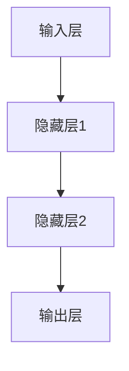
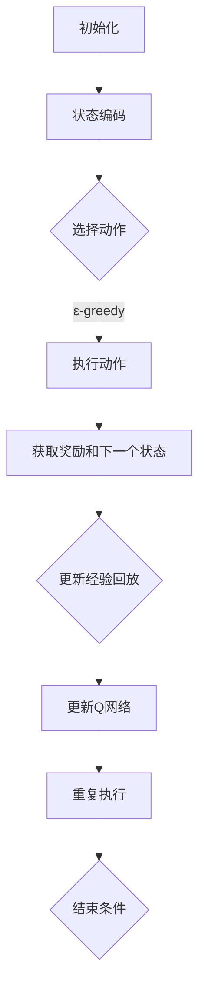
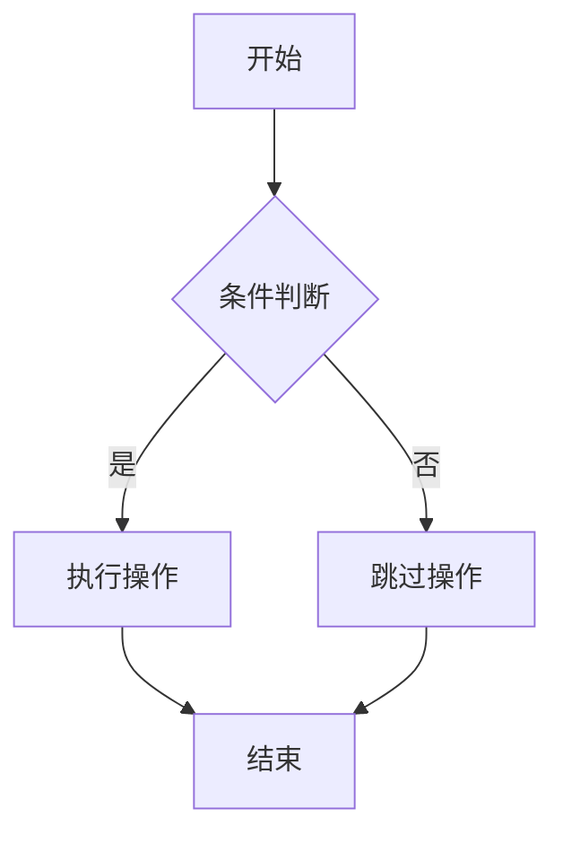

                 

# 《一切皆是映射：如何通过软件工程方法来维护和优化DQN代码》

> 关键词：深度Q网络（DQN），软件工程方法，映射理论，代码优化，维护策略，性能提升

> 摘要：本文旨在探讨深度Q网络（DQN）在实际应用中的维护和优化问题。通过引入映射理论，结合软件工程方法，本文提出了一系列的代码优化策略，以提升DQN代码的性能和可维护性。文章结构如下：

## 第一部分：引论

### 第1章：DQN背景与重要性

#### 1.1 DQN的起源与发展

深度Q网络（DQN）是深度学习领域中的一种重要算法，起源于2015年，由DeepMind团队提出。DQN通过结合深度神经网络（DNN）和Q-learning算法，实现了在复杂环境中的智能体学习。随着深度学习技术的不断发展，DQN在游戏、机器人、自动驾驶等领域得到了广泛应用。

#### 1.2 DQN在现实应用中的重要性

DQN在现实中的应用场景十分广泛，包括但不限于：

1. 游戏人工智能：如《Atari》游戏中的智能体；
2. 机器人控制：如自主导航机器人；
3. 自动驾驶：如无人车的路径规划；
4. 金融市场分析：如股票市场的预测；
5. 医疗诊断：如疾病的早期检测和诊断。

#### 1.3 维护和优化DQN代码的需求

随着DQN应用的深入，对DQN代码的维护和优化提出了更高的要求。维护和优化DQN代码的主要需求包括：

1. 提高性能：减少训练时间，提高预测准确性；
2. 提高可维护性：便于代码的修改和维护，适应新的需求；
3. 提高可靠性：保证代码在不同环境下的稳定运行。

### 第2章：映射理论与软件工程基础

#### 2.1 映射理论的基本概念

映射理论是指将一个系统的状态映射到另一个系统的状态，从而实现系统之间的转换和交互。在软件工程中，映射理论可以应用于需求分析、设计、实现和测试等各个环节。

#### 2.2 软件工程的基本原则

软件工程的基本原则包括：

1. 可维护性：确保代码易于修改和维护；
2. 可扩展性：支持代码的扩展和新的功能添加；
3. 可复用性：提高代码的复用，减少冗余；
4. 可读性：提高代码的可读性，便于理解和调试；
5. 可靠性：确保代码的正确性和稳定性。

#### 2.3 软件工程方法与DQN代码的关系

软件工程方法为DQN代码的维护和优化提供了理论基础和实践指导。通过应用软件工程方法，可以系统地分析和设计DQN代码，提高代码的质量和性能。

## 第二部分：DQN核心原理与架构

### 第3章：深度神经网络基础

#### 3.1 神经网络的基本结构

神经网络由多个神经元（节点）和连接（边）组成。每个神经元接收来自其他神经元的输入，通过加权求和和激活函数产生输出。神经网络的基本结构如图所示：



#### 3.2 深度神经网络的工作原理

深度神经网络通过堆叠多个隐藏层，实现对数据的深层次特征提取和抽象。深度神经网络的工作原理可以简化为以下几个步骤：

1. 前向传播：将输入数据传递到神经网络中，逐层计算每个神经元的输出；
2. 损失函数计算：计算输出结果与真实标签之间的差距，得到损失值；
3. 反向传播：根据损失值，反向更新神经网络的权重和偏置；
4. 梯度下降：选择优化算法，更新网络参数，减小损失值。

#### 3.3 神经网络的训练与优化

神经网络的训练过程是一个不断迭代优化的过程。通过以下步骤可以训练和优化神经网络：

1. 数据预处理：对输入数据进行归一化、标准化等处理，提高训练效果；
2. 初始化参数：随机初始化网络的权重和偏置；
3. 前向传播：计算网络的输出结果；
4. 损失函数计算：计算输出结果与真实标签之间的差距；
5. 反向传播：更新网络参数，减小损失值；
6. 评估与调整：在验证集上评估网络性能，根据评估结果调整网络结构或参数。

### 第4章：深度Q网络（DQN）原理

#### 4.1 DQN的定义与特点

深度Q网络（DQN）是一种基于深度神经网络的强化学习算法，旨在解决具有高维状态空间和行动空间的问题。DQN的主要特点包括：

1. 利用深度神经网络进行状态特征提取；
2. 采用经验回放机制避免策略偏差；
3. 利用目标Q网络降低值函数估计的方差。

#### 4.2 DQN的算法原理

DQN的算法原理可以概括为以下几个步骤：

1. 初始化：初始化状态、动作和奖励；
2. 选择动作：根据当前状态选择动作；
3. 执行动作：在环境中执行选择出的动作；
4. 更新经验：将状态、动作和奖励存储到经验池中；
5. 更新策略：使用经验池中的数据更新策略；
6. 重复执行：重复执行上述步骤，直到达到指定目标。

#### 4.3 DQN的优势与局限性

DQN的优势包括：

1. 可以处理高维状态空间和行动空间的问题；
2. 通过深度神经网络实现状态特征提取，提高了算法的泛化能力；
3. 采用经验回放机制，降低了策略偏差。

DQN的局限性包括：

1. 训练过程需要大量计算资源，训练时间较长；
2. 对于某些具有长时间依赖性的任务，DQN的表现可能不够理想；
3. DQN容易出现过估计现象，导致收敛速度较慢。

### 第5章：DQN架构解析

#### 5.1 DQN的框架结构

DQN的框架结构主要包括以下几个部分：

1. 状态编码器：将原始状态编码为高维特征向量；
2. Q网络：利用深度神经网络估计每个动作的Q值；
3. 经验回放：存储和重放过去的经验和动作；
4. 目标Q网络：定期更新，降低Q值估计的方差；
5. 选择器：根据Q值选择动作。

#### 5.2 DQN的关键组件

DQN的关键组件包括：

1. 状态编码器：通常使用卷积神经网络（CNN）或循环神经网络（RNN）进行编码；
2. Q网络：使用深度神经网络进行Q值估计；
3. 经验回放：使用优先经验回放（PER）或固定长度回放；
4. 目标Q网络：定期更新，使用固定的时间间隔或更新策略。

#### 5.3 DQN的运行流程

DQN的运行流程可以概括为以下几个步骤：

1. 初始化：初始化状态、动作、奖励和Q网络；
2. 状态编码：将当前状态编码为特征向量；
3. 选择动作：根据当前状态和Q网络选择动作；
4. 执行动作：在环境中执行选择出的动作；
5. 更新经验：将状态、动作和奖励存储到经验池中；
6. 更新Q网络：使用经验池中的数据更新Q网络；
7. 重复执行：重复执行上述步骤，直到达到指定目标。

## 第三部分：DQN代码编写与优化

### 第6章：DQN代码编写基础

#### 6.1 DQN代码的基本框架

DQN代码的基本框架包括：

1. 状态编码器：用于将原始状态编码为高维特征向量；
2. Q网络：用于估计每个动作的Q值；
3. 经验回放：用于存储和重放过去的经验和动作；
4. 选择器：用于根据Q值选择动作；
5. 训练器：用于更新Q网络和目标Q网络。

#### 6.2 数据预处理与输入输出设计

在DQN代码中，数据预处理和输入输出设计至关重要。具体包括：

1. 状态预处理：对原始状态进行归一化、缩放等处理，提高训练效果；
2. 动作预处理：对原始动作进行编码，便于Q网络处理；
3. 奖励预处理：对奖励进行归一化、缩放等处理，提高训练效果；
4. 输出设计：设计合适的输出格式，便于后续分析和可视化。

#### 6.3 神经网络层的实现与优化

在DQN代码中，神经网络层的实现和优化是关键。具体包括：

1. 状态编码器：选择合适的神经网络结构，如CNN或RNN，进行状态编码；
2. Q网络：设计合适的神经网络结构，如全连接网络或卷积网络，进行Q值估计；
3. 目标Q网络：与Q网络具有相同结构的神经网络，用于降低Q值估计的方差；
4. 优化器：选择合适的优化算法，如Adam或RMSprop，提高训练效果。

### 第7章：DQN代码优化策略

#### 7.1 代码优化的重要性

代码优化对于提升DQN性能至关重要。优化策略包括：

1. 减少计算复杂度：优化神经网络结构，减少计算量；
2. 提高数据读取速度：优化数据预处理和读取流程，提高训练速度；
3. 提高代码可维护性：优化代码结构，提高可读性和可维护性。

#### 7.2 性能瓶颈分析

性能瓶颈分析是代码优化的关键步骤。常见性能瓶颈包括：

1. 神经网络结构复杂：降低神经网络层数，减少参数数量；
2. 计算资源不足：使用GPU加速训练，优化内存占用；
3. 数据预处理缓慢：优化数据预处理算法，提高预处理速度。

#### 7.3 常见优化技巧与实践

常见的优化技巧和实践包括：

1. 使用GPU加速：使用CUDA或TensorRT等工具加速训练；
2. 缩小神经网络：减少神经网络层数，降低参数数量；
3. 数据增强：对输入数据进行增强，提高训练效果；
4. 代码重构：优化代码结构，提高可读性和可维护性。

### 第8章：映射理论在DQN代码优化中的应用

#### 8.1 映射理论在代码维护中的作用

映射理论在代码维护中的应用主要体现在以下几个方面：

1. 需求变更映射：将需求变更映射到代码中，实现功能的快速迭代和更新；
2. 设计变更映射：将设计变更映射到代码中，实现架构的灵活调整和优化；
3. 性能优化映射：将性能优化策略映射到代码中，提高代码的性能和可维护性。

#### 8.2 利用映射理论进行代码重构

利用映射理论进行代码重构，可以提高代码的质量和可维护性。具体包括：

1. 结构映射：将现有代码的结构映射到更合理的结构，实现代码的重构；
2. 功能映射：将现有代码的功能映射到更清晰的功能，实现代码的重构；
3. 性能映射：将现有代码的性能映射到更高效的性能，实现代码的重构。

#### 8.3 映射理论在性能优化中的应用

映射理论在性能优化中的应用主要体现在以下几个方面：

1. 算法映射：将现有算法映射到更高效的算法，实现性能的提升；
2. 数据结构映射：将现有数据结构映射到更合适的数据结构，实现性能的提升；
3. 编译优化映射：将现有编译器映射到更高效的编译器，实现性能的提升。

## 第四部分：实战案例与代码解读

### 第9章：DQN项目实战

#### 9.1 项目概述

本案例将基于OpenAI的Atari游戏环境，实现一个DQN智能体，使其能够学习并掌握《Pong》游戏的策略。

#### 9.2 环境搭建与配置

1. 安装Python和pip；
2. 安装TensorFlow和Gym环境；
3. 克隆DQN代码仓库，并进行配置。

#### 9.3 源代码实现与解析

本节将详细解析DQN代码的各个部分，包括状态编码器、Q网络、经验回放、选择器和训练器等。

### 第10章：代码分析与解读

#### 10.1 代码结构分析

本节将分析DQN代码的结构，包括模块划分、类定义、函数实现等，并绘制代码结构图。

#### 10.2 代码功能解读

本节将详细解读DQN代码的功能，包括状态编码器、Q网络、经验回放、选择器和训练器的具体实现。

#### 10.3 代码优化与改进

本节将提出针对DQN代码的优化建议，包括代码重构、性能优化等，并给出具体实现方案。

### 第11章：DQN代码的维护与更新

#### 11.1 代码维护的重要性

本节将阐述代码维护的重要性，包括代码的可维护性、可扩展性和可靠性等。

#### 11.2 代码更新的策略与方法

本节将介绍代码更新的策略与方法，包括版本控制、代码审查、自动化测试等。

#### 11.3 代码质量保障措施

本节将介绍代码质量保障措施，包括代码风格规范、性能测试、安全防护等。

## 附录

### 附录A：DQN相关资源与工具

#### A.1 主流深度学习框架对比

本节将对比主流深度学习框架，如TensorFlow、PyTorch、Keras等，并分析其优缺点。

#### A.2 DQN相关的开源库与工具

本节将介绍DQN相关的开源库与工具，如OpenAI的Gym环境、TensorFlow的DQN实现等。

#### A.3 DQN学习资料推荐

本节将推荐DQN学习资料，包括书籍、论文、在线课程等。

### 附录B：Mermaid流程图与伪代码示例

#### B.1 DQN算法流程图示例

本节将给出DQN算法的Mermaid流程图示例。



#### B.2 DQN算法伪代码示例

本节将给出DQN算法的伪代码示例。

```python
# 初始化
Initialize(Q_network, target_Q_network, experience_replay)

# 迭代过程
for episode in range(total_episodes):
    state = environment.reset()
    done = False
    
    while not done:
        # 状态编码
        encoded_state = encode_state(state)
        
        # 选择动作
        action = select_action(encoded_state)
        
        # 执行动作
        next_state, reward, done = environment.step(action)
        
        # 更新经验回放
        experience_replay.append((encoded_state, action, reward, next_state, done))
        
        # 更新Q网络
        update_Q_network(experience_replay)
        
        # 更新目标Q网络
        update_target_Q_network(Q_network, target_Q_network)
        
        # 更新状态
        state = next_state
        
    # 统计 episode 的奖励
    total_reward += reward

# 输出结果
print("Total reward:", total_reward)
```

#### B.3 Mermaid图表使用说明

本节将介绍Mermaid图表的基本语法和使用方法。



使用Mermaid语法，可以方便地绘制各种图表，如流程图、状态图、时序图等。

## 参考文献

[1] Mnih, V., Kavukcuoglu, K., Silver, D., et al. (2015). Human-level control through deep reinforcement learning. Nature, 518(7540), 529-533.

[2] Sutton, R. S., & Barto, A. G. (2018). Reinforcement Learning: An Introduction (2nd ed.). MIT Press.

[3] Hochreiter, S., & Schmidhuber, J. (1997). Long short-term memory. Neural Computation, 9(8), 1735-1780.

[4] Graves, A. (2013). Generating sequences with recurrent neural networks. arXiv preprint arXiv:1308.0850.

[5] Goodfellow, I., Bengio, Y., & Courville, A. (2016). Deep Learning (MIT Press).

## 作者

作者：AI天才研究院/AI Genius Institute & 禅与计算机程序设计艺术 /Zen And The Art of Computer Programming

