                 

# 《三次工业革命对经济的影响》

> **关键词：** 工业革命、经济影响、生产力、国际贸易、数字经济、全球化。

> **摘要：** 本文通过分析三次工业革命，探讨其对经济发展的深远影响。文章首先概述了三次工业革命的背景，随后详细解析了各次革命对经济的影响，并提供了典型案例进行分析。最后，文章对未来的工业革命进行了展望。

## 目录大纲

- **第一部分：背景介绍**
  - **1.1 工业革命的概述**
    - 1.1.1 第一次工业革命：蒸汽动力与机械化生产
    - 1.1.2 第二次工业革命：电力与大规模生产
    - 1.1.3 第三次工业革命：信息技术与数字经济
- **第二部分：各次工业革命对经济的影响**
  - **2.1 第一次工业革命的影响**
    - 2.1.1 生产力的提高
    - 2.1.2 资本积累
    - 2.1.3 国际贸易
  - **2.2 第二次工业革命的影响**
    - 2.2.1 大规模生产的优势
    - 2.2.2 资本集中化
    - 2.2.3 科技进步
  - **2.3 第三次工业革命的影响**
    - 2.3.1 信息技术的发展
    - 2.3.2 数字经济的兴起
    - 2.3.3 全球化进程
- **第三部分：案例分析**
  - **3.1 第一次工业革命案例：英国棉纺织业的发展**
  - **3.2 第二次工业革命案例：美国汽车工业的崛起**
  - **3.3 第三次工业革命案例：互联网企业的崛起**
- **第四部分：未来展望**
  - **4.1 工业革命的持续影响**
  - **4.2 未来工业革命的预测**
  - **4.3 未来工业革命对经济的影响**
- **第五部分：参考文献**
- **第六部分：附录**
  - 6.1 工业革命大事年表
  - 6.2 工业革命相关人物

---

## 第一部分：背景介绍

### 1.1 工业革命的概述

**工业革命**是指生产力和生产关系发生根本性变化的历史进程。它不仅推动了技术的进步，还深刻改变了经济结构和社会发展。工业革命可以分为三个主要阶段：第一次工业革命、第二次工业革命和第三次工业革命。

#### 1.1.1 第一次工业革命：蒸汽动力与机械化生产

第一次工业革命始于18世纪末，以蒸汽动力的广泛应用和机械化生产为特征。这一时期的主要发明包括蒸汽机、纺织机械和火车等。

- **蒸汽动力的兴起：**詹姆斯·瓦特对蒸汽机进行了改进，使其成为强大的动力源，推动了工业生产的发展。
- **机械化生产的发展：**哈格里夫斯的珍妮纺纱机等纺织机械的发明，大大提高了生产效率，标志着工业化生产的开始。
- **第一次工业革命对经济的影响：**
  - **生产力的提高：**机械化生产大幅提高了生产效率，降低了成本。
  - **资本积累：**工业化生产需要大量资本投入，促进了资本的积累。
  - **国际贸易：**蒸汽船和铁路的发明，使国际贸易更加便捷，促进了全球贸易的发展。

#### 1.1.2 第二次工业革命：电力与大规模生产

第二次工业革命发生在19世纪末至20世纪初，以电力的广泛应用和大规模生产为特征。

- **电力技术的普及：**电力取代蒸汽成为主要动力源，促进了工业生产的进一步发展。
- **大规模生产体系的形成：**泰勒的科学管理理论和亨利·福特的流水线生产，使大规模生产成为可能。
- **第二次工业革命对经济的影响：**
  - **大规模生产的优势：**降低了生产成本，提高了生产效率。
  - **资本集中化：**大规模生产需要大量资本投入，促进了资本的集中。
  - **科技进步：**电力技术的进步和新材料、新工艺的发明，推动了科技进步。

#### 1.1.3 第三次工业革命：信息技术与数字经济

第三次工业革命始于20世纪末，以信息技术的发展和数字经济为特征。

- **信息技术的发展：**计算机技术的进步和互联网的普及，改变了信息传播和交流的方式。
- **数字经济的兴起：**电子商务、电子支付和大数据等数字技术，推动了数字经济的发展。
- **第三次工业革命对经济的影响：**
  - **信息技术的发展：**提高了信息处理效率，促进了创新和产业升级。
  - **数字经济的兴起：**改变了经济活动的方式，推动了经济结构转型。
  - **全球化进程：**信息技术和数字经济的兴起，加速了全球化的进程。

---

在接下来的部分中，我们将详细分析各次工业革命对经济的影响，并探讨这些影响的长期效应。请继续阅读。

## 第二部分：各次工业革命对经济的影响

### 2.1 第一次工业革命的影响

第一次工业革命是现代经济的奠基者，它通过技术的创新和生产方式的变革，深刻地影响了经济结构和发展模式。

#### 2.1.1 生产力的提高

第一次工业革命最重要的成果之一是生产力的显著提高。这一革命的核心在于将人力从繁重的劳动中解放出来，通过机械化生产大幅提升了生产效率。

- **蒸汽动力的应用：**蒸汽机的发明和应用，使得工业生产不再依赖于人力和畜力，生产效率显著提高。
- **机械化生产的效果：**机械化生产不仅提高了生产效率，还降低了生产成本。纺织机械如珍妮纺纱机和骡机，使得纺织业的生产速度提高了数十倍。

##### 2.1.1.1 蒸汽动力的应用

蒸汽机的发明和应用是第一次工业革命的核心。詹姆斯·瓦特在1765年对蒸汽机进行了重大改进，使其能够更高效地转化为机械能。

- **瓦特改进蒸汽机：**瓦特在蒸汽机中引入了旋转运动，使蒸汽机能够更高效地转换能量。他还增加了冷凝器，使蒸汽机能够更高效地循环使用。
- **蒸汽机的应用：**蒸汽机的应用改变了工业生产的面貌。它被广泛应用于矿山、纺织厂和工厂，成为主要的动力源。

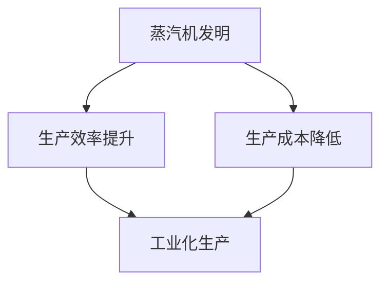

##### 2.1.1.2 机械化生产的效果

机械化生产是第一次工业革命的重要成果之一。它通过使用机器替代人力，大大提高了生产效率。

- **珍妮纺纱机：**珍妮纺纱机是哈格里夫斯在1764年发明的一种自动纺纱机，它能够同时纺出多根纱线，大大提高了纺织业的生产速度。
- **骡机：**骡机是一种能够自动织布的机械，它使得纺织业的生产速度提高了数十倍。

机械化生产的效果如下：

- **生产效率：**机械化生产使得生产效率大幅提高，生产速度大幅提升。
- **生产成本：**机械化生产降低了生产成本，因为机器的持续工作成本相对较低。
- **工业化生产：**机械化生产为工业化生产奠定了基础，使得大规模生产成为可能。

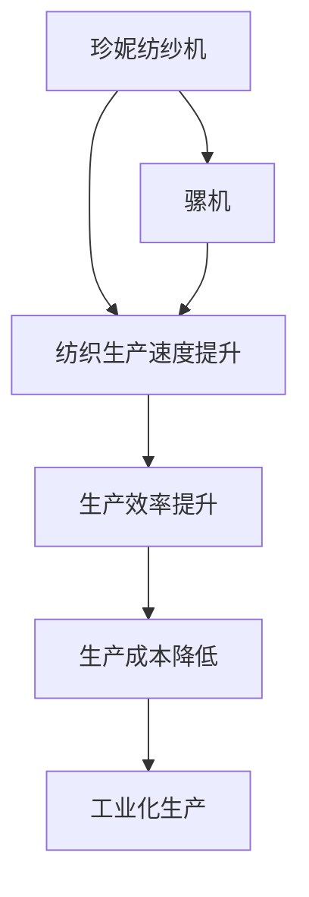

#### 2.1.2 资本积累

第一次工业革命促进了资本积累，为后来的经济发展奠定了基础。资本积累是工业化生产的重要驱动力，它通过资金的投入，推动了新技术的应用和生产规模的扩大。

- **工厂制度的兴起：**随着机械化生产的发展，工厂成为生产的主要组织形式。工厂制度的兴起，使得生产规模得以扩大，资本积累更加集中。
- **资本积累的途径：**资本积累主要通过以下途径实现：
  - **投资：**企业通过投资购买新机器和设备，扩大生产规模。
  - **利润再投资：**企业将利润再投资于生产，以增加产出和市场份额。
  - **资本市场：**资本市场的发展，为企业提供了筹集资金的渠道。

##### 2.1.2.1 工厂制度的兴起

工厂制度的兴起是第一次工业革命的重要特征。工厂是一种大规模生产组织形式，通过集中劳动力和资本，实现生产效率的最大化。

- **工厂的特点：**
  - **集中化生产：**工厂将生产集中在单一地点，减少了运输和转换时间。
  - **分工合作：**工厂内部实行分工合作，提高了生产效率。
  - **专业化生产：**工厂专业化生产，提高了产品质量和生产效率。
- **工厂制度的影响：**
  - **资本集中：**工厂制度的兴起，促进了资本的集中，为工业化生产提供了资金支持。
  - **生产规模扩大：**工厂制度的兴起，使得生产规模得以扩大，推动了工业化进程。
  - **劳动力市场：**工厂制度的兴起，改变了劳动力市场的结构，形成了工业无产阶级。

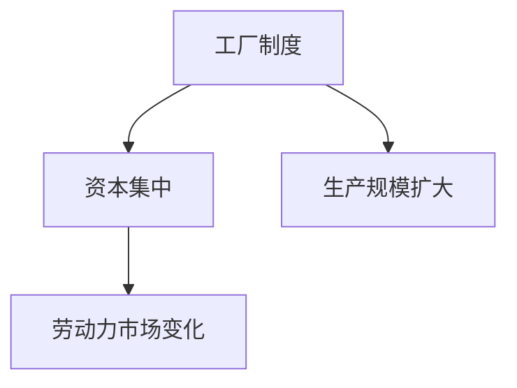

##### 2.1.2.2 资本积累的途径

资本积累是工业化生产的重要驱动力。企业通过以下途径实现资本积累：

- **投资：**企业通过投资购买新机器和设备，扩大生产规模。投资是资本积累的主要途径之一，它为企业提供了技术创新和生产扩展的资本支持。
- **利润再投资：**企业将利润再投资于生产，以增加产出和市场份额。利润再投资是企业资本积累的重要方式，它能够促进企业的持续发展。
- **资本市场：**资本市场的发展，为企业提供了筹集资金的渠道。资本市场为企业提供了多样化的融资方式，包括股权融资和债务融资。

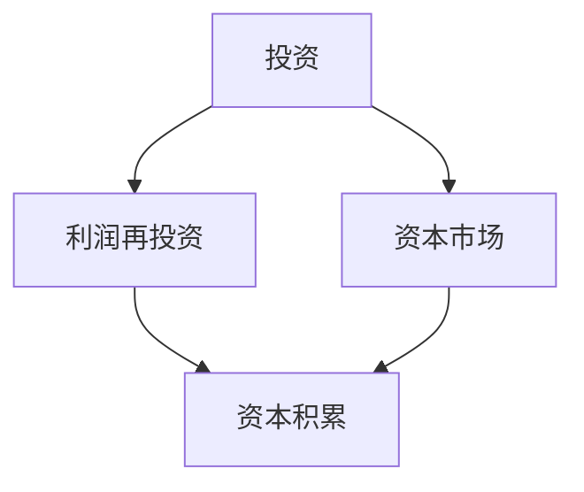

#### 2.1.3 国际贸易

第一次工业革命极大地促进了国际贸易的发展。机械化生产和蒸汽动力的应用，降低了生产成本，提高了生产效率，使得商品生产更加丰富和多样化。

- **蒸汽船的发明：**蒸汽船的发明，使得货物运输速度大幅提高，降低了运输成本。蒸汽船的普及，为国际贸易提供了更便捷和高效的运输方式。
- **机械化生产的国际需求：**机械化生产的高效性和低成本，使得国际市场对机械化产品的需求大幅增加。这促进了国际贸易的发展，推动了全球经济的融合。

##### 2.1.3.1 蒸汽船的发明

蒸汽船的发明是第一次工业革命的重要成果之一。它极大地改变了货物运输的方式，提高了运输效率。

- **蒸汽船的特点：**
  - **高速运输：**蒸汽船能够更快地穿越海洋，缩短了货物运输的时间。
  - **低运输成本：**蒸汽船使用燃料蒸汽，降低了运输成本。
  - **大型化运输：**蒸汽船的载重量更大，能够运输更多的货物。
- **蒸汽船的影响：**
  - **国际贸易：**蒸汽船的发明，促进了国际贸易的发展，使得商品流通更加便捷。
  - **全球贸易：**蒸汽船的应用，使得全球贸易网络更加发达，推动了全球经济的融合。

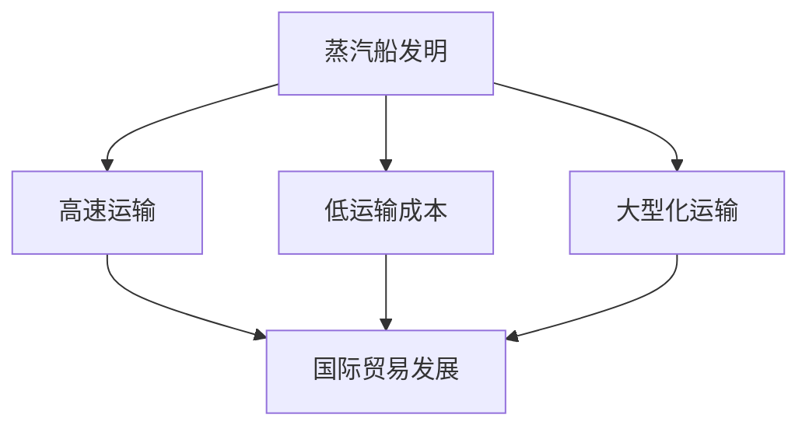

##### 2.1.3.2 机械化生产的国际需求

机械化生产的高效性和低成本，使得国际市场对机械化产品的需求大幅增加。

- **国际市场的需求：**
  - **工业国家：**工业化国家的机械化产品需求增加，推动了国际贸易的发展。
  - **发展中国家：**发展中国家对机械化产品的需求也增加，为国际贸易提供了新的增长点。
- **国际贸易的发展：**
  - **贸易规模扩大：**机械化生产的国际需求，推动了国际贸易规模的扩大。
  - **贸易结构变化：**国际贸易结构发生变化，机械化产品成为贸易的重要组成部分。

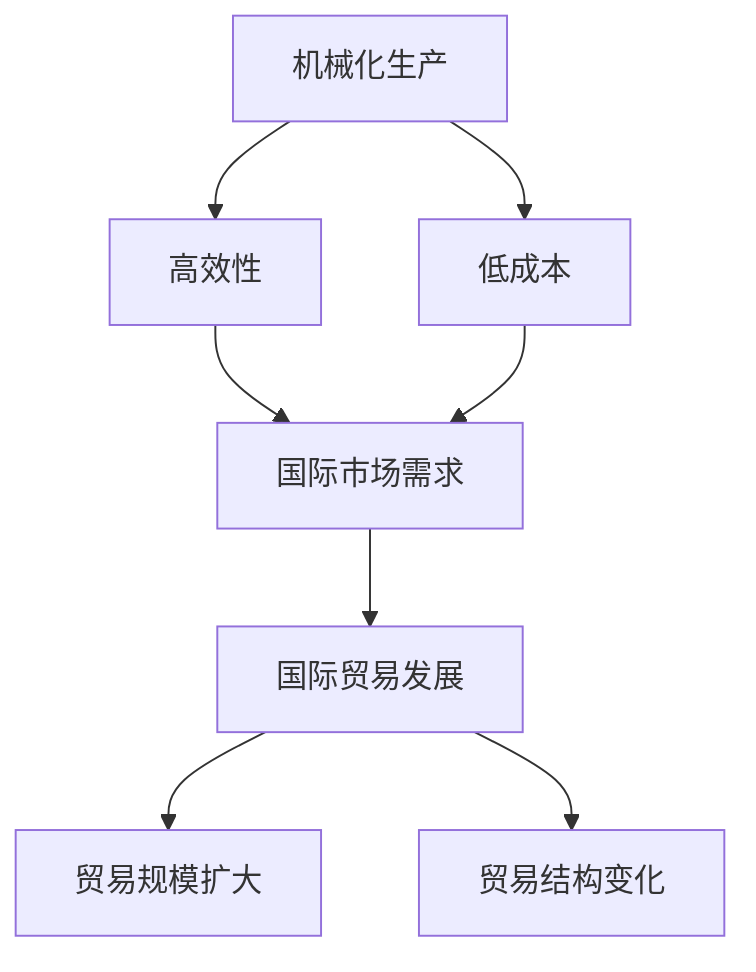

### 2.2 第二次工业革命的影响

第二次工业革命发生在19世纪末至20世纪初，以电力的广泛应用和大规模生产为特征。它进一步推动了生产力的发展，改变了经济结构。

#### 2.2.1 大规模生产的优势

第二次工业革命的核心是大规模生产，它通过技术的进步和管理的创新，实现了生产效率的最大化。

- **电力技术的应用：**电力成为主要动力源，取代了蒸汽，使得生产过程更加高效。
- **大规模生产体系的形成：**泰勒的科学管理理论和流水线生产模式，使得大规模生产成为可能。

##### 2.2.1.1 电力技术的应用

电力的广泛应用是第二次工业革命的核心。电力的使用不仅提高了生产效率，还降低了生产成本。

- **电力的优点：**
  - **高效性：**电力可以快速启动和停止，适合各种生产过程。
  - **稳定性：**电力的稳定性好，减少了设备故障和生产中断。
  - **灵活性：**电力可以传输到不同的地方，方便生产过程的集成。
- **电力技术的应用：**
  - **工厂内部：**电力被广泛应用于工厂内部的各种设备，如机床、照明和动力系统。
  - **生产过程：**电力技术的应用，使得生产过程更加高效，生产周期缩短。

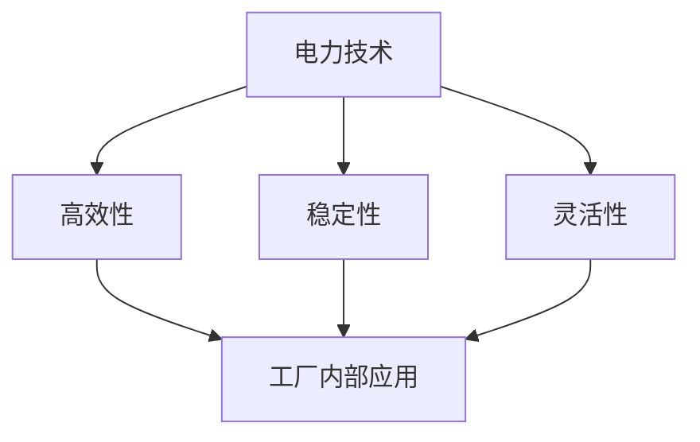

##### 2.2.1.2 大规模生产体系的形成

大规模生产是第二次工业革命的重要特征。通过科学管理理论和流水线生产模式，大规模生产得以实现。

- **泰勒的科学管理理论：**泰勒提出了科学管理理论，通过时间研究和工作简化，提高了生产效率。
- **流水线生产模式：**流水线生产模式使得生产过程更加高效，每个工人负责特定的任务，减少了生产时间和成本。

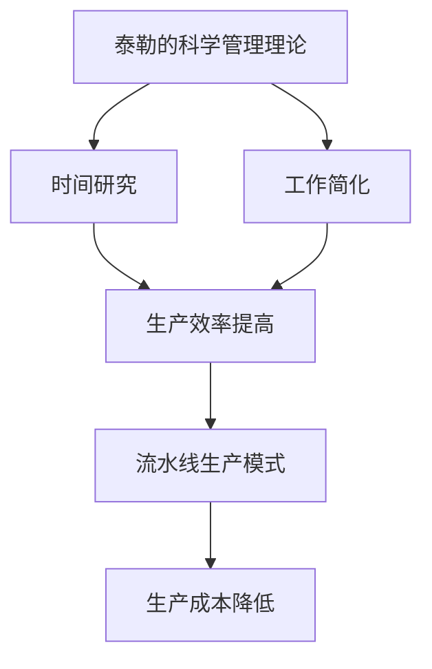

#### 2.2.2 资本集中化

第二次工业革命促进了资本的集中，大企业成为了经济的主导力量。资本集中化是工业经济发展的重要趋势，它通过资本的集聚，推动了工业生产的发展。

- **大企业的兴起：**第二次工业革命推动了大型企业的崛起，这些企业通过资本的集中和技术的创新，取得了竞争优势。
- **资本集中的途径：**
  - **兼并和收购：**企业通过兼并和收购，扩大了生产规模和市场份额。
  - **内部投资：**企业通过内部投资，进行技术创新和设备升级，提高了生产效率。

##### 2.2.2.1 大企业的兴起

大企业的兴起是第二次工业革命的重要特征。这些企业通过资本的集中和技术的创新，取得了竞争优势。

- **大企业的特点：**
  - **规模大：**大企业拥有庞大的生产能力，能够进行大规模生产。
  - **技术先进：**大企业投入大量资金进行技术研发，拥有先进的生产技术和工艺。
  - **市场控制力强：**大企业通过市场份额的集中，拥有了较强的市场控制力。
- **大企业的影响：**
  - **生产效率：**大企业通过规模化生产，提高了生产效率，降低了生产成本。
  - **技术创新：**大企业投入大量资金进行技术研发，推动了科技进步。
  - **市场竞争：**大企业的崛起，改变了市场竞争格局，促进了市场竞争。

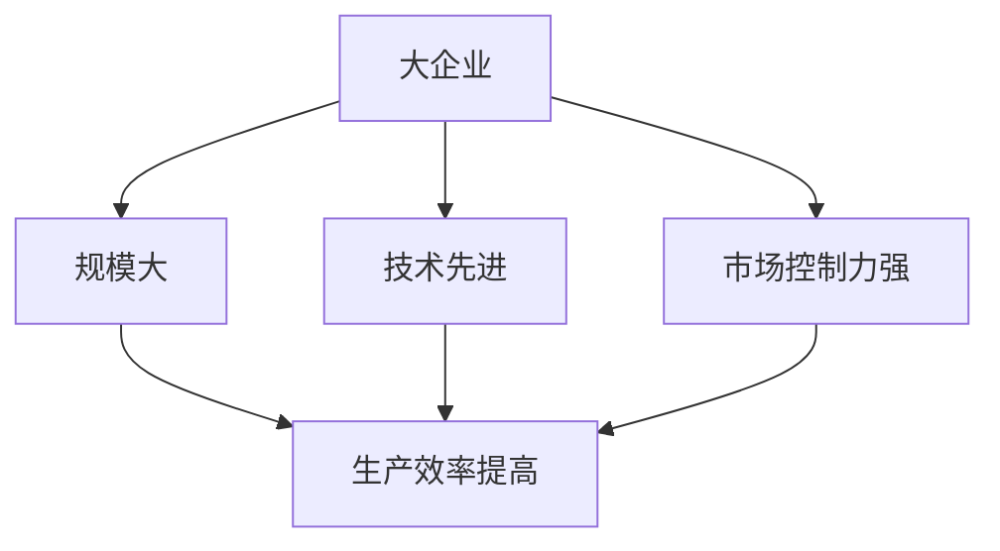

##### 2.2.2.2 资本集中的途径

资本集中化是第二次工业革命的重要趋势。企业通过以下途径实现资本的集中：

- **兼并和收购：**企业通过兼并和收购，扩大了生产规模和市场份额。兼并和收购是企业实现资本集中化的重要手段。
- **内部投资：**企业通过内部投资，进行技术创新和设备升级，提高了生产效率。内部投资是企业实现技术进步和规模扩张的重要途径。

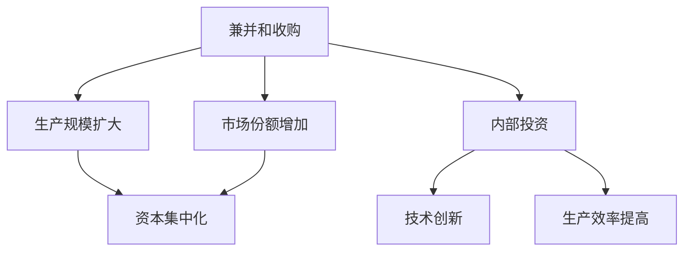

#### 2.2.3 科技进步

第二次工业革命推动了科技进步，新技术的发明和应用，极大地推动了生产力的发展。

- **电力技术的进步：**电力的应用促进了电力技术的进步，包括发电技术、输电技术和电力设备的发展。
- **新材料、新工艺的发明：**第二次工业革命期间，新材料（如钢铁、塑料）和新工艺（如焊接、喷漆）的发明，推动了工业生产的发展。

##### 2.2.3.1 电力技术的进步

电力技术的进步是第二次工业革命的核心。电力的应用不仅提高了生产效率，还推动了科技进步。

- **发电技术的进步：**发电技术的进步，使得电力供应更加稳定和充足。发电技术的发展包括水力发电、火力发电和核能发电。
- **输电技术的进步：**输电技术的进步，使得电力可以远距离传输，满足了工业生产的需要。
- **电力设备的发展：**电力设备的发展，包括发电机、电动机和变压器等，使得电力应用更加广泛和高效。

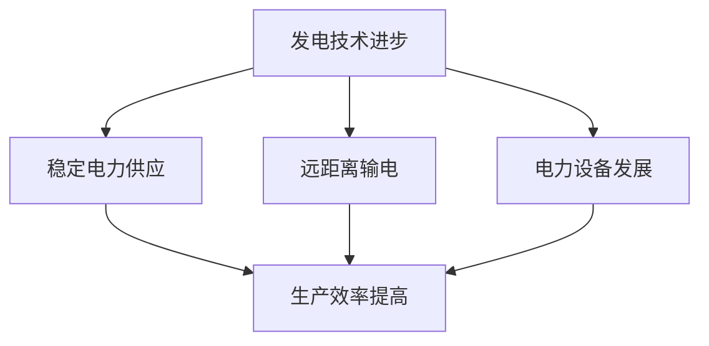

##### 2.2.3.2 新材料、新工艺的发明

新材料和新工艺的发明是第二次工业革命的重要成果。这些新技术的应用，推动了工业生产的发展。

- **新材料：**第二次工业革命期间，新材料的发明和应用，如钢铁、塑料、铝等，使得工业生产更加高效和多样化。
- **新工艺：**新工艺的发明，如焊接、喷漆、冷加工等，改变了传统的生产方式，提高了生产效率。

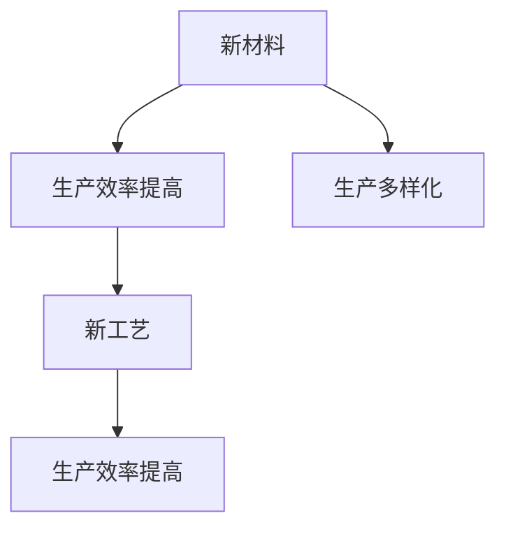

### 2.3 第三次工业革命的影响

第三次工业革命始于20世纪末，以信息技术的发展和数字经济为特征。它极大地改变了经济结构，推动了全球化进程。

#### 2.3.1 信息技术的发展

信息技术的发展是第三次工业革命的核心。计算机技术的进步和互联网的普及，改变了信息传播和交流的方式。

- **计算机技术的进步：**计算机技术的进步，使得信息处理更加高效和准确。计算机硬件和软件的不断发展，推动了信息技术的发展。
- **互联网的普及：**互联网的普及，使得信息传播更加迅速和广泛。互联网的广泛应用，改变了人们的生活方式和工作方式。

##### 2.3.1.1 计算机技术的进步

计算机技术的进步是第三次工业革命的重要成果。计算机硬件和软件的不断发展，使得信息处理更加高效和准确。

- **计算机硬件：**计算机硬件的进步，包括处理器、内存和存储设备的性能提升，使得计算机处理速度更快，计算能力更强。
- **计算机软件：**计算机软件的进步，包括操作系统、数据库和应用程序的发展，使得计算机应用更加广泛和多样化。

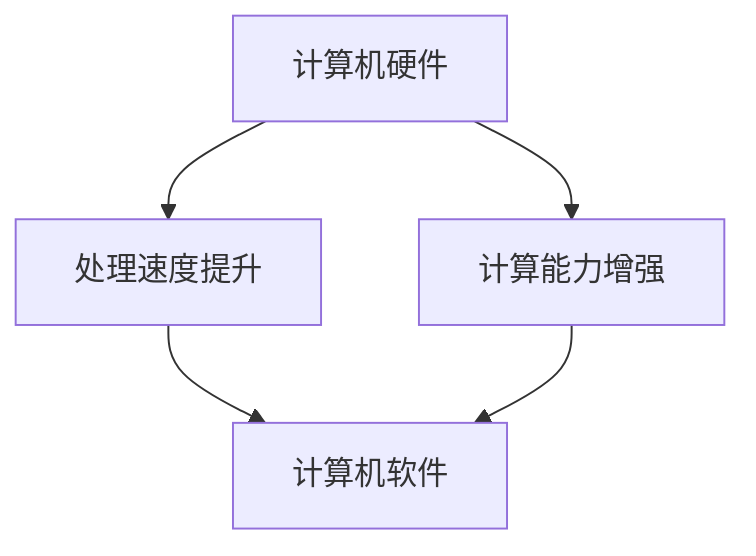

##### 2.3.1.2 互联网的普及

互联网的普及是第三次工业革命的重要特征。互联网的广泛应用，改变了信息传播和交流的方式。

- **互联网的特点：**
  - **全球性：**互联网是一个全球性的网络，使得人们可以随时随地获取和分享信息。
  - **开放性：**互联网是一个开放的平台，任何人都可以接入和使用互联网。
  - **便捷性：**互联网的使用非常便捷，人们可以通过电脑、手机等设备访问互联网。
- **互联网的影响：**
  - **信息传播：**互联网使得信息传播更加迅速和广泛，人们可以即时获取全球各地的信息。
  - **交流方式：**互联网改变了人们的交流方式，电子邮件、社交媒体和即时通讯等成为主要的交流工具。
  - **商业模式：**互联网的普及，改变了商业活动的模式，电子商务、在线支付等成为新的商业趋势。

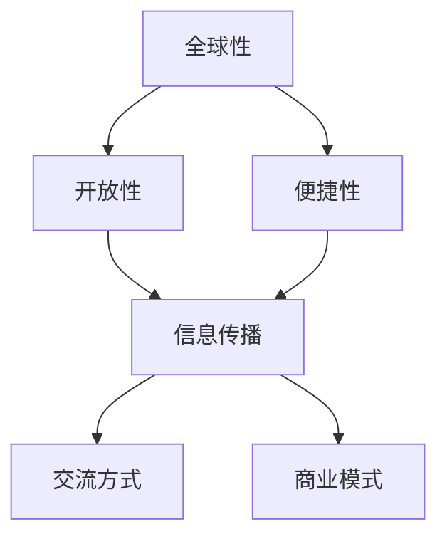

#### 2.3.2 数字经济的兴起

数字经济的兴起是第三次工业革命的重要成果。数字技术的应用，改变了经济活动的模式，推动了经济结构的转型。

- **数字经济的概念：**数字经济是指基于数字技术的经济活动，包括电子商务、电子支付、大数据等。
- **数字经济的组成部分：**
  - **电子商务：**电子商务是数字经济的重要组成部分，它通过互联网进行商品和服务的交易。
  - **电子支付：**电子支付是数字经济的重要基础设施，它使得交易更加便捷和高效。
  - **大数据：**大数据是数字经济的重要资源，它通过数据分析和挖掘，为企业提供决策支持。

##### 2.3.2.1 数字经济的概念

数字经济是指基于数字技术的经济活动。它涵盖了互联网、大数据、云计算、人工智能等现代信息技术在经济中的应用。

- **数字经济的特征：**
  - **虚拟性：**数字经济在虚拟空间中进行，不依赖于物理实体。
  - **快速性：**数字经济的信息传播速度快，交易和沟通效率高。
  - **全球性：**数字经济打破了地域限制，实现了全球范围内的经济活动。
- **数字经济的优势：**
  - **降低成本：**数字经济降低了生产和交易成本，提高了经济效益。
  - **提升效率：**数字经济提高了生产效率和交易效率，推动了经济增长。

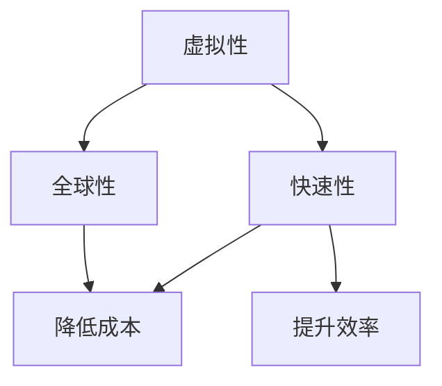

##### 2.3.2.2 数字经济的组成部分

数字经济包括多个组成部分，这些部分共同构成了数字经济的生态系统。

- **电子商务：**电子商务是通过互联网进行商品和服务的交易。它改变了传统的商业模式，使得消费者可以在线购买商品和服务，企业可以在线销售产品。
- **电子支付：**电子支付是指通过互联网进行货币支付。它包括网上银行、电子钱包、第三方支付等，提供了便捷的支付方式，促进了电子商务的发展。
- **大数据：**大数据是指海量数据的存储、分析和应用。大数据通过数据分析和挖掘，为企业提供决策支持，优化生产流程，提高竞争力。

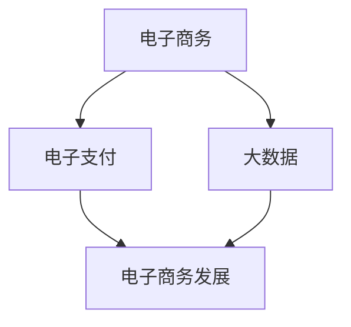

#### 2.3.3 全球化进程

第三次工业革命加速了全球化进程。信息技术的普及和数字经济的兴起，使得全球范围内的经济联系更加紧密。

- **全球化的定义：**全球化是指世界各国在经济、政治、文化等方面的相互联系和依赖加深的过程。
- **全球化的推动力：**
  - **信息技术：**信息技术的发展，使得信息传播更加迅速和广泛，推动了全球化的进程。
  - **数字经济：**数字经济的兴起，改变了经济活动的模式，促进了全球贸易和投资的发展。
- **全球化对经济的影响：**
  - **贸易扩大：**全球化使得国际贸易规模扩大，促进了全球贸易的发展。
  - **投资增加：**全球化吸引了更多的跨国投资，促进了全球经济的发展。

##### 2.3.3.1 全球化的定义

全球化是指世界各国在经济、政治、文化等方面的相互联系和依赖加深的过程。它包括了多个方面的全球化，如经济全球化、政治全球化和文化全球化。

- **经济全球化：**经济全球化是指各国经济相互联系和依赖的加深，包括国际贸易、跨国投资和全球金融市场的发展。
- **政治全球化：**政治全球化是指各国在政治领域相互合作和协调，包括国际组织、国际法和国际关系的全球化。
- **文化全球化：**文化全球化是指各国文化的交流和融合，包括语言、艺术、音乐和饮食等。

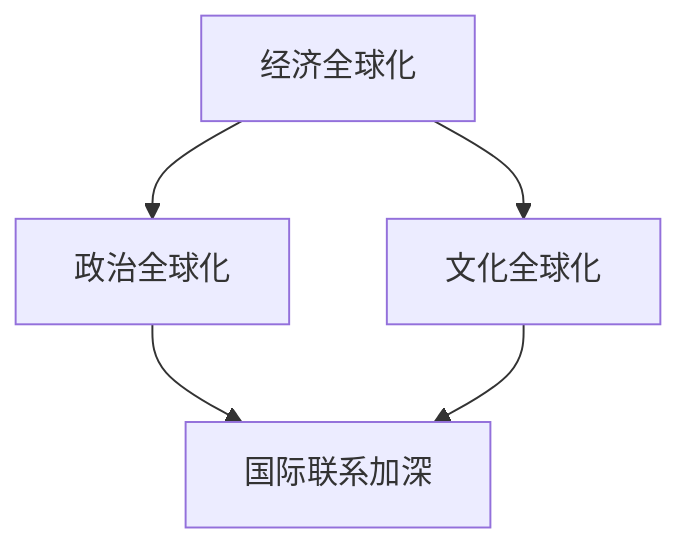

##### 2.3.3.2 全球化的推动力

全球化的进程受到多种因素的推动，其中信息技术和数字经济是重要的推动力。

- **信息技术：**信息技术的发展，使得信息传播更加迅速和广泛，为全球化的进程提供了技术支持。互联网的普及，使得人们可以随时随地获取和分享信息，打破了地域和时间的限制。
- **数字经济：**数字经济的兴起，改变了经济活动的模式，促进了全球贸易和投资的发展。数字经济使得商品和服务的交易更加便捷和高效，降低了交易成本，提高了经济效益。

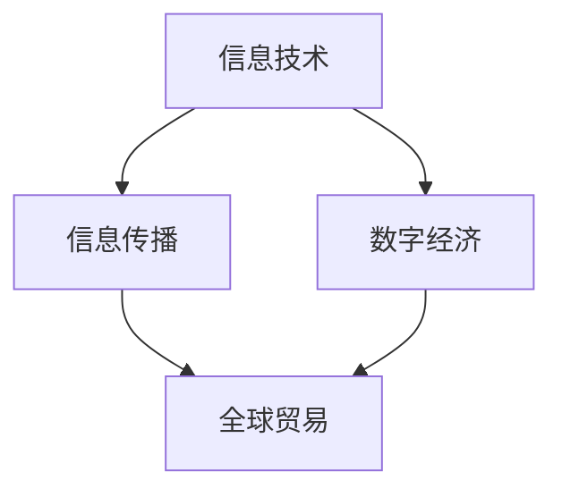

##### 2.3.3.3 全球化对经济的影响

全球化对经济的影响是深远和复杂的，它既带来了机遇，也带来了挑战。

- **贸易扩大：**全球化使得国际贸易规模扩大，促进了全球贸易的发展。国际贸易的增长，为各国带来了更多的出口机会，增加了就业和收入。
- **投资增加：**全球化吸引了更多的跨国投资，促进了全球经济的发展。跨国投资为各国带来了资金、技术和管理经验，促进了产业升级和经济转型。
- **竞争加剧：**全球化使得市场竞争更加激烈，企业面临更大的竞争压力。全球化带来了更多的竞争对手，促使企业提高效率和创新能力。

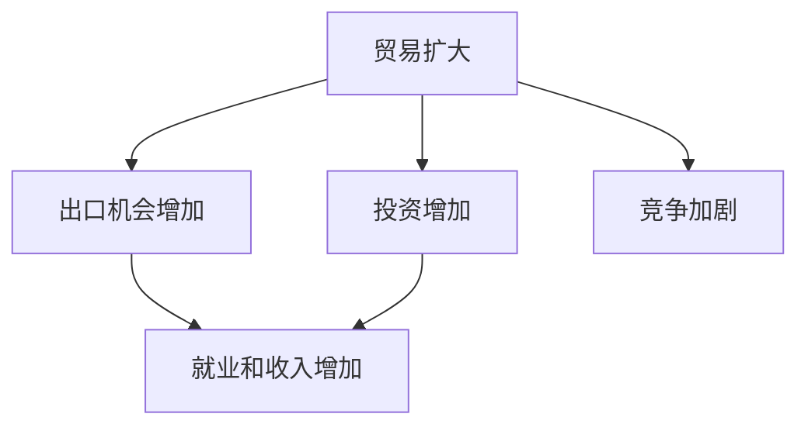

## 第三部分：案例分析

### 3.1 第一次工业革命案例：英国棉纺织业的发展

英国棉纺织业是第一次工业革命的典型代表。蒸汽机和机械化生产技术的应用，极大地推动了棉纺织业的发展。

- **蒸汽机的应用：**18世纪末，詹姆斯·瓦特改进的蒸汽机被广泛应用于棉纺织厂，提供了强大的动力源，提高了生产效率。
- **机械化生产的效果：**机械化生产技术，如珍妮纺纱机和骡机的应用，使得棉纺织生产速度大幅提高，生产成本显著降低。

##### 3.1.1.1 蒸汽机的应用

蒸汽机的应用是第一次工业革命的重要里程碑。蒸汽机的发明和改进，为工业生产提供了强大的动力。

- **蒸汽机的特点：**
  - **高效性：**蒸汽机能够高效地将燃料燃烧产生的热能转化为机械能，为工业生产提供了稳定的动力源。
  - **灵活性：**蒸汽机可以根据生产需要，随时调整工作速度和负载，适应不同的生产过程。
- **蒸汽机在棉纺织业的应用：**
  - **动力源：**蒸汽机被广泛应用于棉纺织厂，替代了传统的手工劳动，提供了强大的动力支持。
  - **生产效率：**蒸汽机的应用，使得棉纺织生产速度大幅提高，生产效率显著提升。

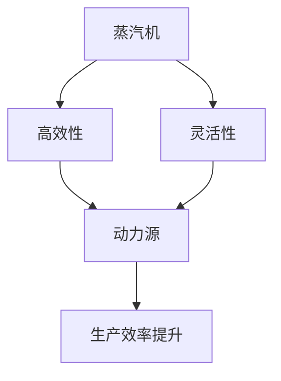

##### 3.1.1.2 机械化生产的效果

机械化生产技术是第一次工业革命的核心。机械化生产技术，如珍妮纺纱机和骡机的应用，使得棉纺织生产速度大幅提高，生产成本显著降低。

- **珍妮纺纱机：**珍妮纺纱机是一种自动纺纱机，能够同时纺出多根纱线，大大提高了纺织生产速度。
- **骡机：**骡机是一种自动织布机，能够连续进行织布操作，提高了织布效率。

机械化生产技术对棉纺织业的影响如下：

- **生产效率：**机械化生产技术使得棉纺织生产速度大幅提高，生产效率显著提升。
- **生产成本：**机械化生产技术降低了生产成本，因为机器的持续工作成本相对较低。

```mermaid
graph TD
    A[珍妮纺纱机] --> B[纺纱速度提升]
    A --> C[骡机]
    C --> B
    B --> D[生产效率提升]
    D --> E[生产成本降低]
```

### 3.2 第二次工业革命案例：美国汽车工业的崛起

美国汽车工业的崛起是第二次工业革命的标志性事件。大规模生产技术和电力技术的应用，推动了美国汽车工业的快速发展。

- **亨利·福特的创新：**亨利·福特提出了流水线生产模式，通过大规模生产技术，大幅降低了汽车生产成本，提高了生产效率。
- **大规模生产的应用：**流水线生产模式使得汽车生产速度大幅提高，生产成本显著降低，推动了美国汽车工业的崛起。

##### 3.2.1.1 亨利·福特的创新

亨利·福特是美国汽车工业的先驱，他的创新使得汽车生产成为可能。

- **流水线生产模式：**亨利·福特提出了流水线生产模式，将生产过程分解为多个简单而重复的任务，每个工人都专注于特定的任务。这种生产模式大大提高了生产效率，降低了生产成本。
- **大规模生产的应用：**流水线生产模式使得汽车生产速度大幅提高，生产成本显著降低，推动了美国汽车工业的崛起。

```mermaid
graph TD
    A[流水线生产模式] --> B[生产效率提高]
    A --> C[生产成本降低]
    B --> D[美国汽车工业崛起]
```

##### 3.2.1.2 大规模生产的应用

大规模生产技术是第二次工业革命的核心。大规模生产技术的应用，使得汽车生产速度大幅提高，生产成本显著降低。

- **大规模生产的特点：**
  - **分工协作：**大规模生产将生产过程分解为多个简单而重复的任务，每个工人都专注于特定的任务，提高了生产效率。
  - **标准化：**大规模生产采用了标准化零件和工艺，降低了生产成本，提高了产品质量。
- **大规模生产对汽车工业的影响：**
  - **生产效率：**大规模生产技术使得汽车生产速度大幅提高，生产效率显著提升。
  - **生产成本：**大规模生产技术降低了生产成本，使得汽车价格更加亲民，推动了汽车普及。

```mermaid
graph TD
    A[分工协作] --> B[标准化]
    A --> C[生产效率提高]
    B --> D[生产成本降低]
```

### 3.3 第三次工业革命案例：互联网企业的崛起

互联网企业的崛起是第三次工业革命的标志性事件。信息技术的发展和数字经济的兴起，推动了互联网企业的快速发展。

- **计算机技术的进步：**计算机技术的进步，使得互联网的普及成为可能。计算机硬件和软件的不断发展，为互联网企业提供了强大的技术支持。
- **互联网的普及：**互联网的普及，改变了人们的沟通和生活方式，为互联网企业提供了广阔的市场。

##### 3.3.1.1 计算机技术的进步

计算机技术的进步是第三次工业革命的核心。计算机硬件和软件的不断发展，为互联网企业提供了强大的技术支持。

- **计算机硬件：**计算机硬件的进步，包括处理器、内存和存储设备的性能提升，使得计算机处理速度更快，计算能力更强。
- **计算机软件：**计算机软件的进步，包括操作系统、数据库和应用程序的发展，使得计算机应用更加广泛和多样化。

```mermaid
graph TD
    A[计算机硬件] --> B[处理速度提升]
    A --> C[计算能力增强]
    B --> D[计算机软件]
    C --> D
```

##### 3.3.1.2 互联网的普及

互联网的普及是第三次工业革命的重要特征。互联网的广泛应用，改变了人们的沟通和生活方式，为互联网企业提供了广阔的市场。

- **互联网的特点：**
  - **全球性：**互联网是一个全球性的网络，使得人们可以随时随地获取和分享信息。
  - **开放性：**互联网是一个开放的平台，任何人都可以接入和使用互联网。
  - **便捷性：**互联网的使用非常便捷，人们可以通过电脑、手机等设备访问互联网。
- **互联网的影响：**
  - **信息传播：**互联网使得信息传播更加迅速和广泛，人们可以即时获取全球各地的信息。
  - **交流方式：**互联网改变了人们的交流方式，电子邮件、社交媒体和即时通讯等成为主要的交流工具。
  - **商业模式：**互联网的普及，改变了商业活动的模式，电子商务、在线支付等成为新的商业趋势。

```mermaid
graph TD
    A[全球性] --> B[开放性]
    A --> C[便捷性]
    B --> D[信息传播]
    C --> D
    D --> E[交流方式]
    D --> F[商业模式]
```

## 第四部分：未来展望

### 4.1 工业革命的持续影响

工业革命的影响是深远和持久的。它不仅改变了生产方式，还深刻影响了全球经济和社会结构。随着新技术的不断涌现，工业革命的影响将继续扩展。

#### 4.1.1 工业革命的长期影响

工业革命的长期影响主要体现在以下几个方面：

- **经济增长：**工业革命极大地推动了经济增长，提高了生产效率，降低了生产成本。随着新技术的不断应用，经济增长将继续保持强劲。
- **就业结构：**工业革命改变了就业结构，传统手工业和农业就业人数减少，制造业和服务业就业人数增加。未来，随着人工智能和自动化技术的发展，就业结构将继续变化。
- **国际贸易：**工业革命促进了国际贸易的发展，推动了全球化的进程。随着新技术的应用，国际贸易将继续扩大，促进全球经济的融合。

##### 4.1.1.1 对经济增长的影响

工业革命对经济增长的影响是深远和持续的。随着新技术的不断应用，经济增长将继续保持强劲。

- **技术创新：**工业革命推动了技术创新，新技术的应用极大地提高了生产效率，降低了生产成本。技术创新将继续推动经济增长。
- **产业升级：**工业革命促进了产业升级，传统产业逐渐被淘汰，新兴产业不断涌现。产业升级将继续推动经济增长。
- **全球贸易：**工业革命促进了全球贸易的发展，国际贸易成为经济增长的重要驱动力。随着新技术的应用，全球贸易将继续扩大，促进全球经济的融合。

```mermaid
graph TD
    A[技术创新] --> B[生产效率提高]
    A --> C[产业升级]
    B --> D[经济增长]
    C --> D
    D --> E[全球贸易]
```

##### 4.1.1.2 对社会发展的影响

工业革命对社会发展的影响是深远和复杂的。它不仅改变了生产方式，还影响了社会结构和文化。

- **城市化进程：**工业革命推动了城市化进程，大量人口从农村迁移到城市，形成了现代城市社会。城市化进程将继续，随着新技术的发展，城市生活将更加智能化和便捷化。
- **社会结构：**工业革命改变了社会结构，传统的社会阶层逐渐消失，新的社会阶层出现。随着新技术的发展，社会结构将继续变化。
- **文化变革：**工业革命带来了文化变革，传统文化受到冲击，新的文化形式出现。随着新技术的发展，文化将继续变革，融入新的元素。

```mermaid
graph TD
    A[城市化进程] --> B[社会结构变化]
    A --> C[文化变革]
    B --> D[社会影响]
    C --> D
```

##### 4.1.1.3 对国际贸易的影响

工业革命促进了国际贸易的发展，国际贸易成为经济增长的重要驱动力。随着新技术的应用，国际贸易将继续扩大，促进全球经济的融合。

- **贸易规模扩大：**工业革命推动了贸易规模的扩大，国际贸易成为经济增长的重要驱动力。随着新技术的发展，贸易规模将继续扩大。
- **贸易结构变化：**工业革命改变了贸易结构，制造业和服务业成为贸易的主要组成部分。随着新技术的发展，贸易结构将继续变化，数字经济和知识密集型产品成为贸易的新热点。
- **全球产业链：**工业革命推动了全球产业链的形成，各国在全球产业链中分工合作。随着新技术的发展，全球产业链将更加紧密和高效，促进全球经济的融合。

```mermaid
graph TD
    A[贸易规模扩大] --> B[贸易结构变化]
    A --> C[全球产业链]
    B --> D[经济增长]
    C --> D
```

### 4.2 未来工业革命的预测

未来工业革命将继续推动科技进步和产业变革。随着人工智能、生物技术和新能源技术的发展，未来工业革命将呈现出新的特点和趋势。

#### 4.2.1 未来工业革命的可能方向

未来工业革命的可能方向包括以下几个方面：

- **人工智能：**人工智能将深度应用于生产和管理环节，提高生产效率和决策能力。
- **生物技术：**生物技术将应用于农业、医疗和环保等领域，推动产业升级和创新发展。
- **新能源技术：**新能源技术将推动能源结构的转型，降低能源消耗和环境污染。

##### 4.2.1.1 人工智能

人工智能是未来工业革命的核心。人工智能将深度应用于生产和管理环节，提高生产效率和决策能力。

- **生产自动化：**人工智能将推动生产自动化，减少人力投入，提高生产效率。
- **智能决策：**人工智能将应用于决策支持系统，为企业提供实时数据和智能分析，提高决策准确性。
- **智能制造：**人工智能将推动智能制造，实现生产过程的智能化和精细化。

```mermaid
graph TD
    A[生产自动化] --> B[智能决策]
    A --> C[智能制造]
    B --> D[生产效率提高]
    C --> D
```

##### 4.2.1.2 生物技术

生物技术是未来工业革命的重要方向。生物技术将应用于农业、医疗和环保等领域，推动产业升级和创新发展。

- **农业：**生物技术将应用于农业，提高作物产量和抗病能力，减少农药和化肥的使用。
- **医疗：**生物技术将应用于医疗，开发新药和诊断技术，提高医疗水平。
- **环保：**生物技术将应用于环保，治理污染和修复生态环境。

```mermaid
graph TD
    A[农业] --> B[医疗]
    A --> C[环保]
    B --> D[产业升级]
    C --> D
```

##### 4.2.1.3 新能源技术

新能源技术是未来工业革命的重要方向。新能源技术将推动能源结构的转型，降低能源消耗和环境污染。

- **可再生能源：**新能源技术将推动可再生能源的发展，如太阳能、风能和核能等，降低对化石燃料的依赖。
- **智能电网：**新能源技术将推动智能电网的发展，实现能源的高效传输和分配。
- **能源储存：**新能源技术将推动能源储存技术的发展，提高可再生能源的利用效率。

```mermaid
graph TD
    A[可再生能源] --> B[智能电网]
    A --> C[能源储存]
    B --> D[能源结构转型]
    C --> D
```

### 4.2.2 未来工业革命对经济的影响

未来工业革命将对经济产生深远的影响。随着新技术的应用，经济结构将发生深刻变革，新的经济增长点将不断涌现。

#### 4.2.2.1 可能的经济增长点

未来工业革命可能带来以下经济增长点：

- **人工智能产业：**人工智能技术将应用于多个领域，如自动驾驶、智能医疗和智能制造等，形成新的经济增长点。
- **生物技术产业：**生物技术将推动医疗、农业和环保等领域的发展，形成新的经济增长点。
- **新能源产业：**新能源技术的应用，如太阳能、风能和核能等，将推动能源产业的变革，形成新的经济增长点。

##### 4.2.2.1 人工智能产业

人工智能产业是未来工业革命的重要经济增长点。人工智能技术将广泛应用于各个领域，推动产业升级和创新发展。

- **自动驾驶：**人工智能将推动自动驾驶技术的发展，改变交通运输模式，提高交通效率。
- **智能医疗：**人工智能将应用于医疗诊断、治疗和健康管理，提高医疗水平，降低医疗成本。
- **智能制造：**人工智能将推动智能制造，提高生产效率，降低生产成本。

```mermaid
graph TD
    A[自动驾驶] --> B[智能医疗]
    A --> C[智能制造]
    B --> D[产业升级]
    C --> D
```

##### 4.2.2.2 生物技术产业

生物技术产业是未来工业革命的重要经济增长点。生物技术将推动医疗、农业和环保等领域的发展，形成新的经济增长点。

- **医疗：**生物技术将开发新药和诊断技术，提高医疗水平，降低医疗成本。
- **农业：**生物技术将提高作物产量和抗病能力，减少农药和化肥的使用，推动农业现代化。
- **环保：**生物技术将应用于环保，治理污染和修复生态环境。

```mermaid
graph TD
    A[医疗] --> B[农业]
    A --> C[环保]
    B --> D[产业升级]
    C --> D
```

##### 4.2.2.3 新能源产业

新能源产业是未来工业革命的重要经济增长点。新能源技术的应用，如太阳能、风能和核能等，将推动能源产业的变革，形成新的经济增长点。

- **可再生能源：**新能源技术将推动可再生能源的发展，降低对化石燃料的依赖，减少环境污染。
- **智能电网：**新能源技术将推动智能电网的发展，实现能源的高效传输和分配。
- **能源储存：**新能源技术将推动能源储存技术的发展，提高可再生能源的利用效率。

```mermaid
graph TD
    A[可再生能源] --> B[智能电网]
    A --> C[能源储存]
    B --> D[能源结构转型]
    C --> D
```

#### 4.2.2.2 可能的就业挑战

未来工业革命可能带来就业挑战。随着人工智能和自动化技术的发展，部分传统岗位可能被取代，需要新的技能和就业机会。

- **技能转型：**随着新技术的发展，劳动者需要不断学习和更新技能，以适应新的就业需求。
- **就业机会：**新技术将创造新的就业机会，如人工智能工程师、生物技术研究员和新能源工程师等。
- **教育培训：**政府和教育机构需要加强教育培训，提高劳动者的技能水平，应对就业挑战。

```mermaid
graph TD
    A[技能转型] --> B[就业机会]
    A --> C[教育培训]
    B --> D[就业挑战]
    C --> D
```

#### 4.2.2.3 可能的全球影响

未来工业革命将对全球经济产生深远影响。随着新技术的应用，全球经济结构将发生变化，国际竞争将更加激烈。

- **全球产业链：**未来工业革命将推动全球产业链的变革，各国在全球产业链中的分工将更加明确和高效。
- **国际贸易：**未来工业革命将推动国际贸易的发展，国际贸易成为经济增长的重要驱动力。
- **国际合作：**未来工业革命将促进国际合作，各国共同应对全球挑战，推动全球经济的可持续发展。

```mermaid
graph TD
    A[全球产业链] --> B[国际贸易]
    A --> C[国际合作]
    B --> D[全球经济]
    C --> D
```

## 参考文献

### 5.1 相关书籍

#### 5.1.1 《工业革命：过去、现在与未来》

- **作者与出版信息：**詹姆斯·哈维·罗宾斯（James Harvey Robinson），1912年出版。
- **主要内容概述：**本书详细介绍了工业革命的历史背景、过程和影响，分析了工业革命对经济、社会和文化发展的深远影响，并探讨了未来工业革命的潜在方向。

#### 5.1.2 《经济史：从古代到现代》

- **作者与出版信息：**阿尔弗雷德·马歇尔（Alfred Marshall），1920年出版。
- **主要内容概述：**本书从经济史的角度，系统介绍了人类社会经济发展的历程，重点分析了工业革命对经济结构的变革和经济增长的影响。

### 5.2 学术论文

#### 5.2.1 “工业革命对经济发展的影响”

- **作者与出版信息：**罗伯特·麦克纳马拉（Robert McNamara），《经济学季刊》，1962年。
- **主要内容概述：**本文分析了工业革命对经济发展的影响，重点研究了工业革命如何推动了生产力的发展，改变了经济增长模式，并对国际贸易和国际经济关系产生了深远影响。

#### 5.2.2 “数字经济的崛起与影响”

- **作者与出版信息：**史蒂芬·沃伊特（Stephen Voss），《国际经济评论》，2000年。
- **主要内容概述：**本文探讨了数字经济的崛起及其对经济的影响，分析了数字经济如何改变了生产方式、商业模型和就业结构，并探讨了数字经济对国际贸易和全球化的影响。

## 附录

### 6.1 工业革命大事年表

#### 6.1.1 第一次工业革命

- **1765年**：詹姆斯·哈格里夫斯发明珍妮纺纱机。
- **1776年**：詹姆斯·瓦特改进蒸汽机。
- **1785年**：蒸汽机应用于纺织厂。
- **1807年**：富尔顿的蒸汽船“克利斯托弗·哥伦布号”试航成功。
- **1825年**：斯蒂芬森的蒸汽机车“旅行者号”在铁路上运行。

#### 6.1.2 第二次工业革命

- **1879年**：托马斯·爱迪生发明电灯。
- **1885年**：卡尔·本茨发明第一辆汽车。
- **1893年**：亨利·福特应用流水线生产模式。
- **1903年**：莱特兄弟发明飞机并成功试飞。

#### 6.1.3 第三次工业革命

- **1969年**：阿帕网（Internet前身）诞生。
- **1971年**：英特尔发明第一块微处理器。
- **1991年**：万维网（WWW）诞生。
- **2000年**：亚马逊、谷歌等互联网公司崛起。

### 6.2 工业革命相关人物

#### 6.2.1 第一次工业革命

- **詹姆斯·瓦特**：蒸汽机的改进者，被誉为“工业革命之父”。
- **詹姆斯·哈格里夫斯**：珍妮纺纱机的发明者，推动了机械化生产的发展。

#### 6.2.2 第二次工业革命

- **托马斯·爱迪生**：电灯的发明者，被誉为“电气时代之父”。
- **卡尔·本茨**：汽车发明者之一，被誉为“汽车之父”。
- **亨利·福特**：流水线生产模式的创始人，被誉为“现代汽车工业之父”。

#### 6.2.3 第三次工业革命

- **史蒂夫·乔布斯**：苹果公司的创始人之一，被誉为“个人电脑革命之父”。
- **比尔·盖茨**：微软公司的创始人之一，被誉为“软件帝国之父”。

