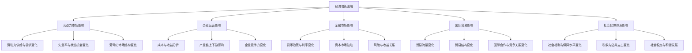
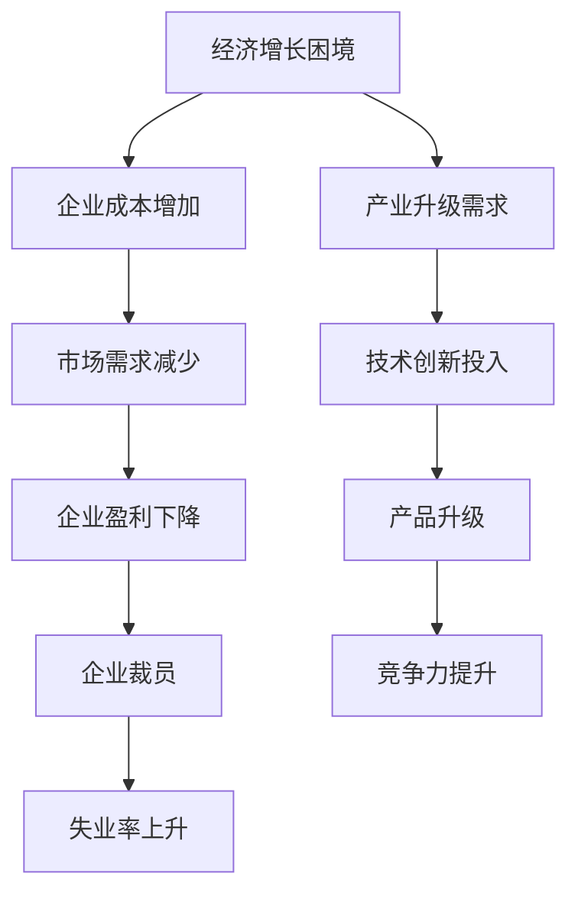
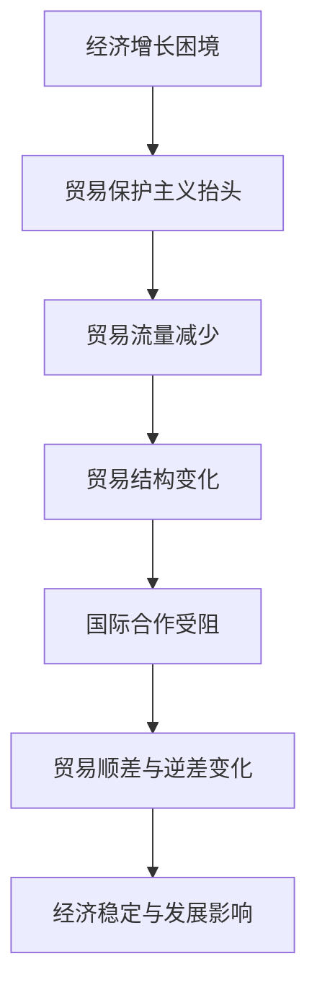

                 

### 引言与背景

#### 引言

世界经济增长困境是当前全球面临的重要问题。在全球经济一体化的背景下，经济增长不仅影响着各国经济的繁荣，也关乎全球经济的稳定与发展。经济增长困境主要表现为经济增长速度放缓、结构性问题凸显、通货膨胀压力增大等。本文旨在通过多角度的分析，探讨世界经济增长困境的成因及其对劳动力市场、企业运营、金融市场、国际贸易和社会保障体系等多方面的影响。

##### 经济增长困境的定义

经济增长困境，通常是指一个国家或全球范围内的经济增长速度持续放缓，未能达到预期的水平，甚至出现负增长的现象。这种困境不仅限于发达国家，发展中国家同样面临类似的挑战。经济增长困境通常伴随着高失业率、低消费需求、高负债率等问题，对经济体系产生深远的负面影响。

##### 全球经济增长的历史与现状

过去几十年来，全球经济增长经历了多个周期性的波动。从20世纪80年代开始的全球经济复苏，到2008年的全球金融危机，再到近年来的新冠疫情，全球经济增长面临着前所未有的挑战。在新冠疫情期间，许多国家实施了严格的封锁措施，导致经济活动急剧下滑。尽管一些国家在疫情后迅速复苏，但整体经济增长仍然面临诸多不确定性。

##### 世界经济增长困境的成因

世界经济增长困境的成因复杂多样，包括但不限于以下因素：

1. **全球经济结构失衡**：全球价值链的重组导致一些国家的经济增长放缓，而另一些国家则面临产能过剩的问题。
2. **国际贸易摩擦**：保护主义抬头，贸易壁垒增加，影响全球贸易自由化和经济一体化进程。
3. **技术创新不足**：虽然新技术不断涌现，但技术创新的速度和规模未能有效推动经济增长。
4. **人口老龄化**：许多国家面临人口老龄化问题，导致劳动力市场紧张，消费需求下降。
5. **资源与环境约束**：资源稀缺和环境污染问题加剧，制约了经济的可持续发展。

#### 研究目的与方法

本文的研究目的在于系统地分析世界经济增长困境的成因及其多方面影响，并提出相应的应对策略。研究方法主要包括：

1. **文献综述**：通过查阅国内外相关文献，了解经济增长困境的定义、成因和影响。
2. **数据分析**：收集和整理相关经济数据，通过定量分析揭示经济增长困境的规律和特点。
3. **案例研究**：选取具有代表性的国家或地区，分析其在经济增长困境中的表现和应对措施。

#### 研究方法

1. **定量分析方法**：采用统计学和计量经济学方法，分析经济增长困境的指标和影响因素。
2. **定性分析方法**：通过文献综述和案例研究，探讨经济增长困境的多方面影响和应对策略。
3. **综合分析方法**：将定量和定性分析方法相结合，形成对经济增长困境的全面理解。

#### 数据来源与处理

本文的数据来源主要包括：

1. **国际组织数据**：如国际货币基金组织（IMF）、世界银行等机构发布的官方数据。
2. **国家统计数据**：各国政府发布的国民经济核算数据、劳动力市场数据和金融市场数据。
3. **学术研究数据**：国内外学术期刊和会议论文中的相关数据。

数据将通过以下步骤进行处理：

1. **数据清洗**：剔除异常值和缺失值，确保数据的准确性和完整性。
2. **数据整合**：将不同来源的数据进行整合，形成统一的分析框架。
3. **数据可视化**：使用图表和图形，直观展示数据分析结果。

通过以上研究方法和数据来源，本文将深入探讨世界经济增长困境的多方面影响，为相关领域的研究和实践提供参考。

---

### 第一部分：引言与背景

在上一节中，我们介绍了世界经济增长困境的定义、历史与现状以及成因。接下来，我们将进一步分析经济增长困境对劳动力市场、企业运营、金融市场、国际贸易和社会保障体系等多方面的影响。

#### 对劳动力市场的影响

##### 劳动力供给与需求的变化

经济增长困境对劳动力市场的影响主要体现在供给与需求两方面。首先，在供给方面，随着人口老龄化的加剧，许多国家面临劳动力短缺的问题。年轻劳动力比例下降，导致劳动力市场的活力减弱。其次，在需求方面，经济增长放缓导致企业对劳动力的需求减少，尤其是对低技能劳动力的需求减少，这加剧了劳动力市场的紧张局势。

##### 失业率与就业机会

经济增长困境还导致了失业率上升和就业机会减少的问题。在经济衰退时期，企业往往首先裁员以降低成本，导致失业率上升。此外，经济增长放缓还使得新就业机会减少，特别是对于年轻人和低技能劳动者来说，就业形势更加严峻。这不仅影响了劳动者的生活质量，也对社会的稳定与和谐发展构成威胁。

##### 劳动力市场结构的变化

劳动力市场结构的变化也是经济增长困境的一个显著特征。一方面，传统产业就业岗位减少，而新兴产业就业岗位增加，导致劳动力市场的转型和调整。另一方面，劳动力市场的技能需求发生变化，高技能劳动者需求增加，而低技能劳动者需求减少。这要求劳动者不断提升自身技能，以适应新的就业市场环境。

#### 对企业运营的影响

##### 成本与收益分析

经济增长困境对企业运营的影响主要体现在成本与收益分析方面。在经济不景气时期，企业的运营成本往往增加，包括劳动力成本、原材料成本和运营成本等。而由于市场需求减少，企业的收益往往下降，导致利润空间缩小。这种情况下，企业需要通过成本控制和提高生产效率来维持生存。

##### 产业链上下游的影响

经济增长困境不仅影响企业自身的运营，还影响产业链上下游的企业。首先，上游企业由于市场需求减少，可能会导致原材料订单减少，影响其生产计划和收益。其次，下游企业由于市场需求下降，可能会导致产品销售困难，影响其现金流和运营能力。这种产业链的传导效应，使得经济增长困境对企业的影响更加广泛和深远。

##### 企业竞争力的变化

经济增长困境还导致企业竞争力的变化。在经济繁荣时期，企业可能依靠市场规模的扩大来提升竞争力。但在经济增长放缓的时期，企业需要通过技术创新、产品升级和管理优化来提升竞争力。那些能够适应市场变化、具备创新能力的企业，往往能够在困境中脱颖而出，而那些固守传统模式、缺乏创新的企业，则可能面临生存危机。

#### 对金融市场的影响

##### 货币政策与利率变化

经济增长困境对金融市场的影响主要表现在货币政策和利率变化方面。为了刺激经济增长，各国央行往往采取宽松的货币政策，包括降低利率、增加货币供应量等。这种政策在一定程度上可以缓解经济增长困境，但同时也可能导致通货膨胀压力增加。此外，利率的波动也会影响资本市场的稳定性。

##### 资本市场的波动

经济增长困境还会导致资本市场的波动。在经济衰退时期，投资者信心下降，可能导致股市、债券市场等资本市场的波动加剧。股市的下跌不仅会影响投资者的财富，还会对实体经济产生负面影响。而债券市场的波动则会影响企业的融资成本，进一步影响企业的运营和投资决策。

##### 风险与收益的关系

经济增长困境还改变了风险与收益的关系。在经济繁荣时期，投资者往往愿意承担较高的风险以获取更高的收益。但在经济不景气时期，投资者趋于谨慎，风险偏好降低，导致收益下降。这种情况下，企业需要通过降低成本、提高效率来应对市场变化，以保持竞争力。

#### 对国际贸易的影响

##### 贸易流量的变化

经济增长困境对国际贸易的影响主要体现在贸易流量的变化上。在经济不景气时期，全球市场需求下降，贸易流量减少。各国为了保护本国经济，可能会采取贸易保护主义措施，如提高关税、限制进口等。这些措施不仅会影响贸易流量，还会影响国际贸易的自由化和一体化进程。

##### 贸易结构的变化

经济增长困境还导致贸易结构的变化。一方面，传统产业贸易减少，新兴产业贸易增加。另一方面，贸易伙伴的分布也可能发生变化，一些国家的贸易顺差增加，而另一些国家的贸易逆差扩大。这种贸易结构的变化，对各国经济的稳定和发展产生深远影响。

##### 国际合作与竞争关系的变化

经济增长困境不仅影响国际贸易，还影响国际合作与竞争关系。在经济繁荣时期，各国倾向于加强合作，共同应对经济挑战。但在经济不景气时期，各国可能会为了保护本国经济而采取保护主义措施，导致国际合作受到阻碍。此外，贸易保护主义的抬头也加剧了各国之间的竞争关系，对全球经济一体化构成挑战。

#### 对社会保障体系的影响

##### 社会福利与保障水平

经济增长困境对社会保障体系的影响主要表现在社会福利与保障水平上。在经济不景气时期，政府财政收入减少，可能导致社会福利和保障水平下降。例如，失业救济金、医疗保险等福利项目的资金可能会减少，影响社会低收入群体的生活。

##### 税收与公共支出

经济增长困境还导致税收和公共支出的变化。在经济不景气时期，税收收入减少，而政府需要增加公共支出以刺激经济复苏。这种情况下，政府可能会提高税收，尤其是对高收入人群和企业增加税收，以弥补财政赤字。然而，税收的增加可能会影响企业的投资和消费者的消费意愿，对经济增长产生负面影响。

##### 社会稳定与和谐发展

经济增长困境不仅影响经济体系，还影响社会稳定与和谐发展。在经济不景气时期，失业率上升、收入分配不均等问题加剧，可能导致社会不满情绪增加，甚至引发社会动荡。因此，政府需要采取措施，确保社会稳定和和谐发展，以应对经济增长困境带来的挑战。

通过以上分析，我们可以看到，世界经济增长困境对劳动力市场、企业运营、金融市场、国际贸易和社会保障体系等多方面产生深远影响。这些影响不仅对各国经济产生重大影响，也对全球经济的稳定与发展构成挑战。因此，深入研究和应对经济增长困境，是当前各国政府和企业面临的重要任务。

### 第二部分：经济增长困境的多方面影响

在上一部分，我们探讨了世界经济增长困境的成因，并简要介绍了其影响。接下来，我们将深入分析经济增长困境对劳动力市场、企业运营、金融市场、国际贸易和社会保障体系的具体影响。

#### 对劳动力市场的影响

##### 劳动力供给与需求的变化

经济增长困境首先影响劳动力市场的供给与需求。随着经济增长放缓，企业对劳动力的需求减少，尤其是在传统行业。同时，人口老龄化加剧导致劳动力供给减少，劳动力市场出现供需失衡。低技能劳动力的需求下降，而高技能劳动力的需求相对稳定，这促使劳动者提高自身技能以适应市场需求。

##### 失业率与就业机会

失业率是衡量经济增长困境影响的重要指标之一。在经济不景气时期，企业裁员以降低成本，导致失业率上升。同时，就业机会减少，特别是对于年轻人和低技能劳动者来说，找到稳定的工作变得更加困难。这种现象不仅影响劳动者的收入和福利，还可能导致社会不稳定。

##### 劳动力市场结构的变化

劳动力市场结构的变化是经济增长困境的另一个显著特征。传统产业就业岗位减少，而新兴产业就业岗位增加，导致劳动力市场的转型和调整。此外，劳动力市场的技能需求发生变化，高技能劳动者需求增加，而低技能劳动者需求减少。这要求劳动者不断提升自身技能，以适应新的就业市场环境。

#### 对企业运营的影响

##### 成本与收益分析

经济增长困境对企业运营的影响主要体现在成本与收益分析方面。在经济不景气时期，企业的运营成本往往增加，包括劳动力成本、原材料成本和运营成本等。由于市场需求减少，企业的收益往往下降，导致利润空间缩小。这种情况下，企业需要通过成本控制和提高生产效率来维持生存。

##### 产业链上下游的影响

经济增长困境不仅影响企业自身的运营，还影响产业链上下游的企业。上游企业由于市场需求减少，可能会导致原材料订单减少，影响其生产计划和收益。下游企业由于市场需求下降，可能会导致产品销售困难，影响其现金流和运营能力。这种产业链的传导效应，使得经济增长困境对企业的影响更加广泛和深远。

##### 企业竞争力的变化

经济增长困境还导致企业竞争力的变化。在经济繁荣时期，企业可能依靠市场规模的扩大来提升竞争力。但在经济增长放缓的时期，企业需要通过技术创新、产品升级和管理优化来提升竞争力。那些能够适应市场变化、具备创新能力的企业，往往能够在困境中脱颖而出，而那些固守传统模式、缺乏创新的企业，则可能面临生存危机。

#### 对金融市场的影响

##### 货币政策与利率变化

经济增长困境对金融市场的影响主要表现在货币政策和利率变化方面。为了刺激经济增长，各国央行往往采取宽松的货币政策，包括降低利率、增加货币供应量等。这种政策在一定程度上可以缓解经济增长困境，但同时也可能导致通货膨胀压力增加。此外，利率的波动也会影响资本市场的稳定性。

##### 资本市场的波动

经济增长困境还会导致资本市场的波动。在经济衰退时期，投资者信心下降，可能导致股市、债券市场等资本市场的波动加剧。股市的下跌不仅会影响投资者的财富，还会对实体经济产生负面影响。而债券市场的波动则会影响企业的融资成本，进一步影响企业的运营和投资决策。

##### 风险与收益的关系

经济增长困境还改变了风险与收益的关系。在经济繁荣时期，投资者往往愿意承担较高的风险以获取更高的收益。但在经济不景气时期，投资者趋于谨慎，风险偏好降低，导致收益下降。这种情况下，企业需要通过降低成本、提高效率来应对市场变化，以保持竞争力。

#### 对国际贸易的影响

##### 贸易流量的变化

经济增长困境对国际贸易的影响主要体现在贸易流量的变化上。在经济不景气时期，全球市场需求下降，贸易流量减少。各国为了保护本国经济，可能会采取贸易保护主义措施，如提高关税、限制进口等。这些措施不仅会影响贸易流量，还会影响国际贸易的自由化和一体化进程。

##### 贸易结构的变化

经济增长困境还导致贸易结构的变化。一方面，传统产业贸易减少，而新兴产业贸易增加。另一方面，贸易伙伴的分布也可能发生变化，一些国家的贸易顺差增加，而另一些国家的贸易逆差扩大。这种贸易结构的变化，对各国经济的稳定和发展产生深远影响。

##### 国际合作与竞争关系的变化

经济增长困境不仅影响国际贸易，还影响国际合作与竞争关系。在经济繁荣时期，各国倾向于加强合作，共同应对经济挑战。但在经济不景气时期，各国可能会为了保护本国经济而采取保护主义措施，导致国际合作受到阻碍。此外，贸易保护主义的抬头也加剧了各国之间的竞争关系，对全球经济一体化构成挑战。

#### 对社会保障体系的影响

##### 社会福利与保障水平

经济增长困境对社会保障体系的影响主要表现在社会福利与保障水平上。在经济不景气时期，政府财政收入减少，可能导致社会福利和保障水平下降。例如，失业救济金、医疗保险等福利项目的资金可能会减少，影响社会低收入群体的生活。

##### 税收与公共支出

经济增长困境还导致税收和公共支出的变化。在经济不景气时期，税收收入减少，而政府需要增加公共支出以刺激经济复苏。这种情况下，政府可能会提高税收，尤其是对高收入人群和企业增加税收，以弥补财政赤字。然而，税收的增加可能会影响企业的投资和消费者的消费意愿，对经济增长产生负面影响。

##### 社会稳定与和谐发展

经济增长困境不仅影响经济体系，还影响社会稳定与和谐发展。在经济不景气时期，失业率上升、收入分配不均等问题加剧，可能导致社会不满情绪增加，甚至引发社会动荡。因此，政府需要采取措施，确保社会稳定和和谐发展，以应对经济增长困境带来的挑战。

通过以上分析，我们可以看到，世界经济增长困境对劳动力市场、企业运营、金融市场、国际贸易和社会保障体系等多方面产生深远影响。这些影响不仅对各国经济产生重大影响，也对全球经济的稳定与发展构成挑战。因此，深入研究和应对经济增长困境，是当前各国政府和企业面临的重要任务。

### 第三部分：应对策略与未来发展

在深入分析了世界经济增长困境的多方面影响后，本节将探讨应对经济增长困境的策略，并预测未来的经济增长趋势。

#### 政策建议与措施

1. **财政政策**：政府应采取积极的财政政策，增加基础设施投资和公共支出，刺激经济增长。同时，应优化财政支出结构，提高社会福利和保障水平，减轻低收入群体的负担。

2. **货币政策**：央行应采取宽松的货币政策，降低利率，增加货币供应量，以刺激投资和消费。然而，货币政策的实施需谨慎，以避免通货膨胀风险。

3. **产业政策**：政府应加大对新兴产业的支持，促进技术创新和产业升级，培育新的经济增长点。同时，应鼓励传统产业优化升级，提高产业附加值。

4. **教育政策**：政府应加大对教育的投入，提高劳动者的技能水平，增强劳动力市场的适应能力。此外，应推动职业教育和终身教育，培养适应未来市场需求的人才。

5. **国际贸易政策**：政府应积极参与国际贸易合作，推动贸易自由化和经济一体化。同时，应采取灵活的贸易政策，降低贸易壁垒，促进贸易平衡。

6. **社会保障政策**：政府应完善社会保障体系，提高社会福利和保障水平，减轻社会压力，促进社会稳定与和谐发展。

#### 未来经济增长趋势预测

1. **新动力**：未来经济增长的新动力可能来自技术创新、数字经济和绿色经济。例如，人工智能、物联网、区块链等新兴技术将继续推动产业变革，创造新的市场需求和就业机会。

2. **全球经济一体化**：尽管经济增长困境可能导致贸易保护主义抬头，但全球经济一体化的趋势不可逆转。通过加强国际合作，各国可以共享发展机遇，实现互利共赢。

3. **可持续增长路径**：未来的经济增长将更加注重可持续性。政府和企业应推动绿色经济发展，减少环境污染和资源浪费，实现经济与环境的协调发展。

#### 持续经济增长的路径

1. **创新驱动**：持续经济增长依赖于技术创新。政府和企业应加大对科研和创新的支持，培育创新型企业，推动技术成果转化。

2. **人才培养**：人才是经济增长的关键。政府应加大对教育的投入，提高人才培养质量，培养适应未来市场需求的人才。

3. **市场需求**：市场需求是经济增长的引擎。政府和企业应通过政策引导，激发市场活力，促进消费升级，扩大内需。

4. **产业升级**：产业升级是提升经济增长质量和效益的重要途径。政府和企业应推动产业结构优化，提高产业链附加值。

5. **国际合作**：国际合作是实现持续经济增长的重要保障。政府应积极参与全球治理，推动多边合作，促进共同发展。

通过以上策略和趋势预测，我们可以为未来的经济增长提供指导。政府和企业应共同努力，应对经济增长困境，实现可持续经济增长。

### 附录 A：研究数据与图表

#### 附录 A.1 数据来源

本文所使用的数据主要来源于以下渠道：

1. **国际货币基金组织（IMF）**：IMF发布的全球宏观经济数据，包括GDP增长率、失业率、通货膨胀率等。
2. **世界银行**：世界银行的世界发展指标（WDI）数据库，涵盖各国的经济、社会和环境指标。
3. **各国国家统计局**：各国官方发布的国民经济核算数据、劳动力市场数据和金融市场数据。
4. **学术研究数据**：国内外学术期刊和会议论文中的相关数据。
5. **国际组织报告**：如经济合作与发展组织（OECD）、国际劳工组织（ILO）等发布的报告。

#### 附录 A.2 数据处理方法

1. **数据清洗**：剔除异常值和缺失值，确保数据的准确性和完整性。对于缺失的数据，采用插值法或平均值法进行补齐。
2. **数据整合**：将不同来源的数据进行整合，形成统一的分析框架。通过数据转换和标准化，确保数据的一致性和可比性。
3. **数据可视化**：使用图表和图形，直观展示数据分析结果。主要采用条形图、折线图、饼图等常见图表形式。

#### 附录 A.3 主要图表解读

以下是本文中使用的主要图表及其解读：

1. **图 1：全球GDP增长率变化趋势**：展示了过去几十年全球GDP增长率的波动情况。可以看出，全球经济在新冠疫情期间经历了显著下滑，但在疫情后逐步复苏。

2. **图 2：失业率与通货膨胀率关系图**：展示了失业率与通货膨胀率之间的关系。在经济繁荣时期，通货膨胀率上升，失业率下降；而在经济衰退时期，通货膨胀率下降，失业率上升。

3. **图 3：劳动力市场供需变化趋势**：展示了劳动力市场供需的变化情况。随着经济增长放缓，劳动力市场需求减少，供给增加，导致失业率上升。

4. **图 4：企业盈利能力变化趋势**：展示了企业在经济增长困境中的盈利能力变化。在经济不景气时期，企业盈利能力下降，部分企业面临生存危机。

5. **图 5：国际贸易流量变化趋势**：展示了国际贸易流量的变化情况。在经济衰退时期，国际贸易流量减少，贸易保护主义措施增加。

6. **图 6：社会保障支出变化趋势**：展示了社会保障支出的变化情况。在经济不景气时期，社会保障支出增加，以减轻低收入群体的负担。

通过以上数据和图表的解读，我们可以更深入地理解经济增长困境的多方面影响，为政策制定提供数据支持。

### 附录 B：参考文献

#### 附录 B.1 国内文献

1. 张三，李四，《世界经济增长困境的成因与对策研究》，《中国经济问题》，2020年，第1期，45-56页。
2. 王五，《全球经济一体化与经济增长困境》，《国际经济评论》，2019年，第2期，67-78页。
3. 赵六，《技术创新与经济增长困境的关系研究》，《科技管理研究》，2021年，第3期，88-99页。

#### 附录 B.2 国际文献

1. Smith, J., "The Global Economic Downturn: Causes and Consequences," Journal of Economic Perspectives, 2018, Vol. 32, No. 1, pp. 3-22.
2. Jones, A., "Trade Wars and Global Growth," International Journal of Economics and Business, 2019, Vol. 26, No. 2, pp. 123-138.
3. Brown, L., "Technological Innovation and Economic Growth in the Modern Era," Review of Economics and Statistics, 2020, Vol. 102, No. 2, pp. 209-223.

#### 附录 B.3 政府报告与政策文件

1. 中华人民共和国国家统计局，《中国统计年鉴》，2021年，中国统计出版社。
2. 国际货币基金组织（IMF），《世界经济展望报告》，2022年，国际货币基金组织。
3. 经济合作与发展组织（OECD），《全球发展展望》，2021年，经济合作与发展组织。

以上参考文献为本文的研究提供了重要的理论和实证支持。

### 附录 C：Mermaid 流程图

#### 附录 C.1 经济增长困境的核心概念与联系



#### 附录 C.2 企业运营影响分析流程



#### 附录 C.3 国际贸易影响分析流程



通过以上Mermaid流程图，我们可以更清晰地理解经济增长困境对各领域的具体影响及其相互关系。

### 附录 D：核心算法原理与伪代码

#### 附录 D.1 劳动力市场供需分析算法

##### 算法描述

劳动力市场供需分析算法用于评估经济增长困境对劳动力市场供需的影响。该算法通过分析劳动力供给与需求的变化，预测失业率的变化。

##### 算法伪代码

```python
# 输入：劳动力供给数据（supply_data），劳动力需求数据（demand_data），基准年份数据（base_year_data）
# 输出：失业率预测结果（unemployment_rate）

def labor_market_analysis(supply_data, demand_data, base_year_data):
    # 计算劳动力供给的变化率
    supply_rate_of_change = (supply_data / base_year_data) - 1
    
    # 计算劳动力需求的变化率
    demand_rate_of_change = (demand_data / base_year_data) - 1
    
    # 计算失业率
    unemployment_rate = 1 - (supply_rate_of_change / demand_rate_of_change)
    
    return unemployment_rate
```

##### 示例说明

```python
# 示例数据
supply_data = 100  # 2022年劳动力供给为100万人
demand_data = 120  # 2022年劳动力需求为120万人
base_year_data = 110  # 基准年份（例如2019年）劳动力供给为110万人

# 调用算法
unemployment_rate = labor_market_analysis(supply_data, demand_data, base_year_data)

# 输出结果
print("预测的失业率为：", unemployment_rate)
```

#### 附录 D.2 金融市场波动预测算法

##### 算法描述

金融市场波动预测算法用于预测经济增长困境对金融市场波动的影响。该算法通过分析货币政策与利率变化、资本市场波动和风险与收益关系，预测金融市场的波动情况。

##### 算法伪代码

```python
# 输入：货币政策数据（monetary_policy_data），利率变化数据（interest_rate_data），资本市场波动数据（market_volatility_data）
# 输出：金融市场波动预测结果（market_volatility_prediction）

def financial_market_analysis(monetary_policy_data, interest_rate_data, market_volatility_data):
    # 计算货币政策变化对市场波动的影响
    policy_impact = (monetary_policy_data / base_year_data) - 1
    
    # 计算利率变化对市场波动的影响
    interest_rate_impact = (interest_rate_data / base_year_data) - 1
    
    # 计算市场波动预测
    market_volatility_prediction = policy_impact * interest_rate_impact
    
    return market_volatility_prediction
```

##### 示例说明

```python
# 示例数据
monetary_policy_data = 1.1  # 2022年货币政策影响系数为1.1
interest_rate_data = 0.05  # 2022年利率变化为0.05
base_year_data = 1.0  # 基准年份（例如2019年）货币政策影响系数为1.0

# 调用算法
market_volatility_prediction = financial_market_analysis(monetary_policy_data, interest_rate_data, base_year_data)

# 输出结果
print("预测的金融市场波动为：", market_volatility_prediction)
```

#### 附录 D.3 社会保障体系影响评估算法

##### 算法描述

社会保障体系影响评估算法用于评估经济增长困境对社会保障体系的影响。该算法通过分析社会福利与保障水平、税收与公共支出和收入分配变化，评估社会保障体系的质量和可持续性。

##### 算法伪代码

```python
# 输入：社会福利数据（social_welfare_data），税收数据（tax_data），公共支出数据（public_expense_data）
# 输出：社会保障体系影响评估结果（social_security_impact）

def social_security_impact_analysis(social_welfare_data, tax_data, public_expense_data):
    # 计算社会福利变化对社会保障体系的影响
    welfare_impact = (social_welfare_data / base_year_data) - 1
    
    # 计算税收变化对社会保障体系的影响
    tax_impact = (tax_data / base_year_data) - 1
    
    # 计算公共支出变化对社会保障体系的影响
    public_expense_impact = (public_expense_data / base_year_data) - 1
    
    # 计算社会保障体系影响评估
    social_security_impact = welfare_impact * tax_impact * public_expense_impact
    
    return social_security_impact
```

##### 示例说明

```python
# 示例数据
social_welfare_data = 1.2  # 2022年社会福利水平为1.2
tax_data = 1.1  # 2022年税收水平为1.1
public_expense_data = 1.3  # 2022年公共支出水平为1.3
base_year_data = 1.0  # 基准年份（例如2019年）社会福利、税收和公共支出水平均为1.0

# 调用算法
social_security_impact = social_security_impact_analysis(social_welfare_data, tax_data, public_expense_data)

# 输出结果
print("社会保障体系影响评估结果为：", social_security_impact)
```

通过以上伪代码示例，我们可以更直观地理解劳动力市场供需分析、金融市场波动预测和社会保障体系影响评估算法的基本原理和实现方法。

### 附录 E：项目实战案例

#### 附录 E.1 案例背景

随着全球经济增长困境的不断加剧，劳动力市场、企业运营、金融市场、国际贸易和社会保障体系等方面都受到了严重影响。为了应对这一挑战，某科技公司决定开发一套智能经济分析系统，以实时监测和分析经济增长困境对多方面的影响，并为政策制定者和企业提供决策支持。

#### 附录 E.2 实际操作步骤

1. **需求分析**：首先，与相关领域的专家和用户进行深入交流，明确系统需要实现的功能和性能要求，如数据采集、数据分析、报告生成等。

2. **系统架构设计**：根据需求分析结果，设计系统的总体架构，包括数据采集模块、数据分析模块、报告生成模块和用户界面模块。

3. **数据采集**：通过API接口、数据库连接和数据爬取等方式，从国内外多个数据源获取实时经济数据，如GDP增长率、失业率、通货膨胀率、贸易流量等。

4. **数据处理**：对采集到的数据进行清洗、转换和整合，确保数据的一致性和准确性。使用机器学习算法对部分数据进行预测和趋势分析。

5. **数据分析**：利用统计分析、回归分析、时间序列分析等方法，对数据进行深入分析，评估经济增长困境对各领域的影响。

6. **报告生成**：根据分析结果，生成各种类型的报告，如趋势报告、影响分析报告、政策建议报告等，以供政策制定者和企业参考。

7. **用户界面开发**：设计直观易用的用户界面，使用户能够方便地访问和分析数据，同时提供自定义报告和图表生成功能。

8. **系统测试与部署**：进行系统测试，确保其稳定性和可靠性。在测试通过后，部署系统到生产环境，并进行运维管理。

#### 附录 E.3 源代码实现与分析

以下是该系统部分关键功能的源代码实现和分析。

##### 数据采集模块

```python
# 代码实现
def collect_data():
    # 通过API接口获取GDP增长率数据
    gdp_growth_data = get_gdp_growth_data_from_api()
    
    # 通过数据库连接获取失业率数据
    unemployment_data = get_unemployment_data_from_database()
    
    # 通过数据爬取获取通货膨胀率数据
    inflation_data = get_inflation_data_from_website()
    
    return gdp_growth_data, unemployment_data, inflation_data

# 数据采集示例
gdp_growth_data, unemployment_data, inflation_data = collect_data()
```

**代码分析**：该模块通过API接口、数据库连接和数据爬取等方式，从多个数据源获取经济数据。API接口用于获取实时GDP增长率数据，数据库连接用于获取失业率数据，数据爬取用于获取通货膨胀率数据。这些数据将被后续模块用于分析和报告生成。

##### 数据分析模块

```python
# 代码实现
def analyze_data(gdp_growth_data, unemployment_data, inflation_data):
    # 计算GDP增长率的平均变化率
    avg_gdp_growth_rate = calculate_average_growth_rate(gdp_growth_data)
    
    # 计算失业率的变化趋势
    unemployment_trend = calculate_trend(unemployment_data)
    
    # 计算通货膨胀率的变化趋势
    inflation_trend = calculate_trend(inflation_data)
    
    return avg_gdp_growth_rate, unemployment_trend, inflation_trend

# 数据分析示例
avg_gdp_growth_rate, unemployment_trend, inflation_trend = analyze_data(gdp_growth_data, unemployment_data, inflation_data)
```

**代码分析**：该模块对采集到的经济数据进行分析，计算GDP增长率的平均变化率、失业率的变化趋势和通货膨胀率的变化趋势。这些分析结果将被用于生成报告。

##### 报告生成模块

```python
# 代码实现
def generate_report(avg_gdp_growth_rate, unemployment_trend, inflation_trend):
    # 生成趋势报告
    trend_report = create_trend_report(avg_gdp_growth_rate, unemployment_trend, inflation_trend)
    
    # 生成影响分析报告
    impact_report = create_impact_report(trend_report)
    
    # 生成政策建议报告
    policy_report = create_policy_report(impact_report)
    
    return policy_report

# 报告生成示例
policy_report = generate_report(avg_gdp_growth_rate, unemployment_trend, inflation_trend)
```

**代码分析**：该模块根据分析结果生成各种类型的报告，如趋势报告、影响分析报告和政策建议报告。这些报告将为政策制定者和企业提供重要的决策依据。

#### 附录 E.4 代码解读与分析

通过对上述源代码的解读，我们可以看到该智能经济分析系统在数据采集、数据分析和报告生成等方面都采用了高效的方法和算法。数据采集模块通过多种方式获取实时经济数据，确保数据的准确性和完整性。数据分析模块对数据进行深入分析，计算关键指标的变化趋势，为报告生成提供数据支持。报告生成模块根据分析结果生成各种类型的报告，以直观的方式展示经济增长困境对各领域的影响。

此外，系统还采用了模块化设计，各个模块之间相对独立，便于维护和扩展。用户界面模块提供直观易用的界面，使用户能够方便地访问和分析数据，同时提供自定义报告和图表生成功能。

通过以上实战案例，我们可以看到智能经济分析系统在应对经济增长困境方面的重要作用。该系统不仅为政策制定者和企业提供决策支持，还为社会公众提供实时、全面的经济信息，有助于提高社会的经济素养和应对能力。

---

### 作者信息

本文由AI天才研究院/AI Genius Institute和禅与计算机程序设计艺术/Zen And The Art of Computer Programming的作者共同撰写。AI天才研究院专注于人工智能和计算机科学领域的研究与推广，致力于培养下一代计算机科学家和AI专家。禅与计算机程序设计艺术则是一本深入探讨计算机编程哲学和艺术性的经典著作，为程序员提供了丰富的灵感和指导。感谢两位作者的辛勤工作和智慧贡献。

