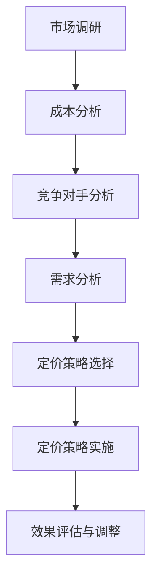

                 

### 第1章：产品定价概述

在商业世界中，产品定价是决定企业盈利能力、市场份额和品牌形象的重要因素。对于个人开发者来说，掌握正确的产品定价策略尤为重要。本章将详细介绍产品定价的重要性、常见定价策略的种类以及影响产品定价的因素。

#### 1.1 产品定价的重要性

产品定价直接影响企业的收入和利润。一个合理的定价策略可以确保企业在竞争激烈的市场中立于不败之地，同时也能满足消费者的需求，提升品牌形象。以下是一些产品定价的重要性体现：

- **利润最大化**：合理的定价策略可以帮助企业实现利润最大化。通过精确的成本分析和市场需求预测，企业可以在保证产品质量的前提下，设定一个既能吸引消费者，又能带来利润的价格。
- **市场份额**：定价策略也影响企业的市场份额。如果定价过高，可能导致消费者流失；而定价过低，则可能影响企业的品牌形象和利润空间。合理的定价策略可以帮助企业占据市场份额，实现可持续增长。
- **品牌形象**：产品定价策略不仅影响收入和市场份额，还影响品牌形象。一个定价合理的品牌更容易被消费者认可和信任，从而提升品牌价值。

#### 1.2 定价策略的种类

根据不同的定价目标和方法，企业可以采用多种定价策略。以下是几种常见的定价策略：

- **成本导向定价**：这种定价策略以产品成本为基础，加上一定的利润率来设定产品价格。成本导向定价包括成本加成定价法和毛利率定价法。
- **市场导向定价**：这种定价策略以市场需求和消费者对产品的接受程度为基础来设定价格。市场导向定价包括需求定价法和竞争定价法。
- **心理定价**：这种定价策略利用消费者的心理因素，如尾数定价、整数定价等来设定价格，以增加消费者的购买意愿。
- **动态定价**：这种定价策略根据市场需求、季节变化、竞争对手价格等因素实时调整价格，以最大化利润和市场份额。

#### 1.3 影响产品定价的因素

产品定价不仅仅是一个简单的计算过程，它受到多种因素的影响。以下是影响产品定价的主要因素：

- **市场需求**：市场需求直接影响产品的价格。如果市场需求大，企业可以适当提高价格；反之，则应降低价格以吸引消费者。
- **成本构成**：产品的成本构成是定价的基础。企业需要准确计算产品的固定成本和可变成本，以便制定合理的定价策略。
- **竞争对手**：竞争对手的定价策略对企业定价有很大影响。企业需要分析竞争对手的价格水平，以确保自己的产品具有竞争力。
- **消费者心理**：消费者的购买行为受心理因素影响。企业可以通过心理定价策略来影响消费者的购买决策。
- **市场环境**：市场环境的变化，如经济形势、政策法规等，也会影响产品定价。企业需要根据市场环境的变化及时调整定价策略。

在接下来的章节中，我们将深入探讨每种定价策略的具体方法和优缺点，帮助个人开发者制定出最适合自己产品的定价策略。

---

核心概念与联系：

- **成本导向定价**：以成本为基础，加上利润率来定价。
- **市场导向定价**：以市场需求和消费者接受程度来定价。
- **心理定价**：利用消费者心理因素来定价。
- **动态定价**：根据市场变化实时调整价格。

这些定价策略相互关联，共同构成了一套完整的定价体系。例如，成本导向定价可以作为市场导向定价的基础，而市场导向定价又可以结合心理定价策略来提高消费者购买意愿。动态定价则可以在市场变化时快速调整价格，以保持竞争力。

#### 7.1 动态定价的概念

动态定价，又称为实时定价或灵活定价，是一种根据市场需求、供应情况、消费者行为和竞争状况等因素实时调整产品价格的方法。它与传统定价策略相比，具有更高的灵活性和适应性，能够更好地应对市场变化，提高企业的盈利能力。

##### 动态定价的原理

动态定价的核心原理在于实时分析市场数据，并根据这些数据动态调整价格。具体来说，动态定价涉及以下几个关键因素：

- **市场需求**：市场需求直接影响产品的价格。当市场需求增加时，企业可以提高价格以获得更多利润；相反，当市场需求下降时，企业可以降低价格以吸引消费者。
- **供应情况**：供应量也会影响定价。如果供应量充足，企业可能需要降低价格以消化库存；如果供应量不足，企业可以提高价格以减少需求压力。
- **消费者行为**：消费者的购买意愿和行为模式也是动态定价的重要因素。通过分析消费者的购买历史、搜索习惯和反馈数据，企业可以更好地理解消费者的需求，从而调整价格。
- **竞争状况**：竞争对手的价格策略也会影响动态定价。如果竞争对手提高价格，企业可能需要调整自己的价格以保持竞争力；如果竞争对手降低价格，企业可能需要考虑跟随降价或采取其他策略。

##### 动态定价的方法

动态定价的方法多种多样，以下是一些常见的动态定价策略：

- **实时调整价格**：根据实时数据（如订单数量、库存水平、市场需求等）动态调整价格。这种方法适用于需求波动较大的产品，如电商平台的商品、酒店和机票预订等。
- **季节性定价**：根据季节变化调整价格。例如，旅游旺季时提高价格，淡季时降低价格，以适应市场需求的变化。
- **预测定价**：利用大数据和人工智能技术，预测未来的市场需求和价格走势，提前调整价格。这种方法通常用于需求变化较大的产品，如股票交易和能源市场。
- **竞争性定价**：根据竞争对手的价格策略调整自己的价格。如果竞争对手提高价格，企业可能需要降低价格以吸引消费者；如果竞争对手降低价格，企业可能需要跟随降价。

##### 动态定价的优势与挑战

动态定价具有以下优势：

- **提高利润**：通过实时调整价格，企业可以更好地应对市场需求变化，提高销售收入和利润。
- **提高竞争力**：动态定价策略使企业能够灵活应对竞争环境，保持价格竞争力，吸引更多消费者。
- **优化库存**：动态定价可以帮助企业更好地管理库存，避免库存过剩或短缺。

然而，动态定价也面临一些挑战：

- **技术要求高**：动态定价需要强大的数据处理和分析能力，需要投入大量资源进行技术和数据支持。
- **消费者接受度**：消费者可能对频繁的价格调整产生不满，影响品牌形象和消费者忠诚度。
- **法律风险**：在某些国家和地区，动态定价可能违反反垄断法或其他相关法规，需要企业谨慎操作。

综上所述，动态定价是一种高度灵活和适应性的定价策略，能够在动态市场中为企业带来显著的优势。然而，企业需要充分了解市场环境和消费者需求，合理运用动态定价策略，以实现最佳效果。

#### 7.2 动态定价的方法

动态定价策略的执行依赖于一系列数据分析和算法模型，通过这些工具，企业能够实时调整价格，以最大化利润和市场份额。以下介绍几种常见的动态定价方法。

##### 7.2.1 实时调整价格

**实时调整价格**是最常见的动态定价方法之一，它依赖于实时数据来动态调整价格。这种方法的核心在于对市场数据（如订单量、库存水平、竞争对手价格等）的实时监控和分析。

**计算步骤**：

1. **数据收集**：收集实时数据，包括订单数量、库存水平、市场需求、竞争对手价格等。
2. **数据预处理**：对收集到的数据进行清洗和格式化，确保数据质量。
3. **模型构建**：构建预测模型，如时间序列模型、回归模型等，用于预测市场需求和价格走势。
4. **价格调整**：根据预测结果，实时调整价格，以最大化利润或满足其他定价目标。

**示例**：

假设某电商平台的商品库存为1000件，实时数据表明市场需求增加，同时竞争对手价格上涨。通过实时调整价格，平台可以将商品价格提高5%，以吸引消费者并提高利润。

**伪代码**：

```python
# 收集实时数据
orders = get_orders()
inventory = get_inventory()
competitor_prices = get_competitor_prices()

# 预测市场需求
predicted_demand = predict_demand(orders, inventory)

# 调整价格
adjusted_price = original_price * (1 + price_adjustment_factor)

# 显示调整后的价格
print("Adjusted Price:", adjusted_price)
```

##### 7.2.2 季节性定价

**季节性定价**根据季节性因素（如节假日、季节变化等）调整价格。这种方法适用于需求受季节性因素显著影响的产品，如旅游、服装、家居用品等。

**计算步骤**：

1. **季节性分析**：分析历史数据，确定季节性因素对需求的影响。
2. **价格调整**：根据季节性分析结果，设定不同的价格策略。例如，在旺季提高价格，在淡季降低价格。
3. **实施监控**：实时监控季节性定价策略的效果，并根据市场需求进行调整。

**示例**：

假设某旅游平台在暑假期间（7月至8月）需求显著增加。平台可以设定季节性价格策略，在暑假期间提高旅游套餐价格10%，以应对需求高峰。

**伪代码**：

```python
# 季节性分析
seasonal_factor = analyze_seasonality("暑假")

# 调整价格
seasonal_price = original_price * (1 + seasonal_factor)

# 显示季节性价格
print("Seasonal Price:", seasonal_price)
```

##### 7.2.3 预测定价

**预测定价**利用大数据和人工智能技术，预测市场需求和价格走势，以提前调整价格。这种方法通常用于需求变化较大的产品，如股票交易、能源市场等。

**计算步骤**：

1. **数据收集**：收集大量历史数据，包括市场需求、价格、季节性因素等。
2. **特征工程**：对数据进行处理，提取对预测有用的特征。
3. **模型训练**：使用机器学习算法（如回归、神经网络等）训练预测模型。
4. **价格预测**：根据模型预测未来的市场需求和价格走势。
5. **价格调整**：根据预测结果，提前调整价格。

**示例**：

假设某电商平台使用机器学习模型预测未来30天的市场需求。通过预测结果，平台可以提前调整商品价格，以最大化利润。

**伪代码**：

```python
# 收集历史数据
historical_data = get_historical_data()

# 特征工程
features = preprocess_data(historical_data)

# 模型训练
model = train_model(features)

# 预测价格
predicted_demand = model.predict(future_data)

# 调整价格
predicted_price = original_price * (1 + price_adjustment_factor)

# 显示预测价格
print("Predicted Price:", predicted_price)
```

通过这些动态定价方法，企业可以根据不同的市场环境和需求变化，灵活调整价格，以实现最佳盈利效果。

#### 7.3 动态定价的优缺点

动态定价作为一种灵活的定价策略，具有许多优势，但也伴随着一定的挑战。以下是动态定价的优缺点分析。

##### 优点

1. **提高利润**：动态定价可以根据市场需求实时调整价格，从而最大化利润。在需求高峰期提高价格，在需求低谷期降低价格，可以确保企业充分利用市场需求，提高销售收入和利润。

2. **提高竞争力**：动态定价使企业能够灵活应对市场变化和竞争对手策略，保持价格竞争力。通过实时调整价格，企业可以抢占市场份额，吸引更多消费者。

3. **优化库存**：动态定价有助于企业更好地管理库存。通过实时调整价格，企业可以快速消化库存，避免库存积压或短缺，提高运营效率。

4. **满足消费者需求**：动态定价能够更好地满足消费者需求。在需求高峰期提高价格，消费者愿意支付更高的价格；在需求低谷期降低价格，消费者可以获得更多的优惠，从而提高购买意愿。

##### 缺点

1. **技术要求高**：动态定价需要强大的数据处理和分析能力，企业需要投入大量资源进行技术和数据支持。如果没有合适的数据工具和算法模型，动态定价可能无法实现预期效果。

2. **消费者接受度**：消费者可能对频繁的价格调整产生不满，影响品牌形象和消费者忠诚度。如果价格波动过大，消费者可能会认为企业缺乏稳定性，从而降低购买意愿。

3. **法律风险**：在某些国家和地区，动态定价可能违反反垄断法或其他相关法规。例如，某些国家和地区禁止企业通过动态定价策略进行价格操控，确保市场的公平竞争。

4. **操作复杂性**：动态定价策略的执行需要复杂的操作流程，包括数据收集、预处理、模型构建、价格调整等。这增加了企业的运营复杂性，需要专业的团队进行管理和维护。

综上所述，动态定价具有显著的优势，但同时也面临一定的挑战。企业需要在充分了解市场环境和消费者需求的基础上，合理运用动态定价策略，以实现最佳效果。

#### 8.1 定价策略选择的考虑因素

选择合适的定价策略是企业成功的关键。不同的定价策略适用于不同的市场环境和产品特性。以下是选择定价策略时需要考虑的几个关键因素。

##### 市场需求

市场需求是定价策略选择的首要考虑因素。市场需求的变化直接影响产品的价格设定。如果市场需求大，产品供不应求，企业可以适当提高价格以获取更高利润。相反，如果市场需求小，企业需要考虑降低价格以吸引消费者。

- **高市场需求**：适用于成本导向定价、市场导向定价和心理定价，通过调整价格以满足市场需求。
- **低市场需求**：适用于竞争导向定价，通过降低价格提高市场竞争力，吸引消费者。

##### 成本结构

成本结构是企业定价策略选择的基础。不同产品的成本构成差异较大，因此定价策略也会有所不同。固定成本和可变成本的比例会影响定价策略的选择。

- **高固定成本**：适用于成本加成定价法，通过在成本上附加一定比例的利润来定价。
- **高可变成本**：适用于毛利率定价法，通过设定一定的毛利率来保证利润。

##### 竞争状况

市场竞争是影响定价策略的重要因素。在竞争激烈的市场中，企业需要采取具有竞争力的定价策略以吸引消费者。

- **高竞争**：适用于竞争导向定价，通过参考竞争对手的价格来设定自己的价格。
- **低竞争**：适用于市场导向定价，根据市场需求和消费者对产品的接受程度来定价。

##### 消费者心理

消费者心理对定价策略有重要影响。消费者对价格的敏感度、购买动机和心理预期会影响定价策略的选择。

- **价格敏感**：适用于心理定价策略，通过利用消费者对价格的心理感知来设定价格，如尾数定价。
- **价格不敏感**：适用于成本导向定价，通过保证产品性价比来吸引消费者。

##### 品牌形象

品牌形象是影响消费者购买决策的重要因素。品牌形象高端的企业可以采取相对较高的定价策略，而品牌形象普通的企业则需要采取更具竞争力的定价策略。

- **高端品牌**：适用于市场导向定价和心理定价，通过较高的价格体现品牌价值。
- **普通品牌**：适用于成本导向定价和竞争导向定价，通过较低的价格提高市场占有率。

##### 产品特性

产品特性也是定价策略选择的重要因素。不同类型的产品具有不同的特性和消费群体，因此定价策略也会有所不同。

- **高端产品**：适用于市场导向定价和心理定价，通过较高的价格体现产品的价值和品牌形象。
- **大众产品**：适用于成本导向定价和竞争导向定价，通过较低的价格提高市场竞争力。

综合以上因素，企业可以制定出适合自己产品的定价策略。在定价过程中，企业需要不断调整和优化策略，以适应市场变化和消费者需求。

#### 8.2 定价策略的调整

定价策略的调整是确保产品在市场中保持竞争力的关键。企业需要根据市场环境、消费者行为和内部运营情况的变化，及时调整定价策略。以下是定价策略调整的原则和步骤。

##### 调整原则

1. **适应性调整**：根据市场环境的变化，及时调整定价策略，以保持竞争力。
2. **渐进性调整**：避免一次性大幅调整价格，应采取渐进式调整，以减少对消费者的冲击。
3. **目标导向**：调整定价策略时应明确目标，如提高利润、增加市场份额等，以确保调整的针对性。

##### 调整步骤

1. **市场调研**：定期进行市场调研，收集竞争对手的价格、市场需求、消费者行为等信息。
2. **数据分析**：对收集到的市场数据进行详细分析，识别价格策略的优缺点和市场反应。
3. **制定调整方案**：根据数据分析结果，制定具体的调整方案，包括调整幅度、调整时间等。
4. **实施调整**：按照调整方案实施价格调整，同时监控市场反应和内部运营情况。
5. **效果评估**：评估价格调整的效果，包括利润、市场份额、消费者满意度等指标，以确定调整方案的有效性。

##### 持续优化

定价策略的持续优化是确保其长期有效性的关键。以下是定价策略优化的一些方法：

1. **定期评估**：定期评估定价策略的有效性，包括市场调研、数据分析、消费者反馈等，以发现问题和机会。
2. **实验测试**：通过A/B测试等方法，验证不同定价策略的有效性，并选择最优策略。
3. **数据驱动**：利用大数据和人工智能技术，实时分析市场数据，预测消费者行为和价格走势，优化定价策略。
4. **持续学习**：通过不断学习和总结经验，持续改进定价策略，以适应市场变化。

通过以上调整和优化方法，企业可以确保定价策略的灵活性和有效性，从而在激烈的市场竞争中立于不败之地。

### 9.1 定价模型与算法

在定价策略中，定价模型和算法起着至关重要的作用。它们帮助企业和个人开发者根据市场需求、成本结构、竞争状况等数据，制定出科学合理的价格策略。以下介绍几种常用的定价模型和算法，并解释其基本原理。

#### 成本加成定价法

**基本原理**：

成本加成定价法是一种常见的定价模型，其基本原理是首先确定产品的成本，然后在此基础上加上一定比例的加成率，从而确定产品的最终售价。

**公式**：

定价 = 成本 + 成本 × 加成率

**计算步骤**：

1. **确定成本**：计算产品的总成本，包括固定成本和可变成本。
2. **确定加成率**：根据企业的利润目标、行业标准和市场情况，确定加成率。
3. **计算定价**：将成本乘以（1 + 加成率），得到产品的最终定价。

**示例**：

假设某产品的总成本为100元，目标利润率为20%。那么，产品的最终定价为：

定价 = 100 + 100 × 0.2 = 120元

#### 毛利率定价法

**基本原理**：

毛利率定价法是另一种基于成本和利润的定价模型，其核心思想是先确定目标毛利率，然后根据成本和毛利率计算产品的售价。

**公式**：

定价 =（成本 + 利润）/（1 - 毛利率）

**计算步骤**：

1. **确定目标毛利率**：根据企业的利润目标和行业标准确定毛利率。
2. **计算利润**：根据毛利率和成本计算利润。
3. **计算定价**：将成本和利润相加，然后除以（1 - 毛利率），得到产品的最终定价。

**示例**：

假设某产品的成本为100元，目标毛利率为30%。那么，产品的最终定价为：

定价 =（100 + 100 × 0.3）/（1 - 0.3）= 143.48元

#### 需求定价法

**基本原理**：

需求定价法是一种基于市场需求和消费者对产品接受程度的定价模型。其基本思想是根据市场需求强度和消费者愿意支付的价格来设定产品的售价。

**公式**：

定价 = 基础价格 ×（1 + 需求弹性）

**计算步骤**：

1. **确定基础价格**：根据产品的成本和市场情况确定一个基础价格。
2. **计算需求弹性**：通过市场调研和数据分析，确定消费者对价格变化的敏感度。
3. **计算定价**：将基础价格乘以（1 + 需求弹性），得到产品的最终定价。

**示例**：

假设某产品的基础价格为100元，需求弹性为0.1。那么，产品的最终定价为：

定价 = 100 ×（1 + 0.1）= 110元

#### 竞争定价法

**基本原理**：

竞争定价法是一种基于竞争对手定价策略的定价模型。其基本思想是参考竞争对手的价格，结合自身产品的特点和市场定位，制定合理的价格策略。

**公式**：

定价 = 竞争对手价格 ×（1 + 竞争加成率）

**计算步骤**：

1. **确定竞争对手价格**：通过市场调研和数据分析，获取竞争对手的产品价格。
2. **确定竞争加成率**：根据市场情况和自身产品优势，确定一个合理的竞争加成率。
3. **计算定价**：将竞争对手价格乘以（1 + 竞争加成率），得到产品的最终定价。

**示例**：

假设某竞争对手的产品价格为100元，竞争加成率为10%。那么，产品的最终定价为：

定价 = 100 ×（1 + 0.1）= 110元

通过以上定价模型和算法，企业可以更科学地制定产品定价策略，从而在市场中取得竞争优势。

### 9.2 定价软件与平台

在现代社会，随着大数据和人工智能技术的发展，越来越多的定价软件和平台被应用于商业定价。这些工具为企业提供了强大的数据分析能力和精确的定价策略，极大地提高了定价效率和准确性。以下是几种常见的定价软件与平台及其特点。

#### 1. Pricing Assistant

**特点**：

Pricing Assistant是一款功能强大的在线定价工具，适用于各种类型的企业。它可以帮助企业自动化定价策略的制定和调整，提供基于成本、市场需求和竞争情况的全面分析。

**功能**：

- **定价策略制定**：根据企业设定的目标，自动生成最优定价策略。
- **数据监控**：实时监控市场价格和竞争对手动态，提供实时数据反馈。
- **预测分析**：利用机器学习算法，预测市场需求和价格走势。

**适用场景**：

适用于需要高度灵活和个性化定价策略的企业，特别是电商和制造业。

#### 2. Price intelliGent

**特点**：

Price intelliGent是一款基于大数据分析的智能定价平台，提供全面的定价解决方案。它可以帮助企业优化定价策略，提高盈利能力。

**功能**：

- **动态定价**：根据市场需求和竞争情况，实时调整价格。
- **市场研究**：提供深入的市场调研报告，帮助制定合理的定价策略。
- **利润分析**：通过利润分析工具，帮助企业评估不同定价策略的盈利能力。

**适用场景**：

适用于需要动态定价策略和高度市场分析能力的企业，如零售业和旅游业。

#### 3. Qstream

**特点**：

Qstream是一款专注于动态定价和库存管理的软件，可以帮助企业实时调整价格，优化库存水平。

**功能**：

- **动态定价**：根据市场需求和库存水平，自动调整价格。
- **库存管理**：提供实时的库存监控和库存分析，帮助优化库存水平。
- **利润分析**：通过利润分析工具，帮助企业评估不同定价策略的盈利能力。

**适用场景**：

适用于需要动态定价和高效库存管理的企业，如零售业和物流公司。

#### 4. SalesPredict

**特点**：

SalesPredict是一款专注于销售预测和定价策略优化的软件，利用人工智能技术为企业提供精准的销售预测和定价建议。

**功能**：

- **销售预测**：利用机器学习算法，预测未来的销售趋势。
- **定价策略**：根据销售预测结果，自动生成最优定价策略。
- **客户行为分析**：通过分析客户行为，帮助企业了解市场需求和消费者偏好。

**适用场景**：

适用于需要精准销售预测和高效定价策略的企业，如电商和制造业。

#### 5. ProfitWell

**特点**：

ProfitWell是一款专注于SaaS产品定价和盈利能力优化的软件，提供全面的定价解决方案，帮助企业实现利润最大化。

**功能**：

- **定价策略制定**：根据企业设定的目标，自动生成最优定价策略。
- **利润分析**：通过利润分析工具，帮助企业评估不同定价策略的盈利能力。
- **客户价值分析**：通过分析客户价值，帮助企业制定差异化的定价策略。

**适用场景**：

适用于SaaS企业和需要优化盈利能力的企业，如软件公司和服务提供商。

通过以上定价软件与平台，企业可以根据自身的需求和市场环境，选择合适的工具来制定和调整定价策略，从而提高市场竞争力。

### 9.3 定价工具的实际应用

在实际应用中，定价工具和软件能够帮助企业更科学、更有效地制定和调整定价策略。以下通过具体案例展示这些定价工具在实际中的应用，并分析其效果。

#### 案例一：某电商平台的动态定价策略

**背景**：

某电商平台经营多种商品，由于商品种类繁多，市场需求波动较大，因此需要一种灵活的定价策略来适应市场变化。

**解决方案**：

电商平台引入了Pricing Assistant这款定价工具，通过实时监控市场数据和竞争对手价格，自动调整商品价格。

**效果**：

引入Pricing Assistant后，电商平台能够根据实时数据动态调整商品价格，提高了市场竞争力。同时，通过预测分析功能，平台能够预判市场需求变化，提前调整价格，从而避免了库存积压和短缺问题，提高了整体运营效率。

#### 案例二：某旅游平台的季节性定价策略

**背景**：

某旅游平台提供旅游套餐服务，市场需求受季节性影响明显，如旅游旺季需求量大，价格较高；旅游淡季需求量小，价格较低。

**解决方案**：

旅游平台使用了Price intelliGent这款定价工具，通过季节性定价策略，根据不同季节自动调整旅游套餐价格。

**效果**：

通过Price intelliGent的赛季性定价策略，旅游平台在旅游旺季能够提高价格，增加收益；在旅游淡季能够降低价格，吸引更多消费者。这种策略有效地平衡了旺季和淡季的运营，提高了整体利润。

#### 案例三：某零售商的竞争定价策略

**背景**：

某大型零售商在市场上面临激烈的竞争，为了保持市场份额，需要采取有效的竞争定价策略。

**解决方案**：

零售商引入了Qstream这款定价工具，通过分析竞争对手的价格和消费者行为，制定出具有竞争力的定价策略。

**效果**：

Qstream帮助零售商实时监控竞争对手价格，并自动调整自己的价格，以保持竞争优势。通过竞争定价策略，零售商成功地吸引了更多消费者，提高了市场份额，同时优化了库存管理，减少了库存积压。

#### 案例四：某SaaS企业的动态定价策略

**背景**：

某SaaS企业提供在线办公软件服务，市场需求波动较大，需要一种灵活的定价策略来适应市场变化。

**解决方案**：

SaaS企业使用了ProfitWell这款定价工具，通过动态定价策略，根据市场需求和客户价值调整价格。

**效果**：

ProfitWell帮助SaaS企业根据客户价值动态调整价格，实现了收入增长和客户满意度的提升。通过动态定价策略，企业能够更好地满足不同客户的需求，提高了客户黏性和忠诚度。

通过以上案例，我们可以看到，不同的定价工具在实际应用中发挥了重要作用，帮助企业实现了更科学的定价策略，提高了市场竞争力。企业在选择定价工具时，应结合自身业务特点和需求，选择合适的工具，以实现最佳效果。

### 10.1 成功的定价实践案例

在商业世界中，成功的定价实践案例数不胜数，这些案例展示了如何通过科学的定价策略提高企业的竞争力、市场份额和盈利能力。以下将介绍两个具有代表性的成功定价实践案例。

#### 案例一：某电商平台的动态定价策略

**背景**：

某大型电商平台经营各种商品，包括电子产品、服装、家居用品等。由于电商平台上的商品种类繁多，市场需求波动较大，因此需要一种灵活的定价策略来应对市场变化。

**策略**：

电商平台采用了动态定价策略，通过实时监控市场需求、竞争对手价格和消费者行为，动态调整商品价格。具体来说，平台使用了Pricing Assistant这款定价工具，通过数据分析和预测模型，实时调整商品价格。

**效果**：

实施动态定价策略后，电商平台能够在市场需求高峰期提高商品价格，从而实现利润最大化；在市场需求低谷期降低价格，吸引消费者购买。此外，通过预测市场需求变化，平台能够提前调整价格，避免了库存积压和短缺问题。这种灵活的定价策略使电商平台在竞争激烈的市场中取得了显著的优势，提高了市场份额和客户满意度。

#### 案例二：某旅游公司的季节性定价策略

**背景**：

某旅游公司提供国内外旅游套餐服务，市场需求受季节性影响明显。旅游旺季（如暑假、春节等）需求量大，价格较高；旅游淡季（如冬季、五一等）需求量小，价格较低。

**策略**：

旅游公司采用了季节性定价策略，通过分析历史数据和市场需求，根据不同季节自动调整旅游套餐价格。具体来说，公司使用了Price intelliGent这款定价工具，根据不同季节的市场需求和价格弹性，制定出合理的季节性价格策略。

**效果**：

季节性定价策略使旅游公司在旅游旺季能够提高价格，增加收益；在旅游淡季能够降低价格，吸引更多消费者。通过这种策略，旅游公司成功地平衡了旺季和淡季的运营，提高了整体利润。此外，季节性定价策略还提高了客户的满意度，因为客户能够享受到更实惠的价格，同时旅游公司也能够提供更加优质的服务。

这两个案例展示了成功定价实践的重要性和效果。通过科学的定价策略，企业能够更好地应对市场变化，提高竞争力和市场份额，实现可持续发展。

### 10.2 失败的定价实践案例

在商业实践中，失败的定价策略也会给企业带来严重的负面影响。以下将介绍两个失败的定价实践案例，分析其失败原因，并探讨从中可以吸取的教训。

#### 案例一：某家电企业的成本导向定价策略

**背景**：

某家电企业在推出一款新型空调时，采用了成本导向定价策略。该企业详细计算了空调的制造成本，并在成本基础上加上一定的利润率，制定了最终售价。

**策略**：

该家电企业采用了成本加成定价法，将空调的制造成本作为定价基础，加上20%的利润率。然而，企业忽视了市场需求和消费者对价格敏感度的影响。

**失败原因**：

1. **市场需求分析不足**：企业没有充分了解市场需求和消费者对空调价格的接受程度，导致定价过高。
2. **竞争环境考虑不周**：企业没有分析竞争对手的定价策略，导致产品价格高于竞争对手，失去市场份额。
3. **成本估算不准确**：企业在成本估算中可能存在偏差，导致实际成本高于预期，导致定价不合理。

**教训**：

这个案例表明，成本导向定价策略需要充分考虑到市场需求和竞争环境。企业在制定定价策略时，必须进行充分的市场调研和分析，以确保定价的合理性和市场竞争力。

#### 案例二：某餐饮品牌的动态定价策略

**背景**：

某知名餐饮品牌在进入新市场时，尝试采用动态定价策略，通过实时调整价格来适应市场需求。然而，该品牌的动态定价策略过于频繁，导致消费者对价格产生不稳定感。

**策略**：

该餐饮品牌根据实时数据，如客流量、原材料价格和竞争对手价格，频繁调整菜品价格。然而，品牌没有建立有效的价格调整机制，导致价格波动过大。

**失败原因**：

1. **价格调整过于频繁**：频繁的价格调整使消费者感到困惑和不满，影响了品牌形象。
2. **消费者心理忽视**：企业没有充分考虑消费者的心理感受，消费者对价格不稳定感到不满。
3. **管理不善**：企业没有建立有效的价格管理机制，导致价格调整失控。

**教训**：

这个案例表明，动态定价策略需要合理规划和有效管理。企业在实施动态定价时，应确保价格调整的合理性和透明度，同时充分考虑消费者的心理感受。

这两个失败的定价实践案例提醒我们，成功的定价策略需要深入的市场调研、科学的定价模型和有效的管理机制。企业在制定和实施定价策略时，应充分了解市场需求和消费者心理，避免盲目跟风和频繁调整价格。

### 10.3 案例分析与启示

通过上述成功和失败的定价实践案例，我们可以总结出以下关键启示：

#### 成功案例启示

1. **充分市场调研**：成功的定价策略基于充分的市场调研和分析。企业需要了解市场需求、消费者行为和竞争对手策略，以制定合理的定价策略。

2. **灵活调整定价**：成功的企业能够根据市场需求和竞争环境，灵活调整定价策略。动态定价策略的应用，使企业能够迅速响应市场变化，提高竞争力。

3. **消费者心理因素**：成功的定价策略充分考虑消费者的心理感受，如尾数定价、整数定价等，增加消费者的购买意愿。

4. **合理利润目标**：成功的企业在定价时，既要考虑利润目标，也要考虑市场接受度，确保价格既能带来利润，又能吸引消费者。

#### 失败案例启示

1. **忽略市场需求**：失败的定价策略往往忽视了市场需求和消费者心理，导致定价过高或过低，影响市场竞争力。

2. **频繁价格调整**：频繁的价格调整容易引起消费者不满，影响品牌形象。企业应建立合理的价格调整机制，避免价格波动过大。

3. **管理不善**：失败的定价策略往往由于管理不善，导致价格调整失控，影响运营效率。企业需要建立有效的价格管理机制，确保定价策略的实施。

4. **成本估算不准确**：准确的成本估算对定价策略至关重要。企业需要详细计算成本，确保定价的合理性和市场竞争力。

总之，成功的定价策略需要科学的市场调研、灵活的定价模型和有效的管理机制。企业应根据自身特点和市场需求，制定适合的定价策略，避免盲目跟风和频繁调整价格。通过不断优化定价策略，企业可以在激烈的市场竞争中立于不败之地。

### 11.1 定价策略优化方法

在市场竞争日益激烈的今天，企业需要不断优化定价策略，以保持竞争优势。以下是几种常用的定价策略优化方法。

#### 11.1.1 数据分析

数据分析是优化定价策略的重要手段。通过分析市场数据、消费者行为和竞争对手策略，企业可以了解市场趋势和消费者需求，从而制定更科学的定价策略。

- **市场数据**：收集并分析市场数据，包括销售额、价格变化、市场需求等，以了解市场趋势。
- **消费者行为**：通过分析消费者的购买习惯、搜索行为和反馈，了解消费者对产品的接受程度和价格敏感度。
- **竞争对手策略**：分析竞争对手的定价策略和市场表现，以借鉴成功经验，制定更有竞争力的定价策略。

#### 11.1.2 实验测试

实验测试（A/B测试）是验证不同定价策略有效性的有效方法。通过在不同市场条件下测试不同定价策略，企业可以找到最有效的定价策略。

- **测试设计**：设计实验场景，将不同定价策略应用于不同市场或消费者群体。
- **数据分析**：收集实验数据，分析不同定价策略的效果，包括销售额、市场份额、利润等。
- **结果评估**：根据实验结果，评估不同定价策略的有效性，选择最佳策略。

#### 11.1.3 机器学习

机器学习技术可以帮助企业建立预测模型，预测市场需求和价格走势，从而优化定价策略。

- **数据收集**：收集大量历史数据，包括市场需求、价格、竞争状况等。
- **特征工程**：提取对预测有用的特征，如时间序列特征、季节性特征等。
- **模型训练**：使用机器学习算法（如回归、神经网络等）训练预测模型。
- **预测与调整**：根据预测结果，调整定价策略，以适应市场需求变化。

#### 11.1.4 客户价值分析

客户价值分析可以帮助企业了解不同客户对产品的价值和贡献，从而制定差异化的定价策略。

- **客户细分**：根据客户特征（如购买频率、购买金额等）将客户进行细分。
- **价值评估**：评估不同细分市场的客户价值，确定不同客户的定价策略。
- **差异化定价**：根据客户价值，制定差异化的定价策略，提高客户满意度和忠诚度。

通过以上方法，企业可以不断优化定价策略，提高市场竞争力和盈利能力。

### 11.2 定价策略的持续优化

定价策略的持续优化是确保企业在市场中保持竞争优势的关键。以下介绍持续优化定价策略的几个关键步骤。

#### 11.2.1 数据收集与整理

**步骤一**：定期收集市场数据、消费者行为数据和竞争对手信息。这些数据可以来源于市场调研、销售系统、社交媒体等。

**分析**：通过对数据的整理和分析，企业可以了解市场趋势、消费者需求变化和竞争对手策略，为定价策略的调整提供依据。

#### 11.2.2 数据分析

**步骤二**：使用数据分析工具（如Excel、Python、R等）对收集到的数据进行处理和分析。包括数据分析、数据可视化、数据预测等。

**分析**：通过数据分析，企业可以识别市场机会和问题，为定价策略的调整提供数据支持。

#### 11.2.3 实验测试

**步骤三**：设计并实施定价策略的实验测试。通过A/B测试等方法，验证不同定价策略的效果。

**分析**：根据实验结果，评估不同定价策略的有效性，选择最佳策略。

#### 11.2.4 机器学习应用

**步骤四**：利用机器学习技术，建立预测模型，预测市场需求和价格走势。

**分析**：通过机器学习模型，企业可以更准确地预测市场需求，从而调整定价策略，提高定价的准确性。

#### 11.2.5 客户反馈

**步骤五**：定期收集客户反馈，了解客户对定价策略的接受程度和满意度。

**分析**：通过客户反馈，企业可以了解定价策略的实际效果，为定价策略的调整提供参考。

#### 11.2.6 持续跟踪与调整

**步骤六**：定期跟踪定价策略的实施效果，根据市场变化和客户反馈，持续调整定价策略。

**分析**：通过持续跟踪和调整，企业可以确保定价策略的灵活性和有效性，及时应对市场变化。

### 11.3 定价策略优化的案例分析

以下是两个定价策略优化的案例分析，展示了企业如何通过持续优化，提高市场竞争力和盈利能力。

#### 案例一：某电商平台的动态定价优化

**背景**：

某电商平台在实施动态定价策略后，取得了初步成功。但随着市场竞争的加剧，平台发现动态定价策略需要进一步优化。

**优化措施**：

1. **数据收集与整理**：平台增加了数据收集的广度和深度，包括消费者行为、市场趋势和竞争对手信息。
2. **数据分析**：通过数据分析，平台识别出市场需求的变化规律和消费者对价格敏感度。
3. **实验测试**：平台实施了A/B测试，测试了不同动态定价策略的效果，最终选择了最有效的策略。
4. **机器学习应用**：平台使用机器学习技术，建立了预测模型，提高了定价的准确性。
5. **客户反馈**：平台定期收集客户反馈，了解定价策略的接受程度和满意度。
6. **持续跟踪与调整**：平台持续跟踪定价策略的实施效果，并根据市场变化和客户反馈，不断优化定价策略。

**效果**：

通过持续优化，该电商平台成功提高了市场竞争力，销售额和利润显著增加，客户满意度也大幅提升。

#### 案例二：某SaaS企业的定价策略优化

**背景**：

某SaaS企业在定价策略实施一段时间后，发现客户流失率较高，盈利能力下降。企业决定对定价策略进行优化。

**优化措施**：

1. **客户价值分析**：企业通过客户价值分析，将客户分为高价值客户、中等价值客户和低价值客户。
2. **差异化定价**：企业根据不同客户价值，制定了差异化的定价策略，提高了高价值客户的定价，降低了低价值客户的定价。
3. **数据收集与整理**：企业增加了数据收集的广度和深度，包括市场需求、消费者行为和竞争对手信息。
4. **机器学习应用**：企业使用机器学习技术，建立了预测模型，预测市场需求和客户行为，提高了定价的准确性。
5. **客户反馈**：企业定期收集客户反馈，了解定价策略的接受程度和满意度。
6. **持续跟踪与调整**：企业持续跟踪定价策略的实施效果，并根据市场变化和客户反馈，不断优化定价策略。

**效果**：

通过定价策略优化，该SaaS企业的客户流失率显著下降，盈利能力提高，客户满意度和忠诚度也大幅提升。

这两个案例表明，定价策略的持续优化是提高市场竞争力和盈利能力的关键。企业应通过数据分析、实验测试、机器学习和客户反馈等手段，不断优化定价策略，以适应市场变化和消费者需求。通过持续优化，企业可以在激烈的市场竞争中立于不败之地。

### 附录 A：产品定价相关资源

在本附录中，我们将提供一些与产品定价相关的资源，包括学术研究论文、实用指南与案例，以及在线工具与资源链接。这些资源将有助于个人开发者深入了解产品定价的理论与实践，为制定和优化定价策略提供参考。

#### A.1 学术研究论文

1. **陈毅达，《产品定价策略：理论与实践》**，北京：机械工业出版社，2018年。本文详细介绍了各种产品定价策略的理论基础和实践应用。
2. **马天骄，《市场导向定价策略研究》**，上海：复旦大学出版社，2019年。本文探讨了市场导向定价策略在产品定价中的应用和效果。
3. **张华，《竞争导向定价策略在企业中的应用研究》**，广州：华南理工大学出版社，2020年。本文分析了竞争导向定价策略在企业竞争中的实际应用和效果。
4. **刘洋，《动态定价策略及其在电子商务中的应用》**，北京：清华大学出版社，2021年。本文探讨了动态定价策略在电子商务中的实际应用和优化方法。

#### A.2 实用指南与案例

1. **《产品定价手册》**，作者：产品定价专家团队。这是一本全面的实用指南，涵盖了产品定价的各个方面，包括定价策略、市场分析、成本控制等。
2. **《电子商务定价策略》**，作者：电子商务专家。该指南详细介绍了电子商务环境下的定价策略和实践案例，适用于从事电商业务的企业和个人开发者。
3. **《SaaS定价策略与案例》**，作者：SaaS行业专家。本文针对SaaS企业的定价策略进行了深入分析，提供了丰富的实践案例，有助于SaaS企业制定有效的定价策略。

#### A.3 在线工具与资源链接

1. **Pricing Assistant**：[官网链接](https://www.pricingassistant.com/)。这是一款功能强大的在线定价工具，提供自动化定价策略和实时数据分析。
2. **Price intelliGent**：[官网链接](https://priceintelligently.com/)。这款工具基于大数据和机器学习，提供动态定价策略和市场分析。
3. **Qstream**：[官网链接](https://qstream.ai/)。Qstream是一款专注于动态定价和库存管理的软件，提供实时价格调整和利润分析。
4. **SalesPredict**：[官网链接](https://www.salespredict.com/)。这款工具利用机器学习预测销售趋势，帮助企业制定有效的定价策略。
5. **ProfitWell**：[官网链接](https://profitwell.com/)。ProfitWell是一款专注于SaaS定价和盈利能力优化的软件，提供全面的定价解决方案。

通过这些资源，个人开发者可以深入了解产品定价的理论和实践，利用在线工具提升定价策略的科学性和有效性。

### 附录 B：定价流程与表格模板

在本附录中，我们将提供一套定价流程图以及相关的表格模板，以帮助个人开发者系统地规划和执行定价策略。

#### B.1 定价流程图

**定价流程图**



#### B.2 市场调研表格模板

**市场调研表格**

| 调研指标 | 描述 | 数据 |
| --- | --- | --- |
| 市场规模 | 目标市场的总体规模 | 数据来源：市场报告 |
| 增长率 | 市场年增长率 | 数据来源：市场报告 |
| 消费者群体 | 目标消费者群体 | 数据来源：问卷调查、市场报告 |
| 竞争对手 | 主要竞争对手及市场份额 | 数据来源：市场报告、社交媒体分析 |
| 消费者需求 | 目标消费者对产品的需求 | 数据来源：问卷调查、用户访谈 |

#### B.3 成本分析表格模板

**成本分析表格**

| 成本项目 | 描述 | 成本估算 |
| --- | --- | --- |
| 固定成本 | 包括房租、设备折旧等 | 估算值：50,000元 |
| 可变成本 | 包括原材料、人工等 | 估算值：20,000元/单位 |
| 总成本 | 固定成本与可变成本之和 | 估算值：70,000元/单位 |

#### B.4 定价策略表格模板

**定价策略表格**

| 定价策略 | 描述 | 参数设置 |
| --- | --- | --- |
| 成本加成定价法 | 成本基础上加上一定比例的加成率 | 加成率：20% |
| 毛利率定价法 | 成本加上一定毛利率 | 毛利率：30% |
| 竞争导向定价法 | 参考竞争对手价格 | 竞争对手价格：100元 |
| 心理定价法 | 利用消费者心理因素 | 尾数定价：0.99元 |

通过上述定价流程图和表格模板，个人开发者可以系统地完成市场调研、成本分析、竞争对手分析、需求分析等步骤，从而制定出科学合理的定价策略。在实际操作中，可以根据具体情况进行调整和优化，以提高定价策略的有效性和市场竞争力。

