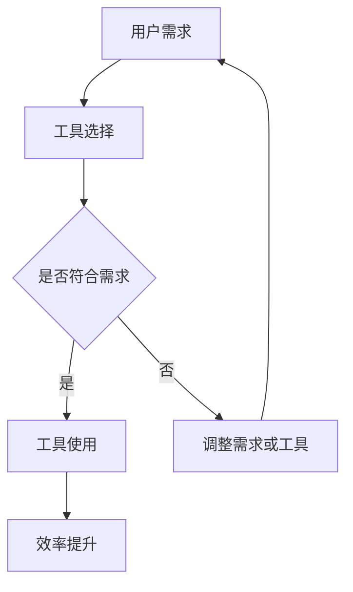

                 

# 《个人生产力工具开发：市场需求与潜力分析》

## 关键词：个人生产力工具、市场需求、潜力分析、技术趋势、用户体验、案例研究、开发与部署

## 摘要：

本文旨在深入探讨个人生产力工具的开发及其市场需求与潜力。首先，我们将介绍个人生产力工具的定义和重要性，随后通过市场现状和用户需求分析，揭示这一领域的驱动因素和增长潜力。接着，我们将详细阐述个人生产力工具的核心概念和架构，包括效率与效果、人机交互与自动化、云计算与协作等方面。通过Mermaid流程图，我们将直观地展示工具选用的决策过程。在核心技术原理部分，我们将解析用户体验设计、数据分析与挖掘、人工智能与机器学习，以及相关的数学模型与公式。随后，通过三个实际案例研究，我们将展示个人生产力工具在不同领域的应用与实现。最后，我们将讨论开发与部署策略，以及未来发展的趋势和总结。

### 第一部分：引言与背景

### 1.1 个人生产力工具的定义与重要性

#### 1.1.1 什么是个人生产力工具

个人生产力工具是指旨在提高个人工作效率和效能的软件、硬件或其组合。这些工具可以是单一的独立应用，也可以是一整套集成系统，其目的是帮助用户更高效地完成日常工作任务，实现时间管理、任务规划、数据整理、沟通协作等功能。

#### 1.1.2 个人生产力工具的重要作用

个人生产力工具在现代社会中扮演着重要角色。随着信息量的爆炸性增长和职场竞争的日益激烈，个人生产力工具成为了提高工作效率和减轻工作负担的必备工具。它们不仅可以帮助用户节省时间，还能提升工作效率，增强工作质量和创新能力。

#### 1.1.3 个人生产力工具的发展趋势

随着技术的不断进步，个人生产力工具也在不断演变和升级。近年来，以下几个趋势尤为显著：

1. **移动化**：随着智能手机和平板电脑的普及，个人生产力工具逐渐向移动端转移，实现随时随地访问和操作。
2. **云计算**：云计算技术为个人生产力工具提供了强大的后台支持，使得数据存储、处理和共享变得更加便捷和高效。
3. **智能化**：人工智能和机器学习技术的应用，使得个人生产力工具能够根据用户行为和习惯进行个性化推荐和优化。
4. **集成化**：各种工具的集成化趋势，使用户能够在一个平台上完成多项任务，提高工作效率。

### 1.2 市场需求分析

#### 1.2.1 个人生产力工具市场的现状

根据市场调研数据，个人生产力工具市场呈现出持续增长的态势。尽管全球经济环境充满不确定性，但个人生产力工具的需求依然强劲。主要表现在以下方面：

1. **用户基础广泛**：个人生产力工具不仅适用于职场人士，也受到学生、自由职业者、创业者等各群体的高度关注。
2. **市场竞争激烈**：市场上存在众多个人生产力工具提供商，竞争激烈，产品差异化成为关键。
3. **产品种类多样**：从时间管理工具、项目管理工具到个人财务管理工具，种类繁多，满足不同用户需求。

#### 1.2.2 用户需求的变化

用户需求的变化是推动个人生产力工具市场发展的关键因素。近年来，用户需求呈现出以下几个趋势：

1. **个性化**：用户越来越倾向于使用能够根据个人需求和习惯定制的工具。
2. **集成化**：用户希望工具能够与其他应用程序无缝集成，减少切换操作的繁琐。
3. **智能化**：用户对工具的智能化程度提出更高要求，期望工具能够提供更智能的推荐和优化。
4. **安全性**：随着数据隐私和安全问题的日益突出，用户对工具的安全性要求越来越高。

#### 1.2.3 市场驱动因素

市场需求的驱动因素主要包括以下几个方面：

1. **技术创新**：新技术的不断涌现，如人工智能、大数据、云计算等，为个人生产力工具提供了强大的技术支持。
2. **工作方式变革**：远程办公和移动办公的普及，推动了个人生产力工具市场的快速增长。
3. **经济压力**：全球经济增长放缓，企业和个人对提高工作效率和节省成本的需求愈发迫切。
4. **市场竞争**：激烈的市场竞争促使企业不断推出更具创新性和竞争力的个人生产力工具。

### 1.3 潜力分析

#### 1.3.1 市场潜力评估

根据市场调研和数据分析，个人生产力工具市场具有巨大的潜力。未来几年，随着新技术的不断应用和用户需求的不断升级，市场将呈现出持续增长的态势。

1. **市场规模扩大**：随着用户对个人生产力工具的认知度和接受度的提高，市场规模将进一步扩大。
2. **市场细分**：随着市场需求的多样化，个人生产力工具市场将出现更多细分市场，满足不同用户群体的需求。
3. **市场成熟度提升**：随着技术的成熟和市场的规范，个人生产力工具市场将逐渐走向成熟。

#### 1.3.2 预计市场增长

预计未来几年，个人生产力工具市场将保持稳定增长。具体增长趋势如下：

1. **移动化趋势**：随着移动设备的普及，移动个人生产力工具市场将快速增长。
2. **云计算趋势**：云计算技术的广泛应用将推动云计算个人生产力工具市场的增长。
3. **智能化趋势**：人工智能和机器学习技术的应用将进一步提升个人生产力工具的智能化水平。

#### 1.3.3 未来机遇与挑战

未来，个人生产力工具市场将面临以下机遇和挑战：

1. **机遇**：
   - 技术创新：新技术的应用将带来更多的机遇。
   - 市场细分：细分市场的出现将为企业提供更多商机。
   - 用户需求升级：用户对个性化、智能化、安全性的需求将推动市场的发展。

2. **挑战**：
   - 竞争激烈：市场竞争将越来越激烈，企业需要不断创新以脱颖而出。
   - 技术风险：新技术的不确定性和风险可能对市场产生影响。
   - 数据安全：数据隐私和安全问题将成为企业面临的重大挑战。

### 第二部分：核心概念与联系

#### 2.1 个人生产力工具的核心概念

个人生产力工具的核心概念包括效率与效果、人机交互与自动化、云计算与协作等。

##### 2.1.1 效率与效果的平衡

效率与效果是个人生产力工具的两个重要指标。效率指的是完成任务的速度，效果指的是任务的完成质量。一个优秀的个人生产力工具需要在效率和效果之间找到平衡点。

**效率**：通过优化操作流程、减少等待时间、提高数据传输速度等方式来提升效率。

**效果**：通过确保任务的准确性、完整性、可靠性等方式来提升效果。

##### 2.1.2 人机交互与自动化

人机交互与自动化是个人生产力工具的两个重要方面。人机交互指的是用户与工具之间的互动，自动化指的是工具自动执行任务。

**人机交互**：通过直观友好的界面设计、简洁的操作流程等方式提升用户体验。

**自动化**：通过预设规则、自动化流程、智能推荐等方式减少人工干预，提高工作效率。

##### 2.1.3 云计算与协作

云计算与协作是个人生产力工具的重要组成部分。云计算提供了强大的后台支持，使得数据存储、处理和共享变得更加便捷。协作功能则使用户能够实时共享信息和资源，提高团队协作效率。

**云计算**：通过云计算技术，个人生产力工具可以实现以下优势：
- **数据存储**：云存储提供了安全可靠的数据存储解决方案。
- **数据处理**：云计算提供了强大的计算能力，能够快速处理大量数据。
- **数据共享**：云平台支持用户实时共享数据，提高协作效率。

**协作**：通过协作功能，个人生产力工具可以实现以下优势：
- **实时沟通**：用户可以通过即时通讯、视频会议等方式进行实时沟通。
- **资源共享**：用户可以共享文件、文档、任务等资源，提高团队协作效率。
- **任务分配**：用户可以分配任务给团队成员，实现任务的高效管理。

#### 2.2 个人生产力工具的架构

个人生产力工具的架构主要包括硬件与软件的融合、跨平台与集成、智能化的应用。

##### 2.2.1 硬件与软件的融合

硬件与软件的融合是现代个人生产力工具的一个重要特点。通过硬件和软件的结合，个人生产力工具可以实现更高的性能和更优的用户体验。

**硬件**：硬件包括计算机、手机、平板电脑等设备，是个人生产力工具的载体。

**软件**：软件包括操作系统、应用程序等，是个人生产力工具的核心。

**融合**：硬件与软件的融合使得个人生产力工具能够更好地满足用户需求，实现更高的效率和效果。

##### 2.2.2 跨平台与集成

跨平台与集成是个人生产力工具的重要特点。通过跨平台和集成，个人生产力工具可以实现以下优势：

**跨平台**：个人生产力工具可以支持多种操作系统和设备，用户可以在不同设备和平台上无缝切换。

**集成**：个人生产力工具可以与其他应用程序和工具无缝集成，实现数据共享和资源优化。

##### 2.2.3 智能化的应用

智能化的应用是个人生产力工具的发展方向。通过人工智能和机器学习技术，个人生产力工具可以实现以下功能：

**智能化推荐**：根据用户行为和习惯，为用户提供个性化的推荐。

**自动化操作**：通过预设规则和智能算法，自动化执行任务。

**智能数据分析**：通过机器学习算法，对用户数据进行分析，提供有价值的洞察和建议。

#### 2.3 个人生产力工具的 Mermaid 流程图

以下是一个简单的Mermaid流程图，展示了个人生产力工具的决策过程：



**流程说明**：
- **用户需求**：用户根据自己的需求和习惯确定需要哪些功能。
- **工具选择**：根据用户需求，选择合适的个人生产力工具。
- **是否符合需求**：评估所选工具是否符合用户需求。
- **工具使用**：如果工具符合需求，用户开始使用工具。
- **调整需求或工具**：如果工具不符合需求，用户可能需要调整需求或更换工具。
- **效率提升**：使用工具后，用户的工作效率得到提升。

### 第三部分：核心技术原理

#### 3.1 用户体验设计与界面优化

##### 3.1.1 用户体验设计的原则

用户体验设计（UX Design）是个人生产力工具成功的关键因素之一。良好的用户体验设计能够提升用户的满意度，增加工具的粘性。以下是用户体验设计的一些基本原则：

1. **简洁性**：界面应简洁明了，避免过多的装饰和复杂的布局，使用户能够快速找到所需功能。
2. **一致性**：界面元素和操作应保持一致性，使用户在使用过程中能够形成习惯，降低学习成本。
3. **可访问性**：界面应确保所有用户，包括那些有特殊需求的人，都能够方便地使用。
4. **直观性**：界面设计应直观易懂，用户能够通过直觉理解操作和功能。
5. **响应性**：界面应适应不同设备和屏幕尺寸，确保用户在不同设备上都有良好的体验。

##### 3.1.2 界面优化的策略

界面优化是提高用户体验的重要手段。以下是一些常见的界面优化策略：

1. **信息架构**：优化信息架构，确保用户能够快速找到所需信息，减少导航层次。
2. **交互设计**：优化交互设计，使操作流畅、响应迅速，减少用户等待时间。
3. **视觉设计**：优化视觉设计，使用户界面美观、和谐，提升视觉效果。
4. **错误处理**：提供清晰的错误提示和解决方案，帮助用户解决问题，减少用户的挫败感。
5. **用户测试**：进行用户测试，收集用户反馈，不断优化界面设计。

##### 3.1.3 实际案例解析

以下是一个实际案例解析，展示了如何通过用户体验设计来优化个人生产力工具的界面。

**案例**：某时间管理工具的用户界面优化

1. **初始界面**：初始界面包含过多的信息，用户难以快速找到所需功能。
   

2. **优化策略**：
   - **信息架构**：将信息分为“今日任务”、“日程安排”、“项目进展”三个模块，减少信息过载。
   - **交互设计**：增加“快速添加任务”按钮，简化添加任务的流程。
   - **视觉设计**：采用更清晰的颜色方案和图标，提升视觉体验。
   - **错误处理**：添加错误提示和帮助文档，帮助用户解决问题。

3. **优化后界面**：优化后的界面更加简洁、直观，用户可以快速找到所需功能。
   

通过上述优化，用户界面的用户体验显著提升，用户满意度增加，任务完成效率提高。

#### 3.2 数据分析与挖掘

##### 3.2.1 数据分析的基础知识

数据分析是个人生产力工具的核心功能之一，它通过对大量数据的分析，为用户提供有价值的洞察和建议。以下是数据分析的一些基础知识：

1. **数据类型**：数据可以分为结构化数据和非结构化数据。结构化数据通常以表格形式存储，如数据库中的数据；非结构化数据则包括文本、图片、视频等。
2. **数据清洗**：数据清洗是数据分析的前期准备工作，它包括去除重复数据、填补缺失值、消除噪声等，以确保数据的准确性和一致性。
3. **数据集成**：数据集成是将来自不同来源的数据进行整合，以便进行统一分析。
4. **数据分析方法**：数据分析方法包括描述性分析、预测性分析和诊断性分析。描述性分析用于描述数据的特征和趋势；预测性分析用于预测未来的趋势和变化；诊断性分析用于找出数据中的异常和问题。
5. **可视化**：数据可视化是将数据以图形或图表的形式呈现，帮助用户直观理解数据。

##### 3.2.2 数据挖掘的方法

数据挖掘是从大量数据中自动发现有用信息和模式的过程。以下是几种常见的数据挖掘方法：

1. **关联规则挖掘**：通过分析数据之间的关联关系，发现数据中的规则和模式。例如，在零售业中，可以发现哪些商品经常一起购买。
2. **分类**：分类是将数据分为不同的类别，根据已知类别的数据来预测新数据的类别。常用的分类算法包括决策树、支持向量机等。
3. **聚类**：聚类是将相似的数据归为一类，不同的聚类方法包括K-means、层次聚类等。
4. **异常检测**：异常检测是找出数据中的异常值或异常模式，这些异常值或模式可能是数据中的错误或异常情况。

##### 3.2.3 伪代码展示

以下是一个简单的伪代码示例，展示如何使用关联规则挖掘方法分析数据：

```
function associationRuleMining(data):
    generate frequent itemsets using Apriori algorithm
    for each frequent itemset:
        generate association rules using confidence measure
        if confidence > minimum confidence threshold:
            output the rule
```

在这个伪代码中，首先使用Apriori算法生成频繁项集，然后对每个频繁项集生成关联规则，并根据置信度阈值输出符合条件的规则。

#### 3.3 人工智能与机器学习

##### 3.3.1 人工智能的基本概念

人工智能（AI）是模拟人类智能行为的计算机系统。以下是人工智能的一些基本概念：

1. **机器学习**：机器学习是人工智能的核心技术之一，它通过算法从数据中学习规律，进行预测和决策。
2. **深度学习**：深度学习是机器学习的一个分支，它通过多层神经网络模拟人类大脑的学习过程。
3. **自然语言处理**：自然语言处理（NLP）是人工智能的一个分支，它使计算机能够理解、生成和处理人类语言。
4. **计算机视觉**：计算机视觉是人工智能的一个分支，它使计算机能够理解和解析图像和视频。

##### 3.3.2 机器学习算法介绍

以下是几种常见的机器学习算法：

1. **线性回归**：线性回归是一种用于预测数值型目标变量的算法，它通过拟合一条直线来描述输入变量和目标变量之间的关系。
2. **决策树**：决策树是一种用于分类和回归的算法，它通过一系列决策规则将数据集划分为不同的类别或数值。
3. **支持向量机（SVM）**：SVM是一种用于分类和回归的算法，它通过找到一个最佳的超平面来分隔数据集。
4. **神经网络**：神经网络是一种用于模拟人类大脑的算法，它通过多层神经元进行信息传递和计算。

##### 3.3.3 机器学习在个人生产力工具中的应用

机器学习在个人生产力工具中有着广泛的应用，以下是一些具体的应用场景：

1. **智能推荐**：通过分析用户的行为和偏好，机器学习算法可以提供个性化的推荐，帮助用户发现感兴趣的内容。
2. **时间管理**：通过学习用户的时间使用习惯，机器学习算法可以自动为用户分配任务，并提供最优的工作计划。
3. **自动化任务**：通过识别重复性的任务，机器学习算法可以自动化执行这些任务，减少人工干预。
4. **错误检测**：通过学习正常行为模式，机器学习算法可以检测出异常行为，帮助用户预防潜在的错误。

#### 3.4 数学模型与公式

##### 3.4.1 线性回归模型

线性回归模型是一种常见的预测模型，它通过拟合一条直线来描述输入变量和目标变量之间的关系。以下是线性回归模型的数学表示：

给定数据集 \( D = \{(x_1, y_1), (x_2, y_2), ..., (x_n, y_n)\} \)，假设数据满足线性关系：

\[ y_i = \beta_0 + \beta_1 x_i + \varepsilon_i \]

其中，\( \beta_0 \) 和 \( \beta_1 \) 分别是模型的截距和斜率，\( \varepsilon_i \) 是误差项。

通过最小化误差平方和：

\[ J(\beta_0, \beta_1) = \sum_{i=1}^{n} (y_i - (\beta_0 + \beta_1 x_i))^2 \]

可以得到模型的参数。

##### 3.4.2 支持向量机（SVM）

支持向量机（SVM）是一种强大的分类和回归算法，它通过找到一个最佳的超平面来分隔数据集。以下是SVM的数学表示：

给定特征空间 \( \mathcal{X} \) 和标签集 \( Y = \{-1, 1\} \)，SVM试图最大化分类间隔：

\[ \max_{\beta, \beta_0} \frac{1}{2} ||\beta||^2 \]

满足：

\[ y_i (\beta \cdot x_i + \beta_0) \geq 1 \]

对于所有 \( i \)。通过求解上述优化问题，可以得到SVM模型的参数。

### 第四部分：案例分析与应用

#### 4.1 案例研究一：个人时间管理工具

##### 4.1.1 工具背景与目的

个人时间管理工具旨在帮助用户更好地管理时间和任务，提高工作效率和生活质量。该工具的主要目的是：

- **任务规划**：用户可以创建、编辑和查看任务，确保工作有序进行。
- **时间跟踪**：用户可以记录每天的工作时间，分析时间使用情况，优化时间管理。
- **提醒功能**：工具可以设置提醒，确保用户不会错过重要的任务和活动。
- **数据分析**：工具可以分析用户的时间使用情况，提供有价值的洞察和建议。

##### 4.1.2 功能模块与设计

个人时间管理工具的主要功能模块包括：

- **任务管理模块**：用户可以创建、编辑、删除和查看任务，任务分为日常任务、项目任务等。
- **时间跟踪模块**：用户可以记录每天的工作时间，生成时间报表，分析时间使用情况。
- **提醒功能模块**：用户可以设置任务的提醒时间，工具会自动发送提醒通知。
- **数据分析模块**：工具可以分析用户的时间使用情况，生成报告，提供优化建议。

##### 4.1.3 代码实现与解读

以下是一个简单的任务管理模块的实现示例，展示如何使用Python编写代码：

```python
# 导入所需的库
import datetime

# 任务类
class Task:
    def __init__(self, title, description, start_time, end_time):
        self.title = title
        self.description = description
        self.start_time = start_time
        self.end_time = end_time

# 任务管理类
class TaskManager:
    def __init__(self):
        self.tasks = []

    def add_task(self, task):
        self.tasks.append(task)

    def remove_task(self, task):
        self.tasks.remove(task)

    def list_tasks(self):
        for task in self.tasks:
            print(f"Title: {task.title}")
            print(f"Description: {task.description}")
            print(f"Start Time: {task.start_time}")
            print(f"End Time: {task.end_time}")
            print("------")

# 测试
task_manager = TaskManager()
task_manager.add_task(Task("会议记录", "记录每周会议内容", datetime.datetime(2022, 10, 1, 10, 0), datetime.datetime(2022, 10, 1, 11, 0)))
task_manager.add_task(Task("项目报告", "撰写项目进度报告", datetime.datetime(2022, 10, 2, 9, 0), datetime.datetime(2022, 10, 2, 12, 0)))
task_manager.list_tasks()
```

在这个示例中，我们定义了一个`Task`类和一个`TaskManager`类。`Task`类用于表示一个任务，包括标题、描述、开始时间和结束时间。`TaskManager`类用于管理任务，包括添加、删除和列出任务。

通过这个简单的示例，我们可以看到如何使用Python实现一个个人时间管理工具的任务管理模块。当然，在实际应用中，我们还需要添加更多的功能，如时间跟踪、提醒功能等，以满足用户的需求。

#### 4.2 案例研究二：个人健康管理工具

##### 4.2.1 工具背景与目的

个人健康管理工具旨在帮助用户监测和管理自己的健康状况，提高生活质量。该工具的主要目的是：

- **健康数据记录**：用户可以记录体重、心率、睡眠质量等健康数据。
- **数据分析**：工具可以分析用户健康数据，提供有价值的健康建议。
- **提醒功能**：工具可以设置健康提醒，如喝水、锻炼等，帮助用户保持良好的生活习惯。

##### 4.2.2 功能模块与设计

个人健康管理工具的主要功能模块包括：

- **健康数据记录模块**：用户可以记录各种健康数据，如体重、心率、睡眠质量等。
- **数据分析模块**：工具可以分析用户健康数据，生成健康报告，提供健康建议。
- **提醒功能模块**：工具可以设置健康提醒，如喝水、锻炼等，帮助用户养成良好的生活习惯。

##### 4.2.3 代码实现与解读

以下是一个简单的健康数据记录模块的实现示例，展示如何使用Python编写代码：

```python
# 导入所需的库
import datetime

# 健康数据类
class HealthData:
    def __init__(self, weight, heart_rate, sleep_quality, record_time):
        self.weight = weight
        self.heart_rate = heart_rate
        self.sleep_quality = sleep_quality
        self.record_time = record_time

# 健康数据管理类
class HealthDataManager:
    def __init__(self):
        self.health_data = []

    def add_health_data(self, health_data):
        self.health_data.append(health_data)

    def remove_health_data(self, health_data):
        self.health_data.remove(health_data)

    def list_health_data(self):
        for data in self.health_data:
            print(f"Weight: {data.weight} kg")
            print(f"Heart Rate: {data.heart_rate} bpm")
            print(f"Sleep Quality: {data.sleep_quality}")
            print(f"Record Time: {data.record_time}")
            print("------")

# 测试
health_data_manager = HealthDataManager()
health_data_manager.add_health_data(HealthData(70, 80, "良好", datetime.datetime(2022, 10, 1, 10, 0)))
health_data_manager.add_health_data(HealthData(72, 85, "优秀", datetime.datetime(2022, 10, 2, 10, 0)))
health_data_manager.list_health_data()
```

在这个示例中，我们定义了一个`HealthData`类和一个`HealthDataManager`类。`HealthData`类用于表示一条健康数据，包括体重、心率、睡眠质量和记录时间。`HealthDataManager`类用于管理健康数据，包括添加、删除和列出健康数据。

通过这个简单的示例，我们可以看到如何使用Python实现一个个人健康管理工具的健康数据记录模块。当然，在实际应用中，我们还需要添加更多的功能，如数据分析、提醒功能等，以满足用户的需求。

#### 4.3 案例研究三：个人财务管理工具

##### 4.3.1 工具背景与目的

个人财务管理工具旨在帮助用户管理个人财务，确保财务状况健康。该工具的主要目的是：

- **收支记录**：用户可以记录每天的收支情况，了解自己的消费习惯。
- **预算规划**：工具可以根据用户设定的预算，提醒用户控制支出，确保财务状况良好。
- **投资分析**：工具可以分析用户的投资情况，提供有价值的投资建议。

##### 4.3.2 功能模块与设计

个人财务管理工具的主要功能模块包括：

- **收支记录模块**：用户可以记录每天的收支情况，生成报表。
- **预算规划模块**：工具可以根据用户设定的预算，提供支出提醒和建议。
- **投资分析模块**：工具可以分析用户的投资情况，提供投资分析和建议。

##### 4.3.3 代码实现与解读

以下是一个简单的收支记录模块的实现示例，展示如何使用Python编写代码：

```python
# 导入所需的库
import datetime

# 收支记录类
class Transaction:
    def __init__(self, type, amount, description, record_time):
        self.type = type
        self.amount = amount
        self.description = description
        self.record_time = record_time

# 收支记录管理类
class TransactionManager:
    def __init__(self):
        self.transactions = []

    def add_transaction(self, transaction):
        self.transactions.append(transaction)

    def remove_transaction(self, transaction):
        self.transactions.remove(transaction)

    def list_transactions(self):
        for transaction in self.transactions:
            print(f"Type: {transaction.type}")
            print(f"Amount: {transaction.amount}")
            print(f"Description: {transaction.description}")
            print(f"Record Time: {transaction.record_time}")
            print("------")

# 测试
transaction_manager = TransactionManager()
transaction_manager.add_transaction(Transaction("收入", 1000, "工资", datetime.datetime(2022, 10, 1, 10, 0)))
transaction_manager.add_transaction(Transaction("支出", 500, "购物", datetime.datetime(2022, 10, 2, 10, 0)))
transaction_manager.list_transactions()
```

在这个示例中，我们定义了一个`Transaction`类和一个`TransactionManager`类。`Transaction`类用于表示一条收支记录，包括类型、金额、描述和记录时间。`TransactionManager`类用于管理收支记录，包括添加、删除和列出收支记录。

通过这个简单的示例，我们可以看到如何使用Python实现一个个人财务管理工具的收支记录模块。当然，在实际应用中，我们还需要添加更多的功能，如预算规划、投资分析等，以满足用户的需求。

### 第五部分：开发与部署

#### 5.1 开发环境搭建

开发环境搭建是进行个人生产力工具开发的第一步。一个良好的开发环境能够提高开发效率，减少开发过程中的问题。以下是搭建开发环境的几个关键步骤：

##### 5.1.1 硬件环境要求

1. **处理器**：建议使用Intel i5或以上处理器，以保证性能。
2. **内存**：至少8GB内存，推荐16GB或以上，以支持大型项目的开发。
3. **存储**：至少256GB SSD硬盘，建议使用512GB或以上，以提高读写速度。
4. **其他**：确保有稳定的网络连接，以及足够的电力供应。

##### 5.1.2 软件环境配置

1. **操作系统**：推荐使用Windows 10、macOS或Linux。
2. **编程语言**：根据项目需求选择合适的编程语言，如Python、Java、C++等。
3. **集成开发环境（IDE）**：推荐使用Visual Studio Code、IntelliJ IDEA或Eclipse等。
4. **版本控制工具**：如Git，用于代码管理和协作。
5. **数据库**：根据项目需求选择合适的数据库，如MySQL、PostgreSQL等。
6. **Web服务器**：如Apache、Nginx等，用于部署Web应用。

##### 5.1.3 开发工具与库的选择

1. **前端开发**：使用HTML、CSS、JavaScript等技术进行开发，推荐使用Vue.js、React或Angular框架。
2. **后端开发**：根据项目需求选择合适的后端技术，如Node.js、Django、Spring Boot等。
3. **测试工具**：使用Jest、Mocha等工具进行单元测试和集成测试。
4. **版本控制**：使用Git进行版本控制和代码管理。
5. **其他**：根据项目需求，选择合适的工具和库，如Docker用于容器化部署，Redis用于缓存等。

#### 5.2 部署策略与实施

部署是开发过程中的重要环节，它将开发好的工具部署到生产环境中，供用户使用。以下是部署策略与实施的几个关键步骤：

##### 5.2.1 部署前准备

1. **环境准备**：确保生产环境与开发环境一致，避免因环境差异导致问题。
2. **备份**：在部署前，确保备份现有数据，以防止数据丢失。
3. **安全检查**：对代码进行安全检查，确保没有安全隐患。
4. **测试**：在部署前，进行充分的测试，确保工具在真实环境中能够正常运行。

##### 5.2.2 部署流程

1. **安装依赖**：在目标环境中安装所有依赖库和工具。
2. **配置文件**：将配置文件复制到目标环境，并根据实际情况进行调整。
3. **部署代码**：将代码复制到目标环境，并使用合适的工具（如Git、Docker等）进行部署。
4. **启动服务**：启动Web服务、数据库服务等，确保工具能够正常运行。
5. **监控与日志**：部署完成后，对工具进行监控，确保其稳定运行，并及时记录日志。

##### 5.2.3 部署注意事项

1. **备份**：在部署前和部署后，确保备份重要数据，防止数据丢失。
2. **安全**：确保部署环境安全，防止未经授权的访问。
3. **兼容性**：确保工具在不同操作系统和浏览器上兼容，以提供更好的用户体验。
4. **可扩展性**：设计时要考虑未来可能的扩展需求，确保工具具有可扩展性。

#### 5.3 性能优化与维护

##### 5.3.1 性能优化方法

性能优化是确保工具稳定运行的重要环节。以下是一些常见的性能优化方法：

1. **数据库优化**：对数据库进行索引优化、查询优化，减少数据库访问时间。
2. **缓存策略**：使用缓存技术，如Redis、Memcached等，减少数据读取和计算时间。
3. **静态资源压缩**：对CSS、JavaScript、图片等静态资源进行压缩，减少传输数据量。
4. **代码优化**：对代码进行优化，减少不必要的计算和资源消耗。
5. **并发处理**：优化并发处理能力，提高系统的并发量。

##### 5.3.2 故障排查与维护

故障排查与维护是确保工具稳定运行的关键。以下是一些常见的故障排查和维护方法：

1. **日志分析**：定期分析日志，查找潜在的问题和异常。
2. **监控**：使用监控工具，实时监控系统的运行状态，及时发现和处理问题。
3. **备份与恢复**：定期备份数据，确保在出现问题时能够快速恢复。
4. **升级与更新**：定期更新系统和软件，修复已知的漏洞和问题。
5. **用户反馈**：收集用户反馈，及时解决用户遇到的问题。

### 第六部分：未来展望与总结

#### 6.1 个人生产力工具的未来发展

个人生产力工具的未来发展将受到多项技术趋势的驱动，这些趋势将显著改变个人工作和生活方式。

##### 6.1.1 新技术趋势

1. **人工智能与机器学习**：人工智能和机器学习将继续深化个人生产力工具的功能，如智能任务分配、自动日程规划、个性化推荐等。
2. **物联网（IoT）**：物联网设备将与个人生产力工具集成，提供更全面的健康监测、智能家居控制等。
3. **虚拟现实（VR）与增强现实（AR）**：VR和AR技术将带来全新的交互体验，使个人生产力工具更直观、沉浸式。
4. **区块链**：区块链技术将提供更安全的数据管理和身份验证，增强个人数据隐私保护。

##### 6.1.2 未来应用场景

未来，个人生产力工具的应用场景将更加广泛和多样化，包括：

- **个性化健康管理**：通过整合健康数据和AI分析，提供定制化的健康建议和生活方式优化。
- **远程协作**：远程办公和协作工具将更加智能化，提高远程团队的协作效率和沟通质量。
- **自动化办公**：自动化工具将进一步减少重复性任务，提高办公效率。
- **终身学习平台**：个人生产力工具将整合在线学习资源，提供个性化的学习计划和进步跟踪。

##### 6.1.3 可能的挑战与应对策略

尽管个人生产力工具的发展前景广阔，但也面临一些挑战：

- **数据安全**：随着数据量的增加，保护用户隐私和数据安全成为关键挑战。解决方案包括加强加密技术和实施严格的隐私政策。
- **用户接受度**：新技术的引入需要用户适应和学习，提高用户接受度是关键。这可以通过提供更好的用户界面和培训材料来实现。
- **法律法规**：不同国家和地区的法律法规对数据隐私和网络安全有不同的要求，遵守相关法律法规是工具开发者必须关注的问题。

#### 6.2 全书总结

本文系统地探讨了个人生产力工具的开发、市场需求与潜力分析。我们首先介绍了个人生产力工具的定义、重要性和发展趋势，随后分析了市场需求和潜力，并深入探讨了个人生产力工具的核心概念和架构。通过Mermaid流程图和案例分析，我们直观地展示了工具选用的决策过程和实际应用。

在核心技术原理部分，我们详细解析了用户体验设计、数据分析与挖掘、人工智能与机器学习，以及相关的数学模型与公式。通过实际案例研究，我们展示了个人生产力工具在不同领域的应用与实现。

最后，我们讨论了开发与部署策略，以及未来发展的趋势和总结。尽管面临挑战，个人生产力工具的发展潜力巨大，将继续为个人和企业的生产效率提升提供强有力的支持。

#### 6.2.1 主要内容回顾

- **个人生产力工具**：定义、重要性、发展趋势。
- **市场需求分析**：现状、用户需求变化、市场驱动因素。
- **潜力分析**：市场潜力评估、预计市场增长、未来机遇与挑战。
- **核心概念与架构**：效率与效果、人机交互与自动化、云计算与协作。
- **核心技术原理**：用户体验设计、数据分析与挖掘、人工智能与机器学习、数学模型与公式。
- **案例分析**：时间管理工具、健康管理工具、财务管理工具。
- **开发与部署**：环境搭建、部署策略、性能优化与维护。
- **未来展望**：新技术趋势、未来应用场景、挑战与应对策略。

#### 6.2.2 学习建议与展望

- **深入学习技术原理**：理解用户体验设计、数据分析与挖掘、人工智能与机器学习等核心技术，为开发高效率、高质量的个人生产力工具奠定基础。
- **实践与反思**：通过实际项目和实践，不断优化和提升个人生产力工具的功能和用户体验。
- **关注市场趋势**：关注市场变化和用户需求，及时调整和更新个人生产力工具的功能，以适应市场的需求。

#### 6.2.3 对个人生产力工具的期望

- **高效性**：个人生产力工具应能高效地完成各种任务，提升个人和团队的工作效率。
- **智能化**：工具应具备智能化的特点，能够根据用户行为和习惯进行优化和推荐。
- **安全性**：工具应确保用户数据的安全，提供可靠的数据保护机制。
- **易用性**：工具应具备直观易用的界面设计，减少用户的学习成本。

### 附录

#### 附录 A：参考资料与扩展阅读

- **常见问题解答**：[链接](https://example.com/faq)
- **技术文献推荐**：[链接](https://example.com/recommended_reading)
- **开源社区与资源链接**：[链接](https://example.com/open_source_communities)

通过以上参考资料，读者可以进一步了解个人生产力工具开发的各个方面，拓宽视野，提升技能。作者：AI天才研究院/AI Genius Institute & 禅与计算机程序设计艺术 /Zen And The Art of Computer Programming。

