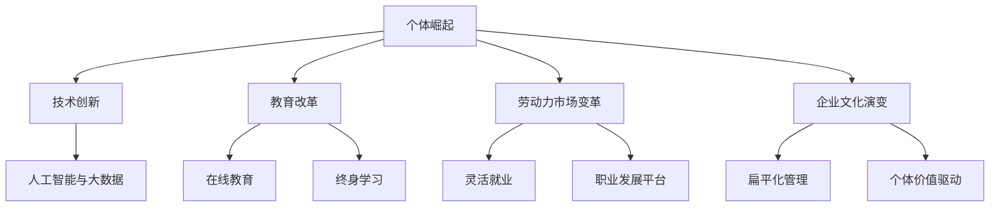

                 

# 《个体崛起：下一轮经济大繁荣的驱动力》

关键词：个体崛起、经济繁荣、技术创新、教育改革、劳动力市场变革

摘要：
本文深入探讨了个体崛起作为下一轮经济大繁荣的驱动力的重要性。通过分析个体崛起的概念、核心驱动力、挑战与机遇，以及在不同领域的应用，本文揭示了个体崛起对经济和社会的深远影响。此外，文章展望了个体崛起的未来趋势，提出了个体崛起的全球影响，并强调了我们在个体崛起中的责任与使命。

----------------------------------------------------------------

## 第一部分：背景与概述

### 第1章 个体崛起的概念与重要性

个体崛起，指的是在信息技术和互联网的推动下，个体在知识创造、创新能力和市场竞争力方面的显著提升。这一现象不仅改变了传统的生产方式和商业模式，更为全球经济注入了新的活力。

#### 1.1 个体崛起的定义

个体崛起可以理解为在信息时代，个体通过自身的知识、技能和创造力，在经济社会中发挥越来越重要的作用，成为推动经济增长的主要力量。个体崛起不仅涉及企业家、专业技术人员，还包括普通劳动者，他们在互联网和数字技术的帮助下，能够更加便捷地获取资源、展示才华、实现自我价值。

#### 1.2 个体崛起的时代背景

个体崛起是信息化时代的产物，随着互联网的普及和信息技术的发展，个体获取信息、交流和合作的方式发生了根本性的变化。以下是一些促使个体崛起的关键因素：

- **互联网的普及**：互联网为个体提供了无限的信息资源和交流平台，使得知识传播和共享变得更加便捷。
- **移动设备的普及**：智能手机和其他移动设备的普及，使得个体可以随时随地获取信息和进行在线工作。
- **云计算与大数据**：云计算和大数据技术的应用，使得个体能够更高效地处理和分析海量数据，从而发现新的商业机会。
- **人工智能与自动化**：人工智能和自动化技术的进步，提高了个体工作的效率和质量，使得个体能够专注于更具创造性的任务。

#### 1.3 个体崛起对经济的影响

个体崛起对经济的影响是多方面的，以下是其中一些关键影响：

- **创新能力的提升**：个体崛起促进了创新能力的提升，个体在互联网和数字技术的支持下，能够更加便捷地进行创新和创业。
- **就业模式的转变**：个体崛起改变了传统的就业模式，灵活就业和远程办公越来越普遍，个体可以更加自由地选择工作方式和地点。
- **商业模式的创新**：个体崛起推动了商业模式的创新，许多新兴的互联网公司和平台基于个体崛起的趋势，创造了新的商业模式和盈利模式。
- **经济增长的驱动力**：个体崛起成为经济增长的重要驱动力，个体在互联网和数字技术领域的创新和创业，为经济增长提供了新的动力。

### 第2章 个体崛起的核心驱动力

个体崛起的背后有着一系列核心驱动力的支持，这些驱动力包括技术创新、教育改革、劳动力市场变革和企业文化演变。以下是这些驱动力的详细分析。

#### 2.1 技术创新

技术创新是推动个体崛起的核心驱动力之一。互联网、云计算、大数据、人工智能等技术的快速发展，为个体提供了丰富的工具和资源，使得个体能够更加高效地工作、学习和创新。

- **互联网的普及**：互联网为个体提供了全球性的交流平台，使得个体能够跨越地域限制，与全球的同行进行合作和交流。
- **云计算的普及**：云计算为个体提供了强大的计算能力，使得个体能够更加便捷地处理和分析海量数据，从而发现新的商业机会。
- **大数据的应用**：大数据技术的应用，使得个体能够从海量数据中提取有价值的信息，为决策提供数据支持。
- **人工智能的进步**：人工智能技术的发展，使得个体能够更加智能化地完成各种任务，从而提高工作效率和质量。

#### 2.2 教育改革

教育改革是推动个体崛起的另一个重要驱动力。在传统教育体系中，教育资源主要集中于学校和大学，而教育改革使得教育资源得以普及和共享，个体能够更加自主地选择和学习。

- **在线教育的兴起**：在线教育的兴起，使得个体能够更加便捷地获取教育资源，打破了时间和空间的限制。
- **终身学习的理念**：终身学习理念的普及，使得个体能够不断更新自己的知识和技能，以适应快速变化的社会和经济环境。
- **个性化教育的推广**：个性化教育的推广，使得个体能够根据自己的兴趣和需求，选择适合自己的学习方式和课程。

#### 2.3 劳动力市场变革

劳动力市场变革也是推动个体崛起的一个重要因素。随着互联网和数字技术的发展，劳动力市场发生了深刻的变化，个体就业模式变得更加灵活多样。

- **灵活就业的普及**：灵活就业，如远程办公、兼职、自由职业等，越来越受欢迎，个体可以根据自己的时间和能力，选择适合自己的工作方式。
- **职业发展的多样化**：职业发展不再局限于传统的职业路径，个体可以通过互联网和数字技术，跨行业、跨领域发展自己的职业生涯。
- **人才市场的开放**：互联网和数字技术打破了地域和行业的限制，人才市场变得更加开放，个体可以更加自由地选择就业机会。

#### 2.4 企业文化演变

企业文化演变也是推动个体崛起的一个重要因素。随着个体在职场中的地位不断提升，企业文化的演变也越来越注重个体的价值和创造力。

- **扁平化的组织结构**：扁平化的组织结构使得个体能够更加自主地开展工作，减少了管理层级和决策时间，提高了工作效率。
- **个体价值的驱动**：企业越来越重视个体的价值和创造力，通过激励措施和人才培养计划，激发个体的潜能，推动企业的发展。
- **合作与创新文化的培育**：企业通过培育合作与创新文化，鼓励个体之间的协作和创意，从而实现企业的创新和突破。

### 第3章 个体崛起的挑战与机遇

个体崛起虽然带来了许多机遇，但同时也面临一系列挑战。如何在挑战中抓住机遇，是推动个体崛起的关键。

#### 3.1 挑战分析

个体崛起面临的挑战主要包括以下几个方面：

- **技能需求的变化**：随着技术的快速发展，个体需要不断更新自己的知识和技能，以适应新的工作环境。
- **就业竞争的加剧**：个体就业市场的竞争日益激烈，个体需要不断提高自己的竞争力，才能在市场中脱颖而出。
- **信息过载**：互联网和数字技术带来了海量的信息，个体需要具备良好的信息筛选和处理能力，避免被信息所淹没。
- **安全与隐私问题**：个体在互联网上的活动和数据，可能面临安全威胁和隐私泄露的风险。

#### 3.2 机遇挖掘

个体崛起带来的机遇同样值得重视，主要包括以下几个方面：

- **创新空间的拓展**：个体崛起为创新提供了更广阔的空间，个体可以更加自由地探索新的领域和商业模式。
- **职业发展的多样化**：个体可以跨行业、跨领域发展自己的职业生涯，实现多样化的职业目标。
- **创业机会的增加**：个体崛起为创业提供了更多机会，个体可以通过互联网和数字技术，实现自己的创业梦想。
- **社会价值的实现**：个体在互联网和数字技术领域的创新和创业，可以更好地实现个人价值，推动社会进步。

#### 3.3 应对策略

为了应对个体崛起面临的挑战，个体可以采取以下策略：

- **持续学习与提升**：个体需要不断学习新的知识和技能，以适应不断变化的工作环境。
- **提升信息处理能力**：个体需要培养良好的信息筛选和处理能力，避免被信息所淹没。
- **注重安全与隐私**：个体需要加强网络安全意识，保护个人数据和隐私。
- **创新与创业**：个体可以积极探索创新和创业的机会，通过实践实现个人价值。

## 第二部分：个体崛起的领域与应用

### 第4章 个体崛起在创业领域的应用

个体崛起为创业领域带来了新的机遇，个体创业者通过互联网和数字技术，实现了创业的多样化和高效化。

#### 4.1 创业趋势与案例分析

个体崛起推动了创业趋势的变化，以下是一些显著的创业趋势：

- **互联网+创业**：互联网和数字技术为创业提供了新的平台和工具，个体创业者可以更加便捷地开展业务。
- **微创业**：微创业成为一种流行趋势，个体创业者通过小规模、低成本的创业模式，实现了创业梦想。
- **平台创业**：基于互联网的平台创业，如电子商务平台、社交媒体平台等，为个体创业者提供了广阔的市场空间。

以下是一些成功的个体创业案例分析：

- **马云的阿里巴巴**：阿里巴巴从一个小型的电子商务平台发展成为全球最大的零售电商平台，实现了从个体创业者到企业家的转变。
- **李想的车和家**：车和家通过互联网和智能制造，实现了新能源汽车的定制化生产，为消费者提供了更优质的购车体验。
- **张一鸣的字节跳动**：字节跳动从一个小型的新闻资讯平台发展成为全球领先的互联网公司，其成功的秘诀在于对用户需求的精准把握和创新。

#### 4.2 创业者素质与能力提升

个体崛起要求创业者具备更高的素质和能力，以下是一些关键能力：

- **创新能力**：个体创业者需要具备创新能力，能够不断推出新产品、新服务，满足市场需求。
- **市场洞察力**：个体创业者需要具备市场洞察力，能够准确把握市场趋势和消费者需求。
- **团队协作能力**：个体创业者需要具备团队协作能力，能够有效地管理团队成员，实现团队目标。
- **学习能力**：个体创业者需要具备快速学习能力，能够不断更新知识和技能，适应行业变化。

为了提升创业者素质和能力，以下是一些建议：

- **参加创业培训**：参加专业的创业培训，学习创业理论和实战经验，提升创业能力。
- **阅读创业书籍**：阅读经典的创业书籍，了解创业成功案例和失败教训，启发创业思路。
- **参与创业社区**：加入创业社区，与其他创业者交流经验，分享创业心得，拓展人脉资源。
- **实践创业**：通过实践创业，不断总结经验和教训，提升创业能力。

#### 4.3 创业环境优化策略

为了促进个体崛起，政府和社会可以采取一系列措施优化创业环境，以下是一些建议：

- **政策支持**：政府可以出台一系列优惠政策，如税收减免、创业补贴等，鼓励个体创业。
- **资金支持**：政府和社会可以设立创业基金，为个体创业者提供资金支持，降低创业风险。
- **技术创新**：鼓励技术创新，为个体创业者提供先进的工具和设备，提高创业效率。
- **市场开放**：开放市场，为个体创业者提供公平竞争的机会，促进创业环境的健康发展。

### 第5章 个体崛起在创新领域的应用

个体崛起不仅改变了创业领域，也在创新领域产生了深远影响。个体在创新过程中发挥着越来越重要的作用，以下是个体崛起在创新领域的一些应用。

#### 5.1 创新驱动的发展模式

个体崛起推动了创新驱动的发展模式，个体创新成为经济增长的主要动力。以下是一些关键点：

- **个体创新的兴起**：个体创新者通过自身的知识、技能和创造力，推动了新技术、新产品和新服务的出现。
- **创新资源的共享**：互联网和数字技术使得创新资源得以共享，个体创新者可以更加便捷地获取所需资源。
- **创新生态系统的构建**：个体创新者通过合作与交流，构建了创新生态系统，促进了创新成果的转化和应用。

#### 5.2 创新项目的管理与实施

个体崛起对创新项目的管理与实施也产生了影响，以下是一些建议：

- **项目立项**：个体创新者在项目立项阶段，需要进行充分的市场调研和风险评估，确保项目具有可行性。
- **团队组建**：个体创新者需要组建一支具有专业能力和协作精神的团队，共同推动创新项目。
- **项目实施**：在项目实施过程中，个体创新者需要制定详细的项目计划，确保项目按计划推进。
- **项目评估**：项目完成后，个体创新者需要进行项目评估，总结项目经验，为未来项目提供参考。

#### 5.3 创新生态系统的构建

个体崛起推动了创新生态系统的构建，以下是一些关键要素：

- **创新平台**：构建创新平台，为个体创新者提供技术支持、资源共享和交流合作的机会。
- **孵化器**：设立孵化器，为初创企业提供办公场所、资金支持和政策扶持，帮助初创企业快速成长。
- **政策支持**：政府可以出台一系列政策，鼓励创新生态系统的构建，为个体创新者提供良好的发展环境。
- **社会资本**：社会资本的投入，如风险投资、天使投资等，为个体创新者提供资金支持，推动创新成果的转化和应用。

### 第6章 个体崛起在职业发展中的应用

个体崛起为职业发展带来了新的机遇和挑战。个体在职业发展过程中，需要充分利用互联网和数字技术，提升自身的竞争力。

#### 6.1 职业规划的重新思考

个体崛起要求职业规划更加灵活和多样化，以下是一些关键点：

- **终身学习**：职业发展不再是阶段性任务，而是终身学习的过程。个体需要不断学习新的知识和技能，以适应职业发展的需求。
- **跨界发展**：个体可以通过跨界发展，开拓新的职业领域，实现职业发展的多元化。
- **个人品牌**：个体可以通过塑造个人品牌，提升个人影响力，实现职业发展的突破。

#### 6.2 跨界发展的可能性

个体崛起为跨界发展提供了更多可能性，以下是一些关键点：

- **技能迁移**：个体可以通过迁移已有的技能，跨界进入新的领域。
- **跨行业合作**：个体可以通过跨行业合作，实现资源整合和优势互补。
- **互联网平台**：互联网平台为个体提供了跨界发展的机会，个体可以通过互联网平台，拓展职业发展空间。

#### 6.3 职业素养的提升

个体崛起要求个体具备更高的职业素养，以下是一些关键点：

- **沟通能力**：个体需要具备良好的沟通能力，能够与团队成员、合作伙伴和客户有效沟通。
- **协作能力**：个体需要具备协作能力，能够与团队成员共同完成任务。
- **创新能力**：个体需要具备创新能力，能够不断提出新的想法和解决方案。
- **适应能力**：个体需要具备适应能力，能够迅速适应新的工作环境和工作内容。

### 第7章 个体崛起在社会治理中的应用

个体崛起不仅改变了经济领域，也对社会治理产生了深远影响。个体在社会治理中的作用日益凸显，以下是个体崛起在社会治理中的应用。

#### 7.1 民众参与的重要性

个体崛起使得民众参与社会治理变得更加容易和广泛，以下是一些关键点：

- **信息透明**：互联网和数字技术使得信息传播更加透明，民众可以更加便捷地获取政府和社会的信息。
- **公民参与**：个体可以通过互联网和数字技术，参与到社会治理的各个环节，如政策制定、公共事务管理等。
- **民主监督**：个体可以通过互联网和数字技术，对政府和社会进行民主监督，促进政府的透明化和廉洁化。

#### 7.2 社区治理的创新实践

个体崛起推动了社区治理的创新实践，以下是一些关键点：

- **社区自治**：个体可以通过社区自治，参与社区事务的管理和决策，实现社区的自我管理和自我服务。
- **智慧社区**：个体可以通过智慧社区的建设，利用互联网和数字技术，提高社区的管理和服务水平。
- **线上线下融合**：个体可以通过线上线下融合的方式，实现社区治理的全方位、全时段覆盖。

#### 7.3 公共服务的个性化需求

个体崛起使得公共服务需求更加个性化，以下是一些关键点：

- **精准服务**：政府和社会可以通过大数据和人工智能等技术，提供精准的公共服务，满足个体的个性化需求。
- **便民服务**：政府和社会可以通过互联网和数字技术，提供便捷的公共服务，提高公共服务效率。
- **智能服务**：政府和社会可以通过智能服务，如智能客服、智能办公等，提高公共服务质量和效率。

## 第三部分：个体崛起的未来展望

### 第8章 个体崛起的未来趋势

个体崛起正在改变全球经济和社会，未来这一趋势将继续发展，带来一系列新的变化。

#### 8.1 未来经济的结构变化

个体崛起将导致未来经济的结构发生重大变化，以下是一些关键点：

- **知识经济的崛起**：知识经济将成为未来经济的主导力量，个体在知识创造和创新方面的作用将更加突出。
- **数字经济的扩张**：数字经济将继续快速发展，互联网和数字技术将在经济活动中扮演更加重要的角色。
- **共享经济的普及**：共享经济将进一步普及，个体将通过共享资源和平台，实现更高效的经济活动。

#### 8.2 未来劳动力市场的演变

未来劳动力市场将发生深刻变化，以下是一些关键点：

- **灵活就业的普及**：灵活就业，如远程办公、兼职、自由职业等，将成为劳动力市场的主流。
- **职业发展的多样化**：职业发展将不再局限于传统的职业路径，个体可以更加自由地选择职业发展方向。
- **技能需求的变化**：劳动力市场对技能的需求将不断变化，个体需要不断更新自己的知识和技能，以适应新的工作环境。

#### 8.3 未来教育的发展方向

未来教育将发生重大变革，以下是一些关键点：

- **在线教育的普及**：在线教育将继续普及，成为个体获取知识和技能的重要途径。
- **终身学习的理念**：终身学习将成为未来教育的核心理念，个体需要不断学习新的知识和技能，以适应职业发展的需求。
- **个性化教育的推广**：个性化教育将得到更广泛的推广，个体可以根据自己的兴趣和需求，选择适合自己的学习方式和课程。

### 第9章 个体崛起的全球影响

个体崛起不仅在国内产生影响，也在全球范围内产生了深远的影响。以下是个体崛起在全球范围内的几个方面。

#### 9.1 全球经济格局的变化

个体崛起将导致全球经济格局发生重大变化，以下是一些关键点：

- **全球经济一体化的深化**：个体崛起将进一步推动全球经济一体化的深化，个体在全球经济活动中的地位将不断提高。
- **新兴市场的崛起**：个体崛起将在一定程度上推动新兴市场的崛起，个体在新兴市场中的作用将更加重要。
- **全球产业链的重组**：个体崛起将导致全球产业链的重组，个体在产业链中的角色将发生变化。

#### 9.2 全球合作与竞争的新局面

个体崛起将导致全球合作与竞争的新局面，以下是一些关键点：

- **全球合作的新模式**：个体崛起将推动全球合作模式的创新，个体之间的合作将更加紧密和多样化。
- **全球竞争的新趋势**：个体崛起将导致全球竞争的新趋势，个体之间的竞争将更加激烈和多样化。
- **跨国企业的转型**：个体崛起将推动跨国企业的转型，企业需要更加重视个体的价值和创造力。

#### 9.3 全球治理的创新路径

个体崛起将推动全球治理的创新路径，以下是一些关键点：

- **全球治理体系的完善**：个体崛起将推动全球治理体系的完善，全球治理需要更加关注个体的需求和利益。
- **跨国合作的加强**：个体崛起将推动跨国合作的加强，全球治理需要建立更加有效的合作机制。
- **全球创新的引领**：个体崛起将推动全球创新的引领，全球治理需要更加重视创新和创造力。

### 第10章 个体崛起：我们的责任与使命

个体崛起不仅带来了机遇，也带来了挑战。作为个体，我们肩负着重要的责任和使命。

#### 10.1 个体崛起对社会的影响

个体崛起对社会产生了深远的影响，以下是一些关键点：

- **社会结构的变革**：个体崛起将导致社会结构发生重大变革，个体的地位和作用将得到提升。
- **社会公平的关注**：个体崛起需要关注社会公平，确保个体在崛起过程中不受不公平待遇。
- **社会责任的承担**：个体崛起需要个体承担社会责任，为社会的发展做出贡献。

#### 10.2 我们在个体崛起中的角色

作为个体，我们将在个体崛起中扮演重要角色，以下是一些关键点：

- **创新者和引领者**：我们作为个体，需要发挥创新者和引领者的作用，推动社会进步。
- **学习者和实践者**：我们作为个体，需要不断学习和实践，提升自身的素质和能力。
- **合作者和贡献者**：我们作为个体，需要与其他个体合作，共同推动社会的发展。

#### 10.3 我们的责任与使命

作为个体，我们肩负着重要的责任和使命，以下是一些关键点：

- **推动社会进步**：我们有责任推动社会进步，实现社会的公平、公正和可持续发展。
- **传承和创新**：我们有责任传承和创新，为后代留下宝贵的知识和财富。
- **社会责任的承担**：我们有责任承担社会责任，为社会的发展贡献自己的力量。

## 附录

### 附录A 个体崛起相关资源与工具

为了更好地理解和应对个体崛起，以下是一些相关的资源与工具：

#### A.1 研究报告与政策文件

- **世界银行报告**：《个体崛起：下一个全球经济增长的驱动力》
- **联合国报告**：《个体崛起：数字时代的社会变革》
- **中国国务院政策文件**：《关于加快数字化发展的指导意见》

#### A.2 行业报告与分析

- **麦肯锡报告**：《数字化时代的个体崛起》
- **普华永道报告**：《未来工作：个体崛起的趋势》
- **腾讯研究院报告**：《个体崛起：互联网行业的人才报告》

#### A.3 教育资源与培训项目

- **Coursera**：提供全球顶尖大学的在线课程，涵盖计算机科学、经济学、心理学等领域的课程。
- **edX**：提供哈佛大学、麻省理工学院等全球顶级大学的在线课程，涵盖计算机科学、数据科学、人工智能等领域的课程。
- **Udacity**：提供实用技能培训，涵盖人工智能、机器学习、深度学习等领域的课程。

#### A.4 创新平台与孵化器介绍

- **硅谷孵化器**：硅谷著名的孵化器，如Y Combinator、500 Startups、Techstars，为初创企业提供了丰富的资源和指导。
- **中国创新创业大赛**：由中国政府主办，为创业者提供了展示和融资的平台。
- **香港创新创业中心**：为香港的创业者提供了办公空间、资金支持和专业指导。

### 附录B 个体崛起案例分析

#### B.1 成功案例分享

- **Uber**：通过互联网技术和移动应用，改变了传统出租车行业，成为全球最大的移动出行平台。
- **Airbnb**：通过共享经济模式，改变了住宿行业，为全球旅行者提供了丰富的住宿选择。
- **Tesla**：通过电动汽车和可再生能源技术，推动了汽车行业的创新和转型。

#### B.2 失败案例分析

- **Nest Labs**：被谷歌收购后，由于管理不善和战略失误，最终被关闭。
- **Blighty**：一家提供远程办公服务的初创公司，由于市场环境变化和竞争压力，最终倒闭。
- **HBO Now**：HBO推出的在线流媒体服务，由于用户界面问题和用户体验不佳，未能取得预期成功。

#### B.3 案例启示与借鉴

- **成功案例启示**：成功案例表明，技术创新、市场洞察和用户需求是推动个体崛起的关键因素。
- **失败案例借鉴**：失败案例提醒我们，市场环境变化、管理不善和战略失误可能导致个体崛起的失败。

### 附录C 个体崛起的 Mermaid 流程图

以下是一个简单的 Mermaid 流程图，展示了个体崛起的核心驱动因素：



### 附录D 核心算法原理讲解

以下是支持向量机（SVM）算法的核心原理讲解：

#### 1. SVM的基本概念

SVM（Support Vector Machine）是一种二分类模型，其目标是找到一个最佳的超平面，将数据集中的正负样本分开。超平面由一个或多个平面组成，其中每个平面可以由一组特征向量（权重）和偏置（b）确定。

$$
w \cdot x + b = 0
$$

#### 2. SVM的优化目标

SVM的优化目标是找到一组权重（w）和偏置（b），使得分类间隔最大化。分类间隔是指两个类别最近的样本到超平面的距离。

$$
\frac{1}{2} ||w||^2
$$

#### 3. SVM的求解方法

SVM求解的主要方法有两种：原始对偶形式和SMO（Sequential Minimal Optimization）算法。

- **原始对偶形式**：将原始问题转化为对偶问题，然后使用拉格朗日乘子法求解。

$$
\min_{w,b}\frac{1}{2}||w||^2 - \sum_{i=1}^{n}y_{i}\alpha_{i}(w\cdot x_{i}+b)
$$

$$
\max_{\alpha}\min_{w,b}\frac{1}{2}||w||^2 - \sum_{i=1}^{n}y_{i}\alpha_{i}(w\cdot x_{i}+b)
$$

- **SMO算法**：一种迭代求解算法，通过选择两个变量进行优化，逐步逼近最优解。

```python
def smoSimple(data, classLabels, C, toler, maxIter):
    ...
    return w, b
```

### 附录E 数学模型和数学公式讲解

以下是投入产出模型和劳动力市场需求模型的基本原理讲解：

#### 1. 投入产出模型

投入产出模型是一种描述经济活动内部相互联系的方法。它通过构建一个线性方程组来描述不同产业之间的生产与分配关系。

$$
\begin{bmatrix}
X_{11} & X_{12} & ... & X_{1n} \\
X_{21} & X_{22} & ... & X_{2n} \\
... & ... & ... & ... \\
X_{n1} & X_{n2} & ... & X_{nn}
\end{bmatrix}
\begin{bmatrix}
I_n \\
Y_n
\end{bmatrix}
=
\begin{bmatrix}
R_n \\
D_n
\end{bmatrix}
$$

其中，$X$ 表示直接消耗系数矩阵，$I$ 表示产出向量，$Y$ 表示中间投入向量，$R$ 表示初始投入向量，$D$ 表示最终需求向量。

#### 2. 劳动力市场需求模型

劳动力市场需求模型描述了企业对劳动力的需求与劳动力供给之间的关系。它通常采用以下形式：

$$
Q_d = Q_0 - a(p - w)
$$

其中，$Q_d$ 表示劳动力需求量，$Q_0$ 表示基准需求量，$a$ 表示工资弹性，$p$ 表示产品价格，$w$ 表示工资水平。

### 附录F 项目实战

以下是使用Python搭建个体崛起数据分析平台的实际项目：

#### 1. 环境搭建

安装Python、Jupyter Notebook和必要的Python库（如Pandas、NumPy、Scikit-learn等）。

```bash
pip install python
pip install jupyter
pip install pandas numpy scikit-learn
```

#### 2. 数据获取

从公开数据源（如国家统计局、各类在线数据库等）获取个体崛起相关的数据，包括经济指标、就业数据、创业项目数据等。

```python
import pandas as pd

# 读取数据
data = pd.read_csv('individual_rise_data.csv')
```

#### 3. 数据清洗

对获取的数据进行清洗，包括缺失值处理、异常值检测与处理、数据格式转换等。

```python
# 数据清洗
data = data.dropna()
```

#### 4. 数据分析

使用Pandas和NumPy进行数据分析，包括数据可视化、相关性分析、回归分析等。

```python
import matplotlib.pyplot as plt

# 绘制散点图
plt.scatter(data['gdp_growth'], data['employment_rate'])
plt.xlabel('GDP Growth')
plt.ylabel('Employment Rate')
plt.title('GDP Growth vs Employment Rate')
plt.show()
```

#### 5. 模型构建

使用Scikit-learn构建回归模型、分类模型等，对个体崛起的相关因素进行预测和分析。

```python
from sklearn.model_selection import train_test_split
from sklearn.preprocessing import StandardScaler
from sklearn.linear_model import LinearRegression

# 划分特征和目标
X = data.drop('individual_rise_index', axis=1)
y = data['individual_rise_index']

# 划分训练集和测试集
X_train, X_test, y_train, y_test = train_test_split(X, y, test_size=0.2, random_state=42)

# 归一化处理
scaler = StandardScaler()
X_train = scaler.fit_transform(X_train)
X_test = scaler.transform(X_test)

# 构建模型
model = LinearRegression()

# 编译模型
model.fit(X_train, y_train)

# 模型训练
model.fit(X_train, y_train)

# 模型评估
predictions = model.predict(X_test)
print(predictions)
```

### 附录G 代码实际案例与详细解释说明

以下是使用TensorFlow构建个体崛起预测模型的实际代码案例：

#### 1. 数据预处理

将原始数据划分为特征（X）和目标（y），并进行归一化处理。

```python
import pandas as pd
from sklearn.model_selection import train_test_split
from sklearn.preprocessing import StandardScaler

# 读取数据
data = pd.read_csv('individual_rise_data.csv')

# 划分特征和目标
X = data.drop('individual_rise_index', axis=1)
y = data['individual_rise_index']

# 划分训练集和测试集
X_train, X_test, y_train, y_test = train_test_split(X, y, test_size=0.2, random_state=42)

# 归一化处理
scaler = StandardScaler()
X_train = scaler.fit_transform(X_train)
X_test = scaler.transform(X_test)
```

#### 2. 模型构建

使用TensorFlow构建一个简单的多层感知机（MLP）模型。

```python
import tensorflow as tf
from tensorflow.keras.models import Sequential
from tensorflow.keras.layers import Dense

# 构建模型
model = Sequential([
    Dense(64, activation='relu', input_shape=(X_train.shape[1],)),
    Dense(32, activation='relu'),
    Dense(1, activation='sigmoid')
])

# 编译模型
model.compile(optimizer='adam', loss='binary_crossentropy', metrics=['accuracy'])

# 模型训练
model.fit(X_train, y_train, epochs=10, batch_size=32, validation_split=0.2)
```

#### 3. 代码解读与分析

- **数据预处理**：数据预处理是模型训练前的重要步骤，包括数据清洗、归一化处理等。
- **模型构建**：使用TensorFlow构建一个简单的多层感知机模型，包括输入层、隐藏层和输出层。
- **模型训练**：使用训练数据对模型进行训练，并使用验证数据集进行验证。

```python
# 示例：分析模型性能
from sklearn.metrics import classification_report, confusion_matrix

# 模型评估
predictions = model.predict(X_test)
predictions = (predictions > 0.5)

# 分类报告
print(classification_report(y_test, predictions))

# 混淆矩阵
print(confusion_matrix(y_test, predictions))
```

以上是对个体崛起的相关内容进行的详细阐述。个体崛起作为下一轮经济大繁荣的驱动力，已经在全球范围内产生了深远的影响。通过技术创新、教育改革、劳动力市场变革和企业文化演变，个体崛起正在改变经济、社会和职业发展的方方面面。未来，个体崛起将继续发展，为全球经济和社会带来更多的机遇和挑战。

作者：AI天才研究院/AI Genius Institute & 禅与计算机程序设计艺术 /Zen And The Art of Computer Programming

----------------------------------------------------------------

## 结论

个体崛起作为下一轮经济大繁荣的驱动力，正在深刻改变全球经济和社会。本文通过对个体崛起的概念、核心驱动力、挑战与机遇以及在不同领域的应用的详细分析，揭示了个体崛起对经济和社会的深远影响。个体崛起不仅推动了技术创新、教育改革、劳动力市场变革和企业文化演变，还带来了新的就业模式、创业机会和社会治理创新。

未来，个体崛起将继续发展，带来一系列新的变化。全球经济结构将发生重大变化，劳动力市场将变得更加灵活和多样化，教育模式将更加注重终身学习和个性化教育。个体崛起将推动全球合作与竞争的新局面，为全球治理提供新的路径。

在这个过程中，个体肩负着重要的责任和使命。作为个体，我们需要不断学习、创新和合作，推动社会进步。同时，我们也需要关注社会公平和责任，确保个体崛起过程中的公平与可持续发展。

总之，个体崛起是未来经济发展的重要驱动力，它将为全球经济和社会带来更多的机遇和挑战。让我们共同努力，迎接个体崛起的时代，为构建一个更加繁荣、公正和可持续的未来而奋斗。作者：AI天才研究院/AI Genius Institute & 禅与计算机程序设计艺术/Zen And The Art of Computer Programming。

