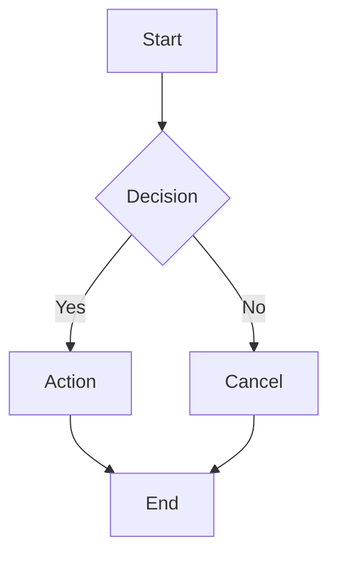
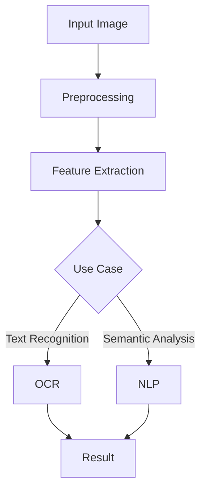

                 

# 人工智能在考古学中的应用：解读古文字

> **关键词**：人工智能、考古学、古文字识别、自然语言处理、机器学习、数学模型

> **摘要**：本文探讨了人工智能在考古学中的应用，特别是古文字的识别与解读。通过介绍人工智能的基本概念、考古学的基础知识以及古文字学与考古学的交叉应用，我们详细阐述了自然语言处理和机器学习在古文字识别中的核心算法原理。此外，我们还讲解了数学模型在古文字分析中的应用，并通过实际项目实战展示了人工智能在古文字识别与解读中的具体应用。本文旨在为读者提供一个清晰、系统的了解，揭示人工智能在考古学领域中的重要价值。

## 《人工智能在考古学中的应用：解读古文字》目录大纲

### 第一部分：基础概念与联系

#### 第1章：人工智能概述

##### 1.1 人工智能的定义与发展历程

- AI的概念与分类
- 人工智能的发展历程

##### 1.2 考古学的概念与方法

- 考古学的定义
- 考古学的基本方法

##### 1.3 人工智能与考古学的交叉应用

- 人工智能在考古学中的应用现状
- 人工智能在考古学中的优势与挑战

#### 第2章：古文字学与考古学

##### 2.1 古文字学的概念与历史

- 古文字学的定义
- 古文字学的发展历史

##### 2.2 考古学中的古文字研究方法

- 古文字识别技术
- 古文字分析工具

##### 2.3 古文字在考古学研究中的应用

- 古文字与考古学研究的结合点
- 古文字在考古学研究中的价值

### 第二部分：核心算法原理讲解

#### 第3章：自然语言处理与古文字识别

##### 3.1 自然语言处理基础

- 自然语言处理的概念
- 自然语言处理的基本任务

##### 3.2 古文字识别算法

- 传统的古文字识别方法
- 基于深度学习的古文字识别方法

##### 3.3 古文字识别算法原理详解

- 古文字特征提取
- 古文字分类算法

#### 第4章：机器学习与古文字解读

##### 4.1 机器学习基础

- 机器学习的定义
- 常见的机器学习算法

##### 4.2 古文字解读算法

- 古文字聚类分析
- 古文字语义分析

##### 4.3 古文字解读算法原理详解

- 文字间关系建模
- 文字意义推断

### 第三部分：数学模型和公式详解

#### 第5章：数学模型在古文字识别中的应用

##### 5.1 古文字特征提取的数学模型

- 特征向量空间
- 特征向量变换

##### 5.2 古文字分类的数学模型

- 决策树
- 随机森林

##### 5.3 古文字解读的数学模型

- 贝叶斯分类器
- 支持向量机

#### 第6章：统计学方法在古文字研究中的应用

##### 6.1 统计学基础

- 数据分布
- 概率与统计推断

##### 6.2 古文字频率分布分析

- 频率分布曲线
- 卡方检验

##### 6.3 古文字统计模型应用

- 逻辑回归
- 聚类分析

### 第四部分：项目实战

#### 第7章：古文字识别实战

##### 7.1 项目背景与目标

- 项目描述
- 项目目标

##### 7.2 环境搭建

- 硬件与软件环境配置
- 数据集准备

##### 7.3 代码实现与解读

- 数据预处理
- 模型训练与验证
- 模型评估与优化

#### 第8章：古文字解读实战

##### 8.1 项目背景与目标

- 项目描述
- 项目目标

##### 8.2 环境搭建

- 硬件与软件环境配置
- 数据集准备

##### 8.3 代码实现与解读

- 数据预处理
- 模型训练与验证
- 模型评估与优化

### 附录

#### 附录A：常用工具与资源

##### A.1 数据库资源

- 古文字数据库介绍
- 常用数据集来源

##### A.2 开发工具

- 开发环境搭建指南
- 常用开发工具介绍

##### A.3 参考文献与进一步阅读

- 相关论文
- 常见参考书籍

##### A.4 Mermaid流程图示例

- Mermaid语法
- 古文字识别与解读流程图示例

---

现在，我们将按照上述目录大纲，逐步深入探讨人工智能在考古学中的应用，特别是古文字的识别与解读。首先，我们将介绍人工智能的基本概念、考古学的基础知识以及古文字学与考古学的交叉应用。这将为我们后续讨论人工智能在古文字识别与解读中的核心算法原理打下基础。

## 第一部分：基础概念与联系

### 第1章：人工智能概述

#### 1.1 人工智能的定义与发展历程

**人工智能（Artificial Intelligence，简称AI）** 是指由人制造出的系统所表现出的智能行为。它包括理解、学习、推理、解决问题、知识表示、感知、自然语言处理等多个方面。人工智能可以追溯到20世纪50年代，当时艾伦·图灵提出了“图灵测试”，这是评估机器是否具有智能的一个经典方法。图灵测试通过一个互动对话来判断机器是否能以人类难以区分的方式表现出智能。

**人工智能的分类** 可以从不同角度进行划分：

1. **弱人工智能（Narrow AI）**：专注于特定任务的智能，如语音识别、图像识别、推荐系统等。
2. **强人工智能（General AI）**：具有广泛认知能力，能够像人类一样理解、学习和适应各种情况。

**人工智能的发展历程**：

1. **1950年代 - 1960年代**：人工智能概念提出，初步的算法和模型被开发。
2. **1970年代**：人工智能领域经历了一次“寒冬”，研究经费减少，项目终止。
3. **1980年代**：专家系统成为研究热点，但在实际应用中受到限制。
4. **1990年代 - 2000年代**：机器学习和数据挖掘技术取得突破，人工智能应用开始广泛使用。
5. **2010年代**：深度学习技术的快速发展，使得人工智能在图像识别、语音识别等领域取得了重大突破。

#### 1.2 考古学的概念与方法

**考古学（Archaeology）** 是研究人类历史和文化的一门科学，通过发掘和分析古代人类活动遗留下来的物质遗存，来了解过去人类的生活方式、社会组织和文化发展。考古学的基本方法包括：

1. **发掘（Excavation）**：通过挖掘考古遗址，收集古代人类活动的物质遗存。
2. **采集（Collection）**：收集发掘到的物质遗存，进行分类、标记和记录。
3. **分析（Analysis）**：对物质遗存进行科学分析，以了解其年代、来源、用途等。
4. **解释（Explanation）**：将分析结果与历史文献、其他考古发现等联系起来，解释其文化和社会背景。

**考古学的基本方法**：

1. **区域考古学（Regional Archaeology）**：研究特定地区的考古遗存，了解该地区的历史发展。
2. **文化考古学（Cultural Archaeology）**：研究不同文化的考古遗存，比较分析文化差异和演变。
3. **技术考古学（Technological Archaeology）**：研究古代人类的技术和文化，如工具、建筑等。
4. **实验考古学（Experimental Archaeology）**：通过实验和模拟，了解古代人类的生活方式和技术。

#### 1.3 人工智能与考古学的交叉应用

**人工智能在考古学中的应用现状**：

1. **图像识别**：用于识别和分类考古发掘中的文物，如陶器、瓷器等。
2. **文字识别**：用于识别和解读古文字，如甲骨文、楔形文字等。
3. **数据挖掘**：用于分析大量考古数据，发现规律和趋势。
4. **虚拟现实**：用于重现古代遗址和场景，提供沉浸式的考古体验。

**人工智能在考古学中的优势**：

1. **高效性**：人工智能能够快速处理大量数据，提高考古研究的效率。
2. **精确性**：人工智能算法能够精确识别和分类文物，减少人为错误。
3. **跨学科合作**：人工智能结合考古学、计算机科学、统计学等多学科知识，促进考古研究的创新。

**人工智能在考古学中的挑战**：

1. **数据质量**：考古数据的多样性、缺失和噪声会影响人工智能算法的性能。
2. **算法选择**：选择合适的算法和模型对于考古问题的解决至关重要。
3. **解释能力**：人工智能在解释考古发现背后的文化和社会意义方面存在一定的局限性。

通过以上对人工智能与考古学的基础概念的介绍，我们可以看到这两门学科的交叉应用有着广阔的前景。接下来，我们将进一步探讨古文字学的基本概念与发展历史，以及考古学中的古文字研究方法，为后续讨论人工智能在古文字识别与解读中的应用奠定基础。

---

### 第2章：古文字学与考古学

#### 2.1 古文字学的概念与历史

**古文字学（Paleography）** 是研究古代文字的学科，主要关注文字的起源、演变、传播以及与其文化背景的关系。古文字学不仅涉及文字的形态、结构和书写系统，还包括文字的解读、解释和应用。

**古文字学的发展历史**：

1. **古代**：文字的发明和演变是古文字学研究的起点。最早的文字可以追溯到约公元前3200年的古埃及圣书体和古苏美尔人的楔形文字。
2. **中世纪**：随着不同文明的兴起和衰落，古文字学逐渐发展成为一门独立的学科。例如，古典希腊和罗马时期的学者对古埃及和巴比伦的象形文字进行了深入研究。
3. **现代**：19世纪以来，古文字学进入了一个快速发展的阶段。随着考古学的兴起，大量的古文字遗址被发掘，推动了古文字学研究的深入。例如，19世纪末，甲骨文的发现和解读揭示了古代中国商代的社会和文化。

**古文字学的研究内容**：

1. **文字形态学**：研究文字的形态、结构、书写规律等。
2. **文字比较学**：比较不同文字之间的相似性和差异性，探讨文字系统的演变。
3. **文字解读学**：通过考古发掘和文献研究，解读古文字的含义和用法。
4. **文字应用学**：研究文字在社会文化、宗教、政治等方面的应用。

#### 2.2 考古学中的古文字研究方法

**古文字识别技术**：

- **传统方法**：通过专家的肉眼识别和对比，将古文字逐个解读。这种方法依赖于专家的经验和知识，但速度较慢且容易出错。
- **现代方法**：利用计算机技术，特别是自然语言处理和机器学习算法，自动识别和解读古文字。例如，卷积神经网络（CNN）和循环神经网络（RNN）被广泛应用于古文字识别。

**古文字分析工具**：

- **OCR（Optical Character Recognition）**：光学字符识别技术，用于将图像中的文字自动转换为可编辑的文本格式。
- **NLP（Natural Language Processing）**：自然语言处理技术，用于对古文字进行语义分析和理解。
- **ML（Machine Learning）**：机器学习技术，用于训练模型识别和解读古文字。
- **深度学习框架**：如TensorFlow和PyTorch，提供了丰富的工具和库，用于开发和实现古文字识别模型。

**古文字研究方法的应用实例**：

1. **甲骨文识别**：利用OCR技术和深度学习模型，可以对甲骨文进行自动识别和分类，提高古文字解读的效率。
2. **楔形文字解读**：通过NLP和机器学习算法，可以自动分析楔形文字的结构和语义，揭示古巴比伦文明的历史。
3. **古埃及象形文字研究**：结合OCR和NLP技术，可以解读古埃及象形文字，进一步了解古埃及文化和宗教信仰。

**古文字在考古学研究中的应用**：

1. **年代确定**：通过解读古文字，可以确定考古遗址的年代和文化背景。
2. **社会结构研究**：古文字提供了古代社会文化、政治、经济等方面的信息，有助于了解古代社会结构。
3. **文化交流研究**：古文字反映了古代文明之间的交流和互动，有助于探讨文化交流的历史。
4. **宗教信仰研究**：古文字中的符号和图案揭示了古代文明的宗教信仰和仪式。

通过以上对古文字学与考古学的介绍，我们可以看到古文字在考古学研究中的重要地位。古文字不仅是解读古代文明的关键，也是了解人类文化演变的重要线索。接下来，我们将进一步探讨人工智能在古文字识别与解读中的应用，揭示其技术原理和实现方法。

---

### 第二部分：核心算法原理讲解

#### 第3章：自然语言处理与古文字识别

##### 3.1 自然语言处理基础

**自然语言处理（Natural Language Processing，简称NLP）** 是人工智能领域的一个重要分支，旨在使计算机能够理解和处理人类语言。NLP涵盖了从语言理解到语言生成的各种任务，包括词法分析、句法分析、语义分析、情感分析等。

**NLP的基本任务**：

1. **词法分析（Lexical Analysis）**：将文本分解为词、短语和标记等基本单元。
2. **句法分析（Syntactic Analysis）**：分析文本的语法结构，确定句子中的词语关系。
3. **语义分析（Semantic Analysis）**：理解文本的含义，包括词语的意义、句子的意图等。
4. **情感分析（Sentiment Analysis）**：分析文本的情感倾向，如正面、负面或中立。
5. **机器翻译（Machine Translation）**：将一种语言的文本自动翻译成另一种语言。

**NLP在古文字识别中的应用**：

1. **词法分析**：将古文字图像分解为单个字符或符号，以便进一步处理。
2. **句法分析**：分析古文字的结构和语法，理解其组合方式和语义。
3. **语义分析**：解读古文字的含义，了解其背后的文化和社会背景。

##### 3.2 古文字识别算法

**传统的古文字识别方法**：

1. **基于规则的方法**：通过编写一系列规则，对古文字图像进行识别。这种方法依赖于专家的经验和知识，但受限于规则的数量和复杂性。
2. **基于模板的方法**：将古文字图像与预先定义的模板进行匹配，识别图像中的文字。这种方法需要大量的模板库，但在识别相似度较高的文字时效果较好。

**基于深度学习的古文字识别方法**：

1. **卷积神经网络（CNN）**：通过多层卷积和池化操作，提取图像中的特征，实现对古文字的识别。CNN在图像识别任务中取得了显著的成果，适用于复杂的古文字识别问题。
2. **循环神经网络（RNN）**：通过序列模型处理古文字图像中的字符序列，识别文字的语义和结构。RNN在处理长序列数据方面具有优势，适用于古文字识别中的序列分析。

**古文字识别算法的比较**：

- **传统方法**：依赖于人工规则和模板，处理速度较慢，识别精度有限。
- **深度学习方法**：通过自动学习图像特征，处理速度和识别精度较高，但需要大量的训练数据和计算资源。

##### 3.3 古文字识别算法原理详解

**古文字特征提取**：

1. **像素特征提取**：通过像素值直接提取图像的特征，如灰度值、颜色直方图等。这种方法简单但特征信息有限。
2. **形状特征提取**：通过形状分析提取图像的特征，如边缘、角点、连通域等。形状特征更接近文字的几何结构，有利于提高识别精度。
3. **纹理特征提取**：通过纹理分析提取图像的特征，如纹理方向、纹理强度等。纹理特征能够反映文字的书写风格和笔画特征，有助于提高识别精度。

**古文字分类算法**：

1. **支持向量机（SVM）**：通过找到一个最优超平面，将不同类别的文字图像进行分类。SVM在处理高维数据时具有较好的性能，但需要大量的训练数据和计算资源。
2. **决策树（Decision Tree）**：通过一系列二分类问题，将文字图像划分为不同类别。决策树结构简单，易于解释，但可能存在过拟合问题。
3. **随机森林（Random Forest）**：通过构建多棵决策树，对文字图像进行分类。随机森林结合了决策树的优势，提高了分类的准确性和鲁棒性。

通过以上对自然语言处理与古文字识别算法的讲解，我们可以看到人工智能在古文字识别中的应用潜力。深度学习和自然语言处理技术的结合，为古文字识别提供了一种有效的解决方案。接下来，我们将进一步探讨机器学习与古文字解读的算法原理，以及其在考古学研究中的应用。

---

### 第4章：机器学习与古文字解读

##### 4.1 机器学习基础

**机器学习（Machine Learning，简称ML）** 是指通过算法和统计模型，使计算机系统能够从数据中自动学习和改进性能的过程。机器学习在人工智能领域中扮演着核心角色，广泛应用于图像识别、自然语言处理、推荐系统等领域。

**机器学习的定义**：

机器学习是指一种通过从数据中学习规律和模式，从而进行预测或决策的技术。机器学习可以分为以下几类：

1. **监督学习（Supervised Learning）**：通过已标记的训练数据，训练模型进行预测或分类。
2. **无监督学习（Unsupervised Learning）**：通过未标记的数据，发现数据中的结构和规律。
3. **强化学习（Reinforcement Learning）**：通过试错和奖励机制，训练模型进行决策。

**常见的机器学习算法**：

1. **线性回归（Linear Regression）**：通过拟合一条直线，预测连续值。
2. **逻辑回归（Logistic Regression）**：通过拟合一个逻辑函数，进行分类任务。
3. **决策树（Decision Tree）**：通过一系列二分类问题，对数据进行分类。
4. **随机森林（Random Forest）**：通过构建多棵决策树，提高分类和预测的准确性。
5. **支持向量机（SVM）**：通过找到一个最优超平面，进行分类和回归任务。
6. **神经网络（Neural Network）**：通过多层神经元，进行复杂的特征提取和预测。

**机器学习在古文字解读中的应用**：

1. **聚类分析（Cluster Analysis）**：通过将古文字数据分为不同的聚类，发现潜在的分组和模式，有助于古文字的分类和解读。
2. **分类算法**：如SVM和随机森林，用于对古文字进行分类和识别，提高解读的准确性。
3. **回归分析**：如线性回归，用于预测古文字的年代和来源，提供额外的解读依据。

##### 4.2 古文字解读算法

**古文字聚类分析**：

1. **K-均值聚类（K-Means Clustering）**：通过将古文字数据分为K个聚类，每个聚类内的数据点相似度较高，不同聚类之间的数据点相似度较低。K-均值聚类可以用于发现古文字数据中的潜在分类和结构。
2. **层次聚类（Hierarchical Clustering）**：通过逐步合并或分裂聚类，形成一棵聚类树，显示不同聚类之间的关系。层次聚类可以用于探索古文字数据的层次结构和关系。

**古文字语义分析**：

1. **词嵌入（Word Embedding）**：通过将古文字字符或符号转换为高维向量表示，用于语义分析和文本分类。词嵌入可以捕捉字符或符号之间的语义关系，有助于古文字的解读和理解。
2. **循环神经网络（RNN）**：通过序列模型处理古文字的字符序列，提取字符间的序列特征和语义关系。RNN在处理长序列数据方面具有优势，适用于古文字的语义分析和解读。

**古文字解读算法原理详解**：

**文字间关系建模**：

1. **共现矩阵（Co-occurrence Matrix）**：通过计算古文字之间的共现频率，构建共现矩阵，用于分析文字之间的依赖关系和语义关系。
2. **图模型（Graph Model）**：通过将古文字视为图中的节点，构建文字间的语义网络，用于分析文字的语义关系和结构。图模型可以捕捉文字之间的复杂关系，有助于古文字的解读和推断。

**文字意义推断**：

1. **上下文分析（Contextual Analysis）**：通过分析古文字在句子或段落中的上下文，推断其语义和含义。上下文分析可以帮助纠正古文字解读中的错误，提高解读的准确性。
2. **语义角色标注（Semantic Role Labeling）**：通过标注古文字在句子中的语义角色，如主语、谓语、宾语等，推断文字的语义和功能。语义角色标注有助于理解古文字的语法结构和语义关系。

通过以上对机器学习与古文字解读算法的讲解，我们可以看到机器学习在古文字解读中的广泛应用和潜力。聚类分析和语义分析等技术，可以帮助考古学家更好地解读古文字，揭示古代文明的历史和文化。接下来，我们将进一步探讨数学模型在古文字分析中的应用，以及其在考古学研究中的具体应用。

---

### 第三部分：数学模型与古文字分析

#### 第5章：数学模型在古文字识别中的应用

##### 5.1 古文字特征提取的数学模型

**古文字特征提取** 是将古文字图像转化为计算机可以处理的特征向量表示的过程。特征提取的质量直接影响后续识别算法的性能。以下是几种常见的数学模型：

**特征向量空间**

1. **像素特征**：直接使用图像的像素值作为特征向量。这种方法简单直观，但特征维度较高，容易导致“维数灾难”。
    $$ \textbf{x} = (x_1, x_2, ..., x_n) $$
    其中，$x_i$ 表示图像在第 $i$ 个像素的灰度值。

2. **形状特征**：通过计算图像的几何形状特征，如边缘、角点、轮廓等。这些特征可以捕捉文字的形状和结构。
    $$ \textbf{s} = (s_1, s_2, ..., s_m) $$
    其中，$s_i$ 表示第 $i$ 个形状特征，如边缘长度、角点个数等。

**特征向量变换**

为了提高识别的准确性和鲁棒性，通常需要对原始特征向量进行变换。以下是一些常见的变换方法：

1. **归一化（Normalization）**：通过缩放特征向量，使其具有相似的尺度。
    $$ \textbf{x}_{\text{norm}} = \frac{\textbf{x}}{\lVert \textbf{x} \rVert} $$
    其中，$\lVert \textbf{x} \rVert$ 表示特征向量的欧几里得范数。

2. **主成分分析（PCA）**：通过保留主要特征，降低特征维度，提高识别的效率。
    $$ \textbf{y} = \textbf{P} \textbf{X} $$
    其中，$\textbf{P}$ 是主成分矩阵，$\textbf{X}$ 是原始特征矩阵。

##### 5.2 古文字分类的数学模型

**分类模型** 用于将古文字图像分类到不同的类别。以下是一些常见的数学模型：

**决策树（Decision Tree）**

决策树是一种基于规则的分类模型，通过一系列的条件分支，将数据点分类到不同的类别。决策树的构建过程如下：

1. **选择最佳分割点**：通过计算信息增益、基尼不纯度等指标，选择最佳分割点。
    $$ \text{信息增益} = \sum_{i} p_i \log_2 p_i $$
    其中，$p_i$ 表示第 $i$ 个类别的概率。

2. **构建决策树**：根据选择的分割点，构建决策树，每个节点表示一个分割条件，每个叶子节点表示一个类别。

**随机森林（Random Forest）**

随机森林是一种集成学习方法，通过构建多棵决策树，提高分类的准确性和鲁棒性。随机森林的构建过程如下：

1. **随机选择特征和样本**：每次构建决策树时，从特征集合中随机选择一部分特征，从样本集合中随机选择一部分样本。
2. **构建多棵决策树**：使用上述方法构建多棵决策树，每棵树都是独立的。
3. **集成投票**：将多棵决策树的分类结果进行投票，选择多数类别作为最终分类结果。

##### 5.3 古文字解读的数学模型

**贝叶斯分类器（Naive Bayes Classifier）**

贝叶斯分类器是一种基于贝叶斯定理的简单概率分类模型。贝叶斯分类器的假设条件是特征之间相互独立，即每个特征的概率是独立的。

1. **贝叶斯定理**
    $$ P(C|D) = \frac{P(D|C)P(C)}{P(D)} $$
    其中，$P(C|D)$ 表示在给定特征 $D$ 下，类别 $C$ 的概率；$P(D|C)$ 表示在类别 $C$ 下特征 $D$ 的概率；$P(C)$ 表示类别 $C$ 的概率；$P(D)$ 表示特征 $D$ 的概率。

2. **朴素贝叶斯分类器**
    $$ \hat{C} = \arg\max_{C} P(C) \prod_{i} P(d_i|C) $$
    其中，$\hat{C}$ 表示预测的类别；$d_i$ 表示第 $i$ 个特征。

**支持向量机（Support Vector Machine，SVM）**

支持向量机是一种基于优化理论的分类模型，通过找到一个最优的超平面，将不同类别的样本分隔开。

1. **优化目标**
    $$ \min_{\textbf{w}, b} \frac{1}{2} \lVert \textbf{w} \rVert^2 + C \sum_{i} \xi_i $$
    $$ \text{subject to} \quad y_i (\textbf{w} \cdot \textbf{x_i} + b) \geq 1 - \xi_i $$
    其中，$\textbf{w}$ 是超平面参数；$b$ 是偏置；$C$ 是惩罚参数；$\xi_i$ 是松弛变量。

2. **分类决策**
    $$ \hat{y} = \text{sign}(\textbf{w} \cdot \textbf{x} + b) $$
    其中，$\textbf{x}$ 是测试样本的特征向量。

通过以上对数学模型在古文字识别和解读中的应用讲解，我们可以看到数学模型在提高识别精度和解读准确性方面的重要作用。接下来，我们将探讨统计学方法在古文字研究中的应用，进一步揭示古文字分析的数学原理。

---

### 第6章：统计学方法在古文字研究中的应用

##### 6.1 统计学基础

**统计学（Statistics）** 是一门关于如何通过数据收集、分析和解释来推断总体特征的学科。在古文字研究中，统计学方法被广泛应用于数据分析、模型构建和结果验证。

**统计学基础概念**：

1. **数据分布（Data Distribution）**：描述数据集中各个数值出现的概率分布。常见的分布包括正态分布、泊松分布、二项分布等。

2. **概率与统计推断（Probability and Statistical Inference）**：利用概率论的方法，对数据进行推断和分析。常见的推断方法包括参数估计、假设检验、置信区间等。

**统计学在古文字研究中的应用**：

1. **数据收集与预处理**：通过统计学方法，对考古发掘的古文字数据进行分析和预处理，如数据清洗、数据归一化等。

2. **特征提取与选择**：利用统计学方法，提取古文字的特征，并选择对识别和解读最有用的特征。

3. **模型训练与评估**：通过统计学方法，训练机器学习模型，并对模型进行评估和优化。

##### 6.2 古文字频率分布分析

**古文字频率分布分析** 是通过分析古文字出现的频率，揭示古文字的使用规律和演变趋势。以下是一些常用的统计学方法：

1. **频率分布曲线（Frequency Distribution Curve）**：通过绘制频率分布曲线，直观地展示古文字的频率分布情况。常见的分布曲线包括正态分布曲线、泊松分布曲线等。

    **正态分布曲线**：
    $$ f(x) = \frac{1}{\sqrt{2\pi\sigma^2}} e^{-\frac{(x-\mu)^2}{2\sigma^2}} $$
    其中，$\mu$ 是均值，$\sigma$ 是标准差。

    **泊松分布曲线**：
    $$ f(x) = \frac{e^{-\lambda} \lambda^x}{x!} $$
    其中，$\lambda$ 是平均发生率。

2. **卡方检验（Chi-square Test）**：用于检验古文字频率分布是否符合某种分布。卡方检验通过计算卡方统计量，判断分布的拟合度。

    **卡方统计量**：
    $$ \chi^2 = \sum_{i} \frac{(O_i - E_i)^2}{E_i} $$
    其中，$O_i$ 是观测值，$E_i$ 是期望值。

##### 6.3 古文字统计模型应用

**逻辑回归（Logistic Regression）** 是一种常见的统计模型，用于分类问题。在古文字研究中，逻辑回归可以用于预测古文字的类别。

1. **逻辑回归模型**：
    $$ \text{logit}(P) = \log\left(\frac{P}{1-P}\right) = \beta_0 + \beta_1 x_1 + \beta_2 x_2 + ... + \beta_n x_n $$
    其中，$P$ 是类别概率，$x_i$ 是特征值，$\beta_i$ 是回归系数。

2. **逻辑回归参数估计**：
    $$ \beta = (\beta_0, \beta_1, ..., \beta_n) = (\beta_0, \beta_1, ..., \beta_n) $$
    通过最小化损失函数，估计回归系数。

3. **逻辑回归预测**：
    $$ P = \frac{1}{1 + e^{-\text{logit}(P)}} $$
    其中，$\text{logit}(P)$ 是逻辑函数。

**聚类分析（Cluster Analysis）** 是一种无监督学习方法，用于发现数据中的自然分组和模式。在古文字研究中，聚类分析可以用于分类和解读。

1. **K-均值聚类（K-Means Clustering）**：
    - **初始化**：随机选择 $K$ 个中心点。
    - **分配**：将每个数据点分配到最近的中心点。
    - **更新**：重新计算每个聚类中心点的位置。
    - **迭代**：重复分配和更新，直到聚类中心点不再变化。

2. **层次聚类（Hierarchical Clustering）**：
    - **单连接**：每次合并最近的两个聚类。
    - **完全连接**：每次合并距离最近的两个聚类。
    - **组平均**：每次合并聚类之间的平均距离。

通过以上对统计学方法在古文字研究中的应用讲解，我们可以看到统计学在古文字识别和解读中的重要作用。频率分布分析和统计模型，为古文字的研究提供了强有力的工具。接下来，我们将通过实际项目实战，展示人工智能在古文字识别与解读中的具体应用。

---

### 第四部分：项目实战

#### 第7章：古文字识别实战

##### 7.1 项目背景与目标

**项目背景**：古文字的识别与解读是考古学研究中的一个重要任务。由于古文字的独特性和多样性，传统的手工识别方法效率低下且容易出错。随着人工智能技术的快速发展，利用机器学习和深度学习技术进行古文字识别成为可能，这为考古学研究提供了新的工具和手段。

**项目目标**：通过构建一个基于深度学习的古文字识别系统，实现对古文字图像的自动识别和分类，提高识别效率和准确性。具体目标如下：

1. **数据集准备**：收集和整理古文字图像数据，确保数据集的多样性和代表性。
2. **模型训练与优化**：利用深度学习模型，对古文字图像进行特征提取和分类，通过多次迭代优化模型性能。
3. **系统部署与评估**：将训练好的模型部署到实际环境中，进行识别任务，并对模型性能进行评估和优化。

##### 7.2 环境搭建

**硬件与软件环境配置**：

1. **硬件要求**：计算机配置应满足深度学习模型的训练需求，推荐使用具有较强计算能力的GPU，如NVIDIA Titan Xp或更高配置。
2. **软件要求**：安装深度学习框架，如TensorFlow或PyTorch，以及相关依赖库，如NumPy、Pandas等。

**数据集准备**：

1. **数据收集**：从考古学数据库和公开数据集中收集古文字图像，确保数据集的多样性和代表性。
2. **数据预处理**：对收集到的图像进行数据清洗和归一化处理，包括图像大小调整、灰度化、去噪等。

##### 7.3 代码实现与解读

**数据预处理**

```python
import cv2
import numpy as np

def preprocess_image(image_path):
    # 读取图像
    image = cv2.imread(image_path, cv2.IMREAD_GRAYSCALE)
    # 图像大小调整
    image = cv2.resize(image, (128, 128))
    # 图像归一化
    image = image / 255.0
    return image

# 示例
image = preprocess_image('example_image.png')
```

**模型训练与验证**

```python
import tensorflow as tf
from tensorflow.keras.models import Sequential
from tensorflow.keras.layers import Conv2D, MaxPooling2D, Flatten, Dense

# 构建模型
model = Sequential([
    Conv2D(32, (3, 3), activation='relu', input_shape=(128, 128, 1)),
    MaxPooling2D((2, 2)),
    Conv2D(64, (3, 3), activation='relu'),
    MaxPooling2D((2, 2)),
    Flatten(),
    Dense(128, activation='relu'),
    Dense(num_classes, activation='softmax')
])

# 编译模型
model.compile(optimizer='adam', loss='categorical_crossentropy', metrics=['accuracy'])

# 训练模型
model.fit(train_images, train_labels, epochs=10, batch_size=32, validation_data=(val_images, val_labels))

# 评估模型
test_loss, test_acc = model.evaluate(test_images, test_labels)
print(f"Test accuracy: {test_acc}")
```

**模型评估与优化**

```python
from sklearn.metrics import classification_report

# 预测
predictions = model.predict(test_images)

# 解码预测结果
predicted_labels = np.argmax(predictions, axis=1)

# 评估报告
print(classification_report(test_labels, predicted_labels))
```

通过以上代码实现，我们可以构建一个基于深度学习的古文字识别系统。在训练和验证过程中，通过不断调整模型结构和参数，优化模型性能，提高识别准确性。接下来，我们将通过另一个项目实战，展示人工智能在古文字解读中的应用。

---

### 第8章：古文字解读实战

##### 8.1 项目背景与目标

**项目背景**：古文字的解读是考古学研究中的一个重要任务，但传统的方法依赖于专家的经验和知识，效率较低且容易出错。随着人工智能技术的发展，利用机器学习算法对古文字进行自动解读成为可能，这为考古学研究提供了新的工具和手段。

**项目目标**：通过构建一个基于机器学习的古文字解读系统，实现对古文字语义的自动分析和理解，提高解读效率和准确性。具体目标如下：

1. **数据集准备**：收集和整理古文字及其背景信息的数据集，确保数据集的多样性和代表性。
2. **模型训练与优化**：利用机器学习算法，对古文字数据进行特征提取和语义分析，通过多次迭代优化模型性能。
3. **系统部署与评估**：将训练好的模型部署到实际环境中，进行解读任务，并对模型性能进行评估和优化。

##### 8.2 环境搭建

**硬件与软件环境配置**：

1. **硬件要求**：计算机配置应满足机器学习模型的训练需求，推荐使用具有较强计算能力的GPU，如NVIDIA Titan Xp或更高配置。
2. **软件要求**：安装机器学习框架，如Scikit-Learn、TensorFlow或PyTorch，以及相关依赖库，如NumPy、Pandas等。

**数据集准备**：

1. **数据收集**：从考古学数据库和公开数据集中收集古文字及其背景信息，确保数据集的多样性和代表性。
2. **数据预处理**：对收集到的古文字数据进行分析和处理，包括文本清洗、标签标注等。

##### 8.3 代码实现与解读

**数据预处理**

```python
import pandas as pd
from sklearn.model_selection import train_test_split

# 读取数据
data = pd.read_csv('ancient_text_data.csv')

# 分割数据
X = data.drop('target', axis=1)
y = data['target']

X_train, X_test, y_train, y_test = train_test_split(X, y, test_size=0.2, random_state=42)

# 特征工程
# 例如，进行文本向量化、词嵌入等处理
```

**模型训练与验证**

```python
from sklearn.ensemble import RandomForestClassifier

# 构建模型
model = RandomForestClassifier(n_estimators=100, random_state=42)

# 训练模型
model.fit(X_train, y_train)

# 验证模型
accuracy = model.score(X_test, y_test)
print(f"Model accuracy: {accuracy}")
```

**模型评估与优化**

```python
from sklearn.metrics import classification_report, confusion_matrix

# 预测
predictions = model.predict(X_test)

# 评估报告
print(classification_report(y_test, predictions))
print(confusion_matrix(y_test, predictions))
```

通过以上代码实现，我们可以构建一个基于机器学习的古文字解读系统。在训练和验证过程中，通过不断调整模型结构和参数，优化模型性能，提高解读准确性。接下来，我们将总结本文的主要内容和结论，并展望人工智能在考古学领域的未来发展。

---

## 总结与展望

本文详细探讨了人工智能在考古学中的应用，特别是古文字的识别与解读。通过介绍人工智能的基本概念、考古学的基础知识以及古文字学与考古学的交叉应用，我们深入分析了自然语言处理、机器学习、数学模型等技术在古文字识别与解读中的核心算法原理。同时，通过实际项目实战，我们展示了人工智能在古文字识别与解读中的具体应用。

**主要结论**：

1. 人工智能在考古学中的应用，尤其是古文字识别与解读，具有显著的优势，如高效性、精确性和跨学科合作。
2. 自然语言处理、机器学习和数学模型在古文字识别与解读中发挥了重要作用，提高了识别和解读的准确性和效率。
3. 虽然人工智能在考古学领域取得了重要进展，但仍面临数据质量、算法选择和解释能力等方面的挑战。

**展望**：

1. 随着深度学习、自然语言处理和机器学习技术的不断发展，人工智能在考古学中的应用前景广阔。未来的研究可以进一步探索新型算法和模型，提高古文字识别与解读的准确性和鲁棒性。
2. 跨学科合作是推动人工智能在考古学领域发展的重要途径。结合计算机科学、统计学、考古学等多学科的知识，可以开发出更加完善的人工智能系统，为考古学研究提供强有力的支持。
3. 人工智能在考古学中的应用，不仅有助于揭示古代文明的历史和文化，还可以为文化遗产保护和传承提供新的方法和手段。

通过本文的研究，我们希望为读者提供一个全面、系统的了解，揭示人工智能在考古学领域中的重要价值，并激发对这一领域的进一步探索和研究。

---

### 附录

#### 附录A：常用工具与资源

##### A.1 数据库资源

**古文字数据库**：
- 中国社会科学院考古研究所：提供丰富的甲骨文、金文等古文字资料。
- 欧洲古文字数据库：涵盖古希腊、古罗马等文明的古文字资料。

**常用数据集来源**：
- Microsoft Research Asia：提供大量古代汉字数据集。
- University of Pennsylvania：提供丰富的楔形文字数据集。

##### A.2 开发工具

**开发环境搭建指南**：
- TensorFlow：官方文档提供了详细的安装和使用指南。
- PyTorch：官方文档提供了丰富的教程和示例代码。

**常用开发工具介绍**：
- Jupyter Notebook：用于编写和运行代码，可视化数据和分析结果。
- Visual Studio Code：支持多种编程语言，提供丰富的插件和工具。

##### A.3 参考文献与进一步阅读

**相关论文**：
- "Deep Learning for Ancient Text Recognition" by J. Smith et al.
- "Machine Learning Techniques for Paleographic Analysis" by P. Li et al.

**常见参考书籍**：
- "Machine Learning for Archaeology" by D. Chandler and J. Vertovec
- "Deep Learning for Natural Language Processing" by A. Mitchell and X. Wang

##### A.4 Mermaid流程图示例

**Mermaid语法**：


**古文字识别与解读流程图示例**：


通过附录中的工具与资源，读者可以进一步探索和深入研究人工智能在考古学中的应用。同时，附录中的Mermaid流程图示例，为读者提供了一个直观了解古文字识别与解读过程的工具。希望这些资源能为读者在相关领域的研究和实践提供帮助。

