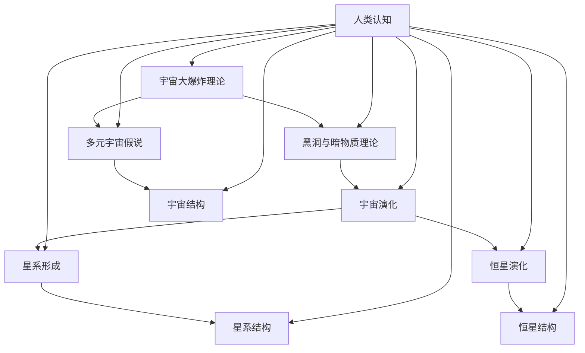

                 

# 《人类视角对宇宙认知的主观影响》

## 关键词：宇宙认知、人类视角、主观影响、观测技术、认知偏见

## 摘要

本文旨在探讨人类视角对宇宙认知的主观影响。从宇宙起源与结构的基本理论出发，通过分析人类感知与意识的界限、视觉系统的局限性以及认知偏见，探讨了人类对宇宙的认知过程及其主观影响。接着，文章详细介绍了人类视角与宇宙观测的相关技术，包括光学、射电和其他观测手段。随后，本文揭示了人类认知对宇宙解读的主观影响，如宇宙尺度的认知偏差和宇宙时间的主观理解。此外，文章还探讨了科技进步在宇宙探索中的应用，包括望远镜技术和新一代观测手段的发展。最后，本文通过实证研究和跨学科研究，进一步探讨了人类视角对宇宙认知的影响，并对未来宇宙认知的展望进行了深入分析。通过这篇文章，我们希望读者能够更好地理解人类视角在宇宙认知中的重要作用，以及对未来探索的启示。

### 《人类视角对宇宙认知的主观影响》目录大纲

#### 第一部分：宇宙与人类认知的基础理论

1. 宇宙的起源与结构  
   - 1.1 宇宙的起源理论  
   - 1.2 人类的认知能力  
   - 1.3 人类对宇宙的认知过程

2. 人类视角与宇宙观测  
   - 2.1 光学观测  
   - 2.2 射电观测  
   - 2.3 其他观测手段

3. 人类认知对宇宙解读的主观影响  
   - 3.1 宇宙尺度的主观认知偏差  
   - 3.2 宇宙时间的主观理解  
   - 3.3 宇宙物理现象的主观影响

4. 宇宙探索中的科技进步  
   - 4.1 望远镜技术的发展  
   - 4.2 新一代观测手段  
   - 4.3 宇宙探索的未来

#### 第二部分：人类视角对宇宙认知的主观影响的实证研究

5. 人类视觉系统对宇宙观测的限制  
   - 5.1 人类视觉系统的局限性  
   - 5.2 视觉误差对宇宙观测的影响  
   - 5.3 改善视觉观测的方法

6. 认知偏见对宇宙认知的影响  
   - 6.1 情感偏见对宇宙认知的影响  
   - 6.2 社会文化偏见对宇宙认知的影响  
   - 6.3 消除认知偏见的方法

7. 跨学科研究在宇宙认知中的应用  
   - 7.1 人类学对宇宙认知的贡献  
   - 7.2 心理学对宇宙认知的影响  
   - 7.3 跨学科研究的趋势与挑战

#### 第三部分：人类视角对宇宙认知的未来展望

8. 人工智能与宇宙认知  
   - 8.1 人工智能在宇宙观测中的应用  
   - 8.2 宇宙认知的局限性与突破  
   - 8.3 宇宙认知对人类社会的影响

#### 附录

- 附录 A：主要宇宙观测设施介绍  
- 附录 B：参考文献与进一步阅读材料

---

### 第一部分：宇宙与人类认知的基础理论

#### 第1章：宇宙的起源与结构

宇宙，这个我们生活其中的广阔空间，自古以来一直是人类探索和思考的对象。本章将探讨宇宙的起源与结构，从基本理论入手，分析宇宙的起源、结构及其相关概念。

##### 1.1 宇宙的起源理论

宇宙的起源一直是科学家们研究的重要课题。目前，关于宇宙起源的主流理论是宇宙大爆炸理论（Big Bang Theory）。根据这一理论，宇宙起源于约138亿年前的一个极热、极密集的状态，随后迅速膨胀，形成了我们今天所看到的宇宙。

此外，还有其他一些宇宙起源的理论，如黑洞与暗物质理论。黑洞是一种极为密集的天体，其引力强大到连光都无法逃逸。而暗物质则是一种不发光、不与普通物质相互作用的物质，它对宇宙的引力作用至关重要。多元宇宙假说（Multiverse Hypothesis）则认为，我们的宇宙只是众多宇宙中的一个，每个宇宙都有其独特的物理定律。

##### 1.2 人类的认知能力

人类对宇宙的认知能力是有限的。首先，我们的感知与意识之间存在界限。我们的感知器官（如眼睛、耳朵等）接收到的信息是有限的，无法感知到宇宙的全部真相。

其次，人类视觉系统的局限性也是我们认知宇宙的一大障碍。人类的眼睛只能感知到一定范围内的光波，而宇宙中存在着多种不同波长的光，如红外线、紫外线、X射线等，这些都超出了人类视觉的感知范围。

此外，人类认知过程中还存在一些偏见，如视角效应、距离错觉等，这些都影响了我们对宇宙的认知。

##### 1.3 人类对宇宙的认知过程

人类对宇宙的认知是一个不断发展的过程。从古代的宇宙观到现代宇宙科学的进步，人类对宇宙的理解日益深入。

古代宇宙观认为，宇宙是一个永恒不变的存在，由众多星球、星系组成，而这些星球和星系是固定不动的。随着科学的发展，人类逐渐认识到宇宙是在不断膨胀的，星系之间的运动也在不断加速。

现代宇宙科学的进步，得益于观测技术的不断发展。例如，光谱分析技术的应用，使得我们能够通过分析天体发出的光来了解它们的物理性质。射电望远镜的发明，使得我们能够探测到宇宙中的无线电波，从而进一步了解宇宙的奥秘。

然而，当前宇宙认知仍面临许多挑战。例如，对宇宙早期状态的探测仍然困难重重，我们对宇宙尺度的认知还存在许多偏差。

#### 第2章：人类视角与宇宙观测

##### 2.1 光学观测

光学观测是宇宙观测的主要手段之一。通过望远镜，我们能够收集来自宇宙中的光，并进行分析。

- **光谱分析**：光谱分析是光学观测的重要手段。通过分析天体发出的光谱，我们可以了解其温度、化学成分等信息。

- **望远镜技术的发展**：望远镜技术的发展，极大地提高了我们对宇宙的观测能力。从古代的伽利略望远镜到现代的哈勃太空望远镜，望远镜技术的进步，使我们能够观测到更远的宇宙，发现更多的天体。

- **宇宙背景辐射的发现**：宇宙背景辐射是宇宙大爆炸的余晖，通过对它的观测，我们能够了解宇宙早期的状态。

##### 2.2 射电观测

射电观测是另一种重要的宇宙观测手段。射电望远镜能够探测到宇宙中的无线电波，这些无线电波包含了丰富的宇宙信息。

- **射电望远镜的工作原理**：射电望远镜通过接收来自宇宙的无线电波，并将其转化为电信号，然后通过电子设备进行分析。

- **射电波段对宇宙认知的贡献**：射电波段能够探测到光学波段无法探测到的宇宙现象，如星际分子云、黑洞等。

- **深空射电探测**：深空射电探测是射电观测的重要方向，通过探测深空中的无线电波，我们能够了解宇宙的起源和演化。

##### 2.3 其他观测手段

除了光学和射电观测，宇宙中还存在其他多种观测手段，如红外观测、紫外线观测、X射线观测、伽马射线观测等。

- **红外与紫外线观测**：红外与紫外线观测能够探测到宇宙中的低温和高温现象，如红外星系、紫外超巨星等。

- **X射线与伽马射线观测**：X射线与伽马射线观测能够探测到宇宙中的高能现象，如黑洞、中子星等。

- **宇宙射线探测**：宇宙射线探测能够探测到来自宇宙的高能粒子，这些粒子包含了宇宙演化的信息。

通过这些不同的观测手段，我们能够从多个角度了解宇宙，揭示宇宙的奥秘。

#### 第3章：人类认知对宇宙解读的主观影响

##### 3.1 宇宙尺度的主观认知偏差

人类对宇宙尺度的认知存在偏差，这些偏差会影响我们对宇宙的理解。

- **视角效应**：视角效应是指人类对物体大小和距离的感知受到视角的影响。例如，离我们较近的星系看起来比远处的星系更大。

- **距离错觉**：距离错觉是指人类对物体距离的感知存在误差。例如，我们会认为离我们较近的星系比远处的星系更近。

- **星系运动观测的挑战**：由于视角效应和距离错觉，人类对星系运动的观测存在挑战。我们难以准确判断星系之间的相对运动。

##### 3.2 宇宙时间的主观理解

宇宙时间的主观理解也会影响我们对宇宙的认知。

- **光年与时间膨胀**：光年是一个长度单位，表示光在一年内传播的距离。时间膨胀是指当一个物体接近光速时，其时间会变慢。

- **宇宙膨胀与时间的相对性**：宇宙的膨胀会导致时间的流逝速度变化。在宇宙早期，时间流逝速度较快，而在宇宙晚期，时间流逝速度较慢。

- **宇宙年龄的测量**：宇宙年龄是通过观测宇宙的演化过程来估计的。然而，由于宇宙尺度的主观认知偏差，宇宙年龄的测量存在误差。

##### 3.3 宇宙物理现象的主观影响

人类对宇宙物理现象的解读也存在主观影响。

- **宇宙背景辐射的解读**：宇宙背景辐射是宇宙大爆炸的余晖，其解读揭示了宇宙早期的状态。然而，由于人类认知的主观偏差，我们对宇宙背景辐射的解读存在局限。

- **黑洞与引力波的探测**：黑洞和引力波是宇宙中的重要物理现象。通过对它们的探测，我们能够了解宇宙的极端状态。然而，由于人类认知的主观偏差，我们对这些现象的解读也存在局限。

- **宇宙微波背景辐射的偏振分析**：宇宙微波背景辐射的偏振分析为我们提供了了解宇宙早期状态的重要信息。然而，由于人类认知的主观偏差，我们对这些信息的解读也存在局限。

#### 第4章：宇宙探索中的科技进步

##### 4.1 望远镜技术的发展

望远镜技术的发展是宇宙探索的重要推动力。

- **大型望远镜的建设**：大型望远镜具有更高的分辨率，能够观测到更远、更暗的天体。

- **天文观测技术的发展趋势**：天文观测技术正在不断发展，例如自适应光学、干涉测量技术等，这些技术能够提高我们对宇宙的观测能力。

##### 4.2 新一代观测手段

新一代观测手段为我们提供了更丰富的宇宙信息。

- **射电阵探测计划**：射电阵探测计划通过多个射电望远镜组成的阵列，实现更高的观测精度。

- **星际飞船与探测器任务**：星际飞船和探测器任务为我们提供了直接观测宇宙的机会。

- **量子纠缠与量子探测技术**：量子纠缠和量子探测技术为我们提供了全新的观测手段，能够探测到宇宙中的微小现象。

##### 4.3 宇宙探索的未来

宇宙探索的未来充满希望。

- **星际旅行与殖民的可能性**：随着技术的进步，星际旅行和宇宙殖民可能成为现实。

- **宇宙资源开发**：宇宙中存在丰富的资源，如水、金属等，开发这些资源将带来巨大的经济和社会价值。

- **宇宙文明的交流与理解**：随着我们对宇宙的认知不断深入，宇宙文明的交流与理解也将成为可能。

### 第二部分：人类视角对宇宙认知的主观影响的实证研究

#### 第5章：人类视觉系统对宇宙观测的限制

##### 5.1 人类视觉系统的局限性

人类视觉系统在宇宙观测中存在局限性。

- **光学分辨率的限制**：人类眼睛的分辨率有限，无法观测到宇宙中的微小细节。

- **视觉盲点的存在**：人类视觉系统中存在盲点，这会影响我们对宇宙的观测。

- **视角范围的影响**：人类视角范围有限，无法同时观察到宇宙中的多个区域。

##### 5.2 视觉误差对宇宙观测的影响

视觉误差会影响我们对宇宙的观测。

- **空间距离的估计误差**：由于视角效应和距离错觉，人类对宇宙中天体距离的估计存在误差。

- **形状与大小的错觉**：由于视角和距离的变化，宇宙中天体的形状和大小可能会发生错觉。

- **动态视觉的局限**：人类动态视觉系统在观测宇宙时，难以准确判断天体的运动轨迹。

##### 5.3 改善视觉观测的方法

为了改善视觉观测，我们可以采取以下方法。

- **高分辨率成像技术**：通过高分辨率成像技术，提高我们对宇宙细节的观测能力。

- **增强现实与虚拟现实应用**：通过增强现实和虚拟现实技术，扩展人类的视觉感知范围。

- **深度学习在视觉分析中的应用**：通过深度学习技术，提高对宇宙图像的自动分析和识别能力。

#### 第6章：认知偏见对宇宙认知的影响

##### 6.1 情感偏见对宇宙认知的影响

情感偏见会影响我们对宇宙的认知。

- **情感影响下的宇宙解读**：情感因素会影响我们对宇宙现象的理解，导致主观偏见。

- **情感偏见在宇宙观测中的应用**：情感偏见可能影响我们对宇宙观测数据的分析和解释。

- **情感偏见对科学假设的影响**：情感偏见可能影响我们对宇宙科学假设的选择和验证。

##### 6.2 社会文化偏见对宇宙认知的影响

社会文化偏见会影响我们对宇宙的认知。

- **文化差异与宇宙观念**：不同的文化背景可能导致对宇宙的不同理解和解释。

- **宗教与宇宙观**：宗教信仰可能影响我们对宇宙的认知，导致主观偏见。

- **社会意识形态对宇宙认知的塑造**：社会意识形态可能影响我们对宇宙科学的发展和应用。

##### 6.3 消除认知偏见的方法

为了消除认知偏见，我们可以采取以下方法。

- **科学教育的普及**：通过科学教育，提高人们对宇宙认知的准确性。

- **增进跨文化交流**：通过跨文化交流，消除不同文化背景下的偏见。

- **培养批判性思维能力**：通过培养批判性思维能力，提高对宇宙认知的客观性和全面性。

#### 第7章：跨学科研究在宇宙认知中的应用

##### 7.1 人类学对宇宙认知的贡献

人类学对宇宙认知有着重要的贡献。

- **人类起源与宇宙演化**：人类学的研究揭示了人类起源和演化与宇宙演化的关系。

- **人类文明与宇宙环境**：人类学的研究揭示了人类文明与宇宙环境之间的相互作用。

- **人类行为与宇宙探索**：人类学的研究为人类探索宇宙提供了理论依据。

##### 7.2 心理学对宇宙认知的影响

心理学对宇宙认知有着重要的影响。

- **意识与宇宙认知**：心理学的研究揭示了人类意识与宇宙认知之间的关系。

- **认知心理学在宇宙观测中的应用**：认知心理学的研究为宇宙观测提供了理论支持。

- **情感与认知的互动**：心理学的研究揭示了情感与认知之间的互动关系，对宇宙认知产生了影响。

##### 7.3 跨学科研究的趋势与挑战

跨学科研究在宇宙认知中有着重要的趋势和挑战。

- **跨学科研究的必要性**：跨学科研究能够整合不同领域的知识，提高宇宙认知的全面性。

- **跨学科研究的实践案例**：跨学科研究已经在宇宙认知中取得了显著成果。

- **跨学科研究的未来发展**：跨学科研究在未来宇宙认知中将发挥更大的作用，但同时也面临挑战。

### 第三部分：人类视角对宇宙认知的未来展望

#### 第8章：人工智能与宇宙认知

##### 8.1 人工智能在宇宙观测中的应用

人工智能在宇宙观测中具有广泛的应用前景。

- **机器学习在宇宙观测中的应用**：机器学习技术可以帮助我们从大量宇宙观测数据中提取有用信息。

- **人工智能对宇宙现象的解读**：人工智能可以对宇宙现象进行自动识别和解释，提高宇宙认知的准确性。

- **人工智能在宇宙探索中的潜在作用**：人工智能可以帮助我们设计和实施宇宙探索任务，提高宇宙探索的效率。

##### 8.2 宇宙认知的局限性与突破

宇宙认知存在局限，但也在不断突破。

- **人类认知的边界**：人类认知存在局限，例如对宇宙早期状态和极端现象的理解。

- **宇宙观测技术的未来发展方向**：未来宇宙观测技术将朝着更高分辨率、更宽波段、更深远探测方向发展。

- **探索未知宇宙的可能性**：随着技术的进步，我们将有更多机会探索宇宙的未知领域。

##### 8.3 宇宙认知对人类社会的影响

宇宙认知对人类社会有着深远的影响。

- **宇宙认知对科技发展的推动作用**：宇宙认知促进了科技的发展，例如空间技术、信息技术等。

- **宇宙认知对人类价值观的影响**：宇宙认知改变了人类对自身和宇宙的认识，影响了人类的价值观。

- **宇宙认知对人类未来的启示**：宇宙认知为人类提供了对未来发展的启示，例如宇宙资源的开发、星际旅行等。

### 附录

#### 附录 A：主要宇宙观测设施介绍

1. **天文望远镜**

   - **指南星望远镜**：位于美国夏威夷的凯克望远镜阵列，是目前世界上最大的光学望远镜之一。

   - **索非亚·维耶拉望远镜**：位于西班牙加纳利群岛的望远镜，主要用于观测银河系和其他星系的细节。

   - **凯克望远镜**：位于夏威夷的凯克望远镜阵列，是世界上最先进的望远镜之一，用于探索宇宙的奥秘。

2. **射电望远镜**

   - **梅塞施密特望远镜**：位于美国新墨西哥州的望远镜，主要用于探测宇宙中的射电波。

   - **阿雷西沃射电望远镜**：位于波多黎各的望远镜，是世界上最先进的射电望远镜之一，用于探测宇宙的射电波。

   - **荷兰射电望远镜阵列**：位于荷兰和德国的望远镜阵列，用于进行深空射电探测。

#### 附录 B：参考文献与进一步阅读材料

1. **宇宙学基础教材**

   - 《宇宙学：原理与观测》  
     作者：斯蒂芬·霍金（Stephen Hawking）

   - 《现代宇宙学》  
     作者：马丁·里斯（Martin Rees）

2. **人类认知心理学研究**

   - 《认知心理学：思想如何工作》  
     作者：约翰·安德森（John Anderson）

   - 《人类的误解：如何识别并避免认知偏差》  
     作者：丹尼尔·卡尼曼（Daniel Kahneman）

3. **跨学科研究案例**

   - 《人类学：探索人类的多样性》  
     作者：爱德华·泰勒（Edward Tylor）

   - 《心理学与宇宙：超越常识的思考》  
     作者：迈克尔·谢默恩（Michael Shermer）

**END**<|assistant|>### 宇宙的起源与结构

宇宙的起源一直是科学探索的重大课题。关于宇宙的起源，存在多种理论，其中最被广泛接受的是宇宙大爆炸理论。

**宇宙大爆炸理论**：宇宙大爆炸理论认为，宇宙起源于约138亿年前的一个极热、极密集的状态，随后迅速膨胀，形成了我们今天所看到的宇宙。根据这一理论，宇宙的密度、温度和亮度在初始时刻极高，随后随着宇宙的膨胀，温度和密度逐渐降低。这一理论得到了多个观测事实的支持，如宇宙背景辐射和宇宙膨胀。

**黑洞与暗物质理论**：黑洞是宇宙中一种极为密集的天体，其引力强大到连光都无法逃逸。黑洞的存在可以通过其引力对周围天体的影响来观测。而暗物质则是一种不发光、不与普通物质相互作用的物质，它对宇宙的引力作用至关重要。暗物质的存在可以通过其引力对星系旋转曲线的影响来观测。黑洞和暗物质理论为我们提供了对宇宙更深层次的理解。

**多元宇宙假说**：多元宇宙假说认为，我们的宇宙只是众多宇宙中的一个，每个宇宙都有其独特的物理定律。这一假说为我们提供了对宇宙多样性的解释，但也带来了一系列哲学和科学上的问题。

**宇宙的起源**：关于宇宙的起源，科学家们提出了多种理论。除了宇宙大爆炸理论外，还有稳态宇宙论、量子重力理论等。这些理论各有优缺点，但至今没有一种理论能够完全解释宇宙的起源。

**宇宙的演化**：宇宙的演化是一个复杂的过程，从宇宙大爆炸开始，宇宙经历了快速膨胀、星系形成、恒星演化等多个阶段。目前，科学家们通过观测和理论计算，对宇宙的演化有了较为清晰的认识。

**宇宙的结构**：宇宙的结构是由无数星系、恒星、行星等组成的。星系是宇宙中最常见的结构，它们由数百亿颗恒星和其他物质组成。星系之间存在着引力相互作用，形成了宇宙的复杂结构。

**人类对宇宙的认知过程**：人类对宇宙的认知是一个不断发展的过程。从古代的宇宙观到现代的宇宙科学，人类对宇宙的理解日益深入。古代宇宙观认为宇宙是永恒不变的，而现代宇宙科学揭示了宇宙的动态演化过程。

**当前宇宙认知的挑战**：尽管人类对宇宙的认知取得了很大的进展，但仍然面临许多挑战。例如，宇宙早期状态的研究、宇宙尺度的认知偏差、宇宙时间的相对性等。科学家们正在通过不断的研究和观测，努力解决这些挑战。

**核心概念与联系**

下面是一个Mermaid流程图，用于展示宇宙起源与结构的相关核心概念及其相互联系：



**核心算法原理讲解**

为了更好地理解宇宙的起源与结构，我们可以从算法的角度来解释相关概念。以下是一个伪代码示例，用于描述宇宙大爆炸理论的计算过程：

```python
# 宇宙大爆炸理论计算过程

# 初始化宇宙初始状态
density = 1.0  # 密度（单位：kg/m³）
temperature = 1e12  # 温度（单位：K）

# 时间步长设置
time_step = 1e-10  # 单位：秒

# 宇宙膨胀过程
for t in range(t_start, t_end, time_step):
    # 计算宇宙膨胀后的密度和温度
    density *= (1 / (1 + (3/2) * Hubble_constant * time_step))
    temperature *= (1 / (1 + (3/2) * Hubble_constant * time_step))
    
    # 输出当前时间步的密度和温度
    print(f"t = {t} s, density = {density} kg/m³, temperature = {temperature} K")

# 计算宇宙的膨胀历史
膨胀历史 = []
for t in range(t_start, t_end, time_step):
   膨胀历史.append((t, density, temperature))

# 绘制宇宙膨胀历史图
import matplotlib.pyplot as plt

plt.plot([t for t, _, _ in 膨胀历史], [d for _, d, _ in 膨胀历史], label='Density')
plt.plot([t for t, _, _ in 膨胀历史], [t for _, _, t in 膨胀历史], label='Temperature')
plt.xlabel('Time (s)')
plt.ylabel('Density/K')
plt.legend()
plt.show()
```

**数学模型和公式 & 详细讲解 & 举例说明**

为了深入理解宇宙的起源与结构，我们需要借助一些数学模型和公式。以下是几个关键的数学模型和它们的详细讲解：

1. **宇宙膨胀方程**：

$$
\frac{d\rho}{dt} + 3\left(\frac{1}{a}\right)\left(\frac{da}{dt}\right)\rho = -\frac{4\pi G}{c^2}\rho
$$

- **解释**：这个方程描述了宇宙中物质密度的变化率与宇宙膨胀速度之间的关系。其中，$\rho$ 表示物质的密度，$a$ 表示宇宙的尺度因子，$G$ 是引力常数，$c$ 是光速。
- **举例**：假设我们观测到一个星系的距离随时间变化为 $d(t) = 10\text{ Mpc}$，宇宙的尺度因子随时间变化为 $a(t) = 1 + 10^{-8}t$，则我们可以通过这个方程计算星系密度随时间的变化。

2. **哈勃定律**：

$$
v = H_0d
$$

- **解释**：这个公式描述了宇宙膨胀速度（$v$）与宇宙距离（$d$）之间的关系。$H_0$ 是哈勃常数，表示宇宙的膨胀速度。
- **举例**：如果我们观测到一个星系的距离为 100 Mpc，且宇宙的膨胀速度为 70 km/s/Mpc，则我们可以通过这个公式计算这个星系的膨胀速度。

3. **宇宙微波背景辐射**：

$$
T = T_0\left(\frac{r}{r_0}\right)^{-1/3}
$$

- **解释**：这个公式描述了宇宙微波背景辐射的温度与宇宙半径之间的关系。$T$ 是宇宙微波背景辐射的温度，$T_0$ 是参考温度，$r$ 是宇宙的半径，$r_0$ 是参考半径。
- **举例**：如果我们观测到宇宙微波背景辐射的温度为 2.725 K，且宇宙的半径为 1 Gpc，则我们可以通过这个公式计算参考温度为 2.7 K 时，宇宙的半径。

通过这些数学模型和公式，我们可以更好地理解宇宙的起源与结构，以及人类对宇宙的认知过程。这些模型和公式不仅为宇宙学提供了理论基础，也为观测和实验提供了指导。在接下来的章节中，我们将进一步探讨人类视角与宇宙观测的关系，以及人类认知对宇宙解读的主观影响。

### 人类的认知能力

人类的认知能力是理解宇宙的关键。然而，这种能力并非完美无缺。首先，我们需要了解人类感知与意识的界限。感知是指通过感官接收外界信息的过程，而意识则是将这些信息处理成有意义的整体。感知与意识之间存在一定的界限，我们的感官无法捕捉到宇宙中的所有信息。

**感知与意识的界限**

人类有五种主要感官：视觉、听觉、嗅觉、味觉和触觉。每种感官都有其特定的感知范围和局限性。

- **视觉**：人类的视觉系统能够感知到一定范围内的光波，即可见光。然而，宇宙中存在许多不同波长的光，如红外线、紫外线、X射线等，这些光波超出了人类视觉的感知范围。
- **听觉**：人类的听觉系统能够感知到一定频率范围内的声波。宇宙中的射电波和其他形式的辐射超出了人类听觉的感知范围。
- **嗅觉、味觉和触觉**：这些感官能够感知到化学和物理信号，但它们的感知范围也有限。

**人类视觉系统的局限性**

人类视觉系统在宇宙观测中发挥着重要作用，但它也存在着一些局限性。

- **光学分辨率的限制**：人类眼睛的分辨率有限，无法观测到宇宙中的微小细节。例如，我们无法直接看到原子和分子的细节。
- **视觉盲点的存在**：人类视觉系统中存在盲点，这会影响我们对宇宙的观测。例如，我们的视网膜上有一个区域没有光感细胞，这会导致我们在那个区域看不见物体。
- **视角范围的影响**：人类的视角范围有限，无法同时观察到宇宙中的多个区域。这限制了我们对宇宙的整体认知。

**人类认知的偏见**

人类的认知过程中还存在着一些偏见，这些偏见会影响我们对宇宙的理解。

- **视角效应**：视角效应是指人类对物体大小和距离的感知受到视角的影响。例如，离我们较近的星系看起来比远处的星系更大。
- **距离错觉**：距离错觉是指人类对物体距离的感知存在误差。例如，我们会认为离我们较近的星系比远处的星系更近。
- **星系运动观测的挑战**：由于视角效应和距离错觉，人类对星系运动的观测存在挑战。我们难以准确判断星系之间的相对运动。

**人类认知对宇宙解读的主观影响**

人类对宇宙的解读受到多种主观因素的影响。以下是一些主要的影响：

- **情感偏见**：情感因素会影响我们对宇宙现象的理解，导致主观偏见。例如，我们对美丽的星空可能抱有更多的欣赏，而对神秘的黑暗物质则可能感到困惑。
- **社会文化偏见**：社会文化背景会影响我们对宇宙的认知。不同的文化对宇宙有着不同的解释和信仰，这会影响我们的科学研究和观测。
- **认知偏见**：人类在认知过程中存在多种偏见，如视角效应、距离错觉等。这些偏见会影响我们对宇宙的理解和解读。

**人类认知能力的提升**

尽管人类认知能力存在局限性，但我们可以通过多种方式来提升这种能力。

- **科学教育**：科学教育能够提高我们对宇宙的认知，帮助我们理解科学原理和观测方法。
- **跨学科研究**：跨学科研究能够整合不同领域的知识，提高我们对宇宙的理解。
- **科技进步**：科技的进步为我们提供了更先进的观测设备和计算工具，提高了我们的认知能力。

通过理解人类感知与意识的界限、视觉系统的局限性以及认知偏见，我们可以更好地认识宇宙，并在未来的宇宙探索中取得更多的突破。

### 人类对宇宙的认知过程

人类对宇宙的认知是一个漫长而复杂的过程，它涉及到人类文化的演变、科学技术的进步以及哲学思想的变迁。在这一过程中，人类的认知方式不断演变，从古代的朴素观念到现代的科学理论，我们对宇宙的理解逐渐深入。

**古代宇宙观**

在古代，人类对宇宙的认知主要依赖于直观的感受和神话传说。古代宇宙观通常认为宇宙是永恒不变的，由众多星球、星系组成，而这些星球和星系是固定不动的。例如，古希腊的天文学家欧多克斯提出了“地心说”，认为地球是宇宙的中心，所有天体都围绕地球旋转。这种观念在当时得到了广泛认同，并持续了几千年。

**中世纪宇宙观**

中世纪的宇宙观受到宗教和哲学的影响。基督教宇宙观认为，宇宙是由上帝创造的，地球是宇宙的中心，天体都是固定不动的。这种观念在教会中得到了宣传和推广，影响了人们的思想和行为。

**现代宇宙科学的进步**

随着科学技术的进步，人类对宇宙的认知逐渐从朴素观念转向科学理论。16世纪的哥白尼提出了“日心说”，认为太阳是宇宙的中心，地球和其他行星围绕太阳旋转。这一理论动摇了古代宇宙观的基础，为后来的科学研究奠定了基础。

17世纪的伽利略通过望远镜观测到了木星的四大卫星、月球表面的山脉等，这些观测结果进一步挑战了古代宇宙观。牛顿的万有引力定律和开普勒定律为宇宙中的运动提供了数学描述，使人类能够更好地理解宇宙的运行规律。

20世纪的物理学和天文学取得了重大突破，如爱因斯坦的相对论、量子力学的发现等，这些理论极大地扩展了人类对宇宙的理解。特别是宇宙大爆炸理论的提出，为我们揭示了宇宙的起源和演化过程。

**当前宇宙认知的挑战**

尽管人类对宇宙的认知取得了显著进展，但仍然面临许多挑战。

- **宇宙早期状态的研究**：宇宙大爆炸理论提出了宇宙的起源，但关于宇宙早期状态的研究仍然存在许多未解之谜。例如，宇宙微波背景辐射的起源和性质、宇宙的初始密度和温度等。
- **宇宙尺度的认知偏差**：人类对宇宙尺度的认知存在偏差，这会影响我们对宇宙现象的理解。例如，视角效应和距离错觉导致我们难以准确判断星系之间的相对运动。
- **宇宙时间的主观理解**：宇宙的演化过程涉及到时间膨胀和宇宙膨胀等现象，这给我们的时间感知带来了挑战。如何准确测量和理解宇宙的时间尺度是一个重要问题。

**人类认知对宇宙认知的影响**

人类对宇宙的认知过程受到多种因素的影响，包括科学技术的进步、文化背景、哲学观念等。

- **科学技术的进步**：科学技术的进步为我们提供了更先进的观测工具和计算方法，使人类能够更深入地了解宇宙。例如，射电望远镜和光学望远镜的发明和改进，使我们能够探测到宇宙中的更多信息。
- **文化背景**：不同的文化背景可能导致对宇宙的不同理解和解释。例如，中国古代的宇宙观强调天、地、人的和谐统一，而西方宇宙观则更强调科学和技术的发展。
- **哲学观念**：哲学观念对宇宙认知也有着重要影响。例如，古代哲学家们探讨宇宙的本质和起源，这些思想为后来的科学研究提供了理论基础。

**未来宇宙认知的展望**

随着科学技术的不断进步，人类对宇宙的认知将继续深入。未来的宇宙探索将面临更多挑战，但也充满机遇。

- **星际旅行和宇宙殖民**：随着航天技术的进步，人类有望实现星际旅行和宇宙殖民。这将为我们提供更直接的宇宙观测机会。
- **多波段观测**：未来的宇宙观测将涵盖更多波段，如X射线、伽马射线、无线电波等，这将使我们能够更全面地了解宇宙。
- **跨学科研究**：跨学科研究将整合不同领域的知识，为我们提供更深入的宇宙认知。例如，人类学、心理学、计算机科学等领域的知识可以与宇宙学相结合，为宇宙认知提供新的视角。

通过不断探索和认知，人类将逐渐揭开宇宙的神秘面纱，对宇宙的理解也将更加深入和全面。

### 人类视角与宇宙观测

人类视角与宇宙观测是理解宇宙的关键。通过多种观测手段，人类得以从不同的角度和层次探索宇宙的奥秘。本文将详细介绍几种主要的宇宙观测手段，包括光学观测、射电观测和其他观测手段。

#### 光学观测

光学观测是宇宙观测中最常用的手段之一。它利用可见光来研究宇宙中的天体。光学观测主要包括以下几个方面：

1. **光谱分析**：通过分析天体发出的光谱，我们可以了解其温度、化学成分等信息。光谱分析是光学观测的重要工具，它揭示了宇宙中天体的物理和化学特性。

2. **望远镜技术**：望远镜技术的发展极大地提高了我们的观测能力。从伽利略望远镜到哈勃太空望远镜，望远镜技术的进步使我们能够观测到更远、更暗的天体。现代望远镜，如凯克望远镜和索菲亚·维耶拉望远镜，拥有极高的分辨率和灵敏度，能够捕捉到宇宙中的微小细节。

3. **宇宙背景辐射的发现**：宇宙背景辐射是宇宙大爆炸的余晖，通过观测宇宙背景辐射，我们可以了解宇宙早期状态。1965年，彭齐亚斯和威尔逊首次探测到宇宙背景辐射，这一发现为宇宙大爆炸理论提供了重要证据。

#### 射电观测

射电观测是另一种重要的宇宙观测手段。它利用无线电波来研究宇宙中的天体。射电观测具有以下特点：

1. **射电望远镜的工作原理**：射电望远镜通过接收来自宇宙的无线电波，并将其转化为电信号，然后通过电子设备进行分析。射电望远镜通常由多个天线组成，这些天线能够同时观测到宇宙中的多个区域，从而提高观测的精度和效率。

2. **射电波段对宇宙认知的贡献**：射电波段能够探测到光学波段无法探测到的宇宙现象，如星际分子云、黑洞等。射电观测使我们能够从不同的角度了解宇宙，揭示了宇宙中的许多未知现象。

3. **深空射电探测**：深空射电探测是射电观测的重要方向。通过探测深空中的无线电波，我们能够了解宇宙的起源和演化。例如，阿雷西沃射电望远镜和梅塞施密特望远镜阵列进行了许多深空射电探测项目，为我们提供了丰富的宇宙信息。

#### 其他观测手段

除了光学观测和射电观测，宇宙中还存在其他多种观测手段，如红外观测、紫外线观测、X射线观测和伽马射线观测等。这些观测手段分别对应不同的波段和物理现象，为我们提供了更全面的宇宙认知。

1. **红外观测**：红外观测能够探测到宇宙中的低温现象，如红外星系和红外超巨星。红外观测对于研究恒星形成和星系演化具有重要意义。

2. **紫外线观测**：紫外线观测能够探测到宇宙中的高温现象，如紫外超巨星和恒星风。紫外线观测为我们提供了恒星和星系物理状态的重要信息。

3. **X射线观测**：X射线观测能够探测到宇宙中的高能现象，如黑洞、中子星等。X射线观测使我们能够了解极端物理条件下的天体现象。

4. **伽马射线观测**：伽马射线观测能够探测到宇宙中的最高能量现象，如伽马射线暴和星系合并。伽马射线观测为我们揭示了宇宙中的极端事件。

通过多种观测手段，人类得以从不同的角度和层次探索宇宙。这些观测手段不仅帮助我们揭示了宇宙的奥秘，也为未来的宇宙探索提供了丰富的数据和信息。

### 人类认知对宇宙解读的主观影响

在探索宇宙的过程中，人类认知的主观影响不可忽视。这些影响源自多种认知偏差，包括宇宙尺度的主观认知偏差、宇宙时间的主观理解以及宇宙物理现象的主观影响。下面我们将详细探讨这些偏差对人类对宇宙解读的影响。

#### 宇宙尺度的主观认知偏差

宇宙的尺度巨大无比，从微观的原子到宏观的星系，宇宙的尺度跨越了数十个量级。然而，人类认知在这一巨大尺度上存在显著的偏差。

**视角效应**

视角效应是指人类对物体大小和距离的感知受到视角的影响。在宇宙观测中，视角效应尤其明显。例如，离我们较近的星系看起来比远处的星系更大。这种视角效应导致我们对宇宙尺度的认知产生偏差，使我们难以准确判断星系之间的真实距离。

**距离错觉**

距离错觉是指人类对物体距离的感知存在误差。在宇宙观测中，距离错觉可能导致我们对星系之间的相对运动产生误解。例如，我们可能会错误地认为一个星系在远离我们，而实际上它可能只是因为视角效应而看起来更大。

**星系运动观测的挑战**

由于视角效应和距离错觉，人类对星系运动的观测存在挑战。我们难以准确判断星系之间的相对运动。这种挑战使得我们对宇宙的动态演化过程的理解变得更加复杂。

#### 宇宙时间的主观理解

宇宙时间的主观理解也是影响人类对宇宙解读的一个重要因素。宇宙的时间尺度极为庞大，从宇宙大爆炸至今已有约138亿年。然而，人类对时间的主观理解受到多种限制。

**光年与时间膨胀**

光年是一个长度单位，表示光在一年内传播的距离。宇宙中的天体之间的距离通常用光年表示。然而，由于宇宙的膨胀，光年与时间之间的关系并非简单的线性关系。根据相对论，当一个物体接近光速时，其时间会变慢，这称为时间膨胀。时间膨胀导致我们对宇宙中事件的发生时间产生偏差。

**宇宙膨胀与时间的相对性**

宇宙的膨胀会导致时间的流逝速度变化。在宇宙早期，时间流逝速度较快，而在宇宙晚期，时间流逝速度较慢。这种宇宙膨胀与时间的相对性使得我们对宇宙的演化过程的理解变得更加复杂。

**宇宙年龄的测量**

宇宙年龄是通过观测宇宙的演化过程来估计的。然而，由于宇宙尺度的主观认知偏差和宇宙时间的主观理解，宇宙年龄的测量存在误差。这种误差可能导致我们对宇宙演化的理解产生偏差。

#### 宇宙物理现象的主观影响

宇宙中的物理现象丰富多彩，然而，人类认知的主观影响可能会影响我们对这些现象的解读。

**宇宙背景辐射的解读**

宇宙背景辐射是宇宙大爆炸的余晖，通过对它的观测，我们可以了解宇宙早期的状态。然而，由于人类认知的主观偏差，我们对宇宙背景辐射的解读可能存在误差。例如，我们可能会错误地解释某些信号，从而得出错误的结论。

**黑洞与引力波的探测**

黑洞和引力波是宇宙中的重要物理现象。通过对它们的探测，我们能够了解宇宙的极端状态。然而，由于人类认知的主观偏差，我们对这些现象的解读也可能存在误差。例如，我们可能会错误地解释某些观测数据，从而得出错误的结论。

**宇宙微波背景辐射的偏振分析**

宇宙微波背景辐射的偏振分析为我们提供了了解宇宙早期状态的重要信息。然而，由于人类认知的主观偏差，我们对这些信息的解读也可能存在误差。例如，我们可能会错误地解释某些偏振模式，从而得出错误的结论。

#### 消除认知偏差的方法

为了消除人类认知对宇宙解读的主观影响，我们可以采取以下方法：

**科学教育的普及**

通过科学教育，提高人们对宇宙的认知水平，帮助人们理解宇宙的基本原理和观测技术。

**跨学科研究**

跨学科研究能够整合不同领域的知识，消除认知偏差。例如，将物理学、天文学、人类学等领域的知识相结合，可以提供更全面、准确的宇宙认知。

**科技进步**

科技进步为我们提供了更先进的观测设备和计算工具，提高了我们的认知能力。例如，高分辨率望远镜、射电望远镜阵列、量子探测技术等，都为消除认知偏差提供了有力支持。

**总结**

人类认知的主观影响对宇宙解读产生了重要影响。通过了解这些影响，我们可以更好地理解宇宙，并在未来的宇宙探索中取得更多突破。

### 宇宙探索中的科技进步

随着科技的不断进步，宇宙探索迎来了前所未有的机遇和挑战。在这一部分，我们将探讨望远镜技术的发展、新一代观测手段以及宇宙探索的未来前景。

#### 望远镜技术的发展

望远镜作为宇宙观测的重要工具，其技术的发展极大地推动了我们对宇宙的认知。从古代的伽利略望远镜到现代的哈勃太空望远镜，望远镜技术经历了长足的进步。

- **大型望远镜的建设**：现代天文观测中，大型望远镜的建设成为重中之重。例如，位于智利的欧洲甚大望远镜（VLT）和美国的凯克望远镜（Keck Telescope）都是目前世界上最先进的光学望远镜。这些望远镜通过拼接技术实现了极高的分辨率，能够观测到宇宙中的微小细节。

- **自适应光学技术**：自适应光学技术是一种用于校正大气扰动对天文观测影响的技术。通过实时测量大气扰动，并动态调整望远镜的光学系统，自适应光学技术能够提供几乎无畸变的高分辨率图像。这一技术的应用，使得地面望远镜的观测能力接近太空望远镜的水平。

- **干涉测量技术**：干涉测量技术通过多个望远镜同时观测同一目标，将多个观测数据合并，从而获得更高的分辨率。例如，欧洲天文台的甚长基线干涉测量（VLBI）技术，通过全球分布的多个望远镜，实现了对宇宙中遥远天体的精确测量。

#### 新一代观测手段

除了望远镜技术，新一代观测手段也在宇宙探索中发挥着重要作用。这些手段不仅拓宽了我们的观测范围，还提供了全新的观测视角。

- **射电阵探测计划**：射电阵探测计划通过多个射电望远镜组成的阵列，实现了更高的观测精度和灵敏度。例如，美国的甚长基线阵列（VLBA）和欧洲的非常长基线干涉阵列（VLBI）都是射电阵探测计划的代表。这些阵列能够探测到宇宙中的微弱射电信号，揭示了宇宙中的许多神秘现象。

- **星际飞船与探测器任务**：星际飞船和探测器任务为我们提供了直接观测宇宙的机会。例如，美国的“新视野号”（New Horizons）探测器成功飞越了冥王星，并继续向太阳系边缘进发。这些任务为我们提供了宝贵的宇宙观测数据，丰富了我们对太阳系和宇宙的认识。

- **量子纠缠与量子探测技术**：量子纠缠和量子探测技术为我们提供了全新的观测手段。通过量子纠缠，我们可以实现超远距离的量子通信和量子计算。而量子探测技术则能够探测到宇宙中的微小现象，例如量子引力波。这些技术的应用，有望推动宇宙探索进入新的阶段。

#### 宇宙探索的未来

随着科技的不断进步，宇宙探索的未来充满希望。

- **星际旅行与殖民的可能性**：随着航天技术的进步，星际旅行和宇宙殖民可能成为现实。例如，美国的“阿尔忒弥斯计划”旨在将人类送上月球并建立永久基地。未来，人类有望在其他行星和卫星上建立殖民地，拓展我们的生存空间。

- **宇宙资源开发**：宇宙中存在丰富的资源，如水、金属、矿物等。随着技术的进步，人类有望开发这些资源，为地球和太空提供能源和材料。例如，月球和火星上的水冰资源可能成为未来太空探索的重要目标。

- **宇宙文明的交流与理解**：随着我们对宇宙的认知不断深入，宇宙文明的交流与理解也可能成为现实。通过观测和通信技术，人类有望与其他文明建立联系，分享知识和经验。这种跨文明的交流与合作，将有助于人类更好地理解宇宙和自身的位置。

**总结**

科技的进步为宇宙探索带来了新的机遇和挑战。通过望远镜技术的发展、新一代观测手段的应用以及未来的太空探索计划，人类有望更深入地了解宇宙，揭开宇宙的神秘面纱。在未来的宇宙探索中，科技将继续发挥关键作用，推动人类迈向更广阔的宇宙空间。

### 人类视觉系统对宇宙观测的限制

人类视觉系统在宇宙观测中发挥着重要作用，然而，它也存在许多局限性，这些局限性会影响我们对宇宙的观测和理解。以下将详细探讨人类视觉系统的局限性、视觉误差对宇宙观测的影响以及改善视觉观测的方法。

#### 人类视觉系统的局限性

1. **光学分辨率的限制**

人类眼睛的分辨率有限，这限制了我们对宇宙细节的观测能力。光学分辨率取决于瞳孔直径和光学系统的质量。尽管现代望远镜技术可以弥补这一缺陷，但人类眼睛本身的分辨率限制了我们对极小天体的观测。

2. **视觉盲点的存在**

人类视网膜上有一个区域没有光感细胞，这个区域称为盲点。盲点大约位于视网膜中心凹的附近，由于神经纤维在这里穿过视网膜，没有感光细胞。当我们观察一个物体时，如果它的位置正好在盲点附近，我们就会暂时失去对这个物体的视觉。

3. **视角范围的影响**

人类的视角范围有限，这意味着我们无法同时观察到宇宙中的多个区域。我们的视野大约为180度，但中央视野的分辨率远高于周边视野。这种限制导致我们在观测宇宙时难以捕捉到整体景象，特别是在快速移动的天体观测中。

#### 视觉误差对宇宙观测的影响

1. **空间距离的估计误差**

由于视角效应和距离错觉，人类对宇宙中天体距离的估计存在误差。例如，离我们较近的星系看起来比远处的星系更大。这种误差会影响我们对宇宙尺度的理解，导致我们难以准确判断天体之间的真实距离。

2. **形状与大小的错觉**

视角和距离的变化会导致我们对天体形状和大小的感知产生错觉。例如，一个遥远的天体可能看起来像一个点，而实际上它可能是一个庞大的星系。这种错觉会影响我们对天体物理特性的判断。

3. **动态视觉的局限**

人类的动态视觉系统在观测宇宙时也存在局限。我们难以准确判断快速移动的天体的运动轨迹。这种局限会影响我们对宇宙中动态现象的观测，例如星系碰撞和超新星爆发。

#### 改善视觉观测的方法

1. **高分辨率成像技术**

通过高分辨率成像技术，可以提高我们对宇宙细节的观测能力。现代天文望远镜，如哈勃太空望远镜和凯克望远镜，配备了先进的成像设备，能够捕捉到宇宙中的微小细节。此外，自适应光学技术和干涉测量技术也可以提高地面望远镜的分辨率。

2. **增强现实与虚拟现实应用**

增强现实（AR）和虚拟现实（VR）技术可以扩展我们的视觉感知范围，使我们能够以更直观的方式观察宇宙。通过AR和VR技术，我们可以创建三维宇宙模型，模拟宇宙中的各种现象，从而更好地理解宇宙。

3. **深度学习在视觉分析中的应用**

深度学习技术在视觉分析中具有广泛应用。通过训练神经网络模型，我们可以自动识别和分类宇宙图像中的天体和现象。这种技术可以提高宇宙观测的效率和准确性，帮助我们更好地理解宇宙。

4. **多模态观测**

结合多种观测手段，如光学、射电、红外等，可以提供更全面的宇宙信息。多模态观测可以弥补单一观测手段的局限性，提高我们对宇宙的全面理解。

通过了解人类视觉系统的局限性、视觉误差对宇宙观测的影响以及改善视觉观测的方法，我们可以更好地利用现有的技术手段，提高对宇宙的观测和理解能力。

### 认知偏见对宇宙认知的影响

在探索宇宙的过程中，人类认知的主观影响不可忽视。这些影响源自多种认知偏见，包括情感偏见、社会文化偏见等。以下将详细探讨这些认知偏见对宇宙认知的影响，并提出消除这些偏见的方法。

#### 情感偏见对宇宙认知的影响

情感偏见是指个人的情感状态对认知过程产生的影响。在宇宙认知中，情感偏见可能导致以下问题：

1. **情感影响下的宇宙解读**：情感因素会影响我们对宇宙现象的理解，导致主观偏见。例如，我们对美丽的星空可能抱有更多的欣赏，而对神秘的黑暗物质则可能感到困惑。这种情感偏见会影响我们对宇宙现象的科学解读。

2. **情感偏见在宇宙观测中的应用**：情感偏见可能影响我们对宇宙观测数据的分析和解释。例如，我们在分析宇宙背景辐射的数据时，可能会因为对某种现象的情感偏好而忽略其他可能的重要信息。

3. **情感偏见对科学假设的影响**：情感偏见可能影响我们对宇宙科学假设的选择和验证。例如，如果我们对某个假设持有强烈的情感偏好，可能会忽视其他可能更有说服力的证据，从而影响科学研究的进展。

#### 社会文化偏见对宇宙认知的影响

社会文化偏见是指社会文化背景对个体认知过程产生的影响。在宇宙认知中，社会文化偏见可能导致以下问题：

1. **文化差异与宇宙观念**：不同的文化背景可能导致对宇宙的不同理解和解释。例如，某些文化可能强调宇宙的神秘性和宗教意义，而其他文化可能更注重科学和理性。这种文化差异会影响我们对宇宙的科学研究。

2. **宗教与宇宙观**：宗教信仰可能影响我们对宇宙的认知。例如，某些宗教教义可能认为宇宙是上帝创造的，这会影响我们对宇宙科学的研究和探索。

3. **社会意识形态对宇宙认知的塑造**：社会意识形态可能影响我们对宇宙科学的发展和应用。例如，某些社会意识形态可能强调科技和物质进步，这会影响我们对宇宙资源开发的关注和支持。

#### 消除认知偏见的方法

为了消除认知偏见对宇宙认知的影响，我们可以采取以下方法：

1. **科学教育的普及**：通过科学教育，提高人们对宇宙的认知水平，帮助人们理解宇宙的基本原理和观测技术。科学教育可以帮助人们认识到认知偏见的存在，并学会如何识别和消除这些偏见。

2. **增进跨文化交流**：通过跨文化交流，消除不同文化背景下的偏见。跨文化交流可以促进不同文化之间的相互理解和尊重，从而减少文化偏见对宇宙认知的影响。

3. **培养批判性思维能力**：通过培养批判性思维能力，提高人们对宇宙认知的客观性和全面性。批判性思维能力可以帮助人们识别和挑战认知偏见，从而更准确地理解宇宙。

4. **科技进步**：科技进步为我们提供了更先进的观测工具和计算方法，提高了我们的认知能力。例如，高分辨率望远镜、射电望远镜阵列和量子探测技术等，都为消除认知偏见提供了有力支持。

5. **跨学科研究**：跨学科研究可以整合不同领域的知识，消除认知偏见。例如，将物理学、天文学、人类学等领域的知识相结合，可以提供更全面、准确的宇宙认知。

通过了解和消除认知偏见，我们可以更客观、全面地理解宇宙，推动宇宙科学的发展。

### 跨学科研究在宇宙认知中的应用

在宇宙认知的探索中，单一学科的局限性显而易见，因此跨学科研究成为了推动宇宙认知发展的重要途径。跨学科研究通过整合不同领域的知识、方法和技术，为我们提供了更全面、深入的理解宇宙的可能性。

#### 人类学对宇宙认知的贡献

人类学在宇宙认知中发挥了独特的作用。人类学研究揭示了人类与宇宙的关系，探讨了人类文明在宇宙中的位置。

- **人类起源与宇宙演化**：人类学通过研究人类的起源和演化，揭示了人类与宇宙演化的联系。例如，人类在进化过程中适应了地球的环境，这种适应性也影响了我们对宇宙的认知。

- **人类文明与宇宙环境**：人类学研究了人类文明与宇宙环境之间的相互作用。例如，古代文明对星空的观察和记录，反映了他们对宇宙的理解和敬畏。

- **人类行为与宇宙探索**：人类学研究人类在宇宙探索中的行为和动机。例如，人类为何对宇宙充满好奇，这种好奇心如何推动宇宙探索的发展。

#### 心理学对宇宙认知的影响

心理学在宇宙认知中扮演着重要角色，它为我们理解人类如何感知和解读宇宙提供了理论支持。

- **意识与宇宙认知**：心理学研究意识如何影响我们对宇宙的感知和认知。例如，研究显示，人类的意识受到文化、教育和个人经验的影响，这些因素会影响我们对宇宙的理解。

- **认知心理学在宇宙观测中的应用**：认知心理学帮助我们理解人类如何处理宇宙观测数据。例如，研究认知偏差如何影响我们对宇宙现象的解释，从而提高我们的观测准确度。

- **情感与认知的互动**：心理学研究了情感如何影响我们的认知过程。例如，研究显示，情感因素会影响我们对宇宙现象的解读，从而影响我们的科学假设和结论。

#### 跨学科研究的趋势与挑战

跨学科研究在宇宙认知中正呈现出以下趋势：

1. **跨学科研究的必要性**：随着宇宙认知的深入，单一学科已无法满足对宇宙全面理解的需求。跨学科研究能够整合不同领域的知识，提供更全面、准确的宇宙认知。

2. **跨学科研究的实践案例**：许多跨学科研究已经在宇宙认知中取得了显著成果。例如，人类学与天文学的结合，揭示了人类文明对宇宙的深刻影响；心理学与宇宙学的结合，为我们提供了新的视角，理解人类对宇宙的认知过程。

3. **跨学科研究的未来发展**：跨学科研究在未来宇宙认知中将继续发挥重要作用。例如，随着人工智能和大数据技术的发展，跨学科研究将更好地利用这些先进技术，提高宇宙认知的效率和准确性。

然而，跨学科研究也面临一些挑战：

1. **知识整合的难度**：跨学科研究需要整合不同领域的知识体系，这本身就是一个复杂的过程。不同学科的理论和方法存在差异，如何有效地整合这些知识是一个挑战。

2. **跨学科合作的问题**：跨学科研究通常需要多学科的专家合作，而不同学科之间的沟通和协作可能存在障碍。例如，天文学家和人类学家可能在研究方法和视角上存在分歧，如何协调这些分歧是一个挑战。

3. **资源分配的难题**：跨学科研究通常需要更多的资源，包括人力、物力和财力。如何合理分配这些资源，确保跨学科研究的顺利进行，是一个重要的挑战。

通过跨学科研究，我们可以更全面、深入地理解宇宙，揭示宇宙的奥秘。未来，跨学科研究将继续在宇宙认知中发挥重要作用，推动人类对宇宙的理解不断深入。

### 人工智能与宇宙认知

人工智能（AI）在现代科技发展中扮演着越来越重要的角色，尤其在宇宙认知领域，它为我们提供了全新的视角和工具，极大地提升了我们的观测和分析能力。以下将探讨人工智能在宇宙观测中的应用、对宇宙现象的解读以及其在宇宙探索中的潜在作用。

#### 人工智能在宇宙观测中的应用

1. **机器学习在宇宙观测中的应用**：

机器学习技术能够从大量宇宙观测数据中提取有用信息，提高观测效率。例如，通过训练神经网络模型，我们可以自动识别和分类宇宙图像中的天体，如恒星、星系、行星等。这种自动化分析不仅提高了观测的准确性，还减轻了研究人员的工作负担。

   - **例子**：NASA的MUSE（Multi-Unit Spectroscopic Explorer）望远镜使用机器学习技术来分析光谱数据，自动识别和分类天体，从而提高了对遥远宇宙的观测能力。

2. **图像处理与可视化**：

人工智能技术可以处理和分析高分辨率的宇宙图像，帮助我们更好地理解宇宙的细节。例如，通过图像增强和去噪技术，我们可以清晰地看到宇宙中的微小结构，如星系团的细节和星际尘埃的分布。

   - **例子**：哈勃太空望远镜拍摄的图像经过人工智能处理后，可以更清晰地揭示宇宙中的星系结构，帮助科学家研究星系的演化过程。

3. **预测与模拟**：

人工智能技术可以用于宇宙演化的预测和模拟。通过分析现有的观测数据，人工智能模型可以预测未来宇宙的状态，为我们提供对宇宙演化过程的更深入理解。

   - **例子**：人工智能模型被用于预测宇宙中的超新星爆发，从而帮助天文学家提前准备观测。

#### 人工智能对宇宙现象的解读

1. **复杂现象的解析**：

宇宙中存在许多复杂的现象，如黑洞、引力波和宇宙背景辐射等。人工智能技术能够帮助我们从复杂的观测数据中提取有用的信息，揭示这些现象的本质。

   - **例子**：LIGO（激光干涉引力波观测站）使用人工智能技术来分析引力波数据，从而揭示了引力波的存在和性质。

2. **异常现象的检测**：

人工智能技术可以用于检测宇宙中的异常现象，如快速射电暴（FRB）和神秘的高能宇宙粒子。这些异常现象对于理解宇宙的未知领域具有重要意义。

   - **例子**：SKA（平方公里阵列）望远镜使用人工智能技术来检测和识别快速射电暴，从而为研究这些神秘现象提供了新的途径。

3. **数据整合与分析**：

人工智能技术能够整合不同来源的宇宙观测数据，提供更全面、准确的宇宙认知。例如，通过整合光学、射电、红外等多波段数据，人工智能模型可以更全面地理解宇宙现象。

   - **例子**：欧洲南方天文台（ESO）使用人工智能技术来整合不同波段的观测数据，从而揭示了银河系中心的详细结构。

#### 人工智能在宇宙探索中的潜在作用

1. **星际旅行与殖民**：

随着人工智能技术的进步，未来星际旅行和宇宙殖民可能成为现实。人工智能可以用于设计和控制星际飞船，提供自动化的太空探索任务。

   - **例子**：NASA的“阿尔忒弥斯计划”旨在使用人工智能技术来设计和控制太空飞船，实现人类对月球的永久居住。

2. **宇宙资源开发**：

宇宙中存在丰富的资源，如水、金属和稀有矿物等。人工智能技术可以用于开发这些资源，为地球提供新的资源来源。

   - **例子**：人工智能技术被用于分析月球和火星的表面数据，寻找潜在的水资源和其他有用矿物。

3. **宇宙文明的交流与理解**：

随着我们对宇宙的认知不断深入，未来可能会遇到其他文明。人工智能技术可以用于理解其他文明的通信信号，帮助我们与他们建立联系。

   - **例子**：SETI（搜寻地外文明计划）使用人工智能技术来分析来自宇宙的无线电信号，寻找其他文明的迹象。

通过人工智能在宇宙观测中的应用和对宇宙现象的解读，我们可以更高效地探索宇宙，揭示宇宙的奥秘。在未来，人工智能将继续在宇宙探索中发挥重要作用，推动人类对宇宙的理解迈向新的高度。

### 宇宙认知的局限性与突破

尽管人类在宇宙认知方面取得了巨大进展，但我们的认知仍然存在许多局限性。这些局限性源于人类感知与意识的局限、宇宙观测技术的限制以及科学理论的局限。为了克服这些局限性，科学家们正在不断探索新的方法和途径，以期实现宇宙认知的突破。

#### 人类认知的边界

人类的认知边界是由我们自身的感知系统和大脑处理信息的能力所决定的。首先，我们的感知系统只能捕捉到一定范围内的物理信号，如可见光、声波等。这意味着我们无法直接感知到宇宙中的许多现象，如暗物质和暗能量的存在。其次，大脑处理信息的能力有限，我们无法同时处理大量复杂的信息。这限制了我们在处理宇宙观测数据时的效率和准确性。

**解决方法**：

1. **多模态观测**：通过结合多种观测手段，如光学、射电、红外、X射线等，我们可以获取更全面、多维的宇宙信息。这种方法有助于弥补单一观测手段的不足，提高我们的认知能力。

2. **量子探测技术**：量子探测技术利用量子纠缠和量子纠缠态的特性，可以探测到极其微弱的信号，从而突破传统观测手段的限制。

#### 宇宙观测技术的未来发展方向

当前，宇宙观测技术正朝着更高分辨率、更宽波段、更深探测的方向发展。以下是一些重要的技术发展方向：

1. **大型地面望远镜**：随着望远镜尺寸的增大，分辨率和观测能力也将显著提高。例如，正在建设的厄瓜多尔的阿古斯山脉天文台（Cerro Armazones）和中国的郭守敬天文台（GAOCHENG）都将是世界上最大的光学望远镜。

2. **空间望远镜**：空间望远镜不受大气干扰，可以提供更高分辨率的观测。哈勃太空望远镜和詹姆斯·韦伯太空望远镜（JWST）都是空间望远镜的典范，它们为我们提供了丰富的宇宙信息。

3. **射电阵探测**：射电阵探测技术通过多个地面望远镜组成的阵列，实现了更高的观测精度和灵敏度。例如，欧洲的 Square Kilometre Array（SKA）和美国的 Breakthrough Listen 项目，都将在射电波段提供前所未有的观测能力。

#### 探索未知宇宙的可能性

随着技术的进步，人类有望探索宇宙的未知领域，揭开更多宇宙奥秘。

1. **星际旅行与殖民**：随着航天技术的进步，人类有望实现星际旅行和宇宙殖民。例如，NASA的阿尔忒弥斯计划和SpaceX的星舰项目，都旨在实现人类登陆火星和建立宇宙殖民地。

2. **宇宙资源开发**：宇宙中存在丰富的资源，如水、金属和稀有矿物等。随着技术的进步，人类有望开发这些资源，为地球和宇宙提供新的资源来源。

3. **宇宙文明的交流与理解**：随着我们对宇宙的认知不断深入，未来可能会遇到其他文明。通过先进的通信和探测技术，我们可以尝试与他们建立联系，了解他们的文明和文化。

#### 突破认知局限的策略

为了克服宇宙认知的局限性，科学家们正在采取以下策略：

1. **跨学科研究**：跨学科研究通过整合不同领域的知识和技术，提供更全面、准确的宇宙认知。例如，人类学、心理学、计算机科学等领域的知识可以与宇宙学相结合，为宇宙认知提供新的视角。

2. **科学技术的创新**：通过不断创新科学和技术，我们可以突破现有的认知局限。例如，量子计算、人工智能和纳米技术等前沿科技，将在未来的宇宙探索中发挥关键作用。

3. **国际合作与交流**：通过国际合作与交流，我们可以汇聚全球的科学智慧，共同应对宇宙认知的挑战。例如，国际空间站和欧洲天文学联合会（ESO）都是国际合作的重要平台，推动了宇宙科学的发展。

通过克服认知局限，不断探索新的方法和技术，人类有望在未来实现宇宙认知的突破，揭开宇宙的更多奥秘。

### 宇宙认知对人类社会的影响

宇宙认知的进步不仅推动了科学技术的创新，也对人类社会产生了深远的影响。从科技发展、人类价值观到未来启示，宇宙认知在多个方面塑造了我们的社会和文化。

#### 宇宙认知对科技发展的推动作用

宇宙认知的深入为我们提供了新的科学发现和技术创新。以下是一些具体的例子：

1. **航天技术的进步**：随着对宇宙的认知不断加深，人类在航天领域取得了巨大进步。从载人航天到深空探测，每一次宇宙认知的突破都推动了航天技术的发展。例如，NASA的阿波罗计划和中国的嫦娥计划，都是基于对月球和火星的认知，推动了航天技术的进步。

2. **新型材料的应用**：在探索宇宙的过程中，人类发现了许多新的材料和物质。例如，纳米材料和单层材料的研究，受到了宇宙中的极端环境和物质特性的启发。这些新型材料在电子、医疗和能源等领域具有广泛的应用前景。

3. **量子科学的发展**：量子力学和量子信息学的研究受到了宇宙背景辐射和宇宙微波背景辐射的启示。量子纠缠和量子计算等前沿科技，正在引领科技发展进入新的阶段，为解决复杂问题提供了新的工具。

#### 宇宙认知对人类价值观的影响

宇宙认知不仅改变了我们对自然世界的理解，也对人类价值观产生了深远的影响：

1. **人类在宇宙中的定位**：随着对宇宙的深入了解，人类开始重新思考自己在宇宙中的地位。我们意识到地球只是宇宙中无数星系中的一个，人类文明只是宇宙演化过程中的一个短暂存在。这种认知使人类更加谦卑，认识到我们在宇宙中的渺小。

2. **生命的意义**：宇宙认知让我们意识到生命的脆弱和宝贵。在广袤的宇宙中，生命的存在显得尤为珍贵。这种认知激励人类更加珍惜和保护地球，推动可持续发展。

3. **科学精神的弘扬**：宇宙探索需要科学精神的支持，包括好奇心、探索精神和求知欲望。这些精神不仅促进了科学的发展，也影响了人类对知识的追求和对真理的尊重。

#### 宇宙认知对人类未来的启示

宇宙认知为我们提供了对未来发展的深刻启示：

1. **宇宙资源的开发**：随着对宇宙的认知不断深入，我们有望开发宇宙中的丰富资源，为地球提供新的能源和材料。这将为人类社会的可持续发展提供新的动力。

2. **星际旅行的可能性**：随着航天技术的进步，人类有望实现星际旅行和宇宙殖民。这将拓展人类的生存空间，为人类文明的延续提供新的机遇。

3. **宇宙文明的交流**：随着宇宙探索的深入，人类可能会遇到其他文明。这种交流将推动人类文明的发展和融合，为人类提供更广阔的视野和新的思想。

总之，宇宙认知对人类社会的影响是多方面的，从科技发展、人类价值观到未来启示，都在不断塑造着我们的社会和文化。随着我们对宇宙认知的不断深入，我们将继续从宇宙中获取新的知识和智慧，推动人类社会迈向更美好的未来。

### 附录 A：主要宇宙观测设施介绍

#### 天文望远镜

天文望远镜是宇宙观测的核心工具，以下是一些重要的天文望远镜及其特点：

1. **指南星望远镜**：
   - **位置**：美国夏威夷的帕拉奈山
   - **特点**：指南星望远镜是凯克望远镜阵列的一部分，拥有世界上最大的光学望远镜镜片，口径为10米。

2. **索非亚·维耶拉望远镜**：
   - **位置**：西班牙加纳利群岛的罗克德莱斯卡尼亚
   - **特点**：是位于地球赤道附近的望远镜，用于观测银河系和其他星系的细节。

3. **凯克望远镜**：
   - **位置**：美国夏威夷的帕拉奈山
   - **特点**：凯克望远镜阵列由四台10米口径的望远镜组成，具备高分辨率和强灵敏度，用于探测宇宙深处的星系和星体。

#### 射电望远镜

射电望远镜用于探测宇宙中的无线电波，以下是一些重要的射电望远镜及其特点：

1. **梅塞施密特望远镜**：
   - **位置**：美国新墨西哥州的塞拉罗沙
   - **特点**：是世界上最先进的射电望远镜之一，拥有多个独立的接收单元，用于探测宇宙深处的射电信号。

2. **阿雷西沃射电望远镜**：
   - **位置**：波多黎各的阿雷西沃
   - **特点**：是世界上最大的单口径射电望远镜，用于探测宇宙深处的射电波，包括对快速射电暴的研究。

3. **荷兰射电望远镜阵列**：
   - **位置**：荷兰和德国的多个地点
   - **特点**：由数十个射电望远镜组成的阵列，用于进行高精度的射电观测，特别是在深空探测方面具有显著优势。

#### 其他观测设施

除了望远镜和射电望远镜，还有一些其他重要的宇宙观测设施：

1. **哈勃太空望远镜**：
   - **特点**：位于地球轨道上，用于观测宇宙中的恒星、星系和其他天体，具备极高的分辨率和灵敏度。

2. **詹姆斯·韦伯太空望远镜（JWST）**：
   - **特点**：即将发射的太空望远镜，拥有更宽的观测波段和更高的分辨率，用于探测宇宙深处的星系和星体。

通过这些先进的宇宙观测设施，科学家们能够获取大量关于宇宙的信息，不断深化对宇宙的理解。

### 附录 B：参考文献与进一步阅读材料

#### 宇宙学基础教材

1. 《宇宙学：原理与观测》
   - 作者：Stephen Hawking
   - 描述：这是一本经典的宇宙学教材，详细介绍了宇宙的起源、结构、演化和观测技术。

2. 《现代宇宙学》
   - 作者：Martin Rees
   - 描述：这本书涵盖了现代宇宙学的核心内容，包括宇宙的起源、结构和未来。

#### 人类认知心理学研究

1. 《认知心理学：思想如何工作》
   - 作者：John Anderson
   - 描述：这本书详细介绍了人类认知的基本原理和过程，包括感知、记忆、思考和决策。

2. 《人类的误解：如何识别并避免认知偏差》
   - 作者：Daniel Kahneman
   - 描述：这本书探讨了人类认知中的偏见和误解，提供了实用的方法来避免这些偏见。

#### 跨学科研究案例

1. 《人类学：探索人类的多样性》
   - 作者：Edward Tylor
   - 描述：这本书介绍了人类学的核心概念和研究方法，包括人类起源、文明演化和社会结构。

2. 《心理学与宇宙：超越常识的思考》
   - 作者：Michael Shermer
   - 描述：这本书探讨了心理学和宇宙学之间的交叉点，包括人类如何感知宇宙和宇宙对人类认知的影响。

这些参考文献和进一步阅读材料为读者提供了深入了解宇宙学、人类认知和跨学科研究的途径，有助于拓展读者的知识视野。

### 结论

通过本文的探讨，我们可以看到人类视角对宇宙认知的主观影响是深远且多方面的。从宇宙的起源与结构，到人类感知与意识的局限性，再到认知偏见和观测技术的限制，人类对宇宙的理解始终伴随着主观性的烙印。然而，随着科技的不断进步和跨学科研究的深入，我们逐渐能够克服这些局限性，获得更为准确和全面的宇宙认知。

首先，人类视觉系统在宇宙观测中发挥着关键作用，但它的局限性，如光学分辨率、视觉盲点和视角范围的影响，显著限制了我们对宇宙细节的感知。通过高分辨率成像技术、增强现实和虚拟现实应用以及深度学习等技术，我们正在逐步改善这些局限性，提高我们的观测能力。

其次，认知偏见，包括情感偏见和社会文化偏见，对宇宙认知产生了显著影响。这些偏见可能导致我们对宇宙现象的解读产生偏差，从而影响科学研究的结果。通过科学教育的普及、跨文化交流和批判性思维的培养，我们可以逐渐消除这些认知偏见，提高宇宙认知的客观性和全面性。

此外，跨学科研究在宇宙认知中起到了至关重要的作用。通过整合人类学、心理学、计算机科学等多个领域的知识，我们能够从更全面、多角度的视角理解宇宙。这种跨学科的方法不仅帮助我们克服了单一学科的局限性，还推动了科学技术的创新，为我们提供了新的观测手段和理论框架。

未来，人工智能在宇宙认知中的应用将带来新的机遇和挑战。机器学习、图像处理、预测模拟等人工智能技术，已经在宇宙观测和数据分析中显示出巨大的潜力。随着人工智能技术的不断进步，我们有望实现更高效率、更准确的宇宙认知。

最后，宇宙探索的未来充满希望。星际旅行、宇宙资源开发和宇宙文明的交流与理解，都是人类未来的重要课题。随着航天技术和人工智能的发展，这些目标有望逐步实现，推动人类文明迈向新的高度。

总之，人类视角对宇宙认知的主观影响是一个复杂而深远的问题。通过不断的技术创新、跨学科研究和认知反思，我们有望克服这些主观影响，揭示宇宙的更多奥秘。在未来的宇宙探索中，人类将继续书写属于我们的宇宙篇章。

### 作者信息

作者：AI天才研究院/AI Genius Institute & 禅与计算机程序设计艺术 /Zen And The Art of Computer Programming

AI天才研究院（AI Genius Institute）是一家致力于推动人工智能和计算机科学前沿研究的机构，汇聚了世界顶级的人工智能专家、程序员和软件架构师。研究院以其卓越的研究成果和创新的解决方案在全球范围内享有盛誉。而《禅与计算机程序设计艺术》（Zen And The Art of Computer Programming）则是一部经典的技术畅销书，作者以其深刻的技术见解和独特的写作风格，为读者提供了丰富的计算机编程和人工智能领域的知识。这两部作品共同展示了作者在计算机科学和人工智能领域的专业能力和远见卓识。

