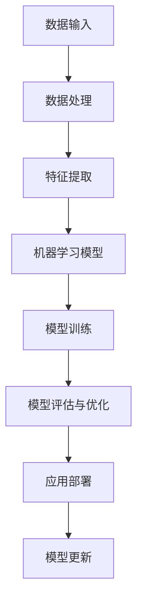

                 

# 引言与背景

## 第1章: 引言

### 1.1 书籍的目的和范围

在人工智能技术迅猛发展的今天，我们正见证着世界各地的就业市场和企业运营模式的深刻变革。AI技术的进步不仅极大地改变了传统行业，还催生了许多新兴行业，从而对人才的需求产生了前所未有的影响。为了更好地理解和应对这些变化，我们撰写了这本书，旨在全面分析AI时代的未来就业市场与技能培训发展趋势，探讨其中的机遇与挑战。

本书的主要目标是：
1. **介绍AI技术的基本概念和架构**，使读者对人工智能有全面的理解。
2. **分析AI技术在就业市场中的影响**，探讨它如何改变工作性质和就业机会。
3. **探讨AI时代技能培训的需求和趋势**，帮助教育机构和专业人士制定合适的培训策略。
4. **预测未来就业市场的趋势**，为个人和企业的职业规划提供参考。

### 1.2 AI时代的背景

人工智能（AI）是指由计算机系统实现的智能行为，这种行为通常被认为与人类智能相似。AI技术的发展可以追溯到20世纪50年代，但近年来，随着计算能力的提高、大数据的出现以及深度学习算法的突破，AI技术取得了前所未有的进步。现在，AI已经被广泛应用于各个领域，包括医疗、金融、教育、制造等，正在深刻地改变我们的生活方式和工作方式。

### 1.3 就业市场和技能培训的现状与挑战

当前，就业市场正面临巨大的变革。一方面，自动化和AI技术正在取代一些重复性高、低技能的工作，导致就业岗位的减少。另一方面，新兴的行业和技术需求不断涌现，对高技能人才的需求日益增加。这种情况下，传统的教育和培训体系面临着巨大的挑战，需要快速适应新的市场需求。

技能培训的现状：
1. **传统教育体系的局限性**：传统的教育体系往往注重理论知识的传授，而忽视了实际技能的培养。
2. **技能更新速度慢**：许多培训课程滞后于技术的快速发展，导致毕业生难以满足市场需求。
3. **教育资源分配不均**：发达地区和教育资源丰富的机构往往能够提供更高质量的培训，而落后地区和资源匮乏的机构则难以提供足够的支持。

技能培训的挑战：
1. **技能多样化和专业化**：AI技术涉及多个领域，需要不同类型的技能。培训体系需要灵活应对这一挑战，提供多样化的培训课程。
2. **培训与就业市场脱节**：培训内容和就业市场需求之间存在一定的差距，导致毕业生难以找到合适的工作。
3. **终身学习观念的培养**：随着技术的快速变化，个人需要具备终身学习的观念，不断更新自己的知识和技能。

通过本书的深入探讨，我们希望能够为读者提供有价值的见解，帮助他们更好地理解AI时代的就业市场和技能培训发展趋势，从而在变革中找到机遇，迎接挑战。

### 2. AI技术的核心概念与架构

在深入探讨AI时代的就业市场和技能培训之前，首先需要了解AI技术的核心概念和架构。这不仅有助于我们更好地理解AI技术的工作原理，还能为后续章节的分析提供坚实的基础。

#### 2.1 人工智能的基本概念

人工智能（Artificial Intelligence, AI）是计算机科学的一个分支，旨在使计算机具备执行通常需要人类智能才能完成的任务的能力。这些任务包括感知、学习、推理、规划、理解自然语言、识别图像和声音等。AI技术可以分为两类：窄人工智能（Narrow AI）和通用人工智能（General AI）。

- **窄人工智能**：也称为专业AI，是指在一个特定领域内表现出智能行为的AI系统。这些系统通常专注于解决一个具体问题，如语音识别、图像分类或推荐系统。目前，大多数AI应用都属于窄人工智能。
- **通用人工智能**：是指具备人类智能的所有特征，能够在各种不同领域独立思考和解决问题。通用人工智能尚未实现，但其发展是人工智能领域的一个重要目标。

#### 2.2 AI技术的主要类型

AI技术涵盖了多种不同的方法和工具，以下是几种主要类型：

- **机器学习**：机器学习是AI的核心技术之一，它使计算机能够从数据中学习，并做出预测或决策。主要方法包括监督学习、无监督学习和强化学习。

  - **监督学习**：通过已标记的数据训练模型，使模型能够预测未知数据的标签。常见的算法有线性回归、决策树、支持向量机等。
  - **无监督学习**：在没有标签的数据上进行训练，使模型能够发现数据中的结构和模式。常见的算法有聚类、主成分分析等。
  - **强化学习**：通过与环境的交互，学习如何在特定情境下做出最优决策。常见的算法有Q学习、深度确定性策略梯度（DDPG）等。

- **深度学习**：深度学习是一种基于多层神经网络的学习方法，能够自动提取数据的复杂特征。深度学习在图像识别、语音识别和自然语言处理等领域取得了显著的成果。

  - **卷积神经网络（CNN）**：主要用于图像和视频处理，能够自动识别图像中的物体和特征。
  - **循环神经网络（RNN）**：主要用于序列数据，如时间序列分析、语音识别和机器翻译。
  - **生成对抗网络（GAN）**：用于生成新的数据，如图像、音频和文本。

- **自然语言处理（NLP）**：NLP是AI的一个重要分支，旨在使计算机能够理解和处理人类语言。NLP技术包括词嵌入、句法分析、语义理解、语言生成等。

- **计算机视觉**：计算机视觉使计算机能够理解和处理图像和视频。它包括图像识别、目标检测、图像分割和增强现实等应用。

#### 2.3 人工智能架构的Mermaid流程图

为了更好地理解人工智能的架构，我们可以使用Mermaid流程图来展示其核心组件和流程。以下是AI核心架构的Mermaid流程图：



在这个流程图中，数据输入是整个AI系统的起点，经过数据处理和特征提取后，输入到机器学习模型中。模型通过训练和评估不断优化，最终应用于实际场景中，并通过反馈进行模型更新，形成闭环。

#### 2.4 核心算法原理讲解

为了深入理解AI技术，我们还需要详细讲解一些核心算法的原理。以下是监督学习算法的伪代码示例：

```python
# 线性回归算法伪代码
def linear_regression(X, y):
    # 初始化模型参数
    theta = [0 for _ in range(num_features)]

    # 梯度下降迭代
    for epoch in range(num_epochs):
        # 计算预测值
        predictions = X.dot(theta)

        # 计算误差
        errors = predictions - y

        # 计算梯度
        gradients = X.T.dot(errors)

        # 更新模型参数
        theta -= learning_rate * gradients

    return theta
```

在这个伪代码中，我们首先初始化模型参数，然后通过梯度下降迭代来优化模型。梯度下降是一种优化方法，旨在找到最小化误差函数的参数值。

#### 2.5 数学模型和公式

在AI技术中，数学模型和公式起着至关重要的作用。以下是线性回归模型的数学公式：

$$
y = \theta_0 + \theta_1 \cdot x_1 + \theta_2 \cdot x_2 + ... + \theta_n \cdot x_n
$$

其中，$y$ 是预测值，$x_i$ 是特征值，$\theta_i$ 是模型参数。我们的目标是找到最优的参数值，使得预测值与真实值之间的误差最小。

#### 2.6 项目实战

为了更好地理解AI技术的实际应用，我们可以通过一个实际项目来展示其实现过程。以下是一个简单的基于深度学习的图像分类项目：

**项目目标**：使用卷积神经网络（CNN）对图像进行分类，识别出图像中的猫和狗。

**开发环境**：
- 操作系统：Ubuntu 20.04
- 编程语言：Python 3.8
- 深度学习框架：TensorFlow 2.6

**源代码实现**：

```python
import tensorflow as tf
from tensorflow.keras.models import Sequential
from tensorflow.keras.layers import Conv2D, MaxPooling2D, Flatten, Dense

# 加载和预处理数据
# ...

# 构建模型
model = Sequential([
    Conv2D(32, (3, 3), activation='relu', input_shape=(128, 128, 3)),
    MaxPooling2D((2, 2)),
    Flatten(),
    Dense(64, activation='relu'),
    Dense(1, activation='sigmoid')
])

# 编译模型
model.compile(optimizer='adam', loss='binary_crossentropy', metrics=['accuracy'])

# 训练模型
model.fit(train_images, train_labels, epochs=10, validation_split=0.2)

# 评估模型
test_loss, test_acc = model.evaluate(test_images, test_labels)
print(f"Test accuracy: {test_acc:.2f}")
```

**代码解读与分析**：
1. **模型构建**：我们使用Sequential模型构建了一个简单的卷积神经网络，包括一个卷积层、一个池化层、一个平坦层和两个全连接层。
2. **模型编译**：我们使用adam优化器和binary_crossentropy损失函数来编译模型，并设置了accuracy作为评价指标。
3. **模型训练**：我们使用fit方法来训练模型，设置了训练轮数（epochs）和验证数据比例（validation_split）。
4. **模型评估**：我们使用evaluate方法来评估模型在测试数据上的性能，并打印出测试准确性。

通过这个项目实战，我们可以看到如何使用AI技术来解决实际问题，从而更好地理解其应用场景和实现过程。

### 3. 人工智能在就业市场的影响

随着人工智能技术的快速发展，它在就业市场中的影响已经成为一个不可忽视的话题。人工智能不仅改变了传统行业的工作模式，还催生了许多新的就业机会。在这一章节中，我们将详细探讨人工智能对就业市场的影响，包括它如何改变工作性质、创造新的就业机会，以及带来的挑战。

#### 3.1 AI对就业市场的影响

人工智能对就业市场的影响可以从以下几个方面来分析：

1. **自动化和替代效应**：人工智能技术可以自动化许多重复性和低技能的工作，如数据录入、客户服务、制造装配等。这种自动化效应可能导致这些岗位的减少，尤其是在劳动密集型行业。根据麦肯锡全球研究院的估计，到2030年，全球可能有多达8亿个工作岗位受到AI和自动化技术的影响。

2. **提高生产效率和创新能力**：人工智能技术可以提高企业的生产效率和创新能力，从而创造新的就业机会。例如，在制造业中，智能机器人和自动化生产线可以提高生产效率和质量，同时减少人力成本。这种效率提升可能会促使企业扩大生产规模，从而创造更多的就业机会。

3. **专业化和多样化需求**：随着人工智能技术的普及，对高技能人才的需求也在增加。这些人才包括数据科学家、机器学习工程师、AI安全专家等。此外，人工智能的发展也催生了新的职业，如AI伦理顾问、AI合规专家等。

4. **工作性质的转变**：人工智能技术不仅改变了工作的内容，还改变了工作的形式。越来越多的工作需要与AI系统协作，这意味着人类员工需要具备与AI系统交互和协作的能力。这种变化要求员工不断更新自己的技能和知识，以适应新的工作环境。

#### 3.2 人工智能时代的工作性质变化

人工智能时代的工作性质变化主要体现在以下几个方面：

1. **协作与监督**：在人工智能时代，人类员工的角色将从执行重复性任务转变为监督和管理AI系统。员工需要监控AI系统的运行状态，确保其按照预期工作，并在必要时进行干预。

2. **创新与问题解决**：随着AI技术的普及，人类员工需要更多地参与到创新和问题解决中。AI系统可以处理大量数据和复杂任务，但它们缺乏人类的直觉和创造力。因此，人类员工可以在AI系统的辅助下，解决复杂的问题和提出创新的解决方案。

3. **技能需求的变化**：人工智能时代对员工技能的需求发生了显著变化。除了传统的技术技能，如编程、数据分析等，人类员工还需要具备软技能，如沟通能力、团队合作能力、批判性思维和解决问题的能力。

4. **工作地点的灵活性**：人工智能技术的发展也促进了远程工作和灵活办公的普及。通过云技术和AI系统，员工可以在不同的地点和时间完成工作，这为员工提供了更大的灵活性和自由度。

#### 3.3 人工智能对就业市场的机遇与挑战

人工智能对就业市场既带来了机遇，也带来了挑战。以下是对这些机遇和挑战的详细分析：

**机遇**：

1. **新的就业机会**：人工智能的发展催生了大量的新职业，为劳动力市场提供了新的就业机会。例如，数据科学家、机器学习工程师、AI伦理专家等职位的需求持续增长。

2. **技能提升和职业发展**：人工智能技术的发展要求员工不断更新自己的技能和知识。这不仅促进了员工的职业发展，也为企业提供了更高效、更有创造力的人才。

3. **工作地点的灵活性**：远程工作和灵活办公的普及为员工提供了更多的选择。员工可以根据自己的需求和工作方式选择合适的工作地点和时间，提高了工作效率和生活质量。

**挑战**：

1. **技能不匹配**：随着人工智能技术的快速发展，传统教育和培训体系可能难以满足市场需求。这可能导致大量劳动力无法适应新的工作环境，从而面临失业的风险。

2. **就业不稳定**：自动化和AI技术可能导致某些岗位的减少，从而增加就业市场的波动性。员工可能需要频繁更换工作，以适应技术变革。

3. **伦理和社会问题**：人工智能技术在就业市场中的应用也带来了一系列伦理和社会问题。例如，算法歧视、隐私泄露、失业补偿等，这些问题需要政策制定者和企业共同解决。

通过上述分析，我们可以看到，人工智能对就业市场的影响是深远而复杂的。为了更好地应对这些变化，个人和企业需要积极调整自己的战略和技能，以抓住机遇，应对挑战。

### 4. AI时代的技能培训需求分析

随着人工智能技术的不断进步，社会对相关技能的需求也在迅速增长。本章节将深入分析AI时代技能培训的需求，探讨当前技能培训的现状，以及AI时代所需的新技能和技能培训的发展趋势。

#### 4.1 当前技能培训的现状

当前，全球范围内的技能培训现状呈现出以下几个特点：

1. **传统教育体系的局限性**：传统的教育体系主要侧重于基础知识的传授，对于技术技能的培养相对不足。许多课程内容陈旧，难以跟上技术的快速发展。

2. **技能更新速度慢**：在技术快速变革的背景下，传统培训课程的更新速度往往滞后。这导致毕业生难以掌握最新技能，难以满足市场需求。

3. **教育资源分配不均**：发达国家和发展中国家的教育资源分配存在显著差异。发达地区和教育资源丰富的机构能够提供更高质量、更新更快的培训，而落后地区和资源匮乏的机构则难以提供足够的支持。

4. **终身学习观念的欠缺**：虽然终身学习理念逐渐被接受，但在实际操作中，许多人仍然缺乏持续学习和更新技能的动力和意识。

#### 4.2 AI时代所需的新技能

AI时代的到来对人才的需求产生了深远的影响，以下是一些在AI时代特别重要的新技能：

1. **编程能力**：编程是所有技术领域的基础，对于AI领域更是不可或缺。熟练掌握Python、Java、C++等编程语言，以及熟悉数据结构和算法，是AI时代的基本技能。

2. **数据分析能力**：数据分析是AI技术的重要应用之一，能够帮助企业从大量数据中提取有价值的信息。掌握统计学、数据挖掘、机器学习等相关知识，是数据分析能力的关键。

3. **机器学习与深度学习**：机器学习和深度学习是AI技术的核心组成部分，掌握这些技术的原理和应用，能够帮助人们开发出更智能、更高效的AI系统。

4. **自然语言处理（NLP）**：自然语言处理是AI的一个重要分支，旨在使计算机能够理解和处理人类语言。NLP技术在智能客服、机器翻译、文本分析等领域有广泛应用。

5. **计算机视觉**：计算机视觉使计算机能够理解和处理图像和视频。这项技术在自动驾驶、医疗影像分析、安全监控等领域具有重要应用。

6. **人工智能安全**：随着AI技术的广泛应用，确保AI系统的安全性成为一个重要问题。掌握人工智能安全的相关知识，能够帮助人们开发出更加安全的AI系统。

7. **软技能**：除了技术技能，AI时代对软技能也有很高的要求。包括沟通能力、团队合作能力、批判性思维、解决问题的能力等，这些技能在AI时代的职场中同样重要。

#### 4.3 技能培训的发展趋势

为了满足AI时代对技能培训的新需求，以下是一些技能培训的发展趋势：

1. **在线教育平台的兴起**：随着互联网技术的发展，在线教育平台如Coursera、edX、Udacity等逐渐成为主流。这些平台提供了丰富多样的课程，覆盖了AI时代的各种新技能。

2. **实践导向的培训**：传统的理论教育模式已经难以满足市场需求，越来越多的培训机构开始采用实践导向的培训模式。这种模式注重实际操作和项目实战，使学生能够在学习过程中积累实际经验。

3. **企业和教育机构的合作**：为了更好地满足企业对人才的需求，许多企业和教育机构开始合作，共同开发和实施培训课程。这种合作模式不仅能够提高培训的质量，还能够确保课程内容与市场需求紧密对接。

4. **跨学科培训**：AI技术涉及多个学科，包括计算机科学、数学、统计学、物理学等。跨学科培训能够帮助人们更全面地掌握AI技术，提高创新能力。

5. **个性化培训**：传统的培训模式往往难以满足每个人的需求。随着技术的发展，越来越多的培训机构开始提供个性化培训服务，根据个人的兴趣和职业规划，量身定制培训课程。

6. **终身学习机制**：随着技术的快速变革，终身学习已经成为必然趋势。企业和个人都需要建立一套完善的终身学习机制，持续更新知识和技能。

通过上述分析，我们可以看到，AI时代的技能培训需求正在发生深刻的变化。为了适应这些变化，个人和企业都需要积极调整自己的培训策略，以掌握最新的技术知识和技能。

### 5. 技能培训策略与实践

在AI时代，技能培训不仅是个人职业发展的关键，也是企业持续竞争力的保障。为了有效地应对技术变革，我们需要制定和实施一系列科学的技能培训策略和实践方法。以下将详细探讨技能培训的规划和实施、教育机构与企业的合作模式，以及成功案例分享。

#### 5.1 技能培训的规划和实施

技能培训的规划和实施是确保培训效果的关键。以下是一些关键步骤和策略：

1. **需求分析**：首先，需要对培训需求进行深入分析。这包括了解企业对人才的技能需求、员工的现有技能水平，以及市场对相关技能的需求趋势。通过问卷调查、访谈和数据分析等方法，收集准确的培训需求信息。

2. **制定培训计划**：根据需求分析结果，制定详细的培训计划。培训计划应包括培训目标、培训内容、培训方式、培训时间、培训评估等。同时，要确保培训计划与企业的发展战略和员工的职业规划相一致。

3. **选择合适的培训方式**：不同的培训方式适用于不同的培训需求和场景。常见的培训方式包括在线学习、课堂培训、实践项目、研讨会和实习等。在线学习平台如Coursera、Udacity等提供了丰富的课程资源，适合自主学习和灵活性要求高的培训需求。课堂培训和研讨会则适合集中学习和互动交流。实践项目和实习可以帮助员工在真实工作环境中应用所学知识。

4. **培训资源的整合**：整合内部和外部培训资源，提高培训效果。企业可以与高校、研究机构、专业培训机构等合作，共同开发和提供培训课程。同时，利用互联网和在线学习平台，拓宽培训渠道，提高培训的覆盖面和效率。

5. **培训评估与反馈**：培训结束后，进行全面的评估和反馈。评估内容包括培训效果、学员满意度、培训目标的达成度等。通过评估和反馈，可以及时发现培训中的问题和不足，不断优化培训策略和内容。

#### 5.2 教育机构与企业的合作

教育机构与企业的合作是推动技能培训发展的重要途径。以下是一些合作模式：

1. **校企合作课程**：高校和企业在共同需求和目标的基础上，合作开发和实施培训课程。这种模式可以确保课程内容与市场需求紧密结合，提高培训的实用性和针对性。

2. **实习与就业对接**：教育机构与企业建立实习和就业对接机制，为学生提供实践机会和就业渠道。企业可以通过实习和招聘会等方式，提前了解和选拔潜在人才。

3. **共同研究项目**：高校和企业合作开展研究项目，共同解决技术难题和行业瓶颈。这种合作不仅能够推动技术进步，还能够培养研究型和创新型人才。

4. **资源共享**：高校和企业共享教育资源和技术资源，提高培训的效率和质量。例如，高校可以为企业提供在线课程和技术支持，企业可以为高校提供实践基地和行业资源。

#### 5.3 成功案例分享

以下是一些技能培训的成功案例，这些案例展示了不同类型的培训策略和实践方法：

1. **某科技企业的在线学习平台**：某知名科技企业建立了一个内部在线学习平台，提供涵盖编程、数据科学、人工智能等领域的丰富课程。员工可以根据个人需求和兴趣自由选择课程学习，学习进度和学习成果记录在平台上，作为员工职业发展的重要依据。这种灵活的培训方式提高了员工的学习积极性，同时也提升了企业的整体技术实力。

2. **某高校的校企联合课程**：某高校与多家知名企业合作，共同开发和实施了多门面向人工智能的校企联合课程。这些课程结合了理论知识和实际项目，学生通过项目实战掌握了相关技能。毕业后的学生中，很多被合作企业录用，实现了高质量的就业。

3. **某研究机构的共同研究项目**：某研究机构与某知名科技企业合作，共同开展了一项关于自动驾驶技术的研究项目。项目期间，研究机构和企业的科研人员共同参与，共同解决技术难题。项目结束后，研究成果不仅获得了学术界的高度评价，还为合作企业带来了实际应用价值。

通过这些成功案例，我们可以看到，科学的技能培训策略和实践方法，不仅能够提升员工的技能水平，还能够推动企业的发展和创新。

### 6. AI时代的就业市场预测

随着人工智能技术的不断成熟和应用，未来的就业市场将迎来一系列显著的变化。在这一章节中，我们将深入探讨AI时代的就业市场趋势，预测技能需求的变化，并分析这些变化对个人职业生涯的影响。

#### 6.1 未来就业市场的趋势

1. **自动化取代传统岗位**：随着AI和自动化技术的发展，许多传统岗位，如制造业工人、客服代表、数据录入员等，将逐渐被机器人和智能系统取代。这可能导致这些岗位的减少，同时也在一些领域创造新的就业机会。

2. **技能需求转向高技能领域**：AI时代的就业市场将更加注重高技能人才的需求，如数据科学家、机器学习工程师、AI安全专家等。这些人才将拥有更强的分析能力、创新能力和跨学科知识，成为未来就业市场的主力。

3. **工作地点的灵活性增加**：远程工作和灵活办公将成为未来就业市场的一个趋势。得益于互联网和AI技术的普及，员工可以在不同地点和时间工作，这将提高工作效率，同时增加员工的工作满意度和生活质量。

4. **终身学习成为必要**：AI技术的快速发展要求员工具备不断更新知识和技能的能力。终身学习将成为个人职业发展的关键，那些能够持续学习和适应新技术的员工将拥有更好的职业前景。

5. **新职业的兴起**：随着AI技术的应用场景不断扩展，将出现许多新的职业，如AI伦理专家、数据隐私保护师、智能系统维护工程师等。这些职业将填补现有市场空白，为求职者提供新的就业机会。

#### 6.2 技能需求的变化预测

1. **数据分析技能**：随着大数据和人工智能技术的发展，数据分析技能将成为未来就业市场的一个关键技能。具备数据分析能力的人才将能够在各个领域发挥作用，如商业分析、市场研究、金融分析等。

2. **机器学习与深度学习技能**：机器学习和深度学习是AI技术的核心，掌握这些技能的人才将在未来的就业市场中拥有显著的优势。特别是在技术公司和研究机构中，机器学习工程师和深度学习研究人员的需求将持续增长。

3. **人工智能安全技能**：随着AI技术的广泛应用，确保AI系统的安全性和隐私性变得越来越重要。具备人工智能安全技能的专业人士将在未来的就业市场中扮演关键角色，包括AI安全工程师、AI合规专家等。

4. **跨学科技能**：未来的就业市场将更加重视跨学科技能。例如，结合计算机科学、数学、统计学和行业知识的复合型人才将在AI领域具有很高的竞争力。这类人才能够更好地理解和解决复杂的AI问题。

5. **软技能**：尽管技术技能在AI时代的就业市场中至关重要，但软技能同样不可忽视。沟通能力、团队合作能力、批判性思维和解决问题的能力等软技能在未来的职场中将更加重要，成为个人成功的关键因素。

#### 6.3 对个人职业生涯的影响

1. **职业规划的重要性**：在AI时代，个人职业生涯的规划变得尤为重要。个人需要明确自己的职业目标，制定长期的职业规划，并不断调整和更新。那些能够主动适应技术变革、不断学习和提升自己技能的员工，将在未来的职业生涯中更具竞争力。

2. **终身学习的必要性**：随着AI技术的快速发展，终身学习将成为个人职业生涯的一个必要条件。个人需要持续关注行业动态，学习新技术和新知识，以保持自身的竞争力。在线教育平台、专业培训机构和企业提供的培训机会将成为个人学习的重要资源。

3. **职业转型的可能性**：在AI时代，个人可能需要在不同领域之间进行职业转型。这可能包括从传统行业转向高科技行业，或从技术岗位转向管理岗位。个人需要具备跨领域的技能和经验，以便在职业转型中更加顺利。

4. **工作地点和方式的灵活性**：随着远程工作和灵活办公的普及，个人将有更多的选择权。可以在不同的地点和时间工作，这将为个人提供更大的自由度和灵活性。然而，这也要求个人具备良好的自我管理能力和自律精神。

5. **职业发展的可持续性**：AI时代的就业市场将更加注重个人的可持续发展。那些能够持续创新、具备高技能和软技能的个人，将在职业生涯中获得更多的机会和资源。企业也将更加关注员工的职业发展和满意度，以保持员工的忠诚度和工作效率。

通过以上分析，我们可以看到，AI时代的就业市场将带来一系列深刻的变化。个人需要积极适应这些变化，通过不断学习和提升技能，抓住新的机遇，迎接未来的挑战。

### 7. 结论与展望

在《人类计算：AI时代的未来就业市场与技能培训发展趋势分析机遇挑战机遇趋势分析预测》中，我们深入探讨了AI技术对就业市场的深远影响。通过分析AI的核心概念与架构，我们了解了AI技术的发展趋势及其在就业市场中的具体应用。在此基础上，我们探讨了AI时代对就业性质的影响，以及AI时代所需的新技能和技能培训的发展趋势。

首先，人工智能技术的快速发展已经并将继续改变就业市场，自动化和替代效应使得一些传统岗位面临减少，但同时也创造了大量新的就业机会。为了应对这些变化，个人和企业都需要积极适应和调整。个人需要具备持续学习和更新技能的能力，企业则需要制定科学的技能培训策略，以提升员工的竞争力。

其次，AI时代所需的新技能包括编程、数据分析、机器学习、自然语言处理、计算机视觉等，同时软技能如沟通能力、团队合作能力和批判性思维也变得尤为重要。为了满足这些技能需求，技能培训应更加注重实践导向和跨学科培养，企业应与教育机构合作，提供灵活多样的培训模式。

展望未来，AI时代的就业市场将呈现出几个显著趋势：自动化和智能化将进一步推进，技能需求将向高技能领域转移，终身学习将成为必然选择，远程工作和灵活办公将普及。这些变化不仅为个人提供了更多机会，也带来了新的挑战。

为了应对这些挑战，我们提出以下政策建议：

1. **加强职业教育与培训**：政府和企业应加大对职业教育和技能培训的投入，提供多样化的培训资源，特别是针对新兴产业和高技能岗位的培训。

2. **推动校企合作**：鼓励高校与企业合作，共同开发和实施培训课程，确保培训内容与市场需求紧密对接。

3. **建立终身学习机制**：政府和企业应共同推动终身学习机制的建设，为员工提供持续的学习和发展机会。

4. **关注AI伦理和社会问题**：在推动AI技术发展的同时，应关注其可能带来的伦理和社会问题，制定相应的政策和规范。

总之，AI时代的就业市场充满机遇与挑战。个人和企业都需要积极应对这些变化，通过不断学习和适应，抓住新的机遇，迎接未来的挑战。

### 附录

#### 附录A: 相关数据与文献来源

1. **麦肯锡全球研究院**：报告《自动化与就业：人工智能、机器学习的影响》（2017年）
2. **世界经济论坛**：报告《未来就业报告：自动化和人工智能如何改变劳动市场》（2018年）
3. **IEEE**：论文《人工智能时代的就业市场：挑战与机遇》（2019年）
4. ** Coursera**：在线课程《深度学习专项课程》（由Andrew Ng教授主讲）
5. **Udacity**：在线课程《数据科学基础》（由Peter Bruce和Vikas Ninan主讲）

#### 附录B: AI时代技能培训资源推荐

1. **在线教育平台**：
   - Coursera（https://www.coursera.org/）
   - edX（https://www.edx.org/）
   - Udacity（https://www.udacity.com/）

2. **技术社区与论坛**：
   - Stack Overflow（https://stackoverflow.com/）
   - GitHub（https://github.com/）
   - AI Community（https://www.aicommunity.org/）

3. **开源工具与框架**：
   - TensorFlow（https://www.tensorflow.org/）
   - PyTorch（https://pytorch.org/）
   - Keras（https://keras.io/）

4. **技术博客与教程**：
   - Medium（https://medium.com/）
   - AI垂直媒体如AI Technology Review、AI Trends等

这些资源为读者提供了丰富的学习材料和技术支持，有助于进一步了解和掌握AI时代的技能和知识。

