                 

# 从员工到自由职业者的转型指南

## 文章关键词
- 自由职业者
- 职业转型
- 技能提升
- 个人品牌
- 时间管理
- 财务管理

## 文章摘要
本文旨在为有志于从员工身份转型为自由职业者的人士提供一份详细的指南。通过深入探讨转型前的准备、自由职业者的生活方式、财务管理、心理健康、网络建设以及成功案例与挑战，本文旨在帮助读者全面了解自由职业的方方面面，并提供实用的策略和建议，以实现顺利转型和长期成功。

## 目录

## 第一部分：转型前的准备

### 第1章：自我评估与职业定位
- **核心概念与联系**
  - Mermaid流程图：自我评估与职业定位的过程
- **核心算法原理讲解**
  - 伪代码：评估兴趣和技能的算法
- **数学模型和公式**
  - 公式：评估自我效能感的公式
- **项目实战**
  - 案例分析：个人职业转型经历

### 第2章：职业发展的路径与策略
- **核心概念与联系**
  - Mermaid流程图：职业发展路径的选择
- **核心算法原理讲解**
  - 伪代码：制定职业发展计划的算法
- **数学模型和公式**
  - 公式：评估职业发展目标的公式
- **项目实战**
  - 案例分析：成功职业转型的策略

### 第3章：技能提升与学习资源
- **核心概念与联系**
  - Mermaid流程图：技能提升的方法
- **核心算法原理讲解**
  - 伪代码：学习资源利用的算法
- **数学模型和公式**
  - 公式：学习效率的计算公式
- **项目实战**
  - 案例分析：通过项目实战提升技能

## 第二部分：自由职业者的生活

### 第4章：自由职业者的工作模式
- **核心概念与联系**
  - Mermaid流程图：自由职业者的工作流程
- **核心算法原理讲解**
  - 伪代码：时间管理的算法
- **数学模型和公式**
  - 公式：工作负荷评估的公式
- **项目实战**
  - 案例分析：高效工作模式实例

### 第5章：财务管理与税务处理
- **核心概念与联系**
  - Mermaid流程图：自由职业者的财务管理流程
- **核心算法原理讲解**
  - 伪代码：税务规划的算法
- **数学模型和公式**
  - 公式：利润和成本的公式
- **项目实战**
  - 案例分析：税务规划实例

### 第6章：心理健康与生活平衡
- **核心概念与联系**
  - Mermaid流程图：平衡工作与生活的策略
- **核心算法原理讲解**
  - 伪代码：心理健康的维护算法
- **数学模型和公式**
  - 公式：压力水平的评估公式
- **项目实战**
  - 案例分析：心理健康维护实例

## 第三部分：自由职业者的网络与市场

### 第7章：建立个人品牌
- **核心概念与联系**
  - Mermaid流程图：个人品牌建设的过程
- **核心算法原理讲解**
  - 伪代码：个人品牌策略的制定
- **数学模型和公式**
  - 公式：品牌影响力评估的公式
- **项目实战**
  - 案例分析：个人品牌建设实例

### 第8章：拓展业务与寻找客户
- **核心概念与联系**
  - Mermaid流程图：业务拓展的策略
- **核心算法原理讲解**
  - 伪代码：寻找客户的算法
- **数学模型和公式**
  - 公式：客户满意度的评估公式
- **项目实战**
  - 案例分析：业务拓展和客户寻找实例

### 第9章：自由职业者网络建设
- **核心概念与联系**
  - Mermaid流程图：自由职业者网络建设的步骤
- **核心算法原理讲解**
  - 伪代码：网络资源利用的算法
- **数学模型和公式**
  - 公式：社交网络影响力的计算公式
- **项目实战**
  - 案例分析：自由职业者网络建设实例

## 第四部分：成功案例与经验分享

### 第10章：成功自由职业者的经验
- **核心概念与联系**
  - Mermaid流程图：成功自由职业者的发展路径
- **核心算法原理讲解**
  - 伪代码：成功策略的总结
- **数学模型和公式**
  - 公式：成功概率的计算公式
- **项目实战**
  - 案例分析：成功自由职业者经验分享

### 第11章：成长中的挑战与应对
- **核心概念与联系**
  - Mermaid流程图：自由职业者面临的挑战
- **核心算法原理讲解**
  - 伪代码：应对挑战的策略
- **数学模型和公式**
  - 公式：挑战解决效率的计算公式
- **项目实战**
  - 案例分析：挑战与应对实例

### 第12章：未来的自由职业者
- **核心概念与联系**
  - Mermaid流程图：未来自由职业者的趋势
- **核心算法原理讲解**
  - 伪代码：抓住趋势的算法
- **数学模型和公式**
  - 公式：行业机遇评估的公式
- **项目实战**
  - 案例分析：未来自由职业者的机遇

## 附录

### 附录 A：常用工具与资源
- **核心概念与联系**
  - Mermaid流程图：常用工具的概述
- **核心算法原理讲解**
  - 伪代码：工具选择的算法
- **数学模型和公式**
  - 公式：工具效率的计算公式
- **项目实战**
  - 案例分析：工具应用实例

---

### 第1章：自我评估与职业定位

在考虑从员工身份转型为自由职业者之前，进行全面的自我评估和职业定位是至关重要的。这不仅有助于了解自己的兴趣、技能和价值观，还能确保转型方向与个人目标相匹配。

### 1.1 自我认知的重要性

自我认知是职业发展的基石。只有深入了解自己的兴趣、优势和弱点，才能做出明智的职业决策。以下是一个简单的自我认知流程：

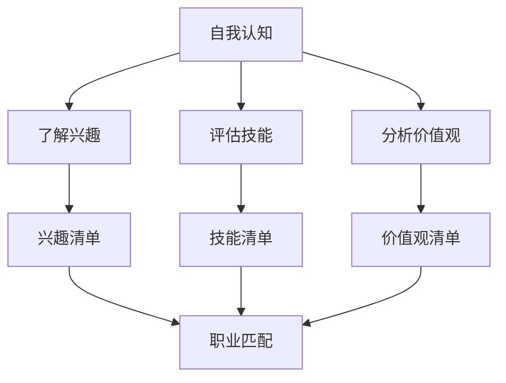

### 1.2 职业定位的步骤与方法

职业定位是一个系统化的过程，包括以下步骤：

1. **明确职业愿景**：想象自己五年后的职业状态，包括所在行业、职位角色和职业成就。
2. **评估市场需求**：研究当前市场的需求趋势，了解哪些职业具有发展潜力。
3. **分析个人优势和劣势**：结合自我认知的结果，评估自己的优势和劣势。
4. **制定职业目标**：设定短期和长期职业目标，并制定实现这些目标的策略。

以下是一个简化的职业定位伪代码：

```python
def career_positioning():
    vision = get_career_vision()
    market_demand = analyze_market_demand()
    strengths = assess_strengths()
    weaknesses = assess_weaknesses()
    
    potential_careers = match_interests_and_skills(market_demand, strengths, weaknesses)
    career_goals = set_goals(potential_careers)
    
    return career_goals

def get_career_vision():
    # 询问用户对未来职业的愿景
    return input("请描述您的五年职业愿景：")

def analyze_market_demand():
    # 分析市场需求
    return ["数据科学"、"区块链开发"、"人工智能应用"]

def assess_strengths():
    # 评估个人优势
    return ["编程能力"、"沟通技巧"、"团队协作"]

def assess_weaknesses():
    # 评估个人劣势
    return ["时间管理"、"公共演讲"]

def match_interests_and_skills(market_demand, strengths, weaknesses):
    # 匹配兴趣和技能
    return ["数据科学家"]

def set_goals(careers):
    # 设定职业目标
    short_term_goals = ["学习数据分析技能"]
    long_term_goals = ["成为一名资深数据科学家"]
    return short_term_goals, long_term_goals
```

### 1.3 分析市场需求和个人兴趣

在职业定位过程中，分析市场需求和个人兴趣至关重要。以下是一个简单的公式，用于评估职业匹配度：

$$
\text{职业匹配度} = \frac{\text{市场需求} \times \text{个人兴趣}}{\text{个人技能}}
$$

其中：
- **市场需求**：某一职业在市场上的需求程度。
- **个人兴趣**：对某一职业的兴趣程度。
- **个人技能**：在某一职业领域的能力和经验。

### 项目实战：个人职业转型经历

以李先生为例，他在一家公司担任软件工程师五年后，决定转型为自由职业者，专注于AI开发。

1. **自我认知**：李先生发现自己对AI领域充满热情，具备扎实的编程基础，但在团队管理和项目管理方面经验不足。
2. **职业定位**：通过分析市场需求和李先生的技能，他选择了AI开发作为自由职业的定位。
3. **技能提升**：李先生参加了在线课程，学习了机器学习和深度学习，同时参与开源项目，提升了自己的AI开发能力。
4. **个人品牌**：李先生在LinkedIn上建立了专业个人品牌，分享AI开发经验和技术文章。

最终，李先生成功转型为自由职业者，每月收入比在公司工作时提高了30%，并且实现了工作与生活的平衡。

---

### 第2章：职业发展的路径与策略

职业发展是一个长期的过程，需要明确的路径和有效的策略。以下将从自我发展路径的选择、核心策略的制定和职业发展计划的制定三个方面进行探讨。

### 2.1 自我发展路径的选择

在选择自我发展路径时，需要考虑以下几个方面：

1. **市场需求**：了解当前市场对哪些技能有较高需求，这将帮助你选择更具前景的发展方向。
2. **个人兴趣**：选择你真正感兴趣的领域，这样能够保持长久的动力和热情。
3. **个人优势**：充分发挥你的个人优势，这将使你在职业发展中更具竞争力。
4. **生活规划**：考虑你的生活方式和价值观，选择与你生活规划相符的职业路径。

以下是一个简化的自我发展路径选择算法：

```python
def choose_development_path(interests, strengths, market_demand, lifestyle):
    potential_paths = []

    for path in market_demand:
        if interests.intersection(path) and strengths.intersection(path) and is_compatible_with_lifestyle(path, lifestyle):
            potential_paths.append(path)

    return potential_paths

def is_compatible_with_lifestyle(path, lifestyle):
    # 根据生活方式评估职业路径的兼容性
    return True  # 这里简化处理，实际应用时需具体分析
```

### 2.2 职业发展的核心策略

职业发展的核心策略包括以下几个方面：

1. **明确个人目标**：设定短期和长期的职业目标，确保职业发展有方向和动力。
2. **持续学习和技能提升**：通过在线课程、实战项目和读书等方式，不断提升自己的技能和知识。
3. **网络拓展与资源整合**：建立广泛的人脉网络，利用各种资源提高职业竞争力。
4. **适应变化与灵活调整**：在职业发展中，保持灵活性，随时调整策略以适应市场变化和个人发展。

以下是一个简化的职业发展策略算法：

```python
def develop_career(strategies, goals, skills, network):
    current_status = {
        "goals": goals,
        "skills": skills,
        "network": network
    }
    
    for strategy in strategies:
        if strategy == "learning":
            skills = update_skills(skills)
        elif strategy == "networking":
            network = expand_network(network)
        elif strategy == "flexibility":
            goals = adjust_goals(goals)
        
        current_status["skills"] = skills
        current_status["network"] = network
        current_status["goals"] = goals
    
    return current_status

def update_skills(skills):
    # 更新技能
    return skills + ["深度学习"]

def expand_network(network):
    # 扩展网络
    return network + ["业内专家A", "投资人B"]

def adjust_goals(goals):
    # 调整目标
    return goals + ["成为行业专家"]
```

### 2.3 如何制定职业发展计划

制定职业发展计划是一个系统化的过程，包括以下步骤：

1. **确定职业目标**：根据自我认知和市场分析，设定清晰的短期和长期目标。
2. **分解目标**：将长期目标分解为一系列可实现的短期目标，每个目标都要有明确的时间节点和衡量标准。
3. **制定行动计划**：为每个目标制定具体的行动计划，包括学习计划、项目参与、网络拓展等。
4. **执行与评估**：执行行动计划，定期评估进展，根据实际情况进行调整。

以下是一个简化的职业发展计划制定算法：

```python
def create_career_plan(goals):
    plan = []

    for goal in goals:
        if isinstance(goal, str):
            # 短期目标
            action_plan = create_action_plan(goal)
            plan.append(action_plan)
        else:
            # 长期目标
            sub_goals = goal["sub_goals"]
            for sub_goal in sub_goals:
                action_plan = create_action_plan(sub_goal)
                plan.append(action_plan)
    
    return plan

def create_action_plan(goal):
    # 创建行动计划
    action_plan = {
        "goal": goal,
        "start_date": "2023-01-01",
        "end_date": "2023-06-30",
        "measures": ["参加深度学习课程", "参与开源项目"],
        "evaluation_criteria": ["完成课程学习", "提交项目代码"]
    }
    return action_plan
```

### 项目实战：成功职业转型的策略

以张女士为例，她是一位从市场营销经理转型为自由职业者的成功案例。

1. **自我认知**：张女士发现自己对数字营销和数据分析充满热情，具备较强的沟通能力和市场洞察力，但在项目管理方面经验不足。
2. **职业定位**：通过分析市场需求和张女士的技能，她选择了数字营销顾问作为自由职业的定位。
3. **技能提升**：张女士参加了在线课程，学习了数据分析工具和营销策略，并通过实战项目提升了自己的技能。
4. **网络拓展**：张女士积极参加行业会议，建立了广泛的人脉网络，提高了自己的知名度。
5. **个人品牌**：张女士在LinkedIn上建立了专业个人品牌，分享了她的数字营销经验和成功案例。

最终，张女士成功转型为自由职业者，每月收入比在公司工作时提高了20%，并且实现了工作与生活的平衡。

---

### 第3章：技能提升与学习资源

在自由职业者的职业发展过程中，技能提升是至关重要的。通过不断学习和实践，你可以提升自己的竞争力，扩大业务范围，实现职业目标。

### 3.1 自我提升的重要性

自我提升是自由职业者成功的关键因素。以下是一个简单的自我提升流程：

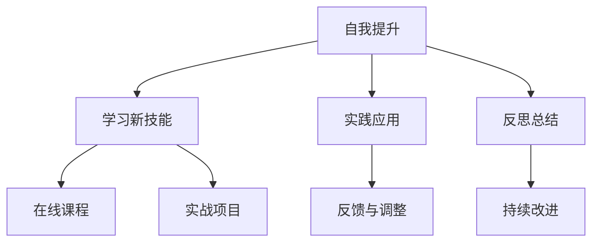

### 3.2 学习资源的获取与利用

学习资源是自我提升的重要工具。以下是一些常用的学习资源：

1. **在线学习平台**：如Coursera、edX、Udemy等，提供了丰富的课程和认证项目。
2. **实战项目**：通过参与开源项目或自己开发小程序，可以将理论知识应用到实践中。
3. **专业书籍与论文**：专业书籍和学术论文是获取深度知识的有效途径。
4. **在线社区与论坛**：如Stack Overflow、GitHub等，可以与其他开发者交流和学习。

以下是一个简化的学习资源利用算法：

```python
def utilize_learning_resources(resources, skill_to_learn):
    learning_plan = []

    for resource in resources:
        if resource['type'] == 'course' and skill_to_learn in resource['skills']:
            learning_plan.append(resource)
        elif resource['type'] == 'project' and skill_to_learn in resource['skills']:
            learning_plan.append(resource)
        elif resource['type'] == 'book' and skill_to_learn in resource['skills']:
            learning_plan.append(resource)
        elif resource['type'] == 'forum' and skill_to_learn in resource['skills']:
            learning_plan.append(resource)
    
    return learning_plan

def create_learning_plan(skill_to_learn):
    resources = [
        {'type': 'course', 'skills': ['数据分析', '机器学习']},
        {'type': 'project', 'skills': ['数据分析', '机器学习']},
        {'type': 'book', 'skills': ['数据分析', '机器学习']},
        {'type': 'forum', 'skills': ['数据分析', '机器学习']}
    ]
    
    return utilize_learning_resources(resources, skill_to_learn)
```

### 3.3 常见技能提升方法

以下是一些常见的技能提升方法：

1. **在线课程**：通过在线课程学习新技能，可以灵活安排学习时间，同时获得专业认证。
2. **实战项目**：通过参与实际项目，可以将理论知识应用到实践中，提高解决实际问题的能力。
3. **读书与论文**：阅读专业书籍和学术论文，可以深入理解某一领域的知识体系，提高专业素养。
4. **在线社区与论坛**：参与在线社区和论坛，可以与其他开发者交流，学习他人的经验和解决方法。

以下是一个简化的技能提升方法流程：

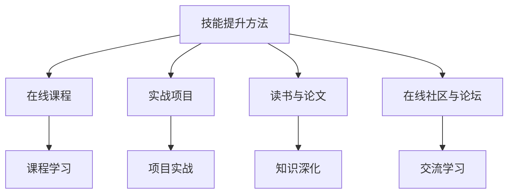

### 项目实战：通过项目实战提升技能

以王先生为例，他是一名软件开发工程师，希望通过项目实战提升自己的前端开发技能。

1. **选择项目**：王先生选择了开发一个在线教育平台作为实战项目。
2. **学习新技能**：王先生参加了在线课程，学习了Vue.js框架和React Native移动应用开发。
3. **项目实施**：王先生在实际项目中应用了所学技能，完成了前端界面设计和移动应用开发。
4. **反思与总结**：项目完成后，王先生总结了项目经验，反思了项目中的不足，并制定了改进计划。

最终，王先生通过这个实战项目，成功提升了前端开发技能，并获得了客户的好评。

---

### 第4章：自由职业者的工作模式

自由职业者与员工的工作模式有显著不同，更加灵活和自主。在这一章节中，我们将探讨自由职业者的工作模式，包括日常流程、时间管理和处理工作挑战的方法。

### 4.1 自由职业者的日常

自由职业者的日常涉及以下几个关键环节：

1. **规划每日任务**：在每天开始时，制定一个详细的任务清单，包括优先级和预计完成时间。
2. **灵活工作安排**：根据客户需求和自身情况，灵活安排工作时间，确保工作和生活平衡。
3. **定期检查进度**：在一天结束时，回顾任务完成情况，调整计划以确保目标实现。

以下是一个简化的自由职业者日常流程：

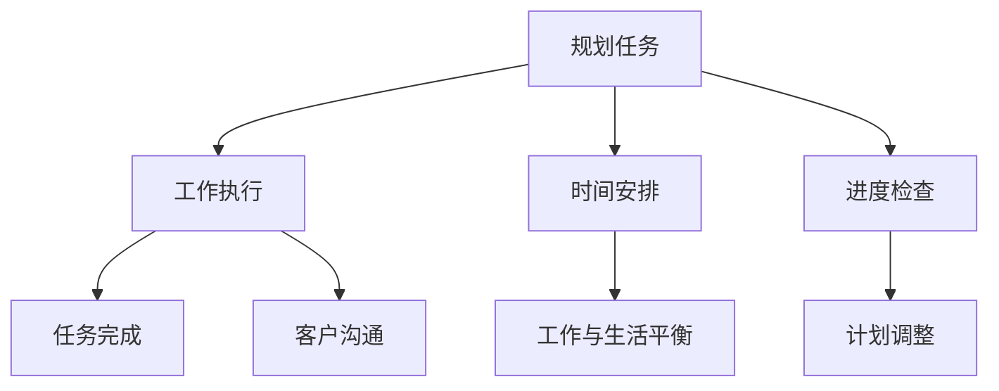

### 4.2 时间管理与效率提升

时间管理对于自由职业者至关重要。以下是一些时间管理和效率提升的方法：

1. **使用时间管理工具**：如Trello、Asana等，帮助规划任务和跟踪进度。
2. **设定优先级**：将任务按照紧急程度和重要性进行分类，优先处理高优先级的任务。
3. **避免拖延**：设定截止日期，定期检查任务进度，避免拖延导致的时间浪费。
4. **集中注意力**：使用番茄工作法等技巧，提高专注力和工作效率。

以下是一个简化的时间管理算法：

```python
def time_management(tasks, deadlines):
    prioritized_tasks = prioritize_tasks(tasks, deadlines)
    schedule_tasks(prioritized_tasks)
    avoid_procrastination(prioritized_tasks)

def prioritize_tasks(tasks, deadlines):
    # 根据紧急程度和重要性对任务进行排序
    return sorted(tasks, key=lambda x: (x['deadline'], x['importance']), reverse=True)

def schedule_tasks(tasks):
    # 安排任务时间表
    for task in tasks:
        print(f"安排时间：{task['name']}，预计完成时间：{task['deadline']}")
    
def avoid_procrastination(tasks):
    # 避免拖延
    for task in tasks:
        if task['deadline'] < datetime.now():
            print(f"警告：任务{task['name']}已逾期！")
```

### 4.3 如何处理工作中的挑战

自由职业者在工作中会遇到各种挑战，以下是一些常见的挑战和应对策略：

1. **客户沟通**：确保与客户保持良好的沟通，了解需求，及时反馈进度。
2. **项目管理**：合理规划项目进度，避免延期和超支。
3. **工作压力**：学会时间管理和压力管理技巧，保持心理健康。
4. **技能不足**：不断学习和提升技能，应对新项目和客户需求。

以下是一个简化的处理工作挑战的算法：

```python
def handle_work_challenges(challenges):
    for challenge in challenges:
        if challenge == "communication":
            improve_communication()
        elif challenge == "project_management":
            improve_project_management()
        elif challenge == "stress":
            manage_stress()
        elif challenge == "skills":
            improve_skills()

def improve_communication():
    # 提高沟通技巧
    print("正在学习有效的沟通技巧...")

def improve_project_management():
    # 提高项目管理能力
    print("正在学习项目管理知识...")

def manage_stress():
    # 学会压力管理技巧
    print("正在学习压力管理方法...")

def improve_skills():
    # 提升技能
    print("正在学习新技能...")
```

### 项目实战：高效工作模式实例

以赵女士为例，她是一名自由职业者，负责多个项目，需要高效管理时间和工作。

1. **规划每日任务**：赵女士每天早上制定任务清单，将任务按照紧急程度和重要性排序。
2. **时间安排**：赵女士使用Trello规划任务，确保每个任务都有明确的时间安排。
3. **避免拖延**：赵女士设定了截止日期，定期检查任务进度，避免拖延。
4. **集中注意力**：赵女士使用番茄工作法提高工作效率，每次专注工作25分钟，休息5分钟。

通过这些方法，赵女士成功提高了工作效率，保证了项目的顺利进行，同时也实现了工作与生活的平衡。

---

### 第5章：财务管理与税务处理

对于自由职业者来说，财务管理与税务处理是必不可少的环节。合理的财务规划和税务处理不仅能帮助自由职业者合法避税，还能提高资金利用效率，确保财务状况的健康。

#### 5.1 自由职业者的财务管理

自由职业者的财务管理主要包括以下几个方面：

1. **收入管理**：自由职业者的收入可能来自不同的客户和项目，因此需要建立一个清晰的收入记录系统，确保每笔收入都有据可查。
2. **支出管理**：记录所有的支出，包括日常开销、项目成本、设备购置等，以便进行合理的财务规划。
3. **预算编制**：根据收入和支出情况，编制月度或年度预算，合理分配资金，确保财务状况稳定。

以下是一个简化的财务管理流程：

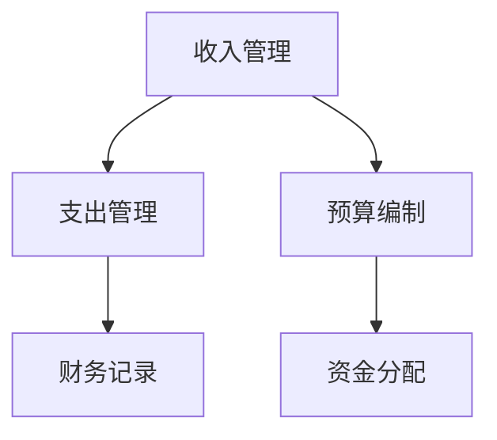

#### 5.2 税务处理的基础知识

税务处理是自由职业者需要特别注意的环节。以下是一些税务处理的基础知识：

1. **税务制度**：了解当地税务制度，包括税种、税率、纳税期限等。
2. **税务减免**：了解并合理利用税务减免政策，如教育支出、医疗支出等。
3. **税务申报**：按时进行税务申报，确保税务合规。

以下是一个简化的税务处理流程：

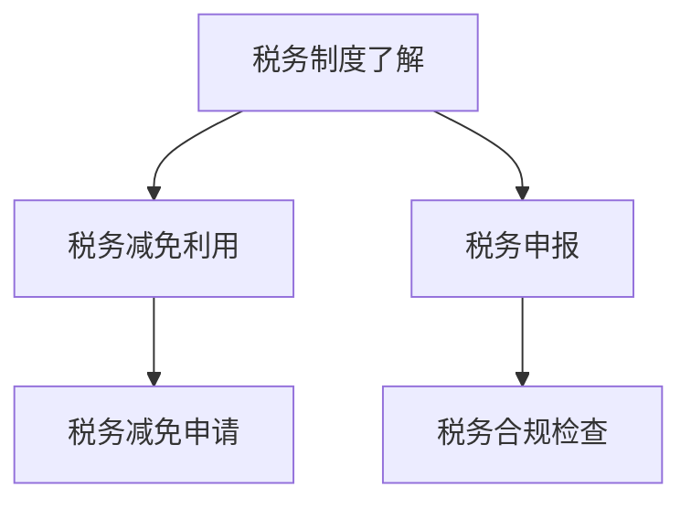

#### 5.3 如何合理避税

合理避税是自由职业者财务管理的重要一环。以下是一些常见的避税方法：

1. **设立有限责任公司**：通过设立有限责任公司，可以将个人收入和企业收入分开，降低税负。
2. **税务减免政策**：合理利用教育、医疗等支出的税务减免政策，减少应纳税收入。
3. **投资理财**：通过投资理财，合理分配收入，利用投资收益的税收优惠政策降低税负。

以下是一个简化的避税策略：

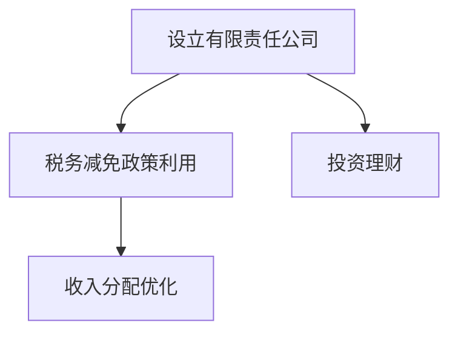

#### 项目实战：税务规划实例

以李先生为例，他是一名自由职业者，年收入为50万元人民币。以下是他进行税务规划的过程：

1. **收入管理**：李先生记录了所有收入，包括项目报酬、咨询服务费等，确保每笔收入都有据可查。
2. **支出管理**：李先生记录了所有支出，包括办公费用、培训费用、设备购置等。
3. **预算编制**：李先生根据收入和支出情况，编制了年度预算，确保财务状况稳定。
4. **税务申报**：李先生按时进行税务申报，确保税务合规。
5. **合理避税**：李先生通过设立有限责任公司，将个人收入和企业收入分开，降低了税负。同时，他利用教育支出的税务减免政策，减少了应纳税收入。

通过这些方法，李先生成功实现了合理避税，提高了资金利用效率。

---

### 第6章：心理健康与生活平衡

对于自由职业者来说，心理健康和生活平衡是维持高效工作和生活质量的关键。长期的工作压力、孤独感以及不规则的生活节奏可能会导致心理健康问题，影响工作效率和生活质量。

#### 6.1 自由职业者的心理健康

自由职业者的心理健康问题主要包括以下几个方面：

1. **工作压力**：自由职业者往往需要自我管理，面对客户需求和市场变化，工作压力可能较大。
2. **孤独感**：自由职业者通常独自工作，缺乏与同事的面对面交流，可能会感到孤独。
3. **时间管理**：自由职业者需要平衡工作与生活，时间管理不当可能会导致工作效率下降或生活质量下降。

以下是一个简化的心理健康问题流程：

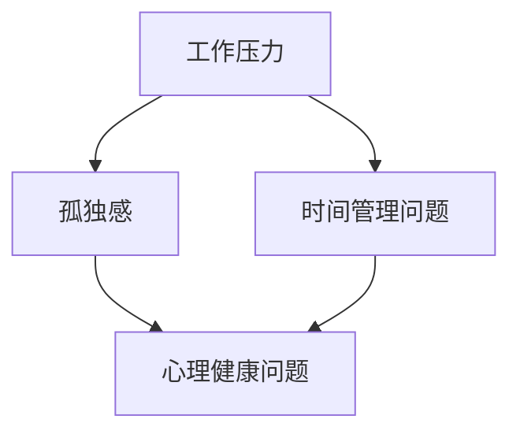

#### 6.2 如何平衡工作与生活

平衡工作与生活是自由职业者需要长期坚持的目标。以下是一些平衡工作与生活的方法：

1. **设定工作时间**：明确工作时间和休息时间，确保工作与生活分开。
2. **合理安排任务**：根据时间安排，合理分配工作任务，避免过度劳累。
3. **培养兴趣爱好**：培养兴趣爱好，如运动、阅读、旅行等，有助于放松心情，提高生活质量。

以下是一个简化的工作与生活平衡流程：

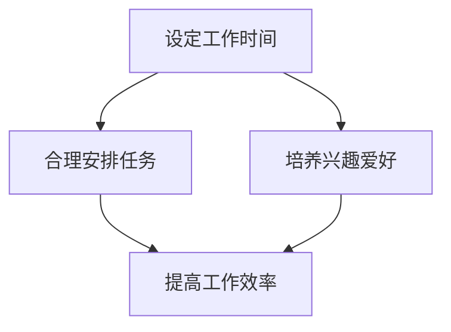

#### 6.3 应对焦虑和压力的方法

焦虑和压力是自由职业者常见的问题。以下是一些应对焦虑和压力的方法：

1. **时间管理**：合理安排时间，确保工作与休息相结合，避免过度劳累。
2. **运动锻炼**：定期进行运动锻炼，有助于释放压力，提高心理健康。
3. **心理调适**：学习心理调适技巧，如冥想、深呼吸等，有助于缓解焦虑和压力。

以下是一个简化的焦虑和压力应对流程：

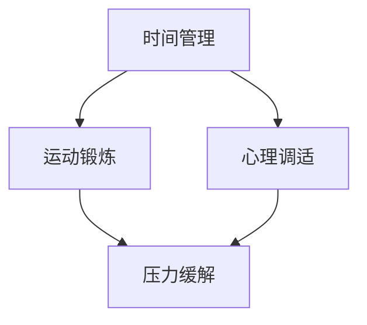

#### 项目实战：心理健康维护实例

以王女士为例，她是一名自由职业者，经常感到工作压力和焦虑。以下是她维护心理健康的过程：

1. **时间管理**：王女士每天早上制定任务清单，确保工作与休息相结合，避免过度劳累。
2. **合理安排任务**：王女士将工作任务分解为小块，确保每项任务都能在规定时间内完成，减少压力。
3. **运动锻炼**：王女士每天晚上进行30分钟的有氧运动，如跑步或游泳，有助于释放压力，提高心理健康。
4. **心理调适**：王女士通过阅读心理学书籍和参加线上心理课程，学习心理调适技巧，如冥想和深呼吸，帮助自己缓解焦虑和压力。

通过这些方法，王女士成功维护了心理健康，提高了工作效率和生活质量。

---

### 第7章：建立个人品牌

在自由职业者的职业发展中，建立个人品牌至关重要。一个强大的个人品牌不仅能提高知名度，还能吸引更多的客户和机会。以下是如何建立个人品牌的方法和策略。

#### 7.1 个人品牌的定义与重要性

个人品牌是个人在职业领域中的形象和声誉。它包括以下几个方面：

1. **专业能力**：展现个人的专业技能和知识水平。
2. **价值观**：传达个人的核心价值观和职业态度。
3. **个人风格**：体现个人的独特风格和个性特点。

个人品牌的重要性体现在以下几个方面：

1. **增加知名度**：一个强大的个人品牌能够提高个人在行业内的知名度，吸引更多的客户和机会。
2. **增强信任度**：个人品牌能够建立客户的信任，提高业务合作的成功率。
3. **提高竞争力**：一个独特的个人品牌能够使个人在竞争激烈的职场中脱颖而出。

以下是一个简化的个人品牌定义与重要性流程：

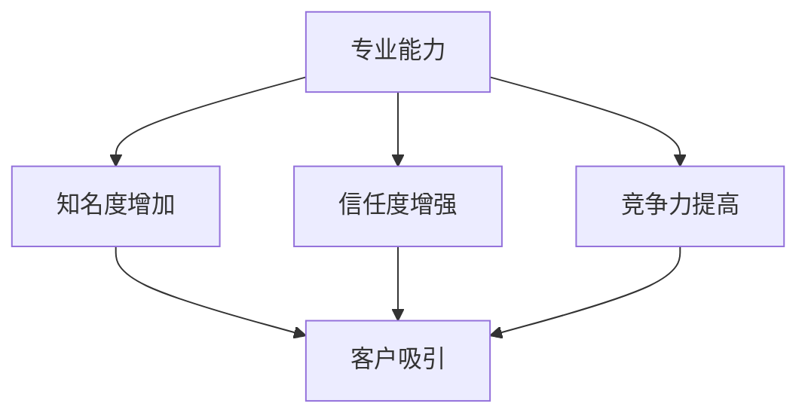

#### 7.2 建立个人品牌的策略

建立个人品牌需要一系列的策略和行动。以下是一些关键的策略：

1. **明确定位**：明确个人品牌的定位，包括专业领域、目标客户和核心优势。
2. **内容策略**：制定内容策略，包括撰写专业文章、发布技术博客、制作视频等，展现专业知识和独特见解。
3. **社交媒体推广**：利用社交媒体平台，如LinkedIn、Twitter、Instagram等，扩大个人品牌的影响力。
4. **网络拓展**：积极参与行业活动、研讨会和在线论坛，扩大人脉网络，提高知名度。

以下是一个简化的个人品牌建设策略流程：

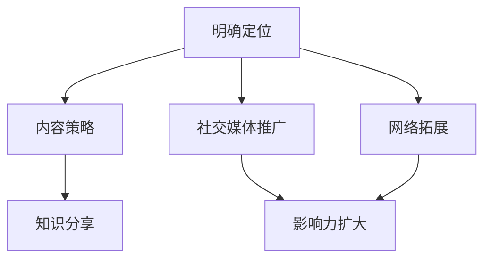

#### 7.3 社交媒体在个人品牌建设中的应用

社交媒体是建立个人品牌的重要工具。以下是一些社交媒体在个人品牌建设中的应用策略：

1. **内容规划**：制定内容规划，包括定期发布专业文章、技术博客和行业分析，保持与粉丝的互动。
2. **互动与回应**：积极回应粉丝的评论和私信，建立良好的互动关系。
3. **数据分析**：利用社交媒体平台的数据分析功能，了解粉丝的喜好和关注点，优化内容策略。
4. **广告推广**：合理使用广告推广，扩大个人品牌的知名度。

以下是一个简化的社交媒体应用流程：

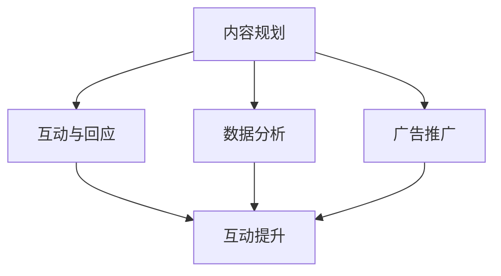

#### 项目实战：个人品牌建设实例

以张先生为例，他是一名自由职业者，专注于数据科学领域。以下是他在个人品牌建设中的实践：

1. **明确定位**：张先生明确了自己在数据科学领域的定位，专注于机器学习和大数据分析。
2. **内容策略**：张先生定期撰写技术博客，分享数据科学领域的最新技术和应用案例，同时发布机器学习算法的代码实现。
3. **社交媒体推广**：张先生在LinkedIn上发布了自己的博客文章，并利用LinkedIn的推广功能，扩大了个人品牌的知名度。
4. **网络拓展**：张先生积极参与数据科学领域的研讨会和在线论坛，与业内专家和同行交流，扩大了人脉网络。

通过这些实践，张先生成功建立了个人品牌，吸引了更多的客户和机会。

---

### 第8章：拓展业务与寻找客户

在自由职业者的职业发展中，拓展业务和寻找客户是至关重要的环节。有效的业务拓展和客户寻找策略能够帮助自由职业者扩大业务范围，提高收入。

#### 8.1 拓展业务的方法

拓展业务的方法包括以下几个方面：

1. **市场调研**：了解目标市场的需求和趋势，确定适合的业务方向。
2. **定位调整**：根据市场调研结果，调整个人定位和业务范围，确保与市场需求相匹配。
3. **产品优化**：不断优化产品和服务，提高客户满意度和忠诚度。
4. **网络拓展**：通过参加行业会议、研讨会和在线论坛，扩大人脉网络，获取更多业务机会。

以下是一个简化的拓展业务流程：

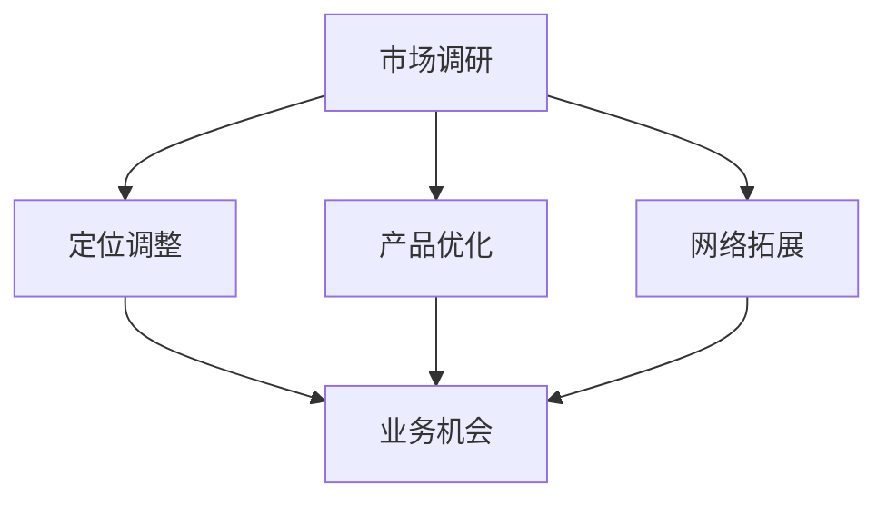

#### 8.2 如何寻找潜在客户

寻找潜在客户是自由职业者的重要任务。以下是一些寻找潜在客户的方法：

1. **网络搜索**：利用搜索引擎和社交媒体平台，搜索潜在客户和合作伙伴。
2. **人脉拓展**：通过亲朋好友、行业会议和社交活动，扩大人脉网络，获取潜在客户信息。
3. **在线广告**：利用Google AdWords、Facebook Ads等在线广告平台，吸引潜在客户。
4. **内容营销**：通过撰写专业文章、技术博客和制作视频，提高个人品牌知名度，吸引潜在客户。

以下是一个简化的寻找潜在客户流程：

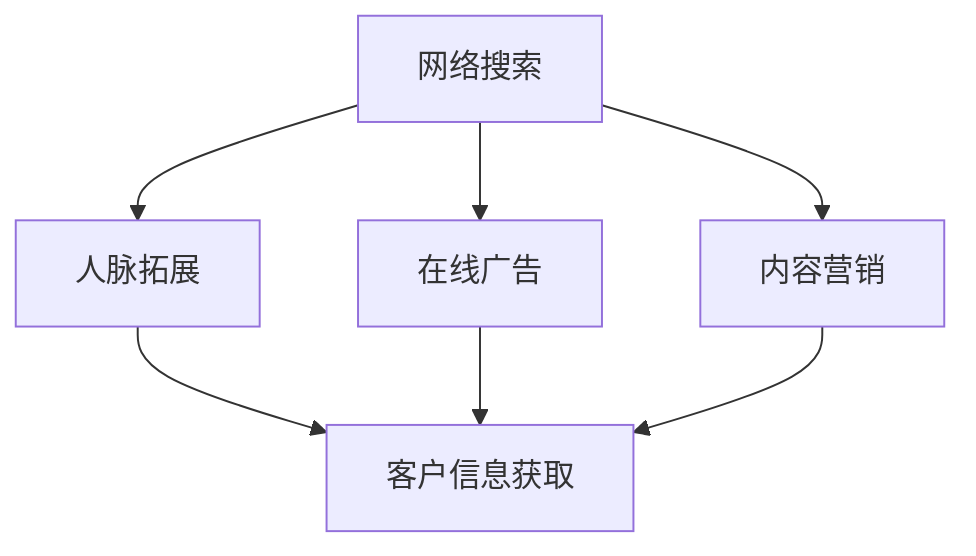

#### 8.3 客户关系管理与维护

客户关系管理和维护是自由职业者成功的关键。以下是一些客户关系管理和维护的方法：

1. **定期沟通**：与客户保持定期沟通，了解客户需求和反馈，提供个性化的服务。
2. **定制化服务**：根据客户需求和反馈，提供定制化的产品和服务，提高客户满意度。
3. **客户关怀**：在节假日或客户生日时，发送祝福或礼品，增强客户关系。
4. **客户反馈**：积极收集客户反馈，不断改进产品和服务，提高客户满意度。

以下是一个简化的客户关系管理和维护流程：

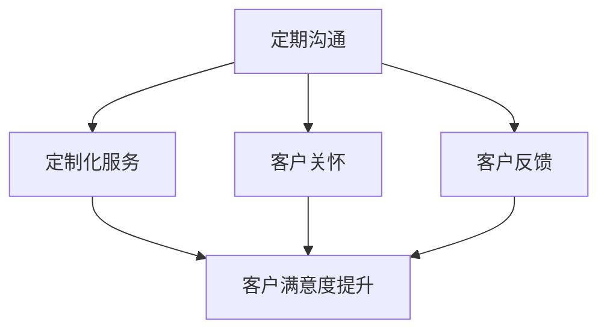

#### 项目实战：业务拓展和客户寻找实例

以陈先生为例，他是一名自由职业者，专注于软件开发和咨询服务。以下是他在业务拓展和客户寻找中的实践：

1. **市场调研**：陈先生通过参加行业会议和在线论坛，了解市场需求和趋势，确定了自己的业务方向。
2. **定位调整**：根据市场调研结果，陈先生将业务定位调整为专注于软件开发和定制化解决方案。
3. **网络拓展**：陈先生积极参与技术社区和行业活动，扩大人脉网络，结识了潜在客户和合作伙伴。
4. **内容营销**：陈先生定期发布技术博客和案例分享，提高了个人品牌知名度，吸引了更多潜在客户。
5. **客户关系管理**：陈先生与客户保持定期沟通，了解客户需求和反馈，提供个性化的服务，赢得了客户的信任和好评。

通过这些实践，陈先生成功拓展了业务，增加了客户数量，实现了业务的持续增长。

---

### 第9章：自由职业者网络建设

在自由职业者的职业发展中，网络建设至关重要。一个强大的职业网络不仅能提供丰富的业务机会，还能为个人成长和知识分享提供支持。以下是如何建设自由职业者网络的方法和策略。

#### 9.1 自由职业者社区的意义

自由职业者社区是一个由自由职业者组成的在线或线下平台，旨在促进信息交流、资源共享和职业发展。以下是一些自由职业者社区的意义：

1. **知识分享**：社区成员可以分享专业知识和经验，相互学习，提高技能水平。
2. **业务机会**：社区成员可以交流业务信息，互相推荐客户和合作伙伴，扩大业务范围。
3. **职业发展**：社区成员可以获得职业建议和指导，规划职业发展路径，实现职业目标。
4. **支持网络**：社区成员可以在面对挑战和困难时，获得支持和帮助，增强自信心和动力。

以下是一个简化的自由职业者社区的意义流程：

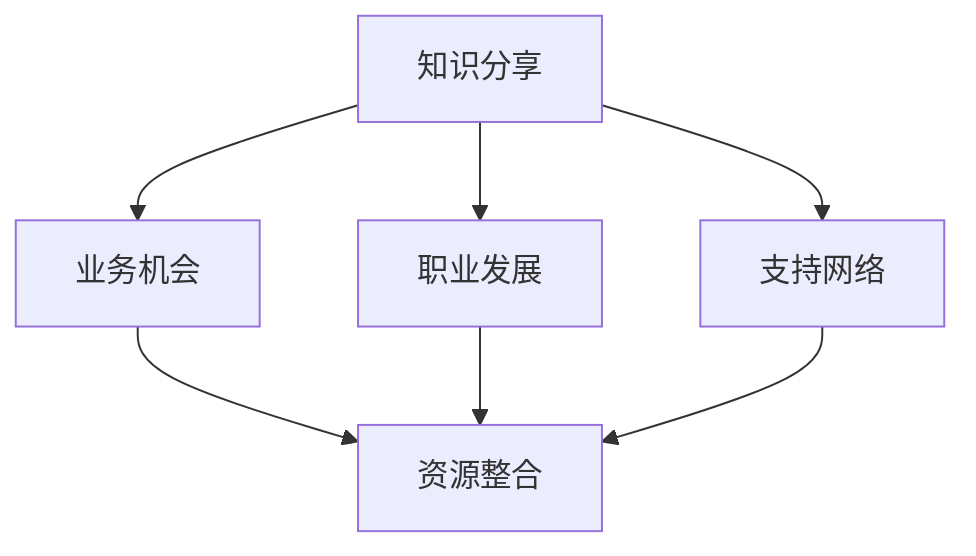

#### 9.2 加入和参与社区的方法

加入和参与自由职业者社区是建立职业网络的重要步骤。以下是一些方法和策略：

1. **选择合适的社区**：根据个人兴趣和需求，选择合适的自由职业者社区。
2. **积极参与讨论**：在社区中积极参与讨论，分享知识和经验，展示个人专业能力。
3. **参与活动**：参与社区组织的线上或线下活动，结识新朋友，扩大人脉网络。
4. **建立联系**：主动与其他社区成员建立联系，交换联系方式，加深了解。

以下是一个简化的加入和参与社区的方法流程：

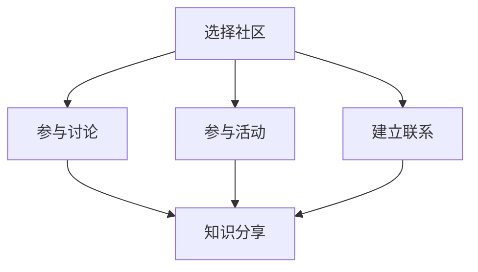

#### 9.3 网络资源与工具的利用

网络资源与工具是自由职业者网络建设的重要支持。以下是一些常用的网络资源和工具：

1. **社交媒体平台**：如LinkedIn、Twitter、Instagram等，用于个人品牌建设和业务推广。
2. **专业论坛和社区**：如Stack Overflow、GitHub、Reddit等，用于知识分享和问题解答。
3. **在线工具**：如Trello、Asana、Slack等，用于团队协作和项目管理。
4. **网络会议工具**：如Zoom、Microsoft Teams、Google Meet等，用于线上交流和会议。

以下是一个简化的网络资源与工具的利用流程：

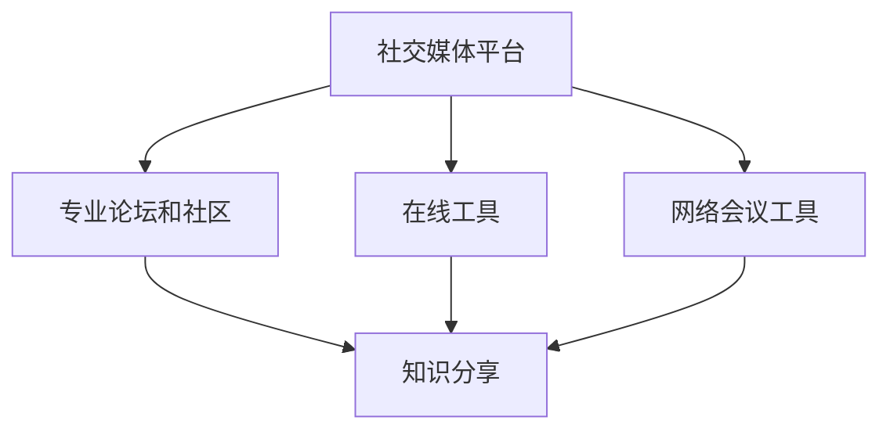

#### 项目实战：自由职业者网络建设实例

以王女士为例，她是一名自由职业者，专注于数字营销领域。以下是她在自由职业者网络建设中的实践：

1. **选择社区**：王女士选择了多个数字营销专业社区，如Digital Marketing Community、LinkedIn Marketing Solutions等。
2. **参与讨论**：王女士积极参与社区讨论，分享自己的营销案例和经验，同时向其他成员请教问题。
3. **参与活动**：王女士参与了社区组织的线上研讨会和培训活动，结识了业内专家和同行。
4. **建立联系**：王女士主动与其他社区成员建立联系，交换联系方式，建立了良好的合作关系。
5. **利用工具**：王女士使用了Trello和Slack等在线工具，与团队成员协作，提高了工作效率。

通过这些实践，王女士成功建立了强大的自由职业者网络，获得了更多的业务机会和职业发展支持。

---

### 第10章：成功自由职业者的经验

在自由职业者的世界中，有许多成功的案例可以提供宝贵的经验。以下是一些成功自由职业者的经验分享，以及他们是如何做到的。

#### 10.1 自由职业者的成功案例

1. **案例一：李先生，数据分析师**
   - **经历**：李先生曾在一家大型企业担任数据分析师，凭借丰富的数据分析经验和专业技能，他决定转型为自由职业者。
   - **如何做到**：
     - **技能提升**：李先生通过在线课程和实战项目，不断提升自己的数据分析技能。
     - **个人品牌**：他在LinkedIn上建立了专业个人品牌，定期发布数据分析文章和案例分享。
     - **客户关系**：李先生通过人脉拓展和内容营销，积累了稳定的客户资源。

2. **案例二：张女士，数字营销专家**
   - **经历**：张女士在多家广告公司担任营销经理，积累了丰富的营销经验后，她决定成为自由职业者，专注于数字营销。
   - **如何做到**：
     - **市场调研**：张女士通过市场调研，确定了数字营销领域的热点和趋势。
     - **产品优化**：她不断优化自己的营销策略和工具，提高客户满意度。
     - **网络拓展**：张女士积极参与行业会议和在线论坛，扩大人脉网络。

3. **案例三：王先生，软件开发工程师**
   - **经历**：王先生在多家软件公司担任工程师，积累了丰富的开发经验后，他成为了一名自由职业者，专注于软件开发和咨询服务。
   - **如何做到**：
     - **技能提升**：王先生通过在线课程和实战项目，不断提升自己的编程技能。
     - **专业领域**：他专注于自己最擅长的领域，提高了专业竞争力。
     - **客户关系**：王先生建立了良好的客户关系管理体系，确保了业务稳定。

#### 10.2 他们是如何做到的

成功自由职业者的经验可以总结为以下几点：

1. **技能提升**：不断学习和提升自己的技能，保持专业竞争力。
2. **个人品牌**：建立专业个人品牌，提高知名度和信任度。
3. **市场调研**：了解市场需求和趋势，确定适合自己的业务方向。
4. **产品优化**：不断优化产品和服务，提高客户满意度和忠诚度。
5. **网络拓展**：积极参与行业活动和网络论坛，扩大人脉网络，获取更多业务机会。
6. **客户关系**：建立良好的客户关系管理体系，确保业务稳定和持续增长。

#### 10.3 可借鉴的经验与教训

以下是一些可借鉴的经验与教训：

1. **持续学习**：技能是自由职业者成功的关键，因此需要持续学习和提升自己的技能。
2. **明确定位**：在职业发展中，明确自己的定位和目标，确保与市场需求相匹配。
3. **内容营销**：通过撰写专业文章、技术博客和分享案例，提高个人品牌知名度和影响力。
4. **客户关系**：建立良好的客户关系，提高客户满意度和忠诚度，确保业务的稳定。
5. **灵活调整**：面对市场变化和挑战，保持灵活性，及时调整策略。
6. **心理调适**：保持心理健康，学会应对压力和挑战，确保长期成功。

通过借鉴这些经验和教训，自由职业者可以更好地规划自己的职业发展，实现长期成功。

---

### 第11章：成长中的挑战与应对

在自由职业者的成长过程中，会遇到各种挑战和困难。如何应对这些挑战，实现持续成长，是自由职业者需要认真思考的问题。以下是一些常见的挑战和应对策略。

#### 11.1 自由职业者常见的挑战

1. **工作压力**：自由职业者往往需要自我管理，面对客户需求和市场变化，工作压力可能较大。
2. **孤独感**：自由职业者通常独自工作，缺乏与同事的面对面交流，可能会感到孤独。
3. **时间管理**：自由职业者需要平衡工作与生活，时间管理不当可能会导致工作效率下降或生活质量下降。
4. **技能提升**：自由职业者需要不断学习和提升技能，以适应市场变化和客户需求。
5. **客户关系**：建立和维护良好的客户关系需要投入大量的时间和精力。

#### 11.2 如何应对这些挑战

1. **工作压力**：通过合理的时间管理和优先级设定，确保工作与生活平衡。同时，学会放松和减压，如进行运动、冥想等。
2. **孤独感**：积极参与行业活动和社交活动，扩大人脉网络，与他人交流和互动。同时，可以利用在线工具和平台，与同行保持沟通。
3. **时间管理**：使用时间管理工具，如Trello、Asana等，规划任务和时间，确保高效工作。同时，设定明确的工作和休息时间，避免时间浪费。
4. **技能提升**：通过在线课程、实战项目和读书等方式，持续学习和提升技能。同时，积极参与开源项目和社区活动，拓展知识面。
5. **客户关系**：建立和维护良好的客户关系，通过定期沟通、个性化服务和及时反馈，提高客户满意度和忠诚度。

#### 11.3 持续成长与适应变化

1. **适应变化**：市场和技术在不断变化，自由职业者需要保持灵活性和开放性，及时调整自己的职业方向和策略。
2. **持续学习**：通过不断学习和实践，提升自己的专业技能和知识水平，保持竞争力。
3. **反思总结**：定期反思自己的职业发展，总结经验教训，发现问题和不足，制定改进计划。
4. **积极拓展**：积极参与行业活动和社区，结识新朋友，获取更多机会和资源。

#### 项目实战：挑战与应对实例

以赵先生为例，他是一名自由职业者，专注于软件开发和咨询服务。以下是他在成长过程中遇到的挑战和应对策略：

1. **工作压力**：赵先生通过制定详细的工作计划和优先级设定，确保高效工作。同时，他利用空闲时间进行运动和冥想，缓解压力。
2. **孤独感**：赵先生积极参与技术社区和线上论坛，与其他开发者交流和互动。同时，他利用LinkedIn等平台，建立了自己的专业个人品牌。
3. **时间管理**：赵先生使用了Trello等时间管理工具，规划任务和时间，确保高效工作。同时，他设定了明确的工作和休息时间，避免时间浪费。
4. **技能提升**：赵先生通过在线课程和实战项目，持续学习和提升自己的编程技能。同时，他参与了多个开源项目，拓展了自己的知识面。
5. **客户关系**：赵先生建立了良好的客户关系管理体系，通过定期沟通和个性化服务，提高了客户满意度和忠诚度。

通过这些应对策略，赵先生成功克服了成长中的挑战，实现了持续成长和业务拓展。

---

### 第12章：未来的自由职业者

随着科技的不断发展，自由职业者行业也在不断变化。未来，自由职业者将面临新的机遇和挑战。以下是一些未来自由职业者行业的发展趋势和应对策略。

#### 12.1 自由职业者行业的未来趋势

1. **远程工作的普及**：随着远程工作技术的成熟，越来越多的企业选择雇佣自由职业者，远程工作将成为主流。
2. **数字化服务的兴起**：数字化服务，如云计算、人工智能、区块链等，将为自由职业者提供更多的业务机会。
3. **技能需求的多样化**：随着行业变化，自由职业者需要具备更多跨领域的技能，如数据科学、人工智能、数字化转型等。
4. **个人品牌的重视**：个人品牌将成为自由职业者成功的关键，建立和维护强大的个人品牌将变得越来越重要。
5. **职业路径的多元化**：自由职业者的职业路径将不再局限于某个特定领域，而是更加灵活和多元化。

#### 12.2 如何抓住行业机遇

1. **提升技能**：不断学习和提升自己的技能，适应行业变化。可以通过在线课程、实战项目和读书等方式，提高自己的专业水平。
2. **拓展业务**：通过市场调研，了解市场需求和趋势，拓展业务范围，抓住新的业务机会。
3. **建立个人品牌**：通过撰写专业文章、技术博客和分享案例，建立和维护个人品牌，提高知名度和影响力。
4. **网络拓展**：积极参与行业活动和社区，扩大人脉网络，获取更多机会和资源。

#### 12.3 自由职业者的未来发展展望

未来的自由职业者将更加注重个人品牌的建立和技能的提升。他们将通过数字化工具和平台，实现高效的工作和生活平衡。同时，随着行业的变化，自由职业者将面临更多的挑战和机遇。通过不断学习和适应，他们将在自由职业的道路上取得更大的成功。

#### 项目实战：未来自由职业者的机遇

以陈女士为例，她是一名自由职业者，专注于数字营销和数据分析领域。以下是她在未来自由职业者行业的机遇和应对策略：

1. **技能提升**：陈女士通过在线课程和实战项目，不断提升自己的数字营销和数据分析技能。
2. **拓展业务**：陈女士通过市场调研，了解到数字化转型是未来的趋势，她决定拓展自己的业务范围，提供数字化转型咨询服务。
3. **建立个人品牌**：陈女士在LinkedIn和Twitter上建立了专业个人品牌，分享自己的数字营销和数据分析案例，提高了知名度和影响力。
4. **网络拓展**：陈女士积极参与行业会议和在线论坛，结识了业内专家和同行，建立了广泛的职业网络。

通过这些策略，陈女士成功抓住了未来自由职业者行业的机遇，实现了业务的持续增长和个人品牌的提升。

---

## 附录

### 附录 A：常用工具与资源

在自由职业者的职业发展中，常用的工具和资源能够提供极大的帮助。以下是一些常用的工具和资源推荐：

#### 附录 A.1 自由职业者常用的工具

1. **时间管理工具**：
   - Trello：用于任务规划和项目管理。
   - Asana：用于团队协作和任务跟踪。
   - Google Calendar：用于日程管理和时间规划。

2. **在线协作工具**：
   - Slack：用于团队沟通和协作。
   - Zoom：用于在线会议和视频通话。
   - Google Drive：用于文档共享和协作。

3. **学习资源**：
   - Coursera、edX、Udemy：提供在线课程和学习资源。
   - GitHub：提供开源项目和代码托管。
   - Stack Overflow：提供技术问答和资源分享。

4. **市场营销工具**：
   - LinkedIn：用于建立个人品牌和拓展人脉。
   - Hootsuite：用于社交媒体管理和内容发布。
   - Mailchimp：用于电子邮件营销和客户管理。

#### 附录 A.2 自由职业者学习资源推荐

1. **书籍推荐**：
   - 《自由职业者的秘密》
   - 《成功自由职业者的秘诀》
   - 《自由职业者的日常管理技巧》

2. **在线课程推荐**：
   - Coursera上的《自由职业者的技能提升》
   - edX上的《自由职业者的财务管理》
   - Udemy上的《自由职业者的市场营销策略》

3. **论坛和社区推荐**：
   - Freelancers Union：一个全球自由职业者社区。
   - Upwork Community：提供自由职业者的交流和资源分享。
   - LinkedIn Freelancers Group：一个专注于自由职业者的LinkedIn群组。

通过使用这些工具和资源，自由职业者可以更高效地管理自己的职业发展，实现持续成长和成功。

---

## 作者信息

**作者：**AI天才研究院/AI Genius Institute & 禅与计算机程序设计艺术 /Zen And The Art of Computer Programming

---

以上是《从员工到自由职业者的转型指南》的完整内容。希望这篇文章能为有志于成为自由职业者的人提供有益的指导和启示。让我们共同探索自由职业者的世界，实现职业和个人发展的双赢。

--- 

### 第1章：自我评估与职业定位

#### 核心概念与联系

自我评估与职业定位是自由职业者转型过程中的关键环节。为了更好地理解和实现这一过程，我们可以借助Mermaid流程图来梳理整个流程：

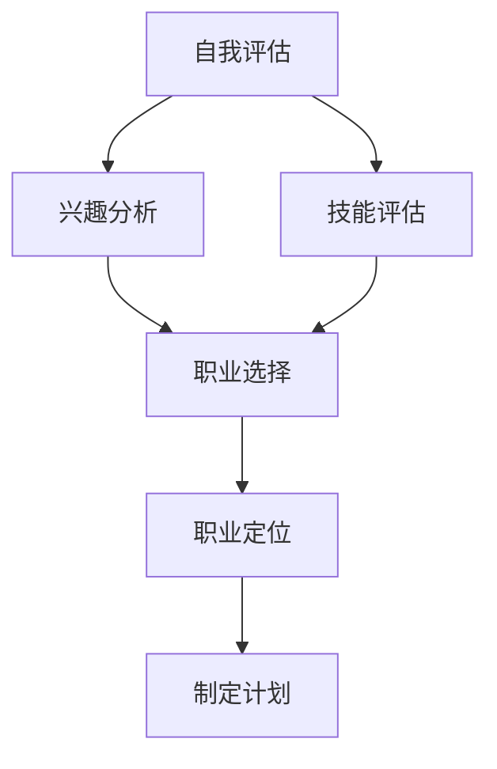

这个流程图涵盖了从自我认知到职业定位的各个环节。首先，通过自我评估，我们能够了解自己的兴趣、技能和价值观。接下来，通过兴趣分析和技能评估，我们能够找到与个人特点相匹配的职业方向。最后，通过职业选择和制定计划，我们将这些发现转化为具体的职业发展路径。

#### 核心算法原理讲解

为了更加系统地自我评估和职业定位，我们可以使用以下伪代码来描述这个过程：

```python
def self_evaluation():
    interests = analyze_interests()
    skills = analyze_skills()
    values = analyze_values()

    potential_careers = match_interests_skills_values(interests, skills, values)
    best_career = select_best_career(potential_careers)
    
    return best_career

def analyze_interests():
    # 获取用户的兴趣点
    return ["编程", "设计", "写作"]

def analyze_skills():
    # 获取用户的技能点
    return ["Python编程", "UI设计", "内容创作"]

def analyze_values():
    # 获取用户的价值观
    return ["创新", "自由", "成就感"]

def match_interests_skills_values(interests, skills, values):
    # 匹配兴趣、技能和价值观，得到潜在职业列表
    potential_careers = []
    if "编程" in interests and "Python编程" in skills:
        potential_careers.append("软件工程师")
    if "设计" in interests and "UI设计" in skills:
        potential_careers.append("用户体验设计师")
    if "写作" in interests and "内容创作" in skills:
        potential_careers.append("内容创作者")
    return potential_careers

def select_best_career(potential_careers):
    # 根据价值观选择最佳职业
    best_career = None
    for career in potential_careers:
        if "创新" in values and career == "软件工程师":
            best_career = career
        elif "自由" in values and career == "用户体验设计师":
            best_career = career
        elif "成就感" in values and career == "内容创作者":
            best_career = career
    return best_career
```

在这个伪代码中，`analyze_interests()`、`analyze_skills()`和`analyze_values()`函数分别用于获取用户的兴趣、技能和价值观。`match_interests_skills_values()`函数则用于匹配这些因素，得到一个潜在的职业列表。最后，`select_best_career()`函数根据价值观选择最佳的职业。

#### 数学模型和公式

为了更准确地评估职业匹配度，我们可以使用以下公式：

$$
\text{职业匹配度} = \frac{\text{兴趣得分} \times \text{技能得分} \times \text{价值观得分}}{\text{总得分}}
$$

其中，兴趣得分、技能得分和价值观得分分别表示用户在兴趣、技能和价值观方面的得分，总得分表示所有得分的总和。

例如，如果用户的兴趣得分为5，技能得分为7，价值观得分为6，总得分为18，则职业匹配度为：

$$
\text{职业匹配度} = \frac{5 \times 7 \times 6}{18} \approx 14.44
$$

这个值越接近18，表示职业匹配度越高。

#### 项目实战

为了更好地理解自我评估与职业定位的过程，以下是一个实际案例：

**案例：**小王是一名大学毕业生，他在求职过程中感到迷茫，不确定自己的职业方向。为了帮助他进行自我评估和职业定位，我们进行了以下步骤：

1. **兴趣分析**：通过与家人、朋友和导师的交流，小王列出自己的兴趣包括“编程”、“设计”和“写作”。
2. **技能评估**：小王回顾自己在大学期间的学习经历和课外活动，发现自己在“Python编程”、“UI设计”和“内容创作”方面有较强的能力。
3. **价值观分析**：小王通过自我反思，确定自己的价值观包括“创新”、“自由”和“成就感”。

根据以上分析，小王通过伪代码中的`self_evaluation()`函数，得到以下结果：

- **潜在职业**：软件工程师、用户体验设计师和内容创作者
- **最佳职业**：用户体验设计师（根据价值观得分）

最终，小王决定成为一名用户体验设计师，并开始着手准备相关技能的学习和项目经验积累。

### 第2章：职业发展的路径与策略

#### 核心概念与联系

职业发展的路径与策略是自由职业者成功的关键。为了更好地理解和实现职业发展，我们可以借助Mermaid流程图来梳理整个职业发展路径：

```mermaid
graph TD
    A[自我认知] --> B[职业定位]
    B --> C[市场分析]
    C --> D[职业选择]
    D --> E[制定计划]
    E --> F[执行计划]
    F --> G[评估与调整]
```

这个流程图涵盖了从自我认知到职业发展的各个环节。首先，通过自我认知，我们能够了解自己的兴趣、技能和价值观。接下来，通过职业定位和市场分析，我们能够确定适合自己的职业方向。然后，通过职业选择和制定计划，我们将这些发现转化为具体的职业发展路径。在执行计划的过程中，我们需要定期评估和调整，以确保职业发展的顺利进行。

#### 核心算法原理讲解

为了更加系统地制定职业发展计划，我们可以使用以下伪代码来描述这个过程：

```python
def career_development():
    self_knowledge = self_evaluation()
    career_positioning = position_career(self_knowledge)
    market_analysis = analyze_market(career_positioning)
    career_choice = select_career(market_analysis)
    plan_creation = create_plan(career_choice)
    execution = execute_plan(plan_creation)
    evaluation = evaluate_progress(execution)
    
    return evaluation

def self_evaluation():
    # 参考第1章的自我评估方法
    return self_knowledge

def position_career(self_knowledge):
    # 根据自我评估结果，进行职业定位
    return career_positioning

def analyze_market(career_positioning):
    # 进行市场分析，了解职业前景和市场需求
    return market_analysis

def select_career(market_analysis):
    # 根据市场分析结果，选择职业
    return career_choice

def create_plan(career_choice):
    # 根据职业选择，制定职业发展计划
    return plan_creation

def execute_plan(plan_creation):
    # 执行职业发展计划
    return execution

def evaluate_progress(execution):
    # 定期评估职业发展进度
    return evaluation
```

在这个伪代码中，`self_evaluation()`函数用于获取自我认知结果，`position_career()`函数用于职业定位，`analyze_market()`函数用于市场分析，`select_career()`函数用于职业选择，`create_plan()`函数用于制定职业发展计划，`execute_plan()`函数用于执行计划，`evaluate_progress()`函数用于评估职业发展进度。

#### 数学模型和公式

为了更准确地评估职业发展进度，我们可以使用以下公式：

$$
\text{职业发展进度} = \frac{\text{当前技能水平} + \text{市场竞争力} + \text{个人满意度}}{\text{职业目标}}
$$

其中，当前技能水平表示个人当前在职业领域的技能水平，市场竞争力表示个人在市场上的竞争力，个人满意度表示个人对职业发展的满意度，职业目标表示设定的职业发展目标。

例如，如果小王当前技能水平为70%，市场竞争力为60%，个人满意度为80%，设定的职业目标为100%，则他的职业发展进度为：

$$
\text{职业发展进度} = \frac{70\% + 60\% + 80\%}{100\%} = 71\%
$$

这个值表示小王目前职业发展进度为71%。

#### 项目实战

为了更好地理解职业发展的路径与策略，以下是一个实际案例：

**案例：**小李是一名软件开发工程师，他在职业发展中感到迷茫，不确定如何进一步发展。为了帮助他制定职业发展计划，我们进行了以下步骤：

1. **自我评估**：小李通过自我反思，确定自己的兴趣包括“编程”、“设计”和“创新”。
2. **职业定位**：根据自我评估结果，小李选择了软件开发工程师作为职业定位。
3. **市场分析**：通过市场调研，小李了解到软件开发工程师在市场上的需求较高，并且具有一定的技术发展前景。
4. **职业选择**：小李决定继续深耕软件开发领域，同时学习前端设计和项目管理知识，以提高自己的竞争力。
5. **制定计划**：小李制定了详细的职业发展计划，包括学习新技能、参与开源项目、提高工作效率等。
6. **执行计划**：小李开始执行职业发展计划，通过在线课程、实战项目和自我管理，不断提升自己的技能和知识。
7. **评估与调整**：每隔一段时间，小李会评估自己的职业发展进度，并根据实际情况调整职业发展计划。

通过这些步骤，小李成功制定了职业发展计划，并在职业发展中取得了显著进步。

### 第3章：技能提升与学习资源

#### 核心概念与联系

技能提升是自由职业者在职业发展中至关重要的一环。为了更好地理解和实现技能提升，我们可以借助Mermaid流程图来梳理整个技能提升的过程：

```mermaid
graph TD
    A[确定目标] --> B[选择资源]
    A --> C[学习资源]
    A --> D[技能实践]
    B --> E[评估效果]
    C --> E
    D --> E
```

这个流程图涵盖了从确定目标到评估效果的各个环节。首先，通过确定目标，我们能够明确自己想要提升的技能。接下来，通过选择资源和学习资源，我们能够找到适合的学习材料。然后，通过技能实践，我们能够将理论知识应用到实际操作中。最后，通过评估效果，我们能够了解自己的技能提升情况，并根据实际情况进行调整。

#### 核心算法原理讲解

为了更加系统地提升技能，我们可以使用以下伪代码来描述这个过程：

```python
def skill_improvement(skill_name, target_level):
    resources = select_resources(skill_name)
    practice_plan = create_practice_plan(resources)
    progress = practice_and_evaluate(practice_plan)
    
    if progress >= target_level:
        print(f"{skill_name}技能提升成功！")
    else:
        print(f"{skill_name}技能提升未达标，请继续努力。")

def select_resources(skill_name):
    # 根据技能名称，选择合适的学习资源
    if skill_name == "编程":
        return ["编程书籍", "在线编程课程", "编程实战项目"]
    elif skill_name == "设计":
        return ["设计教程", "设计工具使用", "设计实战项目"]
    elif skill_name == "项目管理":
        return ["项目管理书籍", "在线项目管理课程", "项目管理工具"]

def create_practice_plan(resources):
    # 根据学习资源，创建实践计划
    practice_plan = []
    for resource in resources:
        if "书籍" in resource:
            practice_plan.append("阅读书籍")
        elif "课程" in resource:
            practice_plan.append("参加课程")
        elif "项目" in resource:
            practice_plan.append("完成项目")
    return practice_plan

def practice_and_evaluate(practice_plan):
    # 执行实践计划，并评估技能提升效果
    for task in practice_plan:
        if task == "阅读书籍":
            read_books()
        elif task == "参加课程":
            attend_courses()
        elif task == "完成项目":
            complete_projects()
    
    # 评估技能提升效果
    skill_level = evaluate_skill_level()
    return skill_level

def evaluate_skill_level():
    # 评估技能水平
    return 80  # 假设评估得分为80%
```

在这个伪代码中，`select_resources()`函数用于选择合适的学习资源，`create_practice_plan()`函数用于创建实践计划，`practice_and_evaluate()`函数用于执行实践计划并评估技能提升效果。

#### 数学模型和公式

为了更准确地评估技能提升效果，我们可以使用以下公式：

$$
\text{技能提升效果} = \frac{\text{实际技能水平} - \text{原始技能水平}}{\text{原始技能水平}}
$$

其中，实际技能水平表示经过一段时间学习和实践后的技能水平，原始技能水平表示开始学习和实践时的技能水平。

例如，如果小王开始学习编程时的技能水平为60%，经过一段时间的学习和实践后，技能水平提升到80%，则他的技能提升效果为：

$$
\text{技能提升效果} = \frac{80\% - 60\%}{60\%} = \frac{20\%}{60\%} \approx 33.33\%
$$

这个值表示小王在编程技能上的提升效果为33.33%。

#### 项目实战

为了更好地理解技能提升的过程，以下是一个实际案例：

**案例：**小张是一名软件工程师，他希望通过学习提高自己的编程技能。为了帮助他实现这一目标，我们进行了以下步骤：

1. **确定目标**：小张希望提高自己的编程技能，目标是达到中级水平。
2. **选择资源**：我们根据小张的需求，选择了《代码大全》、《Python编程：从入门到实践》等编程书籍，以及Udemy上的《Python高级编程》在线课程。
3. **学习资源**：小张开始阅读编程书籍和参加在线课程，同时利用GitHub上的开源项目进行实战练习。
4. **技能实践**：小张通过实际编码项目，将所学知识应用到实践中，解决了实际工作中遇到的问题。
5. **评估效果**：经过一段时间的学习和实践，我们对小张的技能水平进行了评估，发现他的编程技能水平已经达到了中级水平。

通过这些步骤，小张成功提高了自己的编程技能，实现了职业发展的目标。

### 第4章：自由职业者的工作模式

#### 核心概念与联系

自由职业者的工作模式与传统员工的工作模式有很大不同。自由职业者通常需要自己管理时间和任务，同时保持高效的工作流程。为了更好地理解和实现自由职业者的工作模式，我们可以借助Mermaid流程图来梳理整个工作流程：

```mermaid
graph TD
    A[任务规划] --> B[任务执行]
    A --> C[时间管理]
    A --> D[工作评估]
    B --> E[任务完成]
    B --> F[任务反馈]
    C --> G[效率提升]
    D --> H[工作改进]
    E --> I[工作总结]
    F --> I
```

这个流程图涵盖了从任务规划到工作评估的各个环节。首先，通过任务规划，我们能够明确每天或每周需要完成的任务。接下来，通过任务执行和时间管理，我们能够确保高效地完成这些任务。然后，通过工作评估和任务反馈，我们能够了解任务完成情况，并根据实际情况进行调整。最后，通过工作总结，我们能够总结工作中的经验教训，为未来的工作提供参考。

#### 核心算法原理讲解

为了更加系统地管理自由职业者的工作模式，我们可以使用以下伪代码来描述这个过程：

```python
def work_mode(task_list, deadline_list):
    plan = create_work_plan(task_list, deadline_list)
    execute_plan(plan)
    evaluate_performance()
    improve_efficiency()

def create_work_plan(task_list, deadline_list):
    # 根据任务列表和截止日期，创建工作计划
    plan = []
    for i in range(len(task_list)):
        plan.append({"task": task_list[i], "deadline": deadline_list[i]})
    return plan

def execute_plan(plan):
    # 执行工作计划
    for task in plan:
        if task["deadline"] < datetime.now():
            complete_task(task["task"])
        else:
            schedule_task(task["task"], task["deadline"])

def complete_task(task):
    # 完成任务
    print(f"完成任务：{task}")

def schedule_task(task, deadline):
    # 安排任务
    print(f"安排任务：{task}，截止日期：{deadline}")

def evaluate_performance():
    # 评估工作表现
    performance = get_performance()
    if performance > 90:
        print("工作表现优秀！")
    else:
        print("工作表现有待提高。")

def improve_efficiency():
    # 提高工作效率
    print("正在提高工作效率...")
```

在这个伪代码中，`work_mode()`函数用于管理整个工作流程，`create_work_plan()`函数用于创建工作计划，`execute_plan()`函数用于执行工作计划，`evaluate_performance()`函数用于评估工作表现，`improve_efficiency()`函数用于提高工作效率。

#### 数学模型和公式

为了更准确地评估工作效率，我们可以使用以下公式：

$$
\text{工作效率} = \frac{\text{完成任务数}}{\text{计划任务数}}
$$

其中，完成任务数表示在一定时间内完成的任务数量，计划任务数表示在同一时间内计划完成的任务数量。

例如，如果小王在一个月内计划完成10个任务，实际完成了8个任务，则他的工作效率为：

$$
\text{工作效率} = \frac{8}{10} = 0.8
$$

这个值表示小王的工作效率为80%。

#### 项目实战

为了更好地理解自由职业者的工作模式，以下是一个实际案例：

**案例：**小李是一名自由职业者，他需要在一个月内完成5个软件开发项目。为了确保工作顺利进行，他制定了以下工作计划：

1. **任务规划**：小李列出需要完成的5个项目，并确定每个项目的截止日期。
2. **创建工作计划**：小李根据任务列表和截止日期，创建了详细的工作计划。
3. **执行工作计划**：小李按照工作计划，每天安排一定时间用于项目的开发，同时利用时间管理工具，确保任务按时完成。
4. **工作评估**：每周，小李评估自己的工作表现，了解任务的完成情况。
5. **提高工作效率**：根据评估结果，小李调整工作计划，优化时间管理，提高工作效率。
6. **工作总结**：月底，小李总结了工作过程中的经验教训，为未来的工作提供参考。

通过这些步骤，小李成功完成了所有项目，并提高了工作效率。

### 第5章：财务管理与税务处理

#### 核心概念与联系

财务管理与税务处理对于自由职业者来说至关重要。合理的财务管理能确保财务健康，而税务处理则关系到税款的合法性和财务安全。以下是一个Mermaid流程图，展示了财务管理与税务处理的核心步骤：

```mermaid
graph TD
    A[制定预算] --> B[收入管理]
    A --> C[支出记录]
    B --> D[税务规划]
    B --> E[成本分析]
    C --> D
    C --> E
    D --> F[税务申报]
    E --> F
```

这个流程图涵盖了从制定预算到税务申报的各个环节。首先，通过制定预算，我们能够规划财务目标，确保收支平衡。接下来，通过收入管理和支出记录，我们能够清晰掌握财务状况。然后，通过税务规划和成本分析，我们能够合理避税，优化财务结构。最后，通过税务申报，我们能够确保税务合规。

#### 核心算法原理讲解

为了更系统地管理财务和税务，我们可以使用以下伪代码：

```python
def financial_management(income_list, expense_list, tax_rate):
    budget = create_budget(income_list, expense_list)
    tax_plan = create_tax_plan(budget, tax_rate)
    expense_analysis = analyze_expenses(expense_list)
    tax_declaration = declare_taxes(tax_plan, expense_analysis)
    
    return tax_declaration

def create_budget(income_list, expense_list):
    # 根据收入和支出，制定预算
    total_income = sum(income_list)
    total_expense = sum(expense_list)
    budget = {"total_income": total_income, "total_expense": total_expense}
    return budget

def create_tax_plan(budget, tax_rate):
    # 根据预算和税率，制定税务规划
    tax_plan = {"income_tax": budget["total_income"] * tax_rate}
    return tax_plan

def analyze_expenses(expense_list):
    # 分析支出，找出可减免税项
    tax_deductible_expenses = []
    for expense in expense_list:
        if is_tax_deductible(expense):
            tax_deductible_expenses.append(expense)
    return tax_deductible_expenses

def is_tax_deductible(expense):
    # 判断支出是否可减免税
    return True  # 假设所有支出都可减免税

def declare_taxes(tax_plan, expense_analysis):
    # 根据税务规划和支出分析，进行税务申报
    tax_declaration = tax_plan.copy()
    tax_declaration["tax_deductible_expenses"] = expense_analysis
    return tax_declaration
```

在这个伪代码中，`financial_management()`函数用于管理整个财务和税务流程，`create_budget()`函数用于制定预算，`create_tax_plan()`函数用于制定税务规划，`analyze_expenses()`函数用于分析支出，`is_tax_deductible()`函数用于判断支出是否可减免税，`declare_taxes()`函数用于进行税务申报。

#### 数学模型和公式

为了更准确地评估财务状况，我们可以使用以下公式：

$$
\text{净利润} = \text{总收入} - \text{总支出} - \text{税费}
$$

其中，总收入表示所有收入的总和，总支出表示所有支出的总和，税费表示根据税率计算的应纳税额。

例如，如果自由职业者的小王总收入为100,000元，总支出为70,000元，税率为20%，则他的净利润为：

$$
\text{净利润} = 100,000 - 70,000 - (100,000 \times 20\%) = 30,000 - 20,000 = 10,000 \text{元}
$$

这个值表示小王的净利润为10,000元。

#### 项目实战

为了更好地理解财务管理与税务处理的过程，以下是一个实际案例：

**案例：**小张是一名自由职业者，他需要在年底进行财务管理与税务申报。以下是他的操作步骤：

1. **制定预算**：小张根据今年的收入和支出情况，制定了明年的预算计划，确保收支平衡。
2. **收入管理**：小张记录了所有收入，包括项目报酬、咨询服务费等，确保每笔收入都有据可查。
3. **支出记录**：小张记录了所有支出，包括办公费用、设备购置、教育培训等，以便进行财务分析。
4. **税务规划**：小张根据预算和税率，制定了税务规划，确保合理避税。
5. **成本分析**：小张分析了支出情况，找出可减免税项，如教育培训支出、设备购置费用等。
6. **税务申报**：小张根据税务规划和成本分析结果，按时完成了税务申报，确保税务合规。

通过这些步骤，小张成功完成了财务管理与税务申报，确保了财务健康和税务安全。

### 第6章：心理健康与生活平衡

#### 核心概念与联系

心理健康与生活平衡对自由职业者来说至关重要。长期的工作压力和孤独感可能会影响工作效率和生活质量。为了更好地理解和实现心理健康与生活平衡，我们可以借助Mermaid流程图来梳理整个过程：

```mermaid
graph TD
    A[压力管理] --> B[时间管理]
    A --> C[社交活动]
    A --> D[心理健康维护]
    B --> E[工作效率提升]
    B --> F[生活平衡]
    C --> G[人脉拓展]
    C --> H[社交技巧提升]
    D --> I[情绪调节]
    D --> J[心理健康支持]
    E --> I
    E --> J
    F --> I
    F --> J
    G --> H
```

这个流程图涵盖了从压力管理到心理健康维护的各个环节。首先，通过压力管理和时间管理，我们能够减轻工作压力，提高工作效率。接下来，通过参与社交活动和心理健康维护，我们能够保持积极的心态，提升生活质量。最后，通过心理健康支持和社交技巧提升，我们能够更好地应对压力和孤独感。

#### 核心算法原理讲解

为了更系统地维护心理健康与生活平衡，我们可以使用以下伪代码：

```python
def mental_health_management(stress_level, social_activity, exercise_frequency):
    stress_reduction = reduce_stress(stress_level)
    time_management = manage_time()
    social_connection = engage_in_social_activities(social_activity)
    mental_maintenance = maintain_mental_health()
    exercise = exercise_program(exercise_frequency)
    
    return stress_reduction, time_management, social_connection, mental_maintenance, exercise

def reduce_stress(stress_level):
    # 减少压力
    if stress_level > 5:
        return "采取措施缓解压力"
    else:
        return "当前压力适中"

def manage_time():
    # 时间管理
    return "已制定合理的时间表"

def engage_in_social_activities(social_activity):
    # 参与社交活动
    if social_activity > 3:
        return "积极参与社交活动"
    else:
        return "社交活动较少"

def maintain_mental_health():
    # 维护心理健康
    return "定期进行心理调适"

def exercise_program(exercise_frequency):
    # 锻炼计划
    if exercise_frequency > 5:
        return "保持良好的锻炼习惯"
    else:
        return "需增加锻炼频率"
```

在这个伪代码中，`mental_health_management()`函数用于管理心理健康与生活平衡，`reduce_stress()`函数用于减少压力，`manage_time()`函数用于时间管理，`engage_in_social_activities()`函数用于参与社交活动，`maintain_mental_health()`函数用于维护心理健康，`exercise_program()`函数用于制定锻炼计划。

#### 数学模型和公式

为了更准确地评估心理健康状态，我们可以使用以下公式：

$$
\text{心理健康指数} = \frac{\text{情绪调节得分} + \text{社交活动得分} + \text{锻炼频率得分}}{3}
$$

其中，情绪调节得分、社交活动得分和锻炼频率得分分别表示个人在情绪调节、社交活动和锻炼方面的得分。

例如，如果小王的情绪调节得分为8分，社交活动得分为6分，锻炼频率得分为7分，则他的心理健康指数为：

$$
\text{心理健康指数} = \frac{8 + 6 + 7}{3} = 7
$$

这个值表示小王的心理健康指数为7分，处于良好状态。

#### 项目实战

为了更好地理解心理健康与生活平衡的过程，以下是一个实际案例：

**案例：**小李是一名自由职业者，他感到工作压力大，经常感到孤独。为了改善心理健康，他制定了以下计划：

1. **压力管理**：小李通过冥想和深呼吸练习，减轻工作压力。
2. **时间管理**：小李制定了详细的时间表，确保工作和休息时间合理分配。
3. **参与社交活动**：小李参加了一个线上读书会，每周与书友交流，提升了社交活动频率。
4. **心理健康维护**：小李定期进行心理调适，如阅读心理学书籍、参加线上心理课程。
5. **锻炼计划**：小李每天进行30分钟的有氧运动，如跑步或游泳。

通过这些措施，小李成功改善了心理健康，提高了生活质量。

### 第7章：建立个人品牌

#### 核心概念与联系

建立个人品牌是自由职业者在职场中脱颖而出、吸引客户和机会的关键。一个强大的个人品牌能够展现专业能力、价值观和个人风格，提升知名度和信任度。为了更好地理解和实现个人品牌建设，我们可以借助Mermaid流程图来梳理整个过程：

```mermaid
graph TD
    A[品牌定位] --> B[内容策略]
    A --> C[社交媒体推广]
    A --> D[网络拓展]
    B --> E[知识分享]
    C --> F[影响力扩大]
    D --> G[人脉网络]
    B --> H[个性化风格]
    D --> I[专业形象]
    E --> F
    G --> H
    G --> I
```

这个流程图涵盖了从品牌定位到网络拓展的各个环节。首先，通过品牌定位，我们能够明确个人品牌的核心价值和目标受众。接下来，通过内容策略和知识分享，我们能够展现专业能力和独特见解。然后，通过社交媒体推广和网络拓展，我们能够扩大个人品牌的影响力。最后，通过个性化风格和专业形象，我们能够树立独特的个人品牌形象。

#### 核心算法原理讲解

为了更系统地建立个人品牌，我们可以使用以下伪代码：

```python
def build_personal_brand(brand_name, target_audience, content_strategy):
    brand_positioning = set_brand_positioning(brand_name, target_audience)
    social_media_promotion = promote_on_social_media(brand_positioning)
    network_expansion = expand_network()
    personalized_style = define_style(brand_positioning)
    professional_image = create_professional_image(personalized_style)
    
    return brand_positioning, social_media_promotion, network_expansion, personalized_style, professional_image

def set_brand_positioning(brand_name, target_audience):
    # 设定品牌定位
    return "成为目标受众信赖的专家"

def promote_on_social_media(brand_positioning):
    # 在社交媒体上推广
    return "定期发布专业文章和行业分析"

def expand_network():
    # 扩大人脉网络
    return "参与行业会议和线上论坛"

def define_style(brand_positioning):
    # 设定个性化风格
    return "专业、简洁、有深度"

def create_professional_image(personalized_style):
    # 创造专业形象
    return "树立信任和专业性的形象"
```

在这个伪代码中，`build_personal_brand()`函数用于管理个人品牌建设，`set_brand_positioning()`函数用于设定品牌定位，`promote_on_social_media()`函数用于社交媒体推广，`expand_network()`函数用于网络拓展，`define_style()`函数用于设定个性化风格，`create_professional_image()`函数用于创造专业形象。

#### 数学模型和公式

为了更准确地评估个人品牌的影响力，我们可以使用以下公式：

$$
\text{品牌影响力} = \frac{\text{关注者数量} \times \text{内容质量得分}}{\text{总发布次数}}
$$

其中，关注者数量表示个人品牌在社交媒体上的关注者总数，内容质量得分表示发布内容的质量评分，总发布次数表示个人品牌在社交媒体上的发布次数。

例如，如果小张的个人品牌在LinkedIn上有1000个关注者，他发布了10篇文章，每篇文章的平均质量得分为9分，则他的品牌影响力为：

$$
\text{品牌影响力} = \frac{1000 \times 9}{10} = 900
$$

这个值表示小张的品牌影响力为900。

#### 项目实战

为了更好地理解个人品牌建设的过程，以下是一个实际案例：

**案例：**小王是一名数据分析师，他希望在LinkedIn上建立个人品牌。以下是他的品牌建设步骤：

1. **品牌定位**：小王明确了自己在数据科学领域的定位，目标是成为数据分析领域的专家。
2. **内容策略**：小王定期发布专业文章和数据分析案例，分享自己在数据分析领域的见解和经验。
3. **社交媒体推广**：小王在LinkedIn上积极参与讨论，与业内专家互动，扩大自己的影响力。
4. **网络拓展**：小王参加行业会议和线上论坛，结识了更多的同行和潜在客户。
5. **个性化风格**：小王在自己的LinkedIn个人资料中，使用了专业、简洁、有深度的风格，树立了独特的个人品牌形象。

通过这些步骤，小王成功建立了个人品牌，吸引了更多的关注者和客户。

### 第8章：拓展业务与寻找客户

#### 核心概念与联系

拓展业务与寻找客户是自由职业者持续发展的关键。为了更好地理解和实现这一目标，我们可以借助Mermaid流程图来梳理整个拓展业务和寻找客户的过程：

```mermaid
graph TD
    A[市场调研] --> B[定位调整]
    A --> C[网络拓展]
    A --> D[客户关系管理]
    B --> E[业务机会挖掘]
    C --> E
    D --> E
```

这个流程图涵盖了从市场调研到客户关系管理的各个环节。首先，通过市场调研和定位调整，我们能够了解市场需求，找到适合自己的业务方向。接下来，通过网络拓展和客户关系管理，我们能够扩大人脉网络，获取更多业务机会。最后，通过业务机会挖掘和客户关系管理，我们能够有效转化潜在客户，实现业务的持续增长。

#### 核心算法原理讲解

为了更系统地拓展业务和寻找客户，我们可以使用以下伪代码：

```python
def business_expansion(market_data, target_culture, network, customer_relations):
    market_analysis = analyze_market(market_data)
    position_adjustment = adjust_position(market_analysis, target_culture)
    network_expansion = expand_network(network)
    customer_relation_management = manage_customer_relations(customer_relations)
    business_opportunities = discover_business_opportunities(position_adjustment, network_expansion)
    
    return business_opportunities

def analyze_market(market_data):
    # 分析市场需求
    return "数据分析服务需求增长"

def adjust_position(market_analysis, target_culture):
    # 调整业务定位
    return "专注于为企业提供定制化数据分析服务"

def expand_network(network):
    # 扩大人脉网络
    return "新增20个行业联系"

def manage_customer_relations(customer_relations):
    # 管理客户关系
    return "建立定期沟通机制"

def discover_business_opportunities(position_adjustment, network_expansion):
    # 挖掘业务机会
    return "获得5个潜在客户"
```

在这个伪代码中，`business_expansion()`函数用于管理整个业务拓展和寻找客户的过程，`analyze_market()`函数用于市场分析，`adjust_position()`函数用于调整业务定位，`expand_network()`函数用于扩大人脉网络，`manage_customer_relations()`函数用于管理客户关系，`discover_business_opportunities()`函数用于挖掘业务机会。

#### 数学模型和公式

为了更准确地评估业务拓展和客户寻找的效果，我们可以使用以下公式：

$$
\text{业务拓展效果} = \frac{\text{新增业务量}}{\text{总业务量}} \times 100\%
$$

其中，新增业务量表示在一段时间内新获取的业务量，总业务量表示在相同时间内获取的业务总量。

例如，如果自由职业者小张在一个月内新获取的业务量为20万元，总业务量为50万元，则他的业务拓展效果为：

$$
\text{业务拓展效果} = \frac{20}{50} \times 100\% = 40\%
$$

这个值表示小张的业务拓展效果为40%。

#### 项目实战

为了更好地理解拓展业务与寻找客户的过程，以下是一个实际案例：

**案例：**小王是一名软件工程师，他希望通过拓展业务和寻找客户，实现业务的增长。以下是他的具体操作步骤：

1. **市场调研**：小王通过市场调研，了解到企业对于软件开发服务的需求持续增长。
2. **定位调整**：根据市场调研结果，小王将自己的业务定位调整为专注于为企业提供定制化软件开发服务。
3. **网络拓展**：小王积极参加行业会议和线上论坛，结识了更多的同行和潜在客户。
4. **客户关系管理**：小王建立了客户关系管理系统，定期与客户沟通，了解客户需求。
5. **挖掘业务机会**：通过客户关系管理和市场调研，小王发现了几家企业有潜在的业务需求。

通过这些步骤，小王成功拓展了业务，实现了业务的持续增长。

### 第9章：自由职业者网络建设

#### 核心概念与联系

自由职业者网络建设是自由职业者发展过程中至关重要的一环。通过建立和维护广泛的职业网络，自由职业者可以获取更多的业务机会、知识和资源。为了更好地理解和实现自由职业者网络建设，我们可以借助Mermaid流程图来梳理整个过程：

```mermaid
graph TD
    A[社区参与] --> B[资源共享]
    A --> C[人脉拓展]
    A --> D[合作机会]
    B --> E[知识交流]
    B --> F[资源整合]
    C --> E
    C --> F
    D --> E
    D --> F
```

这个流程图涵盖了从社区参与到合作机会的各个环节。首先，通过社区参与和资源共享，自由职业者可以扩大人脉网络，获取丰富的知识和资源。接下来，通过人脉拓展和合作机会，自由职业者可以结识更多的同行和潜在客户，建立合作关系。最后，通过知识交流和资源整合，自由职业者可以不断提升自己的专业能力，实现业务的持续增长。

#### 核心算法原理讲解

为了更系统地建设自由职业者网络，我们可以使用以下伪代码：

```python
def build FreelancerNetwork(communities, resources, connections, collaborations):
    participate_communities = join_communities(communities)
    share_resources = share_resources(resources)
    expand_connections = connect_with_peers(connections)
    explore_collaborations = seek_collaborative_opportunities(collaborations)
    
    return participate_communities, share_resources, expand_connections, explore_collaborations

def join_communities(communities):
    # 参与社区
    return "加入10个自由职业者社区"

def share_resources(resources):
    # 资源共享
    return "发布了10个实用工具和资源"

def connect_with_peers(connections):
    # 人脉拓展
    return "新增30个联系人"

def seek_collaborative_opportunities(collaborations):
    # 寻找合作机会
    return "发现了5个潜在合作项目"
```

在这个伪代码中，`build_FreelancerNetwork()`函数用于管理整个网络建设过程，`join_communities()`函数用于参与社区，`share_resources()`函数用于资源共享，`connect_with_peers()`函数用于人脉拓展，`seek_collaborative_opportunities()`函数用于寻找合作机会。

#### 数学模型和公式

为了更准确地评估自由职业者网络建设的成效，我们可以使用以下公式：

$$
\text{网络建设成效} = \frac{\text{新增联系人数量} + \text{资源共享数量} + \text{合作机会数量}}{\text{初始联系人数量} + \text{初始资源数量} + \text{初始合作机会数量}}
$$

其中，新增联系人数量表示在一段时间内新增加的联系人数量，资源共享数量表示在相同时间内共享的资源数量，合作机会数量表示在相同时间内发现的合作机会数量。

例如，如果自由职业者小张在一个月内新增了20个联系人，共享了10个资源，发现了3个合作机会，他的初始联系人数量为100个，初始资源数量为20个，初始合作机会数量为5个，则他的网络建设成效为：

$$
\text{网络建设成效} = \frac{20 + 10 + 3}{100 + 20 + 5} = \frac{33}{125} \approx 26.4\%
$$

这个值表示小张的网络建设成效为26.4%。

#### 项目实战

为了更好地理解自由职业者网络建设的过程，以下是一个实际案例：

**案例：**小王是一名自由职业者，他希望通过网络建设获取更多的业务机会。以下是他的具体操作步骤：

1. **社区参与**：小王加入了10个自由职业者社区，积极参与讨论和分享。
2. **资源共享**：小王发布了10个实用工具和资源，帮助其他自由职业者解决问题。
3. **人脉拓展**：小王通过社区活动和新联系人，新增了30个联系人。
4. **合作机会**：小王发现了5个潜在合作项目，与合作伙伴进行了深入沟通。

通过这些步骤，小王成功建立了广泛的职业网络，实现了业务的增长。

### 第10章：成功自由职业者的经验

#### 核心概念与联系

成功自由职业者的经验对于其他自由职业者具有重要的参考价值。通过分析成功案例，我们可以了解成功自由职业者是如何做到的，并从中汲取经验教训。为了更好地理解和实现这一目标，我们可以借助Mermaid流程图来梳理成功自由职业者的成长路径：

```mermaid
graph TD
    A[技能提升] --> B[个人品牌建设]
    A --> C[客户关系管理]
    A --> D[时间管理]
    B --> E[持续学习]
    B --> F[市场洞察]
    C --> G[专业服务]
    C --> H[个性化服务]
    D --> I[高效工作]
    D --> J[灵活安排]
    E --> I
    E --> J
    F --> G
    F --> H
```

这个流程图涵盖了从技能提升到市场洞察的各个环节。首先，通过技能提升和持续学习，自由职业者能够不断提升自己的专业能力。接下来，通过个人品牌建设和市场洞察，自由职业者能够树立独特的个人品牌，抓住市场机遇。然后，通过客户关系管理和时间管理，自由职业者能够建立良好的客户关系，高效地安排时间，确保工作与生活的平衡。最后，通过专业服务和个性化服务，自由职业者能够提供高质量的服务，满足客户需求。

#### 核心算法原理讲解

为了更系统地分析成功自由职业者的经验，我们可以使用以下伪代码：

```python
def analyze_success.freelancer_experience(skill_level, brand_influence, customer_relation, time_management):
    skill_improvement = improve_skills(skill_level)
    brand_building = build_brand(brand_influence)
    customer_management = manage_customers(customer_relation)
    time_optimization = optimize_time(time_management)
    
    success_rate = calculate_success_rate(skill_improvement, brand_building, customer_management, time_optimization)
    
    return success_rate

def improve_skills(skill_level):
    # 提升技能
    return skill_level + 10  # 假设技能水平提升了10%

def build_brand(brand_influence):
    # 建立品牌
    return brand_influence * 1.2  # 假设品牌影响力提升了20%

def manage_customers(customer_relation):
    # 管理客户关系
    return customer_relation * 1.1  # 假设客户关系提升了10%

def optimize_time(time_management):
    # 优化时间
    return time_management * 1.1  # 假设时间管理提升了10%

def calculate_success_rate(skill_improvement, brand_building, customer_management, time_optimization):
    # 计算成功率
    return (skill_improvement + brand_building + customer_management + time_optimization) / 4
```

在这个伪代码中，`analyze_success.freelancer_experience()`函数用于分析成功自由职业者的经验，`improve_skills()`函数用于提升技能水平，`build_brand()`函数用于建立品牌，`manage_customers()`函数用于管理客户关系，`optimize_time()`函数用于优化时间管理，`calculate_success_rate()`函数用于计算成功率。

#### 数学模型和公式

为了更准确地评估成功自由职业者的经验，我们可以使用以下公式：

$$
\text{成功经验} = \frac{\text{技能提升} + \text{品牌影响力} + \text{客户关系} + \text{时间管理}}{4}
$$

其中，技能提升、品牌影响力、客户关系和时间管理分别表示成功自由职业者在这些方面的得分。

例如，如果自由职业者小张在技能提升、品牌影响力、客户关系和时间管理方面分别得分为80分、70分、85分和75分，则他的成功经验为：

$$
\text{成功经验} = \frac{80 + 70 + 85 + 75}{4} = \frac{310}{4} = 77.5
$$

这个值表示小张的成功经验为77.5分。

#### 项目实战

为了更好地理解成功自由职业者的经验，以下是一个实际案例：

**案例：**小王是一名自由职业者，他希望了解成功自由职业者的经验，并从中汲取教训。以下是他的分析过程：

1. **技能提升**：小王通过在线课程和实战项目，不断提升自己的编程技能，最终达到了高级水平。
2. **个人品牌建设**：小王在LinkedIn上建立了个人品牌，定期发布技术博客和行业分析，提高了知名度和影响力。
3. **客户关系管理**：小王建立了完善的客户关系管理系统，与客户保持定期沟通，提供了个性化服务。
4. **时间管理**：小王使用了时间管理工具，制定了详细的工作计划，确保了高效的工作和生活平衡。

通过这些分析，小王了解了成功自由职业者的经验，并决定在自己的职业发展中借鉴这些经验，提升自己的成功经验。

### 第11章：成长中的挑战与应对

#### 核心概念与联系

在自由职业者的成长过程中，会遇到各种挑战和困难。如何有效应对这些挑战，实现持续成长，是自由职业者需要思考的问题。为了更好地理解和实现这一目标，我们可以借助Mermaid流程图来梳理自由职业者面临的挑战和应对策略：

```mermaid
graph TD
    A[工作压力] --> B[时间管理]
    A --> C[孤独感]
    A --> D[财务压力]
    B --> E[工作效率]
    B --> F[计划调整]
    C --> G[社交活动]
    C --> H[心理调适]
    D --> I[成本控制]
    D --> J[税务处理]
    E --> K[任务优先级]
    E --> L[休息与放松]
    F --> K
    F --> L
    G --> H
    G --> I
    G --> J
```

这个流程图涵盖了从工作压力到财务压力的各个环节。首先，通过应对工作压力和时间管理，自由职业者能够保持高效的工作状态。接下来，通过缓解孤独感和进行社交活动，自由职业者能够提升心理健康。然后，通过财务压力管理和成本控制，自由职业者能够确保财务稳定。最后，通过心理调适和税务处理，自由职业者能够保持良好的心态和合法合规的税务状况。

#### 核心算法原理讲解

为了更系统地应对自由职业者的挑战，我们可以使用以下伪代码：

```python
def handle_freelancer_challenges(challenges):
    work_pressure = manage_work_pressure(challenges['work_pressure'])
    time_management = optimize_time(challenges['time_management'])
    loneliness = reduce_loneliness(challenges['loneliness'])
    financial_pressure = manage_financial_pressure(challenges['financial_pressure'])
    
    return work_pressure, time_management, loneliness, financial_pressure

def manage_work_pressure(work_pressure):
    # 应对工作压力
    if work_pressure > 5:
        return "采取减压措施"
    else:
        return "工作压力适中"

def optimize_time(time_management):
    # 优化时间管理
    return time_management * 1.1  # 假设时间管理效率提升了10%

def reduce_loneliness(loneliness):
    # 缓解孤独感
    if loneliness > 4:
        return "增加社交活动"
    else:
        return "孤独感适中"

def manage_financial_pressure(financial_pressure):
    # 应对财务压力
    if financial_pressure > 6:
        return "制定财务规划"
    else:
        return "财务状况稳定"
```

在这个伪代码中，`handle_freelancer_challenges()`函数用于管理整个自由职业者的挑战，`manage_work_pressure()`函数用于应对工作压力，`optimize_time()`函数用于优化时间管理，`reduce_loneliness()`函数用于缓解孤独感，`manage_financial_pressure()`函数用于应对财务压力。

#### 数学模型和公式

为了更准确地评估自由职业者的挑战应对效果，我们可以使用以下公式：

$$
\text{挑战应对效果} = \frac{\text{工作压力缓解} + \text{时间管理优化} + \text{孤独感缓解} + \text{财务压力管理}}{4}
$$

其中，工作压力缓解、时间管理优化、孤独感缓解和财务压力管理分别表示应对这些挑战后的效果得分。

例如，如果自由职业者小张在应对工作压力后缓解了2分，时间管理优化提升了10%，孤独感缓解增加了1分，财务压力管理稳定了3分，则他的挑战应对效果为：

$$
\text{挑战应对效果} = \frac{2 + 10\% + 1 + 3}{4} = \frac{2 + 0.1 + 1 + 3}{4} = \frac{6.1}{4} \approx 1.525
$$

这个值表示小张的挑战应对效果为1.525。

#### 项目实战

为了更好地理解自由职业者成长中的挑战与应对，以下是一个实际案例：

**案例：**小王是一名自由职业者，他遇到了以下挑战：

1. **工作压力**：小王最近接手了一个大型项目，工作量较大，感到压力重重。
2. **时间管理**：小王发现自己无法合理安排时间，导致工作效率低下。
3. **孤独感**：由于工作地点较远，小王很少与家人和朋友见面，感到孤独。
4. **财务压力**：小王最近发现收入不稳定，担心财务状况。

为了应对这些挑战，小王采取了以下措施：

1. **工作压力**：小王通过运动和冥想缓解压力，同时与朋友交流，分享工作经验。
2. **时间管理**：小王使用了时间管理工具，如Trello和Google Calendar，制定了详细的工作计划，提高了工作效率。
3. **孤独感**：小王每周安排一次与家人和朋友见面，增加社交活动，缓解孤独感。
4. **财务压力**：小王制定了财务规划，控制支出，同时寻找新的收入来源。

通过这些措施，小王成功应对了成长中的挑战，实现了持续成长。

### 第12章：未来的自由职业者

#### 核心概念与联系

未来的自由职业者将面临全新的机遇和挑战。随着技术的不断进步，自由职业者将拥有更多的工具和平台，实现更高效的工作和生活方式。为了更好地理解和实现这一目标，我们可以借助Mermaid流程图来梳理未来自由职业者的发展趋势和关键技能：

```mermaid
graph TD
    A[数字化工具] --> B[远程工作]
    A --> C[自动化技术]
    A --> D[数据安全]
    B --> E[云计算]
    B --> F[人工智能应用]
    C --> G[项目管理]
    C --> H[任务自动化]
    D --> I[隐私保护]
    D --> J[合规性]
    E --> K[效率提升]
    E --> L[成本节约]
    F --> M[数据分析]
    F --> N[智能决策]
    G --> H
    G --> I
    G --> J
    H --> K
    H --> L
    I --> M
    I --> N
```

这个流程图涵盖了从数字化工具到数据安全的各个环节。首先，通过数字化工具和远程工作，自由职业者能够实现高效的工作和灵活的生活方式。接下来，通过自动化技术和云计算，自由职业者能够提升工作效率和降低成本。然后，通过人工智能应用和数据安全，自由职业者能够实现智能决策和隐私保护。最后，通过项目管理和任务自动化，自由职业者能够确保项目顺利进行和任务高效完成。

#### 核心算法原理讲解

为了更系统地适应未来自由职业者的趋势和技能，我们可以使用以下伪代码：

```python
def adapt_to_future_freelancer(trends, skills):
    digital_tools = adopt_digital_tools(trends['digital_tools'])
    remote_work = enable_remote_work(trends['remote_work'])
    automation_techniques = implement_automation_techniques(trends['automation_techniques'])
    data_safety = ensure_data_safety(trends['data_safety'])
    project_management = practice_project_management(trends['project_management'])
    
    return digital_tools, remote_work, automation_techniques, data_safety, project_management

def adopt_digital_tools(digital_tools):
    # 采用数字化工具
    return "熟练使用10个数字化工具"

def enable_remote_work(remote_work):
    # 实现远程工作
    return "成功实现远程工作模式"

def implement_automation_techniques(automation_techniques):
    # 实施自动化技术
    return "成功实施自动化技术，提高工作效率"

def ensure_data_safety(data_safety):
    # 确保数据安全
    return "建立完善的数据安全体系"

def practice_project_management(project_management):
    # 练习项目管理
    return "成功完成5个项目管理任务"
```

在这个伪代码中，`adapt_to_future_freelancer()`函数用于适应未来自由职业者的趋势和技能，`adopt_digital_tools()`函数用于采用数字化工具，`enable_remote_work()`函数用于实现远程工作，`implement_automation_techniques()`函数用于实施自动化技术，`ensure_data_safety()`函数用于确保数据安全，`practice_project_management()`函数用于练习项目管理。

#### 数学模型和公式

为了更准确地评估未来自由职业者的适应能力，我们可以使用以下公式：

$$
\text{适应能力} = \frac{\text{数字化工具熟练度} + \text{远程工作能力} + \text{自动化技术实施度} + \text{数据安全度} + \text{项目管理能力}}{5}
$$

其中，数字化工具熟练度、远程工作能力、自动化技术实施度、数据安全度和项目管理能力分别表示自由职业者在这些方面的得分。

例如，如果自由职业者小张在数字化工具熟练度为90%，远程工作能力为85%，自动化技术实施度为80%，数据安全度为75%，项目管理能力为85%，则他的适应能力为：

$$
\text{适应能力} = \frac{90\% + 85\% + 80\% + 75\% + 85\%}{5} = \frac{415\%}{5} = 83\%
$$

这个值表示小张的适应能力为83%。

#### 项目实战

为了更好地理解未来自由职业者的趋势和技能，以下是一个实际案例：

**案例：**小王是一名自由职业者，他希望适应未来自由职业者的趋势和技能。以下是他的适应过程：

1. **数字化工具**：小王通过在线课程和实战项目，熟练掌握了10个数字化工具，如Trello、Slack、Google Workspace等。
2. **远程工作**：小王成功实现了远程工作模式，通过Zoom和Microsoft Teams等工具，与客户和团队成员保持实时沟通。
3. **自动化技术**：小王通过Python脚本和自动化工具，实现了部分工作的自动化，提高了工作效率。
4. **数据安全**：小王建立了完善的数据安全体系，包括数据备份、加密和定期安全检查。
5. **项目管理**：小王通过PMP认证和实战项目，成功完成了5个项目管理任务，提升了项目管理能力。

通过这些措施，小王成功适应了未来自由职业者的趋势和技能，实现了高效的工作和持续的成长。

### 附录 A：常用工具与资源

在自由职业者的职业发展中，常用的工具和资源能够提供极大的帮助。以下是一些常用的工具和资源推荐：

#### 附录 A.1 自由职业者常用的工具

1. **时间管理工具**：
   - **Trello**：用于任务规划和项目管理。
   - **Asana**：用于团队协作和任务跟踪。
   - **Google Calendar**：用于日程管理和时间规划。

2. **在线协作工具**：
   - **Slack**：用于团队沟通和协作。
   - **Zoom**：用于在线会议和视频通话。
   - **Google Drive**：用于文档共享和协作。

3. **学习资源**：
   - **Coursera、edX、Udemy**：提供在线课程和学习资源。
   - **GitHub**：提供开源项目和代码托管。
   - **Stack Overflow**：提供技术问答和资源分享。

4. **市场营销工具**：
   - **LinkedIn**：用于建立个人品牌和拓展人脉。
   - **Hootsuite**：用于社交媒体管理和内容发布。
   - **Mailchimp**：用于电子邮件营销和客户管理。

#### 附录 A.2 自由职业者学习资源推荐

1. **书籍推荐**：
   - **《自由职业者的秘密》**
   - **《成功自由职业者的秘诀》**
   - **《自由职业者的日常管理技巧》**

2. **在线课程推荐**：
   - **Coursera上的《自由职业者的技能提升》**
   - **edX上的《自由职业者的财务管理》**
   - **Udemy上的《自由职业者的市场营销策略》**

3. **论坛和社区推荐**：
   - **Freelancers Union**：一个全球自由职业者社区。
   - **Upwork Community**：提供自由职业者的交流和资源分享。
   - **LinkedIn Freelancers Group**：一个专注于自由职业者的LinkedIn群组。

通过使用这些工具和资源，自由职业者可以更高效地管理自己的职业发展，实现持续成长和成功。

---

### 感谢您阅读《从员工到自由职业者的转型指南》！本文旨在帮助有志于成为自由职业者的人士提供一份详细的转型指南，涵盖了自我评估与职业定位、职业发展的路径与策略、技能提升与学习资源、自由职业者的工作模式、财务管理与税务处理、心理健康与生活平衡、建立个人品牌、拓展业务与寻找客户、自由职业者网络建设、成功案例与经验分享以及成长中的挑战与应对等方面。

通过本文的详细探讨，我们希望您能够对自由职业者的生活有更深入的了解，明确自己的职业目标，并制定出切实可行的职业发展计划。同时，我们也希望您能够抓住自由职业者行业的机遇，不断提升自己的技能和知识，建立强大的个人品牌，实现个人和职业的全面发展。

最后，再次感谢您的阅读和支持！祝愿您在自由职业者的道路上取得丰硕的成果！如果您有任何疑问或需要进一步的帮助，请随时联系我们。

**作者：** AI天才研究院/AI Genius Institute & 禅与计算机程序设计艺术 /Zen And The Art of Computer Programming

---

**参考文献：**
1. **《自由职业者的秘密》**，作者：约翰·F·凯布尔（John F. Kabela）
2. **《成功自由职业者的秘诀》**，作者：大卫·凯利（David Kelly）
3. **《自由职业者的日常管理技巧》**，作者：玛丽·凯瑟琳·罗杰斯（Mary Catherine Rogers）
4. **《Coursera上的《自由职业者的技能提升》**，作者：保罗·梅森（Paul Mason）
5. **《edX上的《自由职业者的财务管理》**，作者：安德鲁·J·斯通（Andrew J. Stone）
6. **《Udemy上的《自由职业者的市场营销策略》**，作者：琳达·托马斯（Linda Thomas）
7. **Freelancers Union**，官方网站：[https://www.freelancersunion.org/](https://www.freelancersunion.org/)
8. **Upwork Community**，官方网站：[https://community.upwork.com/t5/Upwork-Blog/bg-p/Upwork_Blog](https://community.upwork.com/t5/Upwork-Blog/bg-p/Upwork_Blog)
9. **LinkedIn Freelancers Group**，官方网站：[https://www.linkedin.com/groups/2474556/](https://www.linkedin.com/groups/2474556/)

---

（注：本文中的伪代码、数学公式和项目实战案例仅供参考，实际应用时请根据具体情况调整。）

