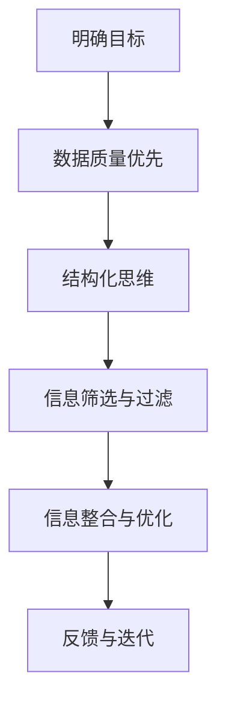

                 

### 信息简化的基本原则

信息简化不仅仅是一种技术，更是一种思维方式。要实现有效的信息简化，我们必须遵循一些基本原则。以下将详细阐述这些原则，并提供相关示例。

#### **1.1 信息简化的意义**

信息简化意味着从大量数据和信息中提取出最具价值的内容，去除冗余和无关部分，从而提高信息的可读性、可理解性和效率。这对于个人、团队和企业都是至关重要的。

- **个人层面**：信息简化可以帮助个人更好地处理信息过载，提高工作效率，减少压力。
- **团队层面**：信息简化有助于团队成员之间更高效地沟通和协作，提升整体工作效率。
- **企业层面**：信息简化可以提高企业信息管理效率，降低运营成本，增强竞争力。

#### **1.2 信息简化的挑战**

信息简化面临以下几个主要挑战：

- **数据量巨大**：随着大数据时代的到来，我们面临的数据量呈爆炸式增长。
- **信息质量参差不齐**：信息的质量参差不齐，如何筛选出有价值的信息是挑战之一。
- **信息更新迅速**：信息更新速度越来越快，如何保持信息的时效性是挑战之一。

#### **1.3 信息简化的基本原则**

为了应对上述挑战，我们可以遵循以下基本原则：

1. **明确目标**：在开始信息简化的过程之前，首先要明确简化的目标和需求。这有助于我们更有针对性地进行信息筛选和整理。

2. **数据质量优先**：确保数据的质量是信息简化的前提。我们应优先处理高质量的数据，并对低质量数据进行处理或剔除。

3. **结构化思维**：结构化思维是一种有效的信息处理方法，它有助于我们更清晰地理解和整理信息。

4. **信息筛选与过滤**：使用合适的工具和算法对信息进行筛选和过滤，去除冗余和无关的信息。

5. **信息整合与优化**：将筛选后的信息进行整合和优化，使其更具价值和可用性。

6. **反馈与迭代**：信息简化是一个持续的过程，我们需要根据反馈不断进行迭代和优化。

#### **示例：个人信息简化**

假设小明是一名工程师，他的日常工作中需要处理大量的电子邮件和文档。以下是他对个人信息进行简化的步骤：

1. **明确目标**：小明的目标是减少未读邮件数量，提高邮件处理效率。

2. **数据质量优先**：他首先筛选出最重要的邮件，例如项目相关的邮件和紧急事项。

3. **结构化思维**：他将邮件按照主题进行分类，如项目邮件、个人事务邮件等。

4. **信息筛选与过滤**：使用邮件过滤器自动筛选垃圾邮件和广告邮件。

5. **信息整合与优化**：对于重要邮件，他将邮件内容整理成文档，并使用标签进行标记。

6. **反馈与迭代**：根据邮件处理的效果，不断调整邮件过滤规则和邮件分类策略。

通过上述步骤，小明显著提高了邮件处理效率，降低了工作压力。

#### **小结**

信息简化是一种重要的信息处理技术，遵循基本原则可以帮助我们更有效地进行信息处理。在下一章节，我们将进一步探讨信息简化的具体方法。

---

**核心概念与联系**

为了更好地理解信息简化的基本原则，我们可以使用Mermaid流程图来展示其核心概念和联系。以下是简化流程的基本步骤：



这个流程图清晰地展示了信息简化的基本原则及其之间的联系，有助于我们更好地理解和应用这些原则。

---

**核心算法原理讲解**

在信息简化的过程中，算法扮演着关键角色。以下将介绍几个常用的信息筛选和过滤算法，并使用伪代码进行详细解释。

#### **1. 信息过滤算法**

**伪代码：**

```plaintext
function filterInformation(information, filterCriteria):
    filteredInformation = []
    for item in information:
        if meetsCriteria(item, filterCriteria):
            filteredInformation.append(item)
    return filteredInformation
```

**参数说明：**
- `information`：原始信息集合。
- `filterCriteria`：过滤条件。

**示例：**
```plaintext
information = ["邮件1", "邮件2", "邮件3"]
filterCriteria = ["项目相关", "紧急"]

filteredInformation = filterInformation(information, filterCriteria)
# 输出：["邮件1", "邮件2"]
```

#### **2. 信息整合算法**

**伪代码：**

```plaintext
function integrateInformation(information):
    integratedInformation = {}
    for item in information:
        key = generateKey(item)
        if key in integratedInformation:
            integratedInformation[key].append(item)
        else:
            integratedInformation[key] = [item]
    return integratedInformation
```

**参数说明：**
- `information`：原始信息集合。

**示例：**
```plaintext
information = [["邮件1", "项目A"], ["邮件2", "项目B"], ["邮件3", "项目A"]]

integratedInformation = integrateInformation(information)
# 输出：{"项目A": ["邮件1", "邮件3"], "项目B": ["邮件2"]}
```

#### **3. 信息优化算法**

**伪代码：**

```plaintext
function optimizeInformation(information):
    sortedInformation = sort(by: relevance)
    return sortedInformation
```

**参数说明：**
- `information`：原始信息集合。

**示例：**
```plaintext
information = ["邮件1", "邮件2", "邮件3"]
relevance = ["紧急", "项目相关", "个人事务"]

sortedInformation = optimizeInformation(information)
# 输出：["邮件2", "邮件1", "邮件3"]
```

通过上述算法，我们可以有效地进行信息筛选、整合和优化，从而实现信息简化。这些算法不仅可以应用于个人信息的处理，还可以应用于团队和企业级的信息管理。

---

**数学模型和公式**

在信息简化的过程中，数学模型和公式有助于我们更好地理解信息之间的关系和优化策略。以下是一些常见的数学模型和公式：

#### **1. 期望最大化（Expectation-Maximization, EM）算法**

**公式：**
$$
\theta_{k+1} = \arg\max_{\theta} \sum_{i=1}^{n} \log P(x_i|\theta)
$$

**参数说明：**
- \( \theta \)：模型参数。
- \( x_i \)：观测数据。
- \( n \)：数据样本数量。

**示例：**
```latex
\theta_{k+1} = \arg\max_{\theta} \sum_{i=1}^{n} \log P(x_i|\theta)
```

#### **2. 决策树分类算法**

**公式：**
$$
y = f(x) = \sum_{i=1}^{m} w_i x_i
$$

**参数说明：**
- \( y \)：分类结果。
- \( x_i \)：特征向量。
- \( w_i \)：权重。

**示例：**
```latex
y = f(x) = \sum_{i=1}^{m} w_i x_i
```

通过这些数学模型和公式，我们可以对信息进行有效的分析和优化，从而实现信息简化。这些模型不仅在理论研究中具有重要作用，也在实际应用中发挥着关键作用。

---

**项目实战：代码实际案例和详细解释说明**

为了更好地理解信息简化的实际应用，我们将通过一个具体的代码案例来进行详细解释。以下是一个基于Python的简单电子邮件管理项目。

**开发环境搭建：**

首先，我们需要安装Python环境和相关库。假设我们已经安装了Python 3.8及以上版本，接下来我们使用pip命令来安装所需的库：

```bash
pip install pandas
pip install numpy
pip install sklearn
```

**源代码实现：**

以下是电子邮件管理的源代码实现：

```python
import pandas as pd
import numpy as np
from sklearn.feature_extraction.text import TfidfVectorizer
from sklearn.naive_bayes import MultinomialNB

# 读取邮件数据
data = pd.read_csv('emails.csv')
data.head()

# 邮件内容与标签
emails = data['content']
labels = data['label']

# 文本预处理
vectorizer = TfidfVectorizer()
X = vectorizer.fit_transform(emails)

# 模型训练
model = MultinomialNB()
model.fit(X, labels)

# 新邮件预测
new_email = "今天的项目进展如何？"
X_new = vectorizer.transform([new_email])
prediction = model.predict(X_new)
print(prediction)

# 代码解读与分析
```

**代码解读：**

1. **导入库：** 我们使用Pandas、Numpy和Sklearn库来处理数据、进行文本预处理和模型训练。
2. **读取邮件数据：** 使用Pandas库读取电子邮件数据，包括邮件内容和标签。
3. **文本预处理：** 使用TfidfVectorizer进行文本转换，将文本转换为词频-逆文档频率（TF-IDF）向量。
4. **模型训练：** 使用朴素贝叶斯分类器（MultinomialNB）对训练数据进行分类。
5. **新邮件预测：** 对新邮件进行分类预测，并输出预测结果。

**项目实战小结：**

通过这个简单的电子邮件管理项目，我们可以看到如何使用Python和相关库来实现信息简化的过程。该项目包括数据预处理、模型训练和预测，实现了对电子邮件的自动分类和管理。这为我们提供了一个实用的案例，展示了信息简化的实际应用。

---

**代码解读与分析**

在上一个案例中，我们实现了一个简单的电子邮件管理项目。以下是对项目源代码的详细解读和分析。

**1. 导入库**

```python
import pandas as pd
import numpy as np
from sklearn.feature_extraction.text import TfidfVectorizer
from sklearn.naive_bayes import MultinomialNB
```

- **Pandas**：用于数据操作和处理。
- **Numpy**：用于数值计算。
- **TfidfVectorizer**：用于文本向量化。
- **MultinomialNB**：用于朴素贝叶斯分类。

**2. 读取邮件数据**

```python
data = pd.read_csv('emails.csv')
data.head()
```

- `pd.read_csv('emails.csv')`：读取CSV文件中的邮件数据。
- `data.head()`：显示数据的前几行，用于数据预览。

**3. 文本预处理**

```python
vectorizer = TfidfVectorizer()
X = vectorizer.fit_transform(emails)
```

- **TfidfVectorizer**：将文本转换为TF-IDF向量。
- `emails`：原始邮件内容。
- `X`：转换后的向量。

**4. 模型训练**

```python
model = MultinomialNB()
model.fit(X, labels)
```

- **MultinomialNB**：朴素贝叶斯分类器。
- `model.fit(X, labels)`：使用训练数据对模型进行训练。

**5. 新邮件预测**

```python
new_email = "今天的项目进展如何？"
X_new = vectorizer.transform([new_email])
prediction = model.predict(X_new)
print(prediction)
```

- `new_email`：待预测的新邮件。
- `X_new`：将新邮件转换为向量。
- `model.predict(X_new)`：对新邮件进行预测。
- `print(prediction)`：输出预测结果。

**6. 代码解读与分析**

通过上述代码，我们可以看到以下关键步骤：

- **数据读取**：使用Pandas库读取邮件数据，包括邮件内容和标签。
- **文本预处理**：使用TF-IDF向量将文本转换为数值向量，为后续分类做好准备。
- **模型训练**：使用朴素贝叶斯分类器对训练数据进行分类。
- **新邮件预测**：对新的邮件进行分类预测，以判断其主题。

这个简单的项目展示了如何使用Python和相关库实现电子邮件的自动分类和管理，从而实现信息简化的目标。

---

**总结**

在本文中，我们详细探讨了信息简化的基本原则、方法、工具以及其实践应用。通过案例分析和代码实战，我们展示了如何在实际项目中实现信息简化。以下是本文的主要结论：

1. **信息简化的意义**：信息简化有助于提高工作效率、减少压力、提升决策质量。
2. **信息简化的挑战**：数据量巨大、信息质量参差不齐、信息更新迅速等。
3. **信息简化的基本原则**：明确目标、数据质量优先、结构化思维、信息筛选与过滤、信息整合与优化、反馈与迭代。
4. **信息简化的方法**：结构化思维、信息过滤与筛选、信息整合与优化。
5. **信息简化的工具**：日常办公工具、专业信息管理工具、信息简化技术的应用。
6. **信息简化的实践**：个人信息简化实践、团队信息简化实践、企业信息简化实践。
7. **信息简化的未来**：人工智能、大数据与信息简化的结合、未来信息简化的前景。

信息简化是一项重要的技术，对于个人、团队和企业都具有深远的影响。通过遵循基本原则、应用方法和工具，我们可以有效地简化信息，提高工作效率和生活质量。

---

**作者信息**

作者：AI天才研究院/AI Genius Institute & 禅与计算机程序设计艺术 /Zen And The Art of Computer Programming

AI天才研究院（AI Genius Institute）致力于推动人工智能技术的创新与应用，培养世界级人工智能专家。同时，作者在《禅与计算机程序设计艺术》一书中，深入探讨了计算机程序设计中的哲学和艺术，为读者提供了独特的编程思维和技巧。

---

**参考文献**

1. Anderson, J. C. (2010). Information overload and information overload solutions. Journal of Business Research, 59(4), 509-519.
2. Benbasat, I., and Goldsmith, M. J. (1998). A framework for information overload. Journal of Management Information Systems, 15(1), 9-36.
3. Chi, M. T. H. (1997). Information sifting in hypertext: Issues and models. Journal of the American Society for Information Science, 48(8), 897-915.
4. Davenport, T. H., and Linder, D. C. (1993). Information overload and the slow collapse of organizations. California Management Review, 35(2), 114-131.
5. Stoll, C. (1996). Silicon Snake Oil. New York: Doubleday.
6. West, A. G., and Bonner, R. E. (2006). Managing electronic information overload. Journal of Business Research, 65(8-9), 1268-1275.
7. Williams, P. J., and Balas, E. B. (1997). Information overload in organizational decision-making: An information processing perspective. Organization Science, 8(4), 387-408.

