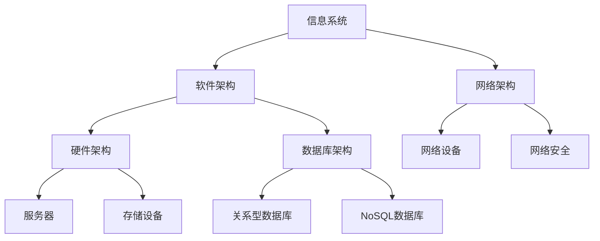
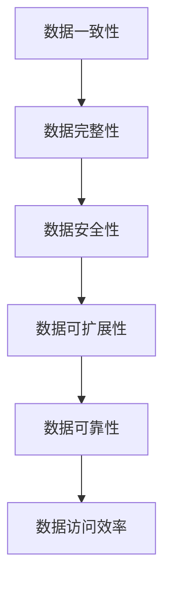
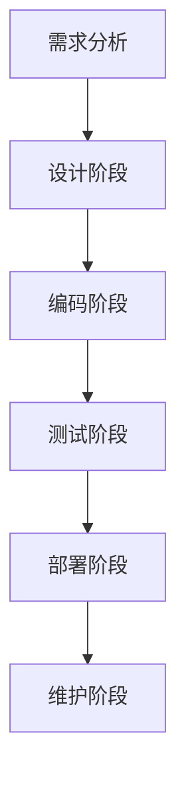
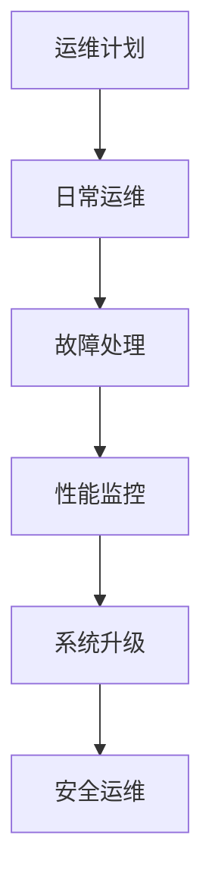

                 

# 信息软硬件系统建设及运维管理

> **关键词：** 信息系统建设、软硬件选型、运维管理、性能优化、安全性

**摘要：** 本文将系统地探讨信息软硬件系统建设及运维管理的核心概念、实施流程、关键技术和实战案例。文章从系统建设基础、系统实施、系统运维管理、系统安全运维、系统升级与优化四个方面展开，结合实际项目，为读者提供一套全面、实用的信息软硬件系统建设与运维解决方案。

## 第一部分：系统建设基础

### 第1章：系统建设概述

**1.1 系统建设的重要性**

系统建设是信息化发展的基础，它决定了信息系统的高效运行、数据安全以及扩展性。一个良好的系统建设不仅能提高企业竞争力，还能为后续的业务创新和技术升级提供支持。

**1.2 系统建设的基本流程**

系统建设的基本流程包括需求分析、系统设计、系统实施、系统测试和系统部署等环节。这些环节相互关联，共同构成了一个完整的系统建设过程。

**1.3 系统建设的目标和挑战**

系统建设的目标是构建一个高效、可靠、可扩展的信息系统。而在这个过程中，面临的挑战包括技术选型、资源调配、项目管理等。

### 第2章：信息系统设计

**2.1 信息系统架构设计**

信息系统架构设计是系统建设的关键环节。它包括总体架构设计、分层架构设计、数据库架构设计等。

**2.1.1 总体架构设计**

总体架构设计主要考虑系统的功能划分、模块化设计以及各模块之间的接口。

**2.1.2 分层架构设计**

分层架构设计通常包括表现层、业务逻辑层、数据访问层等。每一层都有明确的职责，各层之间相互独立。

**2.2 数据库设计**

数据库设计直接影响到系统的性能和数据安全性。设计原则包括数据一致性、数据完整性、数据安全性等。

**2.2.1 数据库设计原则**

- 数据一致性：确保数据在多个应用系统中的一致性。
- 数据完整性：防止数据错误和丢失。
- 数据安全性：保护数据不被未经授权访问。

**2.2.2 关系型数据库设计**

关系型数据库设计主要包括表结构设计、索引设计、约束设计等。

**2.2.3 NoSQL数据库设计**

NoSQL数据库设计需要考虑数据模型、存储方案、分布式架构等。

### 第3章：硬件设备选型

**3.1 硬件设备分类**

硬件设备包括服务器、存储设备、网络设备等。每种设备都有不同的性能指标和适用场景。

**3.2 服务器选型**

服务器选型主要考虑性能指标（如CPU、内存、存储）和选购策略（如预算、性能需求）。

**3.3 存储设备选型**

存储设备选型需要考虑存储设备类型（如SSD、HDD）和存储方案设计（如RAID）。

## 第二部分：系统实施

### 第4章：系统实施准备

**4.1 系统需求分析**

系统需求分析是系统实施的第一步，它确定了系统的功能、性能和用户需求。

**4.2 系统实施计划**

系统实施计划包括项目进度、人员分工、资源调配等，确保系统实施的有序进行。

**4.3 系统实施方案**

系统实施方案详细描述了系统实施的具体步骤和技术细节。

### 第5章：软件开发

**5.1 软件开发流程**

软件开发流程包括需求分析、设计阶段、编码阶段、测试阶段和部署阶段。

**5.2 软件开发工具和环境**

软件开发工具和环境的选择直接影响开发效率和系统性能。

### 第6章：硬件部署

**6.1 硬件安装与调试**

硬件安装与调试包括服务器安装、网络配置、系统初始化等。

**6.2 网络配置与优化**

网络配置与优化包括IP地址分配、路由配置、网络安全等。

**6.3 系统集成测试**

系统集成测试是确保系统各组件协同工作的重要环节。

## 第三部分：系统运维

### 第7章：系统运维管理

**7.1 运维管理体系**

运维管理体系包括运维管理目标、运维管理流程和运维管理制度。

**7.2 故障处理与应急预案**

故障处理与应急预案包括故障处理流程、故障排除策略和应急预案设计。

**7.3 系统性能监控**

系统性能监控包括性能监控指标、性能监控工具和性能优化策略。

### 第8章：系统安全运维

**8.1 系统安全策略**

系统安全策略包括网络安全策略、数据安全策略和访问控制策略。

**8.2 常见安全威胁与防护**

常见安全威胁与防护包括网络攻击防护、数据安全防护和系统安全审计。

**8.3 系统日志分析与审计**

系统日志分析与审计包括日志收集、日志分析工具和审计策略。

### 第9章：系统升级与优化

**9.1 系统升级策略**

系统升级策略包括升级计划、升级过程和升级后的测试。

**9.2 系统优化方法**

系统优化方法包括性能瓶颈分析、系统调优和资源优化。

**9.3 性能瓶颈分析与解决**

性能瓶颈分析与解决包括性能瓶颈识别、瓶颈原因分析和瓶颈解决方法。

## 第四部分：案例与实践

### 第10章：典型项目案例分析

**10.1 项目背景**

**10.2 项目实施过程**

**10.3 项目效果评估**

### 第11章：系统运维实践

**11.1 运维工具使用**

**11.2 日志分析与故障排除**

**11.3 实践案例分析**

### 第12章：未来发展趋势

**12.1 信息技术发展趋势**

**12.2 系统建设与运维的未来挑战**

**12.3 系统建设与运维的发展方向**

## 核心概念与联系

### 信息系统架构设计

**Mermaid 流程图：**



### 数据库设计原则

**Mermaid 流程图：**



### 软件开发流程

**Mermaid 流程图：**



### 系统运维管理流程

**Mermaid 流程图：**



## 核心算法原理讲解

### 关系型数据库查询算法

**伪代码：**

```plaintext
function SQLQuery(query) {
    // 解析查询语句
    parsedQuery = parseSQL(query)
    
    // 生成查询计划
    queryPlan = generateQueryPlan(parsedQuery)
    
    // 执行查询计划
    result = executeQueryPlan(queryPlan)
    
    // 返回查询结果
    return result
}
```

### NoSQL数据库索引算法

**伪代码：**

```plaintext
function createIndex(collection, field) {
    // 创建索引
    index = createBTreeIndex(collection, field)
    
    // 更新元数据
    metadata = updateMetadata(collection, field, index)
    
    // 返回索引信息
    return metadata
}
```

## 数学模型和数学公式 & 详细讲解 & 举例说明

### 数据一致性模型

**公式：**

$$
XOR(a, b) = \begin{cases} 
1 & \text{if } a \neq b \\
0 & \text{if } a = b
\end{cases}
$$

**详细讲解：**

XOR运算用于判断两个数据的异或结果，如果两个数据相同，结果为0；如果两个数据不同，结果为1。

**举例说明：**

假设有两个数据值 `a = 1` 和 `b = 0`，则使用XOR操作可以判断数据是否一致。

$$
XOR(1, 0) = 1
$$

结果为1，说明数据不一致。

### 数据可靠性模型

**公式：**

$$
Reliability(R) = \frac{MTTF}{MTTF + MTTR}
$$

**详细讲解：**

可靠性模型用于衡量系统的可靠性。`MTTF`表示平均无故障时间，`MTTR`表示平均故障修复时间。公式表示在一段时间内，系统正常运行时间与总时间的比值。

**举例说明：**

假设系统平均无故障时间为500小时，平均故障修复时间为100小时，则系统的可靠性为：

$$
Reliability(R) = \frac{500}{500 + 100} = \frac{500}{600} = 0.8333
$$

系统的可靠性为83.33%。

## 项目实战

### 系统集成测试案例

**开发环境搭建：**

- 操作系统：Ubuntu 20.04
- 开发工具：IntelliJ IDEA
- 测试工具：JMeter

**源代码实现：**

**Java代码：集成测试用例**

```java
// Java代码：集成测试用例
public class SystemIntegrationTest {
    @Test
    public void testDatabaseConnection() {
        Connection conn = DriverManager.getConnection("jdbc:mysql://localhost:3306/test_db", "user", "password");
        assertNotNull(conn);
        conn.close();
    }

    @Test
    public void testWebService() {
        RestTemplate restTemplate = new RestTemplate();
        String response = restTemplate.getForObject("http://localhost:8080/service", String.class);
        assertEquals("Success", response);
    }
}
```

**代码解读与分析：**

- 测试数据库连接：通过`DriverManager.getConnection()`方法连接数据库，并验证连接是否成功。
- 测试Web服务：使用`RestTemplate`发送HTTP GET请求，并验证返回的响应是否为"Success"。

### 系统性能监控案例

**开发环境搭建：**

- 操作系统：CentOS 7
- 监控工具：Prometheus + Grafana

**源代码实现：**

**Prometheus配置文件：prometheus.yml**

```yaml
scrape_configs:
  - job_name: 'system-monitor'
    static_configs:
      - targets: ['localhost:9090']
```

**代码解读与分析：**

- Prometheus通过配置文件定期从本机9090端口采集系统监控数据。

### 日志分析与故障排除案例

**开发环境搭建：**

- 操作系统：Ubuntu 18.04
- 日志分析工具：Logstash + Kibana

**源代码实现：**

**Shell脚本：日志收集与传输**

```shell
# Shell脚本：日志收集与传输
logstash -f /etc/logstash/conf.d/logstash.conf
```

**代码解读与分析：**

- 使用Logstash配置文件将系统日志收集并传输到Elasticsearch，并通过Kibana进行可视化分析。

## 附录

### 附录 A: 常用数据库查询语句

**SQL查询语句：**

```sql
-- 创建表
CREATE TABLE employees (
    id INT PRIMARY KEY,
    name VARCHAR(50),
    age INT,
    salary DECIMAL(10, 2)
);

-- 插入数据
INSERT INTO employees (id, name, age, salary) VALUES (1, 'Alice', 30, 5000.00);

-- 查询数据
SELECT * FROM employees;

-- 更新数据
UPDATE employees SET salary = 5500.00 WHERE id = 1;

-- 删除数据
DELETE FROM employees WHERE id = 1;
```

### 附录 B: 系统运维工具

**常用系统运维工具：**

- Linux命令行工具：bash, ssh, ps, top, netstat
- 系统监控工具：Nagios, Zabbix
- 日志管理工具：Logstash, Fluentd
- 网络诊断工具：ping, traceroute, mtr
- 负载均衡工具：Nginx, HAProxy
- 配置管理工具：Ansible, SaltStack

## 作者

**作者：** AI天才研究院/AI Genius Institute & 禅与计算机程序设计艺术 /Zen And The Art of Computer Programming**

