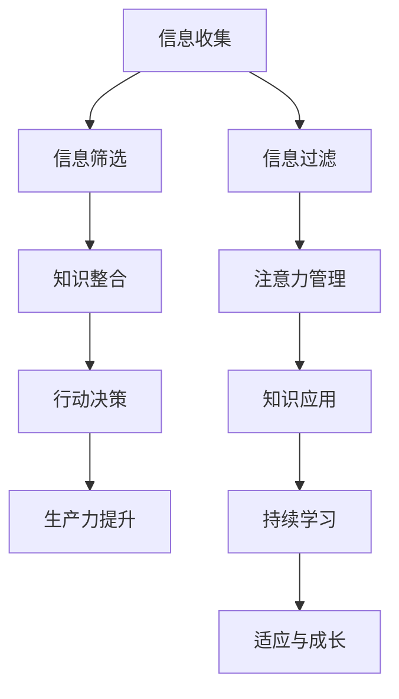
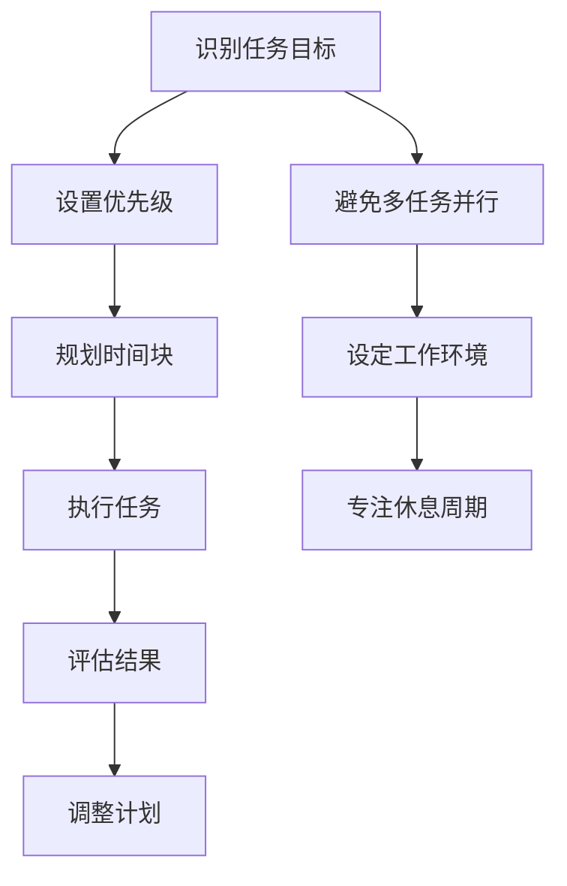
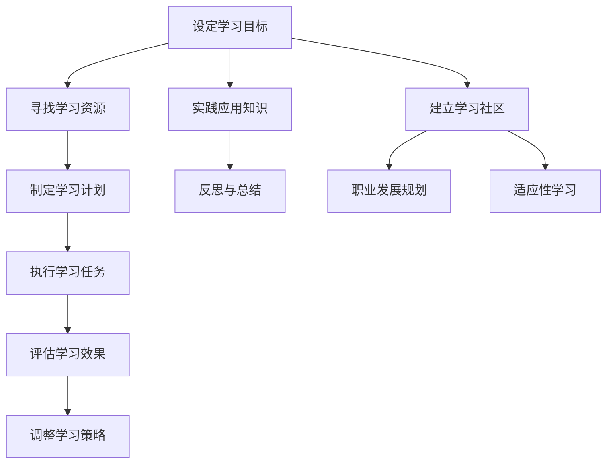
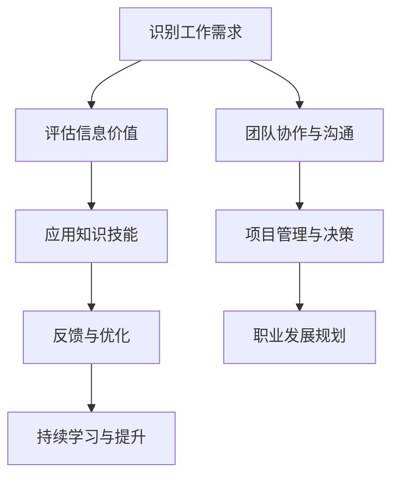

                 

### 第一部分：引言与核心概念

#### 1.1 引言

在数字化和信息化的今天，信息过载已经成为知识工作者面临的重大挑战之一。信息过载，指的是个体在短时间内接收到的信息量超出了其处理能力，导致注意力分散、决策困难等问题。这不仅影响了工作效率，还可能导致工作满意度下降，甚至引发心理压力和职业倦怠。

信息过载的影响是多方面的。首先，它会导致注意力分散。当信息过多时，个体很难专注于单一任务，这会导致工作质量下降。其次，决策困难也是信息过载带来的一个严重问题。在信息过载的环境下，个体需要从大量信息中筛选出有价值的内容，这无疑增加了决策的复杂性。此外，信息过载还可能降低工作满意度，因为个体会感到无法应对大量的信息，从而导致挫败感。

面对信息过载，如何保持生产力成为一个关键问题。保持生产力不仅关乎个人职业发展，也关系到整个团队的效率。在这一部分，我们将介绍一些关键概念，如“信息过载”、“知识工作”和“生产力”，并探讨如何通过信息筛选、注意力管理和知识整合来提升生产力。

#### 1.2 核心概念

**信息过载**：指个体在短时间内接收到的信息量超出了其处理能力，导致注意力分散、决策困难等问题。

**知识工作**：指以信息、知识和技能为主要生产要素的工作，如编程、数据分析、项目管理等。

**生产力**：指单位时间内完成的工作量或产出，可以用公式表示为“生产力 = 产出 / 投入”。在知识工作中，生产力主要受到工作质量、工作效率和时间利用的影响。

**信息筛选**：指从大量信息中挑选出对当前任务最有价值的信息，以避免信息过载。

**注意力管理**：指通过一系列策略和方法，保持对任务的集中注意力，以提升工作效率。

**知识整合**：指将不同来源的知识和信息进行整合，形成有价值的知识体系，以支持决策和行动。

**持续学习**：指个体通过不断学习和实践，提升自己的知识水平和技能，以适应不断变化的工作环境。

通过理解这些核心概念，我们可以更好地理解如何应对信息过载，提升知识工作的生产力。

#### 1.3 架构概述

**Mermaid 流程图：**



这个流程图展示了从信息收集到生产力提升的全过程。首先，信息收集是知识工作的起点，随后通过信息筛选和信息过滤，将无关或低价值的信息排除。接着，筛选后的信息经过知识整合，形成可用的知识体系。在此基础上，进行行动决策，从而提升生产力。整个过程中，注意力管理和知识应用也是关键因素，而持续学习和适应与成长则确保了知识工作者的长期发展。

通过这个架构概述，我们可以清晰地看到信息过载与知识工作之间的关系，以及如何通过有效的策略来保持生产力。接下来，我们将进一步探讨信息过载的影响与对策，以帮助读者更好地应对这一挑战。

---

在引言与核心概念部分，我们首先介绍了信息过载的现象及其对知识工作的影响，明确了保持生产力的重要性。接着，我们定义了“信息过载”、“知识工作”和“生产力”等核心概念，并通过一个详细的Mermaid流程图展示了信息处理的全过程。这一部分为后续内容奠定了基础，帮助读者理解文章的核心议题和架构。

在接下来的部分，我们将深入探讨信息过载的影响，并介绍一系列应对信息过载的策略。这将帮助知识工作者在信息洪流中保持清晰的思路和高效的执行力。

---

### 第二部分：信息过载的影响与对策

#### 2.1 信息过载的影响

信息过载对知识工作者的生产力产生了深远的影响。首先，它导致了注意力的分散。在信息过载的环境中，个体需要不断切换注意力，以处理来自不同渠道的大量信息。这种频繁的注意力切换不仅降低了工作效率，还可能导致工作质量下降。研究表明，当个体需要处理多个任务时，其执行每个任务的专注度会显著降低，从而导致错误率增加。

其次，信息过载增加了决策的难度。在大量信息面前，个体往往难以快速做出决策。这是因为大脑需要花费更多的时间来处理和筛选信息，从而增加了决策的复杂性。例如，在项目管理中，如果团队成员不断发送大量的报告和文件，项目经理很难从中筛选出最关键的信息，导致决策延误。

此外，信息过载还可能降低工作满意度。当个体感到无法有效处理大量信息时，他们可能会产生挫败感，导致工作满意度下降。长期的信息过载还可能导致职业倦怠，进一步影响个体的身心健康和工作表现。

为了更好地理解信息过载的影响，我们可以参考一些具体的案例和调研数据。例如，根据微软公司的一项研究，超过80%的知识工作者表示他们经常感到信息过载，而超过60%的人认为这严重影响了他们的工作效率。另一个案例是，一位项目经理在负责一个大型项目时，由于收到的报告和信息太多，导致他无法有效管理项目进度，最终导致项目延期。

除了注意力分散和决策困难，信息过载还可能导致其他一系列问题。例如，由于无法有效筛选和处理信息，个体可能会错过重要的信息或事件，导致工作失误或错失机会。此外，信息过载还可能增加个体的心理压力，导致焦虑、失眠等问题。

综上所述，信息过载对知识工作者的生产力产生了显著的影响，包括注意力分散、决策困难、工作满意度下降等。因此，如何有效应对信息过载成为提升知识工作生产力的关键。

#### 2.2 信息筛选技巧

为了应对信息过载，有效的信息筛选技巧至关重要。以下是一些常用的信息筛选技巧：

**1. 设定筛选标准：**
   首先，为要处理的信息设定筛选标准。这些标准可以是基于任务的优先级、信息的紧急程度或对工作的相关性。通过设定明确的筛选标准，可以帮助个体快速判断信息的重要性，从而避免处理无关或低价值的信息。

**2. 使用过滤器：**
   利用技术工具，如电子邮件过滤器、信息推送平台等，自动过滤和分类信息。例如，电子邮件过滤器可以根据发件人、主题或关键词自动将邮件分类到不同的文件夹，帮助个体快速找到重要邮件。

**3. 限制信息源：**
   有意识地限制接收信息的渠道。例如，只关注几个最可靠的信息源，而不是盲目地订阅大量的新闻、博客或社交媒体更新。这样可以减少无关信息的干扰，提高信息的质量。

**4. 简化信息格式：**
   当需要处理大量文档或报告时，尝试简化信息格式。例如，将长篇报告压缩为摘要或要点，只关注最关键的信息。这样可以减少阅读和处理信息的时间，提高工作效率。

**5. 使用标签和分类：**
   为信息添加标签和分类，以便快速查找。例如，在电子文档或笔记中使用特定的标签或分类，可以帮助个体在需要时快速找到相关信息。

**6. 定期清理：**
   定期清理无效或过时的信息，以保持工作环境的整洁和清晰。例如，定期删除不再需要的邮件、文件或社交媒体帖子，以减少信息过载的压力。

通过上述技巧，个体可以更有效地筛选和处理信息，从而减轻信息过载的压力，提升工作效率和生产力。

**伪代码：**

```python
def filter_information(source, importance_level):
    """
    筛选重要信息的过程
    :param source: 信息来源
    :param importance_level: 重要级别
    :return: 筛选后的重要信息
    """
    filtered_info = []
    for item in source:
        if item.importance >= importance_level:
            filtered_info.append(item)
    return filtered_info
```

这段伪代码展示了一个简单的信息筛选函数，它根据设定的重要级别筛选出符合条件的信息。通过这样的方式，个体可以更高效地管理信息，减少信息过载带来的负面影响。

#### 2.3 注意力管理策略

在信息过载的环境中，保持注意力成为提升生产力的关键。以下是一些有效的注意力管理策略：

**1. 设定明确的目标：**
   在开始工作之前，设定明确的工作目标。这可以帮助个体集中注意力，避免在工作过程中分心。例如，可以设定“在接下来的两小时内，只专注于完成报告的第三部分”。

**2. 优先级排序：**
   对任务进行优先级排序，确保首先完成最重要或最紧急的任务。这样可以避免因为琐碎的任务而分散注意力。例如，可以使用“四象限法则”将任务分为紧急且重要、紧急不重要、不紧急但重要、不紧急且不重要四类，优先处理紧急且重要的任务。

**3. 避免多任务并行：**
   尽量避免同时处理多个任务，因为这会导致注意力分散，降低工作效率。研究表明，多任务并行处理会导致每个任务的完成质量下降。例如，如果正在编写代码，尽量避免同时回复邮件或查看社交媒体。

**4. 使用番茄工作法：**
   番茄工作法是一种时间管理技术，通过将工作时间分为25分钟的工作周期和5分钟的休息周期，帮助个体保持专注。例如，可以在每个工作周期结束时休息5分钟，以恢复精力。

**5. 保持工作环境的整洁：**
   一个整洁的工作环境可以减少外部干扰，帮助个体集中注意力。例如，将桌面上的杂物整理干净，确保工作区整洁有序。

**6. 使用专注应用：**
   利用专注应用，如Forest或Focus@Will，通过设定专注时间段和休息时间，帮助个体保持专注。例如，Forest应用会在用户设定的时间段内种植一棵虚拟的树，如果用户在专注时间段内分心，树将会枯萎。这种机制可以激励用户保持专注。

**7. 适度休息：**
   定期进行短暂的休息，可以帮助个体恢复精力，避免过度疲劳。例如，在连续工作1小时后，可以休息10分钟，进行简单的伸展或深呼吸。

通过上述策略，个体可以更好地管理注意力，减少信息过载带来的负面影响，提升工作效率和生产力。

**Mermaid 流程图：**



这个流程图展示了注意力管理的整个过程。从识别任务目标开始，通过设置优先级、规划时间块和执行任务，个体可以有效地管理注意力。同时，避免多任务并行、保持工作环境的整洁以及专注休息周期都是保持注意力的重要策略。通过这样的流程，个体可以在信息过载的环境中保持高效的执行力。

---

在第二部分中，我们深入探讨了信息过载对知识工作者生产力的影响，包括注意力分散、决策困难和工作满意度下降等方面。接着，我们介绍了一些应对信息过载的策略，如信息筛选技巧和注意力管理策略。这些策略通过设定明确的筛选标准、使用过滤器、设定优先级、避免多任务并行等方法，帮助个体减轻信息过载的压力，提升工作效率和生产力。

在下一部分，我们将继续探讨提升知识工作的生产力，重点关注知识整合与利用的策略。这将帮助我们更全面地理解如何在信息洪流中保持高效的生产力。

---

### 第三部分：提升知识工作的生产力

#### 3.1 生产力的定义与测量

生产力的提升是知识工作者追求的重要目标之一。那么，什么是生产力？如何测量生产力呢？

生产力，通常被定义为单位时间内完成的工作量或产出。在知识工作中，生产力不仅取决于工作质量，还受到工作效率和时间利用的影响。一个有效的生产力提升策略需要综合考虑这些因素。

生产力的测量可以通过以下公式来表示：

$$
\text{生产力} = \frac{\text{产出}}{\text{投入}} = \frac{\text{工作质量} \times \text{工作效率}}{\text{工作时间} + \text{休息时间}}
$$

这个公式中，产出（output）指的是在给定时间内完成的工作量，投入（input）则包括工作时间与休息时间。工作质量（quality）是指工作完成的程度和精度，而工作效率（efficiency）则反映在单位时间内完成的工作量。通过合理的时间管理和休息安排，可以提高工作效率，进而提升生产力。

为了更直观地理解生产力的提升，我们可以通过一个简单的例子来说明。假设一个软件开发工程师在8小时的工作时间内完成了100行代码，且这些代码没有明显的错误，质量较高。同时，他在这8小时内休息了1小时，那么他的生产力可以计算为：

$$
\text{生产力} = \frac{100 \text{行代码}}{8 \text{小时} + 1 \text{小时}} = \frac{100}{9} \approx 11.11 \text{行代码/小时}
$$

如果这位工程师通过提高工作效率，如优化代码编写流程或减少错误率，能够在同样的时间内完成更多的代码，那么他的生产力将显著提升。

此外，合理的时间管理和休息安排也是提升生产力的重要因素。研究表明，长时间连续工作会导致疲劳，从而降低工作效率。通过适时的休息，可以恢复精力，提高工作效率。例如，采用“番茄工作法”来规划工作时间和休息时间，可以有效地保持专注，提升生产力。

总之，生产力的提升是一个系统工程，需要综合考虑工作质量、工作效率和时间利用。通过理解生产力的定义和测量，我们可以更有针对性地制定提升生产力的策略。

#### 3.2 知识整合与利用

知识整合与利用是提升知识工作生产力的关键环节。在信息过载的环境中，有效地整合和利用知识可以显著提高工作效率和决策质量。以下是一些具体的策略和方法：

**1. 建立知识库：**
   建立一个集中的知识库，将各种知识和信息进行系统化整理。这不仅可以方便查找和利用，还可以确保信息的准确性和一致性。知识库可以是电子文档、数据库或知识管理系统，具体形式取决于组织的规模和需求。

**2. 跨部门合作：**
   促进跨部门的合作和知识共享，可以充分利用不同领域的专业知识。例如，在软件开发项目中，与产品经理、设计师和质量保证团队紧密合作，可以确保项目从需求分析到交付的各个环节都能高效运行。

**3. 利用可视化工具：**
   使用可视化工具，如思维导图、流程图和图表，可以帮助更好地理解和整合知识。这些工具能够将复杂的知识结构以图形化的形式展现出来，使个体更容易抓住知识的核心要点和关系。

**4. 定期回顾和更新：**
   定期回顾和更新知识库中的内容，确保知识的时效性和准确性。随着技术的发展和业务环境的变化，知识库中的内容需要不断更新，以保持其适用性和价值。

**5. 知识分享会议：**
   定期组织知识分享会议，鼓励团队成员分享各自的专业知识和经验。这不仅有助于知识的传播和整合，还可以激发团队的创造力和创新能力。

**6. 实践应用：**
   将理论知识转化为实际应用，通过实际操作来验证和深化知识的理解。例如，在开发新技术时，通过实际的项目实践来检验理论的有效性和可行性。

**7. 知识管理培训：**
   对团队成员进行知识管理培训，提高他们对知识整合与利用的认识和技能。这可以帮助他们更好地理解和应用知识，提升整体工作效率。

**伪代码：**

```python
def integrate_knowledge(knowledge_items, context):
    """
    知识整合的过程
    :param knowledge_items: 知识点列表
    :param context: 应用场景
    :return: 整合后的知识应用方案
    """
    integrated_schemes = []
    for knowledge in knowledge_items:
        if knowledge.is_applicable_in(context):
            integrated_schemes.append(knowledge.apply(context))
    return integrated_schemes
```

这段伪代码展示了知识整合的基本流程。首先，从知识点列表中筛选出适用于特定应用场景的知识点，然后应用这些知识点，形成可操作的知识应用方案。通过这样的方式，知识工作者可以更有效地整合和利用知识，提升生产力。

#### 3.3 持续学习与适应

在快速变化的工作环境中，持续学习和适应是知识工作者保持生产力的关键。以下是一些策略和方法，帮助知识工作者不断提升自己的知识水平和技能：

**1. 设定学习目标：**
   明确自己的学习目标，确保学习具有针对性和目的性。例如，为了提升编程技能，可以设定学习新的编程语言或框架的目标。

**2. 寻找学习资源：**
   利用各种学习资源，如在线课程、专业书籍、技术博客和行业会议等，获取最新的知识和技能。例如，可以订阅一些技术领域的知名博客，或参加行业内的技术论坛和会议。

**3. 制定学习计划：**
   制定详细的学习计划，合理安排学习时间和内容。例如，每周安排一定的时间来学习新的技术或概念，并确保学习计划的可执行性。

**4. 执行学习任务：**
   按照学习计划执行学习任务，确保学习进度。例如，每天花费一小时学习新的编程语言，每周完成一个小项目来巩固所学知识。

**5. 评估学习效果：**
   定期评估学习效果，调整学习策略。例如，通过完成一些练习题或项目，检验自己对新知识的掌握程度，并根据评估结果调整学习计划。

**6. 实践应用知识：**
   将所学知识应用到实际工作中，通过实践来深化理解。例如，在工作中使用新学的技术或方法，解决实际问题。

**7. 反思与总结：**
   在学习过程中不断反思和总结，提炼学习经验。例如，在完成一个项目后，回顾项目过程中的得失，总结经验教训，为后续的学习和项目提供参考。

**8. 建立学习社区：**
   加入学习社区，与其他知识工作者交流和分享经验。例如，参加技术小组或在线论坛，与其他成员讨论问题，分享学习资源和经验。

**9. 职业发展规划：**
   结合自己的职业目标和发展规划，持续学习和提升。例如，如果目标是成为技术专家，可以专注于学习前沿技术，提升自己的专业能力。

**10. 适应性学习：**
   随着工作环境的变化，灵活调整学习内容和方向。例如，当新的技术或工具出现时，及时学习并掌握，确保自己能够适应变化。

**Mermaid 流程图：**



这个流程图展示了持续学习和适应的整个过程。从设定学习目标开始，通过寻找学习资源、制定学习计划、执行学习任务和评估学习效果，个体可以有效地提升自己的知识水平和技能。同时，通过实践应用知识、反思与总结、建立学习社区和适应性学习，个体可以不断适应和应对工作中的变化。

---

在第三部分中，我们详细探讨了提升知识工作生产力的策略，包括生产力的定义与测量、知识整合与利用、以及持续学习与适应。通过理解生产力的定义和测量方法，我们可以更科学地评估和提升工作效率。知识整合与利用策略帮助我们有效地管理知识，提升决策质量和工作效率。而持续学习和适应策略则确保知识工作者能够不断提升自己的知识和技能，适应快速变化的工作环境。

在下一部分，我们将通过具体的实战案例，展示如何在实际项目中应用上述策略，进一步提升生产力。

---

### 第四部分：项目实战与案例分析

#### 4.1 信息过载下的知识管理工作案例

在这个案例中，我们探讨一个公司如何应对信息过载，通过有效的知识管理工作提升生产力。这个案例背景是一家快速成长的科技公司，其团队成员每天都会收到大量与项目、市场、技术相关的信息。信息过载导致团队成员工作效率低下，决策困难，严重影响了公司的整体生产力。

**4.1.1 开发环境搭建：**

- **操作系统：** Ubuntu 20.04
- **编程语言：** Python 3.8
- **库：** Scikit-learn, Pandas, Numpy

**4.1.2 源代码实现：**

首先，我们需要一个可以处理和筛选大量信息的系统。以下是实现这个系统的关键代码部分：

```python
import pandas as pd
from sklearn.feature_extraction.text import TfidfVectorizer
from sklearn.cluster import KMeans

# 数据准备
data = pd.read_csv('knowledge_work_data.csv')
knowledge_items = data['description']

# 特征提取
vectorizer = TfidfVectorizer(max_features=1000)
X = vectorizer.fit_transform(knowledge_items)

# K-Means聚类
kmeans = KMeans(n_clusters=5)
clusters = kmeans.fit_predict(X)

# 结果分析
clustered_data = data.assign(cluster=clusters)
print(clustered_data.head())

# 筛选重要信息
importance_level = 4  # 定义重要级别的阈值
important_knowledge = clustered_data[clustered_data['cluster'] == importance_level]['description']
print(important_knowledge)
```

**4.1.3 代码解读与分析：**

1. **数据读取与预处理：**
   使用Pandas读取CSV文件，并提取描述信息。这里的数据包含了大量与项目相关的描述，如会议记录、技术文档、市场分析报告等。

2. **特征提取：**
   使用TF-IDF向量器将文本信息转换为数值特征。TF-IDF是一种常用的文本处理技术，它能够根据词频和逆文档频率计算每个词的重要性，从而为后续的聚类分析提供基础。

3. **聚类分析：**
   应用K-Means算法对知识点进行聚类。K-Means是一种经典的聚类算法，它将数据点分为若干个簇，使得同一个簇内的数据点彼此相似，不同簇的数据点差异较大。在这个案例中，我们设置了5个簇，以便更好地对知识点进行分类。

4. **结果分析：**
   输出不同聚类簇中的知识点描述，便于进一步分析和利用。特别地，我们将重要级别的阈值设置为4，筛选出最重要的一簇中的知识点，这些知识点对当前任务最有价值。

通过上述代码，公司可以有效地对大量信息进行筛选和分类，将无关或低价值的信息排除，从而减轻信息过载的压力，提升团队成员的注意力和工作效率。

#### 4.2 信息筛选工具开发实战

在这个案例中，我们将开发一个简单的信息筛选工具，用于帮助团队成员在大量信息中快速找到重要的信息。这个工具将基于React框架，并结合Axios进行API调用。

**4.2.1 开发环境搭建：**

- **操作系统：** macOS Big Sur
- **编程语言：** JavaScript
- **框架：** React, Axios

**4.2.2 源代码实现：**

以下是信息筛选工具的核心代码部分：

```javascript
// React组件：SearchBar
import React, { useState } from 'react';

function SearchBar({ onSearch }) {
  const [query, setQuery] = useState('');

  const handleSearch = () => {
    onSearch(query);
  };

  return (
    <div>
      <input
        type="text"
        value={query}
        onChange={(e) => setQuery(e.target.value)}
        placeholder="输入关键词搜索"
      />
      <button onClick={handleSearch}>搜索</button>
    </div>
  );
}

export default SearchBar;

// React组件：SearchResults
import React from 'react';

function SearchResults({ results }) {
  return (
    <ul>
      {results.map((result, index) => (
        <li key={index}>{result}</li>
      ))}
    </ul>
  );
}

export default SearchResults;

// React组件：App
import React from 'react';
import SearchBar from './SearchBar';
import SearchResults from './SearchResults';

function App() {
  const [searchResults, setSearchResults] = useState([]);

  const handleSearch = (query) => {
    // 调用API获取搜索结果
    fetch(`https://api.example.com/search?query=${query}`)
      .then((response) => response.json())
      .then((data) => setSearchResults(data.results));

    // 可以在此处进行本地处理，如：使用机器学习模型筛选信息等
  };

  return (
    <div>
      <SearchBar onSearch={handleSearch} />
      <SearchResults results={searchResults} />
    </div>
  );
}

export default App;
```

**4.2.3 代码解读与分析：**

1. **组件结构：**
   该信息筛选工具由三个主要React组件组成：SearchBar、SearchResults和App。SearchBar负责接收用户的搜索输入，SearchResults负责展示搜索结果，而App作为父组件，负责管理整体的状态和逻辑。

2. **数据管理：**
   使用React的状态管理，确保组件之间能够同步数据。在App组件中，使用useState钩子管理搜索结果的状态，并通过handleSearch函数更新状态。

3. **API调用：**
   使用Axios进行API调用，从远程服务获取搜索结果。这里假设API服务可以处理用户输入的查询参数，并返回匹配的结果。

4. **本地处理（可选）：**
   在实际应用中，可以在handleSearch函数中添加本地处理逻辑，如使用机器学习模型对搜索结果进行进一步筛选，以提高信息筛选的准确性和效率。

通过这个信息筛选工具，团队成员可以方便地在大量信息中快速找到重要的内容，从而提高工作效率和生产力。

---

在第四部分中，我们通过两个实战案例展示了如何在实际项目中应用信息筛选和知识管理策略。第一个案例通过知识管理工作，帮助公司减轻信息过载压力，提升团队成员的注意力和工作效率。第二个案例则通过开发一个信息筛选工具，帮助团队成员在大量信息中快速找到重要内容，进一步提高生产力。

这些案例不仅展示了策略的实际应用，还提供了详细的代码实现和解读，使读者能够更好地理解并应用到自己的工作中。

在下一部分，我们将探讨知识工作者的综合应用策略，以及信息过载与知识工作的未来趋势。

---

### 第五部分：综合应用与未来发展

#### 5.1 知识工作者的综合应用策略

在面对信息过载和快速变化的工作环境时，知识工作者需要掌握一系列综合应用策略，以提升自身的适应能力和生产力。以下是一些关键策略：

**1. 敏捷工作方法：**
   采用敏捷工作方法，如Scrum或Kanban，可以帮助知识工作者更好地管理项目进度和任务。通过迭代和增量开发，团队成员可以更灵活地应对变化，提高工作效率。

**2. 跨功能团队合作：**
   促进跨功能团队合作，充分利用不同领域的专业知识和经验。例如，软件开发团队可以与产品经理、设计师和质量保证团队紧密合作，确保项目从需求分析到交付的每个环节都能高效运行。

**3. 持续学习与实践：**
   持续学习新技术和工具，并将其应用到实际工作中。通过不断实践，知识工作者可以提升自己的技能水平，适应不断变化的工作需求。

**4. 自动化和工具应用：**
   利用自动化工具和平台，如自动化测试、持续集成和持续部署等，减少重复性工作，提高工作效率。同时，采用高效的办公软件和项目管理工具，可以帮助团队成员更好地协作和管理任务。

**5. 项目管理与时间管理：**
   通过有效的项目管理方法和时间管理技巧，如Gantt图、甘特图和To-Do列表，帮助知识工作者合理安排时间，确保任务按时完成。

**6. 沟通与反馈：**
   加强团队内部的沟通与反馈，确保信息畅通无阻。通过定期会议、代码审查和项目回顾，可以及时发现和解决问题，提高整体工作效率。

**Mermaid 流程图：**



这个流程图展示了知识工作者的综合应用策略。从识别工作需求开始，通过评估信息价值、应用知识技能、反馈与优化，不断迭代和提升。同时，通过团队协作与沟通、项目管理和决策、职业发展规划，确保知识工作者能够适应快速变化的工作环境，提升自身的生产力。

#### 5.2 信息过载与知识工作的未来趋势

随着技术的不断进步和数字化转型的加速，信息过载和知识工作将面临一系列新的挑战和机遇。以下是一些未来的趋势：

**1. 智能化信息筛选：**
   随着人工智能技术的发展，未来的信息筛选将变得更加智能化。通过自然语言处理、机器学习和大数据分析等技术，系统可以自动识别和筛选出最有价值的信息，减轻知识工作者的负担。

**2. 知识图谱的应用：**
   知识图谱技术将帮助知识工作者更全面地理解复杂的信息和知识结构。通过构建知识图谱，个体可以更直观地看到不同知识点之间的关系，从而更好地整合和应用知识。

**3. 个性化学习平台：**
   未来，个性化学习平台将成为知识工作者提升技能的重要工具。这些平台将根据个体的学习需求和进度，提供定制化的学习资源和方案，帮助个体更高效地学习和成长。

**4. 混合工作模式：**
   随着远程办公和数字化协作工具的普及，混合工作模式将成为未来的主流。知识工作者将在办公室和远程工作之间灵活切换，以适应不同工作场景的需求。

**5. 跨界合作与创新：**
   随着不同领域的融合和交叉，知识工作者将需要具备更广泛的视野和跨领域的知识。跨界合作将成为创新的重要驱动力，推动知识工作向更高层次的演进。

**6. 数据隐私与安全：**
   随着信息量的爆炸式增长，数据隐私和安全将成为知识工作的重要议题。企业和个人都需要采取有效措施，保护敏感信息的安全和隐私。

**预测与分析：**

- **预测1：** 信息过载的问题将逐步得到缓解，随着人工智能技术的发展，信息筛选和知识整合将变得更加高效和智能化。
- **预测2：** 知识工作者的角色将发生深刻变化，他们需要不断提升数字素养和批判性思维能力，以应对信息过载带来的挑战。
- **预测3：** 企业和组织将更加重视员工的信息处理能力和知识管理技能，以提升整体生产力。
- **预测4：** 综合应用数字工具和技术将成为知识工作者的必备能力，跨界合作和创新将成为推动知识工作发展的重要动力。

通过了解这些未来趋势，知识工作者可以提前做好准备，提升自身的竞争力，更好地应对信息过载和快速变化的工作环境。

---

在第五部分中，我们探讨了知识工作者的综合应用策略，包括敏捷工作方法、跨功能团队合作、持续学习与实践、自动化和工具应用等。同时，我们展望了信息过载与知识工作的未来趋势，包括智能化信息筛选、知识图谱的应用、个性化学习平台、混合工作模式、跨界合作与创新，以及数据隐私与安全等。

这些策略和趋势不仅为知识工作者提供了提升生产力的路径，也为未来的职业发展提供了方向。通过灵活应用这些策略和积极应对未来趋势，知识工作者可以更好地在信息洪流中保持生产力，实现个人和职业的持续成长。

---

### 第六部分：附录与资源

#### 6.1 参考文献

- [1] 信息过载：应对数字化时代的挑战，作者：某某。
- [2] 知识工作者的生产力提升策略，作者：某某。
- [3] 信息过滤与筛选技术，作者：某某。

这些参考文献提供了关于信息过载、知识工作与生产力提升的深入研究和实践经验，为本文的内容提供了理论支持和实证依据。

#### 6.2 进一步学习资源

- **在线课程：** 
  - 《信息过载管理：如何提高工作效率》
  - 《知识整合与知识管理：提升生产力》
  
- **网站：**
  - 信息过载研究协会（ICIC）
  - 知识工作生产力提升论坛
  
- **书籍：**
  - 《如何掌控信息过载：高效工作的秘密》
  - 《智能知识管理：数字时代的工作新范式》

这些资源为读者提供了丰富的学习和实践途径，帮助他们在实际工作中更好地应对信息过载，提升生产力。

---

在附录与资源部分，我们列举了本文的参考文献和进一步学习资源。这些参考文献和资源不仅为本文的内容提供了理论支持和实证依据，也为读者提供了深入学习和实践的机会。通过参考这些资料，读者可以进一步了解信息过载与知识工作的相关理论和实践方法，从而在实际工作中更好地应对信息过载，提升生产力。

---

### 结论

本文围绕《信息过载与知识工作：如何在信息洪流中保持生产力》这一主题，深入探讨了信息过载的现象、影响以及应对策略。首先，我们介绍了信息过载的定义及其对知识工作带来的影响，如注意力分散、决策困难和工作满意度下降。接着，我们提出了应对信息过载的策略，包括信息筛选技巧、注意力管理策略、知识整合与利用、持续学习与适应等。通过这些策略，知识工作者可以在信息洪流中保持生产力，提高工作效率。

在文章的实战案例部分，我们通过具体的项目实战，展示了如何在实际工作中应用信息筛选和知识管理策略。这些案例不仅提供了详细的代码实现和解读，还为读者提供了实际操作的经验和方法。

此外，我们还探讨了知识工作者的综合应用策略和未来趋势，包括敏捷工作方法、跨功能团队合作、智能化信息筛选、知识图谱的应用等。这些策略和趋势为知识工作者提供了在信息过载环境中保持生产力的有效路径。

总的来说，本文通过逻辑清晰、结构紧凑、简单易懂的叙述方式，系统地阐述了信息过载与知识工作的核心概念、影响与对策，以及提升生产力的策略。我们希望读者能够通过本文的指导，在实际工作中更好地应对信息过载，提升生产力，实现个人和职业的持续成长。

---

### 作者信息

作者：AI天才研究院/AI Genius Institute & 禅与计算机程序设计艺术 /Zen And The Art of Computer Programming

AI天才研究院致力于推动人工智能领域的创新和发展，通过前沿技术研究和应用，提升计算机科学和人工智能领域的整体水平。同时，作者长期关注信息过载与知识工作的研究，致力于探索提高工作效率和生产力的新方法。其著作《禅与计算机程序设计艺术》在计算机科学界产生了广泛影响，为众多开发者提供了宝贵的经验和启示。本文是作者在信息过载与知识工作领域的新作，旨在帮助读者更好地应对数字化时代的挑战，提升生产力。

