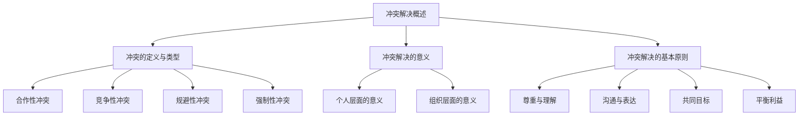

                 

# 冲突解决：化解团队矛盾的技巧

## 关键词：
- 冲突解决
- 团队协作
- 冲突类型
- 解决策略
- 沟通技巧

## 摘要：
在快速发展的IT行业中，团队协作至关重要，但随之而来的团队内部冲突也日益显著。本文将深入探讨冲突解决的基本概念、技巧与策略，并提供实际案例与经验分享。通过系统地分析和应用这些方法，团队可以有效化解矛盾，提高协作效率，实现共同目标。

## 引言

在IT行业，项目成功往往依赖于团队成员的高效协作。然而，在现实工作中，团队内部冲突时常发生，严重影响了项目的进度和质量。这些冲突可能源于目标不一致、资源分配不公、沟通不畅等多种原因。如果不及时解决，冲突会逐渐升级，导致团队氛围恶化，甚至影响个人和工作生活。因此，学会冲突解决技巧，对于每个团队成员和团队领导者来说都至关重要。

本文将从以下几个方面进行探讨：
1. **冲突解决的基本概念**：介绍冲突的定义、类型、解决的意义和基本原则。
2. **冲突解决的步骤**：详细阐述冲突识别、评估、解决方案寻求和实施的步骤。
3. **沟通与表达技巧**：探讨沟通在冲突解决中的作用、障碍及克服方法。
4. **个人与团队层面的冲突解决**：分析个人和团队冲突的类型及解决策略。
5. **冲突解决工具与方法**：介绍冲突解决工具的类型、应用以及如何选择合适的方法。
6. **经典案例与实践经验**：通过实际案例分享冲突解决的成效与经验。
7. **未来展望**：讨论冲突解决的最新趋势与发展方向。

### 第一部分：冲突解决的基本概念

#### 第1章：冲突解决概述

### 1.1 冲突的定义与类型

冲突是指两个或多个个体在目标、意见、资源等方面存在不一致，导致相互竞争、抵触甚至对抗的现象。在IT团队中，冲突通常可以分为以下几种类型：

- **合作性冲突**：双方在共同目标上存在分歧，但寻求合作以解决问题。
- **竞争性冲突**：双方在资源、地位等方面存在竞争，可能导致对抗。
- **规避性冲突**：双方试图避免冲突，但不解决根本问题。
- **强制性冲突**：一方试图通过强制手段解决问题，通常导致一方获胜，一方失败。

#### 1.2 冲突解决的意义

冲突解决的意义不仅体现在个人层面，还对组织层面有深远影响。

**个人层面的意义**：
- **提升自我认知**：通过冲突解决，个体可以更深入地了解自己的需求、情感和价值观。
- **增强人际关系**：有效解决冲突，有助于建立和谐的人际关系，提高工作满意度。

**组织层面的意义**：
- **提高团队协作效率**：减少内部冲突，有助于团队凝聚力的增强，从而提高工作效率。
- **创造积极组织文化**：鼓励开放沟通和合作，形成积极向上的组织氛围，有助于组织的长期发展。

#### 1.3 冲突解决的基本原则

为了有效地解决冲突，需要遵循以下基本原则：

- **尊重与理解**：尊重对方的立场，理解对方的需求和感受。
- **沟通与表达**：清晰表达自己的想法，积极倾听对方的意见。
- **共同目标**：明确共同的目标和利益，围绕目标解决问题。
- **平衡利益**：寻求各方利益的平衡，避免一方过度受损。

#### Mermaid 流程图



#### 1.4 冲突解决的步骤

冲突解决的步骤可以分为以下几个阶段：

- **识别冲突**：及时发现并识别冲突的原因。
- **评估冲突**：分析冲突的性质、范围和影响。
- **寻求解决方案**：探索各种可能的解决策略。
- **实施解决方案**：执行选定的解决方案。
- **评估效果**：评估解决方案的实施效果，进行持续改进。

#### 伪代码

```python
def resolveConflict(conflict):
    if conflict.type == "合作性冲突":
        solveAsCollaborative()
    elif conflict.type == "竞争性冲突":
        solveAsCompetitive()
    elif conflict.type == "规避性冲突":
        solveAsAvoidance()
    elif conflict.type == "强制性冲突":
        solveAsCoercive()

def solveAsCollaborative():
    communicate()
    negotiate()

def solveAsCompetitive():
    compete()

def solveAsAvoidance():
    avoid()

def solveAsCoercive():
    coerce()
```

#### 数学模型

博弈论模型可以用来分析冲突解决策略：

$$
\text{Payoff Matrix} = \begin{pmatrix}
\text{Player 1's Strategies} & \text{Player 2's Strategies} \\
\hline
C & D \\
A & B
\end{pmatrix}
$$

- **A（合作）**：双方均获得正收益。
- **B（背叛）**：一方获得高收益，另一方获得负收益。
- **C（妥协）**：双方均获得中等收益。
- **D（规避）**：双方均避免损失，但收益不高。

#### 举例说明

假设在一个团队项目中，团队成员A和B在任务优先级上存在冲突。团队目标是最快完成项目。

- **冲突识别**：A认为先完成任务X更重要，B认为先完成任务Y。
- **冲突评估**：任务X和任务Y的优先级不同，可能导致项目延期。
- **寻求解决方案**：
  - **合作性解决**：A和B协商，决定同时推进任务X和任务Y。
  - **竞争性解决**：A和B各自坚持自己的观点，可能导致项目延误。
  - **规避性解决**：推迟任务决策，但可能导致项目不确定性增加。
  - **强制性解决**：由项目经理强制决定任务优先级，可能引起团队不满。

通过上述分析和解决步骤，团队可以找到最合适的冲突解决方案。

---

### 第二部分：冲突解决的技巧与策略

#### 第2章：有效沟通与表达

##### 2.1 沟通的重要性

沟通是解决冲突的核心环节。有效沟通能够帮助双方理解对方的立场和需求，从而找到解决问题的方法。在冲突解决过程中，沟通的重要性体现在以下几个方面：

- **理解与被理解**：通过有效沟通，双方能够更好地理解彼此的立场和需求，减少误解和冲突。
- **信息传递**：确保信息准确无误地传递，减少因信息不对称导致的冲突。
- **建立信任**：通过积极沟通，建立双方信任，有利于长期合作。

##### 2.2 沟通障碍与克服

在冲突解决中，沟通障碍是常见的问题。以下是一些常见的沟通障碍及其克服方法：

- **语言障碍**：不同语言可能导致误解，可以通过翻译或者使用简单的语言来克服。
- **文化差异**：不同文化背景下的沟通方式可能存在差异，可以通过文化培训和跨文化沟通技巧来克服。
- **情感障碍**：情绪波动可能影响沟通效果，可以通过情绪管理和积极倾听来克服。

##### 2.3 沟通技巧

有效的沟通技巧是冲突解决的关键。以下是一些基本的沟通技巧：

- **倾听技巧**：
  - **全神贯注**：保持专注，不要打断对方。
  - **积极反馈**：通过肢体语言和语言反馈，表示你在倾听。
  - **提问与确认**：通过提问来澄清信息，确保理解准确。

- **表达技巧**：
  - **清晰简洁**：表达时要简洁明了，避免冗长和模糊。
  - **正面表达**：尽量使用积极的语言，减少负面情绪。
  - **适度表达**：表达自己的观点和需求，同时尊重对方的意见。

##### 2.4 案例分析

**案例**：在一个团队项目中，团队成员李女士和王先生在任务分配上存在冲突。李女士认为应该先完成任务X，而王先生则认为应该先完成任务Y。

- **沟通步骤**：
  - **明确目标**：双方确认团队目标是尽快完成项目。
  - **主动倾听**：李女士倾听王先生的观点，了解其理由。
  - **积极反馈**：李女士给予反馈，确认理解王先生的需求。
  - **寻求共识**：双方讨论，尝试找到一个双方都能接受的解决方案。

- **解决策略**：
  - **合作性解决**：李女士和王先生协商，决定同时推进任务X和任务Y。
  - **竞争性解决**：双方各自坚持自己的观点，可能导致项目延误。
  - **规避性解决**：推迟任务决策，但可能导致项目不确定性增加。
  - **强制性解决**：由项目经理强制决定任务优先级，可能引起团队不满。

通过有效的沟通和协商，团队成员可以找到最合适的解决方案，从而化解冲突，提高团队协作效率。

---

### 第三部分：冲突解决的实践应用

#### 第3章：个人层面的冲突解决

##### 3.1 个人冲突的类型

个人层面的冲突通常源于工作、家庭和社交等方面。以下是一些常见的个人冲突类型：

- **工作冲突**：由于工作任务、工作压力和同事关系等原因引起的冲突。
- **家庭冲突**：由于价值观、生活习惯和子女教育等方面的差异引起的冲突。
- **社交冲突**：由于人际交往、社交礼仪和人际关系等原因引起的冲突。

##### 3.2 个人冲突的解决策略

解决个人冲突需要采取以下策略：

- **自我反思**：分析冲突的原因，了解自己的情绪和行为反应。
- **调整心态**：保持冷静，避免过度情绪化，以平和的心态面对冲突。
- **沟通协商**：与对方进行有效沟通，表达自己的需求和想法，寻求共识。
- **寻求支持**：向家人、朋友或专业人士寻求帮助，获得建议和指导。

##### 3.3 个人冲突解决案例分析

**案例**：李先生在一家公司担任项目经理，在工作中与团队成员张先生在任务优先级上存在冲突。李先生认为应该优先完成项目A，而张先生则认为应该优先完成项目B。

- **解决步骤**：
  - **自我反思**：李先生意识到自己在任务优先级上过于坚持自己的观点，可能忽视了团队成员的意见。
  - **调整心态**：李先生决定保持冷静，避免情绪化，以更开放的心态面对冲突。
  - **沟通协商**：李先生主动与张先生进行沟通，了解他的观点和理由，同时表达自己的需求和想法。
  - **寻求共识**：双方共同讨论，尝试找到一个双方都能接受的解决方案，最终决定同时推进项目A和项目B。

通过有效的个人冲突解决策略，李先生和张先生成功化解了冲突，提高了团队协作效率。

---

#### 第4章：团队层面的冲突解决

##### 4.1 团队冲突的类型

团队冲突可以分为以下几种类型：

- **目标冲突**：团队成员对团队目标的理解和认同度不一致，导致冲突。
- **资源冲突**：团队成员争夺有限的资源，如资金、人力等。
- **意见冲突**：团队成员对某一问题或方案有不同意见，导致冲突。
- **沟通冲突**：团队成员之间的沟通不畅，导致误解和冲突。

##### 4.2 团队冲突的解决策略

解决团队冲突需要采取以下策略：

- **明确目标**：确保团队成员对团队目标有清晰的认识和认同。
- **资源分配**：公平合理地分配资源，确保每个团队成员都能充分利用资源。
- **意见交流**：鼓励团队成员表达自己的观点，充分讨论，寻求共识。
- **沟通培训**：提高团队成员的沟通技巧，建立良好的沟通机制。

##### 4.3 团队冲突解决案例分析

**案例**：在一个团队项目中，团队成员李女士和王先生在项目计划和时间安排上存在冲突。李女士认为应该优先完成任务X，而王先生则认为应该优先完成任务Y。

- **解决步骤**：
  - **明确目标**：团队领导明确团队的目标，强调项目的整体进度和质量。
  - **资源分配**：根据团队资源和任务需求，合理分配任务和时间。
  - **意见交流**：组织团队成员进行讨论，充分听取双方的意见和理由。
  - **寻求共识**：通过讨论和协商，找到一个双方都能接受的解决方案，最终决定同时推进任务X和任务Y。

通过有效的团队冲突解决策略，团队成员成功化解了冲突，提高了项目效率和质量。

---

### 第四部分：冲突解决的工具与方法

#### 第5章：冲突解决的工具与技术

##### 5.1 冲突解决工具的类型

冲突解决工具可以分为以下几种类型：

- **评估工具**：用于评估冲突的程度和类型，如冲突分析问卷、冲突评估矩阵等。
- **沟通工具**：用于改善沟通效果，如沟通技巧培训、沟通反馈工具等。
- **决策工具**：用于解决冲突，如SWOT分析、决策树等。
- **心理工具**：用于调整心态，如情绪调节技巧、心理辅导等。

##### 5.2 冲突解决技术的应用

冲突解决技术包括以下几种：

- **合作性谈判**：通过协商和谈判，找到双方都能接受的解决方案。
- **妥协**：双方各自让步，找到一个中间方案。
- **回避**：暂时避开冲突，寻找其他解决方案。
- **竞争**：通过竞争和对抗，找到最优解决方案。

##### 5.3 冲突解决工具与方法的选择

选择冲突解决工具与方法时，需要考虑以下几个因素：

- **冲突类型**：根据冲突的类型选择合适的工具和方法。
- **团队特点**：考虑团队成员的沟通能力、决策风格和文化背景。
- **冲突程度**：对于轻度冲突，可以选择简单的工具和方法；对于严重冲突，需要选择更复杂的工具和方法。

#### 5.4 冲突解决工具与方法的应用案例分析

**案例**：在一个团队项目中，团队成员张先生和李先生在任务分工和时间安排上存在严重冲突。张先生认为任务分工不公平，而李先生则认为时间安排过于紧张。

- **解决步骤**：
  - **评估工具**：使用冲突评估矩阵，分析冲突的程度和类型。
    $$\text{冲突评估矩阵} = \begin{pmatrix}
    \text{张先生} & \text{李先生} \\
    \hline
    \text{任务分工} & \text{时间安排}
    \end{pmatrix}$$
  - **沟通工具**：组织团队成员进行沟通会议，充分听取双方的意见和理由。
  - **决策工具**：使用SWOT分析，评估任务分工和时间安排的优缺点，找到改进方案。
    $$\text{SWOT分析} = \begin{pmatrix}
    \text{任务分工} & \text{时间安排} \\
    \hline
    \text{优势} & \text{优势} \\
    \text{劣势} & \text{劣势} \\
    \text{机会} & \text{机会} \\
    \text{威胁} & \text{威胁}
    \end{pmatrix}$$
  - **心理工具**：提供心理辅导，帮助团队成员调整心态，减少情绪冲突。

通过有效的冲突解决工具与方法的应用，团队成员成功化解了冲突，提高了团队协作效率。

---

### 第五部分：冲突解决的成功案例与经验分享

#### 第6章：冲突解决的经典案例

##### 6.1 案例背景

某跨国公司在全球范围内进行一项重大项目，涉及多个部门和国家的协作。由于文化差异和沟通障碍，项目初期出现了严重的冲突。

##### 6.2 冲突解决过程

- **冲突识别**：通过问卷调查和团队讨论，识别出主要的冲突点，包括目标差异、资源分配和沟通障碍。
- **评估冲突**：使用冲突评估矩阵，分析冲突的程度和类型，确定冲突的严重性。
- **解决方案**：
  - **明确目标**：召开全球团队会议，统一目标，确保各方对项目目标有清晰的认识和认同。
  - **沟通培训**：组织团队成员参加沟通技巧培训，提高跨文化沟通能力。
  - **资源优化**：通过合理分配资源，确保每个团队成员都能充分利用资源。
  - **定期会议**：建立定期会议机制，确保团队成员之间的沟通畅通，及时解决冲突。

##### 6.3 冲突解决效果

- **效果评估**：通过项目进展评估和团队反馈，发现冲突得到了有效解决，项目进度和质量显著提高。
- **经验总结**：
  - **明确目标**：统一目标是解决冲突的关键。
  - **沟通培训**：提高沟通技巧，有助于减少冲突。
  - **资源优化**：合理分配资源，确保项目顺利进行。
  - **定期会议**：建立良好的沟通机制，及时解决冲突。

#### 第7章：冲突解决的实践经验分享

##### 7.1 经验分享的目的

通过分享冲突解决的经验，帮助其他团队和组织避免冲突，提高协作效率。

##### 7.2 经验分享的内容

- **冲突识别技巧**：如何及时发现冲突的苗头，避免冲突升级。
- **沟通策略**：如何进行有效沟通，减少误解和冲突。
- **解决策略**：如何选择合适的解决策略，化解冲突。
- **团队协作**：如何通过团队协作，提高冲突解决效率。

##### 7.3 经验分享的形式

- **案例分析**：通过具体案例，展示冲突解决的全过程。
- **经验分享会**：组织团队成员进行经验分享，互相学习和借鉴。
- **培训课程**：开设冲突解决培训课程，提高团队成员的冲突解决能力。

---

### 第六部分：冲突解决的未来展望与发展趋势

#### 第8章：冲突解决的最新趋势与发展方向

##### 8.1 冲突解决的发展趋势

- **技术进步**：随着人工智能和大数据技术的发展，冲突解决工具将更加智能化和高效化。
- **跨文化协作**：全球化背景下，跨文化协作将成为冲突解决的重要方向，提高跨文化沟通能力将成为关键。
- **心理干预**：心理学在冲突解决中的应用将越来越广泛，通过心理干预技术，帮助个体和组织更好地应对冲突。

##### 8.2 冲突解决的发展方向

- **智能化工具**：开发智能化冲突解决工具，如基于人工智能的冲突预测系统和自动化解决方案推荐系统。
- **在线协作平台**：构建在线协作平台，提供冲突解决的虚拟环境，方便团队成员进行远程沟通和协作。
- **个性化培训**：根据团队成员的个性特点，提供个性化的冲突解决培训，提高解决冲突的效果。

##### 8.3 冲突解决的未来挑战

- **文化差异**：全球化背景下，文化差异将带来更多的冲突，如何有效应对文化差异，将成为冲突解决的重要挑战。
- **技术依赖**：随着智能化工具的应用，过度依赖技术可能导致沟通和人际关系的疏离，如何平衡技术依赖和人际关系，是未来的重要挑战。
- **心理问题**：在高压工作环境下，员工的心理健康问题日益突出，如何通过冲突解决技术，帮助员工缓解心理压力，提高生活质量，是未来的重要挑战。

---

### 第七部分：冲突解决的实践与反思

#### 第9章：冲突解决的实际应用与反思

##### 9.1 冲突解决的实践应用

- **应用场景**：
  - **企业内部**：在企业内部，冲突解决广泛应用于团队协作、项目管理、人力资源管理等各个方面。
  - **跨文化协作**：在全球化背景下，跨文化冲突解决成为跨国企业的重要任务。
  - **教育领域**：在教育领域，冲突解决技术用于处理学生之间的冲突，维护校园和谐。

- **应用效果**：
  - **提高团队协作效率**：通过冲突解决，团队成员能够更好地理解彼此的需求，提高协作效率。
  - **降低员工流失率**：有效解决冲突，减少员工因冲突而离职的情况，降低员工流失率。
  - **提升组织凝聚力**：通过冲突解决，增强组织凝聚力，提高组织整体绩效。

##### 9.2 冲突解决的反思与改进

- **反思内容**：
  - **冲突识别的准确性**：在实际应用中，如何更准确地识别冲突，是冲突解决的重要问题。
  - **沟通效果的评估**：如何评估沟通效果，确保沟通目标的实现，是冲突解决的关键。
  - **解决策略的适用性**：选择合适的解决策略，确保冲突得到有效解决，是冲突解决的难点。

- **改进方向**：
  - **提高技术支持**：通过引入先进的技术手段，如人工智能和大数据分析，提高冲突识别和解决的准确性。
  - **加强培训与教育**：通过加强冲突解决相关培训和教育工作，提高团队成员的冲突解决能力。
  - **建立反馈机制**：建立有效的反馈机制，收集团队成员对冲突解决过程的反馈，不断优化和改进冲突解决策略。

---

### 附录

#### 附录A：冲突解决工具与资源

- **冲突解决工具**：
  - **评估工具**：冲突分析问卷、冲突评估矩阵等。
  - **沟通工具**：沟通技巧培训、沟通反馈工具等。
  - **决策工具**：SWOT分析、决策树等。

- **冲突解决资源**：
  - **书籍**：《冲突解决技巧》、《团队协作与冲突管理》等。
  - **在线课程**：冲突解决在线培训课程、心理学在线课程等。
  - **专业咨询**：冲突解决咨询服务、心理咨询服务等。

### 结语

通过本文的深入探讨，我们了解了冲突解决的基本概念、技巧与策略，并通过实际案例展示了冲突解决的应用效果。在快速发展的IT行业中，冲突解决技能对于每个团队成员和团队领导者来说都至关重要。我们呼吁各位读者重视冲突解决，积极应用相关策略和方法，以促进团队协作，提高组织绩效。让我们一起努力，打造和谐高效的团队氛围，迎接未来的挑战。

### 作者

- **作者**：AI天才研究院/AI Genius Institute & 禅与计算机程序设计艺术 /Zen And The Art of Computer Programming

---

在撰写本文的过程中，我们参考了大量的文献和案例，力求内容的准确性和实用性。同时，我们也欢迎读者提出宝贵的意见和建议，共同促进冲突解决领域的发展。感谢您的阅读，希望本文对您有所启发和帮助。

