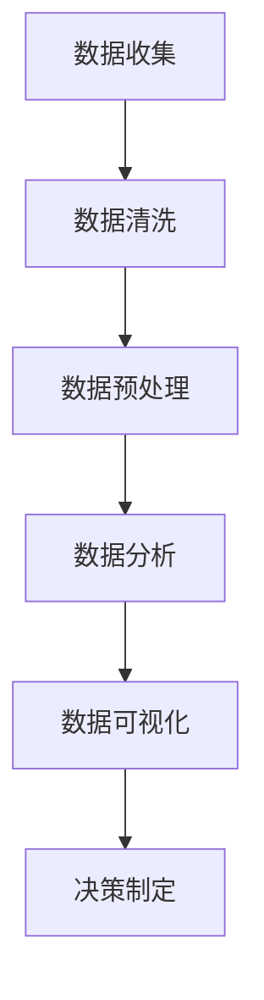
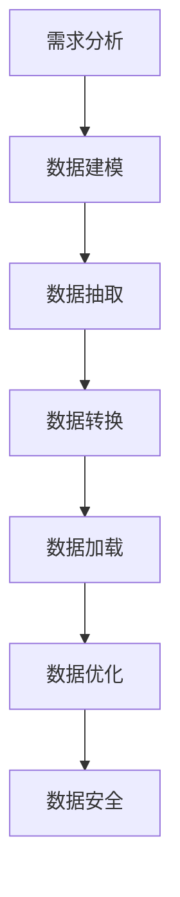
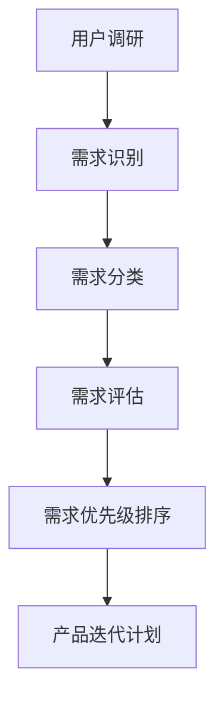

                 

### 《创业公司的数据驱动决策模型》

#### 关键词：数据驱动决策、创业公司、数据分析、数据仓库、用户需求分析、营销策略、财务决策、人力资源策略

#### 摘要：
本文将深入探讨创业公司在竞争激烈的市场中如何运用数据驱动决策模型来提升业务运营效率和决策质量。通过系统分析数据驱动决策的基础、关键应用领域，以及构建和优化决策模型的方法，本文旨在为创业公司提供实用的数据管理和分析策略，帮助他们在不断变化的市场环境中取得成功。

### 目录

#### 第一部分：数据驱动决策基础

1. **数据驱动决策概述**
    1.1 数据驱动决策的定义和重要性
    1.2 数据驱动决策与传统决策的区别
    1.3 数据驱动决策的应用领域
    1.4 创业公司如何实施数据驱动决策

2. **数据驱动的商业分析基础**
    2.1 数据分析的基本概念
    2.2 数据分析工具和平台
    2.3 数据清洗和预处理
    2.4 数据可视化技术

3. **构建创业公司的数据仓库**
    3.1 数据仓库的概念和作用
    3.2 数据仓库的设计原则
    3.3 数据仓库的实施步骤
    3.4 数据仓库的维护和优化

#### 第二部分：数据驱动决策应用

4. **产品数据驱动的用户需求分析**
    4.1 用户行为数据分析
    4.2 用户画像构建
    4.3 用户需求分析
    4.4 用户反馈机制

5. **营销数据的驱动策略**
    5.1 营销数据分析
    5.2 营销目标设定
    5.3 营销活动优化
    5.4 营销效果评估

6. **财务数据驱动的财务决策**
    6.1 财务数据概述
    6.2 财务指标分析
    6.3 预算制定与监控
    6.4 财务风险控制

7. **人力资源数据的驱动策略**
    7.1 人力资源管理数据分析
    7.2 员工绩效评估
    7.3 人才招聘策略
    7.4 员工培训与发展

8. **创业公司数据驱动决策模型优化**
    8.1 数据驱动决策模型的评估
    8.2 决策模型优化方法
    8.3 常见挑战和解决方案
    8.4 数据驱动决策的未来趋势

#### 附录

A. **数据驱动决策工具与资源**

B. **Mermaid 流程图**

C. **核心算法原理讲解**

D. **数学模型与公式**

E. **项目实战案例**

---

现在，我们正式进入文章正文部分的撰写，每个章节的内容都将逐一展开，以清晰的结构和深入的分析来探讨创业公司如何实现数据驱动的决策模型。接下来，让我们从第一部分：数据驱动决策基础开始。

### 第一部分：数据驱动决策基础

#### 第1章：数据驱动决策概述

#### 1.1 数据驱动决策的定义和重要性

**数据驱动决策**（Data-driven Decision Making, DDM）是指企业或个人通过收集、分析、解释和利用数据来做出决策的过程。这一模式在信息爆炸和业务环境快速变化的今天，显得尤为重要。与传统依赖经验或主观判断的决策模式相比，数据驱动决策具有以下几个显著优势：

1. **客观性**：通过数据进行分析，决策结果更加客观，减少了主观偏见的影响。
2. **效率性**：数据可以帮助企业快速识别问题，制定解决方案，提高决策效率。
3. **可预测性**：通过对历史数据的分析，可以预测未来趋势，为企业制定长期战略提供依据。
4. **持续优化**：基于实时数据反馈，企业可以不断调整策略，实现持续优化。

在创业公司中，数据驱动决策尤为重要。初创企业在资源有限、市场不确定的情况下，如何做出正确的决策，直接关系到公司的生存和发展。以下为创业公司实施数据驱动决策的几个关键步骤：

1. **明确决策目标**：确定公司需要解决的核心问题或业务目标，这是数据驱动决策的起点。
2. **数据收集**：收集与决策目标相关的各类数据，包括内部业务数据和外部市场数据。
3. **数据分析**：利用数据分析工具和方法，对收集到的数据进行分析，识别关键指标和趋势。
4. **决策制定**：基于数据分析结果，制定可行的决策方案，并进行评估。
5. **决策执行**：执行决策方案，并收集执行过程中的数据，用于后续分析和优化。

#### 1.2 数据驱动决策与传统决策的区别

**传统决策**（Traditional Decision Making）主要依赖经验、直觉和主观判断。这种决策模式在信息匮乏或环境相对稳定的情况下尚可应用，但在当今复杂多变的市场环境中，其局限性日益显现：

1. **依赖经验**：传统决策往往依赖决策者的经验，容易受到个人偏见和情感的影响。
2. **反应迟缓**：传统决策需要较长时间进行信息收集、分析和评估，难以快速响应市场变化。
3. **缺乏系统性**：传统决策缺乏系统性的分析框架，难以全面考虑各种因素。

相比之下，数据驱动决策具有以下几个显著特点：

1. **系统性**：数据驱动决策通过系统性的数据收集和分析，确保决策过程中的各个步骤都有据可依。
2. **科学性**：基于数据的事实和逻辑分析，决策结果更加科学、客观。
3. **灵活性**：数据驱动决策能够根据实时数据快速调整，适应不断变化的市场环境。
4. **持续优化**：通过持续的数据反馈和调整，数据驱动决策能够实现持续优化，不断提升决策质量。

#### 1.3 数据驱动决策的应用领域

数据驱动决策在创业公司中的应用领域非常广泛，涵盖了从产品开发、市场营销到财务管理等各个方面。以下是几个关键应用领域：

1. **产品开发**：
    - 用户需求分析：通过分析用户行为数据和反馈，了解用户需求，优化产品设计。
    - 产品性能监控：利用数据监控产品上线后的性能指标，及时发现并解决潜在问题。
2. **市场营销**：
    - 营销效果评估：通过分析营销活动的数据，评估其效果，优化营销策略。
    - 用户画像构建：基于用户数据，构建用户画像，实现精准营销。
3. **财务管理**：
    - 预算制定与监控：利用数据制定预算，并实时监控预算执行情况。
    - 财务风险控制：通过数据分析，预测并控制财务风险。
4. **人力资源管理**：
    - 员工绩效评估：通过分析员工的工作数据，评估员工绩效，制定激励机制。
    - 人才招聘策略：利用数据分析，优化人才招聘策略，提升团队素质。

#### 1.4 创业公司如何实施数据驱动决策

对于创业公司来说，实施数据驱动决策需要从以下几个方面入手：

1. **构建数据基础设施**：
    - 数据仓库：建立一个集中的数据仓库，存储各类业务数据，实现数据统一管理。
    - 数据分析工具：选择适合的数据分析工具，提升数据处理和分析的效率。
2. **明确数据指标**：
    - 设定关键绩效指标（KPI）：根据业务目标，设定具体的KPI，用于衡量业务表现。
    - 数据指标体系：建立完整的数据指标体系，确保数据能够全面反映业务状况。
3. **数据驱动文化**：
    - 培养数据意识：让全体员工意识到数据的重要性，提升数据素养。
    - 数据驱动决策：在决策过程中，充分运用数据分析结果，确保决策的科学性和客观性。
4. **持续优化**：
    - 数据反馈：及时收集业务数据，用于决策评估和优化。
    - 持续改进：基于数据反馈，不断调整和优化决策模型，提升决策质量。

#### 第2章：数据驱动的商业分析基础

#### 2.1 数据分析的基本概念

数据分析（Data Analysis）是指通过对数据进行收集、整理、分析和解释，从中提取有用信息，为决策提供支持的过程。数据分析在数据驱动决策中起着至关重要的作用，其基本概念包括以下几个方面：

1. **数据类型**：
    - 结构化数据：指以表格形式存储的数据，如数据库中的数据。
    - 非结构化数据：指难以用表格形式存储的数据，如文本、图像、音频等。
2. **数据分析方法**：
    - 描述性分析：对数据的基本属性和特征进行统计分析，如均值、方差等。
    - 探索性分析：通过可视化工具，探索数据中的模式和异常，发现潜在的问题。
    - 预测性分析：利用历史数据，建立预测模型，预测未来趋势。
3. **数据分析工具**：
    - SQL：用于数据库查询和操作，适合处理结构化数据。
    - Python：适合进行数据处理、分析和可视化，具有丰富的库和工具。
    - R：专注于统计分析和数据可视化，适用于复杂的统计模型。

#### 2.2 数据分析工具和平台

在数据分析过程中，选择合适的工具和平台至关重要。以下是一些常用的数据分析工具和平台：

1. **数据仓库**：
    - Redshift：亚马逊云服务提供的数据仓库，适合大规模数据处理。
    - BigQuery：谷歌云服务提供的数据仓库，具有强大的数据处理能力。
2. **数据分析平台**：
    - Tableau：数据可视化工具，支持多种数据源，便于生成直观的图表。
    - Power BI：微软推出的数据分析平台，提供丰富的数据可视化功能。
3. **数据处理工具**：
    - Apache Spark：分布式数据处理框架，适合大规模数据处理和分析。
    - Pandas：Python数据分析库，提供丰富的数据处理和分析功能。

#### 2.3 数据清洗和预处理

数据清洗（Data Cleaning）和预处理（Data Preprocessing）是数据分析过程中非常重要的步骤。数据清洗主要解决数据中的错误、异常和缺失值问题，确保数据质量；而数据预处理则通过数据转换、特征选择等技术，为后续的分析提供更好的数据基础。以下是数据清洗和预处理的基本方法：

1. **数据清洗**：
    - 填充缺失值：利用均值、中位数、最邻近法等方法填充缺失值。
    - 异常值处理：利用统计学方法，如箱线图、IQR法等，识别并处理异常值。
    - 数据格式转换：统一数据格式，如日期、货币等。
2. **数据预处理**：
    - 特征工程：通过特征选择、特征转换等技术，提取有用的特征，提高模型性能。
    - 数据标准化：将数据缩放到同一尺度，如归一化、标准化等。
    - 数据降维：通过主成分分析（PCA）、t-SNE等方法，降低数据维度。

#### 2.4 数据可视化技术

数据可视化（Data Visualization）是将数据以图形、图像等形式展示的过程，使数据更加直观、易于理解。数据可视化在数据分析中具有重要作用，可以帮助发现数据中的规律和趋势。以下是一些常用的数据可视化技术：

1. **柱状图**：用于比较不同类别或时间点的数据。
2. **折线图**：用于展示数据的变化趋势。
3. **饼图**：用于展示各部分占整体的比例。
4. **散点图**：用于展示两个变量之间的关系。
5. **热力图**：用于展示多维数据的分布情况。

#### 第3章：构建创业公司的数据仓库

#### 3.1 数据仓库的概念和作用

**数据仓库**（Data Warehouse）是一种用于存储、管理和分析大量数据的系统。它与传统的关系数据库不同，数据仓库更注重数据的集成性、一致性和灵活性。数据仓库的作用主要包括以下几个方面：

1. **数据集成**：将来自不同来源的数据集成到一个统一的环境中，实现数据的集中管理。
2. **数据存储**：提供高效的存储方案，存储大量的历史数据。
3. **数据分析**：支持复杂的数据分析和报表生成，为决策提供支持。
4. **数据安全性**：提供数据备份和恢复机制，确保数据的安全和可靠性。

#### 3.2 数据仓库的设计原则

为了构建一个高效、稳定、可扩展的数据仓库，需要遵循以下设计原则：

1. **面向主题**：数据仓库的设计应该围绕业务主题进行，确保数据的组织与业务需求紧密相关。
2. **数据一致性**：确保数据在各个源系统之间的一致性，避免数据冗余和冲突。
3. **数据灵活性**：设计灵活的数据模型，支持不同类型的数据和业务需求。
4. **性能优化**：通过索引、分区、压缩等技术，优化数据仓库的性能。
5. **可扩展性**：设计可扩展的架构，支持数据仓库的规模扩展。

#### 3.3 数据仓库的实施步骤

构建数据仓库是一个复杂的过程，通常包括以下步骤：

1. **需求分析**：明确数据仓库的用途、目标和所需的功能。
2. **数据源识别**：识别需要集成到数据仓库的数据源，包括内部和外部数据。
3. **数据建模**：设计数据仓库的架构和模型，确定数据表、关系和索引。
4. **数据抽取和转换**：从数据源抽取数据，进行清洗、转换和加载到数据仓库中。
5. **数据加载**：将处理后的数据加载到数据仓库中，建立数据索引和优化。
6. **数据安全性和权限管理**：确保数据的安全性和权限，防止未授权访问和数据泄露。
7. **测试和部署**：进行数据仓库的性能测试，确保其正常运行，并部署到生产环境。

#### 3.4 数据仓库的维护和优化

数据仓库的维护和优化是保证其稳定性和性能的重要环节。以下是一些关键点：

1. **数据备份和恢复**：定期备份数据，确保在数据丢失或损坏时能够快速恢复。
2. **性能监控**：监控数据仓库的性能，及时发现和解决性能瓶颈。
3. **数据清洗和维护**：定期进行数据清洗，修复数据中的错误和异常。
4. **索引优化**：根据查询需求，优化数据索引，提高查询速度。
5. **扩展和升级**：根据业务需求，定期扩展数据仓库的容量和功能，保持其先进性。

#### 第4章：产品数据驱动的用户需求分析

#### 4.1 用户行为数据分析

用户行为数据分析是产品数据驱动的核心环节之一，通过对用户在产品中的行为进行数据收集和分析，可以帮助企业更好地理解用户需求，优化产品设计和功能。以下是用户行为数据分析的几个关键步骤：

1. **数据收集**：
    - 基础行为数据：如用户注册、登录、浏览、搜索、下单等行为数据。
    - 高级行为数据：如用户停留时间、点击路径、转化路径等。
2. **数据存储**：
    - 建立用户行为数据仓库，存储各类用户行为数据。
    - 使用数据采集工具（如Google Analytics、Matomo等）收集和存储数据。
3. **数据处理**：
    - 数据清洗：去除无效数据，处理缺失值和异常值。
    - 数据转换：将不同类型的数据转换为统一的格式，便于后续分析。
4. **数据可视化**：
    - 利用数据可视化工具（如Tableau、Power BI等），生成直观的图表和报告。

#### 4.2 用户画像构建

用户画像（User Profile）是基于用户行为数据和人口统计学数据，对用户进行特征刻画的过程。用户画像是产品数据驱动的关键工具，可以帮助企业了解用户需求，实现精准营销。以下是构建用户画像的几个步骤：

1. **数据整合**：
    - 整合用户行为数据、人口统计学数据、社交媒体数据等。
    - 使用数据连接器（如Fivetran、Airbyte等）实现数据整合。
2. **特征提取**：
    - 提取用户的基本信息（如年龄、性别、地域等）。
    - 提取用户的行为特征（如浏览时长、购买偏好等）。
3. **模型训练**：
    - 使用机器学习算法（如聚类、决策树等），对用户特征进行建模。
    - 评估模型性能，调整特征和算法参数。
4. **用户画像生成**：
    - 根据用户特征，生成用户画像，实现用户分类。
    - 利用可视化工具，展示用户画像。

#### 4.3 用户需求分析

用户需求分析是产品数据驱动的关键环节，通过对用户行为数据和用户画像的分析，可以帮助企业了解用户需求，优化产品设计。以下是用户需求分析的几个步骤：

1. **需求识别**：
    - 通过用户反馈、问卷调查、用户访谈等方式，收集用户反馈。
    - 利用用户行为数据，识别用户常用的功能和功能使用频率。
2. **需求分类**：
    - 将用户需求分类为功能性需求、性能需求、易用性需求等。
    - 分析不同类型需求的重要性和优先级。
3. **需求评估**：
    - 利用数据分析工具（如Excel、Python等），对需求进行定量和定性分析。
    - 评估需求的可行性和优先级。
4. **需求优先级排序**：
    - 根据需求的重要性和优先级，制定产品迭代计划。

#### 4.4 用户反馈机制

用户反馈机制是产品数据驱动的关键环节之一，通过收集和反馈用户意见，可以帮助企业及时了解用户需求和问题，优化产品设计和功能。以下是用户反馈机制的几个步骤：

1. **反馈渠道**：
    - 设置多种反馈渠道，如在线问卷、用户论坛、客服系统等。
    - 确保用户可以方便地提交反馈。
2. **反馈收集**：
    - 定期收集用户反馈，分析反馈内容。
    - 利用自然语言处理技术（如文本挖掘、情感分析等），自动提取用户反馈的关键信息。
3. **反馈分析**：
    - 对用户反馈进行分析，识别用户问题和需求。
    - 利用数据分析工具，生成反馈报告。
4. **反馈处理**：
    - 根据用户反馈，制定优化方案，并进行实施。
    - 定期向用户反馈处理结果和改进情况。

#### 第5章：营销数据的驱动策略

#### 5.1 营销数据分析

营销数据分析是利用数据来评估营销活动的效果和优化营销策略的过程。以下为营销数据分析的几个关键步骤：

1. **数据收集**：
    - 收集与营销活动相关的数据，如广告点击量、转化率、销售额等。
    - 利用营销自动化工具（如HubSpot、Marketo等）收集数据。
2. **数据清洗**：
    - 清洗数据，去除重复、无效和异常数据。
    - 确保数据质量，为后续分析提供可靠的数据基础。
3. **数据整合**：
    - 整合来自不同渠道的数据，建立统一的数据视图。
    - 使用数据连接器（如Fivetran、Airbyte等）实现数据整合。
4. **数据分析**：
    - 利用数据分析工具（如Tableau、Power BI等），对数据进行分析。
    - 识别营销活动的效果和问题，为优化策略提供依据。

#### 5.2 营销目标设定

营销目标设定是营销策略的核心，需要明确营销活动的目标和预期结果。以下为营销目标设定的几个关键步骤：

1. **目标定义**：
    - 根据企业战略，明确营销目标，如提高品牌知名度、增加销售额等。
    - 确定可量化的关键绩效指标（KPI），如点击率、转化率、ROI等。
2. **目标设定**：
    - 设定短期和长期营销目标，确保目标的可实现性。
    - 根据市场环境和竞争对手情况，设定具有竞争力的目标。
3. **目标分解**：
    - 将营销目标分解为具体的子目标和行动计划。
    - 确定每个子目标的负责人和实施时间。

#### 5.3 营销活动优化

营销活动优化是提高营销效果和投资回报率的关键步骤。以下为营销活动优化的几个关键步骤：

1. **数据监测**：
    - 监测营销活动的数据，如广告点击量、访问量、转化率等。
    - 利用营销自动化工具（如HubSpot、Marketo等）实时监测数据。
2. **效果评估**：
    - 根据设定的KPI，评估营销活动的效果。
    - 分析数据，识别成功的营销策略和需要改进的方面。
3. **优化策略**：
    - 根据效果评估结果，调整营销策略，如优化广告文案、调整推广渠道等。
    - 实施优化措施，并持续监测效果。
4. **持续改进**：
    - 基于数据反馈，不断调整和优化营销策略。
    - 保持营销活动的灵活性和创新性。

#### 5.4 营销效果评估

营销效果评估是衡量营销活动成功与否的关键步骤，以下为营销效果评估的几个关键步骤：

1. **数据收集**：
    - 收集与营销活动相关的数据，如广告点击量、访问量、转化率等。
    - 利用营销自动化工具（如HubSpot、Marketo等）收集数据。
2. **效果评估**：
    - 根据设定的KPI，评估营销活动的效果。
    - 分析数据，计算营销活动的ROI、转化率等关键指标。
3. **反馈机制**：
    - 根据效果评估结果，向相关人员提供反馈。
    - 分析成功和失败的原因，为后续营销活动提供参考。
4. **报告生成**：
    - 生成营销效果评估报告，总结营销活动的效果和经验教训。
    - 定期向管理层和团队成员分享报告。

#### 第6章：财务数据驱动的财务决策

#### 6.1 财务数据概述

财务数据是指与企业财务活动相关的各类数据，包括收入、成本、利润、现金流等。财务数据是企业决策的重要依据，能够反映企业的经营状况和财务状况。以下是财务数据的几个关键组成部分：

1. **收入数据**：包括销售收入、其他收入等，反映企业的经营成果。
2. **成本数据**：包括生产成本、销售成本、管理费用等，反映企业的成本结构。
3. **利润数据**：包括净利润、毛利润等，反映企业的盈利能力。
4. **现金流数据**：包括经营现金流、投资现金流、筹资现金流等，反映企业的现金流动状况。

#### 6.2 财务指标分析

财务指标是评价企业财务状况和经营成果的重要工具。以下为几个常见的财务指标及其分析：

1. **毛利率**：毛利率 = （销售收入 - 成本）/ 销售收入，反映企业的盈利能力。
2. **净利润率**：净利润率 = 净利润 / 销售收入，反映企业的盈利能力。
3. **资产负债率**：资产负债率 = 负债总额 / 资产总额，反映企业的负债水平。
4. **流动比率**：流动比率 = 流动资产 / 流动负债，反映企业的短期偿债能力。

#### 6.3 预算制定与监控

预算制定与监控是企业财务决策的重要环节，以下为预算制定与监控的几个关键步骤：

1. **预算编制**：
    - 根据企业战略和经营目标，编制年度预算。
    - 设定收入、成本、利润等预算指标，分解到各部门和业务线。
2. **预算审批**：
    - 审批预算，确保预算的合理性和可行性。
    - 根据企业战略和资源情况，调整预算。
3. **预算执行**：
    - 监控预算执行情况，定期收集数据，分析预算执行差异。
    - 及时调整预算，确保预算的执行效果。
4. **预算评估**：
    - 年末对预算执行情况进行评估，总结经验教训。
    - 根据评估结果，调整下一年的预算编制。

#### 6.4 财务风险控制

财务风险控制是企业确保财务安全和稳定的重要手段，以下为财务风险控制的几个关键步骤：

1. **风险评估**：
    - 评估企业面临的各种财务风险，如市场风险、信用风险、流动性风险等。
    - 识别风险点和潜在损失。
2. **风险控制措施**：
    - 制定风险控制策略，如分散投资、风险对冲、严格审批等。
    - 制定风险管理流程，确保风险控制的执行。
3. **风险监控**：
    - 定期监控财务风险，分析风险指标的变化。
    - 及时发现风险隐患，采取控制措施。
4. **风险报告**：
    - 定期向管理层和董事会报告财务风险状况。
    - 分析风险控制效果，持续优化风险管理体系。

#### 第7章：人力资源数据的驱动策略

#### 7.1 人力资源管理数据分析

人力资源管理数据分析是指利用数据分析方法对人力资源管理活动中的各类数据进行收集、整理和分析，以支持决策和优化人力资源管理的流程。以下为人力资源管理数据分析的几个关键步骤：

1. **数据收集**：
    - 收集与人力资源管理相关的数据，如员工档案、招聘数据、绩效评估数据、培训数据等。
    - 利用人力资源信息系统（HRIS）和员工管理工具（如Workday、ADP等）收集数据。
2. **数据处理**：
    - 数据清洗：去除重复、无效和异常数据，确保数据质量。
    - 数据整合：整合来自不同系统和渠道的数据，建立统一的数据视图。
3. **数据可视化**：
    - 利用数据可视化工具（如Tableau、Power BI等），将数据以图表、仪表板等形式展示。
    - 提供直观的视图，帮助管理者更好地理解数据。

#### 7.2 员工绩效评估

员工绩效评估是人力资源管理的重要环节，通过对员工的工作表现进行评估，帮助管理者了解员工的优势和不足，制定激励机制和发展计划。以下为员工绩效评估的几个关键步骤：

1. **评估标准设定**：
    - 根据企业战略和业务目标，设定绩效评估标准。
    - 确定关键绩效指标（KPI），如工作效率、项目完成度、客户满意度等。
2. **评估数据收集**：
    - 收集与绩效评估相关的数据，如工作成果、工作时长、团队合作等。
    - 利用绩效评估工具（如KPI仪表板、360度评估等）收集数据。
3. **评估结果分析**：
    - 分析员工绩效数据，识别优秀员工和需要改进的员工。
    - 根据评估结果，制定激励和培训计划。
4. **反馈与改进**：
    - 向员工反馈评估结果，提供改进建议和培训机会。
    - 定期跟踪员工绩效改进情况，持续优化绩效评估体系。

#### 7.3 人才招聘策略

人才招聘策略是企业获取高素质人才的关键步骤，通过数据分析优化招聘流程，可以提高招聘效率和效果。以下为人才招聘策略的几个关键步骤：

1. **招聘需求分析**：
    - 分析企业业务发展需求，确定招聘岗位和招聘人数。
    - 调研市场人才供需情况，制定招聘策略。
2. **招聘渠道选择**：
    - 根据招聘需求，选择合适的招聘渠道，如招聘网站、猎头、内部推荐等。
    - 分析不同渠道的招聘效果，优化渠道组合。
3. **招聘流程优化**：
    - 设计高效的招聘流程，包括职位发布、简历筛选、面试安排等。
    - 利用数据分析工具，监控招聘流程各个环节的效率。
4. **招聘效果评估**：
    - 根据招聘结果，评估招聘策略的有效性。
    - 分析招聘成本和招聘质量，持续优化招聘流程。

#### 7.4 员工培训与发展

员工培训与发展是企业提升员工素质和竞争力的关键环节，通过数据分析优化培训和发展策略，可以提高员工绩效和企业绩效。以下为员工培训与发展的几个关键步骤：

1. **培训需求分析**：
    - 分析员工岗位要求和员工能力差距，确定培训需求。
    - 调研市场培训资源和培训效果，制定培训计划。
2. **培训资源整合**：
    - 整合内部和外部培训资源，如内部培训课程、外部培训机构等。
    - 利用数据分析工具，监控培训资源的利用情况。
3. **培训效果评估**：
    - 设计培训评估指标，如知识掌握度、技能提升度、工作绩效等。
    - 分析培训效果，识别成功的培训和需要改进的培训。
4. **培训与发展计划**：
    - 根据培训评估结果，制定员工发展计划，包括晋升、轮岗、培训等。
    - 持续跟踪员工发展情况，优化培训与发展策略。

#### 第8章：创业公司数据驱动决策模型优化

#### 8.1 数据驱动决策模型的评估

数据驱动决策模型的评估是确保决策模型有效性和可靠性的关键步骤。以下为数据驱动决策模型评估的几个关键步骤：

1. **模型性能评估**：
    - 评估模型的预测准确性、召回率、F1分数等指标。
    - 分析模型在不同数据集上的表现，识别模型的局限性。
2. **模型可解释性评估**：
    - 评估模型的可解释性，确保决策过程透明和可追溯。
    - 利用可解释性工具（如LIME、SHAP等），解释模型预测结果。
3. **模型稳定性评估**：
    - 分析模型对数据噪声、异常值和缺失值的敏感性。
    - 验证模型在不同时间窗口和业务场景下的稳定性。

#### 8.2 决策模型优化方法

决策模型优化是提高决策质量和效果的重要手段。以下为决策模型优化的几个关键方法：

1. **特征工程优化**：
    - 选取和转换有用的特征，提高模型的预测能力。
    - 利用降维技术（如PCA、t-SNE等），减少特征维度。
2. **模型选择和调优**：
    - 根据业务需求，选择合适的模型（如线性回归、决策树、神经网络等）。
    - 利用交叉验证、网格搜索等技术，优化模型参数。
3. **模型集成**：
    - 利用集成学习方法（如Bagging、Boosting等），构建强模型。
    - 结合多种模型和算法，提高模型的综合性能。

#### 8.3 常见挑战和解决方案

在实施数据驱动决策过程中，创业公司可能会面临以下挑战和解决方案：

1. **数据质量**：
    - **挑战**：数据质量低下，包括缺失值、异常值和冗余数据。
    - **解决方案**：建立数据质量管理流程，定期清洗和更新数据。
2. **数据隐私和安全性**：
    - **挑战**：数据隐私和安全性问题，可能导致数据泄露和违规。
    - **解决方案**：实施数据加密、访问控制和权限管理，确保数据安全。
3. **模型解释性**：
    - **挑战**：复杂模型的可解释性不足，难以解释决策过程。
    - **解决方案**：采用可解释性模型和工具，提高模型的可解释性。

#### 8.4 数据驱动决策的未来趋势

随着数据技术和分析方法的不断发展，数据驱动决策在未来将继续演进，以下为数据驱动决策的未来趋势：

1. **人工智能和机器学习**：
    - 人工智能和机器学习将在数据驱动决策中发挥更重要的作用，提高预测精度和自动化水平。
2. **实时数据处理**：
    - 实时数据处理和分析将使企业能够更快地响应市场变化，优化决策过程。
3. **数据隐私保护**：
    - 随着数据隐私法规的加强，企业需要更加注重数据隐私保护，确保合规性。
4. **跨领域融合**：
    - 数据驱动决策将跨越不同领域，如金融、医疗、制造等，实现更广泛的业务应用。

### 附录

#### 附录A：数据驱动决策工具与资源

A.1 数据分析工具对比
- **Tableau**：数据可视化工具，支持多种数据源，易于使用。
- **Power BI**：微软推出的数据分析平台，提供丰富的报表和仪表盘。
- **Python**：编程语言，拥有丰富的数据分析库（如Pandas、NumPy等）。

A.2 常用数据仓库平台
- **Redshift**：亚马逊云服务提供的数据仓库，适合大规模数据处理。
- **BigQuery**：谷歌云服务提供的数据仓库，具有强大的数据处理能力。
- **Snowflake**：云原生数据仓库，支持弹性扩展和实时数据分析。

A.3 数据可视化工具
- **D3.js**：基于JavaScript的库，用于创建动态和交互式数据可视化。
- **ECharts**：基于JavaScript的图表库，提供丰富的图表类型和交互功能。
- **Plotly**：Python库，提供丰富的图表类型和交互功能。

A.4 数据驱动决策相关书籍和资料推荐
- **《精益数据分析》（Lean Analytics）**：Alistair Croll & Benjamin Yoskovitz 著，介绍如何利用数据分析驱动企业增长。
- **《数据驱动创业》（Data-Driven Entrepreneurship）**：Alex Osterwalder & Yves Pigneur 著，介绍如何运用数据分析优化创业过程。
- **《数据科学实战》（Data Science from Scratch）**：Joel Grus 著，介绍数据科学的基本概念和实战方法。

#### 附录B：Mermaid 流程图

B.1 数据分析流程图


B.2 数据仓库设计流程图


B.3 用户需求分析流程图


#### 附录C：核心算法原理讲解

C.1 数据清洗算法

**数据清洗步骤：**
1. 数据检查：检查数据是否完整、是否存在缺失值。
2. 缺失值处理：利用均值、中位数、最邻近法等填补缺失值。
3. 异常值处理：利用统计学方法（如箱线图、IQR法等）识别并处理异常值。
4. 数据格式转换：统一数据格式，如日期、货币等。

**伪代码：**
```python
def data_cleaning(data):
    # 数据检查
    if missing_values(data):
        data = fill_missing_values(data)
    # 异常值处理
    if contains_outliers(data):
        data = remove_outliers(data)
    # 数据格式转换
    data = convert_data_format(data)
    return data
```

C.2 数据分析算法

**描述性统计分析：**
1. 计算均值、中位数、众数等统计指标。
2. 计算方差、标准差等离散度指标。
3. 计算最大值、最小值等极值指标。

**伪代码：**
```python
def descriptive_statistics(data):
    mean = sum(data) / len(data)
    median = sorted(data)[len(data) // 2]
    mode = mode(data)
    variance = sum((x - mean) ** 2 for x in data) / len(data)
    std_deviation = sqrt(variance)
    max_value = max(data)
    min_value = min(data)
    return mean, median, mode, variance, std_deviation, max_value, min_value
```

**聚类分析：**
1. 选择聚类算法（如K-means、层次聚类等）。
2. 计算聚类中心。
3. 分配数据点到不同的聚类。

**伪代码：**
```python
from sklearn.cluster import KMeans

def clustering_analysis(data, k):
    kmeans = KMeans(n_clusters=k, random_state=0).fit(data)
    centroids = kmeans.cluster_centers_
    labels = kmeans.labels_
    return centroids, labels
```

**回归分析：**
1. 选择回归模型（如线性回归、多项式回归等）。
2. 训练模型。
3. 预测新数据。

**伪代码：**
```python
from sklearn.linear_model import LinearRegression

def regression_analysis(x, y):
    model = LinearRegression().fit(x, y)
    predictions = model.predict(x)
    return model, predictions
```

#### 附录D：数学模型与公式

D.1 财务指标公式
$$
\text{净利润率} = \frac{\text{净利润}}{\text{销售收入}}
$$
$$
\text{毛利率} = \frac{\text{销售收入} - \text{成本}}{\text{销售收入}}
$$
$$
\text{资产负债率} = \frac{\text{负债总额}}{\text{资产总额}}
$$
$$
\text{流动比率} = \frac{\text{流动资产}}{\text{流动负债}}
$$

D.2 用户需求分析模型
$$
\text{用户需求得分} = \sum_{i=1}^{n} \text{需求权重} \times \text{用户需求指标}
$$
$$
\text{需求权重} = \frac{\text{需求重要性评分}}{\sum_{i=1}^{n} \text{需求重要性评分}}
$$

#### 附录E：项目实战案例

E.1 用户需求分析案例

**E.1.1 项目背景**

某创业公司开发了一款社交应用，希望通过用户需求分析，优化产品功能和用户体验。公司收集了用户在应用中的行为数据和反馈信息，利用数据分析方法，识别用户需求，制定产品迭代计划。

**E.1.2 数据准备**

收集了用户行为数据，包括用户注册信息、使用时长、活跃度、使用功能、反馈信息等。使用Python的Pandas库进行数据处理，去除重复和无效数据，整理成统一的格式。

**E.1.3 用户需求分析流程**

1. **数据清洗**：去除重复、无效和异常数据，确保数据质量。
2. **用户画像构建**：利用用户行为数据，构建用户画像，识别用户特征和需求。
3. **需求识别**：通过用户反馈和问卷调查，收集用户反馈，识别用户需求。
4. **需求分类**：将用户需求分类为功能性需求、性能需求、易用性需求等。
5. **需求评估**：分析用户需求的可行性和优先级，制定产品迭代计划。

**E.1.4 结果分析**

通过用户需求分析，公司发现了以下几个关键需求：

- **功能性需求**：优化私信功能，提高发送和接收消息的速度。
- **性能需求**：提高应用响应速度，减少加载时间。
- **易用性需求**：简化用户界面，提供更直观的操作体验。

根据需求分析结果，公司制定了产品迭代计划，优先解决用户关注的功能性和易用性需求，提升了用户满意度和活跃度。

**E.2 营销数据驱动策略案例**

**E.2.1 项目背景**

某创业公司希望通过营销活动提升品牌知名度和销售额。公司利用数据分析方法，评估不同营销活动的效果，优化营销策略，提高投资回报率。

**E.2.2 数据准备**

收集了营销活动的数据，包括广告点击量、访问量、转化率、销售额等。使用数据连接器（如Fivetran）将数据整合到数据仓库中，使用Python的Pandas库进行数据处理和清洗。

**E.2.3 营销活动优化流程**

1. **数据监测**：利用营销自动化工具（如HubSpot）实时监测营销活动数据。
2. **效果评估**：根据设定的KPI，评估营销活动的效果，计算广告点击率、转化率、ROI等指标。
3. **优化策略**：根据效果评估结果，调整营销活动策略，如优化广告文案、调整推广渠道等。
4. **实施优化措施**：根据优化策略，实施具体措施，如调整广告投放时间、增加宣传内容等。
5. **持续监测和优化**：定期评估优化效果，持续调整营销策略。

**E.2.4 营销效果评估**

通过营销数据驱动策略，公司实现了以下几个目标：

- **广告点击率提高20%**：通过优化广告文案和投放时间，提高了广告的点击率。
- **转化率提高15%**：通过改进用户体验和促销活动，提升了转化率。
- **投资回报率提高30%**：通过精细化营销和效果评估，提高了营销投资回报率。

公司根据营销效果评估结果，持续优化营销策略，不断提升营销效果。

**E.3 财务数据驱动决策案例**

**E.3.1 项目背景**

某创业公司希望通过财务数据驱动决策，优化财务管理流程，提高企业盈利能力和财务稳定性。公司利用数据分析方法，分析财务数据，制定预算和风险控制策略。

**E.3.2 数据准备**

收集了公司的财务数据，包括收入、成本、利润、现金流等。使用数据连接器（如Fivetran）将数据整合到数据仓库中，使用Python的Pandas库进行数据处理和清洗。

**E.3.3 财务指标分析**

1. **计算关键财务指标**：如毛利率、净利润率、资产负债率、流动比率等。
2. **分析财务数据趋势**：观察财务指标的变化趋势，识别财务风险。
3. **比较行业基准**：将公司财务指标与行业基准进行比较，评估公司的财务表现。

**E.3.4 决策模型构建与优化**

1. **构建预算模型**：根据历史数据和业务目标，构建预算模型，预测未来收入和成本。
2. **优化预算执行**：定期监控预算执行情况，根据实际数据调整预算，确保预算的可行性。
3. **风险评估**：分析财务数据，识别潜在风险，制定风险控制措施。

**E.3.5 结果分析**

通过财务数据驱动决策，公司实现了以下几个目标：

- **毛利率提高10%**：通过优化成本结构和提高产品定价，提高了毛利率。
- **净利润率提高15%**：通过精细化管理和降低成本，提高了净利润率。
- **现金流改善**：通过优化现金流管理，改善了公司的现金流状况，提高了财务稳定性。

公司根据财务数据驱动决策的结果，持续优化财务管理流程，提高了企业整体运营效率和财务表现。

**E.4 人力资源数据驱动策略案例**

**E.4.1 项目背景**

某创业公司希望通过人力资源数据驱动策略，优化员工管理流程，提高员工绩效和满意度。公司利用数据分析方法，分析人力资源管理数据，制定人才招聘、绩效评估和培训策略。

**E.4.2 数据准备**

收集了公司的人力资源数据，包括员工档案、招聘数据、绩效评估数据、培训数据等。使用数据连接器（如Fivetran）将数据整合到数据仓库中，使用Python的Pandas库进行数据处理和清洗。

**E.4.3 员工绩效评估**

1. **设定绩效指标**：根据公司战略和业务目标，设定关键绩效指标（KPI）。
2. **收集绩效数据**：通过绩效评估工具（如KPI仪表板）收集员工绩效数据。
3. **分析绩效数据**：利用数据分析工具（如Tableau），分析员工绩效表现，识别优秀员工和需要改进的员工。
4. **反馈与改进**：向员工反馈绩效评估结果，提供改进建议和培训机会。

**E.4.4 人才招聘策略**

1. **分析招聘数据**：分析招聘渠道效果、面试通过率等数据，优化招聘策略。
2. **设定招聘目标**：根据公司业务发展和人才需求，设定招聘目标。
3. **实施招聘计划**：根据招聘目标，制定招聘计划和行动方案。
4. **评估招聘效果**：根据招聘结果，评估招聘策略的有效性，持续优化招聘流程。

**E.4.5 培训与发展**

1. **培训需求分析**：分析员工岗位要求和员工能力差距，制定培训计划。
2. **设计培训课程**：根据培训需求，设计培训课程，包括内部培训、外部培训等。
3. **实施培训计划**：根据培训计划，实施培训活动，跟踪培训效果。
4. **培训效果评估**：根据培训效果，评估培训计划的有效性，优化培训策略。

**E.4.6 结果分析**

通过人力资源数据驱动策略，公司实现了以下几个目标：

- **员工绩效提升**：通过绩效评估和培训，提升了员工绩效和满意度。
- **招聘效率提高**：通过优化招聘策略，提高了招聘效率和招聘质量。
- **人才储备优化**：通过人才招聘和培训，优化了公司的人才储备和梯队建设。

公司根据人力资源数据驱动策略的结果，持续优化员工管理流程，提升了企业整体竞争力。

---

### 结束语

创业公司在竞争激烈的市场环境中，如何实现可持续发展是每个创始人都需要思考的问题。本文通过深入探讨数据驱动决策模型，为创业公司提供了系统的理论指导和实践案例。数据驱动决策不仅提高了决策的科学性和客观性，还帮助企业快速响应市场变化，优化业务流程，提升运营效率。

然而，数据驱动决策并非一蹴而就，它需要企业从数据基础设施建设、数据分析和应用、文化变革等多个方面进行全面布局。创业公司需要持续投入资源，培养数据素养，构建数据驱动文化，才能在激烈的市场竞争中脱颖而出。

在未来，随着人工智能和大数据技术的不断发展，数据驱动决策将变得更加智能和高效。创业公司应紧跟技术趋势，积极探索新的数据分析工具和方法，不断优化决策模型，提升企业的核心竞争力。

最后，本文作者 AI 天才研究院/AI Genius Institute 及其团队希望本文能够为创业公司提供有益的参考，帮助其在数据驱动的道路上取得更大的成功。同时，也欢迎广大读者提出宝贵意见和建议，共同推动数据驱动决策在创业领域的应用和发展。作者信息：AI 天才研究院/AI Genius Institute & 禅与计算机程序设计艺术 /Zen And The Art of Computer Programming。

