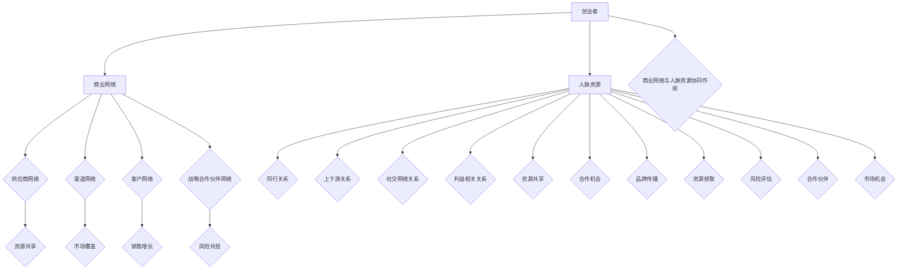

                 

### 《创业者的商业网络构建与人脉资源利用》

> **关键词：商业网络、人脉资源、创业者、构建策略、利用技巧**

> **摘要：本文将深入探讨创业者在构建商业网络和利用人脉资源方面的关键策略。通过分析商业网络的概念、构成和构建原则，以及人脉资源的定义、类型和管理策略，本文旨在帮助创业者提升商业网络与人脉资源的构建与利用能力，从而促进创业成功。**

### 第1章：商业网络概述

#### 1.1 商业网络的概念与重要性

**1.1.1 商业网络的定义**

商业网络，通常指的是在商业活动中，企业与各类合作伙伴、客户、供应商、竞争对手及其他利益相关者之间形成的相互关联、相互依存的网络结构。这种网络不仅包括直接的业务往来，还涵盖了信息、资源、知识、信任等多种要素的交流和互动。

**1.1.2 商业网络在创业中的作用**

对于创业者而言，商业网络扮演着至关重要的角色。它不仅是获取资源、信息、资金、市场机会的重要渠道，也是构建竞争优势、提升企业创新能力、实现持续发展的重要基础。具体来说，商业网络在创业中的作用主要体现在以下几个方面：

- **资源获取**：通过商业网络，创业者可以更容易地获取资金、技术、人才、市场渠道等资源，为企业的快速发展提供支持。
- **信息交流**：商业网络为企业提供了一个信息交流的平台，帮助企业及时了解市场动态、竞争对手信息，从而做出更加明智的商业决策。
- **合作共赢**：商业网络促进了企业间的合作与共赢，通过共享资源、合作研发、联合营销等方式，提高整体效益。
- **创新能力**：商业网络中的知识共享和协同创新，有助于提升企业的创新能力，推动技术进步和产品迭代。

**1.1.3 商业网络与个人职业发展的关系**

商业网络不仅对企业的发展至关重要，对个人职业发展同样具有深远影响。一个良好的商业网络可以帮助个人：

- **拓展视野**：通过商业网络，个人可以接触到不同的行业、不同的业务模式、不同的思维模式，从而拓宽视野，提升自身的综合素质。
- **提升能力**：商业网络中的交流与互动，有助于个人在沟通协调、团队管理、资源整合等方面的能力提升。
- **职业发展**：通过商业网络，个人可以更容易地获得职业发展的机会，如升职、跳槽、创业等。

#### 1.2 商业网络的构成

商业网络是由多种类型的网络构成的复杂系统，主要包括以下几类：

**1.2.1 供应商网络**

供应商网络是指企业与其供应商之间形成的网络关系。供应商网络的重要性在于：

- **稳定供应链**：通过建立稳定的供应商网络，企业可以确保原材料的及时供应，降低生产风险。
- **质量控制**：良好的供应商网络有助于企业对供应商进行质量监控，提高产品质量。
- **成本控制**：通过与供应商建立长期合作关系，企业可以获得更好的价格和优惠条件，降低生产成本。

**1.2.2 渠道网络**

渠道网络是指企业通过渠道合作伙伴将产品或服务传递给最终消费者的网络结构。渠道网络的作用包括：

- **市场覆盖**：渠道网络可以帮助企业快速扩大市场覆盖范围，提高市场占有率。
- **客户服务**：渠道网络为企业提供了更多的服务机会，如售后服务、客户咨询等，提升了客户满意度。
- **品牌传播**：通过渠道网络，企业可以更有效地传播品牌信息，提升品牌知名度。

**1.2.3 客户网络**

客户网络是指企业与客户之间形成的网络关系。客户网络对于企业的重要性体现在：

- **销售增长**：通过客户网络，企业可以更好地了解客户需求，提供个性化服务，从而促进销售增长。
- **品牌忠诚**：良好的客户网络有助于建立客户忠诚度，提高客户粘性。
- **市场反馈**：客户网络为企业提供了一个收集市场反馈的渠道，有助于企业调整产品策略，提升市场竞争力。

**1.2.4 战略合作伙伴网络**

战略合作伙伴网络是指企业与其他企业或机构建立的长期、稳定、互惠互利的合作关系。这种网络关系的特点包括：

- **资源共享**：战略合作伙伴网络可以帮助企业实现资源共享，如技术、人才、市场等。
- **风险共担**：战略合作伙伴网络有助于企业分担市场风险，降低经营风险。
- **协同发展**：战略合作伙伴网络促进了企业的协同发展，提高了整体竞争力。

#### 1.3 商业网络的构建原则

构建一个有效的商业网络需要遵循一系列原则，以下是一些关键原则：

**1.3.1 诚信原则**

诚信是构建商业网络的基础。只有诚信合作，企业之间才能建立长期稳定的合作关系。诚信原则要求企业在合作过程中遵守承诺，履行合同，不欺诈、不隐瞒真相。

**1.3.2 共赢原则**

共赢是商业网络合作的核心目标。只有实现共赢，商业网络中的各方才能持续合作，共同发展。共赢原则要求企业不仅要关注自身利益，还要考虑合作伙伴的利益，实现互利共赢。

**1.3.3 灵活原则**

商业环境不断变化，商业网络也需要具备一定的灵活性。灵活原则要求企业在构建商业网络时，充分考虑市场变化和合作伙伴需求，随时调整合作策略。

**1.3.4 长期原则**

长期原则强调商业网络的稳定性和可持续性。只有长期稳定的合作关系，才能为企业带来持续的利益。长期原则要求企业在合作过程中，注重长远发展，避免短期行为。

### 第2章：人脉资源概述

#### 2.1 人脉资源的定义与作用

**2.1.1 人脉资源的定义**

人脉资源，通常指的是个人在社交网络中所建立的人际关系资源。这些资源不仅包括亲朋好友，还包括同事、合作伙伴、客户、专家等。人脉资源的特点在于其社会性、多样性和动态性。

**2.1.2 人脉资源在商业活动中的作用**

人脉资源在商业活动中具有重要作用，主要体现在以下几个方面：

- **信息传递**：通过人脉资源，个人可以快速获取各种信息，如市场动态、行业趋势、政策变化等，为商业决策提供支持。
- **资源共享**：人脉资源可以促进资源的共享与交流，如资金、技术、人才等，帮助企业实现快速发展。
- **合作机会**：通过人脉资源，个人可以更容易地发现商业合作机会，如合作伙伴、投资者等，推动企业成长。
- **品牌传播**：人脉资源有助于企业品牌的传播和推广，提升企业的知名度和社会影响力。

**2.1.3 人脉资源与创业成功的关联**

人脉资源对于创业成功具有至关重要的影响。具体来说，人脉资源与创业成功之间的关联体现在以下几个方面：

- **资源获取**：人脉资源可以帮助创业者更容易地获取创业所需的资源，如资金、技术、市场等，提高创业成功率。
- **风险评估**：人脉资源提供了更多的信息和视角，有助于创业者进行风险评估，降低创业风险。
- **合作伙伴**：人脉资源有助于创业者找到合适的合作伙伴，实现优势互补，共同发展。
- **市场机会**：人脉资源可以为企业提供更多的市场机会，如新产品推广、新市场开拓等，推动企业快速发展。

#### 2.2 人脉资源的类型

人脉资源可以分为多种类型，以下是一些常见类型：

**2.2.1 同行关系**

同行关系是指与同行之间建立的人际关系。这种关系的特点是专业性强、信息交流频繁。同行关系对于创业者来说，有助于：

- **知识共享**：通过同行关系，创业者可以获取行业最新的知识和技术，提升自身能力。
- **资源互通**：同行关系有助于创业者之间实现资源互通，如资金、人才等，推动共同发展。
- **合作机会**：同行关系提供了更多的合作机会，如项目合作、联合研发等，有助于企业的快速发展。

**2.2.2 上下游关系**

上下游关系是指与上下游企业建立的人际关系。这种关系对于创业者来说，具有重要意义：

- **供应链管理**：上下游关系有助于创业者更好地管理供应链，确保原材料的及时供应和产品的顺利销售。
- **资源整合**：通过上下游关系，创业者可以整合上下游资源，如资金、技术、市场等，提升企业竞争力。
- **合作共赢**：上下游关系促进了企业之间的合作与共赢，实现了资源共享、风险共担。

**2.2.3 社交网络关系**

社交网络关系是指通过社交平台（如微信、LinkedIn等）建立的人际关系。这种关系的特点是覆盖面广、互动频繁：

- **信息获取**：社交网络关系可以帮助创业者快速获取各种信息，如市场动态、行业趋势等，为决策提供支持。
- **资源交流**：社交网络关系提供了资源交流的平台，如资金、技术、人才等，有助于企业的发展。
- **品牌传播**：社交网络关系有助于企业品牌的传播和推广，提升企业的知名度。

**2.2.4 利益相关关系**

利益相关关系是指与企业利益相关的个人或组织建立的人际关系。这种关系包括投资者、合作伙伴、客户、供应商等：

- **资金支持**：利益相关关系可以为创业者提供资金支持，如天使投资、风险投资等，推动企业快速发展。
- **市场机会**：利益相关关系可以为企业提供市场机会，如合作伙伴推荐、客户介绍等，促进企业的销售增长。
- **资源整合**：利益相关关系有助于创业者整合各方资源，如资金、技术、市场等，提升企业竞争力。

#### 2.3 人脉资源的管理策略

人脉资源的管理策略对于提升人脉资源的利用效率具有重要意义。以下是一些关键的管理策略：

**2.3.1 人脉资源分类管理**

分类管理是人脉资源管理的基础。创业者需要对不同类型的人脉资源进行分类，如行业专家、合作伙伴、投资人、客户等，以便更好地进行管理和利用。

**2.3.2 人脉资源维护策略**

维护人脉资源是确保人脉资源持续发挥作用的重要措施。创业者需要定期与重要人脉保持联系，如发送问候、分享行业动态、提供帮助等。

**2.3.3 人脉资源拓展策略**

拓展人脉资源是增加人脉资源数量和质量的关键。创业者可以通过参加行业活动、加入行业协会、利用社交媒体等方式拓展人脉资源。

### 第3章：商业网络构建策略

#### 3.1 商业网络构建的步骤

构建一个有效的商业网络需要遵循一定的步骤，以下是一些关键步骤：

**3.1.1 确定商业目标**

商业目标是指企业在商业网络构建过程中所要实现的目标。创业者需要明确商业目标，如资源获取、市场拓展、合作共赢等，以便有针对性地进行商业网络构建。

**3.1.2 分析市场环境**

分析市场环境是商业网络构建的重要前提。创业者需要了解行业趋势、竞争对手、市场需求等信息，以便确定合适的商业合作伙伴。

**3.1.3 筛选合作伙伴**

筛选合作伙伴是商业网络构建的核心环节。创业者需要根据商业目标和市场环境，选择合适的合作伙伴，如供应商、渠道商、战略合作伙伴等。

**3.1.4 构建商业网络**

构建商业网络是指将合作伙伴整合到商业网络中，形成稳定、可持续的商业合作关系。创业者需要制定详细的商业网络规划，明确各方职责和合作内容。

#### 3.2 商业网络中的关系管理

关系管理是商业网络运行的重要保障。以下是一些关系管理的关键策略：

**3.2.1 建立信任关系**

建立信任关系是商业网络关系管理的基础。创业者需要通过诚信经营、履行合同、遵守承诺等方式建立信任关系，确保合作伙伴的信任和忠诚。

**3.2.2 维护合作关系**

维护合作关系是商业网络持续运行的重要保障。创业者需要定期与合作伙伴沟通，了解合作伙伴的需求和问题，提供支持和帮助，确保合作关系的稳定和持续。

**3.2.3 处理冲突与合作中的问题**

冲突与合作中的问题是商业网络运行中不可避免的问题。创业者需要建立有效的冲突处理机制，及时解决合作中的问题，确保商业网络的顺畅运行。

#### 3.3 商业网络的优化与调整

商业网络并非一成不变，创业者需要根据市场环境和合作伙伴的变化，对商业网络进行优化和调整。以下是一些优化与调整的策略：

**3.3.1 商业网络评估指标**

商业网络评估指标是评估商业网络运行效果的重要工具。创业者需要制定合理的评估指标，如合作满意度、资源利用效率、市场覆盖率等，以便对商业网络进行评估和优化。

**3.3.2 商业网络的动态调整**

商业网络的动态调整是指根据市场环境和合作伙伴的变化，对商业网络进行调整和优化。创业者需要定期评估商业网络的运行状况，及时调整合作策略和合作伙伴。

**3.3.3 商业网络创新**

商业网络创新是指通过引入新的合作模式、技术创新、管理创新等方式，提升商业网络的竞争力和创新能力。创业者需要不断寻求创新，推动商业网络的持续发展。

### 第4章：人脉资源的挖掘与拓展

#### 4.1 人脉资源的挖掘

人脉资源的挖掘是提升人脉资源质量的关键。以下是一些人脉资源挖掘的方法：

**4.1.1 内部人脉资源挖掘**

内部人脉资源挖掘是指通过内部员工、合作伙伴等获取人脉资源。创业者可以通过以下方式挖掘内部人脉资源：

- **员工推荐**：鼓励员工推荐潜在的人脉资源，如同事、朋友、合作伙伴等。
- **内部交流**：通过内部交流平台，如员工论坛、内部邮件等，促进员工之间的交流，挖掘潜在的人脉资源。
- **员工关系管理**：建立良好的员工关系管理机制，加强与员工的沟通和互动，挖掘员工背后的人脉资源。

**4.1.2 外部人脉资源挖掘**

外部人脉资源挖掘是指通过外部渠道获取人脉资源。创业者可以通过以下方式挖掘外部人脉资源：

- **参加行业活动**：积极参加行业会议、展览、论坛等活动，结识行业内的专家学者、企业高管等。
- **利用社交媒体**：通过社交媒体平台，如LinkedIn、微信等，与行业内的专家、企业家、投资人等建立联系。
- **合作方推荐**：与合作方保持良好的合作关系，通过合作方推荐获取潜在的人脉资源。

**4.1.3 利用社交网络挖掘人脉资源**

利用社交网络挖掘人脉资源是现代创业者常用的方式。以下是一些利用社交网络挖掘人脉资源的方法：

- **建立个人品牌**：通过建立个人品牌，提升自身在社交网络中的知名度，吸引更多的优质人脉资源。
- **参与社交活动**：积极参与线上线下的社交活动，与行业内的专家学者、企业家等建立联系。
- **利用社交平台工具**：利用社交平台的工具，如LinkedIn的搜索功能、微信的标签功能等，快速找到潜在的人脉资源。

#### 4.2 人脉资源的拓展

人脉资源的拓展是增加人脉资源数量和质量的关键。以下是一些人脉资源拓展的方法：

**4.2.1 参加行业活动**

参加行业活动是拓展人脉资源的有效途径。创业者可以通过以下方式参加行业活动：

- **参加会议**：积极参加行业会议，结识行业内的专家学者、企业高管等。
- **参展展览**：参加行业展览，与参展企业建立联系，拓展人脉资源。
- **参加论坛**：参加行业论坛，与参会者交流观点，结识潜在合作伙伴。

**4.2.2 通过社交媒体拓展人脉**

通过社交媒体拓展人脉是现代创业者常用的方式。以下是一些通过社交媒体拓展人脉的方法：

- **建立个人品牌**：通过建立个人品牌，提升自身在社交媒体中的影响力，吸引更多的优质人脉资源。
- **参与社交讨论**：积极参与社交媒体上的行业讨论，与行业内的专家学者、企业家等建立联系。
- **利用社交媒体工具**：利用社交媒体的工具，如LinkedIn的搜索功能、微信的标签功能等，快速找到潜在的人脉资源。

**4.2.3 建立个人品牌**

建立个人品牌是拓展人脉资源的重要手段。以下是一些建立个人品牌的方法：

- **撰写专业文章**：通过撰写专业文章，展示自己在行业内的专业知识和见解，提升个人品牌影响力。
- **参与行业讨论**：积极参与行业讨论，与行业内的专家学者、企业家等建立联系，提升个人品牌知名度。
- **参加行业活动**：积极参加行业活动，与行业内的专家学者、企业家等建立联系，扩大个人品牌的影响力。

#### 4.3 人脉资源的管理与利用

人脉资源的管理与利用是确保人脉资源发挥最大价值的关键。以下是一些人脉资源管理与利用的方法：

**4.3.1 人脉资源数据库建设**

人脉资源数据库建设是人脉资源管理的基础。创业者可以通过以下方式建立人脉资源数据库：

- **收集基本信息**：收集人脉资源的基本信息，如姓名、联系方式、职位等，建立详细的档案。
- **分类管理**：根据人脉资源的类型和特点，对人脉资源进行分类管理，便于后续查找和利用。
- **更新数据库**：定期更新人脉资源数据库，确保信息的准确性和及时性。

**4.3.2 人脉资源的分类管理**

人脉资源的分类管理是人脉资源管理的重要策略。创业者可以根据人脉资源的类型、关系密切程度等因素，对人脉资源进行分类管理，以便更好地利用和管理。

**4.3.3 人脉资源的最大化利用**

人脉资源的最大化利用是提升企业竞争力的重要手段。以下是一些人脉资源最大化利用的方法：

- **资源共享**：通过人脉资源，实现资源共享，如资金、技术、市场等，推动企业发展。
- **合作共赢**：通过人脉资源，建立合作共赢的关系，实现互利共赢，提升企业竞争力。
- **信息交流**：通过人脉资源，实现信息交流，获取行业最新动态，提升企业竞争力。

### 第5章：人脉资源在创业中的应用

#### 5.1 人脉资源在创业融资中的应用

人脉资源在创业融资中具有重要作用。以下是人脉资源在创业融资中的应用：

**5.1.1 利用人脉获取投资机会**

通过人脉资源，创业者可以获取更多的投资机会。以下是一些方法：

- **推荐投资机会**：创业者可以通过人脉关系，向投资人推荐自己的创业项目，获取投资机会。
- **参加投资会议**：参加投资会议，与投资人建立联系，获取投资机会。
- **利用社交媒体**：通过社交媒体平台，与投资人建立联系，获取投资机会。

**5.1.2 利用人脉进行投资谈判**

在投资谈判中，人脉资源可以帮助创业者：

- **获取投资建议**：通过人脉资源，获取投资人的投资建议，提高谈判的成功率。
- **建立信任关系**：通过人脉关系，建立与投资人的信任关系，提高投资谈判的效率。

**5.1.3 利用人脉解决融资难题**

人脉资源可以帮助创业者解决融资难题：

- **寻找替代融资渠道**：通过人脉资源，寻找替代融资渠道，如天使投资、风险投资等。
- **获取政策支持**：通过人脉资源，了解政策支持，获取政策支持。

#### 5.2 人脉资源在创业营销中的应用

人脉资源在创业营销中同样具有重要意义。以下是人脉资源在创业营销中的应用：

**5.2.1 利用人脉进行产品推广**

通过人脉资源，创业者可以更有效地进行产品推广：

- **推荐产品**：通过人脉关系，向合作伙伴、朋友、客户等推荐产品，扩大产品知名度。
- **利用社交媒体**：通过社交媒体平台，发布产品信息，吸引潜在客户。

**5.2.2 利用人脉拓展市场渠道**

通过人脉资源，创业者可以拓展市场渠道：

- **寻找合作伙伴**：通过人脉关系，寻找市场渠道合作伙伴，共同拓展市场。
- **利用行业协会**：加入行业协会，与行业内其他企业建立联系，拓展市场渠道。

**5.2.3 利用人脉处理客户关系**

通过人脉资源，创业者可以更好地处理客户关系：

- **解决客户问题**：通过人脉资源，找到行业内的专家，帮助解决客户的疑问和问题。
- **建立客户关系**：通过人脉关系，与客户建立联系，维护客户关系。

#### 5.3 人脉资源在创业管理中的应用

人脉资源在创业管理中同样具有重要价值。以下是人脉资源在创业管理中的应用：

**5.3.1 利用人脉进行团队建设**

通过人脉资源，创业者可以更好地进行团队建设：

- **招募人才**：通过人脉关系，招募优秀人才，构建专业团队。
- **团队协作**：通过人脉关系，建立团队协作机制，提高团队效率。

**5.3.2 利用人脉解决管理难题**

通过人脉资源，创业者可以解决管理难题：

- **获取管理建议**：通过人脉资源，获取行业内的管理建议，解决管理难题。
- **建立管理团队**：通过人脉关系，建立管理团队，共同解决管理难题。

**5.3.3 利用人脉提升企业管理水平**

通过人脉资源，创业者可以提升企业管理水平：

- **参加培训**：通过人脉关系，参加行业内的培训，提升企业管理能力。
- **交流经验**：通过人脉关系，与行业内其他企业进行经验交流，提升企业管理水平。

### 第6章：商业网络与人脉资源协同发展

#### 6.1 商业网络与人脉资源的相互作用

商业网络与人脉资源之间存在着相互促进、相互影响的关系。以下是他们之间的相互作用：

**6.1.1 商业网络对创业成功的影响**

商业网络对创业成功具有显著影响。良好的商业网络可以为企业提供以下支持：

- **资源获取**：通过商业网络，企业可以更容易地获取资金、技术、市场等资源，推动企业发展。
- **市场机会**：商业网络为企业提供了更多的市场机会，如新产品推广、新市场开拓等，促进企业的快速增长。
- **合作共赢**：商业网络促进了企业之间的合作与共赢，通过共享资源、合作研发、联合营销等方式，提高整体效益。

**6.1.2 人脉资源对创业成功的影响**

人脉资源同样对创业成功具有重要影响。丰富的人脉资源可以帮助企业：

- **提升竞争力**：通过人脉资源，企业可以获取更多的市场信息、行业动态等，提升竞争力。
- **拓展渠道**：人脉资源可以帮助企业拓展市场渠道，提高市场覆盖率。
- **解决难题**：在人脉资源的帮助下，企业可以更有效地解决管理、技术、资金等方面的难题。

**6.1.3 商业网络与人脉资源的协同作用**

商业网络与人脉资源之间存在着协同作用，二者共同作用，可以为企业带来更大的价值：

- **资源整合**：通过商业网络，企业可以整合各类资源，如资金、技术、市场等，实现资源最大化利用。
- **创新能力**：商业网络与人脉资源共同作用，可以促进企业创新能力提升，推动技术进步和产品迭代。
- **风险管理**：商业网络与人脉资源协同，有助于企业降低市场风险、经营风险，实现可持续发展。

#### 6.2 商业网络与人脉资源的优化策略

为了提升商业网络和人脉资源的利用效率，创业者需要采取一系列优化策略。以下是一些优化策略：

**6.2.1 基于人脉资源的商业网络优化**

基于人脉资源的商业网络优化，可以从以下几个方面进行：

- **人脉资源评估**：对现有的人脉资源进行评估，筛选出关键人脉资源，优先发展和利用。
- **人脉资源拓展**：通过参加行业活动、利用社交媒体等途径，拓展人脉资源，提高人脉资源的丰富度和质量。
- **人脉资源管理**：建立人脉资源数据库，对人脉资源进行分类管理，确保人脉资源的有效利用。

**6.2.2 基于商业网络的个人人脉资源优化**

基于商业网络的个人人脉资源优化，可以从以下几个方面进行：

- **商业目标明确**：明确个人的商业目标，确保人脉资源的获取和利用与商业目标相匹配。
- **商业网络维护**：定期与商业网络中的合作伙伴保持联系，维护合作关系，确保商业网络的稳定性和持续性。
- **商业网络拓展**：通过参加行业活动、利用社交媒体等途径，拓展商业网络，提高商业网络的覆盖面和多样性。

**6.2.3 商业网络与人脉资源的整合策略**

商业网络与人脉资源的整合策略，可以从以下几个方面进行：

- **信息共享**：建立信息共享平台，实现商业网络与人脉资源之间的信息共享，提高资源利用效率。
- **合作机制**：建立合作机制，促进商业网络与人脉资源之间的合作，实现共赢。
- **资源整合**：通过资源整合，实现商业网络与人脉资源的最大化利用，提高整体效益。

#### 6.3 商业网络与人脉资源协同发展的案例分析

以下是一个商业网络与人脉资源协同发展的案例分析：

**6.3.1 成功案例介绍**

某创业公司是一家专注于智能家居产品研发的企业。在创业初期，公司通过参加行业活动、利用社交媒体等途径，拓展了丰富的人脉资源。同时，公司还建立了广泛的商业网络，与供应商、渠道商、战略合作伙伴等建立了稳定的合作关系。

**6.3.2 案例分析**

通过商业网络与人脉资源的协同发展，该公司实现了以下成果：

- **资源获取**：通过人脉资源和商业网络，公司获得了充足的资金、技术、市场等资源，推动了企业的快速发展。
- **市场拓展**：通过人脉资源和商业网络，公司成功开拓了国内外市场，提高了市场覆盖率。
- **合作共赢**：通过人脉资源和商业网络，公司与供应商、渠道商、战略合作伙伴建立了长期稳定的合作关系，实现了互利共赢。

**6.3.3 启示与借鉴**

该案例表明，商业网络与人脉资源的协同发展对于企业的发展具有重要意义。以下是该案例的启示与借鉴：

- **重视人脉资源**：企业应重视人脉资源的开发和利用，通过参加行业活动、利用社交媒体等途径，拓展人脉资源。
- **建立商业网络**：企业应建立广泛的商业网络，与供应商、渠道商、战略合作伙伴等建立合作关系，实现资源共享和互利共赢。
- **协同发展**：企业应通过商业网络与人脉资源的协同发展，实现资源最大化利用，提高整体效益。

### 第7章：创业者的商业网络与人脉资源构建实战

#### 7.1 实战准备

在开始商业网络与人脉资源的构建之前，创业者需要进行充分的准备。以下是一些实战准备步骤：

**7.1.1 确定创业方向与目标**

创业者首先需要明确自己的创业方向和目标。这包括确定创业行业、市场定位、产品或服务特点等。明确创业方向和目标有助于创业者有针对性地进行商业网络与人脉资源构建。

**7.1.2 制定商业网络与人脉资源构建计划**

创业者需要制定详细的商业网络与人脉资源构建计划。这包括确定商业网络与人脉资源的目标、策略、实施步骤、时间表等。计划应具有可操作性和可行性，以便创业者能够按照计划稳步推进。

**7.1.3 收集相关资源与信息**

在构建商业网络与人脉资源之前，创业者需要收集相关的资源与信息。这包括行业动态、市场趋势、竞争对手信息、潜在合作伙伴信息等。收集资源与信息有助于创业者更好地了解市场环境和行业情况，为商业网络与人脉资源构建提供依据。

#### 7.2 实战步骤

在完成实战准备后，创业者可以按照以下步骤进行商业网络与人脉资源的构建：

**7.2.1 建立初步商业网络**

创业者可以通过以下方式建立初步商业网络：

- **参加行业活动**：积极参加行业会议、展览、论坛等活动，结识行业内的专家学者、企业高管等。
- **利用社交媒体**：通过社交媒体平台，与行业内的专家、企业家、投资人等建立联系。
- **合作方推荐**：通过现有合作伙伴的推荐，结识其他行业内的企业或个人。

**7.2.2 拓展人脉资源**

在建立初步商业网络的基础上，创业者可以拓展人脉资源：

- **建立个人品牌**：通过撰写专业文章、参与行业讨论、参加行业活动等方式，建立个人品牌，提升自身在行业内的知名度。
- **利用社交媒体**：通过社交媒体平台，与行业内的专家、企业家、投资人等建立联系。
- **参加社交活动**：积极参加社交活动，与各类人脉建立联系，扩大人脉资源。

**7.2.3 管理与维护商业网络与人脉资源**

为了确保商业网络与人脉资源的持续稳定，创业者需要对其进行管理与维护：

- **分类管理**：根据人脉资源的类型和特点，对人脉资源进行分类管理，便于后续查找和利用。
- **定期沟通**：定期与重要人脉保持联系，如发送问候、分享行业动态、提供帮助等。
- **更新数据库**：定期更新人脉资源数据库，确保信息的准确性和及时性。

**7.2.4 应用商业网络与人脉资源推动创业发展**

在完成商业网络与人脉资源的构建后，创业者需要将其应用于创业发展：

- **资源获取**：利用商业网络与人脉资源，获取创业所需的资金、技术、市场等资源。
- **合作共赢**：通过商业网络与人脉资源，建立合作共赢的关系，实现资源共享、风险共担。
- **市场拓展**：利用商业网络与人脉资源，拓展市场渠道，提高市场覆盖率。

#### 7.3 实战案例分析

以下是一个创业者的商业网络与人脉资源构建实战案例分析：

**7.3.1 案例背景**

某创业者王先生，在创业初期，通过参加行业活动、利用社交媒体等途径，建立了初步的商业网络和人脉资源。随着创业的发展，王先生逐渐认识到商业网络与人脉资源的重要性，决定进一步完善和优化商业网络与人脉资源。

**7.3.2 案例实施**

1. **参加行业活动**：王先生积极参加各类行业活动，如行业会议、展览、论坛等，结识了众多行业内的专家、企业高管等，建立了广泛的商业网络。

2. **建立个人品牌**：王先生通过撰写专业文章、参与行业讨论、参加行业活动等方式，建立了个人品牌，提升了在行业内的知名度。

3. **利用社交媒体**：王先生通过社交媒体平台，与行业内的专家、企业家、投资人等建立了联系，拓展了人脉资源。

4. **分类管理**：王先生根据人脉资源的类型和特点，对人脉资源进行分类管理，便于后续查找和利用。

5. **定期沟通**：王先生定期与重要人脉保持联系，如发送问候、分享行业动态、提供帮助等，维护了良好的人脉关系。

**7.3.3 案例效果分析**

通过商业网络与人脉资源的构建，王先生的创业公司取得了显著成效：

- **资源获取**：通过商业网络与人脉资源，王先生成功获取了创业所需的资金、技术、市场等资源，推动了企业的发展。

- **合作共赢**：通过商业网络与人脉资源，王先生建立了合作共赢的关系，与供应商、渠道商、战略合作伙伴等建立了长期稳定的合作关系。

- **市场拓展**：通过商业网络与人脉资源，王先生成功拓展了市场渠道，提高了市场覆盖率。

**7.3.4 案例启示**

该案例表明，商业网络与人脉资源的构建对于创业成功具有重要意义。以下是该案例的启示：

- **重视商业网络与人脉资源的构建**：创业者应重视商业网络与人脉资源的构建，通过参加行业活动、利用社交媒体等途径，拓展人脉资源，建立商业网络。

- **建立个人品牌**：创业者应通过建立个人品牌，提升自身在行业内的知名度，扩大人脉资源。

- **分类管理**：创业者应分类管理人脉资源，便于后续查找和利用。

- **定期沟通**：创业者应定期与重要人脉保持联系，维护良好的人脉关系。

### 附录

#### 附录 A：商业网络与人脉资源构建工具与资源推荐

**A.1 商业网络分析工具推荐**

- **NodeXL**：一款免费的商业网络分析工具，可用于分析社交网络、电子邮件网络等。

- **Gephi**：一款开源的社交网络分析工具，支持数据导入、可视化和分析等功能。

- **Excel**：通过Excel的图表功能，可以简单地进行商业网络分析。

**A.2 人脉资源拓展平台推荐**

- **LinkedIn**：专业的社交网络平台，可用于拓展商业人脉。

- **微信**：国内的社交媒体平台，适用于拓展国内人脉资源。

- **微信企业号**：适用于企业内部的社交和沟通。

**A.3 商业网络与人脉资源管理软件推荐**

- **CRM系统**：如Salesforce、金蝶CRM等，可用于管理商业网络和人脉资源。

- **客户关系管理系统**：如Easycrm、灵图CRM等，可用于管理客户关系和人脉资源。

#### 附录 B：商业网络与人脉资源构建策略模板

**B.1 商业网络构建策略模板**

1. **明确商业目标**：确定商业网络构建的具体目标和预期成果。

2. **分析市场环境**：了解行业趋势、竞争对手、市场需求等信息，为商业网络构建提供依据。

3. **筛选合作伙伴**：根据商业目标和市场环境，选择合适的合作伙伴。

4. **构建商业网络**：制定详细的商业网络规划，明确各方职责和合作内容。

5. **关系管理**：建立信任关系，维护合作关系，处理合作中的问题。

6. **优化与调整**：根据市场变化和合作伙伴的需求，对商业网络进行优化和调整。

**B.2 人脉资源拓展策略模板**

1. **确定拓展目标**：明确人脉资源拓展的具体目标和预期成果。

2. **分析自身优势**：了解自身的优势和能力，确定适合的拓展方向。

3. **拓展途径**：通过参加行业活动、利用社交媒体、合作方推荐等途径，拓展人脉资源。

4. **建立个人品牌**：通过撰写专业文章、参与行业讨论、参加行业活动等方式，建立个人品牌。

5. **分类管理**：根据人脉资源的类型和特点，对人脉资源进行分类管理。

6. **定期维护**：定期与重要人脉保持联系，维护良好的人脉关系。

**B.3 商业网络与人脉资源协同发展策略模板**

1. **信息共享**：建立信息共享平台，实现商业网络与人脉资源之间的信息共享。

2. **合作机制**：建立合作机制，促进商业网络与人脉资源之间的合作。

3. **资源整合**：通过资源整合，实现商业网络与人脉资源的最大化利用。

4. **协同发展**：通过商业网络与人脉资源的协同发展，实现资源最大化利用，提高整体效益。

#### 附加内容：

**核心概念与联系：**

以下是一个用于展示商业网络与人脉资源交互关系的Mermaid流程图：



**核心算法原理讲解：**

本文没有涉及具体的算法原理，主要关注商业网络与人脉资源的构建策略。但在实际应用中，创业者可以使用一些算法和工具来优化商业网络与人脉资源的构建。

例如，可以使用网络分析算法来评估商业网络的稳定性，选择合适的合作伙伴。以下是一个简单的网络分析算法伪代码：

```python
# 网络分析算法伪代码

def analyze_network(network):
    # 计算网络中心性指标，如度数中心性、 closeness中心性、betweenness中心性等
    centrality_scores = calculate_centrality(network)
    
    # 根据中心性指标筛选关键节点
    key_nodes = select_key_nodes(centrality_scores)
    
    # 对关键节点进行进一步分析，如资源获取能力、影响力等
    key_node_attributes = analyze_key_nodes(key_nodes)
    
    return key_node_attributes
```

**数学模型和数学公式：**

本文主要关注策略和实践，没有涉及具体的数学模型和数学公式。但在实际应用中，创业者可以使用一些数学模型来评估商业网络和人脉资源的效率，如：

- **网络效率模型**：用于评估商业网络中信息的传递效率。

- **社会网络分析模型**：用于分析人脉资源的紧密程度和影响力。

以下是一个简单的网络效率模型公式：

$$
\eta = \frac{1}{n(n-1)} \sum_{i \neq j} d_{ij}
$$

其中，$\eta$表示网络效率，$n$表示网络中的节点数，$d_{ij}$表示节点$i$和节点$j$之间的最短路径长度。

**项目实战：**

虽然本文没有提供具体的代码实现，但创业者可以根据以下示例，结合书中策略，运用编程技能来构建和维护自己的商业网络与人脉资源。

**示例 1：利用Python编写自动化人脉拓展工具**

```python
import networkx as nx
import matplotlib.pyplot as plt

# 创建一个空的图
G = nx.Graph()

# 添加节点和边
G.add_nodes_from(['A', 'B', 'C', 'D'])
G.add_edges_from([('A', 'B'), ('A', 'C'), ('B', 'D')])

# 绘制图
nx.draw(G, with_labels=True)
plt.show()

# 分析网络
print("节点度数中心性：", nx.degree_centrality(G))
print("网络效率：", nx.network_ef

