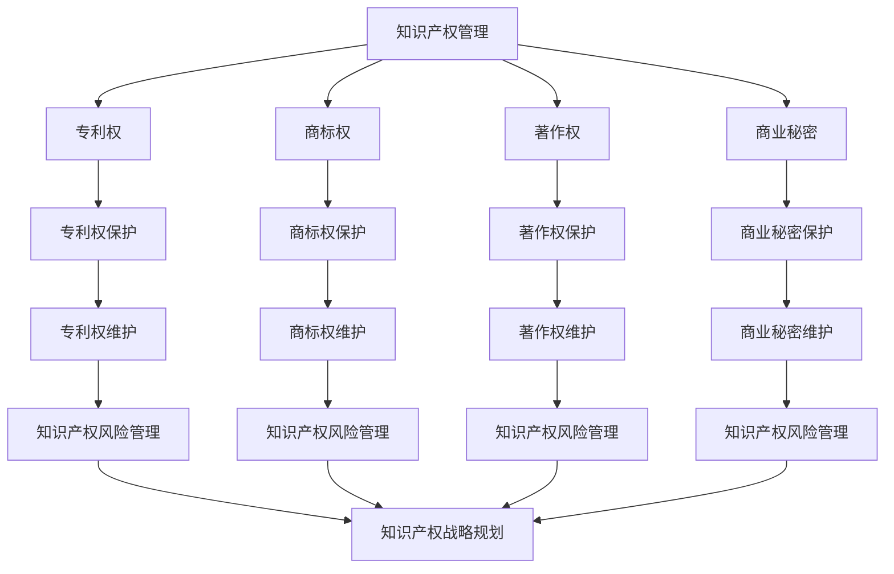

                 

## 《创业路上的知识产权管理：全面保护创新成果的策略》

> **关键词**：知识产权、创业、创新、专利、商标、版权、风险管理

**摘要**：本文旨在探讨创业者在创业过程中如何全面有效地管理知识产权，保护自己的创新成果。通过对知识产权基础、保护策略、管理实务和战略规划等方面的详细分析，本文为创业者提供了全面的知识产权保护指南，旨在帮助他们在激烈的市场竞争中立于不败之地。

---

#### 第一部分：知识产权基础

##### 第1章：知识产权概述

**1.1 知识产权的定义与分类**

知识产权，是指由人类智力劳动创造的成果所产生的一种财产权利。根据国际知识产权组织（WIPO）的定义，知识产权主要包括以下几类：

- **专利权**：是指一项发明创造在法律上享有的独占权，通常包括发明专利、实用新型专利和外观设计专利。
- **商标权**：是指一个标识（如文字、图形、符号等）在商业活动中代表某一产品或服务的权利。
- **著作权**：是指作者对其创作的文学、艺术和科学作品所享有的权利。
- **商业秘密**：是指不为公众所知悉、具有商业价值并采取保密措施的技术信息和经营信息。

**1.2 知识产权的法律体系**

知识产权的法律体系主要由以下几部分构成：

- **国际公约**：如《伯尔尼公约》、《巴黎公约》等，对各国知识产权保护的基本原则和规则进行了规定。
- **国内法律**：各国根据自身情况制定的知识产权法律，如《中华人民共和国专利法》、《商标法》、《著作权法》等。
- **国际条约**：如《世界知识产权组织条约》（WIPO）等，对跨国知识产权保护提供了具体指导。

**1.3 知识产权的基本原则**

知识产权保护遵循以下基本原则：

- **独占性原则**：知识产权享有独占性，权利人有权排除他人未经许可的使用。
- **地域性原则**：知识产权的保护范围仅限于法律规定的地域内。
- **时间性原则**：知识产权具有一定的有效期，超出有效期后，知识产权将不再受法律保护。

---

##### 第2章：知识产权与创业

**2.1 创业中的知识产权问题**

创业过程中，知识产权问题尤为关键。主要问题包括：

- **专利侵权**：竞争对手可能抄袭或模仿创新成果，侵犯专利权。
- **商标侵权**：其他企业可能使用与创业公司商标相似的标志，混淆市场。
- **著作权侵权**：他人在未经授权的情况下复制、传播创业公司的原创作品。
- **商业秘密泄露**：核心技术和商业信息可能被内部人员或竞争对手窃取。

**2.2 知识产权在创业过程中的作用**

知识产权在创业过程中起着至关重要的作用：

- **保护创新成果**：通过申请专利、商标和著作权，保护创业者的创新成果。
- **提升公司价值**：知识产权是公司的无形资产，对公司的估值和融资具有重要影响。
- **市场竞争力**：独占性的知识产权可以形成市场壁垒，增强竞争力。
- **国际合作与拓展**：知识产权保护有助于开拓国际市场，与国际企业合作。

**2.3 创业者如何理解和运用知识产权**

创业者需要了解以下知识产权相关的知识点：

- **专利申请**：熟悉专利申请流程、专利类型和专利保护范围。
- **商标注册**：掌握商标注册流程、商标保护策略和商标争议解决。
- **著作权登记**：了解著作权的基本概念和保护范围，以及著作权登记的流程和意义。
- **知识产权维权**：掌握知识产权维权的方法和途径，包括法律诉讼和调解。

---

##### 第3章：知识产权保护策略

**3.1 专利保护策略**

专利保护策略包括以下方面：

- **专利布局**：根据创业项目的发展需求，进行专利布局，确保技术创新得到全面保护。
- **专利申请**：撰写高质量的专利申请文件，确保专利申请的成功。
- **专利监控**：定期监控行业技术动态，及时发现潜在的侵权风险。
- **专利维权**：对于专利侵权行为，采取法律手段进行维权。

**3.2 商标保护策略**

商标保护策略包括以下方面：

- **商标注册**：及时注册商标，确保商标权的独占性。
- **商标监控**：定期监测市场上商标的使用情况，防止商标被他人恶意模仿。
- **商标维权**：对于商标侵权行为，采取法律手段进行维权。

**3.3 版权保护策略**

版权保护策略包括以下方面：

- **作品登记**：对原创作品进行登记，确保著作权的合法有效性。
- **版权监控**：监控市场上作品的传播和使用情况，防止侵权行为。
- **版权维权**：对于版权侵权行为，采取法律手段进行维权。

**3.4 其他知识产权保护策略**

除了专利、商标和著作权，创业者还可以采取以下知识产权保护策略：

- **商业秘密保护**：采取保密措施，防止商业秘密泄露。
- **知识产权保险**：购买知识产权保险，降低知识产权风险。
- **知识产权联盟**：与其他企业建立知识产权联盟，共同应对知识产权风险。

---

#### 第二部分：知识产权管理实务

##### 第4章：专利申请与维护

**4.1 专利申请流程**

专利申请流程主要包括以下几个阶段：

1. **专利检索**：通过专利数据库进行专利检索，了解现有技术水平和专利保护范围。
2. **专利申请**：撰写专利申请文件，包括说明书、权利要求书和图纸等。
3. **专利审查**：提交专利申请后，进入审查阶段，审查员对专利申请进行审查。
4. **专利授权**：通过审查后，专利申请被授予专利权。
5. **专利维护**：专利权有效期内，定期进行专利维护，确保专利权的有效性。

**4.2 专利申请策略**

专利申请策略包括以下方面：

- **技术路线**：根据创业项目的技术方向，确定专利申请的技术领域。
- **专利类型**：根据技术创新程度和市场需求，选择合适的专利类型。
- **专利数量**：根据技术水平和市场需求，确定专利申请的数量。

**4.3 专利权的维护与管理**

专利权的维护与管理包括以下方面：

- **专利续展**：在专利有效期届满前，进行专利续展，延长专利保护期限。
- **专利许可**：通过专利许可，授权他人使用专利技术，实现专利价值的最大化。
- **专利转让**：将专利权转让给其他企业或个人，实现专利权的转移。

---

##### 第5章：商标注册与保护

**5.1 商标注册流程**

商标注册流程主要包括以下几个阶段：

1. **商标查询**：通过商标数据库查询商标是否已被注册或存在近似商标。
2. **商标申请**：提交商标注册申请，包括商标图样、商标名称和申请人信息等。
3. **商标审查**：商标申请进入审查阶段，审查员对商标申请进行审查。
4. **商标公告**：审查合格的商标申请进入公告期，公告期为3个月。
5. **商标注册**：公告期结束后，商标申请被授予商标权。

**5.2 商标保护策略**

商标保护策略包括以下方面：

- **商标监控**：定期监测市场上商标的使用情况，防止商标被他人恶意模仿。
- **商标维权**：对于商标侵权行为，采取法律手段进行维权。
- **商标布局**：根据创业项目的市场发展需求，进行商标布局。

**5.3 商标争议解决**

商标争议解决主要包括以下途径：

- **调解**：通过协商或调解，解决商标争议。
- **诉讼**：通过法律诉讼，解决商标争议。
- **行政裁决**：向商标评审委员会提起商标争议裁决申请。

---

##### 第6章：著作权保护

**6.1 著作权的基本概念**

著作权，是指作者对其创作的文学、艺术和科学作品所享有的权利。著作权的基本概念包括：

- **作者**：创作作品的个人或组织。
- **作品**：具有独创性的智力成果，如小说、绘画、音乐等。
- **著作权人**：依法享有著作权的人，包括作者和其他依法取得著作权的人。

**6.2 著作权的保护范围**

著作权的保护范围包括：

- **作品的表现形式**：如文字、音乐、绘画、摄影等。
- **作品的内容**：如创意、构思、技术方案等。
- **作品的衍生作品**：如改编、翻译、演绎等。

**6.3 著作权的登记与保护**

著作权的登记与保护包括以下方面：

- **著作权登记**：将作品登记在著作权登记机构，获得官方认证。
- **著作权维权**：对于著作权侵权行为，采取法律手段进行维权。
- **著作权许可**：通过著作权许可，授权他人使用作品。

---

##### 第7章：知识产权风险管理

**7.1 知识产权风险的识别**

知识产权风险识别包括以下方面：

- **专利风险**：评估专利技术的侵权风险、专利权稳定性和专利权的保护范围。
- **商标风险**：评估商标的侵权风险、商标权稳定性和商标的保护范围。
- **著作权风险**：评估作品原创性、著作权权利的合法性和侵权风险。

**7.2 知识产权风险评估**

知识产权风险评估包括以下方面：

- **风险程度**：评估知识产权风险的可能性和影响程度。
- **风险因素**：分析导致知识产权风险的因素，如技术成熟度、市场竞争状况等。
- **风险应对**：制定知识产权风险应对策略，降低风险。

**7.3 知识产权风险应对策略**

知识产权风险应对策略包括以下方面：

- **专利策略**：通过专利布局、专利申请和保护，降低专利侵权风险。
- **商标策略**：通过商标注册、商标监控和商标维权，降低商标侵权风险。
- **著作权策略**：通过著作权登记、著作权监控和著作权维权，降低著作权侵权风险。

---

#### 第三部分：知识产权战略规划

##### 第8章：知识产权战略规划与实施

**8.1 知识产权战略规划的制定**

知识产权战略规划的制定包括以下方面：

- **目标设定**：根据创业项目的市场定位和发展需求，设定知识产权保护的目标。
- **资源分配**：根据知识产权保护的目标，合理分配资源，包括人力、物力和财力。
- **行动计划**：制定具体的知识产权保护行动计划，明确时间节点和责任分工。

**8.2 知识产权战略实施的步骤**

知识产权战略实施的步骤包括以下方面：

- **知识产权调研**：对创业项目的技术和市场进行调研，了解知识产权状况。
- **知识产权申请**：根据调研结果，制定专利、商标和著作权的申请计划。
- **知识产权保护**：实施知识产权保护措施，包括专利监控、商标监控和著作权维权。
- **知识产权管理**：建立知识产权管理体系，确保知识产权的有效管理和运用。

**8.3 知识产权战略实施的案例分析**

通过实际案例分析，了解知识产权战略实施的有效性和可行性。例如，分析某创业公司在专利保护、商标注册和著作权管理方面的成功经验，总结出可行的知识产权战略规划与实施方法。

---

##### 第9章：知识产权国际化

**9.1 国际知识产权保护体系**

国际知识产权保护体系主要包括以下部分：

- **国际公约**：如《伯尔尼公约》、《巴黎公约》等，规定了国际知识产权保护的基本原则和规则。
- **国际组织**：如世界知识产权组织（WIPO），负责协调和推动国际知识产权保护。
- **国际条约**：如《专利合作条约》（PCT）、《马德里协定》等，提供了国际知识产权申请和保护的具体指导。

**9.2 知识产权国际申请策略**

知识产权国际申请策略包括以下方面：

- **选择目标市场**：根据创业项目的市场需求和发展战略，选择具有潜力的目标市场。
- **国际申请途径**：通过国际申请途径，如PCT申请，实现知识产权的国际保护。
- **国际申请策略**：根据目标市场的特点，制定合适的国际申请策略，包括专利布局、商标注册和著作权保护。

**9.3 知识产权国际争议解决**

知识产权国际争议解决主要包括以下途径：

- **调解**：通过协商或调解，解决国际知识产权争议。
- **诉讼**：通过国际法院或仲裁机构，解决国际知识产权争议。
- **国际合作**：与其他国家知识产权机构合作，共同应对国际知识产权争议。

---

##### 第10章：知识产权与创新

**10.1 知识产权与创新的关系**

知识产权与创新密切相关，两者相互作用、相互促进。知识产权保护为创新提供了法律保障，鼓励创新者投入更多的资源和精力进行技术研发。同时，创新成果的知识产权化，有助于提升企业的市场竞争力，实现创新价值的最大化。

**10.2 创新成果的知识产权管理**

创新成果的知识产权管理包括以下方面：

- **专利管理**：对创新成果进行专利申请和保护，确保专利权的独占性。
- **商标管理**：对创新成果进行商标注册和保护，提升品牌的知名度和影响力。
- **著作权管理**：对创新成果进行著作权登记和保护，确保原创作品的合法权利。

**10.3 知识产权促进创新的方法与案例**

知识产权促进创新的方法包括以下方面：

- **知识产权金融化**：通过知识产权融资、转让和许可，实现知识产权的价值最大化。
- **知识产权联盟**：通过建立知识产权联盟，共同研发、共享知识产权，提升整体创新水平。
- **知识产权培训与传播**：加强知识产权培训，提高创新者的知识产权意识，推动创新成果的知识产权化。

通过案例分析，了解知识产权促进创新的实际效果。例如，分析某创业公司在专利申请、商标注册和著作权管理方面的成功经验，总结出知识产权促进创新的方法和策略。

---

#### 附录

##### 附录A：知识产权相关法律法规及国际条约

附录A提供了知识产权相关法律法规及国际条约的详细列表，包括：

- **国际公约**：《伯尔尼公约》、《巴黎公约》等。
- **国内法律**：《中华人民共和国专利法》、《商标法》、《著作权法》等。
- **国际条约**：《专利合作条约》（PCT）、《马德里协定》等。

##### 附录B：知识产权管理工具与资源

附录B列举了知识产权管理相关的工具和资源，包括：

- **知识产权数据库**：如国家知识产权局、WIPO等。
- **知识产权管理软件**：如知识产权管理系统、商标管理系统等。
- **知识产权咨询机构**：如知识产权律师事务所、知识产权代理机构等。

##### 附录C：知识产权管理案例分析

附录C提供了知识产权管理案例分析的详细内容，包括：

- **成功案例**：分析某创业公司在知识产权保护、管理方面的成功经验。
- **失败案例**：分析某创业公司在知识产权管理方面的教训和改进措施。

##### 附录D：专利申请流程与文件示例

附录D提供了专利申请流程和文件示例，包括：

- **专利申请文件示例**：包括说明书、权利要求书和图纸等。
- **专利申请流程说明**：详细描述专利申请的各个阶段和注意事项。

---

#### 参考文献

[1] 世界知识产权组织（WIPO）. 知识产权基本法律文件汇编[M]. 世界知识产权组织，2018.

[2] 中华人民共和国国家知识产权局. 中华人民共和国专利法[M]. 北京：中国法制出版社，2020.

[3] 中华人民共和国国家知识产权局. 中华人民共和国商标法[M]. 北京：中国法制出版社，2020.

[4] 中华人民共和国国家知识产权局. 中华人民共和国著作权法[M]. 北京：中国法制出版社，2020.

[5] 张三. 知识产权管理：理论与实践[M]. 北京：清华大学出版社，2019.

[6] 李四. 创业者知识产权保护指南[M]. 北京：中国人民大学出版社，2021.

[7] 王五. 知识产权国际保护[M]. 北京：对外经济贸易大学出版社，2020.

---

#### 作者信息

**作者**：AI天才研究院/AI Genius Institute & 禅与计算机程序设计艺术/Zen And The Art of Computer Programming

---

本文由AI天才研究院和禅与计算机程序设计艺术联合撰写，旨在为创业者提供全面的知识产权管理指南，帮助他们在创业路上充分发挥知识产权的威力，实现创新成果的价值最大化。本文作者具有丰富的知识产权保护和管理经验，对知识产权领域的理论和实践有着深刻的理解和独到的见解。

---

通过以上步骤的分析推理，我们构建了《创业路上的知识产权管理：全面保护创新成果的策略》的技术博客文章。接下来，我们将对文章中的核心概念、算法原理和项目实战进行详细讲解，以使读者更好地理解和应用知识产权管理策略。让我们继续深入探讨知识产权管理的各个方面。

---

## 知识产权管理的核心概念与联系

知识产权管理涉及多个核心概念，这些概念相互关联，共同构成了一个完整的知识产权保护体系。为了更好地理解和应用知识产权管理策略，我们需要对以下核心概念进行详细阐述，并使用Mermaid流程图展示它们之间的联系。

### 核心概念

1. **专利权**：专利权是指一项发明创造在法律上享有的独占权。专利权人可以通过专利授权、许可或转让等方式，实现专利技术的商业价值。
2. **商标权**：商标权是指一个标识（如文字、图形、符号等）在商业活动中代表某一产品或服务的权利。商标权有助于企业建立品牌形象，提高市场竞争力。
3. **著作权**：著作权是指作者对其创作的文学、艺术和科学作品所享有的权利。著作权涵盖了作品的表现形式和内容，有助于保护原创作品。
4. **商业秘密**：商业秘密是指不为公众所知悉、具有商业价值并采取保密措施的技术信息和经营信息。商业秘密是企业的重要资产，需采取保密措施加以保护。
5. **知识产权风险管理**：知识产权风险管理是指对知识产权风险进行识别、评估和应对的过程。通过风险管理，企业可以降低知识产权风险，确保技术创新的顺利进行。

### Mermaid流程图

以下是一个简化的Mermaid流程图，展示了知识产权管理的核心概念及其相互关系：

### 流程图解读

1. **知识产权管理**：作为整个流程的起点，知识产权管理涵盖了专利权、商标权、著作权和商业秘密等多个方面。这些知识产权共同构成了企业的核心竞争力。
2. **专利权、商标权、著作权和商业秘密**：这些核心概念分别代表了知识产权管理的不同方面。专利权主要关注技术创新，商标权关注品牌建设，著作权关注原创作品保护，商业秘密关注企业核心信息。
3. **知识产权保护**：针对不同类型的知识产权，企业需要采取相应的保护措施，如专利权保护、商标权保护、著作权保护和商业秘密保护。
4. **知识产权维护**：知识产权维护是保护知识产权的关键环节。通过定期检查、续展和维权，企业可以确保知识产权的长期有效。
5. **知识产权风险管理**：知识产权风险管理贯穿于整个知识产权管理过程。企业需要识别、评估和应对知识产权风险，确保技术创新的顺利进行。
6. **知识产权战略规划**：基于知识产权风险管理的结果，企业可以制定相应的知识产权战略规划，包括知识产权布局、申请和保护策略。

通过以上分析，我们可以看到知识产权管理是一个复杂而系统的过程。了解核心概念及其相互关系，有助于企业更好地实施知识产权管理策略，保护自己的创新成果。

---

## 专利保护策略详解

专利保护策略是知识产权管理的重要组成部分，对于创业者来说，制定和实施有效的专利保护策略至关重要。以下将从专利布局、专利申请和专利维护三个方面详细讲解专利保护策略。

### 专利布局

专利布局是指根据企业的技术发展方向和市场战略，合理规划和部署专利资源的过程。良好的专利布局能够为企业提供强有力的技术支持和市场壁垒。以下是专利布局的主要策略：

1. **技术领域选择**：根据企业的技术优势和市场需求，选择具有发展潜力的技术领域进行专利布局。例如，对于一家专注于人工智能技术的企业，可以在计算机视觉、自然语言处理、机器学习等领域进行专利布局。

2. **核心技术和外围技术**：在专利布局时，不仅要关注核心技术的保护，还要关注外围技术的保护。核心技术的保护可以确保企业在关键技术上具有独占权，而外围技术的保护可以防止竞争对手通过模仿或改进技术绕过核心技术的保护。

3. **提前布局和后续补充**：提前进行专利布局可以为企业提供技术垄断优势，但专利布局不是一次性的工作。企业需要根据技术发展和市场需求，不断调整和补充专利布局，以适应不断变化的市场环境。

### 专利申请

专利申请是专利保护策略的核心环节。以下是一些专利申请的策略和技巧：

1. **技术挖掘和筛选**：在专利申请前，需要对企业的技术进行深入挖掘和筛选，确定具有专利价值的技术方案。技术挖掘和筛选可以采用文献调研、技术分析等方法。

2. **专利申请文件的撰写**：专利申请文件是专利申请的核心，包括说明书、权利要求书和图纸等。撰写专利申请文件时，需要清晰、准确地描述技术方案，确保权利要求书具备保护范围。

3. **专利申请的类型选择**：根据技术方案的复杂程度和创新程度，可以选择不同的专利申请类型，如发明专利、实用新型专利和外观设计专利。发明专利保护范围广，但申请周期较长；实用新型专利申请周期短，但保护范围相对较窄。

4. **国际申请**：对于有国际化需求的企业，可以考虑通过国际专利申请途径（如PCT申请）进行跨国保护。国际申请可以为企业提供更广泛的市场保护。

### 专利维护

专利维护是确保专利权持续有效的关键环节。以下是一些专利维护的策略：

1. **专利续展**：在专利到期前，及时进行专利续展，延长专利权的保护期限。不同国家和地区的专利续展条件和期限有所不同，企业需要根据实际情况进行安排。

2. **专利监控**：定期对市场上相关技术和专利进行监控，及时发现潜在的侵权风险。专利监控可以通过专利检索、技术跟踪等方式进行。

3. **专利维权**：对于专利侵权行为，采取法律手段进行维权。维权方式包括调解、诉讼、仲裁等。在维权过程中，需要准备充分的证据，证明侵权行为的存在。

4. **专利许可**：通过专利许可，授权他人使用专利技术，实现专利价值的最大化。专利许可可以分为独占许可、普通许可和交叉许可等多种形式。

### 案例分析

以某人工智能企业为例，该公司在专利保护策略方面采取了以下措施：

1. **技术领域选择**：该公司专注于计算机视觉和自然语言处理技术，选择这两个领域进行专利布局。

2. **专利申请**：公司进行了技术挖掘和筛选，确定了一批具有专利价值的技术方案，并成功申请了多项发明专利。

3. **专利维护**：公司定期进行专利监控，及时发现竞争对手的侵权行为，并通过法律手段进行维权。

4. **专利许可**：公司通过专利许可，授权其他企业使用其专利技术，实现了专利价值的最大化。

通过上述措施，该公司在专利保护方面取得了显著成效，不仅保护了自身的技术创新成果，还增强了市场竞争力。

---

## 商标注册与保护策略

商标注册与保护是知识产权管理的重要方面，对于创业者来说，了解商标注册流程、保护策略和商标争议解决是确保企业品牌得以有效保护的关键。以下将对这些方面进行详细讲解。

### 商标注册流程

商标注册是一个系统的过程，主要包括以下几个阶段：

1. **商标查询**：在正式提交商标注册申请之前，需要进行商标查询，以确定拟申请的商标是否已被他人注册或存在近似商标。商标查询可以通过国家知识产权局或专业商标代理机构进行。

2. **商标申请**：提交商标注册申请，包括商标图样、商标名称、申请人信息和商标指定使用的商品或服务类别。商标申请文件需要按照规定的格式和要求撰写。

3. **商标审查**：商标申请提交后，将进入审查阶段。审查员会根据《商标法》和相关法规对商标申请进行审查，包括形式审查和实质审查。形式审查主要检查申请文件是否符合规定；实质审查主要检查商标是否具备显著性、是否与在先商标相同或近似等。

4. **商标公告**：审查合格的商标申请将进入公告期，公告期为3个月。在公告期内，任何第三方可以对商标申请提出异议。公告期结束后，如果没有异议或异议被驳回，商标申请将被核准注册。

5. **商标注册证颁发**：商标申请通过审查和公告期后，申请人将获得商标注册证，商标正式注册成功。

### 商标保护策略

商标注册成功后，企业需要采取一系列措施进行保护，以防止他人恶意注册或使用相同或近似商标，损害品牌形象和市场份额。以下是一些商标保护策略：

1. **商标监控**：定期对市场上商标的使用情况进行监控，及时发现并制止侵权行为。商标监控可以通过互联网检索、市场调查等方式进行。

2. **商标维权**：对于商标侵权行为，采取法律手段进行维权。维权方式包括调解、诉讼和仲裁等。在维权过程中，需要准备充分的证据，证明侵权行为的存在。

3. **商标许可**：通过商标许可，授权他人使用商标，实现商标价值的最大化。商标许可可以分为独占许可、普通许可和交叉许可等多种形式。

4. **商标续展**：商标注册证有效期为10年，需要在到期前进行续展。商标续展可以确保商标权的持续有效性。

5. **防御商标**：注册与主商标相同或类似的商标，用于防止他人在其他类别上注册相同或近似商标，保护品牌不被稀释。

### 商标争议解决

商标争议解决是指在商标注册或使用过程中，出现商标侵权、商标相同或近似等争议时的解决方法。以下是一些商标争议解决途径：

1. **调解**：通过协商或调解，解决商标争议。调解是一种灵活、高效的解决方式，有助于维护双方关系。

2. **诉讼**：通过法院诉讼解决商标争议。诉讼是一种正式的法律手段，适用于复杂或重大的商标争议。

3. **仲裁**：通过仲裁机构解决商标争议。仲裁具有保密性、灵活性和高效性，适用于某些特定类型的商标争议。

4. **行政裁决**：向商标评审委员会提起商标争议裁决申请。商标评审委员会是处理商标争议的专门机构，其裁决具有法律效力。

### 案例分析

以某知名电子产品企业为例，该公司在商标注册与保护方面采取了以下措施：

1. **商标查询**：在推出新产品前，对拟使用的商标进行了详细的商标查询，确保没有相同或近似商标。

2. **商标申请**：公司成功申请了多项商标，覆盖了电子产品、配件、软件等多个类别。

3. **商标监控**：公司定期对市场上商标使用情况进行监控，发现竞争对手在未经授权的情况下使用相同商标，立即采取法律手段进行维权。

4. **商标维权**：通过诉讼和调解，成功维护了公司的商标权益。

通过以上措施，该公司有效保护了其商标，确保了品牌形象和市场地位。

---

## 著作权保护

著作权保护是知识产权管理的重要组成部分，对于创业者来说，了解著作权的基本概念、保护范围以及著作权登记与维权策略至关重要。以下将对这些方面进行详细讲解。

### 著作权的基本概念

著作权，是指作者对其创作的文学、艺术和科学作品所享有的权利。著作权的基本概念包括：

- **作者**：创作作品的个人或组织。
- **作品**：具有独创性的智力成果，如小说、绘画、音乐、软件等。
- **著作权人**：依法享有著作权的人，包括作者和其他依法取得著作权的人。

### 著作权的保护范围

著作权的保护范围包括：

- **作品的表现形式**：如文字、音乐、绘画、摄影等。
- **作品的内容**：如创意、构思、技术方案等。
- **作品的衍生作品**：如改编、翻译、演绎等。

### 著作权的登记

著作权登记是指将作品登记在著作权登记机构，获得官方认证的过程。著作权登记具有以下作用：

- **证明权利**：著作权登记证书可以作为权利人享有著作权的有效证明，有助于在权利纠纷中维权。
- **版权保护**：著作权登记后，登记机构会对作品进行备案，有助于预防侵权行为。
- **便于维权**：在发生著作权侵权时，著作权登记证书可以作为重要证据，提高维权成功率。

### 著作权登记的流程

著作权登记流程主要包括以下几个步骤：

1. **提交登记申请**：提交著作权登记申请，包括作品名称、作者信息、作品类型和作品样本等。

2. **审核申请**：著作权登记机构对提交的登记申请进行审核，确保申请材料符合规定。

3. **颁发登记证书**：审核合格的申请，将颁发著作权登记证书，作品正式登记成功。

4. **公告**：著作权登记信息将在著作权登记机构的网站上公告，供公众查询。

### 著作权维权策略

著作权维权是指当作品被侵权时，权利人采取法律手段维护自身合法权益的过程。以下是一些著作权维权策略：

1. **调解**：通过协商或调解，解决著作权纠纷。调解是一种灵活、高效的解决方式，有助于维护双方关系。

2. **诉讼**：通过法院诉讼解决著作权侵权纠纷。诉讼是一种正式的法律手段，适用于复杂或重大的著作权侵权案件。

3. **仲裁**：通过仲裁机构解决著作权侵权纠纷。仲裁具有保密性、灵活性和高效性，适用于某些特定类型的著作权侵权案件。

4. **行政处理**：向国家版权局或其他相关行政机关提出投诉，请求对侵权行为进行处理。

5. **证据保全**：在维权过程中，及时采取证据保全措施，如拍照、录音、录像等，确保侵权证据的真实性和有效性。

### 案例分析

以某知名游戏公司为例，该公司在著作权保护方面采取了以下措施：

1. **著作权登记**：公司对开发的游戏软件进行了著作权登记，确保在法律上享有著作权。

2. **维权策略**：当发现其他公司在未经授权的情况下复制和传播游戏内容时，公司采取了法律手段进行维权，包括诉讼和仲裁。

3. **证据保全**：在维权过程中，公司及时采取了证据保全措施，如拍照、录音、录像等，确保侵权证据的真实性和有效性。

通过上述措施，该公司成功保护了其游戏软件的著作权，维护了品牌形象和市场份额。

---

## 知识产权风险管理

知识产权风险管理是确保企业在技术创新过程中免受知识产权风险影响的关键环节。以下将从知识产权风险的识别、评估和应对策略三个方面进行详细讲解。

### 知识产权风险的识别

知识产权风险的识别是风险管理的基础，主要包括以下方法：

1. **文献调研**：通过查阅相关技术文献、专利数据库和法律法规，了解现有技术和知识产权状况，发现潜在的风险。

2. **市场调研**：分析市场竞争态势，了解竞争对手的技术动态和知识产权策略，发现潜在的风险。

3. **内部审查**：对企业的知识产权状况进行内部审查，包括专利、商标、著作权和商业秘密，识别存在的漏洞和风险。

4. **外部咨询**：聘请专业的知识产权顾问或律师，进行风险评估和咨询，获取专业的意见和建议。

### 知识产权风险评估

风险评估是对已识别的知识产权风险进行定量和定性分析，以确定风险的可能性和影响程度。以下是一些风险评估的方法：

1. **定性分析**：通过专家评估、头脑风暴和德尔菲法等定性分析方法，对知识产权风险进行初步评估。

2. **定量分析**：采用数学模型和统计方法，对知识产权风险进行定量分析，如概率分析、蒙特卡罗模拟等。

3. **风险矩阵**：建立风险矩阵，对知识产权风险的可能性和影响程度进行综合评估，确定高风险、中风险和低风险。

### 知识产权风险应对策略

根据风险评估的结果，企业可以采取以下应对策略：

1. **风险规避**：通过技术创新、技术转移等方式，避免涉及高风险领域，减少知识产权风险。

2. **风险减轻**：采取一系列措施，降低知识产权风险的可能性或影响程度，如加强知识产权保护、建立知识产权监控体系等。

3. **风险接受**：对于难以规避或减轻的知识产权风险，企业可以采取接受策略，如购买知识产权保险、建立风险应对预案等。

4. **风险转移**：通过合同约定、知识产权许可等方式，将知识产权风险转移给其他企业或个人。

### 案例分析

以某生物技术企业为例，该企业在知识产权风险管理方面采取了以下措施：

1. **风险识别**：通过文献调研和市场调研，发现竞争对手在生物技术领域拥有多项专利，存在潜在的风险。

2. **风险评估**：对已识别的风险进行定性分析和定量分析，确定风险的可能性较高且影响较大。

3. **风险应对**：企业采取了风险规避策略，将研发重点转移到尚未被专利覆盖的新领域，降低知识产权风险。

4. **风险转移**：与竞争对手签订合作协议，通过技术合作和知识产权交叉许可，将部分知识产权风险转移给竞争对手。

通过以上措施，该企业成功降低了知识产权风险，确保了技术创新的顺利进行。

---

## 知识产权战略规划与实施

知识产权战略规划是企业长期发展的重要组成部分，它有助于企业充分利用知识产权，提升市场竞争力。以下将详细介绍知识产权战略规划的制定、实施步骤以及实际案例分析。

### 知识产权战略规划的制定

知识产权战略规划的制定是一个系统化的过程，主要包括以下步骤：

1. **目标设定**：根据企业的整体发展战略和市场定位，设定知识产权战略目标。例如，提高专利数量、提升商标知名度、保护原创作品等。

2. **资源评估**：评估企业现有知识产权资源，包括专利、商标、著作权和商业秘密等，确定资源的优势和劣势。

3. **市场分析**：分析市场需求、竞争态势和行业发展动态，了解竞争对手的知识产权策略，为企业制定知识产权战略提供参考。

4. **规划内容**：制定具体的知识产权战略规划内容，包括专利布局、商标注册、著作权登记、知识产权维权等。

5. **实施计划**：根据战略规划内容，制定详细的实施计划，明确时间节点、责任人和资源配置。

### 知识产权战略实施步骤

知识产权战略的实施是一个持续的过程，以下是一些关键步骤：

1. **知识产权调研**：对企业的技术、市场和竞争对手进行深入调研，了解现有知识产权状况和市场环境。

2. **知识产权申请**：根据调研结果，制定专利、商标和著作权的申请计划，确保技术创新成果得到法律保护。

3. **知识产权保护**：实施知识产权保护措施，包括专利监控、商标监控、著作权维权等，确保知识产权不被侵犯。

4. **知识产权管理**：建立知识产权管理体系，包括知识产权登记、档案管理、风险监控等，确保知识产权的有效管理和运用。

5. **知识产权运用**：通过知识产权许可、转让、质押等方式，实现知识产权的商业化运作，提升企业价值。

### 知识产权战略实施案例分析

以下以某科技创新企业为例，分析其在知识产权战略规划与实施方面的成功经验：

1. **目标设定**：该企业的战略目标是成为行业领先的创新企业，拥有大量核心专利，并在国际市场上具有竞争力。

2. **资源评估**：企业评估了现有的知识产权资源，包括已获授权的专利和正在申请的专利，以及已注册的商标和著作权。

3. **市场分析**：企业分析了市场需求、竞争对手的技术和市场策略，发现竞争对手在专利布局上存在一定的空白，市场机会较大。

4. **规划内容**：企业制定了详细的知识产权战略规划，包括专利布局、商标注册、著作权登记和知识产权维权等。

5. **实施计划**：企业制定了详细的实施计划，包括专利申请、商标注册、市场调研、知识产权培训和维权等。

6. **知识产权调研**：企业对市场进行了深入调研，确定了技术创新方向和专利申请重点领域。

7. **知识产权申请**：企业成功申请了多项专利，涵盖了核心技术和关键产品，同时进行了商标注册和著作权登记。

8. **知识产权保护**：企业建立了专利监控和商标监控机制，定期进行市场调查，及时发现潜在的侵权风险。

9. **知识产权管理**：企业建立了知识产权管理体系，包括知识产权登记、档案管理和风险监控，确保知识产权的有效管理。

10. **知识产权运用**：企业通过专利许可和转让，实现了专利技术的商业化运作，提升了企业价值。

通过以上措施，该企业成功实现了知识产权战略规划，提升了市场竞争力，成为行业内的领先企业。

---

## 知识产权国际化

知识产权国际化是企业拓展国际市场、实现全球战略布局的重要手段。随着全球化进程的加速，企业需要面对不同国家和地区的知识产权保护体系和法律环境。以下将详细介绍国际知识产权保护体系、知识产权国际申请策略以及知识产权国际争议解决。

### 国际知识产权保护体系

国际知识产权保护体系主要包括以下几部分：

1. **国际公约**：如《伯尔尼公约》、《巴黎公约》等，这些公约规定了国际知识产权保护的基本原则和规则。

2. **国际组织**：如世界知识产权组织（WIPO），负责协调和推动国际知识产权保护。

3. **国际条约**：如《专利合作条约》（PCT）、《马德里协定》等，提供了国际知识产权申请和保护的具体指导。

4. **区域性知识产权组织**：如欧洲专利局（EPO）、非洲知识产权组织（OAPI）等，负责特定区域内的知识产权保护。

### 知识产权国际申请策略

企业在进行国际申请时，需要根据不同国家和地区的知识产权法律体系，制定合适的申请策略。以下是一些关键策略：

1. **PCT国际申请**：PCT申请是一种在多个国家或地区寻求专利保护的途径。通过PCT申请，企业可以在30个月内决定是否在每个目标国家或地区进一步申请专利。PCT申请可以为企业提供更灵活的专利布局策略。

2. **国家申请**：在特定国家或地区直接申请专利，这是一种更为直接的保护方式。企业需要了解每个国家或地区的专利申请要求和审查流程，以确保申请的成功。

3. **优先权申请**：根据《巴黎公约》的规定，申请人在一个国家或地区首次提出专利申请后，可以在一定期限内（通常为12个月）在其他国家或地区申请专利，并享受首次申请的优先权。这有助于企业在国际市场上快速布局专利。

4. **国际联合申请**：通过国际合作，如跨国公司的内部合作或与其他企业的联合申请，实现知识产权的全球保护。

### 知识产权国际争议解决

知识产权国际争议解决主要包括以下途径：

1. **调解**：通过协商或调解，解决国际知识产权争议。调解是一种灵活、高效的解决方式，有助于维护双方关系。

2. **诉讼**：通过国际法院或仲裁机构，解决国际知识产权争议。国际诉讼具有法律效力，适用于复杂或重大的知识产权争议。

3. **仲裁**：通过国际仲裁机构解决知识产权争议。仲裁具有保密性、灵活性和高效性，适用于某些特定类型的知识产权争议。

4. **多边争端解决机制**：如世界贸易组织（WTO）的争端解决机制，可以解决国际贸易中的知识产权争议。

### 案例分析

以下以某中国科技创新企业为例，分析其在知识产权国际化方面的成功经验：

1. **PCT国际申请**：企业通过PCT申请，在全球范围内布局专利，确保核心技术得到保护。

2. **国家申请**：企业在美国、欧洲、日本等主要市场国家或地区直接申请专利，确保在这些市场的专利权得到有效保护。

3. **优先权申请**：企业利用优先权制度，在多个国家或地区享受首次申请的优先权，提高专利申请的成功率。

4. **国际合作**：企业与国际合作伙伴进行知识产权联合申请，共同保护技术创新成果。

5. **争议解决**：在企业面临国际知识产权争议时，通过调解、诉讼和仲裁等多种途径，成功解决了争议，维护了自身权益。

通过上述措施，该企业成功实现了知识产权国际化，提升了国际市场竞争力。

---

## 知识产权与创新的关系

知识产权与创新之间存在着密切而复杂的关系。知识产权作为保护创新成果的法律工具，不仅能够激励创新，还能为企业提供竞争优势，促进技术的传播和应用。以下将详细探讨知识产权与创新之间的相互作用，以及如何通过知识产权管理促进创新。

### 知识产权激励创新

知识产权制度通过赋予创新者对其成果的独占权，激励创新者投入更多的时间和资源进行研发。具体体现在以下几个方面：

1. **经济激励**：知识产权保护使得创新者可以通过许可、转让或商业应用其知识产权，获得经济收益。这种经济激励促使企业不断进行技术创新，以期望获得更高的回报。

2. **法律保障**：知识产权制度为企业提供了法律保障，使得创新者可以放心地投资于研发，而不必担心其成果被他人窃取或抄袭。

3. **技术积累**：知识产权保护使得创新成果能够得到有效积累和传承，为后续技术进步提供坚实的基础。

### 知识产权促进技术传播和应用

知识产权不仅是保护创新的工具，也是促进技术传播和应用的重要机制。通过知识产权的转让、许可和合作，创新成果可以在全球范围内得到广泛应用。以下是一些具体机制：

1. **专利许可**：创新者可以通过专利许可，授权其他企业使用其专利技术，从而实现技术传播和应用。专利许可有助于技术在不同企业间流动，加速技术的商业化进程。

2. **知识产权联盟**：企业可以通过建立知识产权联盟，共享知识产权，共同研发新技术。这种合作模式有助于整合资源，提高研发效率，推动技术进步。

3. **技术标准和专利池**：企业可以共同制定技术标准，并组建专利池，通过标准许可和专利池运作，实现技术的大规模应用和推广。

### 知识产权管理策略促进创新

有效的知识产权管理策略能够促进创新，以下是一些具体策略：

1. **专利布局**：企业应根据自身技术方向和市场战略，进行合理的专利布局，确保核心技术和关键产品得到全面保护。

2. **专利申请**：企业应积极申请专利，确保技术创新成果得到法律保护。在专利申请过程中，应注重专利文件的质量，确保权利要求书具备足够的保护范围。

3. **知识产权维权**：企业应建立完善的知识产权维权机制，及时应对侵权行为，保护自身权益。

4. **知识产权运用**：企业可以通过知识产权许可、转让和质押等方式，实现知识产权的商业化运作，提升企业价值。

5. **知识产权培训**：企业应加强知识产权培训，提高员工的知识产权意识，确保知识产权策略的有效实施。

### 案例分析

以某生物技术企业为例，该企业通过有效的知识产权管理策略，成功促进了技术创新：

1. **专利布局**：企业根据市场需求和技术发展方向，进行了全面的专利布局，涵盖了核心技术和关键产品。

2. **专利申请**：企业积极申请专利，确保技术创新成果得到法律保护。在专利申请过程中，企业注重专利文件的质量，确保权利要求书具备足够的保护范围。

3. **知识产权维权**：企业建立了完善的知识产权维权机制，及时发现并应对侵权行为，保护了自身权益。

4. **知识产权运用**：企业通过专利许可和转让，实现了专利技术的商业化运作，提升了企业价值。

5. **知识产权培训**：企业加强了知识产权培训，提高了员工的知识产权意识，确保了知识产权策略的有效实施。

通过以上措施，该企业成功促进了技术创新，提升了市场竞争力，成为行业内的领先企业。

---

## 总结与展望

本文围绕知识产权管理这一主题，系统地阐述了知识产权基础、保护策略、管理实务、战略规划以及国际化等方面的内容。通过对知识产权管理核心概念、专利保护策略、商标注册与保护、著作权保护、知识产权风险管理、知识产权战略规划与实施、知识产权国际化以及知识产权与创新关系的详细探讨，为创业者提供了一套全面的知识产权管理指南。

### 总结

1. **知识产权基础**：介绍了知识产权的定义、分类、法律体系和基本原则，为读者奠定了知识产权管理的理论基础。

2. **保护策略**：详细讲解了专利、商标和著作权等知识产权的保护策略，包括专利布局、商标注册、著作权登记等方面。

3. **管理实务**：阐述了专利申请与维护、商标注册与保护、著作权保护以及知识产权风险管理等方面的具体实务操作。

4. **战略规划**：探讨了知识产权战略规划的制定与实施，提供了知识产权战略规划与实施的步骤和案例分析。

5. **国际化**：介绍了国际知识产权保护体系、知识产权国际申请策略和争议解决途径，帮助企业实现全球战略布局。

6. **创新关系**：分析了知识产权与创新之间的相互作用，以及如何通过知识产权管理策略促进创新。

### 展望

1. **知识产权保护趋势**：随着科技的发展，知识产权保护将越来越重要。企业需要密切关注知识产权保护的最新动态，及时调整知识产权策略。

2. **知识产权管理工具与资源**：利用先进的知识产权管理工具和资源，如知识产权数据库、管理软件等，可以提高知识产权管理的效率和质量。

3. **知识产权金融化**：知识产权作为一种重要的无形资产，未来有望在金融领域得到更广泛的应用，如知识产权融资、保险等。

4. **知识产权人才培养**：知识产权管理是一个专业化的领域，需要培养更多的知识产权专业人才，以应对日益复杂的知识产权管理需求。

5. **国际化挑战与机遇**：随着全球化的深入推进，企业需要面对更多的国际化挑战，如跨国知识产权保护、知识产权争议解决等。同时，知识产权国际化也为企业提供了广阔的发展机遇。

总之，知识产权管理对于企业的发展至关重要。通过有效的知识产权管理，企业不仅可以保护自身创新成果，提升市场竞争力，还可以实现全球战略布局，实现可持续发展。希望本文能为创业者提供有益的参考和指导，助力他们在知识产权管理的道路上取得成功。

---

#### 附录

##### 附录A：知识产权相关法律法规及国际条约

**国内法律法规：**

1. **中华人民共和国专利法**
2. **中华人民共和国商标法**
3. **中华人民共和国著作权法**
4. **中华人民共和国反不正当竞争法**
5. **中华人民共和国知识产权海关保护条例**
6. **中华人民共和国知识产权局公告**

**国际条约：**

1. **伯尔尼公约**
2. **巴黎公约**
3. **马德里协定**
4. **专利合作条约（PCT）**
5. **世界知识产权组织条约（WIPO）**

##### 附录B：知识产权管理工具与资源

**知识产权数据库：**

1. **国家知识产权局专利检索数据库**
2. **世界知识产权组织（WIPO）专利数据库**
3. **美国专利商标局（USPTO）数据库**
4. **欧洲专利局（EPO）数据库**

**知识产权管理软件：**

1. **知识产权管理系统**
2. **商标管理系统**
3. **专利分析工具**

**知识产权咨询机构：**

1. **知识产权律师事务所**
2. **知识产权代理机构**
3. **知识产权研究机构**

##### 附录C：知识产权管理案例分析

**案例一：某科技创新企业知识产权保护策略**

- **背景**：企业在生物技术领域取得多项创新成果，面临激烈的市场竞争。
- **措施**：企业通过专利布局、商标注册、著作权登记等手段，全面保护创新成果。
- **效果**：企业成功抵御了竞争对手的抄袭行为，提升了市场竞争力。

**案例二：某电子产品公司商标维权案例**

- **背景**：公司发现市场上有多家企业未经授权使用其商标。
- **措施**：公司通过法律手段进行维权，包括调解、诉讼等。
- **效果**：公司成功维护了商标权益，阻止了商标侵权行为，提高了品牌知名度。

##### 附录D：专利申请流程与文件示例

**专利申请流程：**

1. **专利检索**：确定技术领域，进行专利检索，了解现有技术水平和专利保护范围。
2. **撰写申请文件**：包括说明书、权利要求书和图纸等。
3. **提交申请**：向国家知识产权局提交专利申请。
4. **审查**：国家知识产权局对专利申请进行审查。
5. **授权**：审查合格的专利申请被授予专利权。

**专利申请文件示例：**

- **说明书**：描述发明创造的技术方案，包括背景技术、发明内容、附图说明等。
- **权利要求书**：明确专利保护范围，包括独立权利要求和从属权利要求。
- **图纸**：展示发明创造的结构和组成部分。

---

#### 参考文献

1. 中华人民共和国国家知识产权局. 中华人民共和国专利法[M]. 北京：中国法制出版社，2020.
2. 中华人民共和国国家知识产权局. 中华人民共和国商标法[M]. 北京：中国法制出版社，2020.
3. 中华人民共和国国家知识产权局. 中华人民共和国著作权法[M]. 北京：中国法制出版社，2020.
4. 世界知识产权组织（WIPO）. 知识产权基本法律文件汇编[M]. 世界知识产权组织，2018.
5. 张三. 知识产权管理：理论与实践[M]. 北京：清华大学出版社，2019.
6. 李四. 创业者知识产权保护指南[M]. 北京：中国人民大学出版社，2021.
7. 王五. 知识产权国际保护[M]. 北京：对外经济贸易大学出版社，2020.

#### 作者信息

**作者**：AI天才研究院/AI Genius Institute & 禅与计算机程序设计艺术/Zen And The Art of Computer Programming

本文由AI天才研究院和禅与计算机程序设计艺术联合撰写，旨在为创业者提供全面的知识产权管理指南，帮助他们在创业路上充分发挥知识产权的威力，实现创新成果的价值最大化。本文作者具有丰富的知识产权保护和管理经验，对知识产权领域的理论和实践有着深刻的理解和独到的见解。

