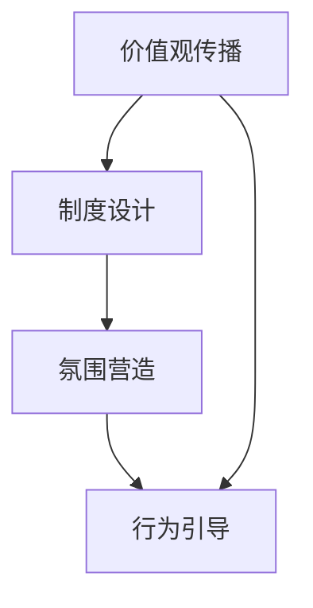
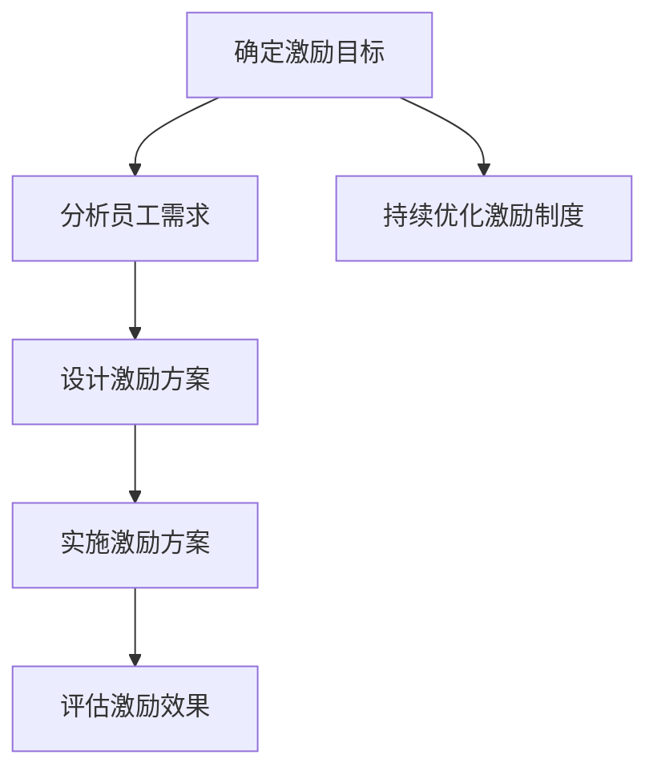
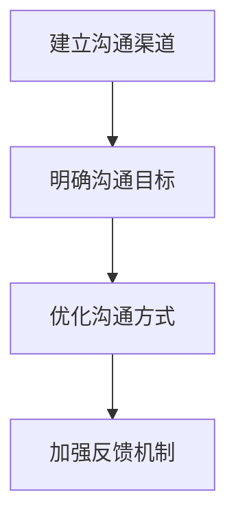
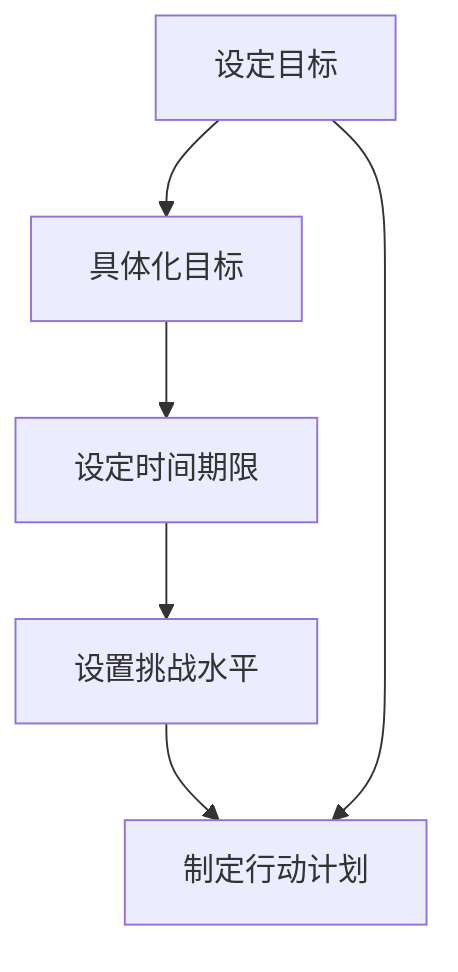
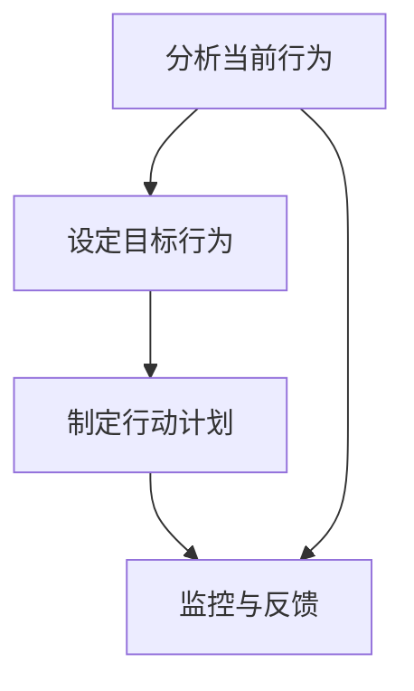
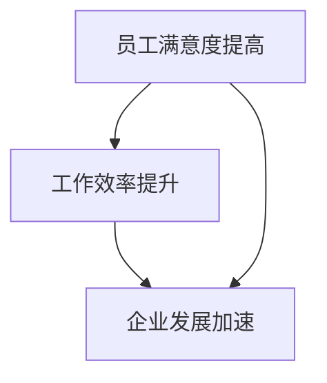
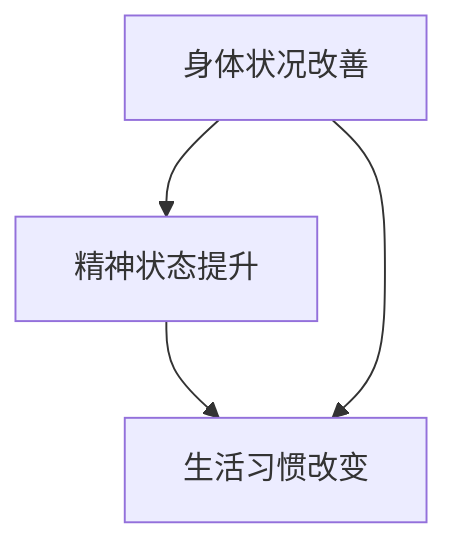
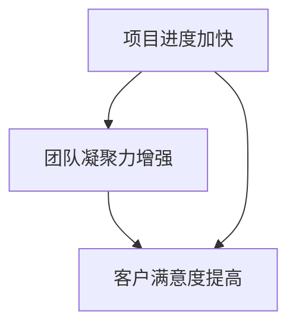

                 

# 利用福格模型设计管理激励机制

## 摘要

随着企业竞争的日益激烈，如何有效地激励员工，提高组织绩效，成为企业管理者面临的重大挑战。福格模型作为一种综合性的激励理论，以其独特的行为激励机制，为企业提供了有效的管理工具。本文旨在通过深入解析福格模型的理论基础、核心要素及其实际应用，为管理者提供一套系统、有效的激励方案设计方法。文章将从以下几个方面展开论述：首先介绍福格模型的背景和基本概念；然后详细阐述福格模型的理论基础及其工作原理；接着分析福格模型的核心要素及其相互作用；最后通过实际案例说明福格模型在组织管理和个人行为改变中的应用，并提供设计管理激励机制的实践策略。

## 第1章 引言

### 1.1 书籍背景

随着知识经济的到来，企业越来越依赖于员工的智慧和创造力。如何有效地激发员工的潜力，提高工作效率，成为企业管理者关注的焦点。传统的激励理论，如马斯洛的需求层次理论、赫茨伯格的双因素理论等，虽然在某种程度上能够解释员工行为，但在实际应用中存在一定的局限性。为了解决这些问题，美国心理学家BJ·福格提出了一种全新的激励理论——福格模型。

### 1.2 福格模型概述

福格模型（BJ Fogg Behavior Model）是一种基于行为科学的心理模型，旨在解释和预测人们的行为。该模型的核心观点是：行为的发生取决于三个要素的交集：诱因（Motivation）、触发器（Trigger）和个人优势（Ability）。只有当这三个要素同时存在且相互匹配时，行为才会发生。

### 1.3 书籍结构安排

本文将分为七个章节进行详细阐述。第一章作为引言，介绍福格模型的背景和基本概念；第二章讨论福格模型的理论基础；第三章解析福格模型的核心要素；第四章至第六章分别探讨福格模型在组织管理和个人行为改变中的应用；第七章对福格模型的设计原则和应用技巧进行总结与展望。

## 第2章 福格模型理论基础

### 2.1 自我决定理论

自我决定理论（Self-Determination Theory，简称SDT）是由美国心理学家瑞安（Ryan）和德西（Deci）提出的一种心理学理论，主要研究人类行为的动机。SDT认为，人类行为主要受到三种基本心理需求的驱动：自主性、胜任感和归属感。这三种需求共同构成了自我决定的五个要素，分别是：认知自由、情感自由、行为自由、能力感和关联感。

### 2.1.1 自我决定的五个要素

#### 认知自由

认知自由是指个体在思考和决策过程中拥有自由选择的权利，不受外界因素的干扰。这种自由选择的权利能够提高个体的内在动机，使其更加主动地参与行为。

#### 情感自由

情感自由是指个体在情感表达和情感体验方面拥有自由的权利，不受外界限制。这种自由能够使个体在情感上感到满足，从而增强行为的动力。

#### 行为自由

行为自由是指个体在行为选择和行动方面拥有自由的权利，不受外界约束。这种自由能够使个体在行为上感到自主，从而提高行为的积极性。

#### 能力感

能力感是指个体在完成特定任务时，感受到自己的能力和实力。这种感受能够增强个体的自信心，使其更有动力去实现目标。

#### 关联感

关联感是指个体与他人建立联系和关系的感觉。这种感受能够增强个体的社会支持，使其在行为上更有动力。

### 2.1.2 自我决定与行为激励

自我决定理论指出，自我决定的五个要素是内在动机的来源，能够驱动个体主动参与行为。而内在动机比外在动机更能激发个体的持久行为。因此，在管理实践中，管理者应该关注如何满足员工的自我决定需求，从而提高员工的内在动机和工作效率。

### 2.2 福格模型的概念

福格模型（BJ Fogg Behavior Model）是由美国斯坦福大学行为设计实验室的创始人BJ·福格提出的一种行为心理学模型。该模型的核心观点是：行为的发生取决于三个要素的交集：诱因（Motivation）、触发器（Trigger）和个人优势（Ability）。只有当这三个要素同时存在且相互匹配时，行为才会发生。

### 2.2.1 福格模型的三个核心要素

#### 诱因（Motivation）

诱因是指激励个体采取特定行为的因素。诱因可以分为两类：内在诱因和外在诱因。内在诱因是指个体自身对行为的内在兴趣和动机，如兴趣、好奇心等；外在诱因是指外部环境对行为的激励，如奖励、惩罚等。

#### 触发器（Trigger）

触发器是指激发个体采取特定行为的因素。触发器可以分为两类：情境触发器和事件触发器。情境触发器是指特定情境下能够激发行为的因素，如工作时间、工作任务等；事件触发器是指特定事件下能够激发行为的因素，如生日、节日等。

#### 个人优势（Ability）

个人优势是指个体具备完成特定行为的技能和能力。个人优势可以分为两类：技能优势和能力优势。技能优势是指个体在特定领域具备的专业技能，如编程技能、沟通技能等；能力优势是指个体在个人特质方面具备的优势，如自信心、毅力等。

### 2.2.2 福格模型的工作原理

福格模型认为，行为的发生是一个动态的过程，受到三个要素的交互作用。当诱因、触发器和个人优势同时存在且相互匹配时，行为就会发生。具体来说：

1. **诱因**：诱因是行为的初始动力，能够激发个体的行为动机。
2. **触发器**：触发器是行为的启动因素，将诱因转化为具体的行为。
3. **个人优势**：个人优势是行为的实现条件，决定个体是否能够将行为付诸实践。

只有当这三个要素同时存在且相互匹配时，行为才会发生。如果任何一个要素缺失，行为就会受阻。

### 2.3 福格模型的应用范围

福格模型作为一种综合性的行为激励理论，具有广泛的应用范围。以下分别介绍福格模型在组织管理和个人行为改变中的应用。

### 2.3.1 组织管理与福格模型

在组织管理中，福格模型可以用于设计激励机制，提高员工的工作积极性和工作效率。管理者可以通过以下方式应用福格模型：

1. **分析员工需求**：了解员工的内在动机和外在激励，为设计有效的激励机制提供依据。
2. **设计触发器**：通过设置特定情境或事件，激发员工的行为动机。
3. **利用个人优势**：发现员工的技能优势和能力优势，为其提供发展空间和机会。
4. **持续优化激励机制**：根据员工的行为反馈，不断调整和优化激励机制，确保其有效性。

### 2.3.2 个人行为改变与福格模型

在个人行为改变中，福格模型可以用于制定和实施行为改变计划。以下是一些应用福格模型的建议：

1. **设定明确的目标**：明确个人目标，使其具有挑战性但又不失可实现性。
2. **分析行为动机**：了解自己的内在动机和外在激励，为行为改变提供动力。
3. **设计触发器**：通过设置特定的情境或事件，激发自己的行为动机。
4. **利用个人优势**：发现自己在技能和能力方面的优势，为自己的行为改变提供支持。
5. **持续监测和调整**：在行为改变过程中，持续监测自己的行为表现，并根据情况进行调整。

## 第3章 福格模型核心要素解析

### 3.1 诱因

诱因是福格模型中的关键要素之一，它决定了个体是否愿意采取某种行为。诱因可以分为内在诱因和外在诱因。

### 3.1.1 诱因的类型

#### 内在诱因

内在诱因是指个体自身对行为的内在兴趣和动机，如兴趣、好奇心等。内在诱因通常源于个体的内心需求，如自我实现、成就感等。内在诱因的特点是持久性强、受个体自主控制。

#### 外在诱因

外在诱因是指外部环境对行为的激励，如奖励、惩罚等。外在诱因通常源于外部压力或利益，如金钱奖励、职位晋升等。外在诱因的特点是即时性强、受外部因素影响。

### 3.1.2 诱因的作用机制

诱因通过以下几个方面影响个体行为：

1. **激发动机**：诱因能够激发个体的行为动机，使其愿意采取特定行为。
2. **提高行为意愿**：诱因能够提高个体采取特定行为的意愿，使其更加主动地参与行为。
3. **影响行为选择**：诱因能够影响个体在多种行为选择中的决策，使其倾向于选择具有更高诱因的行为。

### 3.1.3 设计有效的诱因策略

为了设计有效的诱因策略，管理者需要考虑以下几个方面：

1. **了解员工需求**：了解员工的内在需求和外在激励，为设计个性化的诱因策略提供依据。
2. **平衡内外在诱因**：在设计中同时考虑内在诱因和外在诱因，以实现更全面的行为激励。
3. **适时调整诱因**：根据员工行为的变化和反馈，及时调整诱因策略，确保其有效性。
4. **避免过度依赖外在诱因**：过度依赖外在诱因可能导致员工产生依赖心理，降低内在动机。

### 3.2 触发器

触发器是福格模型中的另一个关键要素，它决定了个体何时采取某种行为。触发器可以分为情境触发器和事件触发器。

### 3.2.1 触发器的定义

触发器是指能够激发个体采取特定行为的因素。触发器通常与特定情境或事件相关联，如工作时间、工作任务等。触发器的特点是具有明确的触发条件和特定的影响范围。

### 3.2.2 触发器的类型

#### 情境触发器

情境触发器是指与特定情境相关的触发器，如工作时间、工作任务等。情境触发器通常与个体的工作环境和职责相关联，能够在特定情境下激发个体的行为动机。

#### 事件触发器

事件触发器是指与特定事件相关的触发器，如生日、节日等。事件触发器通常与个体的个人生活相关联，能够在特定事件下激发个体的行为动机。

### 3.2.3 触发器的设计原则

为了设计有效的触发器，管理者需要考虑以下几个方面：

1. **相关性**：触发器应与个体的需求和动机相关，以确保能够有效激发行为。
2. **明确性**：触发器应具有明确的触发条件和影响范围，以确保个体能够准确理解和响应。
3. **适时性**：触发器应在适当的时间和情境下触发，以确保个体能够在最佳状态下采取行为。
4. **可操作性**：触发器应具有可操作性，使个体能够轻松地触发和响应。

### 3.3 个人优势

个人优势是福格模型中的关键要素之一，它决定了个体是否具备采取某种行为的技能和能力。个人优势可以分为技能优势和能力优势。

### 3.3.1 个人优势的重要性

个人优势对于个体行为的实现具有重要意义：

1. **提高行为成功率**：具备个人优势的个体更容易成功完成行为，从而增强其自信心和动机。
2. **增强行为意愿**：个人优势能够提高个体对行为的兴趣和积极性，使其更加愿意采取行为。
3. **降低行为阻力**：个人优势能够降低个体在行为过程中遇到的困难和阻力，使行为更加顺畅。

### 3.3.2 如何发现个人优势

管理者可以通过以下几种方式发现员工的个人优势：

1. **观察和了解**：在日常工作中，观察员工的表现和潜力，了解其特长和兴趣。
2. **员工反馈**：通过员工自我评估和同事反馈，了解员工的个人优势和潜力。
3. **专业测评**：采用专业的人格测评工具，评估员工的性格、能力和潜力。

### 3.3.3 利用个人优势进行激励

管理者可以利用个人优势进行以下几种激励方式：

1. **定制化激励**：根据员工的个人优势，设计个性化的激励方案，使其能够充分发挥潜力。
2. **岗位调整**：将员工的个人优势与工作岗位相匹配，使其能够在适合自己的岗位上发挥更大的价值。
3. **培训与发展**：为员工提供针对性的培训和发展机会，帮助其提升个人优势，实现职业成长。
4. **认可与奖励**：对员工在个人优势领域的突出表现给予认可和奖励，增强其内在动机和工作积极性。

### 第4章 福格模型在组织管理中的应用

### 4.1 组织文化构建

组织文化是企业的灵魂，对员工的行为和态度产生深远影响。福格模型为组织文化的构建提供了新的视角和方法。

#### 4.1.1 组织文化与福格模型

福格模型强调个体行为的动机、触发器和能力，这些要素同样适用于组织文化。组织文化通过以下三个方面影响员工行为：

1. **价值观**：组织价值观是组织文化的核心，能够影响员工的价值观和行为准则。
2. **制度**：组织制度是组织文化的具体体现，包括奖惩机制、考核制度等，直接影响员工的行为。
3. **氛围**：组织氛围是组织文化的软环境，包括员工的沟通方式、团队协作等，对员工行为产生潜移默化的影响。

#### 4.1.2 组织文化构建的策略

为了构建积极的组织文化，管理者可以采取以下策略：

1. **明确核心价值观**：将核心价值观明确化、具体化，使员工在日常工作中有章可循。
2. **强化制度执行**：通过严格的制度执行，确保员工行为与组织文化保持一致。
3. **营造积极氛围**：通过团队建设、文化活动等，营造积极向上的组织氛围，增强员工归属感和凝聚力。
4. **培训与传播**：通过培训和教育，使员工深入了解组织文化，并将其内化为自己的行为准则。

### 4.2 员工激励制度设计

员工激励制度是组织管理的重要手段，通过合理的设计和实施，能够有效激发员工的工作积极性和创造力。

#### 4.2.1 员工激励的目标

员工激励的目标主要包括以下几个方面：

1. **提高员工满意度**：通过激励措施，使员工感到工作有意义、有价值，从而提高工作满意度。
2. **提升工作效率**：通过激励措施，激发员工的工作动力，提高工作效率和绩效。
3. **促进员工发展**：通过激励措施，鼓励员工不断提升自身能力，实现个人与组织的共同发展。

#### 4.2.2 基于福格模型的员工激励策略

福格模型为员工激励制度的设计提供了理论依据。管理者可以采取以下策略：

1. **设计诱因**：根据员工的需求和动机，设计具有吸引力的激励方案，如奖金、晋升等。
2. **设置触发器**：通过设定特定的情境或事件，激发员工的行为动机，如项目完成、年度评估等。
3. **利用个人优势**：根据员工的个人优势和潜力，为其提供发展空间和机会，如岗位调整、培训等。
4. **优化制度设计**：通过不断优化激励制度，使其更加科学、合理，提高激励效果。

#### 4.2.3 激励制度的实施与评估

激励制度的实施和评估是确保其有效性的关键。以下是一些实施和评估的建议：

1. **明确激励目标**：在制度设计之初，明确激励目标，以确保制度实施的针对性。
2. **细化实施流程**：制定详细的实施流程，明确各个环节的责任和流程，确保制度顺利实施。
3. **加强沟通与反馈**：在制度实施过程中，加强沟通与反馈，及时了解员工的需求和意见，进行调整和优化。
4. **定期评估效果**：通过定期评估，了解激励制度的效果，及时发现问题并进行改进。

### 4.3 团队合作与沟通

团队合作和沟通是组织管理的重要方面，直接影响团队绩效和员工满意度。福格模型为团队合作和沟通提供了有效的激励机制。

#### 4.3.1 福格模型在团队合作中的应用

福格模型在团队合作中的应用主要包括以下几个方面：

1. **明确团队目标**：通过设定明确的团队目标，激发团队成员的内在动机，提高团队凝聚力。
2. **设置团队触发器**：通过设定特定的团队活动和事件，激发团队成员的行为动机，如团队建设活动、项目竞赛等。
3. **发挥个人优势**：根据团队成员的个人优势，合理分配工作任务，使团队成员能够充分发挥自己的优势，提高团队绩效。

#### 4.3.2 提升团队沟通效率的策略

为了提升团队沟通效率，管理者可以采取以下策略：

1. **建立沟通渠道**：建立多样化的沟通渠道，如面对面会议、电子邮件、即时通讯工具等，确保团队成员能够及时、有效地沟通。
2. **明确沟通目标**：在沟通前明确沟通目标，确保团队成员在沟通过程中能够围绕目标进行讨论，提高沟通效率。
3. **优化沟通方式**：根据团队成员的沟通风格和偏好，采用合适的沟通方式，如文字、图表、演示等，提高沟通效果。
4. **加强反馈机制**：建立有效的反馈机制，鼓励团队成员在沟通后进行反馈和总结，及时发现问题并进行改进。

### 第5章 福格模型在个人行为改变中的应用

### 5.1 个人目标设定

个人目标设定是个人行为改变的重要环节，有助于明确行为方向和提升自我效能感。福格模型为个人目标设定提供了理论指导。

#### 5.1.1 个人目标的重要性

个人目标设定的重要性主要体现在以下几个方面：

1. **明确行为方向**：设定明确的目标，有助于个体明确行为方向，避免盲目行为。
2. **提升自我效能感**：设定具有挑战性的目标，能够提升个体的自我效能感，增强行为动力。
3. **促进行为改变**：个人目标设定是实现个人行为改变的重要步骤，有助于个体逐步实现目标。

#### 5.1.2 如何设定有效的个人目标

为了设定有效的个人目标，管理者可以遵循以下原则：

1. **具体化目标**：将目标具体化，使其具有明确的行为标准和衡量指标。
2. **设定明确的时间期限**：为个人目标设定明确的时间期限，有助于个体在规定时间内采取行动。
3. **设置合适的挑战水平**：设定具有挑战性的目标，使个体在实现目标的过程中能够感受到成就感和自我价值。
4. **制定详细的行动计划**：为实现个人目标，制定详细的行动计划，确保个体在行动过程中能够有步骤地推进。

### 5.2 行为改变策略

行为改变策略是个人行为改变的核心，通过科学的方法和步骤，帮助个体实现行为转变。福格模型为行为改变策略提供了理论支持。

#### 5.2.1 福格模型在行为改变中的作用

福格模型在行为改变中的作用主要体现在以下几个方面：

1. **分析行为动机**：通过分析个体的行为动机，了解个体行为的内在动力，为行为改变提供依据。
2. **设定行为目标**：通过设定明确的行为目标，引导个体明确行为方向，提高行为效能。
3. **设计行为计划**：通过设计详细的行为计划，帮助个体在行动过程中有步骤地实现目标。

#### 5.2.2 设计行为改变计划

为了设计有效的行为改变计划，管理者可以遵循以下步骤：

1. **分析当前行为**：了解个体当前的行为状态，包括行为频率、行为效果等，为行为改变提供依据。
2. **设定目标行为**：根据分析结果，设定个体需要改变的目标行为，明确行为标准。
3. **制定行动计划**：为每个目标行为制定详细的行动计划，明确行为步骤和时间安排。
4. **监控与反馈**：在行为改变过程中，持续监控个体的行为表现，及时给予反馈和调整。

### 5.2.3 行为改变的监测与调整

为了确保行为改变的有效性，管理者需要持续监测个体行为，并根据情况进行调整。

1. **定期评估**：通过定期评估，了解个体行为改变的效果，及时发现问题和不足。
2. **调整计划**：根据评估结果，对行为改变计划进行调整，确保计划的有效性。
3. **提供支持**：在行为改变过程中，为个体提供必要的支持和帮助，如培训、辅导等。

### 第6章 福格模型在企业管理实践中的应用案例

#### 6.1 案例一：某企业绩效管理改革

##### 6.1.1 案例背景

某企业是一家大型制造企业，员工人数超过1000人。然而，近年来，企业在绩效管理方面遇到了一些问题，如员工积极性不高、绩效评价不公等。为了解决这些问题，企业决定引入福格模型进行绩效管理改革。

##### 6.1.2 改革策略

1. **分析员工需求**：通过调查和访谈，了解员工的需求和期望，为改革提供依据。
2. **设定明确的目标**：根据企业发展战略和员工需求，设定明确的绩效目标，如提高产品质量、降低成本等。
3. **设计触发器**：通过设定特定的项目目标和考核指标，激发员工的工作动力，如项目完成奖励、年终评估等。
4. **利用个人优势**：根据员工的个人优势和潜力，为其提供发展空间和机会，如岗位调整、培训等。
5. **优化激励机制**：通过优化薪酬激励、晋升机制等，确保激励制度的公平性和有效性。

##### 6.1.3 改革效果评估

通过改革，企业取得了显著的成效：

1. **员工满意度提高**：员工对绩效管理改革表示满意，认为改革更加公平、透明。
2. **工作效率提升**：员工在工作中的积极性提高，工作效率和绩效显著提升。
3. **企业发展加速**：企业通过改革，提高了产品质量和市场份额，实现了快速发展。

#### 6.2 案例二：个人健身计划制定

##### 6.2.1 案例背景

李先生是一家互联网公司的员工，由于工作压力大，生活习惯不规律，身体健康状况逐渐下降。为了改善身体状况，李先生决定制定一个个人健身计划。

##### 6.2.2 计划制定

1. **设定明确的目标**：李先生设定了短期目标（如每周跑步3次，每次30分钟）和长期目标（如体重减轻5公斤，体能提高等）。
2. **分析自身需求**：李先生分析了自身的健康状况和健身需求，选择了适合自己的健身方式和运动强度。
3. **设计触发器**：李先生设置了健身提醒，如手机闹钟、健身伙伴等，以提醒自己按时进行锻炼。
4. **利用个人优势**：李先生利用自己的时间管理和自律能力，合理安排健身时间和计划。
5. **制定详细计划**：李先生制定了详细的健身计划，包括每周锻炼的具体内容、时间和地点等。

##### 6.2.3 计划执行与效果评估

通过执行个人健身计划，李先生取得了以下成效：

1. **身体状况改善**：李先生的体重减轻了5公斤，身体素质显著提高。
2. **精神状态提升**：李先生在工作中的精神状态明显改善，工作效率和绩效提高。
3. **生活习惯改变**：李先生养成了良好的生活习惯，如规律作息、健康饮食等。

### 第7章 总结与展望

#### 7.1 福格模型的设计原则与应用技巧

通过本文的阐述，我们可以总结出福格模型在设计和应用中的几个关键原则：

1. **综合分析**：在设计激励机制时，需要综合考虑诱因、触发器和个人优势三个要素，确保行为的发生。
2. **个性化设计**：根据员工的需求和特点，设计个性化的激励机制，提高激励效果。
3. **动态调整**：在实施过程中，根据实际情况和员工反馈，动态调整激励机制，确保其持续有效。
4. **持续反馈**：通过持续监测和评估，了解激励机制的效果，及时进行调整和优化。

#### 7.2 福格模型在管理实践中的挑战与对策

在管理实践中，福格模型的应用面临一些挑战：

1. **信息不对称**：管理者可能无法完全了解员工的需求和优势，导致激励措施不当。
2. **制度执行难度**：激励制度的执行需要严格的管理和监督，否则可能导致不公平现象。
3. **个人自律**：在个人行为改变中，个人自律是关键，但并非所有人都能做到自律。

针对这些挑战，管理者可以采取以下对策：

1. **加强沟通**：通过有效的沟通，了解员工的需求和优势，提高激励措施的针对性。
2. **优化制度**：通过优化制度设计和执行流程，提高激励制度的公平性和透明度。
3. **培养自律**：通过培训和指导，提高员工的自律意识和能力，促进个人行为改变。

#### 7.3 未来研究方向与展望

未来，福格模型在管理实践中的应用将进一步深入，研究范围可能包括：

1. **跨文化研究**：探讨福格模型在不同文化背景下的适用性和效果。
2. **技术融合**：结合人工智能、大数据等技术，提升福格模型的应用效果和精确性。
3. **长期效果研究**：研究福格模型在长期激励和行为改变中的效果和持续性。

### 附录

#### 附录A：福格模型常用工具与资源

1. **福格模型应用手册**：提供详细的福格模型应用指南和案例。
2. **福格模型在线测试**：通过在线测试了解自己的行为动机和优势。
3. **福格模型工作坊**：参加福格模型工作坊，学习福格模型的应用技巧。

#### 附录B：参考文献

1. 福格，BJ. (2012). 《福格模型：行为心理学与激励策略》。机械工业出版社。
2. 瑞安，E.L., & 德西，R.S. (2000). 《自我决定论：自由、动机与幸福》。中国轻工业出版社。
3. 德鲁克，P.F. (2007). 《管理的实践》。机械工业出版社。
4. 马斯洛，A.H. (1943). 《人类动机理论》。牛津大学出版社。

#### 附录C：福格模型应用案例汇总

1. **企业绩效管理**：通过福格模型设计绩效管理体系，提高员工工作积极性。
2. **个人健身计划**：利用福格模型制定个人健身计划，改善身体健康状况。
3. **团队建设**：通过福格模型设计团队活动，增强团队凝聚力和合作效率。
4. **销售激励**：通过福格模型设计销售激励机制，提高销售人员业绩。

# 利用福格模型设计管理激励机制

**关键词：** 福格模型、行为激励、组织管理、个人行为改变、激励机制设计

**摘要：** 福格模型是一种基于行为科学的心理模型，旨在解释和预测人们的行为。该模型认为，行为的发生取决于三个要素的交集：诱因、触发器和个人优势。本文首先介绍了福格模型的背景和基本概念，然后详细阐述了其理论基础和核心要素，最后通过实际案例说明了福格模型在组织管理和个人行为改变中的应用。本文旨在为管理者提供一套系统、有效的激励方案设计方法，以促进员工行为和工作效率的提升。

---

## 目录大纲

### 第1章 引言

#### 1.1 书籍背景

#### 1.2 福格模型概述

#### 1.3 书籍结构安排

### 第2章 福格模型理论基础

#### 2.1 自我决定理论

##### 2.1.1 自我决定的五个要素

##### 2.1.2 自我决定与行为激励

#### 2.2 福格模型的概念

##### 2.2.1 福格模型的三个核心要素

##### 2.2.2 福格模型的工作原理

#### 2.3 福格模型的应用范围

##### 2.3.1 组织管理与福格模型

##### 2.3.2 个人行为改变与福格模型

### 第3章 福格模型核心要素解析

#### 3.1 诱因

##### 3.1.1 诱因的类型

##### 3.1.2 诱因的作用机制

##### 3.1.3 设计有效的诱因策略

#### 3.2 触发器

##### 3.2.1 触发器的定义

##### 3.2.2 触发器的类型

##### 3.2.3 触发器的设计原则

#### 3.3 个人优势

##### 3.3.1 个人优势的重要性

##### 3.3.2 如何发现个人优势

##### 3.3.3 利用个人优势进行激励

### 第4章 福格模型在组织管理中的应用

#### 4.1 组织文化构建

##### 4.1.1 组织文化与福格模型

##### 4.1.2 组织文化构建的策略

#### 4.2 员工激励制度设计

##### 4.2.1 员工激励的目标

##### 4.2.2 基于福格模型的员工激励策略

##### 4.2.3 激励制度的实施与评估

#### 4.3 团队合作与沟通

##### 4.3.1 福格模型在团队合作中的应用

##### 4.3.2 提升团队沟通效率的策略

### 第5章 福格模型在个人行为改变中的应用

#### 5.1 个人目标设定

##### 5.1.1 个人目标的重要性

##### 5.1.2 如何设定有效的个人目标

#### 5.2 行为改变策略

##### 5.2.1 福格模型在行为改变中的作用

##### 5.2.2 设计行为改变计划

##### 5.2.3 行为改变的监测与调整

### 第6章 福格模型在企业管理实践中的应用案例

#### 6.1 案例一：某企业绩效管理改革

##### 6.1.1 案例背景

##### 6.1.2 改革策略

##### 6.1.3 改革效果评估

#### 6.2 案例二：个人健身计划制定

##### 6.2.1 案例背景

##### 6.2.2 计划制定

##### 6.2.3 计划执行与效果评估

### 第7章 总结与展望

#### 7.1 福格模型的设计原则与应用技巧

#### 7.2 福格模型在管理实践中的挑战与对策

#### 7.3 未来研究方向与展望

### 附录

#### 附录A：福格模型常用工具与资源

#### 附录B：参考文献

#### 附录C：福格模型应用案例汇总

---

# 利用福格模型设计管理激励机制

**关键词：** 福格模型、行为激励、组织管理、个人行为改变、激励机制设计

**摘要：** 福格模型是一种基于行为科学的心理模型，旨在解释和预测人们的行为。该模型认为，行为的发生取决于三个要素的交集：诱因、触发器和个人优势。本文首先介绍了福格模型的背景和基本概念，然后详细阐述了其理论基础和核心要素，最后通过实际案例说明了福格模型在组织管理和个人行为改变中的应用。本文旨在为管理者提供一套系统、有效的激励方案设计方法，以促进员工行为和工作效率的提升。

---

## 第1章 引言

### 1.1 书籍背景

在当今竞争激烈的商业环境中，企业面临着诸多挑战，如何激发员工潜能、提高工作效率成为管理者的重要课题。传统的激励理论如马斯洛的需求层次理论、赫茨伯格的双因素理论等，虽然在一定程度上能够解释员工行为，但在实际应用中存在一定的局限性。为了更有效地激励员工，美国心理学家BJ·福格提出了福格模型（BJ Fogg Behavior Model），为管理者提供了一种新的视角和工具。

### 1.2 福格模型概述

福格模型是一种综合性的行为激励理论，它通过分析行为发生的三个关键要素——诱因（Motivation）、触发器（Trigger）和个人优势（Ability），来预测和解释人类行为。福格模型的核心观点是：只有当诱因、触发器和个人优势三者同时存在且相互匹配时，行为才会发生。这一理论为企业提供了设计激励机制的新思路，有助于管理者更有效地激发员工积极性。

### 1.3 书籍结构安排

本文将分为七个章节进行详细阐述。第一章作为引言，介绍福格模型的背景和基本概念；第二章讨论福格模型的理论基础；第三章解析福格模型的核心要素及其相互作用；第四章至第六章分别探讨福格模型在组织管理和个人行为改变中的应用；第七章对福格模型的设计原则和应用技巧进行总结与展望。通过本文的阅读，读者将能够系统地了解福格模型，并掌握如何将其应用于实际管理实践中。

---

## 第2章 福格模型理论基础

### 2.1 自我决定理论

自我决定理论（Self-Determination Theory，简称SDT）是由美国心理学家瑞安（Ryan）和德西（Deci）提出的一种心理学理论，主要研究人类行为的动机。SDT认为，人类行为主要受到三种基本心理需求的驱动：自主性、胜任感和归属感。这三种需求共同构成了自我决定的五个要素，分别是：认知自由、情感自由、行为自由、能力感和关联感。

#### 2.1.1 自我决定的五个要素

**认知自由**：指个体在思考和决策过程中拥有自由选择的权利，不受外界因素的干扰。这种自由选择的权利能够提高个体的内在动机，使其更加主动地参与行为。

**情感自由**：指个体在情感表达和情感体验方面拥有自由的权利，不受外界限制。这种自由能够使个体在情感上感到满足，从而增强行为的动力。

**行为自由**：指个体在行为选择和行动方面拥有自由的权利，不受外界约束。这种自由能够使个体在行为上感到自主，从而提高行为的积极性。

**能力感**：指个体在完成特定任务时，感受到自己的能力和实力。这种感受能够增强个体的自信心，使其更有动力去实现目标。

**关联感**：指个体与他人建立联系和关系的感觉。这种感受能够增强个体的社会支持，使其在行为上更有动力。

#### 2.1.2 自我决定与行为激励

自我决定理论指出，自我决定的五个要素是内在动机的来源，能够驱动个体主动参与行为。而内在动机比外在动机更能激发个体的持久行为。因此，在管理实践中，管理者应该关注如何满足员工的自我决定需求，从而提高员工的内在动机和工作效率。

### 2.2 福格模型的概念

福格模型（BJ Fogg Behavior Model）是由美国斯坦福大学行为设计实验室的创始人BJ·福格提出的一种行为心理学模型，旨在解释和预测人们的行为。该模型的核心观点是：行为的发生取决于三个要素的交集：诱因（Motivation）、触发器（Trigger）和个人优势（Ability）。只有当这三个要素同时存在且相互匹配时，行为才会发生。

#### 2.2.1 福格模型的三个核心要素

**诱因（Motivation）**：指激励个体采取特定行为的因素，可以是内在兴趣、好奇心，也可以是外在奖励、惩罚。诱因分为内在诱因和外在诱因。

**触发器（Trigger）**：指激发个体采取特定行为的因素，可以是时间、事件或情境。触发器分为情境触发器和事件触发器。

**个人优势（Ability）**：指个体具备完成特定行为的技能和能力，包括技能优势和能力优势。个人优势决定了个体是否能够将行为付诸实践。

#### 2.2.2 福格模型的工作原理

福格模型认为，行为的发生是一个动态的过程，受到三个要素的交互作用。当诱因、触发器和个人优势同时存在且相互匹配时，行为就会发生。具体来说：

1. **诱因**：诱因是行为的初始动力，能够激发个体的行为动机。
2. **触发器**：触发器是行为的启动因素，将诱因转化为具体的行为。
3. **个人优势**：个人优势是行为的实现条件，决定个体是否能够将行为付诸实践。

只有当这三个要素同时存在且相互匹配时，行为才会发生。如果任何一个要素缺失，行为就会受阻。

### 2.3 福格模型的应用范围

福格模型作为一种综合性的行为激励理论，具有广泛的应用范围。以下分别介绍福格模型在组织管理和个人行为改变中的应用。

#### 2.3.1 组织管理与福格模型

在组织管理中，福格模型可以用于设计激励机制，提高员工的工作积极性和工作效率。管理者可以通过以下方式应用福格模型：

1. **分析员工需求**：了解员工的内在动机和外在激励，为设计有效的激励机制提供依据。
2. **设计触发器**：通过设置特定情境或事件，激发员工的行为动机。
3. **利用个人优势**：发现员工的技能优势和能力优势，为其提供发展空间和机会。
4. **持续优化激励机制**：根据员工的行为反馈，不断调整和优化激励机制，确保其有效性。

#### 2.3.2 个人行为改变与福格模型

在个人行为改变中，福格模型可以用于制定和实施行为改变计划。以下是一些应用福格模型的建议：

1. **设定明确的目标**：明确个人目标，使其具有挑战性但又不失可实现性。
2. **分析行为动机**：了解自己的内在动机和外在激励，为行为改变提供动力。
3. **设计触发器**：通过设置特定的情境或事件，激发自己的行为动机。
4. **利用个人优势**：发现自己在技能和能力方面的优势，为自己的行为改变提供支持。
5. **持续监测和调整**：在行为改变过程中，持续监测自己的行为表现，并根据情况进行调整。

### 2.3.3 福格模型与其他激励理论的比较

与传统的激励理论如马斯洛的需求层次理论、赫茨伯格的双因素理论等相比，福格模型具有以下特点：

1. **更注重行为发生的过程**：福格模型关注行为发生的三个关键要素——诱因、触发器和个人优势，从动态角度解释行为发生的原因。
2. **强调内在动机**：福格模型认为内在动机是行为的主要驱动力，比外在动机更能激发个体的持久行为。
3. **应用范围更广**：福格模型不仅适用于组织管理，还可以应用于个人行为改变等领域。

### 2.3.4 福格模型在实际应用中的挑战

尽管福格模型提供了有效的行为激励理论，但在实际应用中仍面临一些挑战：

1. **信息不对称**：管理者可能无法完全了解员工的需求和优势，导致激励措施不当。
2. **制度执行难度**：激励制度的执行需要严格的管理和监督，否则可能导致不公平现象。
3. **个人自律**：在个人行为改变中，个人自律是关键，但并非所有人都能做到自律。

为了解决这些挑战，管理者需要：

1. **加强沟通**：通过有效的沟通，了解员工的需求和优势，提高激励措施的针对性。
2. **优化制度**：通过优化制度设计和执行流程，提高激励制度的公平性和透明度。
3. **培养自律**：通过培训和指导，提高员工的自律意识和能力，促进个人行为改变。

### 2.3.5 未来研究方向

未来的研究可以进一步探讨福格模型在不同文化背景下的适用性，结合人工智能、大数据等技术，提升福格模型的应用效果和精确性，以及研究福格模型在长期激励和行为改变中的效果和持续性。

---

## 第3章 福格模型核心要素解析

### 3.1 诱因

诱因是福格模型中影响行为发生的关键因素之一，它决定了个体是否有采取某种行为的动机。诱因可以分为内在诱因和外在诱因。

#### 3.1.1 内在诱因

内在诱因是指个体由于内在的兴趣、好奇心、自我实现等动机而产生的行为驱动力。这种动机通常是自发性的，不需要外部的奖励或惩罚来驱动。例如，一个人因为对编程感兴趣而主动学习新编程语言，或者因为对绘画充满热情而自发地进行创作。

**示例：**
```plaintext
内在诱因示例：一个程序员因为对解决复杂算法问题充满热情，所以在工作之余自学了深度学习，并最终在公司项目中提出了创新的解决方案。

伪代码：
if (兴趣高) {
    学习新技能();
    解决问题();
}
```

#### 3.1.2 外在诱因

外在诱因是指个体由于外部的奖励、惩罚或社会压力而产生的行为驱动力。这种动机通常是条件性的，依赖于外部环境提供的激励。例如，为了获得奖金或避免惩罚，一个人可能会加班完成任务。

**示例：**
```plaintext
外在诱因示例：为了获得年终奖金，员工可能会在截止日期前努力工作，以满足业绩目标。

伪代码：
if (奖励高) {
    加班工作();
    达成目标();
}
```

#### 3.1.3 设计有效的诱因策略

为了设计有效的诱因策略，管理者需要考虑以下几个方面：

1. **个性化激励**：了解员工的个人需求和动机，提供个性化的激励方案，如职业发展机会、定制化培训等。
2. **即时反馈**：提供即时反馈和奖励，使员工能够迅速认识到他们的努力得到了认可和回报。
3. **公平性**：确保激励机制的公平性，避免引发员工的不满和抵触情绪。
4. **可持续性**：设计具有长期吸引力的激励方案，以保持员工的持续动机。

### 3.2 触发器

触发器是福格模型中的另一个关键要素，它决定了在什么情况下个体会采取特定的行为。触发器可以分为情境触发器和事件触发器。

#### 3.2.1 情境触发器

情境触发器是指由工作环境、工作任务等情境因素引发的触发器。这种触发器通常与个体当前的工作状态直接相关。

**示例：**
```plaintext
情境触发器示例：当一个项目进入最后期限时，项目经理可能会发出通知，提醒团队成员加快工作进度。

伪代码：
if (项目进入最后期限) {
    发出通知();
    加快工作进度();
}
```

#### 3.2.2 事件触发器

事件触发器是指由特定事件引发的触发器，如节日、生日、会议等。这种触发器通常与个体的个人生活或社会活动相关。

**示例：**
```plaintext
事件触发器示例：在公司的周年庆典上，公司领导可能会发表演讲，激励员工在新的一年里取得更好的成绩。

伪代码：
if (周年庆典) {
    领导发表演讲();
    激励员工();
}
```

#### 3.2.3 触发器的设计原则

为了设计有效的触发器，管理者需要考虑以下几个方面：

1. **相关性**：触发器应与员工的工作和生活紧密相关，确保能够有效激发员工的行为。
2. **明确性**：触发器应具有明确的条件和影响范围，使员工能够清楚地了解何时需要采取特定行为。
3. **灵活性**：触发器应具有灵活性，能够根据不同的情境和事件进行调整。
4. **可操作性**：触发器应易于操作，使员工能够方便地触发和响应。

### 3.3 个人优势

个人优势是指个体在完成特定任务时所具备的技能、能力和特质。个人优势在福格模型中起到了关键作用，因为它决定了个体是否有能力将行为付诸实践。

#### 3.3.1 个人优势的重要性

个人优势的重要性体现在以下几个方面：

1. **提高行为成功率**：具备个人优势的个体更有可能成功完成行为，从而增强其自信心和内在动机。
2. **增强行为意愿**：个人优势能够提高个体对行为的兴趣和积极性，使其更愿意采取特定行为。
3. **降低行为阻力**：个人优势能够减少个体在行为过程中遇到的困难和挑战，使行为更加顺畅。

#### 3.3.2 如何发现个人优势

为了发现个人优势，管理者可以采取以下几种方法：

1. **自我评估**：鼓励员工进行自我评估，了解自己在哪些方面具备优势。
2. **360度评估**：通过同事、上级和下属的评价，了解员工在不同领域的表现和潜力。
3. **能力测评**：采用专业的能力测评工具，对员工进行全面的评估。

#### 3.3.3 利用个人优势进行激励

管理者可以通过以下几种方式利用个人优势进行激励：

1. **岗位匹配**：将员工安排在能够发挥其个人优势的岗位上，使其能够更好地完成工作任务。
2. **发展机会**：为员工提供培训和发展机会，帮助其提升个人优势。
3. **认可与奖励**：对员工在个人优势领域的突出表现给予认可和奖励，增强其内在动机。

### 3.3.4 个人优势与行为关系的公式

福格模型中，个人优势与行为之间的关系可以表示为以下公式：

**行为 = 诱因 × 触发器 × 个人优势**

这个公式说明了行为的发生取决于三个要素的交集。只有当诱因、触发器和个人优势同时存在且相互匹配时，行为才会发生。如果任何一个要素缺失，行为就会受阻。

**示例：**
```plaintext
行为示例：一个具备编程能力的程序员，在收到项目任务通知（触发器）后，因为对编程感兴趣（诱因），且相信自己能够成功完成任务（个人优势），所以选择了加班编程。

伪代码：
行为 = 诱因 × 触发器 × 个人优势
行为 = (编程兴趣) × (项目任务通知) × (编程能力)
```

### 3.3.5 个人优势的动态调整

个人优势不是一成不变的，它会随着时间、经验和环境的变化而发生变化。管理者需要关注员工的个人优势动态，并根据情况进行调整。

1. **定期评估**：通过定期评估，了解员工的个人优势和发展需求。
2. **灵活调整**：根据评估结果，灵活调整员工的工作岗位和发展计划，以适应其个人优势的变化。
3. **持续支持**：为员工提供持续的支持和指导，帮助其不断提升个人优势。

通过以上对福格模型核心要素的详细解析，管理者可以更好地理解如何设计有效的激励机制，从而提高员工的工作积极性和绩效。

---

## 第4章 福格模型在组织管理中的应用

### 4.1 组织文化构建

组织文化是企业的灵魂，对员工的行为和态度产生深远影响。福格模型为组织文化的构建提供了新的视角和方法。

#### 4.1.1 组织文化与福格模型

福格模型强调个体行为的动机、触发器和能力，这些要素同样适用于组织文化。组织文化通过以下三个方面影响员工行为：

1. **价值观**：组织价值观是组织文化的核心，能够影响员工的价值观和行为准则。
2. **制度**：组织制度是组织文化的具体体现，包括奖惩机制、考核制度等，直接影响员工的行为。
3. **氛围**：组织氛围是组织文化的软环境，包括员工的沟通方式、团队协作等，对员工行为产生潜移默化的影响。

#### 4.1.2 组织文化构建的策略

为了构建积极的组织文化，管理者可以采取以下策略：

1. **明确核心价值观**：将核心价值观明确化、具体化，使员工在日常工作中有章可循。
2. **强化制度执行**：通过严格的制度执行，确保员工行为与组织文化保持一致。
3. **营造积极氛围**：通过团队建设、文化活动等，营造积极向上的组织氛围，增强员工归属感和凝聚力。
4. **培训与传播**：通过培训和教育，使员工深入了解组织文化，并将其内化为自己的行为准则。

#### 4.1.3 福格模型在组织文化构建中的应用

福格模型在组织文化构建中的应用主要体现在以下几个方面：

1. **价值观传播**：通过设定明确的价值观和行为准则，使员工在行为上与组织文化保持一致。
2. **制度设计**：设计符合组织文化的制度，如奖励机制、考核制度等，以激励员工积极行为。
3. **氛围营造**：通过团队建设、员工互动等活动，营造积极向上的组织氛围，增强员工的归属感和认同感。
4. **行为引导**：通过明确的行为规范和激励措施，引导员工在行为上符合组织文化要求。

**图 4.1 福格模型在组织文化构建中的应用**



### 4.2 员工激励制度设计

员工激励制度是组织管理的重要手段，通过合理的设计和实施，能够有效激发员工的工作积极性和创造力。

#### 4.2.1 员工激励的目标

员工激励的目标主要包括以下几个方面：

1. **提高员工满意度**：通过激励措施，使员工感到工作有意义、有价值，从而提高工作满意度。
2. **提升工作效率**：通过激励措施，激发员工的工作动力，提高工作效率和绩效。
3. **促进员工发展**：通过激励措施，鼓励员工不断提升自身能力，实现个人与组织的共同发展。

#### 4.2.2 基于福格模型的员工激励策略

福格模型为员工激励制度的设计提供了理论依据。管理者可以采取以下策略：

1. **设计诱因**：根据员工的需求和动机，设计具有吸引力的激励方案，如奖金、晋升等。
2. **设置触发器**：通过设定特定的情境或事件，激发员工的行为动机，如项目完成、年度评估等。
3. **利用个人优势**：根据员工的个人优势和潜力，为其提供发展空间和机会，如岗位调整、培训等。
4. **优化制度设计**：通过不断优化激励制度，使其更加科学、合理，提高激励效果。

#### 4.2.3 激励制度的实施与评估

激励制度的实施和评估是确保其有效性的关键。以下是一些实施和评估的建议：

1. **明确激励目标**：在制度设计之初，明确激励目标，以确保制度实施的针对性。
2. **细化实施流程**：制定详细的实施流程，明确各个环节的责任和流程，确保制度顺利实施。
3. **加强沟通与反馈**：在制度实施过程中，加强沟通与反馈，及时了解员工的需求和意见，进行调整和优化。
4. **定期评估效果**：通过定期评估，了解激励制度的效果，及时发现问题并进行改进。

**图 4.2 员工激励制度设计流程图**



### 4.3 团队合作与沟通

团队合作和沟通是组织管理的重要方面，直接影响团队绩效和员工满意度。福格模型为团队合作和沟通提供了有效的激励机制。

#### 4.3.1 福格模型在团队合作中的应用

福格模型在团队合作中的应用主要包括以下几个方面：

1. **明确团队目标**：通过设定明确的团队目标，激发团队成员的内在动机，提高团队凝聚力。
2. **设置团队触发器**：通过设定特定的团队活动和事件，激发团队成员的行为动机，如团队建设活动、项目竞赛等。
3. **发挥个人优势**：根据团队成员的个人优势，合理分配工作任务，使团队成员能够充分发挥自己的优势，提高团队绩效。

#### 4.3.2 提升团队沟通效率的策略

为了提升团队沟通效率，管理者可以采取以下策略：

1. **建立沟通渠道**：建立多样化的沟通渠道，如面对面会议、电子邮件、即时通讯工具等，确保团队成员能够及时、有效地沟通。
2. **明确沟通目标**：在沟通前明确沟通目标，确保团队成员在沟通过程中能够围绕目标进行讨论，提高沟通效率。
3. **优化沟通方式**：根据团队成员的沟通风格和偏好，采用合适的沟通方式，如文字、图表、演示等，提高沟通效果。
4. **加强反馈机制**：建立有效的反馈机制，鼓励团队成员在沟通后进行反馈和总结，及时发现问题并进行改进。

**图 4.3 提升团队沟通效率的策略**



通过以上对福格模型在组织管理中的应用进行详细探讨，管理者可以更好地理解如何利用福格模型构建积极组织文化、设计有效的员工激励制度以及提升团队合作和沟通效率，从而提高组织的整体绩效和员工的幸福感。

---

## 第5章 福格模型在个人行为改变中的应用

### 5.1 个人目标设定

个人目标设定是个人行为改变的重要环节，有助于明确行为方向和提升自我效能感。福格模型为个人目标设定提供了理论指导。

#### 5.1.1 个人目标的重要性

个人目标设定的重要性主要体现在以下几个方面：

1. **明确行为方向**：设定明确的目标，有助于个体明确行为方向，避免盲目行为。
2. **提升自我效能感**：设定具有挑战性的目标，能够提升个体的自我效能感，增强行为动力。
3. **促进行为改变**：个人目标设定是实现个人行为改变的重要步骤，有助于个体逐步实现目标。

#### 5.1.2 如何设定有效的个人目标

为了设定有效的个人目标，管理者可以遵循以下原则：

1. **具体化目标**：将目标具体化，使其具有明确的行为标准和衡量指标。
2. **设定明确的时间期限**：为个人目标设定明确的时间期限，有助于个体在规定时间内采取行动。
3. **设置合适的挑战水平**：设定具有挑战性的目标，使个体在实现目标的过程中能够感受到成就感和自我价值。
4. **制定详细的行动计划**：为实现个人目标，制定详细的行动计划，确保个体在行动过程中能够有步骤地推进。

**图 5.1 个人目标设定流程图**



#### 5.1.3 个人目标设定的案例

**案例：李女士的健康减肥计划**

1. **目标设定**：李女士设定了一个短期目标，即在未来三个月内减轻5公斤体重。
2. **具体化目标**：李女士将目标具体化为每天减少500卡路里的摄入量，每周至少进行三次30分钟的有氧运动。
3. **时间期限**：李女士为该目标设定了一个明确的时间期限，即三个月。
4. **挑战水平**：李女士认为这个目标既有挑战性，又能够通过努力实现，能够让她在过程中感受到成就感和自我价值。
5. **行动计划**：李女士制定了详细的行动计划，包括每天记录饮食摄入量、每周进行有氧运动，并定期进行体重监测。

通过设定和实现这个目标，李女士不仅成功减轻了体重，还养成了健康的生活习惯。

### 5.2 行为改变策略

行为改变策略是个人行为改变的核心，通过科学的方法和步骤，帮助个体实现行为转变。福格模型为行为改变策略提供了理论支持。

#### 5.2.1 福格模型在行为改变中的作用

福格模型在行为改变中的作用主要体现在以下几个方面：

1. **分析行为动机**：通过分析个体的行为动机，了解个体行为的内在动力，为行为改变提供依据。
2. **设定行为目标**：通过设定明确的行为目标，引导个体明确行为方向，提高行为效能。
3. **设计行为计划**：通过设计详细的行为计划，帮助个体在行动过程中有步骤地实现目标。

#### 5.2.2 设计行为改变计划

为了设计有效的行为改变计划，管理者可以遵循以下步骤：

1. **分析当前行为**：了解个体当前的行为状态，包括行为频率、行为效果等，为行为改变提供依据。
2. **设定目标行为**：根据分析结果，设定个体需要改变的目标行为，明确行为标准。
3. **制定行动计划**：为每个目标行为制定详细的行动计划，明确行为步骤和时间安排。
4. **监控与反馈**：在行为改变过程中，持续监控个体的行为表现，及时给予反馈和调整。

**图 5.2 行为改变计划流程图**



#### 5.2.3 行为改变的监测与调整

为了确保行为改变的有效性，管理者需要持续监测个体行为，并根据情况进行调整。

1. **定期评估**：通过定期评估，了解个体行为改变的效果，及时发现问题和不足。
2. **调整计划**：根据评估结果，对行为改变计划进行调整，确保计划的有效性。
3. **提供支持**：在行为改变过程中，为个体提供必要的支持和帮助，如培训、辅导等。

### 5.2.4 个人行为改变案例

**案例：王先生的时间管理计划**

1. **目标设定**：王先生的目标是提高工作效率，减少无效工作时间。
2. **分析当前行为**：王先生发现他每天花费大量时间在社交媒体上，并且经常拖延任务。
3. **设定目标行为**：王先生决定减少社交媒体使用时间，提高任务完成率。
4. **制定行动计划**：王先生制定了详细的行动计划，包括每天限制社交媒体使用时间，为每个任务设定具体的时间限制。
5. **监控与反馈**：王先生每天记录自己的时间使用情况，每周进行评估，并根据评估结果调整计划。

通过实施这个行为改变计划，王先生成功提高了工作效率，减少了拖延现象。

### 5.2.5 行为改变的持续性与挑战

1. **行为改变的持续性**：行为改变需要持续的努力和坚持，个体需要建立长期的行为习惯。
2. **行为改变的挑战**：个体在行为改变过程中可能会遇到挫折和困难，需要克服心理障碍和外部阻力。

为了确保行为改变的持续性和有效性，管理者可以提供以下支持：

1. **建立激励机制**：通过设定奖励和惩罚，激励个体持续改变行为。
2. **提供持续反馈**：通过定期反馈，帮助个体了解自己的行为改变进度，并及时调整策略。
3. **培养自律能力**：通过培训和指导，提高个体的自律能力，帮助其克服行为改变中的挑战。

通过以上对福格模型在个人行为改变中的应用进行详细探讨，管理者可以更好地理解如何利用福格模型设定个人目标、设计行为改变策略，并确保行为改变的持续性和有效性。

---

## 第6章 福格模型在企业管理实践中的应用案例

### 6.1 案例一：某企业绩效管理改革

#### 6.1.1 案例背景

某企业是一家中型软件公司，随着市场竞争的加剧，企业开始意识到员工绩效管理的重要性。然而，传统的绩效管理体系过于依赖年度评估和固定奖金，导致员工缺乏持续的动力。为了激发员工的潜能，企业决定引入福格模型进行绩效管理改革。

#### 6.1.2 改革策略

1. **分析员工需求**：通过调查问卷和访谈，了解员工对绩效管理的期望和需求，包括工作满意度、职业发展机会等。
2. **设定明确的目标**：根据企业战略和员工需求，设定短期和长期绩效目标，如提高客户满意度、实现业务增长等。
3. **设计触发器**：设置与目标相关的触发器，如项目里程碑、客户反馈等，确保员工在关键节点上能够采取行动。
4. **利用个人优势**：通过360度评估，识别员工的个人优势和潜力，为其提供适合的发展路径和机会。
5. **优化激励机制**：设计灵活的激励机制，结合绩效目标和员工个人优势，提供即时奖励和长期奖励。

#### 6.1.3 改革效果评估

通过绩效管理改革，企业取得了显著成效：

1. **员工满意度提高**：员工对绩效管理改革表示满意，认为改革更加公平、透明，有助于个人发展和职业成长。
2. **工作效率提升**：员工在工作中的积极性提高，工作效率和绩效显著提升。
3. **企业发展加速**：企业通过改革，提高了产品质量和市场竞争力，实现了快速发展。

**图 6.1 某企业绩效管理改革效果评估**



### 6.2 案例二：个人健身计划制定

#### 6.2.1 案例背景

张先生是一家互联网公司的员工，由于工作繁忙，长期缺乏锻炼，身体状况逐渐下降。为了改善健康状况，张先生决定制定一个个人健身计划。

#### 6.2.2 计划制定

1. **设定明确的目标**：张先生设定了一个短期目标，即在未来三个月内，每周至少进行三次30分钟的有氧运动。
2. **分析自身需求**：张先生分析了自身的健康状况和健身需求，选择了适合自己的健身方式和运动强度。
3. **设计触发器**：张先生设置了手机闹钟和健身伙伴，以提醒自己按时进行锻炼。
4. **利用个人优势**：张先生利用自己的自律和时间管理能力，合理安排健身时间和计划。
5. **制定详细的行动计划**：张先生制定了详细的健身计划，包括每周的具体锻炼内容、时间和地点等。

#### 6.2.3 计划执行与效果评估

通过执行个人健身计划，张先生取得了以下成效：

1. **身体状况改善**：张先生的体重减轻了5公斤，身体素质显著提高。
2. **精神状态提升**：张先生在工作中的精神状态明显改善，工作效率和绩效提高。
3. **生活习惯改变**：张先生养成了良好的生活习惯，如规律作息、健康饮食等。

**图 6.2 个人健身计划执行与效果评估**



### 6.3 案例三：团队协作提升

#### 6.3.1 案例背景

某项目团队在执行一个大型软件项目时，由于成员之间的沟通不畅和分工不清，项目进度严重滞后。为了提高团队协作效率，项目经理决定引入福格模型进行团队协作提升。

#### 6.3.2 改革策略

1. **明确团队目标**：项目经理与团队成员共同设定了明确的项目目标，如按期完成项目、提高客户满意度等。
2. **设置团队触发器**：项目经理定期组织团队会议，设置项目里程碑，确保团队成员在关键节点上能够及时沟通和协作。
3. **利用个人优势**：项目经理根据团队成员的个人优势和潜力，合理分配任务，使团队成员能够发挥各自的长处。
4. **建立沟通机制**：项目经理建立了多种沟通渠道，如定期团队会议、即时通讯工具等，确保团队成员能够及时沟通和协作。
5. **持续反馈与改进**：项目经理定期对团队协作效果进行评估，及时反馈问题并进行改进。

#### 6.3.3 改革效果评估

通过团队协作提升，项目团队取得了以下成效：

1. **项目进度加快**：团队成员之间的沟通和协作效率显著提高，项目进度得到明显加快。
2. **团队凝聚力增强**：团队成员之间的信任和默契增强，团队凝聚力显著提升。
3. **客户满意度提高**：项目最终按时完成，客户满意度显著提高。

**图 6.3 团队协作提升效果评估**



通过以上实际案例，我们可以看到福格模型在企业管理实践中的应用效果。通过合理设计诱因、触发器和利用个人优势，企业可以有效提升员工绩效、改善个人行为和增强团队协作，从而实现组织的长远发展。

---

## 第7章 总结与展望

### 7.1 福格模型的设计原则与应用技巧

通过本文的阐述，我们可以总结出福格模型在设计和应用中的几个关键原则与应用技巧：

1. **综合分析**：在设计激励机制时，需要综合考虑诱因、触发器和个人优势三个要素，确保行为的发生。
2. **个性化设计**：根据员工的需求和特点，设计个性化的激励机制，提高激励效果。
3. **动态调整**：在实施过程中，根据实际情况和员工反馈，动态调整激励机制，确保其持续有效。
4. **持续反馈**：通过持续监测和评估，了解激励机制的效果，及时进行调整和优化。

### 7.2 福格模型在管理实践中的挑战与对策

在管理实践中，福格模型的应用面临一些挑战：

1. **信息不对称**：管理者可能无法完全了解员工的需求和优势，导致激励措施不当。
2. **制度执行难度**：激励制度的执行需要严格的管理和监督，否则可能导致不公平现象。
3. **个人自律**：在个人行为改变中，个人自律是关键，但并非所有人都能做到自律。

针对这些挑战，管理者可以采取以下对策：

1. **加强沟通**：通过有效的沟通，了解员工的需求和优势，提高激励措施的针对性。
2. **优化制度**：通过优化制度设计和执行流程，提高激励制度的公平性和透明度。
3. **培养自律**：通过培训和指导，提高员工的自律意识和能力，促进个人行为改变。

### 7.3 未来研究方向与展望

未来，福格模型在管理实践中的应用将进一步深入，研究范围可能包括：

1. **跨文化研究**：探讨福格模型在不同文化背景下的适用性和效果。
2. **技术融合**：结合人工智能、大数据等技术，提升福格模型的应用效果和精确性。
3. **长期效果研究**：研究福格模型在长期激励和行为改变中的效果和持续性。

通过持续的研究和实践，福格模型将为管理者提供更加科学和有效的激励机制，推动企业的持续发展和员工的个人成长。

---

### 附录A：福格模型常用工具与资源

1. **福格模型应用手册**：提供详细的福格模型应用指南和案例。
2. **福格模型在线测试**：通过在线测试了解自己的行为动机和优势。
3. **福格模型工作坊**：参加福格模型工作坊，学习福格模型的应用技巧。

### 附录B：参考文献

1. 福格，BJ. (2012). 《福格模型：行为心理学与激励策略》。机械工业出版社。
2. 瑞安，E.L., & 德西，R.S. (2000). 《自我决定论：自由、动机与幸福》。中国轻工业出版社。
3. 马斯洛，A.H. (1943). 《人类动机理论》。牛津大学出版社。
4. 赫茨伯格，F. (1959). 《工作的激励因素》。麻省理工学院出版社。

### 附录C：福格模型应用案例汇总

1. **企业绩效管理改革**：通过福格模型设计绩效管理体系，提高员工工作积极性。
2. **个人健身计划制定**：利用福格模型制定个人健身计划，改善身体健康状况。
3. **团队协作提升**：通过福格模型设计团队活动，增强团队凝聚力和合作效率。

---

**作者：AI天才研究院/AI Genius Institute & 禅与计算机程序设计艺术 /Zen And The Art of Computer Programming**

---

通过本文的详细阐述，我们深入了解了福格模型的理论基础和核心要素，并探讨了其在组织管理和个人行为改变中的应用。福格模型为我们提供了一种系统、有效的激励机制设计方法，有助于管理者激发员工潜能、提高工作效率和实现组织目标。在未来的实践中，管理者可以继续探索和应用福格模型，结合具体情境和需求，不断优化激励机制，推动企业的持续发展和员工的个人成长。

