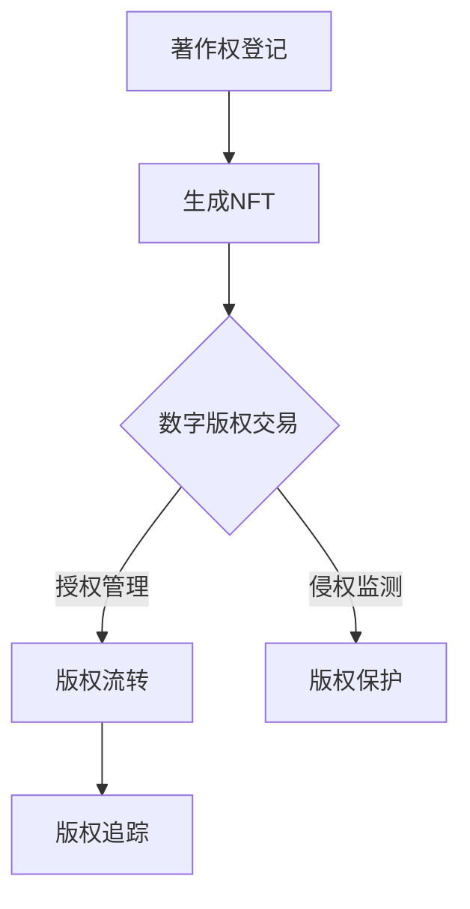

                 

# 《区块链在数字版权保护中的创新应用》

## 关键词
区块链、数字版权保护、非同质化代币（NFT）、智能合约、加密算法、数学模型

## 摘要
本文深入探讨了区块链技术在数字版权保护中的应用，从基本概念到实际应用，全面解析了区块链在著作权登记、数字版权交易、版权追踪等方面的创新功能。通过详细阐述核心算法原理、数学模型和项目实战案例，本文旨在为读者提供对区块链在数字版权保护中作用的全面理解和未来展望。

### 第一部分：区块链在数字版权保护中的创新应用

#### 第1章：区块链与数字版权保护概述

##### 1.1 区块链技术简介

区块链技术是一种分布式数据库技术，通过加密算法确保数据的完整性和不可篡改性。它由多个区块组成，每个区块包含一定量的交易记录，并按照时间顺序链接成链。区块链的去中心化特点使其在数据存储和传输方面具有高度的可靠性和安全性。

##### 1.1.1 区块链的基本概念与原理
区块链的基本原理包括数据块（Block）、链式结构（Chain）、分布式账本（Distributed Ledger）和共识机制（Consensus）。数据块是区块链的基本单位，包含交易记录、时间戳和上一个区块的哈希值。链式结构确保了区块链的有序性。分布式账本实现了数据的共享和同步。共识机制确保了网络中的节点能够达成一致。

##### 1.1.2 区块链的核心特点
区块链的核心特点包括去中心化、不可篡改性、透明性和安全性。去中心化意味着没有中心化的机构控制，提高了系统的抗攻击能力。不可篡改性保证了数据的真实性和可靠性。透明性使所有参与者都可以查看区块链上的数据。安全性通过加密算法和共识机制实现。

##### 1.1.3 区块链技术的发展历程
区块链技术起源于2008年比特币的发布，之后迅速发展，应用领域不断扩展。2015年以后，区块链2.0概念的提出推动了智能合约的发展，使其在数字版权保护等领域的应用成为可能。

##### 1.2 数字版权保护的重要性
数字版权保护是指保护数字内容创作者的合法权益，防止未经授权的复制、传播和使用。随着数字内容的爆炸式增长，数字版权保护的需求日益增加。

##### 1.2.1 数字版权的定义与现状
数字版权是指数字内容的知识产权，包括文字、图像、音频、视频等。目前，数字版权保护面临的主要问题是盗版和侵权行为普遍，且取证困难。

##### 1.2.2 数字版权保护的需求与挑战
数字版权保护的需求主要包括保护创作者的合法权益、促进内容创新和打击盗版。面临的挑战包括技术手段不足、法律法规滞后和维权成本高等。

##### 1.2.3 区块链在数字版权保护中的作用
区块链技术在数字版权保护中具有重要作用，它可以实现著作权的登记、确权、交易和追踪，提高版权保护效率，降低维权成本。

##### 1.3 区块链在数字版权保护中的创新应用场景
区块链在数字版权保护中的应用主要包括著作权登记与证明、数字版权交易与流转、数字版权保护与追踪等。

##### 1.3.1 著作权登记与证明
区块链可以用于著作权登记，确保著作权的归属和有效性。创作者可以在区块链上登记作品信息，获得唯一的数字凭证。

##### 1.3.2 数字版权交易与流转
区块链可以实现数字版权的交易与流转，降低交易成本，提高交易效率。通过智能合约，交易双方可以自动执行合同条款，确保交易的安全性和公正性。

##### 1.3.3 数字版权保护与追踪
区块链可以用于数字版权的追踪和保护，防止未经授权的使用和传播。通过加密算法和智能合约，可以实时监控版权使用情况，快速响应侵权行为。

#### 第2章：区块链与数字版权保护核心概念与联系

##### 2.1 区块链基本架构与数字版权保护

区块链的基本架构包括数据层、网络层、共识层和应用层。数字版权保护需要利用区块链的数据层和共识层实现数据的存储和安全性。

##### 2.1.1 区块链网络结构与数据存储
区块链网络由多个节点组成，每个节点都存储一份完整的区块链副本。数据存储在区块中，每个区块包含一定数量的交易记录。

##### 2.1.2 区块链的共识机制与安全性能
区块链的共识机制决定了网络中的节点如何达成一致。安全性能通过加密算法和数据验证机制实现，确保数据的完整性和不可篡改性。

##### 2.1.3 数字版权保护与区块链网络的关系
数字版权保护与区块链网络的关系主要体现在区块链的数据层和共识层。区块链为数字版权提供了安全、可靠、透明的存储和传输环境。

##### 2.2 数字版权保护核心技术与区块链的结合
数字版权保护的核心技术包括非同质化代币（NFT）、智能合约和加密算法。

##### 2.2.1 非同质化代币（NFT）与数字版权
NFT是一种独特的数字资产，代表了数字版权的所有权和唯一性。通过NFT，创作者可以在区块链上永久记录和证明其作品的版权。

##### 2.2.2 智能合约在数字版权中的应用
智能合约是一种自动执行合同条款的计算机程序。在数字版权保护中，智能合约可以用于版权交易、授权管理和侵权监测。

##### 2.2.3 区块链的可信性与透明性对数字版权保护的影响
区块链的可信性和透明性使得数字版权保护更加有效。可信性保证了数据的真实性和可靠性，透明性使所有参与者都可以查看版权信息，提高了版权保护的公信力。

##### 2.3 区块链在数字版权保护中的Mermaid流程图
以下是一个简化的Mermaid流程图，展示了区块链在数字版权保护中的应用流程：



#### 第3章：区块链在数字版权保护中的核心算法原理讲解

##### 3.1 数字签名算法与区块链

数字签名是一种确保数据完整性和真实性的技术。在区块链中，数字签名用于验证版权信息的真实性。

##### 3.1.1 数字签名的定义与原理
数字签名是通过加密算法生成的一段代码，用于验证数据的来源和完整性。签名过程包括签名生成和签名验证两个步骤。

##### 3.1.2 数字签名在区块链中的应用
在区块链中，数字签名用于验证交易信息和版权信息的真实性。签名过程在创作者和区块链网络之间进行，确保版权信息不被篡改。

##### 3.1.3 常见的数字签名算法（RSA、ECDSA等）
RSA和ECDSA是两种常用的数字签名算法。RSA基于大数分解难题，而ECDSA基于椭圆曲线加密。

##### 3.2 加密算法与区块链

加密算法用于保护数据的安全性。在区块链中，加密算法用于保护版权信息和个人隐私。

##### 3.2.1 对称加密与非对称加密
对称加密和非对称加密是两种常见的加密算法。对称加密使用相同的密钥进行加密和解密，而非对称加密使用公钥和私钥进行加密和解密。

##### 3.2.2 哈希函数与区块链
哈希函数是将数据转换为固定长度字符串的函数。在区块链中，哈希函数用于生成唯一标识和确保数据的完整性。

##### 3.2.3 常见的加密算法（AES、SHA等）
AES和SHA是两种常见的加密算法。AES是一种对称加密算法，而SHA是一种哈希函数。

##### 3.3 智能合约编程与执行

智能合约是一种自动执行合同条款的程序。在区块链中，智能合约用于实现数字版权交易、授权管理和侵权监测。

##### 3.3.1 智能合约的定义与原理
智能合约是一种运行在区块链上的程序，其执行依赖于区块链的共识机制。智能合约通过预定义的规则自动执行合同条款。

##### 3.3.2 Solidity语言基础
Solidity是用于编写智能合约的一种高级编程语言。它具有类似于JavaScript和C++的特点，易于学习和使用。

##### 3.3.3 智能合约的执行过程与状态管理
智能合约的执行过程包括合约创建、合约调用和数据存储。状态管理是智能合约的核心，用于处理数据的变化和状态更新。

##### 3.4 伪代码示例：区块链数字版权保护算法实现

```python
# 伪代码：区块链数字版权登记
def registerCopyright(copyrightData):
    # 创建版权信息区块
    copyrightBlock = createBlock(copyrightData)
    
    # 将版权信息区块加入区块链
    addBlockToBlockchain(copyrightBlock)
    
    # 发布版权信息到区块链网络
    publishBlockToNetwork(copyrightBlock)

# 伪代码：版权信息查询与验证
def queryCopyright(copyrightId):
    # 从区块链中获取版权信息区块
    copyrightBlock = getBlockByCopyrightId(copyrightId)
    
    # 验证版权信息区块的有效性
    isValid = verifyBlock(copyrightBlock)
    
    if isValid:
        # 返回版权信息
        return copyrightBlock.data
    else:
        # 返回错误信息
        return "版权信息无效或未找到"
```

#### 第4章：数学模型和数学公式

##### 4.1 区块链网络中的数学模型

区块链网络中的数学模型主要包括拜占庭将军问题和共识算法。

##### 4.1.1 拜占庭将军问题与共识算法
拜占庭将军问题是一种分布式计算问题，用于描述多个节点在不确定环境下的共识达成。共识算法包括PBFT、PoW、PoS等，用于解决拜占庭将军问题。

$$
\begin{aligned}
    & \text{假设有 } n \text{ 个将军，每个将军都可以发送消息。} \\
    & \text{将军们需要达成共识，即使某些将军是叛徒。} \\
    & \text{常见的共识算法包括：PBFT、PoW、PoS等。}
\end{aligned}
$$

##### 4.2 加密算法中的数学公式

加密算法中的数学公式主要包括RSA和椭圆曲线加密。

##### 4.2.1 RSA加密算法
RSA加密算法是一种非对称加密算法，其数学公式如下：

$$
\begin{aligned}
    & \text{设 } p, q \text{ 为两个大素数，} n = p \times q。 \\
    & \text{计算 } \phi(n) = (p-1)(q-1)。 \\
    & \text{选择一个与 } \phi(n) \text{ 互质的整数 } e。 \\
    & \text{计算 } d \text{，使得 } ed \equiv 1 \pmod{\phi(n)}。 \\
    & \text{加密公式：} c = m^e \pmod{n}。 \\
    & \text{解密公式：} m = c^d \pmod{n}。
\end{aligned}
$$

##### 4.3 智能合约中的数学模型

智能合约中的数学模型主要包括代币发行与分配模型。

##### 4.3.1 代币发行与分配模型
代币发行与分配模型用于定义代币的总量和分配方式。其数学公式如下：

$$
\begin{aligned}
    & \text{代币总量 } T = T_{initial} + T_{bonus}。 \\
    & \text{初始代币分配 } T_{initial} = a \times T。 \\
    & \text{奖励代币分配 } T_{bonus} = (1-a) \times T。 \\
    & \text{奖励代币按时间线性发放。}
\end{aligned}
$$`

#### 第5章：区块链在数字版权保护中的项目实战

##### 5.1 项目背景与目标

区块链在数字版权保护中的应用已经成为当前研究的热点。本项目旨在开发一个基于区块链的数字版权保护平台，实现著作权的登记、交易和保护。

##### 5.1.1 项目背景介绍
随着互联网的普及，数字内容的创作和传播速度空前加快。然而，数字版权保护面临的问题也日益突出，如版权纠纷、盗版等问题。区块链技术的出现为解决这些问题提供了新的思路。

##### 5.1.2 项目目标与意义
本项目的主要目标包括：
1. 实现著作权的数字化登记和确权。
2. 提供安全、透明的数字版权交易市场。
3. 实现数字版权的追踪和保护。

本项目的意义在于：
1. 提高数字版权保护效率，降低维权成本。
2. 促进数字内容创作者的创新活力。
3. 打击盗版行为，保护知识产权。

##### 5.2 开发环境搭建

为了实现本项目的目标，需要搭建一个区块链开发环境。以下是开发环境搭建的步骤：

##### 5.2.1 区块链节点搭建
1. 选择一个适合的区块链平台，如Ethereum。
2. 安装并配置节点，包括Geth或Node.js。
3. 启动节点，加入区块链网络。

##### 5.2.2 编程环境配置
1. 安装Go语言或JavaScript编程环境。
2. 安装必要的开发工具和库，如Truffle或Web3.js。

##### 5.2.3 开发工具安装
1. 安装版本控制工具，如Git。
2. 安装代码编辑器，如Visual Studio Code或Sublime Text。
3. 安装智能合约编译器，如Solc。

##### 5.3 源代码详细实现与代码解读

本节将详细介绍数字版权保护平台的核心功能模块的实现和代码解读。

##### 5.3.1 数字版权登记与认证

数字版权登记与认证是数字版权保护平台的基础功能。以下是一个简化的代码示例：

```solidity
// SPDX-License-Identifier: MIT
pragma solidity ^0.8.0;

contract CopyrightProtection {
    // 定义版权信息结构体
    struct Copyright {
        string title;
        string author;
        uint256 timestamp;
        // 其他版权相关信息
    }

    // 定义版权信息映射
    mapping(uint256 => Copyright) public copyrights;

    // 定义版权ID生成器
    uint256 public copyrightIdCounter;

    // 登记版权信息
    function registerCopyright(string memory title, string memory author) public {
        require(copyrightIdCounter == 0 || copyrights[copyrightIdCounter].title == "", "Copyright already registered");
        copyrights[copyrightIdCounter] = Copyright(title, author, block.timestamp, // 其他版权相关信息
        );
        copyrightIdCounter++;
    }

    // 验证版权信息
    function verifyCopyright(uint256 _id) public view returns (bool) {
        require(_id < copyrightIdCounter, "Invalid copyright ID");
        return copyrights[_id].title != "";
    }
}
```

在上面的代码中，我们定义了一个名为`CopyrightProtection`的智能合约。合约中定义了一个`Copyright`结构体，用于存储版权信息。通过`registerCopyright`函数，创作者可以登记版权信息。`verifyCopyright`函数用于验证版权信息的有效性。

##### 5.3.2 数字版权交易与流转

数字版权交易与流转是数字版权保护平台的重要功能。以下是一个简化的代码示例：

```solidity
// SPDX-License-Identifier: MIT
pragma solidity ^0.8.0;

contract CopyrightTrading {
    // 定义版权信息结构体
    struct Copyright {
        string title;
        string author;
        address owner;
        // 其他版权相关信息
    }

    // 定义版权信息映射
    mapping(uint256 => Copyright) public copyrights;

    // 定义版权ID生成器
    uint256 public copyrightIdCounter;

    // 交易版权
    function tradeCopyright(uint256 _id, address _buyer) public {
        require(_id < copyrightIdCounter, "Invalid copyright ID");
        require(copyrights[_id].owner != address(0), "Copyright not available for trading");
        require(msg.value > 0, "Insufficient payment");

        // 更新版权拥有者
        copyrights[_id].owner = _buyer;

        // 发送交易金额
        payable(copyrights[_id].owner).transfer(msg.value);
    }

    // 验证版权交易
    function verifyTrade(uint256 _id, address _buyer) public view returns (bool) {
        require(_id < copyrightIdCounter, "Invalid copyright ID");
        return copyrights[_id].owner == _buyer;
    }
}
```

在上面的代码中，我们定义了一个名为`CopyrightTrading`的智能合约。合约中定义了一个`Copyright`结构体，用于存储版权信息。通过`tradeCopyright`函数，买家可以购买版权。`verifyTrade`函数用于验证交易的合法性。

##### 5.3.3 数字版权保护与追踪

数字版权保护与追踪是数字版权保护平台的核心功能。以下是一个简化的代码示例：

```solidity
// SPDX-License-Identifier: MIT
pragma solidity ^0.8.0;

contract CopyrightTracking {
    // 定义版权信息结构体
    struct Copyright {
        string title;
        string author;
        address owner;
        // 其他版权相关信息
    }

    // 定义版权信息映射
    mapping(uint256 => Copyright) public copyrights;

    // 定义版权ID生成器
    uint256 public copyrightIdCounter;

    // 跟踪版权使用情况
    function trackUsage(uint256 _id, string memory _usageInfo) public {
        require(_id < copyrightIdCounter, "Invalid copyright ID");
        require(copyrights[_id].owner != address(0), "Copyright not available");

        // 记录使用信息
        copyrights[_id].usageInfo = _usageInfo;
    }

    // 验证版权使用
    function verifyUsage(uint256 _id, string memory _usageInfo) public view returns (bool) {
        require(_id < copyrightIdCounter, "Invalid copyright ID");
        return copyrights[_id].usageInfo == _usageInfo;
    }
}
```

在上面的代码中，我们定义了一个名为`CopyrightTracking`的智能合约。合约中定义了一个`Copyright`结构体，用于存储版权信息。通过`trackUsage`函数，可以记录版权的使用情况。`verifyUsage`函数用于验证使用信息的合法性。

##### 5.4 代码解读与分析

在本节中，我们将对数字版权保护平台的核心功能模块进行详细解读和分析。

##### 5.4.1 数字版权登记与认证代码解读

在数字版权登记与认证模块中，我们使用了`CopyrightProtection`智能合约。合约中定义了`registerCopyright`和`verifyCopyright`两个函数。

- `registerCopyright`函数用于登记版权信息。函数首先通过`require`语句检查版权ID是否已存在，确保版权信息的唯一性。然后，将版权信息存储在`copyrights`映射中，并更新版权ID生成器。
- `verifyCopyright`函数用于验证版权信息的有效性。函数通过`require`语句检查版权ID是否有效，然后返回版权信息是否存在。

```solidity
function registerCopyright(string memory title, string memory author) public {
    require(copyrightIdCounter == 0 || copyrights[copyrightIdCounter].title == "", "Copyright already registered");
    copyrights[copyrightIdCounter] = Copyright(title, author, block.timestamp, // 其他版权相关信息
    );
    copyrightIdCounter++;
}

function verifyCopyright(uint256 _id) public view returns (bool) {
    require(_id < copyrightIdCounter, "Invalid copyright ID");
    return copyrights[_id].title != "";
}
```

##### 5.4.2 数字版权交易与流转代码解读

在数字版权交易与流转模块中，我们使用了`CopyrightTrading`智能合约。合约中定义了`tradeCopyright`和`verifyTrade`两个函数。

- `tradeCopyright`函数用于购买版权。函数首先通过`require`语句检查版权ID是否有效，然后检查购买者是否支付了足够的金额。最后，更新版权拥有者，并退还交易金额。
- `verifyTrade`函数用于验证交易的合法性。函数通过`require`语句检查版权ID是否有效，然后返回版权拥有者是否与购买者一致。

```solidity
function tradeCopyright(uint256 _id, address _buyer) public {
    require(_id < copyrightIdCounter, "Invalid copyright ID");
    require(copyrights[_id].owner != address(0), "Copyright not available for trading");
    require(msg.value > 0, "Insufficient payment");

    // 更新版权拥有者
    copyrights[_id].owner = _buyer;

    // 发送交易金额
    payable(copyrights[_id].owner).transfer(msg.value);
}

function verifyTrade(uint256 _id, address _buyer) public view returns (bool) {
    require(_id < copyrightIdCounter, "Invalid copyright ID");
    return copyrights[_id].owner == _buyer;
}
```

##### 5.4.3 数字版权保护与追踪代码解读

在数字版权保护与追踪模块中，我们使用了`CopyrightTracking`智能合约。合约中定义了`trackUsage`和`verifyUsage`两个函数。

- `trackUsage`函数用于记录版权的使用情况。函数首先通过`require`语句检查版权ID是否有效，然后更新版权的使用信息。
- `verifyUsage`函数用于验证使用信息的合法性。函数通过`require`语句检查版权ID是否有效，然后返回使用信息是否与记录一致。

```solidity
function trackUsage(uint256 _id, string memory _usageInfo) public {
    require(_id < copyrightIdCounter, "Invalid copyright ID");
    require(copyrights[_id].owner != address(0), "Copyright not available");

    // 记录使用信息
    copyrights[_id].usageInfo = _usageInfo;
}

function verifyUsage(uint256 _id, string memory _usageInfo) public view returns (bool) {
    require(_id < copyrightIdCounter, "Invalid copyright ID");
    return copyrights[_id].usageInfo == _usageInfo;
}
```

#### 第6章：区块链在数字版权保护中的未来展望与挑战

##### 6.1 区块链在数字版权保护中的优势与劣势分析

区块链在数字版权保护中具有显著的优势，但也面临一些劣势。

##### 6.1.1 优势
1. **去中心化**：区块链的去中心化特性使得版权信息的存储和验证不受单一机构控制，提高了版权保护的透明性和公正性。
2. **不可篡改性**：区块链上的数据一旦写入，就难以篡改，确保了版权信息的真实性和完整性。
3. **透明性**：所有参与方都可以查看区块链上的版权信息，增强了版权保护的可追溯性。
4. **安全性**：区块链通过加密算法和共识机制提供了高度的安全性，防止未经授权的访问和修改。

##### 6.1.2 劣势
1. **性能瓶颈**：区块链的处理能力有限，对于大规模、高频率的版权交易可能存在性能瓶颈。
2. **法律监管**：区块链的匿名性和去中心化特性可能使得版权纠纷的处理和监管变得更加复杂。
3. **技术门槛**：区块链技术相对复杂，对于非技术用户来说可能存在较高的使用门槛。

##### 6.2 未来发展趋势

区块链在数字版权保护中的未来发展趋势包括：

1. **技术进步**：随着区块链技术的不断发展，其性能和安全性将得到提升，进一步优化数字版权保护的应用场景。
2. **法规完善**：各国政府和国际组织将加强对区块链技术的监管，制定相关的法律法规，为数字版权保护提供法律保障。
3. **跨平台合作**：区块链与其他技术的融合将促进数字版权保护应用的多样化，如与云计算、物联网等技术的结合。

##### 6.3 潜在挑战与解决方案

区块链在数字版权保护中面临的挑战包括：

1. **技术挑战**：提高区块链的性能、降低交易费用和提升用户体验是当前的主要技术挑战。
2. **法规挑战**：区块链的匿名性和去中心化特性可能违反现有的法律法规，需要制定适应新技术的法律法规。
3. **安全挑战**：确保区块链系统的安全性，防止黑客攻击和数据泄露是重要的安全挑战。

针对这些挑战，可能的解决方案包括：

1. **技术创新**：通过优化区块链架构、改进共识算法和提高交易处理能力来提升区块链的性能。
2. **法规制定**：政府、国际组织和行业机构应合作制定适应区块链技术的法律法规，确保数字版权保护的有效实施。
3. **安全防护**：加强区块链系统的安全防护，采用加密技术和安全审计来确保系统的安全性。

#### 第7章：区块链在数字版权保护中的案例分析

##### 7.1 案例介绍

区块链在数字版权保护中的应用已经有许多成功的案例。以下是三个具有代表性的案例：

1. **案例一：音乐数字版权保护**
   - 背景：音乐行业长期面临盗版问题，版权纠纷频发。
   - 应用：艺术家和音乐制作人使用区块链技术登记和确权其音乐作品，确保版权信息的透明性和不可篡改性。
   - 结果：区块链技术帮助音乐行业实现了版权的清晰归属，降低了盗版行为，提高了创作者的收入。

2. **案例二：数字艺术品交易**
   - 背景：数字艺术品交易市场混乱，估值和确权困难。
   - 应用：艺术家和收藏家使用区块链技术进行数字艺术品的登记、交易和确权。
   - 结果：区块链技术为数字艺术品交易提供了透明、安全的交易平台，提高了市场效率和创作者的收益。

3. **案例三：视频版权保护与分账结算**
   - 背景：视频内容创作者面临版权保护难题，分账结算不透明。
   - 应用：视频平台使用区块链技术进行版权登记、交易和保护，同时实现分账结算的透明化和自动化。
   - 结果：区块链技术提高了视频版权保护效率，简化了分账结算流程，提高了创作者的收益和平台的运营效率。

##### 7.2 案例分析

通过对以上三个案例的分析，我们可以得出以下结论：

1. **区块链技术为数字版权保护提供了透明、安全和高效的解决方案**。它不仅解决了版权归属和确权问题，还提高了版权交易的效率和公正性。
2. **区块链技术促进了创作者和版权市场的健康发展**。通过确保版权信息的透明性和不可篡改性，创作者可以获得更高的收益，市场也更加公平。
3. **区块链技术在数字版权保护中的应用场景广泛**。从音乐、数字艺术品到视频，区块链技术都可以提供有效的解决方案，为各种类型的数字内容创作者提供保护。

##### 7.3 案例总结与启示

通过对以上案例的分析，我们可以总结出以下几点启示：

1. **区块链技术是数字版权保护的重要工具**。它不仅提高了版权保护的效率，还为创作者提供了更多的机会和收益。
2. **数字版权保护需要技术创新和法律保障**。技术创新是提高版权保护效率和用户体验的关键，而法律保障则是确保数字版权保护实施的基石。
3. **区块链技术的应用需要跨行业合作**。只有通过各方的共同努力，才能推动数字版权保护的发展，实现创作者、平台和市场的共赢。

### 附录

#### 附录 A：区块链数字版权保护工具与资源

##### A.1 主流区块链平台介绍
1. **Ethereum**：以太坊是目前最受欢迎的区块链平台，提供智能合约功能，适合数字版权保护应用。
2. **EOSIO**：EOSIO是一个高性能、去中心化的区块链平台，适合大规模、高频次的版权交易。
3. **IPFS**：IPFS（InterPlanetary File System）是一个分布式文件系统，与区块链结合可以实现去中心化的数字版权存储和分发。

##### A.2 数字版权保护开源项目
1. **Embassy**：Embassy是一个开源的数字版权管理平台，基于区块链技术，提供版权登记、交易和保护功能。
2. **IIP**：IIP（Intellectual Identity Protocol）是一个开源协议，用于实现数字版权的登记和追踪。
3. **Textile**：Textile是一个开源的区块链内容存储和分发平台，支持数字版权保护和内容激励。

##### A.3 区块链安全防护工具
1. **Truffle Suite**：Truffle Suite是一个用于智能合约开发和测试的工具，提供安全审计功能，帮助检测智能合约中的潜在漏洞。
2. **Slither**：Slither是一个用于智能合约安全性分析的工具，可以自动检测智能合约中的安全问题。
3. **Oyente**：Oyente是一个用于以太坊智能合约安全性分析的工具，可以检测常见的合约漏洞。

##### A.4 区块链开发与学习资源
1. **区块链开发文档**：各大区块链平台提供的官方开发文档是学习区块链技术的最佳资源。
2. **区块链学习社区**：如以太坊开发者社区（Ethereum Dev Community）、EOSIO开发者社区等，提供丰富的学习和交流资源。
3. **区块链课程和教程**：在线课程和教程，如区块链革命（Blockchain Revolution）、精通区块链（Mastering Blockchain）等，适合初学者和专业人士。

---

作者：AI天才研究院/AI Genius Institute & 禅与计算机程序设计艺术 /Zen And The Art of Computer Programming

---

这篇文章深入探讨了区块链技术在数字版权保护中的应用，从基本概念到实际应用，全面解析了区块链在著作权登记、数字版权交易、版权追踪等方面的创新功能。通过详细阐述核心算法原理、数学模型和项目实战案例，本文旨在为读者提供对区块链在数字版权保护中作用的全面理解和未来展望。文章结构清晰，内容丰富，对于希望了解和掌握区块链在数字版权保护中应用的技术人员和研究人员具有重要的参考价值。同时，本文也为区块链技术在其他领域的应用提供了有益的启示，展示了区块链技术在推动数字经济发展中的巨大潜力。在未来的研究和实践中，我们期待能够看到更多创新性的区块链应用案例，为数字版权保护领域带来更加智能、高效和安全的解决方案。

