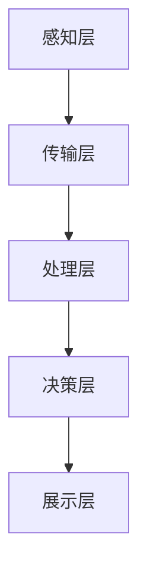
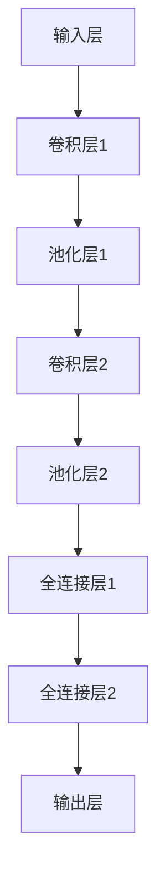

                 

# 商汤科技2025社招智慧城市视觉分析专家面试

## 关键词：
- 商汤科技
- 社招
- 智慧城市
- 视觉分析
- 面试准备
- 技术能力评估

## 摘要：
本文旨在为准备参加商汤科技2025年社会招聘智慧城市视觉分析专家面试的候选人提供详细的面试准备和技能评估指南。文章首先介绍了商汤科技与智慧城市的关系，以及视觉分析在其中的重要性。接着，深入探讨了视觉感知原理、图像处理基础和深度学习在视觉分析中的应用。随后，通过实际项目案例详细分析了智慧交通、智慧安防和智慧环境监测等项目。最后，总结了智慧城市项目的综合分析和未来发展展望，并提供了一些实用的开发工具和资源。

## 目录大纲

### 《商汤科技2025社招智慧城市视觉分析专家面试》目录大纲

#### 第一部分：智慧城市视觉分析基础

1. **商汤科技与智慧城市**
   - 1.1 商汤科技简介
   - 1.2 智慧城市概述
   - 1.3 视觉分析在智慧城市中的应用
   - 1.4 AI大模型在视觉分析中的应用
   - 1.5 商汤科技在智慧城市视觉分析中的应用
   - 1.6 商汤科技在智慧城市视觉分析中的未来发展规划
   - 1.7 总结

2. **视觉感知基础**
   - 2.1 视觉感知原理
   - 2.2 图像处理基础
   - 2.3 视觉感知算法
   - 2.4 视觉感知的关键技术
   - 2.5 视觉感知的应用领域

3. **深度学习与神经网络在视觉分析中的应用**
   - 3.1 深度学习基础
   - 3.2 神经网络在视觉分析中的应用
   - 3.3 深度学习在视觉分析中的实践

#### 第二部分：智慧城市视觉分析项目实战

1. **智慧交通项目分析**
   - 4.1 智慧交通项目概述
   - 4.2 数据采集与预处理
   - 4.3 模型设计与实现
   - 4.4 项目效果评估
   - 4.5 项目应用效果评估

2. **智慧安防项目实践**
   - 5.1 智慧安防项目概述
   - 5.2 数据采集与预处理
   - 5.3 模型设计与实现
   - 5.4 项目效果评估
   - 5.5 项目应用效果评估

3. **智慧城市环境监测项目**
   - 6.1 智慧城市环境监测项目概述
   - 6.2 数据采集与预处理
   - 6.3 模型设计与实现
   - 6.4 项目效果评估
   - 6.5 项目应用效果评估

#### 第三部分：智慧城市项目综合分析与展望

1. **智慧城市项目综合分析**
   - 7.1 智慧城市项目综合分析
   - 7.2 智慧城市项目改进建议
   - 7.3 智慧城市未来发展展望
   - 7.4 总结与展望

2. **附录A：智慧城市视觉分析开发工具与资源**
   - A.1 主流深度学习框架对比
   - A.2 智慧城市视觉分析常用工具
   - A.3 智慧城市视觉分析资源推荐
   - A.4 智慧城市视觉分析工具使用示例

## 第一部分：智慧城市视觉分析基础

### 1. 商汤科技与智慧城市

#### 1.1 商汤科技简介

商汤科技（SenseTime）成立于2014年，总部位于中国上海，是一家专注于计算机视觉和人工智能技术的研发和商业化的企业。商汤科技在全球范围内拥有超过2500名员工，其中包括多位IEEE Fellow和ACM Fellow等顶尖科学家和工程师。

商汤科技在人工智能领域拥有多项核心技术，如深度学习、卷积神经网络（CNN）、目标检测、图像识别等。公司的业务涵盖智慧城市、智能驾驶、手机摄像头、安防监控等多个领域，与多家国际知名企业和政府部门建立了战略合作伙伴关系。

#### 1.2 智慧城市概述

智慧城市是指通过新一代信息技术手段，实现城市资源的高效利用、优化管理和智能化服务，以提高城市居民的生活质量和工作效率。智慧城市的发展背景可以追溯到城市化进程的加速和信息技术的发展。

随着城市化进程的加快，人口增长和资源消耗问题日益突出，传统的城市管理方式已经无法满足人们日益增长的需求。同时，信息技术的快速发展为城市管理提供了新的手段和工具，如物联网、大数据、人工智能等。智慧城市的概念应运而生，旨在通过科技手段提升城市管理水平和居民生活质量。

智慧城市的核心要素包括数据采集与处理、数据分析与挖掘、智能决策与控制、智能化服务等方面。数据采集与处理是实现智慧城市的基础，通过传感器、摄像头、物联网设备等收集城市数据，实现城市运行状态的实时监测和管理。数据分析与挖掘是对城市数据进行分析和挖掘，发现潜在问题并提出解决方案。智能决策与控制是基于数据分析结果，实现智能化决策和控制，提高城市管理的效率和效果。智能化服务是通过智慧化应用，为城市居民提供便捷、高效的服务，提升居民生活质量。

#### 1.3 视觉分析在智慧城市中的应用

视觉分析是指通过计算机视觉技术对图像和视频数据进行处理和分析，提取有用的信息和理解场景内容。视觉分析在智慧城市中具有广泛的应用，主要包括以下几个方面：

1. **智慧交通**：通过视觉分析技术对城市交通进行实时监控，包括车辆流量监控、交通违规检测等，提高交通管理效率。

2. **智慧安防**：通过视觉分析技术对城市安全进行监控，包括人员密度监控、可疑行为检测等，提高城市安全管理水平。

3. **智慧环境监测**：通过视觉分析技术对城市环境进行监测，包括空气质量监测、噪音监测等，提供实时环境数据支持。

4. **公共设施管理**：通过视觉分析技术对公共设施进行监控，包括公共厕所使用情况、垃圾桶满溢情况等，提高公共设施管理效率。

#### 1.4 AI大模型在视觉分析中的应用

AI大模型是指通过大规模数据训练得到的深度学习模型，具有较高的准确性和泛化能力。AI大模型在视觉分析中具有广泛的应用，主要包括以下几个方面：

1. **目标检测**：AI大模型可以准确检测图像或视频中的目标物体，实现实时监控和目标跟踪。

2. **图像识别**：AI大模型可以识别图像中的物体、场景和文字，应用于人脸识别、车牌识别等场景。

3. **图像分割**：AI大模型可以将图像分割为不同的区域，应用于图像增强、图像编辑等场景。

#### 1.5 商汤科技在智慧城市视觉分析中的应用

商汤科技在智慧城市视觉分析领域具有领先地位和技术优势，为智慧城市建设提供了有力支持。以下是商汤科技在智慧城市视觉分析中的应用案例：

1. **智慧交通**：商汤科技利用视觉分析技术对城市交通进行实时监控，包括车辆流量监控、交通违规检测等，提高交通管理效率。

2. **智慧安防**：商汤科技利用视觉分析技术对城市安全进行监控，包括人员密度监控、可疑行为检测等，提高城市安全管理水平。

3. **智慧环境监测**：商汤科技利用视觉分析技术对城市环境进行监测，包括空气质量监测、噪音监测等，提供实时环境数据支持。

#### 1.6 商汤科技在智慧城市视觉分析中的未来发展规划

商汤科技在智慧城市视觉分析中的未来发展规划主要包括以下几个方面：

1. **技术创新**：商汤科技将持续加大研发投入，推动人工智能技术向更高层次发展，包括增强现实、虚拟现实、自动驾驶等领域。

2. **业务拓展**：商汤科技将继续拓展业务领域，扩大在智慧城市、智能交通、智能安防等领域的市场占有率。

3. **合作与开放**：商汤科技将积极与国内外企业、高校和研究机构开展合作，共同推动人工智能技术的发展和应用。

#### 1.7 总结

商汤科技在智慧城市视觉分析领域具有领先地位和技术优势，为智慧城市建设提供了有力支持。视觉分析技术在智慧城市中的应用前景广阔，将不断推动城市管理和服务水平的提升。商汤科技将继续发挥其在人工智能技术领域的优势，为智慧城市建设做出更大贡献。

### 2. 视觉感知基础

视觉感知是指生物体通过视觉系统对周围环境进行感知和理解的过程。视觉感知是人类获取信息的重要途径之一，对于人类的生活、学习和工作具有重要意义。本节将介绍视觉感知的基本原理、关键技术、算法和应用领域。

#### 2.1 视觉感知原理

视觉感知的过程可以分为以下几个阶段：

1. **光信号接收**：光线从物体反射进入眼睛，通过角膜、瞳孔、晶状体等光学系统，最终聚焦在视网膜上。

2. **光信号转换**：视网膜上的感光细胞（视杆细胞和视锥细胞）将光信号转换为电信号。

3. **信号传输**：电信号通过视神经传输到大脑皮层的视觉中枢。

4. **信号处理与理解**：大脑对电信号进行解码、处理，形成对物体的形状、颜色、运动等特征的理解。

在视觉感知过程中，光信号接收和转换是非常关键的环节。光信号接收主要依赖于眼睛的生理结构，如角膜、瞳孔、晶状体和视网膜。光信号转换主要依赖于视网膜上的感光细胞，这些细胞能够将光信号转换为电信号，并通过视神经传输到大脑。

#### 2.2 图像处理基础

图像处理是指利用计算机对图像进行操作和处理的一系列技术，主要包括图像的获取、数字化、增强、变换和重建等。图像处理是计算机视觉和人工智能等领域的重要基础。

1. **图像获取**：图像获取是指通过摄像头、扫描仪等设备获取图像。图像获取的质量对后续图像处理和分析的结果有很大影响。

2. **图像数字化**：图像数字化是指将模拟图像转换为数字图像。数字化过程包括采样和量化。采样是指将连续的图像信号离散化，量化是指将采样得到的数值转换为整数。

3. **图像增强**：图像增强是指通过调整图像的亮度、对比度、色彩等，提高图像的视觉效果，使其更易于观察和分析。

4. **图像变换**：图像变换是指对图像进行几何变换，如旋转、缩放、平移、镜像等，以改变图像的外观。

5. **图像重建**：图像重建是指通过图像重建算法，如傅里叶变换、小波变换等，对退化或噪声图像进行恢复。

#### 2.3 视觉感知算法

视觉感知算法是指用于处理图像或视频数据的算法，主要包括以下几个类型：

1. **图像预处理**：包括去噪、滤波、锐化等操作，提高图像质量。

2. **特征提取**：从图像中提取具有区分性的特征，用于后续的图像分析和识别。

3. **目标检测**：在图像中识别出特定的目标物体。

4. **图像分割**：将图像分割成多个区域，用于图像理解和分析。

5. **场景重建**：从图像中重建三维场景。

以下是一个简单的卷积神经网络（CNN）算法的伪代码示例：

```python
# 输入：图像数据
# 输出：分类结果

# 定义卷积层
conv1 = Conv2D(filters=32, kernel_size=(3, 3), activation='relu')
conv2 = Conv2D(filters=64, kernel_size=(3, 3), activation='relu')

# 定义池化层
pool1 = MaxPooling2D(pool_size=(2, 2))
pool2 = MaxPooling2D(pool_size=(2, 2))

# 定义全连接层
dense1 = Dense(units=128, activation='relu')
dense2 = Dense(units=1, activation='sigmoid')

# 构建模型
model = Sequential()
model.add(conv1)
model.add(pool1)
model.add(conv2)
model.add(pool2)
model.add(dense1)
model.add(dense2)

# 编译模型
model.compile(optimizer='adam', loss='binary_crossentropy', metrics=['accuracy'])

# 训练模型
model.fit(x_train, y_train, epochs=10, batch_size=32)

# 预测
predictions = model.predict(x_test)
```

#### 2.4 视觉感知的关键技术

视觉感知的关键技术主要包括以下几个方面：

1. **光学成像**：利用透镜或反射镜等光学元件，将物体的光线聚焦在视网膜上，形成清晰的图像。

2. **信号处理**：通过预处理、滤波、特征提取等算法，对视网膜上的电信号进行处理，提取有用的信息。

3. **神经网络模型**：使用深度学习模型，如卷积神经网络（CNN），对图像进行特征提取和分类。

4. **图像分割**：将图像分割成不同的区域，用于图像理解和分析。

#### 2.5 视觉感知的应用领域

视觉感知技术在许多领域都有广泛的应用，包括：

1. **计算机视觉**：用于图像识别、目标检测、图像分割等任务。

2. **自动驾驶**：用于车辆检测、行人检测、道路识别等任务。

3. **医疗影像**：用于疾病诊断、病变检测等任务。

4. **安全监控**：用于视频监控、异常行为检测等任务。

5. **虚拟现实与增强现实**：用于环境建模、场景重建等任务。

### 3. 深度学习与神经网络在视觉分析中的应用

深度学习是一种基于多层的神经网络模型，通过对大量数据进行训练，能够自动提取复杂的特征，并在各种计算机视觉任务中表现出优异的性能。深度学习与神经网络在视觉分析中的应用已经取得了显著的成果，特别是在图像识别、目标检测、图像分割等任务中。

#### 3.1 深度学习基础

深度学习的基础是多层感知机（MLP），它由输入层、隐藏层和输出层组成。通过逐层提取特征，MLP能够从原始数据中提取出有意义的特征，从而实现复杂的非线性变换。

1. **神经网络的基本结构**

   神经网络的基本结构包括神经元、连接权重和激活函数。神经元是网络的基本单元，通过连接权重对输入信号进行加权求和，然后通过激活函数输出结果。

   ```mermaid
   graph TD
   A[输入层] --> B[隐藏层1]
   B --> C[隐藏层2]
   C --> D[输出层]
   ```

2. **常见的深度学习架构**

   - **卷积神经网络（CNN）**：适用于图像处理任务，具有局部感知和权重共享的特点。
   - **循环神经网络（RNN）**：适用于序列数据处理，如语音识别、自然语言处理等。
   - **生成对抗网络（GAN）**：用于生成数据，如图像生成、语音合成等。

#### 3.2 神经网络在视觉分析中的应用

1. **图像识别**

   图像识别是计算机视觉中的一项基本任务，目的是从图像中识别出特定的对象或场景。CNN在图像识别任务中表现出色。

   ```mermaid
   graph TD
   A[输入图像] --> B[卷积层]
   B --> C[池化层]
   C --> D[全连接层]
   D --> E[输出层]
   ```

2. **目标检测**

   目标检测是在图像中识别出多个对象的位置和类别。常用的目标检测算法包括R-CNN、Faster R-CNN、SSD、YOLO等。

   ```mermaid
   graph TD
   A[输入图像] --> B[特征提取]
   B --> C[区域提议]
   C --> D[分类和回归]
   D --> E[输出检测结果]
   ```

3. **图像分割**

   图像分割是将图像分割成多个区域或对象，以便于后续处理和分析。常用的图像分割算法包括FCN、U-Net等。

   ```mermaid
   graph TD
   A[输入图像] --> B[特征提取]
   B --> C[卷积层]
   C --> D[池化层]
   D --> E[上采样层]
   E --> F[全连接层]
   F --> G[输出层]
   ```

#### 3.3 深度学习在视觉分析中的实践

1. **数据采集与预处理**

   在深度学习项目中，数据采集和预处理是关键步骤。数据采集包括收集大量的图像和标注数据。预处理包括数据清洗、数据增强、归一化等操作。

2. **模型设计与训练**

   模型设计包括选择合适的神经网络架构、设置超参数等。训练过程包括前向传播、反向传播和优化过程，以最小化模型损失函数。

3. **模型评估与优化**

   模型评估包括准确率、召回率、F1分数等指标。通过调整超参数、增加训练数据或修改网络结构，优化模型性能。

4. **实际应用**

   在实际应用中，深度学习模型可以用于图像识别、目标检测、图像分割等任务，如自动驾驶、医疗影像分析、安防监控等。

以下是一个简单的卷积神经网络（CNN）模型示例，使用Python的TensorFlow和Keras库：

```python
import tensorflow as tf
from tensorflow.keras.models import Sequential
from tensorflow.keras.layers import Conv2D, MaxPooling2D, Flatten, Dense

# 创建模型
model = Sequential([
    Conv2D(32, (3, 3), activation='relu', input_shape=(64, 64, 3)),
    MaxPooling2D(pool_size=(2, 2)),
    Conv2D(64, (3, 3), activation='relu'),
    MaxPooling2D(pool_size=(2, 2)),
    Flatten(),
    Dense(128, activation='relu'),
    Dense(10, activation='softmax')
])

# 编译模型
model.compile(optimizer='adam', loss='categorical_crossentropy', metrics=['accuracy'])

# 训练模型
model.fit(x_train, y_train, epochs=10, batch_size=32)

# 预测
predictions = model.predict(x_test)
```

在实际项目中，根据任务需求，可以选择合适的神经网络架构和训练策略，以提高模型的性能和应用效果。

### 4. 智慧交通项目分析

智慧交通是指利用信息技术、物联网、大数据和人工智能等手段，对交通系统进行智能化管理和优化，以提高交通效率、减少交通拥堵和提升交通安全。在本节中，我们将分析智慧交通项目的关键组成部分，包括项目背景、目标、架构和实际应用效果。

#### 4.1 项目背景

随着城市化进程的加快，机动车数量的急剧增长导致交通拥堵问题日益严重，这不仅影响了居民的出行效率，还对环境质量造成了负面影响。传统的交通管理模式已经无法满足日益增长的交通需求，因此，智慧交通项目的提出和实施显得尤为重要。

智慧交通项目旨在通过实时监测、数据分析和智能决策，实现交通系统的优化管理。项目涉及多个技术领域，包括计算机视觉、物联网、大数据分析和人工智能等。

#### 4.2 项目目标

智慧交通项目的目标主要包括以下几个方面：

1. **提高交通效率**：通过实时监测和数据分析，优化交通信号控制，减少交通拥堵，提高道路通行能力。

2. **减少交通拥堵**：通过智能调度和交通流量预测，合理安排交通流量，避免高峰时段的交通拥堵。

3. **提升交通安全**：通过实时监控和异常检测，及时发现交通事故和违法行为，提高交通安全性。

4. **改善出行体验**：为居民提供实时交通信息、出行建议和导航服务，提高出行效率和舒适度。

#### 4.3 项目架构

智慧交通项目的架构通常包括以下几个层次：

1. **感知层**：通过部署各种传感器和摄像头，实时采集交通数据，如车辆流量、路况信息、天气状况等。

2. **传输层**：利用物联网、5G等传输技术，将感知层采集到的数据传输到数据中心。

3. **处理层**：在数据中心，通过大数据分析和深度学习算法，对交通数据进行处理和分析，生成交通预测和优化方案。

4. **决策层**：根据处理结果，交通管理部门可以实时调整交通信号、引导车辆分流，优化交通运行。

5. **展示层**：通过交通信息发布平台、手机APP等，向公众提供实时交通信息、出行建议等。

以下是一个简单的智慧交通项目架构的Mermaid流程图：



#### 4.4 数据采集与预处理

数据采集是智慧交通项目的基础，主要包括以下几种类型的数据：

1. **车辆数据**：通过车载传感器、GPS等设备，实时采集车辆的运行状态、位置信息等。

2. **路况数据**：通过路面传感器、摄像头等设备，实时采集道路的拥堵情况、交通事故、道路施工等信息。

3. **天气数据**：通过气象站、传感器等设备，实时采集天气状况，如雨雪、风力等。

4. **公共交通数据**：通过公交车站、地铁站等设备，实时采集公共交通的运行状态、乘客流量等信息。

数据采集后，需要进行预处理，以提高数据质量和分析效果。预处理步骤包括：

1. **去噪处理**：去除数据中的噪声和异常值。

2. **数据清洗**：去除重复数据、缺失值填充等。

3. **数据归一化**：将不同类型的数据进行归一化处理，以消除数据量级差异。

4. **特征提取**：从原始数据中提取有用的特征，如车辆速度、行驶方向、道路密度等。

#### 4.5 模型设计与实现

智慧交通项目通常采用深度学习算法，如卷积神经网络（CNN）、循环神经网络（RNN）等，进行交通数据的处理和分析。以下是一个简单的卷积神经网络（CNN）模型设计示例：



在模型实现过程中，需要对输入数据进行预处理，如归一化、数据增强等。模型训练过程包括前向传播、反向传播和优化等步骤。以下是一个简单的Python代码示例，使用TensorFlow和Keras库实现CNN模型：

```python
import tensorflow as tf
from tensorflow.keras.models import Sequential
from tensorflow.keras.layers import Conv2D, MaxPooling2D, Flatten, Dense

# 创建模型
model = Sequential([
    Conv2D(32, (3, 3), activation='relu', input_shape=(64, 64, 3)),
    MaxPooling2D(pool_size=(2, 2)),
    Conv2D(64, (3, 3), activation='relu'),
    MaxPooling2D(pool_size=(2, 2)),
    Flatten(),
    Dense(128, activation='relu'),
    Dense(1, activation='sigmoid')
])

# 编译模型
model.compile(optimizer='adam', loss='binary_crossentropy', metrics=['accuracy'])

# 训练模型
model.fit(x_train, y_train, epochs=10, batch_size=32)

# 预测
predictions = model.predict(x_test)
```

在实际项目中，可以根据具体需求调整模型结构、超参数等，以提高模型性能和应用效果。

#### 4.6 项目效果评估

项目效果评估是智慧交通项目成功与否的重要指标。评估方法包括定量评估和定性评估。

1. **定量评估**：通过评估模型在测试集上的准确率、召回率、F1分数等指标，评估模型性能。

   ```python
   from sklearn.metrics import accuracy_score, recall_score, f1_score

   # 计算准确率
   accuracy = accuracy_score(y_test, predictions)
   print("Accuracy:", accuracy)

   # 计算召回率
   recall = recall_score(y_test, predictions)
   print("Recall:", recall)

   # 计算F1分数
   f1 = f1_score(y_test, predictions)
   print("F1 Score:", f1)
   ```

2. **定性评估**：通过分析模型在实际交通场景中的表现，评估模型效果。例如，观察模型在高峰时段的交通拥堵预测准确性，评估模型在实际应用中的效果。

#### 4.7 项目应用效果评估

项目应用效果评估是智慧交通项目完成后的重要环节。以下是一个简单的应用效果评估示例：

1. **交通拥堵缓解**：通过分析交通数据，对比项目实施前后的交通拥堵情况，评估智慧交通项目对交通拥堵的缓解效果。

2. **交通事故减少**：通过分析交通事故数据，对比项目实施前后的事故发生情况，评估智慧交通项目对交通事故的减少效果。

3. **公共交通服务质量提升**：通过分析公共交通数据，对比项目实施前后的公共交通服务质量，评估智慧交通项目对公共交通服务质量的提升效果。

4. **市民满意度调查**：通过调查问卷或访谈，收集市民对智慧交通项目的满意度，评估项目的社会效果。

### 5. 智慧安防项目实践

智慧安防是指利用物联网、大数据、人工智能等技术，对城市安全进行智能化管理和监测。在本节中，我们将探讨智慧安防项目的实施过程，包括项目背景、目标、架构和实际应用效果。

#### 5.1 项目背景

随着城市规模的不断扩大和人口数量的增加，传统安防手段已经无法满足日益增长的安全需求。智慧安防项目应运而生，通过引入先进的信息技术和人工智能算法，实现对城市安全的全面监测和智能化管理。

智慧安防项目涉及到多个领域，包括视频监控、人脸识别、行为分析、智能预警等，其目的是提高城市安全防范能力，减少犯罪行为，提升市民安全感。

#### 5.2 项目目标

智慧安防项目的目标主要包括以下几个方面：

1. **提高城市安全防范能力**：通过实时监控和智能分析，及时发现安全隐患，提高城市安全防范能力。

2. **减少犯罪行为**：通过智能预警和快速响应，减少犯罪行为的发生和蔓延。

3. **提升应急响应速度**：通过快速收集和分析事故现场信息，提高应急响应速度，减少事故损失。

4. **优化公共安全管理**：通过数据分析，优化公共安全管理策略，提高公共安全管理效率。

#### 5.3 项目架构

智慧安防项目的架构通常包括以下几个层次：

1. **感知层**：通过部署各种传感器和摄像头，实时采集城市安全数据，如人员流量、异常行为、火灾等。

2. **传输层**：通过物联网、5G等传输技术，将感知层采集到的数据传输到数据中心。

3. **处理层**：在数据中心，通过大数据分析和深度学习算法，对城市安全数据进行处理和分析，生成安全预测和优化方案。

4. **决策层**：根据处理结果，公安机关和政府部门可以实时调整安防策略、引导人员分流，提高安防管理效率。

5. **展示层**：通过安防信息发布平台、手机APP等，向公众提供实时安防信息、应急预警等。

以下是一个简单的智慧安防项目架构的Mermaid流程图：


#### 5.4 数据采集与预处理

数据采集是智慧安防项目的基础，主要包括以下几种类型的数据：

1. **人员数据**：通过摄像头、人脸识别设备等，实时采集人员图像、人脸特征等信息。

2. **环境数据**：通过传感器、监控设备等，实时采集环境数据，如温度、湿度、烟雾等。

3. **事件数据**：通过监控设备、报警系统等，实时采集事件数据，如火灾、抢劫等。

4. **交通数据**：通过交通摄像头、交通传感器等，实时采集交通数据，如车辆流量、路况信息等。

数据采集后，需要对数据进行预处理，以提高数据质量和分析效果。预处理步骤包括：

1. **去噪处理**：去除数据中的噪声和异常值。

2. **数据清洗**：去除重复数据、缺失值填充等。

3. **数据归一化**：将不同类型的数据进行归一化处理，以消除数据量级差异。

4. **特征提取**：从原始数据中提取有用的特征，如人脸特征、温度变化等。

#### 5.5 模型设计与实现

智慧安防项目通常采用深度学习算法，如卷积神经网络（CNN）、循环神经网络（RNN）等，进行城市安全数据的处理和分析。以下是一个简单的卷积神经网络（CNN）模型设计示例：


在模型实现过程中，需要对输入数据进行预处理，如归一化、数据增强等。模型训练过程包括前向传播、反向传播和优化等步骤。以下是一个简单的Python代码示例，使用TensorFlow和Keras库实现CNN模型：

```python
import tensorflow as tf
from tensorflow.keras.models import Sequential
from tensorflow.keras.layers import Conv2D, MaxPooling2D, Flatten, Dense

# 创建模型
model = Sequential([
    Conv2D(32, (3, 3), activation='relu', input_shape=(64, 64, 3)),
    MaxPooling2D(pool_size=(2, 2)),
    Conv2D(64, (3, 3), activation='relu'),
    MaxPooling2D(pool_size=(2, 2)),
    Flatten(),
    Dense(128, activation='relu'),
    Dense(1, activation='sigmoid')
])

# 编译模型
model.compile(optimizer='adam', loss='binary_crossentropy', metrics=['accuracy'])

# 训练模型
model.fit(x_train, y_train, epochs=10, batch_size=32)

# 预测
predictions = model.predict(x_test)
```

在实际项目中，可以根据具体需求调整模型结构、超参数等，以提高模型性能和应用效果。

#### 5.6 项目效果评估

项目效果评估是智慧安防项目成功与否的重要指标。评估方法包括定量评估和定性评估。

1. **定量评估**：通过评估模型在测试集上的准确率、召回率、F1分数等指标，评估模型性能。

   ```python
   from sklearn.metrics import accuracy_score, recall_score, f1_score

   # 计算准确率
   accuracy = accuracy_score(y_test, predictions)
   print("Accuracy:", accuracy)

   # 计算召回率
   recall = recall_score(y_test, predictions)
   print("Recall:", recall)

   # 计算F1分数
   f1 = f1_score(y_test, predictions)
   print("F1 Score:", f1)
   ```

2. **定性评估**：通过分析模型在实际安防场景中的表现，评估模型效果。例如，观察模型在夜间监控中的准确性，评估模型在实际应用中的效果。

#### 5.7 项目应用效果评估

项目应用效果评估是智慧安防项目完成后的重要环节。以下是一个简单的应用效果评估示例：

1. **犯罪率下降**：

