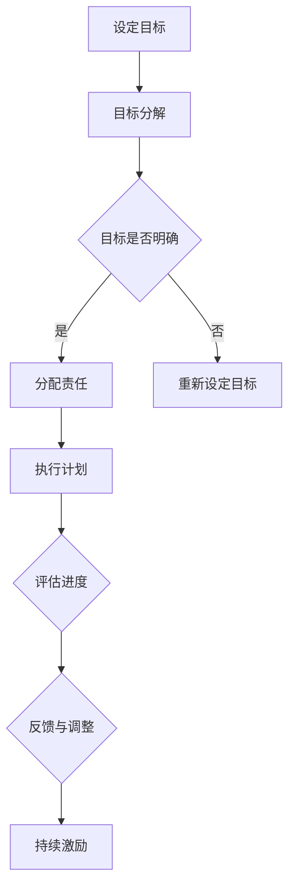

                 

### 《团队激励：激发员工潜能的10大策略》

在当今快速变化的工作环境中，团队激励成为企业和组织成功的关键要素。一个高效的团队不仅需要具备专业技能的成员，更需要具备积极的态度和强大的执行力。本文将围绕《团队激励：激发员工潜能的10大策略》这一主题，深入探讨激励理论、挑战、实践策略以及实际案例，旨在为读者提供系统化的团队激励解决方案。

**关键词**：团队激励、员工潜能、激励理论、策略、实践、案例

**摘要**：本文首先介绍了团队激励的定义、重要性以及理论基础，接着分析了团队激励面临的挑战和问题，然后详细阐述了10大激励策略，包括目标设定、奖励与福利设计、认可与表扬、员工成长与发展、工作环境与文化建设等。通过案例分析和实践方法，本文旨在帮助读者理解和应用这些策略，从而激发员工潜能，提升团队绩效。

### 目录大纲

#### 第一部分：团队激励概述

- **第1章**：团队激励的重要性与基础理论
  - **1.1 团队激励的定义与作用**
  - **1.2 团队激励的理论基础**
    - **1.2.1 行为主义激励理论**
    - **1.2.2 人本主义激励理论**
    - **1.2.3 心理契约理论**
  - **1.3 团队激励的类型**

- **第2章**：团队激励的挑战与问题
  - **2.1 团队激励常见问题分析**
  - **2.2 团队激励的障碍与解决方案**

#### 第二部分：激励策略与实践

- **第3章**：激励策略一：目标设定与目标管理
  - **3.1 目标设定的原则与方法**
  - **3.2 目标管理的实践与应用**

- **第4章**：激励策略二：奖励与福利设计
  - **4.1 奖励与福利的类型与作用**
  - **4.2 奖励与福利的设计原则与实践**

- **第5章**：激励策略三：认可与表扬
  - **5.1 认可与表扬的重要性**
  - **5.2 认可与表扬的技巧**

- **第6章**：激励策略四：员工成长与发展
  - **6.1 员工成长与发展的需求分析**
  - **6.2 职业发展规划与实施**

- **第7章**：激励策略五：工作环境与文化建设
  - **7.1 健康的工作环境**
  - **7.2 企业文化的重要性**
  - **7.3 企业文化建设策略**

- **第8章**：激励策略六：团队协作与沟通
  - **8.1 团队协作的重要性**
  - **8.2 沟通技巧与团队激励**

- **第9章**：激励策略七：危机管理
  - **9.1 危机管理的重要性**
  - **9.2 危机管理策略**

- **第10章**：激励策略八：激励创新与变革
  - **10.1 创新与变革的激励**
  - **10.2 创新文化建设**

- **第11章**：激励策略九：领导力与激励
  - **11.1 领导力与激励的关系**
  - **11.2 领导者激励技巧**

- **第12章**：激励策略十：自我激励与终身学习
  - **12.1 自我激励的重要性**
  - **12.2 终身学习与自我激励**

#### 第三部分：综合应用与案例

- **第13章**：团队激励的综合性应用
  - **13.1 综合激励策略设计**
  - **13.2 激励策略实施的步骤与方法**

- **第14章**：团队激励案例分析
  - **14.1 案例一：华为的团队激励策略**
  - **14.2 案例二：谷歌的员工激励与文化**
  - **14.3 案例三：阿里巴巴的团队建设与激励**

- **第15章**：团队激励实践中的问题与解决
  - **15.1 实践中遇到的问题**
  - **15.2 解决问题的方法与技巧**

#### 附录

- **附录A**：团队激励工具与资源
- **附录B**：参考文献与推荐阅读

- **附录**：激励策略流程图与伪代码
  - **团队激励策略流程图**
  - **目标设定与管理的伪代码**
  - **奖励与福利设计的伪代码**
  - **认可与表扬的伪代码**
  - **职业发展规划与实施的伪代码**

### 引言

在信息技术飞速发展的今天，团队成为企业竞争的核心力量。如何激发团队成员的潜能，提升团队的整体绩效，成为每个领导者面临的挑战。团队激励不仅是薪酬福利的发放，更是通过多种方式激发员工的内在动机和潜力。有效的团队激励能够增强员工的归属感、责任感和使命感，从而推动团队的高效运作和企业的发展。

本文将从团队激励的概述出发，详细探讨激励理论、挑战与问题、实践策略以及实际案例，旨在为读者提供一套系统化的团队激励解决方案。希望通过本文的阅读，读者能够深刻理解团队激励的重要性，掌握多种激励策略，并将其有效应用于实际工作中，从而提升团队的绩效和员工的幸福感。

### 团队激励的重要性与基础理论

团队激励是现代企业管理中至关重要的一环，其核心目的是激发团队成员的内在动机，提高工作效率和团队凝聚力。理解团队激励的重要性，需要从以下几个方面进行深入探讨。

**1.1 团队激励的定义与作用**

团队激励是指通过一系列的方法和手段，激发团队成员的工作动机和积极性，从而提高团队的整体绩效。具体来说，团队激励包括物质激励、精神激励、文化激励等多种形式，旨在满足员工的不同需求，激发其工作热情和创造力。

团队激励的作用主要体现在以下几个方面：

1. **提高工作效率**：有效的团队激励能够激发员工的工作热情，使其更加专注于工作任务，从而提高工作效率和产出。

2. **增强团队凝聚力**：通过激励，员工能够感受到企业对他们的重视和关怀，增强对团队的归属感和责任感，从而提升团队凝聚力。

3. **提升员工满意度**：合理有效的激励措施能够满足员工的需求，提高员工的满意度和幸福感，从而降低员工流失率，保持企业稳定的人力资源。

**1.2 团队激励的理论基础**

团队激励的理论基础包括行为主义激励理论、人本主义激励理论和心理契约理论等。这些理论为我们理解团队激励的原理和方法提供了重要的指导。

**1.2.1 行为主义激励理论**

行为主义激励理论强调外部奖励在激发员工行为中的作用。根据这一理论，员工的行为可以通过强化手段来塑造，例如奖励、惩罚、竞争等。行为主义激励理论的代表人物是斯金纳（B.F. Skinner），他提出了强化理论（Reinforcement Theory），认为员工的积极行为可以通过正强化（Positive Reinforcement）来激励，而消极行为可以通过负强化（Negative Reinforcement）来纠正。

**1.2.2 人本主义激励理论**

人本主义激励理论则更关注员工的内在需求和动机。这一理论认为，员工的工作动机不仅仅来自于物质奖励，更重要的是来自自我实现、成就感和自主性。人本主义激励理论的代表人物是马斯洛（Abraham Maslow）和赫兹伯格（Frederick Herzberg）。马斯洛的需求层次理论（Hierarchy of Needs）指出，人的需求可以分为生理需求、安全需求、社交需求、尊重需求和自我实现需求，满足较高层次的需求能够更好地激发员工的工作动机。赫兹伯格的双因素理论（Two-Factor Theory）则强调，工作满意度与工作本身的内在因素（如成就感、责任、成长等）密切相关，而工作不满意主要与工作环境的外在因素（如薪酬、工作条件等）有关。

**1.2.3 心理契约理论**

心理契约理论（Psychological Contract Theory）则从心理层面探讨了员工与企业之间的关系。心理契约是指员工与企业之间形成的一种隐性合同，它包括员工对企业的期望和企业对员工的期望。这种契约不仅涉及薪酬和福利等物质层面，还包括企业文化、工作环境、职业发展等方面。心理契约理论认为，当员工感受到企业对其期望的满足时，就会形成一种忠诚和归属感，从而提高工作绩效和团队凝聚力。

**1.3 团队激励的类型**

根据激励的方式和目的，团队激励可以分为以下几种类型：

1. **物质激励**：通过提供薪酬、奖金、福利等物质奖励来激励员工。物质激励通常能够迅速提升员工的工作动力，但过度依赖物质激励可能导致员工对企业的依赖性增加，影响其长期发展。

2. **精神激励**：通过认可、表扬、培训等精神层面的奖励来激励员工。精神激励能够满足员工的内在需求，提高其工作满意度和归属感，从而增强团队的凝聚力。

3. **文化激励**：通过建设积极的企业文化，营造良好的工作氛围，激发员工的积极性和创造力。文化激励是一种长期而有效的激励方式，能够持续提升团队的整体绩效。

4. **团队建设激励**：通过团队活动、团建旅行、竞赛等团队建设活动来增强团队的凝聚力。团队建设激励能够促进团队成员之间的沟通与合作，提升团队的整体协作能力。

综上所述，团队激励不仅是企业成功的关键因素，也是提升员工工作满意度和幸福感的重要手段。通过理解团队激励的定义、理论基础和类型，我们可以更好地设计和实施有效的激励策略，从而激发员工的潜能，提升团队的整体绩效。

### 团队激励的挑战与问题

尽管团队激励在提升员工积极性和团队凝聚力方面具有重要意义，但在实际应用过程中，企业往往会面临一系列挑战和问题。了解这些问题并找到有效的解决方法，对于实现团队激励的目标至关重要。

**2.1 团队激励常见问题分析**

**2.1.1 激励过度与不足**

激励过度和激励不足是团队激励中最常见的问题。激励过度可能导致员工对物质奖励产生依赖，忽视了内在动机，甚至可能引发工作疲劳和倦怠。而激励不足则可能让员工感到企业对他们的努力和贡献缺乏认可，降低工作积极性和满意度。

**2.1.2 内在激励与外在激励的平衡**

内在激励和外在激励是团队激励中需要平衡的两个方面。内在激励主要是指员工因自我实现、成就感和自主性而产生的动力，而外在激励则包括薪酬、奖金、福利等物质奖励。内在激励和外在激励的平衡是激励策略成功的关键。如果只强调外在激励，可能会忽视员工的内在需求，导致其工作热情和创造力下降。相反，如果只依赖内在激励，可能会让员工觉得缺乏实际的奖励，从而影响其工作动力。

**2.1.3 团队成员差异**

团队成员的差异也是团队激励面临的一个重要挑战。不同员工有不同的背景、技能和需求，单一化的激励策略很难满足所有人的期望。企业需要根据团队成员的差异，设计个性化的激励方案，以最大程度地激发每个人的潜能。

**2.2 团队激励的障碍与解决方案**

**2.2.1 领导风格问题**

领导风格对团队激励有直接影响。一些领导可能过于独裁，忽视了员工的参与和反馈，导致员工缺乏自主性和成就感，从而降低工作动力。而另一些领导可能过于宽松，缺乏明确的目标和期望，使员工感到迷茫和无力。为了克服这一障碍，企业需要培养领导者的激励能力，采用民主参与和目标设定的方法，激发员工的内在动力。

**2.2.2 企业文化问题**

企业文化对团队激励具有深远影响。一些企业可能缺乏积极向上的企业文化，导致员工缺乏归属感和认同感。此外，企业文化中的不公平现象也可能导致员工的不满和抵触情绪。为了克服这一问题，企业需要加强文化建设，营造公平、开放、包容的企业氛围，让员工感受到企业的关怀和支持。

**2.2.3 激励措施的不公平性**

激励措施的不公平性是团队激励中的一大障碍。如果激励措施不公平，可能会导致员工之间的矛盾和不满，影响团队的和谐与稳定。为了解决这一问题，企业需要确保激励措施的公平性和透明度，确保每位员工的贡献都能得到合理的回报。

**2.2.4 外部环境变化**

外部环境的变化也是团队激励面临的挑战之一。例如，经济下行、行业竞争加剧等外部因素可能会影响企业的激励策略。为了应对这一挑战，企业需要灵活调整激励策略，确保激励措施与外部环境相适应，以保持员工的积极性和工作热情。

**2.3 团队激励的障碍与解决方案**

综上所述，团队激励过程中面临的挑战和问题多种多样。为了克服这些障碍，企业需要：

1. **平衡内在激励与外在激励**：设计合理的激励策略，确保内在激励和外在激励相结合，满足员工的多种需求。
2. **关注团队成员差异**：根据不同员工的背景和需求，设计个性化的激励方案，提升激励的针对性和有效性。
3. **培养领导者的激励能力**：通过培训和教育，提高领导者的激励能力，使其能够有效地激发员工的内在动力。
4. **加强企业文化建设**：营造积极向上的企业文化，增强员工的归属感和认同感。
5. **确保激励措施的公平性**：确保激励措施的公平性和透明度，避免不公平现象的发生。
6. **灵活调整激励策略**：根据外部环境的变化，及时调整激励策略，保持员工的积极性和工作热情。

通过上述方法和措施，企业可以更好地应对团队激励过程中面临的挑战和问题，从而实现激励员工、提升团队绩效的目标。

### 激励策略一：目标设定与目标管理

在团队激励中，目标设定和目标管理是至关重要的环节。明确的目标不仅为团队成员提供了清晰的方向，还能激发其内在动机，提高工作热情和效率。以下将详细探讨目标设定的原则与方法，以及目标管理的实践与应用。

#### 3.1 目标设定的原则与方法

**3.1.1 SMART目标设定**

SMART是一种常用的目标设定方法，代表了具体性（Specific）、可衡量性（Measurable）、可实现性（Achievable）、相关性（Relevant）和时限性（Time-bound）。SMART目标设定方法确保了目标的具体性和可操作性，从而提高了目标达成的可能性。

- **具体性（Specific）**：目标应明确、具体，避免模糊不清。例如，"提高销售额"不如"在下一个季度内提高销售额10%"具体。
- **可衡量性（Measurable）**：目标应具有可衡量的指标，以便评估进度和成果。例如，"提升客户满意度"不如"通过客户满意度调查得分提升5%"可衡量。
- **可实现性（Achievable）**：目标应具有挑战性，但也要考虑实际情况，确保可达成。例如，"在一个月内完成一个大型项目"可能过于仓促，而不如"在三个月内完成"更实际。
- **相关性（Relevant）**：目标应与组织的整体目标和员工的个人发展目标相关。例如，"提高销售额"与组织的销售目标相关，也与员工的销售业绩目标相关。
- **时限性（Time-bound）**：目标应设定明确的完成时间，以增强紧迫感和责任感。例如，"在下周一前完成报告"比"尽快完成报告"更具有时限性。

**3.1.2 个性化目标设定**

除了遵循SMART原则，目标设定还应考虑员工的个人特点和工作环境。个性化目标设定能够更好地满足员工的需求，提高其工作满意度和绩效。

- **考虑员工的兴趣和优势**：设定与员工兴趣和优势相关的目标，可以激发其工作热情和创造力。例如，对于喜欢编程的员工，可以设定与软件开发相关的目标。
- **提供自主性和灵活性**：给予员工一定的自主性，让他们参与目标设定的过程，能够提高其对目标的认同感和责任感。例如，在设定销售目标时，可以允许员工提出自己的销售策略。
- **动态调整目标**：根据员工的绩效和外部环境的变化，动态调整目标，以确保目标的持续激励作用。例如，如果市场环境发生变化，可以及时调整销售目标。

#### 3.2 目标管理的实践与应用

目标管理是一种通过设定、实施和评估目标，来提高团队绩效和员工满意度的管理方法。以下将介绍目标管理的实践步骤和应用方法。

**3.2.1 设定目标**

设定目标是目标管理的第一步，需要根据组织的目标和员工的个人发展计划，制定具体的、可衡量的目标。

- **组织目标分解**：将组织的目标分解为部门目标、团队目标和个体目标，确保各级目标的一致性和衔接性。
- **个人目标设定**：根据员工的岗位和职责，与员工共同讨论并设定个人目标，确保目标的具体性和可实现性。
- **目标书面化**：将设定的目标书面化，形成正式的目标文件，以便于后续的跟踪和评估。

**3.2.2 目标实施**

目标实施是目标管理的关键环节，需要通过有效的沟通和协作，确保目标的有效执行。

- **明确责任和分工**：明确每个团队成员在目标实施中的职责和分工，确保任务的明确和责任的落实。
- **定期检查和反馈**：定期检查目标实施进度，及时发现问题并进行调整。同时，给予员工必要的支持和资源，确保目标的顺利实施。
- **团队协作与沟通**：鼓励团队成员之间的协作与沟通，通过团队会议、项目汇报等方式，确保信息共享和协作效率。

**3.2.3 目标评估**

目标评估是目标管理的最后一步，通过评估目标的完成情况，为下一次的目标设定和管理提供参考。

- **目标达成度评估**：根据设定的目标和实际完成的成果，评估目标的达成度。对于未达成的目标，分析原因并制定改进措施。
- **绩效反馈与奖励**：根据目标的达成情况，给予员工相应的绩效反馈和奖励，激发其工作热情和积极性。
- **持续改进**：基于目标评估的结果，对目标设定和管理过程进行持续改进，不断提高团队绩效和员工满意度。

综上所述，目标设定与目标管理是团队激励中的重要策略。通过SMART目标设定方法和个性化目标设定，确保目标的明确性和可实现性。同时，通过目标实施和评估，确保目标的顺利执行和持续改进，从而有效激发员工的工作热情和创造力，提升团队的整体绩效。

#### 激励策略二：奖励与福利设计

奖励与福利设计是团队激励的重要组成部分，通过合理设计奖励和福利，可以有效地激发员工的工作热情和创造力，提高团队的整体绩效。以下将详细探讨奖励与福利的类型与作用，以及其设计原则与实践方法。

**4.1 奖励与福利的类型与作用**

**4.1.1 金钱奖励**

金钱奖励是最常见的激励手段之一，包括工资、奖金、提成等。金钱奖励直接满足员工的物质需求，提高其生活水平和工作满意度。

- **工资**：工资是员工最基本的经济来源，合理的工资水平能够确保员工的基本生活需求，提高其工作积极性。
- **奖金**：奖金通常与员工的绩效和团队的业绩挂钩，可以激励员工努力工作，争取更好的业绩。
- **提成**：提成制度通常应用于销售岗位，根据销售业绩提成，能够激发员工的销售热情。

**4.1.2 非金钱奖励**

非金钱奖励包括荣誉、晋升、培训等，这些奖励能够满足员工的内在需求，提高其工作满意度和忠诚度。

- **荣誉**：颁发荣誉称号、证书等，可以提升员工的荣誉感和自豪感，增强其工作的积极性。
- **晋升**：提供晋升机会，使员工看到职业发展的前景，激励其不断提升自己的能力和业绩。
- **培训**：提供专业培训、职业发展机会，帮助员工提升技能和知识水平，增强其职业竞争力。

**4.1.3 福利**

福利包括社会保险、带薪休假、健康体检等，能够提高员工的生活质量和工作满意度。

- **社会保险**：包括养老保险、医疗保险、失业保险等，为员工提供基本的社会保障。
- **带薪休假**：包括年假、病假、婚假等，让员工有足够的休息时间，保持身心健康。
- **健康体检**：定期组织健康体检，确保员工的身体健康，提高其工作积极性和工作效率。

**4.2 奖励与福利的设计原则与实践**

**4.2.1 公平性原则**

公平性是奖励与福利设计的重要原则，确保激励措施的公平性能够增强员工的认同感和满意度。

- **内部公平**：在同一组织中，不同的岗位和员工的贡献应该得到合理的回报，避免内部不公平现象。
- **外部公平**：与同行业的其他企业相比，奖励与福利水平应具有竞争力，以吸引和保留优秀人才。

**4.2.2 个性化原则**

个性化原则要求根据员工的个人需求和偏好设计奖励和福利，提高激励的针对性和有效性。

- **个性化奖励**：根据员工的业绩和贡献，设计个性化的奖励方案，如突出贡献奖、最佳团队奖等。
- **个性化福利**：提供多样化的福利方案，如灵活的工作时间、家庭关怀计划等，满足不同员工的需求。

**4.2.3 可持续性原则**

可持续性原则要求奖励与福利设计应具有长期效应，避免一次性激励带来的短期效应。

- **长期奖励**：设计长期激励计划，如股票期权、年终奖等，使员工看到长期的职业发展前景。
- **持续福利**：提供持续的福利保障，如健康体检、职业培训等，提升员工的生活质量和职业发展。

**4.2.4 透明性原则**

透明性原则要求奖励与福利设计过程和结果公开透明，增强员工的信任和满意度。

- **透明过程**：公开激励政策和实施方案，让员工了解激励措施的依据和标准。
- **透明结果**：及时公布奖励和福利的分配结果，确保员工对激励结果的公平性和合理性。

**4.2.5 费用效益原则**

费用效益原则要求在奖励与福利设计时，充分考虑成本效益，确保激励措施的可行性。

- **合理预算**：根据企业财务状况和员工期望，制定合理的预算，确保激励措施的可持续性。
- **效益评估**：定期评估奖励与福利的效益，根据评估结果调整激励措施，确保资源的最大化利用。

**4.2.6 实践方法**

奖励与福利设计需要结合企业的实际情况和员工需求，以下是一些实用的实践方法：

- **员工调查**：通过员工调查了解其对奖励和福利的需求和期望，为设计激励措施提供参考。
- **多元化激励**：结合金钱奖励和非金钱奖励，满足员工的多种需求，提高激励效果。
- **弹性福利**：提供灵活的福利方案，允许员工根据自己的需求和偏好选择福利项目。
- **职业发展支持**：为员工提供职业发展机会和支持，如晋升通道、培训机会等，增强其职业发展前景。

综上所述，奖励与福利设计是团队激励中不可或缺的一部分。通过合理设计奖励与福利，企业可以激发员工的工作热情和创造力，提高团队的整体绩效。同时，遵循公平性、个性化、可持续性、透明性和费用效益原则，确保激励措施的合理性和有效性，从而实现企业的发展和员工的成长。

#### 激励策略三：认可与表扬

认可与表扬是团队激励中不可或缺的一部分，通过恰当的认可和表扬，企业可以增强员工的自我价值感，提高工作满意度和忠诚度。以下是认可与表扬的重要性以及具体技巧的详细探讨。

**5.1 认可与表扬的重要性**

认可与表扬对员工有深远的影响，不仅能够激励员工的工作热情，还能增强团队凝聚力和企业文化。

1. **增强自我价值感**：认可与表扬能够使员工感受到自己的工作得到了重视和肯定，从而增强其自我价值感，提升自信心和工作积极性。

2. **提高工作满意度**：员工在得到认可和表扬时，会感到更加满意和快乐，这种积极的情绪有助于提高其工作满意度和生活质量。

3. **增强团队凝聚力**：当团队成员感受到企业的认可与支持时，会增强彼此之间的信任和合作，提升团队的凝聚力和协作效率。

4. **促进企业文化**：认可与表扬体现了企业的价值观和愿景，有助于塑造积极向上的企业文化，让员工感受到企业的人文关怀和关爱。

**5.2 认可与表扬的技巧**

为了确保认可与表扬的有效性，企业需要掌握以下技巧：

**5.2.1 表扬的艺术**

1. **具体明确**：表扬时需要具体明确，指明员工的具体贡献和成就。例如，“你本周完成了重要项目，非常出色。”而不是模糊的表扬。

2. **及时反馈**：表扬要及时进行，以便员工能够及时感受到企业的认可。例如，在员工完成任务后立即进行表扬，效果会更好。

3. **真诚诚恳**：表扬需要真诚诚恳，让员工感受到企业的真心和善意。虚假的表扬可能会适得其反，降低员工的信任感。

4. **公开表扬**：在适当的场合公开表扬员工，可以让其他员工看到企业的认可和公平性，从而提升整体团队的士气。

**5.2.2 认可与表扬的多样化**

1. **物质奖励**：除了金钱奖励，还可以提供礼品、奖金等物质奖励，以满足员工的物质需求。

2. **精神奖励**：除了物质奖励，还可以通过颁发荣誉证书、发表感谢信等方式进行精神奖励，满足员工的荣誉感。

3. **晋升机会**：提供晋升机会，让员工看到职业发展的前景，激励其不断提升自己的能力和业绩。

4. **培训机会**：提供培训机会，帮助员工提升技能和知识水平，增强其职业竞争力。

5. **团建活动**：组织团建活动，增强员工之间的沟通与交流，提高团队的凝聚力。

**5.2.3 持续认可与表扬**

1. **定期回顾**：定期回顾员工的工作表现，及时给予认可与表扬，让员工感受到企业的关注和支持。

2. **个性化认可**：根据员工的个人特点和贡献，设计个性化的认可与表扬方式，提高其工作满意度和忠诚度。

3. **持续激励**：通过持续的认可与表扬，激励员工持续保持良好的工作状态和积极性。

总之，认可与表扬是团队激励中不可或缺的一部分，通过恰当的表扬和认可，企业可以激发员工的工作热情和创造力，提高团队的整体绩效。同时，企业需要掌握表扬的艺术和多样化技巧，确保认可与表扬的有效性。通过持续的认可与表扬，企业可以打造一个积极向上的工作环境，实现员工和企业的共同发展。

#### 激励策略四：员工成长与发展

员工成长与发展是团队激励的重要策略之一，通过为员工提供职业发展的机会和培训，企业不仅能够提升员工的技能和知识水平，还能增强其职业满意度和忠诚度。以下将详细探讨员工成长与发展的需求分析、职业发展规划与实施，以及职业发展支持的具体方法。

**6.1 员工成长与发展的需求分析**

员工的成长与发展需求是多样化的，不同员工可能有不同的需求和期望。以下是一些常见的员工成长与发展需求：

1. **技能提升**：员工希望通过培训和学习，提升自己的专业技能和知识水平，以应对工作中的挑战和变化。
2. **职业发展**：员工希望有明确的职业发展路径，包括晋升机会和职业规划，以实现职业目标和职业成长。
3. **工作挑战**：员工希望在工作中面临挑战，有机会承担更多的责任和项目，以提升自己的能力和自信心。
4. **工作生活平衡**：员工希望工作与生活之间能够保持平衡，避免过度工作带来的压力和疲惫。
5. **企业认可**：员工希望在企业和团队中感受到认可和尊重，这种认可可以来自薪酬福利、晋升机会，也可以来自同事和领导的赞赏。

**6.2 职业发展规划与实施**

职业发展规划是指为员工制定长期和短期的职业目标，并提供相应的支持和资源，帮助员工实现职业目标。以下是一个典型的职业发展规划的步骤：

**6.2.1 个人职业规划**

1. **自我评估**：员工进行自我评估，分析自己的兴趣、技能、价值观和职业目标。
2. **目标设定**：根据自我评估的结果，设定具体的职业目标，包括短期目标和长期目标。
3. **行动计划**：制定实现职业目标的行动计划，包括需要提升的技能、参加的培训、获取的证书等。

**6.2.2 企业支持**

1. **培训和指导**：企业提供各种培训机会，包括内部培训、外部培训、导师制等，帮助员工提升技能和知识水平。
2. **职业发展通道**：企业为员工提供清晰的职业发展通道，包括晋升路径、岗位职责描述等，让员工了解职业发展的方向和机会。
3. **绩效评估**：企业定期进行绩效评估，帮助员工了解自己的工作表现，并提供反馈和改进建议。

**6.2.3 实施步骤**

1. **目标制定**：员工和经理共同制定职业发展目标，确保目标的具体性和可实现性。
2. **资源提供**：企业为员工提供必要的资源和支持，包括培训机会、工作指导、项目参与等。
3. **定期回顾**：定期与员工进行职业发展回顾，评估目标的达成情况，并根据实际情况进行调整。

**6.3 职业发展支持的具体方法**

1. **内部培训**：企业可以组织内部培训课程，包括专业技能培训、管理技能培训等，帮助员工提升自己的能力。
2. **外部培训**：企业可以资助员工参加外部培训课程，如专业认证考试、行业研讨会等，以扩展员工的视野和知识。
3. **导师制**：为员工配备经验丰富的导师，提供一对一的指导和反馈，帮助员工在职业发展过程中少走弯路。
4. **项目参与**：为员工提供参与重要项目和挑战性任务的机会，使其在实践中提升能力和经验。
5. **职业规划咨询**：提供职业规划咨询服务，帮助员工了解自己的职业发展方向和机会，制定个性化的职业规划。

通过为员工提供职业发展的机会和支持，企业不仅能够提升员工的技能和知识水平，还能增强其职业满意度和忠诚度。同时，职业发展支持也是一种有效的激励手段，能够激发员工的工作热情和创造力，从而提升团队的整体绩效。企业需要根据员工的实际需求和职业规划，制定合理的职业发展策略，并确保其得到有效的实施和持续的支持。

#### 激励策略五：工作环境与文化建设

一个健康的工作环境和积极的企业文化是团队激励的重要组成部分，它不仅能够提升员工的工作满意度和幸福感，还能增强团队的凝聚力和创造力。以下将详细探讨工作环境建设、企业文化的重要性和文化建设策略。

**7.1 健康的工作环境**

健康的工作环境是员工能够高效工作、保持身心健康的基础。以下是一些健康的工作环境建设策略：

**7.1.1 舒适的办公设施**

- **办公空间**：提供宽敞、舒适的办公空间，使员工能够有一个良好的工作环境。
- **家具与设备**：提供符合人体工程学的办公椅、桌子和其他设备，以减少员工在工作中的身体不适。
- **通风与照明**：确保办公区域的通风和照明条件良好，提供一个舒适的工作环境。

**7.1.2 良好的工作氛围**

- **协作文化**：鼓励团队合作和知识共享，营造积极向上的工作氛围。
- **开放沟通**：建立开放的沟通渠道，使员工能够自由表达意见和建议，增强企业的透明度。

**7.1.3 心理支持**

- **员工关怀**：提供员工心理咨询服务，帮助员工缓解工作压力和焦虑情绪。
- **健康活动**：组织定期的健康活动，如健身课程、瑜伽课等，促进员工的身心健康。

**7.2 企业文化的重要性**

企业文化是企业的核心价值观和行为规范的体现，对员工的动机和行为有深远的影响。积极的企业文化能够：

- **增强归属感**：使员工感受到企业对他们的重视和关怀，增强对企业的归属感。
- **提升工作满意度**：提供符合员工价值观和企业文化的工作环境，提升员工的工作满意度和幸福感。
- **增强团队凝聚力**：通过共同的企业文化和价值观，增强团队成员之间的信任和合作，提升团队凝聚力。

**7.3 企业文化建设策略**

为了建设积极向上的企业文化，企业可以采取以下策略：

**7.3.1 明确价值观**

- **制定企业价值观**：明确企业的核心价值观，使其成为员工行为和决策的指导原则。
- **传达价值观**：通过内部沟通和培训，使员工了解和认同企业的核心价值观。

**7.3.2 增强员工参与**

- **员工参与决策**：鼓励员工参与企业的决策过程，增强其对企业事务的关注和责任感。
- **员工建议机制**：建立员工建议机制，鼓励员工提出改进意见和建议，提高企业的创新能力和适应性。

**7.3.3 建立激励机制**

- **文化认可与奖励**：对符合企业文化价值观的行为和成果进行认可和奖励，鼓励员工践行企业文化。
- **团队文化建设**：组织团队建设活动，如团建旅行、文化晚会等，增强团队的凝聚力和文化认同感。

**7.3.4 持续改进**

- **文化评估与反馈**：定期评估企业文化的实施效果，收集员工反馈，不断改进企业文化。
- **文化传承**：通过企业的历史故事、榜样人物等方式，传承和弘扬企业文化，使其成为企业发展的基石。

通过建设健康的工作环境和积极的企业文化，企业可以提升员工的工作满意度和幸福感，增强团队的凝聚力和创造力。同时，积极的企业文化也是一种有效的激励手段，能够激发员工的内在动力，实现企业的发展和员工的共同成长。

#### 激励策略六：团队协作与沟通

在团队工作中，协作与沟通是确保任务顺利完成和目标达成的关键。高效的团队协作与良好的沟通技巧不仅可以提升团队的工作效率，还能增强团队的凝聚力和信任感。以下将探讨团队协作的重要性、沟通技巧以及如何通过协作与沟通来激发团队激励。

**8.1 团队协作的重要性**

团队协作是指团队成员在共同目标下，通过分工合作、互相配合来完成工作任务的过程。团队协作的重要性体现在以下几个方面：

1. **提高工作效率**：团队协作可以将任务分解为多个部分，使每个成员专注于自己擅长的工作，从而提高整体工作效率。
2. **增强团队凝聚力**：通过协作，团队成员能够更好地了解彼此，增强相互信任和合作意识，提升团队凝聚力。
3. **促进知识共享**：团队协作过程中，成员之间可以共享知识和经验，促进知识的积累和传播，提高团队的整体能力。
4. **激发创新思维**：多样化的团队成员可以带来不同的思维方式和观点，通过协作，这些观点可以相互碰撞，激发创新思维。

**8.2 沟通技巧与团队激励**

沟通是团队协作的核心，良好的沟通技巧能够有效降低误解和冲突，提高团队的协作效率。以下是一些关键的沟通技巧：

1. **倾听**：倾听是有效沟通的基础，通过倾听，团队成员能够理解彼此的需求和观点，减少误解和冲突。
2. **明确表达**：在沟通时，要确保表达清晰、明确，避免使用模糊或含糊的表述，使对方能够准确理解意图。
3. **积极反馈**：在沟通过程中，及时给予积极的反馈，帮助对方确认理解，同时也能促进沟通的深入和有效。
4. **非语言沟通**：除了言语沟通，非语言沟通如肢体语言、面部表情等也非常重要，它们能够补充和强化语言沟通的效果。

**8.3 实践方法**

为了通过团队协作与沟通来激发团队激励，企业可以采取以下实践方法：

1. **建立沟通机制**：建立定期的团队会议和沟通渠道，如周会、月会等，确保团队成员能够及时交流信息和分享经验。
2. **跨部门协作**：鼓励不同部门之间的协作，通过跨部门项目或活动，增强团队之间的联系和合作。
3. **知识共享平台**：建立知识共享平台，如内部论坛、知识库等，促进团队成员之间的知识交流和传递。
4. **培训与辅导**：定期组织沟通技巧和团队协作的培训，提高团队成员的沟通能力和协作效率。

通过有效的团队协作与沟通，企业可以激发员工的内在动力，提高团队的整体绩效。同时，积极营造良好的沟通氛围，增强团队的合作意识和凝聚力，为企业的长远发展奠定坚实基础。

### 激励策略七：危机管理

在快速变化的工作环境中，企业难免会遇到各种危机，如经济危机、市场竞争加剧、内部管理问题等。有效的危机管理不仅能够帮助企业应对突发状况，减少损失，还能提升团队的韧性和士气。以下将探讨危机管理的重要性以及应对危机的策略。

**9.1 危机管理的重要性**

危机管理是指企业应对突发事件和挑战的过程，其重要性体现在以下几个方面：

1. **保护企业利益**：危机管理能够帮助企业迅速应对危机，减少损失，保护企业的核心利益。
2. **维护企业形象**：有效的危机管理能够帮助企业化解危机，减少负面影响，维护企业的声誉和品牌形象。
3. **提升团队凝聚力**：在危机中，团队成员需要紧密合作，共同应对挑战，这有助于增强团队的凝聚力和信任感。
4. **增强企业韧性**：通过危机管理，企业能够提升应对未来挑战的能力，增强企业的韧性和适应能力。

**9.2 危机管理策略**

为了有效地应对危机，企业可以采取以下策略：

**9.2.1 预防策略**

1. **建立危机预警机制**：通过收集和分析外部环境信息，建立危机预警机制，及时发现潜在危机。
2. **制定应急预案**：根据不同类型的危机，制定相应的应急预案，确保在危机发生时能够迅速采取行动。
3. **员工培训与演练**：定期组织员工进行危机管理培训，提高员工应对危机的能力，并进行应急演练，确保应急预案的有效实施。

**9.2.2 应对策略**

1. **快速响应**：在危机发生时，企业应迅速响应，及时启动应急预案，采取有效措施应对危机。
2. **沟通与信息透明**：在危机管理过程中，保持与内外部相关方的沟通，确保信息透明，减少误解和猜疑。
3. **资源调配**：根据危机的具体情况，合理调配企业资源，包括人力、物资、资金等，确保危机应对的顺利进行。
4. **舆论引导**：通过媒体和公关手段，积极引导舆论，控制危机传播，减轻负面影响。

**9.2.3 恢复策略**

1. **评估危机影响**：在危机过后，对危机的影响进行评估，分析危机原因，总结经验教训。
2. **改进管理措施**：根据评估结果，改进企业的管理措施，防止类似危机的再次发生。
3. **员工关怀**：在危机过后，对员工进行心理关怀和帮助，缓解其心理压力，增强团队的凝聚力。

通过有效的危机管理，企业可以降低危机带来的损失，提升团队的士气和凝聚力。同时，危机管理也是一种重要的团队激励手段，能够激发员工的积极性和责任感，为企业的发展提供坚实的保障。

### 激励策略八：激励创新与变革

在日益竞争激烈的商业环境中，创新和变革是企业保持竞争优势的关键。通过激励创新和变革，企业不仅能够推动技术进步和业务发展，还能提升员工的创造力和工作积极性。以下将探讨如何通过激励策略来激发创新和变革，以及创新文化建设的具体方法。

**10.1 创新与变革的激励**

创新和变革是现代企业不可或缺的一部分，但如何激励员工积极投入创新和变革，是一个重要的课题。以下是一些关键的激励策略：

**10.1.1 提供资源和支持**

企业应提供足够的资源和支持，以帮助员工开展创新项目。这包括资金、设备、技术支持等，确保员工在创新过程中不会因资源不足而受限。

**10.1.2 奖励创新成果**

对于在创新项目中取得显著成果的员工，企业应给予相应的奖励，如奖金、晋升、荣誉等，以激发员工的创新热情。

**10.1.3 营造安全的环境**

企业应营造一个鼓励失败、容忍错误的安全环境，使员工在创新过程中敢于尝试和探索，减少因失败而产生的心理压力。

**10.1.4 鼓励跨部门合作**

跨部门合作可以促进知识共享和资源整合，有助于创新项目的顺利进行。企业应鼓励不同部门和团队之间的合作，打破部门壁垒。

**10.2 创新文化建设**

创新文化建设是激励创新和变革的重要保障。以下是一些具体的创新文化建设方法：

**10.2.1 明确创新愿景**

企业应明确自身的创新愿景和目标，使员工了解企业的创新方向和期望，从而增强其参与创新的动力。

**10.2.2 建立创新机制**

企业应建立一套系统的创新机制，包括创新项目申请、评审、实施和评估等流程，确保创新项目的高效运作。

**10.2.3 培养创新思维**

通过培训和学习，培养员工的创新思维和能力。例如，可以组织创新思维训练、设计思维工作坊等，帮助员工掌握创新方法和技巧。

**10.2.4 鼓励自主学习**

鼓励员工自主学习新知识、新技术，提供自主探索和创新的空间。例如，可以设立学习基金，支持员工参加外部培训和学习交流。

**10.2.5 重视员工建议**

建立员工建议机制，鼓励员工提出创新建议。对有价值的建议给予奖励和认可，激发员工的创新积极性。

通过有效的激励策略和创新文化建设，企业可以激发员工的创新潜力，推动企业持续创新和变革，从而在激烈的市场竞争中立于不败之地。

### 激励策略九：领导力与激励

领导力在团队激励中扮演着至关重要的角色。有效的领导不仅能激发员工的工作热情和创造力，还能提升团队的整体绩效。以下将探讨领导力与激励的关系，以及领导者如何运用激励技巧来提升团队表现。

**11.1 领导力与激励的关系**

领导力与激励之间存在着密切的联系。领导力不仅包括对团队成员的指导和监督，更涉及到对员工动机的激发和潜能的挖掘。以下是领导力与激励之间的几个关键关系：

1. **激发内在动机**：领导者通过明确团队的目标和期望，帮助员工认识到自己的工作对团队和组织的意义，从而激发其内在动机。
2. **提供个性化支持**：领导者了解每个员工的个性和需求，提供个性化的激励和支持，使其在合适的岗位上发挥最大的潜力。
3. **营造积极氛围**：领导者通过营造积极、开放的工作氛围，鼓励员工之间的沟通与合作，提升团队的凝聚力和士气。
4. **建立信任关系**：领导者与员工建立信任关系，使员工感受到企业的关怀和支持，增强其工作满意度和忠诚度。

**11.2 领导者激励技巧**

为了有效地激励团队，领导者可以运用以下激励技巧：

**11.2.1 明确目标与期望**

领导者应明确团队的目标和期望，确保每位员工都了解自己的职责和任务。通过设定具有挑战性和可实现的目标，激发员工的内在动机。

**11.2.2 提供反馈与认可**

领导者应定期提供反馈和认可，及时肯定员工的努力和成就。这不仅能够增强员工的自信心和积极性，还能提高其工作满意度。

**11.2.3 激励多样化**

领导者应采取多样化的激励手段，包括物质奖励、晋升机会、培训等，以满足员工的不同需求。同时，领导者应注重精神激励，如表扬、荣誉等，提升员工的内在动力。

**11.2.4 营造开放氛围**

领导者应营造开放、包容的工作氛围，鼓励员工提出意见和建议，参与决策过程。这种参与感能够增强员工的归属感和责任感，提升团队凝聚力。

**11.2.5 建立信任关系**

领导者应与员工建立信任关系，通过透明的沟通和公正的行为，赢得员工的信任和支持。信任关系有助于建立稳定的团队基础，提高团队的整体绩效。

**11.2.6 持续发展和成长**

领导者应关注员工的职业发展和个人成长，提供职业规划和支持。通过培训和学习，帮助员工不断提升自己的能力和技能，实现自我价值。

通过运用这些激励技巧，领导者可以有效地激发团队潜能，提升团队绩效，推动企业持续发展。同时，领导者自身的领导力水平和激励能力也将不断提升，实现个人与团队的共同成长。

### 激励策略十：自我激励与终身学习

在快速变化的工作环境中，自我激励和终身学习成为员工保持竞争力和持续发展的关键。自我激励能够帮助员工克服工作中的困难和挑战，提升工作满意度和幸福感。终身学习则使员工能够不断更新知识和技能，适应职业发展的需求。以下将探讨自我激励的重要性、终身学习的方法以及如何通过自我激励和终身学习提升职业发展。

**12.1 自我激励的重要性**

自我激励是指员工依靠自身内在动力和动机，主动推动自己的行为和进步。自我激励的重要性体现在以下几个方面：

1. **提高工作满意度和幸福感**：自我激励使员工在工作中感受到成就感和满足感，从而提高工作满意度和幸福感。
2. **增强适应能力**：自我激励使员工能够积极面对工作中的变化和挑战，提升适应能力和应对能力。
3. **推动持续进步**：自我激励鼓励员工不断反思和改进，从而实现个人和团队的持续进步。
4. **激发创新思维**：自我激励能够激发员工的创新思维和创造力，推动企业的创新和变革。

**12.2 终身学习的方法**

终身学习是指员工在整个职业生涯中不断更新知识和技能，以适应不断变化的工作环境。以下是一些有效的终身学习方法：

1. **设定学习目标**：员工应明确自己的学习目标和方向，确保学习有明确的目的和计划。
2. **利用学习资源**：利用各种学习资源，如在线课程、专业书籍、培训研讨会等，拓宽知识面和技能。
3. **参与实践活动**：通过参与实际项目和实践活动，将理论知识应用到实际工作中，提升实践能力和解决问题的能力。
4. **建立学习小组**：与同行或同事组建学习小组，通过讨论和分享，相互学习和激励。

**12.3 自我激励与终身学习的关系**

自我激励和终身学习之间存在密切的关系。自我激励能够激发员工的学习动力和兴趣，使其更加主动地投入到终身学习中去。同时，终身学习则为自我激励提供了坚实的基础，通过不断学习和成长，员工能够增强自我效能感，进一步提升自我激励的能力。

**12.4 通过自我激励和终身学习提升职业发展**

1. **设定职业目标**：明确个人的职业目标和愿景，确保学习和努力的方向与职业目标一致。
2. **持续学习**：通过在线课程、读书会、培训活动等，不断提升自身的知识和技能，保持竞争力。
3. **实践应用**：将所学知识和技能应用到实际工作中，通过实践检验和提升自己的能力。
4. **反思与调整**：定期反思自己的学习过程和工作表现，根据反馈进行调整和改进。
5. **寻求反馈**：向同事、领导或导师寻求反馈，了解自己的优点和不足，有针对性地进行改进。

通过自我激励和终身学习，员工不仅能够提升个人的职业素养和技能，还能推动企业的创新和发展。同时，自我激励和终身学习也是一种有效的激励手段，能够激发员工的内在动力，实现个人与企业的共同成长。

### 综合应用：激励策略的综合性应用

在实际工作中，单一的激励策略往往难以满足多样化的员工需求，而综合运用多种激励策略能够更好地激发员工的潜力，提升团队的整体绩效。以下将探讨综合激励策略的设计步骤、实施方法以及关键要点。

**13.1 综合激励策略的设计步骤**

**13.1.1 分析员工需求**

首先，企业需要通过调查、访谈等方式，了解员工的个性化需求，包括物质需求、职业发展需求、工作环境需求等。这一步骤是设计综合激励策略的基础，确保激励措施能够真正满足员工的需求。

**13.1.2 明确企业目标**

企业应明确自身的战略目标和经营目标，确保激励策略与企业的长期发展目标相一致。综合激励策略应围绕企业的核心目标和关键绩效指标进行设计。

**13.1.3 选择激励策略**

根据员工需求和企业的目标，选择合适的激励策略。常见的激励策略包括目标设定、奖励与福利设计、认可与表扬、员工成长与发展、工作环境与文化建设等。企业应根据实际情况，合理搭配多种激励策略，形成综合激励体系。

**13.1.4 制定实施方案**

在明确激励策略后，企业需要制定具体的实施方案，包括激励措施的落实时间表、责任人、执行步骤等。实施方案应具有可操作性和可监控性，以便于后续的跟踪和评估。

**13.2 综合激励策略的实施方法**

**13.2.1 宣传和沟通**

企业应通过内部宣传和沟通，让员工了解综合激励策略的内容和实施方法。可以通过发布通知、组织讲座、制作宣传材料等方式，提高员工的参与度和理解度。

**13.2.2 逐步落实**

综合激励策略的实施需要逐步推进，避免一次性推出过多激励措施导致员工的不适应。企业可以按照优先级和实施难度，分阶段落实激励策略，确保每个策略都能够得到有效执行。

**13.2.3 定期评估**

企业应定期评估综合激励策略的实施效果，收集员工反馈，分析激励措施的效果和存在的问题。通过评估，及时调整和优化激励策略，确保其持续有效。

**13.3 关键要点**

**13.3.1 公平性**

在设计和实施综合激励策略时，必须确保公平性，避免因激励措施不公平而引发员工的不满和抵触情绪。公平性包括内部公平和外部公平，即确保同一组织内不同岗位和不同员工的激励措施合理，同时与同行业的其他企业相比具有竞争力。

**13.3.2 个性化**

综合激励策略应考虑员工的个性化需求，提供个性化的激励方案。个性化激励可以通过调整奖励和福利类型、制定个人职业发展计划等方式实现，确保每位员工都能感受到企业的关怀和重视。

**13.3.3 持续性**

综合激励策略应具有持续性，确保激励措施能够长期发挥作用。企业可以通过建立激励机制、定期培训、持续改进等方式，确保激励策略的持续性和有效性。

**13.3.4 反馈与调整**

激励策略的实施需要与员工的反馈相结合，通过定期收集员工意见，及时调整和优化激励措施。反馈机制应透明、公开，使员工感受到企业对他们的关注和尊重。

通过综合应用多种激励策略，企业可以更好地激发员工的潜力，提升团队的整体绩效。同时，综合激励策略的设计和实施也需要考虑公平性、个性化、持续性和反馈调整等关键要点，确保激励措施的有效性和员工的满意度。

### 团队激励案例分析

在实际应用中，许多企业通过有效的团队激励策略取得了显著的成功。以下将分析华为、谷歌和阿里巴巴的团队激励策略，探讨其成功经验和实施方法。

#### 14.1 案例一：华为的团队激励策略

华为作为全球领先的通信技术企业，其团队激励策略以其独特性和实效性而著称。华为的团队激励策略主要包括以下几个方面：

**1. 高度自主的工作环境**：华为鼓励员工自主安排工作，提供高度灵活的工作时间，使员工能够根据自己的节奏进行工作。

**2. 明确的目标设定**：华为采用目标导向的管理模式，通过SMART原则设定明确的目标，确保员工了解自己的工作方向和期望。

**3. 激励性薪酬和奖金**：华为提供具有竞争力的薪酬和奖金制度，与员工的绩效和贡献直接挂钩，激励员工努力工作。

**4. 员工持股计划**：华为实施员工持股计划，使员工成为企业的股东，分享企业的成长成果，提高员工的归属感和忠诚度。

**5. 全方位的培训和发展**：华为注重员工的职业发展和技能提升，提供丰富的培训机会，帮助员工不断学习和成长。

**成功经验**：华为的团队激励策略通过灵活的工作环境、明确的目标设定、激励性薪酬和奖金、员工持股计划以及全方位的培训和发展，有效地激发了员工的积极性和创造力，推动了企业的快速发展。

#### 14.2 案例二：谷歌的员工激励与文化

谷歌以其独特的企业文化和创新的团队激励策略而闻名。谷歌的团队激励策略主要体现在以下几个方面：

**1. 开放的文化氛围**：谷歌倡导开放、包容和自由的企业文化，鼓励员工提出新想法和创新点。

**2. 丰富的福利政策**：谷歌提供多样化的福利政策，包括灵活的工作时间、免费餐饮、健身房、亲子活动等，提升员工的生活质量和幸福感。

**3. 透明的沟通机制**：谷歌建立透明的沟通渠道，鼓励员工直接向管理层提出意见和建议，确保信息的畅通和反馈的及时性。

**4. 项目制管理**：谷歌采用项目制管理，给予员工更多的自主权，鼓励团队之间的合作和知识共享。

**5. 全球化的职业发展机会**：谷歌为员工提供全球化的职业发展机会，鼓励员工在不同国家和团队之间流动，拓展视野和技能。

**成功经验**：谷歌通过开放的文化氛围、丰富的福利政策、透明的沟通机制、项目制管理和全球化的职业发展机会，成功打造了一个高效、创新和充满活力的团队，为谷歌的持续发展提供了强大的动力。

#### 14.3 案例三：阿里巴巴的团队建设与激励

阿里巴巴作为中国领先的互联网企业，其团队建设和激励策略具有显著的特点。阿里巴巴的团队激励策略主要包括以下几个方面：

**1. 企业文化认同**：阿里巴巴强调“客户第一、员工第二、股东第三”的企业文化，使员工深刻认同企业的价值观，增强归属感和责任感。

**2. 多层次的激励制度**：阿里巴巴建立多层次的激励制度，包括基本薪酬、绩效奖金、股权激励等，确保不同层次的员工都能得到合理的回报。

**3. 员工成长与发展**：阿里巴巴注重员工的职业发展，提供丰富的培训和晋升机会，帮助员工不断提升自己的能力和素质。

**4. 个性化激励**：阿里巴巴根据不同员工的特点和需求，设计个性化的激励方案，如职业导师制、特别项目组等，满足员工的个性化发展需求。

**5. 社区化团队建设**：阿里巴巴通过社区化团队建设，鼓励员工参与各种团队活动，增强团队凝聚力和合作意识。

**成功经验**：阿里巴巴通过企业文化认同、多层次的激励制度、员工成长与发展、个性化激励和社区化团队建设，成功构建了一个具有强大凝聚力和创新能力的团队，推动了企业的持续成长。

通过分析华为、谷歌和阿里巴巴的团队激励策略，我们可以看到，成功的团队激励不仅需要多样化的激励手段，还需要与企业的文化、目标和价值观相一致。这些企业的成功经验为其他企业提供了宝贵的借鉴和启示，帮助其更好地实施团队激励策略，提升团队绩效和员工满意度。

### 团队激励实践中的问题与解决

在实施团队激励的过程中，企业往往会遇到各种问题和挑战。以下将详细探讨这些常见问题，并提出相应的解决方法和技巧，以帮助企业在实践中更好地应对这些挑战。

**15.1 实践中遇到的问题**

**1. 激励措施不公平**

激励措施不公平是团队激励中最常见的问题之一。不公平的激励可能导致员工之间的不满和矛盾，影响团队的稳定和凝聚力。

**2. 激励效果不明显**

即使企业实施了多种激励措施，但如果激励效果不明显，员工的工作动力和积极性可能仍然难以提升。

**3. 激励成本过高**

激励措施的实施需要投入大量的资源和资金，如果成本过高，可能会给企业带来财务压力，甚至影响企业的可持续发展。

**4. 激励策略过于单一**

单一化的激励策略难以满足员工的多样化需求，可能导致激励效果不佳，无法全面激发员工的潜能。

**5. 员工反馈不足**

在激励策略实施过程中，如果缺乏有效的员工反馈机制，企业可能无法及时了解员工的实际需求和意见，导致激励措施与员工期望不符。

**15.2 解决问题的方法与技巧**

**1. 确保激励措施的公平性**

企业应确保激励措施的公平性，从制度设计到实施过程都应遵循公平原则。具体方法包括：

- **制定透明公平的激励政策**：明确激励政策的制定标准，确保激励措施对所有员工都是公平的。
- **建立监督机制**：设立独立的监督机构，对激励措施的实施过程进行监督，防止不公平现象的发生。

**2. 提高激励效果**

为了提高激励效果，企业需要确保激励措施与员工的需求和期望相匹配。具体方法包括：

- **个性化激励**：根据员工的个性化需求，设计差异化的激励方案，如职业导师制、特别项目组等。
- **多样化激励**：结合物质激励和精神激励，提高激励的多样性和层次感，满足员工的多种需求。

**3. 控制激励成本**

在确保激励效果的同时，企业需要控制激励成本，避免对企业的财务造成过大压力。具体方法包括：

- **优化激励结构**：合理分配激励预算，确保激励措施的成本效益最大化。
- **内部资源整合**：通过内部资源整合和优化，提高资源利用率，降低激励成本。

**4. 避免激励策略单一**

为了避免激励策略单一，企业可以采取以下措施：

- **动态调整激励策略**：根据外部环境和企业内部情况的变化，及时调整和优化激励策略，确保其持续有效性。
- **跨部门合作**：鼓励跨部门合作，实现激励资源的共享和互补，提高激励策略的综合性和多样性。

**5. 建立有效的反馈机制**

为了确保激励策略与员工期望相匹配，企业需要建立有效的反馈机制，具体方法包括：

- **定期调查**：定期开展员工满意度调查，了解员工的实际需求和意见，及时调整激励策略。
- **意见收集渠道**：建立多种意见收集渠道，如内部论坛、员工建议箱等，确保员工能够方便地提出意见和建议。

通过上述方法与技巧，企业可以更好地应对团队激励实践中的问题，提高激励效果，提升员工满意度和团队绩效。同时，持续优化和改进激励策略，确保其与企业发展需求相适应，实现企业长期可持续发展。

### 附录

**附录A：团队激励工具与资源**

1. **KPI管理工具**：如OKR（目标与关键结果）、SMART（具体、可衡量、可实现、相关、时限性）目标设定工具。
2. **员工满意度调查工具**：如SurveyMonkey、Google表单等在线调查平台。
3. **员工绩效管理系统**：如KPI、360度评估、绩效改进计划等。
4. **培训与学习平台**：如LinkedIn Learning、Coursera等在线学习资源。
5. **企业文化建设工具**：如文化手册、团队活动策划工具等。

**附录B：参考文献与推荐阅读**

1. **Maslow, A. H. (1943). A Theory of Human Motivation. Psychological Review, 50(4), 370-396.**
2. **Herzberg, F., Mausner, B., & Snyderman, B. B. (1959). The Motivation to Work. John Wiley & Sons.**
3. **Skinner, B. F. (1953). Science and Human Behavior. Macmillan.**
4. **Latham, G. P., & Locke, E. A. (1991). Building a Practical Theory of Goal Setting in Organizations. Academy of Management Review, 16(3), 363-388.**
5. **Kotter, J. P. (1996). Leading Change. Harvard Business Review, 74(2), 90-103.**
6. **Cameron, K. S., & Green, S. G. (1992). Corporate Culture and Organizational Effectiveness. Sage Publications.**

**附录：激励策略流程图与伪代码**

**团队激励策略流程图**



**目标设定与管理的伪代码**

```python
# 目标设定
def setGoal(employee, organizationGoal):
    # 根据组织目标和员工特性设定具体目标
    specificGoal = organizationGoal * (1 + (employee.experience / 100))
    return specificGoal

# 目标管理
def manageGoal(employee, goal, currentDate):
    while currentDate < goal.dueDate:
        # 定期检查目标进度
        progress = checkProgress(employee, goal)
        if progress >= goal.target:
            # 达成目标，给予奖励
            rewardEmployee(employee)
            break
        else:
            # 提供额外资源与支持
            provideSupport(employee)
        currentDate += 1

# 进度检查
def checkProgress(employee, goal):
    # 模拟进度检查逻辑
    progress = employee.currentPerformance / goal.target
    return progress

# 奖励员工
def rewardEmployee(employee):
    # 根据企业激励政策给予奖励
    employee.increaseReward()

# 提供支持
def provideSupport(employee):
    # 根据企业资源提供培训或辅导
    employee.receiveTraining()
```

**奖励与福利设计的伪代码**

```python
# 奖励与福利设计
def designReward(employee, performance):
    if performance > 90:
        reward = "年度奖金 + 晋升机会"
    elif performance > 70:
        reward = "季度奖金 + 培训机会"
    else:
        reward = "表扬信 + 工作指导"
    return reward

# 激励措施实施
def implementReward(employee, reward):
    if reward == "年度奖金 + 晋升机会":
        employee.receiveAnnualBonus()
        employee.offerPromotion()
    elif reward == "季度奖金 + 培训机会":
        employee.receiveQuarterlyBonus()
        employee.enrollInTraining()
    else:
        employee.receiveLetterOfAppreciation()
        employee.receiveWorkGuidance()
```

**认可与表扬的伪代码**

```python
# 认可与表扬
def acknowledgeEmployee(employee, achievement):
    if achievement == "重大贡献":
        message = "祝贺你！你的重大贡献对企业有着重要影响。"
    elif achievement == "优秀表现":
        message = "感谢你！你的优秀表现值得表扬。"
    else:
        message = "认可你！你的努力值得肯定。"
    print(message)

# 表扬邮件示例
acknowledgeEmployee(employee, "重大贡献")
```

**职业发展规划与实施的伪代码**

```python
# 职业发展规划
def createCareerPlan(employee, currentLevel):
    nextLevel = currentLevel + 1
    plan = {
        "currentLevel": currentLevel,
        "nextLevel": nextLevel,
        "requiredSkills": getRequiredSkills(nextLevel),
        "trainingResources": getTrainingResources(nextLevel)
    }
    return plan

# 职业发展实施
def implementCareerPlan(employee, careerPlan):
    for resource in careerPlan["trainingResources"]:
        employee.accessTraining(resource)
    if careerPlan["currentLevel"] < careerPlan["nextLevel"]:
        employee.requestPromotion()

# 获取所需技能
def getRequiredSkills(level):
    # 根据职位级别获取所需技能
    skills = ["技术技能", "管理技能", "沟通技能"]
    return skills

# 获取培训资源
def getTrainingResources(level):
    # 根据职位级别获取培训资源
    resources = ["在线课程", "内部培训", "外部认证"]
    return resources
```

通过以上附录内容，企业可以更好地理解和应用团队激励的策略和工具，从而提高员工的满意度和团队绩效。同时，附录中的流程图和伪代码也为企业提供了具体的实施指导和参考。

