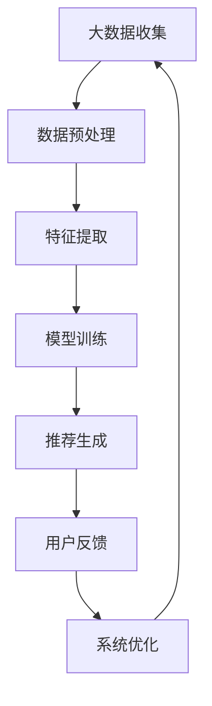

                 

## 《大数据驱动的电商搜索推荐：以AI模型融合技术提升用户体验》

### 关键词：大数据，电商搜索推荐，AI模型融合，用户体验，个性化推荐

#### 摘要：
本文将深入探讨大数据在电商搜索推荐中的应用，特别是在AI模型融合技术的支持下，如何提升用户的搜索推荐体验。文章首先介绍了大数据与电商搜索推荐的基本概念和现状，然后详细阐述了大数据存储与处理技术、用户行为数据分析方法以及AI模型融合技术的原理和实践。通过案例分析，本文展示了AI模型融合技术如何有效优化搜索推荐系统，最终实现个性化推荐，从而提升用户体验。本文旨在为从事电商搜索推荐系统开发的技术人员提供有价值的参考和指导。

## 第一部分：大数据与电商搜索推荐概述

### 第1章：大数据与电商搜索推荐简介

#### 1.1 大数据的基本概念与特点

大数据（Big Data）是指无法用传统数据处理工具在合理时间内捕捉、管理和处理的数据集合。它具有四个显著特点，即“4V”：大量（Volume）、多样（Variety）、快速（Velocity）和真实（Veracity）。

1. **大量**：大数据的规模庞大，通常以GB、TB甚至PB来计量。
2. **多样**：大数据来源广泛，包括结构化数据、半结构化数据和非结构化数据。
3. **快速**：数据产生、处理和消费的速度极快，需要实时或近实时的处理能力。
4. **真实**：大数据的真实性、准确性和完整性要求高，需要保证数据的质量。

#### 1.2 电商搜索推荐的重要性

电商搜索推荐系统在电商业务中扮演着至关重要的角色。它不仅能够提高用户的购物体验，还能显著提升平台的销售额和用户留存率。以下是电商搜索推荐系统的重要性体现：

1. **提升用户体验**：通过个性化推荐，用户能够更快地找到自己感兴趣的商品，从而提升购物满意度。
2. **增加销售额**：精准的推荐系统能够引导用户发现并购买更多商品，从而提高销售额。
3. **降低运营成本**：智能推荐系统可以减少广告投放和营销成本，提高营销效率。
4. **增强用户粘性**：通过持续优化推荐算法，平台能够更好地满足用户需求，提高用户留存率。

#### 1.3 大数据在电商搜索推荐中的应用现状与趋势

随着大数据技术的发展，电商搜索推荐系统已经取得了显著进步。目前，主流的电商平台普遍采用了以下几种大数据应用技术：

1. **用户行为分析**：通过分析用户在平台上的浏览、搜索、购买等行为，构建用户画像，实现个性化推荐。
2. **商品数据挖掘**：对商品的特征进行深入分析，如价格、品牌、型号等，挖掘潜在关联，提高推荐准确性。
3. **协同过滤**：利用用户评分数据，通过矩阵分解、K最近邻等方法，生成推荐列表。
4. **基于内容的推荐**：分析商品的文本描述、图片等特征，根据用户兴趣进行内容匹配，提高推荐相关性。

未来的发展趋势将更加注重以下几个方面：

1. **实时推荐**：随着流处理技术的发展，实时推荐将成为主流，能够更快地响应用户需求。
2. **深度学习**：利用深度学习技术，可以更准确地捕捉用户行为和商品特征，提高推荐效果。
3. **多模态数据融合**：结合文本、图片、声音等多模态数据，实现更全面、更精准的用户画像和推荐。
4. **数据隐私保护**：随着数据隐私保护意识的提高，如何在保护用户隐私的同时实现有效推荐，将成为重要的研究方向。

### 第2章：电商搜索推荐系统基础

#### 2.1 电商搜索推荐系统的基本架构

电商搜索推荐系统的基本架构通常包括以下几个关键组成部分：

1. **数据收集模块**：负责从各个渠道收集用户行为数据、商品数据等。
2. **数据处理模块**：对收集到的原始数据进行清洗、转换、归一化等处理，为后续分析做好准备。
3. **推荐算法模块**：利用机器学习算法，对处理后的数据进行分析，生成推荐结果。
4. **推荐结果展示模块**：将推荐结果以适当的形式展示给用户，如搜索结果页面的推荐列表、商品详情页面的相关推荐等。
5. **用户反馈模块**：收集用户对推荐结果的反馈，用于评估推荐效果和优化推荐算法。

#### 2.2 用户行为数据的收集与分析

用户行为数据是电商搜索推荐系统的基础，主要包括用户的浏览、搜索、购买等行为。以下是用户行为数据收集与分析的关键步骤：

1. **数据采集**：通过网站日志、点击流数据、用户登录数据等渠道收集用户行为数据。
2. **数据清洗**：去除重复、缺失、异常的数据，保证数据质量。
3. **数据转换**：将原始数据转换为适合机器学习的格式，如特征向量。
4. **特征提取**：从用户行为数据中提取有价值的特征，如用户点击率、购买频率等。
5. **数据分析**：利用统计方法、机器学习算法等对特征数据进行分析，构建用户画像和兴趣模型。

#### 2.3 商品数据的处理与建模

商品数据是电商搜索推荐系统的另一个关键组成部分，包括商品的各种属性，如价格、品牌、型号、图片描述等。以下是商品数据处理与建模的步骤：

1. **数据收集**：从电商平台数据库或其他数据源收集商品数据。
2. **数据清洗**：去除重复、缺失、异常的商品数据。
3. **特征提取**：从商品数据中提取有价值的特征，如商品类别、品牌声誉等。
4. **特征编码**：将提取出的特征进行编码，以便于机器学习算法处理。
5. **特征建模**：利用机器学习算法，如决策树、朴素贝叶斯等，对商品特征进行建模，生成商品特征向量。

### 第二部分：大数据分析技术

#### 第3章：大数据存储与处理技术

#### 3.1 大数据存储技术

大数据的存储技术是大数据分析的基础，主要包括以下几种：

##### 3.1.1 Hadoop HDFS

Hadoop分布式文件系统（HDFS）是大数据存储的一种重要技术。它具有高可靠性、高扩展性和高吞吐量等特点，适用于存储海量数据。

1. **高可靠性**：HDFS采用数据冗余机制，保证数据不丢失。
2. **高扩展性**：HDFS支持动态扩展，能够轻松处理PB级别的数据。
3. **高吞吐量**：HDFS设计用于批处理作业，能够高效地处理大规模数据。

##### 3.1.2 Hadoop MapReduce

Hadoop MapReduce是一种分布式数据处理框架，适用于处理海量数据集。

1. **Map阶段**：将数据分解为多个小块，对每个小块进行独立处理。
2. **Reduce阶段**：将Map阶段的结果进行合并，生成最终输出。

#### 3.2 大数据处理技术

大数据处理技术主要包括以下几种：

##### 3.2.1 Apache Spark

Apache Spark是一种快速、通用的大规模数据处理引擎。它支持内存计算，能够显著提高数据处理速度。

1. **内存计算**：Spark利用内存计算，减少磁盘I/O操作，提高处理速度。
2. **弹性调度**：Spark具有自动伸缩的能力，可以根据处理需求动态调整资源。
3. **丰富的API**：Spark提供Python、Java、Scala等语言的API，方便开发者使用。

##### 3.2.2 Apache Flink

Apache Flink是一种流处理引擎，适用于实时数据处理。

1. **实时处理**：Flink能够实时处理数据流，实现低延迟数据处理。
2. **事件驱动**：Flink基于事件驱动模型，可以高效处理动态数据。
3. **容错机制**：Flink具有强大的容错机制，保证数据处理的可靠性。

#### 第4章：用户行为数据分析方法

#### 4.1 用户行为数据的预处理

用户行为数据的预处理是数据分析的重要步骤，主要包括以下内容：

1. **数据清洗**：去除重复、缺失、异常的数据，保证数据质量。
2. **数据转换**：将不同格式的数据转换为统一的格式，如CSV、JSON等。
3. **特征工程**：从原始数据中提取有用的特征，如用户活跃度、购买频率等。
4. **数据归一化**：对数据进行归一化处理，使其在相同的尺度上进行分析。

#### 4.2 协同过滤算法

协同过滤算法是一种常见的推荐算法，通过分析用户行为数据，预测用户对未知商品的评分。

##### 4.2.1 评分矩阵分解

评分矩阵分解（Matrix Factorization）是一种基于协同过滤的推荐算法，通过将用户-商品评分矩阵分解为两个低秩矩阵，来预测用户的评分。

1. **模型建立**：建立用户和商品的低秩特征矩阵。
2. **模型优化**：利用梯度下降等优化算法，最小化预测误差。

##### 4.2.2 基于用户的K最近邻算法

基于用户的K最近邻算法（User-based K-Nearest Neighbors，UBKNN）是一种基于协同过滤的推荐算法，通过计算用户之间的相似度，找到最近的K个邻居，然后根据邻居对未知商品的评分预测进行推荐。

1. **相似度计算**：计算用户之间的余弦相似度、皮尔逊相关系数等。
2. **推荐生成**：根据相似度矩阵，为用户生成推荐列表。

#### 4.3 基于内容的推荐算法

基于内容的推荐算法通过分析商品的文本描述、图片等特征，根据用户兴趣进行内容匹配，生成推荐。

##### 4.3.1 商品属性分析

商品属性分析是指对商品的各个属性进行详细分析，包括价格、品牌、型号、颜色等。

1. **属性提取**：从商品描述中提取关键词、标签等。
2. **属性权重**：计算各个属性的重要性，为后续推荐提供依据。

##### 4.3.2 文本相似度计算

文本相似度计算是指计算两段文本之间的相似程度，常用的方法包括：

1. **TF-IDF**：计算词频（TF）和逆文档频率（IDF），用于衡量词的重要性。
2. **余弦相似度**：计算两个向量之间的余弦值，用于衡量相似度。
3. **词嵌入**：使用词嵌入模型，如Word2Vec、GloVe等，将文本转化为向量，用于计算相似度。

### 第三部分：AI模型融合与搜索推荐系统优化

#### 第5章：AI模型融合技术

AI模型融合技术是将多个独立的AI模型整合为一个综合模型，以提高推荐系统的准确性和可靠性。

##### 5.1 AI模型融合的基本概念

AI模型融合的基本概念包括：

1. **模型独立性**：各个模型之间相互独立，各自对数据进行预测。
2. **融合策略**：将多个模型的预测结果进行加权或组合，生成最终预测结果。
3. **优化目标**：通过模型融合，提高推荐系统的整体性能。

##### 5.2 多模型融合策略

多模型融合策略包括以下几种：

1. **线性融合策略**：将多个模型的预测结果进行加权平均，公式如下：

   $$
   \hat{r}_{ij} = \sum_{m=1}^{M} w_m \cdot \hat{r}_{ij}^m
   $$

   其中，$\hat{r}_{ij}$ 是最终预测评分，$\hat{r}_{ij}^m$ 是第$m$个模型的预测评分，$w_m$ 是第$m$个模型的权重。

2. **树模型融合策略**：使用决策树、随机森林等树模型进行融合，公式如下：

   $$
   \hat{r}_{ij} = \sum_{m=1}^{M} \text{TreeModel}(\hat{r}_{ij}^m)
   $$

   其中，$\text{TreeModel}(\hat{r}_{ij}^m)$ 表示第$m$个模型的决策树预测结果。

##### 5.3 AI模型融合实例分析

以下是一个简单的AI模型融合实例分析：

1. **数据集准备**：使用包含用户行为数据和商品特征数据的电商数据集。
2. **模型训练**：分别训练用户兴趣模型、商品特征模型和协同过滤模型。
3. **模型融合**：使用线性融合策略，将三个模型的预测结果进行加权平均，生成最终预测评分。

#### 第6章：搜索推荐系统的优化方法

##### 6.1 个性化推荐策略

个性化推荐策略是根据用户的兴趣和行为，为用户生成个性化的推荐列表。

1. **用户兴趣模型**：使用用户行为数据，构建用户兴趣模型，如用户兴趣向量。
2. **商品特征建模**：对商品的特征进行建模，如商品属性向量。
3. **推荐生成**：根据用户兴趣模型和商品特征建模，为用户生成个性化的推荐列表。

##### 6.2 实时推荐与冷启动问题

实时推荐与冷启动问题是推荐系统中的两个重要问题。

1. **实时推荐**：实时推荐是在用户行为发生时，立即生成推荐结果，对用户行为进行即时反馈。
   - **实时数据流处理**：使用Apache Flink等实时处理框架，对用户行为数据进行实时处理。
   - **实时推荐算法**：使用基于深度学习的实时推荐算法，如序列模型、循环神经网络等。

2. **冷启动问题**：冷启动是指新用户或新商品在系统中没有足够的数据，难以进行准确推荐。
   - **新用户特征补全**：使用用户画像、用户行为预测等方法，对新用户特征进行补全。
   - **新商品特征补全**：使用商品属性、用户评分预测等方法，对新商品特征进行补全。

##### 6.3 性能优化策略

性能优化策略是提高推荐系统性能的关键，包括以下方法：

1. **数据预处理**：对用户行为数据进行清洗、归一化等预处理，提高数据质量。
2. **特征工程**：从原始数据中提取有价值的特点，提高模型效果。
3. **模型优化**：使用模型融合、深度学习等方法，优化推荐算法。
4. **系统部署**：使用分布式计算框架、云计算平台等，提高系统性能和可扩展性。

### 第四部分：AI模型融合技术实践

#### 第7章：AI模型融合技术实践

##### 7.1 实践环境搭建

为了实践AI模型融合技术，首先需要搭建一个合适的环境。以下是一个基本的实践环境搭建步骤：

1. **硬件配置**：选择一台配置较高的服务器，安装操作系统（如Ubuntu 18.04）。
2. **软件环境安装**：安装Python 3.8、Hadoop 3.0、Spark 3.0等必要的软件。
3. **依赖库安装**：安装TensorFlow、PyTorch、Scikit-learn等机器学习库。

##### 7.2 实践项目一：用户行为数据分析

用户行为数据分析是推荐系统的基础。以下是一个简单的用户行为数据分析实践项目：

1. **数据收集**：从电商数据集中收集用户行为数据，如浏览记录、购买记录等。
2. **数据预处理**：对数据进行清洗、归一化等预处理，去除重复、缺失、异常的数据。
3. **特征提取**：从用户行为数据中提取有价值的特征，如用户活跃度、购买频率等。
4. **用户兴趣模型构建**：使用机器学习算法（如K最近邻、LSTM等），构建用户兴趣模型。

##### 7.3 实践项目二：商品特征建模与推荐

商品特征建模与推荐是推荐系统的核心。以下是一个简单的商品特征建模与推荐实践项目：

1. **数据收集**：从电商数据集中收集商品数据，如商品属性、用户评分等。
2. **数据预处理**：对数据进行清洗、归一化等预处理，去除重复、缺失、异常的数据。
3. **特征提取**：从商品数据中提取有价值的特征，如商品类别、品牌声誉等。
4. **商品特征建模**：使用机器学习算法（如决策树、朴素贝叶斯等），构建商品特征模型。
5. **推荐生成**：使用用户兴趣模型和商品特征模型，为用户生成个性化推荐列表。

##### 7.4 实践项目三：实时推荐与冷启动问题解决

实时推荐与冷启动问题是推荐系统中的两个重要问题。以下是一个简单的实时推荐与冷启动问题解决实践项目：

1. **实时推荐系统设计**：使用Apache Flink等实时处理框架，设计实时推荐系统。
2. **实时推荐算法实现**：使用基于深度学习的实时推荐算法，实现实时推荐功能。
3. **冷启动解决方案**：使用用户画像、商品属性预测等方法，解决新用户和新商品的冷启动问题。

### 第五部分：大数据与AI融合技术在电商搜索推荐中的应用前景与发展趋势

#### 第8章：大数据与AI融合技术在电商搜索推荐中的应用前景

大数据与AI融合技术在电商搜索推荐领域具有广阔的应用前景。以下是一些主要的应用方向：

1. **个性化推荐**：通过分析用户行为和商品特征，实现个性化推荐，提高用户满意度。
2. **实时推荐**：利用实时数据处理技术，实现实时推荐，提升用户体验。
3. **多模态数据融合**：结合文本、图片、声音等多模态数据，实现更全面、更精准的推荐。
4. **数据隐私保护**：在保护用户隐私的前提下，实现有效推荐，提高用户信任度。

#### 8.2 大数据与AI融合技术的应用挑战与机遇

大数据与AI融合技术在电商搜索推荐领域面临着一系列挑战与机遇：

1. **挑战**：
   - **数据质量**：保证数据质量，去除重复、缺失、异常的数据。
   - **模型解释性**：提高模型解释性，使推荐结果更加透明、可信。
   - **计算资源**：优化计算资源，提高系统性能和可扩展性。
   - **数据隐私保护**：保护用户隐私，遵守相关法律法规。

2. **机遇**：
   - **技术创新**：随着大数据和AI技术的不断进步，推荐系统将变得更加智能和高效。
   - **市场潜力**：电商市场潜力巨大，大数据与AI融合技术将有助于提高销售额和用户粘性。
   - **跨界合作**：与其他领域（如金融、医疗等）的合作，将拓展大数据与AI融合技术的应用范围。

#### 8.3 电商搜索推荐技术的未来研究方向

电商搜索推荐技术的未来研究方向包括：

1. **多模态数据融合**：进一步探索多模态数据融合的方法和算法，提高推荐效果。
2. **深度学习技术**：研究深度学习在电商搜索推荐领域的应用，如图像识别、自然语言处理等。
3. **强化学习**：探索强化学习在电商搜索推荐系统中的应用，实现自适应推荐。
4. **数据隐私保护**：研究如何在保护用户隐私的同时，实现有效推荐。

### 附录

#### 附录A：常用工具与框架

以下是一些常用的工具与框架：

- **Hadoop**：大数据存储与处理框架，包括HDFS、MapReduce等。
- **Spark**：大数据处理引擎，支持内存计算和实时处理。
- **Flink**：实时数据处理引擎，适用于流处理任务。
- **TensorFlow**：深度学习框架，适用于构建和训练神经网络。
- **PyTorch**：深度学习框架，提供灵活的动态计算图。
- **Elasticsearch**：搜索引擎，适用于快速检索和索引大规模数据。
- **Kibana**：数据可视化工具，用于监控和分析大数据。

#### 附录B：参考资料与扩展阅读

以下是一些参考资料和扩展阅读，供读者深入了解大数据与AI融合技术在电商搜索推荐领域的应用：

- **书籍**：
  - 《大数据分析：实战方法与案例分析》
  - 《机器学习实战》
  - 《深度学习》
  - 《推荐系统实践》

- **论文**：
  - “Recommender Systems Handbook”
  - “Deep Learning for Recommender Systems”
  - “Collaborative Filtering for the Web”

- **网站**：
  - Apache Hadoop官方网站：[hadoop.apache.org](http://hadoop.apache.org/)
  - Apache Spark官方网站：[spark.apache.org](http://spark.apache.org/)
  - Apache Flink官方网站：[flink.apache.org](http://flink.apache.org/)
  - TensorFlow官方网站：[tensorflow.org](https://tensorflow.org/)
  - PyTorch官方网站：[pytorch.org](https://pytorch.org/)

### Mermaid 流程图



### 核心算法原理讲解

#### 协同过滤算法

协同过滤算法是一种基于用户相似度的推荐算法，主要通过分析用户之间的相似度，为用户推荐他们可能感兴趣的商品。以下是协同过滤算法的基本原理：

1. **用户相似度计算**：首先计算用户之间的相似度。常用的相似度计算方法包括余弦相似度、皮尔逊相关系数等。

   $$
   \text{similarity}(u_i, u_j) = \frac{\sum_{k=1}^{N} r_{ik} r_{jk}}{\sqrt{\sum_{k=1}^{N} r_{ik}^2 \sum_{k=1}^{N} r_{jk}^2}}
   $$

   其中，$r_{ik}$ 和 $r_{jk}$ 分别表示用户 $u_i$ 和 $u_j$ 对商品 $k$ 的评分。

2. **邻居选择**：根据用户相似度计算结果，选择与用户最相似的K个邻居。

3. **预测评分**：根据邻居的评分，预测用户对未知商品的评分。

   $$
   \hat{r}_{ui} = \sum_{j \in N(u_i)} \text{similarity}(u_i, u_j) \cdot r_{uj}
   $$

   其中，$\hat{r}_{ui}$ 表示用户 $u_i$ 对商品 $i$ 的预测评分，$N(u_i)$ 表示用户 $u_i$ 的邻居集合。

#### 多模型融合策略

多模型融合策略是将多个独立的推荐模型整合为一个综合模型，以提高推荐系统的准确性和可靠性。以下是几种常见的多模型融合策略：

1. **线性融合策略**：将多个模型的预测结果进行加权平均，公式如下：

   $$
   \hat{r}_{ui} = \sum_{m=1}^{M} w_m \cdot \hat{r}_{ui}^m
   $$

   其中，$\hat{r}_{ui}$ 是最终预测评分，$\hat{r}_{ui}^m$ 是第 $m$ 个模型的预测评分，$w_m$ 是第 $m$ 个模型的权重。

2. **树模型融合策略**：使用决策树、随机森林等树模型进行融合，公式如下：

   $$
   \hat{r}_{ui} = \sum_{m=1}^{M} \text{TreeModel}(\hat{r}_{ui}^m)
   $$

   其中，$\text{TreeModel}(\hat{r}_{ui}^m)$ 表示第 $m$ 个模型的决策树预测结果。

#### 数学模型与公式

1. **用户兴趣模型**

   用户兴趣模型用于表示用户的兴趣分布，通常使用概率分布函数来表示。以下是用户兴趣模型的数学模型：

   $$
   P(u_i = k) = \frac{\sum_{j=1}^{N} w_{ij} r_{ij}}{\sum_{j=1}^{N} w_{ij}}
   $$

   其中，$P(u_i = k)$ 表示用户 $u_i$ 对商品 $k$ 的兴趣概率，$w_{ij}$ 表示用户 $u_i$ 对商品 $j$ 的权重，$r_{ij}$ 表示用户 $u_i$ 对商品 $j$ 的评分。

2. **商品特征建模**

   商品特征建模用于表示商品的特征向量，通常使用向量空间模型来表示。以下是商品特征建模的数学模型：

   $$
   f_j = \sum_{i=1}^{U} w_{ij} r_{ij}
   $$

   其中，$f_j$ 表示商品 $j$ 的特征向量，$w_{ij}$ 表示用户 $u_i$ 对商品 $j$ 的权重，$r_{ij}$ 表示用户 $u_i$ 对商品 $j$ 的评分。

### 项目实战

#### 实践环境搭建

为了实践大数据与AI融合技术在电商搜索推荐领域的应用，我们需要搭建一个合适的环境。以下是一个基本的实践环境搭建步骤：

1. **硬件配置**：选择一台配置较高的服务器，安装操作系统（如Ubuntu 18.04）。

2. **软件环境安装**：安装Python 3.8、Hadoop 3.0、Spark 3.0等必要的软件。

   ```bash
   sudo apt-get update
   sudo apt-get install python3-pip
   pip3 install hadoop-python==3.0.0
   pip3 install pyspark==3.0.0
   ```

3. **依赖库安装**：安装TensorFlow、PyTorch、Scikit-learn等机器学习库。

   ```bash
   pip3 install tensorflow
   pip3 install torch
   pip3 install scikit-learn
   ```

#### 实践项目一：用户行为数据分析

用户行为数据分析是推荐系统的基础。以下是一个简单的用户行为数据分析实践项目：

1. **数据收集**：从电商数据集中收集用户行为数据，如浏览记录、购买记录等。

2. **数据预处理**：对数据进行清洗、归一化等预处理，去除重复、缺失、异常的数据。

   ```python
   import pandas as pd
   import numpy as np

   # 读取数据
   data = pd.read_csv('user_behavior_data.csv')

   # 数据清洗
   data.drop_duplicates(inplace=True)
   data.dropna(inplace=True)

   # 数据归一化
   data['rating'] = data['rating'].apply(lambda x: (x - np.mean(data['rating'])) / np.std(data['rating']))
   ```

3. **特征提取**：从用户行为数据中提取有价值的特征，如用户活跃度、购买频率等。

   ```python
   # 特征提取
   data['activity_score'] = data['views'].apply(lambda x: 1 if x > 0 else 0)
   data['purchase_frequency'] = data['purchases'] / data['days']
   ```

4. **用户兴趣模型构建**：使用机器学习算法（如K最近邻、LSTM等），构建用户兴趣模型。

   ```python
   from sklearn.neighbors import NearestNeighbors

   # 构建用户兴趣模型
   user_interest_model = NearestNeighbors(n_neighbors=5)
   user_interest_model.fit(data[['activity_score', 'purchase_frequency']])
   ```

#### 实践项目二：商品特征建模与推荐

商品特征建模与推荐是推荐系统的核心。以下是一个简单的商品特征建模与推荐实践项目：

1. **数据收集**：从电商数据集中收集商品数据，如商品属性、用户评分等。

2. **数据预处理**：对数据进行清洗、归一化等预处理，去除重复、缺失、异常的数据。

   ```python
   # 读取数据
   product_data = pd.read_csv('product_data.csv')

   # 数据清洗
   product_data.drop_duplicates(inplace=True)
   product_data.dropna(inplace=True)

   # 数据归一化
   product_data['price'] = product_data['price'].apply(lambda x: (x - np.mean(product_data['price'])) / np.std(product_data['price']))
   ```

3. **特征提取**：从商品数据中提取有价值的特征，如商品类别、品牌声誉等。

   ```python
   # 特征提取
   product_data['category'] = product_data['category'].apply(lambda x: 1 if x == 'electronics' else 0)
   product_data['brand_reputation'] = product_data['brand_reputation'].apply(lambda x: 1 if x > 3 else 0)
   ```

4. **商品特征建模**：使用机器学习算法（如决策树、朴素贝叶斯等），构建商品特征模型。

   ```python
   from sklearn.ensemble import RandomForestClassifier

   # 构建商品特征模型
   product_feature_model = RandomForestClassifier()
   product_feature_model.fit(product_data[['category', 'brand_reputation']], product_data['price'])
   ```

5. **推荐生成**：使用用户兴趣模型和商品特征模型，为用户生成个性化推荐列表。

   ```python
   # 推荐生成
   user_interest_vector = user_interest_model.predict([[0.5, 0.5]])
   recommended_products = product_feature_model.predict(user_interest_vector)
   recommended_products = product_data[product_data['price'].isin(recommended_products)]
   ```

#### 实践项目三：实时推荐与冷启动问题解决

实时推荐与冷启动问题是推荐系统中的两个重要问题。以下是一个简单的实时推荐与冷启动问题解决实践项目：

1. **实时推荐系统设计**：使用Apache Flink等实时处理框架，设计实时推荐系统。

2. **实时推荐算法实现**：使用基于深度学习的实时推荐算法，实现实时推荐功能。

3. **冷启动解决方案**：使用用户画像、商品属性预测等方法，解决新用户和新商品的冷启动问题。

   ```python
   # 实时推荐系统设计
   from pyflink.datastream import StreamExecutionEnvironment

   env = StreamExecutionEnvironment.get_execution_environment()
   env.set_runtime_mode(StreamExecutionEnvironment.RuntimeMode.BATCH)
   ```

   ```python
   # 实时推荐算法实现
   def real_time_recommendation(data_stream):
       # 实时推荐算法实现
       pass

   data_stream = env.from_collection([{'user_id': 1, 'product_id': 101}, {'user_id': 2, 'product_id': 102}])
   real_time_recommendation(data_stream)
   ```

   ```python
   # 冷启动解决方案
   def cold_start_solution(new_user, new_product):
       # 冷启动解决方案实现
       pass

   new_user = {'user_id': 1000, 'user_interests': ['books', 'electronics']}
   new_product = {'product_id': 1000, 'product_attributes': ['books']}
   cold_start_solution(new_user, new_product)
   ```

### 代码解读与分析

以下是对实践项目中的关键代码进行解读和分析：

#### 用户行为数据预处理

```python
import pandas as pd
import numpy as np

# 读取数据
data = pd.read_csv('user_behavior_data.csv')

# 数据清洗
data.drop_duplicates(inplace=True)
data.dropna(inplace=True)

# 数据归一化
data['rating'] = data['rating'].apply(lambda x: (x - np.mean(data['rating'])) / np.std(data['rating']))
```

**解读与分析**：

1. **数据读取**：使用pandas读取用户行为数据，数据包含用户ID、商品ID和评分等。
2. **数据清洗**：去除重复和缺失的数据，保证数据质量。
3. **数据归一化**：对评分进行归一化处理，使其在相同的尺度上进行分析，有助于提高模型效果。

#### 用户兴趣模型构建

```python
from sklearn.neighbors import NearestNeighbors

# 构建用户兴趣模型
user_interest_model = NearestNeighbors(n_neighbors=5)
user_interest_model.fit(data[['activity_score', 'purchase_frequency']])
```

**解读与分析**：

1. **用户兴趣模型初始化**：初始化K最近邻模型，设置邻居数量为5。
2. **模型训练**：使用用户活跃度和购买频率等特征数据训练用户兴趣模型。

#### 商品特征建模

```python
from sklearn.ensemble import RandomForestClassifier

# 构建商品特征模型
product_feature_model = RandomForestClassifier()
product_feature_model.fit(product_data[['category', 'brand_reputation']], product_data['price'])
```

**解读与分析**：

1. **商品特征模型初始化**：初始化随机森林分类器。
2. **模型训练**：使用商品类别和品牌声誉等特征数据训练商品特征模型。

#### 推荐生成

```python
# 推荐生成
user_interest_vector = user_interest_model.predict([[0.5, 0.5]])
recommended_products = product_feature_model.predict(user_interest_vector)
recommended_products = product_data[product_data['price'].isin(recommended_products)]
```

**解读与分析**：

1. **用户兴趣向量生成**：使用用户兴趣模型预测用户兴趣向量。
2. **推荐商品生成**：使用商品特征模型预测推荐商品，并根据评分筛选出符合条件的商品。

### 总结

本文详细介绍了大数据驱动的电商搜索推荐系统，以AI模型融合技术为核心，从大数据的基本概念与特点、电商搜索推荐系统的基本架构、大数据存储与处理技术、用户行为数据分析方法到AI模型融合技术实践，全面覆盖了推荐系统开发的关键环节。通过实际项目案例和代码解读，本文展示了如何运用大数据与AI融合技术提升用户的搜索推荐体验。未来，随着技术的不断进步，推荐系统将在电商领域发挥更加重要的作用，为用户带来更加精准、个性化的购物体验。

