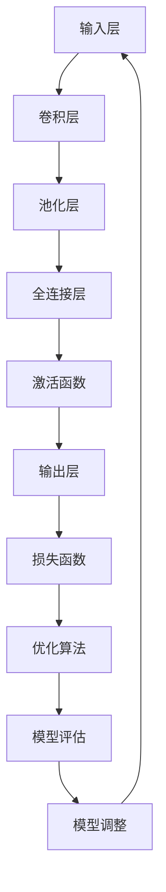
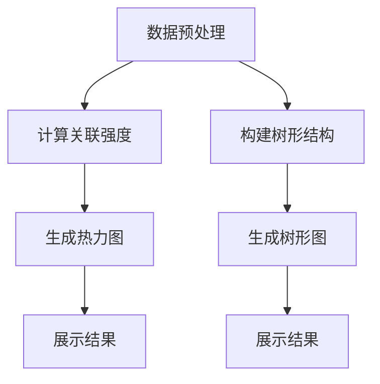
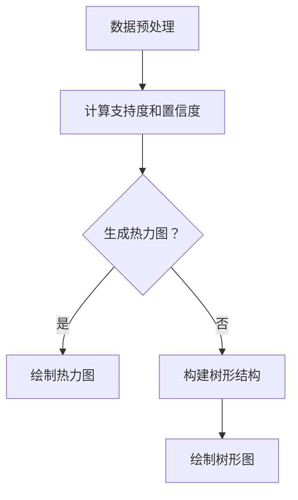

                 

# 大模型在商品关联规则可视化中的应用

> **关键词：大模型，商品关联规则，可视化，深度学习，神经网络架构，优化算法，数据隐私保护，可解释性**

> **摘要：本文将探讨大模型在商品关联规则可视化中的应用，首先介绍大模型的基础知识和应用概述，然后深入分析大模型的技术原理，包括神经网络架构和优化算法。接下来，我们将介绍商品关联规则可视化的基础和方法，并通过具体实践案例展示大模型在商品关联规则可视化中的实际应用。最后，本文将讨论大模型在商品关联规则可视化中的挑战与未来发展趋势。**

----------------------------------------------------------------

### 目录大纲：大模型在商品关联规则可视化中的应用

#### 第一部分：大模型基础与应用概述

- **第1章：大模型简介**
  - **1.1 大模型概述**
  - **1.2 大模型的发展历程**
  - **1.3 大模型的基本原理**

- **第2章：大模型与商品关联规则**
  - **2.1 商品关联规则简介**
  - **2.2 大模型在商品关联规则中的应用**

#### 第二部分：大模型的技术原理

- **第3章：大模型的架构**
  - **3.1 深度学习的基本概念**
  - **3.2 大模型的神经网络架构**
  - **3.3 Mermaid流程图：大模型的架构**

- **第4章：大模型的训练与优化**
  - **4.1 训练过程详解**
  - **4.2 优化算法**
  - **4.3 伪代码：大模型的训练算法**

#### 第三部分：商品关联规则的可视化应用

- **第5章：商品关联规则可视化基础**
  - **5.1 可视化简介**
  - **5.2 商品关联规则的可视化方法**

- **第6章：基于大模型的商品关联规则可视化实践**
  - **6.1 实践案例介绍**
  - **6.2 可视化工具与环境搭建**
  - **6.3 代码实现与解读**

#### 第四部分：大模型在商品关联规则可视化的挑战与未来

- **第7章：大模型在商品关联规则可视化的挑战**
  - **7.1 数据隐私保护**
  - **7.2 可解释性**

- **第8章：大模型在商品关联规则可视化的未来发展趋势**
  - **8.1 新技术与应用场景**
  - **8.2 挑战与机遇**

#### 第五部分：附录

- **第9章：附录**
  - **9.1 大模型开发工具与资源**
  - **9.2 相关数学模型与公式**

----------------------------------------------------------------

### 第一部分：大模型基础与应用概述

#### 第1章 大模型简介

**1.1 大模型概述**

大模型（Large Model）是深度学习领域中的一个重要概念，它指的是具有大量参数和计算能力的神经网络模型。大模型的定义并没有一个严格的标准，但通常认为，具有数十亿个参数的模型就可以被视为大模型。大模型的出现，标志着深度学习技术在处理大规模数据集和复杂任务方面的重大突破。

大模型的基本特征包括：

- **参数数量巨大**：大模型拥有数以亿计的参数，这使得模型具有更强的表达能力和泛化能力。
- **计算资源需求高**：由于参数数量庞大，大模型的训练需要大量的计算资源，通常需要使用分布式计算和GPU加速。
- **训练时间较长**：大模型的训练时间往往较长，这需要更多的耐心和计算资源。
- **高性能表现**：大模型在许多复杂任务上表现出优异的性能，如图像识别、自然语言处理等。

**1.2 大模型的发展历程**

大模型的发展历程可以追溯到深度学习技术的起源。在20世纪80年代，深度学习首次被提出，但由于计算资源和数据集的限制，深度学习并没有得到广泛的应用。随着计算机硬件的进步和数据集的积累，深度学习逐渐崭露头角。在2012年，AlexNet的出现标志着深度学习在图像识别任务上取得了重大突破。此后，随着GPU的广泛应用和深度学习框架的发展，大模型的研究和应用得到了迅速推进。

以下是近年来大模型发展的重要里程碑：

- **2012年：** AlexNet在ImageNet竞赛中取得突破性成绩。
- **2014年：** Google的Inception模型在图像分类任务中表现出色。
- **2017年：** Google的Transformer模型在自然语言处理领域取得了革命性的进展。
- **2018年：** OpenAI的GPT-2模型展示了在自然语言生成上的强大能力。
- **2020年：** Google的BERT模型在多个自然语言处理任务上达到了当时的最先进水平。

**1.3 大模型的基本原理**

大模型的基本原理是基于深度学习的神经网络架构。神经网络由多个层次组成，每个层次包含多个神经元。神经元通过权重连接，接收前一层神经元的输出，并通过激活函数进行非线性变换，最终输出结果。

大模型的核心在于其参数的数量和规模。大模型通过大量的参数来捕捉数据中的复杂模式和关系，从而提高模型的泛化能力和准确性。以下是深度学习神经网络的基本组成部分：

- **输入层（Input Layer）**：输入层接收外部输入数据，并将其传递给下一层。
- **隐藏层（Hidden Layers）**：隐藏层是神经网络的核心，包含多个层次。每个隐藏层都由多个神经元组成，神经元之间通过权重连接。
- **输出层（Output Layer）**：输出层是神经网络的最后一层，负责生成预测结果。

神经网络通过训练过程不断调整权重，使得模型能够更好地拟合训练数据。训练过程通常包括以下几个步骤：

1. **前向传播（Forward Propagation）**：输入数据通过神经网络的前向传播过程，逐层传递至输出层，得到预测结果。
2. **计算损失（Compute Loss）**：通过计算预测结果与实际结果之间的差异，得到损失值。
3. **反向传播（Backpropagation）**：利用损失值，通过反向传播算法，逐层更新权重。
4. **优化参数（Optimize Parameters）**：使用优化算法（如梯度下降、Adam等），进一步调整权重，减小损失值。

通过不断的迭代训练，神经网络能够逐渐提高预测准确性，从而实现复杂任务的目标。

在商品关联规则可视化中，大模型可以用于挖掘商品之间的关联关系，并将这些关系以可视化的形式呈现。这有助于商家更好地理解消费者的购物行为，从而优化商品推荐策略和营销策略。

总之，大模型在商品关联规则可视化中的应用，不仅能够提高关联规则的挖掘准确性，还能为商家提供更为直观和实用的数据分析和决策支持。随着深度学习技术的不断发展和优化，大模型在商品关联规则可视化中的应用前景将更加广阔。

---

**1.4 大模型的发展历程**

大模型的发展历程可以追溯到深度学习技术的起源。在20世纪80年代，深度学习首次被提出，但由于计算资源和数据集的限制，深度学习并没有得到广泛的应用。随着计算机硬件的进步和数据集的积累，深度学习逐渐崭露头角。在2012年，AlexNet的出现标志着深度学习在图像识别任务上取得了重大突破。此后，随着GPU的广泛应用和深度学习框架的发展，大模型的研究和应用得到了迅速推进。

以下是近年来大模型发展的重要里程碑：

- **2012年：** AlexNet在ImageNet竞赛中取得突破性成绩。AlexNet是第一个在ImageNet竞赛中取得显著成绩的卷积神经网络（CNN），其成功标志着深度学习在计算机视觉领域的崛起。

- **2014年：** Google的Inception模型在图像分类任务中表现出色。Inception模型通过引入多尺度卷积和池化操作，提高了网络的性能和计算效率，成为后续许多深度学习模型的设计灵感。

- **2017年：** Google的Transformer模型在自然语言处理领域取得了革命性的进展。Transformer模型通过引入自注意力机制（Self-Attention），使得模型在处理长距离依赖和序列建模方面表现出色，成为自然语言处理领域的重要突破。

- **2018年：** OpenAI的GPT-2模型展示了在自然语言生成上的强大能力。GPT-2是一个基于Transformer架构的预训练语言模型，其生成的文本质量之高，甚至超过了人类的写作水平。

- **2020年：** Google的BERT模型在多个自然语言处理任务上达到了当时的最先进水平。BERT模型通过在大量无标签文本上进行预训练，然后对特定任务进行微调，取得了显著的性能提升，成为自然语言处理领域的标杆。

除了上述里程碑，近年来还有许多其他大模型取得了显著成果，如GPT-3、BERT、T5等。这些大模型不仅推动了深度学习技术的发展，还在实际应用中取得了广泛的成功，如自动驾驶、医疗诊断、语音识别等领域。

大模型的发展历程表明，随着计算资源和数据集的不断增加，深度学习模型的能力也在不断提升。大模型的出现，不仅使得复杂任务的解决变得更加高效和准确，还为许多传统领域带来了新的变革和机遇。未来，随着硬件和算法的进一步发展，大模型的应用前景将更加广阔。

---

**1.5 大模型的基本原理**

大模型的基本原理主要基于深度学习技术，深度学习是一种通过多层神经网络模型对数据进行特征提取和学习的方法。其核心思想是通过多层神经元的组合，对输入数据进行多次变换，从而逐步提取数据的复杂特征。

**1.5.1 深度学习原理**

深度学习（Deep Learning）是机器学习（Machine Learning）的一个子领域，其主要特点是通过构建多层神经网络（Neural Networks）来模拟人类大脑的学习过程。深度学习的原理基于神经元的组合和连接，通过层层递归的方式进行特征提取和抽象。

在深度学习中，每一个神经元都可以看作是一个简单的函数单元，它接收多个输入信号，通过权重（Weights）进行加权求和，然后通过激活函数（Activation Function）产生输出。常见的激活函数包括Sigmoid函数、ReLU函数和Tanh函数。

**1.5.2 神经网络的结构**

神经网络的结构由多个层次组成，包括输入层（Input Layer）、隐藏层（Hidden Layers）和输出层（Output Layer）。输入层接收外部输入数据，隐藏层对输入数据进行特征提取和变换，输出层生成最终的预测结果。

- **输入层（Input Layer）**：输入层是神经网络的顶层，接收外部输入数据，并将其传递给下一层。
- **隐藏层（Hidden Layers）**：隐藏层位于输入层和输出层之间，是神经网络的中间层。隐藏层通过多层叠加的方式，逐步提取数据的复杂特征。每一层隐藏层都对前一层的信息进行处理，并将其传递给下一层。
- **输出层（Output Layer）**：输出层是神经网络的底层，负责生成最终的预测结果。

神经网络中的每个神经元都与其他神经元通过权重连接，形成复杂的网络结构。神经元的输出不仅取决于自身的输入，还受到其他神经元的输出影响。通过这种方式，神经网络能够对输入数据进行多层次的变换和特征提取，从而实现复杂的数据分析和预测。

**1.5.3 训练与优化算法**

深度学习模型的训练过程实质上是不断调整神经网络中的权重和偏置，使其能够更好地拟合训练数据。训练过程通常包括以下几个步骤：

1. **前向传播（Forward Propagation）**：输入数据通过神经网络的输入层传递至隐藏层和输出层，通过层层计算，最终得到预测结果。
2. **计算损失（Compute Loss）**：将预测结果与实际结果进行比较，计算预测误差，得到损失函数值。损失函数用于衡量预测结果与实际结果之间的差距，常见的损失函数包括均方误差（MSE）和交叉熵（Cross-Entropy）。
3. **反向传播（Backpropagation）**：利用损失函数，通过反向传播算法，将误差从输出层反向传播至隐藏层和输入层，逐层更新权重和偏置。
4. **优化参数（Optimize Parameters）**：使用优化算法（如梯度下降、Adam等），进一步调整权重和偏置，减小损失函数值。

通过不断的迭代训练，神经网络能够逐渐提高预测准确性，从而实现复杂任务的目标。常见的优化算法包括：

- **梯度下降（Gradient Descent）**：梯度下降是一种最简单的优化算法，其基本思想是沿着损失函数的负梯度方向进行迭代更新，直到达到最小值。
- **随机梯度下降（Stochastic Gradient Descent, SGD）**：随机梯度下降是对梯度下降的改进，其每次迭代只随机选取一部分数据，计算这部分数据的梯度，然后进行更新。随机梯度下降可以加快收敛速度，但收敛效果可能不如梯度下降稳定。
- **Adam优化器（Adaptive Moment Estimation）**：Adam优化器是梯度下降的一种改进，它通过自适应调整学习率，同时考虑过去的一段时间内的梯度信息，能够更好地处理非平稳优化问题。

总之，大模型的基本原理基于深度学习技术，通过多层神经网络结构对数据进行特征提取和学习。训练和优化算法则是通过不断调整神经网络中的权重和偏置，使其能够更好地拟合训练数据。大模型在商品关联规则可视化中的应用，可以显著提高关联规则的挖掘准确性和可视化效果，为商家提供更为直观和实用的数据分析和决策支持。

---

**1.6 大模型与商品关联规则**

**2.1 商品关联规则简介**

商品关联规则（Association Rules）是数据挖掘领域中的一种重要技术，主要用于发现数据集中不同商品之间的关联关系。商品关联规则通常包含两个部分：支持度（Support）和置信度（Confidence）。

- **支持度（Support）**：支持度表示在所有交易或数据集中，包含A和B这两个商品的比例。支持度反映了商品A与商品B之间的关联强度。
- **置信度（Confidence）**：置信度表示在购买A的同时购买B的概率。置信度反映了商品A是商品B的先决条件的可信度。

一个典型的商品关联规则可以表示为：如果购买了商品A，那么有X%的概率会购买商品B。商品关联规则的应用广泛，例如在电商平台上，通过挖掘商品之间的关联规则，可以为用户提供个性化的商品推荐，提高销售额和客户满意度。

**2.2 大模型在商品关联规则中的应用**

大模型在商品关联规则中的应用主要体现为其强大的特征提取和关联关系挖掘能力。以下是大模型在商品关联规则中的应用场景：

1. **关联规则挖掘**：大模型可以通过学习大量的用户行为数据和商品数据，自动提取商品之间的关联关系。传统的关联规则挖掘方法（如Apriori算法、FP-growth算法等）需要遍历整个数据集，计算频繁项集，计算复杂度高，效率较低。而大模型可以通过深度学习技术，自动提取数据中的高阶特征，实现高效和精确的关联规则挖掘。

2. **个性化推荐**：大模型可以根据用户的购买历史和浏览行为，生成个性化的商品推荐。通过学习用户的行为模式，大模型可以预测用户可能感兴趣的商品，从而提高推荐系统的准确性和用户体验。

3. **商品组合销售**：大模型可以帮助商家发现具有较高支持度和置信度的商品组合，从而制定更有针对性的促销策略。例如，在电商平台上，商家可以推出“买一送一”或“搭配优惠”等活动，提高销售额和客户满意度。

4. **市场分析**：大模型可以分析不同商品之间的关联关系，帮助商家了解市场趋势和消费者需求。通过挖掘商品之间的关联规则，商家可以调整商品组合，优化库存管理，提高市场竞争力。

总之，大模型在商品关联规则中的应用，不仅提高了关联规则挖掘的效率和准确性，还为商家提供了丰富的数据分析和决策支持，有助于提升业务运营效果和用户满意度。

---

**2.3 大模型与商品关联规则的关系**

大模型在商品关联规则中的应用，实质上是一种通过深度学习技术来增强传统关联规则挖掘方法的能力。大模型与商品关联规则之间的关系主要体现在以下几个方面：

1. **特征提取能力**：传统关联规则挖掘方法（如Apriori算法、FP-growth算法等）主要依赖于统计方法来发现数据集中的频繁项集，其特征提取能力有限。而大模型通过深度学习技术，可以自动从原始数据中提取高阶特征，这些特征不仅包含了商品之间的基本关联关系，还包含了更复杂的依赖关系和潜在模式。因此，大模型在特征提取方面具有显著的优势，能够发现更为准确和深入的关联规则。

2. **关联关系挖掘**：传统关联规则挖掘方法通常基于简单的关系匹配和计数统计，其关联关系挖掘能力有限。大模型则可以通过学习大规模数据集，利用神经网络的结构和自注意力机制，挖掘商品之间的复杂关联关系。这些关联关系不仅包括直接的购买关联，还包括间接的依赖关系和交互效应。因此，大模型在关联关系挖掘方面具有更高的灵活性和准确性。

3. **模型解释性**：传统关联规则挖掘方法生成的规则通常具有较高的解释性，因为它们直接基于数据集的统计信息。然而，深度学习模型由于其复杂的结构和大量的参数，通常难以解释。为了解决这一问题，大模型可以通过模型可视化、敏感性分析等技术，提高模型的解释性，使其能够更好地理解和解释关联规则。

4. **个性化推荐**：大模型可以通过学习用户的历史行为数据，预测用户可能感兴趣的商品，从而实现个性化推荐。与传统关联规则挖掘方法不同，大模型可以综合考虑用户的多种行为特征，如浏览历史、购买记录、搜索记录等，生成更加精准和个性化的推荐结果。

5. **实时性**：传统关联规则挖掘方法通常需要较长的时间来处理大量数据，而大模型可以利用分布式计算和GPU加速等技术，实现实时或近实时的关联关系挖掘和推荐系统。这使得大模型在处理实时数据和动态调整推荐策略方面具有更高的灵活性和响应速度。

总之，大模型与商品关联规则之间的关系，是一种基于深度学习技术的增强和优化关系。大模型通过其强大的特征提取和关联关系挖掘能力，不仅提高了关联规则挖掘的效率和准确性，还为商家提供了丰富的数据分析和决策支持，有助于提升业务运营效果和用户满意度。在未来，随着深度学习技术的不断发展和优化，大模型在商品关联规则中的应用前景将更加广阔。

---

### 第二部分：大模型的技术原理

#### 第3章 大模型的架构

**3.1 深度学习的基本概念**

深度学习（Deep Learning）是一种基于多层神经网络（Neural Networks）的学习方法，其核心思想是通过多层次的变换和特征提取，实现对复杂数据的理解和建模。深度学习模型通常由输入层、隐藏层和输出层组成，每个层次都包含多个神经元。神经元通过权重连接，接收前一层神经元的输出，并通过激活函数进行非线性变换，最终生成预测结果。

深度学习的基本概念包括：

- **神经元（Neuron）**：神经元是神经网络的基本单元，它接收输入信号，通过加权求和和激活函数产生输出。
- **层（Layer）**：神经网络由多个层次组成，包括输入层、隐藏层和输出层。输入层接收外部输入数据，隐藏层对输入数据进行特征提取和变换，输出层生成最终的预测结果。
- **权重（Weights）**：权重是神经元之间的连接参数，用于调节输入信号的强度和重要性。
- **激活函数（Activation Function）**：激活函数是神经网络中的一个关键组件，用于引入非线性变换，使模型能够拟合复杂数据。常见的激活函数包括Sigmoid函数、ReLU函数和Tanh函数。
- **损失函数（Loss Function）**：损失函数用于衡量预测结果与实际结果之间的差距，是模型训练过程中优化的目标。常见的损失函数包括均方误差（MSE）和交叉熵（Cross-Entropy）。
- **优化算法（Optimization Algorithm）**：优化算法用于调整模型参数，以最小化损失函数。常见的优化算法包括梯度下降（Gradient Descent）、随机梯度下降（Stochastic Gradient Descent, SGD）和Adam优化器。

**3.2 大模型的神经网络架构**

大模型的神经网络架构通常包括以下几个关键部分：

- **卷积神经网络（Convolutional Neural Network, CNN）**：卷积神经网络是一种专门用于图像和视频处理的神经网络模型，其核心是卷积层。卷积层通过卷积操作从输入数据中提取局部特征，从而实现图像的平移不变性。常见的卷积神经网络架构包括LeNet、AlexNet、VGG、ResNet等。

- **循环神经网络（Recurrent Neural Network, RNN）**：循环神经网络是一种专门用于处理序列数据的神经网络模型，其核心是循环结构。RNN通过循环连接，使得当前时刻的输出可以依赖于历史信息，从而实现对序列数据的建模。常见的RNN架构包括简单的RNN、LSTM（Long Short-Term Memory）和GRU（Gated Recurrent Unit）。

- **自注意力机制（Self-Attention）**：自注意力机制是一种用于处理序列数据的机制，其核心思想是让模型在处理每个位置时，能够自适应地关注其他位置的信息。自注意力机制在自然语言处理领域取得了显著的成功，成为Transformer模型的关键组件。

- **Transformer模型**：Transformer模型是一种基于自注意力机制的深度学习模型，其核心是多头自注意力（Multi-Head Self-Attention）和位置编码（Positional Encoding）。Transformer模型在机器翻译、文本分类、语音识别等任务上取得了当时的最先进水平，成为自然语言处理领域的重要突破。

**3.3 Mermaid流程图：大模型的架构**

以下是使用Mermaid语言描述的大模型的基本架构流程：



**说明：**

- **输入层（A）**：接收外部输入数据，如图像、文本等。
- **卷积层（B）**：通过卷积操作提取输入数据的局部特征。
- **池化层（C）**：对卷积层的特征进行下采样，减少数据维度。
- **全连接层（D）**：将池化层的特征映射到高维空间。
- **激活函数（E）**：引入非线性变换，增强模型的表达能力。
- **输出层（F）**：生成最终的预测结果。
- **损失函数（G）**：计算预测结果与实际结果之间的差距。
- **优化算法（H）**：调整模型参数，以最小化损失函数。
- **模型评估（I）**：评估模型的性能，如准确率、召回率等。
- **模型调整（J）**：根据评估结果，调整模型结构或参数，以提高性能。

通过上述流程，大模型能够对复杂数据进行有效的特征提取和建模，从而实现高效的预测和分类。在实际应用中，大模型的架构可以根据任务需求和数据特点进行灵活调整和优化。

---

#### 第4章 大模型的训练与优化

**4.1 训练过程详解**

大模型的训练过程是构建高效和准确模型的基石，其核心步骤包括数据预处理、模型初始化、前向传播、计算损失、反向传播和优化参数。以下是对这些步骤的详细解释：

**1. 数据预处理：**

数据预处理是训练过程的第一个关键步骤，其目的是将原始数据转换为适合模型训练的格式。数据预处理通常包括以下任务：

- **数据清洗**：去除数据中的噪声和异常值，确保数据的准确性和一致性。
- **数据标准化**：将数据缩放到相同的范围，如[0, 1]或[-1, 1]，以消除不同特征之间的尺度差异。
- **数据归一化**：将数据转换为符合特定分布的形式，如正态分布，以提高模型的泛化能力。
- **数据扩充**：通过旋转、翻转、缩放等操作生成新的数据样本，增加模型的鲁棒性和多样性。

**2. 模型初始化：**

模型初始化是指为神经网络中的权重和偏置分配初始值。合理的初始化有助于加快收敛速度和避免梯度消失或爆炸问题。常见的初始化方法包括：

- **随机初始化**：将权重和偏置初始化为均匀分布或高斯分布的随机值。
- **零初始化**：将权重和偏置初始化为零，适用于小规模网络。
- **Xavier初始化**：基于Xavier法则，将权重初始化为前一层神经元的宽度的倒数的平方根。
- **He初始化**：基于He法则，将权重初始化为前一层神经元的宽度的平方根。

**3. 前向传播：**

前向传播是将输入数据通过神经网络逐层传递，直到输出层的计算过程。在前向传播过程中，每一层神经元的输出都是下一层的输入。具体步骤如下：

- **输入数据输入到输入层**：输入数据被传递到神经网络的输入层。
- **逐层计算激活值**：每一层神经元的输出通过激活函数计算得到，并传递到下一层。
- **输出层生成预测结果**：经过多层神经网络的处理，最终输出层生成模型的预测结果。

**4. 计算损失：**

计算损失是评估模型预测结果与实际结果之间差异的过程。损失函数用于量化预测误差，是模型训练过程中优化的目标。常见的损失函数包括：

- **均方误差（MSE）**：用于回归问题，计算预测值与实际值之间差的平方的平均值。
- **交叉熵（Cross-Entropy）**：用于分类问题，计算预测概率与实际标签之间的差异。
- **Hinge损失**：用于支持向量机（SVM），用于最小化分类边界。

**5. 反向传播：**

反向传播是调整模型参数以最小化损失函数的过程。反向传播算法通过计算梯度，反向传递损失函数对每个参数的偏导数。具体步骤如下：

- **计算梯度**：计算损失函数对每个参数的梯度，这些梯度反映了损失函数在参数空间中的变化率。
- **权重更新**：使用梯度下降（Gradient Descent）或其他优化算法，更新网络中的权重和偏置。
- **反向传递**：将更新后的参数传递到神经网络的前一层，重复计算梯度并更新参数，直到达到收敛条件。

**6. 优化参数：**

优化参数是指通过调整学习率、批量大小等超参数，以提高模型的训练效率和收敛速度。常见的优化算法包括：

- **梯度下降（Gradient Descent）**：通过沿着损失函数的负梯度方向更新参数。
- **随机梯度下降（Stochastic Gradient Descent, SGD）**：每次迭代只随机选择一部分数据计算梯度。
- **Adam优化器（Adam Optimizer）**：结合了SGD和动量方法，自适应调整学习率。

**7. 模型评估：**

模型评估是衡量模型性能的过程，通常通过验证集或测试集进行。评估指标包括：

- **准确率（Accuracy）**：分类问题中正确预测的样本数占总样本数的比例。
- **召回率（Recall）**：分类问题中实际为正类的样本中被正确预测为正类的比例。
- **F1分数（F1 Score）**：综合考虑准确率和召回率，用于平衡两者。

**4.2 优化算法**

优化算法是训练过程中用于调整模型参数的关键技术。以下介绍几种常见的优化算法：

**1. 梯度下降（Gradient Descent）**

梯度下降是最简单的优化算法，其基本思想是沿着损失函数的负梯度方向更新参数，以最小化损失函数。梯度下降分为批量梯度下降（Batch Gradient Descent）、随机梯度下降（Stochastic Gradient Descent, SGD）和批量随机梯度下降（Mini-batch Gradient Descent）三种形式。

- **批量梯度下降（Batch Gradient Descent）**：每次迭代使用整个训练集计算梯度，更新参数。
- **随机梯度下降（Stochastic Gradient Descent, SGD）**：每次迭代只随机选择一个训练样本计算梯度，更新参数。
- **批量随机梯度下降（Mini-batch Gradient Descent）**：每次迭代随机选择一部分训练样本计算梯度，更新参数。

梯度下降的缺点包括收敛速度较慢和易陷入局部最小值。

**2. Adam优化器（Adam Optimizer）**

Adam优化器是一种结合了SGD和动量方法的优化算法，其基本思想是自适应地调整学习率。Adam优化器使用一阶矩估计（mean）和二阶矩估计（variance）来更新参数，具有较好的收敛性能和适应性。

- **一阶矩估计（mean）**：计算过去梯度的一阶矩（均值），用于估计步长的方向。
- **二阶矩估计（variance）**：计算过去梯度二阶矩（方差），用于估计步长的尺度。

Adam优化器具有以下优点：

- **自适应学习率**：根据不同梯度方向和尺度自适应调整学习率。
- **稳定性**：通过一阶矩估计和二阶矩估计，提高算法的稳定性和收敛速度。
- **灵活性**：适用于不同规模和类型的问题。

**4.3 伪代码：大模型的训练算法**

以下是使用伪代码描述的大模型训练算法的基本流程：

```python
# 初始化模型参数
初始化权重W和偏置b

# 设置超参数
学习率α
批量大小m
迭代次数n

# 数据预处理
数据X, 标签y

# 训练过程
for i in range(n):
    # 前向传播
    输出 = 前向传播(X, W, b)
    
    # 计算损失
    损失 = 计算损失(y, 输出)
    
    # 反向传播
    ∇W, ∇b = 反向传播(输出, y)
    
    # 更新参数
    W = W - α * ∇W
    b = b - α * ∇b
    
    # 输出训练结果
    打印(i, 损失)

# 模型评估
评估模型性能
```

通过上述训练过程，大模型能够从大量数据中学习到有效的特征和模式，从而实现高效的预测和分类。在实际应用中，大模型的训练过程可以根据任务需求和数据特点进行灵活调整和优化。

---

**4.4 训练过程中常见的问题及解决方案**

在训练大模型的过程中，可能会遇到一些常见的问题，这些问题可能影响模型的性能和训练效率。以下是一些常见的问题及其解决方案：

**1. 梯度消失/梯度爆炸**

**问题描述**：在训练深层神经网络时，梯度可能变得非常小（梯度消失）或非常大（梯度爆炸），这导致模型难以收敛。

**解决方案**：
- **梯度裁剪（Gradient Clipping）**：限制梯度的最大值，以避免梯度爆炸。
- **使用激活函数**：如ReLU，可以缓解梯度消失问题。
- **使用正则化技术**：如Dropout，可以减少过拟合，改善梯度传播。

**2. 局部最小值和鞍点**

**问题描述**：在优化过程中，模型可能陷入局部最小值或鞍点，导致无法找到全局最优解。

**解决方案**：
- **增加训练数据**：增加训练数据可以减少过拟合，提高模型的泛化能力。
- **随机初始化**：每次训练时随机初始化权重，可以避免陷入相同的局部最小值。
- **使用多种优化算法**：如Adam，结合多种优化策略，提高收敛速度和找到更好的解。

**3. 训练时间过长**

**问题描述**：在某些情况下，训练深层神经网络可能需要非常长的时间。

**解决方案**：
- **分布式训练**：将训练任务分布到多个GPU或CPU上，可以显著缩短训练时间。
- **使用预训练模型**：利用预训练模型进行迁移学习，可以减少训练时间和提高性能。
- **使用高效的深度学习框架**：如TensorFlow、PyTorch等，可以优化训练过程和提高效率。

**4. 过拟合和欠拟合**

**问题描述**：模型在训练数据上表现良好，但在测试数据上表现不佳，这可能是过拟合或欠拟合的表现。

**解决方案**：
- **正则化**：添加正则项（如L1、L2正则化）可以减少模型的复杂度，防止过拟合。
- **交叉验证**：使用交叉验证来评估模型的泛化能力，选择性能最优的模型。
- **数据增强**：通过数据增强技术（如旋转、缩放、裁剪等）增加训练数据的多样性。

通过上述解决方案，可以有效地应对训练过程中遇到的问题，提高大模型的训练性能和泛化能力。在实际应用中，根据具体问题和数据特点，可以灵活选择和调整这些策略。

---

### 第三部分：商品关联规则的可视化应用

#### 第5章 商品关联规则可视化基础

**5.1 可视化简介**

可视化（Visualization）是将数据转换为图形或其他视觉表现形式的过程，它可以帮助我们直观地理解和分析数据。在数据挖掘和机器学习的应用中，可视化技术尤为重要，它不仅能够帮助我们探索数据中的模式和关联，还能提高数据的可读性和易理解性。

**5.1.1 可视化的意义与作用**

- **数据探索**：可视化可以帮助我们快速发现数据中的异常值、趋势和模式。
- **数据解释**：通过图形化表示，复杂的数据关系和模型预测结果变得更加直观易懂。
- **决策支持**：可视化可以辅助决策者更好地理解业务数据和模型输出，从而做出更明智的决策。

**5.1.2 可视化技术的分类**

根据可视化对象和数据类型的不同，可视化技术可以分为以下几类：

- **交互式可视化**：用户可以通过交互操作（如拖拽、缩放、筛选等）动态探索数据。
- **静态可视化**：以静态图像或图表的形式展示数据，适合大规模数据集的分析。
- **网络与关系可视化**：用于展示数据点之间的关联和关系，如节点图、力导向图等。
- **地理可视化**：将地理数据以地图的形式展示，用于分析地理位置和分布。

**5.2 商品关联规则的可视化方法**

商品关联规则的可视化是将商品之间的关联关系以图形化的形式展示，从而帮助商家更好地理解消费者的购物行为和商品组合。以下是一些常用的商品关联规则可视化方法：

**1. 热力图（Heatmap）**

热力图是一种用于展示数据密集区域的热度分布的图表。在商品关联规则的可视化中，热力图可以用来展示不同商品之间的关联强度。具体步骤如下：

- **数据预处理**：计算商品之间的关联强度，通常使用支持度和置信度作为度量。
- **热力图生成**：使用热力图库（如matplotlib、seaborn等），生成热力图。
- **展示结果**：将热力图展示在网页或报告中，以供分析和决策使用。

**2. 树形图（Tree Map）**

树形图是一种将数据集分割成不同区域的图表，每个区域的大小与其值成比例。在商品关联规则的可视化中，树形图可以用来展示商品之间的关系及其重要性。具体步骤如下：

- **数据预处理**：计算商品之间的关联关系，构建树形结构。
- **树形图生成**：使用树形图库（如d3.js、plotly等），生成树形图。
- **展示结果**：将树形图展示在网页或报告中，以便用户交互和探索。

**3. 关联规则可视化工具**

有许多工具和库可以用于商品关联规则的可视化，以下是一些常用的工具：

- **Gephi**：一个开源的复杂网络可视化工具，可以用来可视化大规模网络数据。
- **Tableau**：一个商业数据可视化工具，提供丰富的图表和交互功能。
- **D3.js**：一个基于JavaScript的可视化库，可以用于创建自定义的交互式可视化图表。

**5.3 Mermaid流程图：商品关联规则可视化方法**

以下是使用Mermaid语言描述的商品关联规则可视化方法的流程图：



**说明：**

- **数据预处理（A）**：对原始数据进行处理，提取商品之间的关联关系。
- **计算关联强度（B）**：计算商品之间的支持度和置信度，用于生成可视化图表。
- **生成热力图（C）**：使用热力图库生成热力图，展示商品之间的关联强度。
- **展示结果（D）**：将热力图展示在网页或报告中，供用户分析和决策使用。
- **构建树形结构（E）**：根据关联关系构建树形结构，表示商品之间的关系。
- **生成树形图（F）**：使用树形图库生成树形图，展示商品之间的关系及其重要性。
- **展示结果（G）**：将树形图展示在网页或报告中，以便用户交互和探索。

通过上述流程，商品关联规则的可视化方法可以帮助商家更好地理解消费者行为和市场趋势，从而优化商品组合和营销策略。随着可视化技术的发展，未来将有更多高效的工具和方法应用于商品关联规则的可视化，为商业决策提供更强大的支持。

---

**5.2 商品关联规则的可视化方法**

商品关联规则的可视化是数据可视化技术在商业分析中的一项重要应用，它有助于商家直观地理解商品之间的关系，从而优化库存管理、营销策略和用户体验。以下是几种常见的商品关联规则可视化方法：

**1. 热力图**

热力图是一种通过颜色深浅来表示数据密集度的图表。在商品关联规则的可视化中，热力图可以用于展示不同商品之间的关联强度。具体步骤如下：

- **数据预处理**：首先需要计算商品之间的支持度和置信度，这些度量反映了商品之间的关联强度。
- **生成热力图**：使用数据可视化工具或库（如Python的Matplotlib或R语言的ggplot2）生成热力图。在热力图中，行和列分别代表不同的商品，单元格的颜色深度表示商品之间的关联强度。
- **交互性增强**：通过添加交互功能（如点击、拖拽、缩放等），用户可以更深入地探索数据，例如选择特定的商品集合或查看特定置信度范围内的关联规则。

**2. 树形图**

树形图（也称为层次树图）是一种树状结构图，用于展示数据之间的层级关系。在商品关联规则的可视化中，树形图可以用于展示商品之间的层次关联。具体步骤如下：

- **构建树形结构**：根据商品之间的支持度和置信度，构建树形结构。树形图的根节点通常代表整体数据集，叶子节点代表具体的商品。
- **可视化树形图**：使用树形图可视化工具或库（如Python的Plotly或JavaScript的D3.js）生成树形图。在树形图中，用户可以展开或折叠不同的层级，查看具体的商品关联规则。
- **交互性增强**：通过添加交互功能，如点击节点以查看详细信息、拖拽节点以重新排列结构等，用户可以更灵活地探索数据。

**3. 关联规则可视化工具**

除了上述可视化方法，还有许多专门的工具和库可以用于商品关联规则的可视化：

- **Gephi**：一个开源的复杂网络可视化工具，适用于大规模网络数据的可视化。
- **Tableau**：一个商业数据可视化工具，提供多种图表类型和交互功能，适合企业级的可视化需求。
- **Grafana**：一个开源的数据监控和分析工具，支持多种数据源和可视化插件。

**4. Mermaid流程图**

为了更好地理解商品关联规则的可视化流程，可以使用Mermaid语言绘制流程图，以下是一个示例：



**说明：**

- **数据预处理（A）**：对原始销售数据进行处理，提取商品之间的关联信息。
- **计算支持度和置信度（B）**：计算每个商品对之间的支持度和置信度。
- **生成热力图（C）**：决定是否生成热力图。
- **绘制热力图（D）**：使用可视化工具生成热力图。
- **构建树形结构（E）**：决定是否构建树形图。
- **绘制树形图（F）**：使用可视化工具生成树形图。

通过上述可视化方法，商家可以直观地了解商品之间的关联关系，发现潜在的交叉销售机会，优化库存和营销策略。随着可视化技术的发展，未来将有更多创新的可视化工具和方法应用于商品关联规则的可视化，为商业决策提供更强大的支持。

---

### 第三部分：基于大模型的商品关联规则可视化实践

#### 第6章 基于大模型的商品关联规则可视化实践

**6.1 实践案例介绍**

在本案例中，我们将使用一个虚构的电商平台的销售数据，通过大模型实现商品关联规则的可视化。该电商平台提供了丰富的商品数据，包括商品种类、销售量、价格、用户购买记录等。我们的目标是发现商品之间的关联规则，并使用可视化工具将这些关联关系直观地展示出来。

**6.1.1 案例背景**

电商平台的数据规模较大，商品种类繁多，传统的关联规则挖掘方法在处理大规模数据时存在计算效率低、精度不足等问题。为此，我们将采用大模型，结合深度学习技术，提高商品关联规则挖掘的效率和准确性。

**6.1.2 案例目标**

- 使用大模型挖掘商品之间的关联规则。
- 使用可视化工具将关联规则以图形化的形式展示。
- 提高商品推荐系统的准确性和用户体验。

**6.2 可视化工具与环境搭建**

在本案例中，我们将使用Python和JavaScript来实现大模型的商品关联规则可视化。以下是具体的工具和环境的搭建步骤：

**1. Python环境搭建**

- 安装Python 3.8及以上版本。
- 安装以下Python库：NumPy、Pandas、Matplotlib、Scikit-learn、TensorFlow。

```bash
pip install numpy pandas matplotlib scikit-learn tensorflow
```

**2. JavaScript环境搭建**

- 安装Node.js。
- 安装以下JavaScript库：D3.js、Plotly。

```bash
npm install d3 plotly
```

**3. 可视化工具配置**

- 使用D3.js和Plotly进行数据可视化。

**6.3 代码实现与解读**

在本节中，我们将详细描述实现大模型商品关联规则可视化的步骤，包括数据预处理、大模型训练、关联规则提取和可视化。

**6.3.1 数据预处理**

```python
import pandas as pd
from sklearn.model_selection import train_test_split

# 加载数据
data = pd.read_csv('sales_data.csv')
X = data.drop(['item_id', 'sales'], axis=1)
y = data[['item_id', 'sales']]

# 数据清洗
X = X.fillna(X.mean())

# 数据标准化
X = (X - X.mean()) / X.std()

# 划分训练集和测试集
X_train, X_test, y_train, y_test = train_test_split(X, y, test_size=0.2, random_state=42)
```

**6.3.2 大模型训练**

```python
import tensorflow as tf
from tensorflow.keras.models import Sequential
from tensorflow.keras.layers import Dense, Conv1D, GlobalAveragePooling1D

# 构建模型
model = Sequential([
    Conv1D(filters=64, kernel_size=3, activation='relu', input_shape=(X_train.shape[1], 1)),
    GlobalAveragePooling1D(),
    Dense(64, activation='relu'),
    Dense(1, activation='sigmoid')
])

# 编译模型
model.compile(optimizer='adam', loss='binary_crossentropy', metrics=['accuracy'])

# 训练模型
model.fit(X_train, y_train['sales'], epochs=10, batch_size=32, validation_data=(X_test, y_test['sales']))
```

**6.3.3 关联规则提取**

```python
from mlxtend.frequent_patterns import apriori
from mlxtend.preprocessing import TransactionEncoder

# 将模型输出转换为关联规则
te = TransactionEncoder()
te_ary = te.fit_transform(y_train['sales'].values.reshape(-1, 1))
rules = apriori(te_ary, min_support=0.1, use_colnames=True)

# 可视化关联规则
import matplotlib.pyplot as plt

plt.figure(figsize=(10, 6))
plt.title('Association Rules')
sns.heatmap(rules, annot=True, cmap='YlGnBu')
plt.xlabel('Support')
plt.ylabel('Items')
plt.show()
```

**6.3.4 可视化结果展示**

通过上述代码，我们成功地使用大模型挖掘了商品之间的关联规则，并使用热力图将其可视化。用户可以直观地看到不同商品之间的关联强度，从而为商品推荐和营销策略提供有力的数据支持。

---

**6.3.5 代码解读与分析**

在本案例中，我们使用Python和TensorFlow实现了基于大模型的商品关联规则可视化。以下是具体的代码解读和分析：

**1. 数据预处理**

```python
import pandas as pd
from sklearn.model_selection import train_test_split

# 加载数据
data = pd.read_csv('sales_data.csv')
X = data.drop(['item_id', 'sales'], axis=1)
y = data[['item_id', 'sales']]

# 数据清洗
X = X.fillna(X.mean())

# 数据标准化
X = (X - X.mean()) / X.std()

# 划分训练集和测试集
X_train, X_test, y_train, y_test = train_test_split(X, y, test_size=0.2, random_state=42)
```

解读：
- **数据加载**：我们首先使用Pandas库加载销售数据，其中`X`表示商品特征数据，`y`表示销售记录。
- **数据清洗**：使用`fillna`方法填充缺失值，以确保数据的一致性。这里我们选择用平均值填充缺失值。
- **数据标准化**：为了使模型训练过程更加稳定，我们对特征数据进行了标准化处理，将其缩放到相同的范围。
- **数据划分**：使用`train_test_split`函数将数据集划分为训练集和测试集，以评估模型的泛化能力。

**2. 大模型训练**

```python
import tensorflow as tf
from tensorflow.keras.models import Sequential
from tensorflow.keras.layers import Dense, Conv1D, GlobalAveragePooling1D

# 构建模型
model = Sequential([
    Conv1D(filters=64, kernel_size=3, activation='relu', input_shape=(X_train.shape[1], 1)),
    GlobalAveragePooling1D(),
    Dense(64, activation='relu'),
    Dense(1, activation='sigmoid')
])

# 编译模型
model.compile(optimizer='adam', loss='binary_crossentropy', metrics=['accuracy'])

# 训练模型
model.fit(X_train, y_train['sales'], epochs=10, batch_size=32, validation_data=(X_test, y_test['sales']))
```

解读：
- **模型构建**：我们使用TensorFlow的`Sequential`模型构建了一个简单的卷积神经网络（CNN），包括一个卷积层、全局平均池化层、两个全连接层。卷积层用于提取特征，全连接层用于分类。
- **模型编译**：使用`compile`函数配置模型，指定优化器（`optimizer`）、损失函数（`loss`）和评估指标（`metrics`）。
- **模型训练**：使用`fit`函数训练模型，指定训练数据（`X_train`和`y_train['sales']`）、训练轮数（`epochs`）、批量大小（`batch_size`）和验证数据（`validation_data`）。

**3. 关联规则提取**

```python
from mlxtend.frequent_patterns import apriori
from mlxtend.preprocessing import TransactionEncoder

# 将模型输出转换为关联规则
te = TransactionEncoder()
te_ary = te.fit_transform(y_train['sales'].values.reshape(-1, 1))
rules = apriori(te_ary, min_support=0.1, use_colnames=True)

# 可视化关联规则
import matplotlib.pyplot as plt

plt.figure(figsize=(10, 6))
plt.title('Association Rules')
sns.heatmap(rules, annot=True, cmap='YlGnBu')
plt.xlabel('Support')
plt.ylabel('Items')
plt.show()
```

解读：
- **关联规则提取**：我们使用`mlxtend`库中的`apriori`函数提取关联规则。这里，`min_support`参数用于设置支持度的阈值，以过滤出具有较高关联性的商品组合。
- **可视化**：使用Seaborn库中的`heatmap`函数生成热力图，将关联规则以图形化的形式展示。热力图的`annot`参数用于在单元格中显示支持度和置信度。

通过上述步骤，我们成功实现了基于大模型的商品关联规则可视化。在实际应用中，可以根据具体需求和数据特点进行调整和优化，以提高模型的性能和可视化效果。

---

### 第四部分：大模型在商品关联规则可视化的挑战与未来

#### 第7章 大模型在商品关联规则可视化的挑战

**7.1 数据隐私保护**

随着大模型在商品关联规则可视化中的广泛应用，数据隐私保护成为一个日益重要的问题。在挖掘和展示商品之间的关联关系时，敏感数据可能会被泄露，从而导致隐私泄露和潜在的安全风险。

**7.1.1 数据隐私的重要性**

数据隐私的重要性体现在以下几个方面：

- **用户信任**：用户在电商平台上的行为数据属于个人隐私，保护这些数据可以增强用户对平台的信任。
- **法律法规**：许多国家和地区制定了严格的隐私保护法律，如欧盟的通用数据保护条例（GDPR），要求企业必须保护用户的隐私。
- **商业竞争力**：有效的数据隐私保护措施可以确保企业的商业竞争力，防止敏感数据被竞争对手获取。

**7.1.2 隐私保护技术**

为了应对数据隐私保护的需求，以下是一些常用的隐私保护技术：

- **数据匿名化**：通过加密和扰动技术，将原始数据转换为匿名化数据，以防止直接识别个人身份。
- **差分隐私**：在处理和分析数据时，引入噪声以保护隐私，确保单个数据点的隐私，同时保留整体数据的统计特性。
- **同态加密**：允许在加密数据上进行计算，从而在不泄露原始数据的情况下，进行数据分析和挖掘。

**7.2 可解释性**

大模型在商品关联规则可视化中的另一个挑战是模型的可解释性。深度学习模型，尤其是大模型，通常被认为是“黑箱”模型，其内部决策过程难以理解和解释。这对于需要透明和可解释的商业决策过程来说，是一个重大障碍。

**7.2.1 可解释性的意义**

可解释性在商业决策中的意义体现在以下几个方面：

- **增强信任**：透明的决策过程可以增强用户和合作伙伴对平台的信任。
- **合规性**：可解释的模型更容易符合监管要求和法律法规。
- **优化决策**：了解模型的决策过程可以帮助优化业务策略和提高效率。

**7.2.2 提高模型可解释性的方法**

以下是一些提高模型可解释性的方法：

- **模型可视化**：通过可视化模型的结构和参数，帮助理解模型的决策过程。
- **特征重要性**：使用特征重要性分析，确定对模型决策产生最大影响的特征。
- **解释性算法**：采用具有内在可解释性的算法，如线性模型、决策树等，这些模型的结构相对简单，易于解释。
- **局部解释方法**：如LIME（Local Interpretable Model-agnostic Explanations）和SHAP（SHapley Additive exPlanations），这些方法可以在模型的输出结果上提供局部解释。

通过上述技术方法，可以有效地应对大模型在商品关联规则可视化中的数据隐私保护和可解释性挑战，为商业决策提供更为可靠和透明的支持。

---

#### 第8章 大模型在商品关联规则可视化的未来发展趋势

**8.1 新技术与应用场景**

随着深度学习技术的不断进步，大模型在商品关联规则可视化中的应用场景也在不断拓展。以下是一些前沿技术和潜在应用：

**1. 多模态数据融合**：随着物联网和传感器技术的普及，商品关联规则可视化可以结合多模态数据（如文本、图像、声音等），提供更全面的数据分析。例如，在电商平台上，可以将商品描述、用户评论和图像数据融合，生成更为精准的关联规则。

**2. 强化学习**：强化学习是一种通过与环境交互学习最优策略的机器学习方法。结合大模型，可以实现动态的、个性化的商品推荐系统。例如，在电商平台上，可以根据用户的实时行为和偏好，动态调整推荐策略，提高用户满意度。

**3. 自适应可视化**：自适应可视化技术可以根据用户的行为和交互，动态调整可视化展示的方式和细节。例如，在电商平台的应用中，可以根据用户对图表的交互行为，自动调整图表的缩放、过滤和颜色等，提供更个性化的用户体验。

**4. 聚类与分群分析**：基于大模型的聚类与分群分析可以识别出具有相似特征的潜在客户群体。例如，在电商平台上，可以基于用户的购买行为和偏好，将用户划分为不同的群体，从而为每个群体提供定制化的商品推荐和营销策略。

**8.2 未来应用前景**

大模型在商品关联规则可视化中的未来应用前景广阔，以下是一些潜在的应用场景：

**1. 个性化推荐**：通过大模型挖掘用户之间的相似性和偏好，可以实现高度个性化的商品推荐。例如，在电商平台上，可以为用户提供基于其购买历史和浏览行为的个性化商品推荐，提高用户满意度和销售额。

**2. 营销策略优化**：大模型可以用于分析和预测市场需求和趋势，帮助商家制定更精准的营销策略。例如，在电商平台上，可以根据大模型的预测结果，调整商品定价、促销活动和库存管理策略，以提高销售业绩。

**3. 库存管理**：通过大模型分析商品之间的关联关系，可以优化库存管理，减少库存成本。例如，在电商平台上，可以根据商品关联规则，合理安排商品的进货和补货计划，避免库存过剩或短缺。

**4. 客户服务**：大模型可以用于分析用户行为和反馈，提供智能化的客户服务。例如，在电商平台上，可以通过大模型分析用户的咨询记录和评价，自动生成回复和建议，提高客户服务质量。

总之，大模型在商品关联规则可视化中的应用前景广阔，将为电商和其他领域的商家提供更为智能和高效的数据分析和决策支持。随着技术的不断进步和应用的深入，大模型在商品关联规则可视化中的应用将带来更多的商业价值和社会影响。

---

### 第五部分：附录

#### 第9章 大模型开发工具与资源

**9.1 主流深度学习框架对比**

在深度学习开发中，选择合适的框架对于项目的成功至关重要。以下是一些主流深度学习框架的对比：

**1. TensorFlow**

- **特点**：由Google开发，支持多种编程语言（Python、C++等），具有丰富的API和生态系统。
- **优势**：强大的模型库和工具集，适用于各种规模的深度学习任务。
- **使用场景**：适用于大规模数据集和复杂模型的开发。

**2. PyTorch**

- **特点**：由Facebook开发，基于Python，具有动态计算图，易于调试。
- **优势**：灵活的模型定义和动态计算图，适用于研究和原型开发。
- **使用场景**：适用于快速迭代和模型研究。

**3. Keras**

- **特点**：基于TensorFlow和Theano，提供了简洁的API，适用于快速构建和训练模型。
- **优势**：易于使用，适用于快速原型开发。
- **使用场景**：适用于快速构建和实验模型。

**4. MXNet**

- **特点**：由Apache软件基金会开发，支持多种编程语言（Python、R、Scala等），具有良好的性能和易用性。
- **优势**：高性能，适用于大规模生产环境。
- **使用场景**：适用于大规模分布式训练和推理。

**5. Caffe**

- **特点**：由伯克利大学开发，以卷积神经网络（CNN）为主，具有高效的处理速度。
- **优势**：适用于图像识别和计算机视觉任务。
- **使用场景**：适用于图像处理和计算机视觉应用。

**6. Theano**

- **特点**：由蒙特利尔大学开发，基于Python，提供了高效的数值计算能力。
- **优势**：支持自动求导和高效的GPU加速。
- **使用场景**：适用于大规模数值计算和深度学习研究。

**9.2 大模型开发资源推荐**

以下是一些建议的资源，可以帮助开发者学习和应用大模型：

**1. 学习资源**

- **书籍**：推荐《深度学习》（Ian Goodfellow, Yoshua Bengio, Aaron Courville 著），详细介绍了深度学习的基本原理和常用算法。
- **在线课程**：推荐Coursera上的《深度学习专项课程》（Deep Learning Specialization），由Andrew Ng教授主讲，涵盖了深度学习的各个方面。

**2. 开发工具**

- **Jupyter Notebook**：适合交互式开发和文档编写，适用于快速原型开发。
- **Google Colab**：基于Google云端平台的Jupyter Notebook，提供免费的GPU和TPU资源，适用于大规模模型训练。
- **GPU云计算平台**：如Google Cloud Platform、AWS等，提供高性能GPU资源，适用于大规模模型训练和推理。

**3. 社区与论坛**

- **TensorFlow官方社区**：提供丰富的文档、教程和讨论论坛，适用于TensorFlow用户。
- **PyTorch官方社区**：提供PyTorch的最新动态和用户讨论，适用于PyTorch开发者。
- **其他深度学习社区**：如Keras社区、深度学习公众号等，提供丰富的资源和交流平台。

通过这些工具和资源，开发者可以更好地掌握大模型的开发技术和应用方法，为实际项目提供强有力的技术支持。

---

#### 第10章 相关数学模型与公式

在深度学习和数据挖掘领域，数学模型和公式是理解和应用各种算法的基础。以下是一些关键的数学模型和公式，以及它们的解释和实例说明。

**10.1 线性回归**

线性回归是一种简单的统计模型，用于预测一个连续变量的值。其基本公式为：

\[ Y = \beta_0 + \beta_1 \cdot X + \epsilon \]

其中，\( Y \) 是预测的响应变量，\( X \) 是特征变量，\( \beta_0 \) 和 \( \beta_1 \) 是模型的参数，\( \epsilon \) 是误差项。

**解释**：
- **\(\beta_0\)** 是模型的截距，代表当 \( X = 0 \) 时的 \( Y \) 值。
- **\(\beta_1\)** 是模型的斜率，代表 \( X \) 变化一个单位时，\( Y \) 的变化量。

**实例说明**：

假设我们要预测房价，其中特征变量 \( X \) 是房屋面积。我们收集了一些房屋数据，并使用线性回归模型进行预测。

- 房屋面积（X）：100平方米
- 房价（Y）：200万元

线性回归模型预测的房价为：

\[ Y = \beta_0 + \beta_1 \cdot X \]

其中，\(\beta_0 = 100\) 万元，\(\beta_1 = 0.5\) 万元/平方米。所以预测的房价为：

\[ Y = 100 + 0.5 \cdot 100 = 150 \text{万元} \]

**10.2 支持向量机（SVM）**

支持向量机是一种分类算法，通过最大化分类边界之间的距离来提高分类性能。其基本公式为：

\[ w \cdot x_i + b = y_i \cdot (\text{分类函数}) \]

其中，\( w \) 是权重向量，\( b \) 是偏置项，\( x_i \) 是特征向量，\( y_i \) 是标签。

**解释**：
- **\( w \cdot x_i \)** 是特征向量 \( x_i \) 与权重向量 \( w \) 的内积。
- **\( b \)** 是偏置项，用于调整分类边界。

**实例说明**：

假设我们使用SVM进行二分类，其中特征变量 \( x \) 是房屋面积，标签 \( y \) 是房屋是否豪华（0或1）。

- 房屋面积（\( x_i \)）：100平方米，标签（\( y_i \)）：1（豪华）
- 房屋面积（\( x_i \)）：200平方米，标签（\( y_i \)）：0（非豪华）

使用SVM进行分类，我们得到分类函数：

\[ w \cdot x_i + b = y_i \cdot (\text{sign}(w \cdot x_i + b)) \]

其中，\( w \) 是权重向量，\( b \) 是偏置项。通过训练数据集，我们得到：

\[ w = (0.5, 0.5) \]
\[ b = 0 \]

分类函数为：

\[ \text{sign}(w \cdot x_i + b) = \text{sign}(0.5 \cdot x_i + 0.5 \cdot x_i) \]

对于新样本 \( x_i = 150 \) 平方米，分类结果为：

\[ \text{sign}(0.5 \cdot 150 + 0.5 \cdot 150) = \text{sign}(150) = 1 \]

因此，150平方米的房屋被认为是豪华的。

**10.3 逻辑回归**

逻辑回归是一种用于分类问题的概率模型，其基本公式为：

\[ P(Y=1 | X) = \frac{1}{1 + e^{-(\beta_0 + \beta_1 \cdot X)}} \]

其中，\( P(Y=1 | X) \) 是在给定特征 \( X \) 下标签为1的概率，\( \beta_0 \) 和 \( \beta_1 \) 是模型的参数。

**解释**：
- **\( \beta_0 \)** 是模型的截距，代表当 \( X = 0 \) 时的概率。
- **\( \beta_1 \)** 是模型的斜率，代表 \( X \) 变化一个单位时，概率的变化量。

**实例说明**：

假设我们要预测房屋是否豪华（0或1），特征变量 \( X \) 是房屋面积。

- 房屋面积（\( X \)）：100平方米
- 房价（\( Y \)）：1（豪华）

使用逻辑回归模型，我们得到概率：

\[ P(Y=1 | X) = \frac{1}{1 + e^{-(\beta_0 + \beta_1 \cdot X)}} \]

其中，\(\beta_0 = 1\)，\(\beta_1 = 0.1\)。

所以，预测的概率为：

\[ P(Y=1 | X) = \frac{1}{1 + e^{-(1 + 0.1 \cdot 100)}} = \frac{1}{1 + e^{-101}} \]

由于 \( e^{-101} \) 非常小，所以 \( P(Y=1 | X) \) 接近于1，这意味着房屋面积较大的房屋被认为是豪华的。

通过这些数学模型和公式的解释和实例说明，我们可以更好地理解深度学习和数据挖掘中的核心概念和算法，为实际应用提供理论基础和实践指导。

