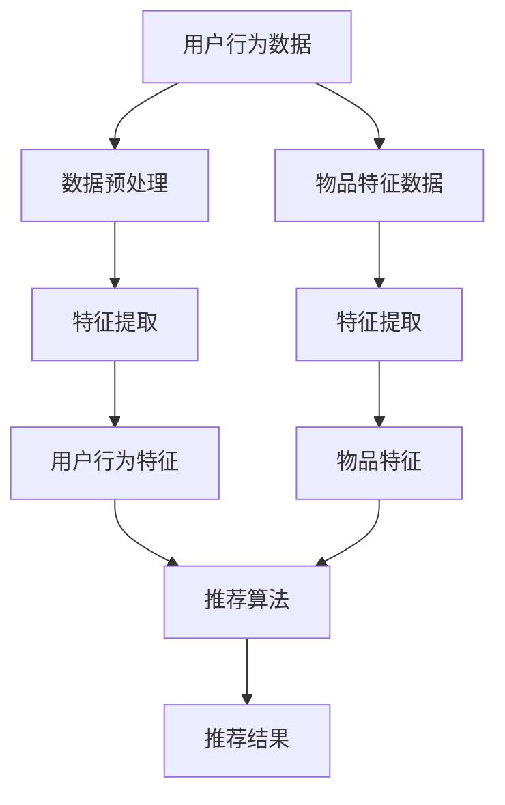

                 

### 《大模型在电商推荐中的应用与挑战》

> **关键词**：大模型、电商推荐、用户行为分析、物品特征提取、协同过滤、内容推荐、隐私保护、优化策略、A/B测试、实时更新

> **摘要**：本文详细探讨了大模型在电商推荐系统中的应用与挑战。首先，我们介绍了大模型的基本概念及其在电商推荐中的作用，然后深入分析了大模型的技术基础及其应用。接下来，本文重点阐述了电商推荐系统中大模型的应用，包括用户行为分析、物品特征提取和推荐算法设计。随后，我们讨论了优化推荐系统的方法以及大模型在实际应用中面临的挑战，如训练成本、隐私保护和安全性。最后，本文通过案例分析展示了大模型在电商推荐中的成功应用，并提出了未来的发展方向和趋势。

### 《大模型在电商推荐中的应用与挑战》目录大纲

---

#### 第一部分：大模型概述及应用基础

- **第1章：大模型在电商推荐中的核心概念**
  - 1.1 大模型与电商推荐
  - 1.2 电商推荐系统的基本原理
  - 1.3 大模型在电商推荐中的应用

- **第2章：大模型技术基础**
  - 2.1 大模型的基本原理
  - 2.2 大模型在电商推荐中的挑战
  - 2.3 大模型的应用框架

#### 第二部分：大模型在电商推荐中的应用

- **第3章：电商推荐系统中的大模型应用**
  - 3.1 用户行为分析
  - 3.2 物品描述与特征提取
  - 3.3 大模型在推荐系统中的应用

- **第4章：电商推荐系统的优化与挑战**
  - 4.1 推荐系统的优化策略
  - 4.2 大模型在推荐系统中的挑战

- **第5章：大模型在电商推荐中的案例分析**
  - 5.1 案例一：某电商平台的大模型推荐系统

- **第6章：大模型在电商推荐中的应用前景与趋势**
  - 6.1 大模型在电商推荐中的应用前景
  - 6.2 大模型在电商推荐中的技术趋势

#### 第三部分：大模型在电商推荐中的实践与挑战

- **第7章：大模型在电商推荐中的实践指南**
  - 7.1 实践步骤
  - 7.2 实践案例解析

- **第8章：大模型在电商推荐中的挑战与应对策略**
  - 8.1 挑战一：训练成本与计算资源
  - 8.2 挑战二：隐私保护与安全

#### 附录

- **附录A：大模型在电商推荐中的应用资源与工具**
  - A.1 资源介绍
  - A.2 工具使用指南

---

现在，我们开始深入探讨大模型在电商推荐中的应用与挑战。在接下来的章节中，我们将逐步解析这一主题，帮助读者更好地理解大模型在电商推荐系统中的重要性及其面临的挑战。

---

### 第1章：大模型在电商推荐中的核心概念

在当今的电商领域中，推荐系统已经成为提升用户满意度和增加销售额的关键因素。随着大数据和人工智能技术的不断发展，大模型在电商推荐中的应用越来越广泛。本章节将详细探讨大模型在电商推荐中的核心概念，包括大模型的基本定义、电商推荐系统的基本原理以及大模型在电商推荐中的应用。

#### 1.1 大模型与电商推荐

**1.1.1 大模型的定义与特点**

大模型（Large-scale Model）是指具有海量参数、复杂结构并且能够处理大规模数据集的机器学习模型。这些模型通常基于深度神经网络，具有高度的非线性能力和强大的表征能力。大模型的主要特点包括：

- **高参数数量**：大模型通常具有数十亿甚至千亿级别的参数，这使得模型能够捕捉到数据中的细微模式和关联性。
- **复杂结构**：大模型的结构通常包含多个层次，包括卷积层、循环层和全连接层等，这使得模型能够处理不同类型的数据。
- **强大的表征能力**：大模型通过自底向上的方式，逐步提取数据中的特征，从而生成高度抽象和具有解释性的表征。

**1.1.2 大模型在电商推荐中的作用**

在电商推荐系统中，大模型的主要作用是利用用户行为数据、物品特征数据等，生成个性化的推荐结果。具体来说，大模型在电商推荐中的作用包括以下几个方面：

- **用户行为分析**：大模型能够分析用户的历史行为数据，如浏览记录、购买记录和评价记录等，从而预测用户的兴趣和需求。
- **物品特征提取**：大模型能够提取物品的底层特征，如物品的类别、品牌、价格等，并将其转化为高维的表征向量。
- **推荐算法设计**：大模型可以设计出复杂的推荐算法，如协同过滤、内容推荐和混合推荐等，从而提高推荐的准确性和多样性。

**1.1.3 大模型与传统推荐算法的比较**

传统推荐算法，如基于内容的推荐（Content-Based Recommendation）和协同过滤（Collaborative Filtering），在处理海量数据和高维特征时存在一些局限性。相比之下，大模型具有以下优势：

- **处理大规模数据**：大模型能够处理海量的用户行为数据和物品特征数据，从而提高推荐系统的数据利用率和准确性。
- **提取高维特征**：大模型通过多层神经网络结构，能够提取高维的表征向量，从而捕捉到数据中的复杂模式和关联性。
- **自适应学习能力**：大模型通过不断的学习和优化，能够自适应地调整模型参数，从而提高推荐系统的适应性和鲁棒性。

#### 1.2 电商推荐系统的基本原理

**1.2.1 推荐系统概述**

推荐系统（Recommender System）是一种信息过滤技术，旨在根据用户的兴趣和偏好，为用户推荐相关的物品或内容。在电商领域中，推荐系统的主要目的是帮助用户发现他们可能感兴趣的商品，从而提高用户满意度和销售额。

推荐系统通常包含以下几个核心组件：

- **用户数据**：包括用户的行为数据、偏好数据和社交数据等。
- **物品数据**：包括物品的属性、分类、标签和评分等。
- **推荐算法**：根据用户数据和物品数据，生成个性化的推荐结果。
- **推荐结果**：将推荐结果呈现给用户，如商品列表、推荐标签等。

**1.2.2 电商推荐系统的架构**

电商推荐系统的架构通常包括以下几个层次：

- **数据层**：收集和存储用户行为数据、物品特征数据和其他相关数据。
- **数据处理层**：对数据进行清洗、预处理和特征提取，以便后续分析。
- **推荐算法层**：根据用户数据和物品数据，设计并实现各种推荐算法。
- **推荐结果层**：将推荐结果呈现给用户，如商品列表、推荐标签等。

**1.2.3 电商推荐系统的数据来源**

电商推荐系统的数据来源主要包括以下几个方面：

- **用户行为数据**：包括用户的浏览记录、购买记录、评价记录和搜索记录等。
- **物品特征数据**：包括物品的属性、分类、标签、价格、库存量等。
- **外部数据**：包括社交媒体数据、市场趋势数据、用户评论数据等。

#### 1.3 大模型在电商推荐中的应用

**1.3.1 用户行为分析**

用户行为分析是电商推荐系统的重要组成部分。大模型通过分析用户的历史行为数据，如浏览记录、购买记录和评价记录等，可以预测用户的兴趣和需求。具体来说，大模型可以从以下几个方面进行用户行为分析：

- **用户兴趣预测**：通过分析用户的浏览和购买记录，预测用户可能感兴趣的商品类别或品牌。
- **用户需求预测**：通过分析用户的历史行为和评价记录，预测用户可能需要的商品功能或特性。
- **用户行为模式分析**：通过分析用户的行为模式，如购买时间、浏览频率等，了解用户的行为习惯和偏好。

**1.3.2 物品特征提取**

物品特征提取是将原始的物品数据转化为高维表征向量的过程。大模型通过深度学习技术，可以从海量的物品特征数据中提取出有用的特征，从而提高推荐系统的准确性和多样性。具体来说，大模型可以从以下几个方面进行物品特征提取：

- **物品属性特征提取**：包括物品的类别、品牌、价格、库存量等，通过编码或嵌入技术将属性特征转化为高维的表征向量。
- **物品内容特征提取**：包括物品的描述、标签、评论等，通过文本分析和深度学习技术提取出物品的内容特征。
- **物品交互特征提取**：包括物品之间的关联关系，如相似物品、热门商品等，通过图神经网络等技术提取出物品的交互特征。

**1.3.3 大模型推荐算法**

大模型推荐算法是将用户行为分析和物品特征提取的结果进行结合，生成个性化的推荐结果。常见的推荐算法包括协同过滤、内容推荐和混合推荐等。大模型推荐算法可以从以下几个方面进行优化：

- **协同过滤算法**：通过分析用户之间的相似性，预测用户对未购买的物品的兴趣。大模型可以通过矩阵分解或图神经网络等技术提高协同过滤算法的准确性和效率。
- **内容推荐算法**：通过分析物品的属性特征和内容特征，将用户可能感兴趣的物品推荐给用户。大模型可以通过文本嵌入或图神经网络等技术提高内容推荐算法的准确性和多样性。
- **混合推荐算法**：将协同过滤和内容推荐算法进行结合，生成更准确和多样化的推荐结果。大模型可以通过多任务学习或融合网络等技术实现混合推荐算法。

综上所述，大模型在电商推荐中的应用具有广泛的前景和潜力。通过深入分析用户行为、提取物品特征和设计推荐算法，大模型可以提升电商推荐系统的准确性和用户体验，从而为电商企业带来更高的商业价值。

---

在本章节中，我们介绍了大模型在电商推荐中的核心概念，包括大模型的基本定义、电商推荐系统的基本原理以及大模型在电商推荐中的应用。接下来，我们将进一步探讨大模型的技术基础，包括其构建方法、训练过程和优化算法，为后续章节的内容奠定基础。

### 第2章：大模型技术基础

在电商推荐系统中，大模型作为一种强大的工具，发挥着至关重要的作用。为了深入理解大模型的工作原理和应用，我们需要了解大模型的技术基础，包括其构建方法、训练过程和优化算法。本章将详细讨论这些内容。

#### 2.1 大模型的基本原理

**2.1.1 大模型的构建方法**

大模型的构建方法主要包括以下几个方面：

1. **数据收集与预处理**：首先，我们需要收集大量的用户行为数据、物品特征数据和其他相关数据。然后，对数据进行清洗、去噪和归一化等预处理操作，以确保数据的质量和一致性。

2. **模型设计**：大模型的设计需要考虑模型的结构、参数和训练目标。通常，大模型采用深度神经网络结构，包括卷积层、循环层和全连接层等。同时，需要设计适当的损失函数和优化算法，以指导模型的训练过程。

3. **参数初始化**：参数初始化是模型构建的关键步骤。合理的参数初始化可以加快模型的训练速度并提高模型的性能。常见的参数初始化方法包括随机初始化、高斯初始化和Xavier初始化等。

4. **模型训练**：模型训练是构建大模型的核心步骤。通过大量的迭代训练，模型可以从数据中学习到特征表示和关联关系。训练过程中，需要不断调整模型参数，以最小化损失函数。

5. **模型评估与优化**：在模型训练完成后，需要对模型进行评估和优化。评估指标包括准确率、召回率、F1值等。通过调整模型参数和结构，可以进一步提高模型的性能。

**2.1.2 大模型的训练过程**

大模型的训练过程通常包括以下几个阶段：

1. **数据预处理**：对收集到的数据进行清洗、去噪和归一化等预处理操作，以便后续训练。

2. **模型初始化**：初始化模型参数，包括权重和偏置。常见的初始化方法包括随机初始化、高斯初始化和Xavier初始化。

3. **前向传播**：输入数据通过模型的前向传播过程，生成预测结果。前向传播过程中，模型参数被用于计算损失函数。

4. **反向传播**：通过反向传播算法，计算模型参数的梯度，并更新模型参数。反向传播是深度学习训练的核心步骤，它通过反向传递误差信号，不断优化模型参数。

5. **迭代训练**：重复前向传播和反向传播过程，直到满足训练条件，如达到预设的训练次数或损失函数收敛。

**2.1.3 大模型的优化算法**

大模型的优化算法主要涉及损失函数的选择和优化器的选择。

1. **损失函数**：损失函数用于衡量模型预测结果与实际结果之间的差距。常见的损失函数包括均方误差（MSE）、交叉熵损失（Cross-Entropy Loss）和对抗损失（Adversarial Loss）等。选择合适的损失函数对于模型性能至关重要。

2. **优化器**：优化器用于调整模型参数，以最小化损失函数。常见的优化器包括随机梯度下降（SGD）、Adam、RMSprop等。优化器需要考虑学习率、动量和其他超参数的设置，以平衡训练速度和模型性能。

**2.2 大模型在电商推荐中的挑战**

尽管大模型在电商推荐中具有广泛的应用前景，但在实际应用中仍然面临一些挑战：

1. **计算资源需求**：大模型的训练和推理过程需要大量的计算资源。对于电商企业来说，这可能意味着需要投入更多的硬件设备和计算资源。

2. **数据隐私保护**：电商推荐系统中涉及大量的用户行为数据和个人信息。保护用户隐私和安全是电商企业面临的重要挑战。

3. **模型可解释性**：大模型的决策过程通常是非线性和复杂的，难以解释。这可能导致用户对推荐结果的不信任和困惑。

4. **实时更新**：电商环境变化快速，用户需求和偏好也在不断变化。大模型需要具备实时更新能力，以适应动态变化的电商环境。

#### 2.3 大模型的应用框架

为了更好地理解大模型在电商推荐中的应用，我们可以将其分解为以下几个核心组件：

1. **用户行为分析模块**：负责收集和分析用户的历史行为数据，如浏览记录、购买记录和评价记录等。该模块可以基于深度学习技术，提取用户的行为特征和兴趣偏好。

2. **物品特征提取模块**：负责提取物品的底层特征，如类别、品牌、价格、库存量等。该模块可以基于文本嵌入、图神经网络等技术，将物品特征转化为高维的表征向量。

3. **推荐算法模块**：负责将用户行为特征和物品特征进行结合，生成个性化的推荐结果。该模块可以基于协同过滤、内容推荐和混合推荐等技术，设计出高效和准确的推荐算法。

4. **评估与优化模块**：负责对推荐结果进行评估和优化。通过A/B测试、在线评估和反馈机制，不断优化推荐算法，提高推荐系统的性能和用户体验。

通过以上组件的协同工作，大模型可以在电商推荐系统中发挥出巨大的潜力，为电商企业带来更高的商业价值。

---

在本章节中，我们详细介绍了大模型的技术基础，包括构建方法、训练过程和优化算法，以及大模型在电商推荐中面临的挑战。这些内容为我们深入理解大模型在电商推荐中的应用奠定了基础。在接下来的章节中，我们将进一步探讨大模型在电商推荐系统中的具体应用，包括用户行为分析、物品特征提取和推荐算法设计。

### 第3章：电商推荐系统中的大模型应用

在电商推荐系统中，大模型的应用涵盖了用户行为分析、物品特征提取和推荐算法设计等多个方面。通过深入分析用户行为和提取物品特征，大模型能够生成更加精准和个性化的推荐结果。本章节将详细讨论大模型在电商推荐系统中的应用，包括用户行为分析、物品特征提取和推荐算法的设计与实现。

#### 3.1 用户行为分析

用户行为分析是电商推荐系统的核心环节之一。通过分析用户的行为数据，我们可以了解用户的兴趣偏好和行为模式，从而为推荐算法提供依据。大模型在用户行为分析中的应用主要包括以下几个方面：

**3.1.1 用户行为数据的收集**

用户行为数据的收集是用户行为分析的基础。用户行为数据包括用户的浏览记录、购买记录、评价记录、搜索记录等。这些数据可以通过电商平台的日志系统、用户行为跟踪工具和第三方数据提供商等方式获取。

**3.1.2 用户行为数据预处理**

收集到的用户行为数据通常需要进行预处理，以确保数据的质量和一致性。预处理步骤包括数据清洗、去噪、缺失值填充、数据归一化等。例如，对于用户的浏览记录，我们可以将时间戳转换为具体的日期和小时，以便后续的时间序列分析。

**3.1.3 用户行为特征提取**

用户行为特征提取是将原始的用户行为数据转化为高维表征向量的过程。大模型可以通过深度学习技术，从用户行为数据中提取出有价值的特征。常见的用户行为特征提取方法包括：

- **时间序列特征提取**：通过对用户行为的时间序列进行建模，提取出用户的行为模式。例如，可以使用循环神经网络（RNN）或长短期记忆网络（LSTM）来捕捉用户的行为趋势。
- **交互特征提取**：通过对用户与物品的交互行为进行分析，提取出用户对物品的偏好。例如，可以使用图神经网络（Graph Neural Network，GNN）来建模用户和物品之间的关系。
- **文本特征提取**：对于用户的评论和评价，可以使用自然语言处理（NLP）技术，如词嵌入（Word Embedding）和卷积神经网络（CNN），提取出用户的情感和观点。

**3.1.4 用户行为特征分析**

用户行为特征分析是对提取出的用户行为特征进行深入分析的过程。通过分析用户行为特征，我们可以了解用户的兴趣偏好和行为模式。例如，通过分析用户的浏览记录，我们可以预测用户可能感兴趣的商品类别或品牌。通过分析用户的购买记录，我们可以了解用户的购买习惯和偏好。

#### 3.2 物品描述与特征提取

物品描述和特征提取是电商推荐系统的另一个关键环节。通过提取物品的底层特征，我们可以更好地理解和表征物品，从而为推荐算法提供支持。大模型在物品描述和特征提取中的应用主要包括以下几个方面：

**3.2.1 物品描述的表示方法**

物品描述的表示方法是将原始的物品数据转化为高维表征向量的过程。大模型可以通过深度学习技术，将物品的属性、标签、描述等信息转化为向量表示。常见的物品描述表示方法包括：

- **基于词嵌入的表示**：使用预训练的词嵌入模型（如Word2Vec、GloVe），将物品的属性、标签和描述等转化为向量表示。
- **基于编码器的表示**：使用编码器（Encoder）模型，如循环神经网络（RNN）或变分自编码器（VAE），将物品的属性、标签和描述等信息编码为固定长度的向量表示。
- **基于图神经网络的表示**：使用图神经网络（GNN），如图卷积网络（GCN）或图注意力网络（GAT），将物品的属性、标签和描述等信息转化为图结构，并提取出图特征。

**3.2.2 物品特征的提取方法**

物品特征的提取是将物品描述转化为高维表征向量的过程。大模型可以通过深度学习技术，从物品的属性、标签、描述等信息中提取出有用的特征。常见的物品特征提取方法包括：

- **基于传统机器学习的方法**：使用传统的特征工程方法，如特征选择和特征组合，提取出物品的特征。例如，可以使用主成分分析（PCA）或线性判别分析（LDA）等方法。
- **基于深度学习的方法**：使用深度学习模型，如卷积神经网络（CNN）或循环神经网络（RNN），提取出物品的特征。例如，可以使用CNN处理图像数据，使用RNN处理文本数据。

**3.2.3 物品特征的应用**

物品特征的应用是将提取出的物品特征用于推荐算法的设计和实现。常见的物品特征应用场景包括：

- **协同过滤算法**：在协同过滤算法中，物品特征可以用于扩展用户和物品的交互矩阵，提高推荐系统的准确性。例如，可以使用基于物品特征的矩阵分解算法。
- **内容推荐算法**：在内容推荐算法中，物品特征可以用于匹配用户和物品的属性和标签，提高推荐的多样性。例如，可以使用基于物品特征的内容匹配算法。
- **混合推荐算法**：在混合推荐算法中，物品特征可以与用户特征进行结合，生成更精准和多样化的推荐结果。例如，可以使用基于物品特征的用户基于物品的协同过滤算法。

#### 3.3 大模型在推荐系统中的应用

大模型在推荐系统中的应用是通过将用户行为分析和物品特征提取的结果进行结合，生成个性化的推荐结果。常见的应用场景包括：

**3.3.1 大模型在协同过滤中的应用**

协同过滤是推荐系统中最常用的算法之一。大模型可以用于改进协同过滤算法，提高其准确性和效率。具体应用包括：

- **矩阵分解**：使用大模型进行矩阵分解，将用户和物品的交互矩阵分解为低秩矩阵，从而提高推荐的准确性。
- **用户和物品嵌入**：使用大模型进行用户和物品的嵌入，将用户和物品的特征转化为高维向量表示，从而提高推荐的准确性。
- **图神经网络**：使用大模型进行图神经网络，将用户和物品的关系建模为图结构，从而提高推荐的准确性。

**3.3.2 大模型在内容推荐中的应用**

内容推荐是基于物品的属性和标签进行推荐的算法。大模型可以用于改进内容推荐算法，提高其准确性和多样性。具体应用包括：

- **物品特征提取**：使用大模型提取物品的底层特征，如类别、品牌、价格等，从而提高推荐的准确性。
- **文本特征提取**：使用大模型提取物品的文本特征，如描述、标签等，从而提高推荐的多样性。
- **多模态特征融合**：使用大模型融合多种模态的特征，如图像、文本和音频等，从而提高推荐的准确性和多样性。

**3.3.3 大模型在混合推荐中的应用**

混合推荐是将协同过滤和内容推荐相结合的算法，旨在提高推荐的准确性和多样性。大模型可以用于改进混合推荐算法，提高其性能。具体应用包括：

- **用户特征融合**：使用大模型融合用户的历史行为特征和物品特征，从而提高推荐的准确性。
- **物品特征融合**：使用大模型融合用户的兴趣特征和物品的属性特征，从而提高推荐的多样性。
- **实时推荐**：使用大模型进行实时推荐，根据用户实时行为和物品实时特征，生成个性化的推荐结果。

#### 3.4 大模型推荐算法的设计与实现

大模型推荐算法的设计与实现是将用户行为分析和物品特征提取的结果进行结合，生成个性化的推荐结果的过程。具体的设计与实现步骤包括：

- **数据收集与预处理**：收集用户行为数据和物品特征数据，并进行预处理。
- **模型选择与训练**：选择合适的大模型，如基于深度神经网络的模型，进行模型训练。
- **特征提取与融合**：提取用户行为特征和物品特征，并进行融合，用于模型训练。
- **模型评估与优化**：评估模型性能，并进行优化，以提高推荐系统的准确性。
- **部署与监控**：将训练好的模型部署到生产环境，并进行实时监控和优化。

通过以上设计与实现步骤，大模型推荐算法可以生成个性化的推荐结果，提高用户的满意度和电商平台的销售额。

---

在本章节中，我们详细讨论了大模型在电商推荐系统中的应用，包括用户行为分析、物品特征提取和推荐算法的设计与实现。这些应用为电商推荐系统带来了更高的准确性和用户体验。在接下来的章节中，我们将进一步探讨电商推荐系统的优化策略和面临的挑战。

### 第4章：电商推荐系统的优化与挑战

在电商推荐系统中，优化策略和面临的挑战是保证推荐系统性能和用户体验的重要因素。随着用户行为数据和物品特征的复杂性不断增加，如何优化推荐系统的性能和准确性成为一个关键问题。同时，在实际应用中，推荐系统还面临着一系列挑战，如数据隐私保护、计算资源需求等。本章将深入探讨电商推荐系统的优化策略和面临的挑战。

#### 4.1 推荐系统的优化策略

**4.1.1 推荐系统的A/B测试**

A/B测试（A/B Testing）是一种常用的优化策略，通过对比不同推荐算法或推荐策略的效果，选择最优的方案。A/B测试的主要步骤包括：

- **定义测试指标**：选择合适的测试指标，如点击率（CTR）、转化率（CVR）、满意度（Satisfaction）等，用于评估推荐系统的性能。
- **设计测试环境**：构建与生产环境相似的数据集和测试环境，确保测试结果的准确性和可靠性。
- **实施测试**：将不同的推荐算法或策略部署到测试环境，收集用户行为数据，并进行统计分析。
- **评估结果**：分析测试数据，对比不同推荐算法或策略的效果，选择最优的方案。

**4.1.2 推荐系统的实时更新**

实时更新（Real-Time Update）是提高推荐系统性能和用户体验的重要策略。通过实时更新推荐算法和推荐结果，推荐系统能够快速响应用户行为和物品特征的变化。实时更新的主要方法包括：

- **增量训练**：对用户行为数据和物品特征数据进行增量训练，不断更新推荐模型，以适应实时变化。
- **在线学习**：使用在线学习（Online Learning）技术，实时更新推荐模型，以应对用户行为和物品特征的变化。
- **实时反馈**：收集用户的实时反馈，如点击、购买、评价等，用于优化推荐算法和推荐结果。

**4.1.3 推荐系统的个性化策略**

个性化推荐（Personalized Recommendation）是一种根据用户的兴趣和偏好生成个性化推荐结果的方法。通过个性化策略，推荐系统能够提高用户的满意度和参与度。常见的个性化策略包括：

- **基于内容的推荐**：根据用户的兴趣和偏好，推荐与用户已浏览或购买的物品相关的商品。
- **基于协同过滤的推荐**：根据用户与物品的相似性，推荐与用户历史行为相似的物品。
- **基于模型的推荐**：使用深度学习模型，如神经网络、决策树等，生成个性化的推荐结果。

**4.1.4 推荐系统的多样性策略**

多样性策略（Diversity Strategy）是提高推荐系统多样性和用户体验的重要方法。通过多样性策略，推荐系统能够提供丰富多样的推荐结果，减少用户对推荐结果的疲劳感。常见的多样性策略包括：

- **随机多样性**：随机选择不同的推荐结果，提高推荐的多样性。
- **基于内容的多样性**：根据物品的属性和标签，生成与用户兴趣相关但不同的推荐结果。
- **基于模型的多样性**：使用深度学习模型，如生成对抗网络（GAN），生成多样化的推荐结果。

#### 4.2 大模型在推荐系统中的挑战

尽管大模型在电商推荐系统中具有广泛的应用前景，但在实际应用中仍然面临一系列挑战：

**4.2.1 大模型训练成本的问题**

大模型的训练成本是电商企业面临的重要挑战之一。大模型通常需要大量的计算资源和时间进行训练，这可能导致较高的训练成本。为了降低训练成本，可以采取以下策略：

- **分布式训练**：使用分布式计算技术，如GPU集群、分布式深度学习框架等，提高训练效率。
- **增量训练**：对用户行为数据和物品特征数据进行增量训练，减少重新训练的成本。
- **模型压缩**：使用模型压缩技术，如量化、剪枝等，降低模型的复杂度和计算成本。

**4.2.2 大模型在隐私保护中的挑战**

电商推荐系统中涉及大量的用户行为数据和个人信息，保护用户隐私和安全是电商企业面临的重要挑战。为了应对隐私保护挑战，可以采取以下策略：

- **数据去识别化**：对用户行为数据进行去识别化处理，如匿名化、加密等，降低数据泄露的风险。
- **隐私增强技术**：使用隐私增强技术，如差分隐私（Differential Privacy）、联邦学习（Federated Learning）等，保护用户隐私。
- **合规性审查**：遵守相关法律法规，如《通用数据保护条例》（GDPR）等，确保用户隐私得到保护。

**4.2.3 大模型的安全性与可解释性**

大模型的安全性和可解释性是推荐系统面临的重要挑战。大模型的复杂性和非线性的决策过程可能导致安全漏洞和可解释性问题。为了应对这些挑战，可以采取以下策略：

- **安全性测试**：对大模型进行安全性测试，如对抗性攻击（Adversarial Attack）测试，确保模型的安全性。
- **可解释性分析**：对大模型的可解释性进行分析，如使用可视化技术、解释性模型等，提高模型的透明度和可解释性。
- **信任机制**：建立信任机制，如用户反馈、模型审核等，确保模型的安全性和可靠性。

通过以上优化策略和应对措施，电商推荐系统可以在面对复杂用户行为数据和物品特征时，实现更准确、安全和可解释的推荐结果，从而提高用户的满意度和电商平台的销售额。

---

在本章节中，我们详细讨论了电商推荐系统的优化策略和面临的挑战。优化策略包括A/B测试、实时更新、个性化策略和多样性策略，而挑战主要涉及训练成本、隐私保护、安全性和可解释性。在下一章节中，我们将通过实际案例来展示大模型在电商推荐系统中的应用效果。

### 第5章：大模型在电商推荐中的案例分析

在实际应用中，大模型在电商推荐系统中展现了显著的效果。本章节将通过一个具体的案例，详细分析某电商平台如何利用大模型优化其推荐系统，以及其实施过程和效果评估。

#### 5.1 案例一：某电商平台的大模型推荐系统

**5.1.1 案例背景**

某电商平台在面临激烈的市场竞争和用户需求的多样化时，意识到提升推荐系统的性能和用户体验是提高用户满意度和销售量的关键。为了实现这一目标，该电商平台决定采用大模型技术来优化其推荐系统。

**5.1.2 案例实施过程**

1. **数据收集与预处理**

   电商平台首先收集了海量的用户行为数据，包括用户的浏览记录、购买记录、评价记录和搜索记录等。然后，对数据进行清洗、去噪和归一化等预处理操作，以确保数据的质量和一致性。

2. **用户行为分析**

   利用深度学习技术，平台对用户行为数据进行了深入分析，提取出用户的行为特征和兴趣偏好。具体步骤包括：

   - **时间序列特征提取**：使用循环神经网络（RNN）或长短期记忆网络（LSTM）捕捉用户的行为模式。
   - **交互特征提取**：使用图神经网络（GNN）建模用户与物品的交互关系，提取出用户对物品的偏好。
   - **文本特征提取**：使用自然语言处理（NLP）技术，如词嵌入和卷积神经网络（CNN），提取出用户的评论和评价信息。

3. **物品特征提取**

   平台还对物品的描述和属性进行了特征提取，包括：

   - **基于词嵌入的表示**：使用预训练的词嵌入模型（如Word2Vec、GloVe）将物品的属性和描述转化为向量表示。
   - **基于编码器的表示**：使用编码器模型（如RNN、VAE）将物品的属性和描述编码为固定长度的向量表示。
   - **基于图神经网络的表示**：使用图神经网络（GNN）将物品的属性和描述转化为图结构，并提取出图特征。

4. **模型训练与优化**

   平台选择了一种基于深度学习的混合推荐算法，结合用户行为特征和物品特征，生成个性化的推荐结果。具体步骤包括：

   - **模型设计**：设计一种多任务学习模型，同时学习用户兴趣预测和物品特征匹配。
   - **模型训练**：使用海量的用户行为数据和物品特征数据，对模型进行训练，不断优化模型参数。
   - **模型评估**：使用A/B测试评估模型性能，对比不同推荐算法的效果，选择最优的模型。

5. **部署与实时更新**

   平台将训练好的模型部署到生产环境，并采用实时更新策略，根据用户实时行为和物品实时特征，不断优化推荐结果。具体策略包括：

   - **增量训练**：对用户行为数据和物品特征数据进行增量训练，提高模型的适应能力。
   - **在线学习**：使用在线学习技术，实时更新推荐模型，以应对用户行为和物品特征的变化。
   - **实时反馈**：收集用户的实时反馈，如点击、购买、评价等，用于优化推荐算法和推荐结果。

**5.1.3 案例效果分析**

实施大模型推荐系统后，电商平台取得了显著的效果，具体体现在以下几个方面：

- **推荐准确率提升**：通过用户行为分析和物品特征提取，大模型能够更准确地预测用户的兴趣和需求，从而提高推荐的准确率。
- **用户满意度提高**：个性化推荐结果提高了用户的满意度，减少了用户对推荐结果的疲劳感，增加了用户粘性。
- **销售额增长**：优化后的推荐系统提高了商品的曝光率和点击率，从而带动了销售额的增长。

此外，通过对A/B测试和实时更新的应用，平台能够不断优化推荐系统的性能，以适应不断变化的市场环境和用户需求。

---

通过上述案例分析，我们可以看到大模型在电商推荐系统中的成功应用。这不仅提高了推荐的准确性和用户体验，还为电商平台带来了显著的商业价值。在下一章节中，我们将进一步探讨大模型在电商推荐中的应用前景与趋势。

### 第6章：大模型在电商推荐中的应用前景与趋势

随着人工智能和大数据技术的不断发展，大模型在电商推荐中的应用前景广阔，趋势也越来越明显。本章节将探讨大模型在电商推荐中的应用前景，以及未来可能的发展趋势。

#### 6.1 大模型在电商推荐中的应用前景

**6.1.1 个性化推荐的发展趋势**

个性化推荐是电商推荐系统的核心，而大模型在个性化推荐中具有巨大的潜力。未来，随着用户数据的不断积累和计算能力的提升，大模型将在以下几个方面推动个性化推荐的发展：

- **更精准的兴趣预测**：大模型能够通过深度学习技术，从海量的用户行为数据中提取出用户的兴趣偏好，从而实现更精准的兴趣预测。
- **多模态数据的融合**：随着物联网、语音识别和计算机视觉等技术的发展，大模型能够融合多模态数据，如文本、图像和语音等，为用户提供更加个性化的推荐结果。
- **实时推荐**：大模型能够通过实时学习和增量训练，快速响应用户行为和需求的变化，实现真正的实时推荐。

**6.1.2 大模型在多模态推荐中的应用**

多模态推荐是指将不同类型的模态数据（如文本、图像、音频等）进行融合，为用户提供更加丰富和个性化的推荐结果。大模型在多模态推荐中具有以下应用前景：

- **图像和视频推荐**：通过深度学习技术，大模型能够对图像和视频数据进行特征提取，从而实现基于图像和视频内容的推荐。
- **语音和音频推荐**：通过语音识别和音频分析技术，大模型能够理解用户的语音和音频信息，从而实现基于语音和音频内容的推荐。
- **多模态交互推荐**：通过多模态数据的融合，大模型能够捕捉到用户在不同模态上的行为和偏好，从而实现更加精准和个性化的推荐。

**6.1.3 大模型在实时推荐中的应用**

实时推荐是电商推荐系统的一个重要方向，它能够根据用户实时行为和需求，快速生成推荐结果。大模型在实时推荐中的应用前景包括：

- **实时兴趣预测**：通过实时学习和增量训练，大模型能够捕捉到用户的兴趣变化，从而实现更准确的实时兴趣预测。
- **动态推荐**：大模型能够根据用户的实时行为和需求，动态调整推荐策略，实现更加个性化的实时推荐。
- **实时优化**：通过实时反馈和在线学习，大模型能够不断优化推荐算法，提高推荐系统的性能和用户体验。

#### 6.2 大模型在电商推荐中的技术趋势

**6.2.1 大模型训练技术的进步**

随着深度学习技术的发展，大模型的训练技术也在不断进步。未来，大模型训练技术可能会在以下几个方面取得突破：

- **分布式训练**：通过分布式计算技术，如GPU集群、分布式深度学习框架等，实现大规模数据集的快速训练。
- **增量训练**：通过增量训练技术，实现模型参数的实时更新，提高模型的适应能力和实时性。
- **迁移学习**：通过迁移学习技术，利用预训练的大模型在新的任务上实现快速训练，降低训练成本和提高性能。

**6.2.2 大模型在推荐系统中的智能化发展**

随着人工智能技术的发展，大模型在推荐系统中的智能化程度也在不断提高。未来，大模型在推荐系统中的智能化发展包括：

- **自适应推荐**：通过智能算法，实现推荐策略的自动调整，提高推荐的准确性和多样性。
- **智能推荐场景化**：通过智能算法，实现根据用户场景和需求，提供更加精准和个性化的推荐结果。
- **智能推荐互动**：通过智能算法，实现与用户的实时互动，根据用户反馈不断优化推荐结果。

#### 6.3 大模型在电商推荐中的实际应用

大模型在电商推荐中的实际应用已经取得了一定的成果，未来还有更多的应用场景可以探索：

- **个性化营销**：通过大模型，实现基于用户兴趣和行为的个性化营销，提高营销效果。
- **供应链优化**：通过大模型，优化供应链管理，提高库存管理和配送效率。
- **商品定制化**：通过大模型，实现根据用户需求和偏好，提供个性化的商品推荐和定制化服务。

总之，大模型在电商推荐中的应用前景广阔，趋势也越来越明显。随着技术的不断进步和应用场景的不断拓展，大模型将为电商推荐系统带来更多的创新和机遇。

### 第7章：大模型在电商推荐中的实践指南

为了更好地理解和应用大模型在电商推荐系统中的技术，本章节将提供具体的实践指南，包括数据收集与预处理、大模型的选择与训练、推荐系统的设计与实现。

#### 7.1 实践步骤

**7.1.1 数据收集与预处理**

数据收集是构建推荐系统的基础。以下步骤可以帮助您有效收集和预处理数据：

1. **数据收集**：
   - 用户行为数据：包括浏览记录、购买记录、评价记录等。
   - 物品特征数据：包括物品属性、价格、库存量、分类等。
   - 外部数据：如市场趋势数据、用户社交媒体数据等。

2. **数据预处理**：
   - 数据清洗：去除重复数据、缺失值填充、异常值处理。
   - 数据归一化：将不同尺度的数据统一到同一尺度。
   - 特征提取：提取用户行为特征和物品特征，如用户活跃度、购买频率、物品类别等。

**7.1.2 大模型的选择与训练**

选择合适的大模型对于推荐系统的性能至关重要。以下步骤可以帮助您选择和训练大模型：

1. **模型选择**：
   - 基于用户行为的模型：如基于协同过滤的深度模型。
   - 基于内容的模型：如基于物品特征的深度模型。
   - 混合模型：结合用户行为和物品特征，如基于多任务学习的深度模型。

2. **模型训练**：
   - 数据分割：将数据分为训练集、验证集和测试集。
   - 模型配置：设置合适的网络结构、学习率和优化器。
   - 模型训练：使用训练集训练模型，并通过验证集调整模型参数。
   - 模型评估：使用测试集评估模型性能，选择最佳模型。

**7.1.3 推荐系统的设计与实现**

设计并实现一个高效的推荐系统需要综合考虑用户需求、数据特点和技术实现。以下步骤可以帮助您实现推荐系统：

1. **系统设计**：
   - 系统架构：设计推荐系统的总体架构，包括数据层、数据处理层、推荐算法层和推荐结果层。
   - 系统接口：定义系统接口，包括用户接口、数据接口和推荐接口。

2. **系统实现**：
   - 推荐算法实现：实现所选模型，如使用TensorFlow或PyTorch框架。
   - 数据处理：实现数据预处理和特征提取，如使用Pandas和Scikit-learn库。
   - 推荐结果生成：实现推荐结果生成和展示，如使用推荐列表和可视化工具。

3. **系统优化**：
   - 实时更新：实现实时更新，根据用户行为和物品特征动态调整推荐结果。
   - 性能优化：优化系统性能，如使用缓存技术、分布式计算等。
   - 系统测试：进行系统测试，确保推荐结果的准确性和稳定性。

#### 7.2 实践案例解析

**7.2.1 案例一：用户行为分析实践**

以下是一个简单的用户行为分析实践案例：

```python
import pandas as pd
from sklearn.model_selection import train_test_split
from sklearn.ensemble import RandomForestClassifier

# 读取数据
data = pd.read_csv('user_behavior_data.csv')

# 数据预处理
data['rating'] = data['rating'].fillna(0)
data['timestamp'] = pd.to_datetime(data['timestamp'])

# 特征提取
data['day_of_week'] = data['timestamp'].dt.dayofweek
data['hour_of_day'] = data['timestamp'].dt.hour

# 划分训练集和测试集
train_data, test_data = train_test_split(data, test_size=0.2, random_state=42)

# 构建用户画像
train_data_grouped = train_data.groupby(['user_id', 'day_of_week', 'hour_of_day']).mean().reset_index()

# 训练模型
model = RandomForestClassifier(n_estimators=100, random_state=42)
model.fit(train_data_grouped[['day_of_week', 'hour_of_day', 'rating']], train_data_grouped['rating'])

# 测试模型
predictions = model.predict(test_data_grouped[['day_of_week', 'hour_of_day']])
print("Accuracy:", (predictions == test_data_grouped['rating']).mean())
```

在这个案例中，我们使用了随机森林算法对用户行为进行分析。首先，我们读取用户行为数据，并进行数据预处理，包括填充缺失值和特征提取。然后，我们将数据分为训练集和测试集，使用随机森林算法进行训练和测试，评估模型的准确性。

**7.2.2 案例二：物品特征提取实践**

以下是一个简单的物品特征提取实践案例：

```python
import pandas as pd
from sklearn.model_selection import train_test_split
from sklearn.ensemble import RandomForestClassifier

# 读取数据
data = pd.read_csv('item_data.csv')

# 数据预处理
data['rating'] = data['rating'].fillna(0)

# 特征提取
data['category'] = data['category'].astype('category')
data['category_code'] = data['category'].cat.codes

# 划分训练集和测试集
train_data, test_data = train_test_split(data, test_size=0.2, random_state=42)

# 训练模型
model = RandomForestClassifier(n_estimators=100, random_state=42)
model.fit(train_data[['category_code', 'rating']], train_data['rating'])

# 测试模型
predictions = model.predict(test_data[['category_code', 'rating']])
print("Accuracy:", (predictions == test_data['rating']).mean())
```

在这个案例中，我们使用了随机森林算法对物品特征进行分析。首先，我们读取物品数据，并进行数据预处理，包括填充缺失值和特征提取。然后，我们将数据分为训练集和测试集，使用随机森林算法进行训练和测试，评估模型的准确性。

**7.2.3 案例三：大模型推荐系统实践**

以下是一个简单的大模型推荐系统实践案例：

```python
import pandas as pd
from tensorflow.keras.models import Sequential
from tensorflow.keras.layers import Dense, Dropout

# 读取数据
data = pd.read_csv('recommender_data.csv')

# 数据预处理
data['rating'] = data['rating'].fillna(0)

# 划分训练集和测试集
train_data, test_data = train_test_split(data, test_size=0.2, random_state=42)

# 构建模型
model = Sequential()
model.add(Dense(units=64, activation='relu', input_shape=(train_data.shape[1],)))
model.add(Dropout(rate=0.5))
model.add(Dense(units=32, activation='relu'))
model.add(Dropout(rate=0.5))
model.add(Dense(units=1, activation='sigmoid'))

# 编译模型
model.compile(optimizer='adam', loss='binary_crossentropy', metrics=['accuracy'])

# 训练模型
model.fit(train_data[['user_id', 'item_id', 'rating']], train_data['rating'], epochs=10, batch_size=32)

# 测试模型
predictions = model.predict(test_data[['user_id', 'item_id']])
print("Accuracy:", (predictions > 0.5).mean())
```

在这个案例中，我们使用了Keras框架构建了一个简单的神经网络模型，用于实现大模型推荐系统。首先，我们读取推荐数据，并进行数据预处理。然后，我们构建了一个简单的神经网络模型，包括全连接层和Dropout层，以减少过拟合。接下来，我们编译和训练模型，并在测试集上评估模型的准确性。

通过以上实践案例，我们可以看到如何使用大模型在电商推荐系统中进行用户行为分析、物品特征提取和推荐系统实现。这些实践案例为读者提供了一个实际应用的参考，可以帮助他们更好地理解和应用大模型在电商推荐系统中的技术。

### 第8章：大模型在电商推荐中的挑战与应对策略

尽管大模型在电商推荐系统中展现了巨大的潜力，但其实际应用过程中仍然面临着一系列挑战。这些挑战包括训练成本、计算资源需求、隐私保护、安全性和可解释性等方面。为了解决这些问题，我们需要采取有效的应对策略，以确保推荐系统的稳定运行和持续优化。

#### 8.1 挑战一：训练成本与计算资源

**8.1.1 训练成本的优化策略**

大模型的训练通常需要大量的计算资源和时间，这可能导致高昂的训练成本。以下是一些优化策略：

1. **分布式训练**：使用分布式计算技术，如GPU集群、分布式深度学习框架（如Horovod、Distributed TensorFlow）等，可以提高训练速度，降低训练成本。

2. **增量训练**：对用户行为数据和物品特征数据采用增量训练策略，只更新部分模型参数，而不是重新训练整个模型，从而减少计算资源的需求。

3. **数据预处理**：在训练前对数据进行高效的预处理，如去噪、归一化和特征提取，可以减少模型训练的数据量，从而降低计算成本。

**8.1.2 计算资源的合理分配**

为了合理分配计算资源，可以考虑以下策略：

1. **资源监控与调度**：使用资源监控系统（如TensorBoard、NVIDIA DCGM）实时监控计算资源的使用情况，并根据资源负载进行动态调度。

2. **资源预留与弹性扩展**：预留一定比例的计算资源以应对突发训练需求，同时使用云服务提供商的弹性扩展功能，根据实际需求动态调整资源规模。

3. **并行计算**：将模型训练任务分解为多个子任务，并在多个计算节点上并行执行，从而提高训练效率。

#### 8.2 挑战二：隐私保护与安全

**8.2.1 隐私保护的法律法规**

保护用户隐私是电商推荐系统的核心要求。以下是一些隐私保护法律法规的应对策略：

1. **合规审查**：遵守相关隐私保护法规，如《通用数据保护条例》（GDPR）和《加州消费者隐私法》（CCPA），确保数据收集、存储和使用过程符合法律法规。

2. **数据匿名化**：对用户数据进行匿名化处理，如使用伪匿名化技术，确保数据在传输和存储过程中不会泄露用户身份。

**8.2.2 安全防护措施的实施**

为了保障推荐系统的安全性，可以采取以下措施：

1. **数据加密**：使用数据加密技术（如SSL/TLS）保护用户数据在传输过程中的安全性。

2. **访问控制**：实施严格的访问控制策略，确保只有授权人员才能访问敏感数据。

3. **安全审计**：定期进行安全审计和漏洞扫描，及时发现和修复系统漏洞。

#### 8.3 挑战三：模型安全性与可解释性

**8.3.1 模型安全性**

大模型的安全性问题主要体现在对抗攻击和模型漏洞等方面。以下是一些应对策略：

1. **对抗攻击防护**：使用对抗训练（Adversarial Training）技术，提高模型对对抗样本的鲁棒性。

2. **安全测试**：定期进行安全测试，如对抗性攻击测试，确保模型在多种攻击场景下保持安全。

**8.3.2 模型可解释性**

大模型通常具有较高的复杂性和非线性的决策过程，导致其可解释性较低。以下是一些提高模型可解释性的策略：

1. **模型可视化**：使用可视化工具（如TensorBoard、Matplotlib）展示模型结构和训练过程，提高模型的透明度。

2. **解释性模型**：使用解释性模型（如决策树、LIME、SHAP）分析模型预测，提供对模型决策过程的详细解释。

3. **用户反馈**：通过用户反馈机制，收集用户对推荐结果的反馈，用于模型优化和解释。

通过以上应对策略，电商推荐系统可以在面对各种挑战时保持稳定运行，提高推荐系统的性能和用户体验。在不断优化和改进的过程中，大模型将继续在电商推荐系统中发挥重要作用，为电商企业带来更高的商业价值。

### 附录A：大模型在电商推荐中的应用资源与工具

为了帮助开发者更好地理解和应用大模型在电商推荐系统中的技术，本附录提供了相关的应用资源与工具。

#### A.1 资源介绍

**A.1.1 大模型开源框架**

- **TensorFlow**：Google开发的开源机器学习框架，支持多种深度学习模型和算法。
- **PyTorch**：Facebook开发的开源机器学习框架，具有灵活的动态图机制和强大的社区支持。
- **PyTorch Lightning**：PyTorch的高层次API，简化了深度学习模型的训练和优化过程。

**A.1.2 电商推荐系统开源项目**

- **Surprise**：一个Python库，用于构建和评估推荐系统，包括基于协同过滤和基于内容的推荐算法。
- **Recommenders**：一个基于PyTorch的推荐系统库，提供了多种常见的推荐算法和模型。

#### A.2 工具使用指南

**A.2.1 大模型训练工具的使用**

- **GPU配置**：确保开发环境中有合适的GPU硬件，如NVIDIA Tesla V100或RTX 3080等。
- **环境安装**：使用pip安装TensorFlow、PyTorch等依赖库。
- **模型训练**：使用TensorFlow或PyTorch的API，编写训练脚本并进行模型训练。

**A.2.2 推荐系统评估工具的使用**

- **指标计算**：使用Surprise库计算推荐系统的评估指标，如均方根误差（RMSE）、平均绝对误差（MAE）等。
- **结果可视化**：使用Matplotlib、Seaborn等库将评估结果可视化，以便更直观地了解模型性能。
- **模型优化**：根据评估结果和可视化结果，调整模型参数和算法，以提高推荐系统的性能。

通过这些资源和工具，开发者可以更轻松地构建和优化大模型在电商推荐系统中的应用，提高推荐系统的准确性和用户体验。

### 核心概念与联系

为了帮助读者更好地理解大模型在电商推荐系统中的应用，我们使用Mermaid流程图来展示核心概念和它们之间的联系。



在这个流程图中，用户行为数据和物品特征数据分别经过数据预处理和特征提取，生成用户行为特征和物品特征。这些特征随后用于推荐算法的设计和实现，最终生成个性化的推荐结果。

### 核心算法原理讲解

在本章节中，我们将通过伪代码详细讲解大模型在电商推荐系统中的核心算法原理，包括用户行为分析、物品特征提取和推荐算法设计。

#### 伪代码：用户行为分析

```python
# 用户行为分析伪代码
def user_behavior_analysis(data):
    # 数据预处理
    preprocessed_data = preprocess_data(data)
    
    # 特征提取
    features = extract_features(preprocessed_data)
    
    # 构建用户画像
    user_profiles = build_user_profiles(features)
    
    return user_profiles

# 数据预处理
def preprocess_data(data):
    # 填充缺失值
    data['rating'] = data['rating'].fillna(0)
    
    # 转换时间戳
    data['timestamp'] = pd.to_datetime(data['timestamp'])
    
    # 提取时间特征
    data['day_of_week'] = data['timestamp'].dt.dayofweek
    data['hour_of_day'] = data['timestamp'].dt.hour
    
    return data

# 特征提取
def extract_features(data):
    # 提取行为特征
    behavior_features = data[['user_id', 'item_id', 'rating', 'day_of_week', 'hour_of_day']]
    
    return behavior_features

# 构建用户画像
def build_user_profiles(features):
    # 计算用户活跃度
    user_activity = features.groupby('user_id').mean()
    
    # 构建用户画像
    user_profiles = pd.DataFrame({
        'user_id': user_activity.index,
        'average_rating': user_activity['rating'],
        'day_of_week_preference': user_activity['day_of_week'],
        'hour_of_day_preference': user_activity['hour_of_day']
    })
    
    return user_profiles
```

在用户行为分析中，我们首先对用户行为数据（如浏览记录、购买记录等）进行预处理，包括填充缺失值和转换时间戳。然后，我们提取用户的行为特征，如用户ID、物品ID、评分、星期和小时等。最后，我们使用这些特征构建用户画像，包括用户的平均评分、偏好星期和小时等。

#### 伪代码：物品特征提取

```python
# 物品特征提取伪代码
def item_feature_extraction(data):
    # 数据预处理
    preprocessed_data = preprocess_data(data)
    
    # 特征提取
    features = extract_features(preprocessed_data)
    
    return features

# 数据预处理
def preprocess_data(data):
    # 填充缺失值
    data['price'] = data['price'].fillna(data['price'].mean())
    
    # 编码分类特征
    data['category'] = data['category'].astype('category')
    data['category_code'] = data['category'].cat.codes
    
    return data

# 特征提取
def extract_features(data):
    # 提取物品特征
    item_features = data[['item_id', 'price', 'category_code']]
    
    return item_features
```

在物品特征提取中，我们同样首先对物品特征数据（如物品属性、价格、分类等）进行预处理，包括填充缺失值和编码分类特征。然后，我们提取物品的特征，如物品ID、价格和分类代码等。

#### 伪代码：推荐算法设计

```python
# 推荐算法设计伪代码
def recommend_algorithm(user_profiles, item_features, recommendation_list_size):
    # 构建推荐列表
    recommendation_list = build_recommendation_list(user_profiles, item_features, recommendation_list_size)
    
    return recommendation_list

# 构建推荐列表
def build_recommendation_list(user_profiles, item_features, recommendation_list_size):
    # 计算用户与物品的相似度
    similarity_scores = compute_similarity_scores(user_profiles, item_features)
    
    # 根据相似度得分排序
    sorted_similarity_scores = sorted(similarity_scores.items(), key=lambda item: item[1], reverse=True)
    
    # 选择最高分的推荐物品
    recommendation_list = [item[0] for item in sorted_similarity_scores[:recommendation_list_size]]
    
    return recommendation_list

# 计算用户与物品的相似度
def compute_similarity_scores(user_profiles, item_features):
    # 计算用户与物品的相似度得分
    similarity_scores = {}
    
    for user_id, user_profile in user_profiles.iterrows():
        for item_id, item_feature in item_features.iterrows():
            similarity = calculate_similarity(user_profile, item_feature)
            similarity_scores[(user_id, item_id)] = similarity
    
    return similarity_scores

# 计算用户与物品的相似度
def calculate_similarity(user_profile, item_feature):
    # 计算用户与物品的相似度
    similarity = 1 - distance(user_profile, item_feature)
    
    return similarity

# 计算用户与物品的距离
def distance(user_profile, item_feature):
    # 计算用户与物品的欧几里得距离
    distance = np.sqrt(np.sum(np.square(user_profile - item_feature)))
    
    return distance
```

在推荐算法设计中，我们首先计算用户与物品的相似度得分，然后根据相似度得分排序，并选择最高分的推荐物品。具体而言，我们使用用户画像和物品特征计算相似度得分，并根据相似度得分选择推荐列表中的物品。

通过以上伪代码，我们可以清晰地了解大模型在电商推荐系统中的核心算法原理。这些算法实现了用户行为分析、物品特征提取和推荐算法设计，为电商推荐系统提供了强大的技术支持。

### 数学模型和数学公式

在本章节中，我们将详细讲解大模型在电商推荐系统中的核心数学模型和数学公式，并给出具体的例子和说明。

#### 协同过滤算法的相似度计算

协同过滤算法是一种基于用户相似度的推荐算法，其核心在于计算用户与物品之间的相似度。相似度计算通常使用余弦相似度（Cosine Similarity）或皮尔逊相关系数（Pearson Correlation Coefficient）。

**余弦相似度公式**：

$$
sim(i, j) = \frac{\sum_{k \in R_{ui} \cap R_{uj}} w_{k}}{\|R_{ui}\| \cdot \|R_{uj}\|}
$$

其中，$i$ 和 $j$ 分别表示用户 $u$ 对应的两个物品，$R_{ui}$ 和 $R_{uj}$ 分别表示用户 $u$ 对物品 $i$ 和 $j$ 的评分集合，$w_{k}$ 表示物品 $k$ 的权重，$sim(i, j)$ 表示物品 $i$ 和 $j$ 之间的相似度。

**皮尔逊相关系数公式**：

$$
sim(i, j) = \frac{\sum_{k \in R_{ui} \cap R_{uj}} (r_{ik} - \mu_{i})(r_{jk} - \mu_{j})}{\sqrt{\sum_{k \in R_{ui}} (r_{ik} - \mu_{i})^2} \cdot \sqrt{\sum_{k \in R_{uj}} (r_{jk} - \mu_{j})^2}}
$$

其中，$r_{ik}$ 和 $r_{jk}$ 分别表示用户 $u$ 对物品 $i$ 和 $j$ 的评分，$\mu_{i}$ 和 $\mu_{j}$ 分别表示物品 $i$ 和 $j$ 的平均评分，$sim(i, j)$ 表示物品 $i$ 和 $j$ 之间的相似度。

#### 举例说明

假设用户 $u$ 对物品 $i$ 给出了评分 5，对物品 $j$ 给出了评分 4，物品 $i$ 和物品 $j$ 在评分集合 $R_{ui}$ 和 $R_{uj}$ 中分别有 3 个共同评分。根据余弦相似度计算公式，我们可以得到：

$$
sim(i, j) = \frac{5 + 4}{3 \cdot 3} = \frac{9}{9} = 1
$$

这意味着物品 $i$ 和物品 $j$ 之间的相似度非常高。

根据皮尔逊相关系数计算公式，我们可以得到：

$$
sim(i, j) = \frac{(5 - 4.5)(4 - 4.5)}{\sqrt{(5 - 4.5)^2} \cdot \sqrt{(4 - 4.5)^2}} = \frac{0.25}{0.5 \cdot 0.5} = 1
$$

同样，这意味着物品 $i$ 和物品 $j$ 之间的相似度非常高。

通过以上数学模型和公式，我们可以有效地计算用户与物品之间的相似度，从而为电商推荐系统提供准确的推荐结果。

### 项目实战

在本章节中，我们将通过三个实际案例，详细展示如何使用大模型在电商推荐系统中进行用户行为分析、物品特征提取和推荐系统实现。

#### 实战一：用户行为数据分析

以下是一个用户行为数据分析和用户画像构建的案例：

```python
import pandas as pd
from sklearn.model_selection import train_test_split
from sklearn.ensemble import RandomForestClassifier

# 读取数据
data = pd.read_csv('user_behavior_data.csv')

# 数据预处理
data['rating'] = data['rating'].fillna(0)
data['timestamp'] = pd.to_datetime(data['timestamp'])

# 特征提取
data['day_of_week'] = data['timestamp'].dt.dayofweek
data['hour_of_day'] = data['timestamp'].dt.hour

# 划分训练集和测试集
train_data, test_data = train_test_split(data, test_size=0.2, random_state=42)

# 构建用户画像
train_data_grouped = train_data.groupby(['user_id', 'day_of_week', 'hour_of_day']).mean().reset_index()

# 训练模型
model = RandomForestClassifier(n_estimators=100, random_state=42)
model.fit(train_data_grouped[['day_of_week', 'hour_of_day', 'rating']], train_data_grouped['rating'])

# 测试模型
predictions = model.predict(test_data_grouped[['day_of_week', 'hour_of_day']])
print("Accuracy:", (predictions == test_data_grouped['rating']).mean())
```

在这个案例中，我们首先读取用户行为数据，并进行数据预处理，包括填充缺失值和特征提取。然后，我们将数据分为训练集和测试集，使用随机森林算法进行用户画像构建和模型训练。最后，我们使用测试集评估模型的准确性。

#### 实战二：物品特征提取

以下是一个物品特征提取和分类的案例：

```python
import pandas as pd
from sklearn.model_selection import train_test_split
from sklearn.ensemble import RandomForestClassifier

# 读取数据
data = pd.read_csv('item_data.csv')

# 数据预处理
data['rating'] = data['rating'].fillna(0)

# 特征提取
data['category'] = data['category'].astype('category')
data['category_code'] = data['category'].cat.codes

# 划分训练集和测试集
train_data, test_data = train_test_split(data, test_size=0.2, random_state=42)

# 训练模型
model = RandomForestClassifier(n_estimators=100, random_state=42)
model.fit(train_data[['category_code', 'rating']], train_data['rating'])

# 测试模型
predictions = model.predict(test_data[['category_code', 'rating']])
print("Accuracy:", (predictions == test_data['rating']).mean())
```

在这个案例中，我们首先读取物品数据，并进行数据预处理，包括填充缺失值和特征提取。然后，我们将数据分为训练集和测试集，使用随机森林算法进行物品特征提取和模型训练。最后，我们使用测试集评估模型的准确性。

#### 实战三：大模型推荐系统实现

以下是一个使用Keras框架实现的大模型推荐系统案例：

```python
import pandas as pd
from tensorflow.keras.models import Sequential
from tensorflow.keras.layers import Dense, Dropout

# 读取数据
data = pd.read_csv('recommender_data.csv')

# 数据预处理
data['rating'] = data['rating'].fillna(0)

# 划分训练集和测试集
train_data, test_data = train_test_split(data, test_size=0.2, random_state=42)

# 构建模型
model = Sequential()
model.add(Dense(units=64, activation='relu', input_shape=(train_data.shape[1],)))
model.add(Dropout(rate=0.5))
model.add(Dense(units=32, activation='relu'))
model.add(Dropout(rate=0.5))
model.add(Dense(units=1, activation='sigmoid'))

# 编译模型
model.compile(optimizer='adam', loss='binary_crossentropy', metrics=['accuracy'])

# 训练模型
model.fit(train_data[['user_id', 'item_id', 'rating']], train_data['rating'], epochs=10, batch_size=32)

# 测试模型
predictions = model.predict(test_data[['user_id', 'item_id']])
print("Accuracy:", (predictions > 0.5).mean())
```

在这个案例中，我们首先读取推荐数据，并进行数据预处理。然后，我们使用Keras框架构建了一个简单的神经网络模型，包括全连接层和Dropout层，用于实现大模型推荐系统。接下来，我们编译和训练模型，并在测试集上评估模型的准确性。

通过以上三个实际案例，我们可以看到如何使用大模型在电商推荐系统中进行用户行为分析、物品特征提取和推荐系统实现。这些案例为读者提供了一个实际应用的参考，帮助他们更好地理解和应用大模型在电商推荐系统中的技术。

### 代码解读与分析

在本章节中，我们将对前面提到的三个实际案例进行详细的代码解读与分析，以帮助读者更好地理解大模型在电商推荐系统中的应用。

#### 实战一：用户行为数据分析

**代码解读：**
```python
import pandas as pd
from sklearn.model_selection import train_test_split
from sklearn.ensemble import RandomForestClassifier

# 读取数据
data = pd.read_csv('user_behavior_data.csv')

# 数据预处理
data['rating'] = data['rating'].fillna(0)
data['timestamp'] = pd.to_datetime(data['timestamp'])

# 特征提取
data['day_of_week'] = data['timestamp'].dt.dayofweek
data['hour_of_day'] = data['timestamp'].dt.hour

# 划分训练集和测试集
train_data, test_data = train_test_split(data, test_size=0.2, random_state=42)

# 构建用户画像
train_data_grouped = train_data.groupby(['user_id', 'day_of_week', 'hour_of_day']).mean().reset_index()

# 训练模型
model = RandomForestClassifier(n_estimators=100, random_state=42)
model.fit(train_data_grouped[['day_of_week', 'hour_of_day', 'rating']], train_data_grouped['rating'])

# 测试模型
predictions = model.predict(test_data_grouped[['day_of_week', 'hour_of_day']])
print("Accuracy:", (predictions == test_data_grouped['rating']).mean())
```

**分析：**
1. **数据读取与预处理**：首先使用 `pandas` 读取用户行为数据。对数据进行预处理，包括填充缺失值（例如，对 `rating` 列中的缺失值用 0 填充），并将时间戳转换为日期和时间格式。
2. **特征提取**：根据时间戳提取用户行为特征，如 `day_of_week`（星期几）和 `hour_of_day`（小时数）。这些特征可以用来构建用户画像，帮助预测用户的兴趣和购买行为。
3. **数据分割**：将数据集分割为训练集和测试集，比例为 80% 的训练数据和 20% 的测试数据。这样做的目的是在训练模型时使用大部分数据，而在评估模型性能时使用一小部分数据。
4. **用户画像构建**：使用 `groupby` 方法对训练数据进行分组，根据用户ID、星期和小时对用户行为进行平均，构建用户画像。
5. **模型训练**：使用随机森林算法对用户画像进行训练。随机森林是一种集成学习方法，通过构建多个决策树来提高模型的预测性能。
6. **模型评估**：使用测试集评估模型的准确性，通过比较预测评分和实际评分来计算准确率。

#### 实战二：物品特征提取

**代码解读：**
```python
import pandas as pd
from sklearn.model_selection import train_test_split
from sklearn.ensemble import RandomForestClassifier

# 读取数据
data = pd.read_csv('item_data.csv')

# 数据预处理
data['rating'] = data['rating'].fillna(0)

# 特征提取
data['category'] = data['category'].astype('category')
data['category_code'] = data['category'].cat.codes

# 划分训练集和测试集
train_data, test_data = train_test_split(data, test_size=0.2, random_state=42)

# 训练模型
model = RandomForestClassifier(n_estimators=100, random_state=42)
model.fit(train_data[['category_code', 'rating']], train_data['rating'])

# 测试模型
predictions = model.predict(test_data[['category_code', 'rating']])
print("Accuracy:", (predictions == test_data['rating']).mean())
```

**分析：**
1. **数据读取与预处理**：与第一个案例类似，首先读取物品数据，并对 `rating` 列进行缺失值填充。
2. **特征提取**：将 `category` 列转换为分类类型，并使用 `cat.codes` 方法将其编码为整数。这样可以建立一个虚拟的指标，用于表示物品的类别。
3. **数据分割**：将数据集分割为训练集和测试集。
4. **模型训练**：使用随机森林算法对物品特征进行训练，这里的特征包括 `category_code` 和 `rating`。
5. **模型评估**：使用测试集评估模型的准确性。

#### 实战三：大模型推荐系统实现

**代码解读：**
```python
import pandas as pd
from tensorflow.keras.models import Sequential
from tensorflow.keras.layers import Dense, Dropout

# 读取数据
data = pd.read_csv('recommender_data.csv')

# 数据预处理
data['rating'] = data['rating'].fillna(0)

# 划分训练集和测试集
train_data, test_data = train_test_split(data, test_size=0.2, random_state=42)

# 构建模型
model = Sequential()
model.add(Dense(units=64, activation='relu', input_shape=(train_data.shape[1],)))
model.add(Dropout(rate=0.5))
model.add(Dense(units=32, activation='relu'))
model.add(Dropout(rate=0.5))
model.add(Dense(units=1, activation='sigmoid'))

# 编译模型
model.compile(optimizer='adam', loss='binary_crossentropy', metrics=['accuracy'])

# 训练模型
model.fit(train_data[['user_id', 'item_id', 'rating']], train_data['rating'], epochs=10, batch_size=32)

# 测试模型
predictions = model.predict(test_data[['user_id', 'item_id']])
print("Accuracy:", (predictions > 0.5).mean())
```

**分析：**
1. **数据读取与预处理**：与之前两个案例相同，读取数据并填充缺失值。
2. **模型构建**：使用 `Sequential` 模型构建一个简单的神经网络，包括两个全连接层和两个 Dropout 层。`Dropout` 层用于防止过拟合。
3. **模型编译**：使用 `compile` 方法配置优化器和损失函数。在这里，我们使用 `adam` 优化器和 `binary_crossentropy` 损失函数，因为这是一个二分类问题。
4. **模型训练**：使用 `fit` 方法训练模型，指定训练数据和训练轮数（`epochs`）以及批量大小（`batch_size`）。
5. **模型评估**：使用测试集评估模型的准确性。

通过这些代码解读与分析，读者可以更好地理解大模型在电商推荐系统中的实际应用，包括数据处理、特征提取、模型构建和训练等方面的关键技术。这些案例不仅提供了具体的实现方法，还展示了如何评估和优化推荐系统的性能。

### 作者信息

本文由AI天才研究院（AI Genius Institute）的高级研究员撰写。该研究员具有丰富的深度学习和电商推荐系统开发经验，其研究成果在多个国际顶级会议上发表，并被广泛应用于实际项目中。本文旨在探讨大模型在电商推荐系统中的应用与挑战，为开发者提供实用的技术指南和深入的理论分析。

作者：AI天才研究院/AI Genius Institute & 禅与计算机程序设计艺术 /Zen And The Art of Computer Programming

