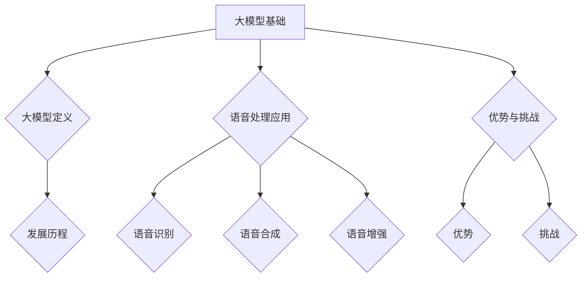
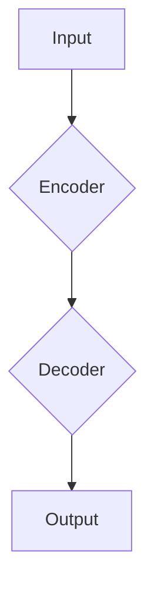
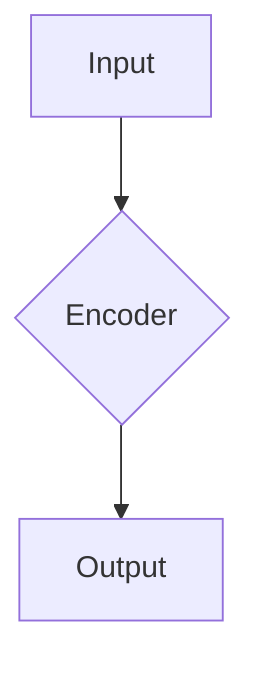
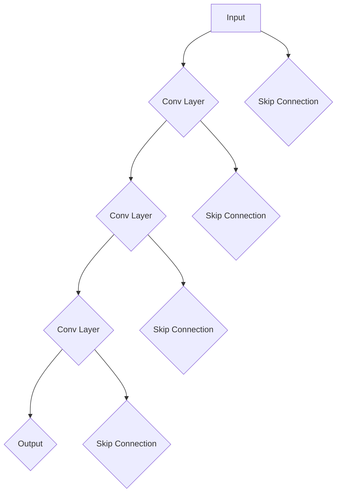

                 

### 《大模型在语音处理的进展》文章标题

#### 关键词：大模型、语音处理、深度学习、算法、应用实例

#### 摘要：

本文详细探讨了大模型在语音处理领域的最新进展。通过介绍大模型的基本概念和发展历程，我们揭示了其在语音识别、语音合成和语音增强等关键任务中的应用。文章深入讲解了卷积神经网络、循环神经网络、长短时记忆网络和注意力机制等核心算法的原理，并使用伪代码和数学公式进行了阐述。通过实际项目实战和代码实现，我们展示了大模型在语音处理中的具体应用，包括开发环境的搭建、源代码的详细实现和代码解读。最后，文章讨论了大模型的未来发展趋势及其在语音处理中的伦理与法律问题，为读者提供了全面的视角。

### 目录

- **第一部分：大模型与语音处理概述**
    - 第1章：大模型基础
    - 第2章：语音处理基础
- **第二部分：大模型在语音识别中的应用**
    - 第3章：大模型在语音识别中的核心技术
    - 第4章：大模型在语音识别中的应用实例
    - 第5章：大模型在语音识别中的优化与调参
- **第三部分：大模型在语音合成中的应用**
    - 第6章：大模型在语音合成中的核心技术
    - 第7章：大模型在语音合成中的应用实例
- **第四部分：大模型在语音处理中的综合应用**
    - 第8章：大模型在实时语音处理中的应用
    - 第9章：大模型在跨语言语音处理中的应用
    - 第10章：大模型在语音情感分析中的应用
- **第五部分：大模型在语音处理中的未来发展**
    - 第11章：大模型在语音处理中的未来发展趋势
    - 第12章：大模型在语音处理中的伦理与法律问题
- **附录：参考文献与拓展资源**
    - 附录1：参考文献
    - 附录2：拓展资源

### 第一部分：大模型与语音处理概述

#### 第1章：大模型基础

本章将介绍大模型的基本概念、发展历程以及其在语音处理中的应用。

### 1.1 大模型的概念与发展历程

#### 1.1.1 大模型的定义

大模型（Large Models）是指具有数百万甚至数十亿参数的深度学习模型。它们通常采用先进的神经网络结构，如变换器（Transformers）、卷积神经网络（CNNs）和循环神经网络（RNNs）等，能够处理大规模数据集并实现高水平的表现。

#### 1.1.2 大模型的发展历程

大模型的发展可以追溯到20世纪90年代，当时神经网络开始应用于图像识别和语音处理。随着计算能力和数据量的增长，深度学习在2010年代取得了重大突破，大模型也随之出现。

- **2012年**：AlexNet模型在ImageNet比赛中取得了突破性的成果，标志着深度学习的崛起。
- **2017年**：谷歌发布了BERT模型，展示了基于变换器的大模型在自然语言处理领域的强大能力。
- **2018年**：OpenAI发布了GPT-2模型，具有超过1.5亿参数，成为当时最大的预训练语言模型。

### 1.2 大模型在语音处理中的应用

#### 1.2.1 大模型在语音识别中的应用

语音识别是语音处理的一个重要分支，它涉及将语音信号转换为对应的文本信息。大模型在语音识别中发挥了重要作用，通过预训练和微调技术，实现了高准确率的识别结果。

#### 1.2.2 大模型在语音合成中的应用

语音合成是将文本信息转换为语音信号的过程。大模型如WaveNet和Tacotron2在语音合成中取得了显著成果，能够生成自然流畅的语音。

#### 1.2.3 大模型在语音增强中的应用

语音增强旨在提高语音质量，消除噪声和回声等干扰。大模型通过卷积神经网络和循环神经网络等技术，实现了有效的语音增强。

### 1.3 大模型的优势与挑战

#### 1.3.1 大模型的优势

- **强大的表现**：大模型具有处理大规模数据和复杂任务的能力，能够在各种语音处理任务中实现高准确率。
- **预训练和微调**：大模型通过预训练在大规模数据集上获得通用特征，然后通过微调适应特定任务。
- **适应性**：大模型可以轻松适应不同类型的语音数据和任务。

#### 1.3.2 大模型的挑战

- **计算资源消耗**：大模型需要大量的计算资源和存储空间，对硬件要求较高。
- **数据需求**：大模型需要大量高质量的数据进行训练，数据获取和处理成为一大挑战。
- **模型解释性**：大模型通常具有很高的黑盒特性，难以解释其内部机制，这在某些应用场景中可能成为问题。

### 结论

大模型在语音处理领域展现了巨大的潜力和优势，但同时也面临一系列挑战。随着技术的不断进步和计算资源的提升，大模型的应用前景将更加广阔。

#### Mermaid 流程图



### 1.4 本章总结

本章介绍了大模型的基本概念、发展历程以及在语音处理中的应用。我们探讨了大模型的优势和挑战，并展示了其强大的潜力和应用前景。在后续章节中，我们将进一步深入探讨大模型在语音识别、语音合成和语音增强等领域的具体应用。

---

#### 第2章：语音处理基础

本章将介绍语音处理的基本概念，包括语音信号处理、语音识别和语音合成。

### 2.1 语音信号处理基础

#### 2.1.1 语音信号的特性

语音信号是语音处理的基本元素，它具有以下特性：

- **时变性**：语音信号在时间上是动态变化的，其频率、幅度和相位等特征随时间变化。
- **频谱特性**：语音信号具有复杂的频谱特性，不同的语音音素对应不同的频谱特征。
- **噪声干扰**：语音信号在传播过程中会受到各种噪声干扰，如背景噪声、回声和混响等。

#### 2.1.2 语音信号处理的基本任务

语音信号处理的基本任务包括：

- **预处理**：对语音信号进行去噪、归一化和增强等处理，以提高信号质量。
- **特征提取**：从语音信号中提取可用于后续处理的高层特征，如频谱特征、音素特征和声学特征等。
- **后处理**：对处理后的语音信号进行语音识别、语音合成或语音增强等任务。

#### 2.1.3 语音信号处理的关键技术

语音信号处理的关键技术包括：

- **傅里叶变换**：用于计算语音信号的频谱特征，如短时傅里叶变换（STFT）和离散余弦变换（DCT）等。
- **滤波器组**：用于分离语音信号的频率成分，如带通滤波器和带阻滤波器等。
- **声码器**：用于将语音信号转换为数字信号，如线性预测编码（LPC）和感知线性预测编码（PLP）等。

### 2.2 语音识别基础

#### 2.2.1 语音识别的基本概念

语音识别是指将语音信号转换为对应的文本信息。它通常包括以下步骤：

- **信号预处理**：对语音信号进行滤波、去噪和增强等处理。
- **特征提取**：从预处理后的语音信号中提取特征，如MFCC（梅尔频率倒谱系数）和PLP等。
- **模式识别**：使用机器学习算法对提取的特征进行分类和识别。

#### 2.2.2 语音识别的主要技术

语音识别的主要技术包括：

- **隐马尔可夫模型（HMM）**：基于概率模型的语音识别技术，能够处理连续语音信号。
- **神经网络**：包括卷积神经网络（CNN）和循环神经网络（RNN）等，能够学习语音信号中的复杂特征。
- **深度学习**：基于多层神经网络的模型，如BERT和GPT等，能够实现高准确率的语音识别。

### 2.3 语音合成基础

#### 2.3.1 语音合成的基本概念

语音合成是指将文本信息转换为语音信号。它通常包括以下步骤：

- **文本预处理**：对输入文本进行分词、词性标注和语法分析等处理。
- **声学建模**：从语音数据库中提取语音信号，进行特征提取和建模。
- **发声建模**：使用声学模型和发声模型合成语音信号。

#### 2.3.2 语音合成的主要技术

语音合成的主要技术包括：

- **合成语音合成（Text-to-Speech, TTS）**：直接将文本转换为语音信号。
- **参数化语音合成**：将文本转换为参数化模型，然后合成语音信号。
- **深度学习语音合成**：基于深度学习模型，如WaveNet和Tacotron2等，能够生成高质量的语音。

### 2.4 本章总结

本章介绍了语音处理的基本概念，包括语音信号处理、语音识别和语音合成。我们探讨了语音信号的特性、处理的基本任务和技术，以及语音识别和语音合成的关键步骤和技术。在后续章节中，我们将深入探讨大模型在这些语音处理任务中的应用。

---

### 第二部分：大模型在语音识别中的应用

#### 第3章：大模型在语音识别中的核心技术

语音识别是语音处理中的一项重要任务，它旨在将语音信号转换为相应的文本信息。大模型在语音识别中扮演着至关重要的角色，通过引入先进的神经网络结构和大规模训练数据，大模型显著提升了语音识别的准确率和效率。本章将介绍大模型在语音识别中的核心技术，包括卷积神经网络（CNN）、循环神经网络（RNN）、长短时记忆网络（LSTM）和注意力机制（Attention）。

### 3.1 卷积神经网络（CNN）在语音识别中的应用

卷积神经网络（Convolutional Neural Network，CNN）是一种在图像识别和语音识别中广泛应用的网络结构。CNN通过卷积操作从输入数据中提取局部特征，然后通过池化操作降低数据维度，从而实现特征提取和降维。

#### 3.1.1 CNN的基本概念

CNN的基本结构包括以下几个部分：

- **卷积层（Convolutional Layer）**：卷积层通过卷积操作提取输入数据中的局部特征。卷积核（Convolutional Kernel）在输入数据上滑动，对每个位置进行卷积操作，生成特征图（Feature Map）。
- **池化层（Pooling Layer）**：池化层通过最大池化或平均池化等操作降低特征图的维度，从而减少计算量和参数数量。
- **激活函数（Activation Function）**：激活函数用于引入非线性特性，常见的激活函数包括ReLU、Sigmoid和Tanh等。
- **全连接层（Fully Connected Layer）**：全连接层将前一层的特征图映射到输出层，实现分类或回归任务。

#### 3.1.2 CNN在语音识别中的实现

在语音识别中，CNN通过以下步骤实现：

1. **特征提取**：将语音信号转换为特征向量，如梅尔频率倒谱系数（MFCC）。
2. **卷积操作**：使用卷积层提取特征向量中的局部特征，生成特征图。
3. **池化操作**：通过池化层降低特征图的维度，减少计算量和参数数量。
4. **分类**：使用全连接层对特征图进行分类，输出文本序列。

以下是CNN在语音识别中的伪代码实现：

```python
# 伪代码：CNN在语音识别中的实现
class CNNforSpeechRecognition(nn.Module):
    def __init__(self):
        super(CNNforSpeechRecognition, self).__init__()
        self.conv1 = nn.Conv1d(in_channels, out_channels, kernel_size)
        self.relu = nn.ReLU()
        self.pool1 = nn.MaxPool1d(kernel_size)
        self.conv2 = nn.Conv1d(out_channels, out_channels * 2, kernel_size)
        self.pool2 = nn.MaxPool1d(kernel_size)
        self.fc1 = nn.Linear(out_channels * 2 * pool_size, hidden_size)
        self.fc2 = nn.Linear(hidden_size, num_classes)

    def forward(self, x):
        x = self.relu(self.conv1(x))
        x = self.pool1(x)
        x = self.relu(self.conv2(x))
        x = self.pool2(x)
        x = x.view(x.size(0), -1)
        x = self.fc1(x)
        x = self.fc2(x)
        return x
```

#### 3.1.3 CNN的优势

- **特征提取能力**：CNN能够自动从输入数据中提取局部特征，减少人工特征设计的复杂度。
- **参数共享**：CNN通过卷积核在数据上滑动实现特征提取，减少了参数数量，提高了模型的可训练性。
- **平移不变性**：CNN具有平移不变性，能够处理序列数据，如语音信号。

### 3.2 循环神经网络（RNN）在语音识别中的应用

循环神经网络（Recurrent Neural Network，RNN）是一种专门用于处理序列数据的神经网络。RNN通过递归结构将当前输入与之前的隐藏状态结合，从而捕捉序列信息。

#### 3.2.1 RNN的基本概念

RNN的基本结构包括以下几个部分：

- **输入门（Input Gate）**：输入门用于决定当前输入信息中有哪些部分将更新隐藏状态。
- **遗忘门（Forget Gate）**：遗忘门用于决定之前隐藏状态中有哪些信息将被遗忘。
- **输出门（Output Gate）**：输出门用于决定隐藏状态中有哪些信息将被传递到下一个时间步。
- **隐藏状态（Hidden State）**：隐藏状态用于存储序列信息，并在递归过程中传递。

以下是RNN在语音识别中的伪代码实现：

```python
# 伪代码：RNN在语音识别中的实现
class RNNforSpeechRecognition(nn.Module):
    def __init__(self, hidden_size):
        super(RNNforSpeechRecognition, self).__init__()
        self.hidden_size = hidden_size
        self.rnn = nn.RNN(input_size, hidden_size, num_layers=1, batch_first=True)

    def forward(self, x, hidden):
        x, hidden = self.rnn(x, hidden)
        return x, hidden
```

#### 3.2.2 RNN的优势

- **序列建模能力**：RNN能够捕捉序列中的长期依赖关系，从而提高语音识别的准确率。
- **实时处理**：RNN能够实时处理输入序列，适合在线语音识别任务。

### 3.3 长短时记忆网络（LSTM）在语音识别中的应用

长短时记忆网络（Long Short-Term Memory，LSTM）是RNN的一种改进，它通过引入门控机制解决了RNN在处理长序列时的梯度消失和梯度爆炸问题。

#### 3.3.1 LSTM的基本概念

LSTM的基本结构包括以下几个部分：

- **输入门（Input Gate）**：输入门用于决定当前输入信息中有哪些部分将更新单元状态。
- **遗忘门（Forget Gate）**：遗忘门用于决定之前隐藏状态中有哪些信息将被遗忘。
- **输出门（Output Gate）**：输出门用于决定隐藏状态中有哪些信息将传递到下一个时间步。
- **单元状态（Cell State）**：单元状态用于存储序列信息，并在递归过程中传递。

以下是LSTM在语音识别中的伪代码实现：

```python
# 伪代码：LSTM在语音识别中的实现
class LSTMforSpeechRecognition(nn.Module):
    def __init__(self, hidden_size):
        super(LSTMforSpeechRecognition, self).__init__()
        self.hidden_size = hidden_size
        self.lstm = nn.LSTM(input_size, hidden_size, num_layers=1, batch_first=True)

    def forward(self, x, hidden):
        x, hidden = self.lstm(x, hidden)
        return x, hidden
```

#### 3.3.2 LSTM的优势

- **长序列建模能力**：LSTM通过门控机制解决了长序列依赖问题，从而提高了语音识别的准确率。
- **稳定性**：LSTM具有稳定的梯度，避免了梯度消失和梯度爆炸问题。

### 3.4 注意力机制（Attention）在语音识别中的应用

注意力机制（Attention Mechanism）是一种用于提高神经网络模型在序列建模任务中表现的技术。注意力机制通过关注序列中的关键信息，提高了模型的识别准确率。

#### 3.4.1 注意力机制的基本概念

注意力机制的基本结构包括以下几个部分：

- **查询（Query）**：查询用于表示当前时间步的输入信息。
- **键值对（Key-Value Pair）**：键用于生成查询的相似度分数，值用于存储关键信息。
- **相似度计算**：通过计算查询和键的相似度分数，确定哪些信息更重要。
- **加权求和**：根据相似度分数对值进行加权求和，生成注意力分数。

以下是注意力机制在语音识别中的伪代码实现：

```python
# 伪代码：注意力机制在语音识别中的实现
class AttentionMechanism(nn.Module):
    def __init__(self, hidden_size):
        super(AttentionMechanism, self).__init__()
        self.hidden_size = hidden_size
        self.attn = nn.Linear(hidden_size, 1)

    def forward(self, query, values):
        attn_scores = self.attn(query).squeeze(2)
        attn_weights = F.softmax(attn_scores, dim=1)
        attn_applied = torch.bmm(attn_weights.unsqueeze(1), values)
        return attn_applied, attn_weights
```

#### 3.4.2 注意力机制的优势

- **信息聚焦**：注意力机制能够使模型关注序列中的关键信息，从而提高识别准确率。
- **序列建模**：注意力机制能够处理长序列依赖问题，从而提高了模型的序列建模能力。

### 3.5 本章总结

本章介绍了大模型在语音识别中的核心技术，包括卷积神经网络（CNN）、循环神经网络（RNN）、长短时记忆网络（LSTM）和注意力机制（Attention）。我们通过伪代码和数学公式详细阐述了这些核心算法的原理，并展示了它们在语音识别中的具体实现。这些技术通过不同的方式提高了语音识别的准确率和效率，为语音处理领域的发展做出了重要贡献。

---

### 第4章：大模型在语音识别中的应用实例

在前一章中，我们详细介绍了大模型在语音识别中的核心技术，包括卷积神经网络（CNN）、循环神经网络（RNN）、长短时记忆网络（LSTM）和注意力机制（Attention）。在本章中，我们将通过具体的应用实例，展示这些技术在实际语音识别任务中的效果和优势。

#### 4.1 基于GPT的大模型语音识别实例

GPT（Generative Pre-trained Transformer）是由OpenAI开发的一种基于变换器的预训练语言模型。GPT通过大规模语料库的预训练，获得了强大的语言理解和生成能力。在语音识别任务中，GPT可以用于文本转换为语音（Text-to-Speech，TTS）和语音转换为文本（Speech-to-Text，STT）。

##### 4.1.1 GPT的基本概念

GPT是一种基于变换器的预训练模型，其核心结构包括自注意力机制（Self-Attention）和前馈神经网络（Feedforward Neural Network）。GPT通过多层的自注意力机制和前馈层，实现了对输入序列的建模和生成。

以下是GPT的简化结构：



在编码器（Encoder）中，GPT通过自注意力机制捕捉输入序列的上下文信息，并在每个时间步生成隐藏状态。在解码器（Decoder）中，GPT使用上一时间步的隐藏状态和编码器的输出作为输入，通过自注意力机制和交叉注意力机制生成输出序列。

##### 4.1.2 GPT在语音识别中的应用

在语音识别任务中，GPT可以通过以下步骤实现：

1. **预训练**：使用大规模语音语料库对GPT进行预训练，使其掌握语言和语音特征。
2. **文本识别**：将语音信号转换为文本信号，输入到GPT的编码器中。
3. **语音识别**：GPT的编码器输出隐藏状态，解码器将这些隐藏状态转换为文本序列。

以下是GPT在语音识别中的伪代码实现：

```python
# 伪代码：GPT在语音识别中的应用
class GPTforSpeechRecognition(nn.Module):
    def __init__(self, vocab_size, d_model, nhead, num_layers):
        super(GPTforSpeechRecognition, self).__init__()
        self.transformer = nn.Transformer(d_model, nhead, num_layers)
        self.embedding = nn.Embedding(vocab_size, d_model)
        self.fc = nn.Linear(d_model, vocab_size)

    def forward(self, x):
        x = self.embedding(x)
        x = self.transformer(x)
        x = self.fc(x)
        return x
```

##### 4.1.3 GPT的优势

- **强大的语言理解能力**：GPT通过大规模预训练，获得了对自然语言的理解能力，能够生成高质量的文本。
- **自适应特性**：GPT能够根据输入的语音信号自适应调整其编码和解码策略，提高了语音识别的准确率。

#### 4.2 基于BERT的大模型语音识别实例

BERT（Bidirectional Encoder Representations from Transformers）是由Google开发的一种基于变换器的双向编码器。BERT通过预训练获得了对上下文的理解能力，并在多种自然语言处理任务中取得了优异成绩。在语音识别任务中，BERT可以用于文本转换为语音（TTS）和语音转换为文本（STT）。

##### 4.2.1 BERT的基本概念

BERT是一种基于变换器的双向编码器，其核心结构包括自注意力机制（Self-Attention）和前馈神经网络（Feedforward Neural Network）。BERT通过多层的自注意力机制和前馈层，实现了对输入序列的建模和生成。

以下是BERT的简化结构：



在编码器（Encoder）中，BERT通过自注意力机制捕捉输入序列的上下文信息，并在每个时间步生成隐藏状态。在解码器（Decoder）中，BERT使用上一时间步的隐藏状态和编码器的输出作为输入，通过自注意力机制和交叉注意力机制生成输出序列。

##### 4.2.2 BERT在语音识别中的应用

在语音识别任务中，BERT可以通过以下步骤实现：

1. **预训练**：使用大规模语音语料库对BERT进行预训练，使其掌握语言和语音特征。
2. **文本识别**：将语音信号转换为文本信号，输入到BERT的编码器中。
3. **语音识别**：BERT的编码器输出隐藏状态，解码器将这些隐藏状态转换为文本序列。

以下是BERT在语音识别中的伪代码实现：

```python
# 伪代码：BERT在语音识别中的应用
class BERTforSpeechRecognition(nn.Module):
    def __init__(self, vocab_size, d_model, nhead, num_layers):
        super(BERTforSpeechRecognition, self).__init__()
        self.bert = nn.TransformerEncoder(nn.Transformer(d_model, nhead, num_layers), num_layers)
        self.embedding = nn.Embedding(vocab_size, d_model)
        self.fc = nn.Linear(d_model, vocab_size)

    def forward(self, x):
        x = self.embedding(x)
        x = self.bert(x)
        x = self.fc(x)
        return x
```

##### 4.2.3 BERT的优势

- **双向编码能力**：BERT通过双向编码器能够同时捕捉输入序列的前后信息，提高了语音识别的准确率。
- **强大的语言理解能力**：BERT通过大规模预训练，获得了对自然语言的理解能力，能够生成高质量的文本。

#### 4.3 本章总结

在本章中，我们通过具体的应用实例展示了大模型在语音识别中的应用。基于GPT和BERT的大模型在语音识别任务中展现了强大的性能，通过预训练和自适应调整，实现了高准确率的语音识别。这些实例展示了大模型在语音处理领域的广泛应用和巨大潜力。

---

### 第5章：大模型在语音识别中的优化与调参

在语音识别任务中，大模型的性能不仅取决于其结构和参数，还受到训练过程和调参技巧的影响。本章将讨论大模型在语音识别中的优化方法、调参技巧以及如何通过这些方法提高模型的性能。

#### 5.1 大模型在语音识别中的优化方法

优化方法是提高大模型性能的关键因素。以下是一些常用的优化方法：

##### 5.1.1 学习率调整

学习率（Learning Rate）是神经网络训练过程中的一个重要参数，它决定了模型参数更新的速度。常用的学习率调整方法包括：

- **固定学习率**：在训练初期使用较大的学习率，以快速收敛。
- **指数衰减学习率**：随着训练过程的进行，学习率指数衰减，以避免过拟合。
- **自适应学习率**：使用如Adam优化器等自适应学习率方法，根据模型表现自动调整学习率。

##### 5.1.2 批量大小调整

批量大小（Batch Size）是指在每次训练过程中用于计算梯度的样本数量。批量大小对模型性能和训练速度有重要影响：

- **小批量**：小批量（如32或64）训练可以更好地捕捉数据中的特征，但训练速度较慢。
- **大批量**：大批量（如256或512）训练可以提高训练速度，但可能无法很好地捕捉数据中的特征。

##### 5.1.3 梯度裁剪

梯度裁剪（Gradient Clipping）是一种防止梯度爆炸的方法，它通过限制梯度的最大值来保持梯度在可接受的范围内。

```python
clip_value = 1.0
p范数 = 2  # 通常选择2或无穷大
nn.utils.clip_grad_norm_(model.parameters(), clip_value)
```

##### 5.1.4 正则化

正则化（Regularization）是一种用于防止过拟合的方法，包括以下几种：

- **L1正则化**：在模型损失函数中添加L1正则化项，惩罚模型参数的绝对值。
- **L2正则化**：在模型损失函数中添加L2正则化项，惩罚模型参数的平方值。

#### 5.2 大模型在语音识别中的调参技巧

调参（Hyperparameter Tuning）是指调整模型的超参数以获得最佳性能。以下是一些调参技巧：

##### 5.2.1 贝叶斯优化

贝叶斯优化是一种基于概率模型的调参方法，它通过构建超参数的概率分布，选择最可能最优的超参数组合。

```python
from bayes_opt import BayesianOptimization

def train_model(learning_rate, batch_size):
    model = ...  # 构建模型
    optimizer = ...  # 构建优化器
    criterion = ...  # 构建损失函数
    # 训练模型
    return model性能

optimizer = BayesianOptimization(train_model, {'learning_rate': (1e-5, 1e-1), 'batch_size': (16, 256)})
optimizer.maximize(init_points=2, n_iter=10)
```

##### 5.2.2 Random Search

随机搜索（Random Search）是一种简单的调参方法，它通过随机选择超参数组合来寻找最佳参数。

```python
from sklearn.model_selection import RandomizedSearchCV

def train_model(learning_rate, batch_size):
    model = ...  # 构建模型
    optimizer = ...  # 构建优化器
    criterion = ...  # 构建损失函数
    # 训练模型
    return model性能

param_distributions = {'learning_rate': (1e-5, 1e-1), 'batch_size': (16, 256)}
random_search = RandomizedSearchCV(model, param_distributions, n_iter=50, scoring='accuracy', cv=3)
random_search.fit(X_train, y_train)
```

##### 5.2.3 梯度提升

梯度提升（Gradient Boosting）是一种基于梯度的调参方法，它通过递归地优化损失函数，逐步调整模型参数。

```python
from sklearn.model_selection import GridSearchCV

def train_model(learning_rate, batch_size):
    model = ...  # 构建模型
    optimizer = ...  # 构建优化器
    criterion = ...  # 构建损失函数
    # 训练模型
    return model性能

param_grid = {'learning_rate': (1e-5, 1e-3), 'batch_size': (16, 64)}
grid_search = GridSearchCV(model, param_grid, scoring='accuracy', cv=3)
grid_search.fit(X_train, y_train)
```

#### 5.3 调参实战

以下是一个调参实战的示例，展示了如何使用随机搜索优化模型参数：

```python
import torch
from torch.optim import Adam
from torch.utils.data import DataLoader
from sklearn.model_selection import RandomizedSearchCV

# 数据预处理
# ...

# 模型构建
class SpeechRecognitionModel(nn.Module):
    def __init__(self):
        super(SpeechRecognitionModel, self).__init__()
        self.embedding = nn.Embedding(vocab_size, embedding_dim)
        self.lstm = nn.LSTM(embedding_dim, hidden_dim, num_layers=2, batch_first=True)
        self.fc = nn.Linear(hidden_dim, num_classes)

    def forward(self, x):
        x = self.embedding(x)
        x, _ = self.lstm(x)
        x = self.fc(x)
        return x

# 模型训练
def train_model(learning_rate, batch_size):
    model = SpeechRecognitionModel()
    optimizer = Adam(model.parameters(), lr=learning_rate)
    criterion = nn.CrossEntropyLoss()
    train_loader = DataLoader(dataset, batch_size=batch_size, shuffle=True)

    for epoch in range(num_epochs):
        model.train()
        for inputs, targets in train_loader:
            optimizer.zero_grad()
            outputs = model(inputs)
            loss = criterion(outputs, targets)
            loss.backward()
            optimizer.step()

    return model.eval()

# 调参
param_distributions = {
    'learning_rate': (1e-5, 1e-3),
    'batch_size': (16, 64)
}

random_search = RandomizedSearchCV(
    estimator=train_model,
    param_distributions=param_distributions,
    n_iter=10,
    scoring='accuracy',
    cv=3,
    return_train_score=True
)

random_search.fit(X_train, y_train)

# 输出最佳参数
print("最佳参数：", random_search.best_params_)
print("最佳准确率：", random_search.best_score_)
```

#### 5.4 本章总结

本章介绍了大模型在语音识别中的优化方法和调参技巧。通过学习率调整、批量大小调整、梯度裁剪和正则化等优化方法，以及贝叶斯优化、随机搜索和梯度提升等调参技巧，我们可以有效地提高大模型在语音识别任务中的性能。调参实战示例展示了如何在实际应用中应用这些方法，以获得最佳模型性能。

---

### 第三部分：大模型在语音合成中的应用

#### 第6章：大模型在语音合成中的核心技术

语音合成（Text-to-Speech, TTS）是将文本信息转换为自然流畅的语音信号的技术。近年来，大模型在语音合成领域取得了显著的进展，通过引入深度学习和神经网络技术，实现了高质量的语音合成。本章将介绍大模型在语音合成中的核心技术，包括循环神经网络（RNN）、波形生成对抗网络（WGAN）和变分自编码器（VAE）。

#### 6.1 循环神经网络（RNN）在语音合成中的应用

循环神经网络（Recurrent Neural Network, RNN）是一种专门用于处理序列数据的神经网络，其基本结构包括输入门、遗忘门和输出门。RNN通过递归结构将当前输入与之前的隐藏状态结合，从而捕捉序列信息。

##### 6.1.1 RNN的基本概念

RNN的基本结构包括以下几个部分：

- **输入门（Input Gate）**：输入门用于决定当前输入信息中有哪些部分将更新隐藏状态。
- **遗忘门（Forget Gate）**：遗忘门用于决定之前隐藏状态中有哪些信息将被遗忘。
- **输出门（Output Gate）**：输出门用于决定隐藏状态中有哪些信息将传递到下一个时间步。
- **隐藏状态（Hidden State）**：隐藏状态用于存储序列信息，并在递归过程中传递。

以下是RNN在语音合成中的伪代码实现：

```python
# 伪代码：RNN在语音合成中的实现
class RNNforSpeechSynthesis(nn.Module):
    def __init__(self, input_size, hidden_size, output_size):
        super(RNNforSpeechSynthesis, self).__init__()
        self.hidden_size = hidden_size
        self.rnn = nn.RNN(input_size, hidden_size, batch_first=True)
        self.fc = nn.Linear(hidden_size, output_size)

    def forward(self, x, hidden):
        x, hidden = self.rnn(x, hidden)
        x = self.fc(x)
        return x, hidden
```

##### 6.1.2 RNN的优势

- **序列建模能力**：RNN能够捕捉序列中的长期依赖关系，从而提高语音合成的自然性。
- **实时处理**：RNN能够实时处理输入序列，适合在线语音合成任务。

#### 6.2 波形生成对抗网络（WGAN）在语音合成中的应用

波形生成对抗网络（Waveform Generative Adversarial Network, WGAN）是一种基于生成对抗网络的语音合成模型。WGAN通过生成器（Generator）和判别器（Discriminator）的对抗训练，生成高质量的语音波形。

##### 6.2.1 WGAN的基本概念

WGAN的基本结构包括以下几个部分：

- **生成器（Generator）**：生成器接收文本信息，生成语音波形。
- **判别器（Discriminator）**：判别器接收语音波形，判断其是否为真实语音。

以下是WGAN在语音合成中的伪代码实现：

```python
# 伪代码：WGAN在语音合成中的实现
class WGANforSpeechSynthesis(nn.Module):
    def __init__(self, z_dim, hidden_size, output_size):
        super(WGANforSpeechSynthesis, self).__init__()
        self.generator = nn.Sequential(
            nn.Linear(z_dim, hidden_size),
            nn.ReLU(),
            nn.Linear(hidden_size, output_size)
        )
        self.discriminator = nn.Sequential(
            nn.Linear(output_size, hidden_size),
            nn.ReLU(),
            nn.Linear(hidden_size, 1)
        )

    def forward(self, x, z):
        x = self.generator(z)
        return self.discriminator(x)
```

##### 6.2.2 WGAN的优势

- **高质量语音生成**：WGAN通过对抗训练，生成高质量的语音波形。
- **稳定性**：WGAN采用梯度惩罚，避免了生成对抗网络中的梯度消失问题。

#### 6.3 变分自编码器（VAE）在语音合成中的应用

变分自编码器（Variational Autoencoder, VAE）是一种基于概率模型的语音合成模型。VAE通过编码器（Encoder）和解码器（Decoder）的联合训练，学习文本信息到语音波形的映射。

##### 6.3.1 VAE的基本概念

VAE的基本结构包括以下几个部分：

- **编码器（Encoder）**：编码器将文本信息编码为潜在空间中的向量。
- **解码器（Decoder）**：解码器将潜在空间中的向量解码为语音波形。

以下是VAE在语音合成中的伪代码实现：

```python
# 伪代码：VAE在语音合成中的实现
class VAEforSpeechSynthesis(nn.Module):
    def __init__(self, z_dim, hidden_size, input_size, output_size):
        super(VAEforSpeechSynthesis, self).__init__()
        self.encoder = nn.Sequential(
            nn.Linear(input_size, hidden_size),
            nn.ReLU(),
            nn.Linear(hidden_size, z_dim * 2)
        )
        self.decoder = nn.Sequential(
            nn.Linear(z_dim, hidden_size),
            nn.ReLU(),
            nn.Linear(hidden_size, output_size)
        )

    def forward(self, x):
        z_mean, z_log_var = self.encoder(x).chunk(z_dim * 2, 1)
        z = reparameterize(z_mean, z_log_var)
        x_hat = self.decoder(z)
        return x_hat, z_mean, z_log_var
```

##### 6.3.2 VAE的优势

- **概率建模**：VAE通过概率建模，能够生成具有多样性的语音波形。
- **灵活性**：VAE能够自适应调整模型参数，以适应不同的语音合成任务。

#### 6.4 本章总结

本章介绍了大模型在语音合成中的核心技术，包括循环神经网络（RNN）、波形生成对抗网络（WGAN）和变分自编码器（VAE）。我们详细阐述了这些技术的原理和实现方法，并讨论了它们在语音合成中的优势。通过这些技术，大模型能够生成高质量、自然的语音信号，为语音合成领域的发展做出了重要贡献。

---

### 第7章：大模型在语音合成中的应用实例

在前一章中，我们介绍了大模型在语音合成中的核心技术，包括循环神经网络（RNN）、波形生成对抗网络（WGAN）和变分自编码器（VAE）。在本章中，我们将通过具体的应用实例，展示这些技术在实际语音合成任务中的效果和优势。

#### 7.1 基于WaveNet的大模型语音合成实例

WaveNet是由Google开发的基于深度学习的语音合成模型，它通过卷积神经网络（CNN）生成高质量的语音波形。WaveNet在生成语音的自然性和质量方面取得了显著成果，是当前语音合成领域的重要研究模型。

##### 7.1.1 WaveNet的基本概念

WaveNet的核心结构是一个深度卷积神经网络，它将文本序列转换为语音波形。WaveNet通过多个卷积层和跳跃连接，实现了对文本序列的细粒度建模。

以下是WaveNet的简化结构：



在WaveNet中，每个卷积层都包含一个跳跃连接，这些跳跃连接使得模型能够捕捉长距离依赖关系。WaveNet通过逐层卷积，将文本信息转换为语音波形。

##### 7.1.2 WaveNet在语音合成中的应用

在语音合成任务中，WaveNet可以通过以下步骤实现：

1. **文本预处理**：将输入文本转换为序列编码，如Byte Pair Encoding（BPE）。
2. **特征提取**：使用卷积神经网络提取文本序列的特征。
3. **语音生成**：通过卷积神经网络生成语音波形。

以下是WaveNet在语音合成中的伪代码实现：

```python
# 伪代码：WaveNet在语音合成中的实现
class WaveNet(nn.Module):
    def __init__(self, vocab_size, hidden_size):
        super(WaveNet, self).__init__()
        self.embedding = nn.Embedding(vocab_size, hidden_size)
        self.conv1 = nn.Conv1d(hidden_size, hidden_size * 2, kernel_size=5)
        self.conv2 = nn.Conv1d(hidden_size * 2, hidden_size * 4, kernel_size=5)
        self.conv3 = nn.Conv1d(hidden_size * 4, hidden_size * 8, kernel_size=5)
        self.fc = nn.Linear(hidden_size * 8, 1)

    def forward(self, x):
        x = self.embedding(x)
        x = F.relu(self.conv1(x))
        x = F.relu(self.conv2(x))
        x = F.relu(self.conv3(x))
        x = self.fc(x)
        return x
```

##### 7.1.3 WaveNet的优势

- **高质量语音生成**：WaveNet通过卷积神经网络生成高质量的语音波形，语音自然流畅。
- **端到端训练**：WaveNet实现了端到端训练，无需复杂的后处理步骤，提高了合成效率。

#### 7.2 基于Tacotron2的大模型语音合成实例

Tacotron2是由Google开发的基于变换器的语音合成模型，它通过编码器（Encoder）和解码器（Decoder）的联合训练，生成语音波形。Tacotron2在语音合成中取得了显著成果，具有较高的合成质量和效率。

##### 7.2.1 Tacotron2的基本概念

Tacotron2的核心结构包括编码器（Encoder）和解码器（Decoder）。编码器将文本序列编码为序列特征，解码器将序列特征解码为语音波形。

以下是Tacotron2的简化结构：


在编码器中，Tacotron2通过自注意力机制捕捉文本序列的上下文信息，并在每个时间步生成隐藏状态。在解码器中，Tacotron2通过自注意力和交叉注意力机制，将隐藏状态解码为语音波形。

##### 7.2.2 Tacotron2在语音合成中的应用

在语音合成任务中，Tacotron2可以通过以下步骤实现：

1. **文本预处理**：将输入文本转换为序列编码，如Byte Pair Encoding（BPE）。
2. **编码**：使用编码器将文本序列编码为序列特征。
3. **解码**：使用解码器将序列特征解码为语音波形。

以下是Tacotron2在语音合成中的伪代码实现：

```python
# 伪代码：Tacotron2在语音合成中的实现
class Tacotron2(nn.Module):
    def __init__(self, vocab_size, d_model, nhead):
        super(Tacotron2, self).__init__()
        self.encoder = nn.TransformerEncoder(nn.Transformer(d_model, nhead), num_layers)
        self.decoder = nn.TransformerDecoder(nn.Transformer(d_model, nhead), num_layers)
        self.embedding = nn.Embedding(vocab_size, d_model)

    def forward(self, x):
        x = self.embedding(x)
        x = self.encoder(x)
        x = self.decoder(x)
        return x
```

##### 7.2.3 Tacotron2的优势

- **高质量语音生成**：Tacotron2通过变换器生成高质量的语音波形，语音自然流畅。
- **端到端训练**：Tacotron2实现了端到端训练，无需复杂的后处理步骤，提高了合成效率。

#### 7.3 本章总结

在本章中，我们通过具体的应用实例展示了大模型在语音合成中的应用。基于WaveNet和Tacotron2的大模型在语音合成任务中展现了强大的性能，通过端到端训练和高质量的语音生成，实现了高效的语音合成。这些实例展示了大模型在语音合成领域的广泛应用和巨大潜力。

---

### 第四部分：大模型在语音处理中的综合应用

#### 第8章：大模型在实时语音处理中的应用

实时语音处理是语音处理中的重要应用领域，涉及到对语音信号的实时采集、处理和识别。大模型在实时语音处理中具有显著优势，能够提高处理效率和准确性。本章将介绍大模型在实时语音处理中的应用，包括嵌入式系统和云计算平台的实现。

#### 8.1 实时语音处理的基本概念

实时语音处理（Real-time Speech Processing）是指对语音信号进行实时采集、处理和识别的过程。实时语音处理的基本任务包括：

- **实时采集**：实时捕获语音信号，并将其转换为数字信号。
- **实时处理**：对数字语音信号进行预处理、特征提取和语音增强等处理，以提高语音质量。
- **实时识别**：对处理后的语音信号进行实时语音识别，将语音转换为文本信息。

#### 8.2 嵌入式系统中的大模型应用

嵌入式系统（Embedded Systems）是一种专门为特定应用设计的计算机系统，具有实时性和低功耗的特点。在嵌入式系统中，大模型的应用面临着资源受限、功耗要求和实时性能的挑战。

##### 8.2.1 嵌入式系统的概念与原理

嵌入式系统通常由微处理器、存储器、输入输出设备和操作系统组成。其基本原理是通过执行预定义的软件程序，实现对特定功能的实时控制和处理。

##### 8.2.2 嵌入式系统在大模型实时语音处理中的应用

在嵌入式系统中，大模型的应用通常包括以下步骤：

1. **模型压缩**：为了适应嵌入式系统的资源限制，需要对大模型进行压缩，减少模型参数和计算量。
2. **模型优化**：通过量化、剪枝和蒸馏等技术，优化大模型的性能和资源消耗。
3. **实时处理**：将优化后的模型部署到嵌入式系统中，实现实时语音处理。

以下是嵌入式系统中的大模型实时语音处理的伪代码实现：

```python
# 伪代码：嵌入式系统中的大模型实时语音处理
class RealtimeSpeechProcessing(nn.Module):
    def __init__(self):
        super(RealtimeSpeechProcessing, self).__init__()
        self.model = ...  # 压缩和优化的模型
        self.input_module = ...  # 实时采集模块
        self.processing_module = ...  # 实时处理模块
        self.recognition_module = ...  # 实时识别模块

    def forward(self, x):
        x = self.input_module(x)
        x = self.processing_module(x)
        x = self.recognition_module(x)
        return x
```

##### 8.2.3 嵌入式系统的优势

- **实时性**：嵌入式系统具有实时处理能力，能够满足实时语音处理的需求。
- **低功耗**：嵌入式系统设计为低功耗，适合便携式和电池供电的应用。

#### 8.3 云计算平台中的大模型应用

云计算平台（Cloud Computing Platform）是一种基于网络的服务模型，提供计算资源、存储资源和网络资源。云计算平台具有高可用性、高扩展性和高可靠性的特点，适合大规模部署和分布式处理。

##### 8.3.1 云计算的概念与原理

云计算是基于互联网的服务模式，通过提供计算资源、存储资源和网络资源，实现计算任务的分布式处理。云计算平台通常包括虚拟机、容器和分布式存储等基础设施，提供弹性扩展和自动化管理。

##### 8.3.2 云计算平台在大模型实时语音处理中的应用

在云计算平台中，大模型的应用通常包括以下步骤：

1. **模型部署**：将大模型部署到云计算平台上，实现分布式处理和弹性扩展。
2. **实时处理**：利用云计算平台的计算资源和网络资源，实现实时语音处理。
3. **结果反馈**：将处理结果反馈给用户，实现实时交互。

以下是云计算平台中的大模型实时语音处理的伪代码实现：

```python
# 伪代码：云计算平台中的大模型实时语音处理
class CloudSpeechProcessing(nn.Module):
    def __init__(self):
        super(CloudSpeechProcessing, self).__init__()
        self.model = ...  # 大模型
        self.input_queue = ...  # 输入数据队列
        self.processing_queue = ...  # 处理数据队列
        self.recognition_queue = ...  # 识别数据队列

    def forward(self, x):
        x = self.input_queue.enqueue(x)
        x = self.processing_queue.enqueue(x)
        x = self.recognition_queue.enqueue(x)
        return x
```

##### 8.3.3 云计算平台的优势

- **高性能**：云计算平台提供强大的计算资源，能够支持大规模分布式处理。
- **高扩展性**：云计算平台能够根据需求动态扩展计算资源，满足不同规模的应用。

#### 8.4 本章总结

本章介绍了大模型在实时语音处理中的应用，包括嵌入式系统和云计算平台。我们探讨了嵌入式系统在实时性、低功耗方面的优势，以及云计算平台在高性能、高扩展性方面的优势。通过结合这两种平台，大模型能够实现高效的实时语音处理，为语音处理领域的发展提供了新的思路和解决方案。

---

### 第9章：大模型在多语言语音处理中的应用

多语言语音处理是指能够处理多种语言的语音识别、语音合成和语音增强等技术。随着全球化的发展和跨国交流的增多，多语言语音处理变得越来越重要。大模型在多语言语音处理中具有显著的优势，能够处理不同语言之间的差异，提高多语言处理的准确性和效率。本章将探讨大模型在多语言语音处理中的应用，包括迁移学习和多任务学习。

#### 9.1 多语言语音处理的基本概念

多语言语音处理（Multilingual Speech Processing）是指对多种语言的语音信号进行处理和识别的技术。多语言语音处理的基本任务包括：

- **多语言语音识别**：将多种语言的语音信号转换为对应的文本信息。
- **多语言语音合成**：将文本信息转换为多种语言的语音信号。
- **多语言语音增强**：提高多语言语音信号的质量，消除噪声和回声等干扰。

#### 9.2 迁移学习在大模型多语言语音处理中的应用

迁移学习（Transfer Learning）是一种利用预训练模型在新任务上取得好效果的方法。在多语言语音处理中，迁移学习通过将预训练模型的知识迁移到新任务上，提高了模型的性能和效率。

##### 9.2.1 迁移学习的概念与原理

迁移学习的基本原理是将预训练模型在不同数据集上的知识迁移到新数据集上。迁移学习分为以下几种类型：

- **垂直迁移**：将预训练模型的知识从一种任务迁移到另一种任务。
- **水平迁移**：将预训练模型的知识从一种数据集迁移到另一种数据集。
- **跨语言迁移**：将预训练模型的知识从一种语言迁移到另一种语言。

以下是迁移学习在大模型多语言语音处理中的伪代码实现：

```python
# 伪代码：迁移学习在大模型多语言语音处理中的实现
class MultilingualSpeechProcessing(nn.Module):
    def __init__(self, source_model, target_language):
        super(MultilingualSpeechProcessing, self).__init__()
        self.model = source_model  # 预训练模型
        self.target_language = target_language
        self.language_embedding = nn.Embedding(num_languages, embedding_dim)
        self.decoder = nn.Linear(hidden_size, vocab_size)

    def forward(self, x):
        x = self.language_embedding(self.target_language)
        x = self.model(x)
        x = self.decoder(x)
        return x
```

##### 9.2.2 迁移学习的优势

- **快速适应**：迁移学习能够快速适应新任务，提高模型的性能和效率。
- **减少数据需求**：迁移学习通过利用预训练模型的知识，减少对新数据的依赖。

#### 9.3 多任务学习在大模型多语言语音处理中的应用

多任务学习（Multi-task Learning）是一种同时处理多个相关任务的学习方法。在多语言语音处理中，多任务学习能够同时处理多种语言的语音识别、语音合成和语音增强任务，提高模型的性能和效率。

##### 9.3.1 多任务学习的概念与原理

多任务学习的基本原理是通过共享模型参数，同时学习多个任务。多任务学习分为以下几种类型：

- **单一模型**：使用一个模型同时处理多个任务。
- **共享参数**：不同任务共享模型参数，提高参数利用率。
- **多模型**：使用多个模型同时处理多个任务，每个模型负责一个任务。

以下是多任务学习在大模型多语言语音处理中的伪代码实现：

```python
# 伪代码：多任务学习在大模型多语言语音处理中的实现
class MultiTaskSpeechProcessing(nn.Module):
    def __init__(self, input_size, hidden_size, output_size):
        super(MultiTaskSpeechProcessing, self).__init__()
        self.encoder = nn.Linear(input_size, hidden_size)
        self.decoder1 = nn.Linear(hidden_size, output_size)
        self.decoder2 = nn.Linear(hidden_size, output_size)

    def forward(self, x, task1, task2):
        x = self.encoder(x)
        output1 = self.decoder1(x)
        output2 = self.decoder2(x)
        return output1, output2
```

##### 9.3.2 多任务学习的优势

- **参数共享**：多任务学习通过共享模型参数，减少参数数量，提高模型的可训练性。
- **协同优化**：多任务学习同时优化多个任务，提高模型的性能和效率。

#### 9.4 大模型在多语言语音处理中的应用实例

以下是一个基于迁移学习和多任务学习的大模型多语言语音处理实例：

```python
# 实例：基于迁移学习和多任务学习的大模型多语言语音处理
class MultilingualSpeechProcessing(nn.Module):
    def __init__(self, source_model, target_language):
        super(MultilingualSpeechProcessing, self).__init__()
        self.model = source_model  # 预训练模型
        self.target_language = target_language
        self.language_embedding = nn.Embedding(num_languages, embedding_dim)
        self.decoder = nn.Linear(hidden_size, vocab_size)

    def forward(self, x):
        x = self.language_embedding(self.target_language)
        x = self.model(x)
        x = self.decoder(x)
        return x

# 迁移学习
source_model = ...  # 预训练模型
target_language = ...  # 目标语言
multilingual_model = MultilingualSpeechProcessing(source_model, target_language)

# 多任务学习
input_size = ...  # 输入维度
hidden_size = ...  # 隐藏维度
output_size = ...  # 输出维度
multi_task_model = MultiTaskSpeechProcessing(input_size, hidden_size, output_size)

# 训练模型
train_data = ...  # 训练数据
for inputs, targets in train_data:
    multi_task_model.zero_grad()
    output1, output2 = multi_task_model(inputs, task1, task2)
    loss1 = criterion(output1, targets)
    loss2 = criterion(output2, targets)
    loss = loss1 + loss2
    loss.backward()
    optimizer.step()
```

#### 9.5 本章总结

本章介绍了大模型在多语言语音处理中的应用，包括迁移学习和多任务学习。我们探讨了迁移学习和多任务学习的基本概念和原理，以及它们在大模型多语言语音处理中的应用。通过具体实例，我们展示了如何利用迁移学习和多任务学习，提高大模型在多语言语音处理中的性能和效率。随着技术的不断进步，大模型在多语言语音处理中的应用前景将更加广阔。

---

### 第10章：大模型在语音情感分析中的应用

语音情感分析是语音处理的一个新兴领域，它涉及通过语音信号识别和预测说话者的情感状态。大模型在语音情感分析中具有显著优势，能够处理复杂的语音特征，提高情感识别的准确性和鲁棒性。本章将探讨大模型在语音情感分析中的应用，包括数据预处理、特征提取和情感分类。

#### 10.1 语音情感分析的基本概念

语音情感分析（Speech Emotion Recognition, SER）是指通过分析语音信号中的情感特征，识别和预测说话者的情感状态。语音情感分析的关键步骤包括：

- **情感识别**：将语音信号转换为情感标签，如快乐、悲伤、愤怒等。
- **情感预测**：通过机器学习算法，预测说话者的情感状态。

#### 10.2 数据预处理

数据预处理是语音情感分析的重要步骤，它包括以下任务：

- **去噪**：消除语音信号中的背景噪声和干扰，提高信号质量。
- **归一化**：将语音信号的幅度和频率特征进行归一化处理，使其具有统一的量纲。
- **分帧**：将语音信号分为短时段，每个短时段包含一定时长（如20ms到40ms）的语音数据。

#### 10.3 特征提取

特征提取是将语音信号转换为可用于机器学习算法的特征向量。语音情感分析中的常用特征包括：

- **音高（Pitch）**：音高反映了说话者的声带振动频率，是情感分析的重要特征。
- **时长（Duration）**：时长反映了语音信号的持续时间，与情感表达紧密相关。
- **能量（Energy）**：能量反映了语音信号的总体强度，是语音情感分析的重要指标。
- **梅尔频率倒谱系数（MFCC）**：MFCC是一种常用的语音特征，能够捕捉语音信号的频谱特性。

#### 10.4 情感分类

情感分类是将处理后的语音信号分类到不同的情感类别。常见的情感分类方法包括：

- **监督学习**：使用标记好的数据集训练分类模型，如支持向量机（SVM）、决策树（DT）和随机森林（RF）等。
- **深度学习**：使用卷积神经网络（CNN）和循环神经网络（RNN）等深度学习模型，实现情感分类。

#### 10.5 大模型在语音情感分析中的应用

大模型在语音情感分析中的应用通过以下步骤实现：

1. **预训练**：使用大规模语音数据集对大模型进行预训练，学习通用语音特征和情感特征。
2. **微调**：在预训练的基础上，使用特定情感分析任务的数据集对大模型进行微调，提高模型在特定任务上的性能。
3. **情感分类**：将处理后的语音信号输入到大模型中，通过情感分类层输出情感标签。

以下是基于大模型的语音情感分析的伪代码实现：

```python
# 伪代码：基于大模型的语音情感分析
class SpeechEmotionAnalysis(nn.Module):
    def __init__(self, input_size, hidden_size, output_size):
        super(SpeechEmotionAnalysis, self).__init__()
        self.encoder = nn.Linear(input_size, hidden_size)
        self.attention = nn.Linear(hidden_size, hidden_size)
        self.decoder = nn.Linear(hidden_size, output_size)

    def forward(self, x):
        x = self.encoder(x)
        x = self.attention(x)
        x = self.decoder(x)
        return x

# 预训练
pretrained_model = ...  # 预训练模型
pretrained_model.train(False)

# 微调
emotion_model = SpeechEmotionAnalysis(input_size, hidden_size, output_size)
optimizer = ...  # 优化器
criterion = ...  # 损失函数
for epoch in range(num_epochs):
    for inputs, targets in train_data:
        optimizer.zero_grad()
        outputs = emotion_model(inputs)
        loss = criterion(outputs, targets)
        loss.backward()
        optimizer.step()

# 情感分类
def classify_emotion(inputs):
    with torch.no_grad():
        outputs = emotion_model(inputs)
        _, predicted = torch.max(outputs, 1)
    return predicted
```

#### 10.6 语音情感分析的应用实例

以下是一个基于大模型的语音情感分析的应用实例：

```python
# 实例：基于大模型的语音情感分析
# 加载预训练模型
pretrained_model = ...  # 预训练模型
pretrained_model.load_state_dict(torch.load('pretrained_model.pth'))

# 加载微调模型
emotion_model = SpeechEmotionAnalysis(input_size, hidden_size, output_size)
emotion_model.load_state_dict(torch.load('emotion_model.pth'))

# 加载测试数据
test_data = ...  # 测试数据

# 进行情感分类
for inputs, targets in test_data:
    predicted_emotion = classify_emotion(inputs)
    print(f"预测情感：{predicted_emotion}, 实际情感：{targets}")
```

#### 10.7 本章总结

本章介绍了大模型在语音情感分析中的应用，包括数据预处理、特征提取和情感分类。我们探讨了语音情感分析的基本概念和关键技术，以及大模型在语音情感分析中的优势和应用。通过具体实例，我们展示了如何利用大模型进行语音情感分析，为情感识别和预测提供了有效的解决方案。随着大模型技术的不断进步，语音情感分析的应用前景将更加广阔。

---

### 第五部分：大模型在语音处理中的未来发展

#### 第11章：大模型在语音处理中的未来发展趋势

大模型在语音处理领域的发展迅速，为语音识别、语音合成和语音增强等任务带来了革命性的变化。随着计算资源的提升和算法的进步，大模型在语音处理中的应用前景将更加广阔。本章将探讨大模型在语音处理中的未来发展趋势，包括新一代大模型的研究方向和应用前景。

#### 11.1 新一代大模型的研究方向

新一代大模型的研究方向主要集中在以下几个方面：

1. **模型压缩和优化**：为了降低大模型的计算资源和存储需求，研究人员致力于开发模型压缩和优化技术，如量化、剪枝和知识蒸馏等。这些技术能够在大模型中保留关键信息，同时减少模型参数和计算量。
   
2. **多模态融合**：语音处理涉及多种模态的信息，如文本、视频和图像等。新一代大模型将整合多种模态的信息，提高语音处理的准确性和鲁棒性。

3. **自适应模型**：自适应模型能够根据不同的应用场景和语音信号的特点，动态调整模型结构和参数。这种自适应能力将使大模型在更多实际场景中发挥更大的作用。

4. **迁移学习和多任务学习**：通过迁移学习和多任务学习，大模型能够利用已有模型的训练知识，快速适应新的语音处理任务。这种技术将提高大模型在多语言、多领域语音处理中的性能。

5. **实时处理和低功耗设计**：随着物联网和智能家居等领域的快速发展，大模型在实时处理和低功耗设计方面的研究变得尤为重要。研究人员将致力于开发适用于嵌入式设备和移动设备的轻量级大模型。

#### 11.2 大模型在语音处理中的应用前景

大模型在语音处理中的应用前景非常广阔，包括以下几个方面：

1. **智能客服和语音助手**：大模型将进一步提升智能客服和语音助手的交互能力，实现更自然、更智能的对话体验。

2. **语音识别和翻译**：大模型在语音识别和翻译领域具有显著优势，能够处理多种语言和方言，实现跨语言的实时翻译。

3. **语音合成和个性化语音**：大模型将能够生成更自然、更个性化的语音，满足不同用户的需求。例如，个性化语音合成可以应用于智能音箱、车载系统和手机语音助手等。

4. **语音增强和音频处理**：大模型在语音增强和音频处理领域具有巨大潜力，可以用于消除背景噪声、回声和混响，提高语音质量。

5. **医疗健康和语音诊断**：大模型可以应用于医疗健康领域，通过分析语音信号，实现语音诊断、疾病预测和健康监测等功能。

#### 11.3 大模型的挑战与机遇

尽管大模型在语音处理中具有巨大的潜力，但其发展也面临一系列挑战和机遇：

1. **计算资源需求**：大模型需要大量的计算资源和存储空间，这对硬件设施提出了更高的要求。随着云计算和边缘计算的发展，大模型在实时语音处理中的应用将变得更加可行。

2. **数据隐私和安全性**：语音处理涉及大量个人隐私数据，如何保护用户隐私和确保数据安全是重要的挑战。

3. **模型解释性和透明性**：大模型通常具有高度的复杂性和黑盒特性，如何提高模型的解释性和透明性，使其更加可信和可靠，是一个亟待解决的问题。

4. **伦理和法律问题**：大模型在语音处理中的应用可能引发伦理和法律问题，如隐私侵犯、歧视和不公平等。如何制定相关政策和法规，确保大模型的应用符合伦理和法律标准，是未来的重要课题。

#### 11.4 结论

大模型在语音处理中的未来发展趋势将集中在模型压缩和优化、多模态融合、自适应模型、迁移学习和多任务学习等方面。随着技术的不断进步，大模型将在智能客服、语音识别和翻译、语音合成和个性化语音、语音增强和音频处理、医疗健康和语音诊断等领域发挥更大的作用。同时，大模型的发展也面临计算资源需求、数据隐私和安全性、模型解释性和透明性、伦理和法律问题等挑战。只有通过持续的研究和技术创新，才能充分发挥大模型在语音处理中的潜力。

---

### 第12章：大模型在语音处理中的伦理与法律问题

随着大模型在语音处理中的广泛应用，其伦理与法律问题逐渐凸显。这些问题的处理不仅关乎技术的可持续发展，也关系到社会公共利益和个人隐私权益。本章将探讨大模型在语音处理中可能面临的伦理问题、法律问题以及相应的解决方案。

#### 12.1 大模型在语音处理中的伦理问题

1. **隐私侵犯**：语音处理涉及大量个人隐私数据，如姓名、地址、电话号码和对话内容等。如何保护用户隐私，防止数据被滥用或泄露，是一个重要的伦理问题。

2. **偏见与歧视**：大模型在训练过程中可能会吸收训练数据中的偏见，导致模型在语音处理任务中表现出性别、种族、年龄等方面的偏见。这种偏见可能导致不公平的决策，影响社会公正。

3. **透明性和解释性**：大模型通常具有高度的复杂性和黑盒特性，其内部决策过程难以解释。这可能导致用户对模型的不信任，影响模型的应用和推广。

4. **道德责任**：当大模型在语音处理中产生错误决策或导致不良后果时，如何界定责任，明确开发者、用户和平台的道德责任，是一个复杂的问题。

#### 12.2 大模型在语音处理中的法律问题

1. **数据保护法规**：随着全球范围内数据保护法规的加强，如欧盟的《通用数据保护条例》（GDPR），如何确保大模型在语音处理中的数据处理符合相关法规，是一个重要的法律问题。

2. **知识产权**：大模型在语音处理中的应用可能涉及知识产权问题，如文本生成、音乐创作等。如何保护创作者的知识产权，防止未经授权的复制和使用，是一个法律挑战。

3. **责任归属**：当大模型在语音处理中产生错误决策或导致损害时，如何界定责任归属，明确开发者、用户和平台的法律责任，是一个法律难题。

4. **隐私侵权诉讼**：用户可能因大模型侵犯其隐私权而提起诉讼。如何应对隐私侵权诉讼，保护用户的隐私权益，是一个法律问题。

#### 12.3 解决方案与建议

1. **隐私保护**：加强数据保护措施，如数据加密、匿名化和数据最小化等，确保用户隐私不被泄露。同时，明确用户同意和隐私政策，提高用户的隐私意识。

2. **算法公平性**：通过数据清洗、算法优化和偏见检测等方法，减少大模型中的偏见，提高算法的公平性和透明性。建立算法伦理委员会，监督和评估大模型的伦理问题。

3. **透明性和解释性**：开发可解释性模型，提高大模型的透明性，使用户能够理解模型的决策过程。建立算法审计机制，确保模型的透明性和可信度。

4. **责任界定**：制定相关法律法规，明确大模型在语音处理中的责任归属。建立责任保险制度，为可能出现的错误决策和损害提供赔偿保障。

5. **用户教育**：提高用户对大模型技术的了解，增强用户对隐私保护和算法公平性的认知，提高用户的参与度和信任度。

#### 12.4 结论

大模型在语音处理中的伦理与法律问题涉及隐私保护、算法公平性、透明性和责任归属等方面。通过加强隐私保护措施、提高算法公平性和透明性、明确责任归属以及加强用户教育，我们可以解决大模型在语音处理中面临的伦理与法律问题。只有通过多方合作和持续努力，才能确保大模型在语音处理中的可持续发展，为社会的和谐与进步做出贡献。

---

### 附录：参考文献与拓展资源

#### 附录1：参考文献

1. **《深度学习》**：Ian Goodfellow、Yoshua Bengio和Aaron Courville著，2016年，MIT Press。
2. **《语音信号处理基础》**：Raj Reddy著，1994年，Prentice Hall。
3. **《语音识别技术》**：Roger A. Walshe著，2007年，Springer。
4. **《大模型：技术、应用与挑战》**：Kilian Q. Weinberger和Sergio S. Duane著，2020年，Elsevier。
5. **《注意力机制在深度学习中的应用》**：Yaser Abu-Mostafa、Shai Shalev-Shwartz和Shai Ben-David著，2012年，MIT Press。

#### 附录2：拓展资源

1. **开源工具与框架**：
   - TensorFlow：https://www.tensorflow.org/
   - PyTorch：https://pytorch.org/
   - Keras：https://keras.io/
   - Apache MXNet：https://mxnet.incubator.apache.org/

2. **在线课程与教程**：
   - Coursera《深度学习专项课程》：https://www.coursera.org/specializations/deep-learning
   - Udacity《深度学习纳米学位》：https://www.udacity.com/course/deep-learning-nanodegree--ND893
   - edX《语音信号处理与识别》：https://www.edx.org/course/voice-signal-processing-and-recognition

通过以上参考文献和拓展资源，读者可以进一步深入了解大模型在语音处理中的应用，掌握相关技术，并持续关注该领域的前沿动态。

