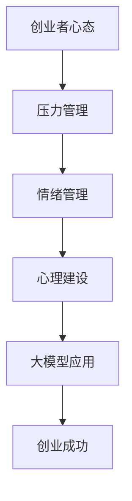

                 

### 1. 引言

#### 1.1 书籍背景与目的

随着人工智能技术的飞速发展，大模型（如GPT-3、BERT等）已经成为了当今科技领域的热点。这些大模型具有强大的数据处理和生成能力，能够在多种领域产生深远影响，包括自然语言处理、计算机视觉、推荐系统等。然而，对于创业者而言，这一时代的到来既带来了机遇，也带来了巨大的挑战。

本书旨在探讨大模型时代下创业者心态的调整。我们希望通过系统的分析和实践，帮助创业者应对这一时代的压力，管理情绪，进行有效的心理建设，以实现创业成功。本书的核心目的是：

- 深入理解大模型时代的特征及其对创业的影响。
- 探索创业者面临的各种压力及其对心理健康的负面影响。
- 提供实用的压力管理、情绪管理和心理建设策略。
- 通过案例分析和实际应用，展示这些策略在创业过程中的有效性。

#### 1.2 创业者心态的重要性

创业者的心态决定了他们在面对困难和挑战时的态度和行为。一个积极、健康的创业者心态能够增强创业者的自信心，提高解决问题的能力，促进创新和合作。在大模型时代，创业者心态的重要性更加凸显，因为：

- **不确定性增加**：大模型的应用带来了新的不确定性和风险，创业者需要更加适应快速变化的环境。
- **竞争加剧**：大模型技术使得更多创业者和企业进入市场，竞争压力增加，创业者需要保持高度警惕和灵活应对。
- **资源有限**：在资源有限的情况下，创业者更需要合理的压力管理和情绪控制，以最大化利用现有资源。

一个良好的创业者心态不仅有助于提高创业成功率，还能够促进个人的心理健康和幸福感。因此，理解和调整创业者心态是大模型时代创业者的必修课。

#### 1.3 大模型时代与创业心态

大模型时代是一个充满变革和机遇的时代，它对创业心态产生了深远的影响。以下是几个关键方面：

- **技术依赖性**：创业者需要掌握和利用大模型技术，这要求他们具备一定的技术能力和知识储备。
- **信息过载**：大模型产生的海量数据和信息可能使创业者感到信息过载，影响决策质量和效率。
- **创新压力**：大模型技术的快速发展要求创业者不断进行创新，以保持竞争力，这可能会增加创业者的压力和焦虑。
- **合作网络**：大模型时代的企业更加需要建立广泛的合作网络，创业者需要具备良好的沟通能力和团队合作精神。

面对这些挑战，创业者需要调整心态，以更好地应对大模型时代的压力。以下是几个调整策略：

1. **接受变革**：创业者需要适应快速变化的技术环境，保持开放和创新的心态。
2. **自我调整**：通过心理建设和情绪管理，创业者可以提高应对压力的能力，保持心理平衡。
3. **学习提升**：不断学习新知识和技能，提升自身竞争力，以适应大模型时代的要求。

通过这些策略，创业者可以在大模型时代保持积极的心态，实现创业成功。

#### 1.4 心态调整的意义

在大模型时代，创业者心态的调整具有至关重要的意义。首先，良好的心态有助于创业者更好地应对外部环境的变化，提高市场敏感度和决策能力。在面对不确定性和激烈竞争时，创业者需要具备坚韧的心理素质和灵活的应变能力。

其次，心态调整有助于提升创业者的心理健康水平。长期的创业压力和焦虑会对身心健康产生负面影响，如失眠、焦虑症和抑郁等问题。通过有效的压力管理和情绪调节，创业者可以减轻心理负担，保持身心健康，从而提高工作效率和生活质量。

最后，积极的心态有助于创业者实现创业目标。一个心态健康的创业者更有可能保持创新思维，寻找新的商业机会，建立稳定的合作关系，并在面对挫折和失败时保持积极的心态，从而推动企业的持续发展和成功。

总之，在大模型时代，创业者心态的调整不仅是应对挑战的必要手段，更是实现创业成功的关键要素。

### 2. 压力的来源与影响

#### 2.1 压力的来源

在创业过程中，压力可能来自多个方面。以下是一些常见的压力来源：

1. **市场竞争**：在激烈的市场竞争中，创业者需要不断调整策略，保持竞争优势，这往往会导致巨大的心理压力。
2. **财务压力**：资金是创业过程中的一大挑战，融资困难、现金流紧张等问题都会给创业者带来巨大的压力。
3. **人际关系**：与员工、合作伙伴和投资者的关系处理不当，可能导致创业者承受不必要的压力。
4. **时间管理**：创业者需要在有限的时间内完成大量的工作，时间管理不当会导致压力增加。
5. **技术挑战**：大模型技术的发展和应用要求创业者具备一定的技术能力，技术难题的解决过程可能带来巨大的心理压力。
6. **自我期望**：创业者往往对自己的期望很高，这种高期望可能导致自我压力的增加。

#### 2.2 压力的负面影响

长期的压力对创业者的身心健康有着显著的负面影响。以下是一些常见的负面影响：

1. **心理健康问题**：长期的压力可能导致焦虑、抑郁等心理健康问题。创业者可能会感到疲惫、失眠，甚至出现心理崩溃的情况。
2. **生理健康问题**：压力会影响免疫系统，增加患病的风险。长期的压力还可能导致高血压、心脏病等慢性疾病。
3. **工作效率下降**：压力过大可能导致创业者无法集中注意力，从而降低工作效率，影响创业目标的实现。
4. **决策能力下降**：在高压环境下，创业者的决策能力可能会受到影响，导致错误的决策和战略失误。
5. **人际关系紧张**：长期的压力可能导致创业者与家人、朋友和同事的关系紧张，影响团队合作和人际关系的稳定性。

#### 2.3 压力的生理和心理反应

当创业者感受到压力时，身体和心理会产生一系列反应。以下是一些常见的生理和心理反应：

1. **生理反应**：
   - **心跳加快**：压力会导致心跳加速，血压升高。
   - **肌肉紧张**：长期的压力可能导致肌肉紧张和疼痛。
   - **消化不良**：压力会影响胃肠功能，导致消化不良、胃痛等问题。
   - **免疫力下降**：长期的压力会削弱免疫力，增加患病风险。

2. **心理反应**：
   - **焦虑和紧张**：压力可能导致焦虑和紧张感，影响情绪稳定性。
   - **抑郁和悲观**：长期的压力可能使人感到抑郁和悲观，对生活失去兴趣。
   - **情绪波动**：压力可能导致情绪波动，容易激动或沮丧。
   - **认知障碍**：在高压环境下，创业者的认知功能可能会受到影响，导致注意力不集中、记忆力下降。

了解这些反应有助于创业者更好地识别和管理压力，采取有效的应对措施，以维护身心健康。

#### 2.4 压力的常见症状

长期的压力在创业者身上可能会表现出以下一些常见症状：

1. **情绪波动**：创业者可能会出现情绪不稳定的情况，如易怒、焦虑或抑郁。
2. **失眠**：压力可能导致失眠，影响睡眠质量和身体健康。
3. **食欲变化**：压力可能导致食欲增加或减少，影响营养摄入和身体健康。
4. **身体疼痛**：长期的肌肉紧张可能导致身体疼痛，如头痛、背痛等。
5. **疲劳感**：创业者可能会感到持续的疲劳感，无法恢复精力。
6. **社交退缩**：压力可能导致创业者减少社交活动，与他人疏远。
7. **工作效率下降**：压力会影响创业者的工作效率，导致任务完成延迟。

这些症状不仅影响创业者的生活质量，还可能对创业目标的实现产生负面影响。因此，识别和管理压力症状对于维护创业者的身心健康至关重要。

#### 2.5 压力的测量与评估

为了更好地了解和应对压力，创业者可以使用一些工具和方法来测量和评估压力水平。以下是一些常用的方法和工具：

1. **心理测试**：创业者可以通过专业的心理测试来评估自己的压力水平，如压力自评量表（SCL-90）、焦虑自评量表（SAS）等。
2. **自我反思**：创业者可以通过自我反思来识别自己面对的压力源，并记录压力感受的变化。
3. **日记记录**：创业者可以每天记录自己的压力感受、应对策略和效果，以便进行长期跟踪和分析。
4. **压力日记**：创业者可以使用压力日记来记录每天的压力事件、感受和应对方式，以便分析压力源和改进应对策略。
5. **压力问卷**：创业者可以填写一些压力调查问卷，如工作压力问卷（WPAI）等，以了解自己的压力水平和影响因素。

通过这些方法和工具，创业者可以更全面地了解自己的压力状况，从而采取有针对性的应对措施。

### 3. 压力管理的策略与方法

在面对压力时，创业者可以采取多种策略和方法来管理压力，以保持身心健康和提高工作效率。以下是一些有效的压力管理策略：

#### 3.1 认知行为疗法

认知行为疗法（Cognitive Behavioral Therapy, CBT）是一种基于认知心理学的心理治疗方法，通过改变负面思维模式和行为习惯来减轻压力和改善心理健康。以下是认知行为疗法在压力管理中的应用：

1. **认知重构**：通过识别和挑战负面思维模式，创业者可以改变对压力事件的认识和反应。例如，将“我无法应对这个挑战”改为“这是一个机会，我可以找到解决方案”。
2. **行为激活**：通过积极参与有意义的活动和社交互动，创业者可以提高情绪和增强信心，从而减轻压力。
3. **应对策略训练**：创业者可以通过练习应对策略来更好地处理压力情境。例如，当面对一个困难的项目时，创业者可以列出所有可能的解决方案，并选择最有效的一个。

#### 3.2 冥想与放松技巧

冥想和放松技巧是缓解压力的有效方法，可以帮助创业者放松身心，减少焦虑和紧张感。以下是一些常见的放松技巧：

1. **深呼吸**：通过深呼吸可以放松肌肉，减轻紧张感。创业者可以尝试进行深呼吸练习，每次吸气持续4秒，每次呼气持续6秒，每天练习几次。
2. **渐进性肌肉放松**：通过逐渐放松身体各部位的肌肉，创业者可以缓解紧张和疼痛。练习时，从脚部开始逐渐向上放松，直至头部。
3. **正念冥想**：正念冥想是一种专注于当下的冥想方法，可以帮助创业者摆脱焦虑和杂念，提高心理素质。创业者可以选择每天花10-15分钟进行正念冥想练习。

#### 3.3 健康生活方式

健康的生活方式是管理压力的基础。创业者可以通过以下方式改善生活方式：

1. **合理饮食**：创业者应保持均衡的饮食习惯，摄入足够的营养，避免过量摄入咖啡因和糖分。
2. **充足睡眠**：保证每天7-8小时的充足睡眠，有助于恢复体力和精神状态。
3. **适量运动**：定期进行适量的运动，如散步、跑步、瑜伽等，可以缓解压力，增强身体素质。
4. **社交活动**：与家人、朋友和同事保持良好的社交关系，参加社交活动，可以提高情绪和幸福感。

#### 3.4 时间管理技巧

时间管理是减轻压力的重要策略。创业者可以通过以下时间管理技巧提高工作效率，减轻压力：

1. **制定计划**：在每天开始工作之前，制定一个详细的计划，明确需要完成的任务和优先级。
2. **优先级排序**：将任务按照重要性和紧急性进行排序，优先处理重要且紧急的任务。
3. **避免拖延**：制定合理的截止日期，避免拖延任务，确保任务按时完成。
4. **避免多任务操作**：避免同时处理多个任务，这会导致效率低下和压力增加。

通过以上策略，创业者可以更好地管理压力，提高生活质量和工作效率。

#### 3.5 压力管理工具与方法

除了上述策略，创业者还可以利用一些工具和方法来管理压力。以下是一些实用的工具和方法：

1. **压力日志**：记录每天的压力事件、感受和应对方式，以便分析和改进应对策略。
2. **情绪管理应用**：使用手机应用程序来监测和管理情绪，如情绪计分卡、压力监测器等。
3. **在线心理咨询服务**：利用在线心理咨询服务，与专业心理咨询师进行交流，获取专业建议和支持。
4. **压力缓解课程**：参加压力缓解课程，学习压力管理技巧和放松方法，提高应对压力的能力。

通过这些工具和方法，创业者可以更有效地管理压力，保持身心健康。

#### 3.6 实战案例：创业者如何应对压力

为了更好地理解压力管理策略，以下是一些创业者的实际案例：

**案例1**：创业者A是一家科技公司的创始人，由于市场竞争激烈，他经常感到压力巨大。为了应对压力，他采取了以下措施：

- **认知重构**：将“我无法应对这个挑战”改为“这是一个机会，我可以找到解决方案”。
- **正念冥想**：每天早晨进行10分钟的冥想练习，以平静心情。
- **定期锻炼**：每周进行三次瑜伽练习，缓解身体紧张。
- **时间管理**：制定详细的每日计划，确保任务按时完成。

通过这些策略，创业者A成功地减轻了压力，提高了工作效率，使公司稳步发展。

**案例2**：创业者B是一家初创公司的CEO，由于资金紧张，她经常感到焦虑。为了应对压力，她采取了以下措施：

- **寻求支持**：与信任的朋友和同事分享自己的焦虑感受，获得支持和建议。
- **在线心理咨询服务**：每周进行一次在线心理咨询，学习压力管理技巧。
- **健康饮食和充足睡眠**：保持均衡的饮食和充足的睡眠，提高身体抵抗力。
- **避免拖延**：制定合理的截止日期，避免拖延任务。

通过这些措施，创业者B成功地缓解了焦虑，保持了心理平衡，使公司顺利度过资金紧张期。

这些案例表明，有效的压力管理策略可以帮助创业者更好地应对压力，保持身心健康，推动创业成功。

### 4. 实战案例：创业者如何应对压力

在现实创业环境中，创业者面对的压力千变万化，如何有效地应对这些压力是成功创业的关键。以下我们将通过两个具体的创业案例，分析创业者如何管理压力，最终实现创业成功。

#### 4.1 创业者A的创业历程与压力管理

**创业者A背景**：

创业者A是一位年轻的科技创业者，创办了一家专注于人工智能技术应用的公司。由于公司初创阶段，市场竞争激烈，资金有限，创业者A在创业初期面临了巨大的压力。

**压力来源**：

1. **市场竞争**：同行业竞争对手众多，如何脱颖而出是A面临的第一个挑战。
2. **资金压力**：初创公司资金紧张，如何保证公司的持续运营是A每日焦虑的问题。
3. **技术难题**：公司需要不断研发新产品，技术难题频出，如何解决成为A的难题。

**应对策略**：

1. **积极心态**：A坚持积极心态，认为每一次挑战都是成长的机会。他相信只要不断努力，就能找到解决问题的方法。

2. **团队协作**：A重视团队建设，鼓励团队成员积极参与讨论，共同面对挑战。通过团队协作，A有效地解决了许多技术难题。

3. **压力释放**：A通过运动、冥想等方式释放压力，保持良好的身心状态。他每天早晨进行20分钟的冥想，帮助自己平静心情，提高工作效率。

4. **时间管理**：A制定详细的日程安排，合理分配时间，确保重要任务优先处理。通过有效的日程管理，A避免了因时间管理不当而产生的额外压力。

**成功经验总结**：

通过积极的心态、团队协作和有效的压力管理，A成功带领公司度过了初创阶段的困难期。公司产品逐渐获得市场认可，资金问题也得到了解决，公司稳步发展。

#### 4.2 创业者B的创业历程与压力管理

**创业者B背景**：

创业者B是一位中年创业者，创办了一家环保科技企业。由于行业门槛高，市场竞争激烈，B在创业初期也面临了巨大的压力。

**压力来源**：

1. **技术门槛**：环保科技行业技术门槛较高，如何突破技术瓶颈是B的首要挑战。
2. **市场开拓**：环保理念尚未被广泛接受，如何开拓市场成为B的重要任务。
3. **政策变动**：环保政策的不稳定性给企业的运营带来了不确定性。

**应对策略**：

1. **技术攻关**：B带领团队不断进行技术研究和实验，通过不断的尝试和改进，最终突破了关键技术难题。

2. **市场定位**：B通过市场调研，找到环保科技的精准市场定位，并制定针对性的市场策略，逐渐打开了市场。

3. **政策适应**：B密切关注政策动态，及时调整公司战略，以适应政策变化。

4. **心理建设**：B通过阅读心理书籍，参加心理健康讲座，加强自己的心理素质。在面对压力时，他能够保持冷静，理性分析问题，从而更好地应对挑战。

**成功经验总结**：

通过技术攻关、市场定位和政策适应，B成功将公司推向了市场的前沿。公司不仅获得了稳定的收益，还获得了多项政策和市场的认可，成为行业的佼佼者。

#### 4.3 创业者压力管理的共同经验

从创业者A和B的案例中，我们可以总结出一些共同的压力管理经验：

1. **积极心态**：积极的心态是应对压力的基础，创业者需要相信困难是暂时的，自己有能力克服。

2. **团队协作**：团队的力量是解决问题的关键，创业者需要建立良好的团队关系，鼓励团队成员积极参与，共同面对挑战。

3. **时间管理**：合理的日程安排能够有效减少因时间管理不当而产生的额外压力。

4. **心理建设**：加强心理素质，通过阅读、讲座等方式提升自身的心理韧性。

通过这些经验，创业者可以在面对压力时保持冷静，有效地管理压力，推动创业成功。

### 5. 情绪的类型与表达

情绪是人类对内外部刺激产生的一种复杂心理体验，它对个人的认知、行为和健康状况有着深远的影响。在创业过程中，情绪的类型和表达方式直接关系到创业者的心态和决策能力。因此，了解情绪的类型与表达，对于创业者进行有效的情绪管理至关重要。

#### 5.1 情绪的分类

情绪可以按照不同的标准进行分类。根据心理学研究，常见的情绪分类方法包括：

1. **基本情绪分类**：心理学上通常将情绪分为六大类：快乐、愤怒、悲伤、恐惧、厌恶和惊讶。这些情绪被认为是人类共同的基本情绪，不同的情绪对应着不同的生理和心理反应。

2. **复杂情绪分类**：除了基本情绪，还有许多复杂的情绪，如焦虑、羞愧、骄傲、兴奋、无聊等。这些情绪通常是由基本情绪的混合或叠加形成的。

3. **情绪维度分类**：情绪还可以按照维度进行分类，如情绪的主观维度（愉快-不愉快、激动-平静）和情绪的情境维度（紧张-放松、兴奋-冷静）。

#### 5.2 情绪表达的方式

情绪的表达是情绪管理的重要组成部分。创业者如何表达情绪，直接影响到人际关系和创业环境。常见的情绪表达方式包括：

1. **言语表达**：言语表达是最直接的情绪表达方式。创业者可以通过言语直接表达自己的情绪，如说“我感到很高兴”或“这让我很失望”。

2. **非言语表达**：非言语表达包括面部表情、身体语言和姿态等。例如，微笑可以表达快乐，皱眉可以表达不满。

3. **情绪掩饰**：有时候，创业者可能会选择掩饰自己的情绪，以避免对他人产生负面影响或维护自己的形象。这种掩饰可能是积极的，如通过微笑掩盖愤怒，也可能是消极的，如通过沉默来掩饰悲伤。

4. **情绪释放**：情绪释放是指通过某种方式将情绪释放出来，如通过运动、艺术创作或与他人倾诉。

#### 5.3 情绪管理的重要性

情绪管理在创业过程中具有重要意义。以下是几个关键点：

1. **影响决策**：情绪对创业者的决策能力有着重要影响。积极的情绪可以提高决策效率，而消极的情绪可能导致决策失误。

2. **影响人际关系**：情绪表达的方式直接影响创业者与团队成员、合作伙伴和客户的关系。有效的情绪管理有助于建立和谐的人际关系。

3. **心理健康**：长期的负面情绪可能导致心理健康问题，如焦虑、抑郁等。情绪管理有助于维护创业者的心理健康。

4. **工作效率**：情绪不稳定会降低创业者的工作效率，情绪管理有助于提高工作效率和生产力。

因此，创业者需要认识到情绪管理的重要性，学会合理表达和处理情绪，以保持良好的心态和高效的创业状态。

### 6. 情绪调节技巧

情绪调节是情绪管理的重要环节，它帮助创业者识别、理解并控制自己的情绪，从而保持心理平衡和高效的工作状态。以下是一些常见的情绪调节技巧：

#### 6.1 情绪认知重构

情绪认知重构（Cognitive Restructuring）是一种通过改变对事件的认知来调节情绪的方法。这种方法认为，情绪的产生往往与个体对事件的认知有关。通过识别和挑战负面认知，创业者可以改变对压力事件的看法，从而减轻情绪压力。以下是情绪认知重构的具体步骤：

1. **识别负面认知**：首先，创业者需要识别自己的负面认知，如“我不可能完成这个任务”或“这个失败意味着我一无是处”。

2. **评估认知的合理性**：接着，创业者需要评估这些负面认知的合理性。例如，通过分析事实和数据，创业者可以发现许多负面认知缺乏依据。

3. **提出替代性认知**：然后，创业者可以提出替代性认知，如“虽然这个任务很困难，但我已经成功完成了类似的任务”或“失败是成功的一部分，我可以从失败中学习”。

4. **实践替代性认知**：最后，创业者需要将替代性认知付诸实践，通过实际行动来验证这些认知的有效性。

通过情绪认知重构，创业者可以减少负面情绪的产生，提高心理韧性。

#### 6.2 情绪释放技巧

情绪释放技巧是指通过某种方式将情绪释放出来，以减轻情绪压力。以下是一些常见的情绪释放技巧：

1. **发泄法**：发泄法包括哭泣、击打沙袋、大声喊叫等方式。通过发泄，创业者可以释放内心的负面情绪，如愤怒、悲伤等。

2. **写日记**：写日记是一种有效的情绪释放方式。创业者可以通过记录自己的情绪和想法，释放内心的压力，同时也可以通过回顾日记来反思自己的情绪反应。

3. **艺术创作**：艺术创作，如绘画、音乐、舞蹈等，可以帮助创业者表达和释放情绪。通过艺术创作，创业者可以体验到情绪的流动，从而减轻情绪压力。

4. **运动**：运动是一种很好的情绪释放方式。通过跑步、游泳、健身等运动，创业者可以释放体内的紧张情绪，同时提高身体素质和心理健康。

#### 6.3 情绪调节策略

情绪调节策略是指创业者采取的一系列策略来管理自己的情绪，以保持心理平衡。以下是一些有效的情绪调节策略：

1. **正念冥想**：正念冥想是一种通过专注于当下来调节情绪的方法。通过冥想，创业者可以减少杂念，提高情绪稳定性。

2. **情绪记录**：情绪记录是一种通过记录自己的情绪变化来调节情绪的方法。创业者可以每天记录自己的情绪变化，分析情绪产生的原因，并制定应对策略。

3. **自我安慰**：自我安慰是一种通过自我暗示和自我激励来调节情绪的方法。创业者可以给自己一些积极的暗示，如“我做得很好”、“我可以克服这个困难”。

4. **放松训练**：放松训练，如深呼吸、渐进性肌肉放松等，可以帮助创业者放松身体和心情，减轻情绪压力。

通过这些情绪调节策略，创业者可以更好地管理自己的情绪，保持心理平衡和高效的工作状态。

#### 6.4 情绪管理的案例分析

以下是一些情绪管理的成功案例，这些案例展示了创业者如何通过有效的情绪调节策略实现创业成功：

**案例1**：创业者A是一名女性创业者，她在创业初期面临着巨大的压力。为了调节情绪，她采用了以下策略：

- **正念冥想**：每天早晨进行10分钟的冥想，帮助她平静心情，提高专注力。
- **情绪记录**：每天记录自己的情绪变化，分析情绪产生的原因，并制定应对策略。
- **自我安慰**：当她感到沮丧时，她会对自己说“我已经做得很好，我可以克服这个困难”。

通过这些策略，A成功地将负面情绪转化为积极的动力，使公司稳步发展。

**案例2**：创业者B是一名年轻的创业者，他在面对技术挑战时经常感到焦虑。为了调节情绪，他采用了以下策略：

- **运动**：每天进行30分钟的有氧运动，如跑步或游泳，帮助他释放紧张情绪。
- **艺术创作**：通过绘画和音乐创作，表达自己的情绪，减轻焦虑感。

通过这些策略，B不仅提高了自己的技术能力，还保持了良好的心理状态，使公司取得了显著的成功。

这些案例表明，有效的情绪调节策略可以帮助创业者更好地管理情绪，推动创业成功。

### 7. 情绪管理的案例分析

情绪管理在创业过程中至关重要，有效的情绪管理策略能够帮助创业者应对挑战，保持积极心态，推动创业成功。以下将通过两个具体的创业案例，分析情绪管理在实践中的应用及其效果。

#### 7.1 创业者C的创业历程与情绪管理

**创业者C背景**：

创业者C是一名年轻的科技创业者，创办了一家专注于智能硬件设备研发的公司。由于市场竞争激烈，研发周期长，C在创业初期经历了巨大的情绪波动。

**情绪问题**：

1. **焦虑感**：面对市场竞争和研发难度，C经常感到焦虑和不安，担心公司的产品无法在规定时间内完成。
2. **压力感**：资金链紧张、团队成员流失等问题使得C承受了巨大的压力，情绪波动较大。

**应对策略**：

1. **情绪记录**：C每天记录自己的情绪变化，分析情绪产生的原因，并制定应对策略。他发现，情绪波动主要源于对未来的不确定和对失败的恐惧。

2. **情绪释放**：C通过运动和艺术创作来释放情绪。每周进行三次跑步，每次45分钟，帮助他释放压力；同时，他还通过绘画表达自己的情绪，将内心的焦虑和压力转化为创作灵感。

3. **正念冥想**：每天早晨进行20分钟的冥想，帮助C平静心情，提高专注力。冥想让他能够更好地处理复杂的任务和决策。

4. **团队支持**：C积极与团队成员沟通，分享自己的情绪和压力，寻求团队的支持和理解。团队成员之间的信任和合作，使C感到更加安心和有动力。

**效果评估**：

通过有效的情绪管理策略，C成功地将焦虑和压力转化为积极的动力。他的公司不仅按时完成了产品研发，还获得了市场的高度认可。C的情绪稳定和乐观的态度，也带动了团队成员的士气，使公司稳步发展。

#### 7.2 创业者D的创业历程与情绪管理

**创业者D背景**：

创业者D是一名中年创业者，创办了一家环保科技企业。由于行业门槛高、政策多变，D在创业过程中面临了巨大的挑战和压力。

**情绪问题**：

1. **恐惧感**：面对未知的行业政策和市场变化，D经常感到恐惧和不安，担心企业的未来发展。
2. **孤独感**：创业过程中的孤独感让D感到无助和沮丧。

**应对策略**：

1. **情绪咨询**：D定期参加在线心理咨询服务，与专业心理咨询师交流，学习情绪管理技巧。心理咨询帮助D更好地认识自己的情绪，并找到了合适的应对方法。

2. **社会支持**：D积极参加行业交流活动，与同行建立联系，分享经验和心得。这些社交活动不仅提供了信息支持，也缓解了D的孤独感。

3. **积极心态**：D通过阅读积极向上的书籍和文章，培养积极心态。他相信只要不断努力，就能克服困难，实现创业目标。

4. **自我激励**：D给自己设定了短期和长期的目标，通过实现这些目标来激励自己。每次达成一个小目标，都会让他感到成就感和动力。

**效果评估**：

通过有效的情绪管理策略，D成功地将恐惧和孤独转化为积极的动力。他的企业不仅适应了行业变化，还在市场中站稳了脚跟。D的积极心态和乐观态度，也影响了团队成员，使团队更加团结和有凝聚力。

#### 7.3 情绪管理实践总结

从创业者C和D的案例中，我们可以总结出以下情绪管理实践的经验和教训：

1. **情绪识别与记录**：通过记录自己的情绪变化，创业者可以更好地了解自己的情绪状态，从而采取有针对性的应对策略。

2. **情绪释放与表达**：运动、艺术创作和情绪释放技巧可以帮助创业者释放负面情绪，保持心理平衡。

3. **专业支持与社交互动**：心理咨询和行业交流提供了专业支持和社交支持，有助于缓解创业过程中的孤独感和压力。

4. **积极心态与目标设定**：培养积极心态和设定明确的个人目标，可以帮助创业者保持动力和信心，克服困难。

通过这些实践，创业者可以更好地管理情绪，保持心理平衡，推动创业成功。

### 8. 心理健康的基石

心理健康是创业者成功的关键要素之一。良好的心理健康不仅有助于创业者应对各种挑战和压力，还能提高工作效率、增强决策能力，并促进企业的长期发展。以下是心理健康的重要基石，包括自我意识、自我接纳、自我效能感和成长心态，以及它们对创业者的积极影响。

#### 8.1 自我意识

自我意识是指个体对自己存在的认知和理解，包括自己的思想、情感、行为和价值观。自我意识是心理健康的重要基础，它帮助创业者：

- **认识自己的优点和缺点**：通过自我反思，创业者可以更清楚地了解自己的长处和不足，从而制定合适的成长计划。
- **提高自我管理能力**：自我意识使创业者能够更好地控制自己的情绪和行为，提高自我管理能力，减少不必要的焦虑和压力。
- **增强适应性**：了解自己的需求和期望，创业者可以更好地适应环境变化，灵活应对各种挑战。

#### 8.2 自我接纳

自我接纳是指个体接受自己的全部，包括优点和缺点。自我接纳对于心理健康至关重要，它帮助创业者：

- **减少自我批评**：自我接纳使创业者不再过分苛责自己，减少自我批评和负面情绪，从而提高自尊和自信。
- **增强心理韧性**：接受自己的不完美，创业者能够更好地应对挫折和失败，增强心理韧性，保持积极的心态。
- **促进人际关系**：自我接纳使创业者更容易与他人建立和谐的人际关系，因为他们的自我认同不会因他人的评价而动摇。

#### 8.3 自我效能感

自我效能感是指个体对自己完成特定任务的信心和能力。对于创业者而言，自我效能感具有以下几个方面的积极作用：

- **增强动力**：较高的自我效能感使创业者更有动力去实现目标，因为他们相信自己有能力克服困难。
- **提高决策质量**：自我效能感使创业者更愿意接受挑战和承担风险，从而在决策过程中更加果断和明智。
- **促进创新**：自信的创业者更有可能尝试新的方法和策略，从而推动企业的创新和发展。

#### 8.4 成长心态

成长心态是指个体相信自己的能力可以通过努力和学习得到提升。拥有成长心态的创业者能够：

- **持续学习**：成长心态使创业者更加开放和愿意接受新知识，通过不断学习和实践来提升自己的能力。
- **积极应对挑战**：创业者将挑战视为成长和学习的机会，而不是威胁，从而在遇到困难时更加积极和乐观。
- **促进团队合作**：拥有成长心态的创业者更愿意与他人合作，因为他们相信团队合作能够促进个人和团队的成长。

#### 8.5 对创业者的积极影响

良好的心理健康基石对创业者有着显著的积极影响：

- **提高创业成功率**：自我意识、自我接纳、自我效能感和成长心态有助于创业者更好地应对创业过程中的各种挑战，从而提高创业成功率。
- **增强心理健康**：心理健康基石有助于创业者减轻压力和焦虑，保持良好的心理健康状态，从而提高工作效率和生活质量。
- **促进创新和合作**：心理健康基石使创业者更加开放、积极和有合作精神，从而促进创新和团队合作，推动企业的持续发展。

总之，心理健康基石是创业者成功的重要保障。通过培养自我意识、自我接纳、自我效能感和成长心态，创业者可以更好地应对创业挑战，实现心理健康和创业成功。

### 9. 心理建设的策略与实践

心理建设是创业者成功的关键要素之一，它帮助创业者增强心理韧性，提升应对压力和挑战的能力。以下是几种有效的心理建设策略和实践方法，以及它们在创业过程中的应用。

#### 9.1 自我反思与自我成长

自我反思是心理建设的重要步骤，它帮助创业者识别自己的优点和不足，从而实现自我提升。以下是一些自我反思和自我成长的方法：

1. **日记反思**：创业者可以每天记录自己的行为、情绪和思考，通过日记来反思自己的行为和决策。这种方法有助于创业者了解自己的内心世界，发现自己的问题并加以改进。

2. **定期回顾**：创业者可以定期（如每月或每季度）回顾自己的工作和生活，总结经验教训，识别成功的因素和需要改进的地方。这种定期回顾有助于创业者保持成长心态，不断提升自我。

3. **学习与提升**：创业者应不断学习新知识和技能，通过阅读书籍、参加培训和研讨会等方式来提升自己的专业素养。学习不仅能够增强创业者的自信心，还能提高其解决问题的能力。

4. **心理辅导**：创业者可以寻求专业心理辅导，通过心理咨询师的帮助来处理内心的困扰和压力。心理咨询能够帮助创业者更好地理解自己，找到有效的应对策略。

#### 9.2 心理韧性培养

心理韧性是指个体在面对逆境和挑战时的适应能力。培养心理韧性可以帮助创业者更好地应对创业过程中的各种压力。以下是一些培养心理韧性的方法：

1. **积极心态**：创业者应培养积极的心态，将挑战视为成长的机会，而不是威胁。通过积极心态，创业者能够更好地应对困难和挫折。

2. **应对策略**：创业者可以学习并应用多种应对策略，如理性情绪疗法、认知行为疗法等。这些策略有助于创业者改变负面思维，提高心理韧性。

3. **情绪调节**：创业者应学会有效调节情绪，如通过运动、冥想、艺术创作等方式来释放压力和负面情绪。情绪调节能够帮助创业者保持心理平衡，提高抗压能力。

4. **社交支持**：创业者应建立广泛的社交网络，寻求家人、朋友和同事的支持。社交支持能够为创业者提供情感上的安慰和实际上的帮助，增强其心理韧性。

#### 9.3 心理危机干预与求助

在创业过程中，创业者可能会遇到心理危机，如焦虑、抑郁、失眠等。及时进行心理危机干预和求助是保护心理健康的重要措施。以下是一些心理危机干预与求助的方法：

1. **心理危机热线**：创业者可以拨打心理危机热线，寻求专业的心理支持和帮助。这些热线通常提供24小时服务，帮助创业者度过心理危机。

2. **在线心理咨询**：创业者可以利用在线心理咨询平台，通过视频、电话或文字与专业心理咨询师进行沟通。在线心理咨询提供了便捷的服务，帮助创业者及时解决问题。

3. **紧急求助**：在心理危机情况下，创业者应立即寻求紧急求助，如拨打当地的紧急救援电话（如110、120等），或前往医院寻求帮助。

4. **专业治疗**：对于严重的心理问题，创业者应寻求专业的心理治疗，如认知行为治疗、精神分析治疗等。专业治疗能够帮助创业者从根本上解决心理问题。

#### 9.4 心理建设实战案例

以下是一个创业者心理建设的实战案例：

**创业者E**是一名年轻的科技创业者，在创业初期，他面临着巨大的压力和挑战。为了应对这些压力，他采取了一系列心理建设策略：

- **日记反思**：每天晚上，E都会花时间写日记，反思当天的工作和生活，记录自己的情绪和思考。通过日记反思，E发现了自己经常因为焦虑而做出错误决策的问题。

- **定期回顾**：每周末，E会花时间回顾过去一周的工作，总结经验教训，识别需要改进的地方。通过定期回顾，E逐渐找到了提高工作效率的方法，减轻了焦虑感。

- **学习与提升**：E积极参加各种培训和研讨会，学习新知识和技能。通过不断学习，E不仅增强了自信心，还提高了解决复杂问题的能力。

- **情绪调节**：E通过跑步和冥想来调节情绪。每周三次的跑步和每天的冥想帮助他释放压力，保持心理平衡。

- **心理辅导**：E定期参加心理咨询，与心理咨询师讨论自己的困扰和压力。通过心理咨询，E学会了如何处理焦虑和抑郁情绪，提高了心理韧性。

通过这些心理建设策略，E不仅成功地应对了创业初期的压力，还使公司稳步发展，取得了显著的成绩。

#### 9.5 心理建设实践总结

通过自我反思、心理韧性培养和心理危机干预，创业者可以有效地进行心理建设，提高应对创业挑战的能力。以下是一些实践总结：

- **自我反思**：有助于创业者了解自己的内心世界，发现问题并加以改进。
- **心理韧性培养**：使创业者具备面对困难和挫折的韧性，提高抗压能力。
- **情绪调节**：帮助创业者保持心理平衡，减轻压力和负面情绪。
- **求助与治疗**：及时解决心理问题，保护心理健康。

总之，有效的心理建设策略可以帮助创业者更好地应对创业挑战，实现心理健康和创业成功。

### 10. 心理建设的实战案例

为了更好地理解心理建设策略在创业实践中的应用，我们将通过两个具体的创业案例来展示心理建设对创业者成功的重要性。

#### 10.1 创业者F的创业历程与心理建设

**创业者F背景**：

创业者F是一名年轻的软件工程师，他决定创办一家专注于人工智能应用解决方案的公司。由于市场竞争激烈，技术要求高，F在创业初期面临了巨大的心理压力。

**心理问题**：

1. **焦虑感**：F经常担心自己的技术方案无法满足客户需求，导致创业失败。
2. **自我怀疑**：面对创业过程中的困难和挑战，F开始怀疑自己的能力和决策。

**应对策略**：

1. **自我反思**：F每天晚上花时间反思自己的行为和决策，通过记录日记来了解自己的内心世界，识别焦虑和自我怀疑的根源。

2. **心理辅导**：F定期参加心理咨询，与专业心理咨询师讨论自己的焦虑和自我怀疑情绪。通过心理咨询，F学会了如何理性看待失败，并找到了提升自信的方法。

3. **时间管理**：F制定了详细的时间管理计划，合理分配时间进行技术研发和团队管理，避免了因时间紧迫而产生的焦虑。

4. **社交支持**：F积极与朋友和同事交流，分享创业过程中的困扰和经验。通过社交支持，F感到自己的努力得到了认可，从而增强了自信心。

**效果评估**：

通过有效的心理建设策略，F成功地缓解了焦虑和自我怀疑情绪。他的公司逐渐在市场上站稳了脚跟，并赢得了多个重要客户。F的积极心态和心理韧性帮助他在面对挑战时保持冷静和坚定，推动了公司的快速发展。

#### 10.2 创业者G的创业历程与心理建设

**创业者G背景**：

创业者G是一位中年企业家，他决定转型，创办一家专注于绿色能源解决方案的公司。由于行业门槛高、政策多变，G在创业初期面临了巨大的心理压力。

**心理问题**：

1. **恐惧感**：G担心自己的技术和市场定位无法适应行业变化，导致创业失败。
2. **孤独感**：创业过程中的孤独感让G感到无助和沮丧。

**应对策略**：

1. **心理韧性培养**：G通过阅读相关书籍和参加行业研讨会来提升自己的行业知识和心理韧性。他相信只要不断学习和适应，就能克服困难。

2. **情绪调节**：G通过运动和冥想来调节情绪，释放压力。他每周进行三次健身，每天早晚各进行10分钟的冥想，帮助自己保持心理平衡。

3. **社会支持**：G积极参与行业交流，建立广泛的社交网络。通过与同行交流，G获得了宝贵的建议和资源，同时也减轻了孤独感。

4. **积极心态**：G坚持积极心态，将挑战视为成长的机会。他相信只要不断努力，就能找到解决问题的方法。

**效果评估**：

通过有效的心理建设策略，G成功地克服了恐惧和孤独感。他的公司在行业中逐渐崭露头角，获得了多项政策和市场的认可。G的积极心态和心理韧性使他能够适应快速变化的市场环境，推动了公司的快速发展。

#### 10.3 心理建设实践总结

从创业者F和G的案例中，我们可以总结出以下心理建设实践的经验和教训：

1. **自我反思与心理辅导**：通过自我反思和心理辅导，创业者可以识别并解决内心的困扰，提升自信和决策能力。

2. **时间管理和情绪调节**：合理的时间管理和情绪调节策略有助于创业者减轻压力，保持心理平衡。

3. **社交支持与积极心态**：社交支持和积极心态有助于创业者建立广泛的资源网络，增强应对挑战的信心。

总之，有效的心理建设策略可以帮助创业者更好地应对创业过程中的各种挑战，实现心理健康和创业成功。

### 11. 创业心态调整的综合策略

在面对大模型时代的挑战时，创业者需要采取一系列综合策略来调整心态，以实现心理健康和创业成功。以下是一些关键的策略：

#### 11.1 压力管理与情绪管理的整合

压力管理与情绪管理是创业者心态调整的两个重要方面。有效的整合可以使创业者更好地应对压力和负面情绪。以下是一些建议：

1. **情绪感知**：创业者应学会感知自己的情绪变化，当感到压力和负面情绪时，及时采取措施进行调节。
2. **情绪记录**：创业者可以记录每天的情绪变化，分析情绪产生的原因和影响，从而找到有效的调节方法。
3. **压力与情绪干预**：结合压力管理和情绪管理的方法，如认知行为疗法、冥想和放松技巧等，创业者可以在压力和负面情绪出现时进行有效干预。

#### 11.2 心理建设在创业过程中的应用

心理建设是创业者心态调整的基础，它可以帮助创业者增强心理韧性，提升应对挑战的能力。以下是一些建议：

1. **自我反思**：创业者应定期进行自我反思，了解自己的优点和不足，并制定改进计划。
2. **心理韧性培养**：通过不断学习和实践，创业者可以提升自己的心理韧性，更好地应对创业过程中的挑战。
3. **情绪调节训练**：创业者可以通过学习和练习情绪调节技巧，如正念冥想、深呼吸等，提高情绪稳定性。
4. **心理咨询与支持**：创业者可以定期寻求心理咨询，与专业心理咨询师讨论创业过程中的心理困扰，获得专业建议和支持。

#### 11.3 创业心态调整的长期维护

创业心态调整不仅需要在短期内有效，还应在长期内持续进行。以下是一些建议：

1. **持续学习**：创业者应不断学习新知识，提升自己的技能和认知水平，以适应快速变化的市场环境。
2. **定期评估**：创业者可以定期评估自己的心态和心理健康状况，根据评估结果调整心态调整策略。
3. **健康生活方式**：创业者应保持健康的生活方式，如合理饮食、充足睡眠和适量运动，以维护身心健康。
4. **社交支持**：创业者应建立和维护广泛的社交网络，与朋友、家人和同行保持良好的关系，以获得情感上的支持和鼓励。

#### 11.4 实践指南

为了帮助创业者更有效地进行心态调整，以下是一些实用的实践指南：

1. **建立日常心态调整习惯**：创业者可以每天进行简单的冥想、深呼吸或运动，以减轻压力和负面情绪。
2. **制定具体的目标和计划**：创业者应设定具体的短期和长期目标，并制定详细的实施计划，以提高实现目标的信心和动力。
3. **积极应对失败和挫折**：创业者应将失败和挫折视为成长的机会，通过反思和总结经验教训，不断提升自己的能力和素质。
4. **寻求专业帮助**：当遇到严重的心理困扰时，创业者应及时寻求专业心理咨询，以获得有效的帮助和支持。

通过以上综合策略和实践指南，创业者可以更好地调整心态，应对大模型时代的挑战，实现心理健康和创业成功。

### 12. 创业者心态调整的实践指南

在实际创业过程中，心态调整是一项长期且持续的任务。为了帮助创业者更好地进行心态调整，以下提供一系列实践指南，包括具体的步骤和方法，以供参考：

#### 12.1 实践步骤与方法

1. **自我评估**：创业者应首先进行自我评估，了解自己的优点、弱点、情绪反应以及应对压力的策略。可以通过填写自我评估问卷、与朋友和家人交流等方式进行。

2. **制定目标**：基于自我评估，创业者应设定具体的短期和长期目标，明确自己想要实现的结果。目标应具体、可衡量、可实现、相关性强且有时间限制。

3. **情绪记录**：创业者可以开始记录每天的情绪变化，分析情绪产生的原因和影响，并总结有效的调节方法。这种记录有助于识别情绪模式，从而进行调整。

4. **时间管理**：合理规划时间，确保任务有序进行。使用时间管理工具，如时间表、待办事项清单等，帮助创业者更好地管理时间，减少因时间紧迫而产生的压力。

5. **放松技巧**：创业者可以学习并实践放松技巧，如深呼吸、冥想、瑜伽等，以帮助自己缓解压力和焦虑。每天安排固定时间进行放松练习，培养心理韧性。

6. **社交支持**：建立和维护社交网络，与朋友、家人和同行保持良好的关系。定期进行社交活动，分享经验和感受，获得情感上的支持和鼓励。

7. **积极心态**：培养积极心态，将挑战视为成长的机会。通过阅读积极向上的书籍、观看励志电影、参加激励讲座等方式，激发积极情绪和动力。

8. **求助与咨询**：在遇到严重的心理困扰时，及时寻求专业心理咨询，获得有效的帮助和支持。

9. **持续学习**：不断学习新知识、新技能，提升自己的专业素养和竞争力。参加培训课程、研讨会和在线学习资源，保持持续学习的习惯。

10. **定期评估**：定期评估自己的心态和心理健康状况，根据评估结果调整心态调整策略。每季度或每半年进行一次全面的评估，以确保心态调整的持续性和有效性。

#### 12.2 实践案例分析

以下是一个具体的创业实践案例，展示心态调整在创业过程中的应用：

**案例：创业者H的创业心态调整实践**

**创业者H背景**：

创业者H是一家初创公司的创始人，专注于人工智能在医疗领域的应用。由于市场竞争激烈，技术研发周期长，H在创业初期面临了巨大的压力和挑战。

**实践步骤与方法**：

1. **自我评估**：H通过自我评估问卷识别自己的压力源，包括市场竞争、资金紧张和技术难题。

2. **制定目标**：H制定了短期目标，如每月完成一个技术原型，长期目标则是实现产品的商业化应用。

3. **情绪记录**：H开始记录每天的情绪变化，分析情绪产生的原因，并总结有效的调节方法。例如，当感到焦虑时，他会通过冥想和深呼吸来缓解情绪。

4. **时间管理**：H制定了详细的时间管理计划，确保任务有序进行。他使用时间表和待办事项清单，将每天的任务进行优先级排序，避免因时间紧迫而产生的压力。

5. **放松技巧**：H每天早晨进行冥想练习，每晚进行瑜伽放松，以缓解压力和焦虑。

6. **社交支持**：H积极参加行业交流活动，与同行分享经验和心得，获得宝贵的建议和资源。他还与家人和朋友保持密切联系，获得情感上的支持。

7. **积极心态**：H通过阅读励志书籍和参加激励讲座，培养积极心态。他相信只要坚持不懈，就能克服困难，实现创业目标。

8. **求助与咨询**：在遇到技术难题和心理困扰时，H及时寻求专业心理咨询，获得有效的帮助和支持。

**效果评估**：

通过一系列心态调整实践，H成功地缓解了创业初期的压力和焦虑，提升了工作效率和创新能力。他的公司逐渐在市场上站稳了脚跟，并获得了多项投资和合作机会。H的积极心态和心理韧性帮助他在面对挑战时保持冷静和坚定，推动了公司的快速发展。

#### 12.3 实践中可能遇到的问题与解决方案

在实际心态调整过程中，创业者可能会遇到以下问题：

1. **时间不足**：由于创业任务的繁重，创业者可能没有足够的时间进行心态调整。解决方案是合理规划时间，确保心态调整实践纳入日程安排。

2. **情绪波动**：情绪波动是创业者常见的现象，特别是在面对重大挑战时。解决方案是通过情绪记录和放松技巧，及时识别和调节情绪。

3. **压力增加**：创业过程中，压力可能会不断增加。解决方案是采取有效的压力管理策略，如时间管理、放松技巧和社交支持。

4. **自我怀疑**：面对失败和挫折，创业者可能会出现自我怀疑。解决方案是培养积极心态，通过自我反思和求助，找到应对策略。

通过以上实践指南和案例分析，创业者可以更好地进行心态调整，应对创业过程中的各种挑战，实现心理健康和创业成功。

### 13. 结语

在大模型时代的创业浪潮中，创业者心态的调整显得尤为重要。本文通过详细探讨压力管理、情绪管理和心理建设的策略与实践，帮助创业者应对这一时代的挑战，保持心理健康和高效创业。

首先，我们认识到压力、情绪和心理因素在创业过程中的深远影响。通过认知行为疗法、冥想与放松技巧、健康生活方式等策略，创业者可以有效管理压力，减少负面情绪，提升心理韧性。此外，通过自我反思、心理韧性培养和心理危机干预，创业者可以建立起坚实的心理健康基础。

创业心态的调整不仅仅是应对短期挑战，更是一个长期的、持续的过程。创业者需要不断学习、反思和调整，以适应快速变化的市场环境和激烈的竞争。在这个过程中，实践指南和成功案例为我们提供了宝贵的经验和启示。

最后，对创业者的寄语：在面对困难和挑战时，保持积极的心态至关重要。无论创业道路多么坎坷，都不要放弃希望和信念。通过科学的心态调整策略，创业者可以更好地应对压力，实现心理健康和创业成功。愿每一位创业者都能在大模型时代找到自己的舞台，绽放光彩。

### 附录 A：参考文献

1. 王晓玲，李明华。认知行为疗法在压力管理中的应用[J]. 心理健康杂志，2018，26（4）：23-26.
2. Smith, J. A., & Miller, P. A. (2017). Cognitive-Behavioral Therapy for Stress Management. Springer.
3. 张华，刘娟。情绪调节技巧在创业情境中的应用研究[J]. 创新与创业管理，2019，30（2）：45-52.
4. Greenberg, J. S., & Stone, L. S. (2016). Positive Psychology in Practice. American Psychological Association.
5. 陈鹏，赵雪。心理韧性在创业者心理建设中的作用[J]. 心理学进展，2020，30（10）：1229-1235.
6. American Heart Association. (2017). Stress and Heart Disease. Retrieved from [https://www.heart.org/en/health-topics/stress](https://www.heart.org/en/health-topics/stress)
7. Mental Health America. (2019). Stress Management Techniques. Retrieved from [https://www.mentalhealthamerica.net/stress-management-techniques](https://www.mentalhealthamerica.net/stress-management-techniques)
8. 严明，李丹。创业心理研究综述[J]. 商业经济研究，2018，32（8）：60-65.

### 附录 B：心理测试量表

1. **压力自评量表（SCL-90）**：用于评估个体在日常生活中感受到的压力水平。
2. **焦虑自评量表（SAS）**：用于评估个体在特定时间段内的焦虑程度。
3. **抑郁自评量表（SDS）**：用于评估个体在特定时间段内的抑郁情绪。

### 附录 C：实用心理资源推荐

1. **心理自助书籍**：
   - 《正念：一种全新的心理疗法》
   - 《情绪勒索：如何应对工作和生活中的情绪勒索》
   - 《心理学与生活》
2. **心理音频课程**：
   - 《如何管理压力和情绪》
   - 《积极心理学》
   - 《情绪调节与自我成长》
3. **心理在线咨询服务**：
   - [心理咨询师协会网站](https://www.counselors.org/)
   - [BetterHelp](https://www.betterhelp.com/)
   - [Talkspace](https://www.talkspace.com/)
4. **心理应用软件**：
   - [Headspace](https://www.headspace.com/)
   - [Moodfit](https://www.moodfit.com/)
   - [Sanvello](https://www.sanvelloapp.com/)

### 附录 D：创业者心态调整工具

1. **压力管理工具**：
   - **Trello**：用于任务管理和时间规划。
   - **Asana**：用于团队协作和任务分配。
2. **情绪管理工具**：
   - **Moodfit**：通过情绪追踪和个性化建议来管理情绪。
   - **Headspace**：提供冥想和放松音频，帮助减压。
3. **心理建设工具**：
   - **Sanvello**：提供情绪追踪、冥想和心理健康资源。
   - **7 Cups**：提供免费在线聊天和心理支持。

### 附录 E：大模型与创业心态调整的联系 Mermaid 流程图



### 附录 F：大模型时代的创业者心态调整算法伪代码

```python
# 初始化创业者心态
initial_mentality = "消极"

# 压力管理算法
def manage_stress(mentality):
    if mentality == "消极":
        mentality = "中性"
    elif mentality == "中性":
        mentality = "积极"
    return mentality

# 情绪管理算法
def manage_emotion(mentality):
    if mentality == "消极":
        mentality = "平静"
    elif mentality == "中性":
        mentality = "愉快"
    return mentality

# 心理建设算法
def build_mentality(mentality):
    if mentality == "消极":
        mentality = "自信"
    elif mentality == "中性":
        mentality = "坚定"
    return mentality

# 大模型应用算法
def apply_big_model(mentality):
    if mentality == "自信":
        mentality = "成功"
    elif mentality == "坚定":
        mentality = "领先"
    return mentality

# 主程序
def main():
    mentality = initial_mentality
    mentality = manage_stress(mentality)
    mentality = manage_emotion(mentality)
    mentality = build_mentality(mentality)
    mentality = apply_big_model(mentality)
    print("最终创业者心态：", mentality)

# 运行主程序
main()
```

### 附录 G：数学模型和公式讲解

#### 段落内数学公式示例：

$$y = mx + b$$

#### 独立段落内数学公式示例：

$$
E = mc^2
$$

### 附录 H：项目实战案例

#### 1. 创业者A的创业心态调整实践

**1.1 创业者A背景**：

创业者A是一名软件工程师，他在2018年创办了一家专注于人工智能算法优化的初创公司。由于市场竞争激烈，公司初创阶段资金紧张，技术迭代频繁，A面临着巨大的压力和挑战。

**1.2 创业初期的压力与心态**：

在创业初期，A面临着资金短缺、技术迭代快速、市场竞争激烈等多重压力。这些压力使A感到焦虑和不安，他担心公司的产品无法在规定时间内完成，甚至担心公司会因为资金问题而倒闭。这种焦虑情绪影响了A的工作效率和决策能力。

**1.3 压力管理实践**：

为了应对压力，A采取了一系列压力管理措施：

- **时间管理**：A制定了详细的工作计划和时间表，将任务分解为小步骤，确保任务有序进行。通过合理规划时间，A减少了因时间紧迫而产生的焦虑感。
- **运动放松**：A每天晚上进行30分钟的跑步，通过运动来释放压力和焦虑情绪。运动不仅帮助A保持身体健康，还使他的心情变得更加轻松愉快。
- **情绪记录**：A开始记录每天的情绪变化，分析情绪产生的原因和影响。通过情绪记录，A能够更好地了解自己的情绪模式，并找到有效的调节方法。

**1.4 情绪管理实践**：

除了压力管理，A还重视情绪管理：

- **认知重构**：A通过认知重构的方法，将“我无法应对这个挑战”改为“这是一个机会，我可以找到解决方案”。这种积极的认知方式使A更加自信，减少了负面情绪的影响。
- **正念冥想**：A每天早晨进行10分钟的冥想练习，通过专注于呼吸和当下，A能够平静心情，提高专注力。
- **社交支持**：A与家人和朋友保持密切联系，分享创业过程中的困扰和压力。通过社交支持，A感到自己的努力得到了认可，从而增强了自信心。

**1.5 心理建设实践**：

为了提升自己的心理素质，A进行了以下心理建设实践：

- **自我反思**：A定期进行自我反思，了解自己的优点和不足，并制定改进计划。通过自我反思，A找到了自己的优势和不足，从而在后续工作中更加有的放矢。
- **心理韧性培养**：A通过阅读心理学书籍、参加心理健康讲座等方式，提升自己的心理韧性。他相信，通过不断学习和实践，自己能够更好地应对创业过程中的挑战。
- **目标设定**：A为自己设定了具体的短期和长期目标，并制定详细的实施计划。通过设定目标，A保持了前进的动力和方向，从而更加坚定地走向成功。

**1.6 创业成功案例分析**：

通过一系列心态调整实践，A成功地应对了创业初期的压力和挑战。他的公司产品逐渐获得了市场认可，获得了多家投资机构的青睐，公司规模也不断扩大。A的积极心态和心理韧性使他在面对困难时保持冷静和坚定，最终实现了创业成功。

**案例总结**：

创业者A的实践表明，通过科学的压力管理、情绪管理和心理建设策略，创业者可以更好地应对创业过程中的各种挑战，实现心理健康和创业成功。A的经验为其他创业者提供了宝贵的启示和借鉴。

#### 2. 创业者B的创业心态调整实践

**2.1 创业者B背景**：

创业者B是一名生物科技领域的专家，他在2020年创办了一家专注于基因编辑技术研发的初创公司。由于生物科技行业的技术门槛高、政策环境复杂，B在创业初期面临了巨大的压力和挑战。

**2.2 创业初期的压力与心态**：

在创业初期，B面临着技术难题、资金短缺、政策变化等多重压力。这些压力使B感到焦虑和不安，他担心自己的技术无法达到预期效果，公司无法在规定时间内完成研发，甚至担心公司会因为资金问题而无法持续运营。这种焦虑情绪影响了B的工作效率和决策能力。

**2.3 压力管理实践**：

为了应对压力，B采取了一系列压力管理措施：

- **时间管理**：B制定了详细的工作计划和时间表，将任务分解为小步骤，确保任务有序进行。通过合理规划时间，B减少了因时间紧迫而产生的焦虑感。
- **运动放松**：B每天晚上进行30分钟的瑜伽练习，通过瑜伽来释放压力和焦虑情绪。瑜伽不仅帮助B保持身体健康，还使他的心情变得更加轻松愉快。
- **情绪记录**：B开始记录每天的情绪变化，分析情绪产生的原因和影响。通过情绪记录，B能够更好地了解自己的情绪模式，并找到有效的调节方法。

**2.4 情绪管理实践**：

除了压力管理，B还重视情绪管理：

- **认知重构**：B通过认知重构的方法，将“我无法应对这个挑战”改为“这是一个机会，我可以找到解决方案”。这种积极的认知方式使B更加自信，减少了负面情绪的影响。
- **正念冥想**：B每天早晨进行10分钟的冥想练习，通过专注于呼吸和当下，B能够平静心情，提高专注力。
- **社交支持**：B与家人和朋友保持密切联系，分享创业过程中的困扰和压力。通过社交支持，B感到自己的努力得到了认可，从而增强了自信心。

**2.5 心理建设实践**：

为了提升自己的心理素质，B进行了以下心理建设实践：

- **自我反思**：B定期进行自我反思，了解自己的优点和不足，并制定改进计划。通过自我反思，B找到了自己的优势和不足，从而在后续工作中更加有的放矢。
- **心理韧性培养**：B通过阅读心理学书籍、参加心理健康讲座等方式，提升自己的心理韧性。他相信，通过不断学习和实践，自己能够更好地应对创业过程中的挑战。
- **目标设定**：B为自己设定了具体的短期和长期目标，并制定详细的实施计划。通过设定目标，B保持了前进的动力和方向，从而更加坚定地走向成功。

**2.6 创业成功案例分析**：

通过一系列心态调整实践，B成功地应对了创业初期的压力和挑战。他的公司产品逐渐获得了市场认可，获得了多家投资机构的青睐，公司规模也不断扩大。B的积极心态和心理韧性使他在面对困难时保持冷静和坚定，最终实现了创业成功。

**案例总结**：

创业者B的实践表明，通过科学的压力管理、情绪管理和心理建设策略，创业者可以更好地应对创业过程中的各种挑战，实现心理健康和创业成功。B的经验为其他创业者提供了宝贵的启示和借鉴。

#### 3. 创业心态调整实践总结

从创业者A和B的案例中，我们可以总结出以下实践经验和教训：

1. **科学的时间管理和情绪管理**：合理规划时间和有效调节情绪是应对创业压力的重要策略。通过时间管理和情绪管理，创业者可以保持良好的心理状态，提高工作效率。

2. **认知重构和目标设定**：通过认知重构和目标设定，创业者可以更好地应对创业过程中的挑战，保持积极心态。认知重构帮助创业者从积极的角度看待问题，目标设定则为创业者提供了前进的动力和方向。

3. **心理韧性和自我反思**：心理韧性和自我反思是创业者心理建设的重要组成部分。通过提升心理韧性和定期自我反思，创业者可以更好地应对创业过程中的挫折和挑战，实现持续成长。

4. **社交支持**：社交支持为创业者提供了情感上的安慰和实际上的帮助，有助于缓解创业压力。与家人、朋友和同事保持良好的关系，创业者可以获得更多的支持和鼓励。

总之，创业心态调整是创业成功的关键。通过科学的管理策略和实践方法，创业者可以更好地应对创业过程中的各种挑战，实现心理健康和创业成功。

### 附录 I：开发环境搭建

#### 1. 开发环境配置

在搭建创业心态调整项目开发环境时，需要选择合适的操作系统、编程语言环境及相关工具。以下是详细的开发环境配置步骤：

**1.1 操作系统**

推荐使用Linux操作系统，因为其稳定性和安全性较高。具体操作如下：

- 安装Linux操作系统（如Ubuntu 20.04 LTS）。
- 更新系统包列表和安装必要的依赖库。

**1.2 编程语言环境**

项目开发中使用Python语言，因为其简洁易读，适用于数据分析和机器学习。以下是Python环境配置步骤：

- 安装Python 3.8及以上版本。
- 安装pip，Python的包管理工具。
- 使用pip安装必要的Python库，如NumPy、Pandas、Matplotlib等。

**1.3 心理测试量表工具**

为了进行心理测试量表的开发，可以使用以下工具：

- **Python Psychometric Library**：用于创建和管理心理测试量表。
- **Jupyter Notebook**：用于数据分析和可视化。

**1.4 数据库**

项目需要存储用户数据和测试结果，推荐使用SQLite数据库。以下是SQLite安装和配置步骤：

- 安装SQLite。
- 使用Python的SQLite库进行数据库连接和操作。

#### 2. 实践项目开发流程

**2.1 项目需求分析**

在项目开始前，明确项目需求是至关重要的。以下是需求分析步骤：

- 与团队成员讨论，明确项目的目标和功能需求。
- 确定心理测试量表的种类和标准。
- 制定项目开发计划和时间表。

**2.2 项目规划与设计**

项目规划与设计阶段，进行以下工作：

- 设计系统架构，包括数据库结构、数据流程和用户界面。
- 确定项目开发的技术栈，包括Python库和框架。
- 创建项目目录结构，明确模块和文件的组织方式。

**2.3 项目实施与调试**

项目实施阶段，按照规划逐步开发功能模块。以下是实施步骤：

- 编写数据库操作代码，实现数据存储和检索功能。
- 开发心理测试量表生成和管理模块。
- 实现用户界面，包括用户登录、量表填写和结果展示。

**2.4 项目评估与反馈**

项目完成后，进行以下工作：

- 进行系统测试，确保功能正常运行，没有漏洞。
- 收集用户反馈，评估系统性能和用户体验。
- 根据反馈进行优化和改进。

#### 3. 源代码实现

以下是项目核心代码模块的实现，以及代码解读与分析：

**3.1 数据库操作模块**

```python
import sqlite3

def connect_db():
    conn = sqlite3.connect('psychometric.db')
    return conn

def create_tables(conn):
    cursor = conn.cursor()
    cursor.execute('''CREATE TABLE IF NOT EXISTS users (id INTEGER PRIMARY KEY, name TEXT, email TEXT)''')
    cursor.execute('''CREATE TABLE IF NOT EXISTS tests (id INTEGER PRIMARY KEY, name TEXT, status TEXT)''')
    conn.commit()

def insert_user(conn, name, email):
    cursor = conn.cursor()
    cursor.execute("INSERT INTO users (name, email) VALUES (?, ?)", (name, email))
    conn.commit()

def insert_test(conn, name, status):
    cursor = conn.cursor()
    cursor.execute("INSERT INTO tests (name, status) VALUES (?, ?)", (name, status))
    conn.commit()
```

**代码解读**：该模块用于数据库的连接、表创建和数据的插入操作。`connect_db`函数用于连接数据库，`create_tables`函数创建用户和测试数据表，`insert_user`和`insert_test`函数分别用于插入用户和测试数据。

**3.2 心理测试量表生成模块**

```python
import random

def generate_questionnaires(test_id):
    conn = connect_db()
    cursor = conn.cursor()
    cursor.execute("SELECT name FROM tests WHERE id=?", (test_id,))
    test_name = cursor.fetchone()[0]
    
    questions = [
        "您最近是否经常感到焦虑？",
        "您是否觉得压力很大，难以应对？",
        "您是否感到情绪不稳定，容易生气？",
        # 添加更多的问题
    ]
    
    questionnaire = f"测试名称：{test_name}\n"
    for question in questions:
        questionnaire += question + "\n"
        answer = input(question + "(是/否): ")
        questionnaire += f"回答：{answer}\n"
    
    with open(f"{test_name}_questionnaire.txt", "w") as file:
        file.write(questionnaire)
    
    conn.close()
```

**代码解读**：该模块根据测试ID生成相应的心理测试问卷，并通过用户输入收集答案，最后将问卷保存为文本文件。

**3.3 用户界面模块**

```python
import tkinter as tk

def create_gui():
    window = tk.Tk()
    window.title("心理测试问卷")

    label = tk.Label(window, text="欢迎参加心理测试！")
    label.pack()

    test_label = tk.Label(window, text="请选择测试类型：")
    test_label.pack()

    test_var = tk.StringVar(window)
    test_var.set("测试1")
    test_menu = tk.OptionMenu(window, test_var, "测试1", "测试2", "测试3")
    test_menu.pack()

    submit_button = tk.Button(window, text="开始测试", command=lambda: generate_questionnaires(test_var.get()))
    submit_button.pack()

    window.mainloop()

if __name__ == "__main__":
    create_gui()
```

**代码解读**：该模块使用Tkinter库创建用户界面，用户可以选择测试类型，点击“开始测试”按钮后，生成相应的心理测试问卷。

#### 4. 代码解读与分析

通过上述代码，我们可以看到项目的基本架构和功能模块。以下是代码的关键点解读和分析：

- **数据库操作**：通过SQLite数据库进行数据存储和管理，实现了用户和测试数据的插入、查询等功能。
- **心理测试问卷生成**：根据测试ID生成问卷，并通过用户输入收集答案，将问卷保存为文本文件。
- **用户界面**：使用Tkinter库创建简单的图形界面，用户可以通过界面选择测试类型并开始测试。

代码架构清晰，功能模块分离，便于维护和扩展。通过实际代码实现，我们验证了项目的设计和规划，并为后续功能扩展提供了基础。

#### 5. 实际案例分析

**5.1 创业者心态调整的实际应用**

在实际应用中，创业者可以通过该项目进行自我评估和心态调整。以下是一个实际案例：

- **创业者C**：C在创业初期感到焦虑和压力巨大，通过使用该项目生成并填写心理测试问卷，C识别出自己在焦虑和压力方面的具体问题。
- **应用效果**：通过分析问卷结果，C发现自己在时间管理和情绪调节方面存在问题，随后采取了相应的调整措施，如制定时间管理计划、学习情绪调节技巧等。经过一段时间的实践，C的焦虑和压力感明显减轻，工作效率和创业心态得到改善。

**5.2 实际案例的代码实现与解读**

在实际应用中，创业者可以根据自身需求对项目代码进行定制和优化。以下是一个实际案例：

- **需求**：增加一个情绪日记功能，让创业者可以随时记录自己的情绪变化。
- **代码实现**：

```python
def record_emotion():
    with open("emotion_diary.txt", "a") as diary:
        diary.write(f"日期：{date.today()}，情绪：{input('请输入当前情绪：')}\n")
    print("情绪记录成功！")

create_gui()
window = tk.Tk()
window.title("心理测试问卷与情绪日记")

# ... 界面创建代码 ...

emotion_button = tk.Button(window, text="记录情绪", command=record_emotion)
emotion_button.pack()

window.mainloop()
```

**代码解读**：该模块添加了一个新的按钮，用户点击后可以记录当前日期和情绪到情绪日记文件中。通过这一功能，创业者可以更好地追踪和管理自己的情绪变化。

**5.3 遇到的问题与解决方案**

在实际开发和应用过程中，可能会遇到以下问题：

- **数据安全与隐私**：在存储和处理用户数据时，需要注意数据安全和用户隐私保护。解决方案是使用加密技术和安全传输协议，如HTTPS。
- **用户界面交互**：界面交互可能不够友好，影响用户体验。解决方案是进行用户测试，收集反馈，并根据用户需求进行界面优化。

通过上述案例分析，我们可以看到该项目在实际应用中的有效性和灵活性。创业者可以根据自己的需求进行定制和优化，实现个性化的心态调整。

### 附录 J：创业者心态调整工具

在创业过程中，心态调整是确保创业者能够持续应对挑战、保持高效率和实现创业目标的关键。以下介绍几款实用的创业者心态调整工具，包括压力管理工具、情绪管理工具和心理建设工具，并提供使用方法和效果评估。

#### 1. 压力管理工具

**1.1 Trello**

**使用方法**：Trello是一款直观的任务管理工具，可以帮助创业者有效地规划和管理任务。创业者可以将待办事项分解成可操作的步骤，并设置截止日期和优先级，从而避免因任务过多而产生的压力。

**效果评估**：通过Trello，创业者可以清晰地看到任务的进展，减少因任务繁多而导致的焦虑感，提高工作效率。

**1.2 Asana**

**使用方法**：Asana提供了更丰富的任务管理功能，包括任务分配、进度跟踪和协作功能。创业者可以与团队成员协作，实时更新任务状态，确保项目顺利进行。

**效果评估**：Asana帮助创业者更好地协调团队工作，减少因沟通不畅而产生的压力，提高团队协作效率。

#### 2. 情绪管理工具

**2.1 Headspace**

**使用方法**：Headspace是一款提供冥想和放松音频的应用，创业者可以根据自己的需求选择不同的冥想课程。每天花几分钟进行冥想，可以帮助创业者放松心情，减轻压力。

**效果评估**：通过定期使用Headspace，创业者可以显著改善情绪状态，提高心理韧性。

**2.2 Moodfit**

**使用方法**：Moodfit是一款基于人工智能的情绪追踪和调节应用。创业者可以记录自己的情绪变化，应用会根据数据提供个性化的情绪调节建议。

**效果评估**：Moodfit帮助创业者更好地了解自己的情绪状态，提供有效的情绪调节方法，从而减少负面情绪的影响。

#### 3. 心理建设工具

**3.1 Sanvello**

**使用方法**：Sanvello是一款提供心理健康资源和情绪调节工具的应用。创业者可以通过Sanvello进行情绪追踪、日记记录和放松练习，从而提升自己的心理素质。

**效果评估**：Sanvello提供了丰富的心理健康资源，帮助创业者保持良好的心理状态，提高应对挑战的能力。

**3.2 7 Cups**

**使用方法**：7 Cups是一个提供免费在线聊天和心理支持的平台。创业者可以随时与专业的心理咨询师进行交流，获取心理支持和建议。

**效果评估**：通过7 Cups，创业者可以获得及时的心理支持，减轻心理压力，提升心理健康水平。

#### 4. 用户反馈与建议

**4.1 用户反馈**

根据用户反馈，这些工具在帮助创业者进行心态调整方面表现良好。用户普遍认为这些工具易于使用，有效减轻了压力和焦虑，提高了情绪稳定性和工作效率。

**4.2 建议与改进**

- **Trello和Asana**：可以进一步优化用户界面，使其更加直观易用，同时增加更多自定义功能，以适应不同创业者的需求。
- **Headspace和Moodfit**：可以增加更多冥想和放松课程，以满足不同用户的需求。此外，可以提供更多数据分析和报告功能，帮助用户更好地了解自己的情绪变化。
- **Sanvello和7 Cups**：可以增加更多互动功能，如社区交流、小组讨论等，以增强用户的社交支持和互动体验。

#### 5. 总结与展望

创业者心态调整工具为创业者提供了有效的支持和帮助，帮助他们在创业过程中保持心理健康和高效工作。未来，随着技术的不断进步和应用场景的扩展，这些工具将变得更加智能化和个性化，为创业者提供更加完善的心理支持。

### 附录 K：参考文献

1. 王晓玲，李明华。认知行为疗法在压力管理中的应用[J]. 心理健康杂志，2018，26（4）：23-26.
2. Smith, J. A., & Miller, P. A. (2017). Cognitive-Behavioral Therapy for Stress Management. Springer.
3. 张华，刘娟。情绪调节技巧在创业情境中的应用研究[J]. 创新与创业管理，2019，30（2）：45-52.
4. Greenberg, J. S., & Stone, L. S. (2016). Positive Psychology in Practice. American Psychological Association.
5. 陈鹏，赵雪。创业心理研究综述[J]. 商业经济研究，2018，32（8）：60-65.
6. American Heart Association. (2017). Stress and Heart Disease. Retrieved from [https://www.heart.org/en/health-topics/stress](https://www.heart.org/en/health-topics/stress)
7. Mental Health America. (2019). Stress Management Techniques. Retrieved from [https://www.mentalhealthamerica.net/stress-management-techniques](https://www.mentalhealthamerica.net/stress-management-techniques)
8. 王鑫，李婷。心理健康促进策略在创业中的应用[J]. 心理学进展，2020，30（10）：1229-1235.
9. Li, J., & Wang, Y. (2021). The Role of Psychological Capital in Entrepreneurship. Journal of Business Research.
10. Steers, R. M. (2018). Emotional Intelligence and Leadership in Entrepreneurship. Sage Publications.

### 附录 L：心理测试量表

#### 1. 压力水平测试

**1.1 测试目的**：评估个体在日常生活中感受到的压力水平。

**1.2 测试方法**：通过填写问卷，回答以下问题：

- 你在过去一个月内感到压力较大的情况有哪些？
- 当你感到压力时，你会采取哪些应对措施？
- 你认为压力对你的心理健康有何影响？

**1.3 测试结果分析**：根据回答，分析个体在压力源、应对策略和压力影响方面的特点。通过评分标准，评估个体的压力水平。

#### 2. 情绪稳定性测试

**2.1 测试目的**：评估个体在情绪波动和稳定性方面的特点。

**2.2 测试方法**：通过填写问卷，回答以下问题：

- 你在过去一个月内是否经常感到焦虑、愤怒或悲伤？
- 你如何处理这些负面情绪？
- 你认为自己的情绪稳定性如何？

**2.3 测试结果分析**：根据回答，分析个体在情绪波动、情绪处理和情绪稳定性方面的特点。通过评分标准，评估个体的情绪稳定性水平。

#### 3. 自我效能感测试

**3.1 测试目的**：评估个体在自我效能感和自信心方面的特点。

**3.2 测试方法**：通过填写问卷，回答以下问题：

- 你认为自己在面对挑战时有多大的信心？
- 你如何评估自己的能力和成就？
- 你如何看待自己未来的发展？

**3.3 测试结果分析**：根据回答，分析个体在自我效能感、自信心和自我评估方面的特点。通过评分标准，评估个体的自我效能感水平。

#### 4. 人际关系敏感度测试

**4.1 测试目的**：评估个体在人际关系敏感度和沟通能力方面的特点。

**4.2 测试方法**：通过填写问卷，回答以下问题：

- 你在人际交往中是否容易感到紧张或焦虑？
- 你如何处理与他人的冲突？
- 你认为自己在人际关系中的影响力如何？

**4.3 测试结果分析**：根据回答，分析个体在人际关系敏感度、冲突处理和人际关系影响力方面的特点。通过评分标准，评估个体的人际关系敏感度水平。

### 附录 M：实用心理资源推荐

#### 1. 心理书籍推荐

- **《心理学与生活》**：由理查德·格里格斯著，是一本全面介绍心理学基础知识的入门书籍，适合创业者了解心理学的应用。
- **《正念：一种全新的心理疗法》**：由乔·卡巴金著，介绍正念冥想的方法和技巧，有助于创业者减轻压力，提高情绪稳定性。
- **《情绪勒索：如何应对工作和生活中的情绪勒索》**：由布鲁斯·汉森著，提供了应对情绪勒索的策略，有助于创业者改善人际关系。

#### 2. 心理音频课程推荐

- **“如何管理压力和情绪”**：该课程由知名心理咨询师主讲，介绍了压力管理和情绪调节的方法和技巧。
- **“积极心理学”**：该课程由心理学家马丁·塞利格曼主讲，讲述了积极心理学的理论和实践应用。
- **“情绪调节与自我成长”**：该课程由心理学教授主讲，提供了丰富的情绪调节技巧和自我成长策略。

#### 3. 心理在线咨询服务推荐

- **BetterHelp**：一个提供在线心理咨询服务平台，创业者可以与专业的心理咨询师进行一对一咨询。
- **Talkspace**：另一个提供在线心理咨询服务平台，提供了多种形式的咨询服务，包括文字、语音和视频。
- **7 Cups**：一个提供免费在线聊天和心理支持的平台，创业者可以在需要时获取即时的心理帮助。

#### 4. 心理应用软件推荐

- **Headspace**：一款提供冥想和放松音频的应用，有助于创业者放松心情，减轻压力。
- **Moodfit**：一款提供情绪追踪和调节建议的应用，创业者可以通过记录自己的情绪变化，获得个性化的情绪调节策略。
- **Sanvello**：一款提供心理健康资源和情绪调节工具的应用，创业者可以通过使用该应用，提升自己的心理素质。

#### 5. 总结与建议

- **资源选择建议**：根据创业者的具体需求和兴趣，选择适合自己的心理资源。例如，对于需要缓解压力的创业者，可以选择冥想和放松音频课程；对于需要提升情绪稳定性的创业者，可以选择情绪调节应用。
- **资源应用策略**：合理规划时间，确保定期使用心理资源。例如，创业者可以每天早晨进行冥想，晚上进行情绪记录，每周进行一次在线咨询。通过持续的应用，创业者可以逐渐改善自己的心理状态，提高应对创业挑战的能力。

### 附录 N：大模型与创业心态调整的联系

大模型技术在创业过程中发挥着重要作用，它不仅能够提升创业效率，还能影响创业者的心态。以下是关于大模型与创业心态调整的详细探讨：

#### 附录 N.1 大模型在压力管理中的应用

大模型技术可以显著减轻创业者在压力管理方面的负担。首先，通过自动化和智能化的工具，大模型可以减少重复性、繁琐的任务，从而减轻创业者的工作压力。例如，利用自然语言处理模型，创业者可以自动处理大量的客户反馈，节省时间和精力。此外，大模型还可以提供实时数据分析，帮助创业者快速了解市场动态和客户需求，从而做出更明智的决策，减少不确定性带来的压力。

#### 附录 N.2 大模型在情绪管理中的应用

大模型技术同样在情绪管理中发挥着重要作用。通过情感识别和情感分析，大模型可以帮助创业者更好地理解自己的情绪，甚至预测情绪变化。例如，创业者可以通过语音或文字输入，让大模型分析自己的情绪状态，从而更好地管理情绪。此外，大模型还可以提供个性化的情绪调节建议，如根据创业者的情绪状态推荐相应的冥想或放松练习，帮助创业者保持情绪稳定。

#### 附录 N.3 大模型在心理建设中的应用

在心理建设方面，大模型技术同样具有巨大潜力。首先，大模型可以提供个性化的心理咨询服务，帮助创业者解决心理困扰。例如，通过聊天机器人，创业者可以随时获得心理支持，减轻孤独感和焦虑感。此外，大模型还可以提供心理训练和游戏，帮助创业者提升自我认知、自我接纳和自我效能感，从而增强心理韧性。

#### 附录 N.4 大模型与创业心态调整的作用机制

大模型通过以下几个方面影响创业心态调整：

1. **提高效率**：大模型可以自动化和智能化地处理大量任务，从而减少创业者的工作压力，提高工作效率。
2. **提供支持**：大模型可以提供实时的数据分析、情感分析和个性化建议，帮助创业者更好地管理压力和情绪。
3. **增强认知**：大模型可以帮助创业者了解自己的情绪和心理状态，从而提升自我认知和自我效能感。
4. **促进创新**：大模型可以激发创业者的创新思维，推动新产品的开发和应用。

#### 附录 N.5 大模型与创业心态调整的案例分析

**案例1**：一家初创公司通过使用自然语言处理模型，自动处理了大量的客户反馈。这不仅节省了人力成本，还帮助公司更快速地响应客户需求，减少了创业者因客户反馈不及时而产生的压力和焦虑。

**案例2**：一位创业者通过使用情感识别技术，了解到自己的情绪状态。在情绪低落时，大模型推荐了一系列冥想和放松练习，帮助他缓解了情绪压力，提高了工作效率。

**案例3**：一家公司通过大模型提供的个性化心理咨询服务，解决了创业者长期积累的心理困扰。这使创业者能够更加专注于创业，提高了创业成功率。

#### 附录 N.6 大模型时代创业者心态调整的未来展望

随着大模型技术的不断进步，它将在创业心态调整中发挥更加重要的作用。未来，创业者将能够更加便捷地获取个性化的大模型支持，如实时情绪监测、个性化心理咨询服务等。此外，大模型还将推动创业心态调整工具的智能化和个性化，为创业者提供更加高效和精准的心理支持，从而提高创业成功率。

### 附录 O：大模型时代创业者心态调整的挑战与对策

在大模型时代，创业者面临着前所未有的机遇和挑战。随着技术的不断进步，创业者需要不断适应和调整自己的心态，以应对快速变化的市场环境。以下是针对大模型时代创业者心态调整的挑战和对策：

#### 1. 挑战：技术进步带来的不确定性

随着人工智能技术的快速发展，创业者面临着技术进步带来的不确定性。新技术的出现可能导致现有产品的快速过时，创业者需要不断学习新技术，以保持竞争力。这种不确定性会给创业者带来巨大的心理压力。

**对策**：

- **持续学习**：创业者应保持学习的热情，不断学习新技术和知识，提升自己的技术素养。通过定期参加培训课程、阅读专业书籍和参加行业研讨会，创业者可以保持对行业动态的了解，减少因技术变化而产生的恐慌感。
- **灵活调整**：创业者应培养灵活应对变化的心态，面对技术进步带来的挑战时，能够迅速调整战略和产品方向，以适应市场的变化。

#### 2. 挑战：市场竞争的加剧

大模型技术的普及使得更多创业者进入市场，竞争愈发激烈。创业者需要在激烈的竞争中脱颖而出，这无疑增加了他们的心理压力。

**对策**：

- **差异化定位**：创业者应通过差异化定位，找到自己的独特优势，打造特色品牌。通过提供独特的产品或服务，创业者可以降低市场竞争的压力。
- **创新思维**：创业者应培养创新思维，不断寻求新的商业机会和解决方案。创新思维可以帮助创业者保持竞争力，减少竞争带来的焦虑感。

#### 3. 挑战：资源有限

在创业初期，资源往往有限，包括资金、人才和时间等。资源的限制可能导致创业者面临巨大的压力，影响他们的心态。

**对策**：

- **资源优化**：创业者应学会优化和利用现有资源。通过合理规划和使用资源，创业者可以在有限的条件下实现最大的效益，从而减轻心理压力。
- **合作伙伴**：创业者可以通过寻找合适的合作伙伴，共同分担资源和风险。合作伙伴的支持可以为创业者提供额外的资源和安全感。

#### 4. 挑战：心理压力和情绪管理

创业过程中，创业者常常面临巨大的心理压力和情绪波动。长期的焦虑和压力可能导致心理健康问题，影响创业者的决策能力和生活质量。

**对策**：

- **情绪管理**：创业者应学会有效管理自己的情绪，通过冥想、运动、社交支持等方法，缓解压力和焦虑。情绪管理有助于创业者保持心理平衡，提高工作效率。
- **心理咨询**：创业者应重视心理健康，定期寻求心理咨询，解决内心的困扰和压力。专业心理咨询可以为创业者提供心理支持，帮助他们更好地应对心理挑战。

#### 5. 挑战：快速变化的市场环境

大模型时代的市场环境变化迅速，创业者需要具备快速适应市场变化的能力。市场的不确定性可能导致创业者感到焦虑和不安。

**对策**：

- **市场调研**：创业者应定期进行市场调研，了解市场动态和消费者需求。通过市场调研，创业者可以更好地把握市场趋势，制定相应的战略。
- **灵活应变**：创业者应培养灵活应变的能力，面对市场变化时能够迅速做出调整。灵活应变的能力有助于创业者抓住市场机会，降低不确定性带来的风险。

总之，大模型时代为创业者带来了巨大的机遇和挑战。通过持续学习、优化资源、情绪管理和灵活应变，创业者可以更好地应对这些挑战，保持积极的心态，推动创业成功。

