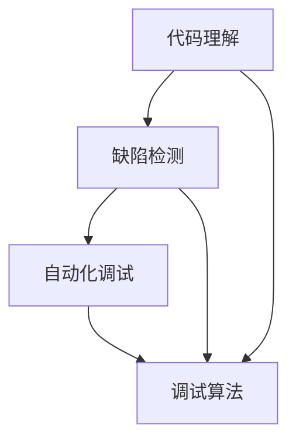

                 

### 《大模型驱动的智能调试系统》

在当今快速发展的科技时代，软件系统的复杂性不断攀升，传统的调试方法已经难以满足现代软件工程的需求。大模型（如深度学习模型）的出现，为解决这一难题提供了新的可能性。本文将探讨大模型驱动的智能调试系统，包括其背景、应用原理、核心技术、实现和评估方法，以及其在实际项目中的应用。

### 关键词

- 大模型
- 智能调试
- 软件工程
- 深度学习
- 代码分析
- 自动化调试

### 摘要

本文旨在探讨大模型在智能调试系统中的应用，通过结合大模型的技术优势，解决现代软件系统调试中的复杂性问题。本文首先介绍大模型的发展历程和智能调试系统的需求，然后深入探讨大模型在代码分析、自动化调试和智能调试算法中的应用原理。接着，本文将详细介绍大模型驱动的智能调试系统实现、部署和评估方法，并分享实际项目中的应用案例。通过本文的阅读，读者将全面了解大模型驱动的智能调试系统的原理和应用，为未来软件工程的调试领域提供新的思路和解决方案。

### 第一部分：大模型驱动的智能调试系统概述

#### 第1章：大模型与智能调试系统的背景

##### 1.1 大模型的发展历程

大模型（如深度学习模型）的发展可以追溯到20世纪40年代。当时，香农提出了信息论，为后续的机器学习研究奠定了基础。1956年，达特茅斯会议标志着人工智能学科的正式诞生。在随后的几十年中，机器学习经历了多次起伏，但始终保持着发展势头。特别是在2012年，AlexNet在ImageNet图像识别挑战赛中取得了突破性成绩，深度学习开始受到广泛关注。

大模型的定义可以理解为具有大量参数和神经元的大型神经网络。这些模型在处理复杂数据时表现出色，能够通过学习数据中的规律来执行各种任务，如图像识别、自然语言处理和语音识别等。大模型的发展经历了从简单的多层感知机（MLP）到深度神经网络（DNN），再到更为复杂的变体，如卷积神经网络（CNN）、循环神经网络（RNN）和生成对抗网络（GAN）等。

##### 1.2 智能调试系统的需求

现代软件系统的复杂性日益增加，软件工程师面临着前所未有的挑战。传统的调试方法往往依赖于手动分析和调试，效率低下，且容易出现错误。智能调试系统应运而生，旨在通过自动化和智能化的手段提高调试效率和质量。

智能调试系统的需求主要包括以下几个方面：

1. **代码复杂性**：现代软件系统通常包含大量的代码模块和依赖关系，使得代码的复杂性大幅增加。传统的调试方法难以应对这种复杂性，而智能调试系统能够通过分析代码结构和数据流来识别潜在的问题。

2. **自动化**：自动化是智能调试系统的核心优势之一。通过自动化生成调试脚本和执行调试任务，智能调试系统可以大大减少开发人员的工作量，提高调试效率。

3. **效率**：智能调试系统可以在短时间内完成大规模代码的调试工作，从而提高整个开发流程的效率。

4. **准确性**：智能调试系统通过深度学习算法和代码分析技术，可以更准确地识别代码中的缺陷，从而提高调试的准确性。

##### 1.3 大模型驱动的智能调试系统概述

大模型驱动的智能调试系统是一种利用大模型技术进行代码分析和调试的系统。它主要包括以下几个关键模块：

1. **代码理解模块**：通过大模型对代码进行语义理解，识别代码中的变量、函数、类等元素，并建立它们之间的关系。

2. **缺陷检测模块**：利用大模型对代码进行缺陷检测，识别潜在的缺陷模式，并预测代码中可能出现的错误。

3. **自动化调试模块**：通过生成自动化调试脚本，自动化执行调试任务，并根据调试结果进行优化。

4. **调试算法模块**：利用大模型设计高效的调试算法，提高调试效率和质量。

大模型驱动的智能调试系统架构如下图所示：

### 第二部分：大模型在智能调试中的应用原理

#### 第2章：大模型在智能调试中的应用原理

##### 2.1 大模型的机器学习原理

大模型在智能调试系统中的应用基于机器学习的基本原理。机器学习是指通过训练算法从数据中学习规律，以实现特定任务的方法。大模型，特别是深度学习模型，通过大量的数据训练来学习复杂的特征表示和模式。

1. **神经网络基础**：神经网络是机器学习的基础，由多个神经元（节点）组成，每个神经元接受多个输入，通过权重进行加权求和，然后通过激活函数产生输出。

2. **深度学习算法**：深度学习是神经网络的一种扩展，通过增加网络的层数（即深度）来学习更复杂的特征。常见的深度学习算法包括卷积神经网络（CNN）、循环神经网络（RNN）和生成对抗网络（GAN）等。

##### 2.2 大模型在代码分析中的应用

大模型在代码分析中的应用主要包括以下几个方面：

1. **代码理解**：通过大模型对代码进行语义理解，识别代码中的变量、函数、类等元素，并建立它们之间的关系。这有助于自动化生成代码文档和调试脚本。

2. **代码缺陷检测**：利用大模型对代码进行分析，识别潜在的缺陷模式，如语法错误、逻辑错误和资源泄露等。通过学习大量代码数据，大模型可以预测代码中可能出现的错误。

3. **代码优化**：大模型还可以对代码进行优化，通过分析代码结构和执行路径，提出改进建议，以提高代码的性能和可维护性。

##### 2.3 大模型在调试中的优势

大模型在调试中具有以下优势：

1. **自动化**：大模型可以自动化生成调试脚本和执行调试任务，减少人工干预，提高调试效率。

2. **高效性**：大模型通过学习大量的代码数据，可以快速识别潜在的缺陷，提高调试的准确性。

3. **可扩展性**：大模型可以轻松地应用于不同类型和规模的代码，具有很好的可扩展性。

4. **智能化**：大模型可以根据历史数据和上下文信息，智能地调整调试策略，提高调试的效率和效果。

### 第三部分：大模型驱动的智能调试系统核心技术

#### 第3章：大模型驱动的代码理解与推理

##### 3.1 代码理解的挑战

代码理解的挑战主要包括以下几个方面：

1. **代码复杂性**：现代软件系统通常包含大量的代码模块和复杂的依赖关系，使得代码的复杂性大幅增加。

2. **变量和函数的作用域**：变量和函数的作用域是代码理解的重要方面，但在大型代码库中，它们的作用域可能非常难以追踪和理解。

3. **多态性**：多态性是面向对象编程的重要特性，但在代码理解中，需要正确识别和处理多态性，以确保代码的语义正确。

##### 3.2 大模型在代码理解中的应用

大模型在代码理解中的应用主要包括以下几个方面：

1. **嵌入式表示**：大模型可以将代码转换为嵌入式表示，这些表示可以捕捉代码的语义信息，如变量、函数和类的定义和作用域。

2. **上下文推理**：大模型可以通过上下文推理来理解代码的执行路径和上下文，从而更准确地解析代码。

3. **代码解析**：大模型可以利用其强大的学习能力和模式识别能力，自动解析复杂的代码结构，提取关键信息和依赖关系。

##### 3.3 大模型在代码缺陷检测中的应用

大模型在代码缺陷检测中的应用主要包括以下几个方面：

1. **缺陷模式识别**：大模型可以通过学习大量代码数据中的缺陷模式，自动识别代码中的潜在缺陷。

2. **缺陷预测**：大模型可以根据代码的嵌入式表示和上下文信息，预测代码中可能出现的缺陷。

3. **缺陷分类**：大模型可以将代码中的缺陷进行分类，如语法错误、逻辑错误和资源泄露等，以便更有效地进行修复。

### 第4章：大模型驱动的自动化调试

##### 4.1 自动化调试的原理

自动化调试是指通过自动化工具和算法，自动执行调试任务，分析代码执行过程，并定位问题。自动化调试的基本原理包括以下几个方面：

1. **调试策略**：调试策略是指调试过程中采用的方法和步骤，包括设置断点、单步执行、查看变量和执行调试命令等。

2. **调试路径生成**：调试路径生成是指根据调试目标和代码结构，自动生成调试的执行路径。这有助于快速定位问题和优化调试过程。

3. **调试结果分析**：调试结果分析是指对调试过程中的输出结果进行分析，识别问题并生成修复建议。

##### 4.2 大模型在自动化调试中的应用

大模型在自动化调试中的应用主要包括以下几个方面：

1. **调试脚本生成**：大模型可以根据代码的嵌入式表示和上下文信息，自动生成调试脚本，简化调试过程。

2. **调试结果分析**：大模型可以分析调试过程中的输出结果，识别问题并生成修复建议，提高调试的准确性。

3. **调试效率优化**：大模型可以通过学习大量代码数据和调试经验，优化调试过程，减少调试时间。

##### 4.3 大模型在调试效率提升中的作用

大模型在调试效率提升中的作用主要包括以下几个方面：

1. **调试时间优化**：大模型可以通过自动化生成调试脚本和优化调试路径，减少调试时间。

2. **调试路径优化**：大模型可以根据历史数据和上下文信息，智能地调整调试路径，提高调试的效率。

3. **问题定位优化**：大模型可以通过模式识别和上下文推理，快速定位问题，提高调试的准确性。

### 第5章：大模型驱动的智能调试算法

##### 5.1 大模型调试算法的设计

大模型调试算法的设计主要包括以下几个方面：

1. **算法框架**：大模型调试算法的框架包括代码理解、缺陷检测、自动化调试和调试结果分析等模块。

2. **算法评估**：算法评估是通过实验和性能指标来评估大模型调试算法的性能和效果。常见的评估指标包括调试时间、调试准确性和调试效率等。

##### 5.2 大模型调试算法的优化

大模型调试算法的优化主要包括以下几个方面：

1. **计算效率**：通过优化算法的计算过程，减少计算时间和资源消耗。

2. **内存占用**：通过优化数据结构和算法，减少内存占用，提高系统的运行效率。

3. **模型训练**：通过调整模型的结构和参数，优化模型在代码理解和缺陷检测方面的性能。

##### 5.3 大模型调试算法的案例分析

大模型调试算法的案例分析主要包括以下几个方面：

1. **案例一：Web应用调试**：分析大模型调试算法在Web应用调试中的应用，包括代码理解、缺陷检测和自动化调试等方面。

2. **案例二：移动应用调试**：分析大模型调试算法在移动应用调试中的应用，包括代码理解、缺陷检测和自动化调试等方面。

### 第6章：大模型驱动的跨平台调试

##### 6.1 跨平台调试的挑战

跨平台调试是指在不同操作系统或硬件平台上进行调试。跨平台调试的挑战主要包括以下几个方面：

1. **不同平台的特点**：不同平台（如Windows、Linux、iOS和Android等）具有不同的运行环境和特性，使得跨平台调试变得更加复杂。

2. **调试工具的兼容性**：跨平台调试需要使用兼容的调试工具，这些工具在不同平台上可能存在差异，增加了调试的难度。

3. **代码结构的不一致性**：不同平台上的代码结构可能存在差异，如文件组织、命名规范和编译选项等，这给跨平台调试带来了一定的困难。

##### 6.2 大模型在跨平台调试中的应用

大模型在跨平台调试中的应用主要包括以下几个方面：

1. **跨平台代码分析**：大模型可以分析不同平台上的代码，识别其共性和差异，从而实现跨平台的代码理解。

2. **跨平台调试策略**：大模型可以根据不同平台的特点，设计适合的跨平台调试策略，提高调试的效率和效果。

##### 6.3 大模型驱动的跨平台调试案例

大模型驱动的跨平台调试案例主要包括以下几个方面：

1. **案例一：iOS与Android的跨平台调试**：分析大模型在iOS和Android平台上的调试应用，包括代码理解、缺陷检测和自动化调试等方面。

2. **案例二：Web与移动应用的跨平台调试**：分析大模型在Web应用和移动应用上的调试应用，包括代码理解、缺陷检测和自动化调试等方面。

### 第7章：大模型驱动的智能调试系统实现

##### 7.1 系统需求分析

系统需求分析是智能调试系统实现的第一步，主要包括以下几个方面：

1. **功能需求**：明确系统需要实现的功能，如代码理解、缺陷检测、自动化调试和调试结果分析等。

2. **性能需求**：确定系统的性能指标，如调试时间、调试准确性和调试效率等。

3. **用户需求**：了解用户的需求和使用场景，确保系统满足用户的需求。

##### 7.2 系统设计

系统设计是根据需求分析的结果，设计系统的整体架构和模块。智能调试系统的设计主要包括以下几个方面：

1. **系统架构**：设计系统的整体架构，包括前端、后端和数据存储等部分。

2. **模块划分**：将系统划分为多个模块，如代码理解模块、缺陷检测模块、自动化调试模块和调试结果分析模块等。

3. **接口设计**：设计系统内部的接口，确保模块之间能够有效通信。

##### 7.3 系统开发

系统开发是按照设计文档进行编码和实现的过程。智能调试系统的开发主要包括以下几个方面：

1. **开发工具与环境**：选择合适的开发工具和开发环境，如Python、TensorFlow和Eclipse等。

2. **开发流程**：遵循规范的开发流程，如需求分析、设计、编码、测试和部署等。

3. **代码管理**：使用代码管理工具，如Git，进行代码的版本控制和协同开发。

### 第8章：大模型驱动的智能调试系统部署

##### 8.1 部署策略

部署策略是指将智能调试系统部署到生产环境的过程。部署策略主要包括以下几个方面：

1. **部署模式**：选择合适的部署模式，如本地部署、云部署或混合部署等。

2. **部署流程**：制定详细的部署流程，包括环境准备、系统安装、配置和测试等步骤。

3. **部署前准备**：在部署前，进行充分的准备工作，如准备必要的硬件和软件资源、配置网络和数据库等。

##### 8.2 部署实践

部署实践是指将智能调试系统部署到实际环境的过程。部署实践主要包括以下几个方面：

1. **部署前准备**：进行系统环境准备，确保所有依赖项和配置项都已准备就绪。

2. **部署过程**：按照部署流程，逐步进行系统安装、配置和测试。

3. **部署后验证**：在部署后，对系统进行验证，确保系统正常运行并满足性能要求。

##### 8.3 部署后监控与维护

部署后监控与维护是指对智能调试系统进行监控和维护的过程。部署后监控与维护主要包括以下几个方面：

1. **监控策略**：制定监控策略，对系统性能、安全性和稳定性进行监控。

2. **维护措施**：定期对系统进行维护，包括更新软件版本、修复漏洞和优化性能等。

3. **故障处理**：在系统发生故障时，及时进行故障处理，确保系统恢复正常运行。

### 第9章：大模型驱动的智能调试系统评估与优化

##### 9.1 评估指标

评估指标是用于评估智能调试系统性能和效果的标准。常见的评估指标包括以下几个方面：

1. **调试效率**：衡量系统完成调试任务所需的时间，时间越短，效率越高。

2. **调试准确性**：衡量系统识别缺陷的准确性，准确率越高，效果越好。

3. **调试覆盖率**：衡量系统调试的范围，覆盖率越高，调试的全面性越好。

4. **用户满意度**：衡量用户对系统的满意度，满意度越高，系统越受欢迎。

##### 9.2 评估方法

评估方法是进行系统评估的过程和方法。常见的评估方法包括以下几个方面：

1. **实验设计**：设计实验来模拟实际调试场景，收集数据和结果。

2. **数据收集**：收集实验数据，包括调试时间、调试准确性和调试覆盖率等。

3. **结果分析**：对实验数据进行分析，评估系统的性能和效果。

##### 9.3 系统优化

系统优化是提高智能调试系统性能和效果的过程。系统优化主要包括以下几个方面：

1. **算法优化**：优化大模型和调试算法，提高调试效率和准确性。

2. **性能优化**：优化系统的性能，包括计算效率、内存占用和网络延迟等。

3. **用户体验优化**：优化用户界面和交互设计，提高用户体验。

### 附录

#### 附录A：大模型驱动的智能调试系统工具与资源

大模型驱动的智能调试系统开发和使用需要一系列工具和资源。以下是一些常用的工具和资源：

1. **大模型开发工具**：
   - TensorFlow：一个开源的深度学习框架，支持多种编程语言，包括Python和C++。
   - PyTorch：一个开源的深度学习库，提供灵活的动态计算图和强大的GPU支持。
   - JAX：一个开源的数值计算库，支持自动微分和硬件加速。

2. **智能调试系统开发工具**：
   - gdb：一个开源的调试工具，用于跟踪程序执行和调试程序。
   - Eclipse：一个开源的集成开发环境，支持多种编程语言，包括Java和C/C++。
   - Visual Studio：一个商业的集成开发环境，支持Windows平台，包括C#和C++等语言。

3. **大模型与智能调试资源**：
   - 论文：阅读相关的学术论文，了解大模型和智能调试的最新研究成果。
   - 书籍：《深度学习》（Goodfellow et al.）、《神经网络与深度学习》（邱锡鹏）等。
   - 论坛与社区：加入深度学习和智能调试相关的论坛和社区，与同行交流和学习。

### 结束语

大模型驱动的智能调试系统为现代软件工程的调试领域带来了新的机遇和挑战。通过本文的探讨，我们了解到大模型在代码理解、缺陷检测和自动化调试等方面的应用原理和优势。同时，我们也看到了大模型驱动的智能调试系统在实际项目中的应用案例和评估方法。未来，随着大模型技术的不断发展和完善，大模型驱动的智能调试系统将进一步提升软件调试的效率和准确性，为软件工程的发展做出更大的贡献。

### 作者信息

作者：AI天才研究院/AI Genius Institute & 禅与计算机程序设计艺术 /Zen And The Art of Computer Programming

[本文完] <|im_end|>

