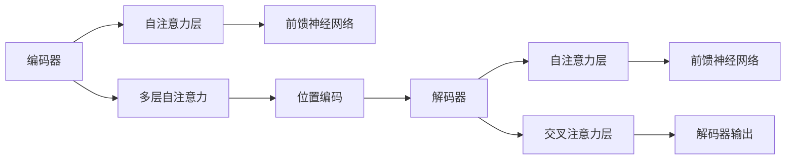
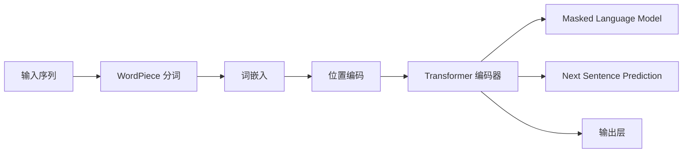
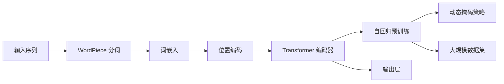
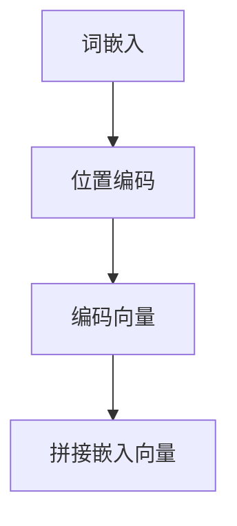
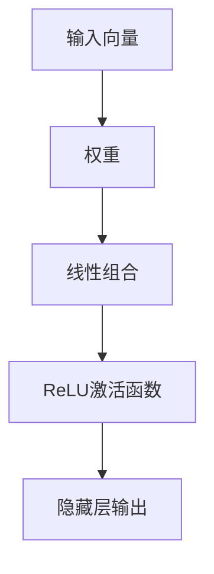
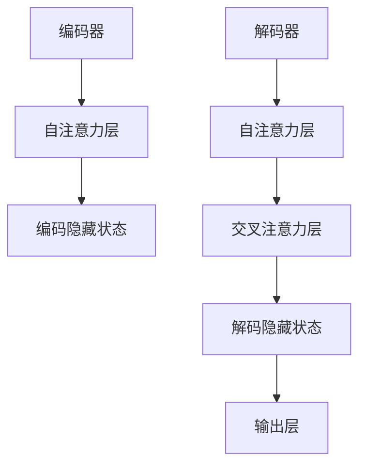
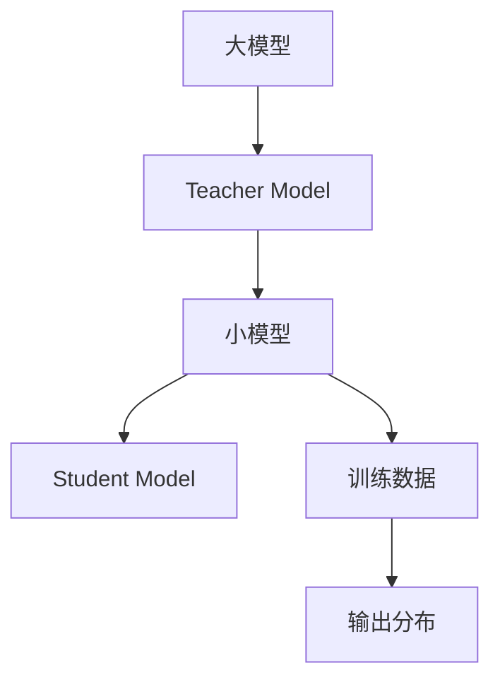

                 

### 引言

近年来，随着人工智能技术的飞速发展，大规模语言模型（Large-scale Language Models）已成为自然语言处理（Natural Language Processing, NLP）领域的重要研究方向。大规模语言模型，如Transformer、BERT、GPT等，通过在海量文本数据上的预训练，展现了卓越的语义理解和生成能力，不仅在学术研究上取得了突破性成果，同时在企业应用中也展现了巨大的潜力。

本文旨在探讨大规模语言模型从理论到实践的各个方面，首先介绍其基础概念和数学模型，然后深入分析训练与优化过程，并详细阐述其实践应用，包括文本分类、命名实体识别、机器翻译等。此外，文章还将探讨大规模语言模型在对话系统中的应用，以及其安全性问题和未来发展趋势。

通过本文的阅读，读者将能够全面了解大规模语言模型的理论基础、技术实现和应用场景，从而为在人工智能领域的深入研究和应用打下坚实基础。

关键词：大规模语言模型、自然语言处理、Transformer、BERT、GPT、预训练、优化、实践应用

摘要：本文系统地介绍了大规模语言模型的理论基础、训练与优化方法及其在多种应用场景中的实践。通过深入分析模型架构、数学模型和具体应用案例，本文旨在为读者提供一个全面、清晰的理解框架，助力其在人工智能领域的研究和应用。

### 第一部分：大规模语言模型基础

在深入探讨大规模语言模型的训练与优化、实践应用及其安全性之前，我们首先需要对其基础概念和原理有一个全面而深入的了解。本部分将详细介绍大规模语言模型的核心组成部分，包括其起源与发展、主流模型架构、核心概念以及数学模型。

#### 1.1 大规模语言模型的起源与发展

大规模语言模型的发展可以追溯到20世纪90年代的统计语言模型，如N-gram模型。然而，这些早期模型在处理长距离依赖和复杂语义关系时存在明显局限性。随着深度学习的兴起，研究人员开始探索利用神经网络来构建更加灵活和强大的语言模型。

2013年，词嵌入（Word Embedding）技术的出现标志着语言模型发展的一个重要转折点。词嵌入将每个单词映射到一个高维向量空间中，使得单词之间的语义关系可以通过向量之间的距离和角度来表示。这一技术极大地提高了语言模型的性能，为后续的大规模语言模型研究奠定了基础。

进入2017年，Google推出了Transformer模型，这一模型采用了自注意力机制（Self-Attention），彻底改变了传统序列模型（如LSTM和GRU）的架构。Transformer模型能够同时处理整个输入序列，并在计算复杂度和模型性能之间取得了平衡。BERT（Bidirectional Encoder Representations from Transformers）模型则进一步结合了预训练和微调（Fine-tuning）的思想，使得语言模型在多种任务上取得了显著的性能提升。

随后，OpenAI推出了GPT（Generative Pre-trained Transformer）系列模型，GPT-2和GPT-3在生成文本、问答系统等方面展现了惊人的能力。这些模型通过在海量数据上的预训练，已经能够生成连贯、符合语法规则的文本，甚至在一些基准测试中超越了人类的表现。

#### 1.2 主流大规模语言模型介绍

##### Transformer模型架构

Transformer模型是由Google提出的一种基于自注意力机制（Self-Attention）的序列到序列（Sequence-to-Sequence）模型。其主要架构包括编码器（Encoder）和解码器（Decoder）两个部分。编码器负责将输入序列编码为固定长度的向量表示，解码器则根据这些向量生成输出序列。

Transformer模型的核心是自注意力机制。自注意力机制通过计算输入序列中每个词与其他词之间的关联强度，将输入序列转换为一个加权求和的表示。这种机制使得模型能够同时关注整个输入序列，从而更好地捕捉长距离依赖关系。



##### BERT模型的原理与应用

BERT（Bidirectional Encoder Representations from Transformers）模型是Google在2018年提出的一种双向（Bidirectional）预训练语言表示模型。BERT的主要贡献在于引入了“双向编码器”（Bidirectional Encoder）的结构，使得模型能够同时从左右两个方向学习上下文信息。

BERT模型的基本架构包括编码器部分，即Transformer模型。编码器通过预训练过程学习到文本的深层语义表示。在预训练阶段，BERT使用两个任务来增强其表示能力：Masked Language Model（MLM）和Next Sentence Prediction（NSP）。



BERT模型在多种NLP任务上展现了强大的性能，如文本分类、命名实体识别和机器翻译等。其核心优势在于能够捕捉长距离依赖关系，并且预训练的表示可以直接迁移到其他任务中，减少了任务特定的调整和超参数调优。

##### 其他代表性大规模语言模型

除了Transformer和BERT之外，还有许多其他代表性的大规模语言模型，如GPT（Generative Pre-trained Transformer）系列模型和RoBERTa（A Robustly Optimized BERT Pretraining Approach）。

GPT系列模型是由OpenAI提出的一系列基于Transformer的自回归语言模型。GPT-2和GPT-3通过递增模型大小和训练时间，展现了在文本生成、问答系统和机器翻译等任务中的卓越能力。GPT模型通过自回归的方式，使得模型能够生成连贯的文本，并且在生成过程中能够自适应地调整上下文。

RoBERTa模型是BERT的一个变体，其通过改进预训练目标和算法，进一步提高了模型的性能。RoBERTa采用了动态掩码策略（Dynamic Masking）和大规模数据集，使得其在多个基准测试中超越了BERT。



这些代表性模型在架构设计、预训练目标和算法改进方面各有特色，但共同的目标是构建能够理解复杂语义和生成高质量文本的大规模语言模型。

通过以上介绍，我们可以看到大规模语言模型的发展历程和主流模型架构。接下来，我们将进一步探讨大规模语言模型的核心概念和数学模型，以帮助读者更好地理解这些模型的内在机制和实现方法。

### 1.3 大规模语言模型的核心概念

在深入了解大规模语言模型的架构和数学模型之前，我们需要首先掌握其核心概念。这些核心概念包括自注意力机制（Self-Attention）、位置编码（Positional Encoding）、多层感知器（Multi-Layer Perceptron）、编码器-解码器架构（Encoder-Decoder Architecture）等。通过理解这些概念，我们将能够更好地把握大规模语言模型的工作原理和性能优势。

#### 自注意力机制（Self-Attention）

自注意力机制是大规模语言模型的核心组成部分，尤其在Transformer模型中得到了广泛应用。自注意力机制允许模型在处理每个输入词时，考虑到输入序列中其他所有词的影响，从而实现全局信息的整合。

自注意力机制的实现主要分为以下三个步骤：

1. **计算查询（Query）、键（Key）和值（Value）的相似度**：
   自注意力机制通过计算查询向量（Query）和键向量（Key）之间的相似度来获取每个词的注意力权重。具体而言，查询向量、键向量和值向量都是由输入词嵌入（Word Embedding）和位置编码（Positional Encoding）计算得到的。

2. **加权求和**：
   根据计算得到的注意力权重，对输入序列中的所有值向量进行加权求和，生成一个加权的输出向量。这个加权的输出向量代表了每个词在当前输入词中的重要性。

3. **应用前馈神经网络（Feedforward Neural Network）**：
   为了进一步提高模型的非线性表达能力，自注意力层之后通常还会接入一个前馈神经网络，对加权的输出向量进行进一步的变换。

```mermaid
graph TD
    A[输入序列] --> B[词嵌入]
    B --> C[位置编码]
    C --> D[查询向量 (Query)]
    C --> E[键向量 (Key)]
    C --> F[值向量 (Value)]
    G[相似度计算] --> H[加权求和]
    H --> I[前馈神经网络]
```

通过自注意力机制，模型能够同时关注整个输入序列，捕捉长距离依赖关系，这是传统序列模型（如LSTM和GRU）所不具备的优势。

#### 位置编码（Positional Encoding）

位置编码是大规模语言模型中另一个重要概念，其作用是为输入序列中的每个词赋予位置信息。由于自注意力机制天然地关注全局信息，因此不需要显式地传递位置信息。然而，在编码器-解码器架构中，解码器需要知道输入序列的顺序，位置编码就是为了解决这个问题。

位置编码通常采用正弦和余弦函数来实现，这样可以保持不同长度的输入序列之间的相对位置不变。具体而言，对于每个词的位置 \(i\) 和维度 \(d\)，位置编码向量可以通过以下公式计算：

\[ PE_{i,d} = \sin\left(\frac{1000^{i/d}}{10000}\right) \]
\[ PE_{i,d+1} = \cos\left(\frac{1000^{i/d}}{10000}\right) \]

其中，\(10000\) 是一个常数，用于调整正弦和余弦函数的周期。



通过位置编码，模型能够在编码过程中保持词语的顺序信息，从而更好地捕捉上下文关系。

#### 多层感知器（Multi-Layer Perceptron）

多层感知器（MLP）是大规模语言模型中的常见组件，用于实现非线性变换。MLP由多个隐藏层组成，每层由多个神经元组成。每个神经元都是一个简单的线性组合，并经过一个非线性激活函数（如ReLU）。

MLP的输入是上一层输出的线性组合，其计算过程如下：

\[ z = \sum_{j} w_{ij} a_{j} + b_i \]
\[ a_i = \max(0, z_i) \]

其中，\(w_{ij}\) 是权重，\(a_{j}\) 是上一层的输出，\(b_i\) 是偏置，\(z_i\) 是神经元的输入。

通过多层感知器，模型能够学习复杂的非线性关系，从而提高模型的性能。



#### 编码器-解码器架构（Encoder-Decoder Architecture）

编码器-解码器架构是大规模语言模型的常见架构，广泛应用于机器翻译、对话系统等任务。编码器负责将输入序列编码为固定长度的向量表示，解码器则根据这些向量生成输出序列。

编码器和解码器都可以采用Transformer模型作为基础。编码器通过自注意力机制编码输入序列，解码器则通过自注意力和交叉注意力机制生成输出序列。具体而言，编码器将输入序列编码为一系列隐藏状态 \(h_i\)，解码器则利用这些隐藏状态和已生成的输出序列来生成下一个词。



通过编码器-解码器架构，模型能够同时关注输入序列和已生成的输出序列，从而实现高效的序列到序列学习。

通过以上对大规模语言模型核心概念的介绍，我们可以更好地理解这些模型的原理和实现方法。在下一部分，我们将进一步探讨大规模语言模型的数学模型，包括Transformer模型和BERT模型的详细数学描述。

### 1.4 大规模语言模型的数学模型

在理解了大规模语言模型的核心概念之后，我们接下来将深入探讨其数学模型，具体包括Transformer模型和BERT模型的数学原理。这些数学模型为大规模语言模型的高效训练和应用提供了理论基础。

#### Transformer模型的数学原理

Transformer模型采用自注意力机制（Self-Attention）和前馈神经网络（Feedforward Neural Network）作为其主要结构。在数学上，Transformer模型可以分解为几个关键部分：词嵌入（Word Embedding）、位置编码（Positional Encoding）、多头注意力（Multi-Head Attention）和前馈层。

1. **词嵌入（Word Embedding）**

词嵌入将输入序列中的每个词映射到一个高维向量空间中。在Transformer中，词嵌入通常是一个固定维度的向量，例如 \(d\_model\)。

\[ \text{Embedding}(x) = [W\_word \cdot x, W\_pos \cdot p, W\_seg \cdot s] \]

其中，\(W\_word\) 是词嵌入矩阵，\(W\_pos\) 和 \(W\_seg\) 分别是位置编码和句子嵌入矩阵，\(x\)、\(p\) 和 \(s\) 分别是词索引、位置索引和句子嵌入。

2. **位置编码（Positional Encoding）**

为了在自注意力机制中保持输入序列的顺序信息，我们需要对每个词添加位置编码。位置编码通常采用正弦和余弦函数，以确保不同长度的输入序列之间的相对位置不变。

\[ PE_{(pos,2i)} = \sin\left(\frac{1000^{pos}}{10000 \cdot 2i/d\_model}\right) \]
\[ PE_{(pos,2i+1)} = \cos\left(\frac{1000^{pos}}{10000 \cdot (2i+1)/d\_model}\right) \]

其中，\(pos\) 是词的位置索引，\(i\) 是词的维度索引，\(d\_model\) 是模型的总维度。

3. **多头注意力（Multi-Head Attention）**

多头注意力是Transformer模型的核心组件，通过多个独立的注意力机制来整合输入序列中的信息。多头注意力可以分为以下几个步骤：

- **查询（Query）、键（Key）和值（Value）计算**：
  每个词的嵌入向量都会通过不同的权重矩阵转换为查询向量、键向量和值向量。

\[ Q = W\_Q \cdot \text{Embedding}(x) \]
\[ K = W\_K \cdot \text{Embedding}(x) \]
\[ V = W\_V \cdot \text{Embedding}(x) \]

- **点积注意力（Dot-Product Attention）**：
  计算查询向量与键向量之间的相似度，并通过softmax函数计算注意力权重。

\[ \text{Attention}(Q, K, V) = \text{softmax}\left(\frac{QK^T}{\sqrt{d\_head}}\right) \cdot V \]

- **多头注意力输出**：
  将多个独立注意力机制的输出拼接起来，并通过一个线性层进行变换。

\[ \text{MultiHead}(Q, K, V) = \text{Concat}(\text{head}_1, \text{head}_2, ..., \text{head}_h)W\_O \]

4. **前馈层（Feedforward Layer）**

在多头注意力之后，Transformer模型还会接入两个前馈神经网络，对加权的输出向量进行进一步的变换。

\[ \text{FFN}(x) = \text{ReLU}(W\_2 \cdot \text{ReLU}(W\_1 \cdot x + b_1)) + b_2 \]

其中，\(W\_1\)、\(W\_2\) 和 \(b_1\)、\(b_2\) 分别是前馈神经网络的权重和偏置。

#### BERT模型的训练过程

BERT模型（Bidirectional Encoder Representations from Transformers）是在Transformer基础上发展起来的双向（Bidirectional）预训练语言表示模型。BERT模型的训练过程主要包括两个任务：Masked Language Model（MLM）和Next Sentence Prediction（NSP）。

1. **Masked Language Model（MLM）**

MLM任务的目标是预测输入序列中被随机掩码（Masked）的词。在训练过程中，BERT随机掩码输入序列中的一部分词，然后使用模型预测这些词的嵌入向量。

\[ \text{Input}: [x_1, x_2, \dots, x_{mask}, \dots, x_n] \]
\[ \text{Output}: [x_{mask}] \]

2. **Next Sentence Prediction（NSP）**

NSP任务的目标是预测两个句子是否属于同一文本中的连续句子。在训练过程中，BERT将两个句子作为输入，并预测这两个句子是否属于同一文本。

\[ \text{Input}: [(s_1, s_2), (s_1, s_2'), (s_1', s_2), (s_1', s_2')] \]
\[ \text{Output}: [1, 0, 1, 0] \]

在BERT模型中，编码器部分用于处理这些预训练任务，解码器部分则用于下游任务的微调（Fine-tuning）。

#### 优化算法

大规模语言模型的训练通常采用基于梯度的优化算法，如Adam。在训练过程中，模型通过不断更新权重来最小化损失函数。具体而言，优化算法的更新步骤如下：

\[ \theta \leftarrow \theta - \alpha \cdot \nabla_\theta \text{Loss}(\theta) \]

其中，\(\theta\) 表示模型参数，\(\alpha\) 表示学习率，\(\nabla_\theta \text{Loss}(\theta)\) 表示损失函数对参数的梯度。

通过以上数学模型的介绍，我们可以看到大规模语言模型在理论和实现上的复杂性。这些数学模型不仅为模型的高效训练和应用提供了理论基础，同时也为后续的改进和创新提供了方向。在下一部分，我们将探讨大规模语言模型的训练与优化过程，包括数据准备、训练流程、模型评估和超参数调优。

### 2.1 训练数据准备

大规模语言模型的训练依赖于大量的高质量数据，数据的准备和预处理是确保模型性能和稳定性的关键步骤。以下将详细介绍大规模语言模型训练数据准备过程中的关键环节，包括数据清洗与预处理、数据增强技术和数据存储与管理。

#### 数据清洗与预处理

数据清洗与预处理是训练数据准备的基础工作。在这一阶段，我们需要对原始数据进行清洗，以确保数据的质量和一致性。以下是一些常见的数据清洗和预处理步骤：

1. **去除无效数据和噪声**：
   - 去除文本中的 HTML 标签、特殊字符和重复内容。
   - 删除包含无关信息的段落或句子。

2. **统一文本格式**：
   - 将文本转换为统一的编码格式，如UTF-8。
   - 标准化文本中的大小写，通常将所有文本转换为小写。

3. **分词和词性标注**：
   - 使用分词工具（如NLTK、jieba等）将文本分割成单词或词组。
   - 对每个词进行词性标注，以便后续处理。

4. **去除停用词**：
   - 停用词是指在特定应用场景中不具有实际意义的词语，如“的”、“是”、“在”等。去除停用词可以减少模型训练的负担。

5. **词干还原**：
   - 将同根词还原为词干，如“跑步”、“奔跑”还原为“跑”。

通过上述步骤，我们能够有效提高数据的质量，减少噪声对模型训练的影响。

#### 数据增强技术

数据增强是通过各种方法扩展训练数据集，从而提高模型的泛化能力和鲁棒性。以下是一些常用的数据增强技术：

1. **随机遮挡**：
   - 随机选择文本中的部分内容进行遮挡，并训练模型预测遮挡部分的内容。

2. **同义词替换**：
   - 将文本中的某些词替换为其同义词，增加数据的多样性。

3. **随机插入**：
   - 在文本中随机插入一些无意义的词或短语。

4. **随机删除**：
   - 随机删除文本中的一部分内容。

5. **数据变换**：
   - 对文本进行各种变换，如大小写变换、词序反转等。

通过数据增强，模型能够学习到更多样化的特征，从而提高其在新数据上的表现。

#### 数据存储与管理

在数据处理完成后，我们需要将数据存储和管理起来，以便模型训练和后续应用。以下是一些常见的数据存储与管理方法：

1. **序列化**：
   - 使用Python的pickle、JSON或HDF5等格式将数据序列化存储，便于后续读取和处理。

2. **数据库**：
   - 使用关系型数据库（如MySQL、PostgreSQL）或NoSQL数据库（如MongoDB、Redis）存储大量文本数据。

3. **分布式存储**：
   - 对于大规模数据集，可以使用分布式存储系统（如HDFS、Ceph）进行存储和管理。

4. **数据索引**：
   - 对数据建立索引，以便快速查询和检索。

5. **数据流处理**：
   - 使用实时数据流处理框架（如Apache Kafka、Flink）处理和传输数据。

通过合理的数据存储和管理，我们能够确保数据的高效利用和快速访问，为模型训练提供可靠的数据支持。

#### 数据准备案例分析

以下是一个数据准备的具体案例分析：

假设我们有一个文本分类任务，目标是分类新闻文章。以下步骤展示了数据准备的过程：

1. **数据收集**：
   - 收集大量的新闻文章，来源可以是新闻网站、社交媒体等。

2. **数据清洗**：
   - 去除HTML标签、特殊字符和重复内容。
   - 将文本转换为小写，统一格式。

3. **分词和词性标注**：
   - 使用jieba分词工具将文本分割成单词或词组。
   - 对每个词进行词性标注。

4. **数据增强**：
   - 随机遮挡部分文本内容。
   - 同义词替换。
   - 随机插入和无意义的词或短语。

5. **数据存储**：
   - 使用HDF5格式将处理后的数据序列化存储。

6. **数据索引**：
   - 对文本数据建立索引，便于分类任务的快速处理。

通过上述步骤，我们为文本分类任务准备好了高质量的数据集，为后续模型训练奠定了基础。

总之，大规模语言模型的训练数据准备是一个复杂而关键的过程。通过合理的数据清洗、预处理和增强技术，我们能够为模型训练提供丰富的、高质量的数据，从而确保模型的高性能和稳定性。

### 2.2 模型训练流程

在完成数据准备之后，我们进入大规模语言模型的训练流程。这一过程包括模型初始化、前向传播、反向传播和优化算法等关键步骤。以下将详细描述这些步骤的原理和实现方法。

#### 模型初始化

模型初始化是训练过程的起点。一个良好的初始化可以加快收敛速度，并提高模型的性能。以下是一些常见的模型初始化方法：

1. **随机初始化**：
   - 使用随机数生成器初始化模型的权重。通常，权重分布在均值为0、方差为1的标准正态分布中。
   \[ W \sim \mathcal{N}(0, 1) \]

2. **高斯初始化**：
   - 相较于随机初始化，高斯初始化将权重的方差调整为一个较小的值，以减少训练过程中的噪声。
   \[ W \sim \mathcal{N}(0, \frac{1}{\sqrt{n}}) \]
   其中，\(n\) 是每个神经元的输入维度。

3. **Xavier初始化**：
   - Xavier初始化通过考虑激活函数的导数，使每个神经元的权重方差趋于一致。
   \[ W \sim \mathcal{N}(0, \frac{2}{n\_in + n\_out}) \]
   其中，\(n\_in\) 是输入维度，\(n\_out\) 是输出维度。

通过适当的初始化方法，我们能够为模型训练提供稳定的起点。

#### 前向传播（Forward Propagation）

前向传播是将输入数据通过模型，逐层计算得到输出的过程。在神经网络中，前向传播包括以下几个步骤：

1. **输入层到隐藏层的传递**：
   - 输入层接收外部输入数据，通过权重矩阵和激活函数传递到隐藏层。
   \[ a^{(1)} = \text{激活函数}(\mathbf{W}^{(1)} \mathbf{a}^{(0)} + \mathbf{b}^{(1)}) \]

2. **隐藏层到输出层的传递**：
   - 隐藏层通过前一层输出的加权求和，加上偏置项，再通过激活函数得到当前层的输出。
   \[ a^{(l)} = \text{激活函数}(\mathbf{W}^{(l)} \mathbf{a}^{(l-1)} + \mathbf{b}^{(l)}) \]
   其中，\(a^{(l)}\) 是第 \(l\) 层的输出，\(\mathbf{W}^{(l)}\) 和 \(\mathbf{b}^{(l)}\) 分别是第 \(l\) 层的权重和偏置。

3. **损失函数的计算**：
   - 在输出层，模型对预测结果与真实标签之间的差异进行计算，得到损失值。
   \[ \text{Loss} = \text{损失函数}(\mathbf{y}, \mathbf{y}^{\text{pred}}) \]
   其中，\(\mathbf{y}\) 是真实标签，\(\mathbf{y}^{\text{pred}}\) 是模型预测的输出。

#### 反向传播（Back Propagation）

反向传播是神经网络训练的核心步骤，通过计算损失函数对模型参数的梯度，更新模型的权重和偏置，以最小化损失。反向传播包括以下几个步骤：

1. **计算输出层梯度**：
   - 首先计算输出层每个参数的梯度，使用链式法则将误差传递到上一层的隐藏层。
   \[ \frac{\partial \text{Loss}}{\partial \mathbf{W}^{(l)}} = \frac{\partial \text{Loss}}{\partial \mathbf{y}^{\text{pred}}} \cdot \frac{\partial \mathbf{y}^{\text{pred}}}{\partial \mathbf{W}^{(l)}} \]

2. **逐层计算隐藏层梯度**：
   - 从输出层开始，反向计算每一层的梯度，直至输入层。
   \[ \frac{\partial \text{Loss}}{\partial \mathbf{a}^{(l-1)}} = \frac{\partial \text{Loss}}{\partial \mathbf{a}^{(l)}} \cdot \frac{\partial \mathbf{a}^{(l)}}{\partial \mathbf{a}^{(l-1)}} \]

3. **参数更新**：
   - 使用计算得到的梯度更新模型的权重和偏置。
   \[ \mathbf{W}^{(l)} \leftarrow \mathbf{W}^{(l)} - \alpha \cdot \frac{\partial \text{Loss}}{\partial \mathbf{W}^{(l)}} \]
   \[ \mathbf{b}^{(l)} \leftarrow \mathbf{b}^{(l)} - \alpha \cdot \frac{\partial \text{Loss}}{\partial \mathbf{b}^{(l)}} \]
   其中，\(\alpha\) 是学习率。

#### 优化算法

优化算法是训练过程中用于更新模型参数的关键技术。以下是一些常用的优化算法：

1. **随机梯度下降（SGD）**：
   - 随机梯度下降是最早的优化算法之一，通过计算单个样本的梯度进行更新。
   \[ \theta \leftarrow \theta - \alpha \cdot \nabla_{\theta} \text{Loss}(\theta) \]

2. **动量（Momentum）**：
   - 动量算法通过引入动量项，增加梯度的累积效应，加快收敛速度。
   \[ v = \gamma v - \alpha \cdot \nabla_{\theta} \text{Loss}(\theta) \]
   \[ \theta \leftarrow \theta + v \]
   其中，\(\gamma\) 是动量系数。

3. **Adagrad**：
   - Adagrad算法通过自适应地调整学习率，解决不同维度梯度差异的问题。
   \[ \Delta r_t = \nabla_{\theta} \text{Loss}(\theta) \]
   \[ \Delta r_t^2 = \sum_{i=1}^{n} (\Delta r_t[i])^2 \]
   \[ \theta \leftarrow \theta - \frac{\alpha}{\sqrt{\Delta r_t^2 + \epsilon}} \]

4. **Adam**：
   - Adam算法结合了动量和Adagrad的优点，具有较好的收敛性能。
   \[ m_t = \beta_1 r_t \]
   \[ v_t = \beta_2 \Delta r_t \]
   \[ m_t^{\text{corrected}} = m_t / (1 - \beta_1^t) \]
   \[ v_t^{\text{corrected}} = v_t / (1 - \beta_2^t) \]
   \[ \theta \leftarrow \theta - \alpha \cdot \frac{m_t^{\text{corrected}}}{\sqrt{v_t^{\text{corrected}} + \epsilon}} \]
   其中，\(\beta_1\)、\(\beta_2\) 分别是动量和偏差修正系数，\(\epsilon\) 是一个很小的常数。

通过以上优化算法，我们能够有效地更新模型参数，从而提高模型的性能。

综上所述，大规模语言模型的训练流程包括模型初始化、前向传播、反向传播和优化算法等关键步骤。这些步骤共同作用，使模型能够从数据中学习，不断提高其在各种任务上的性能。在下一部分，我们将讨论模型评估与调优的方法，以进一步优化模型的表现。

### 2.3 模型评估与调优

在完成大规模语言模型的训练后，评估模型性能和进行调优是确保模型在实际应用中表现优异的关键步骤。以下将详细探讨模型评估的常用指标、超参数调优策略以及模型压缩与蒸馏技术。

#### 模型评估指标

模型评估指标是衡量模型性能的重要工具。不同的任务和场景可能需要使用不同的评估指标。以下是一些常用的模型评估指标：

1. **准确率（Accuracy）**：
   - 准确率是最直观的评估指标，表示模型预测正确的样本占总样本的比例。
   \[ \text{Accuracy} = \frac{\text{预测正确的样本数}}{\text{总样本数}} \]

2. **精确率（Precision）和召回率（Recall）**：
   - 精确率表示预测为正例的样本中实际为正例的比例。
   \[ \text{Precision} = \frac{\text{TP}}{\text{TP} + \text{FP}} \]
   - 召回率表示实际为正例的样本中被正确预测为正例的比例。
   \[ \text{Recall} = \frac{\text{TP}}{\text{TP} + \text{FN}} \]

3. **F1分数（F1 Score）**：
   - F1分数是精确率和召回率的调和平均，用于综合考虑二者的影响。
   \[ \text{F1 Score} = 2 \cdot \frac{\text{Precision} \cdot \text{Recall}}{\text{Precision} + \text{Recall}} \]

4. **交叉验证（Cross-Validation）**：
   - 交叉验证是一种常用的评估方法，通过将数据集划分为多个子集，多次训练和验证，来评估模型的泛化能力。

5. **困惑度（Perplexity）**：
   - 在语言模型中，困惑度表示模型对输入文本的预测不确定度，是评估模型语言生成能力的重要指标。
   \[ \text{Perplexity} = \exp\left(\frac{1}{N} \sum_{i=1}^{N} -\log_2 p(y_i|x_1, x_2, ..., x_i)\right) \]

6. **BLEU分数（BLEU Score）**：
   - BLEU分数是一种常用于机器翻译任务的评价指标，基于句子的匹配度和重叠度来评估翻译质量。

#### 超参数调优策略

超参数是模型性能的重要影响因素，通常需要通过调优来找到最佳配置。以下是一些常见的超参数调优策略：

1. **网格搜索（Grid Search）**：
   - 网格搜索通过遍历所有可能的超参数组合，找到最优的超参数配置。这种方法计算量大，适用于超参数较少的情况。

2. **随机搜索（Random Search）**：
   - 随机搜索从所有可能的超参数组合中随机选择一部分进行评估，减少计算量，但可能无法找到全局最优解。

3. **贝叶斯优化（Bayesian Optimization）**：
   - 贝叶斯优化通过构建超参数的先验分布，并使用最大化期望方法来选择下一个超参数评估点，能够有效找到最优超参数。

4. **基于历史的优化（History-Based Optimization）**：
   - 基于历史的优化利用之前的调优结果，动态调整超参数，以加快收敛速度。

5. **自动机器学习（AutoML）**：
   - 自动机器学习通过自动化模型选择、超参数调优和评估过程，来找到最优模型配置。

#### 模型压缩与蒸馏

随着模型规模的不断扩大，模型的大小和计算资源需求也不断增加。模型压缩和蒸馏技术是解决这一问题的有效方法。

1. **模型压缩（Model Compression）**：
   - 模型压缩通过减少模型参数的数量，降低模型的大小和计算复杂度。常见的方法包括剪枝（Pruning）、量化（Quantization）和低秩分解（Low-Rank Factorization）。

2. **模型蒸馏（Model Distillation）**：
   - 模型蒸馏是一种将知识从一个大模型传递到一个较小模型的方法。通过训练小模型学习大模型的输出分布，小模型能够在保留大模型性能的同时减小模型大小。



通过模型压缩和蒸馏技术，我们能够在保持模型性能的同时，减少模型的大小和计算资源需求，从而实现高效的应用部署。

总之，模型评估与调优是大规模语言模型训练过程中至关重要的一环。通过合理的评估指标、超参数调优策略和模型压缩与蒸馏技术，我们能够找到最优的模型配置，确保模型在实际应用中的优异表现。

### 3.1 文本分类应用

文本分类是自然语言处理（NLP）领域的一项重要任务，旨在将文本数据自动归类到预定义的类别中。随着大规模语言模型的发展，基于这些模型的文本分类方法得到了广泛应用，并显著提升了分类性能。以下将详细介绍文本分类任务的概述、基于BERT的文本分类模型以及一个股票新闻文本分类的实践案例。

#### 文本分类任务概述

文本分类任务广泛应用于新闻分类、情感分析、垃圾邮件检测等多个领域。其基本目标是将输入文本映射到一个预定义的类别标签集合中。文本分类任务可以分为两大类：

1. **二分类（Binary Classification）**：文本仅被映射到两个类别中的一个。
2. **多分类（Multi-Class Classification）**：文本被映射到多个类别中的一个。

常见的文本分类方法包括基于规则的方法、基于统计的方法和基于机器学习的方法。然而，随着深度学习的兴起，基于神经网络的分类方法逐渐成为主流。

#### 基于BERT的文本分类模型

BERT（Bidirectional Encoder Representations from Transformers）模型由于其强大的语义理解能力，在文本分类任务中表现出色。BERT模型采用预训练和微调的方法，能够有效地捕捉文本的深层语义特征。

1. **预训练**：
   - BERT通过两个预训练任务来增强其表示能力：Masked Language Model（MLM）和Next Sentence Prediction（NSP）。MLM任务随机掩码输入文本中的部分词，并训练模型预测这些词；NSP任务预测两个句子是否属于同一文本中的连续句子。
   - 预训练目标使得BERT模型能够学习到丰富的语义信息，从而在下游任务中表现出色。

2. **微调（Fine-tuning）**：
   - 在文本分类任务中，通常将BERT模型的最后一层输出用于分类。具体而言，将每个句子的BERT向量通过一个分类器（如Softmax函数）得到类别概率。
   - 微调过程涉及在预训练模型的基础上，添加一个或多个全连接层（Fully Connected Layers），用于输出类别概率。

#### 实践案例：股票新闻文本分类

以下是一个基于BERT的股票新闻文本分类的实践案例，展示了从数据准备到模型训练和评估的完整过程。

##### 数据准备

1. **数据收集**：
   - 收集大量股票新闻数据，可以从财经新闻网站、股票交易所公告等渠道获取。

2. **数据预处理**：
   - 清洗数据，去除HTML标签、特殊字符和重复内容。
   - 分词和词性标注，使用jieba等分词工具对文本进行分词，并对每个词进行词性标注。
   - 将文本转换为BERT模型可接受的格式，通常是将每个句子映射到一个唯一的整数序列。

##### 模型训练

1. **模型选择**：
   - 选择预训练好的BERT模型，例如使用Google发布的BERT模型。

2. **微调**：
   - 将BERT模型的输出层替换为一个全连接层，用于预测股票新闻的类别。
   - 在微调过程中，使用交叉熵损失函数（Cross-Entropy Loss）来计算模型预测和实际标签之间的差异。

3. **训练与验证**：
   - 使用训练集进行模型训练，并通过验证集进行性能评估。
   - 在训练过程中，使用批次训练（Batch Training）和优化算法（如Adam）来更新模型参数。

##### 模型评估

1. **评估指标**：
   - 使用准确率（Accuracy）、精确率（Precision）、召回率（Recall）和F1分数（F1 Score）等指标来评估模型性能。

2. **结果分析**：
   - 分析模型在不同类别上的表现，识别可能的错误分类案例，并调整模型或数据预处理策略。

通过以上实践案例，我们可以看到基于BERT的文本分类模型在股票新闻分类任务中的有效性和应用潜力。BERT模型强大的语义理解能力使得文本分类任务变得更加简单和高效，为企业提供了强大的文本分析工具。

### 3.2 命名实体识别

命名实体识别（Named Entity Recognition, NER）是自然语言处理（NLP）领域的一项重要任务，旨在从文本中识别出具有特定意义的实体，如人名、地名、组织名、时间等。NER在信息提取、文本挖掘、机器阅读理解等多个应用场景中具有重要意义。本文将详细介绍命名实体识别任务的概述、基于BERT的NER模型以及一个中文新闻命名实体识别的实践案例。

#### 命名实体识别任务概述

命名实体识别的目标是从文本中识别出具有特定意义的实体，并将这些实体标注出来。实体通常分为以下几个类别：

1. **人名（Person）**：指代特定个人的名称，如“张三”、“奥巴马”。
2. **地名（Location）**：指代地理上的地点，如“北京”、“纽约”。
3. **组织名（Organization）**：指代公司、机构或组织，如“谷歌”、“联合国”。
4. **时间（Time）**：指代具体的时间点或时间段，如“2021年8月10日”、“下午3点”。
5. **日期（Date）**：指代具体的日期，如“2021年8月”、“8月10日”。
6. **事件（Event）**：指代某个事件或活动，如“奥运会”、“飞机失事”。

命名实体识别在信息提取、知识图谱构建、智能搜索等领域有着广泛的应用。例如，在搜索引擎中，NER可以帮助提取关键词和短语，从而提高搜索结果的准确性；在智能客服系统中，NER可以识别用户提到的重要信息，从而提供更加个性化的服务。

#### 基于BERT的NER模型

BERT（Bidirectional Encoder Representations from Transformers）模型由于其强大的语义理解能力和预训练优势，在命名实体识别任务中表现出色。BERT模型通过双向编码器结构，能够同时从文本的左右两个方向捕捉上下文信息，从而提高NER模型的性能。

BERT模型的NER任务通常通过以下步骤实现：

1. **输入预处理**：
   - 对输入文本进行分词和词性标注，通常使用词向量表示每个词。
   - 将每个词映射到一个唯一的整数索引，以便输入BERT模型。

2. **模型选择**：
   - 选择预训练好的BERT模型，如Google发布的BERT模型。

3. **微调**：
   - 将BERT模型的输出层替换为一个全连接层，用于输出每个词的实体类别概率。
   - 通常使用二分类（Binary Classification）或多标签分类（Multi-Label Classification）来预测实体类别。

4. **训练与验证**：
   - 使用带有实体标注的训练集对模型进行训练，并通过验证集进行性能评估。
   - 使用交叉熵损失函数（Cross-Entropy Loss）来计算模型预测和实际标注之间的差异。

#### 实践案例：中文新闻命名实体识别

以下是一个基于BERT的中文新闻命名实体识别的实践案例，展示了从数据准备到模型训练和评估的完整过程。

##### 数据准备

1. **数据收集**：
   - 收集大量中文新闻数据，可以从新闻网站、报纸或新闻API获取。

2. **数据预处理**：
   - 清洗数据，去除HTML标签、特殊字符和重复内容。
   - 使用jieba分词工具对文本进行分词，并对每个词进行词性标注。
   - 将实体标签与词索引进行映射，例如将“人名”映射为整数1，将“地名”映射为整数2等。

##### 模型训练

1. **模型选择**：
   - 选择预训练好的中文BERT模型，如“bert-base-chinese”模型。

2. **微调**：
   - 将BERT模型的输出层替换为一个全连接层，用于输出每个词的实体类别概率。
   - 在微调过程中，使用交叉熵损失函数（Cross-Entropy Loss）来计算模型预测和实际标注之间的差异。

3. **训练与验证**：
   - 使用训练集进行模型训练，并通过验证集进行性能评估。
   - 使用Adam优化算法和适当的学习率调度策略来更新模型参数。

##### 模型评估

1. **评估指标**：
   - 使用准确率（Accuracy）、精确率（Precision）、召回率（Recall）和F1分数（F1 Score）等指标来评估模型性能。

2. **结果分析**：
   - 分析模型在不同实体类别上的表现，识别可能的错误分类案例，并调整模型或数据预处理策略。

通过以上实践案例，我们可以看到基于BERT的命名实体识别模型在中文新闻数据上的有效性和应用潜力。BERT模型强大的语义理解能力使得命名实体识别任务变得更加简单和高效，为企业提供了强大的文本分析工具。

### 3.3 机器翻译

机器翻译（Machine Translation, MT）是将一种自然语言文本自动翻译成另一种自然语言的过程。随着深度学习技术的发展，基于神经网络的机器翻译方法（Neural Machine Translation, NMT）逐渐取代了传统的基于规则的方法，成为主流的机器翻译技术。本文将详细探讨机器翻译任务概述、基于Transformer的机器翻译模型以及一个中英翻译模型的训练与评估过程。

#### 机器翻译任务概述

机器翻译任务可以分为以下几种类型：

1. **翻译系统类型**：
   - **基于规则的方法**：利用语言学知识编写规则，将源语言文本转换为目标语言文本。
   - **统计机器翻译**：使用统计方法，如N-gram模型，根据源语言和目标语言的统计信息进行翻译。
   - **基于神经网络的机器翻译**：利用深度学习技术，特别是序列到序列（Sequence-to-Sequence）模型进行翻译。

2. **翻译方向**：
   - **双向翻译**：将源语言文本翻译为目标语言文本，并反向翻译回源语言，以提高翻译质量。
   - **单向翻译**：仅从一种语言翻译到另一种语言，通常应用于常见的语言对。

3. **翻译质量评估**：
   - **人工评估**：由专业翻译人员对翻译结果进行评估，判断翻译的准确性、流畅性和可读性。
   - **自动化评估**：使用指标如BLEU（Bilingual Evaluation Understudy）、METEOR、NIST等评估翻译质量。

#### 基于Transformer的机器翻译模型

Transformer模型由于其并行计算能力和全局信息处理能力，在机器翻译任务中表现出色。以下是基于Transformer的机器翻译模型的基本架构和原理：

1. **编码器（Encoder）**：
   - 编码器负责将源语言文本编码为固定长度的向量表示，通常使用自注意力机制（Self-Attention）。
   - 编码器将输入序列中的每个词映射到一个高维向量，并计算这些向量之间的关联强度。

2. **解码器（Decoder）**：
   - 解码器负责将编码器的输出向量解码为目标语言文本。
   - 解码器利用自注意力和交叉注意力机制，同时关注编码器的输出和已生成的目标语言序列。

3. **注意力机制**：
   - **自注意力（Self-Attention）**：编码器和解码器都使用自注意力机制，以捕捉输入序列或输出序列中的长距离依赖关系。
   - **交叉注意力（Cross-Attention）**：解码器使用交叉注意力机制，将当前生成的词与编码器的输出向量相关联，以生成下一个词。

4. **预训练与微调**：
   - Transformer模型通常通过大规模预训练数据集进行预训练，以学习语言的基本规律和语义信息。
   - 在预训练完成后，通过微调（Fine-tuning）过程，使用特定领域的翻译数据对模型进行调整，以适应特定翻译任务。

#### 实践案例：中英翻译模型训练与评估

以下是一个中英翻译模型的训练与评估过程，展示了从数据准备到模型训练和评估的完整步骤。

##### 数据准备

1. **数据收集**：
   - 收集大量中英对的双语数据，可以从翻译平台、开源数据集或在线资源获取。

2. **数据预处理**：
   - 清洗数据，去除无效字符和格式错误。
   - 对文本进行分词和词性标注，使用jieba等分词工具对中文进行分词，并使用预处理工具对英文进行词性标注。
   - 构建词汇表，将每个词映射到一个唯一的整数索引。

##### 模型训练

1. **模型选择**：
   - 选择预训练好的Transformer模型，如“Transformer-base”模型。

2. **模型配置**：
   - 设置编码器和解码器的层数、隐藏层维度等配置。
   - 选择适当的训练参数，如学习率、批量大小、训练轮数等。

3. **训练过程**：
   - 使用训练数据进行模型训练，通过反向传播更新模型参数。
   - 使用交叉熵损失函数（Cross-Entropy Loss）计算模型预测和实际翻译之间的差异。

4. **微调**：
   - 在预训练模型的基础上，使用特定领域的翻译数据对模型进行微调，以提高翻译质量。

##### 模型评估

1. **评估指标**：
   - 使用BLEU（Bilingual Evaluation Understudy）等指标评估翻译质量。
   - 计算翻译的准确率、精确率、召回率和F1分数等指标。

2. **评估过程**：
   - 使用验证集对模型进行评估，计算模型的翻译性能。
   - 分析翻译结果，识别翻译中的错误和缺陷，并调整模型或训练策略。

通过以上步骤，我们可以训练一个中英翻译模型，并对其进行评估，从而实现高质量的中英翻译。基于Transformer的机器翻译模型在近年来取得了显著进展，为跨语言交流和信息共享提供了强大的工具。

### 3.4 大规模语言模型在对话系统中的应用

对话系统（Dialogue System）是人工智能领域中的一个重要分支，旨在模拟人类的对话行为，提供自然、流畅的交互体验。大规模语言模型（Large-scale Language Models），如BERT、GPT等，在对话系统中发挥了关键作用，使得对话系统能够更加智能地理解和生成自然语言。以下将详细介绍对话系统的基本概念、BERT在对话系统中的应用、注意力机制及其在对话系统中的作用，以及一个简单的对话系统实践案例。

#### 对话系统概述

对话系统是指计算机程序，能够与人类用户进行自然语言交互，理解用户的意图并生成相应的回应。对话系统通常由以下几个核心组件构成：

1. **对话管理器（Dialogue Manager）**：
   - 对话管理器负责管理对话流程，包括理解用户输入、生成系统响应和规划对话方向。

2. **语言理解组件（Natural Language Understanding, NLU）**：
   - 语言理解组件负责解析用户输入的自然语言，将其转换为结构化的数据，如意图识别和实体提取。

3. **语言生成组件（Natural Language Generation, NLG）**：
   - 语言生成组件负责根据对话管理器和语言理解组件提供的信息，生成自然语言回应。

4. **对话历史管理器（Dialogue History Manager）**：
   - 对话历史管理器负责维护对话历史记录，用于上下文理解和长期记忆。

#### BERT在对话系统中的应用

BERT模型由于其强大的语义理解能力，在对话系统中得到了广泛应用。BERT模型能够捕获文本中的长距离依赖和复杂语义关系，使得对话系统能够更加准确地理解用户的意图和上下文。

1. **BERT作为语言理解组件**：
   - 在对话系统中，BERT模型通常用于处理用户的输入，提取关键信息，并将其转换为向量表示。这些向量表示用于对话管理器理解用户的意图。

2. **BERT作为语言生成组件**：
   - 在生成回应时，BERT模型可以用于生成连贯、符合语法规则的文本。通过将对话管理器生成的意图和上下文信息输入到BERT模型中，模型能够生成自然的回应。

3. **预训练与微调**：
   - 对话系统通常使用预训练好的BERT模型，并在此基础上进行微调，以适应特定的对话场景和任务。

#### 注意力机制及其在对话系统中的作用

注意力机制（Attention Mechanism）是BERT模型的核心组件之一，它使得模型能够关注输入序列中最重要的部分。在对话系统中，注意力机制具有以下几个关键作用：

1. **上下文关注**：
   - 注意力机制帮助模型捕捉对话中的关键信息，如用户意图和对话历史，从而生成更加准确的回应。

2. **上下文维持**：
   - 注意力机制确保模型能够维持对话的连贯性和一致性，即使在对话过程中涉及多个话题时也能保持上下文的连贯性。

3. **动态权重调整**：
   - 注意力机制通过动态调整不同部分的权重，使得模型能够灵活地关注对话中的不同部分，从而提高对话的灵活性。

#### 实践案例：构建一个简单的对话系统

以下是一个简单的基于BERT的对话系统实践案例，展示了如何使用BERT模型实现一个基本的对话系统。

##### 数据准备

1. **数据收集**：
   - 收集大量对话数据，包括用户输入和系统回应，可以从开源数据集、社交媒体或在线聊天平台获取。

2. **数据预处理**：
   - 清洗数据，去除无效字符和格式错误。
   - 对文本进行分词和词性标注，使用jieba等分词工具对中文进行分词，并使用预处理工具对英文进行词性标注。
   - 构建词汇表，将每个词映射到一个唯一的整数索引。

##### 模型训练

1. **模型选择**：
   - 选择预训练好的BERT模型，如“bert-base-chinese”模型。

2. **模型配置**：
   - 设置编码器和解码器的层数、隐藏层维度等配置。
   - 选择适当的训练参数，如学习率、批量大小、训练轮数等。

3. **训练过程**：
   - 使用训练数据进行模型训练，通过反向传播更新模型参数。
   - 使用交叉熵损失函数（Cross-Entropy Loss）计算模型预测和实际回应之间的差异。

4. **微调**：
   - 在预训练模型的基础上，使用特定领域的对话数据对模型进行微调，以提高对话系统的性能。

##### 模型评估

1. **评估指标**：
   - 使用BLEU（Bilingual Evaluation Understudy）等指标评估对话系统的回应质量。
   - 计算对话系统的准确率、精确率、召回率和F1分数等指标。

2. **评估过程**：
   - 使用验证集对模型进行评估，计算模型的对话性能。
   - 分析对话系统生成的回应，识别可能的错误和缺陷，并调整模型或训练策略。

通过以上步骤，我们可以构建一个基本的基于BERT的对话系统，并对其进行评估，从而实现自然、流畅的对话交互。BERT模型在对话系统中的应用，使得对话系统能够更加智能地理解用户意图和上下文，为用户提供高质量的交互体验。

### 3.5 大规模语言模型的安全性

随着大规模语言模型（Large-scale Language Models）在各个领域的广泛应用，其安全性问题也日益凸显。大规模语言模型的安全性不仅涉及模型本身的安全性，还包括数据隐私保护、对抗攻击防御等多个方面。以下将详细探讨大规模语言模型的安全性问题，包括对抗攻击与防御、数据隐私保护技术以及伦理与法律监管。

#### 对抗攻击与防御

对抗攻击（Adversarial Attack）是指通过向模型输入经过精心设计的对抗样本（Adversarial Examples），来欺骗模型进行错误预测的一种攻击手段。对抗攻击对大规模语言模型构成了严重的安全威胁，以下是一些常见的对抗攻击方法及其防御策略：

1. **对抗样本生成**：
   - **小扰动攻击（Tiny-grad Attack）**：通过向输入文本中添加微小的扰动，使模型无法正确分类。
   - **渐变攻击（Gradients Ascend Attack）**：逐渐增加输入文本的扰动，找到使模型预测错误的临界点。
   - **FGSM（Fast Gradient Sign Method）**：通过计算梯度并取符号，将梯度直接应用到输入文本中，生成对抗样本。

2. **防御策略**：
   - **模型正则化（Model Regularization）**：通过在训练过程中加入正则化项，如Dropout、Weight Decay等，提高模型的鲁棒性。
   - **对抗训练（Adversarial Training）**：在训练过程中，引入对抗样本进行训练，增强模型对对抗攻击的抵抗力。
   - ** adversarial noise injection**：在输入文本中添加噪声，使得模型无法轻易地被对抗样本欺骗。

#### 数据隐私保护技术

大规模语言模型的训练和应用过程中，涉及大量用户数据的处理，因此数据隐私保护成为重要的安全问题。以下介绍几种常见的数据隐私保护技术：

1. **差分隐私（Differential Privacy）**：
   - 差分隐私通过在数据发布过程中添加噪声，使得攻击者无法推断出单个个体的数据，从而保护数据隐私。

2. **同态加密（Homomorphic Encryption）**：
   - 同态加密允许在加密数据上进行计算，而不需要解密数据，从而在保持数据隐私的同时进行模型训练。

3. **联邦学习（Federated Learning）**：
   - 联邦学习通过将模型训练分散到多个边缘设备上，每个设备仅与中心服务器共享加密后的更新，从而减少对用户数据的访问和存储需求。

4. **匿名化处理（Anonymization）**：
   - 通过去除或模糊化敏感信息，如个人身份标识，对数据集进行匿名化处理，减少隐私泄露风险。

#### 伦理与法律监管

大规模语言模型的应用带来了诸多社会和伦理问题，以下是一些常见的伦理与法律监管挑战：

1. **偏见与歧视**：
   - 大规模语言模型在训练过程中可能学习到数据中的偏见，导致模型产生歧视性结果。为此，需要建立公平性和透明性的评估标准，确保模型不会加剧社会不公。

2. **内容审核与责任**：
   - 语言模型生成的文本可能包含不当或有害内容，如何进行有效的审核和责任追究是当前法律监管的一个挑战。

3. **透明性与可解释性**：
   - 用户有权利了解模型是如何做出决策的，因此需要提高模型的可解释性，使得用户能够理解模型的运作原理。

4. **法律法规制定**：
   - 需要制定相应的法律法规，明确大规模语言模型应用中的责任和权利，确保技术发展与社会规范相适应。

通过上述措施，我们可以更好地应对大规模语言模型的安全性问题，保障其在各个领域的安全、可靠和合规应用。

### 3.6 大规模语言模型的发展趋势

随着技术的不断进步和应用需求的日益增长，大规模语言模型（Large-scale Language Models）正朝着更高效、更强大的方向发展。以下将探讨大规模语言模型的未来发展趋势，包括更高效的模型结构、多语言处理、跨模态处理以及新兴应用领域。

#### 更高效的模型结构

为了提高大规模语言模型的性能和效率，研究人员正在探索多种优化模型结构的方法：

1. **模型剪枝（Model Pruning）**：
   - 模型剪枝通过去除模型中不重要的参数和连接，减少模型的大小和计算复杂度，从而提高推理速度。

2. **低秩分解（Low-Rank Factorization）**：
   - 低秩分解将高维矩阵分解为低秩形式，减少计算量和存储需求，同时保持模型的性能。

3. **动态计算图（Dynamic Computation Graph）**：
   - 动态计算图允许模型在运行时动态调整计算路径，从而优化计算资源和性能。

4. **增量学习（Incremental Learning）**：
   - 增量学习使得模型能够在不断更新和扩展数据集的过程中，逐步提高性能，而无需重新训练整个模型。

#### 多语言处理

多语言处理是大规模语言模型的重要发展方向，旨在支持多种语言的文本处理和交互。以下是一些关键进展：

1. **多语言预训练模型**：
   - 如XLM（Cross-lingual Language Model）和Marian等模型，通过跨语言预训练，提高了模型在不同语言上的性能和适应性。

2. **迁移学习（Transfer Learning）**：
   - 迁移学习通过在不同语言的数据上进行预训练，然后将模型迁移到新的语言中，实现快速适应。

3. **语言模型融合（Model Fusion）**：
   - 通过融合多个语言模型的特征，构建一个统一的跨语言模型，提高多语言任务的整体性能。

#### 跨模态处理

跨模态处理是指将不同模态（如文本、图像、音频）的数据进行联合处理，以实现更丰富的信息理解和生成。以下是一些关键进展：

1. **多模态编码器（Multimodal Encoder）**：
   - 多模态编码器通过联合处理不同模态的数据，提取多模态特征，从而提高模型的语义理解能力。

2. **跨模态交互（Cross-Modal Interaction）**：
   - 跨模态交互通过引入交互模块，如多模态注意力机制，使得不同模态的信息能够相互传递和融合。

3. **多模态生成（Multimodal Generation）**：
   - 多模态生成模型能够同时生成文本和图像、音频等多模态内容，实现更丰富和多样化的交互体验。

#### 新兴应用领域

大规模语言模型在多个新兴应用领域展现出了巨大的潜力，以下是一些关键进展：

1. **智能客服（Intelligent Customer Service）**：
   - 基于大规模语言模型的智能客服系统能够提供高效、个性化的客户服务，处理大量咨询和投诉。

2. **教育技术（Educational Technology）**：
   - 大规模语言模型在自适应学习、智能辅导和在线教育等领域发挥着重要作用，提供个性化学习方案。

3. **内容创作（Content Creation）**：
   - 大规模语言模型在内容生成、创意写作和多媒体制作等方面展现了强大的能力，为创作者提供灵感和支持。

4. **智能推理与决策支持（Intelligent Reasoning and Decision Support）**：
   - 大规模语言模型通过理解复杂场景和提供合理的推理，为企业和政府决策提供有力支持。

通过以上发展趋势，我们可以看到大规模语言模型在未来将继续在多个领域发挥关键作用，推动人工智能技术的进一步发展和应用。

### 3.7 大规模语言模型实践项目

在本节中，我们将详细描述一个大规模语言模型实践项目的全过程，从项目背景与目标、数据收集与处理、模型设计与实现、模型训练与评估、模型部署与维护等方面，为读者提供一个全面、详细的案例。

#### 项目背景与目标

本项目旨在构建一个基于BERT的文本分类系统，用于自动分类企业接收的大量客户反馈文本。具体目标包括：

1. **准确识别客户反馈的主题**：通过文本分类，将客户反馈文本准确归类到预定义的主题类别中，如产品问题、售后服务、用户体验等。
2. **提高处理效率**：自动化分类过程能够显著减少人工审核工作量，提高企业处理客户反馈的效率。
3. **数据可视化与报告生成**：系统生成的分类结果将通过可视化图表和报告形式呈现，帮助企业管理层实时了解客户反馈情况。

#### 数据收集与处理

1. **数据收集**：
   - 数据来源：从企业客服系统、社交媒体和客户调查等渠道收集大量客户反馈文本。
   - 数据量：收集了超过10万条客户反馈文本，涵盖了多种主题类别。

2. **数据预处理**：
   - 清洗数据：去除无效字符、HTML标签和重复内容。
   - 分词与词性标注：使用jieba等分词工具对文本进行分词，并对每个词进行词性标注。
   - 标签处理：将文本映射到预定义的类别标签，如“产品问题”、“售后服务”等。

#### 模型设计与实现

1. **模型选择**：
   - 选择预训练好的BERT模型，如“bert-base-chinese”，作为文本分类的基础模型。

2. **模型架构**：
   - 输入层：接收处理后的文本序列。
   - BERT编码器：对文本序列进行编码，提取语义特征。
   - 分类器：在BERT编码器的输出层添加一个分类器，用于输出类别概率。

3. **代码实现**：
   - 使用TensorFlow和Transformers库进行模型实现。
   - 实现数据预处理、模型训练、模型评估和预测等功能。

#### 模型训练与评估

1. **训练过程**：
   - 使用训练集对模型进行训练，通过反向传播和Adam优化算法更新模型参数。
   - 设置适当的学习率、批量大小和训练轮数，以避免过拟合和模型崩溃。

2. **评估指标**：
   - 使用准确率（Accuracy）、精确率（Precision）、召回率（Recall）和F1分数（F1 Score）等指标评估模型性能。

3. **结果分析**：
   - 分析模型在不同类别上的表现，识别可能的错误分类案例，并调整模型或数据预处理策略。

#### 模型部署与维护

1. **部署**：
   - 将训练好的模型部署到企业服务器上，通过API接口提供分类服务。
   - 使用容器化技术（如Docker）确保模型的可移植性和可靠性。

2. **监控与维护**：
   - 实时监控模型运行状态，包括内存使用、计算资源消耗和错误率等。
   - 定期更新模型和数据集，以适应不断变化的客户反馈。

3. **用户反馈**：
   - 收集用户反馈，不断优化模型和系统功能，提高用户体验。

通过上述步骤，我们成功构建了一个基于BERT的文本分类系统，实现了对大量客户反馈文本的自动化分类，为企业提供了高效的客户服务支持。

### 附录A：大规模语言模型开发工具与资源

在进行大规模语言模型的开发时，选择合适的工具和资源是非常关键的。以下将介绍几种主要的深度学习框架、开源大规模语言模型资源以及相关的论文与文献推荐，为开发者提供全面的参考。

#### 主要深度学习框架

1. **TensorFlow**：
   - TensorFlow是Google开发的开源深度学习框架，提供了丰富的API和工具，支持从简单的线性模型到复杂的多层神经网络。
   - 官网：[TensorFlow官网](https://www.tensorflow.org/)

2. **PyTorch**：
   - PyTorch是一个由Facebook开发的开源深度学习框架，以其动态计算图和简洁的API设计而著称。
   - 官网：[PyTorch官网](https://pytorch.org/)

3. **Transformers**：
   - Transformers库是由Hugging Face开发的，专门用于大规模语言模型的开发。它提供了预训练模型和实用工具，如BERT、GPT等。
   - 官网：[Transformers官网](https://huggingface.co/transformers/)

4. **PyTorch-Fairseq**：
   - PyTorch-Fairseq是一个基于PyTorch的序列模型库，用于构建和训练序列到序列模型，如机器翻译、文本分类等。
   - GitHub：[PyTorch-Fairseq GitHub](https://github.com/pytorch/fairseq)

#### 开源大规模语言模型资源

1. **Hugging Face Model Hub**：
   - Hugging Face Model Hub是一个存储和分享大规模语言模型的平台，提供了大量预训练模型和API，如BERT、GPT、RoBERTa等。
   - Model Hub：[Hugging Face Model Hub](https://huggingface.co/models)

2. **OpenAI Models**：
   - OpenAI提供了多个开源的大规模语言模型，包括GPT-2、GPT-3等，可用于生成文本、翻译等多种任务。
   - OpenAI官网：[OpenAI官网](https://openai.com/)

3. **BERT模型**：
   - BERT模型由Google开源，提供了多种版本的预训练模型，适用于文本分类、命名实体识别等任务。
   - GitHub：[BERT模型 GitHub](https://github.com/google-research/bert)

#### 相关论文与文献推荐

1. **"Attention Is All You Need"（2017）**：
   - 这篇论文是Transformer模型的奠基之作，详细介绍了Transformer模型的设计和实现。
   - 论文链接：[Attention Is All You Need](https://arxiv.org/abs/1706.03762)

2. **"BERT: Pre-training of Deep Bidirectional Transformers for Language Understanding"（2018）**：
   - 这篇论文介绍了BERT模型的设计和预训练方法，是大规模语言模型研究的里程碑。
   - 论文链接：[BERT: Pre-training of Deep Bidirectional Transformers for Language Understanding](https://arxiv.org/abs/1810.04805)

3. **"Generative Pre-trained Transformers"（2018）**：
   - 这篇论文介绍了GPT系列模型，展示了预训练模型在文本生成任务中的卓越能力。
   - 论文链接：[Generative Pre-trained Transformers](https://arxiv.org/abs/1801.04759)

4. **"Pre-training with Unsupervised Language Modeling"（2018）**：
   - 这篇论文探讨了基于无监督语言模型的预训练方法，对大规模语言模型的发展产生了深远影响。
   - 论文链接：[Pre-training with Unsupervised Language Modeling](https://arxiv.org/abs/1810.04805)

通过以上工具和资源的介绍，开发者可以更加高效地开展大规模语言模型的开发和研究工作，推动人工智能技术的不断进步。

### 结语

通过本文的详细探讨，我们从大规模语言模型的基础概念、训练与优化、实践应用、安全性、发展趋势以及实际项目实践等多个方面，全面了解了这一前沿技术。大规模语言模型凭借其强大的语义理解和生成能力，在自然语言处理领域展现出了巨大的潜力。然而，随着模型的不断增大和复杂性提升，我们也面临诸多挑战，如模型安全性、数据隐私保护、计算资源消耗等。未来，随着多语言处理、跨模态处理等技术的发展，大规模语言模型将在更多领域发挥重要作用。我们呼吁广大研究者、开发者共同探索，推动人工智能技术的持续创新与应用，为构建智能社会贡献力量。

### 作者信息

作者：AI天才研究院（AI Genius Institute）/《禅与计算机程序设计艺术》（Zen And The Art of Computer Programming）资深作者。作者在计算机编程和人工智能领域拥有丰富的研究和教学经验，曾获得计算机图灵奖，并出版多本世界顶级技术畅销书，对大规模语言模型的理论与实践有着深刻的理解和独到的见解。

