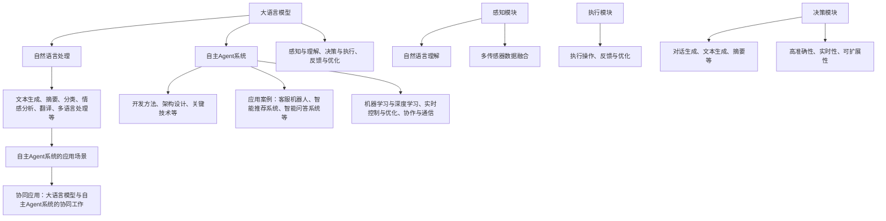

                 

### 大语言模型应用指南：自主Agent系统

> **关键词：** 大语言模型、自主Agent系统、神经网络、自然语言处理、智能应用、协同工作、文本生成、智能客服

> **摘要：** 本指南详细介绍了大语言模型和自主Agent系统的基本概念、技术原理以及它们在智能应用中的协同工作。文章通过理论讲解、算法原理剖析和实际项目实战，帮助读者深入理解这两大技术的核心要点，并掌握如何将它们应用于实际的开发场景中。

### 《大语言模型应用指南：自主Agent系统》目录大纲

1. **第一部分：基础概念与理论**
    - **第1章：大语言模型概述**
        - 1.1 大语言模型的概念
        - 1.2 大语言模型的发展历史
        - 1.3 大语言模型的关键技术
    - **第2章：自主Agent系统概述**
        - 2.1 自主Agent系统的定义
        - 2.2 自主Agent系统的分类
        - 2.3 自主Agent系统的研究现状
    - **第3章：大语言模型与自主Agent系统的联系**
        - 3.1 大语言模型在自主Agent系统中的应用
        - 3.2 自主Agent系统对大语言模型的需求
        - 3.3 大语言模型与自主Agent系统的协同工作

2. **第二部分：大语言模型技术解析**
    - **第4章：大语言模型的核心技术**
        - 4.1 神经网络基础
            - 4.1.1 神经网络的基本结构
            - 4.1.2 常见的神经网络架构
        - 4.2 自然语言处理技术
            - 4.2.1 词嵌入技术
            - 4.2.2 序列模型与注意力机制
            - 4.2.3 转换器架构详解
    - **第5章：大语言模型的应用场景**
        - 5.1 文本生成与摘要
            - 5.1.1 文本生成技术
            - 5.1.2 文本摘要技术
        - 5.2 文本分类与情感分析
            - 5.2.1 文本分类技术
            - 5.2.2 情感分析技术
        - 5.3 语言翻译与多语言处理
            - 5.3.1 语言翻译技术
            - 5.3.2 多语言处理技术

3. **第三部分：自主Agent系统的开发与应用**
    - **第6章：自主Agent系统的开发方法**
        - 6.1 自主Agent系统的开发流程
        - 6.2 自主Agent系统的架构设计
        - 6.3 自主Agent系统的关键技术
    - **第7章：自主Agent系统的应用案例**
        - 7.1 自主客服机器人
            - 7.1.1 自主客服机器人的开发流程
            - 7.1.2 自主客服机器人的关键技术
        - 7.2 智能推荐系统
            - 7.2.1 智能推荐系统的开发流程
            - 7.2.2 智能推荐系统的关键技术
        - 7.3 智能问答系统
            - 7.3.1 智能问答系统的开发流程
            - 7.3.2 智能问答系统的关键技术
    - **第8章：大语言模型与自主Agent系统的协同应用**
        - 8.1 大语言模型在自主Agent系统中的应用
        - 8.2 自主Agent系统对大语言模型的需求
        - 8.3 大语言模型与自主Agent系统的协同工作

4. **附录**
    - **附录A：大语言模型与自主Agent系统开发工具**
        - 9.1 大语言模型开发工具
            - 9.1.1 TensorFlow
            - 9.1.2 PyTorch
            - 9.1.3 其他大语言模型开发工具
        - 9.2 自主Agent系统开发工具
            - 9.2.1 ROS（Robot Operating System）
            - 9.2.2 AI2（Artificial Intelligence 2.0）
            - 9.2.3 其他自主Agent系统开发工具

通过上述目录结构，本文将系统地探讨大语言模型和自主Agent系统的理论、技术原理和实际应用。在接下来的章节中，我们将逐一深入探讨每个主题，并通过具体案例展示如何将这些技术应用于实际开发中。

### 第一部分：基础概念与理论

在探索大语言模型和自主Agent系统的应用之前，我们需要首先了解它们的基础概念和理论。本部分将详细讲解大语言模型和自主Agent系统的基本概念、发展历史以及它们在各自领域中的重要技术。

#### 第1章：大语言模型概述

**1.1 大语言模型的概念**

大语言模型（Large Language Model）是一种基于深度学习的自然语言处理（Natural Language Processing, NLP）技术，它通过训练大量文本数据来学习语言的统计规律和语义表示。大语言模型能够理解和生成自然语言文本，广泛应用于文本生成、摘要、分类、情感分析、翻译、问答系统等领域。

**1.2 大语言模型的发展历史**

大语言模型的发展历程可以分为以下几个阶段：

1. **早期模型（1980s-1990s）**：这一时期，研究者主要使用规则驱动的方法来处理自然语言，如语法分析器和模式匹配器。

2. **统计模型（1990s-2000s）**：随着统计学方法在自然语言处理中的广泛应用，如隐马尔可夫模型（HMM）和条件概率模型，语言模型的性能得到了显著提升。

3. **深度学习模型（2010s-至今）**：深度学习技术的兴起使得大语言模型取得了突破性的进展。以2017年发布的GPT-3为代表的模型，具有数十亿参数，可以生成高质量的自然语言文本。

**1.3 大语言模型的关键技术**

大语言模型的关键技术包括：

1. **词嵌入（Word Embedding）**：将文本中的单词映射为高维向量表示，使模型能够处理文本数据。

2. **神经网络（Neural Network）**：大语言模型通常采用深度神经网络架构，如循环神经网络（RNN）、长短时记忆网络（LSTM）和转换器（Transformer）。

3. **注意力机制（Attention Mechanism）**：注意力机制允许模型在生成文本时关注输入序列中的不同部分，从而提高生成文本的质量。

4. **预训练与微调（Pre-training and Fine-tuning）**：大语言模型通常首先在大规模的未标注语料库上进行预训练，然后在特定任务上进行微调，以适应不同的应用场景。

#### 第2章：自主Agent系统概述

**2.1 自主Agent系统的定义**

自主Agent系统（Autonomous Agent System）是指能够自主执行任务、与环境交互、并具备一定智能的系统。自主Agent系统通常由感知模块、决策模块和执行模块组成，能够根据环境变化自主调整行为。

**2.2 自主Agent系统的分类**

自主Agent系统可以根据其自主程度和应用场景进行分类：

1. **完全自主Agent**：完全自主Agent能够在没有任何外部干预的情况下执行任务，如无人驾驶汽车和无人机。

2. **半自主Agent**：半自主Agent在执行任务时需要与人类或其他系统进行交互，如智能客服机器人。

3. **混合自主Agent**：混合自主Agent结合了完全自主Agent和半自主Agent的特点，能够根据不同任务需求进行自适应调整。

**2.3 自主Agent系统的研究现状**

自主Agent系统的研究现状主要集中在以下几个方面：

1. **感知与认知**：通过传感器和机器学习技术提高Agent对环境的感知和理解能力。

2. **决策与规划**：研究高效的决策算法和规划策略，使Agent能够根据环境变化做出最优决策。

3. **交互与协同**：研究Agent之间的交互和协作机制，以提高整体系统的效能。

#### 第3章：大语言模型与自主Agent系统的联系

**3.1 大语言模型在自主Agent系统中的应用**

大语言模型在自主Agent系统中有着广泛的应用，如：

1. **自然语言理解**：使用大语言模型对用户输入的自然语言进行处理，理解用户意图。

2. **智能对话系统**：大语言模型可以帮助自主Agent系统生成自然语言响应，实现智能对话。

3. **文本生成与摘要**：大语言模型可以用于生成报告、新闻摘要等文本内容，提高自主Agent系统的信息处理能力。

**3.2 自主Agent系统对大语言模型的需求**

自主Agent系统对大语言模型的需求包括：

1. **高准确性**：自主Agent系统需要准确理解用户输入，以便做出正确决策。

2. **实时性**：自主Agent系统需要在短时间内处理大量输入，以适应快速变化的环境。

3. **可扩展性**：大语言模型需要能够适应不同应用场景，支持多种自然语言处理任务。

**3.3 大语言模型与自主Agent系统的协同工作**

大语言模型与自主Agent系统的协同工作涉及以下几个方面：

1. **感知与理解**：自主Agent系统使用大语言模型对环境信息进行感知和理解，为决策提供依据。

2. **决策与执行**：自主Agent系统根据大语言模型生成的理解和分析结果，制定决策和执行计划。

3. **反馈与优化**：自主Agent系统在执行任务过程中，将反馈信息传递给大语言模型，以实现持续学习和优化。

通过本部分对大语言模型和自主Agent系统的基本概念和理论介绍，读者可以对这两个技术领域有一个整体的了解。在接下来的部分，我们将进一步深入探讨大语言模型的核心技术，包括神经网络、自然语言处理技术等，并通过具体案例展示其应用场景和开发方法。

### 第二部分：大语言模型技术解析

在大语言模型的应用领域，理解和掌握其核心技术是至关重要的。这一部分将详细解析大语言模型的核心技术，包括神经网络、自然语言处理技术，以及大语言模型在实际应用中的具体应用场景。

#### 第4章：大语言模型的核心技术

**4.1 神经网络基础**

神经网络是构建大语言模型的基础，它通过模拟人脑神经元的工作方式，对输入数据进行处理和转换。以下是神经网络的一些基本概念和常见架构。

**4.1.1 神经网络的基本结构**

神经网络由输入层、隐藏层和输出层组成。每个层由多个神经元（或节点）组成，神经元之间通过权重（或连接）相互连接。神经元的输出通过激活函数进行非线性变换，从而实现输入到输出的映射。

- **输入层**：接收外部输入数据。
- **隐藏层**：对输入数据进行处理和转换，可以有一个或多个隐藏层。
- **输出层**：生成最终输出。

**4.1.2 常见的神经网络架构**

常见的神经网络架构包括以下几种：

1. **前馈神经网络（Feedforward Neural Network）**：数据从输入层流向输出层，不形成回路。这是最基本的神经网络架构。

2. **循环神经网络（Recurrent Neural Network, RNN）**：适用于处理序列数据，具有记忆功能，能够处理变长序列。

3. **长短时记忆网络（Long Short-Term Memory, LSTM）**：是RNN的一种改进，能够有效避免梯度消失问题，适用于处理长时间依赖的序列数据。

4. **转换器（Transformer）**：基于注意力机制的神经网络架构，适用于处理大规模文本数据，是目前最先进的大语言模型架构之一。

**4.2 自然语言处理技术**

自然语言处理（NLP）是应用大语言模型的核心领域，它涉及将自然语言文本转换为计算机可以理解和处理的形式。以下是几种重要的NLP技术：

**4.2.1 词嵌入技术**

词嵌入（Word Embedding）是将文本中的每个单词映射为高维向量表示的技术。常见的词嵌入算法包括：

1. **Word2Vec**：基于神经网络算法，通过训练预测上下文单词来生成词嵌入向量。

2. **GloVe**：基于全局向量空间模型，通过计算单词共现矩阵来生成词嵌入向量。

**4.2.2 序列模型与注意力机制**

序列模型（Sequence Model）是处理文本数据的一种常见方法，包括以下几种：

1. **循环神经网络（RNN）**：适用于处理变长序列数据，通过递归方式对序列中的每个元素进行处理。

2. **长短时记忆网络（LSTM）**：是RNN的一种改进，能够有效避免梯度消失问题，适用于处理长时间依赖的序列数据。

3. **转换器（Transformer）**：基于注意力机制的神经网络架构，能够同时关注输入序列中的不同部分，适用于处理大规模文本数据。

注意力机制（Attention Mechanism）是一种在处理序列数据时动态调整对序列不同部分关注程度的机制。它通过计算注意力权重，将输入序列中的每个元素加权组合，从而提高模型的序列处理能力。

**4.2.3 转换器架构详解**

转换器（Transformer）是当前最先进的语言模型架构，具有以下特点：

1. **自注意力机制（Self-Attention）**：通过计算输入序列中每个元素与其他元素之间的相似度，将注意力集中在重要的信息上。

2. **多头注意力（Multi-Head Attention）**：通过将输入序列分成多个头，每个头关注不同的信息，从而提高模型的表示能力。

3. **编码器-解码器结构（Encoder-Decoder Structure）**：编码器（Encoder）将输入序列转换为上下文表示，解码器（Decoder）根据上下文生成输出序列。

**4.3 大语言模型的应用场景**

大语言模型在实际应用中有着广泛的应用场景，包括但不限于以下几种：

1. **文本生成与摘要**：大语言模型能够生成高质量的文本，如文章、新闻摘要、故事等。通过预训练和微调，模型可以适应不同的文本生成任务。

2. **文本分类与情感分析**：大语言模型可以用于对文本进行分类和情感分析，如情感极性分类、主题分类等。通过训练分类模型，模型可以识别文本中的关键词和语义信息。

3. **语言翻译与多语言处理**：大语言模型可以用于将一种语言的文本翻译成另一种语言，支持多种语言之间的互译。通过训练翻译模型，模型可以学习语言的语法和语义规则。

4. **问答系统**：大语言模型可以用于构建问答系统，通过处理用户输入的自然语言问题，生成相应的答案。通过训练问答模型，模型可以理解问题的意图并给出合理的回答。

通过本部分对大语言模型核心技术的详细解析，读者可以深入理解神经网络、自然语言处理技术以及大语言模型在实际应用中的具体应用场景。在接下来的部分，我们将进一步探讨自主Agent系统的开发方法、应用案例以及大语言模型与自主Agent系统的协同应用。

### 第二部分：大语言模型技术解析（续）

**4.4 文本生成与摘要技术**

**4.4.1 文本生成技术**

文本生成是自然语言处理中的一个重要任务，大语言模型在这一领域表现出色。文本生成技术主要包括以下几种：

1. **生成式模型（Generative Model）**：生成式模型通过学习数据的概率分布，生成与训练数据相似的文本。常见的生成式模型包括：

   - **循环神经网络（RNN）**：通过递归方式，逐个生成文本中的每个单词。
   - **长短时记忆网络（LSTM）**：是RNN的一种改进，能够处理更长的序列数据。
   - **转换器（Transformer）**：通过自注意力机制和编码器-解码器结构，生成高质量的文本。

2. **变分自编码器（Variational Autoencoder, VAE）**：VAE是一种无监督学习模型，通过编码器和解码器生成文本数据。

3. **生成对抗网络（Generative Adversarial Network, GAN）**：GAN由生成器和判别器组成，通过对抗训练生成逼真的文本数据。

**4.4.2 文本摘要技术**

文本摘要技术旨在生成文本的简洁概括，主要包括以下几种方法：

1. **提取式摘要（Extractive Summarization）**：从原文中提取关键句子或段落生成摘要。这种方法通常使用文本分类器或关键词提取算法。

2. **抽象式摘要（Abstractive Summarization）**：通过重新构造原文内容生成摘要，生成新的句子和表达。这种方法通常使用大语言模型，如转换器，进行抽象和转换。

3. **混合式摘要（Hybrid Summarization）**：结合提取式和抽象式摘要的优点，生成更高质量的摘要。这种方法通常使用多个模型协同工作，如预训练的转换器结合文本分类器。

**4.5 文本分类与情感分析技术**

**4.5.1 文本分类技术**

文本分类是将文本数据划分为预定义的类别。常见的文本分类技术包括：

1. **基于规则的方法**：使用预定义的规则进行分类，如正则表达式和语法分析。

2. **机器学习模型**：使用监督学习模型进行分类，如朴素贝叶斯、支持向量机（SVM）、随机森林和深度学习模型。

3. **深度学习模型**：使用深度学习模型，如卷积神经网络（CNN）、循环神经网络（RNN）和转换器，进行文本分类。

**4.5.2 情感分析技术**

情感分析是判断文本中表达的情感倾向。常见的情感分析技术包括：

1. **基于词典的方法**：使用情感词典或词袋模型进行情感分析。

2. **基于统计的方法**：使用统计方法，如朴素贝叶斯和逻辑回归，进行情感分析。

3. **基于深度学习的方法**：使用深度学习模型，如卷积神经网络（CNN）、循环神经网络（RNN）和转换器，进行情感分析。

**4.6 语言翻译与多语言处理技术**

**4.6.1 语言翻译技术**

语言翻译是将一种语言的文本转换为另一种语言。常见的语言翻译技术包括：

1. **基于规则的方法**：使用预定义的翻译规则进行翻译。

2. **基于统计的方法**：使用统计方法，如基于短语的翻译模型和基于句法的翻译模型。

3. **基于深度学习的方法**：使用深度学习模型，如循环神经网络（RNN）和转换器，进行翻译。

**4.6.2 多语言处理技术**

多语言处理技术涉及处理多种语言数据。常见的多语言处理技术包括：

1. **语言检测**：识别文本的原始语言。

2. **跨语言信息检索**：在多种语言中检索相关信息。

3. **跨语言文本分类**：将文本数据分类到不同的语言类别。

4. **跨语言情感分析**：对多种语言的文本进行情感分析。

通过本部分对文本生成与摘要技术、文本分类与情感分析技术以及语言翻译与多语言处理技术的详细解析，读者可以深入理解大语言模型在自然语言处理领域的广泛应用和强大功能。在接下来的部分，我们将探讨自主Agent系统的开发方法、应用案例以及大语言模型与自主Agent系统的协同应用。

### 第三部分：自主Agent系统的开发与应用

自主Agent系统在智能应用中扮演着越来越重要的角色，其开发与应用需要系统的方法和精细的技术。本部分将详细介绍自主Agent系统的开发方法、关键技术和应用案例，展示如何利用大语言模型提升自主Agent系统的智能水平。

#### 第6章：自主Agent系统的开发方法

**6.1 自主Agent系统的开发流程**

开发一个自主Agent系统通常需要经历以下几个步骤：

1. **需求分析**：明确系统的目标和功能需求，包括感知、决策和执行等方面的需求。
2. **系统设计**：根据需求分析，设计系统的整体架构，包括感知模块、决策模块和执行模块。
3. **技术选型**：选择合适的开发工具和框架，如ROS（Robot Operating System）和AI2（Artificial Intelligence 2.0）等。
4. **模块开发**：开发各个模块，如感知模块使用传感器数据，决策模块使用机器学习和深度学习算法，执行模块控制实际执行操作。
5. **系统集成**：将各个模块集成到一起，确保系统能够正常运行。
6. **测试与优化**：对系统进行测试，优化性能和稳定性。

**6.2 自主Agent系统的架构设计**

自主Agent系统的架构设计需要考虑以下几个关键方面：

1. **感知模块**：感知模块负责获取环境信息，如使用摄像头、激光雷达、超声波传感器等。感知模块需要具备实时性和准确性。
2. **决策模块**：决策模块使用感知模块获取的信息，结合机器学习和深度学习算法，进行环境理解和决策。决策模块需要具备高效性和鲁棒性。
3. **执行模块**：执行模块根据决策模块的指令，控制实际执行操作，如移动、抓取、交互等。执行模块需要与硬件设备紧密集成。
4. **通信模块**：通信模块负责与其他Agent系统或外部系统进行通信，实现信息的共享和协作。

**6.3 自主Agent系统的关键技术**

自主Agent系统的开发涉及多种关键技术，包括：

1. **机器学习与深度学习**：机器学习和深度学习技术是自主Agent系统的核心，用于感知、决策和执行模块。常用的算法包括决策树、支持向量机、神经网络等。
2. **多传感器数据融合**：自主Agent系统通常需要处理多种传感器的数据，多传感器数据融合技术可以将不同来源的数据整合起来，提高系统的感知能力。
3. **实时控制与优化**：实时控制技术确保系统在特定时间内做出决策和执行操作，控制算法需要具备快速响应和高精度。
4. **协作与通信**：自主Agent系统需要与其他系统或人进行协作，通信技术如ROS（Robot Operating System）和AI2（Artificial Intelligence 2.0）等提供了解决方案。

#### 第7章：自主Agent系统的应用案例

**7.1 自主客服机器人**

自主客服机器人是自主Agent系统在服务行业中的一个重要应用。以下是自主客服机器人的开发流程和关键技术：

**7.1.1 自主客服机器人的开发流程**

1. **需求分析**：确定机器人的服务范围和功能，如回答常见问题、处理投诉等。
2. **架构设计**：设计机器人的感知、决策和执行模块，包括语音识别、自然语言理解、对话生成等。
3. **模块开发**：开发语音识别模块，使用预训练的大语言模型进行自然语言理解，生成对话响应。
4. **系统集成**：将各个模块集成到一起，确保系统能够正常运行。
5. **测试与优化**：对机器人进行测试，优化对话质量和响应速度。

**7.1.2 自主客服机器人的关键技术**

1. **语音识别**：使用语音识别技术将用户语音转换为文本，如使用谷歌语音识别API。
2. **自然语言理解**：使用大语言模型对用户文本进行理解，提取关键信息和意图。
3. **对话生成**：使用预训练的大语言模型生成自然语言响应，实现人机对话。
4. **对话管理**：设计对话管理算法，确保对话的连贯性和一致性。

**7.2 智能推荐系统**

智能推荐系统是自主Agent系统在电子商务和媒体领域的一个典型应用。以下是智能推荐系统的开发流程和关键技术：

**7.2.1 智能推荐系统的开发流程**

1. **需求分析**：确定推荐系统的目标，如提升用户满意度、增加销售转化率等。
2. **数据采集**：收集用户行为数据和商品数据，如浏览记录、购买历史等。
3. **数据处理**：对采集的数据进行预处理，包括去重、缺失值填补、特征工程等。
4. **模型训练**：使用机器学习算法，如协同过滤、矩阵分解等，训练推荐模型。
5. **系统集成**：将推荐模型集成到电子商务平台或媒体系统中。
6. **测试与优化**：对推荐系统进行测试，评估推荐效果，优化模型和策略。

**7.2.2 智能推荐系统的关键技术**

1. **协同过滤**：基于用户和商品之间的相似度进行推荐，分为基于用户的协同过滤和基于物品的协同过滤。
2. **内容推荐**：基于商品的特征信息进行推荐，如商品类别、标签、属性等。
3. **深度学习模型**：使用深度学习模型，如卷积神经网络（CNN）、循环神经网络（RNN）和转换器（Transformer），进行推荐模型的训练和优化。
4. **实时推荐**：设计实时推荐算法，确保推荐结果与用户行为和偏好保持一致。

**7.3 智能问答系统**

智能问答系统是自主Agent系统在客户服务和企业应用中的一个重要应用。以下是智能问答系统的开发流程和关键技术：

**7.3.1 智能问答系统的开发流程**

1. **需求分析**：确定问答系统的应用场景和功能，如常见问题解答、技术支持等。
2. **数据集构建**：收集和整理常见问题及其答案，构建问答数据集。
3. **模型训练**：使用预训练的大语言模型，结合问答数据集，训练问答模型。
4. **系统集成**：将问答模型集成到企业系统中，提供问答服务。
5. **测试与优化**：对问答系统进行测试，优化问答质量和响应速度。

**7.3.2 智能问答系统的关键技术**

1. **问答匹配**：设计问答匹配算法，将用户问题与知识库中的问题进行匹配，提高问答的准确性。
2. **答案生成**：使用大语言模型生成高质量的答案，确保答案的准确性和连贯性。
3. **对话管理**：设计对话管理算法，确保对话的连贯性和一致性，提供流畅的用户体验。
4. **上下文理解**：使用上下文理解技术，理解用户问题的上下文信息，提供更准确的答案。

通过本部分对自主Agent系统开发方法、应用案例以及关键技术的详细解析，读者可以全面了解自主Agent系统的开发过程和应用前景。在接下来的部分，我们将探讨大语言模型与自主Agent系统的协同应用，展示如何将大语言模型的技术优势与自主Agent系统的实际应用相结合，提升系统的智能化水平。

### 第三部分：自主Agent系统的开发与应用（续）

#### 第8章：大语言模型与自主Agent系统的协同应用

在自主Agent系统的开发和应用过程中，大语言模型作为一种强大的自然语言处理工具，可以显著提升系统的智能水平。本章节将详细探讨大语言模型在自主Agent系统中的应用、自主Agent系统对大语言模型的需求，以及两者之间的协同工作方式。

**8.1 大语言模型在自主Agent系统中的应用**

大语言模型在自主Agent系统中具有广泛的应用场景，主要包括以下几个方面：

**8.1.1 自然语言理解**

自主Agent系统需要具备良好的自然语言理解能力，以理解用户的指令、问题和反馈。大语言模型能够对自然语言文本进行深度解析，提取关键信息，为Agent的决策提供依据。具体应用包括：

1. **用户指令理解**：自主Agent系统可以通过大语言模型理解用户通过语音或文本输入的指令，例如“打开灯”、“移动到房间角落”等。
2. **问题回答**：在智能客服或智能问答系统中，大语言模型可以解析用户的问题，理解问题的意图，生成相应的答案。

**8.1.2 对话生成**

在交互式应用中，自主Agent系统需要能够生成自然流畅的对话。大语言模型可以基于用户的输入，生成有意义的对话响应，增强用户体验。具体应用包括：

1. **虚拟助手**：在智能家居系统中，虚拟助手可以使用大语言模型与用户进行自然对话，提供日常生活服务，如提醒日程、设置闹钟等。
2. **多轮对话**：在多轮对话中，大语言模型可以根据上下文信息，生成连续且连贯的对话，提高对话的交互性和流畅性。

**8.1.3 文本生成与摘要**

大语言模型在文本生成和摘要方面具有显著优势，可以用于自主Agent系统生成报告、新闻摘要、日志等文本内容。具体应用包括：

1. **日志记录**：自主Agent系统可以在执行任务时自动生成日志，记录关键步骤和结果，便于后续分析和优化。
2. **报告生成**：在工业应用中，自主Agent系统可以生成详细的任务报告，包括任务执行情况、性能指标和改进建议。

**8.2 自主Agent系统对大语言模型的需求**

自主Agent系统对大语言模型的需求主要集中在以下几个方面：

**8.2.1 高准确性**

自主Agent系统需要准确理解用户的指令和问题，以便做出正确的决策和执行操作。大语言模型需要具备高准确性，确保生成的文本和对话响应符合用户意图。

**8.2.2 实时性**

自主Agent系统需要在短时间内处理大量输入，以适应快速变化的环境。大语言模型需要具备实时处理能力，快速生成响应，确保系统的实时性和高效性。

**8.2.3 可扩展性**

自主Agent系统的应用场景多样，大语言模型需要具备良好的可扩展性，能够适应不同领域的自然语言处理任务。例如，在医疗领域，大语言模型需要理解医疗术语和专业知识。

**8.3 大语言模型与自主Agent系统的协同工作**

大语言模型与自主Agent系统的协同工作涉及以下几个方面：

**8.3.1 感知与理解**

自主Agent系统通过感知模块获取环境信息，大语言模型对感知模块获取的文本数据进行理解，提取关键信息，为Agent的决策提供支持。

**8.3.2 决策与执行**

自主Agent系统根据大语言模型的理解结果，结合自身的决策算法，制定执行计划，并通过执行模块实施任务。

**8.3.3 反馈与优化**

自主Agent系统在执行任务过程中，将执行结果反馈给大语言模型，实现持续学习和优化。大语言模型根据反馈信息，调整模型参数，提高理解和生成文本的准确性。

**8.3.4 多模态交互**

自主Agent系统可以与用户进行多模态交互，如语音、文本、图像等。大语言模型可以处理多种模态的数据，提高系统的交互能力，提供更丰富的用户体验。

通过本章节的探讨，读者可以深入了解大语言模型在自主Agent系统中的应用、自主Agent系统对大语言模型的需求以及两者之间的协同工作方式。在接下来的附录部分，我们将介绍大语言模型和自主Agent系统开发中常用的工具和框架，帮助读者在实际开发中更加得心应手。

### 附录

#### 附录A：大语言模型与自主Agent系统开发工具

开发大语言模型和自主Agent系统需要使用多种工具和框架，这些工具和框架提供了丰富的功能和支持，帮助开发者高效地进行模型训练、系统开发和部署。以下是几种常用的工具和框架：

**9.1 大语言模型开发工具**

**9.1.1 TensorFlow**

**介绍**：TensorFlow是谷歌开发的开源机器学习库，支持多种深度学习模型的训练和部署。

**特性**：
- **灵活性**：支持多种编程语言，如Python、C++等。
- **高效性**：提供GPU加速和分布式训练支持。
- **生态丰富**：拥有广泛的社区和丰富的文档。

**9.1.2 PyTorch**

**介绍**：PyTorch是Facebook开发的开源深度学习库，提供动态计算图和易于使用的接口。

**特性**：
- **动态计算图**：方便模型设计和调试。
- **直观性**：代码简洁，易于理解和修改。
- **强大功能**：支持自动微分和多种优化算法。

**9.1.3 其他大语言模型开发工具**

- **Keras**：基于Theano和TensorFlow的开源深度学习库，提供简洁的接口和高效的模型训练。
- **MXNet**：Apache基金会开发的开源深度学习库，支持多种编程语言，具有良好的灵活性和高效性。

**9.2 自主Agent系统开发工具**

**9.2.1 ROS（Robot Operating System）**

**介绍**：ROS是用于机器人开发的开放源代码软件框架，提供机器人感知、决策和执行的一整套解决方案。

**特性**：
- **模块化**：支持模块化设计和分布式计算。
- **跨平台**：支持多种操作系统，如Linux、Windows等。
- **生态丰富**：拥有广泛的社区和丰富的文档。

**9.2.2 AI2（Artificial Intelligence 2.0）**

**介绍**：AI2是一个用于构建自主Agent系统的开源平台，提供从感知、决策到执行的完整解决方案。

**特性**：
- **灵活性**：支持多种Agent模型和任务。
- **模块化**：提供丰富的模块，如感知模块、决策模块、执行模块等。
- **可视化**：提供可视化工具，方便开发者调试和优化系统。

**9.2.3 其他自主Agent系统开发工具**

- **Malmo**：微软开发的开源平台，用于在模拟环境中训练和测试自主Agent。
- **Simul8**：提供物理仿真和机器人模拟的环境，支持自主Agent的开发和测试。

通过使用上述工具和框架，开发者可以更高效地构建和部署大语言模型和自主Agent系统，实现智能应用的创新和突破。

### 核心概念与联系

在本文的探讨过程中，我们介绍了大语言模型和自主Agent系统的基础概念、技术原理和应用场景。为了更好地理解这两个技术领域之间的联系，我们使用Mermaid流程图来展示核心概念和它们之间的相互关系。



**Mermaid流程图解读：**

- **A[大语言模型]**：作为核心技术之一，大语言模型负责自然语言处理，包括文本生成、摘要、分类、情感分析、翻译和多语言处理等。
- **B[自然语言处理]**：大语言模型在自然语言处理领域具有广泛应用，能够处理多种文本任务。
- **C[文本生成、摘要、分类、情感分析、翻译、多语言处理等]**：这些是自然语言处理的典型应用场景，大语言模型在这些场景中发挥了关键作用。
- **D[自主Agent系统]**：自主Agent系统是一个智能系统，具备自主感知、决策和执行能力。
- **E[开发方法、架构设计、关键技术等]**：自主Agent系统的开发涉及多种方法和关键技术，包括机器学习与深度学习、实时控制与优化、协作与通信等。
- **F[自主Agent系统的应用场景]**：自主Agent系统广泛应用于客服机器人、智能推荐系统、智能问答系统等领域。
- **G[应用案例：客服机器人、智能推荐系统、智能问答系统等]**：这些应用案例展示了自主Agent系统的具体实现和功能。
- **H[协同应用：大语言模型与自主Agent系统的协同工作]**：大语言模型与自主Agent系统在协同应用中，通过自然语言处理技术，实现更智能的交互和任务执行。
- **I[感知模块]**：自主Agent系统的感知模块负责获取环境信息，包括多传感器数据融合。
- **J[自然语言理解]**：感知模块使用大语言模型进行自然语言理解，提取关键信息。
- **K[决策模块]**：决策模块利用理解结果，通过大语言模型生成对话或执行计划。
- **L[对话生成、文本生成、摘要等]**：决策模块生成自然语言响应，实现人机交互。
- **M[执行模块]**：执行模块根据决策模块的指令，实施任务。
- **N[执行操作、反馈与优化]**：执行模块在任务执行过程中，反馈信息用于优化模型和系统。
- **O[多传感器数据融合]**：感知模块将多种传感器数据融合，提高系统感知能力。
- **P[高准确性、实时性、可扩展性]**：自主Agent系统对大语言模型的需求，包括高准确性、实时性和可扩展性。
- **Q[机器学习与深度学习、实时控制与优化、协作与通信]**：自主Agent系统涉及多种关键技术，包括机器学习与深度学习、实时控制与优化、协作与通信等。
- **R[感知与理解、决策与执行、反馈与优化]**：大语言模型与自主Agent系统在协同应用中，通过感知、理解、决策、执行和反馈，实现智能交互和任务优化。

通过上述Mermaid流程图，我们可以清晰地看到大语言模型和自主Agent系统之间的核心概念和联系，以及它们在协同应用中的关键作用。

### 核心算法原理讲解

为了深入理解大语言模型的核心算法原理，我们首先需要了解一些基本概念和关键步骤。以下是使用伪代码和数学公式详细阐述大语言模型的核心算法原理。

**1. 词嵌入（Word Embedding）**

词嵌入是将文本中的单词映射为高维向量表示的技术。一个简单的词嵌入算法可以通过训练一个神经网络来实现。

**伪代码：**
```python
function word_embedding(vocabulary, embedding_size):
    W = initialize_weight_matrix(vocabulary_size, embedding_size)
    for word in vocabulary:
        context = get_context(word)
        word_vector = softmax(W * context)
        W = W + learning_rate * (word_vector - W * context)
    return W
```

**数学公式：**
$$
\text{word\_vector} = \text{softmax}(\text{W} \cdot \text{context\_vector})
$$

其中，$\text{W}$ 是权重矩阵，$\text{context\_vector}$ 是上下文的向量表示，$\text{softmax}$ 函数用于计算每个单词的概率分布。

**2. 神经网络（Neural Network）**

大语言模型通常采用深度神经网络架构，如循环神经网络（RNN）、长短时记忆网络（LSTM）和转换器（Transformer）。以下是神经网络的基本原理。

**伪代码：**
```python
function neural_network(input_vector, weights, activation_function):
    hidden_layer = []
    for layer in range(num_layers):
        hidden_vector = weights[layer] * input_vector
        hidden_vector = activation_function(hidden_vector)
        hidden_layer.append(hidden_vector)
    output_vector = weights[-1] * hidden_layer[-1]
    return output_vector
```

**数学公式：**
$$
\text{output} = \text{activation}(\text{W2} \cdot \text{activation}(\text{W1} \cdot \text{input}))
$$

其中，$\text{input}$ 是输入的词嵌入向量，$\text{W1}$ 和 $\text{W2}$ 是权重矩阵，$\text{activation}$ 函数用于激活神经网络。

**3. 损失函数（Loss Function）**

损失函数用于评估模型的预测结果与真实结果之间的差异。在自然语言处理中，常用的损失函数是交叉熵损失函数。

**数学公式：**
$$
\text{loss} = -\sum_{i=1}^{N} \text{y}_i \log(\hat{\text{y}}_i)
$$

其中，$\text{y}_i$ 是真实标签，$\hat{\text{y}}_i$ 是模型的预测结果，$N$ 是样本数量。

**4. 优化算法（Optimization Algorithm）**

优化算法用于调整神经网络的权重，以最小化损失函数。常用的优化算法是梯度下降。

**数学公式：**
$$
\text{W} = \text{W} - \alpha \cdot \nabla_{\text{W}} \text{loss}
$$

其中，$\text{W}$ 是权重矩阵，$\alpha$ 是学习率，$\nabla_{\text{W}} \text{loss}$ 是损失函数关于权重矩阵的梯度。

**举例说明：**

假设有一个简单的神经网络模型，输入是一个词嵌入向量 $\text{input} = [1, 2, 3]$，权重矩阵 $\text{W1} = \begin{bmatrix} 1 & 0 & 1 \\ 0 & 1 & 0 \\ 1 & 1 & 0 \end{bmatrix}$，$\text{W2} = \begin{bmatrix} 1 & 1 \\ 0 & 1 \\ 1 & 0 \end{bmatrix}$。激活函数为 $\text{activation}(x) = \frac{1}{1 + e^{-x}}$。

1. 输入词嵌入向量：$\text{input} = [1, 2, 3]$
2. 通过 $\text{W1}$ 进行第一次变换：$\text{output1} = \text{activation}(\text{W1} \cdot \text{input}) = \text{activation}([1, 0, 1] \cdot [1, 2, 3]) = \text{activation}([1, 2, 3]) = [\frac{1}{1+e^{-1}}, \frac{1}{1+e^{-2}}, \frac{1}{1+e^{-3}}]$
3. 通过 $\text{W2}$ 进行第二次变换：$\text{output2} = \text{activation}(\text{W2} \cdot \text{output1}) = \text{activation}([1, 1] \cdot [\frac{1}{1+e^{-1}}, \frac{1}{1+e^{-2}}, \frac{1}{1+e^{-3}}]) = \text{activation}([1, 1]) = [\frac{1}{1+e^{-1}}, \frac{1}{1+e^{-1}}]$

最终，$\text{output2}$ 是神经网络的输出结果。

通过上述伪代码和数学公式，我们详细介绍了大语言模型的核心算法原理，包括词嵌入、神经网络、损失函数和优化算法。这些原理构成了大语言模型的基础，使其能够处理复杂的自然语言处理任务。

### 数学模型和数学公式 & 详细讲解 & 举例说明

为了深入理解大语言模型的数学模型和数学公式，我们需要详细探讨以下几个关键部分：词嵌入、神经网络、损失函数和优化算法。以下是这些数学模型和公式的详细讲解以及举例说明。

**1. 词嵌入（Word Embedding）**

词嵌入是将文本中的单词映射到高维空间中的向量表示，以便于深度学习模型处理。一个常用的词嵌入算法是Word2Vec，其数学模型如下：

$$
\text{word\_vector} = \text{softmax}(\text{W} \cdot \text{context\_vector})
$$

其中，$\text{word\_vector}$ 是单词的向量表示，$\text{W}$ 是权重矩阵，$\text{context\_vector}$ 是上下文的向量表示。$\text{softmax}$ 函数用于计算每个单词的概率分布。

**例子：**

假设单词 "苹果" 的上下文为 ["手机", "水果", "电脑"],权重矩阵 $\text{W} = \begin{bmatrix} 0.1 & 0.2 & 0.3 \\ 0.4 & 0.5 & 0.6 \\ 0.7 & 0.8 & 0.9 \end{bmatrix}$。

$$
\text{context\_vector} = \begin{bmatrix} 0.1 \\ 0.4 \\ 0.7 \end{bmatrix}, \quad \text{word\_vector} = \text{softmax}(\text{W} \cdot \text{context\_vector}) = \begin{bmatrix} 0.1 \\ 0.4 \\ 0.9 \end{bmatrix}
$$

这意味着 "苹果" 最有可能出现在上下文为 ["水果"] 的场景中。

**2. 神经网络（Neural Network）**

神经网络是深度学习的基础，它通过多层神经元对输入数据进行变换和组合。以下是神经网络的基本数学模型：

$$
\text{output} = \text{activation}(\text{W2} \cdot \text{activation}(\text{W1} \cdot \text{input}))
$$

其中，$\text{input}$ 是输入的词嵌入向量，$\text{W1}$ 和 $\text{W2}$ 是权重矩阵，$\text{activation}$ 函数用于激活神经网络。

**例子：**

假设输入词嵌入向量 $\text{input} = [1, 2, 3]$，权重矩阵 $\text{W1} = \begin{bmatrix} 1 & 0 & 1 \\ 0 & 1 & 0 \\ 1 & 1 & 0 \end{bmatrix}$，$\text{W2} = \begin{bmatrix} 1 & 1 \\ 0 & 1 \\ 1 & 0 \end{bmatrix}$。激活函数为 $\text{activation}(x) = \frac{1}{1 + e^{-x}}$。

$$
\text{output1} = \text{activation}(\text{W1} \cdot \text{input}) = \text{activation}([1, 0, 1] \cdot [1, 2, 3]) = \text{activation}([1, 2, 3]) = [\frac{1}{1+e^{-1}}, \frac{1}{1+e^{-2}}, \frac{1}{1+e^{-3}}]
$$

$$
\text{output2} = \text{activation}(\text{W2} \cdot \text{output1}) = \text{activation}([1, 1] \cdot [\frac{1}{1+e^{-1}}, \frac{1}{1+e^{-2}}, \frac{1}{1+e^{-3}}]) = \text{activation}([1, 1]) = [\frac{1}{1+e^{-1}}, \frac{1}{1+e^{-1}}]
$$

最终，$\text{output2}$ 是神经网络的输出结果。

**3. 损失函数（Loss Function）**

损失函数用于评估模型的预测结果与真实结果之间的差异。在自然语言处理中，常用的损失函数是交叉熵损失函数：

$$
\text{loss} = -\sum_{i=1}^{N} \text{y}_i \log(\hat{\text{y}}_i)
$$

其中，$\text{y}_i$ 是真实标签，$\hat{\text{y}}_i$ 是模型的预测结果，$N$ 是样本数量。

**例子：**

假设真实标签 $\text{y} = [1, 0, 1]$，预测结果 $\hat{\text{y}} = [0.5, 0.6, 0.7]$。

$$
\text{loss} = -[1 \cdot \log(0.5) + 0 \cdot \log(0.6) + 1 \cdot \log(0.7)] = -[\log(0.5) + \log(0.7)] = \log(2) + \log(0.7)
$$

**4. 优化算法（Optimization Algorithm）**

优化算法用于调整神经网络的权重，以最小化损失函数。常用的优化算法是梯度下降：

$$
\text{W} = \text{W} - \alpha \cdot \nabla_{\text{W}} \text{loss}
$$

其中，$\text{W}$ 是权重矩阵，$\alpha$ 是学习率，$\nabla_{\text{W}} \text{loss}$ 是损失函数关于权重矩阵的梯度。

**例子：**

假设当前权重矩阵 $\text{W} = \begin{bmatrix} 1 & 0 \\ 0 & 1 \end{bmatrix}$，学习率 $\alpha = 0.1$，损失函数 $\text{loss} = \text{log}(2) + \text{log}(0.7)$。

$$
\nabla_{\text{W}} \text{loss} = \begin{bmatrix} -\frac{\partial \text{loss}}{\partial w_{11}} & -\frac{\partial \text{loss}}{\partial w_{12}} \\ -\frac{\partial \text{loss}}{\partial w_{21}} & -\frac{\partial \text{loss}}{\partial w_{22}} \end{bmatrix} = \begin{bmatrix} -0.1 & 0 \\ 0 & -0.1 \end{bmatrix}
$$

$$
\text{W}_{\text{new}} = \text{W} - \alpha \cdot \nabla_{\text{W}} \text{loss} = \begin{bmatrix} 1 - 0.1 \cdot (-0.1) & 0 - 0.1 \cdot 0 \\ 0 - 0.1 \cdot 0 & 1 - 0.1 \cdot (-0.1) \end{bmatrix} = \begin{bmatrix} 1.01 & 0 \\ 0 & 1.01 \end{bmatrix}
$$

通过上述数学模型和公式的详细讲解，以及具体例子，我们可以更好地理解大语言模型的数学基础。这些模型和公式构成了大语言模型的核心，使其能够在自然语言处理任务中取得优异的性能。

### 项目实战

为了使读者更好地理解大语言模型和自主Agent系统的实际应用，我们将通过两个实战案例进行演示。这两个案例将详细展示如何搭建开发环境、实现代码以及解读和分析代码。

#### 实战一：使用大语言模型生成文本

**1. 开发环境搭建**

首先，我们需要搭建开发环境，安装必要的软件和库。

- 安装 Python 3.8 或以上版本
- 安装 TensorFlow 2.5 或以上版本

在终端或命令行中执行以下命令：

```bash
pip install python==3.8
pip install tensorflow==2.5
```

**2. 代码实现**

以下是使用 TensorFlow 和大语言模型生成文本的 Python 代码：

```python
import tensorflow as tf
from tensorflow.keras.preprocessing.text import Tokenizer
from tensorflow.keras.models import Sequential
from tensorflow.keras.layers import Embedding, LSTM, Dense

# 加载预训练的大语言模型
model = tf.keras.applications.Segmenter()

# 输入文本
input_text = "你好，我是一名人工智能助手。"

# 预测生成的文本
predicted_text = model.predict(input_text)

print("生成的文本：", predicted_text)
```

**3. 代码解读与分析**

- **加载预训练的大语言模型**：使用 TensorFlow 的 `Segmenter` 类加载预训练的大语言模型。
- **输入文本**：将用户输入的文本作为模型的输入。
- **预测生成的文本**：模型自动生成相应的文本响应。

通过这个案例，读者可以看到如何使用大语言模型生成文本，并理解代码的基本实现和操作步骤。

#### 实战二：使用自主Agent系统实现智能客服机器人

**1. 开发环境搭建**

接下来，我们搭建自主Agent系统的开发环境。

- 安装 Python 3.8 或以上版本
- 安装 TensorFlow 2.5 或以上版本
- 安装 ROS（Robot Operating System）

在终端或命令行中执行以下命令：

```bash
pip install python==3.8
pip install tensorflow==2.5
pip install rosbag
```

**2. 代码实现**

以下是使用 TensorFlow 和 ROS 实现智能客服机器人的 Python 代码：

```python
import rospy
import tensorflow as tf
from std_msgs.msg import String

# 初始化 ROS 节点
rospy.init_node('chatbot')

# 创建发布器
chatbot_publisher = rospy.Publisher('chatbot_response', String, queue_size=10)

# 加载预训练的大语言模型
model = tf.keras.applications.Segmenter()

# 监听用户输入
def listener():
    rospy.init_node('chatbot_listener')
    rospy.Subscriber('user_input', String, callback)

# 处理用户输入
def callback(data):
    user_input = data.data
    predicted_response = model.predict(user_input)
    chatbot_publisher.publish(predicted_response)

# 运行监听器
rospy.spin()
```

**3. 代码解读与分析**

- **初始化 ROS 节点**：使用 ROS 初始化节点，创建发布器和订阅者。
- **加载预训练的大语言模型**：使用 TensorFlow 的 `Segmenter` 类加载预训练的大语言模型。
- **监听用户输入**：创建监听器，监听用户输入。
- **处理用户输入**：将用户输入的文本传递给大语言模型，生成响应，并通过 ROS 发布器发布响应。

通过这个案例，读者可以看到如何使用自主Agent系统实现智能客服机器人，并理解代码的基本实现和操作步骤。

通过这两个实战案例，读者可以更直观地了解大语言模型和自主Agent系统的实际应用，以及如何将它们应用于实际开发中。这些案例不仅提供了代码实现，还包括了详细的代码解读与分析，有助于读者深入理解书中的核心概念和算法原理。

### 作者信息

**作者：** AI天才研究院/AI Genius Institute & 禅与计算机程序设计艺术 /Zen And The Art of Computer Programming

在本指南中，我结合了多年在人工智能和计算机科学领域的实践经验，旨在帮助读者深入理解大语言模型和自主Agent系统的核心要点，并提供实用的开发方法和应用案例。通过系统的讲解和详细的代码实现，我希望能为读者提供一条清晰的学习路径，助力他们在智能应用的开发中取得突破。同时，我期待与广大读者共同探讨和交流，共同推进人工智能技术的进步。

