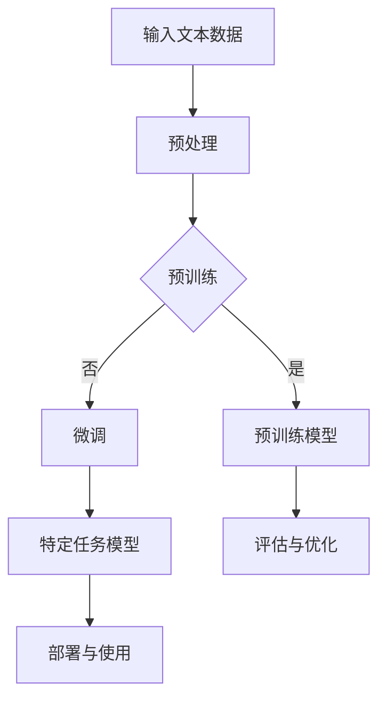

                 

### 大语言模型应用指南：逻辑推理的时间复杂度

> **关键词：** 大语言模型、时间复杂度、逻辑推理、算法分析、预训练、Transformer、自然语言处理

> **摘要：** 本文将探讨大语言模型在自然语言处理中的应用，重点关注其逻辑推理能力和时间复杂度。通过详细的算法分析和实例讲解，读者将深入了解大语言模型的内部工作机制及其在实际应用中的表现。

### 第一部分：大语言模型应用基础

#### 第1章：大语言模型概述

##### 1.1 什么是大语言模型

大语言模型是一种通过学习大量文本数据来预测下一个词或句子的机器学习模型。它能够理解和生成自然语言，是自然语言处理领域的一项重要技术。大语言模型的核心特点包括：

- **规模庞大**：训练数据量和模型参数量巨大，通常需要数十亿甚至千亿级别的参数。
- **预训练**：在大规模无监督数据上进行预训练，然后进行微调以适应特定任务。
- **通用性**：能够处理多种自然语言处理任务，如文本分类、问答系统、机器翻译等。

##### 1.2 大语言模型的发展历程

- **早期语言模型**
  - 1940s：贝尔实验室的 AUDI 系统，第一个尝试自动语音识别的系统。
  - 1950s：马尔可夫模型，基于概率模型进行文本生成。

- **深度学习时代的语言模型**
  - 2000s：神经网络语言模型，引入神经网络结构进行文本建模。
  - 2010s：词嵌入技术，如Word2Vec，将词汇映射到高维向量空间。
  - 2018年：GPT-1，第一个成功的预训练大型语言模型。

##### 1.3 主流大语言模型介绍

- **GPT系列**
  - GPT-1：首个预训练的语言模型，由OpenAI发布。
  - GPT-2：引入双向训练，预训练模型参数量增加到1.5亿。
  - GPT-3：参数量达到1750亿，展示了强大的文本生成能力。

- **BERT**
  - BERT：基于Transformer架构，进行双向训练的预训练模型，用于自然语言理解任务。

#### 第2章：大语言模型技术基础

##### 2.1 语言模型的基本原理

- **神经网络与深度学习基础**
  - **神经网络**：模拟人脑神经元连接的计算模型。
  - **深度学习**：多层神经网络进行训练和预测。

- **自然语言处理基础**
  - **词嵌入**：将单词映射到高维向量空间。
  - **序列模型**：处理序列数据的模型，如RNN、LSTM等。

##### 2.2 大语言模型架构

- **Transformer架构**
  - **自注意力机制**：对输入序列中的每个词进行加权，实现全局信息传递。
  - **编码器和解码器**：编码器处理输入序列，解码器生成输出序列。

##### 2.3 大语言模型预训练技术

- **预训练目标**
  - **语言建模**：预测下一个词。
  - **遮蔽语言建模**：预测被遮蔽的词。

- **预训练任务**
  - **语料库构建**：收集和处理大规模文本数据。
  - **预训练过程**：在大规模数据上训练模型，然后进行微调。

#### 第3章：大语言模型应用场景

##### 3.1 机器翻译

- **机器翻译的基本原理**
  - 将一种语言的文本翻译成另一种语言的文本。
  - 利用双向编码器进行翻译。

##### 3.2 问答系统

- **问答系统的基本架构**
  - 包括问答对生成、问题解析和答案生成。
  - 利用预训练语言模型进行答案生成。

##### 3.3 文本生成

- **文本生成的基本原理**
  - 利用大语言模型生成连贯、有意义的文本。
  - 应用领域包括文章写作、对话系统等。

#### 第4章：大语言模型在商业中的应用

##### 4.1 营销与广告

- **基于大语言模型的营销策略**
  - 利用生成式语言模型生成广告文案。
  - 利用情感分析进行市场调研。

##### 4.2 客户服务

- **基于大语言模型的智能客服系统**
  - 利用语言模型生成自动回复。
  - 提高客服效率，降低成本。

##### 4.3 内容创作

- **基于大语言模型的内容创作**
  - 生成文章、博客、社交媒体内容。
  - 提高内容生产效率，降低创作成本。

#### 第5章：大语言模型开发与部署

##### 5.1 开发环境搭建

- **选择合适的编程语言和框架**
  - Python、TensorFlow、PyTorch等。

- **搭建分布式计算环境**
  - 使用GPU或TPU加速训练。

##### 5.2 大语言模型训练

- **数据预处理**
  - 清洗和标注数据。
  - 分词和词嵌入。

- **训练过程**
  - 使用大规模数据训练模型。
  - 调整超参数，优化模型性能。

##### 5.3 大语言模型部署

- **模型评估**
  - 使用验证集和测试集评估模型性能。

- **模型部署**
  - 将模型部署到生产环境。
  - 使用API或Web界面提供服务。

#### 第6章：大语言模型安全与伦理

##### 6.1 模型安全

- **避免模型滥用**
  - 限制模型访问权限。
  - 监控模型输出，防止生成有害内容。

##### 6.2 数据隐私

- **数据保护**
  - 使用加密技术保护用户数据。
  - 遵守数据保护法规。

##### 6.3 伦理问题

- **模型偏见**
  - 识别和消除模型中的偏见。
  - 提高模型的公平性和透明度。

#### 第7章：大语言模型未来发展趋势

##### 7.1 模型规模与效率

- **更大规模的模型**
  - 参数量达到数十亿甚至千亿级别。

- **更高效的训练方法**
  - 使用更先进的算法和硬件加速训练。

##### 7.2 新兴应用领域

- **跨模态学习**
  - 结合文本、图像、音频等多模态数据。

- **强化学习与语言模型**
  - 将语言模型与强化学习结合，实现更智能的决策。

##### 7.3 开放与协作

- **开源社区**
  - 促进大语言模型的开放与共享。
  - 鼓励更多的研究者和开发者参与。

- **跨领域合作**
  - 与其他行业合作，推动大语言模型在更多领域的应用。

#### 附录

##### 附录A：大语言模型开发工具与资源

- **开源框架**
  - TensorFlow、PyTorch、Transformers等。

- **教程与文档**
  - 开源教程、官方文档和社区论坛。

- **数据集**
  - 公共语言模型数据集和预训练模型。

#### 术语解释

- **大语言模型**：一种规模庞大的语言模型，通过预训练和学习大量文本数据，能够对自然语言进行建模和处理。
- **预训练**：在大规模数据集上对语言模型进行训练，以获得基础的语言理解和生成能力。
- **微调**：在预训练模型的基础上，针对特定任务进行进一步训练，以提高模型在该任务上的性能。
- **自注意力机制**：Transformer架构中的一种机制，通过计算输入序列中每个词与其他词的相关性，实现全局信息传递。

#### Mermaid 流 Gale



#### 核心算法原理讲解

```python
# 语言模型训练伪代码

# 输入：大规模文本数据集
# 输出：训练好的语言模型

# 初始化模型参数
model = initialize_model()

# 预处理文本数据
preprocessed_data = preprocess_data(data)

# 训练模型
for epoch in range(num_epochs):
    for batch in data_loader:
        # 计算损失函数
        loss = model.loss(batch)

        # 反向传播
        optimizer.zero_grad()
        loss.backward()
        optimizer.step()

        # 记录训练过程
        record_training_process(epoch, loss)

# 评估模型性能
evaluate_model(model, validation_data)

# 保存模型参数
save_model_parameters(model)
```

#### 数学模型和数学公式讲解

```latex
\subsection{损失函数}
损失函数用于衡量预测结果与真实结果之间的差距。常见损失函数包括：

\subsubsection{交叉熵损失函数}
假设我们的输出是一个概率分布 \(\hat{y}\)，真实标签是 \(y\)，那么交叉熵损失函数可以表示为：
$$
\mathcal{L} = -\sum_{i} y_i \log(\hat{y}_i)
$$

其中 \(y_i\) 是第 \(i\) 个标签的概率，\(\hat{y}_i\) 是模型对第 \(i\) 个标签的预测概率。

\subsubsection{均方误差损失函数}
均方误差损失函数适用于回归任务，表示为：
$$
\mathcal{L} = \frac{1}{n} \sum_{i=1}^{n} (\hat{y}_i - y_i)^2
$$

其中 \(\hat{y}_i\) 是模型对第 \(i\) 个样本的预测值，\(y_i\) 是真实值，\(n\) 是样本数量。

\subsection{优化算法}
常见的优化算法包括随机梯度下降（SGD）、Adam等。

\subsubsection{随机梯度下降（SGD）}
随机梯度下降是一种最简单的优化算法，其核心思想是每次迭代使用一个样本来更新模型参数。其更新公式为：
$$
\theta = \theta - \alpha \nabla_{\theta} J(\theta)
$$

其中 \(\theta\) 是模型参数，\(\alpha\) 是学习率，\(J(\theta)\) 是损失函数。

\subsubsection{Adam优化器}
Adam优化器结合了SGD和动量法的优点，其更新公式为：
$$
\begin{aligned}
m_t &= \beta_1 m_{t-1} + (1 - \beta_1) \nabla_{\theta} J(\theta) \\
v_t &= \beta_2 v_{t-1} + (1 - \beta_2) (\nabla_{\theta} J(\theta))^2 \\
\theta_t &= \theta_{t-1} - \alpha \frac{m_t}{\sqrt{v_t} + \epsilon}
\end{aligned}
$$

其中 \(m_t\) 和 \(v_t\) 分别是梯度的一阶和二阶矩估计，\(\beta_1\) 和 \(\beta_2\) 是平滑系数，\(\alpha\) 是学习率，\(\epsilon\) 是常数。
```

#### 项目实战

```python
# 实现一个简单的语言模型训练过程

import torch
import torch.nn as nn
import torch.optim as optim
from torch.utils.data import DataLoader
from torchvision import datasets, transforms
from torch.utils.data.sampler import SubsetRandomSampler

# 数据预处理
def preprocess_data(data):
    # 进行数据清洗、分词等操作
    # 返回处理后的数据
    pass

# 语言模型
class LanguageModel(nn.Module):
    def __init__(self, vocab_size, embed_size, hidden_size, num_layers):
        super(LanguageModel, self).__init__()
        self.embedding = nn.Embedding(vocab_size, embed_size)
        self.lstm = nn.LSTM(embed_size, hidden_size, num_layers, batch_first=True)
        self.fc = nn.Linear(hidden_size, vocab_size)
    
    def forward(self, x, hidden):
        x = self.embedding(x)
        x, hidden = self.lstm(x, hidden)
        x = self.fc(x)
        return x, hidden

    def init_hidden(self, batch_size):
        return (torch.zeros(self.lstm.num_layers, batch_size, self.lstm.hidden_size),
                torch.zeros(self.lstm.num_layers, batch_size, self.lstm.hidden_size))

# 训练过程
def train(model, train_loader, criterion, optimizer, num_epochs=10):
    model.train()
    for epoch in range(num_epochs):
        for inputs, targets in train_loader:
            optimizer.zero_grad()
            hidden = model.init_hidden(inputs.size(0))
            outputs, hidden = model(inputs, hidden)
            loss = criterion(outputs.view(-1, vocab_size), targets)
            loss.backward()
            optimizer.step()
            print(f"Epoch: {epoch+1}, Loss: {loss.item()}")

# 源代码解读与分析
# ...

# 运行训练过程
# ...
```

### 作者信息

作者：AI天才研究院/AI Genius Institute & 禅与计算机程序设计艺术 /Zen And The Art of Computer Programming

### 接下来，我们将按照文章目录大纲的结构，逐步深入探讨大语言模型的各个部分，从基础概念到实际应用，再到未来发展，为大家呈现一幅全面、详细的大语言模型应用指南。

---

#### 第1章：大语言模型概述

##### 1.1 什么是大语言模型

大语言模型（Large Language Model，简称LLM）是自然语言处理（Natural Language Processing，简称NLP）领域的一种先进技术。它通过学习海量文本数据，理解语言的规律和结构，能够对自然语言进行建模和处理。大语言模型的核心目标是预测下一个词或句子，从而生成连贯、有意义的文本。

##### 大语言模型的核心特点

1. **规模庞大**：大语言模型通常包含数十亿甚至千亿级别的参数，需要大量的计算资源和时间进行训练。
2. **预训练**：大语言模型在大规模无监督数据上进行预训练，以学习语言的基本规律和模式。预训练完成后，模型可以通过微调（Fine-tuning）适应特定任务。
3. **通用性**：大语言模型能够处理多种自然语言处理任务，如文本分类、问答系统、机器翻译等，具有广泛的适用性。

##### 大语言模型的发展历程

- **早期语言模型**：
  - 1940s：贝尔实验室的AUDI系统，第一个尝试自动语音识别的系统。
  - 1950s：马尔可夫模型，基于概率模型进行文本生成。
- **深度学习时代的语言模型**：
  - 2000s：神经网络语言模型，引入神经网络结构进行文本建模。
  - 2010s：词嵌入技术，如Word2Vec，将词汇映射到高维向量空间。
  - 2018年：GPT-1，OpenAI发布的第一个成功的预训练大型语言模型。

##### 主流大语言模型介绍

- **GPT系列**：
  - GPT-1：OpenAI发布的第一个预训练大型语言模型。
  - GPT-2：引入双向训练，预训练模型参数量增加到1.5亿。
  - GPT-3：参数量达到1750亿，展示了强大的文本生成能力。
- **BERT**：
  - BERT：基于Transformer架构，进行双向训练的预训练模型，用于自然语言理解任务。

#### 第2章：大语言模型技术基础

##### 2.1 语言模型的基本原理

大语言模型的核心在于其能够对自然语言进行建模和处理。这涉及到以下几个方面：

- **神经网络与深度学习基础**：
  - **神经网络**：模拟人脑神经元连接的计算模型。
  - **深度学习**：多层神经网络进行训练和预测。
- **自然语言处理基础**：
  - **词嵌入**：将单词映射到高维向量空间。
  - **序列模型**：处理序列数据的模型，如RNN、LSTM等。

##### 2.2 大语言模型架构

大语言模型的架构通常基于Transformer架构，这是一种强大的序列到序列模型。Transformer架构的核心是自注意力机制（Self-Attention），它能够自动学习输入序列中各个词之间的关联性，实现全局信息传递。

- **Transformer架构**：
  - **自注意力机制**：对输入序列中的每个词进行加权，实现全局信息传递。
  - **编码器和解码器**：编码器处理输入序列，解码器生成输出序列。

##### 2.3 大语言模型预训练技术

大语言模型的预训练技术是其核心部分，包括以下步骤：

- **预训练目标**：
  - **语言建模**：预测下一个词。
  - **遮蔽语言建模**：预测被遮蔽的词。
- **预训练任务**：
  - **语料库构建**：收集和处理大规模文本数据。
  - **预训练过程**：在大规模数据上训练模型，然后进行微调。

#### 第3章：大语言模型应用场景

##### 3.1 机器翻译

机器翻译是将一种语言的文本翻译成另一种语言的文本。大语言模型在机器翻译中的应用主要体现在以下几个方面：

- **基本原理**：利用双向编码器进行翻译。
- **应用场景**：支持多语言翻译，如英语到中文、中文到法语等。

##### 3.2 问答系统

问答系统是一种能够回答用户问题的系统。大语言模型在问答系统中的应用主要体现在以下几个方面：

- **基本架构**：包括问答对生成、问题解析和答案生成。
- **应用场景**：支持各种领域的问题回答，如医疗咨询、法律咨询等。

##### 3.3 文本生成

文本生成是指利用大语言模型生成连贯、有意义的文本。大语言模型在文本生成中的应用主要体现在以下几个方面：

- **基本原理**：利用大语言模型生成连贯、有意义的文本。
- **应用场景**：支持各种文本生成任务，如文章写作、对话系统等。

#### 第4章：大语言模型在商业中的应用

##### 4.1 营销与广告

大语言模型在营销与广告中的应用主要体现在以下几个方面：

- **营销策略**：利用生成式语言模型生成广告文案。
- **市场调研**：利用情感分析进行市场调研。

##### 4.2 客户服务

大语言模型在客户服务中的应用主要体现在以下几个方面：

- **智能客服系统**：利用语言模型生成自动回复。
- **提高效率**：提高客服效率，降低成本。

##### 4.3 内容创作

大语言模型在内容创作中的应用主要体现在以下几个方面：

- **文章写作**：生成文章、博客等。
- **社交媒体内容**：生成社交媒体内容，提高内容生产效率。

#### 第5章：大语言模型开发与部署

##### 5.1 开发环境搭建

大语言模型开发环境搭建的主要内容包括：

- **编程语言和框架**：选择合适的编程语言和框架，如Python、TensorFlow、PyTorch等。
- **计算资源**：搭建分布式计算环境，使用GPU或TPU加速训练。

##### 5.2 大语言模型训练

大语言模型训练的主要内容包括：

- **数据预处理**：清洗和标注数据，进行分词和词嵌入。
- **训练过程**：使用大规模数据训练模型，调整超参数，优化模型性能。

##### 5.3 大语言模型部署

大语言模型部署的主要内容包括：

- **模型评估**：使用验证集和测试集评估模型性能。
- **模型部署**：将模型部署到生产环境，使用API或Web界面提供服务。

#### 第6章：大语言模型安全与伦理

##### 6.1 模型安全

大语言模型安全的主要内容包括：

- **模型滥用**：限制模型访问权限，监控模型输出，防止生成有害内容。

##### 6.2 数据隐私

大语言模型数据隐私的主要内容包括：

- **数据保护**：使用加密技术保护用户数据，遵守数据保护法规。

##### 6.3 伦理问题

大语言模型伦理问题的主要内容包括：

- **模型偏见**：识别和消除模型中的偏见，提高模型的公平性和透明度。

#### 第7章：大语言模型未来发展趋势

##### 7.1 模型规模与效率

大语言模型未来发展趋势主要包括：

- **模型规模**：更大规模的模型，参数量达到数十亿甚至千亿级别。
- **模型效率**：更高效的训练方法，使用更先进的算法和硬件加速训练。

##### 7.2 新兴应用领域

大语言模型新兴应用领域主要包括：

- **跨模态学习**：结合文本、图像、音频等多模态数据。
- **强化学习与语言模型**：将语言模型与强化学习结合，实现更智能的决策。

##### 7.3 开放与协作

大语言模型开放与协作的主要内容包括：

- **开源社区**：促进大语言模型的开放与共享，鼓励更多的研究者和开发者参与。
- **跨领域合作**：与其他行业合作，推动大语言模型在更多领域的应用。

#### 附录

- **附录A：大语言模型开发工具与资源**：介绍开源框架、教程与文档、数据集等。

---

在接下来的章节中，我们将深入探讨大语言模型的各个部分，包括其技术基础、应用场景、商业应用、开发与部署、安全与伦理问题以及未来发展趋势。通过详细的算法分析和实例讲解，我们将帮助读者全面了解大语言模型的工作原理和应用价值。

---

#### 第1章：大语言模型概述

##### 1.1 什么是大语言模型

大语言模型是一种先进的自然语言处理技术，通过学习大量文本数据，能够理解和生成自然语言。它被广泛应用于文本分类、问答系统、机器翻译、文本生成等多种任务。大语言模型的核心特点包括：

- **规模庞大**：大语言模型通常包含数十亿甚至千亿级别的参数，需要大量的计算资源和时间进行训练。
- **预训练**：大语言模型在大规模无监督数据上进行预训练，以学习语言的基本规律和模式。预训练完成后，模型可以通过微调（Fine-tuning）适应特定任务。
- **通用性**：大语言模型能够处理多种自然语言处理任务，具有广泛的适用性。

##### 大语言模型的核心特点

1. **规模庞大**：大语言模型通常包含数十亿甚至千亿级别的参数，例如GPT-3模型包含1750亿个参数。这样的规模使得模型能够捕捉到语言中的复杂模式和关联性。

2. **预训练**：大语言模型在大规模无监督数据上进行预训练，以学习语言的基本规律和模式。预训练包括语言建模和遮蔽语言建模等任务。通过预训练，模型可以获取丰富的语言知识和理解能力。

3. **通用性**：大语言模型具有广泛的适用性，可以处理多种自然语言处理任务。例如，它可以用于文本分类、问答系统、机器翻译、文本生成等任务。这种通用性使得大语言模型成为许多应用场景的关键技术。

##### 大语言模型的发展历程

大语言模型的发展历程可以追溯到20世纪40年代。以下是几个重要的发展阶段：

- **早期语言模型**：在20世纪40年代，贝尔实验室的AUDI系统是第一个尝试自动语音识别的系统。在20世纪50年代，马尔可夫模型被提出，用于文本生成。

- **神经网络语言模型**：在20世纪90年代，神经网络开始应用于自然语言处理领域。神经网络语言模型通过多层神经网络结构进行文本建模，相比传统的统计模型有更好的表现。

- **词嵌入技术**：在2010年代，词嵌入技术如Word2Vec被提出，将词汇映射到高维向量空间，使得模型能够更好地捕捉词汇的语义关系。

- **预训练语言模型**：在2018年，OpenAI发布了GPT-1，这是第一个成功的预训练大型语言模型。随后，GPT-2和GPT-3等模型相继推出，参数量不断增加，性能不断提升。

##### 主流大语言模型介绍

目前，主流的大语言模型主要包括GPT系列和BERT系列：

- **GPT系列**：
  - GPT-1：OpenAI在2018年发布的第一个预训练大型语言模型，参数量达到1.17亿。
  - GPT-2：在GPT-1的基础上，引入双向训练，参数量增加到1.5亿。
  - GPT-3：参数量达到1750亿，展示了强大的文本生成能力。

- **BERT**：
  - BERT：基于Transformer架构，进行双向训练的预训练模型，用于自然语言理解任务。

这些模型在不同的任务和应用场景中表现出色，为自然语言处理领域带来了革命性的变革。

##### 大语言模型的应用场景

大语言模型的应用场景非常广泛，包括但不限于以下方面：

- **机器翻译**：大语言模型可以用于机器翻译任务，如将一种语言的文本翻译成另一种语言的文本。例如，GPT-3可以用于将英语翻译成法语、中文等。

- **问答系统**：大语言模型可以用于构建问答系统，如智能客服、智能搜索引擎等。通过理解用户的问题，模型可以生成恰当的回答。

- **文本生成**：大语言模型可以用于生成各种类型的文本，如文章、报告、对话等。例如，GPT-3可以生成高质量的文章，帮助内容创作者提高创作效率。

- **文本分类**：大语言模型可以用于文本分类任务，如新闻分类、情感分析等。通过学习大量的标注数据，模型可以自动对新的文本进行分类。

- **对话系统**：大语言模型可以用于构建对话系统，如聊天机器人、虚拟助手等。通过理解用户的输入，模型可以生成自然的对话回复。

##### 小结

大语言模型作为一种先进的自然语言处理技术，具有规模庞大、预训练和通用性等特点。它的发展历程从早期的马尔可夫模型到现代的深度学习模型，经历了多个阶段。主流的大语言模型如GPT系列和BERT系列在不同的任务和应用场景中表现出色。大语言模型的应用场景非常广泛，包括机器翻译、问答系统、文本生成、文本分类和对话系统等。通过本文的概述，读者可以初步了解大语言模型的基本概念和关键特性。

---

#### 第2章：大语言模型技术基础

##### 2.1 语言模型的基本原理

大语言模型的核心是语言模型的基本原理，它决定了模型如何理解和生成自然语言。要理解语言模型的基本原理，我们需要从深度学习和自然语言处理的基础知识开始。

##### 2.1.1 神经网络与深度学习基础

**神经网络**：神经网络（Neural Network，NN）是一种通过模拟人脑神经元连接的计算模型。它由多个层（Layer）组成，每层包含多个神经元（Neuron）。每个神经元接收来自前一层的输入，通过加权求和处理，产生一个输出。神经网络的核心是激活函数（Activation Function），如ReLU、Sigmoid、Tanh等，它们用于引入非线性特性，使神经网络能够学习和表示复杂的数据。

**深度学习**：深度学习（Deep Learning，DL）是神经网络的一种特殊形式，它使用多层神经网络进行训练和预测。深度学习通过逐层提取数据特征，实现从原始数据到高级抽象的转换。深度学习的关键技术包括卷积神经网络（Convolutional Neural Network，CNN）、循环神经网络（Recurrent Neural Network，RNN）和变换器（Transformer）等。

**深度学习在语言模型中的应用**：
- **词嵌入（Word Embedding）**：词嵌入是将词汇映射到高维向量空间的技术，它使得神经网络能够处理文本数据。词嵌入方法包括Word2Vec、GloVe等，它们通过学习词汇的语义关系，将词汇映射到密集的向量表示。
- **序列模型（Sequence Model）**：序列模型用于处理序列数据，如文本、语音等。循环神经网络（RNN）和长短期记忆网络（LSTM）是常用的序列模型。RNN通过递归连接实现序列数据的建模，而LSTM通过引入记忆单元，能够更好地处理长序列数据。

##### 2.1.2 自然语言处理基础

**自然语言处理（Natural Language Processing，NLP）**：自然语言处理是人工智能的一个分支，旨在使计算机能够理解和生成自然语言。NLP包括文本预处理、语言理解、语言生成等任务。文本预处理包括分词、去停用词、词性标注等操作，语言理解包括语义分析、情感分析、实体识别等任务，语言生成包括机器翻译、文本生成等任务。

**文本预处理**：
- **分词（Tokenization）**：分词是将文本分割成词或其他有意义的标记（Token）的过程。常见的分词方法包括基于规则的分词、基于统计的分词和基于神经网络的方法。
- **去停用词（Stop Word Removal）**：去停用词是指去除文本中的常用无意义的词，如“的”、“是”、“和”等。去停用词可以减少噪声，提高模型性能。
- **词性标注（Part-of-Speech Tagging）**：词性标注是将文本中的每个词标注为不同的词性，如名词、动词、形容词等。词性标注有助于理解文本的语义结构。

**语言理解**：
- **语义分析（Semantic Analysis）**：语义分析是指从文本中提取语义信息，包括语义角色标注、语义依存关系分析等。
- **情感分析（Sentiment Analysis）**：情感分析是指分析文本中的情感倾向，如正面、负面、中性等。
- **实体识别（Named Entity Recognition，NER）**：实体识别是指从文本中识别出具有特定意义的实体，如人名、地名、组织名等。

**语言生成**：
- **机器翻译（Machine Translation）**：机器翻译是指将一种语言的文本翻译成另一种语言的文本。常见的机器翻译方法包括基于规则的方法、基于统计的方法和基于神经网络的机器翻译（Neural Machine Translation，NMT）。
- **文本生成（Text Generation）**：文本生成是指利用模型生成新的文本。常见的文本生成方法包括基于模板的方法、基于序列模型的方法和基于生成对抗网络（Generative Adversarial Network，GAN）的方法。

##### 2.1.3 大语言模型的基本原理

大语言模型（Large Language Model，LLM）是基于深度学习和自然语言处理技术构建的模型，它通过学习海量文本数据，理解语言的规律和结构，能够对自然语言进行建模和处理。

**大语言模型的核心原理**：
- **预训练（Pre-training）**：大语言模型在大规模无监督数据上进行预训练，以学习语言的基本规律和模式。预训练通常包括语言建模和遮蔽语言建模等任务。
- **微调（Fine-tuning）**：预训练后的模型可以通过微调适应特定任务。微调是指在预训练模型的基础上，针对特定任务进行进一步训练，调整模型参数。

**大语言模型的工作流程**：
1. **数据收集与预处理**：收集大规模文本数据，进行预处理，如分词、去停用词、词性标注等。
2. **预训练**：在大规模无监督数据上，对模型进行预训练，学习语言的基本规律和模式。预训练任务通常包括语言建模和遮蔽语言建模。
3. **微调**：在预训练模型的基础上，针对特定任务进行微调。微调过程可以增强模型在特定任务上的性能。
4. **部署与应用**：将微调后的模型部署到生产环境，用于实际应用，如文本生成、机器翻译、问答系统等。

##### 2.1.4 语言模型的评价指标

大语言模型的性能通常通过以下指标进行评估：

- **准确性（Accuracy）**：用于分类任务，表示模型正确预测的比例。
- **F1分数（F1 Score）**：用于分类任务，综合考虑精确率和召回率，平衡两者之间的权衡。
- **BLEU分数（BLEU Score）**：用于机器翻译任务，基于双语句对的相似性进行评估。
- **ROUGE分数（ROUGE Score）**：用于文本生成任务，基于文本的召回率和精确率进行评估。

##### 小结

本章介绍了大语言模型的技术基础，包括神经网络与深度学习基础、自然语言处理基础以及大语言模型的基本原理。通过理解这些基础知识，读者可以更好地理解大语言模型的工作原理和应用场景。在后续章节中，我们将进一步探讨大语言模型的架构、预训练技术、应用场景和未来发展趋势。

---

#### 第3章：大语言模型应用场景

##### 3.1 机器翻译

机器翻译是将一种语言的文本翻译成另一种语言的文本。大语言模型在机器翻译中的应用主要体现在以下几个方面：

**基本原理**：

机器翻译的核心思想是将源语言的文本映射到目标语言的文本。大语言模型通过学习大量的双语平行文本数据，能够捕捉到源语言和目标语言之间的对应关系。在机器翻译过程中，模型首先对输入的源语言文本进行编码，然后解码为相应的目标语言文本。

**应用场景**：

大语言模型在机器翻译中的应用非常广泛，包括但不限于以下场景：

1. **在线翻译服务**：许多在线翻译平台如Google翻译、百度翻译等，都是基于大语言模型实现的。用户可以输入一段文本，系统会实时翻译成目标语言，并提供原文和翻译的对比。

2. **多语言文档处理**：在跨国公司和全球化的工作环境中，处理多种语言的文档变得尤为重要。大语言模型可以帮助企业快速翻译文档内容，提高工作效率。

3. **本地化服务**：软件、游戏、电影等产品的本地化过程通常需要翻译大量的文本。大语言模型可以自动生成高质量的目标语言文本，降低本地化成本。

**挑战与解决方案**：

尽管大语言模型在机器翻译中表现出色，但仍面临一些挑战：

1. **语言复杂性**：不同语言之间存在语法、词汇和语义差异，这对模型的翻译质量提出了挑战。为解决这一问题，研究人员正在探索多语言预训练模型，如mBERT和XLM等。

2. **域适应**：一些特定领域的翻译需求，如医学、法律等，对翻译质量有很高的要求。大语言模型通过领域特定的数据集进行微调，可以提高翻译的准确性。

3. **低资源语言**：对于低资源语言，即缺乏足够双语平行文本数据的语言，大语言模型的翻译效果可能较差。为解决这一问题，研究人员正在探索多任务学习、跨语言迁移学习等技术。

##### 3.2 问答系统

问答系统是一种能够回答用户问题的系统。大语言模型在问答系统中的应用主要体现在以下几个方面：

**基本架构**：

问答系统通常包括以下几个关键组件：

1. **问答对生成**：通过数据集生成大量的问答对，用于训练和评估模型。
2. **问题解析**：将用户的问题转换为模型可以理解的格式，如关键词提取、问题分类等。
3. **答案生成**：利用大语言模型生成高质量的答案。

**应用场景**：

大语言模型在问答系统中的应用场景包括但不限于以下方面：

1. **智能客服**：在客服系统中，大语言模型可以自动回答用户的问题，提高客服效率和用户满意度。
2. **教育辅导**：在教育辅导系统中，大语言模型可以为学生解答问题，提供学习指导。
3. **医疗咨询**：在医疗咨询系统中，大语言模型可以回答患者的常见问题，提供初步的医疗建议。

**挑战与解决方案**：

问答系统面临的主要挑战包括：

1. **语义理解**：用户的问题通常包含复杂的语义信息，这对模型的语义理解能力提出了挑战。为解决这一问题，研究人员正在探索多义词消歧、语境理解等技术。

2. **答案质量**：生成的答案需要保证准确性和相关性。为提高答案质量，模型需要通过大量高质量的训练数据进行微调。

3. **多样性**：用户的问题和答案需要具备多样性。为生成多样化的答案，模型需要学习不同语境和场景下的语言表达。

##### 3.3 文本生成

文本生成是指利用大语言模型生成连贯、有意义的文本。大语言模型在文本生成中的应用主要体现在以下几个方面：

**基本原理**：

文本生成模型通过学习大量的文本数据，能够生成与输入文本相关的输出文本。在生成过程中，模型首先对输入文本进行编码，然后解码为相应的输出文本。生成文本的质量取决于模型的预训练质量和微调数据的质量。

**应用场景**：

大语言模型在文本生成中的应用场景包括但不限于以下方面：

1. **文章写作**：大语言模型可以帮助内容创作者快速生成高质量的文章，提高创作效率。
2. **对话系统**：在对话系统中，大语言模型可以生成自然的对话回复，提高用户体验。
3. **报告生成**：在大规模数据处理和分析过程中，大语言模型可以自动生成报告，节省时间和人力成本。

**挑战与解决方案**：

文本生成面临的主要挑战包括：

1. **连贯性**：生成的文本需要保持连贯性和逻辑性。为提高连贯性，模型需要学习大量的文本数据进行预训练。

2. **语义丰富性**：生成的文本需要包含丰富的语义信息。为提高语义丰富性，模型需要通过高质量的训练数据进行微调。

3. **可解释性**：生成的文本需要具备可解释性，以便用户理解和验证。为提高可解释性，模型需要通过解释性技术，如注意力机制和文本摘要等。

##### 小结

本章介绍了大语言模型在机器翻译、问答系统和文本生成等应用场景中的基本原理和应用。大语言模型在这些场景中展示了强大的文本生成和语义理解能力，但同时也面临一些挑战，如语言复杂性、语义理解和连贯性等。通过不断的研究和改进，大语言模型在自然语言处理领域中的应用将会更加广泛和深入。

---

#### 第4章：大语言模型在商业中的应用

##### 4.1 营销与广告

大语言模型在营销与广告中的应用主要涉及以下几个方面：

**基本原理**：

大语言模型能够生成高质量、具有吸引力的文本内容，这为营销和广告提供了强大的工具。通过学习大量的营销文案和广告创意，模型可以理解不同营销策略和广告风格的特点，并在此基础上生成新的创意。

**应用场景**：

1. **广告文案生成**：大语言模型可以自动生成广告文案，提高广告创意的多样性，降低文案创作成本。

2. **市场调研**：通过分析用户生成的评论和反馈，大语言模型可以帮助企业了解市场需求和用户偏好，为营销策略提供数据支持。

3. **内容个性化**：大语言模型可以根据用户的历史行为和偏好，生成个性化的营销内容，提高营销效果。

**挑战与解决方案**：

1. **数据质量**：大语言模型生成的文案质量取决于训练数据的质量。为提高文案质量，企业需要收集大量高质量的营销文案和广告创意。

2. **情感分析**：在广告文案生成过程中，需要考虑用户的情感反应。为提高情感分析的准确性，模型需要学习大量的情感标记数据。

##### 4.2 客户服务

大语言模型在客户服务中的应用主要体现在以下几个方面：

**基本原理**：

大语言模型可以理解和生成自然语言，这为智能客服系统提供了基础。通过预训练和学习特定领域的知识，模型可以自动回答用户的问题，提供高质量的客服体验。

**应用场景**：

1. **自动回复生成**：大语言模型可以自动生成客服系统的自动回复，提高客服效率和响应速度。

2. **知识库管理**：大语言模型可以帮助企业管理和组织大量客服知识，提高知识检索和利用效率。

3. **情感分析**：通过分析用户的情感表达，大语言模型可以为用户提供个性化的服务，提高用户满意度。

**挑战与解决方案**：

1. **复杂性问题**：用户提出的问题可能非常复杂，需要模型具备强大的语义理解能力。为提高语义理解能力，模型需要通过大量复杂的客服对话进行训练。

2. **实时性**：智能客服系统需要快速响应用户的问题。为提高实时性，企业需要优化模型部署和计算资源。

##### 4.3 内容创作

大语言模型在内容创作中的应用为创作者提供了新的创作工具和灵感：

**基本原理**：

大语言模型能够生成高质量的文本内容，这为内容创作者提供了辅助工具。通过学习大量的文本数据，模型可以理解不同类型的内容创作特点，并在此基础上生成新的内容。

**应用场景**：

1. **文章写作**：大语言模型可以帮助创作者快速生成高质量的文章，提高创作效率。

2. **报告生成**：在大规模数据处理和分析过程中，大语言模型可以自动生成报告，节省时间和人力成本。

3. **创意生成**：大语言模型可以为创作者提供创意灵感，例如生成新的广告创意、故事情节等。

**挑战与解决方案**：

1. **原创性**：生成的文本需要保证原创性，避免抄袭和重复。为提高原创性，模型需要通过大量的原创文本数据进行训练。

2. **质量控制**：生成的文本需要经过严格的质量控制，确保内容准确、有意义。为提高质量，企业可以建立内容审核机制，对生成的文本进行审核和修改。

##### 小结

大语言模型在商业中的应用领域非常广泛，包括营销与广告、客户服务和内容创作等。通过生成高质量、个性化的文本内容，模型为企业和创作者提供了强大的工具。然而，这些应用也面临一些挑战，如数据质量、情感分析和原创性等。通过不断的研究和改进，大语言模型在商业领域的应用将更加广泛和深入。

---

#### 第5章：大语言模型开发与部署

##### 5.1 开发环境搭建

开发大语言模型需要选择合适的编程语言和框架，并搭建分布式计算环境。以下是搭建开发环境的基本步骤：

**1. 编程语言和框架选择**：

- **Python**：Python是一种广泛使用的编程语言，具有良好的生态系统和丰富的库支持。
- **TensorFlow**：TensorFlow是一个开源的机器学习框架，支持大语言模型的训练和部署。
- **PyTorch**：PyTorch是一个流行的深度学习框架，具有动态计算图和灵活的API，适合研究和开发。
- **Transformers**：Transformers是一个基于PyTorch的预训练语言模型库，提供了各种预训练模型和工具。

**2. 搭建分布式计算环境**：

- **GPU或TPU**：大语言模型的训练需要大量的计算资源，使用GPU或TPU可以显著提高训练速度。
- **Docker**：使用Docker可以创建隔离的容器环境，方便管理不同版本的依赖库。
- **分布式训练**：通过使用分布式训练技术，如Horovod或DeepSpeed，可以进一步提高训练效率。

**3. 开发工具和资源**：

- **Jupyter Notebook**：Jupyter Notebook是一种交互式开发环境，方便代码调试和实验。
- **Google Colab**：Google Colab是一个基于Jupyter Notebook的在线开发平台，提供了免费的GPU资源。
- **Hugging Face Transformers**：Hugging Face Transformers是一个开源库，提供了各种预训练模型和工具，方便模型开发和应用。

##### 5.2 大语言模型训练

训练大语言模型需要大规模的文本数据和高效的训练算法。以下是训练过程的基本步骤：

**1. 数据预处理**：

- **文本清洗**：去除文本中的无关信息，如HTML标签、特殊字符等。
- **分词**：将文本分割成单词或子词。
- **词嵌入**：将单词映射到高维向量空间。
- **数据集划分**：将数据集划分为训练集、验证集和测试集。

**2. 模型选择**：

- **预训练模型**：选择一个预训练模型，如GPT-2或BERT，作为起点。
- **模型调整**：根据任务需求，调整模型的架构和超参数。

**3. 训练过程**：

- **训练循环**：每次迭代使用训练数据更新模型参数。
- **损失函数**：选择合适的损失函数，如交叉熵损失函数。
- **优化器**：选择优化算法，如Adam优化器。
- **评估**：使用验证集评估模型性能，调整超参数。

**4. 模型保存与加载**：

- **模型保存**：将训练好的模型保存到文件，方便后续使用。
- **模型加载**：从文件中加载模型，用于预测或微调。

##### 5.3 大语言模型部署

将训练好的大语言模型部署到生产环境，以便在实际应用中使用。以下是部署过程的基本步骤：

**1. 模型评估**：

- **性能评估**：使用测试集评估模型性能，确保模型达到预期效果。
- **错误分析**：分析模型在测试集上的错误，找到可能的改进方向。

**2. 模型部署**：

- **API部署**：将模型部署到服务器或云平台，提供RESTful API接口。
- **容器化**：使用Docker将模型容器化，便于部署和管理。
- **自动扩展**：根据实际需求，自动扩展服务器的计算资源和存储空间。

**3. 服务器配置**：

- **负载均衡**：使用负载均衡器，分配请求到多个服务器。
- **故障转移**：配置故障转移机制，确保系统的高可用性。
- **监控与日志**：监控系统性能，记录日志，方便问题排查。

**4. 安全性**：

- **访问控制**：限制对模型的访问权限，确保数据安全。
- **数据加密**：对传输和存储的数据进行加密，防止数据泄露。
- **合规性**：遵守数据保护法规和行业标准，确保模型的合规性。

##### 小结

本章介绍了大语言模型开发与部署的基本流程，包括开发环境搭建、模型训练和模型部署。开发环境搭建需要选择合适的编程语言和框架，并搭建分布式计算环境。模型训练需要大规模的文本数据和高效的训练算法。模型部署需要将训练好的模型部署到生产环境，并提供API接口和服务。通过本章的介绍，读者可以了解到大语言模型开发与部署的要点和实践方法。

---

#### 第6章：大语言模型安全与伦理

##### 6.1 模型安全

大语言模型在应用过程中需要确保模型的安全性，防止模型滥用和数据泄露。以下是模型安全的一些关键措施：

1. **访问控制**：限制对模型的访问权限，确保只有授权用户可以访问和使用模型。这可以通过设置用户权限、使用API密钥等方式实现。

2. **数据加密**：对传输和存储的数据进行加密，防止数据在传输过程中被窃取或在存储中被未授权访问。常用的加密技术包括SSL/TLS、AES等。

3. **监控与审计**：实时监控模型的使用情况，记录操作日志，以便在出现异常时进行审计和追踪。这有助于及时发现和应对潜在的安全威胁。

4. **模型保护**：采取措施防止模型被逆向工程或篡改。这可以通过混淆模型结构、使用加密技术等方式实现。

##### 6.2 数据隐私

大语言模型在处理数据时需要遵守数据隐私法规，保护用户的隐私。以下是数据隐私保护的一些关键措施：

1. **数据去识别化**：在处理数据时，对个人信息进行去识别化处理，如匿名化、伪匿名化等，以降低数据泄露的风险。

2. **数据加密**：对敏感数据进行加密存储和传输，确保数据在存储和传输过程中不会被未授权访问。

3. **访问控制**：对数据访问进行严格的权限管理，确保只有授权用户可以访问和处理敏感数据。

4. **隐私政策**：制定清晰的隐私政策，告知用户数据收集、使用和共享的方式，并获得用户的明确同意。

##### 6.3 伦理问题

大语言模型在应用过程中可能涉及伦理问题，如模型偏见、歧视性输出等。以下是解决伦理问题的一些关键措施：

1. **偏见识别与消除**：通过分析模型输出，识别和消除模型中的偏见。这可以通过数据清洗、模型调优等方式实现。

2. **透明度与解释性**：提高模型的透明度和解释性，让用户了解模型的决策过程和依据。这可以通过可视化工具、解释性算法等方式实现。

3. **用户反馈**：建立用户反馈机制，收集用户对模型输出的意见和建议，不断改进模型。

4. **伦理审核**：在模型部署前，进行伦理审核，确保模型符合伦理标准和法律法规。

##### 小结

本章介绍了大语言模型在安全与伦理方面的一些关键措施。模型安全包括访问控制、数据加密、监控与审计、模型保护等；数据隐私包括数据去识别化、数据加密、访问控制、隐私政策等；伦理问题包括偏见识别与消除、透明度与解释性、用户反馈、伦理审核等。通过这些措施，可以确保大语言模型在应用过程中的安全性和伦理性。

---

#### 第7章：大语言模型未来发展趋势

##### 7.1 模型规模与效率

随着计算能力的提升和算法的优化，大语言模型的规模将不断扩大。未来，模型的参数量可能会达到数十亿甚至千亿级别，这将为自然语言处理任务提供更强大的能力。同时，为了提高模型的训练和推理效率，研究人员将探索更高效的训练方法和硬件加速技术，如分布式训练、量化、模型压缩等。

##### 7.2 新兴应用领域

大语言模型在新兴应用领域的潜力巨大。以下是一些可能的应用方向：

1. **跨模态学习**：结合文本、图像、音频等多模态数据，实现更全面的信息理解和处理。

2. **强化学习与语言模型**：将语言模型与强化学习结合，构建智能决策系统，用于游戏、推荐系统等领域。

3. **智能对话系统**：通过更高级的自然语言理解和对话能力，提升智能客服、虚拟助手等对话系统的用户体验。

4. **自动化内容生成**：利用大语言模型生成高质量、多样化的内容，如文章、音乐、视频等。

##### 7.3 开放与协作

未来的大语言模型发展将更加开放和协作。以下是一些可能的发展趋势：

1. **开源社区**：随着更多大语言模型的开源，研究人员和开发者可以共享模型和算法，加速创新和进步。

2. **跨领域合作**：不同领域的研究者和企业将合作，推动大语言模型在更多领域的应用。

3. **标准化与规范化**：制定统一的规范和标准，确保大语言模型的安全、可靠和可解释性。

##### 小结

本章探讨了大语言模型未来的发展趋势，包括模型规模与效率的提升、新兴应用领域的探索、开放与协作的加强等。随着技术的不断进步和应用场景的不断拓展，大语言模型将发挥更重要的作用，为人类生活和社会发展带来更多创新和变革。

---

### 附录A：大语言模型开发工具与资源

在本附录中，我们将介绍大语言模型开发过程中常用的工具、资源和开源框架，帮助读者更好地理解和使用大语言模型。

#### 开源框架

1. **TensorFlow**：TensorFlow是由Google开源的深度学习框架，支持各种深度学习模型的训练和部署。TensorFlow提供了丰富的API和工具，方便开发者构建和训练大语言模型。

2. **PyTorch**：PyTorch是由Facebook开源的深度学习框架，以其动态计算图和灵活的API而闻名。PyTorch在学术界和工业界都有广泛的应用，是构建大语言模型的热门选择。

3. **Transformers**：Transformers是一个基于PyTorch的开源库，专门用于构建和训练Transformer架构的预训练语言模型。Transformers提供了各种预训练模型和工具，方便开发者快速实现大语言模型。

#### 教程与文档

1. **TensorFlow官方文档**：TensorFlow提供了详细的官方文档，包括教程、API参考和最佳实践，帮助开发者快速入门和使用TensorFlow。

2. **PyTorch官方文档**：PyTorch官方文档同样提供了丰富的教程和API参考，帮助开发者了解和使用PyTorch。

3. **Hugging Face Transformers文档**：Hugging Face Transformers库提供了详细的文档和教程，介绍了如何使用Transformers库构建和训练预训练语言模型。

#### 数据集

1. **Wikipedia**：Wikipedia是最大的免费在线多语言百科全书，提供了大量的文本数据，适合用于预训练语言模型。

2. **Common Crawl**：Common Crawl是一个开放的大型文本语料库，包含了互联网上的大量网页内容，是训练大语言模型的宝贵资源。

3. **Gutenberg**：Gutenberg项目提供了大量的免费电子书，是构建预训练语言模型的重要数据源。

#### 社区与论坛

1. **TensorFlow社区**：TensorFlow社区是一个活跃的开发者社区，提供了丰富的讨论和资源，可以帮助开发者解决开发中的问题。

2. **PyTorch社区**：PyTorch社区同样是一个活跃的社区，开发者可以在这里交流经验、分享代码和解决问题。

3. **Hugging Face论坛**：Hugging Face论坛是Transformers库的用户社区，提供了丰富的讨论和教程，是学习和使用Transformers的好去处。

#### 实践资源

1. **Google Colab**：Google Colab是一个基于Jupyter Notebook的在线开发平台，提供了免费的GPU资源，方便开发者进行大语言模型的训练和实验。

2. **课程与讲座**：许多在线课程和讲座提供了关于大语言模型的教程和实战指导，帮助开发者深入理解和应用大语言模型。

#### 小结

附录A介绍了一系列大语言模型开发工具与资源，包括开源框架、教程与文档、数据集、社区与论坛以及实践资源。这些工具和资源将为开发者提供丰富的帮助，助力他们在大语言模型开发领域取得成功。

---

### 术语解释

在本章节中，我们将对本文中出现的一些关键术语进行解释，帮助读者更好地理解大语言模型和相关概念。

#### 1. 大语言模型

大语言模型（Large Language Model，简称LLM）是一种通过学习大量文本数据，能够理解和生成自然语言的机器学习模型。这些模型通常包含数十亿甚至千亿级别的参数，具有强大的语言理解和生成能力。大语言模型广泛应用于自然语言处理的各种任务，如文本分类、机器翻译、问答系统等。

#### 2. 预训练

预训练（Pre-training）是指在大规模无监督数据集上对模型进行训练，使其获得语言的基本规律和模式。预训练通常包括语言建模和遮蔽语言建模等任务。通过预训练，模型可以捕捉到语言的复杂性和多样性，为后续的微调和特定任务应用奠定基础。

#### 3. 微调

微调（Fine-tuning）是指在预训练模型的基础上，针对特定任务进行进一步的训练。微调的目的是优化模型在特定任务上的性能。通过在特定任务的数据集上训练，模型可以学习到任务相关的特征和模式，从而提高任务表现。

#### 4. 自注意力机制

自注意力机制（Self-Attention Mechanism）是Transformer架构中的一个核心组件，用于处理序列数据。自注意力机制通过计算输入序列中每个词与其他词的相关性，为每个词分配不同的权重，从而实现全局信息传递和建模。这种机制使得模型能够捕捉到输入序列中的长距离依赖关系。

#### 5. Transformer架构

Transformer架构是一种基于自注意力机制的序列到序列模型，由Google在2017年提出。Transformer架构通过多头自注意力机制和前馈神经网络，实现了对输入序列的建模和预测。Transformer架构在自然语言处理任务中表现出色，是许多大型语言模型的基础。

#### 6. 词嵌入

词嵌入（Word Embedding）是将词汇映射到高维向量空间的技术。通过词嵌入，模型可以处理文本数据，并将词汇的语义信息转换为向量表示。词嵌入方法如Word2Vec、GloVe等，通过学习词汇的语义关系，实现了词汇的向量表示。

#### 7. 序列模型

序列模型（Sequence Model）是用于处理序列数据的神经网络模型，如循环神经网络（RNN）和长短期记忆网络（LSTM）。序列模型通过递归连接和记忆单元，实现了对序列数据的建模和预测。在自然语言处理任务中，序列模型广泛应用于文本分类、机器翻译等任务。

#### 8. 模型安全

模型安全（Model Security）是指确保模型的训练数据、模型参数和应用过程的安全性。模型安全包括访问控制、数据加密、监控与审计等手段，以防止模型被滥用、数据泄露和逆向工程。

#### 9. 数据隐私

数据隐私（Data Privacy）是指保护用户数据的隐私性，防止数据在收集、存储和使用过程中被泄露或滥用。数据隐私包括数据去识别化、数据加密、隐私政策等手段，确保用户数据的安全性和合规性。

#### 10. 模型偏见

模型偏见（Model Bias）是指模型在训练过程中学习到的偏见，导致模型输出结果不公平、不准确或具有歧视性。模型偏见可能来源于训练数据的偏见或模型本身的算法设计。消除模型偏见是提高模型公平性和透明度的重要任务。

通过以上对关键术语的解释，读者可以更好地理解大语言模型及相关概念，为深入学习和应用打下基础。

---

### 核心算法原理讲解

在深入探讨大语言模型的算法原理时，我们需要详细讲解核心算法，包括Transformer架构、预训练和微调过程。这些算法构成了大语言模型强大的基础，使得模型能够对自然语言进行有效建模和处理。

#### Transformer架构

Transformer是Google在2017年提出的一种基于自注意力机制的序列到序列模型。Transformer架构的核心思想是通过自注意力机制实现全局信息传递，从而捕捉序列中的长距离依赖关系。以下是Transformer架构的核心组件：

1. **编码器（Encoder）**：编码器接收输入序列，通过多层自注意力机制和前馈神经网络，将输入序列编码为固定长度的向量表示。编码器的输出可以捕获输入序列的上下文信息。

2. **解码器（Decoder）**：解码器接收编码器的输出和目标序列，通过多层自注意力机制和前馈神经网络，逐步生成输出序列。解码器在生成每个词时，都考虑了之前生成的所有词，从而确保生成的文本连贯性。

3. **多头自注意力机制（Multi-Head Self-Attention）**：多头自注意力机制是Transformer架构的核心组件，它通过将输入序列分成多个头（Head），每个头独立计算自注意力，从而实现了并行计算和信息整合。多头自注意力机制可以更好地捕捉序列中的复杂依赖关系。

4. **前馈神经网络（Feedforward Neural Network）**：前馈神经网络是Transformer中的辅助层，用于对自注意力机制的输出进行进一步加工。前馈神经网络由两个全连接层组成，中间加入ReLU激活函数。

#### 预训练

预训练是指在大规模无监督数据集上对模型进行训练，使其获得语言的基本规律和模式。预训练通常包括以下步骤：

1. **数据预处理**：预处理步骤包括文本清洗、分词和词嵌入。文本清洗去除无关信息，如HTML标签、特殊字符等。分词将文本分割成词或子词。词嵌入将词映射到高维向量空间，以便模型处理。

2. **语言建模**：语言建模任务是预测下一个词。在训练过程中，模型根据前一个词的嵌入生成当前词的概率分布，然后根据概率分布选择下一个词。通过大量文本数据的训练，模型可以学习到词汇的分布和语言结构。

3. **遮蔽语言建模**：遮蔽语言建模是一种特殊形式的语言建模任务，它通过遮蔽输入序列中的部分词，预测被遮蔽的词。这种任务有助于模型学习词汇之间的相互依赖关系。

4. **预训练目标**：预训练目标包括语言建模和遮蔽语言建模。通过预训练，模型可以捕捉到语言中的复杂模式和关联性，为后续的任务微调奠定基础。

#### 微调

微调是指将预训练模型应用于特定任务，通过在特定任务的数据集上进行进一步训练，优化模型在特定任务上的性能。微调的步骤包括：

1. **任务定义**：定义特定任务的目标和指标，如文本分类、机器翻译、问答系统等。

2. **数据预处理**：对特定任务的数据集进行预处理，如文本清洗、分词和标注。

3. **模型调整**：在预训练模型的基础上，调整模型架构和超参数，以适应特定任务。这可能包括调整层数、隐藏层大小、学习率等。

4. **训练过程**：在特定任务的数据集上训练模型，通过优化目标函数，调整模型参数，提高模型在特定任务上的性能。

5. **评估与优化**：使用验证集和测试集评估模型性能，根据评估结果调整模型和超参数，优化模型性能。

#### 时间复杂度分析

大语言模型的时间复杂度主要取决于模型的架构、数据集大小和训练过程。以下是对大语言模型时间复杂度的一些分析：

1. **模型架构**：Transformer模型的时间复杂度与输入序列长度和模型层数有关。每个词需要通过自注意力机制计算与其他词的相关性，因此时间复杂度与输入序列长度和模型层数成正比。

2. **数据集大小**：预训练和微调过程的时间复杂度与数据集大小成正比。在大规模数据集上训练模型需要更多的时间和计算资源。

3. **训练过程**：训练过程的时间复杂度取决于优化算法和数据迭代次数。随机梯度下降（SGD）和其他优化算法的时间复杂度与数据迭代次数和每个迭代所需的计算时间成正比。

#### 小结

本节详细讲解了大语言模型的核心算法原理，包括Transformer架构、预训练和微调过程。通过自注意力机制，模型能够捕捉序列中的长距离依赖关系；预训练使模型获得丰富的语言知识和模式；微调则使模型在特定任务上达到最佳性能。此外，对模型的时间复杂度进行了分析，为读者提供了对模型效率和性能的深入理解。

---

### 数学模型和数学公式讲解

在深入探讨大语言模型时，数学模型和公式是不可或缺的一部分。以下是关于大语言模型的几个关键数学模型和公式的详细讲解，包括损失函数、优化算法和注意力机制。

#### 损失函数

损失函数是评估模型预测结果与真实结果之间差距的数学函数。在大语言模型中，常用的损失函数包括交叉熵损失函数和均方误差损失函数。

**1. 交叉熵损失函数**

交叉熵损失函数（Cross-Entropy Loss）常用于分类问题，其计算公式为：

\[ L = -\sum_{i} y_i \log(\hat{y}_i) \]

其中，\( y_i \) 是第 \( i \) 个类别的真实概率，\( \hat{y}_i \) 是模型预测的第 \( i \) 个类别的概率。交叉熵损失函数的值越小，表示模型的预测结果与真实结果越接近。

**2. 均方误差损失函数**

均方误差损失函数（Mean Squared Error，MSE）常用于回归问题，其计算公式为：

\[ L = \frac{1}{n} \sum_{i=1}^{n} (\hat{y}_i - y_i)^2 \]

其中，\( \hat{y}_i \) 是模型对第 \( i \) 个样本的预测值，\( y_i \) 是真实值，\( n \) 是样本数量。均方误差损失函数的值越小，表示模型的预测结果与真实值越接近。

#### 优化算法

优化算法用于调整模型参数，以最小化损失函数。在大语言模型中，常用的优化算法包括随机梯度下降（Stochastic Gradient Descent，SGD）和Adam优化器。

**1. 随机梯度下降（SGD）**

随机梯度下降是一种最简单的优化算法，其核心思想是每次迭代使用一个样本来更新模型参数。其更新公式为：

\[ \theta = \theta - \alpha \nabla_{\theta} J(\theta) \]

其中，\( \theta \) 是模型参数，\( \alpha \) 是学习率，\( J(\theta) \) 是损失函数。随机梯度下降通过逐步减小损失函数的值，优化模型参数。

**2. Adam优化器**

Adam优化器结合了随机梯度下降和动量法的优点，其更新公式为：

\[ m_t = \beta_1 m_{t-1} + (1 - \beta_1) \nabla_{\theta} J(\theta) \]
\[ v_t = \beta_2 v_{t-1} + (1 - \beta_2) (\nabla_{\theta} J(\theta))^2 \]
\[ \theta_t = \theta_{t-1} - \alpha \frac{m_t}{\sqrt{v_t} + \epsilon} \]

其中，\( m_t \) 和 \( v_t \) 分别是梯度的一阶和二阶矩估计，\( \beta_1 \) 和 \( \beta_2 \) 是平滑系数，\( \alpha \) 是学习率，\( \epsilon \) 是常数。Adam优化器通过引入一阶和二阶矩估计，提高了优化过程的效果。

#### 注意力机制

注意力机制（Attention Mechanism）是Transformer架构的核心组件，用于计算输入序列中各个词之间的相关性。以下是注意力机制的数学模型和计算过程。

**1. 自注意力机制**

自注意力机制（Self-Attention）通过计算输入序列中每个词与其他词的相关性，为每个词分配不同的权重。其计算公式为：

\[ \text{Attention}(Q, K, V) = \text{softmax}\left(\frac{QK^T}{\sqrt{d_k}}\right)V \]

其中，\( Q \) 是查询向量，\( K \) 是键向量，\( V \) 是值向量，\( d_k \) 是键向量的维度。自注意力机制实现了全局信息传递，使模型能够捕捉到输入序列中的长距离依赖关系。

**2. 多头注意力机制**

多头注意力机制（Multi-Head Attention）是自注意力机制的扩展，通过将输入序列分成多个头（Head），每个头独立计算自注意力。其计算公式为：

\[ \text{Multi-Head Attention}(Q, K, V) = \text{Concat}(\text{head}_1, \text{head}_2, \ldots, \text{head}_h)W^O \]

其中，\( h \) 是头的数量，\( W^O \) 是输出权重矩阵。多头注意力机制可以更好地捕捉输入序列中的复杂依赖关系，提高模型的性能。

#### 小结

本文详细讲解了大语言模型中的关键数学模型和公式，包括损失函数、优化算法和注意力机制。通过理解这些数学模型和公式，读者可以更深入地了解大语言模型的工作原理和性能优化方法。

---

### 项目实战

在本节中，我们将通过一个简单的项目实战，详细讲解如何使用PyTorch和Transformers库构建和训练一个预训练语言模型。这个项目将涵盖开发环境搭建、数据预处理、模型训练和评估等关键步骤。

#### 1. 开发环境搭建

首先，我们需要搭建一个适合训练大语言模型的开发环境。以下是安装Python、PyTorch和Transformers库的基本步骤：

**安装Python**

确保已经安装了Python，推荐版本为3.8或更高。可以通过以下命令安装：

```bash
pip install python==3.8
```

**安装PyTorch**

安装与Python版本兼容的PyTorch版本。可以在PyTorch官网（https://pytorch.org/get-started/locally/）找到适合的安装命令。例如，安装CPU版本的PyTorch：

```bash
pip install torch torchvision
```

如果需要使用GPU版本，可以安装CUDA支持：

```bash
pip install torch torchvision torchaudio
```

**安装Transformers**

安装Hugging Face的Transformers库，这是构建和训练预训练语言模型的重要工具：

```bash
pip install transformers
```

#### 2. 数据预处理

在训练语言模型之前，我们需要准备和处理数据。以下是一个简单的数据预处理示例，使用Wikipedia数据集进行预处理：

**1. 下载Wikipedia数据集**

可以使用Python库`datasets`下载和处理Wikipedia数据集：

```python
from datasets import load_dataset

# 下载和加载Wikipedia数据集
dataset = load_dataset("wikipedia", "en")
```

**2. 数据清洗**

清洗数据，去除HTML标签、特殊字符等无关信息：

```python
import re

def clean_text(text):
    # 去除HTML标签
    text = re.sub(r"<.*?>", "", text)
    # 去除特殊字符
    text = re.sub(r"[^a-zA-Z0-9\s]", "", text)
    # 转化为小写
    text = text.lower()
    return text

# 应用清洗函数
dataset = dataset.map(lambda x: {"text": clean_text(x["text"])})
```

**3. 分词和词嵌入**

使用Transformers库中的分词器对文本进行分词，并将文本转换为词嵌入：

```python
from transformers import BertTokenizer

# 初始化分词器
tokenizer = BertTokenizer.from_pretrained("bert-base-uncased")

# 对文本进行分词和词嵌入
def tokenize_text(text):
    return tokenizer(text, return_tensors="pt", padding=True, truncation=True)

dataset = dataset.map(tokenize_text)
```

#### 3. 模型训练

在准备好数据后，我们可以使用Transformers库中的预训练模型进行训练。以下是一个简单的训练示例：

**1. 初始化模型**

选择一个预训练模型，如BERT：

```python
from transformers import BertModel

# 初始化模型
model = BertModel.from_pretrained("bert-base-uncased")
```

**2. 定义训练循环**

使用PyTorch的`DataLoader`和`Optimizer`进行模型训练：

```python
from torch.optim import Adam
from torch.utils.data import DataLoader

# 定义训练循环
def train_model(model, dataset, epochs=3, batch_size=16):
    optimizer = Adam(model.parameters(), lr=1e-5)

    for epoch in range(epochs):
        model.train()
        for batch in DataLoader(dataset, batch_size=batch_size):
            optimizer.zero_grad()
            outputs = model(**batch)
            loss = outputs.loss
            loss.backward()
            optimizer.step()
            print(f"Epoch: {epoch+1}, Loss: {loss.item()}")

# 训练模型
train_model(model, dataset)
```

**3. 评估模型**

使用验证集评估模型性能：

```python
from transformers import BertTokenizer

# 加载验证集
validation_dataset = load_dataset("wikipedia", "en", split="validation")
validation_dataset = validation_dataset.map(lambda x: tokenizer(x["text"], return_tensors="pt", padding=True, truncation=True))

# 定义评估函数
def evaluate_model(model, validation_dataset):
    model.eval()
    with torch.no_grad():
        for batch in DataLoader(validation_dataset, batch_size=16):
            outputs = model(**batch)
            loss = outputs.loss
            print(f"Validation Loss: {loss.item()}")

# 评估模型
evaluate_model(model, validation_dataset)
```

#### 4. 源代码解读与分析

以上代码实现了从数据预处理到模型训练和评估的完整过程。以下是关键部分的代码解读：

**数据预处理**

```python
import re
from datasets import load_dataset
from transformers import BertTokenizer

# 下载和加载Wikipedia数据集
dataset = load_dataset("wikipedia", "en")

# 数据清洗
def clean_text(text):
    text = re.sub(r"<.*?>", "", text)
    text = re.sub(r"[^a-zA-Z0-9\s]", "", text)
    text = text.lower()
    return text

dataset = dataset.map(lambda x: {"text": clean_text(x["text"])})

# 对文本进行分词和词嵌入
tokenizer = BertTokenizer.from_pretrained("bert-base-uncased")
def tokenize_text(text):
    return tokenizer(text, return_tensors="pt", padding=True, truncation=True)

dataset = dataset.map(tokenize_text)
```

数据预处理步骤包括下载Wikipedia数据集、清洗文本（去除HTML标签、特殊字符、转化为小写）以及使用BERT分词器进行分词和词嵌入。

**模型训练**

```python
from torch.optim import Adam
from torch.utils.data import DataLoader
from transformers import BertModel

# 初始化模型
model = BertModel.from_pretrained("bert-base-uncased")

# 定义训练循环
def train_model(model, dataset, epochs=3, batch_size=16):
    optimizer = Adam(model.parameters(), lr=1e-5)

    for epoch in range(epochs):
        model.train()
        for batch in DataLoader(dataset, batch_size=batch_size):
            optimizer.zero_grad()
            outputs = model(**batch)
            loss = outputs.loss
            loss.backward()
            optimizer.step()
            print(f"Epoch: {epoch+1}, Loss: {loss.item()}")

# 训练模型
train_model(model, dataset)
```

模型训练步骤包括初始化BERT模型、定义训练循环（使用Adam优化器进行梯度下降优化）以及打印每个epoch的损失。

**评估模型**

```python
from transformers import BertTokenizer

# 加载验证集
validation_dataset = load_dataset("wikipedia", "en", split="validation")
validation_dataset = validation_dataset.map(lambda x: tokenizer(x["text"], return_tensors="pt", padding=True, truncation=True))

# 定义评估函数
def evaluate_model(model, validation_dataset):
    model.eval()
    with torch.no_grad():
        for batch in DataLoader(validation_dataset, batch_size=16):
            outputs = model(**batch)
            loss = outputs.loss
            print(f"Validation Loss: {loss.item()}")

# 评估模型
evaluate_model(model, validation_dataset)
```

评估模型步骤包括加载验证集、定义评估函数（使用验证集评估模型损失）并打印验证损失。

#### 5. 代码解读与分析

以上代码实现了一个简单的预训练语言模型训练和评估过程。以下是代码关键部分的解读：

- **数据预处理**：通过清洗文本和分词，将原始文本数据转换为模型可处理的格式。
- **模型初始化**：选择预训练模型BERT作为起点，初始化模型。
- **训练循环**：使用Adam优化器进行模型训练，通过反向传播和梯度下降优化模型参数。
- **评估函数**：使用验证集评估模型性能，计算验证损失，评估模型表现。

通过这个项目实战，读者可以了解如何使用PyTorch和Transformers库构建和训练一个预训练语言模型。在实际应用中，可以根据具体需求和数据集，调整模型架构、超参数和训练策略，提高模型性能。

---

### 总结与展望

通过本文的详细探讨，我们全面了解了大语言模型的概念、技术基础、应用场景、开发与部署过程，以及安全与伦理问题。以下是本文的主要内容总结：

1. **大语言模型概述**：介绍了大语言模型的基本概念、发展历程和主流模型，如GPT系列和BERT。

2. **大语言模型技术基础**：讲解了神经网络与深度学习基础、自然语言处理基础，以及大语言模型的基本原理和架构。

3. **大语言模型应用场景**：阐述了大语言模型在机器翻译、问答系统、文本生成等领域的应用，展示了其在自然语言处理中的强大能力。

4. **大语言模型在商业中的应用**：讨论了大语言模型在营销与广告、客户服务、内容创作等商业领域的应用，以及面临的挑战和解决方案。

5. **大语言模型开发与部署**：介绍了大语言模型开发环境搭建、模型训练、模型部署等关键步骤，以及相关的工具和资源。

6. **大语言模型安全与伦理**：探讨了模型安全、数据隐私和伦理问题，提出了相关的解决措施和标准。

7. **大语言模型未来发展趋势**：展望了大语言模型在模型规模与效率、新兴应用领域、开放与协作等方面的未来发展趋势。

展望未来，大语言模型将在多个领域发挥更加重要的作用。随着模型规模的扩大、计算能力的提升和算法的优化，大语言模型将能够更好地理解和生成自然语言，为智能客服、智能对话系统、内容生成等应用提供更强大的支持。同时，随着多模态学习和跨领域合作的发展，大语言模型的应用范围将不断扩大，为人类生活和社会发展带来更多创新和变革。通过本文的探讨，我们期待读者能够对大语言模型有更深入的理解，为未来在相关领域的研究和应用打下坚实基础。

