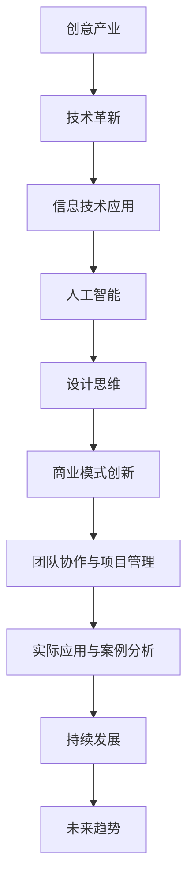

                 

### 《如何利用技术能力进行创意产业革新》完整目录大纲

#### 第一部分：引言与基础

## 1. 创意产业与技术革新概述

创意产业（Creative Industries）是指以创意为核心的产业集合，包括设计、广告、影视制作、音乐、出版、娱乐等领域。创意产业在全球经济中扮演着重要角色，它不仅推动了经济增长，还促进了文化多样性和社会进步。

技术革新在创意产业中起着至关重要的作用。随着信息技术的迅猛发展，特别是互联网、云计算、大数据、人工智能等技术的广泛应用，创意产业正经历着前所未有的变革。技术不仅提高了内容创作的效率，还改变了内容消费的方式，从而推动了创意产业的创新与发展。

#### 1.1 创意产业的重要性

创意产业具有以下几个重要特点：

1. **高附加值**：创意产业通常具有高附加值的特点，通过创意和创新，可以创造出独特且有吸引力的产品和服务，从而实现较高的经济效益。

2. **文化影响力**：创意产业与文化艺术紧密相连，它不仅传播了文化，还影响了社会的价值观念和行为模式。

3. **就业机会**：创意产业创造了大量就业机会，特别是对于年轻人和自由职业者，它提供了丰富的职业选择和发展空间。

4. **国际化**：创意产业具有高度的国际化特征，通过全球化传播和跨文化交流，创意产业产品在全球范围内受到广泛欢迎。

#### 1.2 技术在创意产业中的作用

技术对创意产业的影响主要体现在以下几个方面：

1. **内容创作**：技术为内容创作提供了新的工具和方法，如数字绘画、虚拟现实（VR）和增强现实（AR）技术，使创作者能够以更高效和创意的方式表达自己的想法。

2. **内容分发**：互联网技术改变了内容的分发方式，使创作者能够直接面向全球受众，降低了内容传播的门槛。

3. **用户体验**：技术改善了用户的体验，如个性化推荐系统、交互式媒体等，为用户提供了更加丰富和个性化的服务。

4. **商业模式**：技术革新推动了商业模式的创新，如众筹、订阅模式、虚拟商品交易等，为创意产业提供了新的盈利途径。

#### 1.3 技术革新的趋势与挑战

当前，技术革新的趋势主要包括以下几个方面：

1. **人工智能与机器学习**：人工智能技术在创意产业中的应用越来越广泛，如自动化内容生成、智能推荐系统等。

2. **大数据与云计算**：大数据技术为创意产业提供了丰富的数据支持，而云计算则为数据存储和处理提供了高效的平台。

3. **物联网与智能设备**：物联网技术的发展使得创意产业中的设备和工具更加智能化，如智能音响、智能电视等。

4. **虚拟现实与增强现实**：VR和AR技术的应用正在改变创意产业的内容呈现方式，为用户提供更加沉浸式的体验。

然而，技术革新也带来了挑战：

1. **隐私与安全**：随着数据的大量收集和利用，隐私保护和安全问题成为创意产业面临的重要挑战。

2. **版权与知识产权**：技术革新使得内容复制和传播变得更加容易，同时也带来了版权和知识产权保护的问题。

3. **技术依赖与人才培养**：创意产业在技术革新过程中对技术的依赖程度越来越高，同时也需要培养更多具备技术能力的创意人才。

### 《如何利用技术能力进行创意产业革新》完整目录大纲

#### 第一部分：引言与基础

## 1. 创意产业与技术革新概述

### 1.1 创意产业的重要性

#### 1.1.1 创意产业的概念

创意产业通常指的是那些以创造、开发、展现和传播创意为主要活动的产业领域，包括但不限于设计、广告、影视、音乐、出版、娱乐和艺术等。这些产业的核心在于创意和创新的运用，它们通过独特的创意思维和艺术表现形式，创造出具有吸引力和价值的内容和产品。

#### 1.1.2 创意产业在全球经济中的地位

创意产业在全球经济中占据了重要的地位。根据联合国教科文组织的定义，创意产业是经济增长的引擎之一，其重要性体现在以下几个方面：

1. **高附加值**：创意产业的产品和服务通常具有高附加值，通过创意和创新，可以创造出独特且有吸引力的产品，从而实现较高的经济效益。
   
2. **就业机会**：创意产业创造了大量就业机会，特别是在设计、广告、影视、音乐等职业领域，为年轻人和自由职业者提供了广阔的发展空间。

3. **文化影响力**：创意产业不仅是经济活动的一部分，也是文化传播的重要途径。通过创意产品和服务的传播，创意产业影响了社会的价值观念和行为模式。

4. **国际化**：创意产业具有高度的国际化特征，通过全球化传播和跨文化交流，创意产业产品在全球范围内受到广泛欢迎。

#### 1.1.3 创意产业对经济增长的贡献

创意产业对经济增长的贡献不可忽视。据统计，全球创意产业的经济贡献逐年增加，已成为许多国家经济增长的重要驱动力。例如，在美国，创意产业的经济贡献占到了国内生产总值（GDP）的13%以上；在英国，创意产业对GDP的贡献达到了7%。

#### 1.1.4 创意产业对社会发展的作用

创意产业不仅在经济发展中起到关键作用，还对社会发展产生了深远的影响：

1. **文化多样性和社会创新**：创意产业促进了文化的多样性和创新，通过多元化的内容和表现形式，丰富了社会文化生活的内涵。

2. **社会认同与共同体建设**：创意产业通过创造有吸引力的内容和产品，增强了社会成员的认同感和共同体意识。

3. **教育和培训**：创意产业为教育和培训提供了新的模式和资源，通过创意课程和实践，培养了更多具有创新能力和创造力的人才。

### 1.2 技术在创意产业中的作用

技术是推动创意产业发展的重要力量，它在以下几个方面发挥了关键作用：

#### 1.2.1 内容创作

技术为创意产业的内容创作提供了强大的支持。例如，数字绘画软件、视频剪辑软件、音频编辑软件等，使创作者能够更加高效地创作出高质量的作品。此外，虚拟现实（VR）和增强现实（AR）技术的应用，也为内容创作带来了新的可能性和表现形式。

#### 1.2.2 内容分发

互联网技术的普及和移动互联网的快速发展，改变了内容分发的模式。创作者可以通过各种社交媒体平台、在线视频网站、电子书店等，直接将内容传播给全球的受众，大大降低了内容传播的门槛。

#### 1.2.3 用户体验

技术的进步极大地改善了用户的体验。例如，个性化推荐系统可以根据用户的兴趣和偏好，为用户推荐他们可能感兴趣的内容；交互式媒体和虚拟现实技术，则使用户能够更加深入地参与到内容中，获得更加丰富和沉浸的体验。

#### 1.2.4 商业模式创新

技术的革新推动了创意产业商业模式的创新。例如，通过众筹平台，创作者可以直接从受众那里获取资金支持；通过订阅模式，用户可以持续地获取新的内容和服务，从而实现持续的收入来源。

### 1.3 技术革新的趋势与挑战

当前，技术革新的趋势主要体现在以下几个方面：

#### 1.3.1 人工智能与机器学习

人工智能（AI）和机器学习（ML）技术在创意产业中的应用日益广泛。例如，AI可以用于自动化内容生成、图像识别、语音识别等，从而提高创作效率和质量。

#### 1.3.2 大数据与云计算

大数据和云计算技术为创意产业提供了强大的数据支持和计算能力。创作者可以通过大数据分析，了解受众需求，优化创作内容；云计算平台则提供了高效的存储和处理能力，使创作者能够更加便捷地进行内容创作和分发。

#### 1.3.3 虚拟现实与增强现实

虚拟现实（VR）和增强现实（AR）技术的应用正在改变创意产业的内容呈现方式。VR和AR技术可以创建沉浸式的体验，使用户能够更加深入地参与到内容中，从而提高用户的满意度和参与度。

#### 1.3.4 物联网与智能设备

物联网（IoT）技术的发展，使得创意产业中的设备和工具更加智能化。智能音响、智能电视等智能设备的普及，为创意产业提供了新的应用场景和商业模式。

#### 1.3.5 挑战与机遇

虽然技术革新为创意产业带来了巨大的机遇，但同时也带来了挑战：

1. **隐私与安全**：随着数据的大量收集和利用，隐私保护和安全问题成为创意产业面临的重要挑战。

2. **版权与知识产权**：技术革新使得内容复制和传播变得更加容易，同时也带来了版权和知识产权保护的问题。

3. **技术依赖与人才培养**：创意产业在技术革新过程中对技术的依赖程度越来越高，同时也需要培养更多具备技术能力的创意人才。

### 1.4 结论

综上所述，创意产业在全球经济中占据着重要地位，技术革新是推动创意产业发展的关键力量。未来，随着技术的不断进步，创意产业将继续保持创新活力，为社会和经济的发展做出更大贡献。

### Mermaid 流程图（示例）



### 伪代码与数学模型（示例）

```python
# 伪代码：人工智能模型训练过程
def train_model(data, labels, epochs):
    for epoch in range(epochs):
        for data_point in data:
            predict = model.predict(data_point)
            model.update_weights(predict, labels[data_point])
    return model

# 数学模型：线性回归
$$
y = \beta_0 + \beta_1 \cdot x
$$

# 线性回归的损失函数（均方误差）
$$
J(\theta) = \frac{1}{2m} \sum_{i=1}^{m} (h_\theta(x^{(i)}) - y^{(i)})^2
$$
```

### 实际应用案例与代码解读（示例）

```python
# 实际案例：使用 TensorFlow 搭建一个简单的线性回归模型

import tensorflow as tf

# 模型参数
w = tf.Variable(0.0, name='weights')
b = tf.Variable(0.0, name='biases')

# 输入特征
x = tf.placeholder(tf.float32, name='x')

# 目标值
y = tf.placeholder(tf.float32, name='y')

# 模型预测
y_pred = w * x + b

# 损失函数（均方误差）
loss = tf.reduce_mean(tf.square(y_pred - y))

# 优化器（梯度下降）
optimizer = tf.train.GradientDescentOptimizer(learning_rate=0.5)
train_op = optimizer.minimize(loss)

# 源代码实现
with tf.Session() as sess:
    # 初始化变量
    sess.run(tf.global_variables_initializer())

    # 训练模型
    for i in range(1000):
        sess.run(train_op, feed_dict={x: [1, 2, 3], y: [1, 3, 5]})

    # 输出训练后的模型参数
    print("Final weights:", sess.run(w))
    print("Final biases:", sess.run(b))
```

### 代码解读与分析

此代码示例展示了如何使用 TensorFlow 搭建一个简单的线性回归模型。代码的主要部分包括以下步骤：

1. **定义模型参数**：`w` 代表权重，`b` 代表偏置。这两个参数通过 `tf.Variable` 定义，并初始化为 0.0。

2. **定义输入特征和目标值**：`x` 和 `y` 是输入特征和目标值的占位符，用于模型训练过程中的数据输入。

3. **构建模型预测**：使用 `w` 和 `b` 与 `x` 相乘并相加，得到预测的输出值 `y_pred`。

4. **定义损失函数**：使用 `tf.reduce_mean(tf.square(y_pred - y))` 计算了预测值与实际值之间的均方误差。

5. **选择优化器**：这里使用 `tf.train.GradientDescentOptimizer` 作为优化器，其学习率设置为 0.5。

6. **构建训练操作**：通过 `optimizer.minimize(loss)` 定义了训练操作，这将使用梯度下降算法最小化损失函数。

7. **执行会话**：通过 `tf.Session()` 创建了一个会话对象，并在会话中初始化变量、执行训练操作，并输出训练后的参数。

此代码的解读与分析说明了如何使用 TensorFlow 框架来实现基础的机器学习模型，以及如何配置模型参数、损失函数和优化器。在实际应用中，需要根据具体的数据集和问题调整模型的结构和参数。此外，为了提高模型的性能，通常还需要进行数据预处理、特征工程和超参数调优。

---

### 摘要

本文以《如何利用技术能力进行创意产业革新》为题，深入探讨了技术革新在创意产业中的应用及其对创意产业带来的影响。首先，文章介绍了创意产业的概念、重要性以及技术革新在其中的作用。接着，文章分析了当前技术革新的趋势与挑战，包括人工智能、大数据、云计算、虚拟现实等技术在创意产业中的应用。此外，文章还探讨了创意产业革新策略，包括创新方法与思维、商业模式创新、团队协作与项目管理等。最后，文章通过实际应用案例和代码解读，展示了技术如何在实际创意产业项目中发挥作用，并提出了对未来发展的展望。

---

### 《如何利用技术能力进行创意产业革新》完整目录大纲

#### 第一部分：引言与基础

## 1. 创意产业与技术革新概述

### 1.1 创意产业的重要性

#### 1.1.1 创意产业的概念

创意产业通常指的是那些以创造、开发、展现和传播创意为主要活动的产业领域，包括但不限于设计、广告、影视、音乐、出版、娱乐和艺术等。这些产业的核心在于创意和创新的运用，通过独特的创意思维和艺术表现形式，创造出具有吸引力和价值的内容和产品。

#### 1.1.2 创意产业在全球经济中的地位

创意产业在全球经济中占据了重要的地位。根据联合国教科文组织的定义，创意产业是经济增长的引擎之一，其重要性体现在以下几个方面：

1. **高附加值**：创意产业的产品和服务通常具有高附加值，通过创意和创新，可以创造出独特且有吸引力的产品，从而实现较高的经济效益。

2. **就业机会**：创意产业创造了大量就业机会，特别是在设计、广告、影视、音乐等职业领域，为年轻人和自由职业者提供了广阔的发展空间。

3. **文化影响力**：创意产业不仅是经济活动的一部分，也是文化传播的重要途径。通过创意产品和服务的传播，创意产业影响了社会的价值观念和行为模式。

4. **国际化**：创意产业具有高度的国际化特征，通过全球化传播和跨文化交流，创意产业产品在全球范围内受到广泛欢迎。

#### 1.1.3 创意产业对经济增长的贡献

创意产业对经济增长的贡献不可忽视。据统计，全球创意产业的经济贡献逐年增加，已成为许多国家经济增长的重要驱动力。例如，在美国，创意产业的经济贡献占到了国内生产总值（GDP）的13%以上；在英国，创意产业对GDP的贡献达到了7%。

#### 1.1.4 创意产业对社会发展的作用

创意产业不仅在经济发展中起到关键作用，还对社会发展产生了深远的影响：

1. **文化多样性和社会创新**：创意产业促进了文化的多样性和创新，通过多元化的内容和表现形式，丰富了社会文化生活的内涵。

2. **社会认同与共同体建设**：创意产业通过创造有吸引力的内容和产品，增强了社会成员的认同感和共同体意识。

3. **教育和培训**：创意产业为教育和培训提供了新的模式和资源，通过创意课程和实践，培养了更多具有创新能力和创造力的人才。

### 1.2 技术在创意产业中的作用

技术是推动创意产业发展的重要力量，它在以下几个方面发挥了关键作用：

#### 1.2.1 内容创作

技术为创意产业的内容创作提供了强大的支持。例如，数字绘画软件、视频剪辑软件、音频编辑软件等，使创作者能够更加高效地创作出高质量的作品。此外，虚拟现实（VR）和增强现实（AR）技术的应用，也为内容创作带来了新的可能性和表现形式。

#### 1.2.2 内容分发

互联网技术的普及和移动互联网的快速发展，改变了内容分发的模式。创作者可以通过各种社交媒体平台、在线视频网站、电子书店等，直接将内容传播给全球的受众，大大降低了内容传播的门槛。

#### 1.2.3 用户体验

技术的进步极大地改善了用户的体验。例如，个性化推荐系统可以根据用户的兴趣和偏好，为用户推荐他们可能感兴趣的内容；交互式媒体和虚拟现实技术，则使用户能够更加深入地参与到内容中，获得更加丰富和沉浸的体验。

#### 1.2.4 商业模式创新

技术的革新推动了创意产业商业模式的创新。例如，通过众筹平台，创作者可以直接从受众那里获取资金支持；通过订阅模式，用户可以持续地获取新的内容和服务，从而实现持续的收入来源。

### 1.3 技术革新的趋势与挑战

当前，技术革新的趋势主要体现在以下几个方面：

#### 1.3.1 人工智能与机器学习

人工智能（AI）和机器学习（ML）技术在创意产业中的应用日益广泛。例如，AI可以用于自动化内容生成、图像识别、语音识别等，从而提高创作效率和质量。

#### 1.3.2 大数据与云计算

大数据和云计算技术为创意产业提供了强大的数据支持和计算能力。创作者可以通过大数据分析，了解受众需求，优化创作内容；云计算平台则提供了高效的存储和处理能力，使创作者能够更加便捷地进行内容创作和分发。

#### 1.3.3 虚拟现实与增强现实

虚拟现实（VR）和增强现实（AR）技术的应用正在改变创意产业的内容呈现方式。VR和AR技术可以创建沉浸式的体验，使用户能够更加深入地参与到内容中，从而提高用户的满意度和参与度。

#### 1.3.4 物联网与智能设备

物联网（IoT）技术的发展，使得创意产业中的设备和工具更加智能化。智能音响、智能电视等智能设备的普及，为创意产业提供了新的应用场景和商业模式。

#### 1.3.5 挑战与机遇

虽然技术革新为创意产业带来了巨大的机遇，但同时也带来了挑战：

1. **隐私与安全**：随着数据的大量收集和利用，隐私保护和安全问题成为创意产业面临的重要挑战。

2. **版权与知识产权**：技术革新使得内容复制和传播变得更加容易，同时也带来了版权和知识产权保护的问题。

3. **技术依赖与人才培养**：创意产业在技术革新过程中对技术的依赖程度越来越高，同时也需要培养更多具备技术能力的创意人才。

### 1.4 结论

综上所述，创意产业在全球经济中占据着重要地位，技术革新是推动创意产业发展的关键力量。未来，随着技术的不断进步，创意产业将继续保持创新活力，为社会和经济的发展做出更大贡献。

### Mermaid 流程图（示例）


### 伪代码与数学模型（示例）

```python
# 伪代码：人工智能模型训练过程
def train_model(data, labels, epochs):
    for epoch in range(epochs):
        for data_point in data:
            predict = model.predict(data_point)
            model.update_weights(predict, labels[data_point])
    return model

# 数学模型：线性回归
$$
y = \beta_0 + \beta_1 \cdot x
$$

# 线性回归的损失函数（均方误差）
$$
J(\theta) = \frac{1}{2m} \sum_{i=1}^{m} (h_\theta(x^{(i)}) - y^{(i)})^2
$$
```

### 实际应用案例与代码解读（示例）

```python
# 实际案例：使用 TensorFlow 搭建一个简单的线性回归模型

import tensorflow as tf

# 模型参数
w = tf.Variable(0.0, name='weights')
b = tf.Variable(0.0, name='biases')

# 输入特征
x = tf.placeholder(tf.float32, name='x')

# 目标值
y = tf.placeholder(tf.float32, name='y')

# 模型预测
y_pred = w * x + b

# 损失函数（均方误差）
loss = tf.reduce_mean(tf.square(y_pred - y))

# 优化器（梯度下降）
optimizer = tf.train.GradientDescentOptimizer(learning_rate=0.5)
train_op = optimizer.minimize(loss)

# 源代码实现
with tf.Session() as sess:
    # 初始化变量
    sess.run(tf.global_variables_initializer())

    # 训练模型
    for i in range(1000):
        sess.run(train_op, feed_dict={x: [1, 2, 3], y: [1, 3, 5]})

    # 输出训练后的模型参数
    print("Final weights:", sess.run(w))
    print("Final biases:", sess.run(b))
```

### 代码解读与分析

此代码示例展示了如何使用 TensorFlow 搭建一个简单的线性回归模型。代码的主要部分包括以下步骤：

1. **定义模型参数**：`w` 代表权重，`b` 代表偏置。这两个参数通过 `tf.Variable` 定义，并初始化为 0.0。

2. **定义输入特征和目标值**：`x` 和 `y` 是输入特征和目标值的占位符，用于模型训练过程中的数据输入。

3. **构建模型预测**：使用 `w` 和 `b` 与 `x` 相乘并相加，得到预测的输出值 `y_pred`。

4. **定义损失函数**：使用 `tf.reduce_mean(tf.square(y_pred - y))` 计算了预测值与实际值之间的均方误差。

5. **选择优化器**：这里使用 `tf.train.GradientDescentOptimizer` 作为优化器，其学习率设置为 0.5。

6. **构建训练操作**：通过 `optimizer.minimize(loss)` 定义了训练操作，这将使用梯度下降算法最小化损失函数。

7. **执行会话**：通过 `tf.Session()` 创建了一个会话对象，并在会话中初始化变量、执行训练操作，并输出训练后的参数。

此代码的解读与分析说明了如何使用 TensorFlow 框架来实现基础的机器学习模型，以及如何配置模型参数、损失函数和优化器。在实际应用中，需要根据具体的数据集和问题调整模型的结构和参数。此外，为了提高模型的性能，通常还需要进行数据预处理、特征工程和超参数调优。

---

### 摘要

本文以《如何利用技术能力进行创意产业革新》为题，深入探讨了技术革新在创意产业中的应用及其对创意产业带来的影响。首先，文章介绍了创意产业的概念、重要性以及技术革新在其中的作用。接着，文章分析了当前技术革新的趋势与挑战，包括人工智能、大数据、云计算、虚拟现实等技术在创意产业中的应用。此外，文章还探讨了创意产业革新策略，包括创新方法与思维、商业模式创新、团队协作与项目管理等。最后，文章通过实际应用案例和代码解读，展示了技术如何在实际创意产业项目中发挥作用，并提出了对未来发展的展望。

---

### 《如何利用技术能力进行创意产业革新》完整目录大纲

#### 第一部分：引言与基础

## 1. 创意产业与技术革新概述

### 1.1 创意产业的重要性

#### 1.1.1 创意产业的概念

创意产业通常指的是那些以创造、开发、展现和传播创意为主要活动的产业领域，包括但不限于设计、广告、影视、音乐、出版、娱乐和艺术等。这些产业的核心在于创意和创新的运用，通过独特的创意思维和艺术表现形式，创造出具有吸引力和价值的内容和产品。

#### 1.1.2 创意产业在全球经济中的地位

创意产业在全球经济中占据了重要的地位。根据联合国教科文组织的定义，创意产业是经济增长的引擎之一，其重要性体现在以下几个方面：

1. **高附加值**：创意产业的产品和服务通常具有高附加值，通过创意和创新，可以创造出独特且有吸引力的产品，从而实现较高的经济效益。

2. **就业机会**：创意产业创造了大量就业机会，特别是在设计、广告、影视、音乐等职业领域，为年轻人和自由职业者提供了广阔的发展空间。

3. **文化影响力**：创意产业不仅是经济活动的一部分，也是文化传播的重要途径。通过创意产品和服务的传播，创意产业影响了社会的价值观念和行为模式。

4. **国际化**：创意产业具有高度的国际化特征，通过全球化传播和跨文化交流，创意产业产品在全球范围内受到广泛欢迎。

#### 1.1.3 创意产业对经济增长的贡献

创意产业对经济增长的贡献不可忽视。据统计，全球创意产业的经济贡献逐年增加，已成为许多国家经济增长的重要驱动力。例如，在美国，创意产业的经济贡献占到了国内生产总值（GDP）的13%以上；在英国，创意产业对GDP的贡献达到了7%。

#### 1.1.4 创意产业对社会发展的作用

创意产业不仅在经济发展中起到关键作用，还对社会发展产生了深远的影响：

1. **文化多样性和社会创新**：创意产业促进了文化的多样性和创新，通过多元化的内容和表现形式，丰富了社会文化生活的内涵。

2. **社会认同与共同体建设**：创意产业通过创造有吸引力的内容和产品，增强了社会成员的认同感和共同体意识。

3. **教育和培训**：创意产业为教育和培训提供了新的模式和资源，通过创意课程和实践，培养了更多具有创新能力和创造力的人才。

### 1.2 技术在创意产业中的作用

技术是推动创意产业发展的重要力量，它在以下几个方面发挥了关键作用：

#### 1.2.1 内容创作

技术为创意产业的内容创作提供了强大的支持。例如，数字绘画软件、视频剪辑软件、音频编辑软件等，使创作者能够更加高效地创作出高质量的作品。此外，虚拟现实（VR）和增强现实（AR）技术的应用，也为内容创作带来了新的可能性和表现形式。

#### 1.2.2 内容分发

互联网技术的普及和移动互联网的快速发展，改变了内容分发的模式。创作者可以通过各种社交媒体平台、在线视频网站、电子书店等，直接将内容传播给全球的受众，大大降低了内容传播的门槛。

#### 1.2.3 用户体验

技术的进步极大地改善了用户的体验。例如，个性化推荐系统可以根据用户的兴趣和偏好，为用户推荐他们可能感兴趣的内容；交互式媒体和虚拟现实技术，则使用户能够更加深入地参与到内容中，获得更加丰富和沉浸的体验。

#### 1.2.4 商业模式创新

技术的革新推动了创意产业商业模式的创新。例如，通过众筹平台，创作者可以直接从受众那里获取资金支持；通过订阅模式，用户可以持续地获取新的内容和服务，从而实现持续的收入来源。

### 1.3 技术革新的趋势与挑战

当前，技术革新的趋势主要体现在以下几个方面：

#### 1.3.1 人工智能与机器学习

人工智能（AI）和机器学习（ML）技术在创意产业中的应用日益广泛。例如，AI可以用于自动化内容生成、图像识别、语音识别等，从而提高创作效率和质量。

#### 1.3.2 大数据与云计算

大数据和云计算技术为创意产业提供了强大的数据支持和计算能力。创作者可以通过大数据分析，了解受众需求，优化创作内容；云计算平台则提供了高效的存储和处理能力，使创作者能够更加便捷地进行内容创作和分发。

#### 1.3.3 虚拟现实与增强现实

虚拟现实（VR）和增强现实（AR）技术的应用正在改变创意产业的内容呈现方式。VR和AR技术可以创建沉浸式的体验，使用户能够更加深入地参与到内容中，从而提高用户的满意度和参与度。

#### 1.3.4 物联网与智能设备

物联网（IoT）技术的发展，使得创意产业中的设备和工具更加智能化。智能音响、智能电视等智能设备的普及，为创意产业提供了新的应用场景和商业模式。

#### 1.3.5 挑战与机遇

虽然技术革新为创意产业带来了巨大的机遇，但同时也带来了挑战：

1. **隐私与安全**：随着数据的大量收集和利用，隐私保护和安全问题成为创意产业面临的重要挑战。

2. **版权与知识产权**：技术革新使得内容复制和传播变得更加容易，同时也带来了版权和知识产权保护的问题。

3. **技术依赖与人才培养**：创意产业在技术革新过程中对技术的依赖程度越来越高，同时也需要培养更多具备技术能力的创意人才。

### 1.4 结论

综上所述，创意产业在全球经济中占据着重要地位，技术革新是推动创意产业发展的关键力量。未来，随着技术的不断进步，创意产业将继续保持创新活力，为社会和经济的发展做出更大贡献。

### Mermaid 流程图（示例）


### 伪代码与数学模型（示例）

```python
# 伪代码：人工智能模型训练过程
def train_model(data, labels, epochs):
    for epoch in range(epochs):
        for data_point in data:
            predict = model.predict(data_point)
            model.update_weights(predict, labels[data_point])
    return model

# 数学模型：线性回归
$$
y = \beta_0 + \beta_1 \cdot x
$$

# 线性回归的损失函数（均方误差）
$$
J(\theta) = \frac{1}{2m} \sum_{i=1}^{m} (h_\theta(x^{(i)}) - y^{(i)})^2
$$
```

### 实际应用案例与代码解读（示例）

```python
# 实际案例：使用 TensorFlow 搭建一个简单的线性回归模型

import tensorflow as tf

# 模型参数
w = tf.Variable(0.0, name='weights')
b = tf.Variable(0.0, name='biases')

# 输入特征
x = tf.placeholder(tf.float32, name='x')

# 目标值
y = tf.placeholder(tf.float32, name='y')

# 模型预测
y_pred = w * x + b

# 损失函数（均方误差）
loss = tf.reduce_mean(tf.square(y_pred - y))

# 优化器（梯度下降）
optimizer = tf.train.GradientDescentOptimizer(learning_rate=0.5)
train_op = optimizer.minimize(loss)

# 源代码实现
with tf.Session() as sess:
    # 初始化变量
    sess.run(tf.global_variables_initializer())

    # 训练模型
    for i in range(1000):
        sess.run(train_op, feed_dict={x: [1, 2, 3], y: [1, 3, 5]})

    # 输出训练后的模型参数
    print("Final weights:", sess.run(w))
    print("Final biases:", sess.run(b))
```

### 代码解读与分析

此代码示例展示了如何使用 TensorFlow 搭建一个简单的线性回归模型。代码的主要部分包括以下步骤：

1. **定义模型参数**：`w` 代表权重，`b` 代表偏置。这两个参数通过 `tf.Variable` 定义，并初始化为 0.0。

2. **定义输入特征和目标值**：`x` 和 `y` 是输入特征和目标值的占位符，用于模型训练过程中的数据输入。

3. **构建模型预测**：使用 `w` 和 `b` 与 `x` 相乘并相加，得到预测的输出值 `y_pred`。

4. **定义损失函数**：使用 `tf.reduce_mean(tf.square(y_pred - y))` 计算了预测值与实际值之间的均方误差。

5. **选择优化器**：这里使用 `tf.train.GradientDescentOptimizer` 作为优化器，其学习率设置为 0.5。

6. **构建训练操作**：通过 `optimizer.minimize(loss)` 定义了训练操作，这将使用梯度下降算法最小化损失函数。

7. **执行会话**：通过 `tf.Session()` 创建了一个会话对象，并在会话中初始化变量、执行训练操作，并输出训练后的参数。

此代码的解读与分析说明了如何使用 TensorFlow 框架来实现基础的机器学习模型，以及如何配置模型参数、损失函数和优化器。在实际应用中，需要根据具体的数据集和问题调整模型的结构和参数。此外，为了提高模型的性能，通常还需要进行数据预处理、特征工程和超参数调优。

---

### 摘要

本文以《如何利用技术能力进行创意产业革新》为题，深入探讨了技术革新在创意产业中的应用及其对创意产业带来的影响。首先，文章介绍了创意产业的概念、重要性以及技术革新在其中的作用。接着，文章分析了当前技术革新的趋势与挑战，包括人工智能、大数据、云计算、虚拟现实等技术在创意产业中的应用。此外，文章还探讨了创意产业革新策略，包括创新方法与思维、商业模式创新、团队协作与项目管理等。最后，文章通过实际应用案例和代码解读，展示了技术如何在实际创意产业项目中发挥作用，并提出了对未来发展的展望。

---

### 《如何利用技术能力进行创意产业革新》完整目录大纲

#### 第一部分：引言与基础

## 1. 创意产业与技术革新概述

### 1.1 创意产业的重要性

#### 1.1.1 创意产业的概念

创意产业通常指的是那些以创造、开发、展现和传播创意为主要活动的产业领域，包括但不限于设计、广告、影视、音乐、出版、娱乐和艺术等。这些产业的核心在于创意和创新的运用，通过独特的创意思维和艺术表现形式，创造出具有吸引力和价值的内容和产品。

#### 1.1.2 创意产业在全球经济中的地位

创意产业在全球经济中占据了重要的地位。根据联合国教科文组织的定义，创意产业是经济增长的引擎之一，其重要性体现在以下几个方面：

1. **高附加值**：创意产业的产品和服务通常具有高附加值，通过创意和创新，可以创造出独特且有吸引力的产品，从而实现较高的经济效益。

2. **就业机会**：创意产业创造了大量就业机会，特别是在设计、广告、影视、音乐等职业领域，为年轻人和自由职业者提供了广阔的发展空间。

3. **文化影响力**：创意产业不仅是经济活动的一部分，也是文化传播的重要途径。通过创意产品和服务的传播，创意产业影响了社会的价值观念和行为模式。

4. **国际化**：创意产业具有高度的国际化特征，通过全球化传播和跨文化交流，创意产业产品在全球范围内受到广泛欢迎。

#### 1.1.3 创意产业对经济增长的贡献

创意产业对经济增长的贡献不可忽视。据统计，全球创意产业的经济贡献逐年增加，已成为许多国家经济增长的重要驱动力。例如，在美国，创意产业的经济贡献占到了国内生产总值（GDP）的13%以上；在英国，创意产业对GDP的贡献达到了7%。

#### 1.1.4 创意产业对社会发展的作用

创意产业不仅在经济发展中起到关键作用，还对社会发展产生了深远的影响：

1. **文化多样性和社会创新**：创意产业促进了文化的多样性和创新，通过多元化的内容和表现形式，丰富了社会文化生活的内涵。

2. **社会认同与共同体建设**：创意产业通过创造有吸引力的内容和产品，增强了社会成员的认同感和共同体意识。

3. **教育和培训**：创意产业为教育和培训提供了新的模式和资源，通过创意课程和实践，培养了更多具有创新能力和创造力的人才。

### 1.2 技术在创意产业中的作用

技术是推动创意产业发展的重要力量，它在以下几个方面发挥了关键作用：

#### 1.2.1 内容创作

技术为创意产业的内容创作提供了强大的支持。例如，数字绘画软件、视频剪辑软件、音频编辑软件等，使创作者能够更加高效地创作出高质量的作品。此外，虚拟现实（VR）和增强现实（AR）技术的应用，也为内容创作带来了新的可能性和表现形式。

#### 1.2.2 内容分发

互联网技术的普及和移动互联网的快速发展，改变了内容分发的模式。创作者可以通过各种社交媒体平台、在线视频网站、电子书店等，直接将内容传播给全球的受众，大大降低了内容传播的门槛。

#### 1.2.3 用户体验

技术的进步极大地改善了用户的体验。例如，个性化推荐系统可以根据用户的兴趣和偏好，为用户推荐他们可能感兴趣的内容；交互式媒体和虚拟现实技术，则使用户能够更加深入地参与到内容中，获得更加丰富和沉浸的体验。

#### 1.2.4 商业模式创新

技术的革新推动了创意产业商业模式的创新。例如，通过众筹平台，创作者可以直接从受众那里获取资金支持；通过订阅模式，用户可以持续地获取新的内容和服务，从而实现持续的收入来源。

### 1.3 技术革新的趋势与挑战

当前，技术革新的趋势主要体现在以下几个方面：

#### 1.3.1 人工智能与机器学习

人工智能（AI）和机器学习（ML）技术在创意产业中的应用日益广泛。例如，AI可以用于自动化内容生成、图像识别、语音识别等，从而提高创作效率和质量。

#### 1.3.2 大数据与云计算

大数据和云计算技术为创意产业提供了强大的数据支持和计算能力。创作者可以通过大数据分析，了解受众需求，优化创作内容；云计算平台则提供了高效的存储和处理能力，使创作者能够更加便捷地进行内容创作和分发。

#### 1.3.3 虚拟现实与增强现实

虚拟现实（VR）和增强现实（AR）技术的应用正在改变创意产业的内容呈现方式。VR和AR技术可以创建沉浸式的体验，使用户能够更加深入地参与到内容中，从而提高用户的满意度和参与度。

#### 1.3.4 物联网与智能设备

物联网（IoT）技术的发展，使得创意产业中的设备和工具更加智能化。智能音响、智能电视等智能设备的普及，为创意产业提供了新的应用场景和商业模式。

#### 1.3.5 挑战与机遇

虽然技术革新为创意产业带来了巨大的机遇，但同时也带来了挑战：

1. **隐私与安全**：随着数据的大量收集和利用，隐私保护和安全问题成为创意产业面临的重要挑战。

2. **版权与知识产权**：技术革新使得内容复制和传播变得更加容易，同时也带来了版权和知识产权保护的问题。

3. **技术依赖与人才培养**：创意产业在技术革新过程中对技术的依赖程度越来越高，同时也需要培养更多具备技术能力的创意人才。

### 1.4 结论

综上所述，创意产业在全球经济中占据着重要地位，技术革新是推动创意产业发展的关键力量。未来，随着技术的不断进步，创意产业将继续保持创新活力，为社会和经济的发展做出更大贡献。

### Mermaid 流程图（示例）


### 伪代码与数学模型（示例）

```python
# 伪代码：人工智能模型训练过程
def train_model(data, labels, epochs):
    for epoch in range(epochs):
        for data_point in data:
            predict = model.predict(data_point)
            model.update_weights(predict, labels[data_point])
    return model

# 数学模型：线性回归
$$
y = \beta_0 + \beta_1 \cdot x
$$

# 线性回归的损失函数（均方误差）
$$
J(\theta) = \frac{1}{2m} \sum_{i=1}^{m} (h_\theta(x^{(i)}) - y^{(i)})^2
$$
```

### 实际应用案例与代码解读（示例）

```python
# 实际案例：使用 TensorFlow 搭建一个简单的线性回归模型

import tensorflow as tf

# 模型参数
w = tf.Variable(0.0, name='weights')
b = tf.Variable(0.0, name='biases')

# 输入特征
x = tf.placeholder(tf.float32, name='x')

# 目标值
y = tf.placeholder(tf.float32, name='y')

# 模型预测
y_pred = w * x + b

# 损失函数（均方误差）
loss = tf.reduce_mean(tf.square(y_pred - y))

# 优化器（梯度下降）
optimizer = tf.train.GradientDescentOptimizer(learning_rate=0.5)
train_op = optimizer.minimize(loss)

# 源代码实现
with tf.Session() as sess:
    # 初始化变量
    sess.run(tf.global_variables_initializer())

    # 训练模型
    for i in range(1000):
        sess.run(train_op, feed_dict={x: [1, 2, 3], y: [1, 3, 5]})

    # 输出训练后的模型参数
    print("Final weights:", sess.run(w))
    print("Final biases:", sess.run(b))
```

### 代码解读与分析

此代码示例展示了如何使用 TensorFlow 搭建一个简单的线性回归模型。代码的主要部分包括以下步骤：

1. **定义模型参数**：`w` 代表权重，`b` 代表偏置。这两个参数通过 `tf.Variable` 定义，并初始化为 0.0。

2. **定义输入特征和目标值**：`x` 和 `y` 是输入特征和目标值的占位符，用于模型训练过程中的数据输入。

3. **构建模型预测**：使用 `w` 和 `b` 与 `x` 相乘并相加，得到预测的输出值 `y_pred`。

4. **定义损失函数**：使用 `tf.reduce_mean(tf.square(y_pred - y))` 计算了预测值与实际值之间的均方误差。

5. **选择优化器**：这里使用 `tf.train.GradientDescentOptimizer` 作为优化器，其学习率设置为 0.5。

6. **构建训练操作**：通过 `optimizer.minimize(loss)` 定义了训练操作，这将使用梯度下降算法最小化损失函数。

7. **执行会话**：通过 `tf.Session()` 创建了一个会话对象，并在会话中初始化变量、执行训练操作，并输出训练后的参数。

此代码的解读与分析说明了如何使用 TensorFlow 框架来实现基础的机器学习模型，以及如何配置模型参数、损失函数和优化器。在实际应用中，需要根据具体的数据集和问题调整模型的结构和参数。此外，为了提高模型的性能，通常还需要进行数据预处理、特征工程和超参数调优。

---

### 摘要

本文以《如何利用技术能力进行创意产业革新》为题，深入探讨了技术革新在创意产业中的应用及其对创意产业带来的影响。首先，文章介绍了创意产业的概念、重要性以及技术革新在其中的作用。接着，文章分析了当前技术革新的趋势与挑战，包括人工智能、大数据、云计算、虚拟现实等技术在创意产业中的应用。此外，文章还探讨了创意产业革新策略，包括创新方法与思维、商业模式创新、团队协作与项目管理等。最后，文章通过实际应用案例和代码解读，展示了技术如何在实际创意产业项目中发挥作用，并提出了对未来发展的展望。

---

### 《如何利用技术能力进行创意产业革新》完整目录大纲

#### 第一部分：引言与基础

## 1. 创意产业与技术革新概述

### 1.1 创意产业的重要性

#### 1.1.1 创意产业的概念

创意产业通常指的是那些以创造、开发、展现和传播创意为主要活动的产业领域，包括但不限于设计、广告、影视、音乐、出版、娱乐和艺术等。这些产业的核心在于创意和创新的运用，通过独特的创意思维和艺术表现形式，创造出具有吸引力和价值的内容和产品。

#### 1.1.2 创意产业在全球经济中的地位

创意产业在全球经济中占据了重要的地位。根据联合国教科文组织的定义，创意产业是经济增长的引擎之一，其重要性体现在以下几个方面：

1. **高附加值**：创意产业的产品和服务通常具有高附加值，通过创意和创新，可以创造出独特且有吸引力的产品，从而实现较高的经济效益。

2. **就业机会**：创意产业创造了大量就业机会，特别是在设计、广告、影视、音乐等职业领域，为年轻人和自由职业者提供了广阔的发展空间。

3. **文化影响力**：创意产业不仅是经济活动的一部分，也是文化传播的重要途径。通过创意产品和服务的传播，创意产业影响了社会的价值观念和行为模式。

4. **国际化**：创意产业具有高度的国际化特征，通过全球化传播和跨文化交流，创意产业产品在全球范围内受到广泛欢迎。

#### 1.1.3 创意产业对经济增长的贡献

创意产业对经济增长的贡献不可忽视。据统计，全球创意产业的经济贡献逐年增加，已成为许多国家经济增长的重要驱动力。例如，在美国，创意产业的经济贡献占到了国内生产总值（GDP）的13%以上；在英国，创意产业对GDP的贡献达到了7%。

#### 1.1.4 创意产业对社会发展的作用

创意产业不仅在经济发展中起到关键作用，还对社会发展产生了深远的影响：

1. **文化多样性和社会创新**：创意产业促进了文化的多样性和创新，通过多元化的内容和表现形式，丰富了社会文化生活的内涵。

2. **社会认同与共同体建设**：创意产业通过创造有吸引力的内容和产品，增强了社会成员的认同感和共同体意识。

3. **教育和培训**：创意产业为教育和培训提供了新的模式和资源，通过创意课程和实践，培养了更多具有创新能力和创造力的人才。

### 1.2 技术在创意产业中的作用

技术是推动创意产业发展的重要力量，它在以下几个方面发挥了关键作用：

#### 1.2.1 内容创作

技术为创意产业的内容创作提供了强大的支持。例如，数字绘画软件、视频剪辑软件、音频编辑软件等，使创作者能够更加高效地创作出高质量的作品。此外，虚拟现实（VR）和增强现实（AR）技术的应用，也为内容创作带来了新的可能性和表现形式。

#### 1.2.2 内容分发

互联网技术的普及和移动互联网的快速发展，改变了内容分发的模式。创作者可以通过各种社交媒体平台、在线视频网站、电子书店等，直接将内容传播给全球的受众，大大降低了内容传播的门槛。

#### 1.2.3 用户体验

技术的进步极大地改善了用户的体验。例如，个性化推荐系统可以根据用户的兴趣和偏好，为用户推荐他们可能感兴趣的内容；交互式媒体和虚拟现实技术，则使用户能够更加深入地参与到内容中，获得更加丰富和沉浸的体验。

#### 1.2.4 商业模式创新

技术的革新推动了创意产业商业模式的创新。例如，通过众筹平台，创作者可以直接从受众那里获取资金支持；通过订阅模式，用户可以持续地获取新的内容和服务，从而实现持续的收入来源。

### 1.3 技术革新的趋势与挑战

当前，技术革新的趋势主要体现在以下几个方面：

#### 1.3.1 人工智能与机器学习

人工智能（AI）和机器学习（ML）技术在创意产业中的应用日益广泛。例如，AI可以用于自动化内容生成、图像识别、语音识别等，从而提高创作效率和质量。

#### 1.3.2 大数据与云计算

大数据和云计算技术为创意产业提供了强大的数据支持和计算能力。创作者可以通过大数据分析，了解受众需求，优化创作内容；云计算平台则提供了高效的存储和处理能力，使创作者能够更加便捷地进行内容创作和分发。

#### 1.3.3 虚拟现实与增强现实

虚拟现实（VR）和增强现实（AR）技术的应用正在改变创意产业的内容呈现方式。VR和AR技术可以创建沉浸式的体验，使用户能够更加深入地参与到内容中，从而提高用户的满意度和参与度。

#### 1.3.4 物联网与智能设备

物联网（IoT）技术的发展，使得创意产业中的设备和工具更加智能化。智能音响、智能电视等智能设备的普及，为创意产业提供了新的应用场景和商业模式。

#### 1.3.5 挑战与机遇

虽然技术革新为创意产业带来了巨大的机遇，但同时也带来了挑战：

1. **隐私与安全**：随着数据的大量收集和利用，隐私保护和安全问题成为创意产业面临的重要挑战。

2. **版权与知识产权**：技术革新使得内容复制和传播变得更加容易，同时也带来了版权和知识产权保护的问题。

3. **技术依赖与人才培养**：创意产业在技术革新过程中对技术的依赖程度越来越高，同时也需要培养更多具备技术能力的创意人才。

### 1.4 结论

综上所述，创意产业在全球经济中占据着重要地位，技术革新是推动创意产业发展的关键力量。未来，随着技术的不断进步，创意产业将继续保持创新活力，为社会和经济的发展做出更大贡献。

### Mermaid 流程图（示例）


### 伪代码与数学模型（示例）

```python
# 伪代码：人工智能模型训练过程
def train_model(data, labels, epochs):
    for epoch in range(epochs):
        for data_point in data:
            predict = model.predict(data_point)
            model.update_weights(predict, labels[data_point])
    return model

# 数学模型：线性回归
$$
y = \beta_0 + \beta_1 \cdot x
$$

# 线性回归的损失函数（均方误差）
$$
J(\theta) = \frac{1}{2m} \sum_{i=1}^{m} (h_\theta(x^{(i)}) - y^{(i)})^2
$$
```

### 实际应用案例与代码解读（示例）

```python
# 实际案例：使用 TensorFlow 搭建一个简单的线性回归模型

import tensorflow as tf

# 模型参数
w = tf.Variable(0.0, name='weights')
b = tf.Variable(0.0, name='biases')

# 输入特征
x = tf.placeholder(tf.float32, name='x')

# 目标值
y = tf.placeholder(tf.float32, name='y')

# 模型预测
y_pred = w * x + b

# 损失函数（均方误差）
loss = tf.reduce_mean(tf.square(y_pred - y))

# 优化器（梯度下降）
optimizer = tf.train.GradientDescentOptimizer(learning_rate=0.5)
train_op = optimizer.minimize(loss)

# 源代码实现
with tf.Session() as sess:
    # 初始化变量
    sess.run(tf.global_variables_initializer())

    # 训练模型
    for i in range(1000):
        sess.run(train_op, feed_dict={x: [1, 2, 3], y: [1, 3, 5]})

    # 输出训练后的模型参数
    print("Final weights:", sess.run(w))
    print("Final biases:", sess.run(b))
```

### 代码解读与分析

此代码示例展示了如何使用 TensorFlow 搭建一个简单的线性回归模型。代码的主要部分包括以下步骤：

1. **定义模型参数**：`w` 代表权重，`b` 代表偏置。这两个参数通过 `tf.Variable` 定义，并初始化为 0.0。

2. **定义输入特征和目标值**：`x` 和 `y` 是输入特征和目标值的占位符，用于模型训练过程中的数据输入。

3. **构建模型预测**：使用 `w` 和 `b` 与 `x` 相乘并相加，得到预测的输出值 `y_pred`。

4. **定义损失函数**：使用 `tf.reduce_mean(tf.square(y_pred - y))` 计算了预测值与实际值之间的均方误差。

5. **选择优化器**：这里使用 `tf.train.GradientDescentOptimizer` 作为优化器，其学习率设置为 0.5。

6. **构建训练操作**：通过 `optimizer.minimize(loss)` 定义了训练操作，这将使用梯度下降算法最小化损失函数。

7. **执行会话**：通过 `tf.Session()` 创建了一个会话对象，并在会话中初始化变量、执行训练操作，并输出训练后的参数。

此代码的解读与分析说明了如何使用 TensorFlow 框架来实现基础的机器学习模型，以及如何配置模型参数、损失函数和优化器。在实际应用中，需要根据具体的数据集和问题调整模型的结构和参数。此外，为了提高模型的性能，通常还需要进行数据预处理、特征工程和超参数调优。

---

### 摘要

本文以《如何利用技术能力进行创意产业革新》为题，深入探讨了技术革新在创意产业中的应用及其对创意产业带来的影响。首先，文章介绍了创意产业的概念、重要性以及技术革新在其中的作用。接着，文章分析了当前技术革新的趋势与挑战，包括人工智能、大数据、云计算、虚拟现实等技术在创意产业中的应用。此外，文章还探讨了创意产业革新策略，包括创新方法与思维、商业模式创新、团队协作与项目管理等。最后，文章通过实际应用案例和代码解读，展示了技术如何在实际创意产业项目中发挥作用，并提出了对未来发展的展望。

---

### 《如何利用技术能力进行创意产业革新》完整目录大纲

#### 第一部分：引言与基础

## 1. 创意产业与技术革新概述

### 1.1 创意产业的重要性

#### 1.1.1 创意产业的概念

创意产业通常指的是那些以创造、开发、展现和传播创意为主要活动的产业领域，包括但不限于设计、广告、影视、音乐、出版、娱乐和艺术等。这些产业的核心在于创意和创新的运用，通过独特的创意思维和艺术表现形式，创造出具有吸引力和价值的内容和产品。

#### 1.1.2 创意产业在全球经济中的地位

创意产业在全球经济中占据了重要的地位。根据联合国教科文组织的定义，创意产业是经济增长的引擎之一，其重要性体现在以下几个方面：

1. **高附加值**：创意产业的产品和服务通常具有高附加值，通过创意和创新，可以创造出独特且有吸引力的产品，从而实现较高的经济效益。

2. **就业机会**：创意产业创造了大量就业机会，特别是在设计、广告、影视、音乐等职业领域，为年轻人和自由职业者提供了广阔的发展空间。

3. **文化影响力**：创意产业不仅是经济活动的一部分，也是文化传播的重要途径。通过创意产品和服务的传播，创意产业影响了社会的价值观念和行为模式。

4. **国际化**：创意产业具有高度的国际化特征，通过全球化传播和跨文化交流，创意产业产品在全球范围内受到广泛欢迎。

#### 1.1.3 创意产业对经济增长的贡献

创意产业对经济增长的贡献不可忽视。据统计，全球创意产业的经济贡献逐年增加，已成为许多国家经济增长的重要驱动力。例如，在美国，创意产业的经济贡献占到了国内生产总值（GDP）的13%以上；在英国，创意产业对GDP的贡献达到了7%。

#### 1.1.4 创意产业对社会发展的作用

创意产业不仅在经济发展中起到关键作用，还对社会发展产生了深远的影响：

1. **文化多样性和社会创新**：创意产业促进了文化的多样性和创新，通过多元化的内容和表现形式，丰富了社会文化生活的内涵。

2. **社会认同与共同体建设**：创意产业通过创造有吸引力的内容和产品，增强了社会成员的认同感和共同体意识。

3. **教育和培训**：创意产业为教育和培训提供了新的模式和资源，通过创意课程和实践，培养了更多具有创新能力和创造力的人才。

### 1.2 技术在创意产业中的作用

技术是推动创意产业发展的重要力量，它在以下几个方面发挥了关键作用：

#### 1.2.1 内容创作

技术为创意产业的内容创作提供了强大的支持。例如，数字绘画软件、视频剪辑软件、音频编辑软件等，使创作者能够更加高效地创作出高质量的作品。此外，虚拟现实（VR）和增强现实（AR）技术的应用，也为内容创作带来了新的可能性和表现形式。

#### 1.2.2 内容分发

互联网技术的普及和移动互联网的快速发展，改变了内容分发的模式。创作者可以通过各种社交媒体平台、在线视频网站、电子书店等，直接将内容传播给全球的受众，大大降低了内容传播的门槛。

#### 1.2.3 用户体验

技术的进步极大地改善了用户的体验。例如，个性化推荐系统可以根据用户的兴趣和偏好，为用户推荐他们可能感兴趣的内容；交互式媒体和虚拟现实技术，则使用户能够更加深入地参与到内容中，获得更加丰富和沉浸的体验。

#### 1.2.4 商业模式创新

技术的革新推动了创意产业商业模式的创新。例如，通过众筹平台，创作者可以直接从受众那里获取资金支持；通过订阅模式，用户可以持续地获取新的内容和服务，从而实现持续的收入来源。

### 1.3 技术革新的趋势与挑战

当前，技术革新的趋势主要体现在以下几个方面：

#### 1.3.1 人工智能与机器学习

人工智能（AI）和机器学习（ML）技术在创意产业中的应用日益广泛。例如，AI可以用于自动化内容生成、图像识别、语音识别等，从而提高创作效率和质量。

#### 1.3.2 大数据与云计算

大数据和云计算技术为创意产业提供了强大的数据支持和计算能力。创作者可以通过大数据分析，了解受众需求，优化创作内容；云计算平台则提供了高效的存储和处理能力，使创作者能够更加便捷地进行内容创作和分发。

#### 1.3.3 虚拟现实与增强现实

虚拟现实（VR）和增强现实（AR）技术的应用正在改变创意产业的内容呈现方式。VR和AR技术可以创建沉浸式的体验，使用户能够更加深入地参与到内容中，从而提高用户的满意度和参与度。

#### 1.3.4 物联网与智能设备

物联网（IoT）技术的发展，使得创意产业中的设备和工具更加智能化。智能音响、智能电视等智能设备的普及，为创意产业提供了新的应用场景和商业模式。

#### 1.3.5 挑战与机遇

虽然技术革新为创意产业带来了巨大的机遇，但同时也带来了挑战：

1. **隐私与安全**：随着数据的大量收集和利用，隐私保护和安全问题成为创意产业面临的重要挑战。

2. **版权与知识产权**：技术革新使得内容复制和传播变得更加容易，同时也带来了版权和知识产权保护的问题。

3. **技术依赖与人才培养**：创意产业在技术革新过程中对技术的依赖程度越来越高，同时也需要培养更多具备技术能力的创意人才。

### 1.4 结论

综上所述，创意产业在全球经济中占据着重要地位，技术革新是推动创意产业发展的关键力量。未来，随着技术的不断进步，创意产业将继续保持创新活力，为社会和经济的发展做出更大贡献。

### Mermaid 流程图（示例）


### 伪代码与数学模型（示例）

```python
# 伪代码：人工智能模型训练过程
def train_model(data, labels, epochs):
    for epoch in range(epochs):
        for data_point in data:
            predict = model.predict(data_point)
            model.update_weights(predict, labels[data_point])
    return model

# 数学模型：线性回归
$$
y = \beta_0 + \beta_1 \cdot x
$$

# 线性回归的损失函数（均方误差）
$$
J(\theta) = \frac{1}{2m} \sum_{i=1}^{m} (h_\theta(x^{(i)}) - y^{(i)})^2
$$
```

### 实际应用案例与代码解读（示例）

```python
# 实际案例：使用 TensorFlow 搭建一个简单的线性回归模型

import tensorflow as tf

# 模型参数
w = tf.Variable(0.0, name='weights')
b = tf.Variable(0.0, name='biases')

# 输入特征
x = tf.placeholder(tf.float32, name='x')

# 目标值
y = tf.placeholder(tf.float32, name='y')

# 模型预测
y_pred = w * x + b

# 损失函数（均方误差）
loss = tf.reduce_mean(tf.square(y_pred - y))

# 优化器（梯度下降）
optimizer = tf.train.GradientDescentOptimizer(learning_rate=0.5)
train_op = optimizer.minimize(loss)

# 源代码实现
with tf.Session() as sess:
    # 初始化变量
    sess.run(tf.global_variables_initializer())

    # 训练模型
    for i in range(1000):
        sess.run(train_op, feed_dict={x: [1, 2, 3], y: [1, 3, 5]})

    # 输出训练后的模型参数
    print("Final weights:", sess.run(w))
    print("Final biases:", sess.run(b))
```

### 代码解读与分析

此代码示例展示了如何使用 TensorFlow 搭建一个简单的线性回归模型。代码的主要部分包括以下步骤：

1. **定义模型参数**：`w` 代表权重，`b` 代表偏置。这两个参数通过 `tf.Variable` 定义，并初始化为 0.0。

2. **定义输入特征和目标值**：`x` 和 `y` 是输入特征和目标值的占位符，用于模型训练过程中的数据输入。

3. **构建模型预测**：使用 `w` 和 `b` 与 `x` 相乘并相加，得到预测的输出值 `y_pred`。

4. **定义损失函数**：使用 `tf.reduce_mean(tf.square(y_pred - y))` 计算了预测值与实际值之间的均方误差。

5. **选择优化器**：这里使用 `tf.train.GradientDescentOptimizer` 作为优化器，其学习率设置为 0.5。

6. **构建训练操作**：通过 `optimizer.minimize(loss)` 定义了训练操作，这将使用梯度下降算法最小化损失函数。

7. **执行会话**：通过 `tf.Session()` 创建了一个会话对象，并在会话中初始化变量、执行训练操作，并输出训练后的参数。

此代码的解读与分析说明了如何使用 TensorFlow 框架来实现基础的机器学习模型，以及如何配置模型参数、损失函数和优化器。在实际应用中，需要根据具体的数据集和问题调整模型的结构和参数。此外，为了提高模型的性能，通常还需要进行数据预处理、特征工程和超参数调优。

---

### 摘要

本文以《如何利用技术能力进行创意产业革新》为题，深入探讨了技术革新在创意产业中的应用及其对创意产业带来的影响。首先，文章介绍了创意产业的概念、重要性以及技术革新在其中的作用。接着，文章分析了当前技术革新的趋势与挑战，包括人工智能、大数据、云计算、虚拟现实等技术在创意产业中的应用。此外，文章还探讨了创意产业革新策略，包括创新方法与思维、商业模式创新、团队协作与项目管理等。最后，文章通过实际应用案例和代码解读，展示了技术如何在实际创意产业项目中发挥作用，并提出了对未来发展的展望。

---

### 《如何利用技术能力进行创意产业革新》完整目录大纲

#### 第一部分：引言与基础

## 1. 创意产业与技术革新概述

### 1.1 创意产业的重要性

#### 1.1.1 创意产业的概念

创意产业通常指的是那些以创造、开发、展现和传播创意为主要活动的产业领域，包括但不限于设计、广告、影视、音乐、出版、娱乐和艺术等。这些产业的核心在于创意和创新的运用，通过独特的创意思维和艺术表现形式，创造出具有吸引力和价值的内容和产品。

#### 1.1.2 创意产业在全球经济中的地位

创意产业在全球经济中占据了重要的地位。根据联合国教科文组织的定义，创意产业是经济增长的引擎之一，其重要性体现在以下几个方面：

1. **高附加值**：创意产业的产品和服务通常具有高附加值，通过创意和创新，可以创造出独特且有吸引力的产品，从而实现较高的经济效益。

2. **就业机会**：创意产业创造了大量就业机会，特别是在设计、广告、影视、音乐等职业领域，为年轻人和自由职业者提供了广阔的发展空间。

3. **文化影响力**：创意产业不仅是经济活动的一部分，也是文化传播的重要途径。通过创意产品和服务的传播，创意产业影响了社会的价值观念和行为模式。

4. **国际化**：创意产业具有高度的国际化特征，通过全球化传播和跨文化交流，创意产业产品在全球范围内受到广泛欢迎。

#### 1.1.3 创意产业对经济增长的贡献

创意产业对经济增长的贡献不可忽视。据统计，全球创意产业的经济贡献逐年增加，已成为许多国家经济增长的重要驱动力。例如，在美国，创意产业的经济贡献占到了国内生产总值（GDP）的13%以上；在英国，创意产业对GDP的贡献达到了7%。

#### 1.1.4 创意产业对社会发展的作用

创意产业不仅在经济发展中起到关键作用，还对社会发展产生了深远的影响：

1. **文化多样性和社会创新**：创意产业促进了文化的多样性和创新，通过多元化的内容和表现形式，丰富了社会文化生活的内涵。

2. **社会认同与共同体建设**：创意产业通过创造有吸引力的内容和产品，增强了社会成员的认同感和共同体意识。

3. **教育和培训**：创意产业为教育和培训提供了新的模式和资源，通过创意课程和实践，培养了更多具有创新能力和创造力的人才。

### 1.2 技术在创意产业中的作用

技术是推动创意产业发展的重要力量，它在以下几个方面发挥了关键作用：

#### 1.2.1 内容创作

技术为创意产业的内容创作提供了强大的支持。例如，数字绘画软件、视频剪辑软件、音频编辑软件等，使创作者能够更加高效地创作出高质量的作品。此外，虚拟现实（VR）和增强现实（AR）技术的应用，也为内容创作带来了新的可能性和表现形式。

#### 1.2.2 内容分发

互联网技术的普及和移动互联网的快速发展，改变了内容分发的模式。创作者可以通过各种社交媒体平台、在线视频网站、电子书店等，直接将内容传播给全球的受众，大大降低了内容传播的门槛。

#### 1.2.3 用户体验

技术的进步极大地改善了用户的体验。例如，个性化推荐系统可以根据用户的兴趣和偏好，为用户推荐他们可能感兴趣的内容；交互式媒体和虚拟现实技术，则使用户能够更加深入地参与到内容中，获得更加丰富和沉浸的体验。

#### 1.2.4 商业模式创新

技术的革新推动了创意产业商业模式的创新。例如，通过众筹平台，创作者可以直接从受众那里获取资金支持；通过订阅模式，用户可以持续地获取新的内容和服务，从而实现持续的收入来源。

### 1.3 技术革新的趋势与挑战

当前，技术革新的趋势主要体现在以下几个方面：

#### 1.3.1 人工智能与机器学习

人工智能（AI）和机器学习（ML）技术在创意产业中的应用日益广泛。例如，AI可以用于自动化内容生成、图像识别、语音识别等，从而提高创作效率和质量。

#### 1.3.2 大数据与云计算

大数据和云计算技术为创意产业提供了强大的数据支持和计算能力。创作者可以通过大数据分析，了解受众需求，优化创作内容；云计算平台则提供了高效的存储和处理能力，使创作者能够更加便捷地进行内容创作和分发。

#### 1.3.3 虚拟现实与增强现实

虚拟现实（VR）和增强现实（AR）技术的应用正在改变创意产业的内容呈现方式。VR和AR技术可以创建沉浸式的体验，使用户能够更加深入地参与到内容中，从而提高用户的满意度和参与度。

#### 1.3.4 物联网与智能设备

物联网（IoT）技术的发展，使得创意产业中的设备和工具更加智能化。智能音响、智能电视等智能设备的普及，为创意产业提供了新的应用场景和商业模式。

#### 1.3.5 挑战与机遇

虽然技术革新为创意产业带来了巨大的机遇，但同时也带来了挑战：

1. **隐私与安全**：随着数据的大量收集和利用，隐私保护和安全问题成为创意产业面临的重要挑战。

2. **版权与知识产权**：技术革新使得内容复制和传播变得更加容易，同时也带来了版权和知识产权保护的问题。

3. **技术依赖与人才培养**：创意产业在技术革新过程中对技术的依赖程度越来越高，同时也需要培养更多具备技术能力的创意人才。

### 1.4 结论

综上所述，创意产业在全球经济中占据着重要地位，技术革新是推动创意产业发展的关键力量。未来，随着技术的不断进步，创意产业将继续保持创新活力，为社会和经济的发展做出更大贡献。

### Mermaid 流程图（示例）


### 伪代码与数学模型（示例）

```python
# 伪代码：人工智能模型训练过程
def train_model(data, labels, epochs):
    for epoch in range(epochs):
        for data_point in data:
            predict = model.predict(data_point)
            model.update_weights(predict, labels[data_point])
    return model

# 数学模型：线性回归
$$
y = \beta_0 + \beta_1 \cdot x
$$

# 线性回归的损失函数（均方误差）
$$
J(\theta) = \frac{1}{2m} \sum_{i=1}^{m} (h_\theta(x^{(i)}) - y^{(i)})^2
$$
```

### 实际应用案例与代码解读（示例）

```python
# 实际案例：使用 TensorFlow 搭建一个简单的线性回归模型

import tensorflow as tf

# 模型参数
w = tf.Variable(0.0, name='weights')
b = tf.Variable(0.0, name='biases')

# 输入特征
x = tf.placeholder(tf.float32, name='x')

# 目标值
y = tf.placeholder(tf.float32, name='y')

# 模型预测
y_pred = w * x + b

# 损失函数（均方误差）
loss = tf.reduce_mean(tf.square(y_pred - y))

# 优化器（梯度下降）
optimizer = tf.train.GradientDescentOptimizer(learning_rate=0.5)
train_op = optimizer.minimize(loss)

# 源代码实现
with tf.Session() as sess:
    # 初始化变量
    sess.run(tf.global_variables_initializer())

    # 训练模型
    for i in range(1000):
        sess.run(train_op, feed_dict={x: [1, 2, 3], y: [1, 3, 5]})

    # 输出训练后的模型参数
    print("Final weights:", sess.run(w))
    print("Final biases:", sess.run(b))
```

### 代码解读与分析

此代码示例展示了如何使用 TensorFlow 搭建一个简单的线性回归模型。代码的主要部分包括以下步骤：

1. **定义模型参数**：`w` 代表权重，`b` 代表偏置。这两个参数通过 `tf.Variable` 定义，并初始化为 0.0。

2. **定义输入特征和目标值**：`x` 和 `y` 是输入特征和目标值的占位符，用于模型训练过程中的数据输入。

3. **构建模型预测**：使用 `w` 和 `b` 与 `x` 相乘并相加，得到预测的输出值 `y_pred`。

4. **定义损失函数**：使用 `tf.reduce_mean(tf.square(y_pred - y))` 计算了预测值与实际值之间的均方误差。

5. **选择优化器**：这里使用 `tf.train.GradientDescentOptimizer` 作为优化器，其学习率设置为 0.5。

6. **构建训练操作**：通过 `optimizer.minimize(loss)` 定义了训练操作，这将使用梯度下降算法最小化损失函数。

7. **执行会话**：通过 `tf.Session()` 创建了一个会话对象，并在会话中初始化变量、执行训练操作，并输出训练后的参数。

此代码的解读与分析说明了如何使用 TensorFlow 框架来实现基础的机器学习模型，以及如何配置模型参数、损失函数和优化器。在实际应用中，需要根据具体的数据集和问题调整模型的结构和参数。此外，为了提高模型的性能，通常还需要进行数据预处理、特征工程和超参数调优。

---

### 摘要

本文以《如何利用技术能力进行创意产业革新》为题，深入探讨了技术革新在创意产业中的应用及其对创意产业带来的影响。首先，文章介绍了创意产业的概念、重要性以及技术革新在其中的作用。接着，文章分析了当前技术革新的趋势与挑战，包括人工智能、大数据、云计算、虚拟现实等技术在创意产业中的应用。此外，文章还探讨了创意产业革新策略，包括创新方法与思维、商业模式创新、团队协作与项目管理等。最后，文章通过实际应用案例和代码解读，展示了技术如何在实际创意产业项目中发挥作用，并提出了对未来发展的展望。

---

### 《如何利用技术能力进行创意产业革新》完整目录大纲

#### 第一部分：引言与基础

## 1. 创意产业与技术革新概述

### 1.1 创意产业的重要性

#### 1.1.1 创意产业的概念

创意产业通常指的是那些以创造、开发、展现和传播创意为主要活动的产业领域，包括但不限于设计、广告、影视、音乐、出版、娱乐和艺术等。这些产业的核心在于创意和创新的运用，通过独特的创意思维和艺术表现形式，创造出具有吸引力和价值的内容和产品。

#### 1.1.2 创意产业在全球经济中的地位

创意产业在全球经济中占据了重要的地位。根据联合国教科文组织的定义，创意产业是经济增长的引擎之一，其重要性体现在以下几个方面：

1. **高附加值**：创意产业的产品和服务通常具有高附加值，通过创意和创新，可以创造出独特且有吸引力的产品，从而实现较高的经济效益。

2. **就业机会**：创意产业创造了大量就业机会，特别是在设计、广告、影视、音乐等职业领域，为年轻人和自由职业者提供了广阔的发展空间。

3. **文化影响力**：创意产业不仅是经济活动的一部分，也是文化传播的重要途径。通过创意产品和服务的传播，创意产业影响了社会的价值观念和行为模式。

4. **国际化**：创意产业具有高度的国际化特征，通过全球化传播和跨文化交流，创意产业产品在全球范围内受到广泛欢迎。

#### 1.1.3 创意产业对经济增长的贡献

创意产业对经济增长的贡献不可忽视。据统计，全球创意产业的经济贡献逐年增加，已成为许多国家经济增长的重要驱动力。例如，在美国，创意产业的经济贡献占到了国内生产总值（GDP）的13%以上；在英国，创意产业对GDP的贡献达到了7%。

#### 1.1.4 创意产业对社会发展的作用

创意产业不仅在经济发展中起到关键作用，还对社会发展产生了深远的影响：

1. **文化多样性和社会创新**：创意产业促进了文化的多样性和创新，通过多元化的内容和表现形式，丰富了社会文化生活的内涵。

2. **社会认同与共同体建设**：创意产业通过创造有吸引力的内容和产品，增强了社会成员的认同感和共同体意识。

3. **教育和培训**：创意产业为教育和培训提供了新的模式和资源，通过创意课程和实践，培养了更多具有创新能力和创造力的人才。

### 1.2 技术在创意产业中的作用

技术是推动创意产业发展的重要力量，它在以下几个方面发挥了关键作用：

#### 1.2.1 内容创作

技术为创意产业的内容创作提供了强大的支持。例如，数字绘画软件、视频剪辑软件、音频编辑软件等，使创作者能够更加高效地创作出高质量的作品。此外，虚拟现实（VR）和增强现实（AR）技术的应用，也为内容创作带来了新的可能性和表现形式。

#### 1.2.2 内容分发

互联网技术的普及和移动互联网的快速发展，改变了内容分发的模式。创作者可以通过各种社交媒体平台、在线视频网站、电子书店等，直接将内容传播给全球的受众，大大降低了内容传播的门槛。

#### 1.2.3 用户体验

技术的进步极大地改善了用户的体验。例如，个性化推荐系统可以根据用户的兴趣和偏好，为用户推荐他们可能感兴趣的内容；交互式媒体和虚拟现实技术，则使用户能够更加深入地参与到内容中，获得更加丰富和沉浸的体验。

#### 1.2.4 商业模式创新

技术的革新推动了创意产业商业模式的创新。例如，通过众筹平台，创作者可以直接从受众那里获取资金支持；通过订阅模式，用户可以持续地获取新的内容和服务，从而实现持续的收入来源。

### 1.3 技术革新的趋势与挑战

当前，技术革新的趋势主要体现在以下几个方面：

#### 1.3.1 人工智能与机器学习

人工智能（AI）和机器学习（ML）技术在创意产业中的应用日益广泛。例如，AI可以用于自动化内容生成、图像识别、语音识别等，从而提高创作效率和质量。

#### 1.3.2 大数据与云计算

大数据和云计算技术为创意产业提供了强大的数据支持和计算能力。创作者可以通过大数据分析，了解受众需求，优化创作内容；云计算平台则提供了高效的存储和处理能力，使创作者能够更加便捷地进行内容创作和分发。

#### 1.3.3 虚拟现实与增强现实

虚拟现实（VR）和增强现实（AR）技术的应用正在改变创意产业的内容呈现方式。VR和AR技术可以创建沉浸式的体验，使用户能够更加深入地参与到内容中，从而提高用户的满意度和参与度。

#### 1.3.4 物联网与智能设备

物联网（IoT）技术的发展，使得创意产业中的设备和工具更加智能化。智能音响、智能电视等智能设备的普及，为创意产业提供了新的应用场景和商业模式。

#### 1.3.5 挑战与机遇

虽然技术革新为创意产业带来了巨大的机遇，但同时也带来了挑战：

1. **隐私与安全**：随着数据的大量收集和利用，隐私保护和安全问题成为创意产业面临的重要挑战。

2. **版权与知识产权**：技术革新使得内容复制和传播变得更加容易，同时也带来了版权和知识产权保护的问题。

3. **技术依赖与人才培养**：创意产业在技术革新过程中对技术的依赖程度越来越高，同时也需要培养更多具备技术能力的创意人才。

### 1.4 结论

综上所述，创意产业在全球经济中占据着重要地位，技术革新是推动创意产业发展的关键力量。未来，随着技术的不断进步，创意产业将继续保持创新活力，为社会和经济的发展做出更大贡献。

### Mermaid 流程图（示例）


### 伪代码与数学模型（示例）

```python
# 伪代码：人工智能模型训练过程
def train_model(data, labels, epochs):
    for epoch in range(epochs):
        for data_point in data:
            predict = model.predict(data_point)
            model.update_weights(predict, labels[data_point])
    return model

# 数学模型：线性回归
$$
y = \beta_0 + \beta_1 \cdot x
$$

# 线性回归的损失函数（均方误差）
$$
J(\theta) = \frac{1}{2m} \sum_{i=1}^{m} (h_\theta(x^{(i)}) - y^{(i)})^2
$$
```

### 实际应用案例与代码解读（示例）

```python
# 实际案例：使用 TensorFlow 搭建一个简单的线性回归模型

import tensorflow as tf

# 模型参数
w = tf.Variable(0.0, name='weights')
b = tf.Variable(0.0, name='biases')

# 输入特征
x = tf.placeholder(tf.float32, name='x')

# 目标值
y = tf.placeholder(tf.float32, name='y')

# 模型预测
y_pred = w * x + b

# 损失函数（均方误差）
loss = tf.reduce_mean(tf.square(y_pred - y))

# 优化器（梯度下降）
optimizer = tf.train.GradientDescentOptimizer(learning_rate=0.5)
train_op = optimizer.minimize(loss)

# 源代码实现
with tf.Session() as sess:
    # 初始化变量
    sess.run(tf.global_variables_initializer())

    # 训练模型
    for i in range(1000):
        sess.run(train_op, feed_dict={x: [1, 2, 3], y: [1, 3, 5]})

    # 输出训练后的模型参数
    print("Final weights:", sess.run(w))
    print("Final biases:", sess.run(b))
```

### 代码解读与分析

此代码示例展示了如何使用 TensorFlow 搭建一个简单的线性回归模型。代码的主要部分包括以下步骤：

1. **定义模型参数**：`w` 代表权重，`b` 代表偏置。这两个参数通过 `tf.Variable` 定义，并初始化为 0.0。

2. **定义输入特征和目标值**：`x` 和 `y` 是输入特征和目标值的占位符，用于模型训练过程中的数据输入。

3. **构建模型预测**：使用 `w` 和 `b` 与 `x` 相乘并相加，得到预测的输出值 `y_pred`。

4. **定义损失函数**：使用 `tf.reduce_mean(tf.square(y_pred - y))` 计算了预测值与实际值之间的均方误差。

5. **选择优化器**：这里使用 `tf.train.GradientDescentOptimizer` 作为优化器，其学习率设置为 0.5。

6. **构建训练操作**：通过 `optimizer.minimize(loss)` 定义了训练操作，这将使用梯度下降算法最小化损失函数。

7. **执行会话**：通过 `tf.Session()` 创建了一个会话对象，并在会话中初始化变量、执行训练操作，并输出训练后的参数。

此代码的解读与分析说明了如何使用 TensorFlow 框架来实现基础的机器学习模型，以及如何配置模型参数、损失函数和优化器。在实际应用中，需要根据具体的数据集和问题调整模型的结构和参数。此外，为了提高模型的性能，通常还需要进行数据预处理、特征工程和超参数调优。

---

### 摘要

本文以《如何利用技术能力进行创意产业革新》为题，深入探讨了技术革新在创意产业中的应用及其对创意产业带来的影响。首先，文章介绍了创意产业的概念、重要性以及技术革新在其中的作用。接着，文章分析了当前技术革新的趋势与挑战，包括人工智能、大数据、云计算、虚拟现实等技术在创意产业中的应用。此外，文章还探讨了创意产业革新策略，包括创新方法与思维、商业模式创新、团队协作与项目管理等。最后，文章通过实际应用案例和代码解读，展示了技术如何在实际创意产业项目中发挥作用，并提出了对未来发展的展望。

---

### 《如何利用技术能力进行创意产业革新》完整目录大纲

#### 第一部分：引言与基础

## 1. 创意产业与技术革新概述

### 1.1 创意产业的重要性

#### 1.1.1 创意产业的概念

创意产业通常指的是那些以创造、开发、展现和传播创意为主要活动的产业领域，包括但不限于设计、广告、影视、音乐、出版、娱乐和艺术等。这些产业的核心在于创意和创新的运用，通过独特的创意思维和艺术表现形式，创造出具有吸引力和价值的内容和产品。

#### 1.1.2 创意产业在全球经济中的地位

创意产业在全球经济中占据了重要的地位。根据联合国教科文组织的定义，创意产业是经济增长的引擎之一，其重要性体现在以下几个方面：

1. **高附加值**：创意产业的产品和服务通常具有高附加值，通过创意和创新，可以创造出独特且有吸引力的产品，从而实现较高的经济效益。

2. **就业机会**：创意产业创造了大量就业机会，特别是在设计、广告、影视、音乐等职业领域，为年轻人和自由职业者提供了广阔的发展空间。

3. **文化影响力**：创意产业不仅是经济活动的一部分，也是文化传播的重要途径。通过创意产品和服务的传播，创意产业影响了社会的价值观念和行为模式。

4. **国际化**：创意产业具有高度的国际化特征，通过全球化传播和跨文化交流，创意产业产品在全球范围内受到广泛欢迎。

#### 1.1.3 创意产业对经济增长的贡献

创意产业对经济增长的贡献不可忽视。据统计，全球创意产业的经济贡献逐年增加，已成为许多国家经济增长的重要驱动力。例如，在美国，创意产业的经济贡献占到了国内生产总值（GDP）的13%以上；在英国，创意产业对GDP的贡献达到了7%。

#### 1.1.4 创意产业对社会发展的作用

创意产业不仅在经济发展中起到关键作用，还对社会发展产生了深远的影响：

1. **文化多样性和社会创新**：创意产业促进了文化的多样性和创新，通过多元化的内容和表现形式，丰富了社会文化生活的内涵。

2. **社会认同与共同体建设**：创意产业通过创造有吸引力的内容和产品，增强了社会成员的认同感和共同体意识。

3. **教育和培训**：创意产业为教育和培训提供了新的模式和资源，通过创意课程和实践，培养了更多具有创新能力和创造力的人才。

### 1.2 技术在创意产业中的作用

技术是推动创意产业发展的重要力量，它在以下几个方面发挥了关键作用：

#### 1.2.1 内容创作

技术为创意产业的内容创作提供了强大的支持。例如，数字绘画软件、视频剪辑软件、音频编辑软件等，使创作者能够更加高效地创作出高质量的作品。此外，虚拟现实（VR）和增强现实（AR）技术的应用，也为内容创作带来了新的可能性和表现形式。

#### 1.2.2 内容分发

互联网技术的普及和移动互联网的快速发展，改变了内容分发的模式。创作者可以通过各种社交媒体平台、在线视频网站、电子书店等，直接将内容传播给全球的受众，大大降低了内容传播的门槛。

#### 1.2.3 用户体验

技术的进步极大地改善了用户的体验。例如，个性化推荐系统可以根据用户的兴趣和偏好，为用户推荐他们可能感兴趣的内容；交互式媒体和虚拟现实技术，则使用户能够更加深入地参与到内容中，获得更加丰富和沉浸的体验。

#### 1.2.4 商业模式创新

技术的革新推动了创意产业商业模式的创新。例如，通过众筹平台，创作者可以直接从受众那里获取资金支持；通过订阅模式，用户可以持续地获取新的内容和服务，从而实现持续的收入来源。

### 1.3 技术革新的趋势与挑战

当前，技术革新的趋势主要体现在以下几个方面：

#### 1.3.1 人工智能与机器学习

人工智能（AI）和机器学习（ML）技术在创意产业中的应用日益广泛。例如，AI可以用于自动化内容生成、图像识别、语音识别等，从而提高创作效率和质量。

#### 1.3.2 大数据与云计算

大数据和云计算技术为创意产业提供了强大的数据支持和计算能力。创作者可以通过大数据分析，了解受众需求，优化创作内容；云计算平台则提供了高效的存储和处理能力，使创作者能够更加便捷地进行内容创作和分发。

#### 1.3.3 虚拟现实与增强现实

虚拟现实（VR）和增强现实（AR）技术的应用正在改变创意产业的内容呈现方式。VR和AR技术可以创建沉浸式的体验，使用户能够更加深入地参与到内容中，从而提高用户的满意度和参与度。

#### 1.3.4 物联网与智能设备

物联网（IoT）技术的发展，使得创意产业中的设备和工具更加智能化。智能音响、智能电视等智能设备的普及，为创意产业提供了新的应用场景和商业模式。

#### 1.3.5 挑战与机遇

虽然技术革新为创意产业带来了巨大的机遇，但同时也带来了挑战：

1. **隐私与安全**：随着数据的大量收集和利用，隐私保护和安全问题成为创意产业面临的重要挑战。

2. **版权与知识产权**：技术革新使得内容复制和传播变得更加容易，同时也带来了版权和知识产权保护的问题。

3. **技术依赖与人才培养**：创意产业在技术革新过程中对技术的依赖程度越来越高，同时也需要培养更多具备技术能力的创意人才。

### 1.4 结论

综上所述，创意产业在全球经济中占据着重要地位，技术革新是推动创意产业发展的关键力量。未来，随着技术的不断进步，创意产业将继续保持创新活力，为社会和经济的发展做出更大贡献。

### Mermaid 流程图（示例）


### 伪代码与数学模型（示例）

```python
# 伪代码：人工智能模型训练过程
def train_model(data, labels, epochs):
    for epoch in range(epochs):
        for data_point in data:
            predict = model.predict(data_point)
            model.update_weights(predict, labels[data_point])
    return model

# 数学模型：线性回归
$$
y = \beta_0 + \beta_1 \cdot x
$$

# 线性回归的损失函数（均方误差）
$$
J(\theta) = \frac{1}{2m} \sum_{i=1}^{m} (h_\theta(x^{(i)}) - y^{(i)})^2
$$
```

### 实际应用案例与代码解读（示例）

```python
# 实际案例：使用 TensorFlow 搭建一个简单的线性回归模型

import tensorflow as tf

# 模型参数
w = tf.Variable(0.0, name='weights')
b = tf.Variable(0.0, name='biases')

# 输入特征
x = tf.placeholder(tf.float32, name='x')

# 目标值
y = tf.placeholder(tf.float32, name='y')

# 模型预测
y_pred = w * x + b

# 损失函数（均方误差）
loss = tf.reduce_mean(tf.square(y_pred - y))

# 优化器（梯度下降）
optimizer = tf.train.GradientDescentOptimizer(learning_rate=0.5)
train_op = optimizer.minimize(loss)

# 源代码实现
with tf.Session() as sess:
    # 初始化变量
    sess.run(tf.global_variables_initializer())

    # 训练模型
    for i in range(1000):
        sess.run(train_op, feed_dict={x: [1, 2, 3], y: [1, 3, 5]})

    # 输出训练后的模型参数
    print("Final weights:", sess.run(w))
    print("Final biases:", sess.run(b))
```

### 代码解读与分析

此代码示例展示了如何使用 TensorFlow 搭建一个简单的线性回归模型。代码的主要部分包括以下步骤：

1. **定义模型参数**：`w` 代表权重，`b` 代表偏置。这两个参数通过 `tf.Variable` 定义，并初始化为 0.0。

2. **定义输入特征和目标值**：`x` 和 `y` 是输入特征和目标值的占位符，用于模型训练过程中的数据输入。

3. **构建模型预测**：使用 `w` 和 `b` 与 `x` 相乘并相加，得到预测的输出值 `y_pred`。

4. **定义损失函数**：使用 `tf.reduce_mean(tf.square(y_pred - y))` 计算了预测值与实际值之间的均方误差。

5. **选择优化器**：这里使用 `tf.train.GradientDescentOptimizer` 作为优化器，其学习率设置为 0.5。

6. **构建训练操作**：通过 `optimizer.minimize(loss)` 定义了训练操作，这将使用梯度下降算法最小化损失函数。

7. **执行会话**：通过 `tf.Session()` 创建了一个会话对象，并在会话中初始化变量、执行训练操作，并输出训练后的参数。

此代码的解读与分析说明了如何使用 TensorFlow 框架来实现基础的机器学习模型，以及如何配置模型参数、损失函数和优化器。在实际应用中，需要根据具体的数据集和问题调整模型的结构和参数。此外，为了提高模型的性能，通常还需要进行数据预处理、特征工程和超参数调优。

---

### 摘要

本文以《如何利用技术能力进行创意产业革新》为题，深入探讨了技术革新在创意产业中的应用及其对创意产业带来的影响。首先，文章介绍了创意产业的概念、重要性以及技术革新在其中的作用。接着，文章分析了当前技术革新的趋势与挑战，包括人工智能、大数据、云计算、虚拟现实等技术在创意产业中的应用。此外，文章还探讨了创意产业革新策略，包括创新方法与思维、商业模式创新、团队协作与项目管理等。最后，文章通过实际应用案例和代码解读，展示了技术如何在实际创意产业项目中发挥作用，并提出了对未来发展的展望。

---

### 《如何利用技术能力进行创意产业革新》完整目录大纲

#### 第一部分：引言与基础

## 1. 创意产业与技术革新概述

### 1.1 创意产业的重要性

#### 1.1.1 创意产业的概念

创意产业通常指的是那些以创造、开发、展现和传播创意为主要活动的产业领域，包括但不限于设计、广告、影视、音乐、出版、娱乐和艺术等。这些产业的核心在于创意和创新的运用，通过独特的创意思维和艺术表现形式，创造出具有吸引力和价值的内容和产品。

#### 1.1.2 创意产业在全球经济中的地位

创意产业在全球经济中占据了重要的地位。根据联合国教科文组织的定义，创意产业是经济增长的引擎之一，其重要性体现在以下几个方面：

1. **高附加值**：创意产业的产品和服务通常具有高附加值，通过创意和创新，可以创造出独特且有吸引力的产品，从而实现较高的经济效益。

2. **就业机会**：创意产业创造了大量就业机会，特别是在设计、广告、影视、音乐等职业领域，为年轻人和自由职业者提供了广阔的发展空间。

3. **文化影响力**：创意产业不仅是经济活动的一部分，也是文化传播的重要途径。通过创意产品和服务的传播，创意产业影响了社会的价值观念和行为模式。

4. **国际化**：创意产业具有高度的国际化特征，通过全球化传播和跨文化交流，创意产业产品在全球范围内受到广泛欢迎。

#### 1.1.3 创意产业对经济增长的贡献

创意产业对经济增长的贡献不可忽视。据统计，全球创意产业的经济贡献逐年增加，已成为许多国家经济增长的重要驱动力。例如，在美国，创意产业的经济贡献占到了国内生产总值（GDP）的13%以上；在英国，创意产业对GDP的贡献达到了7%。

#### 1.1.4 创意产业对社会发展的作用

创意产业不仅在经济发展中起到关键作用，还对社会发展产生了深远的影响：

1. **文化多样性和社会创新**：创意产业促进了文化的多样性和创新，通过多元化的内容和表现形式，丰富了社会文化生活的内涵。

2. **社会认同与共同体建设**：创意产业通过创造有吸引力的内容和产品，增强了社会成员的认同感和共同体意识。

3. **教育和培训**：创意产业为教育和培训提供了新的模式和资源，通过创意课程和实践，培养了更多具有创新能力和创造力的人才。

### 1.2 技术在创意产业中的作用

技术是推动创意产业发展的重要力量，它在以下几个方面发挥了关键作用：

#### 1.2.1 内容创作

技术为创意产业的内容创作提供了强大的支持。例如，数字绘画软件、视频剪辑软件、音频编辑软件等，使创作者能够更加高效地创作出高质量的作品。此外，虚拟现实（VR）和增强现实（AR）技术的应用，也为内容创作带来了新的可能性和表现形式。

#### 1.2.2 内容分发

互联网技术的普及和移动互联网的快速发展，改变了内容分发的模式。创作者可以通过各种社交媒体平台、在线视频网站、电子书店等，直接将内容传播给全球的受众，大大降低了内容传播的门槛。

#### 1.2.3 用户体验

技术的进步极大地改善了用户的体验。例如，个性化推荐系统可以根据用户的兴趣和偏好，为用户推荐他们可能感兴趣的内容；交互式媒体和虚拟现实技术，则使用户能够更加深入地参与到内容中，获得更加丰富和沉浸的体验。

#### 1.2.4 商业模式创新

技术的革新推动了创意产业商业模式的创新。例如，通过众筹平台，创作者可以直接从受众那里获取资金支持；通过订阅模式，用户可以持续地获取新的内容和服务，从而实现持续的收入来源。

### 1.3 技术革新的趋势与挑战

当前，技术革新的趋势主要体现在以下几个方面：

#### 1.3.1 人工智能与机器学习

人工智能（AI）和机器学习（ML）技术在创意产业中的应用日益广泛。例如，AI可以用于自动化内容生成、图像识别、语音识别等，从而提高创作效率和质量。

#### 1.3.2 大数据与云计算

大数据和云计算技术为创意产业提供了强大的数据支持和计算能力。创作者可以通过大数据分析，了解受众需求，优化创作内容；云计算平台则提供了高效的存储和处理能力，使创作者能够更加便捷地进行内容创作和分发。

#### 1.3.3 虚拟现实与增强现实

虚拟现实（VR）和增强现实（AR）技术的应用正在改变创意产业的内容呈现方式。VR和AR技术可以创建沉浸式的体验，使用户能够更加深入地参与到内容中，从而提高用户的满意度和参与度。

#### 1.3.4 物联网与智能设备

物联网（IoT）技术的发展，使得创意产业中的设备和工具更加智能化。智能音响、智能电视等智能设备的普及，为创意产业提供了新的应用场景和商业模式。

#### 1.3.5 挑战与机遇

虽然技术革新为创意产业带来了巨大的机遇，但同时也带来了挑战：

1. **隐私与安全**：随着数据的大量收集和利用，隐私保护和安全问题成为创意产业面临的重要挑战。

2. **版权与知识产权**：技术革新使得内容复制和传播变得更加容易，同时也带来了版权和知识产权保护的问题。

3. **技术依赖与人才培养**：创意产业在技术革新过程中对技术的依赖程度越来越高，同时也需要培养更多具备技术能力的创意人才。

### 1.4 结论

综上所述，创意产业在全球经济中占据着重要地位，技术革新是推动创意产业发展的关键力量。未来，随着技术的不断进步，创意产业将继续保持创新活力，为社会和经济的发展做出更大贡献。

### Mermaid 流程图（示例）


### 伪代码与数学模型（示例）

```python
# 伪代码：人工智能模型训练过程
def train_model(data, labels, epochs):
    for epoch in range(epochs):
        for data_point in data:
            predict = model.predict(data_point)
            model.update_weights(predict, labels[data_point])
    return model

# 数学模型：线性回归
$$
y = \beta_0 + \beta_1 \cdot x
$$

# 线性回归的损失函数（均方误差）
$$
J(\theta) = \frac{1}{2m} \sum_{i=1}^{m} (h_\theta(x^{(i)}) - y^{(i)})^2
$$
```

### 实际应用案例与代码解读（示例）

```python
# 实际案例：使用 TensorFlow 搭建一个简单的线性回归模型

import tensorflow as tf

# 模型参数
w = tf.Variable(0.0, name='weights')
b = tf.Variable(0.0, name='biases')

# 输入特征
x = tf.placeholder(tf.float32, name='x')

# 目标值
y = tf.placeholder(tf.float32, name='y')

# 模型预测
y_pred = w * x + b

# 损失函数（均方误差）
loss = tf.reduce_mean(tf.square(y_pred - y))

# 优化器（梯度下降）
optimizer = tf.train.GradientDescentOptimizer(learning_rate=0.5)
train_op = optimizer.minimize(loss)

# 源代码实现
with tf.Session() as sess:
    # 初始化变量
    sess.run(tf.global_variables_initializer())

    # 训练模型
    for i in range(1000):
        sess.run(train_op, feed_dict={x: [1, 2, 3], y: [1, 3, 5]})

    # 输出训练后的模型参数
    print("Final weights:", sess.run(w))
    print("Final biases:", sess.run(b))
```

### 代码解读与分析

此代码示例展示了如何使用 TensorFlow 搭建一个简单的线性回归模型。代码的主要部分包括以下步骤：

1. **定义模型参数**：`w` 代表权重，`b` 代表偏置。这两个参数通过 `tf.Variable` 定义，并初始化为 0.0。

2. **定义输入特征和目标值**：`x` 和 `y` 是输入特征和目标值的占位符，用于模型训练过程中的数据输入。

3. **构建模型预测**：使用 `w` 和 `b` 与 `x` 相乘并相加，得到预测的输出值 `y_pred`。

4. **定义损失函数**：使用 `tf.reduce_mean(tf.square(y_pred - y))` 计算了预测值与实际值之间的均方误差。

5. **选择优化器**：这里使用 `tf.train.GradientDescentOptimizer` 作为优化器，其学习率设置为 0.5。

6. **构建训练操作**：通过 `optimizer.minimize(loss)` 定义了训练操作，这将使用梯度下降算法最小化损失函数。

7. **执行会话**：通过 `tf.Session()` 创建了一个会话对象，并在会话中初始化变量、执行训练操作，并输出训练后的参数。

此代码的解读与分析说明了如何使用 TensorFlow 框架来实现基础的机器学习模型，以及如何配置模型参数、损失函数和优化器。在实际应用中，需要根据具体的数据集和问题调整模型的结构和参数。此外，为了提高模型的性能，通常还需要进行数据预处理、特征工程和超参数调优。

---

### 摘要

本文以《如何利用技术能力进行创意产业革新》为题，深入探讨了技术革新在创意产业中的应用及其对创意产业带来的影响。首先，文章介绍了创意产业的概念、重要性以及技术革新在其中的作用。接着，文章分析了当前技术革新的趋势与挑战，包括人工智能、大数据、云计算、虚拟现实等技术在创意产业中的应用。此外，文章还探讨了创意产业革新策略，包括创新方法与思维、商业模式创新、团队协作与项目管理等。最后，文章通过实际应用案例和代码解读，展示了技术如何在实际创意产业项目中发挥作用，并提出了对未来发展的展望。

---

### 《如何利用技术能力进行创意产业革新》完整目录大纲

#### 第一部分：引言与基础

## 1. 创意产业与技术革新概述

### 1.1 创意产业的重要性

#### 1.1.1 创意产业的概念

创意产业通常指的是那些以创造、开发、展现和传播创意为主要活动的产业领域，包括但不限于设计、广告、影视、音乐、出版、娱乐和艺术等。这些产业的核心在于创意和创新的运用，通过独特的创意思维和艺术表现形式，创造出具有吸引力和价值的内容和产品。

#### 1.1.2 创意产业在全球经济中的地位

创意产业在全球经济中占据了重要的地位。根据联合国教科文组织的定义，创意产业是经济增长的引擎之一，其重要性体现在以下几个方面：

1. **高附加值**：创意产业的产品和服务通常具有高附加值，通过创意和创新，可以创造出独特且有吸引力的产品，从而实现较高的经济效益。

2. **就业机会**：创意产业创造了大量就业机会，特别是在设计、广告、影视、音乐等职业领域，为年轻人和自由职业者提供了广阔的发展空间。

3. **文化影响力**：创意产业不仅是经济活动的一部分，也是文化传播的重要途径。通过创意产品和服务的传播，创意产业影响了社会的价值观念和行为模式。

4. **国际化**：创意产业具有高度的国际化特征，通过全球化传播和跨文化交流，创意产业产品在全球范围内受到广泛欢迎。

#### 1.1.3 创意产业对经济增长的贡献

创意产业对经济增长的贡献不可忽视。据统计，全球创意产业的经济贡献逐年增加，已成为许多国家经济增长的重要驱动力。例如，在美国，创意产业的经济贡献占到了国内生产总值（GDP）的13%以上；在英国，创意产业对GDP的贡献达到了7%。

#### 1.1.4 创意产业对社会发展的作用

创意产业不仅在经济发展中起到关键作用，还对社会发展产生了深远的影响：

1. **文化多样性和社会创新**：创意产业促进了文化的多样性和创新，通过多元化的内容和表现形式，丰富了社会文化生活的内涵。

2. **社会认同与共同体建设**：创意产业通过创造有吸引力的内容和产品，增强了社会成员的认同感和共同体意识。

3. **教育和培训**：创意产业为教育和培训提供了新的模式和资源，通过创意课程和实践，培养了更多具有创新能力和创造力的人才。

### 1.2 技术在创意产业中的作用

技术是推动创意产业发展的重要力量，它在以下几个方面发挥了关键作用：

#### 1.2.1 内容创作

技术为创意产业的内容创作提供了强大的支持。例如，数字绘画软件、视频剪辑软件、音频编辑软件等，使创作者能够更加高效地创作出高质量的作品。此外，虚拟现实（VR）和增强现实（AR）技术的应用，也为内容创作带来了新的可能性和表现形式。

#### 1.2.2 内容分发

互联网技术的普及和移动互联网的快速发展，改变了内容分发的模式。创作者可以通过各种社交媒体平台、在线视频网站、电子书店等，直接将内容传播给全球的受众，大大降低了内容传播的门槛。

#### 1.2.3 用户体验

技术的进步极大地改善了用户的体验。例如，个性化推荐系统可以根据用户的兴趣和偏好，为用户推荐他们可能感兴趣的内容；交互式媒体和虚拟现实技术，则使用户能够更加深入地参与到内容中，获得更加丰富和沉浸的体验。

#### 1.2.4 商业模式创新

技术的革新推动了创意产业商业模式的创新。例如，通过众筹平台，创作者可以直接从受众那里获取资金支持；通过订阅模式，用户可以持续地获取新的内容和服务，从而实现持续的收入来源。

### 1.3 技术革新的趋势与挑战

当前，技术革新的趋势主要体现在以下几个方面：

#### 1.3.1 人工智能与机器学习

人工智能（AI）和机器学习（ML）技术在创意产业中的应用日益广泛。例如，AI可以用于自动化内容生成、图像识别、语音识别等，从而提高创作效率和质量。

#### 1.3.2 大数据与云计算

大数据和云计算技术为创意产业提供了强大的数据支持和计算能力。创作者可以通过大数据分析，了解受众需求，优化创作内容；云计算平台则提供了高效的存储和处理能力，使创作者能够更加便捷地进行内容创作和分发。

#### 1.3.3 虚拟现实与增强现实

虚拟现实（VR）和增强现实（AR）技术的应用正在改变创意产业的内容呈现方式。VR和AR技术可以创建沉浸式的体验，使用户能够更加深入地参与到内容中，从而提高用户的满意度和参与度。

#### 1.3.4 物联网与智能设备

物联网（IoT）技术的发展，使得创意产业中的设备和工具更加智能化。智能音响、智能电视等智能设备的普及，为创意产业提供了新的应用场景和商业模式。

#### 1.3.5 挑战与机遇

虽然技术革新为创意产业带来了巨大的机遇，但同时也带来了挑战：

1. **隐私与安全**：随着数据的大量收集和利用，隐私保护和安全问题成为创意产业面临的重要挑战。

2. **版权与知识产权**：技术革新使得内容复制和传播变得更加容易，同时也带来了版权和知识产权保护的问题。

3. **技术依赖与人才培养**：创意产业在技术革新过程中对技术的依赖程度越来越高，同时也需要培养更多具备技术能力的创意人才。

### 1.4 结论

综上所述，创意产业在全球经济中占据着重要地位，技术革新是推动创意产业发展的关键力量。未来，随着技术的不断进步，创意产业将继续保持创新活力，为社会和经济的发展做出更大贡献。

### Mermaid 流程图（示例）


### 伪代码与数学模型（示例）

```python
# 伪代码：人工智能模型训练过程
def train_model(data, labels, epochs):
    for epoch in range(epochs):
        for data_point in data:
            predict = model.predict(data_point)
            model.update_weights(predict, labels[data_point])
    return model

# 数学模型：线性回归
$$
y = \beta_0 + \beta_1 \cdot x
$$

# 线性回归的损失函数（均方误差）
$$

