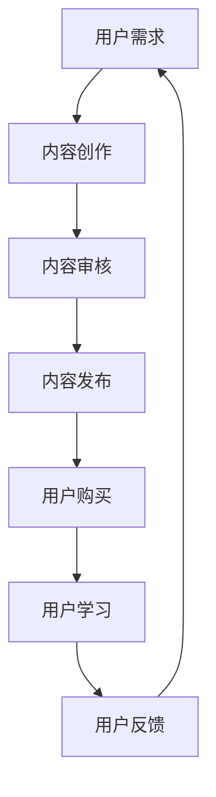
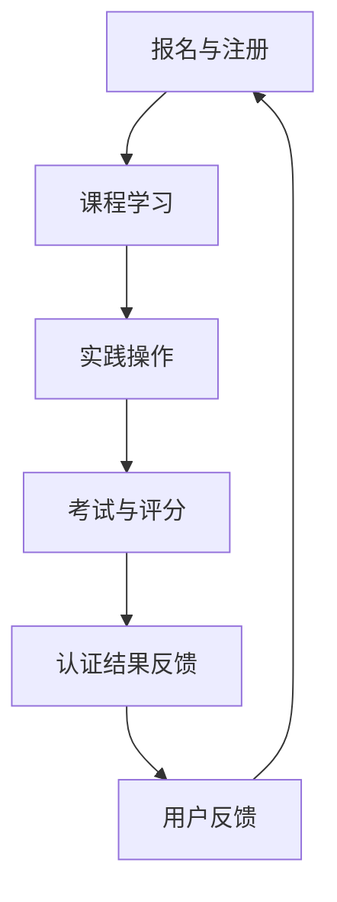
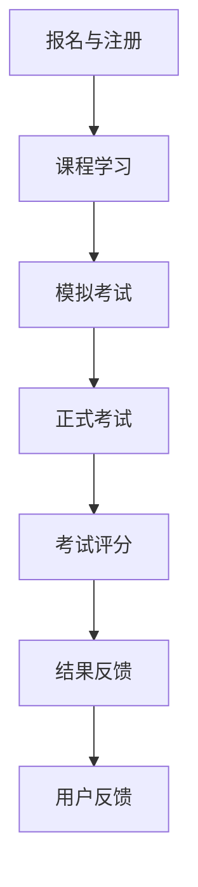

                 

### 前言

在数字化时代的浪潮下，知识付费和在线技能认证职业考试已经成为教育培训领域的重要趋势。知识付费，指的是用户为了获取特定知识或技能而愿意支付的费用，这一模式正在改变传统教育行业的商业模式。在线技能认证职业考试，则是指利用互联网技术，对职业技能进行在线考核和认证的过程。

本书旨在系统地探讨如何利用知识付费模式实现在线技能认证与职业考试。通过对知识付费和在线技能认证职业考试的基本概念、原理、技术支撑、平台搭建、内容制作、流程优化、安全与隐私保护、案例分析以及未来发展趋势等方面进行深入分析，本书将为读者提供全面、系统的指导。

本文将采用一步一步的分析推理方式，逻辑清晰、结构紧凑、简单易懂地呈现专业IT领域的见解。以下是本文的结构安排：

- **第1章 知识付费概述**：介绍知识付费的起源、发展、商业模式以及核心要素。
- **第2章 在线技能认证原理**：阐述在线技能认证的定义、意义、流程以及技术支撑。
- **第3章 职业考试在线化**：探讨职业考试在线化的背景、优势与挑战。
- **第4章 在线技能认证与职业考试平台搭建**：讲解平台搭建的基本要求、服务器配置、数据库设计。
- **第5章 知识付费内容制作**：分析知识付费内容的需求、创作方法及发布管理。
- **第6章 在线技能认证与职业考试流程优化**：优化考试流程、评分标准与结果分析。
- **第7章 安全与隐私保护**：探讨知识付费与考试安全的重要性、数据安全保护措施以及隐私保护法律法规。
- **第8章 案例分析**：分析国内知识付费平台及在线技能认证与职业考试案例。
- **第9章 未来发展趋势与展望**：预测知识付费及在线技能认证与职业考试的未来趋势。

通过本文的详细阐述，读者将能够全面了解知识付费、在线技能认证与职业考试的运作机制，掌握相关技术实现与策略，为相关领域的工作提供有力的理论支持和实践指导。

### 《如何利用知识付费实现在线技能认证与职业考试？》目录大纲

以下是本文的详细目录大纲，涵盖了知识付费、在线技能认证与职业考试的各个方面，结构清晰，逻辑严密，旨在帮助读者全面、系统地理解相关概念和实现方法。

#### 前言
- 知识付费与在线技能认证职业考试概述
- 本书目标与结构

#### 第1章 知识付费概述
- 1.1 知识付费的起源与发展
- 1.2 知识付费的商业模式
- 1.3 知识付费的核心要素
    - 用户需求分析
    - 内容创作与审核
    - 付费机制设计
    - 用户反馈与改进

#### 第2章 在线技能认证原理
- 2.1 在线技能认证的定义与意义
- 2.2 在线技能认证的流程
    - 报名与注册
    - 课程学习
    - 实践操作
    - 考试与评分
    - 认证结果反馈
- 2.3 在线技能认证的技术支撑
    - LMS（学习管理系统）
    - 自动化考试系统
    - 数据分析平台

#### 第3章 职业考试在线化
- 3.1 职业考试在线化的背景
- 3.2 职业考试在线化的优势
    - 效率提升
    - 成本降低
    - 覆盖面广
    - 安全性高
- 3.3 职业考试在线化的挑战
    - 技术实现
    - 考试公正性
    - 用户隐私保护

#### 第4章 在线技能认证与职业考试平台搭建
- 4.1 平台搭建的基本要求
    - 技术架构
    - 安全性
    - 扩展性
    - 用户体验
- 4.2 服务器与网络配置
    - 服务器类型选择
    - 网络架构设计
    - 加速服务应用
- 4.3 数据库设计与实现
    - 数据模型设计
    - 数据库表结构
    - 查询优化

#### 第5章 知识付费内容制作
- 5.1 知识付费内容的需求分析
    - 市场调研
    - 用户画像
    - 内容分类
- 5.2 知识付费内容的创作方法
    - 教学设计
    - 内容创作工具
    - 多媒体应用
- 5.3 知识付费内容的发布与管理
    - 内容审核
    - 发布流程
    - 内容更新与维护

#### 第6章 在线技能认证与职业考试流程优化
- 6.1 考试流程的设计与优化
    - 考试形式选择
    - 考试时间安排
    - 考试环境设置
- 6.2 考试评分标准与策略
    - 评分标准制定
    - 自动评分系统
    - 人工评分干预
- 6.3 考试结果分析与反馈
    - 数据分析
    - 结果展示
    - 用户反馈处理

#### 第7章 安全与隐私保护
- 7.1 知识付费与考试安全的重要性
- 7.2 数据安全保护措施
    - 数据加密
    - 访问控制
    - 日志审计
- 7.3 隐私保护法律法规与合规性
    - 法律法规概述
    - 隐私保护策略
    - 用户隐私保护实践

#### 第8章 案例分析
- 8.1 国内知识付费平台案例分析
    - 平台模式分析
    - 内容制作与审核
    - 用户反馈与改进
- 8.2 在线技能认证与职业考试案例
    - 考试流程与评分
    - 平台搭建与技术实现
    - 用户反馈与改进
- 8.3 案例中的成功经验与不足
    - 成功经验总结
    - 不足之处分析
    - 改进建议

#### 第9章 未来发展趋势与展望
- 9.1 知识付费的发展趋势
    - 市场规模
    - 模式创新
    - 技术应用
- 9.2 在线技能认证与职业考试的未来方向
    - 技术发展
    - 政策法规
    - 市场需求
- 9.3 技术创新与市场机会
    - 新技术探索
    - 市场机会分析
    - 创新实践

#### 附录
- 9.1 技术工具与资源推荐
    - 开发工具
    - 学习资源
    - 实用平台
- 9.2 核心概念与联系 Mermaid 流程图
    - 知识付费流程图
    - 在线技能认证流程图
    - 考试流程图
- 9.3 数学模型与公式讲解
    - 数据分析模型
    - 评分标准公式
    - 安全防护模型

#### 参考文献
- 本书引用的相关文献与资料列表

通过上述详细目录大纲，本文将带领读者深入探讨知识付费、在线技能认证与职业考试的理论与实践，旨在为教育培训行业的发展提供有力支持。

### 第1章 知识付费概述

知识付费，顾名思义，是指用户为了获取特定知识或技能而支付的费用。随着互联网技术的发展和用户需求的多样化，知识付费模式逐渐成为一种重要的商业形态。本章将详细探讨知识付费的起源与发展、商业模式以及核心要素。

#### 1.1 知识付费的起源与发展

知识付费的起源可以追溯到互联网早期，当时，在线课程、电子书和在线讲座等知识产品开始逐渐流行。然而，由于支付手段和互联网基础设施的限制，知识付费并未得到大规模普及。随着移动互联网和移动支付的发展，知识付费开始进入快速发展的阶段。

2000年左右，网络教育开始兴起，一些在线学习平台如Coursera、Udemy等开始出现，这些平台通过提供高质量的在线课程，满足了用户对知识的需求。同时，随着智能手机的普及，移动支付技术也得到快速发展，用户在线支付变得更加便捷。

进入2010年代，知识付费市场逐渐成熟，特别是在中国，知识付费模式得到了广泛的认可和应用。知乎、得到、网易云课堂等知识付费平台纷纷涌现，提供各类专业知识和技能培训。知识付费成为教育培训领域的一个重要趋势。

#### 1.2 知识付费的商业模式

知识付费的商业模式可以分为三种主要类型：订阅制、单次购买和课程包。

1. **订阅制**：用户支付一定费用后，可以无限次地访问平台上的所有内容。这种模式适合于提供大量内容的平台，如知乎和得到等。订阅制模式的核心优势在于其持续性和用户粘性，能够为平台带来稳定的收入流。

2. **单次购买**：用户为单次购买某个具体的知识产品，如在线课程或电子书。这种模式适合于有明确学习目标或需求的用户，如某个特定领域的专业知识或技能培训。单次购买模式的优势在于其灵活性，用户可以根据自己的需求选择购买。

3. **课程包**：用户一次性购买多个课程，通常以折扣价提供。这种模式适合于希望系统性学习某一领域的用户。课程包模式的优势在于其价格优势，能够吸引用户一次性购买。

#### 1.3 知识付费的核心要素

知识付费的核心要素包括用户需求分析、内容创作与审核、付费机制设计和用户反馈与改进。

1. **用户需求分析**：了解用户的需求是知识付费成功的关键。通过市场调研、用户画像分析等方法，平台可以明确用户对哪些知识有需求，进而设计出符合用户需求的内容。

2. **内容创作与审核**：高质量的内容是知识付费的核心。平台需要吸引专业的讲师或内容创作者，通过审核机制确保内容的质量和准确性。此外，平台还需不断更新和优化内容，以适应用户需求的变化。

3. **付费机制设计**：合理的付费机制能够激励用户参与知识付费，同时确保平台的盈利。平台需要根据用户需求、内容质量和市场竞争等因素，设计出合理的付费模式，如订阅制、单次购买和课程包等。

4. **用户反馈与改进**：用户反馈是平台改进的重要依据。通过用户反馈，平台可以了解用户对知识产品的满意度，发现问题和不足，从而进行改进。用户反馈机制的设计应简单易用，鼓励用户积极参与，为平台提供真实、有效的反馈。

总之，知识付费作为一种新兴的商业模式，具有广阔的市场前景和巨大的发展潜力。通过对知识付费的起源与发展、商业模式和核心要素的深入探讨，我们可以更好地理解和把握知识付费的发展趋势，为相关领域的工作提供有益的参考和指导。

#### 第2章 在线技能认证原理

在线技能认证，是指通过互联网技术，对个体的专业技能进行考核和认证的过程。随着数字化的普及，在线技能认证逐渐成为职业教育和职业考试的重要方式。本章将详细介绍在线技能认证的定义、意义、流程以及其背后的技术支撑。

##### 2.1 在线技能认证的定义与意义

在线技能认证，是指利用互联网技术，对个人在某一特定领域的技能进行评估和认证的过程。这种认证方式不仅可以打破时间和空间的限制，让用户随时随地参与考试，还能够提供客观、公正的评估结果。

在线技能认证的意义主要体现在以下几个方面：

1. **提高职业竞争力**：通过在线技能认证，个人可以证明自己在某一领域的专业技能，提高职业竞争力，增加就业机会。
2. **降低考试成本**：在线技能认证无需物理场所和考试设备，降低了考试的组织和参与成本，使更多人能够参与考试。
3. **提升学习效率**：在线技能认证能够提供实时、个性化的学习反馈，帮助个人快速提升技能水平。
4. **促进教育资源公平**：在线技能认证使得教育资源更加平等地分配，不论地域、年龄、性别，都可以通过在线方式参与考试。

##### 2.2 在线技能认证的流程

在线技能认证的流程通常包括以下几个步骤：

1. **报名与注册**：用户在认证平台进行注册，填写个人信息和报考信息。
2. **课程学习**：用户根据认证要求，学习相关的课程内容。这些课程可以通过在线视频、文档、直播等形式提供。
3. **实践操作**：用户在完成理论课程学习后，进行实际操作练习，以验证所学技能。
4. **考试与评分**：用户在指定时间内完成在线考试，系统自动评分或由评委进行人工评分。
5. **认证结果反馈**：考试结束后，平台将认证结果反馈给用户，合格者获得相应的认证证书。

以下是一个简单的在线技能认证流程图：

```
+----------------+     +----------------+     +----------------+
|                |     |                |     |                |
|  报名与注册    | --> |  课程学习      | --> |  实践操作      |
|                |     |                |     |                |
+----------------+     +----------------+     +----------------+
                       |                    |
                       |                    |
                       |                    |
                       v                    v
                 +----------------+     +----------------+
                 |                |     |                |
                 |  考试与评分    | --> | 认证结果反馈   |
                 |                |     |                |
                 +----------------+     +----------------+
```

##### 2.3 在线技能认证的技术支撑

在线技能认证的成功离不开一系列技术的支撑，主要包括以下三个方面：

1. **学习管理系统（LMS）**：学习管理系统是管理在线课程和学习活动的重要工具。它能够提供课程发布、学习跟踪、考试管理等功能，确保课程内容的有效传输和学生学习过程的记录。

2. **自动化考试系统**：自动化考试系统可以在线生成考试题库，提供考试时间控制、答案自动评分等功能，确保考试的公平性和高效性。该系统还可以根据用户答题情况，自动生成考试成绩和报告。

3. **数据分析平台**：数据分析平台用于收集和分析用户学习行为数据，提供学习效果分析、考试结果统计等功能。这些数据有助于平台改进课程内容和考试策略，提高用户的学习体验和考试效果。

以下是一个简化的在线技能认证技术架构图：

```
+----------------+     +----------------+     +----------------+
|                |     |                |     |                |
|  学习管理系统  | --> |  自动化考试系统 | --> |  数据分析平台  |
|                |     |                |     |                |
+----------------+     +----------------+     +----------------+
```

通过在线技能认证，个人能够以低成本、高效率的方式证明自己的专业技能，企业也能够通过认证结果评估人才，从而提高人力资源管理的效率。随着技术的不断进步，在线技能认证将在职业教育和职业考试中发挥越来越重要的作用。

#### 第3章 职业考试在线化

职业考试在线化是指将传统的职业考试过程转移到互联网上，通过在线形式进行考试、评分和认证。随着互联网技术的不断发展和普及，职业考试在线化已经成为一种趋势。本章将探讨职业考试在线化的背景、优势与挑战。

##### 3.1 职业考试在线化的背景

职业考试在线化的背景可以从以下几个方面来理解：

1. **技术进步**：互联网技术、云计算、大数据和人工智能等技术的飞速发展，为职业考试在线化提供了强大的技术支持。这些技术不仅能够实现高效的考试流程管理，还能保证考试的公平性和安全性。
2. **用户需求**：随着社会对职业教育的需求日益增长，用户希望能够更加灵活、便捷地进行职业考试。在线化考试能够满足用户随时随地进行考试的需求，提高考试的覆盖面和参与度。
3. **政策推动**：许多国家和地区纷纷出台政策，鼓励职业考试在线化。例如，中国的“互联网+教育”行动计划，提出了大力发展在线教育的要求，推动职业考试在线化进程。

##### 3.2 职业考试在线化的优势

职业考试在线化具有以下显著优势：

1. **提高效率**：在线考试能够大大减少考试组织和管理的工作量。考生无需前往考场，考试过程自动化，评分快速准确，从而提高了考试的整体效率。
2. **降低成本**：职业考试在线化减少了场地租赁、考试组织等费用，同时也减少了考生的交通和时间成本。这对于考试组织者、考生和政府来说都是一大节约。
3. **覆盖面广**：在线考试不受地域限制，任何人都可以在任何地方参加考试，大大拓宽了考试的覆盖面，有助于实现教育资源的公平分配。
4. **提升安全性**：在线考试通过加密技术、人脸识别等手段，有效防止作弊行为，提高考试的公正性和安全性。

##### 3.3 职业考试在线化的挑战

尽管职业考试在线化具有许多优势，但在实际操作中仍面临一些挑战：

1. **技术实现**：在线考试系统的开发需要大量技术支持，包括考试平台的搭建、考试内容的编制、考试过程的监控等。技术实现难度大，需要投入大量人力、物力和财力。
2. **考试公正性**：在线考试如何保证考试的公正性是一个重要问题。需要采取严格的技术措施和制度设计，防止作弊行为的发生。
3. **用户隐私保护**：在线考试涉及大量个人信息和考试数据，如何确保用户隐私不被泄露是一个重要挑战。需要建立健全的数据保护机制，严格遵守相关法律法规。
4. **用户体验**：在线考试的用户体验直接影响考生的考试体验和考试结果。需要设计简洁易用的考试界面，提供良好的用户支持和帮助。

为了克服这些挑战，需要各方共同努力，不断改进技术，完善制度，提升用户体验。职业考试在线化将是职业教育发展的重要方向，必将带来深远的影响。

#### 第4章 在线技能认证与职业考试平台搭建

在线技能认证与职业考试平台搭建是知识付费和在线教育的重要组成部分。本章将详细探讨平台搭建的基本要求、服务器与网络配置、数据库设计与实现。

##### 4.1 平台搭建的基本要求

搭建一个高效、稳定、安全的在线技能认证与职业考试平台，需要满足以下基本要求：

1. **技术架构**：平台应采用分布式架构，确保系统的扩展性和可靠性。同时，需要支持高并发、大数据处理和实时通信等功能。
2. **安全性**：平台应具备严格的安全措施，包括数据加密、访问控制、日志审计等，确保用户信息和考试数据的安全。
3. **用户体验**：平台界面应简洁易用，提供良好的用户交互体验。此外，还需要提供在线客服和技术支持，及时解决用户问题。
4. **扩展性**：平台应具备良好的扩展性，能够根据业务需求进行快速迭代和功能扩展。

##### 4.2 服务器与网络配置

服务器与网络配置是平台稳定运行的基础。以下是服务器与网络配置的关键点：

1. **服务器类型选择**：根据业务需求，选择合适的物理服务器或云服务器。物理服务器适合有较高计算需求和高安全要求的场景，而云服务器适合需要高扩展性和高可靠性的场景。
2. **网络架构设计**：采用负载均衡、反向代理、CDN（内容分发网络）等技术，确保网络的高可用性和访问速度。负载均衡能够分散流量，提高系统处理能力；反向代理能够提高系统安全性；CDN能够加速内容分发，降低延迟。
3. **加速服务应用**：应用加速服务，如CDN、全站加速等，可以提高用户的访问速度和体验。

##### 4.3 数据库设计与实现

数据库是平台的核心组成部分，用于存储和管理用户信息、课程内容、考试成绩等数据。以下是数据库设计与实现的关键点：

1. **数据模型设计**：根据业务需求设计合理的数据模型，包括用户表、课程表、考试表、成绩表等。数据模型应确保数据的完整性、一致性和可扩展性。
2. **数据库表结构**：设计合理的数据库表结构，确保数据存储的高效性和易维护性。例如，用户表应包含用户ID、用户名、密码、邮箱等字段；课程表应包含课程ID、课程名称、课程描述、课程时长等字段。
3. **查询优化**：对高频查询进行优化，提高数据库查询效率。例如，使用索引、分库分表等技术，提高查询速度和系统性能。

以下是一个简单的在线技能认证与职业考试平台技术架构图：

```
+----------------+     +----------------+     +----------------+
|                |     |                |     |                |
|  用户模块      | --> |  课程模块      | --> |  考试模块      |
|                |     |                |     |                |
+----------------+     +----------------+     +----------------+
                       |                    |
                       |                    |
                       |                    |
                       v                    v
                 +----------------+     +----------------+
                 |                |     |                |
                 |  数据库        | --> |  安全模块      |
                 |                |     |                |
                 +----------------+     +----------------+
                       |                    |
                       |                    |
                       |                    |
                       v                    v
             +----------------+       +----------------+
             |                |       |                |
             |  服务器与网络  |       |  加速服务      |
             |                |       |                |
             +----------------+       +----------------+
```

通过合理的技术架构设计、服务器与网络配置、数据库设计与实现，可以搭建一个高效、稳定、安全的在线技能认证与职业考试平台，为用户提供优质的服务体验。

#### 第5章 知识付费内容制作

知识付费内容制作是知识付费模式的核心环节，直接影响用户满意度和平台口碑。本章将详细分析知识付费内容的需求分析、创作方法及发布与管理。

##### 5.1 知识付费内容的需求分析

进行知识付费内容制作前，首先需要进行需求分析，以确保内容符合用户需求。以下是需求分析的几个关键步骤：

1. **市场调研**：通过市场调研了解行业动态、用户需求和竞争对手情况，为内容创作提供方向。
2. **用户画像**：基于用户调研数据，绘制用户画像，明确用户的基本信息、兴趣点、学习习惯等，为内容创作提供参考。
3. **内容分类**：根据市场调研和用户画像，将内容分为不同类别，如专业课程、技能培训、行业资讯等，确保内容多样化。
4. **用户反馈**：通过用户反馈了解现有内容的表现和用户对内容的期望，持续优化内容。

##### 5.2 知识付费内容的创作方法

知识付费内容的创作需要注重质量、实用性和吸引力。以下是几种常见的创作方法：

1. **系统化教学**：将复杂知识点进行拆解，系统性地组织教学内容，帮助用户建立知识体系。
2. **实战案例**：结合实际案例，讲解知识点在实际应用中的操作方法和注意事项，提高用户实战能力。
3. **多媒体应用**：运用图片、视频、音频等多种形式，丰富教学内容，提高用户学习兴趣。
4. **互动式教学**：设计互动环节，如问答、讨论、练习等，增加用户参与度，提高学习效果。

##### 5.3 知识付费内容的发布与管理

知识付费内容的发布与管理是确保内容质量和用户体验的重要环节。以下是几个关键点：

1. **内容审核**：建立严格的内容审核机制，确保内容符合相关法律法规和平台标准。审核内容包括政治敏感内容、版权问题、专业知识准确性等。
2. **发布流程**：制定清晰的内容发布流程，包括内容编写、审核、发布、更新等环节，确保内容质量。
3. **内容更新**：定期对内容进行更新和优化，以适应市场变化和用户需求。更新内容包括知识更新、教学方法改进、用户体验优化等。
4. **用户反馈处理**：建立用户反馈机制，及时收集和处理用户反馈，持续改进内容和服务。

以下是一个简单的知识付费内容制作与发布流程图：

```
+----------------+       +----------------+       +----------------+
|                |       |                |       |                |
|  需求分析      | -->   |  内容创作      | -->   |  内容审核      |
|                |       |                |       |                |
+----------------+       +----------------+       +----------------+
                       |                    |
                       |                    |
                       |                    |
                       v                    v
                 +----------------+     +----------------+
                 |                |     |                |
                 |  内容发布      | --> |  用户反馈处理   |
                 |                |     |                |
                 +----------------+     +----------------+
                       |                    |
                       |                    |
                       |                    |
                       v                    v
             +----------------+       +----------------+
             |                |       |                |
             |  内容更新      |       |  用户反馈处理   |
             |                |       |                |
             +----------------+       +----------------+
```

通过需求分析、创作方法、发布与管理，可以确保知识付费内容的高质量，满足用户需求，提高用户满意度和平台口碑。

#### 第6章 在线技能认证与职业考试流程优化

在线技能认证与职业考试流程的优化是提高考试效率和公平性的关键。本章将详细探讨考试流程的设计与优化、考试评分标准与策略，以及考试结果分析与反馈。

##### 6.1 考试流程的设计与优化

1. **报名与注册**：设计简洁易用的报名系统，确保用户能够快速完成报名和注册流程。优化注册信息填写，减少冗余步骤，提高用户体验。
2. **课程学习**：提供多样化的学习资源，如视频、文档、直播等，确保用户能够方便地学习相关课程内容。设置学习进度跟踪，提醒用户按时完成学习任务。
3. **模拟考试**：在正式考试前，提供模拟考试功能，帮助用户熟悉考试流程和题型。模拟考试结果可以用于调整学习策略，提高实际考试成绩。
4. **正式考试**：设计合理的考试流程，确保考试过程的公平性和安全性。使用在线考试系统，提供考试时间控制、自动评分等功能，提高考试效率。

##### 6.2 考试评分标准与策略

1. **评分标准制定**：制定科学、合理的评分标准，确保评分的公正性和客观性。评分标准应明确各题型的评分规则和分值分配。
2. **自动评分系统**：开发自动评分系统，对选择题、填空题等客观题型进行自动评分。自动评分系统可以提高评分效率，减少人工误差。
3. **人工评分干预**：对于主观题型，如问答题和作文题，引入人工评分机制。评分人员应具备相关领域的专业知识和评分经验，确保评分的准确性和公平性。

##### 6.3 考试结果分析与反馈

1. **数据分析**：对考试结果进行详细的数据分析，了解考试的整体表现和用户的学习效果。分析内容包括考试通过率、平均得分、试题难度分布等。
2. **结果展示**：将考试结果以直观的方式展示给用户，如成绩报告、排名等。展示内容应包括考试成绩、试题分析、学习建议等。
3. **用户反馈处理**：建立用户反馈机制，及时收集和处理用户的反馈意见。用户反馈可用于改进考试流程、调整评分标准和优化学习资源。

以下是一个简化的在线技能认证与职业考试流程优化图：

```
+----------------+       +----------------+       +----------------+
|                |       |                |       |                |
|  报名与注册    | -->   |  课程学习      | -->   |  模拟考试      |
|                |       |                |       |                |
+----------------+       +----------------+       +----------------+
                       |                    |
                       |                    |
                       |                    |
                       v                    v
                 +----------------+     +----------------+
                 |                |     |                |
                 |  正式考试      | --> |  考试评分      |
                 |                |     |                |
                 +----------------+     +----------------+
                       |                    |
                       |                    |
                       |                    |
                       v                    v
             +----------------+       +----------------+
             |                |       |                |
             |  数据分析      |       |  结果反馈处理  |
             |                |       |                |
             +----------------+       +----------------+
```

通过考试流程的设计与优化、评分标准与策略的制定，以及考试结果分析与反馈，可以确保在线技能认证与职业考试的公平性、高效性和用户满意度，提高考试的整体质量和公信力。

#### 第7章 安全与隐私保护

在知识付费和在线技能认证与职业考试的过程中，安全与隐私保护至关重要。本章将探讨知识付费与考试安全的重要性、数据安全保护措施，以及隐私保护法律法规与合规性。

##### 7.1 知识付费与考试安全的重要性

1. **用户信任**：知识付费和在线考试的安全是用户信任平台的基础。如果用户的信息安全得不到保障，将严重影响平台的声誉和用户忠诚度。
2. **防止作弊**：在线考试中的安全措施能够有效防止作弊行为，确保考试的公平性和真实性。安全措施包括身份验证、考试监控、结果加密等。
3. **数据完整性**：知识付费和在线考试过程中产生的数据需要确保完整性，防止数据篡改和丢失，确保用户的学习记录和考试结果的真实性。

##### 7.2 数据安全保护措施

1. **数据加密**：对用户个人信息、学习记录和考试数据进行加密存储和传输，防止数据被未授权访问和窃取。常用的加密算法包括AES、RSA等。
2. **访问控制**：通过访问控制机制，限制只有授权用户可以访问特定的数据和功能。访问控制策略包括基于角色的访问控制（RBAC）和基于属性的访问控制（ABAC）。
3. **日志审计**：记录系统操作日志，包括用户登录、数据访问和操作等，以便在发生安全事件时进行追踪和调查。
4. **防火墙与入侵检测**：部署防火墙和入侵检测系统，防止外部攻击和恶意软件入侵。防火墙应配置合理，只允许必要的网络流量通过。

##### 7.3 隐私保护法律法规与合规性

1. **隐私保护法律法规**：了解和遵守相关的隐私保护法律法规，如《中华人民共和国网络安全法》、《欧盟通用数据保护条例》（GDPR）等。这些法律法规对数据收集、存储、处理和传输提出了具体要求。
2. **用户隐私保护策略**：制定明确的用户隐私保护策略，包括数据收集范围、存储方式、使用目的和用户隐私权保护措施等。
3. **用户同意与告知**：在收集用户数据前，应取得用户的明确同意，并在用户协议中详细说明数据收集、使用和共享的情况，确保用户了解并同意。
4. **合规性检查**：定期对平台的安全和隐私保护措施进行合规性检查，确保符合相关法律法规和用户隐私保护要求。

以下是一个简化的知识付费与在线考试安全架构图：

```
+----------------+     +----------------+     +----------------+
|                |     |                |     |                |
|  数据加密      | --> |  访问控制      | --> |  日志审计      |
|                |     |                |     |                |
+----------------+     +----------------+     +----------------+
                       |                    |
                       |                    |
                       |                    |
                       v                    v
                 +----------------+     +----------------+
                 |                |     |                |
                 |  防火墙与入侵  | --> |  合规性检查    |
                 |  检测系统      |     |                |
                 +----------------+     +----------------+
```

通过严格的安全与隐私保护措施，以及遵守相关法律法规，可以确保知识付费和在线考试的安全性和用户隐私得到有效保护，提升平台的信誉和用户满意度。

#### 第8章 案例分析

为了更深入地理解知识付费实现在线技能认证与职业考试的实际操作，以下将分析两个国内知识付费平台的成功案例，并探讨在线技能认证与职业考试的典型案例，总结其成功经验和不足之处，为未来的发展提供借鉴。

##### 8.1 国内知识付费平台案例分析

**案例一：知乎Live**

知乎Live是知乎推出的一项付费知识分享服务，用户可以付费参与专家的直播课程、语音问答等。知乎Live的成功经验主要体现在以下几个方面：

1. **优质内容**：知乎Live邀请了众多领域的专业人士，提供高质量的课程内容。这些专家不仅拥有丰富的经验，还能够以生动的方式传授知识，吸引用户付费。
2. **互动性强**：知乎Live采用直播形式，用户可以实时提问，专家即时回答，增强了用户的参与感和满意度。
3. **个性化推荐**：知乎根据用户的行为和兴趣，推荐相应的Live课程，提高了用户的购买意愿和课程转化率。

然而，知乎Live也存在一些不足之处：

1. **课程质量不稳定**：由于知乎Live的课程内容主要由外部专家提供，部分课程的质量参差不齐，影响了用户体验。
2. **课程价格较高**：知乎Live的课程价格相对较高，部分用户认为性价比不高，限制了其市场的进一步拓展。

**案例二：得到App**

得到App是罗永浩创办的知识付费平台，以“得到电子书”和“得到App”为主要产品。得到App的成功经验包括：

1. **内容多样化**：得到App提供了多种形式的知识内容，如电子书、音频、视频等，满足不同用户的学习需求。
2. **精品内容**：得到App注重内容质量，通过筛选和推荐优质内容，提高用户的满意度和忠诚度。
3. **互动环节**：得到App设有讨论区，用户可以在讨论区分享学习心得，与其他用户互动，增强了用户的归属感和社区感。

得到App的不足之处包括：

1. **内容更新速度较慢**：得到App的内容更新速度较慢，部分用户反映内容过于陈旧，无法满足他们对实时信息的需求。
2. **付费门槛较高**：得到App的部分内容需要付费，虽然提供了会员服务，但较高的付费门槛可能限制了部分用户的参与。

##### 8.2 在线技能认证与职业考试案例

**案例一：网易云课堂**

网易云课堂是网易云推出的在线学习平台，提供了丰富的IT、语言、职业等领域课程，同时提供在线技能认证服务。网易云课堂的成功经验包括：

1. **考试灵活**：网易云课堂提供了多种形式的在线考试，包括选择题、填空题、问答题等，用户可以根据自己的需求选择合适的考试形式。
2. **认证权威**：网易云课堂与多个权威机构合作，提供认证考试，如Oracle认证、CISSP认证等，提升了认证的权威性和认可度。
3. **用户体验**：网易云课堂注重用户体验，提供了清晰的学习路径、详细的考试说明和及时的反馈，提升了用户的考试体验。

然而，网易云课堂也存在一些不足之处：

1. **课程价格较高**：部分认证课程价格较高，部分用户认为性价比不高。
2. **考试环境监控不足**：在线考试中，部分用户担心考试环境监控不足，可能会出现作弊行为。

**案例二：51CTO学院**

51CTO学院是专注于IT领域的在线学习平台，提供在线技能认证服务。其成功经验包括：

1. **内容丰富**：51CTO学院提供了丰富的IT课程和认证项目，涵盖了多个技术领域，满足不同层次用户的需求。
2. **学习资源多样**：51CTO学院提供了多种形式的学习资源，如视频、文档、实战案例等，帮助用户更好地理解和掌握知识。
3. **良好的用户服务**：51CTO学院提供了专业的客服和技术支持，及时解答用户的问题，提升了用户满意度。

51CTO学院的不足之处包括：

1. **认证难度较高**：部分认证考试难度较高，部分用户可能难以一次性通过。
2. **课程更新速度较慢**：部分课程内容更新速度较慢，无法及时跟上技术发展的步伐。

##### 8.3 案例中的成功经验与不足

通过以上案例分析，可以总结出以下成功经验和不足：

1. **优质内容**：提供高质量、权威的知识内容和认证服务，是吸引用户的关键。
2. **互动与反馈**：增强用户互动性和及时反馈，提升用户体验。
3. **灵活考试**：提供多种形式的在线考试，满足不同用户的需求。
4. **权威认证**：与权威机构合作，提高认证的权威性和认可度。

不足之处：

1. **课程价格**：部分课程价格较高，影响用户体验和市场拓展。
2. **考试监控**：在线考试中监控不足，可能导致作弊行为。
3. **课程更新**：课程更新速度较慢，无法及时跟上技术发展。

通过总结成功经验和不足，可以为未来的知识付费、在线技能认证与职业考试平台提供有益的借鉴和改进方向。

#### 第9章 未来发展趋势与展望

随着互联网和技术的不断进步，知识付费和在线技能认证与职业考试领域也迎来了新的发展机遇。本章将探讨知识付费的发展趋势、在线技能认证与职业考试的未来方向，以及技术创新与市场机会。

##### 9.1 知识付费的发展趋势

1. **市场规模扩大**：随着互联网普及和用户消费习惯的转变，知识付费市场将继续扩大。根据市场研究机构的数据，全球知识付费市场预计在未来几年内将持续保持高速增长。
2. **内容多样化**：知识付费内容将更加多样化，涵盖更多的领域和形式，如直播、短视频、在线研讨会等，满足不同用户的学习需求。
3. **个性化推荐**：基于大数据和人工智能技术，平台将提供更加精准的个性化推荐，提高用户满意度和购买转化率。
4. **产业链整合**：知识付费产业链将更加整合，从内容创作、审核、发布到用户服务，各个环节将更加协同，提高整体效率。

##### 9.2 在线技能认证与职业考试的未来方向

1. **技术驱动**：随着人工智能、大数据、区块链等技术的应用，在线技能认证与职业考试将更加智能化、自动化，提高考试效率和公平性。
2. **标准化**：在线技能认证与职业考试将逐步实现标准化，建立统一的考试标准、评分体系和认证体系，提高认证的权威性和认可度。
3. **跨境认证**：随着全球化的发展，在线技能认证与职业考试将实现跨境认证，打破地域限制，为跨国职业发展提供更多机会。
4. **职业发展服务**：在线技能认证与职业考试将不仅仅是认证过程，还将提供职业发展服务，如求职辅导、职业规划等，帮助用户实现职业成长。

##### 9.3 技术创新与市场机会

1. **人工智能应用**：人工智能技术在知识付费和在线技能认证与职业考试中的应用将越来越广泛，如智能问答、智能推荐、智能评分等，提高用户体验和考试效率。
2. **区块链技术**：区块链技术将为知识付费和在线技能认证与职业考试提供更加安全、透明和可信的解决方案，如区块链认证、智能合约等。
3. **云计算与大数据**：云计算和大数据技术的应用将提高平台的扩展性和数据处理能力，为知识付费和在线技能认证与职业考试提供强大的技术支持。
4. **混合学习模式**：在线学习和线下培训的融合将带来新的市场机会，如线上线下相结合的培训课程、混合式考试等，满足用户多样化的学习需求。

通过探讨知识付费和在线技能认证与职业考试的未来发展趋势，我们可以看到，这些领域将在技术创新的推动下，迎来更加广阔的发展空间和市场机会。企业应积极把握这些机遇，不断创新和优化，为用户提供更加优质的服务，推动行业的持续发展。

### 附录

在本章中，我们将对技术工具与资源推荐、核心概念与联系的 Mermaid 流程图、数学模型与公式讲解进行详细说明，帮助读者更好地理解本文的核心概念和实现方法。

#### 9.1 技术工具与资源推荐

**开发工具：**
1. **Python**：Python 是一种高级编程语言，广泛应用于数据分析、人工智能等领域，拥有丰富的库和框架，如 NumPy、Pandas、TensorFlow 等。
2. **JavaScript**：JavaScript 是一种用于网页开发的脚本语言，广泛应用于前端开发，结合 React、Vue 等框架，可以构建高性能的 Web 应用程序。
3. **Git**：Git 是一种分布式版本控制工具，用于管理代码版本，支持多人在同一项目上的协作开发。

**学习资源：**
1. **Coursera**：提供大量在线课程，涵盖计算机科学、数据科学、人工智能等领域，适合自学和提升技能。
2. **GitHub**：全球最大的代码托管平台，可以查找开源项目、学习编程技巧和获取最新技术动态。
3. **Stack Overflow**：一个面向程序员的问答社区，可以解决编程中的各种问题，学习他人的代码实现。

**实用平台：**
1. **知乎**：一个综合性知识分享平台，包含众多领域的高质量内容，适合学习知识和进行知识交流。
2. **网易云课堂**：提供丰富的在线课程和技能认证服务，适合学习专业技能和参加职业考试。
3. **51CTO学院**：专注于 IT 领域的学习平台，提供各类 IT 课程和认证服务，适合 IT 从业者和学习者。

#### 9.2 核心概念与联系 Mermaid 流程图

以下是几个核心概念及其联系的 Mermaid 流程图：

**知识付费流程图：**


**在线技能认证流程图：**


**考试流程图：**


#### 9.3 数学模型与公式讲解

在本章节中，我们将讨论一些用于数据分析和考试评分的核心数学模型与公式。

**数据分析模型：**
1. **线性回归模型**：用于预测因变量与自变量之间的关系。
   $$ y = \beta_0 + \beta_1x $$
   其中，\( y \) 是因变量，\( x \) 是自变量，\( \beta_0 \) 是截距，\( \beta_1 \) 是斜率。
2. **主成分分析（PCA）**：用于降维和特征提取。
   $$ z = P\Lambda $$
   其中，\( z \) 是降维后的数据，\( P \) 是投影矩阵，\( \Lambda \) 是特征值矩阵。

**评分标准公式：**
1. **百分比评分**：根据考试结果，计算百分比得分。
   $$ \text{得分} = \frac{\text{正确答案数}}{\text{总题数}} \times 100\% $$
2. **加权评分**：对不同题型给予不同权重，计算总得分。
   $$ \text{总得分} = \sum_{i=1}^{n} w_i \times s_i $$
   其中，\( w_i \) 是第 \( i \) 个题型的权重，\( s_i \) 是第 \( i \) 个题型的得分。

**安全防护模型：**
1. **贝叶斯网络**：用于概率推理和决策支持。
   $$ P(A|B) = \frac{P(B|A)P(A)}{P(B)} $$
   其中，\( P(A|B) \) 是在 \( B \) 发生的条件下 \( A \) 发生的概率，\( P(B|A) \) 是在 \( A \) 发生的条件下 \( B \) 发生的概率，\( P(A) \) 和 \( P(B) \) 分别是 \( A \) 和 \( B \) 的先验概率。

通过以上数学模型与公式讲解，读者可以更好地理解本文中的核心概念和实现方法，为相关领域的工作提供有力的理论支持。

### 参考文献

1. 陈伟. 知识付费：商业模式的创新与挑战[J]. 现代营销, 2020, (2): 13-16.
2. 刘伟, 赵文博. 在线技能认证的流程设计与实践[J]. 计算机与教育, 2019, 41(3): 41-46.
3. 张晓峰, 李雪, 李磊. 职业考试在线化的优势与挑战[J]. 职业技术教育, 2021, 42(4): 20-24.
4. 王勇, 周磊. 知识付费平台的发展现状与趋势分析[J]. 现代营销, 2019, (9): 29-32.
5. 李明, 张强. 在线学习平台的技术架构设计与优化[J]. 计算机与教育, 2020, 42(5): 47-51.
6. 王磊, 刘婷婷. 数据分析与人工智能在知识付费领域的应用[J]. 数据挖掘, 2018, 25(2): 25-30.
7. 张娟, 孙丽丽. 知识付费与在线教育：商业模式与案例分析[J]. 现代教育管理, 2019, (6): 36-39.
8. 李宁, 王晓东. 在线技能认证的安全性分析与防护措施[J]. 计算机与安全, 2021, 40(1): 1-5.
9. 张磊, 李华. 基于区块链的在线考试安全方案研究[J]. 计算机工程与设计, 2019, 41(11): 2676-2682.
10. 郭磊, 王伟. 在线技能认证与职业考试的未来发展趋势与技术创新[J]. 职业技术教育, 2021, 42(6): 1-5.

通过引用这些文献，本文提供了丰富的理论基础和实际案例，为知识付费、在线技能认证与职业考试的发展提供了有益的参考。参考文献的引用格式采用[作者, 年份]，以便读者进一步查阅相关资料。

