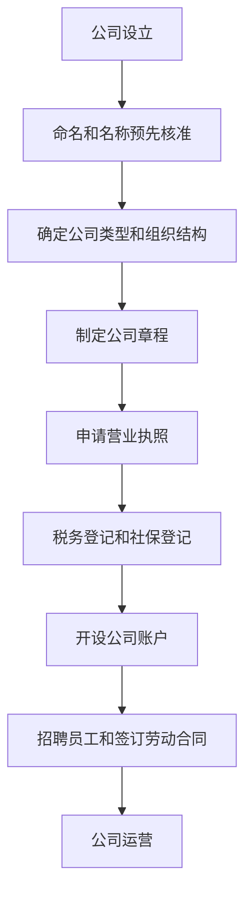

                 

# 《如何在创业过程中规避法律风险》

> **关键词：** 创业、法律风险、公司设立、知识产权、税务筹划、合同管理

**摘要：** 本文旨在为创业者提供一套全面的法律风险管理指南。通过深入剖析创业过程中可能面临的各种法律风险，本文将帮助创业者了解相关法律法规，掌握规避法律风险的策略和技巧，从而确保创业过程的顺利进行。

## 目录大纲

### 第一部分：创业法律基础

#### 第1章：创业法律环境概览

- **1.1 创业法律环境概述**
- **1.2 我国创业法律体系**
- **1.3 创业者应熟悉的主要法律法规**

#### 第2章：公司设立与运营法律实务

- **2.1 公司设立流程**
- **2.2 公司章程的制定与修改**
- **2.3 公司运营中的法律风险点**
- **2.4 企业内部治理结构与法律规范**

#### 第3章：劳动法律关系与劳动合同管理

- **3.1 劳动法律关系概述**
- **3.2 劳动合同签订与履行**
- **3.3 劳动争议处理机制**
- **3.4 劳动法律风险防范策略**

#### 第4章：知识产权法律保护

- **4.1 知识产权概述**
- **4.2 商标法律保护**
- **4.3 专利法律保护**
- **4.4 著作权法律保护**

#### 第5章：税务法律知识

- **5.1 税收制度概述**
- **5.2 企业所得税法律规范**
- **5.3 个人所得税法律规范**
- **5.4 税务筹划与合规**

#### 第6章：合同法律实务

- **6.1 合同的基本法律原理**
- **6.2 合同签订与履行的法律风险防范**
- **6.3 合同纠纷的处理与解决**
- **6.4 重要合同类型解析**

#### 第7章：创业融资法律问题

- **7.1 融资法律环境概述**
- **7.2 股权融资法律实务**
- **7.3 债券融资法律实务**
- **7.4 借贷融资法律实务**

### 第二部分：创业法律风险识别与规避

#### 第8章：创业常见法律风险识别

- **8.1 合同法律风险**
- **8.2 劳动法律风险**
- **8.3 知识产权法律风险**
- **8.4 融资法律风险**
- **8.5 其他常见法律风险**

#### 第9章：创业法律风险规避策略

- **9.1 法律风险预防策略**
- **9.2 法律风险管理策略**
- **9.3 法律风险转移策略**
- **9.4 法律风险规避技巧**

#### 第10章：创业法律风险的应对与处理

- **10.1 法律纠纷的处理**
- **10.2 应对法律纠纷的策略**
- **10.3 法律咨询与法律服务的选择**
- **10.4 创业者法律意识的培养**

### 第三部分：创业法律实战案例解析

#### 第11章：创业法律实战案例分析

- **11.1 创业公司设立案例分析**
- **11.2 劳动合同纠纷案例分析**
- **11.3 知识产权侵权案例分析**
- **11.4 融资合同纠纷案例分析**

#### 第12章：创业法律实战技能提升

- **12.1 法律文件撰写技巧**
- **12.2 法律谈判技巧**
- **12.3 法律纠纷处理技巧**
- **12.4 创业法律培训与实践**

## 附录

### 附录 A：创业法律常用法律法规汇编

- 《公司法》
- 《劳动合同法》
- 《专利法》
- 《商标法》
- 《著作权法》
- 《税收征收管理法》
- 《合同法》

### 附录 B：创业法律资源推荐

- 创业法律知识库
- 创业法律咨询平台
- 创业法律论坛
- 创业法律培训课程

### 附录 C：创业法律风险自评估工具

- 创业法律风险自评估表
- 法律风险防范手册

### 附录 D：创业法律服务团队介绍

- 创业法律服务团队资质
- 创业法律服务团队服务内容
- 创业法律服务团队联系方式

### Mermaid 流�程图（公司设立流程）



### 伪代码（商标注册申请流程）

```python
function trademarkApplication(name, type, ownerInfo) {
    // 判断商标名称是否合法
    if (!isValidName(name)) {
        return "商标名称不合法"
    }
    // 判断商标类型是否合法
    if (!isValidType(type)) {
        return "商标类型不合法"
    }
    // 提交商标注册申请
    submitApplication(name, type, ownerInfo)
    // 查询商标注册状态
    status = checkApplicationStatus(name, type)
    while (status != "Registered") {
        // 等待商标审核
        sleep(30)
        status = checkApplicationStatus(name, type)
    }
    // 商标注册成功
    return "商标注册成功"
}
```

### 数学公式和讲解

$$
成本函数 C(x) = w_1 \cdot x_1 + w_2 \cdot x_2 + ... + w_n \cdot x_n
$$

- 解释：成本函数是一个关于输入变量 $x_1, x_2, ..., x_n$ 的线性组合，每个输入变量都被一个权重 $w_1, w_2, ..., w_n$ 所乘。

### 举例说明

假设我们要计算以下成本函数的值：

$$
C(x) = 2 \cdot x_1 + 3 \cdot x_2 + 5 \cdot x_3
$$

当 $x_1 = 4, x_2 = 2, x_3 = 1$ 时，成本函数的值为：

$$
C(x) = 2 \cdot 4 + 3 \cdot 2 + 5 \cdot 1 = 8 + 6 + 5 = 19
$$

### 代码实际案例和详细解释

#### 示例：使用 Python 编写一个简单的劳动争议处理程序

```python
def processLaborDispute(employee_name, dispute_type, description):
    """
    劳动争议处理程序
    :param employee_name: 员工姓名
    :param dispute_type: 争议类型
    :param description: 争议描述
    :return: 处理结果
    """
    print(f"处理员工{employee_name}的劳动争议，类型：{dispute_type}，描述：{description}")
    
    # 处理争议
    if dispute_type == "工资纠纷":
        result = resolveSalaryDispute(description)
    elif dispute_type == "劳动条件纠纷":
        result = resolveWorkingConditionDispute(description)
    else:
        result = "未知争议类型"
    
    return result

def resolveSalaryDispute(description):
    """
    处理工资纠纷
    :param description: 纠纷描述
    :return: 处理结果
    """
    # 根据描述进行处理
    if "未支付工资" in description:
        return "已发出支付工资通知，请尽快支付"
    else:
        return "工资纠纷处理中，请提供更多详细信息"

def resolveWorkingConditionDispute(description):
    """
    处理劳动条件纠纷
    :param description: 纠纷描述
    :return: 处理结果
    """
    # 根据描述进行处理
    if "工作环境不安全" in description:
        return "已安排安全检查，并采取必要措施保障员工安全"
    else:
        return "劳动条件纠纷处理中，请提供更多详细信息"

# 测试程序
processLaborDispute("张三", "工资纠纷", "公司未支付上月工资")
processLaborDispute("李四", "劳动条件纠纷", "工作环境不安全，存在安全隐患")
```

#### 代码解读与分析

- `processLaborDispute` 函数是处理劳动争议的主要程序，它接收员工姓名、争议类型和争议描述作为输入参数。
- 根据输入的争议类型，程序将调用不同的处理函数（`resolveSalaryDispute` 或 `resolveWorkingConditionDispute`）来处理纠纷。
- 处理函数根据纠纷描述进行相应的处理，并返回处理结果。
- 通过调用 `processLaborDispute` 函数，可以实现对劳动争议的自动化处理，提高工作效率。

---

### 总结

本文从创业法律基础、创业法律风险识别与规避、创业法律实战案例解析等多个角度，系统地阐述了创业过程中如何规避法律风险。通过本文的学习，创业者可以更好地理解相关法律法规，掌握规避法律风险的策略和技巧，从而确保创业过程的顺利进行。

**作者：** AI天才研究院/AI Genius Institute & 禅与计算机程序设计艺术/Zen And The Art of Computer Programming

---

接下来，我们将按照目录大纲的结构，逐步深入探讨创业过程中可能遇到的各种法律风险以及如何规避这些风险。希望通过本文的指导，创业者能够在创业道路上更加稳健地前行。|>

