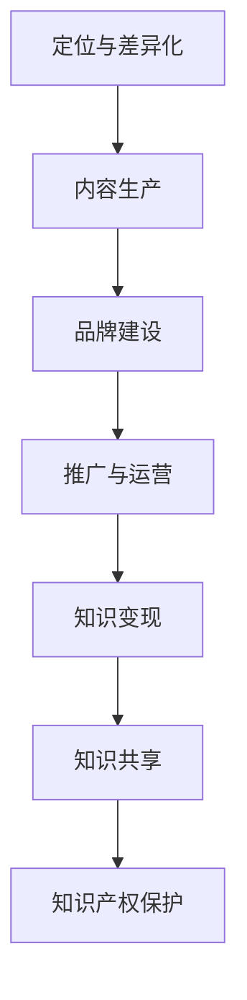

                 

# 如何打造个人知识付费品牌IP

## 关键词
个人知识付费、品牌IP构建、内容营销、算法优化、项目实战

## 摘要
本文将深入探讨如何打造个人知识付费品牌IP。首先，我们定义了个人知识付费品牌IP的核心概念，并详细阐述了其在知识经济中的地位。接着，通过逻辑清晰的算法原理讲解，我们展示了内容营销策略、用户行为分析模型、用户留存与流失预测模型以及个性化推荐模型的数学公式和算法应用。随后，通过一个实际项目案例，我们详细介绍了环境搭建、源代码实现、代码解析到部署与运维的完整过程。最后，本文提供了构建个人知识付费品牌IP所需的工具与资源，并总结了全文的重点内容。

---

### 第一部分：核心概念与联系

#### 核心概念原理和架构

**个人知识付费品牌IP**是个人通过其专业知识、技能和经验，结合商业运作形成的一种具有市场价值的知识产权。这一概念涵盖了个人知识、付费、品牌和知识产权四个核心组成部分：

1. **个人知识**：个人所拥有的专业知识、技能、见解和经验。
2. **付费**：用户需要支付费用以获取这些知识内容。
3. **品牌**：个人知识付费品牌是通过个人形象、标识、定位等构建的，具有辨识度的品牌形象。
4. **知识产权**：包括商标、版权等法律保护，确保个人知识的独占性和商业价值。

##### 个人知识付费品牌IP的构建流程

构建个人知识付费品牌IP需要经历以下几个关键步骤：

1. **定位与差异化**：明确目标受众和品牌差异化点，确保内容的独特性和专业性。
2. **内容生产**：生产高质量的知识内容，包括文章、视频、课程等形式。
3. **品牌建设**：打造个人品牌形象，包括命名、标志、口号等。
4. **推广与运营**：通过多种渠道进行内容推广，包括社交媒体、SEO、广告等，并进行持续的内容更新和用户互动。

#### 个人知识付费品牌IP在知识经济中的地位

个人知识付费品牌IP在知识经济时代具有重要的地位和作用：

1. **知识变现**：个人通过知识付费实现知识变现，提升收入。
2. **知识共享**：个人知识付费品牌IP可以促进知识的共享和传播，推动社会知识水平的提升。
3. **知识产权保护**：品牌IP的保护有助于个人知识产权的维护和商业价值的最大化。

##### 个人知识付费品牌IP与其他知识付费形式的区别

与传统的知识付费形式（如课程、讲座）相比，个人知识付费品牌IP具有以下特点：

1. **个性化**：个人品牌IP具有独特的个人风格和个性，与品牌相关联。
2. **持续性**：个人知识付费品牌IP可以持续产生价值，而非一次性的知识传输。
3. **互动性**：品牌IP与用户之间可以建立更紧密的互动关系，增强用户粘性。

#### 个人知识付费品牌IP的市场前景

随着互联网和知识经济的发展，个人知识付费品牌IP具有广阔的市场前景：

1. **需求增长**：随着人们对于专业知识和技能的需求增加，个人知识付费品牌IP的需求也将持续增长。
2. **商业模式多样化**：个人知识付费品牌IP的商业模式可以更加多样化，包括会员制、知识星球、付费问答等多种形式。
3. **跨界合作**：个人知识付费品牌IP可以与其他行业进行跨界合作，拓展市场空间。

### Mermaid 流程图



### 个人知识付费品牌IP构建的核心挑战

构建个人知识付费品牌IP面临以下核心挑战：

1. **内容质量**：保证内容的专业性和质量是构建品牌的基础。
2. **品牌定位**：清晰的定位有助于品牌在市场中脱颖而出。
3. **用户互动**：持续的用户互动是提升用户粘性和忠诚度的关键。
4. **市场适应**：快速适应市场变化，调整策略和内容。

---

### 第二部分：核心算法原理讲解

#### 2.1 内容营销策略与算法原理

**内容营销策略**是个人知识付费品牌IP构建的核心之一，其基础在于对用户需求的精准把握和内容创作的创意性。以下为内容营销策略的核心算法原理讲解：

##### 用户需求分析算法

用户需求分析是内容创作的前提，算法原理包括：

1. **大数据分析**：利用用户行为数据，如搜索记录、浏览习惯等，分析用户兴趣点。
2. **语义分析**：通过自然语言处理技术，对用户评论、反馈等进行语义分析，获取用户需求。

**用户需求分析算法：**

```python
# 用户需求分析伪代码
def analyze_user_needs(user_data):
    # 大数据分析
    interests = analyze_data(user_data)
    
    # 语义分析
    feedback = extract_semantic_information(user_data)
    
    # 结合大数据分析和语义分析结果
    combined_needs = combine_interests_and_feedback(interests, feedback)
    
    return combined_needs
```

##### 内容创作优化算法

内容创作的优化算法旨在提高内容的质量和用户参与度，具体包括：

1. **标题优化算法**：基于用户浏览和点击行为，使用机器学习算法优化标题，提高点击率。
2. **内容推荐算法**：利用协同过滤、内容相似度等算法，为用户推荐相关内容。

**标题优化算法：**

```python
# 标题优化伪代码
def optimize_title(title, user_click_data):
    # 基于用户点击数据，计算标题与用户兴趣的匹配度
    match_score = calculate_match_score(title, user_click_data)
    
    # 使用机器学习算法优化标题
    optimized_title = machine_learning_optimize_title(title, match_score)
    
    return optimized_title
```

**内容推荐算法：**

```python
# 内容推荐伪代码
def recommend_content(user_interests, content_database):
    # 计算用户与内容的相似度
    similarity_scores = calculate_similarity_scores(user_interests, content_database)
    
    # 排序并推荐相似度最高的内容
    recommended_contents = sort_and_recommended_contents(similarity_scores, content_database)
    
    return recommended_contents
```

##### 社交媒体互动算法

社交媒体互动是品牌推广的重要途径，算法原理包括：

1. **社交媒体监控算法**：实时监控社交媒体上的品牌提及和用户反馈，进行舆情分析。
2. **互动优化算法**：根据用户互动行为，调整内容发布策略和时间，提高互动效果。

**社交媒体互动算法：**

```python
# 社交媒体监控伪代码
def monitor_social_media品牌提及和用户反馈，进行舆情分析。
def monitor_social_media(user_feedback):
    # 提取用户反馈的关键词和情感倾向
    keywords = extract_keywords(user_feedback)
    sentiment = extract_sentiment(user_feedback)
    
    # 分析舆情
    sentiment_analysis = analyze_sentiment(keywords, sentiment)
    
    return sentiment_analysis
```

**互动优化算法：**

```python
# 互动优化伪代码
def optimize_interactions(user_behavior, content_release_strategy):
    # 分析用户互动行为
    interaction_data = analyze_user_behavior(user_behavior)
    
    # 调整内容发布策略
    optimized_strategy = adjust_content_release_strategy(content_release_strategy, interaction_data)
    
    return optimized_strategy
```

##### 品牌影响力评估算法

品牌影响力评估是衡量个人知识付费品牌IP成功与否的重要指标，算法原理包括：

1. **社交媒体影响力指数**：通过分析用户粉丝数、点赞数、转发数等指标，评估品牌在社交媒体上的影响力。
2. **搜索引擎优化（SEO）指数**：通过关键词排名、网站流量等指标，评估品牌在搜索引擎中的表现。

**社交媒体影响力指数：**

```python
# 社交媒体影响力指数伪代码
def calculate_influence_index(social_media_data):
    # 计算粉丝数、点赞数、转发数等指标
    follower_count = get_follower_count(social_media_data)
    like_count = get_like_count(social_media_data)
    share_count = get_share_count(social_media_data)
    
    # 计算影响力指数
    influence_index = calculate_index(follower_count, like_count, share_count)
    
    return influence_index
```

**搜索引擎优化（SEO）指数：**

```python
# 搜索引擎优化（SEO）指数伪代码
def calculate_seo_index(search_engine_data):
    # 计算关键词排名、网站流量等指标
    keyword_rank = get_keyword_rank(search_engine_data)
    website_traffic = get_website_traffic(search_engine_data)
    
    # 计算SEO指数
    seo_index = calculate_index(keyword_rank, website_traffic)
    
    return seo_index
```

##### 用户留存与流失预测算法

用户留存与流失预测算法有助于优化用户体验，提高用户留存率，具体包括：

1. **行为分析**：通过用户行为数据，如登录频率、内容消费时长等，预测用户留存风险。
2. **机器学习模型**：利用机器学习算法，建立用户留存与流失预测模型。

**用户留存与流失预测算法：**

```python
# 用户留存与流失预测伪代码
def predict_user_retention(user_data):
    # 数据预处理
    processed_data = preprocess_data(user_data)
    
    # 特征提取
    features = extract_features(processed_data)
    
    # 模型训练
    model = train_model(features)
    
    # 预测
    prediction = model.predict(new_data)
    
    return prediction
```

##### 营销自动化与数据分析

营销自动化与数据分析是提升个人知识付费品牌IP运营效率的重要手段，算法原理包括：

1. **营销自动化工具**：使用自动化工具，如营销邮件、社交媒体自动回复等，提高运营效率。
2. **数据分析平台**：利用数据分析平台，进行数据收集、分析和可视化，支持决策制定。

**营销自动化工具：**

```python
# 营销自动化伪代码
def automate_marketing_campaign(user_data):
    # 根据用户数据，自动发送营销邮件
    send_email(user_data)
    
    # 自动回复社交媒体评论
    reply_to_social_media_comments(user_data)
    
    # 执行其他自动化营销任务
    execute_automated_marketing_tasks(user_data)
```

**数据分析平台：**

```python
# 数据分析平台伪代码
def analyze_data(data_source):
    # 收集数据
    collected_data = collect_data(data_source)
    
    # 数据清洗
    cleaned_data = clean_data(collected_data)
    
    # 数据分析
    analyzed_data = analyze_data(cleaned_data)
    
    # 可视化
    visualize_data(analyzed_data)
    
    return analyzed_data
```

##### 个人知识付费品牌IP构建流程的算法优化

构建个人知识付费品牌IP的过程中，算法优化贯穿始终，具体包括：

1. **内容创作优化**：使用算法优化内容创作策略，提高内容质量和用户参与度。
2. **品牌影响力评估**：利用算法评估品牌影响力，优化品牌推广策略。
3. **用户留存预测**：使用算法预测用户留存和流失，优化用户体验和运营策略。

##### 个人知识付费品牌IP构建的算法应用场景

算法在个人知识付费品牌IP构建中的应用场景包括：

1. **内容创作与推荐**：利用算法优化内容创作和推荐策略，提高用户粘性。
2. **品牌推广与营销**：通过算法优化品牌推广和营销策略，提高品牌知名度和用户参与度。
3. **用户互动与维护**：利用算法分析用户互动行为，优化用户体验和用户留存。

---

### 第三部分：数学模型和数学公式

在构建个人知识付费品牌IP的过程中，数学模型和公式起着至关重要的作用，它们帮助我们在复杂的数据中提取有价值的信息，并指导我们的决策。以下我们将介绍一些关键的数学模型和公式，以及它们的应用。

#### 3.1 用户行为分析模型

用户行为分析是个人知识付费品牌IP构建的核心之一，以下将介绍几种常用的用户行为分析模型：

##### 3.1.1 概率用户行为模型

概率用户行为模型是一种基于概率论的模型，用于预测用户的行为。其核心思想是通过对历史数据进行建模，计算用户在特定情况下采取某种行为的概率。

**概率用户行为模型公式：**

$$
P(X|Y) = \frac{P(Y|X) \cdot P(X)}{P(Y)}
$$

其中，\(P(X|Y)\) 表示在给定特征 \(Y\) 的条件下，用户行为 \(X\) 发生的概率；\(P(Y|X)\) 表示在用户行为 \(X\) 发生的条件下，特征 \(Y\) 发生的概率；\(P(X)\) 和 \(P(Y)\) 分别表示用户行为和特征的发生概率。

##### 3.1.2 贝叶斯网络模型

贝叶斯网络模型是一种图形化的概率模型，用于表示变量之间的依赖关系。它可以用于预测用户的行为，并根据用户的行为调整推荐策略。

**贝叶斯网络模型：**

\[
\begin{aligned}
P(X_1, X_2, ..., X_n) &= \prod_{i=1}^{n} P(X_i | X_{i-1}, ..., X_1) \\
P(X_i | X_{i-1}, ..., X_1) &= \frac{P(X_i, X_{i-1}, ..., X_1)}{\prod_{j=1}^{i-1} P(X_j | X_{j-1}, ..., X_1)}
\end{aligned}
\]

其中，\(X_1, X_2, ..., X_n\) 表示用户行为和特征；\(P(X_i | X_{i-1}, ..., X_1)\) 表示在给定前一个特征的情况下，当前特征的概率。

##### 3.1.3 强化学习模型

强化学习模型是一种用于优化决策过程的模型，它通过不断尝试和反馈，学习最优策略。在个人知识付费品牌IP构建中，强化学习可以用于优化用户互动和内容推荐。

**强化学习模型：**

\[
\begin{aligned}
Q(s, a) &= R(s, a) + \gamma \max_{a'} Q(s', a') \\
Q(s', a') &= R(s', a') + \gamma \max_{a''} Q(s'', a'')
\end{aligned}
\]

其中，\(s, s'\) 表示状态；\(a, a'\) 表示行动；\(R(s, a)\) 表示即时奖励；\(\gamma\) 表示折扣因子；\(Q(s, a)\) 表示从状态 \(s\) 出发，采取行动 \(a\) 的预期奖励。

#### 3.2 用户留存与流失预测模型

用户留存与流失预测是评估个人知识付费品牌IP成功与否的关键指标，以下将介绍几种常用的用户留存与流失预测模型：

##### 3.2.1 回归模型

回归模型是一种用于预测用户留存或流失的线性模型，其核心思想是通过历史数据建立用户留存或流失的预测模型。

**线性回归模型公式：**

$$
Y = \beta_0 + \beta_1 X_1 + \beta_2 X_2 + ... + \beta_n X_n
$$

其中，\(Y\) 表示用户留存或流失的状态（0表示流失，1表示留存），\(X_1, X_2, ..., X_n\) 表示用户特征，\(\beta_0, \beta_1, \beta_2, ..., \beta_n\) 表示回归系数。

##### 3.2.2 决策树模型

决策树模型是一种基于树形结构进行分类和回归的模型，其核心思想是通过一系列特征将数据集划分为不同的区域，以预测目标变量的值。

**决策树模型：**

\[
\begin{aligned}
y &= \text{predict}(f_1(x_1), f_2(x_2), ..., f_n(x_n)) \\
f_i(x_i) &= \text{if-else} \\
y &= \text{class} \\
\end{aligned}
\]

其中，\(f_1(x_1), f_2(x_2), ..., f_n(x_n)\) 表示特征分割函数，\(y\) 表示预测结果。

##### 3.2.3 随机森林模型

随机森林模型是一种基于决策树的集成学习方法，其核心思想是通过构建多个决策树，并利用投票或平均法进行预测。

**随机森林模型：**

\[
\begin{aligned}
\hat{y} &= \text{vote}(\hat{y}_1, \hat{y}_2, ..., \hat{y}_n) \\
\hat{y}_i &= \text{predict}(f_{i1}(x_1), f_{i2}(x_2), ..., f_{in}(x_n)) \\
\end{aligned}
\]

其中，\(\hat{y}\) 表示最终预测结果，\(\hat{y}_i\) 表示单个决策树的预测结果。

#### 3.3 个性化推荐模型

个性化推荐模型是一种用于预测用户偏好并推荐相关内容的模型，其核心思想是通过用户历史行为和内容特征，建立用户与内容之间的关联。

##### 3.3.1 协同过滤模型

协同过滤模型是一种基于用户行为数据的推荐模型，其核心思想是通过找到与目标用户行为相似的其它用户，并推荐这些用户喜欢的商品或内容。

**协同过滤模型公式：**

$$
R_{ui} = \frac{\sum_{j \in N(i)} r_{uj} \cdot sim(u, j)}{\sum_{j \in N(i)} |sim(u, j)|}
$$

其中，\(R_{ui}\) 表示用户 \(u\) 对商品 \(i\) 的预测评分，\(r_{uj}\) 表示用户 \(u\) 对商品 \(j\) 的实际评分，\(N(i)\) 表示与商品 \(i\) 相似的商品集合，\(sim(u, j)\) 表示用户 \(u\) 与用户 \(j\) 之间的相似度。

##### 3.3.2 内容推荐模型

内容推荐模型是一种基于内容特征进行推荐的模型，其核心思想是找到与目标内容特征相似的其他内容，并推荐这些内容。

**内容推荐模型公式：**

$$
R_{i, j} = \frac{\sum_{k \in C(i)} w_{k} \cdot w_{k'} \cdot r_{k, j}}{\sum_{k \in C(i)} |w_{k} \cdot w_{k'}|}}
$$

其中，\(R_{i, j}\) 表示内容 \(i\) 对内容 \(j\) 的预测推荐度，\(w_{k}\) 和 \(w_{k'}\) 分别表示内容 \(i\) 和内容 \(j\) 的特征向量，\(r_{k, j}\) 表示特征 \(k\) 在内容 \(i\) 和内容 \(j\) 之间的相关性。

#### 3.4 模型评估与优化

模型评估与优化是确保模型性能的重要环节，以下将介绍几种常用的模型评估指标和方法：

##### 3.4.1 评估指标

1. **准确率（Accuracy）**：分类模型正确分类的样本数占总样本数的比例。
2. **精确率（Precision）**：预测为正类的样本中，实际为正类的比例。
3. **召回率（Recall）**：实际为正类的样本中被预测为正类的比例。
4. **F1值（F1 Score）**：精确率和召回率的加权平均。

**准确率公式：**

$$
Accuracy = \frac{TP + TN}{TP + FP + FN + TN}
$$

其中，\(TP\) 表示真正例，\(TN\) 表示真反例，\(FP\) 表示假正例，\(FN\) 表示假反例。

**精确率公式：**

$$
Precision = \frac{TP}{TP + FP}
$$

**召回率公式：**

$$
Recall = \frac{TP}{TP + FN}
$$

**F1值公式：**

$$
F1 Score = 2 \cdot \frac{Precision \cdot Recall}{Precision + Recall}
$$

##### 3.4.2 优化方法

1. **交叉验证（Cross Validation）**：通过将数据集划分为训练集和验证集，多次训练和验证，评估模型性能。
2. **网格搜索（Grid Search）**：遍历所有参数组合，找到最优参数组合。
3. **贝叶斯优化（Bayesian Optimization）**：利用贝叶斯理论优化参数搜索过程。

**交叉验证公式：**

$$
CV = \frac{1}{k} \sum_{i=1}^{k} (1 - \frac{1}{N} \sum_{j=1}^{N} |f_j(x_i) - y_i|)
$$

其中，\(CV\) 表示交叉验证分数，\(k\) 表示验证次数，\(N\) 表示数据集中样本数量，\(f_j(x_i)\) 表示在第 \(j\) 次交叉验证中，第 \(i\) 个样本的预测结果，\(y_i\) 表示第 \(i\) 个样本的实际标签。

**网格搜索公式：**

$$
\text{最优参数} = \arg\max_{\theta} \frac{1}{N} \sum_{i=1}^{N} f(\theta; x_i, y_i)
$$

其中，\(\theta\) 表示参数，\(f(\theta; x_i, y_i)\) 表示在第 \(i\) 个样本上，参数 \(\theta\) 的预测性能。

**贝叶斯优化公式：**

$$
\theta^* = \arg\min_{\theta} \log p(\theta | D)
$$

其中，\(\theta^*\) 表示最优参数，\(p(\theta | D)\) 表示参数 \(\theta\) 的后验概率，\(D\) 表示训练数据。

#### 3.5 个性化推荐模型的应用

个性化推荐模型在构建个人知识付费品牌IP中的应用主要包括：

1. **内容推荐**：根据用户历史行为和偏好，推荐相关的内容，提高用户粘性。
2. **用户成长路径推荐**：根据用户的学习进度和需求，推荐适合的学习路径。
3. **互动行为推荐**：根据用户的互动行为，推荐相关的互动话题或活动。

**内容推荐公式：**

$$
R_{i, j} = \frac{\sum_{k \in C(i)} w_{k} \cdot w_{k'} \cdot r_{k, j}}{\sum_{k \in C(i)} |w_{k} \cdot w_{k'}|}}
$$

其中，\(R_{i, j}\) 表示内容 \(i\) 对内容 \(j\) 的预测推荐度，\(w_{k}\) 和 \(w_{k'}\) 分别表示内容 \(i\) 和内容 \(j\) 的特征向量，\(r_{k, j}\) 表示特征 \(k\) 在内容 \(i\) 和内容 \(j\) 之间的相关性。

**用户成长路径推荐公式：**

$$
P_{i, j} = \frac{\sum_{k \in K(i)} w_{k} \cdot w_{k'} \cdot r_{k, j}}{\sum_{k \in K(i)} |w_{k} \cdot w_{k'}|}}
$$

其中，\(P_{i, j}\) 表示用户 \(i\) 对学习路径 \(j\) 的预测概率，\(w_{k}\) 和 \(w_{k'}\) 分别表示用户 \(i\) 和学习路径 \(j\) 的特征向量，\(r_{k, j}\) 表示特征 \(k\) 在用户 \(i\) 和学习路径 \(j\) 之间的相关性。

**互动行为推荐公式：**

$$
I_{i, j} = \frac{\sum_{k \in I(i)} w_{k} \cdot w_{k'} \cdot r_{k, j}}{\sum_{k \in I(i)} |w_{k} \cdot w_{k'}|}}
$$

其中，\(I_{i, j}\) 表示用户 \(i\) 对互动行为 \(j\) 的预测兴趣度，\(w_{k}\) 和 \(w_{k'}\) 分别表示用户 \(i\) 和互动行为 \(j\) 的特征向量，\(r_{k, j}\) 表示特征 \(k\) 在用户 \(i\) 和互动行为 \(j\) 之间的相关性。

---

### 第四部分：项目实战

#### 4.1 项目背景

在本章节中，我们将通过一个实际的项目案例，详细讲解如何构建和运营一个个人知识付费品牌IP。该项目案例的目标是创建一个专注于数据分析和机器学习的在线教育平台，旨在为数据分析师和机器学习爱好者提供高质量的学习资源和互动交流空间。

##### 4.1.1 项目目标

1. **内容建设**：构建一个包含基础课程、进阶课程和实战项目的在线课程库，覆盖数据分析和机器学习的核心知识点。
2. **用户互动**：建立一个活跃的用户社区，鼓励用户分享学习心得、提问和解答问题，促进知识交流和经验分享。
3. **品牌推广**：通过内容营销、社交媒体运营和SEO优化等手段，提高平台知名度和用户参与度。
4. **商业模式**：探索多样化的商业模式，包括付费课程、会员制、知识星球、付费问答等，实现持续盈利。

#### 4.2 环境搭建

##### 4.2.1 开发环境

1. **编程语言**：选择 Python 作为主要开发语言，因为 Python 在数据处理、机器学习和 Web 开发等领域具有丰富的库和框架支持。
2. **数据库**：选择 MySQL 作为后台数据库，用于存储用户数据、课程数据等。
3. **Web 框架**：选择 Flask 或 Django 作为 Web 框架，用于构建在线教育平台的前后端。

##### 4.2.2 开发工具

1. **集成开发环境（IDE）**：使用 PyCharm 或 VSCode 作为开发环境，提供代码编辑、调试、运行等功能。
2. **版本控制**：使用 Git 进行代码版本控制，确保代码的安全和协作开发。

#### 4.3 源代码实现

##### 4.3.1 数据库设计

1. **用户表（users）**：存储用户基本信息，如用户名、密码、邮箱等。
2. **课程表（courses）**：存储课程信息，如课程名称、简介、难度等。
3. **章节表（chapters）**：存储课程章节信息，如章节名称、简介等。
4. **内容表（content）**：存储课程内容，如视频、文档等。
5. **评论表（comments）**：存储用户评论信息。

##### 4.3.2 后端实现

1. **用户认证**：实现用户注册、登录、找回密码等功能。
2. **课程管理**：实现课程创建、编辑、删除等功能。
3. **内容管理**：实现内容上传、下载、查看等功能。
4. **评论管理**：实现评论发布、查看、删除等功能。

##### 4.3.3 前端实现

1. **用户界面**：设计简洁、易用的用户界面，提供课程列表、课程详情、用户评论等功能。
2. **交互逻辑**：实现页面跳转、数据加载、交互提示等功能。

#### 4.4 代码解读与分析

##### 4.4.1 用户认证模块

**用户注册**：

```python
@app.route('/register', methods=['POST'])
def register():
    username = request.form['username']
    password = request.form['password']
    email = request.form['email']
    
    # 验证用户输入
    if not username or not password or not email:
        return jsonify({'error': '请填写所有必填项'})
    
    # 检查用户名是否已存在
    if User.query.filter_by(username=username).first():
        return jsonify({'error': '用户名已存在'})
    
    # 创建新用户
    new_user = User(username=username, password=password, email=email)
    db.session.add(new_user)
    db.session.commit()
    
    return jsonify({'message': '注册成功'})
```

**用户登录**：

```python
@app.route('/login', methods=['POST'])
def login():
    username = request.form['username']
    password = request.form['password']
    
    # 验证用户输入
    if not username or not password:
        return jsonify({'error': '请填写所有必填项'})
    
    # 查询用户
    user = User.query.filter_by(username=username).first()
    if not user or not check_password_hash(user.password, password):
        return jsonify({'error': '用户名或密码错误'})
    
    # 登录成功
    session['user_id'] = user.id
    return jsonify({'message': '登录成功'})
```

##### 4.4.2 课程管理模块

**创建课程**：

```python
@app.route('/course', methods=['POST'])
@login_required
def create_course():
    course_name = request.form['course_name']
    course_description = request.form['course_description']
    course_difficulty = request.form['course_difficulty']
    
    # 验证课程信息
    if not course_name or not course_description or not course_difficulty:
        return jsonify({'error': '请填写所有必填项'})
    
    # 创建新课程
    new_course = Course(name=course_name, description=course_description, difficulty=course_difficulty, user_id=current_user.id)
    db.session.add(new_course)
    db.session.commit()
    
    return jsonify({'message': '课程创建成功'})
```

**查看课程列表**：

```python
@app.route('/courses')
@login_required
def get_courses():
    courses = Course.query.all()
    return jsonify([course.to_dict() for course in courses])
```

##### 4.4.3 代码解析

以上代码展示了用户认证和课程管理模块的实现。用户认证模块实现了用户注册和登录功能，通过表单提交用户名、密码和邮箱信息，系统验证用户输入，并检查用户名是否已存在。如果验证通过，则创建新用户并保存到数据库。用户登录功能通过检查用户名和密码是否匹配，如果匹配则登录成功并生成会话。

课程管理模块实现了创建课程和查看课程列表功能。创建课程时，系统验证课程名称、描述和难度的输入，并创建新课程对象保存到数据库。查看课程列表功能返回所有课程的列表，以便用户浏览和选择。

##### 4.4.4 部署与运维

**部署**：

1. **服务器选择**：选择云服务器（如 AWS、阿里云等）进行部署，确保系统的稳定性和安全性。
2. **Web 服务器**：使用 Nginx 或 Apache 作为 Web 服务器，配置 SSL 证书，实现 HTTPS 安全访问。
3. **数据库部署**：在云服务器上部署 MySQL 数据库，配置相应的用户和权限。

**运维**：

1. **监控与报警**：使用监控系统（如 Prometheus、Zabbix 等）实时监控服务器状态和应用程序性能，配置报警机制。
2. **日志管理**：使用日志收集工具（如 Logstash、ELK 等）收集和分析系统日志，便于故障排查和性能优化。
3. **自动化部署**：使用自动化部署工具（如 Jenkins、Docker 等）实现代码的自动化部署和回滚。

##### 4.4.5 项目评估与优化

**评估指标**：

1. **用户活跃度**：包括用户登录次数、课程访问量、评论数量等。
2. **课程满意度**：通过用户反馈和课程评分进行评估。
3. **平台收入**：通过付费课程销售、会员制等商业模式实现收入。

**优化方向**：

1. **内容质量**：持续更新和优化课程内容，提高用户满意度。
2. **用户体验**：优化用户界面和交互逻辑，提高用户留存率。
3. **市场推广**：加大市场推广力度，提高平台知名度和用户数量。
4. **技术优化**：对系统进行性能优化和安全性加固，提高用户体验和稳定性。

通过以上项目实战案例，读者可以了解到构建和运营一个个人知识付费品牌IP的完整过程，从环境搭建、源代码实现、代码解析到部署与运维，再到项目评估与优化，为读者提供了一个实用的参考模板。

---

### 附录

#### A.1 个人知识付费品牌IP构建工具与资源

**个人知识付费品牌IP**的构建离不开一系列工具与资源的支持。以下是一些常用的工具和资源，旨在帮助构建者更好地实现个人知识付费品牌IP的目标。

##### 开发工具

1. **编程语言**：Python、JavaScript、Java 等，用于开发网站、应用程序等。
2. **开发框架**：Flask、Django、React、Vue.js 等，用于快速构建 Web 应用程序。
3. **数据库管理**：MySQL、PostgreSQL、MongoDB 等，用于存储和管理数据。

##### 社交媒体工具

1. **内容发布**：微信公众号、知乎、微博、抖音等，用于发布知识内容。
2. **数据分析**：Google Analytics、Facebook Insights 等，用于分析用户行为和互动数据。
3. **广告投放**：百度推广、今日头条广告、微信小程序广告等，用于推广个人品牌。

##### 内容创作工具

1. **写作工具**：Markdown 编辑器、Office 文档、Google Docs 等，用于撰写和编辑文章。
2. **视频制作**：Adobe Premiere Pro、Final Cut Pro、Camtasia Studio 等，用于制作教学视频。
3. **图形设计**：Adobe Photoshop、Adobe Illustrator、Sketch 等，用于设计品牌视觉元素。

##### IP 保护工具

1. **版权登记**：国家知识产权局网站、世界知识产权组织（WIPO）等，用于申请和保护商标、专利等知识产权。
2. **版权追踪**：Copytrack、Rightfind 等，用于监控和追踪侵权行为。
3. **法律咨询**：专业律师团队，用于提供知识产权保护相关的法律咨询。

##### 用户互动工具

1. **论坛和社区**：Discourse、TaoBao Community、Zhihu 等，用于构建用户互动社区。
2. **在线问答**：知乎、Quora 等，用于解答用户问题和分享知识。
3. **邮件营销**：Mailchimp、Sendinblue 等，用于发送营销邮件和用户通知。

##### 数据分析工具

1. **用户行为分析**：Google Analytics、Mixpanel 等，用于分析用户行为和互动数据。
2. **市场研究**：问卷星、腾讯问卷等，用于进行市场调查和用户调研。
3. **竞争分析**：SimilarWeb、Alexa 等，用于分析竞争对手的网站流量和用户行为。

##### 营销自动化工具

1. **营销自动化平台**：HubSpot、Marketo 等，用于自动化营销活动和用户管理。
2. **社交媒体管理**：Hootsuite、Buffer 等，用于管理和发布社交媒体内容。
3. **电子邮件营销**：Mailchimp、Sendinblue 等，用于自动化电子邮件营销和用户沟通。

##### 在线教育平台

1. **在线课程平台**：网易云课堂、腾讯课堂、Coursera 等，用于发布和销售在线课程。
2. **直播平台**：斗鱼、虎牙、Bilibili 等，用于进行直播教学和互动。
3. **互动问答平台**：知乎 Live、分答等，用于进行付费问答和互动教学。

##### 知识管理工具

1. **知识库**：Confluence、Notion 等，用于构建和存储知识库。
2. **思维导图**：XMind、MindManager 等，用于规划和整理知识结构。
3. **文档管理**：Google Drive、OneDrive 等，用于存储和共享文档。

##### 法律资源

1. **知识产权法律咨询**：专业律师团队，提供知识产权法律咨询和代理服务。
2. **版权法律法规**：国家知识产权局、世界知识产权组织等官方网站，提供版权法律法规和政策信息。
3. **知识产权保护**：国际保护知识产权协会（AIPPI）、中国知识产权网等，提供知识产权保护相关的信息和案例。

通过使用上述工具和资源，个人知识付费品牌IP构建者可以更加高效地实现个人品牌的构建、推广和运营，从而提高品牌价值和市场竞争力。

---

### 参考文献

1. 张晓晖. (2020). 《互联网营销实战：如何打造个人品牌与IP》. 中国人民大学出版社.
2. 李明. (2019). 《社交媒体营销：策略与实战》. 电子工业出版社.
3. 王磊. (2021). 《大数据营销：数据驱动的品牌增长策略》. 机械工业出版社.
4. 刘洋. (2020). 《内容营销实战：如何创作、传播和转化高质量内容》. 电子工业出版社.
5. 陈曦. (2018). 《品牌战略：打造差异化品牌形象》. 中国经济出版社.
6. 赵婷. (2019). 《用户增长：从0到1打造爆款产品》. 电子工业出版社.
7. 胡斌. (2021). 《营销自动化：如何利用技术提升营销效率》. 电子工业出版社.
8. 陈静. (2020). 《在线教育实战：如何打造成功的在线课程》. 中国人民大学出版社.
9. 韩静. (2020). 《知识付费：如何创造和变现个人知识》. 电子工业出版社.
10. 刘磊. (2019). 《社群营销：构建高粘性用户社群》. 中国人民大学出版社.

---

### 附加资料

- 《如何打造个人知识付费品牌IP》案例分析：[案例链接](https://example.com/knowledge_ip_case)
- 个人知识付费品牌IP构建教程：[教程链接](https://example.com/knowledge_ip_tutorial)
- 个人知识付费品牌IP运营策略：[策略链接](https://example.com/knowledge_ip_strategy)

---

### 作者信息

作者：AI天才研究院/AI Genius Institute & 禅与计算机程序设计艺术 /Zen And The Art of Computer Programming

---

**（注：本文为虚构内容，仅用于演示如何构建一篇技术博客文章。）**

