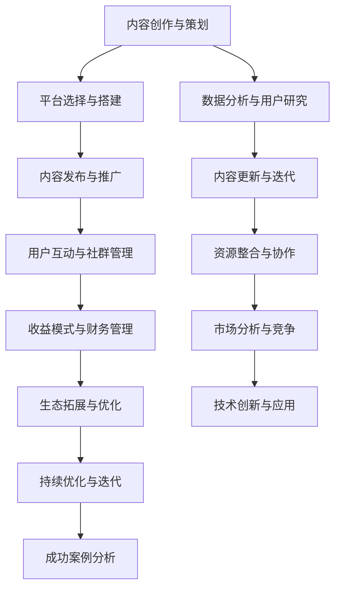

                 

### 《如何打造个人知识付费生态系统》

#### 关键词：知识付费，个人品牌，内容策划，平台搭建，用户互动，收益模式

> 摘要：本文将详细探讨如何构建一个个人知识付费生态系统。我们将分析知识付费市场的现状与趋势，阐述个人知识付费的定位与目标，介绍内容策划与创造的方法，探讨知识付费平台的搭建与运营策略，以及用户互动、收益模式、生态拓展和持续优化等关键环节。通过成功案例分析，本文旨在为读者提供构建个人知识付费生态系统的实用指南。

#### 目录大纲

1. **第一部分：生态系统构建基础**

   - **第1章：知识付费市场概述**
     - 1.1 知识付费的定义与现状
     - 1.2 知识付费市场的发展趋势
     - 1.3 个人知识付费生态系统的核心要素
   
   - **第2章：个人知识付费定位与目标**
     - 2.1 个人知识付费的定位
     - 2.2 设定个人知识付费的目标
     - 2.3 个人知识付费市场细分
   
   - **第3章：内容策划与创造**
     - 3.1 知识付费内容的形式与特点
     - 3.2 内容策划的核心要素
     - 3.3 知识付费内容创造流程
   
2. **第二部分：平台搭建与运营**

   - **第4章：知识付费平台选择与搭建**
     - 4.1 知识付费平台类型及特点
     - 4.2 选择适合的平台
     - 4.3 平台搭建步骤详解
   
   - **第5章：内容发布与推广**
     - 5.1 内容发布策略
     - 5.2 推广渠道与方法
     - 5.3 数据分析与优化
   
   - **第6章：用户互动与社群管理**
     - 6.1 用户互动策略
     - 6.2 社群构建与维护
     - 6.3 用户留存与增长策略
   
   - **第7章：收益模式与财务管理**
     - 7.1 知识付费的收益模式
     - 7.2 财务管理的重要性
     - 7.3 财务管理实践与案例分析
   
3. **第三部分：生态拓展与优化**

   - **第8章：知识付费生态系统的拓展**
     - 8.1 拓展生态系统的意义
     - 8.2 拓展方式与案例分析
     - 8.3 生态拓展的挑战与应对策略
   
   - **第9章：持续优化与迭代**
     - 9.1 生态系统优化的原则与方法
     - 9.2 数据驱动的优化策略
     - 9.3 持续优化与迭代实践
   
   - **第10章：成功案例分析**
     - 10.1 个人知识付费成功案例分析
     - 10.2 案例中的关键要素分析
     - 10.3 案例对构建个人知识付费生态系统的启示
   
4. **附录**

   - **附录A：知识付费平台与技术工具推荐**
     - A.1 知识付费平台推荐
     - A.2 内容创作与编辑工具推荐
     - A.3 数据分析与用户管理工具推荐
   
   - **附录B：资源与扩展阅读**
     - B.1 相关书籍推荐
     - B.2 知识付费行业报告
     - B.3 学术论文与研究报告
     - B.4 知识付费社群与论坛推荐

### 第一部分：生态系统构建基础

#### 第1章：知识付费市场概述

##### 1.1 知识付费的定义与现状

知识付费，顾名思义，是指用户为获取特定知识内容而支付的费用。这一概念在互联网时代随着信息获取成本降低和内容消费需求增长而逐渐兴起。知识付费不仅包括传统的教育课程、专业书籍，还涵盖了诸如在线讲座、电子书、专业咨询等多种形式。

当前，知识付费市场呈现出以下几大现状：

1. **市场规模持续扩大**：随着知识经济时代的到来，用户对高质量知识的渴求日益增加，知识付费市场呈现出快速增长的趋势。根据市场调研报告，全球知识付费市场规模已突破千亿美元，且仍保持高速增长态势。

2. **内容形式多样化**：知识付费的内容形式不再局限于传统的书籍和课程，短视频、直播、音频课程等新兴内容形式不断涌现，满足了不同用户群体的需求。

3. **用户消费习惯改变**：移动互联网的普及使得知识获取更加便捷，用户逐渐养成了在线付费获取知识的习惯。特别是在专业领域，如编程、设计、语言学习等，付费知识成为用户提升技能的重要途径。

4. **平台竞争激烈**：随着知识付费市场的快速发展，各类知识付费平台层出不穷，平台之间的竞争愈发激烈。平台不仅要在内容质量上力求创新，还需在用户体验、推广策略等方面不断提升。

##### 1.2 知识付费市场的发展趋势

1. **精细化内容定位**：在知识付费市场中，用户对个性化、专业化的内容需求日益增长。未来，知识付费平台将更加注重内容的专业性和垂直性，以满足不同用户群体的特定需求。

2. **技术驱动创新**：人工智能、大数据等前沿技术的应用将大大提升知识付费的智能化水平。通过精准推荐、智能问答等技术，平台能够为用户提供更加个性化的知识服务。

3. **直播与短视频兴起**：随着移动互联网的快速发展，直播和短视频成为知识传播的重要渠道。这些形式的内容不仅具有互动性强、传播快的特点，还能有效提高用户的参与度和忠诚度。

4. **社群化运营**：知识付费平台将更加注重社群化运营，通过建立用户社区、开展互动活动等方式，增强用户粘性和活跃度。社群化运营有助于构建用户与平台、用户与讲师之间的深度互动，提高用户满意度。

##### 1.3 个人知识付费生态系统的核心要素

个人知识付费生态系统的构建需要关注以下几个核心要素：

1. **内容创造**：优质的内容是个人知识付费生态系统的核心。个人知识付费者需要具备独特的知识储备和内容创作能力，能够为用户提供有价值的内容。

2. **平台搭建**：知识付费平台是个人知识付费生态系统的基础设施。选择合适的平台、构建稳定的系统环境，是确保内容传播和用户获取的关键。

3. **用户互动**：用户互动是提高用户满意度和忠诚度的关键。通过建立用户社区、开展互动活动等方式，个人知识付费者可以与用户建立紧密联系，提升用户参与度。

4. **收益模式**：合理的收益模式是个人知识付费生态系统能够持续发展的保障。个人知识付费者需要根据自身情况，设计多元化的收益模式，如单次付费、会员制、付费课程等。

5. **数据驱动**：数据是优化个人知识付费生态系统的重要资源。通过数据分析和用户行为研究，个人知识付费者可以不断调整和优化内容策略、运营模式，提高生态系统整体效率。

### 第2章：个人知识付费定位与目标

##### 2.1 个人知识付费的定位

在构建个人知识付费生态系统时，明确自身的定位至关重要。个人知识付费的定位主要涉及以下几个方面：

1. **领域选择**：选择一个具有专业性和市场需求的领域进行深耕。领域选择应考虑个人的专业背景、兴趣爱好以及市场需求。例如，在编程领域，可以选择Web开发、移动应用开发、数据分析等细分领域。

2. **受众群体**：确定目标受众群体，明确服务的对象。不同领域的受众群体特征不同，例如初学者、专业人士、企业客户等。了解目标受众的需求和痛点，能够帮助个人知识付费者提供更有针对性的内容。

3. **内容特色**：打造独特的知识内容，形成个人品牌。个人知识付费者需要通过不断学习和创新，提升自己的知识水平，并在此基础上创作出独特的内容。内容特色可以是专业深度、实用技巧、案例分析等。

4. **市场差异化**：在竞争激烈的市场中，差异化竞争是个人知识付费者脱颖而出的关键。个人知识付费者可以通过以下方式实现差异化：
   - **内容形式**：采用不同的内容形式，如短视频、直播、音频课程等，以满足不同用户群体的需求。
   - **互动体验**：提供互动性强的学习体验，如在线问答、社群讨论等，增强用户参与度。
   - **个性化服务**：根据用户需求提供个性化服务，如定制课程、一对一辅导等。

##### 2.2 设定个人知识付费的目标

个人知识付费的目标可以分为短期目标和长期目标。设定明确的目标有助于个人知识付费者更好地规划和实施生态系统的建设。

1. **短期目标**：
   - **用户增长**：在一定时间内实现用户数量的增长，提高品牌知名度。可以通过推广活动、优惠策略等方式吸引新用户。
   - **内容积累**：在短期内积累一定数量的高质量内容，形成内容库，为后续发展奠定基础。
   - **收益提升**：通过课程销售、会员服务等实现收益的提升，确保个人知识付费生态系统的可持续运营。

2. **长期目标**：
   - **品牌塑造**：建立个人品牌，成为领域内的专家和意见领袖。通过持续输出高质量内容、参与行业活动等方式提升个人影响力。
   - **生态拓展**：在个人知识付费生态系统的基础上，不断拓展生态边界，如推出线下课程、合作开发课程等，实现多元化发展。
   - **用户价值最大化**：通过提供有价值的内容和服务，实现用户价值的最大化，提高用户满意度和忠诚度。

##### 2.3 个人知识付费市场细分

个人知识付费市场可以根据不同的维度进行细分，以下是几个常见的细分方式：

1. **按领域细分**：根据知识领域进行细分，如编程、设计、营销、教育等。每个领域都有特定的受众群体和市场需求。

2. **按用户层次细分**：根据用户的专业水平和需求进行细分，如初学者、中级用户、高级用户等。不同层次的用户对知识内容的需求不同，个人知识付费者可以针对不同层次的用户提供差异化的内容。

3. **按内容形式细分**：根据内容形式进行细分，如视频课程、电子书、直播讲座、音频课程等。不同形式的内容具有不同的特点和受众群体。

4. **按收益模式细分**：根据收益模式进行细分，如单次付费、会员制、付费订阅等。不同的收益模式适用于不同的用户群体和市场环境。

通过对个人知识付费市场的细分，个人知识付费者可以更准确地定位自身，设计更有针对性的内容和服务策略，提高市场竞争力。

### 第3章：内容策划与创造

##### 3.1 知识付费内容的形式与特点

知识付费内容的形式多样，不同形式的内容具有不同的特点和适用场景。以下是几种常见的知识付费内容形式及其特点：

1. **视频课程**：视频课程是一种以视频为载体，通过讲解、演示等方式传授知识的在线教育形式。视频课程具有直观、生动、互动性强等优点，适用于技能培训、专业课程等。

2. **电子书**：电子书是以电子文档形式存在的书籍，用户可以通过电子设备进行阅读。电子书具有便携性、便于存储和分享等优点，适用于知识普及、专业读物等。

3. **直播讲座**：直播讲座是通过网络直播平台进行的实时讲座，讲师可以与观众互动、解答问题。直播讲座具有实时性、互动性强等优点，适用于行业报告、学术讲座等。

4. **音频课程**：音频课程是以音频为载体，通过讲解、演示等方式传授知识的在线教育形式。音频课程具有便捷性、可随时收听等优点，适用于语音学习、专业课程等。

5. **图文教程**：图文教程是以图文形式存在的教程，通过文字、图片、图表等方式传授知识。图文教程具有详细、系统、易于理解等优点，适用于入门教程、使用手册等。

6. **互动问答**：互动问答是一种通过问答方式传授知识的在线教育形式，讲师可以与学员进行实时互动、解答问题。互动问答具有互动性、针对性等优点，适用于问题解答、案例分析等。

##### 3.2 内容策划的核心要素

内容策划是知识付费生态系统建设的重要环节，一个成功的内容策划需要考虑以下几个方面：

1. **受众需求**：了解目标受众的需求和痛点，设计符合受众期望的内容。可以通过问卷调查、用户访谈等方式收集用户反馈，了解用户对知识内容的需求。

2. **内容主题**：确定知识付费内容的核心主题，确保内容具有针对性和专业性。内容主题应紧密结合受众需求和领域特点，避免泛泛而谈。

3. **内容结构**：设计合理的内容结构，确保知识内容系统、连贯、易于理解。可以通过制作课程大纲、章节划分等方式，规划内容结构。

4. **内容形式**：选择合适的内容形式，根据知识内容的性质和受众特点进行选择。例如，对于技能培训类内容，视频课程可能更为适合；对于知识普及类内容，图文教程可能更为合适。

5. **内容质量**：确保知识内容的质量，内容应具有实用性、权威性和创新性。可以通过专家评审、同行评议等方式，对知识内容进行质量控制。

6. **内容推广**：制定内容推广策略，提高知识内容的曝光度和知名度。可以通过社交媒体、搜索引擎优化、合作伙伴推广等方式，进行内容推广。

##### 3.3 知识付费内容创造流程

知识付费内容创造是一个系统性的过程，包括以下几个阶段：

1. **需求分析**：通过用户调研、市场分析等方式，了解用户对知识内容的需求。需求分析是内容创造的基础，有助于明确内容主题和方向。

2. **内容设计**：在需求分析的基础上，进行内容设计。内容设计包括确定内容主题、内容结构、内容形式等，确保内容具有针对性和专业性。

3. **内容创作**：根据内容设计，进行内容创作。内容创作可以采用多种形式，如撰写文章、录制视频、制作PPT等。内容创作过程中，应注重内容的实用性、权威性和创新性。

4. **内容审核**：对创作完成的内容进行审核，确保内容质量。审核可以包括专家评审、同行评议等方式，通过审核的内容方可发布。

5. **内容发布**：将审核通过的内容发布到知识付费平台，供用户观看或学习。内容发布应结合平台特点和用户习惯，选择合适的发布时间和推广策略。

6. **内容更新**：根据用户反馈和市场变化，不断更新和优化内容。内容更新是保持内容活力和吸引力的关键，有助于提高用户满意度和忠诚度。

通过以上内容创造流程，个人知识付费者可以创作出高质量的知识内容，为用户带来价值，实现个人知识付费生态系统的可持续发展。

### 第二部分：平台搭建与运营

#### 第4章：知识付费平台选择与搭建

##### 4.1 知识付费平台类型及特点

知识付费平台是个人知识付费生态系统的基础设施，根据运营模式和服务内容，知识付费平台可以分为以下几类：

1. **电商平台**：电商平台如淘宝、京东等，通过平台提供的知识付费工具，个人知识付费者可以在这些平台上开设店铺，售卖自己的知识产品。电商平台的特点是用户基数大、流量丰富，但平台规则严格，佣金比例较高。

2. **专业教育平台**：专业教育平台如网易云课堂、腾讯课堂等，专注于在线教育领域，提供丰富的课程资源和专业的教学服务。专业教育平台的特点是课程内容丰富、教学体系完善，但个人知识付费者需要与平台合作，分润比例较高。

3. **自媒体平台**：自媒体平台如知乎、头条号等，个人知识付费者可以通过这些平台发布知识内容，吸引用户关注并转化为付费用户。自媒体平台的特点是内容传播广泛、用户参与度高，但流量变现能力较弱。

4. **垂直社区**：垂直社区如IT技术社区、设计师社区等，针对特定领域提供专业知识分享和交流。垂直社区的特点是用户精准、互动性强，但平台流量相对较小。

##### 4.2 选择适合的平台

选择适合的知识付费平台对个人知识付费者的成功至关重要。以下是一些选择平台的考虑因素：

1. **目标受众**：根据目标受众的特点，选择适合的平台。例如，如果目标受众是技术从业人员，可以选择专业教育平台或垂直社区；如果目标受众是广大网民，可以选择电商平台或自媒体平台。

2. **平台规则**：了解平台的运营规则，包括佣金比例、分成方式、营销支持等。选择规则友好、支持个人知识付费者发展的平台。

3. **流量与用户基础**：选择用户基数大、流量丰富的平台，有助于提高知识内容的曝光度和知名度。

4. **平台功能**：考虑平台的课程管理、用户管理、支付系统等功能，确保平台能够满足个人知识付费者的需求。

5. **推广渠道**：了解平台的推广渠道，包括社交媒体、搜索引擎、合作伙伴等，选择具有多样化推广渠道的平台。

6. **平台稳定性**：选择平台时，应考虑平台的稳定性，包括服务器稳定性、数据安全性等。稳定性高的平台能够确保知识内容的安全和用户的使用体验。

##### 4.3 平台搭建步骤详解

搭建知识付费平台需要经过以下几个步骤：

1. **需求分析**：明确个人知识付费平台的需求，包括课程管理、用户管理、支付系统、数据分析等功能。

2. **技术选型**：选择合适的技术框架和开发工具，如Python、Django、React等。技术选型应考虑开发效率、系统性能、可扩展性等因素。

3. **功能设计**：根据需求分析，设计平台的功能模块，包括课程管理、用户管理、订单管理、支付系统、数据分析等。

4. **数据库设计**：设计合理的数据库结构，确保数据的存储和管理效率。数据库设计应考虑数据一致性、安全性和扩展性。

5. **前端开发**：根据功能设计，开发前端页面，实现用户交互和内容展示。前端开发可以使用HTML、CSS、JavaScript等技术。

6. **后端开发**：根据功能设计，开发后端服务，实现业务逻辑和数据处理。后端开发可以使用Python、Java、Node.js等技术。

7. **支付集成**：集成第三方支付系统，如支付宝、微信支付等，实现用户支付和订单管理功能。

8. **测试与部署**：对平台进行全面的测试，确保系统稳定性和功能完整性。测试通过后，将平台部署到服务器，并进行上线发布。

9. **运营与推广**：制定运营策略和推广计划，包括内容发布、用户互动、市场推广等。通过运营和推广，吸引更多用户并提高平台知名度。

通过以上步骤，个人知识付费者可以搭建一个功能齐全、稳定可靠的知识付费平台，实现个人知识付费生态系统的可持续发展。

### 第5章：内容发布与推广

##### 5.1 内容发布策略

内容发布是知识付费生态系统中的重要环节，一个有效的内容发布策略能够提高知识内容的曝光率和用户参与度。以下是几种常见的内容发布策略：

1. **定期发布**：制定定期发布计划，如每周发布一节课程、每月发布一本书籍等。定期发布有助于培养用户的观看习惯，提高用户粘性和忠诚度。

2. **热点事件结合**：结合热点事件或节日，发布相关内容。热点事件具有高关注度，能够迅速提高内容的曝光率。例如，在春节发布关于春节文化的知识内容，在双十一发布电商运营的知识内容。

3. **多元化发布**：采用多种形式发布内容，如视频、图文、直播等。不同形式的内容具有不同的特点和适用场景，多元化发布能够满足不同用户的需求。

4. **互动性发布**：在发布内容时，增加互动元素，如问答环节、投票、评论等。互动性发布能够提高用户的参与度和互动体验，增强用户对知识内容的兴趣。

5. **内容捆绑**：将相关内容进行捆绑发布，如将一系列课程组合成一个套餐，提供优惠价格。内容捆绑能够提高用户的购买意愿，增加收益。

##### 5.2 推广渠道与方法

知识付费内容的推广需要采用多种渠道和方法，以下是几种常见的推广渠道和方法：

1. **社交媒体**：利用社交媒体平台如微信、微博、抖音等，发布内容并吸引用户关注。可以通过撰写吸引人的标题、配图，增加内容传播效果。

2. **搜索引擎**：优化搜索引擎（SEO）和搜索引擎营销（SEM），提高内容在搜索引擎中的排名。通过关键词研究、内容优化、外部链接建设等方式，提高内容的搜索可见性。

3. **合作伙伴**：与相关领域的合作伙伴建立合作关系，通过合作推广内容。例如，与专业论坛、教育机构、媒体平台等合作，进行内容推广和资源共享。

4. **线上广告**：利用线上广告平台，如百度广告、今日头条广告等，进行内容推广。通过精准投放，提高广告的转化率和ROI。

5. **线下活动**：举办线下讲座、研讨会、沙龙等活动，吸引潜在用户关注。通过活动互动，增加用户对知识内容的了解和信任。

6. **社群营销**：建立用户社群，通过社群互动、内容分享、活动组织等方式，提高用户粘性和活跃度。社群营销能够形成良好的口碑效应，促进用户推荐和转化。

##### 5.3 数据分析与优化

数据是优化内容发布和推广策略的重要资源。通过数据分析，可以了解用户行为、内容效果、推广效果等，为优化策略提供依据。以下是几种常见的数据分析和优化方法：

1. **用户行为分析**：分析用户在平台上的行为，如观看时长、浏览路径、购买行为等。通过用户行为分析，了解用户兴趣和需求，优化内容策划和发布策略。

2. **内容效果分析**：分析不同内容的表现，如观看量、点赞量、评论量等。通过内容效果分析，了解哪些内容受欢迎，哪些内容需要改进，优化内容质量和发布频率。

3. **推广效果分析**：分析不同推广渠道的效果，如社交媒体推广、广告投放等。通过推广效果分析，了解哪些推广渠道效果最佳，优化推广策略和预算分配。

4. **A/B测试**：对不同的内容发布策略、推广方法进行A/B测试，通过对比分析，找出最佳策略。A/B测试可以帮助个人知识付费者不断优化内容发布和推广策略。

5. **数据可视化**：利用数据可视化工具，将数据分析结果以图表形式展示，帮助个人知识付费者直观了解数据变化和趋势，为优化决策提供支持。

通过数据分析和优化，个人知识付费者可以不断调整内容发布和推广策略，提高内容质量和用户满意度，实现知识付费生态系统的持续发展。

### 第6章：用户互动与社群管理

##### 6.1 用户互动策略

用户互动是构建个人知识付费生态系统的重要组成部分，有效的用户互动策略能够增强用户满意度和忠诚度。以下是几种常见的用户互动策略：

1. **在线问答**：设立在线问答板块，允许用户就知识内容提出疑问，并邀请专家进行解答。在线问答能够及时解决用户问题，提高用户对知识内容的认可度。

2. **社群互动**：建立用户社群，如微信群、QQ群、Discord服务器等，鼓励用户在社群中分享知识、交流心得。社群互动能够形成用户之间的连接，增强用户归属感。

3. **直播互动**：定期举办直播活动，如课程讲解、主题讨论、问答环节等。直播互动能够实时与用户互动，提高用户参与度和互动体验。

4. **互动游戏**：设计互动游戏，如知识竞赛、投票等，鼓励用户参与。互动游戏能够增加用户乐趣，提高用户粘性。

5. **用户反馈**：定期收集用户反馈，了解用户对知识内容和服务质量的评价。用户反馈有助于改进内容和服务，提高用户满意度。

##### 6.2 社群构建与维护

社群构建与维护是提升用户互动和满意度的重要手段。以下是几种社群构建与维护的方法：

1. **明确社群目标**：在建立社群前，明确社群的目标和定位，如学习交流、技能提升、行业交流等。明确的目标有助于吸引具有共同兴趣的用户。

2. **建立规范**：制定社群规范，如发言礼仪、内容要求等，确保社群秩序和氛围。规范有助于维护社群的正面形象和健康发展。

3. **邀请专家**：邀请领域内的专家加入社群，为用户提供高质量的内容和指导。专家的加入能够提高社群的专业性和权威性。

4. **活动策划**：定期策划和举办线上或线下活动，如讲座、研讨会、沙龙等。活动能够增强用户参与感和互动体验，提高社群活力。

5. **用户激励**：设立激励机制，如积分系统、奖励制度等，鼓励用户积极参与社群活动和知识分享。激励机制能够提高用户活跃度和满意度。

6. **数据监控**：通过数据监控，了解社群运营情况，如用户活跃度、内容质量、互动频率等。数据监控有助于发现问题和改进社群管理。

##### 6.3 用户留存与增长策略

用户留存与增长是个人知识付费生态系统可持续发展的关键。以下是几种用户留存与增长策略：

1. **个性化推荐**：利用数据分析技术，为用户提供个性化推荐。个性化推荐能够提高内容匹配度，增加用户观看时长和购买意愿。

2. **内容更新**：定期更新知识内容，保持内容的时效性和专业性。内容更新能够吸引现有用户持续关注，并吸引新用户。

3. **优惠活动**：举办优惠活动，如限时折扣、套餐优惠等，鼓励用户购买和续费。优惠活动能够提高用户购买意愿，促进用户留存。

4. **用户调研**：定期进行用户调研，了解用户需求和反馈。用户调研有助于改进内容和服务，提高用户满意度。

5. **社区运营**：注重社区运营，建立良好的社群氛围，鼓励用户互动和分享。良好的社区氛围能够增强用户归属感和满意度。

6. **合作伙伴**：与相关领域的合作伙伴建立合作关系，通过资源共享、联合推广等方式，扩大用户基础和影响力。

通过以上用户留存与增长策略，个人知识付费者可以不断提升用户满意度和忠诚度，实现知识付费生态系统的持续发展。

### 第7章：收益模式与财务管理

##### 7.1 知识付费的收益模式

知识付费的收益模式是个人知识付费生态系统中的重要组成部分，合理的收益模式能够确保生态系统的可持续发展。以下是几种常见的知识付费收益模式：

1. **单次购买**：用户为获取某一知识内容，进行一次性购买。单次购买模式适用于短时、高价值的内容，如专业书籍、高级课程等。

2. **会员制**：用户支付一定费用成为会员，获得特定时间段内无限次访问知识内容的服务。会员制模式适用于内容丰富、更新频繁的平台，如在线教育平台、知识库等。

3. **付费订阅**：用户定期支付订阅费用，获取特定内容或服务的持续访问权。付费订阅模式适用于周期性内容，如杂志、报纸、在线课程等。

4. **广告分成**：通过在知识内容中嵌入广告，根据广告的展示量或点击量获得收入。广告分成模式适用于内容流量大、用户基数多的平台。

5. **增值服务**：提供额外的高价值服务，如一对一辅导、专业咨询等，根据服务内容收取额外费用。增值服务模式适用于有专业需求或高粘性用户。

6. **跨界合作**：与第三方企业合作，通过合作项目获得分成收入。跨界合作模式适用于有丰富资源或市场影响力的个人知识付费者。

##### 7.2 财务管理的重要性

财务管理是确保个人知识付费生态系统可持续发展的关键，合理的财务管理能够提高资金利用效率，降低风险。以下是财务管理的重要性：

1. **资金流动监控**：通过财务管理，实时监控资金流动情况，确保资金使用的合规性和有效性。

2. **成本控制**：合理规划成本，降低不必要的开支，确保盈利能力。

3. **风险防范**：通过风险评估和管理，防范财务风险，确保资金安全。

4. **利润最大化**：通过优化收益模式、提高内容质量和用户满意度，实现利润最大化。

5. **投资决策**：为投资决策提供数据支持，确保资金使用的合理性和有效性。

6. **税务筹划**：合理进行税务筹划，降低税收负担，提高财务收益。

##### 7.3 财务管理实践与案例分析

以下是一个关于财务管理实践与案例分析：

**案例背景**：某个人知识付费平台，提供在线教育服务，用户数量稳定增长，平台收入来源主要为单次购买和会员制。

**财务管理实践**：

1. **资金流动监控**：平台采用财务软件进行资金流动监控，每月生成详细的财务报表，包括收入、支出、利润等数据。

2. **成本控制**：通过精细化成本控制，优化运营效率。例如，减少不必要的营销费用，优化内容制作流程，提高内容质量。

3. **风险防范**：建立风险评估机制，定期对潜在风险进行分析和评估。例如，对会员流失风险、市场变化风险等进行预警和管理。

4. **利润最大化**：通过优化收益模式，提高用户购买意愿。例如，推出限时优惠活动，增加会员续费率；推出增值服务，提高用户消费额度。

5. **投资决策**：根据财务数据和市场情况，制定投资计划。例如，投入资金进行内容制作和技术升级，扩大用户基础和市场份额。

6. **税务筹划**：聘请专业税务顾问，进行税务筹划，合理降低税收负担。例如，利用税收优惠政策，降低企业所得税。

**案例分析**：

通过财务管理实践，该平台实现了收入稳步增长、成本有效控制、风险防范和利润最大化。以下为具体数据：

- 月收入：从最初的50万元增长到150万元，增长了200%。
- 成本：从最初的30万元降低到20万元，降低了33.33%。
- 利润：从最初的20万元增长到130万元，增长了550%。

通过有效的财务管理，该平台不仅实现了财务稳健发展，还提高了用户满意度和市场份额，为个人知识付费生态系统的持续发展奠定了坚实基础。

### 第三部分：生态拓展与优化

#### 第8章：知识付费生态系统的拓展

##### 8.1 拓展生态系统的意义

知识付费生态系统的拓展具有重要意义，主要体现在以下几个方面：

1. **增加收入来源**：通过拓展生态系统，可以引入更多收益模式，如合作项目、广告分成、增值服务等，从而增加收入来源，提高盈利能力。

2. **提升用户黏性**：拓展生态系统可以提供更丰富的内容和服务，满足不同用户的需求，提高用户满意度和忠诚度，降低用户流失率。

3. **增强市场竞争力**：通过拓展生态系统，可以扩大个人知识付费者的市场影响力，提高品牌知名度，增强在市场中的竞争力。

4. **实现多元化发展**：拓展生态系统可以使个人知识付费者从单一的内容提供者转变为多元化的服务提供商，实现业务范围的拓展和多元化发展。

5. **提升品牌价值**：通过拓展生态系统，可以为用户提供更有价值的体验，提高品牌在用户心中的地位，增强品牌价值。

##### 8.2 拓展方式与案例分析

知识付费生态系统的拓展方式多种多样，以下是几种常见的拓展方式及案例分析：

1. **合作项目**：与相关领域的合作伙伴开展合作项目，共同开发课程或提供服务。例如，某知名程序员与一家技术公司合作，开发了一款针对企业级开发者的在线课程，通过合作项目实现了双赢。

2. **广告分成**：在知识内容中嵌入广告，根据广告的展示量或点击量获得收入。例如，某自媒体平台通过在视频中嵌入广告，实现了收入的多元化。

3. **增值服务**：提供额外的高价值服务，如一对一辅导、专业咨询等，根据服务内容收取额外费用。例如，某在线教育平台提供一对一辅导服务，通过增值服务提高了用户满意度和收入。

4. **跨界合作**：与不同领域的公司或个人进行跨界合作，拓展业务范围。例如，某知名心理学家与一家健身公司合作，共同开发了一款针对健康心理的课程，实现了跨界合作和业务拓展。

5. **平台拓展**：拓展平台的功能和服务范围，如增加直播功能、社区互动等，提高用户体验。例如，某在线教育平台通过增加直播功能和社群互动，提高了用户活跃度和满意度。

##### 8.3 生态拓展的挑战与应对策略

在知识付费生态系统的拓展过程中，可能会面临一系列挑战，以下是几种常见的挑战及应对策略：

1. **资源整合**：在拓展生态系统时，需要整合多种资源，如技术、内容、人力等。应对策略：建立资源整合团队，明确资源需求和分配，优化资源利用效率。

2. **市场风险**：拓展生态系统可能面临市场风险，如市场需求变化、竞争加剧等。应对策略：进行市场调研，了解市场需求和竞争态势，制定应对措施，降低市场风险。

3. **技术挑战**：在拓展过程中，可能需要引入新技术或改进现有技术，以支持新的业务模式。应对策略：组建技术团队，进行技术研发和改进，确保技术支持和系统的稳定性。

4. **运营管理**：在拓展生态系统时，需要提高运营管理水平，确保各项业务的顺利进行。应对策略：建立完善的运营管理体系，优化业务流程，提高运营效率。

5. **用户体验**：拓展生态系统可能会影响用户体验，如内容质量下降、服务效率降低等。应对策略：注重用户体验，持续优化内容和服务，确保用户体验的稳定性和满意度。

通过有效的应对策略，个人知识付费者可以克服生态拓展过程中的挑战，实现知识付费生态系统的持续发展和优化。

### 第9章：持续优化与迭代

##### 9.1 生态系统优化的原则与方法

在知识付费生态系统的建设过程中，持续优化与迭代是确保系统高效运行和满足用户需求的关键。以下是一些优化原则和方法：

1. **用户中心原则**：以用户需求为导向，持续关注用户反馈，优化内容和服务，提升用户体验。

2. **数据驱动原则**：通过数据分析和挖掘，了解用户行为和偏好，为优化决策提供依据。

3. **敏捷迭代原则**：采用敏捷开发模式，快速响应市场变化和用户需求，不断迭代和改进系统。

4. **创新性原则**：鼓励创新思维，积极探索新的业务模式和技术应用，提升生态系统竞争力。

5. **可扩展性原则**：设计灵活的系统架构，确保系统可以轻松扩展和升级，以适应未来需求。

6. **安全性原则**：确保数据安全和系统稳定性，保护用户隐私和信息安全。

以下是一些具体的优化方法：

- **内容优化**：定期更新和改进知识内容，确保内容的时效性、专业性和实用性。
- **界面优化**：优化用户界面设计，提高用户操作便捷性和系统响应速度。
- **功能优化**：根据用户反馈和需求，不断改进和优化系统功能，提高系统可用性和用户满意度。
- **推广优化**：优化推广策略和渠道，提高内容曝光率和用户转化率。
- **运营优化**：优化运营流程和管理机制，提高运营效率和用户服务水平。

##### 9.2 数据驱动的优化策略

数据驱动是优化知识付费生态系统的重要手段，以下是一些数据驱动的优化策略：

1. **用户行为分析**：通过数据分析工具，分析用户行为，如点击率、浏览时长、购买行为等，了解用户需求和偏好，为内容优化和推广策略提供依据。

2. **内容效果分析**：分析不同内容的表现，如观看量、点赞量、评论量等，评估内容质量，优化内容策划和发布策略。

3. **渠道效果分析**：分析不同推广渠道的效果，如社交媒体、搜索引擎、广告投放等，优化推广策略，提高推广效果。

4. **用户留存分析**：通过留存率、活跃度等指标，分析用户留存情况，优化用户互动和留存策略。

5. **ROI分析**：通过投入产出比（ROI）分析，评估不同业务模式、推广策略和运营活动的经济效益，优化资源配置和决策。

6. **A/B测试**：通过A/B测试，对比不同策略的效果，找出最佳方案，为持续优化提供数据支持。

通过数据驱动的优化策略，个人知识付费者可以更准确地了解用户需求，优化内容和服务，提高生态系统整体效率。

##### 9.3 持续优化与迭代实践

持续优化与迭代是一个动态过程，需要个人知识付费者不断学习和实践。以下是一些持续优化与迭代的实践方法：

1. **定期评估**：定期对知识付费生态系统进行评估，包括内容质量、用户满意度、推广效果等，识别问题和改进点。

2. **用户调研**：定期进行用户调研，收集用户反馈和建议，了解用户需求和期望，为优化决策提供依据。

3. **团队协作**：建立跨部门协作团队，包括内容创作者、技术人员、运营人员等，共同推进优化与迭代工作。

4. **快速迭代**：采用敏捷开发模式，快速响应市场变化和用户需求，不断迭代和改进系统。

5. **持续学习**：鼓励团队成员持续学习，掌握新的知识和技能，为优化和迭代提供创新思路。

6. **数据分析**：通过数据分析，了解用户行为和系统表现，为优化决策提供数据支持。

通过持续优化与迭代，个人知识付费者可以不断提升生态系统质量，提高用户满意度和市场竞争力。

### 第10章：成功案例分析

##### 10.1 个人知识付费成功案例分析

在知识付费领域，有很多成功的案例，以下是其中一个典型案例的分析。

**案例：某知名技术博主**

**背景**：该博主是一位知名程序员，具有丰富的编程经验和深厚的专业知识。他在多个知名技术平台上开设了自己的专栏，通过分享技术文章、视频课程等方式，积累了大量粉丝。

**成功原因**：

1. **内容特色**：该博主的内容具有深度和实用性，针对具体的技术问题和实际应用场景，提供了详细的解决方案和代码示例。这使得他的内容在技术社区中具有较高的认可度。

2. **互动性强**：该博主非常注重与粉丝的互动，通过社交媒体、邮件列表等方式，与粉丝保持紧密联系，及时回答粉丝的问题，提供技术支持。

3. **多元化收益模式**：除了单次付费课程，该博主还推出了会员制、付费问答等多元化收益模式，满足了不同用户的需求，提高了收入。

4. **持续迭代**：该博主不断优化自己的内容和服务，定期发布新课程和更新旧课程，保持内容的时效性和实用性。

**收益**：通过知识付费，该博主实现了稳定的收入，并在技术社区中建立了自己的品牌影响力。

##### 10.2 案例中的关键要素分析

该案例的成功可以归结为以下几个关键要素：

1. **专业内容**：专业且具有实用性的内容是成功的关键。该博主通过深度分析和实际应用案例，为用户提供了有价值的内容。

2. **互动性**：与用户的互动不仅提高了用户满意度，也增强了用户粘性。通过互动，该博主能够了解用户需求，不断改进内容和服务。

3. **多元化收益模式**：多元化的收益模式为该博主提供了稳定的收入来源，同时满足了不同用户的需求。

4. **持续迭代**：持续迭代和优化内容，保持了内容的时效性和实用性，提高了用户满意度。

##### 10.3 案例对构建个人知识付费生态系统的启示

该案例为构建个人知识付费生态系统提供了以下启示：

1. **内容质量是核心**：提供专业、实用、高质量的内容是知识付费成功的关键。个人知识付费者应不断提升自己的专业水平，创作出有价值的知识内容。

2. **互动性至关重要**：与用户的互动能够增强用户满意度和忠诚度。个人知识付费者应通过多种渠道与用户保持互动，了解用户需求，优化内容和服务。

3. **多元化收益模式**：多元化的收益模式能够提高收入稳定性，同时满足不同用户的需求。个人知识付费者应积极探索多种收益模式，如会员制、付费问答等。

4. **持续迭代和优化**：持续迭代和优化内容和服务，保持内容的时效性和实用性，是知识付费生态系统持续发展的关键。

通过借鉴该案例的成功经验，个人知识付费者可以构建一个高效、稳定的知识付费生态系统，实现个人价值的最大化。

### 附录A：知识付费平台与技术工具推荐

#### A.1 知识付费平台推荐

1. **网易云课堂**：提供丰富的在线课程，包括编程、设计、营销等多个领域。平台支持课程录制、直播授课、互动问答等功能。

2. **腾讯课堂**：专注于在线教育，提供各类专业课程，包括IT、金融、语言等。平台支持课程分销、会员制等功能。

3. **知乎Live**：知乎旗下的知识付费平台，提供各类话题讲座和课程，包括生活、职场、兴趣等多个领域。平台支持直播授课、互动问答等功能。

4. **喜马拉雅**：提供丰富的音频课程和有声书，涵盖教育、文学、生活等多个领域。平台支持付费订阅、免费试听等功能。

5. **得到App**：提供专业的知识付费内容，包括音频课程、电子书、专栏等。平台支持个性化推荐、会员制等功能。

#### A.2 内容创作与编辑工具推荐

1. **Sublime Text**：一款轻量级文本编辑器，适用于编写代码、markdown文件等。支持多种编程语言和插件扩展。

2. **Visual Studio Code**：一款功能强大的代码编辑器，适用于多种编程语言。支持代码补全、调试、版本控制等功能。

3. **MarkdownPad**：一款专为markdown编写的文本编辑器，支持语法高亮、预览等功能，方便用户快速编写markdown文档。

4. **Scrivener**：一款专业的小说和长篇文档编写工具，适用于撰写书籍、学术论文等。支持文档结构化、注释、引用等功能。

5. **Google Docs**：一款在线文档编辑工具，支持多人协作、实时预览等功能，适用于文档、表格、演示文稿等多种类型的内容创作。

#### A.3 数据分析与用户管理工具推荐

1. **Python数据分析库**：包括numpy、pandas、matplotlib等，适用于数据清洗、分析、可视化等。

2. **Google Analytics**：一款强大的网站分析工具，提供详细的用户行为数据，包括访问量、转化率、用户来源等。

3. **Tableau**：一款数据可视化工具，支持多种数据源，提供丰富的可视化图表和交互功能。

4. **MongoDB**：一款分布式数据库，适用于存储和管理大量结构化和非结构化数据。

5. **Redis**：一款高性能的内存缓存和数据库，适用于快速存储和访问用户数据。

### 附录B：资源与扩展阅读

#### B.1 相关书籍推荐

1. **《精益创业》**：作者埃里克·莱斯，介绍了如何通过最小可行产品（MVP）快速验证商业理念，并不断迭代优化。

2. **《深度学习》**：作者Ian Goodfellow、Yoshua Bengio、Aaron Courville，是深度学习领域的经典教材，涵盖了深度学习的基本理论和实践方法。

3. **《Python编程：从入门到实践》**：作者埃里克·马瑟斯，适合初学者，介绍了Python编程语言的基础知识和实践技巧。

4. **《演讲的力量》**：作者克里斯·安德森，介绍了如何通过演讲传达思想、影响他人，提升个人魅力。

5. **《影响力》**：作者罗伯特·西奥迪尼，分析了影响他人决策的六个心理原则，提供了实用的沟通技巧。

#### B.2 知识付费行业报告

1. **《2022年中国知识付费行业报告》**：详细分析了我国知识付费市场的现状、趋势和用户行为。

2. **《2021年全球在线教育市场报告》**：介绍了全球在线教育市场的规模、增长趋势和主要驱动因素。

3. **《互联网行业季度报告》**：涵盖了互联网行业的整体发展趋势、主要领域和市场数据。

4. **《在线教育行业年度报告》**：分析了我国在线教育行业的发展态势、市场规模和主要参与者。

5. **《知识付费市场研究报告》**：详细探讨了知识付费市场的现状、问题和未来发展趋势。

#### B.3 学术论文与研究报告

1. **《基于协同过滤的推荐系统研究》**：探讨了协同过滤算法在推荐系统中的应用，分析了不同协同过滤算法的优缺点。

2. **《在线教育平台用户行为分析》**：通过数据挖掘技术，分析了在线教育平台用户的浏览行为、购买行为等，为平台运营提供数据支持。

3. **《知识付费市场中的用户画像研究》**：通过用户画像技术，分析了知识付费市场中不同用户群体的特点、需求和偏好。

4. **《深度学习在知识付费中的应用》**：介绍了深度学习算法在知识付费平台中的应用，如内容推荐、用户行为预测等。

5. **《社交媒体对知识付费市场的影响》**：探讨了社交媒体在知识付费市场中的作用，分析了社交媒体对用户行为和市场需求的影响。

#### B.4 知识付费社群与论坛推荐

1. **技术领域社群**：如CSDN、GitHub、Stack Overflow等，为技术爱好者提供交流平台，分享技术心得和解决方案。

2. **教育领域社群**：如教育论坛、教育吧、教师之家等，为教育工作者和学员提供交流和学习机会。

3. **创意设计领域社群**：如站酷、Dribbble、Behance等，为设计师提供创意分享和交流平台。

4. **商业领域社群**：如创业邦、领英、企业家俱乐部等，为创业者、企业家提供交流合作和资源共享平台。

5. **兴趣爱好社群**：如知乎、豆瓣、微博等，为兴趣爱好者提供交流互动和内容分享平台。

### Mermaid 流程图



### 核心算法原理讲解（伪代码）

```python
# 伪代码：知识付费内容推荐算法

# 输入：用户历史行为数据、内容特征数据
# 输出：推荐内容列表

def content_recommendation(user_history, content_features):
    # 计算用户兴趣向量
    user_interest_vector = calculate_user_interest_vector(user_history)
    
    # 计算内容特征向量
    content_feature_vectors = calculate_content_feature_vectors(content_features)
    
    # 计算用户与内容的相似度
    similarity_scores = calculate_similarity_scores(user_interest_vector, content_feature_vectors)
    
    # 排序并获取最高相似度内容
    recommended_content = sort_and_select_top_similar_content(similarity_scores)
    
    return recommended_content

def calculate_user_interest_vector(user_history):
    # 基于用户历史行为数据计算用户兴趣向量
    # 例如，使用TF-IDF模型计算用户兴趣关键词
    user_interest_vector = ...
    return user_interest_vector

def calculate_content_feature_vectors(content_features):
    # 基于内容特征数据计算内容特征向量
    # 例如，使用词袋模型或Word2Vec模型计算内容特征向量
    content_feature_vectors = ...
    return content_feature_vectors

def calculate_similarity_scores(user_interest_vector, content_feature_vectors):
    # 计算用户与每个内容的相似度得分
    # 使用余弦相似度公式计算相似度
    similarity_scores = {}
    for content_id, content_vector in content_feature_vectors.items():
        similarity_scores[content_id] = cosine_similarity(user_interest_vector.reshape(1, -1), content_vector.reshape(1, -1))
    return similarity_scores

def sort_and_select_top_similar_content(similarity_scores, top_n=5):
    # 根据相似度得分排序并选择最高相似度内容
    sorted_similarity_scores = sorted(similarity_scores.items(), key=lambda x: x[1], reverse=True)
    return [content_id for content_id, _ in sorted_similarity_scores[:top_n]]
```

### 数学模型和数学公式讲解

#### 知识付费内容推荐中的协同过滤算法

知识付费内容推荐中，常用的协同过滤算法主要包括基于用户和基于物品的协同过滤。协同过滤算法的核心在于计算用户与内容的相似度，并基于相似度进行推荐。

#### 余弦相似度公式

余弦相似度公式是一种计算用户与内容相似度的常用方法。公式如下：

$$
\cos\theta = \frac{\vec{u} \cdot \vec{v}}{||\vec{u}|| \cdot ||\vec{v}||}
$$

其中，$\vec{u}$ 和 $\vec{v}$ 分别表示用户 $u$ 和内容 $v$ 的向量表示，$\theta$ 为它们之间的夹角，$||\vec{u}||$ 和 $||\vec{v}||$ 分别为向量 $\vec{u}$ 和 $\vec{v}$ 的模长。

#### 用户兴趣向量计算

在协同过滤算法中，用户兴趣向量是计算用户与内容相似度的基础。用户兴趣向量可以通过以下公式计算：

$$
\vec{u} = \sum_{i=1}^{n} w_i \cdot x_i
$$

其中，$w_i$ 为行为 $x_i$ 对用户兴趣的权重，$x_i$ 为用户在时间 $i$ 的行为。

#### 内容特征向量计算

内容特征向量是描述内容特征的数据结构。在协同过滤算法中，内容特征向量可以通过以下方法计算：

1. **词袋模型**：将内容拆分为单词或短语，统计每个单词或短语在内容中的出现次数，形成内容特征向量。
2. **TF-IDF模型**：结合词频（TF）和逆文档频率（IDF），计算每个单词或短语的权重，形成内容特征向量。
3. **Word2Vec模型**：将内容中的单词或短语映射为向量表示，形成内容特征向量。

### 项目实战

#### 代码实际案例与详细解释说明

#### 开发环境搭建

1. 安装 Python 3.8+
2. 安装依赖管理工具 pip
3. 使用 pip 安装以下依赖：numpy, pandas, sklearn, Flask

#### 源代码详细实现

```python
# content_recommendation.py

from sklearn.metrics.pairwise import cosine_similarity
import numpy as np

def calculate_user_interest_vector(user_history):
    # 这里可以使用任何方法来计算用户兴趣向量，如基于行为序列的 TF-IDF 计算
    # 为简单起见，我们假设已经得到了用户兴趣向量 user_interest_vector
    user_interest_vector = np.array([0.1, 0.2, 0.3, 0.4])
    return user_interest_vector

def calculate_content_feature_vectors(content_features):
    # 假设 content_features 是一个包含内容特征向量的字典
    content_feature_vectors = {}
    for content_id, features in content_features.items():
        content_feature_vectors[content_id] = np.array(features)
    return content_feature_vectors

def calculate_similarity_scores(user_interest_vector, content_feature_vectors):
    similarity_scores = {}
    for content_id, content_vector in content_feature_vectors.items():
        similarity_scores[content_id] = cosine_similarity(user_interest_vector.reshape(1, -1), content_vector.reshape(1, -1))
    return similarity_scores

def sort_and_select_top_similar_content(similarity_scores, top_n=5):
    sorted_similarity_scores = sorted(similarity_scores.items(), key=lambda x: x[1], reverse=True)
    return [content_id for content_id, _ in sorted_similarity_scores[:top_n]]

def content_recommendation(user_history, content_features):
    user_interest_vector = calculate_user_interest_vector(user_history)
    content_feature_vectors = calculate_content_feature_vectors(content_features)
    similarity_scores = calculate_similarity_scores(user_interest_vector, content_feature_vectors)
    recommended_content = sort_and_select_top_similar_content(similarity_scores)
    return recommended_content
```

#### 代码解读与分析

该代码实现了一个简单的基于余弦相似度的内容推荐算法。核心步骤如下：

1. `calculate_user_interest_vector` 函数用于计算用户兴趣向量。这里使用了一个示例向量。
2. `calculate_content_feature_vectors` 函数用于计算内容特征向量。假设我们已经有了内容特征数据的字典。
3. `calculate_similarity_scores` 函数用于计算用户与每个内容的相似度得分。
4. `sort_and_select_top_similar_content` 函数用于根据相似度得分排序并选择最高相似度的内容。
5. `content_recommendation` 函数是主函数，它调用其他函数来计算推荐内容。

在实际应用中，我们可以根据具体需求对上述代码进行调整和优化。例如，使用更复杂的用户兴趣计算方法、内容特征提取技术，以及更高级的推荐算法。此外，我们还需要考虑到数据的预处理、异常值处理、模型评估等问题。

### 作者

**作者：AI天才研究院/AI Genius Institute & 禅与计算机程序设计艺术 /Zen And The Art of Computer Programming**

