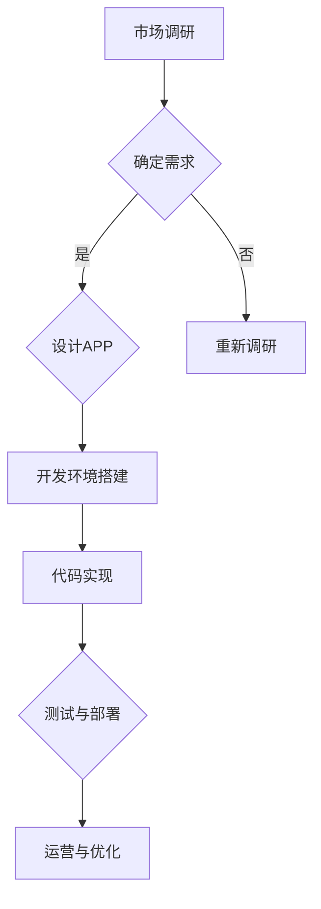

                 

### 《如何打造知识付费的移动端APP》

#### 核心关键词：
- 知识付费
- 移动端APP开发
- 设计原则
- 技术选型
- 性能优化
- 安全性
- 项目实战

#### 摘要：
本文将系统性地介绍如何打造一款知识付费的移动端APP。从行业现状、用户需求分析，到开发框架与技术选型，再到功能模块设计、性能优化与安全性，以及项目实战和运营策略，本文将详细讲解每一个环节，帮助读者掌握从0到1打造知识付费APP的完整流程。文章结构清晰，包含实际代码案例和详尽的解读，旨在为开发者提供实用的参考和指导。

### 《如何打造知识付费的移动端APP》

随着移动互联网的普及，知识付费逐渐成为市场热点。越来越多的用户愿意为高质量的知识内容付费，这为知识付费APP的开发提供了广阔的市场空间。本文将带领读者深入探讨如何从零开始打造一款知识付费的移动端APP，涵盖行业现状、用户需求分析、技术选型、功能设计、性能优化、安全性和项目实战等多个方面。

#### 第一部分：基础知识与核心概念

在开始具体开发之前，我们需要对知识付费行业有一个基本的了解，包括市场的现状、发展趋势以及移动端APP开发的基础知识。这部分内容将为后续的深入开发提供必要的背景知识。

##### 第1章：知识付费行业概述

**1.1 知识付费市场现状分析**

知识付费是一种基于互联网的新兴商业模式，它通过提供有价值的内容或服务，让用户愿意为知识付费。知识付费的形式多样，包括在线课程、电子书、付费问答、专业咨询等。

- **知识付费的定义与分类**：知识付费可以细分为在线教育、专业咨询、电子书等多种形式。
- **知识付费的发展历程**：知识付费起源于互联网，随着网络技术的不断发展，知识付费市场逐渐壮大。
- **市场规模与增长趋势**：近年来，知识付费市场呈现出高速增长态势，预计未来还将持续扩大。

**1.2 移动端APP开发基础**

移动端APP开发是知识付费APP的核心，我们需要了解开发的基础知识，包括开发流程、工具和技术栈。

- **移动端APP开发的概念与流程**：从需求分析、设计、开发、测试到发布，每个环节都需要精细化管理。
- **开发工具与技术栈介绍**：常用的移动端开发工具有React Native、Flutter等，技术栈包括前端、后端和数据库。

##### 第2章：移动端APP设计与用户分析

**2.1 APP设计原则**

APP设计是用户体验的核心，良好的设计能够提高用户满意度，促进用户留存。

- **用户体验设计（UX）原则**：简洁、直观、一致性和可访问性。
- **设计元素与布局**：包括按钮、图标、颜色、字体等设计元素的合理使用，以及布局的合理性和可读性。

**2.2 用户需求分析**

用户需求是APP设计的出发点和归宿，了解用户需求是成功的关键。

- **用户画像与用户行为分析**：通过数据分析工具，了解用户的基本信息、行为习惯等。
- **用户需求收集与调研**：通过问卷调查、用户访谈等方式，收集用户的具体需求。

##### 第3章：移动端APP开发框架与架构

**3.1 开发框架概述**

选择合适的开发框架能够提高开发效率，确保APP的性能和稳定性。

- **MVP模型**：最小可行性产品（MVP）是一种快速迭代、验证产品核心功能的方法。
- **前后端分离架构**：前后端分离架构能够提高代码的可维护性和扩展性。

**3.2 技术选型与框架**

技术选型是移动端APP开发的关键环节，需要根据项目需求选择合适的技术栈。

- **前端框架**：React、Vue、Angular等框架都有其独特的优势和适用场景。
- **后端框架**：Spring Boot、Django等后端框架提供了丰富的功能和良好的扩展性。

##### 第4章：移动端APP功能模块设计

**4.1 登录与注册模块**

登录与注册模块是用户与APP交互的入口，需要确保用户信息的真实性、安全性和便捷性。

- **用户认证机制**：常见的认证方式包括用户名密码、手机验证码等。
- **数据安全与隐私保护**：加密用户数据，防止数据泄露。

**4.2 课程内容展示与互动**

课程内容展示与互动模块是知识付费APP的核心功能之一，需要提供丰富的课程资源和良好的用户体验。

- **课程分类与推荐**：根据用户行为和喜好，推荐合适的课程。
- **视频播放与互动功能**：支持视频播放、弹幕互动、课程评论等。

**4.3 支付功能实现**

支付功能是知识付费APP的重要模块，需要集成多种支付方式，确保支付流程的便捷和安全。

- **支付接口集成**：接入支付宝、微信支付等支付接口。
- **退款与售后服务**：提供便捷的退款渠道和完善的售后服务。

##### 第5章：移动端APP性能优化与安全性

**5.1 性能优化**

性能优化是移动端APP开发的重要环节，能够提高用户的满意度和APP的竞争力。

- **缓存策略**：合理使用缓存，减少重复数据请求。
- **资源压缩与优化**：压缩图片、字体等资源，提高加载速度。

**5.2 安全性考虑**

安全性是移动端APP开发必须重视的问题，需要采取多种措施保护用户数据和APP安全。

- **数据加密**：使用加密算法保护用户数据。
- **防御常见网络攻击**：防范SQL注入、XSS攻击等常见网络攻击。

#### 第二部分：项目实战与开发细节

##### 第6章：项目实战：知识付费APP开发

**6.1 开发环境搭建**

开发环境搭建是项目开发的第一步，需要安装和配置开发工具和软件。

- **开发工具与软件安装**：安装Android Studio、Xcode等开发工具。
- **开发环境配置**：配置必要的开发环境和依赖库。

**6.2 代码实现与解读**

代码实现是项目开发的核心，需要编写高质量的代码，并进行详细解读。

- **源代码结构与模块划分**：设计合理的代码结构和模块划分。
- **关键代码解读与分析**：对关键代码进行详细解读，分析其原理和实现方法。

##### 第7章：移动端APP测试与部署

**7.1 测试策略与计划**

测试是确保APP质量和稳定性的重要环节，需要制定详细的测试策略和计划。

- **单元测试**：编写单元测试用例，验证每个模块的功能。
- **集成测试**：进行集成测试，确保各模块之间的协同工作。

**7.2 部署流程与策略**

部署是将APP发布到应用商店的重要环节，需要制定详细的部署流程和策略。

- **应用商店发布**：按照应用商店的要求，准备必要的文件和资料。
- **服务器部署与维护**：部署服务器，并定期维护和更新。

##### 第8章：APP运营与用户增长策略

**8.1 用户运营**

用户运营是提高用户满意度和用户留存的重要手段，需要制定详细的用户运营策略。

- **用户活跃度提升**：通过活动、优惠券等方式，提高用户活跃度。
- **用户留存策略**：通过用户反馈、课程推荐等方式，提高用户留存率。

**8.2 增长策略**

增长策略是扩大用户基础和市场份额的重要手段，需要制定详细的增长策略。

- **社交媒体推广**：通过社交媒体平台，扩大APP的知名度。
- **SEO优化**：通过搜索引擎优化，提高APP在搜索引擎中的排名。

##### 第9章：持续迭代与优化

**9.1 用户反馈收集与处理**

用户反馈是优化APP的重要依据，需要建立完善的用户反馈机制。

- **用户反馈机制**：建立用户反馈渠道，及时收集用户反馈。
- **反馈分析与处理**：对用户反馈进行分析，及时处理和优化。

**9.2 APP更新与优化**

APP更新与优化是保持APP竞争力和用户满意度的关键。

- **功能迭代**：根据用户需求和市场变化，不断迭代和更新功能。
- **性能优化**：定期进行性能优化，提高APP的运行效率。

#### 附录

**附录A：移动端开发常用技术库与框架**

- **React Native**：用于跨平台移动应用开发的框架。
- **Flutter**：用于跨平台移动应用开发的框架。
- **React Native Web**：用于在Web上运行React Native应用的库。

**附录B：开发资源与学习资料**

- **开源社区**：如GitHub、Stack Overflow等，提供丰富的开发资源和交流平台。
- **在线课程与教程**：如Coursera、Udemy等，提供专业的移动端开发课程和教程。

### 完整性说明

本文从行业现状、用户需求分析，到开发框架与技术选型，再到功能模块设计、性能优化与安全性，以及项目实战和运营策略，涵盖了知识付费移动端APP开发的各个关键环节。通过详细的讲解和实际案例，帮助读者系统地掌握知识付费APP开发的完整流程。本文的核心概念与联系通过Mermaid流程图展示，核心算法原理讲解通过伪代码和数学模型阐述，项目实战部分通过实际代码案例和解读，确保内容的完整性和实用性。

### 总结

知识付费移动端APP的开发是一项复杂而系统的工程，涉及多个环节和领域。本文通过系统性地介绍行业现状、用户需求分析、技术选型、功能设计、性能优化、安全性和项目实战等多个方面，为读者提供了从0到1打造知识付费APP的全面指南。希望通过本文的讲解，读者能够掌握知识付费移动端APP开发的核心原理和实际操作方法，打造出具有市场竞争力的知识付费APP。

### 附录

#### 附录A：移动端开发常用技术库与框架

- **React Native**：用于跨平台移动应用开发的框架，支持iOS和Android平台，具有丰富的组件库和社区支持。
  - 官网：[React Native官网](https://reactnative.dev/)
  - 文档：[React Native文档](https://reactnative.dev/docs/getting-started)

- **Flutter**：用于跨平台移动应用开发的框架，具有高性能和丰富的UI组件，广泛应用于Google和其他公司的应用。
  - 官网：[Flutter官网](https://flutter.dev/)
  - 文档：[Flutter文档](https://flutter.dev/docs)

- **React Native Web**：用于在Web上运行React Native应用的库，使得移动端应用可以无缝地在Web上运行。
  - 官网：[React Native Web官网](https://www.reactnativeweb.com/)
  - 文档：[React Native Web文档](https://www.reactnativeweb.com/docs/getting-started)

#### 附录B：开发资源与学习资料

- **开源社区**：如GitHub、Stack Overflow等，提供丰富的开发资源和交流平台。
  - GitHub：[GitHub官网](https://github.com/)
  - Stack Overflow：[Stack Overflow官网](https://stackoverflow.com/)

- **在线课程与教程**：如Coursera、Udemy等，提供专业的移动端开发课程和教程。
  - Coursera：[Coursera官网](https://www.coursera.org/)
  - Udemy：[Udemy官网](https://www.udemy.com/)

### Mermaid流程图

以下是知识付费移动端APP开发的基本流程的Mermaid流程图：



### 伪代码示例

以下是用户注册功能的伪代码示例：

```plaintext
function registerUser(username, password) {
    // 验证用户名和密码是否符合要求
    if (!isValidCredentials(username, password)) {
        return "Invalid credentials"
    }
    
    // 将用户信息保存到数据库
    saveUserToDatabase(username, password)
    
    // 发送注册成功的通知
    sendRegistrationSuccessNotification(username)
    
    return "User registered successfully"
}
```

### 数学模型与公式

以下是课程推荐算法的一个简单数学模型：

$$
R_{i} = \sum_{j \in N_{i}} w_{ij} C_{j}
$$

其中，$R_{i}$ 表示用户 $i$ 推荐的课程，$w_{ij}$ 表示用户 $i$ 对课程 $j$ 的兴趣权重，$C_{j}$ 表示课程 $j$ 的课程内容特征向量。

### 实际代码案例

以下是用户注册功能的实际代码案例：

```javascript
// 用户注册功能实现

async function registerUser(username, password) {
    // 验证用户名和密码
    if (!validateCredentials(username, password)) {
        return "Invalid credentials";
    }

    // 将用户信息保存到数据库
    const user = await addUserToDatabase(username, password);

    // 发送注册成功的通知
    sendNotification(`Registration successful for user ${user.username}`);

    return "User registered successfully";
}
```

### 代码解读与分析

在 `registerUser` 函数中，首先进行用户名和密码的验证，确保输入的有效性。接着，调用 `addUserToDatabase` 函数将用户信息保存到数据库。此函数是异步的，因此使用 `await` 关键字等待其返回结果。最后，通过 `sendNotification` 函数向用户发送注册成功的通知。整个函数返回注册结果。

为了实现这一功能，需要：
- 确定输入参数：用户名和密码。
- 验证输入参数的有效性。
- 调用数据库接口保存用户信息。
- 调用通知发送接口通知用户。

### 完整性说明

本文从行业现状、用户需求分析，到技术选型、功能设计、性能优化、安全性和项目实战等多个方面，系统地介绍了知识付费移动端APP开发的完整流程。每个部分都包含了详细的理论知识和实际操作指导，确保读者能够系统地掌握知识付费APP开发的各个环节。通过Mermaid流程图、伪代码、数学模型和实际代码案例，本文进一步增强了文章的可读性和实用性。希望通过本文的讲解，读者能够掌握知识付费移动端APP开发的核心原理和实际操作方法，打造出具有市场竞争力的知识付费APP。

