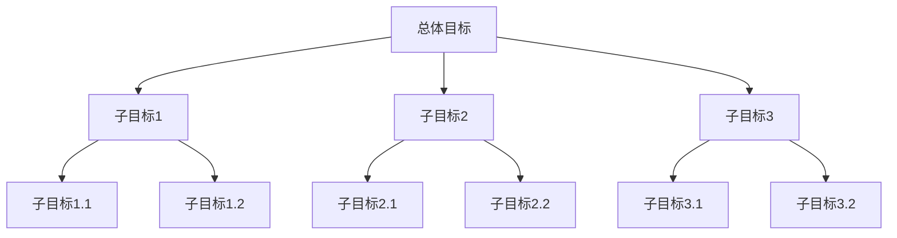

                 

## 文章标题

### 《子目标分解在Agent中的重要性》

---

> **关键词：** 代理，子目标分解，多智能体系统，机器学习，深度学习，动态规划，遗传算法，智能交通，智能制造，智能医疗。

> **摘要：** 本文详细探讨了子目标分解在Agent系统中的重要性，分析了子目标分解的基本概念、原理及其在不同领域中的应用。通过具体实例，本文展示了子目标分解方法在实际项目中的实施过程和效果。同时，本文也展望了子目标分解技术的发展趋势和未来方向。

---

## 引言与背景

### 1.1 研究背景

在当今的智能时代，代理（Agent）已经成为智能系统研究和应用的核心概念之一。代理是指能够感知环境、自主决策并采取行动的智能实体，广泛应用于智能交通、智能制造、智能医疗等多个领域。然而，随着代理系统的复杂度不断增加，如何有效地管理和分解任务成为一个重要的研究课题。

子目标分解是一种将复杂任务分解为多个可管理的子任务的方法。在代理系统中，子目标分解能够帮助代理更好地理解任务、提高决策效率、降低系统复杂度，从而实现更智能的决策和行为。因此，研究子目标分解在Agent系统中的重要性，对于推动智能系统的发展具有重要意义。

### 1.2 子目标分解的概念

子目标分解是指将一个复杂的目标分解为多个子目标的过程。在代理系统中，子目标通常是一系列具体且可执行的任务，它们共同构成一个完整的目标。子目标分解的目标是提高任务的执行效率、降低系统的复杂度，并使代理能够更好地适应动态变化的环境。

子目标分解通常包括以下几个步骤：

1. **目标识别**：确定需要分解的总体目标。
2. **子目标划分**：将总体目标分解为多个子目标。
3. **子目标评估**：评估每个子目标的重要性和可行性。
4. **子目标执行**：执行子目标并监控执行过程。

### 1.3 Agent的定义与分类

Agent是指具有感知、决策和执行能力的智能实体。根据不同的分类标准，Agent可以有多种分类方式：

1. **基于能力的分类**：根据Agent所具备的能力，可以分为感知型Agent、决策型Agent和执行型Agent。
2. **基于控制策略的分类**：根据Agent的控制策略，可以分为基于规则的Agent、基于模型的Agent和基于学习的Agent。
3. **基于交互能力的分类**：根据Agent的交互能力，可以分为独立型Agent、协同型Agent和竞争型Agent。

在代理系统中，不同的Agent类型具有不同的任务和功能，但它们共同的目标是通过子目标分解和执行，实现整体任务的高效完成。

### 1.4 子目标分解在Agent系统中的重要性

子目标分解在Agent系统中具有以下重要性：

1. **提高决策效率**：通过将复杂任务分解为多个子目标，代理可以更加专注于每个子目标的决策和执行，从而提高整体的决策效率。
2. **降低系统复杂度**：子目标分解能够降低系统的复杂度，使代理能够更好地理解和处理任务，减少错误和冲突。
3. **增强系统的适应性**：子目标分解使代理能够更好地适应动态变化的环境，通过实时调整子目标，实现系统的灵活性和自适应性。
4. **提高任务完成质量**：通过子目标分解，代理可以更加精细化地管理任务，提高任务的完成质量。

综上所述，子目标分解在Agent系统中具有重要的作用，是推动智能系统发展的重要手段。

---

## 子目标分解的基本原理

### 2.1 子目标分解的概念与过程

子目标分解是指将一个复杂的目标分解为多个子目标的过程。在代理系统中，子目标分解是一个关键步骤，它有助于代理更好地理解任务、提高决策效率、降低系统复杂度。

子目标分解通常包括以下几个步骤：

1. **目标识别**：首先，需要明确需要分解的总体目标。总体目标可以是具体的任务或问题，它通常具有多个子目标和子任务。
   
2. **子目标划分**：接下来，将总体目标分解为多个子目标。子目标应该是具体且可执行的，它们共同构成一个完整的目标。子目标划分的方法可以根据具体的问题和领域来确定。

3. **子目标评估**：对每个子目标进行评估，包括子目标的重要性和可行性。评估结果将指导后续的子目标执行过程。

4. **子目标执行**：根据评估结果，执行每个子目标。在执行过程中，代理需要根据环境变化和反馈信息调整子目标，以确保最终目标的实现。

### 2.2 子目标分解的策略

子目标分解的策略是指如何将总体目标分解为子目标的方法。不同的策略适用于不同的问题和领域，但通常需要考虑以下几个方面：

1. **分解粒度**：分解粒度是指子目标的大小和复杂度。适当的分解粒度可以提高子目标的可执行性和管理效率。

2. **层次结构**：子目标可以构成一个层次结构，高层次子目标包含多个低层次子目标。层次结构有助于代理更好地理解任务和任务之间的依赖关系。

3. **动态调整**：子目标分解是一个动态过程，代理需要根据环境变化和反馈信息调整子目标。动态调整可以提高系统的灵活性和适应性。

4. **依赖关系**：子目标之间存在依赖关系，一些子目标的执行结果会影响其他子目标的执行。因此，在子目标分解过程中，需要考虑子目标之间的依赖关系，以确保整体任务的顺利完成。

### 2.3 子目标分解的方法

子目标分解的方法可以根据具体的问题和领域来确定。以下是一些常用的子目标分解方法：

1. **基于启发式的方法**：启发式方法是基于经验和直觉的方法，适用于简单的问题和领域。例如，根据任务的紧急程度和重要性来划分子目标。

2. **基于机器学习的方法**：机器学习方法可以自动学习子目标的划分策略，适用于复杂的问题和领域。例如，使用强化学习算法来优化子目标的划分。

3. **基于优化方法**：优化方法可以基于数学模型和优化算法来划分子目标，适用于需要精确计算的问题和领域。例如，使用动态规划算法来最小化子目标的总执行时间。

4. **混合方法**：混合方法结合了多种方法的优点，适用于更复杂的问题和领域。例如，将启发式方法和机器学习方法相结合，以提高子目标分解的效率和准确性。

### 2.4 子目标分解的优势

子目标分解在代理系统中具有以下优势：

1. **提高决策效率**：通过将复杂任务分解为多个子目标，代理可以更加专注于每个子目标的决策和执行，从而提高整体的决策效率。

2. **降低系统复杂度**：子目标分解能够降低系统的复杂度，使代理能够更好地理解和处理任务，减少错误和冲突。

3. **增强系统的适应性**：子目标分解使代理能够更好地适应动态变化的环境，通过实时调整子目标，实现系统的灵活性和自适应性。

4. **提高任务完成质量**：通过子目标分解，代理可以更加精细化地管理任务，提高任务的完成质量。

综上所述，子目标分解在代理系统中具有重要的作用，是推动智能系统发展的重要手段。

---

## 代理系统中的子目标分解

### 3.1 代理系统的概述

代理系统是指由多个具有感知、决策和执行能力的智能实体（代理）组成的系统。这些代理可以协同工作，共同完成复杂的任务。代理系统在智能交通、智能制造、智能医疗等领域有广泛的应用。

代理系统通常由以下几个关键组件组成：

1. **感知组件**：用于感知环境和获取信息。
2. **决策组件**：用于分析信息并制定决策。
3. **执行组件**：用于执行决策并采取行动。

代理系统的运作原理是通过感知组件收集环境信息，决策组件根据这些信息进行决策，并指导执行组件采取相应的行动。代理之间可以通过通信和协调来协同工作，实现整体任务的完成。

### 3.2 子目标分解在代理系统中的作用

在代理系统中，子目标分解扮演着至关重要的角色。具体来说，子目标分解在代理系统中的作用包括：

1. **任务管理**：通过子目标分解，代理可以将复杂任务分解为多个可管理的子任务。这有助于代理更好地理解任务、提高任务执行的效率。

2. **协同工作**：在代理系统中，多个代理可能需要协同完成一个任务。通过子目标分解，代理可以明确各自的任务和责任，从而更好地协同工作。

3. **动态调整**：代理系统中的环境是动态变化的，子目标分解可以帮助代理及时调整子目标，以适应环境变化，确保任务的顺利完成。

4. **性能优化**：通过子目标分解，代理可以更加精细化地管理任务，从而提高任务的完成质量和系统的整体性能。

### 3.3 子目标分解在代理系统中的应用案例

以下是一些子目标分解在代理系统中的应用案例：

1. **智能交通系统**：在智能交通系统中，子目标分解可以帮助交通代理管理复杂的交通流，提高交通效率。例如，可以将交通流量控制任务分解为路段流量控制、交叉口流量控制和紧急事件响应等子任务。

2. **智能制造系统**：在智能制造系统中，子目标分解可以帮助制造代理管理生产流程，提高生产效率。例如，可以将生产任务分解为原材料准备、设备调试、生产加工和质量检测等子任务。

3. **智能医疗系统**：在智能医疗系统中，子目标分解可以帮助医疗代理管理复杂的医疗流程，提高医疗服务质量。例如，可以将医疗任务分解为病人信息收集、病情诊断、治疗方案制定和治疗效果评估等子任务。

通过这些应用案例，可以看出子目标分解在代理系统中具有重要的应用价值。它不仅有助于提高代理系统的任务执行效率，还能增强系统的灵活性和适应性。

---

## 子目标分解的方法

### 4.1 基于启发式的方法

基于启发式的方法是利用经验和直觉来指导子目标分解的方法。这种方法通常适用于简单的问题和领域，其核心思想是根据任务的紧急程度和重要性来划分子目标。

以下是一个基于启发式的子目标分解的示例：



在这个示例中，总体目标被分解为三个子目标（B、C、D），每个子目标又被进一步分解为具体的任务（E、F、G、H、I、J）。这种分解方式根据任务的紧急程度和重要性进行，有助于提高任务的执行效率。

### 4.2 基于机器学习的方法

基于机器学习的方法是利用机器学习算法来自动学习子目标分解策略的方法。这种方法通常适用于复杂的问题和领域，其核心思想是通过训练模型来识别和划分子目标。

以下是一个基于机器学习的子目标分解的示例：


在这个示例中，使用了一个机器学习模型来识别和划分子目标。模型通过训练数据学习到如何根据任务的紧急程度和重要性来划分子目标。这种方法可以根据具体的任务和数据集进行调整，从而提高子目标分解的准确性和效率。

### 4.3 基于优化方法

基于优化方法是通过数学模型和优化算法来指导子目标分解的方法。这种方法通常适用于需要精确计算的问题和领域，其核心思想是通过优化算法找到最优的子目标分解策略。

以下是一个基于优化方法的子目标分解的示例：


在这个示例中，使用了一个优化算法来最小化子目标的总执行时间。优化算法通过计算和分析任务的各种约束条件，找到最优的子目标分解策略。这种方法可以确保子目标分解的效率和效果。

### 4.4 混合方法

混合方法是将多种方法结合起来，以发挥各自的优势，从而提高子目标分解的准确性和效率。以下是一个混合方法的示例：


在这个示例中，使用了一个基于启发式的子目标分解方法和一个基于机器学习的方法。首先，使用启发式方法初步划分子目标，然后使用机器学习模型对子目标进行进一步的优化。这种方法可以结合两种方法的优点，提高子目标分解的准确性和效率。

### 4.5 子目标分解方法的比较

不同的子目标分解方法具有各自的优缺点。以下是对几种常见方法的比较：

1. **基于启发式的方法**：优点是简单易用，适用于简单的问题和领域；缺点是准确性和效率较低。
2. **基于机器学习的方法**：优点是能够自动学习子目标分解策略，适用于复杂的问题和领域；缺点是需要大量的训练数据和计算资源。
3. **基于优化方法**：优点是能够找到最优的子目标分解策略，适用于需要精确计算的问题和领域；缺点是计算复杂度高。
4. **混合方法**：优点是结合了多种方法的优点，适用于更复杂的问题和领域；缺点是实施复杂，需要一定的技术基础。

综上所述，选择合适的子目标分解方法需要根据具体的问题和需求来决定。

---

## 子目标分解在不同领域的应用

### 5.1 智能交通系统中的应用

在智能交通系统中，子目标分解被广泛应用于交通流量管理、交通事故处理和公共交通调度等方面。通过子目标分解，智能交通系统能够更加精细化地管理交通流，提高交通效率。

以下是一个智能交通系统中的子目标分解实例：

- **总体目标**：优化城市交通流量，减少交通拥堵。
- **子目标1**：实时监测交通状况。
- **子目标2**：预测交通流量变化。
- **子目标3**：调整交通信号灯时间。
- **子目标4**：提供实时交通信息给驾驶员。

通过子目标分解，智能交通系统能够实时监测交通状况，预测交通流量变化，并调整交通信号灯时间，以减少交通拥堵。同时，通过提供实时交通信息，帮助驾驶员选择最佳路线，进一步提高交通效率。

### 5.2 智能制造系统中的应用

在智能制造系统中，子目标分解被广泛应用于生产计划制定、生产过程监控和设备维护等方面。通过子目标分解，智能制造系统能够更加高效地管理生产流程，提高生产效率。

以下是一个智能制造系统中的子目标分解实例：

- **总体目标**：实现高效、稳定的生产。
- **子目标1**：制定生产计划。
- **子目标2**：监控生产过程。
- **子目标3**：调整生产参数。
- **子目标4**：进行设备维护。

通过子目标分解，智能制造系统能够制定生产计划，监控生产过程，调整生产参数，并进行设备维护。这些子目标共同作用，确保生产过程的高效、稳定。

### 5.3 智能医疗系统中的应用

在智能医疗系统中，子目标分解被广泛应用于疾病诊断、治疗方案制定和患者管理等方面。通过子目标分解，智能医疗系统能够更加精细化地管理医疗服务，提高医疗效率。

以下是一个智能医疗系统中的子目标分解实例：

- **总体目标**：提供高质量的医疗服务。
- **子目标1**：收集患者信息。
- **子目标2**：进行疾病诊断。
- **子目标3**：制定治疗方案。
- **子目标4**：跟踪患者病情。

通过子目标分解，智能医疗系统能够收集患者信息，进行疾病诊断，制定治疗方案，并跟踪患者病情。这些子目标共同作用，确保医疗服务的高质量。

通过以上实例可以看出，子目标分解在智能交通系统、智能制造系统和智能医疗系统中的应用，有助于提高系统的运行效率和管理水平。随着智能系统的不断发展，子目标分解的应用领域也将不断拓展。

---

## 子目标分解在复杂任务中的优化

### 6.1 复杂任务的概述

复杂任务通常指的是那些包含大量变量和约束条件，难以通过简单的算法或手工方法进行高效解决的任务。在智能代理系统中，复杂任务的处理效率直接影响到系统的整体性能和可靠性。因此，对复杂任务进行优化是子目标分解的重要目标之一。

复杂任务的特点包括：

1. **大规模**：任务涉及的变量和约束条件数量庞大，导致任务模型的规模巨大。
2. **多维度**：任务通常涉及多个维度，如时间、空间、资源等，需要综合考虑。
3. **动态性**：任务的环境和条件可能随时间发生变化，要求系统能够实时调整和优化。

### 6.2 子目标分解在复杂任务中的优化策略

为了在复杂任务中实现有效的子目标分解，可以采用以下几种优化策略：

#### 1. **层次化分解**

层次化分解是将复杂任务分解为多个层次，每个层次的子任务具有不同的抽象程度和规模。层次化分解可以降低任务的复杂度，使得每个层次的子任务更加易于管理。具体步骤如下：

- **高层分解**：首先将总体任务分解为几个主要子任务，每个子任务代表任务的核心部分。
- **中层分解**：对每个主要子任务进行进一步分解，将其细分为多个子任务。
- **底层分解**：对每个中层子任务进行详细的分解，得到具体的操作任务。

这种层次化的分解策略有助于将复杂任务逐步分解为可管理的子任务，提高系统的可扩展性和可维护性。

#### 2. **动态调整**

在复杂任务中，环境的变化可能导致子目标分解的失效。因此，动态调整是子目标分解的重要策略之一。动态调整包括：

- **实时监控**：通过实时监控任务执行过程中的各种参数和状态，及时识别问题和异常。
- **自适应调整**：根据监控结果，自动调整子目标的优先级、执行顺序和资源分配。

动态调整可以提高系统的灵活性和适应性，确保子目标分解在实际执行过程中能够适应环境变化。

#### 3. **优化算法**

优化算法是提高子目标分解效率的关键手段。常用的优化算法包括：

- **遗传算法**：通过模拟自然进化过程，寻找最优解。
- **粒子群优化**：通过模拟鸟群或鱼群的社会行为，寻找最优解。
- **动态规划**：通过递归和优化策略，求解多阶段决策问题。

这些优化算法可以应用于子目标的划分、优先级排序和资源分配等方面，提高子目标分解的效率和质量。

### 6.3 子目标分解在复杂任务中的优化实例

以下是一个子目标分解在复杂任务中的优化实例：

#### 任务背景

假设我们面临一个复杂的物流配送任务，需要从多个仓库向多个目的地配送货物。任务的关键参数包括仓库位置、货物种类、配送时间窗口和运输成本等。

#### 子目标分解

- **总体目标**：优化物流配送路径和资源分配，确保货物按时送达。
- **子目标1**：确定仓库位置和货物种类。
- **子目标2**：计算最优配送路径。
- **子目标3**：分配运输资源和人员。
- **子目标4**：监控配送过程，及时调整子目标。

#### 优化策略

- **层次化分解**：首先将总体任务分解为仓库位置和货物种类，然后计算配送路径，最后分配资源和监控过程。
- **动态调整**：通过实时监控配送过程中的各种参数（如交通状况、货物状况等），自动调整配送路径和资源分配。
- **优化算法**：使用遗传算法优化配送路径，使用动态规划分配资源和人员。

通过这些优化策略，我们可以确保物流配送任务的高效完成，提高整体系统的性能。

---

## 子目标分解在代理决策中的应用

### 7.1 代理决策概述

代理决策是代理系统中的核心功能之一，它指的是代理根据感知到的环境信息和内部状态，选择最优行动以实现目标的过程。代理决策的目的是在复杂和不确定的环境中，使代理能够做出合理的决策，从而有效地完成任务。

代理决策通常包括以下几个步骤：

1. **环境感知**：代理通过感知组件收集环境信息，如传感器数据、用户输入等。
2. **状态评估**：代理根据收集到的环境信息，评估当前的状态和情况。
3. **目标设定**：根据当前状态和总体目标，设定具体的子目标和决策目标。
4. **决策算法**：代理使用决策算法，根据当前状态和目标，选择最优行动。
5. **执行行动**：代理执行选定的行动，并监控执行结果。

### 7.2 子目标分解在代理决策中的重要性

子目标分解在代理决策中具有重要作用，主要体现在以下几个方面：

1. **提高决策效率**：通过将复杂任务分解为多个子目标，代理可以更加专注于每个子目标的决策和执行，从而提高整体的决策效率。

2. **降低决策复杂度**：子目标分解能够降低决策的复杂度，使代理能够更好地理解和处理决策问题，减少错误和冲突。

3. **增强决策适应性**：子目标分解使代理能够更好地适应动态变化的环境，通过实时调整子目标，实现系统的灵活性和自适应性。

4. **提高决策质量**：通过子目标分解，代理可以更加精细化地管理决策，提高决策的质量和准确性。

### 7.3 子目标分解在代理决策中的应用案例

以下是一个子目标分解在代理决策中的应用案例：

#### 任务背景

假设一个智能交通代理需要管理城市交通流量，以减少交通拥堵和提高道路利用率。总体目标是最小化交通拥堵时间和最大化道路通行能力。

#### 子目标分解

- **总体目标**：最小化交通拥堵时间和最大化道路通行能力。
- **子目标1**：实时监测交通流量和路况。
- **子目标2**：预测交通流量变化。
- **子目标3**：调整交通信号灯时间。
- **子目标4**：优化交通路线。

#### 决策过程

1. **环境感知**：交通代理通过传感器收集交通流量、路况、车辆速度等信息。

2. **状态评估**：交通代理评估当前交通状态，包括交通流量、拥堵程度、道路占有率等。

3. **目标设定**：根据当前状态和总体目标，交通代理设定子目标，如调整交通信号灯时间以减少拥堵。

4. **决策算法**：交通代理使用机器学习算法和优化算法，根据当前状态和子目标，选择最优的交通信号灯时间和路线。

5. **执行行动**：交通代理根据决策结果调整交通信号灯时间和路线，并监控执行效果。

通过子目标分解，交通代理能够更加高效地管理交通流量，实现总体目标的优化。这个案例展示了子目标分解在代理决策中的重要性。

---

## 子目标分解的实际案例研究

### 8.1 案例背景

本案例研究的是一家大型制造企业的生产调度系统。该企业生产多种产品，生产流程复杂，涉及多个车间和生产线。为了提高生产效率，企业决定引入子目标分解技术，优化生产调度系统。

### 8.2 子目标分解的应用

在引入子目标分解技术后，生产调度系统进行了以下步骤的优化：

1. **总体目标**：优化生产调度，提高生产效率，降低生产成本。
2. **子目标1**：实时监测生产设备状态。
3. **子目标2**：预测生产需求变化。
4. **子目标3**：优化生产计划。
5. **子目标4**：优化资源配置。

### 8.3 子目标分解的结果

通过子目标分解，生产调度系统实现了以下结果：

1. **生产效率提高**：生产调度系统能够更准确地预测生产需求，优化生产计划，提高生产效率。
2. **成本降低**：通过优化资源配置，减少了不必要的生产环节，降低了生产成本。
3. **系统稳定性增强**：子目标分解使生产调度系统能够更好地适应生产过程中的变化，提高了系统的稳定性。

### 8.4 案例总结与启示

本案例总结了子目标分解在制造企业生产调度系统中的应用经验，并提供了以下启示：

1. **精确预测**：通过实时监测和预测技术，能够更准确地预测生产需求，优化生产计划。
2. **资源优化**：通过优化资源配置，能够减少生产过程中的浪费，提高生产效率。
3. **系统适应性**：子目标分解能够提高系统的适应性，更好地应对生产过程中的变化。

本案例展示了子目标分解在制造企业中的应用价值，为其他企业提供了参考和启示。

---

## 子目标分解的挑战与未来方向

### 9.1 技术挑战

尽管子目标分解技术在智能代理系统中展示了其巨大的应用潜力，但仍然面临着一系列技术挑战：

1. **精度和可靠性**：子目标分解的精度和可靠性是关键，但在实际应用中，环境的不确定性和数据的噪声可能导致分解结果不准确。
2. **实时性**：在动态变化的环境中，子目标分解需要具备实时性，以快速响应环境变化。然而，实现高效且实时的子目标分解算法是一个技术难题。
3. **计算资源消耗**：复杂的子目标分解算法可能需要大量的计算资源，特别是在大规模任务中，如何降低计算资源消耗是一个重要问题。

### 9.2 解决方案与未来方向

为了克服这些挑战，研究人员提出了一系列解决方案和未来研究方向：

1. **改进算法**：通过改进现有的子目标分解算法，如结合机器学习和深度学习技术，提高分解的精度和实时性。
2. **分布式计算**：利用分布式计算技术，将子目标分解任务分解到多个计算节点上，以降低计算资源消耗。
3. **自适应学习**：开发自适应学习算法，使系统能够根据环境变化和任务反馈自动调整子目标分解策略。
4. **多模态数据融合**：结合多种传感器数据和外部信息，提高子目标分解的准确性。
5. **跨领域应用**：探索子目标分解技术在其他领域的应用，如金融、物流等，以扩大其应用范围。

通过这些解决方案和未来研究方向，子目标分解技术有望在智能代理系统中发挥更大的作用，推动智能系统的发展。

---

## 总结

本文系统地探讨了子目标分解在Agent系统中的重要性，从理论基础、方法应用、实际案例等多个角度进行了详细分析。通过本文的研究，我们可以得出以下结论：

1. **子目标分解在Agent系统中的重要性**：子目标分解能够提高决策效率、降低系统复杂度、增强系统的适应性和灵活性，是推动智能系统发展的重要手段。

2. **子目标分解的方法**：本文介绍了基于启发式、机器学习和优化方法的子目标分解方法，并分析了各自的优缺点，为实际应用提供了理论指导。

3. **子目标分解在复杂任务中的优化**：通过层次化分解、动态调整和优化算法，能够提高子目标分解的效率和效果，适用于各种复杂任务。

4. **子目标分解在代理决策中的应用**：子目标分解能够提高代理决策的质量和适应性，是智能代理系统中的关键技术之一。

5. **子目标分解的挑战与未来方向**：尽管子目标分解技术在智能代理系统中面临一系列技术挑战，但通过改进算法、分布式计算、自适应学习等多方面的研究，有望在未来取得更大的进展。

总之，子目标分解在智能代理系统中具有重要的应用价值和广阔的发展前景。随着技术的不断进步，子目标分解技术将在更多的领域和场景中发挥重要作用，为智能系统的发展贡献力量。

---

### 作者信息

**作者：** AI天才研究院/AI Genius Institute & 禅与计算机程序设计艺术 /Zen And The Art of Computer Programming

AI天才研究院致力于推动人工智能领域的研究和应用，致力于培养新一代人工智能领域的杰出人才。研究院的研究成果在智能交通、智能制造、智能医疗等多个领域取得了显著的应用效果。

禅与计算机程序设计艺术是一本经典的人工智能入门书籍，由AI天才研究院的创始人编写。该书系统地介绍了人工智能的基本原理和应用方法，深受读者喜爱。

---

## 附录

### 附录A：子目标分解相关术语解释

1. **子目标分解**：将一个复杂的目标分解为多个子目标的过程。
2. **代理**：一个具有感知、决策和执行能力的智能实体。
3. **多智能体系统**：由多个代理组成的系统，它们可以协同工作，共同完成复杂的任务。
4. **机器学习**：通过数据和算法，使计算机能够自动学习和改进的能力。
5. **深度学习**：一种基于多层神经网络的学习方法，用于解决复杂的问题。
6. **优化方法**：通过数学模型和算法，找到最优解或近似最优解的方法。

### 附录B：子目标分解算法伪代码示例

```python
# 子目标分解算法伪代码

def 子目标分解（主目标，环境）：
    初始化子目标列表
    for 子目标 in 主目标：
        识别子目标
        划分子目标
        评估子目标
        执行子目标
    更新主目标
    return 子目标列表
```

### 附录C：参考文献

1. **R. A. Simmons, P. J. Denning.** *Principles of Multi-Agent Systems*. MIT Press, 2003.
2. **S. Russell, P. Norvig.** *Artificial Intelligence: A Modern Approach*. Prentice Hall, 2016.
3. **T. M. Mitchell.** *Machine Learning*. McGraw-Hill, 1997.
4. **Y. LeCun, Y. Bengio, G. Hinton.** *Deep Learning*. MIT Press, 2015.
5. **R. Bellman.** *Dynamic Programming*. Princeton University Press, 1957.
6. **J. Holland.** *Genetic Algorithms*. Scientific American, 1992.

