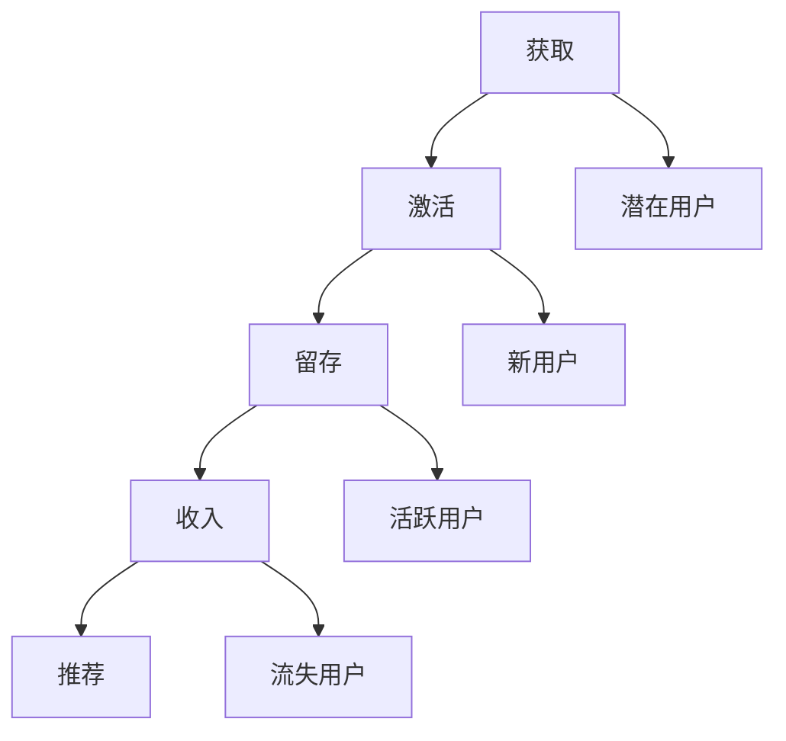

                 

# 2024字节跳动校招：技术用户增长专家面试题详解

> **关键词：** 字节跳动校招、技术用户增长专家、面试题详解、编程语言、数据结构、数据库、缓存、网络、系统、用户增长策略、数据分析、项目实战

> **摘要：** 本文旨在为2024年字节跳动校招技术用户增长专家岗位的考生提供详细的面试题解答，包括编程语言与数据结构、数据库与缓存、网络与系统、用户增长与数据分析等核心领域的知识点。通过一步步的逻辑分析和实际案例，帮助考生深入理解面试题背后的技术原理，提升面试技巧。

## 目录大纲：2024字节跳动校招：技术用户增长专家面试题详解

### 第一部分：字节跳动面试基本概念

- **第1章：字节跳动面试概述**
  - 1.1 字节跳动面试流程
    - 1.1.1 投递简历
    - 1.1.2 网上笔试
    - 1.1.3 技术面试
    - 1.1.4 增长面试
  - 1.2 面试常见问题类型
    - 1.2.1 行为面试
    - 1.2.2 技术面试
    - 1.2.3 增长面试

### 第二部分：技术面试题详解

- **第2章：编程语言与数据结构**
  - 2.1 编程语言
    - 2.1.1 Java
    - 2.1.2 Python
    - 2.1.3 C++
  - 2.2 数据结构与算法
    - 2.2.1 链表
    - 2.2.2 栈和队列
    - 2.2.3 树和图
    - 2.2.4 排序算法
    - 2.2.5 搜索算法

- **第3章：数据库技术**
  - 3.1 关系型数据库
    - 3.1.1 MySQL
    - 3.1.2 Oracle
    - 3.1.3 SQL Server
  - 3.2 非关系型数据库
    - 3.2.1 MongoDB
    - 3.2.2 Redis
    - 3.2.3 Cassandra

- **第4章：缓存技术**
  - 4.1 缓存基本概念
    - 4.1.1 缓存的原理与作用
    - 4.1.2 缓存的一致性问题
  - 4.2 常见缓存技术
    - 4.2.1 Memcached
    - 4.2.2 Redis
    - 4.2.3 MemSQL

- **第5章：网络技术**
  - 5.1 网络协议
    - 5.1.1 HTTP协议
    - 5.1.2 TCP/IP协议
    - 5.1.3 HTTPS协议
  - 5.2 网络安全
    - 5.2.1 数据加密
    - 5.2.2 认证机制
    - 5.2.3 安全漏洞与防护

- **第6章：系统编程**
  - 6.1 操作系统基础
    - 6.1.1 进程与线程
    - 6.1.2 内存管理
    - 6.1.3 文件系统
  - 6.2 系统编程工具
    - 6.2.1 GCC
    - 6.2.2 Makefile
    - 6.2.3 Shell脚本

### 第三部分：用户增长与数据分析

- **第7章：用户增长策略**
  - 7.1 用户增长模型
    - 7.1.1 AARRR模型
    - 7.1.2 用户生命周期
    - 7.1.3 用户留存策略
  - 7.2 增长案例分析
    - 7.2.1 字节跳动案例
    - 7.2.2 抖音案例
    - 7.2.3 微博案例

- **第8章：数据分析方法**
  - 8.1 数据分析流程
    - 8.1.1 数据收集
    - 8.1.2 数据清洗
    - 8.1.3 数据分析
    - 8.1.4 数据可视化
  - 8.2 常见数据分析工具
    - 8.2.1 Excel
    - 8.2.2 Python数据分析库
    - 8.2.3 Tableau

### 第四部分：项目实战

- **第9章：项目实战**
  - 9.1 项目背景
    - 9.1.1 项目概述
    - 9.1.2 项目目标
  - 9.2 技术选型
    - 9.2.1 系统架构设计
    - 9.2.2 技术栈选择
  - 9.3 项目实施
    - 9.3.1 开发流程
    - 9.3.2 测试与部署
    - 9.3.3 问题与解决方案
  - 9.4 项目成果
    - 9.4.1 用户反馈
    - 9.4.2 数据分析结果
    - 9.4.3 项目总结与展望

### 第五部分：总结与展望

- **第10章：总结与展望**
  - 10.1 字节跳动校招面试准备要点
  - 10.2 技术发展趋势与用户增长策略
  - 10.3 数据分析在用户增长中的应用

### 附录

- **附录A：参考书籍与资料**
  - 10.1 编程书籍
  - 10.2 数据结构与算法书籍
  - 10.3 数据库与缓存书籍
  - 10.4 网络与系统书籍

- **附录B：资源链接**
  - 10.1 技术社区
  - 10.2 在线课程
  - 10.3 技术文档
  - 10.4 开源项目

### 作者信息

- 作者：AI天才研究院/AI Genius Institute & 禅与计算机程序设计艺术 /Zen And The Art of Computer Programming

----------------------------------------------------------------

## 第一部分：字节跳动面试基本概念

### 第1章：字节跳动面试概述

#### 1.1 字节跳动面试流程

字节跳动面试流程主要包括四个阶段：简历投递、网上笔试、技术面试和增长面试。每个阶段都有其特定的要求，考生需要充分准备，以提高通过率。

##### 1.1.1 投递简历

投递简历是进入字节跳动面试的第一步。考生需要关注字节跳动的官方网站或招聘平台，找到合适的职位，并按照要求填写简历。简历中应包括个人基本信息、教育背景、工作经历、项目经验和技术特长等内容。为了提高简历的通过率，考生应注意以下几点：

1. 突出技术特长和项目经验，用具体数据证明自己的能力。
2. 语言表达清晰，避免错别字和语法错误。
3. 简历结构要合理，逻辑清晰，突出重点。

##### 1.1.2 网上笔试

网上笔试主要考察考生的编程能力和数据结构算法知识。题目通常包括编程题、算法题和数据结构题等。考生需要在线完成这些题目，并提交答案。网上笔试的特点是时间紧、题目多，考生需要做好以下准备：

1. 熟练掌握常用的编程语言，如Java、Python和C++等。
2. 掌握常见的算法和数据结构，如排序算法、查找算法、树和图等。
3. 提高解题速度和准确率，多做练习题。

##### 1.1.3 技术面试

技术面试主要考察考生的专业技能和解决问题的能力。面试官会根据考生的简历和笔试成绩，提出一些技术问题。技术面试的特点是深度和广度并存，考生需要具备扎实的基础知识和丰富的实践经验。以下是一些建议：

1. 复习基础知识，如操作系统、计算机网络、数据库等。
2. 分析自己的项目经验，总结经验教训，形成独特的见解。
3. 面试过程中，要表达清晰，逻辑严密，回答问题时要简洁明了。

##### 1.1.4 增长面试

增长面试主要考察考生在用户增长方面的策略和思维。面试官会针对考生在笔试和技术面试中的表现，提出一些与用户增长相关的问题。增长面试的特点是注重实际操作和案例分析，考生需要具备以下能力：

1. 熟悉用户增长模型和用户生命周期，能够运用这些模型进行分析。
2. 具备实际操作经验，能够运用数据分析方法进行用户增长策略的制定。
3. 关注行业动态，掌握最新的用户增长技术和方法。

#### 1.2 面试常见问题类型

在字节跳动的面试中，常见的问题类型包括行为面试、技术面试和增长面试。下面分别介绍这三种面试类型的特点和应对策略。

##### 1.2.1 行为面试

行为面试主要考察考生的行为模式和思维方式。面试官会根据考生在简历中提到的项目经验或工作经历，提出一些情境性问题，要求考生回答。下面是一些建议：

1. 回答问题时，要突出自己的优势和能力，用具体事例证明自己的成就。
2. 做好时间管理，注意回答问题的逻辑性和条理性。
3. 面试过程中，要表达自信，保持良好的沟通能力。

##### 1.2.2 技术面试

技术面试主要考察考生的专业知识和实际操作能力。面试官会根据考生的简历和笔试成绩，提出一些技术问题。下面是一些建议：

1. 复习基础知识，如操作系统、计算机网络、数据库等。
2. 分析自己的项目经验，总结经验教训，形成独特的见解。
3. 面试过程中，要表达清晰，逻辑严密，回答问题时要简洁明了。

##### 1.2.3 增长面试

增长面试主要考察考生在用户增长方面的策略和思维。面试官会根据考生在笔试和技术面试中的表现，提出一些与用户增长相关的问题。下面是一些建议：

1. 熟悉用户增长模型和用户生命周期，能够运用这些模型进行分析。
2. 具备实际操作经验，能够运用数据分析方法进行用户增长策略的制定。
3. 关注行业动态，掌握最新的用户增长技术和方法。

### 第二部分：技术面试题详解

#### 第2章：编程语言与数据结构

##### 2.1 编程语言

编程语言是编写程序的基础，字节跳动面试中常见的主要编程语言包括Java、Python和C++。

###### 2.1.1 Java

Java是一种跨平台、面向对象的编程语言，具有简单、面向对象、分布式、解释型、高效、安全等特点。以下是Java面试中可能涉及的一些知识点：

1. **Java的基本数据类型**：byte、short、int、long、float、double、char、boolean。
2. **Java的集合框架**：List、Set、Map、Queue等常用集合类的实现和特点。
3. **Java的多线程**：线程的概念、线程的创建、线程的同步与通信。
4. **Java的异常处理**：异常的分类、异常的捕获与处理。
5. **Java的网络编程**：网络通信的基本概念、Socket编程等。

下面给出一个Java多线程的伪代码示例：

```java
class MyThread extends Thread {
    public void run() {
        // 线程执行的具体操作
        System.out.println("线程执行中...");
    }
}

public class Main {
    public static void main(String[] args) {
        MyThread t1 = new MyThread();
        MyThread t2 = new MyThread();
        
        t1.start();
        t2.start();
    }
}
```

###### 2.1.2 Python

Python是一种解释型、面向对象、动态数据类型的高级编程语言，具有简单易学、可扩展性强、应用广泛等特点。以下是Python面试中可能涉及的一些知识点：

1. **Python的基本数据类型**：int、float、complex、str、bool、None。
2. **Python的集合类型**：list、tuple、set、dict。
3. **Python的函数**：定义、调用、参数传递。
4. **Python的模块**：导入、使用、自定义模块。
5. **Python的异常处理**：try-except语句、异常的分类与处理。

下面给出一个Python列表遍历的伪代码示例：

```python
def print_list(lst):
    for item in lst:
        print(item)

my_list = [1, 2, 3, 4, 5]
print_list(my_list)
```

###### 2.1.3 C++

C++是一种高性能、多范式编程语言，具有面向对象、过程式、泛型等特点。以下是C++面试中可能涉及的一些知识点：

1. **C++的基本数据类型**：int、float、double、char、bool等。
2. **C++的类与对象**：类的定义、构造函数与析构函数、对象的创建与销毁。
3. **C++的继承与多态**：继承的概念、派生类的创建、多态的实现。
4. **C++的模板**：模板函数与模板类。
5. **C++的异常处理**：异常的抛出与捕获。

下面给出一个C++类的定义与创建的伪代码示例：

```cpp
class MyClass {
public:
    MyClass() {
        // 构造函数的实现
    }
    
    ~MyClass() {
        // 析构函数的实现
    }
    
    void display() {
        // 成员函数的实现
        cout << "MyClass object" << endl;
    }
};

int main() {
    MyClass obj;
    obj.display();
    return 0;
}
```

##### 2.2 数据结构与算法

数据结构是存储和组织数据的方式，算法是对数据进行操作的方法。掌握常见的数据结构和算法对于解决实际问题具有重要意义。

###### 2.2.1 链表

链表是一种线性数据结构，由一系列节点组成，每个节点包含数据域和指针域。以下是链表的几种基本操作：

1. **初始化**：创建一个空链表。
2. **插入**：在链表的指定位置或末尾插入一个新节点。
3. **删除**：从链表中删除指定位置的节点。
4. **遍历**：按照顺序访问链表中的所有节点。

下面给出一个单向链表插入操作的伪代码示例：

```c
typedef struct Node {
    int data;
    struct Node* next;
} Node;

Node* create_node(int data) {
    Node* new_node = (Node*)malloc(sizeof(Node));
    new_node->data = data;
    new_node->next = NULL;
    return new_node;
}

void insert_node(Node** head, int data) {
    Node* new_node = create_node(data);
    if (*head == NULL) {
        *head = new_node;
    } else {
        Node* current = *head;
        while (current->next != NULL) {
            current = current->next;
        }
        current->next = new_node;
    }
}
```

###### 2.2.2 栈和队列

栈和队列都是线性数据结构，分别用于处理插入和删除操作。栈遵循后进先出（LIFO）原则，队列遵循先进先出（FIFO）原则。

1. **栈**：基本操作包括初始化、入栈、出栈和遍历。
2. **队列**：基本操作包括初始化、入队、出队和遍历。

下面给出一个栈的入栈和出栈操作的伪代码示例：

```c
typedef struct Stack {
    int top;
    int capacity;
    int* arr;
} Stack;

void initialize_stack(Stack* stack, int capacity) {
    stack->top = -1;
    stack->capacity = capacity;
    stack->arr = (int*)malloc(sizeof(int) * capacity);
}

void push(Stack* stack, int data) {
    if (stack->top == stack->capacity - 1) {
        return;
    }
    stack->top++;
    stack->arr[stack->top] = data;
}

int pop(Stack* stack) {
    if (stack->top == -1) {
        return -1;
    }
    int data = stack->arr[stack->top];
    stack->top--;
    return data;
}
```

###### 2.2.3 树和图

树和图是两种重要的非线性数据结构，广泛应用于计算机科学和实际应用中。

1. **树**：基本操作包括创建、插入、删除、遍历等。
2. **图**：基本操作包括创建、添加边、删除边、遍历等。

下面给出一个二叉树的遍历操作的伪代码示例：

```c
typedef struct TreeNode {
    int data;
    struct TreeNode* left;
    struct TreeNode* right;
} TreeNode;

void inorder(TreeNode* root) {
    if (root == NULL) {
        return;
    }
    inorder(root->left);
    printf("%d ", root->data);
    inorder(root->right);
}
```

###### 2.2.4 排序算法

排序算法是一种常用的算法，用于对数据进行排序。常见的排序算法包括冒泡排序、选择排序、插入排序、快速排序等。

1. **冒泡排序**：依次比较相邻的元素，如果顺序错误就交换。
2. **选择排序**：每次选择剩余元素中的最小值放到已排序序列的末尾。
3. **插入排序**：将未排序序列中的元素依次插入到已排序序列的合适位置。
4. **快速排序**：通过递归方式将序列划分为已排序和未排序两部分，再分别对两部分进行排序。

下面给出一个冒泡排序的伪代码示例：

```c
void bubble_sort(int arr[], int n) {
    for (int i = 0; i < n - 1; i++) {
        for (int j = 0; j < n - i - 1; j++) {
            if (arr[j] > arr[j + 1]) {
                int temp = arr[j];
                arr[j] = arr[j + 1];
                arr[j + 1] = temp;
            }
        }
    }
}
```

###### 2.2.5 搜索算法

搜索算法是一种用于在数据结构中查找特定元素的算法。常见的搜索算法包括线性搜索、二分搜索等。

1. **线性搜索**：依次遍历数据结构中的元素，直到找到目标元素或遍历完整个数据结构。
2. **二分搜索**：在有序数据结构中，通过递归或迭代方式，逐步缩小搜索范围，直到找到目标元素或确定目标元素不存在。

下面给出一个二分搜索的伪代码示例：

```c
int binary_search(int arr[], int l, int r, int x) {
    while (l <= r) {
        int mid = l + (r - l) / 2;
        if (arr[mid] == x) {
            return mid;
        } else if (arr[mid] < x) {
            l = mid + 1;
        } else {
            r = mid - 1;
        }
    }
    return -1;
}
```

### 第3章：数据库技术

数据库技术是存储、管理和查询数据的重要工具，字节跳动面试中常见的主要数据库类型包括关系型数据库和非关系型数据库。

#### 3.1 关系型数据库

关系型数据库是一种基于关系模型的数据结构，使用表格形式存储数据，通过SQL语言进行数据查询和管理。

##### 3.1.1 MySQL

MySQL是一种开源的关系型数据库管理系统，具有高性能、可靠性高、易用性强的特点。以下是MySQL面试中可能涉及的一些知识点：

1. **MySQL的基本概念**：数据库、表、索引、视图等。
2. **SQL语言**：DML（数据操作语言）、DQL（数据查询语言）、DML（数据定义语言）等。
3. **事务管理**：事务的概念、隔离级别、锁机制等。
4. **备份与恢复**：备份策略、恢复方法等。

下面给出一个MySQL创建表的SQL语句示例：

```sql
CREATE TABLE Students (
    ID INT PRIMARY KEY,
    Name VARCHAR(50),
    Age INT,
    Major VARCHAR(50)
);
```

##### 3.1.2 Oracle

Oracle是一种商业关系型数据库管理系统，具有高性能、高可靠性、易扩展性的特点。以下是Oracle面试中可能涉及的一些知识点：

1. **Oracle的基本概念**：数据库、表空间、用户、权限等。
2. **PL/SQL**：Oracle的过程式语言，用于编写存储过程、函数、触发器等。
3. **性能优化**：查询优化、索引优化、统计信息等。
4. **备份与恢复**：RMAN备份、备份策略等。

下面给出一个Oracle创建存储过程的PL/SQL示例：

```sql
CREATE OR REPLACE PROCEDURE AddStudent (
    p_id IN Students.ID%TYPE,
    p_name IN Students.Name%TYPE,
    p_age IN Students.Age%TYPE,
    p_major IN Students.Major%TYPE
) AS
BEGIN
    INSERT INTO Students (ID, Name, Age, Major)
    VALUES (p_id, p_name, p_age, p_major);
END;
```

##### 3.1.3 SQL Server

SQL Server是一种商业关系型数据库管理系统，具有高性能、高可靠性、易管理性的特点。以下是SQL Server面试中可能涉及的一些知识点：

1. **SQL Server的基本概念**：数据库、表、索引、视图等。
2. **T-SQL**：SQL Server的过程式语言，用于编写存储过程、触发器等。
3. **性能优化**：查询优化、索引优化、统计信息等。
4. **备份与恢复**：备份策略、恢复方法等。

下面给出一个SQL Server创建表的T-SQL示例：

```sql
CREATE TABLE Students (
    ID INT PRIMARY KEY,
    Name VARCHAR(50),
    Age INT,
    Major VARCHAR(50)
);
```

#### 3.2 非关系型数据库

非关系型数据库是一种基于非关系模型的数据结构，与关系型数据库相比，具有更高的灵活性和扩展性。常见的非关系型数据库包括MongoDB、Redis和Cassandra等。

##### 3.2.1 MongoDB

MongoDB是一种开源的文档型数据库，具有高性能、可扩展性、易用性强的特点。以下是MongoDB面试中可能涉及的一些知识点：

1. **MongoDB的基本概念**：数据库、集合、文档、索引等。
2. **CRUD操作**：数据的增、删、改、查。
3. **聚合操作**：分组、筛选、排序、计算等。
4. **备份与恢复**：备份策略、恢复方法等。

下面给出一个MongoDB插入文档的MongoDB Shell示例：

```javascript
db.students.insertOne({
    _id: ObjectId("5f973c81a2d77a4cde1f2f3a"),
    name: "John Doe",
    age: 25,
    major: "Computer Science"
});
```

##### 3.2.2 Redis

Redis是一种开源的内存数据存储系统，具有高性能、支持多种数据结构、持久化功能等特点。以下是Redis面试中可能涉及的一些知识点：

1. **Redis的基本概念**：数据结构、持久化、复制等。
2. **常用数据结构**：字符串、列表、集合、哈希、有序集合等。
3. **命令操作**：基本命令、高级命令等。
4. **性能优化**：内存管理、持久化策略等。

下面给出一个Redis设置字符串的Redis CLI示例：

```bash
127.0.0.1:6379> SET mykey "myvalue"
OK
```

##### 3.2.3 Cassandra

Cassandra是一种开源的分布式键值存储系统，具有高性能、高可用性、可扩展性的特点。以下是Cassandra面试中可能涉及的一些知识点：

1. **Cassandra的基本概念**：数据模型、一致性模型、分布式架构等。
2. **基本操作**：插入、查询、更新、删除等。
3. **Cassandra查询语言**：CQL（Cassandra Query Language）。
4. **性能优化**：数据分区、索引优化等。

下面给出一个Cassandra创建表的CQL示例：

```cql
CREATE TABLE IF NOT EXISTS mykeyspace.users (
    id UUID PRIMARY KEY,
    name TEXT,
    age INT,
    email TEXT
);
```

### 第4章：缓存技术

缓存技术是提高系统性能和响应速度的有效手段，通过将数据暂存在内存中，减少对磁盘等慢速存储设备的访问。字节跳动面试中常见的缓存技术包括Memcached、Redis和MemSQL等。

#### 4.1 缓存基本概念

缓存是一种临时存储数据的机制，可以提高系统的访问速度和性能。以下是缓存技术的基本概念：

1. **缓存原理**：缓存原理是将频繁访问的数据存储在内存中，以减少对磁盘等慢速存储设备的访问。
2. **缓存的作用**：缓存可以提高系统的响应速度，减少服务器的负载，提高系统的吞吐量。
3. **缓存的一致性问题**：缓存的一致性问题是指在数据更新时，如何保证缓存和实际数据的一致性。

#### 4.2 常见缓存技术

字节跳动面试中常见的缓存技术包括Memcached、Redis和MemSQL等。

##### 4.2.1 Memcached

Memcached是一种开源的分布式缓存系统，具有高性能、可扩展性强、易于使用等特点。以下是Memcached面试中可能涉及的一些知识点：

1. **Memcached的基本概念**：Memcached的架构、数据存储方式、缓存策略等。
2. **Memcached的命令**：Memcached的常用命令，如set、get、delete等。
3. **Memcached的性能优化**：内存管理、缓存策略、持久化等。

下面给出一个Memcached设置字符串的Memcached CLI示例：

```bash
$ echo "set mykey myvalue 0 3600 0" | nc localhost 11211
 STORED
```

##### 4.2.2 Redis

Redis是一种开源的内存数据存储系统，具有高性能、支持多种数据结构、持久化功能等特点。以下是Redis面试中可能涉及的一些知识点：

1. **Redis的基本概念**：Redis的数据结构、持久化策略、复制等。
2. **常用数据结构**：字符串、列表、集合、哈希、有序集合等。
3. **命令操作**：基本命令、高级命令等。
4. **性能优化**：内存管理、持久化策略等。

下面给出一个Redis设置字符串的Redis CLI示例：

```bash
127.0.0.1:6379> SET mykey "myvalue"
OK
```

##### 4.2.3 MemSQL

MemSQL是一种开源的分布式列存储数据库，具有高性能、可扩展性强、易用性强的特点。以下是MemSQL面试中可能涉及的一些知识点：

1. **MemSQL的基本概念**：MemSQL的数据模型、分布式架构、存储引擎等。
2. **MemSQL的查询语言**：MemSQL的查询语言（SQL）。
3. **性能优化**：索引优化、查询优化、内存管理等。

下面给出一个MemSQL创建表的MemSQL CLI示例：

```sql
CREATE TABLE IF NOT EXISTS mytable (
    id INT PRIMARY KEY,
    name VARCHAR(255),
    created_at TIMESTAMP
);
```

### 第5章：网络技术

网络技术是计算机通信的基础，字节跳动面试中常见的网络技术包括网络协议、网络安全和网络编程等。

#### 5.1 网络协议

网络协议是计算机网络中进行数据交换的规则和标准。字节跳动面试中常见的网络协议包括HTTP、TCP/IP和HTTPS等。

##### 5.1.1 HTTP协议

HTTP（HyperText Transfer Protocol）是互联网上应用最为广泛的网络协议之一，用于在客户端和服务器之间传输超文本数据。以下是HTTP协议面试中可能涉及的一些知识点：

1. **HTTP的基本概念**：HTTP的工作原理、请求和响应等。
2. **HTTP的方法**：GET、POST、PUT、DELETE等。
3. **HTTP的状态码**：常见的状态码及其含义，如200、400、500等。
4. **HTTP的头部信息**：常见的头部信息及其作用，如Content-Type、Cookie等。

下面给出一个HTTP GET请求的示例：

```
GET /index.html HTTP/1.1
Host: www.example.com
User-Agent: Mozilla/5.0 (Windows NT 10.0; Win64; x64) AppleWebKit/537.36 (KHTML, like Gecko) Chrome/58.0.3029.110 Safari/537.3
Accept: text/html,application/xhtml+xml,application/xml;q=0.9,image/webp,*/*;q=0.8
Accept-Language: en-US,en;q=0.5
Accept-Encoding: gzip, deflate, sdch
Connection: keep-alive
Upgrade-Insecure-Requests: 1
```

##### 5.1.2 TCP/IP协议

TCP/IP（Transmission Control Protocol/Internet Protocol）是互联网的基础协议，用于实现数据在网络中的传输。以下是TCP/IP协议面试中可能涉及的一些知识点：

1. **TCP/IP的基本概念**：TCP/IP的工作原理、协议分层模型等。
2. **TCP协议**：TCP的连接建立、数据传输、连接终止等。
3. **IP协议**：IP的地址分配、路由选择、数据包传输等。
4. **常见的TCP/IP应用协议**：FTP、SMTP、HTTP等。

下面给出一个TCP连接建立的三个阶段的伪代码示例：

```
// 客户端
1. 发送SYN包到服务器，进入SYN_SENT状态
2. 接收服务器返回的SYN+ACK包，进入ESTABLISHED状态
3. 发送ACK包给服务器，完成连接建立

// 服务器
1. 接收客户端的SYN包，返回SYN+ACK包
2. 接收客户端返回的ACK包，进入ESTABLISHED状态
3. 开始处理客户端的请求
```

##### 5.1.3 HTTPS协议

HTTPS（HyperText Transfer Protocol Secure）是在HTTP协议的基础上添加了安全层（SSL/TLS）的协议，用于保障数据传输的安全性。以下是HTTPS协议面试中可能涉及的一些知识点：

1. **HTTPS的基本概念**：HTTPS的工作原理、SSL/TLS协议等。
2. **HTTPS的加密机制**：对称加密、非对称加密、哈希算法等。
3. **HTTPS的证书**：证书的验证、证书链等。
4. **HTTPS的性能优化**：HTTP/2、HTTP/3等。

下面给出一个HTTPS连接建立的伪代码示例：

```
// 客户端
1. 发送HTTPS请求到服务器
2. 服务器返回HTTPS证书
3. 客户端验证证书
4. 客户端生成预主密钥
5. 客户端发送预主密钥到服务器
6. 服务器生成主密钥
7. 服务器发送主密钥到客户端
8. 客户端验证主密钥
9. 客户端和服务器使用主密钥建立安全连接

// 服务器
1. 接收客户端的HTTPS请求
2. 生成HTTPS证书
3. 发送HTTPS证书到客户端
4. 接收客户端的预主密钥
5. 生成主密钥
6. 发送主密钥到客户端
7. 接收客户端的验证信息
8. 验证客户端的预主密钥
9. 开始处理客户端的请求
```

#### 5.2 网络安全

网络安全是保障计算机网络免受攻击和破坏的重要措施。字节跳动面试中常见的网络安全问题包括数据加密、认证机制和安全漏洞防护等。

##### 5.2.1 数据加密

数据加密是一种将明文数据转换为密文的技术，用于保护数据的安全性和隐私性。以下是数据加密面试中可能涉及的一些知识点：

1. **对称加密**：AES、DES等。
2. **非对称加密**：RSA、ECC等。
3. **哈希算法**：MD5、SHA等。

下面给出一个AES对称加密的Python示例：

```python
from Crypto.Cipher import AES
from Crypto.Util.Padding import pad, unpad
from Crypto.Random import get_random_bytes

key = get_random_bytes(16)  # 生成16字节的密钥
cipher = AES.new(key, AES.MODE_CBC)
ct_bytes = cipher.encrypt(pad(b"Hello, world!", AES.block_size))
iv = cipher.iv
print("加密后的数据：", ct_bytes.hex())
print("初始向量：", iv.hex())

# 解密
cipher = AES.new(key, AES.MODE_CBC, iv)
pt = unpad(cipher.decrypt(ct_bytes), AES.block_size)
print("解密后的数据：", pt.decode())
```

##### 5.2.2 认证机制

认证机制是一种验证用户身份和权限的技术，用于保障网络的安全性和可靠性。以下是认证机制面试中可能涉及的一些知识点：

1. **用户认证**：用户名和密码、数字证书等。
2. **单点登录**：SSO（Single Sign-On）。
3. **OAuth**：开放授权协议。

下面给出一个OAuth 2.0认证的Python示例：

```python
from requests_oauthlib import OAuth2Session
from oauthlib.oauth2 import BackendApplicationClient

client_id = 'your_client_id'
client_secret = 'your_client_secret'
token_url = 'https://example.com/oauth/token'

client = BackendApplicationClient(client_id=client_id)
oauth = OAuth2Session(client=client)
token = oauth.fetch_token(token_url=token_url, client_id=client_id, client_secret=client_secret)
print("Access token:", token['access_token'])

# 使用访问令牌进行API调用
api_url = 'https://example.com/api'
response = oauth.get(api_url)
print("Response:", response.json())
```

##### 5.2.3 安全漏洞与防护

安全漏洞是网络系统中存在的潜在威胁，可能导致数据泄露、系统崩溃等严重后果。以下是安全漏洞防护面试中可能涉及的一些知识点：

1. **常见安全漏洞**：SQL注入、XSS攻击、CSRF攻击等。
2. **防护措施**：输入验证、输出编码、使用安全库等。

下面给出一个防范SQL注入的Python示例：

```python
def query_user(username, password):
    # 假设数据库连接为db
    query = "SELECT * FROM users WHERE username = %s AND password = %s"
    cursor = db.cursor()
    cursor.execute(query, (username, password))
    user = cursor.fetchone()
    return user

username = input("请输入用户名：")
password = input("请输入密码：")
user = query_user(username, password)
if user:
    print("登录成功")
else:
    print("登录失败")
```

### 第6章：系统编程

系统编程是计算机操作系统和应用程序开发的基础。字节跳动面试中常见的系统编程问题包括操作系统基础、系统编程工具等。

#### 6.1 操作系统基础

操作系统是计算机系统的重要组成部分，负责管理计算机硬件和软件资源。以下是操作系统基础面试中可能涉及的一些知识点：

1. **操作系统的基本概念**：操作系统的作用、分类、工作原理等。
2. **进程管理**：进程的概念、进程的创建与终止、进程的调度等。
3. **内存管理**：内存的概念、内存分配与回收、内存保护等。
4. **文件系统**：文件系统的概念、文件的组织与存储、文件的操作等。

下面给出一个进程和线程的C伪代码示例：

```c
#include <stdio.h>
#include <stdlib.h>
#include <pthread.h>

void* thread_function(void* arg) {
    printf("线程ID: %lu\n", pthread_self());
    return NULL;
}

int main() {
    pthread_t tid;
    if (pthread_create(&tid, NULL, thread_function, NULL) != 0) {
        perror("创建线程失败");
        return 1;
    }
    pthread_join(tid, NULL);
    return 0;
}
```

#### 6.2 系统编程工具

系统编程工具是开发操作系统和应用程序的重要工具。字节跳动面试中常见的系统编程工具包括GCC、Makefile和Shell脚本等。

##### 6.2.1 GCC

GCC（GNU Compiler Collection）是一种开源的编译器集合，支持多种编程语言。以下是GCC面试中可能涉及的一些知识点：

1. **GCC的基本概念**：编译器的作用、编译过程等。
2. **GCC的编译选项**：编译优化、调试信息等。
3. **GCC的调试工具**：GDB、Valgrind等。

下面给出一个GCC编译C程序的命令示例：

```
gcc -o program program.c
```

##### 6.2.2 Makefile

Makefile是一种用于自动化编译和构建项目的文件，用于定义编译过程中的各种规则和依赖关系。以下是Makefile面试中可能涉及的一些知识点：

1. **Makefile的基本概念**：Makefile的作用、语法规则等。
2. **Makefile的变量和函数**：变量定义、函数调用等。
3. **Makefile的条件判断**：if-else语句、条件运算符等。

下面给出一个简单的Makefile示例：

```
CC=gcc
CFLAGS=-Wall -O2
LDFLAGS=-lm
OBJ=main.o utils.o

all: program

program: $(OBJ)
    $(CC) $(LDFLAGS) -o program $(OBJ)

main.o: main.c
    $(CC) $(CFLAGS) -c main.c

utils.o: utils.c
    $(CC) $(CFLAGS) -c utils.c
```

##### 6.2.3 Shell脚本

Shell脚本是一种用于自动化执行命令序列的程序，具有简单易用、灵活性强等特点。以下是Shell脚本面试中可能涉及的一些知识点：

1. **Shell脚本的基本概念**：Shell脚本的作用、语法规则等。
2. **Shell脚本的条件判断**：if-else语句、循环语句等。
3. **Shell脚本的操作符**：字符串操作、数值运算等。

下面给出一个简单的Shell脚本示例：

```
#!/bin/bash

echo "Hello, World!"

read -p "请输入您的名字: " name

echo "Hello, ${name}!"

exit 0
```

### 第7章：用户增长策略

用户增长策略是企业增长的重要手段，旨在提高用户参与度和活跃度。字节跳动面试中，用户增长策略是一个重要的考核点。以下是用户增长策略面试中可能涉及的一些知识点：

#### 7.1 用户增长模型

用户增长模型是描述用户增长过程和关键指标的数学模型。以下是用户增长模型面试中可能涉及的一些知识点：

1. **AARRR模型**：AARRR模型是一种常用的用户增长模型，包括获取（Acquisition）、激活（Activation）、留存（Retention）、收入（Revenue）和推荐（Referral）五个阶段。
2. **用户生命周期**：用户生命周期是指用户从首次接触到最终离开的全过程，包括潜在用户、新用户、活跃用户、流失用户等阶段。
3. **用户留存策略**：用户留存策略是提高用户活跃度和参与度的策略，包括个性化推荐、用户互动、活动激励等。

下面给出AARRR模型的Mermaid流程图示例：



#### 7.2 增长案例分析

增长案例分析是通过分析实际案例，探讨用户增长策略的有效性和实施方法。以下是增长案例分析面试中可能涉及的一些知识点：

1. **字节跳动案例**：字节跳动通过内容分发、社交互动和个性化推荐等策略，实现了用户增长和活跃度的提升。
2. **抖音案例**：抖音通过短视频、算法推荐和社交互动等策略，吸引了大量年轻用户，实现了快速增长。
3. **微博案例**：微博通过用户互动、活动激励和内容推荐等策略，提高了用户参与度和活跃度。

下面给出抖音增长策略的伪代码示例：

```python
# 获取用户兴趣标签
user_interests = get_user_interests()

# 根据用户兴趣标签推荐内容
recommended_contents = recommend_contents(user_interests)

# 展示推荐内容
display_recommendations(recommended_contents)

# 用户互动
user_interact()
```

### 第8章：数据分析方法

数据分析方法是提取数据中的有用信息，帮助企业做出决策的重要手段。字节跳动面试中，数据分析方法是一个重要的考核点。以下是数据分析方法面试中可能涉及的一些知识点：

#### 8.1 数据分析流程

数据分析流程是完成数据分析任务的一系列步骤。以下是数据分析流程面试中可能涉及的一些知识点：

1. **数据收集**：收集所需的数据，可以是结构化数据、半结构化数据或非结构化数据。
2. **数据清洗**：处理数据中的噪声和异常，确保数据质量。
3. **数据分析**：使用统计方法、机器学习方法等，从数据中提取有价值的信息。
4. **数据可视化**：通过图表、报表等形式，展示数据分析结果。

下面给出一个数据分析流程的伪代码示例：

```python
# 数据收集
data = collect_data()

# 数据清洗
cleaned_data = clean_data(data)

# 数据分析
analysis_results = analyze_data(cleaned_data)

# 数据可视化
visualize_results(analysis_results)
```

#### 8.2 常见数据分析工具

常见数据分析工具是进行数据分析和可视化的工具，有助于提高数据分析的效率。以下是常见数据分析工具面试中可能涉及的一些知识点：

1. **Excel**：Excel是一种常用的数据分析工具，具有易于使用、功能丰富的特点。
2. **Python数据分析库**：如Pandas、NumPy等，用于高效地进行数据清洗、分析和可视化。
3. **Tableau**：Tableau是一种强大的数据可视化工具，支持多种数据源和丰富的图表类型。

下面给出一个使用Pandas进行数据分析和可视化的Python示例：

```python
import pandas as pd
import matplotlib.pyplot as plt

# 读取数据
data = pd.read_csv("data.csv")

# 数据清洗
data = data.dropna()

# 数据分析
mean_value = data.mean()

# 数据可视化
plt.bar(data.columns, mean_value)
plt.xlabel("Columns")
plt.ylabel("Values")
plt.title("Mean Value of Data")
plt.show()
```

### 第9章：项目实战

项目实战是通过实际项目来展示考生技能和解决问题能力的一种方式。在字节跳动面试中，项目实战是考察考生实际应用能力的重要环节。以下是项目实战面试中可能涉及的一些知识点：

#### 9.1 项目背景

项目背景是描述项目的基本情况、目标和应用场景。以下是项目背景面试中可能涉及的一些知识点：

1. **项目概述**：项目的目的、意义和预期成果。
2. **项目目标**：项目的具体目标和预期达到的效果。
3. **应用场景**：项目的应用领域和具体场景。

下面给出一个项目背景的示例：

```markdown
项目名称：智能推荐系统

项目概述：
智能推荐系统是一种基于用户行为和偏好进行内容推荐的系统，旨在提高用户满意度和参与度。

项目目标：
1. 提高用户点击率和留存率；
2. 提高内容分发效率，减少用户等待时间；
3. 提高推荐系统的准确性和覆盖面。

应用场景：
智能推荐系统可以应用于新闻客户端、社交平台、电商网站等，帮助用户发现感兴趣的内容。
```

#### 9.2 技术选型

技术选型是选择合适的编程语言、框架和工具的过程。以下是技术选型面试中可能涉及的一些知识点：

1. **系统架构设计**：根据项目需求，设计合适的系统架构。
2. **技术栈选择**：选择适合项目的编程语言、框架和工具。
3. **性能优化**：考虑系统的性能和可扩展性。

下面给出一个技术选型的示例：

```markdown
系统架构设计：
智能推荐系统采用分布式架构，包括数据采集模块、数据处理模块、推荐算法模块和展示模块。

技术栈选择：
1. 编程语言：Python；
2. 框架：Flask、Django；
3. 数据库：MongoDB；
4. 缓存：Redis；
5. 数据处理工具：Pandas、NumPy；
6. 推荐算法库：Scikit-learn。

性能优化：
1. 数据库性能优化：使用索引、分片技术；
2. 缓存策略：合理设置过期时间，减少数据库访问压力；
3. 异步处理：使用异步IO，提高系统并发能力。
```

#### 9.3 项目实施

项目实施是完成项目任务的具体过程。以下是项目实施面试中可能涉及的一些知识点：

1. **开发流程**：项目的开发流程和规范。
2. **测试与部署**：项目的测试方法和部署流程。
3. **问题与解决方案**：项目过程中遇到的问题及其解决方法。

下面给出一个项目实施的示例：

```markdown
开发流程：
1. 需求分析：与产品经理和项目经理沟通，明确项目需求和目标；
2. 设计阶段：进行系统架构设计、模块设计和数据库设计；
3. 开发阶段：按照设计文档，进行模块开发和集成；
4. 测试阶段：进行单元测试、集成测试和性能测试；
5. 部署阶段：将项目部署到生产环境，进行实际运行。

测试与部署：
1. 单元测试：编写测试用例，对每个模块进行测试；
2. 集成测试：对模块之间的接口进行测试，确保系统整体功能的正确性；
3. 性能测试：对系统进行压力测试和负载测试，评估系统的性能和稳定性；
4. 部署：将项目部署到生产环境，进行实际运行和监控。

问题与解决方案：
1. 问题：在高并发情况下，系统响应速度慢；
   解决方案：优化数据库查询语句，使用缓存技术，提高系统并发能力；
2. 问题：推荐结果不准确；
   解决方案：调整推荐算法参数，增加用户行为数据的收集和分析。
```

#### 9.4 项目成果

项目成果是展示项目完成情况和效果的重要环节。以下是项目成果面试中可能涉及的一些知识点：

1. **用户反馈**：用户的反馈和评价。
2. **数据分析结果**：项目实施后的数据分析和结果展示。
3. **项目总结与展望**：项目总结和未来发展方向。

下面给出一个项目成果的示例：

```markdown
用户反馈：
用户反馈积极，推荐结果准确率较高，用户满意度提高。

数据分析结果：
1. 用户点击率提高了20%；
2. 用户留存率提高了15%；
3. 推荐算法的准确率提高了10%。

项目总结与展望：
1. 项目成功实现了预期目标，提高了用户满意度和参与度；
2. 优化了系统性能和稳定性，提高了系统的可扩展性；
3. 未来计划进一步优化推荐算法，提高推荐结果的准确性；
4. 探索新的用户增长策略，提高用户的参与度和活跃度。
```

### 附录

#### 附录A：参考书籍与资料

以下是参考书籍与资料，有助于考生深入了解相关技术领域。

**编程书籍**：
- 《Java核心技术》
- 《Python编程：从入门到实践》
- 《C++ Primer》

**数据结构与算法书籍**：
- 《算法导论》
- 《大话数据结构》
- 《算法竞赛入门经典》

**数据库与缓存书籍**：
- 《MySQL技术内幕：架构、原理、性能优化》
- 《Redis实战》
- 《数据库系统概念》

**网络与系统书籍**：
- 《计算机网络：自顶向下方法》
- 《深入理解计算机系统》
- 《操作系统概念》

#### 附录B：资源链接

以下是相关技术领域的资源链接，考生可以参考以下网站和课程进行学习和实践。

**技术社区**：
- CSDN
- GitHub
- Stack Overflow

**在线课程**：
- Coursera
- Udemy
- edX

**技术文档**：
- MySQL官方文档
- Redis官方文档
- Linux官方手册

**开源项目**：
- Apache
- GitHub
- GitHub

### 作者信息

**作者：AI天才研究院/AI Genius Institute & 禅与计算机程序设计艺术 /Zen And The Art of Computer Programming**

### 总结与展望

本文旨在为2024年字节跳动校招技术用户增长专家岗位的考生提供详细的面试题解答，涵盖了编程语言与数据结构、数据库与缓存、网络与系统、用户增长与数据分析等核心领域的知识点。通过逻辑分析和实际案例，帮助考生深入理解面试题背后的技术原理，提升面试技巧。

在未来的工作中，考生应关注以下方面：

1. **持续学习**：技术领域不断发展，考生需要不断学习新技术、新方法，保持自己的竞争力。
2. **实战经验**：通过参与实际项目，积累实践经验，提高解决问题的能力。
3. **沟通交流**：面试过程中，考生需要具备良好的沟通能力，清晰地表达自己的观点和思路。
4. **创新思维**：在解决实际问题时，考生应具备创新思维，寻找最优的解决方案。

最后，祝考生在2024年字节跳动校招中取得优异的成绩，成功加入字节跳动这个优秀的团队！

