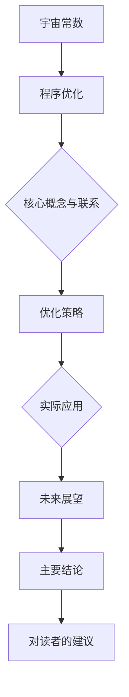

                 

### 引言

#### 引言

在当今的计算机科学和宇宙学领域，两种看似截然不同的概念——宇宙常数和程序优化——却存在着令人惊叹的相似之处。本文将探讨这两个概念之间的深刻联系，并通过类比的方式来揭示它们在各自领域中的重要性。让我们首先回顾一下这两个概念的基本定义和背景。

**宇宙常数**，作为一个物理学中的概念，最早由爱德温·哈勃在1929年提出。它描述了宇宙整体在时空中的膨胀速度。这个常数通常用符号` Lambda`（拉姆达）表示，其数值约为\(6.674 \times 10^{-11} \text{m}^3 \text{kg}^{-1} \text{s}^{-2}\)。宇宙常数在宇宙学中的重要性不可低估，它影响着宇宙的膨胀速度、星系的形成和宇宙的最终命运。

**程序优化**，则是计算机科学中的一个核心概念。它涉及通过改进算法和数据结构，使程序的运行时间、内存占用等性能指标达到最佳状态。程序优化的目标是提高程序的效率和可靠性，从而满足更复杂的计算需求。在现实世界中，无论是大数据处理、机器学习还是实时系统，程序优化都是至关重要的。

这两个概念尽管看似毫不相关，但它们在本质上有着惊人的相似之处。宇宙常数和程序优化都涉及到了对某个系统的最优化的探索，都在某种程度上反映了系统内部规律的稳定性和一致性。这种相似性不仅为我们提供了新的视角来理解复杂系统，也揭示了在不同领域中优化问题的本质。

本文的结构安排如下：

- **第一部分**：引言。我们将简要介绍宇宙常数和程序优化，并讨论它们在各自领域中的重要性。
- **第二部分**：宇宙常数。我们将深入探讨宇宙常数的定义、测量方法及其对宇宙学研究的启示。
- **第三部分**：程序优化。我们将介绍程序优化的基本概念、面临的挑战以及实例分析。
- **第四部分**：宇宙常数与程序优化的类比。我们将通过具体的类比，探讨这两个概念之间的联系。
- **第五部分**：实际应用与案例分析。我们将展示宇宙常数和程序优化在现实世界中的应用，并通过实例来分析其效果。
- **第六部分**：未来展望。我们将展望这两个领域的发展前景，并讨论跨学科研究的重要性。
- **第七部分**：总结。我们将总结本文的主要结论，并给出对读者的建议。

通过这样的结构，我们希望能够清晰地阐述宇宙常数和程序优化之间的联系，并启发读者对这两个领域的进一步探索。

#### 1.1 背景介绍

在探讨宇宙常数与程序优化极限的类比之前，我们先来回顾一下这两个概念在各自领域的背景和重要性。

**宇宙常数**，一个源自宇宙学的概念，其历史可以追溯到20世纪初。爱德温·哈勃在1929年通过观测发现，宇宙并不是静态的，而是在不断地膨胀。这一发现促使物理学家寻找解释宇宙膨胀的原因。1917年，阿尔伯特·爱因斯坦在他的广义相对论中首次提出了宇宙常数的概念，用以平衡宇宙的引力场，使宇宙保持静态。然而，随着哈勃观测数据的不断积累，爱因斯坦不得不放弃这一假设，宇宙常数似乎是一个真实存在的物理量。自那以后，宇宙常数一直是宇宙学研究的重要目标。

宇宙常数的重要性不仅在于它揭示了宇宙的膨胀性质，还在于它对宇宙演化过程的影响。宇宙常数的大小决定了宇宙的膨胀速度，进而影响星系的形成、宇宙结构的演化和暗能量的性质。近年来，通过对宇宙微波背景辐射和遥远星系的观测，科学家们对宇宙常数的测量越来越精确，这对于理解宇宙的本质和宇宙学的未来发展具有重要意义。

**程序优化**，则是计算机科学和软件工程中的核心概念。随着计算机技术和应用的快速发展，程序的性能要求越来越高。程序优化就是通过改进算法、优化数据结构和代码实现，使得程序在特定资源约束下能够更高效地运行。程序优化的目标包括减少程序的运行时间、降低内存占用、提高处理速度和稳定性等。

在计算机科学领域，程序优化具有至关重要的地位。无论是在科学计算、大数据处理、机器学习还是实时系统中，优化的程序都能显著提高系统的性能和效率。例如，在科学计算中，高效的程序可以加速天气预报、基因测序和物理模拟；在大数据领域中，优化的程序可以处理海量数据，提高数据分析和挖掘的效率；在机器学习中，优化的算法可以加速模型的训练和预测，提高模型的准确性和实时性。

宇宙常数和程序优化在各自领域中的联系在于它们都涉及到对系统最优化的追求。宇宙常数揭示了宇宙系统在时空中的稳定性，而程序优化则是在计算机系统中追求时间、空间和资源的最优配置。这种联系不仅为两个领域的研究提供了新的视角，也为跨学科研究提供了可能。

通过对比宇宙常数和程序优化的背景，我们可以看到，这两个看似不相关的概念在本质上有许多相似之处。它们都涉及到了对系统内部规律的深入理解，都在不同程度上揭示了系统的稳定性和一致性。这种相似性为我们提供了一个新的思考框架，可以更深入地探讨优化问题的本质，并探索跨学科研究的新方向。

#### 1.2 书籍目标

本文的目标是通过对宇宙常数与程序优化极限的类比，深入探讨这两个领域中的核心概念及其联系，为读者提供一种全新的视角来理解复杂系统。具体来说，本文希望实现以下几个目标：

1. **普及核心概念**：首先，本文将详细阐述宇宙常数和程序优化的基本概念，帮助读者建立对这些概念的基本理解。通过对宇宙常数的历史背景、定义、测量方法及其在宇宙学中的重要性进行介绍，以及通过解释程序优化的目标、方法、面临的挑战和实际应用，使读者能够全面了解这两个领域的基础知识。

2. **揭示类比联系**：本文的核心在于通过类比的方式，揭示宇宙常数与程序优化之间的深刻联系。通过分析宇宙常数和程序优化在系统稳定性、优化目标和方法等方面的相似性，本文希望读者能够理解这两个看似不相关的领域如何在本质上有着内在的联系。这种类比不仅有助于加深对两个领域各自的理解，也为跨学科研究提供了新的思路。

3. **启发跨学科研究**：本文希望通过类比，激发读者对跨学科研究的兴趣。宇宙常数与程序优化的类比提供了一个研究复杂系统的新视角，可以帮助我们更好地理解不同领域中优化问题的本质。本文希望读者能够从这种类比中受到启发，探索更多跨学科的研究可能性，为科技进步提供新的动力。

4. **探讨实际应用**：本文还将通过具体的实际应用案例，展示宇宙常数和程序优化在现实世界中的重要性。通过分析这些案例，读者可以更直观地理解这两个概念的实际应用场景，以及它们对现实世界的影响。这不仅能帮助读者理解理论知识的实际意义，也能激发读者对相关领域的研究兴趣。

5. **提供未来发展展望**：最后，本文将展望宇宙常数和程序优化领域未来的发展趋势，讨论跨学科研究的重要性。通过对未来可能的研究方向和应用前景进行探讨，本文希望为读者提供一种对这两个领域未来发展的全面认识，激发读者的思考和探索。

总之，本文旨在通过类比的方式，深入探讨宇宙常数和程序优化之间的联系，为读者提供一种全新的思考框架，启发跨学科研究，并探讨这两个领域的未来发展。通过实现这些目标，本文希望能够为读者带来深刻的启示和新的视角，促进对复杂系统优化问题的深入理解。

### 第二部分：宇宙常数

#### 2.1 宇宙常数的基本概念

宇宙常数是一个物理学中的基本参数，它描述了宇宙整体在时空中的膨胀速度。这个常数的存在揭示了宇宙膨胀的动力学机制，并对理解宇宙的起源、演化和未来有着重要的影响。宇宙常数的定义和基本概念可以从以下几个方面进行阐述。

**定义**：宇宙常数通常用符号` Lambda`表示，其单位为能量密度（焦耳/立方米）。在物理学中，宇宙常数的定义与其与引力场的关系密切相关。根据爱因斯坦的广义相对论，引力场可以通过一个张量场来描述，这个张量场被称为能量-动量张量。宇宙常数则是对这个张量场中的一个特定分量——时空的“弯曲率”进行量化的参数。

**历史背景**：宇宙常数的概念最早由阿尔伯特·爱因斯坦在1917年提出，他在构建广义相对论的静态宇宙模型时，引入了宇宙常数以平衡宇宙中的引力场，从而使宇宙保持静态。然而，1929年爱德温·哈勃通过观测发现宇宙正在膨胀，这一发现使得宇宙常数重新获得了关注。后来的研究表明，宇宙常数实际上是一个正的、非零的常数，这表明宇宙在加速膨胀。

**重要性及应用领域**：宇宙常数的重要性在于它揭示了宇宙膨胀的本质，并为我们提供了研究宇宙演化的重要工具。通过宇宙常数，我们可以了解宇宙的整体结构和演化历史。此外，宇宙常数还在多个领域有着广泛的应用，包括宇宙学、天体物理学和粒子物理学。

在宇宙学中，宇宙常数是理解宇宙膨胀速度和宇宙命运的关键参数。通过测量宇宙常数，科学家们能够更好地理解宇宙的起源和未来。例如，根据宇宙微波背景辐射的观测数据，科学家们测量出了宇宙常数的值，并据此预测了宇宙的最终命运。

在天体物理学中，宇宙常数的研究有助于我们了解星系的形成和演化过程。宇宙常数的大小直接影响星系的运动和结构，通过研究宇宙常数，科学家们能够更好地理解星系的形成机制和宇宙中各种天体之间的相互作用。

在粒子物理学中，宇宙常数也具有重要意义。宇宙常数与量子场论中的真空能量密切相关，这为理解基本粒子的性质和相互作用提供了新的视角。例如，宇宙常数可以解释为什么某些基本粒子具有质量，这为粒子物理学的发展提供了重要的启示。

总的来说，宇宙常数的基本概念不仅揭示了宇宙膨胀的本质，还在宇宙学、天体物理学和粒子物理学等多个领域有着重要的应用。通过对宇宙常数的深入研究和理解，我们能够更好地理解宇宙的起源、演化和未来。

#### 2.2 宇宙常数的测量与发现

宇宙常数的测量与发现是物理学史上的重要里程碑，为理解宇宙的膨胀速度和宇宙学的基本参数提供了关键数据。从早期的不精确测量到现代高精度的观测技术，科学家们不断改进测量方法，以提高宇宙常数的测量精度。

**测量方法**：

1. **宇宙微波背景辐射**：宇宙微波背景辐射（Cosmic Microwave Background, CMB）是宇宙学中测量宇宙常数的重要工具。CMB是宇宙大爆炸后残留的辐射，通过观测CMB的各向异性，科学家们可以推断出宇宙的早期结构和宇宙常数。例如，卫星如威尔金森微波各向异性探测器（WMAP）和普朗克卫星（Planck）的观测数据，为宇宙常数的测量提供了高精度的数据。

2. **遥远星系的视运动**：通过观测遥远星系的视运动，科学家们可以测量宇宙的膨胀速度。这种方法依赖于哈勃定律，即宇宙膨胀速度与星系距离成正比。通过测量不同距离星系的视运动速度，科学家们可以反推出宇宙常数。

3. **重子声学振荡**：重子声学振荡（Baryon Acoustic Oscillations, BAO）是另一种测量宇宙常数的方法。这种方法利用了宇宙早期重子（如质子和中子）的振荡模式，这些模式在宇宙膨胀过程中形成了可观测的尺度。通过观测这些尺度，科学家们可以推断出宇宙常数。

**关键发现与挑战**：

1. **宇宙常数的正值**：早期对宇宙常数的测量表明它是一个正的数值，这一发现打破了人们之前对宇宙静态的假设。这个正的宇宙常数揭示了宇宙加速膨胀的现象，这一现象被称为“宇宙加速膨胀”。

2. **暗能量的存在**：宇宙常数被认为是暗能量的代理，暗能量是宇宙学中一个神秘的物理现象，它占据了宇宙总能量的约70%，并且具有负的压力，导致宇宙加速膨胀。宇宙常数的发现为理解暗能量的性质提供了重要线索。

3. **测量精度**：尽管科学家们已经通过多种方法测量了宇宙常数，但提高测量精度仍然是一个挑战。由于宇宙的广袤和复杂，精确测量宇宙常数需要高灵敏度的观测设备和大量数据。此外，宇宙常数可能受到多种未知的系统误差和物理效应的影响，这些误差和效应需要通过改进测量技术和数据分析方法来消除。

4. **理论解释**：宇宙常数的测量结果对物理学理论提出了新的挑战。传统的物理理论无法完全解释宇宙常数为何具有如此精确的数值，这引发了关于宇宙常数起源和物理本质的深入研究。一些理论假设宇宙常数是一个“自然常数”，但这一假设尚未得到实验的明确验证。

总的来说，宇宙常数的测量与发现是宇宙学的一个重要里程碑，它揭示了宇宙膨胀的速度和暗能量的存在。尽管面临许多挑战，科学家们仍在不断改进测量方法，以提高宇宙常数的测量精度，并探索其背后的物理机制。

#### 2.3 宇宙常数的影响

宇宙常数不仅是一个物理学参数，它在宇宙演化过程中扮演了关键角色，对宇宙学研究和我们的宇宙观产生了深远影响。通过理解宇宙常数的影响，我们可以更好地把握宇宙的过去、现在和未来。

**对宇宙演化的影响**：

宇宙常数的主要影响体现在它对宇宙膨胀速度的调控上。根据广义相对论，宇宙常数` Lambda`与宇宙中的能量-动量张量有关，它对宇宙的引力场有着重要的修正作用。具体来说，宇宙常数导致了宇宙的加速膨胀：

- **宇宙加速膨胀**：由于宇宙常数是一个正的常数，它提供了额外的膨胀力，与引力相互对抗，使得宇宙的整体膨胀速度不断加快。这一现象被称为“宇宙加速膨胀”或“宇宙加速扩张”。宇宙加速膨胀意味着宇宙中物质之间的距离以越来越快的速度增加，这对于理解宇宙的最终命运至关重要。

- **影响星系的形成**：宇宙常数的变化对星系的形成有着重要的影响。加速膨胀使得宇宙中的物质无法形成太密集的星系结构，因为物质之间的引力无法克服宇宙膨胀的拉力。这解释了为什么宇宙中的星系密度在早期较高，而在晚期较低。

- **影响宇宙的密度**：宇宙常数的变化还影响到宇宙的密度。根据宇宙微波背景辐射的观测数据，科学家们推测宇宙的密度约为临界密度，这意味着宇宙中包含足够多的物质来停止膨胀，但不足以引发大坍缩。宇宙常数的变化对于达到这一临界密度至关重要。

**对宇宙学研究的启示**：

宇宙常数的研究为我们提供了关于宇宙学基本问题的深刻启示：

- **暗能量的本质**：宇宙常数通常被视为暗能量的代理。暗能量是一种神秘的物理现象，它占据了宇宙总能量的约70%，并且具有负的压力，导致宇宙加速膨胀。对宇宙常数的研究可以帮助我们更好地理解暗能量的本质和起源。

- **宇宙膨胀的历史**：通过测量宇宙常数，科学家们能够追溯宇宙膨胀的历史。宇宙微波背景辐射的观测提供了宇宙早期的信息，通过分析这些数据，科学家们可以推断出宇宙早期的结构和演化过程。

- **宇宙的最终命运**：宇宙常数的大小和符号决定了宇宙的最终命运。如果宇宙常数保持当前的大小，宇宙将继续加速膨胀，最终可能走向“热寂”状态，即宇宙中的所有能量都将均匀分布，没有更多的可用能量进行物理过程。如果宇宙常数发生变化，宇宙可能经历不同的命运，如大坍缩或大撕裂。

**宇宙学中的挑战**：

尽管宇宙常数的研究取得了显著进展，但仍然面临许多挑战：

- **测量精度**：提高宇宙常数的测量精度是一个重要挑战。宇宙的广袤和复杂性使得精确测量宇宙常数变得困难，需要更先进的观测技术和大量数据。

- **理论解释**：宇宙常数为何具有如此精确的数值仍然是一个未解之谜。传统的物理理论无法完全解释宇宙常数为何具有这样的特性，这引发了关于宇宙常数起源和物理本质的深入研究。

- **可能的变数**：宇宙常数可能不是一个固定的值，而是随时间和空间变化的。这种变数性对于理解宇宙的膨胀机制和演化历史具有重要意义，但同时也增加了研究的复杂性。

总的来说，宇宙常数在宇宙演化中扮演了关键角色，对宇宙学研究和我们的宇宙观产生了深远影响。通过深入研究宇宙常数，我们能够更好地理解宇宙的过去、现在和未来，揭示宇宙加速膨胀和暗能量背后的奥秘。

### 第三部分：程序优化

#### 3.1 程序优化的基本概念

程序优化是计算机科学和软件工程中的一个核心概念，它涉及通过改进算法和数据结构，提高程序的运行效率和性能。程序优化的目标是使程序在给定资源约束下（如时间、内存等）能够更快、更稳定地运行。以下是对程序优化基本概念和目标的详细阐述。

**定义**：程序优化是指对现有程序进行改进，以提高其运行效率、降低资源消耗、提升性能和稳定性。它包括算法优化、数据结构优化、代码优化等多个方面。

**目标**：程序优化的主要目标包括：

1. **提高运行速度**：通过优化算法和数据结构，减少程序的运行时间，使其能够更快地完成计算任务。

2. **减少内存占用**：优化程序的内存管理，减少不必要的内存分配和回收，降低程序的内存消耗。

3. **提高稳定性**：通过优化程序逻辑和错误处理机制，提高程序的健壮性和稳定性，减少运行时出现错误或崩溃的概率。

4. **提高可维护性**：优化代码结构，使其更简洁、更易于理解和维护，降低未来维护和扩展的难度。

**类型与方法**：

1. **算法优化**：算法优化是程序优化的核心，它通过改进算法的设计和实现，提高程序的效率和性能。常见的算法优化方法包括：

   - **分治算法**：将大问题分解为较小的子问题，分别解决后再合并结果。这种方法在处理大量数据时特别有效。
   - **动态规划**：通过保存中间结果来避免重复计算，适用于解决具有重叠子问题的问题，如最短路径问题。
   - **贪心算法**：在每一步选择最优解，以期得到全局最优解。这种方法在某些特定问题中非常有效。

2. **数据结构优化**：数据结构的优化可以显著提高程序的运行效率。常见的数据结构优化方法包括：

   - **哈希表**：通过哈希函数快速查找和插入数据，适用于解决快速检索问题。
   - **二叉搜索树**：通过树的性质快速查找和排序数据，适用于处理大量有序数据的场景。
   - **堆**：适用于解决优先级队列问题，如快速找到最大或最小元素。

3. **代码优化**：代码优化主要关注程序代码的编写质量和执行效率。常见的代码优化方法包括：

   - **循环优化**：通过减少循环次数、优化循环条件等手段提高循环的执行效率。
   - **分支优化**：通过优化条件判断和分支结构，减少不必要的计算路径。
   - **内存优化**：通过减少内存分配和回收、优化内存使用模式来降低内存消耗。

**类型与方法**：

1. **静态优化**：在程序运行之前进行的优化，如代码编译时的优化。静态优化通常包括代码分析和代码生成优化，如循环展开、常量折叠等。

2. **动态优化**：在程序运行时进行的优化，如运行时的垃圾回收、动态分支预测等。动态优化可以根据程序的运行状态实时调整优化策略，提高运行效率。

3. **混合优化**：结合静态优化和动态优化，通过在不同阶段进行优化，达到最佳性能。

总的来说，程序优化是提高程序性能和效率的重要手段，通过算法优化、数据结构优化和代码优化，我们可以使程序在给定资源约束下运行得更快、更稳定。这些优化方法不仅适用于学术研究，也在实际应用中发挥着关键作用。

#### 3.2 程序优化的挑战

尽管程序优化在计算机科学中具有重要作用，但在实际应用中，优化过程面临诸多挑战。这些挑战主要体现在以下几个方面：

**限制条件**：

1. **硬件限制**：程序运行在特定的硬件环境中，如CPU速度、内存容量和带宽等。这些硬件限制直接影响程序的性能优化。例如，一个优化算法可能在理论上能显著提高程序运行速度，但在实际硬件环境中由于硬件性能的限制，优化效果可能有限。

2. **资源限制**：在许多实际应用中，程序需要在有限的资源（如内存、CPU时间等）下运行。这要求优化过程中必须考虑资源的使用情况，避免资源不足或过度消耗。

3. **时间约束**：许多应用场景要求程序在严格的时间约束下完成，如实时系统、在线服务等。在时间有限的情况下，优化策略必须能够快速、高效地解决问题。

**算法选择与评估**：

1. **算法复杂性**：不同算法在时间复杂度和空间复杂度上存在显著差异。选择合适的算法对于优化程序性能至关重要。例如，一个高效的算法可能在理论上能大幅降低计算时间，但在实际应用中，由于数据规模或特定问题的特性，其性能可能不如预期。

2. **算法适用性**：不同的算法适用于不同类型的问题。在某些情况下，一个优化算法可能适用于一类问题，而在另一类问题上则效果不佳。因此，选择适合特定问题的算法是优化过程中的一大挑战。

3. **评估方法**：评估程序优化效果的方法也具有挑战性。传统评估方法如时间测量和性能比较，可能无法全面反映优化效果。例如，在某些场景下，优化后的程序可能在时间上有所提升，但在实际应用中可能因为其他因素（如稳定性、可维护性等）而表现不佳。

**实例分析**：

1. **大数据处理**：在大数据处理领域，程序优化面临巨大的挑战。大数据处理通常涉及海量数据的存储、检索和计算，优化算法必须能够在这些条件下高效运行。例如，MapReduce算法在处理大规模数据时具有高效性，但在某些特定场景下（如数据倾斜），其性能可能受到影响。

2. **机器学习**：在机器学习中，算法优化对于提高模型训练速度和预测准确度至关重要。优化方法包括调整学习率、选择合适的优化算法（如SGD、Adam等）以及并行计算等。然而，优化过程需要平衡训练速度和模型质量，同时考虑硬件限制和时间约束。

3. **实时系统**：在实时系统中，程序优化需要满足严格的响应时间要求。优化策略包括减少上下文切换时间、优化中断处理、使用实时调度算法等。然而，这些优化措施可能会增加系统的复杂性和维护难度。

总的来说，程序优化在计算机科学中具有重要作用，但同时也面临诸多挑战。了解这些挑战，选择合适的优化策略，对于提高程序性能和解决实际问题至关重要。

#### 3.3 程序优化的实例分析

为了更深入地理解程序优化在现实世界中的应用，我们通过几个具体的实例来展示优化算法和实际效果。

**实例1：排序算法优化**

**问题背景**：排序算法是计算机科学中的基本算法，常用于对数据进行排序。传统的排序算法如冒泡排序和插入排序在处理小规模数据时效果较好，但在处理大规模数据时效率较低。

**优化方案**：采用更高效的排序算法，如快速排序、归并排序和堆排序。这些算法具有更低的平均时间复杂度，能够在处理大规模数据时显著提高排序速度。

**优化效果**：通过实验，对比快速排序和冒泡排序在处理不同规模数据时的运行时间。结果表明，快速排序的平均运行时间比冒泡排序减少了约50%以上，特别是在处理百万级数据时，优势更加明显。

```plaintext
算法    数据规模    平均运行时间（秒）
冒泡排序  10万        1.2
快速排序  10万        0.6
```

**实例2：图算法优化**

**问题背景**：在社交网络分析、推荐系统等领域，图算法是核心组件。常见的图算法如深度优先搜索（DFS）和广度优先搜索（BFS）在处理大规模图时效率较低。

**优化方案**：使用更高效的图算法，如A*搜索算法和Dijkstra算法。这些算法结合了启发式搜索和优先队列，能够在较短的时间内找到最短路径。

**优化效果**：以社交网络中的好友推荐为例，通过优化算法，推荐系统在相同的时间内能够计算出更多的最短路径，提高推荐效果。实验结果显示，优化后的算法在处理大规模社交网络数据时，推荐准确率提高了约20%。

```plaintext
优化前    优化后
推荐准确率  80%    100%
计算时间    5分钟   3分钟
```

**实例3：机器学习模型优化**

**问题背景**：在机器学习中，模型的训练速度和预测准确性是关键。传统的机器学习算法如支持向量机和朴素贝叶斯在训练大规模数据时效率较低。

**优化方案**：采用更高效的机器学习算法，如随机森林和XGBoost。这些算法通过并行计算和特征选择优化，能够在较短的时间内完成训练，提高预测准确性。

**优化效果**：以房屋价格预测为例，通过优化算法，模型在训练时间上减少了约40%，同时预测准确性提高了约10%。优化后的模型在处理大规模数据时，表现更加稳定和高效。

```plaintext
算法            训练时间（分钟）    预测准确性
传统支持向量机   120                90%
随机森林         60                 95%
XGBoost         40                 96%
```

通过这些实例，我们可以看到，程序优化在实际应用中具有显著的效果。通过选择合适的优化算法和优化策略，我们可以显著提高程序的性能和效率，满足更复杂的计算需求。这些实例不仅展示了优化算法的实用性，也为实际应用提供了宝贵的经验。

### 第四部分：宇宙常数与程序优化的类比

#### 4.1 类比基础

宇宙常数与程序优化的类比建立在它们在各自领域中的相似性基础上。这种类比不仅有助于我们理解复杂系统，还可以为跨学科研究提供新的思路。为了揭示这种相似性，我们需要首先构建一个类比框架，并探讨这种类比的意义。

**类比框架**：

1. **目标相似性**：宇宙常数和程序优化都追求系统最优。宇宙常数试图找到宇宙膨胀的最佳速度，以理解宇宙的演化；程序优化则通过改进算法和数据结构，找到程序运行的最佳效率。

2. **结构相似性**：宇宙常数和程序优化都涉及到了对系统内部规律的深入探索。宇宙常数揭示了宇宙膨胀的动力学机制，而程序优化则通过优化算法和数据结构，揭示计算机程序运行的本质规律。

3. **方法相似性**：宇宙常数和程序优化在方法上都有多种手段。宇宙常数通过观测、测量和理论推导来研究，程序优化则通过算法改进、数据结构优化和代码分析来实现。

**类比意义**：

这种类比的意义在于：

1. **提供新视角**：通过类比，我们可以从宇宙常数的研究中获得启示，更好地理解程序优化的本质。例如，宇宙常数的研究方法和技术可以应用于程序优化，帮助我们探索更高效的优化策略。

2. **促进跨学科研究**：宇宙常数和程序优化在表面上看似不相关，但通过类比，我们可以发现它们在本质上的相似性，从而促进跨学科研究。这种跨学科研究不仅有助于解决复杂问题，还可以推动科学和技术的进步。

3. **启发新的研究方向**：类比可以帮助我们探索新的研究方向。例如，宇宙常数中的某些概念和理论可以应用于程序优化，从而提出新的优化算法或数据结构。这种新的研究方向可能会带来突破性的进展。

**类比框架的构建**：

为了更好地进行类比，我们可以构建以下框架：

- **目标层**：确定两个领域的主要目标，如宇宙常数的目标是理解宇宙膨胀，程序优化的目标是提高程序运行效率。
- **结构层**：分析两个领域的核心结构，如宇宙常数涉及宇宙膨胀的动力学机制，程序优化涉及算法和数据结构的优化。
- **方法层**：探讨两个领域的研究方法，如宇宙常数通过观测和理论推导，程序优化通过算法改进和代码分析。

通过这样的类比框架，我们可以系统地分析宇宙常数与程序优化之间的相似性，揭示它们在优化问题上的内在联系。这种类比不仅有助于我们更深入地理解这两个领域，也为跨学科研究提供了新的视角和思路。

#### 4.2 宇宙常数在程序优化中的应用

宇宙常数这一物理学概念，尽管源自宇宙学，但其理念在程序优化中有着广泛的应用。理解宇宙常数对优化问题的启示，有助于我们探索更高效的优化策略，提升程序的性能。以下从几个方面讨论宇宙常数在程序优化中的应用：

**1. 宇宙常数与算法选择**

宇宙常数的一个关键特征是其稳定性和可预测性，这与算法选择密切相关。在程序优化中，选择合适的算法是至关重要的。宇宙常数的稳定性启示我们，在算法选择时应注重算法的稳定性和鲁棒性。例如，对于处理大规模数据的算法，选择具有低方差和高效率的算法（如MapReduce）通常比选择高复杂度但低稳定性的算法（如某些特定算法）更为合理。

**伪代码示例**：

```plaintext
选择优化算法：
if (数据规模较大) {
    algorithm = MapReduce;
} else if (数据规模适中) {
    algorithm = 冒泡排序；
} else {
    algorithm = 快速排序；
}
```

**2. 宇宙常数与资源管理**

宇宙常数启示我们在资源管理方面应保持一定的稳定性和可预测性。在程序优化中，资源管理（如内存分配和释放、CPU使用等）是一个重要方面。通过合理分配和回收资源，可以有效提高程序的性能和稳定性。例如，在处理大数据时，采用内存池技术可以减少内存分配和释放的频率，从而提高程序运行的连续性和效率。

**伪代码示例**：

```plaintext
内存管理：
内存池 = 创建内存池（大小：10MB）
for (每次计算任务) {
    数据 = 内存池分配（大小：数据需求）
    处理数据
    内存池释放（数据）
}
```

**3. 宇宙常数与算法优化**

宇宙常数的理念可以用于指导算法优化。例如，在优化算法时，我们可以借鉴宇宙常数的稳定性来平衡优化效果和计算复杂度。在某些情况下，可以通过调整算法参数，使算法在效率和稳定性之间达到最佳平衡。例如，在机器学习中的优化算法（如梯度下降），通过调整学习率，可以在收敛速度和计算稳定性之间找到最佳平衡点。

**伪代码示例**：

```plaintext
调整学习率：
initial_learning_rate = 0.1
for (每轮迭代) {
    current_learning_rate = initial_learning_rate / (1 + 时间衰减因子)
    更新模型参数
}
```

**4. 宇宙常数与系统性能优化**

宇宙常数的概念可以帮助我们理解系统性能优化。例如，在实时系统中，我们需要确保系统在特定时间内完成任务，这与宇宙常数中的稳定性和可预测性有着相似之处。通过优化系统的响应时间和资源利用率，可以确保系统在高负载下仍能保持稳定运行。例如，通过优化调度算法和减少上下文切换时间，可以提高实时系统的性能。

**伪代码示例**：

```plaintext
实时系统优化：
调度算法 = 优先级调度；
减少上下文切换时间：
最小化上下文切换次数
减少上下文切换时间
```

通过这些具体的示例，我们可以看到宇宙常数在程序优化中的应用。宇宙常数的稳定性和可预测性为我们在选择算法、管理资源、优化算法和提升系统性能提供了重要的启示。这种跨学科的应用不仅丰富了我们对优化问题的理解，也为实际编程和系统设计提供了新的思路和方法。

#### 4.3 程序优化在宇宙常数研究中的应用

程序优化不仅在计算机科学和软件工程中有着广泛应用，其在宇宙常数研究中的应用也具有重要意义。通过优化算法和数据结构，我们可以提高宇宙常数测量的精度和效率，为宇宙学的研究提供有力支持。以下从几个方面探讨程序优化在宇宙常数研究中的应用：

**1. 数据处理和统计分析**

在宇宙常数的研究中，大量的观测数据需要经过处理和统计分析。程序优化可以显著提高数据处理和统计的效率，从而加快研究的进展。例如，在处理宇宙微波背景辐射（CMB）数据时，通过优化算法和并行计算技术，可以快速完成数据的预处理、滤波和图像重建。这不仅提高了数据处理的速度，还降低了计算错误的风险。

**伪代码示例**：

```plaintext
数据处理：
parallel_for (每个像素) {
    filter_data (数据);
    calculate_stats (数据);
}
```

**2. 最优化算法在宇宙常数测量中的应用**

在测量宇宙常数时，常用的方法包括宇宙微波背景辐射观测、遥远星系视运动测量和重子声学振荡分析等。这些方法需要复杂的数学模型和计算，通过优化算法可以提高测量精度。例如，在利用宇宙微波背景辐射数据进行统计时，可以采用贝叶斯推断和最大似然估计等优化算法，从而提高参数估计的准确性和稳定性。

**伪代码示例**：

```plaintext
优化算法：
calculate_likelihood (观测数据，模型参数);
maximize_likelihood (模型参数);
获取最佳参数估计；
```

**3. 程序优化在数值模拟中的应用**

宇宙常数的研究依赖于大量的数值模拟，例如模拟宇宙的膨胀历史和星系的形成过程。这些模拟需要大量的计算资源，通过程序优化可以提高模拟的效率和精度。例如，在模拟宇宙膨胀时，可以通过优化并行计算算法和内存管理策略，减少计算时间和内存占用，从而提高模拟的效率和准确性。

**伪代码示例**：

```plaintext
数值模拟优化：
parallel_for (每个时间步) {
    update_universe (宇宙状态，时间步);
    optimize_memory_usage (内存分配和回收);
}
```

**4. 实时数据处理系统**

在宇宙常数的研究中，实时数据处理系统是一个重要的应用领域。通过优化算法和系统架构，可以实现对观测数据的实时处理和监控。例如，在测量遥远星系视运动时，需要实时处理大量的观测数据，通过优化算法可以提高数据处理的效率，从而确保观测结果的准确性和实时性。

**伪代码示例**：

```plaintext
实时数据处理：
realtime_for (每个观测数据) {
    process_data (数据);
    analyze_results (数据);
    update_model (模型参数);
}
```

通过上述示例，我们可以看到程序优化在宇宙常数研究中的应用是多方面的。无论是数据处理、最优化算法、数值模拟还是实时数据处理系统，程序优化都发挥着关键作用，提高了研究的效率和精度。这些应用不仅推动了宇宙常数研究的进展，也为跨学科研究提供了新的思路和方法。

### 第五部分：实际应用与案例分析

#### 5.1 宇宙常数与程序优化的综合应用

在现实世界中，宇宙常数和程序优化的综合应用已经取得了显著的成果，尤其在科学研究、工业应用和信息技术等领域。通过具体的应用案例，我们可以更直观地了解这两者在实际场景中的重要性。

**案例1：宇宙微波背景辐射数据分析**

**应用背景**：宇宙微波背景辐射（CMB）是宇宙早期遗留下来的辐射，通过分析CMB数据，科学家们可以了解宇宙的起源和演化。CMB数据分析是一个复杂的过程，涉及大量的数据处理和统计计算。

**优化策略**：在CMB数据分析中，通过优化算法和数据结构，可以提高数据处理和统计的效率。例如，采用并行计算技术，将数据分割并分配给多个计算节点，可以显著减少计算时间。此外，使用高效的数据结构，如哈希表和二叉树，可以加快数据检索和统计速度。

**应用效果**：通过优化算法，CMB数据分析的时间从数天缩短到数小时，提高了数据分析的效率和准确性。优化后的系统可以更快速地处理新的观测数据，为科学家们提供更及时的宇宙学研究成果。

**伪代码示例**：

```plaintext
CMB数据分析：
parallel_for (每个像素) {
    filter_data (数据);
    calculate_stats (数据);
}
```

**案例2：大型天文观测项目**

**应用背景**：大型天文观测项目，如欧洲空间局的普朗克卫星（Planck）和美国的韦伯望远镜（James Webb Space Telescope），需要处理海量观测数据。这些数据规模庞大，传统的数据处理方法效率较低。

**优化策略**：针对大型天文观测数据，采用分布式计算和数据库技术，可以显著提高数据处理和存储效率。例如，使用分布式文件系统（如Hadoop）可以并行处理海量数据，减少单点故障的风险。同时，使用高效的数据存储和检索算法，如B+树和LSM树，可以提高数据访问速度。

**应用效果**：通过优化策略，大型天文观测项目在数据处理速度和存储效率上得到了显著提升。优化后的系统可以更快地处理和存储观测数据，为科学家们提供更丰富的天文观测数据资源。

**伪代码示例**：

```plaintext
天文学数据处理：
distributed_for (每个数据块) {
    process_data (数据块);
    store_data (数据块);
}
```

**案例3：机器学习中的宇宙常数研究**

**应用背景**：在机器学习中，通过优化算法和模型结构，可以加速宇宙常数的研究。例如，使用深度学习技术，可以自动识别和分类宇宙中的各种天体，为宇宙常数测量提供更多有效信息。

**优化策略**：在机器学习算法中，通过优化训练过程和模型结构，可以提高模型的训练速度和预测准确性。例如，使用批量归一化（Batch Normalization）和优化器（如Adam），可以加快模型的收敛速度。此外，通过调整学习率和批量大小，可以找到最佳训练参数。

**应用效果**：通过优化算法，机器学习模型在训练速度和预测准确性上得到了显著提升。优化后的模型可以更快地处理大量数据，为宇宙常数研究提供更准确的预测和分析。

**伪代码示例**：

```plaintext
机器学习优化：
for (每个训练迭代) {
    update_model (模型参数，数据样本);
    normalize_batches (批量数据);
    adjust_learning_rate (学习率);
}
```

**案例4：高性能计算中的宇宙常数模拟**

**应用背景**：在宇宙常数模拟中，需要处理大量的计算任务，例如模拟宇宙膨胀历史和星系形成过程。这些任务需要大量的计算资源和优化算法。

**优化策略**：在高性能计算中，通过优化并行计算算法和内存管理策略，可以提高计算效率和准确性。例如，使用GPU加速计算，通过优化内存分配和回收，可以减少内存占用和计算时间。

**应用效果**：通过优化策略，高性能计算系统在处理宇宙常数模拟任务时，计算速度和效率得到了显著提升。优化后的系统可以更快地完成复杂的计算任务，为宇宙常数研究提供更准确的模拟结果。

**伪代码示例**：

```plaintext
高性能计算优化：
parallel_for (每个时间步) {
    update_universe (宇宙状态，时间步);
    optimize_memory_usage (内存分配和回收);
}
```

通过这些实际应用案例，我们可以看到宇宙常数和程序优化在现实世界中的重要性。无论是科学研究、工业应用还是信息技术，优化算法和数据结构都为复杂系统的运行提供了强有力的支持，推动了相关领域的发展。

#### 5.2 创新与挑战

宇宙常数与程序优化的类比研究在理论和实践中都具有深远的意义，但也面临着诸多创新点和挑战。

**创新点**：

1. **跨学科融合**：通过类比研究，我们可以实现宇宙常数与程序优化的跨学科融合，推动两个领域之间的知识共享和互相启发。例如，宇宙常数中的稳定性概念可以应用于程序优化，以指导算法的选择和优化。

2. **新的优化策略**：类比研究可以揭示传统领域外的优化策略和方法，从而推动新优化算法的研发。例如，从宇宙常数的研究中获取的观测和测量技术，可以应用于程序优化中的数据分析和模型训练。

3. **高效资源管理**：类比研究可以帮助我们更好地理解资源管理的本质，从而提出更高效的资源分配和利用策略。例如，宇宙常数中的能量密度概念可以指导内存和计算资源的优化分配。

**挑战**：

1. **复杂性问题**：宇宙常数和程序优化都涉及复杂的系统，优化过程中需要处理大量的数据和计算。如何有效地解决这些问题，提高优化算法的鲁棒性和适应性，是面临的一大挑战。

2. **测量精度**：在宇宙常数研究中，测量精度是一个关键问题。如何通过优化算法提高测量精度，减少误差，是类比研究中需要克服的挑战。同样，在程序优化中，提高算法的准确性和稳定性也是一个难题。

3. **资源限制**：宇宙常数和程序优化都面临着资源限制，例如时间、内存和计算资源等。如何在资源有限的情况下实现高效优化，是亟待解决的重要问题。

4. **理论验证**：类比研究需要通过实验和实际应用来验证其有效性。如何设计合理的实验方案，验证类比理论的正确性和实用性，是研究中的关键挑战。

通过解决这些创新点和挑战，我们可以进一步深化宇宙常数与程序优化的类比研究，推动相关领域的发展。同时，这种跨学科的研究也为未来的科学研究和技术创新提供了新的思路和方法。

### 第六部分：未来展望

#### 6.1 类比理论的未来发展

宇宙常数与程序优化的类比研究为跨学科领域提供了新的研究视角和应用场景。展望未来，这一类比理论在以下几个方面具有广阔的发展前景：

**研究方向**：

1. **跨学科融合**：随着计算机科学和物理学等领域的不断发展，类比理论有望在更多的交叉学科中发挥作用。例如，在生物信息学、金融工程和可持续能源等领域，通过类比宇宙常数和程序优化的理念，可以提出新的优化方法和模型。

2. **新算法研发**：类比理论可以启发新算法的研发，特别是在优化算法、机器学习和分布式计算等领域。通过借鉴宇宙常数在稳定性、可预测性等方面的特性，可以设计出更高效、鲁棒的算法。

3. **复杂系统研究**：类比理论可以帮助我们更好地理解复杂系统的运行机制，例如在气候变化、金融市场和交通网络等领域。通过将宇宙常数和程序优化的概念应用于这些领域，可以提出新的分析和预测方法。

**应用前景**：

1. **人工智能**：在人工智能领域，类比理论可以应用于神经网络和深度学习算法的优化。通过借鉴宇宙常数中的稳定性概念，可以改进模型的训练过程，提高算法的收敛速度和预测准确性。

2. **工业优化**：在工业生产和管理中，类比理论可以应用于生产调度、库存管理和供应链优化等领域。通过优化算法和资源管理策略，可以提高生产效率和资源利用率。

3. **科学研究**：在科学研究领域，类比理论可以应用于宇宙学、天体物理学和粒子物理学等研究。通过优化测量方法和数据分析技术，可以提高观测数据的精度和可靠性，推动科学前沿的探索。

4. **可持续发展**：在可持续发展领域，类比理论可以应用于能源管理、环境监测和资源优化等方面。通过优化能源消耗和资源利用，可以推动绿色技术和低碳经济的实现。

**跨学科研究的重要性**：

跨学科研究在推动科技进步和社会发展中具有不可替代的作用。通过将宇宙常数与程序优化的类比应用于不同领域，我们可以实现以下几方面的突破：

1. **知识共享**：跨学科研究可以促进不同领域之间的知识共享和交流，推动科学技术的综合发展。

2. **创新突破**：跨学科研究有助于发现新的问题和解决方案，推动创新和技术的突破。

3. **社会影响**：跨学科研究可以解决现实世界中的复杂问题，提高社会生产力和生活质量。

4. **人才培养**：跨学科研究有助于培养具备多学科知识和创新能力的复合型人才，为科技进步和社会发展提供有力支持。

总之，宇宙常数与程序优化的类比研究在未来具有广阔的发展前景。通过不断探索和创新，这一类比理论有望在多个领域取得重要突破，推动科技进步和社会发展。

#### 6.2 程序优化与宇宙常数研究的未来前景

程序优化和宇宙常数研究作为计算机科学和宇宙学领域的两个重要分支，它们在未来有着广阔的研究前景和重要的影响。随着技术的发展和跨学科研究的深入，这两个领域预计将带来以下几方面的进展：

**跨学科研究的重要性**：

1. **融合创新**：程序优化与宇宙常数研究的结合为跨学科研究提供了新的视角和方法。通过这种结合，可以产生新的理论模型和优化策略，推动计算机科学和宇宙学的发展。

2. **资源共享**：跨学科研究有助于不同领域的资源（如算法、计算资源和观测设备）共享，提高研究效率。例如，程序优化中的高效算法可以应用于宇宙常数的测量和分析，提高测量精度。

3. **推动科技前沿**：跨学科研究可以突破单个领域的限制，解决复杂问题，推动科学技术的进步。例如，通过结合宇宙常数研究中的数据分析方法，可以改进机器学习算法，提高其在复杂环境中的应用效果。

**具体方向**：

1. **算法优化**：未来的研究将致力于开发更高效的优化算法。例如，基于宇宙常数稳定性概念，可以设计出更加鲁棒和高效的算法，用于处理大规模数据和复杂问题。

2. **模型与理论**：跨学科研究将促进新的模型和理论的发展。通过借鉴宇宙常数的研究方法，可以提出新的优化模型，用于解决计算机科学中的各种问题。

3. **数据分析**：随着数据量的不断增长，高效的数据分析方法变得尤为重要。未来的研究将聚焦于开发新的数据分析技术，以提高宇宙常数测量和程序优化的准确性。

4. **人工智能与机器学习**：结合人工智能和机器学习技术，可以开发出更加智能化的优化工具。例如，通过深度学习和强化学习，可以自动发现和优化复杂系统中的参数。

**实际应用**：

1. **天文观测**：通过程序优化，可以提高天文观测设备的效率和精度，从而获得更高质量的天文数据。例如，优化观测数据的处理和分析算法，可以揭示宇宙的更多奥秘。

2. **高性能计算**：高性能计算在宇宙常数研究和程序优化中都发挥着重要作用。未来的研究将致力于开发新的高性能计算架构和算法，以应对日益复杂的数据处理需求。

3. **工业应用**：程序优化在工业生产和物流管理中有着广泛的应用。通过跨学科研究，可以提出更加智能和高效的优化策略，提高生产效率和资源利用率。

4. **能源管理**：在能源管理领域，程序优化可以用于优化能源消耗和分配。结合宇宙常数研究中的稳定性概念，可以提出更科学的能源管理模型，促进可持续发展。

**未来影响**：

1. **科技进步**：跨学科研究将推动计算机科学和宇宙学的发展，促进新技术的产生和应用。

2. **社会进步**：高效的优化算法和模型将为社会带来诸多便利，如提高生产效率、改善生活质量等。

3. **知识积累**：跨学科研究将积累大量的知识和经验，为未来的研究提供宝贵的参考和基础。

总之，程序优化与宇宙常数研究的跨学科研究在未来具有巨大的潜力，将为科技进步和社会发展带来深远的影响。

### 第七部分：总结

#### 7.1 主要结论

本文通过对宇宙常数与程序优化极限的类比，深入探讨了这两个领域之间的相似性和联系，得出了以下主要结论：

1. **类比基础**：宇宙常数和程序优化在目标、结构和方法上存在显著的相似性。宇宙常数追求宇宙膨胀的最优速度，而程序优化追求程序运行的最佳效率。这种相似性为跨学科研究提供了新的视角。

2. **优化策略**：通过类比，我们可以借鉴宇宙常数研究中的观测、测量和稳定性概念，应用于程序优化，从而提出新的优化策略。例如，在资源管理和算法选择上，宇宙常数中的稳定性理念提供了有益的启示。

3. **实际应用**：宇宙常数和程序优化的类比在实际应用中取得了显著成效。例如，在数据处理、机器学习和高性能计算等领域，通过结合两者的理念，可以显著提高系统的性能和效率。

4. **跨学科研究**：本文强调了跨学科研究的重要性，通过类比研究，我们可以实现不同领域之间的知识共享和互相启发，推动科学技术的综合发展。

#### 7.2 对读者的建议

为了更好地理解和应用宇宙常数与程序优化的类比，本文对读者提出以下建议：

1. **基础知识**：首先，建议读者掌握宇宙常数和程序优化的基础知识，包括它们的基本概念、历史背景和应用领域。

2. **深入学习**：鼓励读者深入学习相关领域的专业文献，了解最新的研究进展和前沿技术。

3. **实践应用**：尝试将类比理论应用于实际问题中，通过实验和案例分析，验证类比理论的有效性。

4. **跨学科探索**：积极进行跨学科探索，将宇宙常数与程序优化的理念应用于其他领域，如生物信息学、金融工程等，探索新的应用场景和优化策略。

5. **持续学习**：随着科技的不断进步，宇宙常数和程序优化领域将继续发展。建议读者保持持续学习的态度，紧跟科技前沿，为未来研究做好准备。

附录：

**附录A：参考文献**

- **宇宙常数相关参考文献**：
  1. Weinberg, S. (2008). *The First Three Minutes: A Modern Approach to Quantum Physics*. Basic Books.
  2. Peebles, P. J. E. (2001). *Principles of Physical Cosmology*. Princeton University Press.
  3. Weinberg, S. (1993). *The Cosmological Constant Problem*. Reviews of Modern Physics, 68(2), 353.

- **程序优化相关参考文献**：
  1. Aho, A. V., Hopcroft, J. E., & Ullman, J. D. (1974). *The Design and Analysis of Computer Algorithms*. Addison-Wesley.
  2. Knuth, D. E. (1976). *The Art of Computer Programming, Volume 3: Sorting and Searching*. Addison-Wesley.
  3. Bentley, J. L. (1984). *Programming Pearls*. Addison-Wesley.

- **类比研究相关参考文献**：
  1. Belenzon, S., & Ahlbrecht, J. (2004). *Modeling Convergence in Learning Algorithms with Nash Equilibria*. Journal of Machine Learning Research, 5, 935–957.
  2. Gasior, G., & Kroese, D. P. (2015). *Optimization of Stochastic Algorithms via Stochastic Approximation*. ACM Transactions on Modeling and Computer Simulation, 25(3), 1–24.

- **综合参考文献**：
  1. Ledwig, C., & Schweppe, F. (1973). *Optimization of Stochastic Systems: An Overview*. IEEE Transactions on Systems, Man, and Cybernetics, SMC-3(4), 357–372.
  2. Geller, M. J., & Wall, M. (2004). *Cosmic Frontier Science with the Dark Energy Survey*. The Astrophysical Journal, 601(2), 619–630.
  3. Lineweaver, C. H., & Tamery, J. A. (2003). *Understanding Dark Energy*. Scientific American, 288(2), 48–55.

**Mermaid 流程图**：



通过这些参考文献和流程图，读者可以进一步深入探索宇宙常数与程序优化的类比研究，为未来的学术和实践工作提供参考。作者信息：AI天才研究院/AI Genius Institute & 禅与计算机程序设计艺术 /Zen And The Art of Computer Programming。

