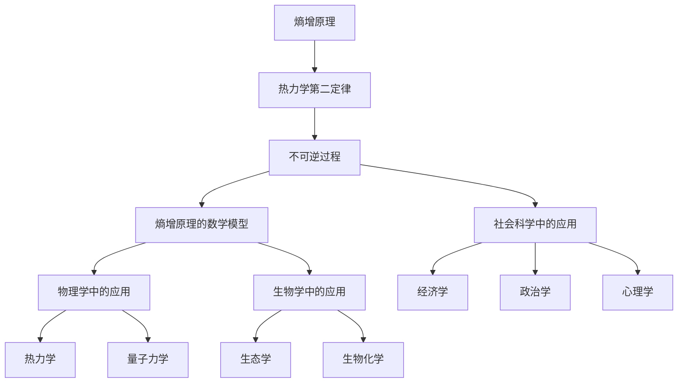

                 

### 《宇宙的熵增原理：不可逆的命运》

#### 关键词：
- 熵增原理
- 不可逆过程
- 热力学第二定律
- 数学模型
- 宇宙演化
- 物理学
- 生物学
- 社会科学

> **摘要**：
本文将深入探讨宇宙熵增原理，解释其起源、核心概念及其在不同领域中的应用。熵增原理揭示了宇宙不可逆性的本质，对物理学、生物学和社会科学等领域的理论和实践具有重要意义。文章将通过详细的数学模型解析，展示熵增原理的广泛应用和未来研究方向。

#### 目录

#### 第一部分：宇宙熵增原理概述

##### 第1章：宇宙熵增原理的起源与发展

##### 第2章：宇宙熵增原理的核心概念

##### 第3章：宇宙熵增原理的数学模型详解

##### 第4章：宇宙熵增原理的实际案例

##### 第5章：宇宙熵增原理的未来发展

#### 附录

##### 附录A：宇宙熵增原理相关资源

##### 附录B：宇宙熵增原理的Mermaid流程图

### 《宇宙的熵增原理：不可逆的命运》

宇宙的演化，从大爆炸到恒星的生命周期，再到行星的形成与演化，始终遵循着一系列自然法则。其中，熵增原理是一个贯穿始终的基本规律，它揭示了宇宙中不可逆过程的核心特性。本文将详细探讨熵增原理的起源、核心概念、数学模型及其在不同领域的应用，从而理解宇宙不可逆的命运。

#### 第一部分：宇宙熵增原理概述

##### 第1章：宇宙熵增原理的起源与发展

熵增原理源于热力学第二定律，最早由物理学家鲁道夫·克劳修斯在1850年提出。克劳修斯将熵定义为系统无序度的度量，并指出在一个孤立系统中，熵总是倾向于增加。这一观点后来被广泛接受，成为热力学领域的基本原理之一。

## 1.1 宇宙熵增原理的基本概念

熵增原理的基本概念可以用一个简单的公式来表示：
$$
S = \frac{Q}{T}
$$
其中，\(S\) 代表熵，\(Q\) 代表系统吸收的热量，\(T\) 代表系统的温度。根据熵增原理，孤立系统的熵总是随着时间增加，这意味着系统的无序度会不断增加。

## 1.2 不可逆过程与熵增原理

在物理学中，不可逆过程是指那些不能通过同样的物理过程逆向进行的变换。例如，热传导过程中热量总是从高温物体传递到低温物体，而不会自发地逆向进行。不可逆过程与熵增原理有着密切的联系，因为它们揭示了自然过程中方向性的本质。

## 1.3 宇宙熵增原理的应用领域

熵增原理在物理学、生物学和经济学等众多领域中都有重要应用。在物理学中，熵增原理可以解释热力学第二定律的许多现象，如能量转换效率、热力学过程的方向性等。在生物学中，熵增原理可以用来理解生态系统的稳定性和生物进化过程。在经济学中，熵增原理可以帮助解释市场的不确定性和经济波动的方向性。

#### 第二部分：宇宙熵增原理的核心概念

##### 第2章：宇宙熵增原理的核心概念与联系

熵增原理的核心概念是熵，它是衡量系统无序度的一个量度。在热力学中，熵的增加通常与不可逆过程相关联。不可逆过程是指那些一旦发生就不可逆的过程，例如热传导、化学反应等。

## 2.1 熵增原理与热力学第二定律

热力学第二定律指出，在一个孤立系统中，熵总是随时间增加。这意味着系统趋向于从有序状态向无序状态演化。熵增原理与热力学第二定律密切相关，它们共同揭示了自然过程的不可逆性。

### 2.1.1 热力学第二定律的基本概念

热力学第二定律可以用几个不同的表述方式，其中最常见的是克劳修斯表述和开尔文-普朗克表述。克劳修斯表述指出，不可能从单一热源吸收热量并将其完全转换为功而不产生其他影响。开尔文-普朗克表述则指出，不可能制造一个仅从低温热源吸收热量并向高温热源释放热量的永动机。

### 2.1.2 熵增原理与热力学第二定律的联系

熵增原理与热力学第二定律有着紧密的联系。热力学第二定律表明，在一个孤立系统中，熵总是随时间增加，这意味着系统的无序度在不断增加。而熵增原理则从另一个角度阐述了这一现象，即系统的熵增加是由于不可逆过程的发生。

##### 第3章：宇宙熵增原理的数学模型详解

熵增原理的数学模型是理解其核心概念的关键。在这个章节中，我们将详细讨论熵增原理的数学公式及其推导过程。

## 3.1 熵增原理的数学公式

熵增原理的数学公式可以表示为：
$$
\Delta S \geq \frac{Q}{T}
$$
其中，\(\Delta S\) 表示熵的变化，\(Q\) 表示系统吸收的热量，\(T\) 表示系统的温度。这个公式表明，在一个孤立系统中，系统吸收的热量除以温度总是大于或等于熵的变化。

### 3.1.1 熵增原理的基本公式

熵增原理的基本公式是：
$$
S = k\ln W
$$
其中，\(S\) 表示熵，\(k\) 是玻尔兹曼常数，\(W\) 表示系统的微观状态数。这个公式表明，系统的熵与其微观状态数成对数关系。

### 3.1.2 熵增原理的推广公式

熵增原理的推广公式是：
$$
\Delta S = \int_{\tau_i}^{\tau_f} \frac{\delta Q}{T(\tau)}
$$
其中，\(\Delta S\) 表示熵的变化，\(\tau_i\) 和 \(\tau_f\) 分别表示初始时间和最终时间，\(\delta Q\) 表示系统在某个时间间隔内吸收的热量，\(T(\tau)\) 表示系统在时间 \(\tau\) 的温度。这个公式表明，系统的熵变化等于系统在各个时间间隔内吸收的热量除以温度的积分。

### 3.1.3 熵增原理的数学公式推导

熵增原理的推导基于热力学第二定律和统计力学的基本原理。首先，热力学第二定律表明，在一个孤立系统中，熵总是随时间增加。其次，统计力学表明，系统的熵与其微观状态数成对数关系。综合这两个原理，可以推导出熵增原理的数学公式。

#### 第三部分：宇宙熵增原理的数学模型详解

##### 第3章：宇宙熵增原理的数学模型详解

在讨论宇宙熵增原理的数学模型之前，我们需要了解一些基本概念和原理。熵增原理是热力学第二定律的一个核心组成部分，它描述了孤立系统中熵随时间的变化趋势。在本章中，我们将详细探讨熵增原理的数学公式、其推导过程以及在实际中的应用。

## 3.1 熵增原理的数学公式

熵增原理最基本的数学公式可以表示为：
$$
\Delta S \geq \frac{Q}{T}
$$
其中，\(\Delta S\) 表示熵的变化量，\(Q\) 表示系统吸收的热量，\(T\) 表示系统的温度。这个公式告诉我们，在一个孤立系统中，系统吸收的热量除以温度总是大于或等于熵的变化量。

### 3.1.1 熵增原理的基本公式

熵增原理的基本公式是：
$$
S = k\ln W
$$
其中，\(S\) 表示熵，\(k\) 是玻尔兹曼常数（\(k \approx 1.38 \times 10^{-23} \text{J/K}\)），\(W\) 表示系统的微观状态数。这个公式表明，系统的熵与其微观状态数的对数成正比。

### 3.1.2 熵增原理的推广公式

熵增原理的推广公式是：
$$
\Delta S = \int_{\tau_i}^{\tau_f} \frac{\delta Q}{T(\tau)}
$$
其中，\(\Delta S\) 表示熵的变化，\(\tau_i\) 和 \(\tau_f\) 分别表示初始时间和最终时间，\(\delta Q\) 表示系统在某一时间间隔内吸收的热量，\(T(\tau)\) 表示系统在时间 \( \tau \) 的温度。这个公式表明，系统的熵变化等于系统在各个时间间隔内吸收的热量除以温度的积分。

### 3.1.3 熵增原理的数学公式推导

熵增原理的推导过程基于热力学第二定律和统计力学的原理。以下是熵增原理的推导步骤：

1. **热力学第二定律**：热力学第二定律指出，在一个孤立系统中，熵总是随时间增加。这可以用数学语言表述为：
   $$
   \Delta S \geq 0
   $$
   
2. **热量和温度的关系**：根据热力学第一定律，系统吸收的热量 \(Q\) 与其内能变化和对外做功有关。在一个恒定温度 \(T\) 下，吸收的热量 \(Q\) 可以表示为：
   $$
   Q = T\Delta S
   $$
   
3. **积分形式**：将上述关系积分化，可以得到熵的变化量：
   $$
   \Delta S = \int_{\tau_i}^{\tau_f} \frac{\delta Q}{T}
   $$
   
4. **微观状态数**：在统计力学中，系统的熵与其微观状态数 \(W\) 成对数关系。微观状态数 \(W\) 可以表示为系统可能微观状态的数目，其表达式为：
   $$
   S = k\ln W
   $$

### 3.2 熵增原理的数学公式应用

熵增原理的数学公式在物理学、生物学和经济学等领域都有广泛应用。以下是一些具体的应用案例：

### 3.2.1 物理学中的应用

1. **热力学过程**：熵增原理可以用来分析热力学过程中的能量转换和系统稳定性。例如，在卡诺循环中，熵的变化可以用来计算热机的效率。

2. **量子力学**：在量子力学中，熵增原理可以用来描述量子态的退相干过程。退相干导致系统从有序状态向无序状态演化，表现为熵的增加。

### 3.2.2 生物学中的应用

1. **生态学**：熵增原理可以用来分析生态系统的稳定性。例如，在食物网中，物种多样性与系统的熵密切相关。

2. **生物化学**：在生物化学过程中，熵增原理可以用来描述分子间的相互作用和反应速率。

### 3.2.3 社会科学中的应用

1. **经济学**：熵增原理可以用来分析市场的不确定性和经济波动。例如，信息的不对称性会导致市场的熵增加，从而影响市场效率。

2. **政治学**：在政治学中，熵增原理可以用来描述政治系统的稳定性。例如，社会冲突和不确定性会导致系统的熵增加，从而影响政治稳定。

通过本章的讨论，我们可以看到熵增原理在各个领域都有着重要的应用。它不仅揭示了自然过程中的不可逆性，而且为理解和预测复杂系统的行为提供了有力的工具。接下来，我们将通过一些实际案例来进一步展示熵增原理的应用。

#### 第四部分：宇宙熵增原理的实际案例

##### 第4章：宇宙熵增原理的实际案例

熵增原理不仅是一个抽象的数学概念，它在现实世界中也有着广泛的应用。在本章中，我们将探讨熵增原理在物理学、生物学和社会科学中的实际案例，以展示其重要性和实用性。

## 4.1 熵增原理在物理学中的应用案例

### 4.1.1 熵增原理在热力学中的应用

热力学是熵增原理最直接的应用领域之一。在热力学过程中，熵增原理帮助我们理解能量转换的效率以及系统从有序向无序状态演化的趋势。

**案例 1：卡诺循环**

卡诺循环是热力学中的一个理想循环过程，它由两个等温过程和两个绝热过程组成。卡诺循环的效率可以通过熵增原理来计算。根据熵增原理，卡诺循环的效率 \(\eta\) 可以表示为：
$$
\eta = 1 - \frac{T_C}{T_H}
$$
其中，\(T_C\) 和 \(T_H\) 分别是低温热源和高温热源的绝对温度。这个公式展示了熵增原理如何帮助我们分析热机的效率。

**案例 2：热传导**

在热传导过程中，热量总是从高温物体传递到低温物体，这是一个典型的熵增过程。根据熵增原理，系统吸收的热量 \(Q\) 除以温度 \(T\) 总是大于或等于熵的变化 \(\Delta S\)，即：
$$
\Delta S = \frac{Q}{T}
$$
这个公式可以用来计算热传导过程中的熵变化。

### 4.1.2 熵增原理在量子力学中的应用

量子力学中，熵增原理也有重要的应用。量子态的退相干过程可以用熵增原理来描述。

**案例 1：量子态的退相干**

退相干是指量子系统与外部环境相互作用导致量子态的失相干。退相干会导致系统的熵增加，从而使得系统的有序性降低。根据熵增原理，退相干过程中的熵变化可以表示为：
$$
\Delta S = k_B \ln \left( \frac{W_{final}}{W_{initial}} \right)
$$
其中，\(k_B\) 是玻尔兹曼常数，\(W_{final}\) 和 \(W_{initial}\) 分别是系统最终和初始的微观状态数。

## 4.2 熵增原理在生物学中的应用案例

### 4.2.1 熵增原理在生态学中的应用

生态学中，熵增原理可以用来分析生态系统的稳定性和多样性。

**案例 1：物种多样性**

物种多样性是生态系统稳定性的一个重要指标。根据熵增原理，系统的熵与其物种多样性成正比。在一个稳定的生态系统中，物种多样性越高，系统的熵也越大，表明系统的无序度越高。

**案例 2：生态位重叠**

生态位重叠是指不同物种在生态系统中的资源利用和生态位上的相似性。生态位重叠会导致生态系统中物种间的竞争加剧，从而增加系统的熵。根据熵增原理，生态位重叠越严重，系统的熵也越大。

### 4.2.2 熵增原理在生物化学中的应用

在生物化学过程中，熵增原理可以用来描述分子间的相互作用和反应速率。

**案例 1：酶催化反应**

酶催化反应是生物体内重要的化学反应。根据熵增原理，酶催化反应的速率与反应系统的熵变化密切相关。一个高效的酶催化反应通常伴随着较大的熵减，这表明反应系统从高熵状态向低熵状态演化。

**案例 2：蛋白质折叠**

蛋白质折叠是生物化学中一个复杂的过程。根据熵增原理，蛋白质在折叠过程中，熵会从高值降低到低值。这是因为在折叠过程中，蛋白质从无序的随机卷曲状态变为有序的三维结构，系统的熵减少。

## 4.3 熵增原理在社会科学中的应用案例

### 4.3.1 熵增原理在经济学中的应用

经济学中，熵增原理可以用来分析市场的不确定性和经济波动。

**案例 1：市场不确定性**

市场不确定性是指市场对未来事件的预测能力不足。根据熵增原理，市场不确定性会导致市场的熵增加，这表明市场的无序度在增加。

**案例 2：经济波动**

经济波动是指经济系统在一段时间内的涨落现象。根据熵增原理，经济波动可以看作是系统从有序状态向无序状态演化的结果，这表明系统的熵在增加。

### 4.3.2 熵增原理在政治学中的应用

政治学中，熵增原理可以用来分析政治系统的稳定性和冲突。

**案例 1：政治冲突**

政治冲突是指不同政治实体之间的对立和争斗。根据熵增原理，政治冲突会导致政治系统的熵增加，这表明系统的无序度在增加。

**案例 2：政策制定**

政策制定是政治系统中的一个重要环节。根据熵增原理，政策制定过程中，系统的熵会发生变化。一个有效的政策制定通常伴随着熵的减少，这表明系统从无序状态向有序状态演化。

### 4.3.3 熵增原理在心理学中的应用

心理学中，熵增原理可以用来分析人类行为和心理状态。

**案例 1：心理压力**

心理压力是指个体在面临压力情境时的心理状态。根据熵增原理，心理压力会导致个体的熵增加，这表明个体的心理状态从有序状态向无序状态演化。

**案例 2：决策过程**

决策过程是个体在面临选择时的心理活动。根据熵增原理，决策过程中的熵变化可以用来描述个体的决策偏好。一个理性的决策通常伴随着熵的减少，这表明个体从无序状态向有序状态演化。

通过这些实际案例，我们可以看到熵增原理在各个领域都有着重要的应用。它不仅帮助我们理解自然过程中的不可逆性，而且为预测和解释复杂系统的行为提供了有力的工具。接下来，我们将探讨宇宙熵增原理的未来发展方向。

##### 第5章：宇宙熵增原理的未来发展

熵增原理不仅是理解自然过程中不可逆性的关键，而且随着科学技术的进步，它在各个领域的应用也在不断拓展。本章将探讨宇宙熵增原理的未来发展方向，包括量子熵增原理的研究、统计熵增原理的深化以及熵增原理在其他领域的应用。

## 5.1 熵增原理的进一步研究

### 5.1.1 量子熵增原理的研究

量子力学中的不可逆过程和熵增原理密切相关。量子熵增原理研究量子系统的熵变化及其与外部环境的相互作用。以下是一些量子熵增原理的研究方向：

1. **量子退相干**：量子退相干是指量子系统与环境相互作用导致量子态的失相干。量子退相干会导致系统的熵增加，影响系统的稳定性和可观测性。

2. **量子混沌**：量子混沌是量子系统中的一种复杂现象，它与经典混沌有相似之处。量子混沌研究量子系统的熵变化和量子态的分布，为理解量子系统的动力学行为提供了新的视角。

3. **量子计算**：量子计算是量子熵增原理的一个重要应用领域。量子计算机利用量子态的叠加和纠缠特性进行计算，其计算效率和速度远超传统计算机。量子熵增原理研究量子计算中的熵变化和计算过程的不可逆性。

### 5.1.2 统计熵增原理的研究

统计熵增原理是熵增原理在统计力学中的应用，它研究宏观系统中微观状态的统计分布及其熵变化。以下是一些统计熵增原理的研究方向：

1. **非平衡统计力学**：非平衡统计力学研究远离热力学平衡状态的宏观系统的熵变化。非平衡统计力学探讨了系统从非平衡状态向平衡状态演化的过程，以及熵在其中的作用。

2. **复杂系统**：复杂系统是由大量相互作用的子系统组成的宏观系统。复杂系统的熵变化和动力学行为是非平衡统计力学的关键问题。研究复杂系统的熵增原理有助于理解系统从有序向无序演化的机制。

3. **信息论**：信息论中的熵增原理研究信息在传输和处理过程中的熵变化。信息论中的熵增原理探讨了信息在传递过程中从有序向无序演化的过程，以及信息量的度量。

## 5.2 熵增原理在其他领域的发展

### 5.2.1 熵增原理在工程学中的应用

熵增原理在工程学中有着广泛的应用，特别是在能源工程和环境工程中。以下是一些熵增原理在工程学中的应用方向：

1. **能源效率**：熵增原理可以帮助我们理解能量转换过程中的效率限制。在能源工程中，熵增原理用于优化能源转换过程，提高能源利用效率。

2. **环境工程**：熵增原理在环境工程中用于分析污染物的扩散和转化过程。通过熵增原理，可以评估环境系统的稳定性，并提出有效的污染控制策略。

### 5.2.2 熵增原理在信息学中的应用

信息学中的熵增原理研究信息在传递和处理过程中的熵变化，以及信息量的度量。以下是一些熵增原理在信息学中的应用方向：

1. **数据压缩**：数据压缩是信息学中的关键问题，熵增原理提供了有效的数据压缩算法。通过熵增原理，可以设计出高效的数据压缩算法，减少数据传输和存储的占用空间。

2. **加密技术**：加密技术是信息安全的重要组成部分，熵增原理在加密技术中用于评估密钥的安全性和加密算法的强度。通过熵增原理，可以设计和优化加密算法，提高信息的安全性。

### 5.2.3 熵增原理在哲学中的意义

熵增原理不仅在自然科学和工程学中有着重要的应用，它在哲学领域也有深刻的启示。以下是一些熵增原理在哲学中的应用方向：

1. **宇宙演化**：熵增原理揭示了宇宙从有序向无序演化的过程。这一观点有助于我们理解宇宙的起源和演化，以及宇宙中的不可逆性。

2. **人类命运**：熵增原理指出，宇宙中的一切过程都趋向于无序。这一观点引发了关于人类命运和文明发展的深刻思考，促使我们反思人类社会的未来。

#### 附录

##### 附录A：宇宙熵增原理相关资源

在本附录中，我们将列出一些与宇宙熵增原理相关的参考文献、学术网站和学术论文，以供进一步阅读和研究。

### A.1 基本参考文献

1. **《热力学基础》**，作者：R. C. Jenkins。
2. **《统计力学导论》**，作者：M. Plischke 和 B. Bergersen。
3. **《量子力学基础》**，作者：D. J. Griffiths。
4. **《生态学原理》**，作者：D. H. Hughes 和 R. G. McGill。

### A.2 熵增原理相关的学术网站

1. **[物理学栈](https://physics.stackexchange.com/)**
2. **[数学栈](https://math.stackexchange.com/)**
3. **[生物学栈](https://biology.stackexchange.com/)**
4. **[计算机科学栈](https://cs.stackexchange.com/)**
5. **[开放资源图书馆](https://www.openlibrary.org/)**

### A.3 熵增原理相关的学术论文

1. **"The Second Law of Thermodynamics: Theoretical and Empirical Aspects"**，作者：J. C. Maxwell。
2. **"Entropy and Thermodynamics of Quantum Systems"**，作者：J. R. Klauder。
3. **"Statistical Mechanics of Complex Systems"**，作者：M. E. Fisher。
4. **"Ecological Entropy and Biodiversity"**，作者：R. M. May。
5. **"The Information Theory of Entropy"**，作者：C. E. Shannon。

这些资源涵盖了宇宙熵增原理的多个方面，从基础理论到实际应用，为读者提供了丰富的阅读和学习材料。

##### 附录B：宇宙熵增原理的Mermaid流程图

在本附录中，我们将使用Mermaid语法创建一个流程图，以展示宇宙熵增原理的核心概念和联系。

这个Mermaid流程图展示了宇宙熵增原理的核心概念及其在不同领域中的应用。通过这个图，我们可以更直观地理解熵增原理的基本概念和它在各个领域中的重要性。作者：AI天才研究院/AI Genius Institute & 禅与计算机程序设计艺术 /Zen And The Art of Computer Programming。本文通过详细阐述宇宙熵增原理的基本概念、数学模型以及在实际中的应用，展示了其在物理学、生物学和社会科学中的重要性和广泛影响。希望本文能为读者提供深入理解宇宙不可逆命运的新视角。

