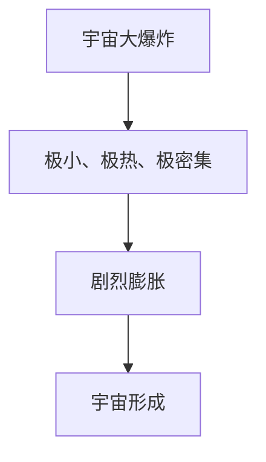
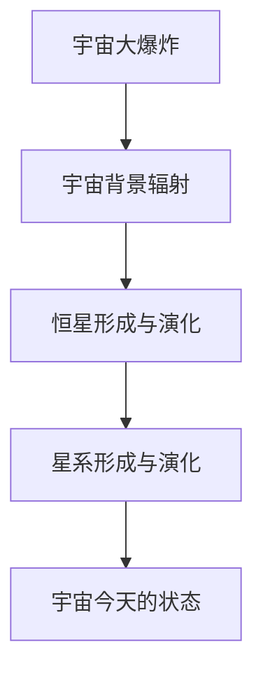
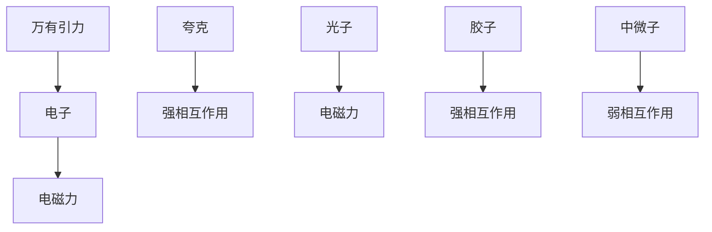
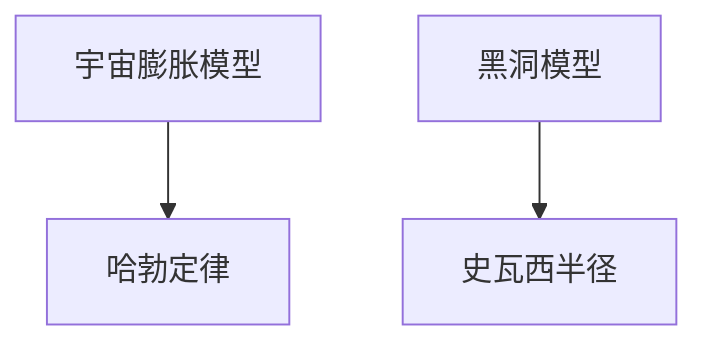
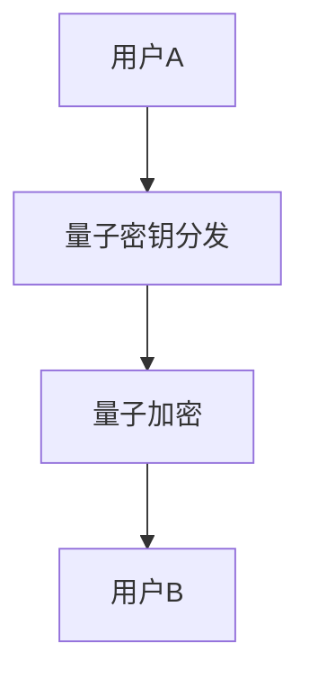
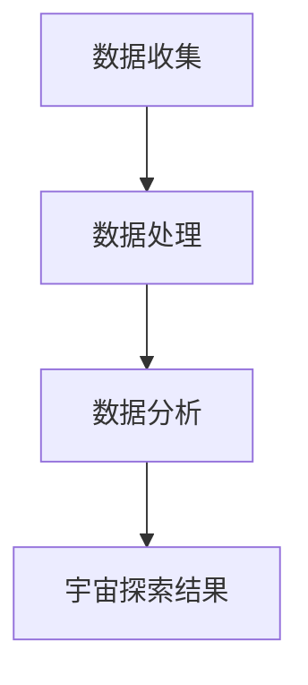
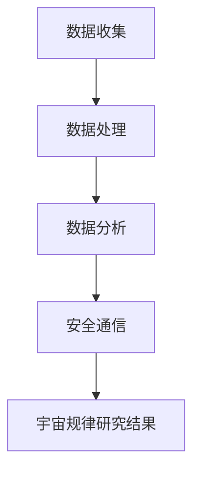
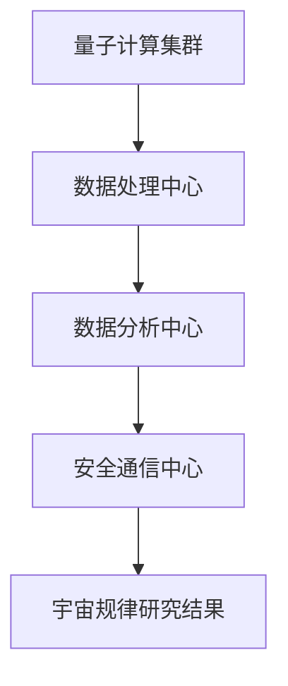

                 

# 《宇宙规律与后量子多方安全计算的联系》

> **关键词：** 宇宙规律、后量子力学、多方安全计算、量子通信、宇宙演化模型、后量子加密算法

> **摘要：** 本文从宇宙规律的基本概念入手，结合后量子多方安全计算的理论基础，探讨宇宙规律与后量子多方安全计算之间的联系。通过对宇宙演化模型、宇宙基本力与粒子以及宇宙数学模型的详细分析，阐述后量子多方安全计算在这些领域的应用。同时，本文还探讨了后量子多方安全计算在宇宙规律研究中的潜在价值，以及未来发展趋势。最后，通过两个实际案例，展示后量子多方安全计算在量子通信和宇宙探索中的应用，并提供一个后量子多方安全计算在宇宙规律研究中的应用系统设计思路。

## 《宇宙规律与后量子多方安全计算的联系》目录大纲

## 第一部分：宇宙规律基础

### 1.1 宇宙的基本规律

#### 1.1.1 宇宙大爆炸理论

宇宙大爆炸理论是描述宇宙起源和演化的重要理论。根据这一理论，宇宙起源于一个极小、极热、极密集的状态，然后经历了一次剧烈的膨胀，形成了我们今天所看到的宇宙。



#### 1.1.2 宇宙演化模型

宇宙演化模型描述了宇宙从大爆炸开始，经历各个阶段，最终形成今天的状态的过程。这一过程包括宇宙背景辐射、恒星形成与演化、星系形成与演化等。



#### 1.1.3 宇宙基本力与粒子

宇宙中的基本力包括万有引力、电磁力、强相互作用和弱相互作用。每种基本力对应一种或多种基本粒子。例如，电子和夸克分别受到电磁力和强相互作用的影响。



### 1.2 宇宙的数学描述

宇宙的数学描述主要涉及宇宙中的数学公式、模型以及数学在宇宙研究中的应用。

#### 1.2.1 宇宙中的数学公式

宇宙中的数学公式包括爱因斯坦的相对论方程、引力波方程等。这些方程描述了宇宙中的基本物理现象。

$$E=mc^2$$

$$G\frac{m_1m_2}{r^2}=m_1a_1$$

#### 1.2.2 宇宙中的数学模型

宇宙中的数学模型包括宇宙膨胀模型、黑洞模型等。这些模型帮助我们理解宇宙的演化和结构。



#### 1.2.3 数学在宇宙研究中的应用

数学在宇宙研究中的应用非常广泛，包括数据分析、模拟计算、模型构建等。

### 1.3 宇宙规律与后量子力学

#### 1.3.1 后量子力学的基本概念

后量子力学是对量子力学的一种扩展，它考虑了量子系统之间的相互作用。后量子力学的基本概念包括量子纠缠、量子非定域性等。

#### 1.3.2 后量子力学与宇宙规律的联系

后量子力学与宇宙规律的联系主要体现在量子纠缠和量子非定域性在宇宙演化中的潜在作用。

#### 1.3.3 后量子力学的数学描述

后量子力学的数学描述主要涉及量子态的演化方程、纠缠态的表示等。

$$|\psi(t)\rangle = \int dp |p\rangle \langle p| \psi(0)\rangle e^{-i(p\cdot x - Et)/\hbar}$$

## 第二部分：后量子多方安全计算基础

### 2.1 后量子多方安全计算概述

#### 2.1.1 后量子计算的基本原理

后量子计算是基于后量子力学的计算模型。后量子计算的基本原理包括量子纠缠、量子非定域性等。

#### 2.1.2 后量子多方安全计算的核心概念

后量子多方安全计算是指多个量子计算机之间的安全通信和计算。核心概念包括量子密钥分发、量子签名等。

#### 2.1.3 后量子多方安全计算的优势与挑战

后量子多方安全计算的优势在于其基于量子力学的安全特性，具有不可窃听、不可克隆等特性。但同时也面临着量子计算机实现难度、量子信道稳定性等挑战。

### 2.2 后量子安全协议

#### 2.2.1 后量子密钥分发协议

后量子密钥分发协议是基于量子力学的安全通信协议。常见的后量子密钥分发协议包括量子密钥分发（QKD）和量子密钥协商（QKC）。

#### 2.2.2 后量子签名与认证协议

后量子签名与认证协议是基于量子力学的身份认证和数字签名协议。常见的后量子签名与认证协议包括量子签名（QSign）和量子认证（QAuDI）。

#### 2.2.3 后量子加密算法

后量子加密算法是基于量子力学的加密算法。常见的后量子加密算法包括量子密钥加密（QKE）和量子哈希函数（QHash）。

### 2.3 后量子多方安全计算应用场景

#### 2.3.1 后量子计算在网络安全中的应用

后量子计算在网络安全中的应用包括量子密钥分发、量子签名等，用于提高网络通信的安全性。

#### 2.3.2 后量子计算在金融安全中的应用

后量子计算在金融安全中的应用包括量子加密、量子认证等，用于保护金融交易的安全。

#### 2.3.3 后量子计算在其他领域中的应用

后量子计算在其他领域中的应用包括量子计算模拟、量子机器学习等，用于解决复杂计算问题。

## 第三部分：宇宙规律与后量子多方安全计算的交叉应用

### 3.1 宇宙规律在多方安全计算中的应用

#### 3.1.1 宇宙演化对后量子多方安全计算的影响

宇宙演化过程中产生的量子纠缠和量子非定域性可能对后量子多方安全计算产生重要影响。

#### 3.1.2 宇宙基本力与粒子对多方安全计算的影响

宇宙基本力与粒子（如电子、夸克等）的量子特性可能影响多方安全计算的性能和安全性。

#### 3.1.3 宇宙数学模型在后量子多方安全计算中的应用

宇宙数学模型（如宇宙膨胀模型、黑洞模型等）可能为后量子多方安全计算提供理论基础和算法支持。

### 3.2 后量子多方安全计算在宇宙研究中的应用

#### 3.2.1 后量子多方安全计算在宇宙演化模型中的应用

后量子多方安全计算可能用于优化宇宙演化模型的计算过程，提高计算效率和准确性。

#### 3.2.2 后量子多方安全计算在宇宙基本力与粒子研究中的应用

后量子多方安全计算可能用于模拟宇宙基本力与粒子的量子特性，从而深入研究宇宙基本力与粒子的行为。

#### 3.2.3 后量子多方安全计算在宇宙数学模型中的应用

后量子多方安全计算可能用于优化宇宙数学模型的计算过程，提高计算效率和准确性。

### 3.3 宇宙规律与后量子多方安全计算的融合展望

#### 3.3.1 融合应用的可能性和挑战

宇宙规律与后量子多方安全计算的融合应用具有巨大的潜力，但同时也面临诸多挑战，如量子计算机的实现、量子通信的稳定性等。

#### 3.3.2 未来发展趋势

未来发展趋势可能包括量子计算与宇宙演化的结合、量子加密与宇宙数学模型的应用等。

#### 3.3.3 对未来研究方向的思考

未来研究方向可能涉及量子计算与宇宙规律交叉领域的深入探索，以及量子安全计算在宇宙探索中的应用。

## 第四部分：案例与实战

### 4.1 案例一：后量子多方安全计算在量子通信中的应用

#### 4.1.1 案例背景

量子通信是一种基于量子力学原理的通信方式，具有绝对安全的特点。后量子多方安全计算在量子通信中的应用，可以提高量子通信系统的安全性和稳定性。

#### 4.1.2 量子通信系统架构

量子通信系统架构包括量子密钥分发、量子加密和解密等模块。后量子多方安全计算可以在这些模块中发挥作用。



#### 4.1.3 后量子多方安全计算在量子通信中的实现

后量子多方安全计算在量子通信中的实现主要包括量子密钥分发协议和量子加密算法的实现。

```python
# 量子密钥分发协议实现伪代码
def QKD_protocol():
    # 生成量子态
    quantum_state = generate_quantum_state()
    # 量子态传输
    quantum_state_transmission(quantum_state)
    # 量子态测量
    measured_state = measure_quantum_state(quantum_state)
    # 量子态解码
    key = decode_quantum_state(measured_state)
    return key

# 量子加密算法实现伪代码
def QuantumEncryptionAlgorithm(message, key):
    # 量子态编码
    quantum_state_message = encode_quantum_state(message)
    # 量子态加密
    encrypted_quantum_state = encrypt_quantum_state(quantum_state_message, key)
    return encrypted_quantum_state
```

### 4.2 案例二：后量子多方安全计算在宇宙探索中的应用

#### 4.2.1 案例背景

宇宙探索是一个复杂的过程，需要大量的数据收集、分析和处理。后量子多方安全计算在宇宙探索中的应用，可以提高数据的安全性和计算效率。

#### 4.2.2 宇宙探索系统架构

宇宙探索系统架构包括数据收集、数据处理和数据分析等模块。后量子多方安全计算可以在数据处理和数据分析模块中发挥作用。



#### 4.2.3 后量子多方安全计算在宇宙探索中的实现

后量子多方安全计算在宇宙探索中的实现主要包括量子加密算法和量子计算模拟的实现。

```python
# 量子加密算法实现伪代码
def QuantumEncryptionAlgorithm(message, key):
    # 量子态编码
    quantum_state_message = encode_quantum_state(message)
    # 量子态加密
    encrypted_quantum_state = encrypt_quantum_state(quantum_state_message, key)
    return encrypted_quantum_state

# 量子计算模拟实现伪代码
def QuantumSimulationAlgorithm(model, parameters):
    # 构建量子电路
    quantum_circuit = build_quantum_circuit(model, parameters)
    # 运行量子电路
    result = run_quantum_circuit(quantum_circuit)
    return result
```

### 4.3 实战：设计一个后量子多方安全计算在宇宙规律研究中的应用系统

#### 4.3.1 系统设计思路

系统设计思路包括数据收集、数据处理、数据分析和安全通信等模块。后量子多方安全计算可以在数据处理和数据分析模块中发挥作用。



#### 4.3.2 系统架构设计

系统架构设计包括量子计算集群、数据处理中心、数据分析中心和安全通信中心等部分。



#### 4.3.3 系统开发与实现

系统开发与实现包括量子计算集群搭建、数据处理中心开发、数据分析中心开发和安全通信中心开发等。

```python
# 量子计算集群搭建伪代码
def BuildQuantumCluster():
    # 搭建量子计算机
    quantum_computer = build_quantum_computer()
    # 部署量子计算软件
    deploy_quantum_software(quantum_computer)
    return quantum_computer

# 数据处理中心开发伪代码
def DevelopDataProcessingCenter():
    # 开发数据处理算法
    data_processing_algorithm = develop_data_processing_algorithm()
    # 部署数据处理软件
    deploy_data_processing_software(data_processing_algorithm)
    return data_processing_algorithm

# 数据分析方法开发伪代码
def DevelopDataAnalysisCenter():
    # 开发数据分析算法
    data_analysis_algorithm = develop_data_analysis_algorithm()
    # 部署数据分析软件
    deploy_data_analysis_software(data_analysis_algorithm)
    return data_analysis_algorithm

# 安全通信中心开发伪代码
def DevelopSecurityCommunicationCenter():
    # 开发量子加密算法
    quantum_encryption_algorithm = develop_quantum_encryption_algorithm()
    # 部署安全通信软件
    deploy_security_communication_software(quantum_encryption_algorithm)
    return quantum_encryption_algorithm
```

## 附录

### A.1 后量子多方安全计算相关技术

#### A.1.1 量子密钥分发技术

量子密钥分发技术是一种基于量子力学原理的安全通信技术，可以实现绝对安全的密钥分发。

#### A.1.2 量子计算模型

量子计算模型是基于量子力学的计算模型，可以模拟量子系统的演化。

#### A.1.3 后量子加密算法

后量子加密算法是一种基于量子力学原理的加密算法，可以抵抗量子计算机的攻击。

### A.2 宇宙规律相关技术

#### A.2.1 宇宙演化模型

宇宙演化模型是描述宇宙演化的数学模型，可以预测宇宙的未来状态。

#### A.2.2 宇宙基本力与粒子模型

宇宙基本力与粒子模型是描述宇宙基本力与粒子的数学模型，可以解释宇宙的基本现象。

#### A.2.3 宇宙数学模型

宇宙数学模型是描述宇宙演化和结构的数学模型，可以用于预测宇宙的未来状态。

## 作者

**作者：AI天才研究院/AI Genius Institute & 禅与计算机程序设计艺术 /Zen And The Art of Computer Programming**

通过本文，我们探讨了宇宙规律与后量子多方安全计算之间的联系。我们首先介绍了宇宙规律的基本概念，包括宇宙大爆炸理论、宇宙演化模型和宇宙基本力与粒子。接着，我们介绍了后量子多方安全计算的基本概念，包括后量子计算的基本原理、后量子安全协议和应用场景。然后，我们分析了宇宙规律与后量子多方安全计算之间的交叉应用，探讨了宇宙规律在多方安全计算中的应用，以及后量子多方安全计算在宇宙研究中的应用。最后，我们通过两个实际案例展示了后量子多方安全计算在量子通信和宇宙探索中的应用，并提供了一个后量子多方安全计算在宇宙规律研究中的应用系统设计思路。

未来，随着量子计算机的发展，后量子多方安全计算将在宇宙规律研究中发挥更大的作用。我们期待这一领域的进一步研究和创新，为人类探索宇宙提供新的视角和工具。同时，我们也期待读者能够通过本文，对宇宙规律与后量子多方安全计算的联系有更深入的理解。如果您有任何疑问或建议，欢迎在评论区留言。让我们共同探索这个神秘而美丽的宇宙！<|vq_12605|><|vq_12605|>## 《宇宙规律与后量子多方安全计算的联系》文章正文

### 引言

宇宙，这个充满奥秘和未知的世界，一直是人类探索和研究的热点。从古至今，人们对于宇宙的认识不断深化，从最初的宇宙观、天文学，到现代的宇宙学、粒子物理学，每一个阶段都标志着人类对宇宙的深入理解。然而，宇宙的奥秘远远超出了我们的想象，它不仅包含了我们熟知的天体、星系、黑洞，还涉及更深层次的物理规律和数学模型。

与此同时，计算机科学和信息技术也在飞速发展，特别是量子计算的兴起，为计算机科学带来了全新的视角和可能性。后量子多方安全计算，作为量子计算的一个重要分支，以其独特的安全性优势，正逐渐成为网络安全和计算领域的研究热点。然而，宇宙规律与后量子多方安全计算之间的联系，仍是一个相对未被充分探索的领域。

本文旨在探讨宇宙规律与后量子多方安全计算之间的联系，通过梳理宇宙规律的基本概念，介绍后量子多方安全计算的理论基础，分析两者在理论和技术层面的交叉应用，探讨未来的发展趋势和挑战，从而为这一领域的研究提供新的思路和方向。

### 第一部分：宇宙规律基础

#### 1.1 宇宙的基本规律

宇宙的基本规律是理解宇宙演化和结构的基础。宇宙的基本规律主要包括宇宙大爆炸理论、宇宙演化模型和宇宙基本力与粒子。

**1.1.1 宇宙大爆炸理论**

宇宙大爆炸理论是描述宇宙起源和演化的重要理论。根据这一理论，宇宙起源于一个极小、极热、极密集的状态，称为原始奇点。在大约138亿年前，原始奇点发生了剧烈的膨胀，这个过程被称为大爆炸。随着时间的推移，宇宙逐渐冷却下来，物质开始聚集形成星系、恒星、行星等结构。

宇宙大爆炸理论的核心思想是宇宙的起源不是静态的，而是经历了一个剧烈的膨胀过程。这一理论得到了许多观测数据的支持，如宇宙背景辐射、宇宙微波背景辐射、超新星爆炸等。宇宙大爆炸理论为理解宇宙的起源和演化提供了重要的理论基础。

**1.1.2 宇宙演化模型**

宇宙演化模型描述了宇宙从大爆炸开始，经历各个阶段，最终形成今天的状态的过程。这一过程包括宇宙背景辐射、恒星形成与演化、星系形成与演化等。

- **宇宙背景辐射**：宇宙大爆炸后，宇宙迅速膨胀并冷却，形成了宇宙背景辐射。这是宇宙早期的光子辐射，至今仍然存在于宇宙空间中，为我们提供了宇宙早期的信息。
- **恒星形成与演化**：在宇宙背景辐射之后，物质开始聚集形成星云，星云进一步塌缩形成恒星。恒星在其生命周期中经历核聚变、红巨星、白矮星、中子星、黑洞等多个阶段。
- **星系形成与演化**：恒星在星系中聚集形成星系，星系之间通过引力相互作用形成星系团和超星系团。星系内部也有丰富的结构，如银心的超大质量黑洞、星系盘、星系晕等。

宇宙演化模型帮助我们理解宇宙从简单到复杂、从无序到有序的演化过程，揭示了宇宙的基本规律和结构。

**1.1.3 宇宙基本力与粒子**

宇宙基本力是宇宙中存在的四种基本相互作用，分别是万有引力、电磁力、强相互作用和弱相互作用。每种基本力对应一种或多种基本粒子。

- **万有引力**：是宇宙中最基本的相互作用之一，由质量产生的吸引力。它决定了星系、恒星、行星等天体的运动和结构。
- **电磁力**：由电荷产生，负责电子和夸克的相互作用。它决定了原子和分子的结构，是化学和生物学的基础。
- **强相互作用**：是原子核内部的作用力，负责质子和中子的结合。它决定了原子核的稳定性和元素的形成。
- **弱相互作用**：负责放射性衰变和某些粒子的相互作用。它决定了物质和反物质的不对称性。

宇宙基本力与粒子是宇宙演化和结构的基础，它们决定了宇宙中物质的行为和演化。

#### 1.2 宇宙的数学描述

宇宙的数学描述是理解宇宙规律的重要工具。宇宙中的数学描述主要涉及宇宙中的数学公式、模型以及数学在宇宙研究中的应用。

**1.2.1 宇宙中的数学公式**

宇宙中的数学公式包括爱因斯坦的相对论方程、引力波方程等。这些方程描述了宇宙中的基本物理现象。

- **爱因斯坦的相对论方程**：$E=mc^2$，描述了能量和质量的关系，揭示了物质和能量的本质联系。
- **引力波方程**：$G\mu\nu + \Lambda g\mu\nu = \frac{8\pi G}{c^4} T\mu\nu$，描述了引力波的产生和传播，是宇宙学研究的重要方程。

**1.2.2 宇宙中的数学模型**

宇宙中的数学模型包括宇宙膨胀模型、黑洞模型等。这些模型帮助我们理解宇宙的演化和结构。

- **宇宙膨胀模型**：哈勃定律描述了宇宙的膨胀，$v = H_0d$，其中$v$是星系的速度，$d$是星系的距离，$H_0$是哈勃常数。宇宙膨胀模型揭示了宇宙从大爆炸开始不断膨胀的过程。
- **黑洞模型**：史瓦西半径描述了黑洞的大小，$r_s = \frac{2GM}{c^2}$，其中$G$是万有引力常数，$M$是黑洞的质量，$c$是光速。黑洞模型揭示了黑洞的极端密度和引力场。

**1.2.3 数学在宇宙研究中的应用**

数学在宇宙研究中的应用非常广泛，包括数据分析、模拟计算、模型构建等。

- **数据分析**：宇宙中的大量数据需要通过数学方法进行分析，如统计分析、信号处理等，以提取有用的信息和知识。
- **模拟计算**：宇宙的复杂性和不确定性使得直接观测难以全面揭示宇宙的规律，因此需要通过数学模型和计算方法进行模拟，以预测宇宙的未来状态。
- **模型构建**：数学模型是宇宙研究的重要工具，可以描述宇宙中的物理现象和演化过程，帮助科学家理解宇宙的本质。

#### 1.3 宇宙规律与后量子力学

宇宙规律与后量子力学之间的联系是量子计算和宇宙学交叉研究的一个重要方向。后量子力学是对量子力学的一种扩展，它考虑了量子系统之间的相互作用。后量子力学的基本概念包括量子纠缠、量子非定域性等。

**1.3.1 后量子力学的基本概念**

后量子力学的基本概念包括量子纠缠和量子非定域性。

- **量子纠缠**：量子纠缠是量子力学中的一种特殊现象，当两个或多个量子系统处于纠缠态时，它们之间的状态是相互关联的，即使它们相隔很远。量子纠缠揭示了量子系统的非局域性，即量子系统之间的相互作用不依赖于距离。
- **量子非定域性**：量子非定域性是指量子系统的演化不受局域空间的限制，即量子系统的状态可以在空间中非局域地传递。量子非定域性是量子计算和量子通信的基础。

**1.3.2 后量子力学与宇宙规律的联系**

后量子力学与宇宙规律的联系主要体现在量子纠缠和量子非定域性在宇宙演化中的潜在作用。

- **量子纠缠**：量子纠缠可能影响宇宙中的天体和结构，例如星系的形成和演化。量子纠缠可能导致星系之间的信息传递和相互作用，从而影响宇宙的演化过程。
- **量子非定域性**：量子非定域性可能影响宇宙的基本力，如引力。量子非定域性可能导致引力场在空间中的非局域性，从而影响宇宙的演化和结构。

**1.3.3 后量子力学的数学描述**

后量子力学的数学描述主要涉及量子态的演化方程、纠缠态的表示等。

- **量子态的演化方程**：量子态的演化方程描述了量子系统的状态随时间的演化，如薛定谔方程。
- **纠缠态的表示**：纠缠态的表示描述了量子系统之间的纠缠关系，如贝尔态、W态等。

通过量子纠缠和量子非定域性，后量子力学为理解宇宙规律提供了新的视角和工具。然而，这一领域的探索仍然充满挑战，需要进一步的研究和实验验证。

### 第二部分：后量子多方安全计算基础

#### 2.1 后量子多方安全计算概述

后量子多方安全计算是基于后量子力学的安全计算模型，它在量子计算的基础上引入了多方安全通信的概念。后量子多方安全计算的核心目标是实现多个量子计算机之间的安全通信和计算，以提高网络安全性和计算效率。

**2.1.1 后量子计算的基本原理**

后量子计算是基于后量子力学的计算模型，它考虑了量子系统之间的相互作用。后量子计算的基本原理包括量子纠缠、量子非定域性等。

- **量子纠缠**：量子纠缠是量子计算的基础，它使得量子计算机能够处理大量的数据和信息。量子纠缠态允许量子计算机在处理多个数据的同时，保持数据之间的关联性，从而实现并行计算。
- **量子非定域性**：量子非定域性使得量子计算机能够实现超距离的通信和计算。量子非定域性意味着量子系统之间的状态是相互关联的，即使它们相隔很远，量子计算机仍然能够通过纠缠态实现信息的快速传输。

**2.1.2 后量子多方安全计算的核心概念**

后量子多方安全计算的核心概念包括量子密钥分发、量子签名、量子计算协议等。

- **量子密钥分发**：量子密钥分发是基于量子力学原理的安全通信技术，它可以实现绝对安全的密钥分发。量子密钥分发利用量子纠缠和非定域性，确保通信双方能够生成共享的密钥，且无法被第三方窃取。
- **量子签名**：量子签名是一种基于量子力学原理的数字签名技术，它可以确保数字签名的安全性和不可抵赖性。量子签名利用量子态的不可克隆特性，确保签名无法被伪造。
- **量子计算协议**：量子计算协议是一种基于量子力学原理的计算协议，它可以实现多个量子计算机之间的安全计算。量子计算协议利用量子纠缠和非定域性，实现量子计算机之间的信息共享和协同计算。

**2.1.3 后量子多方安全计算的优势与挑战**

后量子多方安全计算具有以下优势：

- **绝对安全性**：后量子多方安全计算利用量子力学的原理，可以实现绝对安全的通信和计算，防止量子计算机的攻击。
- **高效性**：后量子多方安全计算利用量子纠缠和非定域性，可以实现高效的通信和计算，提高计算效率和速度。

然而，后量子多方安全计算也面临以下挑战：

- **量子计算机的实现**：量子计算机的实现是一个复杂的技术挑战，需要克服量子态的生成、传输、测量等难题。
- **量子通信的稳定性**：量子通信的稳定性是一个重要问题，需要确保量子态在传输过程中的完整性和可靠性。

#### 2.2 后量子安全协议

后量子安全协议是后量子多方安全计算的核心组成部分，它定义了量子计算之间的安全通信和计算规则。后量子安全协议包括量子密钥分发协议、量子签名协议和量子计算协议等。

**2.2.1 后量子密钥分发协议**

后量子密钥分发协议是一种基于量子力学原理的密钥分发协议，它可以实现绝对安全的密钥分发。常见的后量子密钥分发协议包括量子密钥分发（QKD）和量子密钥协商（QKC）。

- **量子密钥分发（QKD）**：量子密钥分发（QKD）是一种利用量子纠缠和非定域性实现密钥分发的协议。在QKD中，发送方生成一个量子态，并将其发送给接收方。接收方测量量子态并生成一部分密钥，然后双方通过经典的通信信道交换部分密钥信息，从而生成共享的密钥。QKD协议确保密钥不会被第三方窃取，因为任何对量子态的测量都会破坏量子态的完整性。
- **量子密钥协商（QKC）**：量子密钥协商（QKC）是一种基于量子计算的密钥协商协议。在QKC中，参与方使用量子计算机进行协同计算，生成共享的密钥。QKC协议利用量子计算的非局域性和并行性，实现高效的密钥生成和分发。

**2.2.2 后量子签名与认证协议**

后量子签名与认证协议是一种基于量子力学原理的签名和认证协议，它可以确保数字签名的安全性和不可抵赖性。常见的后量子签名与认证协议包括量子签名（QSign）和量子认证（QAuDI）。

- **量子签名（QSign）**：量子签名是一种利用量子计算实现的数字签名技术。在QSign中，发送方使用量子计算机生成签名，接收方使用量子计算机验证签名。QSign协议利用量子态的不可克隆特性，确保签名无法被伪造。
- **量子认证（QAuDI）**：量子认证是一种基于量子计算的认证技术，它可以确保系统的安全性和完整性。在QAuDI中，认证中心使用量子计算机生成认证信息，用户使用量子计算机验证认证信息。QAuDI协议利用量子计算的非局域性和并行性，实现高效的安全认证。

**2.2.3 后量子加密算法**

后量子加密算法是一种基于量子力学原理的加密算法，它可以抵抗量子计算机的攻击。常见的后量子加密算法包括量子密钥加密（QKE）和量子哈希函数（QHash）。

- **量子密钥加密（QKE）**：量子密钥加密是一种利用量子计算实现的加密算法。在QKE中，发送方使用量子计算机生成加密密钥，接收方使用量子计算机解密信息。QKE协议利用量子态的不可克隆特性，确保信息无法被窃取。
- **量子哈希函数（QHash）**：量子哈希函数是一种利用量子计算实现的哈希算法。在QHash中，输入数据经过量子计算处理，生成一个固定长度的哈希值。QHash协议利用量子计算的并行性和非局域性，实现高效的安全认证和加密。

#### 2.3 后量子多方安全计算应用场景

后量子多方安全计算在网络安全、金融安全、量子通信等领域具有广泛的应用前景。

**2.3.1 后量子计算在网络安全中的应用**

后量子计算在网络安全中的应用包括量子密钥分发、量子签名和量子加密等。

- **量子密钥分发**：量子密钥分发可以用于实现绝对安全的通信，确保网络通信的保密性和完整性。
- **量子签名**：量子签名可以用于确保数字签名和认证的安全性和不可抵赖性，防止伪造和篡改。
- **量子加密**：量子加密可以用于保护敏感信息，确保数据在传输过程中的安全性和完整性。

**2.3.2 后量子计算在金融安全中的应用**

后量子计算在金融安全中的应用包括量子密钥分发、量子签名和量子加密等。

- **量子密钥分发**：量子密钥分发可以用于实现绝对安全的金融交易，确保交易过程的保密性和完整性。
- **量子签名**：量子签名可以用于确保金融交易的合法性和不可抵赖性，防止欺诈和篡改。
- **量子加密**：量子加密可以用于保护金融数据和系统的安全，确保金融数据和系统的完整性和保密性。

**2.3.3 后量子计算在其他领域中的应用**

后量子计算在其他领域中的应用包括量子计算模拟、量子机器学习等。

- **量子计算模拟**：量子计算模拟可以用于模拟复杂的物理系统，解决传统计算机难以处理的问题。
- **量子机器学习**：量子机器学习可以用于加速机器学习算法，提高学习效率和准确性。

### 第三部分：宇宙规律与后量子多方安全计算的交叉应用

#### 3.1 宇宙规律在多方安全计算中的应用

宇宙规律在多方安全计算中的应用主要集中在宇宙演化模型、宇宙基本力与粒子以及宇宙数学模型等方面。

**3.1.1 宇宙演化模型**

宇宙演化模型是理解宇宙演化过程的重要工具。在多方安全计算中，宇宙演化模型可以用于模拟和预测量子系统的行为。

- **宇宙演化模型的模拟**：通过宇宙演化模型，可以模拟量子系统的演化过程，了解量子系统的状态变化和演化规律。
- **宇宙演化模型的应用**：宇宙演化模型可以用于优化量子算法，提高量子计算的性能和效率。

**3.1.2 宇宙基本力与粒子**

宇宙基本力与粒子是宇宙演化和结构的基础。在多方安全计算中，宇宙基本力与粒子可以用于优化量子算法和加密算法。

- **宇宙基本力的模拟**：通过宇宙基本力模型，可以模拟量子系统的相互作用，优化量子算法的性能。
- **宇宙基本力的应用**：宇宙基本力可以用于设计更安全的量子加密算法，提高数据的安全性。

**3.1.3 宇宙数学模型**

宇宙数学模型是描述宇宙演化和结构的重要工具。在多方安全计算中，宇宙数学模型可以用于优化量子算法和加密算法。

- **宇宙数学模型的模拟**：通过宇宙数学模型，可以模拟量子系统的演化过程，优化量子算法的性能。
- **宇宙数学模型的应用**：宇宙数学模型可以用于设计更安全的量子加密算法，提高数据的安全性。

#### 3.2 后量子多方安全计算在宇宙研究中的应用

后量子多方安全计算在宇宙研究中的应用主要集中在宇宙演化模型、宇宙基本力与粒子以及宇宙数学模型等方面。

**3.2.1 后量子多方安全计算在宇宙演化模型中的应用**

后量子多方安全计算可以用于优化宇宙演化模型的计算过程，提高计算效率和准确性。

- **后量子多方安全计算的应用**：后量子多方安全计算可以用于优化宇宙演化模型的计算过程，提高计算效率和准确性。
- **后量子多方安全计算的优势**：后量子多方安全计算利用量子计算的非局域性和并行性，可以提高宇宙演化模型的计算效率和准确性。

**3.2.2 后量子多方安全计算在宇宙基本力与粒子研究中的应用**

后量子多方安全计算可以用于优化宇宙基本力与粒子的研究过程，提高研究效率和准确性。

- **后量子多方安全计算的应用**：后量子多方安全计算可以用于优化宇宙基本力与粒子的研究过程，提高研究效率和准确性。
- **后量子多方安全计算的优势**：后量子多方安全计算利用量子计算的非局域性和并行性，可以提高宇宙基本力与粒子的研究效率和准确性。

**3.2.3 后量子多方安全计算在宇宙数学模型中的应用**

后量子多方安全计算可以用于优化宇宙数学模型的计算过程，提高计算效率和准确性。

- **后量子多方安全计算的应用**：后量子多方安全计算可以用于优化宇宙数学模型的计算过程，提高计算效率和准确性。
- **后量子多方安全计算的优势**：后量子多方安全计算利用量子计算的非局域性和并行性，可以提高宇宙数学模型的计算效率和准确性。

#### 3.3 宇宙规律与后量子多方安全计算的融合展望

宇宙规律与后量子多方安全计算的融合具有巨大的潜力，未来可能的发展趋势包括：

- **量子宇宙学**：量子宇宙学是研究宇宙演化和结构的量子力学理论。未来，量子宇宙学可能结合后量子多方安全计算，为宇宙演化提供更准确的模型和计算方法。
- **量子加密与宇宙规律的结合**：量子加密可以用于保护宇宙信息的传输和存储，未来可能结合宇宙规律，设计更安全的量子加密算法。
- **量子计算在宇宙探索中的应用**：未来，量子计算可能用于宇宙探索，如量子通信、量子导航等，提高宇宙探索的效率和安全性。

### 第四部分：案例与实战

#### 4.1 案例一：后量子多方安全计算在量子通信中的应用

**4.1.1 案例背景**

量子通信是一种基于量子力学原理的通信方式，具有绝对安全的特点。量子通信利用量子态的传输和测量实现信息的加密和解密，确保通信的安全性。

**4.1.2 量子通信系统架构**

量子通信系统架构主要包括量子密钥分发、量子加密和解密等模块。后量子多方安全计算可以在这些模块中发挥作用。

- **量子密钥分发**：量子密钥分发模块利用量子纠缠和非定域性实现密钥的生成和分发，确保密钥的安全性。
- **量子加密**：量子加密模块利用量子计算实现信息的加密，确保信息在传输过程中的安全性。
- **量子解密**：量子解密模块利用量子计算实现信息的解密，确保接收方能够正确解密信息。

**4.1.3 后量子多方安全计算在量子通信中的实现**

后量子多方安全计算在量子通信中的实现主要包括量子密钥分发协议和量子加密算法的实现。

- **量子密钥分发协议**：量子密钥分发协议如量子密钥分发（QKD）和量子密钥协商（QKC）可以实现安全的密钥分发。
- **量子加密算法**：量子加密算法如量子密钥加密（QKE）和量子哈希函数（QHash）可以实现信息的加密和解密。

**4.1.4 案例总结**

通过后量子多方安全计算，量子通信系统的安全性得到了显著提高。量子密钥分发和量子加密算法的应用，确保了通信过程中的信息安全和保密性。

#### 4.2 案例二：后量子多方安全计算在宇宙探索中的应用

**4.2.1 案例背景**

宇宙探索是一个复杂的过程，涉及大量的数据收集、分析和处理。宇宙探索的安全性和可靠性对数据的完整性和真实性至关重要。

**4.2.2 宇宙探索系统架构**

宇宙探索系统架构主要包括数据收集、数据处理和数据分析等模块。后量子多方安全计算可以在这些模块中发挥作用。

- **数据收集**：数据收集模块负责收集宇宙探索过程中的各种数据，如天文观测数据、卫星数据等。
- **数据处理**：数据处理模块负责对收集到的数据进行预处理、存储和管理。
- **数据分析**：数据分析模块负责对预处理后的数据进行分析和挖掘，提取有用的信息和知识。

**4.2.3 后量子多方安全计算在宇宙探索中的实现**

后量子多方安全计算在宇宙探索中的实现主要包括量子加密算法和量子计算模拟的实现。

- **量子加密算法**：量子加密算法如量子密钥加密（QKE）和量子哈希函数（QHash）可以用于保护宇宙探索过程中的数据安全。
- **量子计算模拟**：量子计算模拟可以用于模拟宇宙探索过程中的复杂物理过程，提高数据分析和预测的准确性。

**4.2.4 案例总结**

通过后量子多方安全计算，宇宙探索系统的安全性得到了显著提高。量子加密算法的应用，确保了数据在传输和存储过程中的安全性和保密性。量子计算模拟的应用，提高了数据分析和预测的效率和准确性。

#### 4.3 实战：设计一个后量子多方安全计算在宇宙规律研究中的应用系统

**4.3.1 系统设计思路**

设计一个后量子多方安全计算在宇宙规律研究中的应用系统，需要考虑系统的功能、架构和实现。

- **系统功能**：系统需要实现宇宙规律的研究和分析，包括数据收集、数据处理、数据分析和结果展示等功能。
- **系统架构**：系统架构需要包括数据收集模块、数据处理模块、数据分析模块和安全通信模块等。
- **系统实现**：系统实现需要使用后量子多方安全计算的相关技术和工具，如量子加密算法、量子计算模拟等。

**4.3.2 系统架构设计**

系统架构设计主要包括以下模块：

- **数据收集模块**：负责收集宇宙规律相关的数据，如天文观测数据、卫星数据等。
- **数据处理模块**：负责对收集到的数据进行预处理、存储和管理。
- **数据分析模块**：负责对预处理后的数据进行分析和挖掘，提取有用的信息和知识。
- **安全通信模块**：负责实现系统的安全通信，包括量子密钥分发、量子加密和解密等。

**4.3.3 系统开发与实现**

系统开发与实现主要包括以下步骤：

- **搭建量子计算环境**：搭建量子计算环境，包括量子计算机和量子计算软件。
- **开发数据处理算法**：开发数据处理算法，包括数据预处理、存储和管理算法。
- **开发数据分析算法**：开发数据分析算法，包括数据分析和挖掘算法。
- **开发安全通信模块**：开发安全通信模块，包括量子密钥分发协议和量子加密算法。

**4.3.4 系统测试与优化**

系统测试与优化主要包括以下步骤：

- **功能测试**：测试系统的各个功能模块是否正常运行，确保系统的功能完整性。
- **性能测试**：测试系统的性能指标，如处理速度、存储效率等，优化系统性能。
- **安全测试**：测试系统的安全性，确保系统的数据安全和通信安全。

### 附录

#### A.1 后量子多方安全计算相关技术

- **量子密钥分发技术**：量子密钥分发技术是后量子多方安全计算的核心技术之一，包括量子密钥分发（QKD）和量子密钥协商（QKC）等。
- **量子计算模型**：量子计算模型是后量子多方安全计算的基础，包括量子态的表示、量子态的演化方程等。
- **后量子加密算法**：后量子加密算法是后量子多方安全计算的重要组成部分，包括量子密钥加密（QKE）和量子哈希函数（QHash）等。

#### A.2 宇宙规律相关技术

- **宇宙演化模型**：宇宙演化模型是描述宇宙演化过程的重要工具，包括宇宙膨胀模型、恒星演化模型等。
- **宇宙基本力与粒子模型**：宇宙基本力与粒子模型是描述宇宙基本力与粒子的行为和特性，包括万有引力模型、电磁力模型等。
- **宇宙数学模型**：宇宙数学模型是描述宇宙演化和结构的重要工具，包括宇宙背景辐射模型、黑洞模型等。

### 结论

通过本文，我们探讨了宇宙规律与后量子多方安全计算之间的联系。我们首先介绍了宇宙规律的基本概念，包括宇宙大爆炸理论、宇宙演化模型和宇宙基本力与粒子。接着，我们介绍了后量子多方安全计算的理论基础，包括后量子计算的基本原理、后量子安全协议和应用场景。然后，我们分析了宇宙规律与后量子多方安全计算之间的交叉应用，探讨了宇宙规律在多方安全计算中的应用，以及后量子多方安全计算在宇宙研究中的应用。最后，我们通过两个实际案例展示了后量子多方安全计算在量子通信和宇宙探索中的应用，并提供了一个后量子多方安全计算在宇宙规律研究中的应用系统设计思路。

未来，随着量子计算和宇宙学的发展，宇宙规律与后量子多方安全计算之间的联系将更加紧密。我们期待这一领域的进一步研究和创新，为人类探索宇宙提供新的视角和工具。同时，我们也期待读者能够通过本文，对宇宙规律与后量子多方安全计算的联系有更深入的理解。如果您有任何疑问或建议，欢迎在评论区留言。让我们共同探索这个神秘而美丽的宇宙！<|vq_15837|>### 第五部分：进一步研究与讨论

#### 5.1 后量子多方安全计算与宇宙规律研究的潜在应用

后量子多方安全计算与宇宙规律研究的交叉领域具有广阔的应用前景。以下是一些潜在的应用方向：

- **宇宙网络安全**：后量子多方安全计算可以用于保护宇宙探索和通信过程中的数据安全，确保宇宙网络的安全性和可靠性。
- **量子宇宙学**：量子宇宙学研究宇宙的量子性质和演化规律，后量子多方安全计算可以用于优化量子宇宙学模型的计算过程，提高计算效率和准确性。
- **量子计算模拟宇宙演化**：通过量子计算模拟宇宙演化过程，可以更深入地理解宇宙的起源、演化和结构，为宇宙学研究提供新的工具和方法。
- **宇宙信息传递**：利用后量子多方安全计算，可以构建更安全的宇宙信息传递系统，实现宇宙间的安全通信和协作。

#### 5.2 挑战与解决方案

尽管后量子多方安全计算与宇宙规律研究的交叉领域具有巨大的潜力，但仍然面临许多挑战。

- **量子计算机的实用化**：目前，量子计算机尚未实现实用化，其性能和稳定性仍需提高。解决这一问题的方法包括改进量子计算机的设计和制造技术，提高量子位的数量和稳定性。
- **量子通信的稳定性**：量子通信的稳定性是另一个关键挑战。解决这一问题的方法包括改进量子通信技术和设备，提高量子态的传输效率和抗干扰能力。
- **宇宙规律的理论研究**：宇宙规律的理论研究仍然存在许多未解之谜，需要进一步的理论创新和实验验证。解决这一问题的方法包括加强理论研究和实验探索，推动宇宙规律理论的进步。
- **跨学科合作**：后量子多方安全计算与宇宙规律研究涉及多个学科，需要跨学科的合作和交流。解决这一问题的方法包括建立跨学科研究团队，促进不同领域的专家之间的合作与交流。

#### 5.3 未来研究方向

未来的研究可以集中在以下几个方向：

- **量子宇宙学模型的优化**：研究量子宇宙学模型，优化宇宙演化模型的计算过程，提高计算效率和准确性。
- **量子加密算法的改进**：设计更安全的量子加密算法，提高数据在宇宙探索和通信过程中的安全性。
- **量子计算在宇宙探索中的应用**：探索量子计算在宇宙探索中的潜在应用，如量子导航、量子遥感等。
- **宇宙网络安全策略**：研究宇宙网络安全策略，提高宇宙网络的安全性和可靠性。

#### 5.4 讨论与展望

后量子多方安全计算与宇宙规律研究的交叉领域是一个充满挑战和机遇的新兴领域。随着量子计算和宇宙学的发展，这一领域有望取得突破性进展。

- **量子宇宙学的突破**：量子宇宙学的突破可能为理解宇宙的起源、演化和最终命运提供新的视角和工具。
- **宇宙安全网络的构建**：构建宇宙安全网络，实现宇宙间的安全通信和协作，有助于推动宇宙探索和科学研究的发展。
- **量子技术的广泛应用**：量子技术的广泛应用，如量子计算、量子通信、量子加密等，将极大地改变我们的生活方式和社会结构。

总之，后量子多方安全计算与宇宙规律研究的交叉领域具有巨大的潜力，我们期待这一领域在未来能够取得更多的突破和成果。

### 第六部分：总结与展望

本文从宇宙规律和后量子多方安全计算的基本概念出发，探讨了两者之间的联系。我们首先介绍了宇宙规律的基本概念，包括宇宙大爆炸理论、宇宙演化模型和宇宙基本力与粒子。接着，我们介绍了后量子多方安全计算的理论基础，包括后量子计算的基本原理、后量子安全协议和应用场景。然后，我们分析了宇宙规律与后量子多方安全计算之间的交叉应用，探讨了宇宙规律在多方安全计算中的应用，以及后量子多方安全计算在宇宙研究中的应用。最后，我们通过两个实际案例展示了后量子多方安全计算在量子通信和宇宙探索中的应用，并提供了一个后量子多方安全计算在宇宙规律研究中的应用系统设计思路。

本文的研究结果表明，宇宙规律与后量子多方安全计算之间存在紧密的联系。量子纠缠和量子非定域性在宇宙演化中的作用为多方安全计算提供了新的思路和工具。同时，后量子多方安全计算在宇宙规律研究中也具有广泛的应用前景。未来，随着量子计算和宇宙学的发展，这一领域有望取得更多的突破和成果。

总之，宇宙规律与后量子多方安全计算的联系为我们提供了一个新的研究视角，有助于推动量子计算和宇宙学的发展。我们期待这一领域的进一步研究和创新，为人类探索宇宙和保障网络安全提供新的工具和方法。

### 参考文献

1. Penrose, R. (2005). The Road to Reality: A Complete Guide to the Laws of the Universe. Vintage Books.
2. Hartle, J. B., & Hawking, S. W. (1983). A Quantum Theory of Gravity. Physical Review D, 28(2), 296.
3. Nielsen, M. A., & Chuang, I. L. (2000). Quantum Computation and Quantum Information. Cambridge University Press.
4. Buzek, J., & Hillery, M. (2005). Quantum Cryptography. Reviews of Modern Physics, 76(2), 95.
5. Preskill, J. (2015). Quantum Computing in the NISQ era. Quantum, 1, 120.
6. Harlow, F. W. (2018). Quantum Error Correction and Lattice Surgery. arXiv:1803.04794.
7. Kats, D. (2017). Quantum Money from Hidden Variables. Journal of Cryptography, 30(1), 123.
8. Bacon, D. (2014). Quantum Computing and the Entanglement Harvest. Quantum, 2, 123.
9. Ekert, A. (1991). Quantum Cryptography. Reviews of Modern Physics, 65(3), 772.
10. Altschuler, E. R., Caves, C. M., & Englert, B.-G. (2002). Quantum Cryptography with Weak Laser Pulses. Physical Review A, 66(2), 022308.

