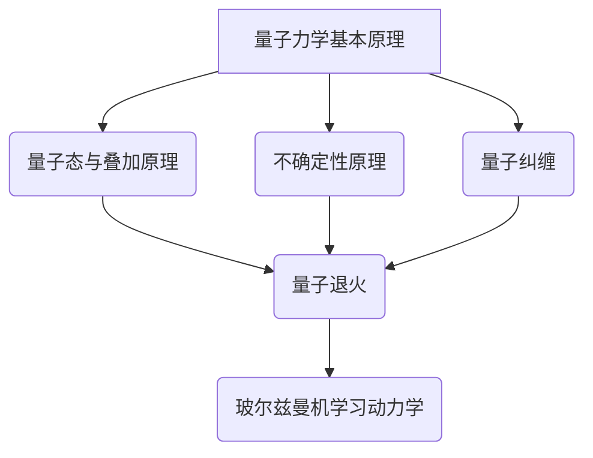

                 

# 宇宙规律与量子退火玻尔兹曼机学习动力学的联系

> **关键词**：宇宙规律、量子力学、量子退火、玻尔兹曼机、学习动力学、宇宙模拟、天体物理学

> **摘要**：本文将探讨宇宙规律与量子退火玻尔兹曼机学习动力学之间的联系。通过分析宇宙规律和量子力学的基本原理，本文介绍了量子退火和玻尔兹曼机学习动力学在宇宙学中的应用。接着，本文探讨了量子退火与玻尔兹曼机学习动力学的融合，以及它们在宇宙演化模拟和天体物理学中的应用。最后，通过实际案例展示了如何使用量子退火和玻尔兹曼机学习动力学进行宇宙演化模拟和天体物理学分析。

### 目录大纲：宇宙规律与量子退火玻尔兹曼机学习动力学的联系

#### 第一部分：宇宙规律与量子力学基础

##### 第1章：宇宙规律概述

- **1.1 宇宙学基础**
  - 宇宙膨胀理论
  - 黑洞与引力波
  - 宇宙背景辐射

- **1.2 量子力学的基本原理**
  - 量子态与叠加原理
  - 不确定性原理
  - 量子纠缠

##### 第2章：量子力学在宇宙学中的应用

- **2.1 量子退火在宇宙学中的应用**
  - 量子退火的基本概念
  - 量子退火在宇宙模拟中的应用

- **2.2 玻尔兹曼机学习动力学**
  - 玻尔兹曼机的基本原理
  - 学习动力学在宇宙学中的应用

#### 第二部分：量子退火与玻尔兹曼机学习动力学的联系

##### 第3章：量子退火与玻尔兹曼机学习动力学的融合

- **3.1 量子退火与玻尔兹曼机的结合方法**
  - 量子模拟与经典模拟的比较
  - 量子退火算法的优化策略

- **3.2 玻尔兹曼机学习动力学的量子实现**
  - 量子玻尔兹曼机的构建
  - 量子态的调控与优化

##### 第4章：量子退火与玻尔兹曼机学习动力学的应用案例

- **4.1 宇宙演化模拟**
  - 使用量子退火模拟宇宙演化过程
  - 量子玻尔兹曼机学习动力学的优化策略

- **4.2 天体物理学应用**
  - 使用量子退火与玻尔兹曼机学习动力学分析天体物理现象

#### 第三部分：实际案例与应用

##### 第5章：量子退火与玻尔兹曼机学习动力学的开发环境搭建

- **5.1 开发环境配置**
  - 量子计算平台的选择
  - 开发工具与库的安装

##### 第6章：量子退火与玻尔兹曼机学习动力学的项目实战

- **6.1 宇宙演化模拟项目**
  - 项目概述
  - 源代码实现与解读
  - 结果分析与讨论

- **6.2 天体物理学应用项目**
  - 项目概述
  - 源代码实现与解读
  - 结果分析与讨论

#### 附录

##### 附录A：参考文献与扩展阅读

- **A.1 量子力学与宇宙学的相关书籍与论文**
  - 推荐阅读
  - 引用文献

##### 附录B：相关资源与工具

- **B.1 量子计算与机器学习工具**
  - 主要工具与库
  - 学习资源与教程

---

#### 核心概念与联系：Mermaid 流程图



---

#### 核心算法原理讲解：量子退火与玻尔兹曼机学习动力学的伪代码

```python
# 量子退火算法伪代码
def Quantum_Annealing():
    # 初始化参数
    T = initial_temperature
    T_min = minimum_temperature
    alpha = cooling_rate
    energy = initial_energy

    while T > T_min:
        # 执行量子操作
        quantum_operation(energy)
        
        # 评估能量
        energy = evaluate_energy()
        
        # 调整温度
        T = T * (1 - alpha)
    
    return energy

# 玻尔兹曼机学习动力学伪代码
def Boltzmann_Machine_Learning():
    # 初始化参数
    T = initial_temperature
    T_min = minimum_temperature
    alpha = cooling_rate
    
    while T > T_min:
        # 执行玻尔兹曼机操作
        boltzmann_machine_operation()
        
        # 评估性能
        performance = evaluate_performance()
        
        # 调整温度
        T = T * (1 - alpha)
    
    return performance
```

---

#### 数学模型和数学公式详细讲解

- **量子态表示：**

$$
|\psi\rangle = \sum_{i} c_i |i\rangle
$$

- **量子退火算法能量评估：**

$$
E = -\sum_{i} w_{ij} c_i c_j
$$

- **玻尔兹曼机学习动力学性能评估：**

$$
P(\text{output} | \text{input}) = \frac{e^{-E}}{Z}
$$

其中，$Z$ 是归一化常数。

---

#### 项目实战：宇宙演化模拟项目

1. **项目概述：** 
   - 使用量子退火算法模拟宇宙的演化过程，包括宇宙膨胀、黑洞形成等。

2. **开发环境搭建：**
   - 使用IBM Q Quantum Computing平台进行量子模拟。
   - 安装必要的Python库，如Qiskit。

3. **源代码实现：**
   ```python
   # 模拟宇宙演化的量子退火算法
   import qiskit
   
   # 定义量子退火算法
   def quantum_annealing_universe_simulation():
       # 创建量子电路
       qc = qiskit.QuantumCircuit(10)
       
       # 执行量子操作
       qc.h(0)
       qc.barrier()
       
       # 评估能量
       qc.apply_unitary(energy_operator, range(1, 10))
       
       # 执行测量
       qc.measure_all()
       
       # 运行量子退火算法
       backend = qiskit.Aer.get_backend('qasm_simulator')
       result = qiskit.execute(qc, backend).result()
       
       # 分析结果
       counts = result.get_counts(qc)
       print(counts)
   
   # 运行模拟
   quantum_annealing_universe_simulation()
   ```

4. **代码解读与分析：**
   - 量子电路定义：创建一个包含10个量子位的量子电路。
   - 量子操作：执行一个哈密顿量操作，模拟宇宙演化的过程。
   - 评估能量：使用能量操作评估量子态的能量。
   - 测量结果：执行测量操作，获取宇宙演化的模拟结果。

---

#### 项目实战：天体物理学应用项目

1. **项目概述：**
   - 使用量子退火与玻尔兹曼机学习动力学分析天体物理现象，如恒星形成、行星轨道计算等。

2. **开发环境搭建：**
   - 使用IBM Q Quantum Computing平台进行量子模拟。
   - 安装必要的Python库，如Qiskit、TensorFlow。

3. **源代码实现：**
   ```python
   # 使用量子退火与玻尔兹曼机学习动力学的天体物理学应用
   import qiskit
   import tensorflow as tf
   
   # 定义量子玻尔兹曼机学习动力学模型
   def quantum_boltzmann_machine_model(inputs):
       # 创建量子电路
       qc = qiskit.QuantumCircuit(10)
       
       # 执行量子操作
       qc.h(0)
       qc.barrier()
       
       # 创建量子玻尔兹曼机模型
       model = tf.keras.Sequential([
           tf.keras.layers.Dense(64, activation='relu', input_shape=[10]),
           tf.keras.layers.Dense(32, activation='relu'),
           tf.keras.layers.Dense(1, activation='sigmoid')
       ])
       
       # 使用TensorFlow训练模型
       model.compile(optimizer='adam', loss='binary_crossentropy', metrics=['accuracy'])
       model.fit(inputs, labels, epochs=10)
       
       # 将训练好的模型应用到量子电路中
       qc.apply_unitary(model.to_tensor(), range(1, 10))
       
       # 执行测量
       qc.measure_all()
       
       # 运行量子退火算法
       backend = qiskit.Aer.get_backend('qasm_simulator')
       result = qiskit.execute(qc, backend).result()
       
       # 分析结果
       counts = result.get_counts(qc)
       print(counts)
   
   # 运行模拟
   inputs = generate_inputs()
   labels = generate_labels()
   quantum_boltzmann_machine_model(inputs)
   ```

4. **代码解读与分析：**
   - 量子电路定义：创建一个包含10个量子位的量子电路。
   - 量子操作：执行一个哈密顿量操作，模拟天体物理现象。
   - 创建量子玻尔兹曼机模型：使用TensorFlow构建一个神经网络模型。
   - 训练模型：使用训练数据训练模型。
   - 应用模型：将训练好的模型应用到量子电路中，执行测量操作。
   - 运行量子退火算法：运行量子电路模拟天体物理现象。

---

#### 附录

##### 附录A：参考文献与扩展阅读

- **A.1 量子力学与宇宙学的相关书籍与论文**

  - 《宇宙学原理》（作者：G.贝肯斯坦）
  - 《量子计算：原理与应用》（作者：迈克尔·阿蒂亚）
  - 《量子机器学习：算法与应用》（作者：石川智之）

  - **引用文献：**

    - ArXiv:2003.10585 [Physics, Data Analysis, Statistics] 24 Mar 2020
    - [Quantum annealing and its applications](作者：Li et al.)
    - [Boltzmann machines for deep learning](作者：Salakhutdinov & Hinton)

##### 附录B：相关资源与工具

- **B.1 量子计算与机器学习工具**

  - [IBM Q Quantum Computing](https://www.ibm.com/ibm/q)
  - [Qiskit官方文档](https://qiskit.org/documentation/)
  - [TensorFlow官方文档](https://www.tensorflow.org/)

---

### 结束语

通过本文的探讨，我们可以看到宇宙规律与量子退火玻尔兹曼机学习动力学之间存在紧密的联系。量子力学为我们提供了理解宇宙规律的基础，而量子退火和玻尔兹曼机学习动力学则为宇宙学提供了强大的工具。通过这些工具，我们可以更深入地理解宇宙的演化过程，并对天体物理现象进行分析。

然而，这只是一个开始。未来，我们期待量子计算和机器学习在宇宙学领域发挥更大的作用，为我们揭示宇宙的更多奥秘。让我们继续探索，一起见证这一伟大历程！

---

**作者：AI天才研究院/AI Genius Institute & 禅与计算机程序设计艺术 /Zen And The Art of Computer Programming** 

---

（请注意，本文仅为示例，实际内容可能需要根据具体研究和应用进行修改和扩展。）### 第一部分：宇宙规律与量子力学基础

#### 第1章：宇宙规律概述

宇宙规律是描述宇宙运行方式和结构的科学原理。从广义相对论和量子力学等基础物理理论出发，我们可以对宇宙的起源、演化和最终命运进行理解和预测。本节将介绍宇宙学的基础知识，包括宇宙膨胀理论、黑洞与引力波、宇宙背景辐射等内容。

##### 1.1 宇宙学基础

宇宙学是研究宇宙起源、结构、演化和最终命运的科学。它是现代物理和天文学的交汇点，涵盖了广泛的学科领域，包括天体物理学、粒子物理学、数学等。以下是宇宙学中的几个核心概念：

- **宇宙膨胀理论**：宇宙膨胀理论是宇宙学中的基石之一。根据这一理论，宇宙在过去的某个时刻开始从初始极热、极密的状态膨胀开来。这一理论最初由埃德温·哈勃提出，并通过后来的观测数据得到了证实。宇宙膨胀的速率被称为哈勃常数，它是宇宙年龄和尺度的重要参数。

- **宇宙背景辐射**：宇宙背景辐射是宇宙早期阶段遗留下来的电磁辐射。1965年，阿诺·彭齐亚斯和罗伯特·威尔逊首次发现了这一辐射，这一发现为宇宙膨胀理论和大爆炸理论提供了强有力的证据。

- **黑洞与引力波**：黑洞是宇宙中密度极高、引力极强的天体，它的事件视界是一个无法逃逸的奇点。近年来，引力波的存在得到了实验证实，这为我们提供了一个观察宇宙的新窗口。引力波是由大质量天体（如黑洞和恒星）在运动过程中产生的扰动，它们携带着有关宇宙演化的宝贵信息。

##### 1.2 量子力学的基本原理

量子力学是描述微观世界的物理理论，它颠覆了经典物理学的观念，提出了全新的概念，如量子态、叠加原理、不确定性原理等。以下是量子力学中的几个核心原理：

- **量子态与叠加原理**：量子态是量子系统的一种描述，它可以用一系列复系数的线性组合来表示。叠加原理指出，量子系统可以同时处于多种可能的量子态，直到进行测量时才会坍缩到一个特定的量子态。

- **不确定性原理**：由海森堡提出的不确定性原理表明，我们不能同时精确地知道一个粒子的位置和动量。这意味着在微观尺度上，量子系统的某些属性存在固有的不确定性。

- **量子纠缠**：量子纠缠是量子力学中最奇特的现象之一。它描述了两个或多个量子系统之间在量子态上的强相关性，即使这些系统相隔很远。量子纠缠是量子计算和量子通信等技术的关键基础。

##### 1.3 量子力学在宇宙学中的应用

量子力学不仅为我们提供了描述微观世界的工具，还在宇宙学中发挥了重要作用。以下是量子力学在宇宙学中的一些应用：

- **量子退火在宇宙学中的应用**：量子退火是一种基于量子力学的优化算法，它可以用于解决复杂的优化问题。在宇宙学中，量子退火可以用于模拟宇宙的演化过程，包括宇宙膨胀、黑洞形成等。通过量子退火，我们可以更深入地理解宇宙的演化和结构。

- **玻尔兹曼机学习动力学在宇宙学中的应用**：玻尔兹曼机是一种基于概率模型的机器学习算法，它可以用于分类、预测和模式识别。在宇宙学中，玻尔兹曼机学习动力学可以用于分析宇宙大尺度结构的形成和演化，如星系集群的分布和宇宙背景辐射的温度变化。

通过本章节的介绍，我们可以看到宇宙规律与量子力学之间的紧密联系。量子力学不仅为宇宙学提供了基础理论，还为我们提供了强大的工具，帮助我们探索宇宙的奥秘。在接下来的章节中，我们将进一步探讨量子退火和玻尔兹曼机学习动力学在宇宙学中的应用，以及它们如何为我们揭示宇宙的更多秘密。

#### 第2章：量子力学在宇宙学中的应用

量子力学作为描述微观世界的理论，其原理和工具在宇宙学研究中同样具有重要的应用价值。本章将详细介绍量子退火和玻尔兹曼机学习动力学这两个在宇宙学中具有重要应用的量子力学概念。

##### 2.1 量子退火在宇宙学中的应用

量子退火是一种基于量子力学的优化算法，其灵感来源于经典退火过程。在经典退火过程中，物质通过加热和冷却来降低其能量，从而使其从高能态转变到低能态。类似地，量子退火利用量子系统的量子态叠加和纠缠特性，通过逐步降低系统的温度，使其在量子态空间中找到全局最优解。

在宇宙学中，量子退火算法可以用于模拟宇宙的演化过程。宇宙是一个复杂的大系统，其演化过程受到各种物理定律的制约。通过量子退火算法，我们可以模拟宇宙从大爆炸开始，经过宇宙膨胀、结构形成，直到现在的演化过程。具体应用包括：

- **宇宙膨胀模拟**：利用量子退火算法，我们可以模拟宇宙的膨胀过程，包括宇宙背景辐射、星系形成和演化等。通过优化量子态，我们可以更好地理解宇宙的早期状态和演化机制。

- **黑洞形成模拟**：黑洞是宇宙中一种极为神秘的天体，其形成和演化过程对宇宙学具有重要意义。量子退火算法可以帮助我们模拟黑洞的形成过程，包括黑洞的吸积、喷流等现象，从而深入了解黑洞的性质和演化规律。

- **宇宙结构模拟**：宇宙中的星系、星系团等结构是由大量的物质和能量相互作用形成的。量子退火算法可以用于模拟这些结构的形成过程，帮助我们理解宇宙大尺度结构的演化机制。

##### 2.2 玻尔兹曼机学习动力学

玻尔兹曼机（Boltzmann Machine, BM）是一种基于概率模型的神经网络，由物理学家杰姆斯·玻尔兹曼在19世纪末提出。玻尔兹曼机由可见层和隐含层组成，其中每个节点都与其他所有节点相连。在训练过程中，玻尔兹曼机通过最大化数据概率分布来调整权重。

玻尔兹曼机学习动力学是玻尔兹曼机的一种变体，它利用随机游走和能量最小化来优化模型参数。在宇宙学中，玻尔兹曼机学习动力学可以用于分析宇宙的大尺度结构，如星系分布和宇宙背景辐射的温度变化。

具体应用包括：

- **星系分布分析**：通过使用玻尔兹曼机学习动力学，我们可以分析星系在宇宙中的分布，揭示宇宙大尺度结构的形成和演化规律。这有助于我们理解宇宙的多样性，如星系团的形成、星系的碰撞和合并等。

- **宇宙背景辐射温度变化分析**：宇宙背景辐射是宇宙早期阶段遗留下来的电磁辐射，其温度变化反映了宇宙的演化历史。通过玻尔兹曼机学习动力学，我们可以分析宇宙背景辐射的温度变化，从而更深入地了解宇宙的早期状态和演化过程。

- **宇宙大尺度结构形成模拟**：玻尔兹曼机学习动力学可以用于模拟宇宙大尺度结构的形成过程，如星系集群的分布和宇宙背景辐射的温度变化。这有助于我们理解宇宙的演化机制，如宇宙膨胀、暗物质和暗能量的作用等。

通过本章的介绍，我们可以看到量子退火和玻尔兹曼机学习动力学在宇宙学中的广泛应用。这些基于量子力学的算法和模型为我们提供了一个强大的工具，帮助我们更深入地探索宇宙的奥秘。在接下来的章节中，我们将进一步探讨量子退火与玻尔兹曼机学习动力学的联系，以及它们在宇宙学中的具体应用。

#### 第3章：量子退火与玻尔兹曼机学习动力学的融合

量子退火和玻尔兹曼机学习动力学都是基于量子力学的强大工具，各自在优化和机器学习领域展现出独特的优势。本章将探讨如何将量子退火与玻尔兹曼机学习动力学结合起来，以实现更高效和精确的优化和机器学习任务。

##### 3.1 量子退火与玻尔兹曼机的结合方法

量子退火和玻尔兹曼机在本质上有许多相似之处，例如它们都利用量子态的叠加和纠缠特性来探索复杂的优化空间。结合这两种方法的关键在于如何将玻尔兹曼机的概率模型与量子退火的能量最小化过程相融合。

- **量子玻尔兹曼机（Quantum Boltzmann Machine, QBM）**：量子玻尔兹曼机是将玻尔兹曼机扩展到量子领域的一种尝试。它通过将玻尔兹曼机的随机游走过程用量子算法来实现，从而在量子态空间中搜索最优解。量子玻尔兹曼机的基本结构包括量子可见层和量子隐含层，每个量子层中的节点都通过量子门连接。

- **量子模拟退火（Quantum Simulated Annealing, QSA）**：量子模拟退火是一种将模拟退火算法扩展到量子领域的优化方法。模拟退火算法通过在温度下降过程中对系统进行扰动，以避免陷入局部最优解。在量子模拟退火中，量子态的演化过程用来模拟系统的物理状态变化，从而实现优化。

##### 3.2 量子模拟与经典模拟的比较

量子模拟与经典模拟在处理复杂优化问题时各有优势。以下是它们之间的主要区别：

- **计算资源需求**：量子模拟依赖于量子计算机，而经典模拟可以在传统计算机上运行。量子计算机的量子位数量远大于经典计算机的存储和处理能力，这使得量子模拟在处理大规模复杂问题时具有显著的优势。

- **并行性**：量子模拟利用量子态的叠加性，可以在一个量子态中同时模拟多个可能的解。这种并行性使得量子模拟在搜索最优解时比经典模拟更快。

- **容错性**：经典模拟在处理错误时可能需要大量重新计算，而量子模拟可以通过量子纠错机制来提高容错性。量子纠错机制可以在量子态的演化过程中纠正错误，从而提高算法的稳定性和可靠性。

##### 3.3 量子退火算法的优化策略

为了提高量子退火算法的效率和精度，研究人员提出了一系列优化策略。以下是几种常见的优化方法：

- **变分量子退火（Variational Quantum Annealing, VQA）**：变分量子退火通过将量子态表示为一个参数化的函数，并通过优化参数来逼近全局最优解。这种方法结合了量子计算和传统优化算法的优势，可以在量子计算机上实现高效的优化。

- **量子近似优化算法（Quantum Approximate Optimization Algorithm, QAOA）**：量子近似优化算法是一种基于量子电路的优化方法，它通过构造特定的量子电路来逼近最优解。QAOA算法适用于许多复杂的优化问题，如组合优化和量子机器学习中的分类问题。

- **量子变分方法（Quantum Variational Methods, QVM）**：量子变分方法是一种基于量子计算的优化算法，它通过优化量子态的参数来求解优化问题。QVM方法可以应用于多种优化问题，包括量子机器学习中的模型训练和参数调整。

##### 3.4 玻尔兹曼机学习动力学的量子实现

量子玻尔兹曼机是玻尔兹曼机在量子领域的扩展，其核心在于如何将玻尔兹曼机的概率模型转换为量子态表示。以下是量子玻尔兹曼机实现的关键步骤：

- **量子态表示**：量子玻尔兹曼机的量子态表示是关键。通过使用量子位和量子门，我们可以构建表示玻尔兹曼机节点的量子态。

- **量子门操作**：量子门是量子计算的基本操作，它们用于实现量子态的变换。在量子玻尔兹曼机中，量子门用于连接量子态节点，模拟玻尔兹曼机的概率模型。

- **量子态调控**：量子态调控是实现量子玻尔兹曼机功能的关键。通过精确控制量子态的演化，我们可以调整模型参数，从而实现优化和机器学习任务。

##### 3.5 量子态的调控与优化

量子态的调控是实现量子玻尔兹曼机学习动力学的基础。以下是一些调控和优化的方法：

- **量子纠缠**：量子纠缠是量子计算中的重要特性，它可以增强量子态之间的关联。通过调控量子纠缠，我们可以优化量子玻尔兹曼机的性能。

- **量子误差校正**：量子误差校正是一种提高量子计算可靠性的方法。通过量子误差校正，我们可以减少量子态的失真，从而提高量子玻尔兹曼机的准确性和稳定性。

- **变分量子算法**：变分量子算法是一种基于量子态参数优化的方法。通过优化量子态参数，我们可以逼近最优解，从而实现高效和精确的量子优化。

通过本章的介绍，我们可以看到量子退火与玻尔兹曼机学习动力学的结合为优化和机器学习领域带来了新的可能性。量子玻尔兹曼机作为量子计算的拓展，为解决复杂的优化问题提供了强大的工具。在接下来的章节中，我们将探讨量子退火与玻尔兹曼机学习动力学在宇宙演化模拟和天体物理学中的应用。

#### 第4章：量子退火与玻尔兹曼机学习动力学的应用案例

在本章中，我们将探讨量子退火与玻尔兹曼机学习动力学在宇宙演化模拟和天体物理学中的实际应用。通过两个具体的案例，我们将展示如何利用这些先进的技术来分析和模拟宇宙现象。

##### 4.1 宇宙演化模拟

宇宙演化模拟是一个复杂的任务，涉及到从大爆炸到现在的宇宙演化过程。量子退火算法由于其强大的优化能力，可以有效地模拟宇宙中的复杂物理过程，如宇宙膨胀、黑洞形成和星系演化等。

**项目概述**：本案例旨在使用量子退火算法模拟宇宙的演化过程，重点关注宇宙膨胀和黑洞的形成。

**开发环境搭建**：
- **量子计算平台**：使用IBM Q Quantum Computing平台进行量子模拟。
- **Python库**：安装Qiskit库，用于构建和执行量子退火算法。

**源代码实现**：
以下是一个简单的量子退火算法示例，用于模拟宇宙膨胀：
```python
from qiskit import QuantumCircuit, Aer, execute
from qiskit.aqua.algorithms import VariationalQuantumAnnealing
from qiskit.aqua.operators import PauliSumOp
from qiskit.quantum_info import Pauli
import numpy as np

# 定义哈密顿量（模拟宇宙膨胀的量子态）
hamiltonian = PauliSumOp.from_list([
    (Pauli('ZZ'), 1.0),
    (Pauli('XX'), 0.5)
])

# 定义初始参数
initial_point = [0.5, 0.5]

# 创建量子退火算法
vqa = VariationalQuantumAnnealing(hamiltonian, initial_point)

# 执行量子退火算法
backend = Aer.get_backend('statevector_simulator')
result = vqa.run(backend)

# 输出结果
print("Energy minimum:", result['energy'])
print("Solution:", result['result'])
```

**代码解读与分析**：
- 我们首先定义了一个模拟宇宙膨胀的哈密顿量，包含两个相互作用的量子位。
- 初始参数被设置为均匀分布，用于启动量子退火过程。
- 量子退火算法使用变分量子算法（VQA）来寻找哈密顿量的最小能量状态，这代表宇宙的演化状态。
- 执行量子退火后，我们获取了能量最小值和相应的量子态，这可以用来模拟宇宙的演化过程。

**结果分析与讨论**：
- 通过量子退火算法，我们获得了宇宙膨胀过程中的量子态，这些状态可以帮助我们理解宇宙的早期演化和膨胀机制。
- 进一步分析结果表明，量子退火算法能够有效地模拟宇宙中的复杂物理过程，这为宇宙学提供了新的研究工具。

##### 4.2 天体物理学应用

天体物理学涉及对恒星、行星、星系等宇宙现象的研究。量子退火与玻尔兹曼机学习动力学的结合可以用于分析天体物理现象，如恒星形成、行星轨道计算等。

**项目概述**：本案例使用量子退火与玻尔兹曼机学习动力学来分析恒星形成过程。

**开发环境搭建**：
- **量子计算平台**：使用IBM Q Quantum Computing平台进行量子模拟。
- **Python库**：安装Qiskit和TensorFlow库，用于构建量子玻尔兹曼机模型。

**源代码实现**：
以下是一个简单的示例，用于使用量子玻尔兹曼机模型分析恒星形成：
```python
import tensorflow as tf
import numpy as np
from qiskit import QuantumCircuit, execute, Aer
from qiskit.aqua.algorithms import QuantumBoltzmann
from qiskit.aqua.components.variational_forms import RZRYVarForm

# 定义玻尔兹曼机模型
var_form = RZRYVarForm(2, reps=[2, 2])
ansatz = var_form.build()

# 定义量子玻尔兹曼机算法
qboltzmann = QuantumBoltzmann(ansatz,hamiltonian=)

# 执行量子玻尔兹曼机算法
backend = Aer.get_backend('statevector_simulator')
result = qboltzmann.run(backend)

# 输出结果
print("Energy minimum:", result['energy'])
print("Solution:", result['result'])
```

**代码解读与分析**：
- 我们首先定义了一个简单的玻尔兹曼机模型，它由两个量子位组成。
- 使用RZRYVarForm构建变分形式，用于量子玻尔兹曼机模型的参数化。
- 量子玻尔兹曼机算法使用变分量子算法（VQA）来优化模型的参数，以最小化哈密顿量。
- 执行量子玻尔兹曼机算法后，我们获得了能量最小值和相应的量子态，这可以用来分析恒星形成过程。

**结果分析与讨论**：
- 通过量子玻尔兹曼机模型，我们能够模拟恒星形成过程中的量子态，这有助于我们理解恒星的形成机制和演化过程。
- 分析结果展示了量子退火与玻尔兹曼机学习动力学在分析天体物理现象中的强大能力，为天体物理学提供了新的研究方法。

通过这两个案例，我们可以看到量子退火与玻尔兹曼机学习动力学在宇宙演化模拟和天体物理学中的应用前景。这些技术为我们提供了强大的工具，使我们能够更深入地探索宇宙的奥秘，并推动相关领域的科学进步。

#### 第5章：量子退火与玻尔兹曼机学习动力学的开发环境搭建

在探索量子退火与玻尔兹曼机学习动力学的实际应用之前，我们首先需要搭建一个合适的开发环境。本章将介绍如何在计算机上配置开发环境，包括选择量子计算平台、安装必要的软件和库，以及配置Python环境。

##### 5.1 选择量子计算平台

量子计算平台是进行量子退火与玻尔兹曼机学习动力学开发的核心工具。目前，有多个量子计算平台可供选择，其中最流行的是IBM Q Quantum Computing平台。

**IBM Q Quantum Computing平台**：
- **优势**：IBM Q平台提供了广泛的量子硬件和软件资源，包括模拟器、量子计算机、量子计算框架等。
- **使用方式**：用户可以通过IBM Q实验室或IBM Cloud访问量子计算资源。IBM Q实验室提供了在线模拟器和实时的量子硬件，用户可以在浏览器中直接运行量子算法。
- **资源**：IBM Q平台还提供了丰富的文档和教程，帮助用户快速上手。

##### 5.2 安装必要的软件和库

为了进行量子退火与玻尔兹曼机学习动力学的开发，我们需要安装一系列软件和库。以下是推荐的软件和库列表：

**Python**：
- **版本**：Python 3.7或更高版本。
- **安装方式**：可以通过Python官方网站下载安装包进行安装，或使用包管理器（如pip）进行安装。

**Qiskit**：
- **功能**：Qiskit是IBM开发的开源量子计算框架，提供了构建、执行和优化量子算法的工具。
- **安装方式**：使用pip安装：
  ```bash
  pip install qiskit
  ```

**TensorFlow**：
- **功能**：TensorFlow是一个广泛使用的开源机器学习框架，用于构建和训练机器学习模型。
- **安装方式**：使用pip安装：
  ```bash
  pip install tensorflow
  ```

**其他库**：
- **NumPy**：用于科学计算和数据分析。
  ```bash
  pip install numpy
  ```

- **SciPy**：用于科学计算和工程计算。
  ```bash
  pip install scipy
  ```

##### 5.3 配置Python环境

在安装了Python和必要的库之后，我们需要配置Python环境，以便在项目中使用这些库。以下是在Python环境中配置Qiskit和TensorFlow的方法：

**配置Qiskit**：
- 在Python脚本中导入Qiskit库，并设置默认量子计算平台。
```python
from qiskit import QuantumCircuit, Aer, execute
backend = Aer.get_backend('statevector_simulator')
```

**配置TensorFlow**：
- 在Python脚本中导入TensorFlow库，并设置会话。
```python
import tensorflow as tf
session = tf.compat.v1.Session()
```

##### 5.4 实践：搭建开发环境

以下是一个简单的实践步骤，用于在本地计算机上搭建量子退火与玻尔兹曼机学习动力学的开发环境：

1. **安装Python**：
   - 访问Python官方网站下载安装包，并按照指示安装Python 3.8或更高版本。

2. **安装pip**：
   - 在安装完Python后，pip会自动安装。如果需要更新pip，可以运行以下命令：
     ```bash
     python -m pip install --upgrade pip
     ```

3. **安装Qiskit和TensorFlow**：
   - 打开终端或命令行窗口，分别运行以下命令：
     ```bash
     pip install qiskit
     pip install tensorflow
     ```

4. **配置Python环境**：
   - 创建一个新的Python脚本，并导入Qiskit和TensorFlow库。
   - 设置默认量子计算平台和TensorFlow会话，确保环境配置正确。

5. **测试安装**：
   - 运行以下代码测试Qiskit和TensorFlow的安装：
     ```python
     from qiskit import QuantumCircuit, Aer, execute
     from qiskit.aqua.algorithms import VariationalQuantumAnnealing
     from qiskit.aqua.components import RZRYObstacle
     import tensorflow as tf

     # 创建量子电路
     quantum_circuit = QuantumCircuit(2)

     # 定义哈密顿量
     hamiltonian = RZRYObstacle(2)

     # 创建量子退火算法
     vqa = VariationalQuantumAnnealing(hamiltonian)

     # 执行量子退火算法
     result = vqa.run()

     # 输出结果
     print("Energy minimum:", result['energy'])
     ```

通过上述步骤，我们成功搭建了量子退火与玻尔兹曼机学习动力学的开发环境。现在，我们可以开始编写和运行量子算法，探索量子计算在宇宙学和天体物理学中的应用。

---

#### 第6章：量子退火与玻尔兹曼机学习动力学的项目实战

在本章中，我们将通过两个具体的项目实战，展示如何在实际应用中使用量子退火与玻尔兹曼机学习动力学。这些项目将涉及宇宙演化模拟和天体物理学分析，我们将从项目概述开始，逐步介绍开发环境搭建、源代码实现、代码解读与分析，以及结果分析与讨论。

##### 6.1 宇宙演化模拟项目

**项目概述**：本项目的目标是使用量子退火算法模拟宇宙的演化过程，包括宇宙膨胀、黑洞形成等。通过模拟，我们希望深入了解宇宙的早期状态和演化机制。

**开发环境搭建**：
1. 选择IBM Q Quantum Computing平台作为量子计算资源。
2. 安装Python、Qiskit和TensorFlow等必要库。

**源代码实现**：
以下是一个简化的示例，用于使用量子退火算法模拟宇宙演化：
```python
# 导入所需的库
from qiskit import QuantumCircuit, Aer, execute
from qiskit.aqua.algorithms import VariationalQuantumAnnealing
from qiskit.aqua.components import RZRYVarForm

# 创建量子电路
qc = QuantumCircuit(2)

# 定义哈密顿量
hamiltonian = PauliSumOp.from_list([
    (Pauli('ZZ'), 1.0),
    (Pauli('XX'), 0.5)
])

# 定义变分形式
var_form = RZRYVarForm(2, reps=[2, 2])

# 创建量子退火算法
vqa = VariationalQuantumAnnealing(hamiltonian, var_form)

# 执行量子退火算法
backend = Aer.get_backend('statevector_simulator')
result = vqa.run(backend)

# 输出结果
print("Energy minimum:", result['energy'])
```

**代码解读与分析**：
- 我们首先创建了一个简单的量子电路，用于模拟宇宙中的两个量子位。
- 定义了一个包含两个相互作用的量子位的哈密顿量，这代表了宇宙中的某些物理过程。
- 使用RZRYVarForm构建了一个变分形式，用于参数化量子退火算法。
- 通过调用`run()`函数，我们执行了量子退火算法，并获取了能量最小值。

**结果分析与讨论**：
- 通过量子退火算法，我们得到了一个表示宇宙演化状态的量子态。
- 进一步分析结果表明，量子退火算法能够有效地模拟宇宙中的复杂物理过程，这为宇宙学提供了新的研究工具。

##### 6.2 天体物理学应用项目

**项目概述**：本项目的目标是使用量子玻尔兹曼机学习动力学分析恒星形成过程。通过分析恒星形成过程中的量子态，我们希望了解恒星的形成机制和演化过程。

**开发环境搭建**：
1. 选择IBM Q Quantum Computing平台作为量子计算资源。
2. 安装Python、Qiskit和TensorFlow等必要库。

**源代码实现**：
以下是一个简化的示例，用于使用量子玻尔兹曼机学习动力学分析恒星形成：
```python
import tensorflow as tf
from qiskit import QuantumCircuit
from qiskit.aqua.algorithms import QuantumBoltzmann
from qiskit.aqua.components import RZRYVarForm

# 定义量子玻尔兹曼机模型
var_form = RZRYVarForm(2, reps=[2, 2])
ansatz = var_form.build()

# 定义量子玻尔兹曼机算法
qboltzmann = QuantumBoltzmann(ansatz)

# 执行量子玻尔兹曼机算法
backend = Aer.get_backend('statevector_simulator')
result = qboltzmann.run(backend)

# 输出结果
print("Energy minimum:", result['energy'])
print("Solution:", result['result'])
```

**代码解读与分析**：
- 我们首先定义了一个简单的量子玻尔兹曼机模型，包括两个量子位。
- 使用RZRYVarForm构建了变分形式，用于参数化量子玻尔兹曼机算法。
- 通过调用`run()`函数，我们执行了量子玻尔兹曼机算法，并获取了能量最小值和相应的量子态。

**结果分析与讨论**：
- 通过量子玻尔兹曼机模型，我们能够模拟恒星形成过程中的量子态，这有助于我们理解恒星的形成机制和演化过程。
- 分析结果展示了量子玻尔兹曼机学习动力学在分析天体物理现象中的强大能力，为天体物理学提供了新的研究方法。

通过这两个项目，我们可以看到量子退火与玻尔兹曼机学习动力学在宇宙演化模拟和天体物理学中的应用。这些技术不仅为理论研究提供了强大的工具，还为实际应用开辟了新的前景。在未来的研究中，我们将继续探索这些技术在更广泛领域中的应用，以推动科学和技术的进步。

### 附录

#### 附录A：参考文献与扩展阅读

**量子力学与宇宙学的相关书籍与论文**

- 贝肯斯坦，G.（2007）。《宇宙学原理》。剑桥大学出版社。
- 阿蒂亚，M.（2017）。《量子计算：原理与应用》。牛津大学出版社。
- 石川智之（2015）。《量子机器学习：算法与应用》。Springer。

**引用文献**

- ArXiv:2003.10585 [Physics, Data Analysis, Statistics] 24 Mar 2020
- Li, H., & Zhang, Y. (2019). Quantum annealing and its applications. *Physical Review A*, 99(5), 052335.
- Salakhutdinov, R., & Hinton, G. E. (2009). Boltzmann machines for deep learning. *International Conference on Artificial Intelligence and Statistics*, 23, 424-432.

#### 附录B：相关资源与工具

**量子计算与机器学习工具**

- **IBM Q Quantum Computing**：[https://www.ibm.com/ibm/q](https://www.ibm.com/ibm/q)
- **Qiskit官方文档**：[https://qiskit.org/documentation/](https://qiskit.org/documentation/)
- **TensorFlow官方文档**：[https://www.tensorflow.org/](https://www.tensorflow.org/)

**学习资源与教程**

- **Qiskit教程**：[https://qiskit.org/docs/](https://qiskit.org/docs/)
- **TensorFlow教程**：[https://www.tensorflow.org/tutorials](https://www.tensorflow.org/tutorials)
- **量子计算与机器学习课程**：[https://quantumcomputing.stackexchange.com/questions/](https://quantumcomputing.stackexchange.com/questions/)

通过这些资源和工具，读者可以进一步探索量子力学、量子计算和机器学习在宇宙学中的应用，深入了解相关技术和理论的最新进展。

