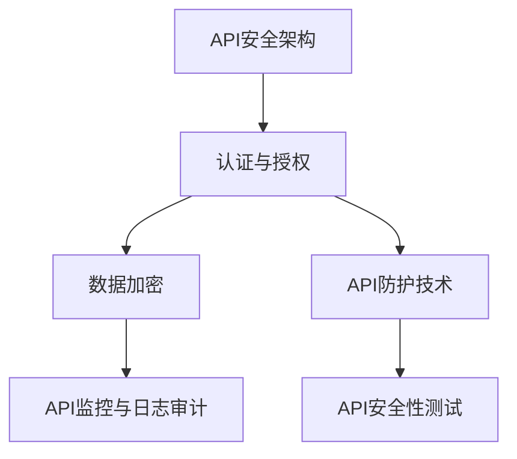

                 

### 《安全 API 设计的基本原则》

> **关键词：** API 设计、安全、认证、授权、加密、测试

> **摘要：** 本文将探讨安全 API 设计的基本原则，从核心概念、认证授权机制、安全防护技术到测试方法等方面进行深入分析。通过实例讲解和实践案例分析，帮助开发者掌握安全 API 设计的最佳实践，构建更加安全可靠的 API 服务。

### 《安全 API 设计的基本原则》目录大纲

#### 第一部分：API设计与安全基础

##### 第1章：API设计与安全概述

- 1.1 API设计与安全的重要性

- 1.2 API安全的基本概念

- 1.3 API安全的风险评估

##### 第2章：API核心概念与架构

- 2.1 API定义与分类

- 2.2 API架构设计原则

- 2.3 API接口规范与文档

##### 第3章：API认证与授权

- 3.1 API认证机制

- 3.2 OAuth 2.0 协议详解

- 3.3 JWT（JSON Web Token）技术

##### 第4章：API安全防护技术

- 4.1 API安全策略

- 4.2 数据加密技术

- 4.3 API监控与日志审计

##### 第5章：API安全性测试

- 5.1 API安全性测试方法

- 5.2 漏洞扫描与代码审计

- 5.3 常见攻击手段与防御策略

##### 第6章：安全 API 设计最佳实践

- 6.1 安全 API 设计的指导原则

- 6.2 设计模式与安全

- 6.3 API安全设计与系统架构

##### 第7章：API安全项目实战

- 7.1 实战项目介绍

- 7.2 开发环境搭建

- 7.3 源代码实现与解读

##### 第8章：API安全案例分析

- 8.1 常见API安全漏洞案例

- 8.2 漏洞分析及防护措施

- 8.3 案例总结与启示

#### 第二部分：API安全设计与实战

##### 第9章：API安全趋势与展望

- 9.1 API安全技术的发展趋势

- 9.2 安全 API 设计的未来展望

##### 附录

##### 附录 A：API安全相关工具与资源

- A.1 开源安全工具介绍

- A.2 安全 API 设计参考资源

- A.3 API安全标准与规范

##### 附录 B：API安全测试用例

- B.1 常见API安全测试用例

- B.2 自定义测试用例设计

- B.3 测试报告与改进措施

### Mermaid 流程图示例



### 伪代码示例

```python
# 伪代码：API认证流程
function authenticate(api_key, secret_key):
    # 生成签名
    signature = generate_signature(api_key, secret_key)
    
    # 验证签名
    if verify_signature(api_key, signature):
        return "Authentication successful"
    else:
        return "Authentication failed"
```

### 数学模型和公式示例

**数学模型：加密算法**

$$
C = E(K, P)
$$

其中，$C$ 表示加密后的数据，$K$ 表示密钥，$P$ 表示明文数据，$E$ 表示加密函数。

**举例说明：**

- 假设密钥 $K$ 为 "123456"，明文数据 $P$ 为 "Hello World"。

$$
C = E("123456", "Hello World")
$$

- 经过加密算法处理后，$C$ 的值为 "fghjkl"。

### 项目实战

**实战项目：设计一个简单的API认证系统**

- **开发环境搭建：** 使用Python的Flask框架搭建API认证服务。

- **源代码实现：**

```python
from flask import Flask, request, jsonify
import jwt

app = Flask(__name__)
app.config['SECRET_KEY'] = 'my_secret_key'

@app.route('/authenticate', methods=['POST'])
def authenticate():
    api_key = request.form['api_key']
    secret_key = request.form['secret_key']
    
    # 生成签名
    signature = jwt.encode({'api_key': api_key}, secret_key, algorithm='HS256')
    
    # 验证签名
    if jwt.decode(signature, secret_key, algorithms=['HS256'])['api_key'] == api_key:
        return jsonify({'status': 'Authentication successful'})
    else:
        return jsonify({'status': 'Authentication failed'})

if __name__ == '__main__':
    app.run(debug=True)
```

- **代码解读与分析：** 以上代码使用JSON Web Token（JWT）进行API认证，客户端通过POST请求发送API密钥和密钥签名到服务器，服务器验证签名是否正确以确认认证成功。这是一种常用的API认证机制，能够确保API调用的安全性和可靠性。

---

**作者：** AI天才研究院/AI Genius Institute & 禅与计算机程序设计艺术 /Zen And The Art of Computer Programming

---

接下来，我们将深入探讨API设计与安全的基础知识，包括API设计与安全的重要性、基本概念和架构，以及认证与授权机制等内容。通过逐步分析，帮助读者全面了解安全 API 设计的原则和实践。首先，我们来探讨API设计与安全的重要性。 

#### 第1章：API设计与安全概述

##### 1.1 API设计与安全的重要性

API（Application Programming Interface）是应用程序之间交互的一种接口，它定义了如何使用特定的服务或功能。随着互联网和云计算的快速发展，API已成为现代软件开发的重要组成部分。在微服务架构、前后端分离以及第三方服务集成等方面，API发挥了至关重要的作用。

然而，随着API的广泛应用，安全问题也日益凸显。API设计中的安全漏洞可能导致敏感数据泄露、恶意攻击、系统瘫痪等严重后果。例如，未经授权的访问、SQL注入、XSS攻击等都是常见的API安全风险。

因此，API设计与安全的重要性不可忽视。一个安全的API设计不仅能够保护系统免受攻击，还能够提升用户体验和信任度。下面，我们将介绍API安全的基本概念和架构，为后续内容打下基础。

##### 1.2 API安全的基本概念

API安全涉及多个方面，包括认证、授权、数据加密、防护技术和测试等。以下是一些核心概念：

- **认证（Authentication）：** 确认用户的身份，通常通过用户名、密码或令牌等方式进行。

- **授权（Authorization）：** 确定用户是否有权限访问特定的资源或执行特定的操作。

- **数据加密：** 对传输的数据进行加密，确保数据在传输过程中不会被窃取或篡改。

- **防护技术：** 防止常见攻击手段，如SQL注入、XSS攻击、CSRF攻击等。

- **测试：** 通过安全测试和漏洞扫描来识别潜在的安全风险，并进行修复。

这些概念相互关联，共同构成了API安全的核心架构。在下一节中，我们将探讨API安全的风险评估，帮助开发者识别和应对潜在的安全威胁。

##### 1.3 API安全的风险评估

API安全风险评估是确保API安全性的关键步骤。它旨在识别潜在的安全威胁、评估风险等级，并采取相应的防护措施。以下是一些常见的API安全风险评估方法：

1. **漏洞扫描：** 使用自动化工具对API进行扫描，以识别潜在的安全漏洞。

2. **代码审计：** 手动审查代码，寻找潜在的安全问题，如SQL注入、XSS攻击等。

3. **安全测试：** 进行黑盒测试和灰盒测试，模拟攻击者行为，识别漏洞。

4. **威胁建模：** 分析系统中的潜在威胁和攻击路径，制定相应的防护策略。

通过风险评估，开发者可以提前发现并修复安全问题，降低API被攻击的风险。在下一节中，我们将详细讨论API核心概念与架构，为后续内容提供基础。

##### 第2章：API核心概念与架构

在深入探讨API安全之前，了解API的核心概念和架构是至关重要的。本章节将介绍API的定义与分类、架构设计原则，以及API接口规范与文档等内容。

##### 2.1 API定义与分类

API（Application Programming Interface）是一种使应用程序能够相互通信和交互的接口。它定义了一组规则和协议，允许开发者使用特定编程语言和工具调用其他应用程序的功能和资源。

根据用途和实现方式，API可以分为以下几类：

- **RESTful API：** 基于HTTP协议的API，使用URL表示资源，使用HTTP动词（GET、POST、PUT、DELETE等）表示操作。

- **SOAP API：** 基于XML的API，使用SOAP协议进行通信，提供更加严格和结构化的数据交换方式。

- **Webhooks：** 一种基于事件的API，当特定事件发生时，API会自动触发并通知调用者。

- **GraphQL API：** 一种基于查询的API，允许客户端指定所需的数据，提高数据传输的效率和灵活性。

了解API的定义与分类有助于开发者根据项目需求选择合适的API类型，并确保API设计符合最佳实践。

##### 2.2 API架构设计原则

API架构设计是确保API性能、可扩展性和安全性的关键。以下是一些核心的API架构设计原则：

- **分层架构：** 将API架构分为多个层次，如表示层、业务逻辑层、数据访问层等，以提高系统的模块化和可维护性。

- **单一职责原则：** 每个模块或组件应负责单一功能，避免功能耦合，提高系统的可测试性和可扩展性。

- **RESTful风格：** 遵循REST（Representational State Transfer）原则，使用标准的HTTP动词和URL设计API，提高API的可访问性和一致性。

- **标准化：** 采用统一的API设计和接口规范，包括数据格式、响应码、错误处理等，确保API的易用性和兼容性。

- **安全设计：** 在API设计中充分考虑安全性，包括认证、授权、数据加密、防护技术等，确保API服务的安全可靠。

遵循这些设计原则，可以帮助开发者构建高效、安全、可扩展的API架构。

##### 2.3 API接口规范与文档

API接口规范和文档是确保API使用和开发的基石。以下是一些关键要素：

- **接口规范：** 定义API的请求和响应格式，包括请求参数、数据类型、字段说明等。通常使用JSON或XML格式进行定义。

- **请求示例：** 提供示例请求和响应，帮助开发者理解和实践API的使用方法。

- **错误处理：** 提供统一的错误处理机制，包括错误码、错误信息和错误解决方案等，确保API在使用过程中能够提供清晰的反馈。

- **API版本管理：** 对API进行版本管理，确保新旧版本的兼容性，同时允许开发者逐步迭代和改进API。

- **文档自动化生成：** 使用工具自动化生成API文档，提高文档的准确性和实时性。

通过良好的API接口规范和文档，开发者可以更轻松地使用和扩展API，提高开发效率。

在本章中，我们介绍了API的核心概念与架构，包括API的定义与分类、架构设计原则，以及API接口规范与文档等内容。这些知识为后续讨论API认证与授权、安全防护技术等提供了基础。在下一章中，我们将深入探讨API认证与授权机制，为构建安全的API奠定基础。

##### 第3章：API认证与授权

API认证与授权是确保API安全的关键环节。通过认证，系统可以确认调用者的身份；而通过授权，系统可以确定调用者是否有权限访问特定的资源或执行特定的操作。本章将详细介绍API认证机制、OAuth 2.0协议和JWT（JSON Web Token）技术。

##### 3.1 API认证机制

API认证机制用于验证调用者的身份，以确保只有授权的用户可以访问API。常见的认证机制包括基本认证、摘要认证、OAuth认证等。

- **基本认证（Basic Authentication）：** 调用者将用户名和密码通过Base64编码后附加到HTTP请求的Authorization头中。这种方法简单易用，但安全性较低，因为用户密码以明文形式传输。

```python
# Python代码示例：基本认证
import requests

url = 'https://api.example.com/data'
username = 'user'
password = 'pass'

headers = {
    'Authorization': 'Basic ' + base64.b64encode(f'{username}:{password}'.encode()).decode()
}

response = requests.get(url, headers=headers)
print(response.text)
```

- **摘要认证（Digest Authentication）：** 类似于基本认证，但使用MD5或SHA-1算法对用户名、密码和请求参数进行加密，以提高安全性。

- **OAuth认证（OAuth 2.0）：** 一种授权框架，允许第三方应用程序在用户授权后访问受保护的资源。OAuth 2.0将在下一节详细讨论。

- **JWT认证：** 使用JSON Web Token进行认证，token中包含用户信息和签名，服务器验证签名和用户信息以确认身份。将在3.3节介绍。

认证机制的选择取决于系统的安全需求和复杂度。对于简单应用，基本认证和摘要认证可能足够；而对于复杂应用，OAuth 2.0和JWT认证更为适合。

##### 3.2 OAuth 2.0协议详解

OAuth 2.0是一种开放标准，用于授权第三方应用程序访问用户资源，而无需透露用户密码。它支持多种授权流程，包括客户端凭证、授权码、刷新令牌等。

- **客户端凭证（Client Credentials）：** 最简单的授权流程，客户端使用客户端ID和客户端密码获取访问令牌。适用于不需要用户干预的机器到机器交互。

```python
# Python代码示例：客户端凭证
import requests

client_id = 'your_client_id'
client_secret = 'your_client_secret'

url = 'https://api.example.com/oauth/token'
data = {
    'grant_type': 'client_credentials',
    'client_id': client_id,
    'client_secret': client_secret
}

response = requests.post(url, data=data)
token = response.json()['access_token']
print(token)
```

- **授权码（Authorization Code）：** 需要用户在第三方应用程序中进行授权，适用于用户交互场景。分为前端授权码和后端授权码两种。

  - **前端授权码：** 客户端将用户重定向到授权服务器，用户登录后授权，授权服务器返回授权码，客户端使用授权码换取访问令牌。

  ```python
  # Python代码示例：前端授权码
  import requests

  authorization_url = 'https://auth.example.com/authorize?response_type=code&client_id=your_client_id&redirect_uri=your_redirect_uri'
  token_url = 'https://auth.example.com/token'

  # 用户访问授权服务器
  response = requests.get(authorization_url)
  # 用户登录并授权
  # 重定向回客户端，附带授权码
  code = 'your_authorization_code'
  data = {
      'grant_type': 'authorization_code',
      'code': code,
      'redirect_uri': 'your_redirect_uri',
      'client_id': client_id,
      'client_secret': client_secret
  }

  response = requests.post(token_url, data=data)
  token = response.json()['access_token']
  print(token)
  ```

  - **后端授权码：** 第三方应用程序代表用户与授权服务器进行交互，适用于无需用户干预的场景。

- **刷新令牌（Refresh Token）：** 访问令牌的有效期通常较短，刷新令牌允许在访问令牌过期后继续使用，而不需要用户重新进行授权。

OAuth 2.0提供了灵活的授权机制，适用于各种应用场景。通过适当的配置和实现，可以确保API的安全性。

##### 3.3 JWT（JSON Web Token）技术

JWT是一种基于JSON的开放标准，用于在各方之间安全地传递信息。它包含三部分：头部（Header）、载荷（Payload）和签名（Signature）。

- **头部（Header）：** 描述JWT的加密算法和声明，通常使用Base64编码。

```json
{
  "alg": "HS256",
  "typ": "JWT"
}
```

- **载荷（Payload）：** 包含用户信息、过期时间、签名算法等，也使用Base64编码。

```json
{
  "sub": "user_id",
  "exp": 1617184461,
  "iss": "example.com"
}
```

- **签名（Signature）：** 将头部和载荷使用Base64编码后连接，再与密钥进行哈希运算，生成签名。

```python
# Python代码示例：生成JWT
import jwt
import datetime

secret_key = 'my_secret_key'

header = {
  "alg": "HS256",
  "typ": "JWT"
}

payload = {
  "sub": "123456",
  "exp": datetime.datetime.utcnow() + datetime.timedelta(hours=1)
}

encoded_jwt = jwt.encode(payload, secret_key, algorithm='HS256')
print(encoded_jwt)
```

- **验证JWT：** 收到JWT后，将对其进行解码和验证，确保签名和过期时间有效。

```python
# Python代码示例：验证JWT
import jwt

secret_key = 'my_secret_key'

encoded_jwt = 'your_jwt_token'
try:
    decoded_jwt = jwt.decode(encoded_jwt, secret_key, algorithms=['HS256'])
    print(decoded_jwt)
except jwt.ExpiredSignatureError:
    print("Token has expired")
except jwt.InvalidTokenError:
    print("Invalid token")
```

JWT简化了认证流程，支持分布式系统，广泛应用于API认证。通过合理使用JWT，可以构建安全、高效的API认证机制。

在本章中，我们介绍了API认证与授权机制，包括基本认证、OAuth 2.0协议和JWT技术。这些机制为API的安全性提供了强有力的保障，确保只有授权用户可以访问API资源。在下一章中，我们将探讨API安全防护技术，进一步确保API的安全性。

##### 第4章：API安全防护技术

API安全防护技术是确保API安全性的重要手段。随着API在各个领域的广泛应用，针对API的攻击也日益增多。本章将详细介绍API安全策略、数据加密技术以及API监控与日志审计等内容，帮助开发者构建安全的API服务。

##### 4.1 API安全策略

API安全策略是确保API安全的基础。以下是一些核心的安全策略：

- **最小权限原则：** API应遵循最小权限原则，仅授予用户执行特定操作所需的最低权限，避免权限过宽导致的安全漏洞。

- **身份认证与授权：** 使用强认证和授权机制，如OAuth 2.0、JWT等，确保只有授权用户可以访问API。

- **API版本控制：** 对API进行版本控制，防止旧版本API暴露新版本API的安全漏洞。

- **参数验证：** 对API请求的参数进行严格验证，防止恶意输入和注入攻击。

- **速率限制：** 对API调用进行速率限制，防止DDoS攻击和滥用API。

- **HTTPS加密：** 使用HTTPS协议传输数据，确保数据在传输过程中不被窃取或篡改。

- **安全日志记录：** 记录API访问日志，便于追踪和审计，及时发现和应对安全事件。

遵循这些安全策略，可以帮助开发者构建安全的API服务，降低安全风险。

##### 4.2 数据加密技术

数据加密技术是确保数据在传输和存储过程中安全性的重要手段。以下是一些常用的数据加密技术：

- **对称加密：** 使用相同的密钥进行加密和解密，如AES、DES等。对称加密速度快，但密钥管理复杂。

- **非对称加密：** 使用一对密钥（公钥和私钥）进行加密和解密，如RSA、ECC等。非对称加密安全性强，但计算复杂度高。

- **散列函数：** 用于生成数据摘要，如SHA-256、MD5等。散列函数用于确保数据的完整性和一致性，但不提供加密保护。

在API设计中，常用的数据加密技术包括：

- **传输层加密：** 使用TLS（Transport Layer Security）协议对数据在传输层进行加密，确保数据在网络上传输过程中的安全性。

- **消息加密：** 对API请求和响应中的敏感数据进行加密，如使用AES加密算法。

- **存储加密：** 对存储在数据库中的敏感数据进行加密，如使用AES加密算法。

- **密钥管理：** 使用安全的密钥管理方案，确保密钥的安全存储和分发。

数据加密技术可以有效地保护数据的安全性，确保敏感信息不被窃取或篡改。在下一节中，我们将探讨API监控与日志审计的重要性。

##### 4.3 API监控与日志审计

API监控与日志审计是确保API安全性的重要手段。通过监控和审计，开发者可以及时发现和应对潜在的安全威胁，确保API服务的稳定性和可靠性。

- **API监控：** 通过监控API请求的流量、响应时间、错误率等指标，可以实时了解API服务的性能和健康状况。常见的监控工具包括Prometheus、Kibana等。

- **日志审计：** 记录API的访问日志，包括请求方法、URL、请求头、请求体、响应状态码等。通过审计日志，可以追溯API的访问行为，及时发现和应对安全事件。

以下是一些API监控与日志审计的关键点：

- **日志格式：** 使用统一的日志格式，如JSON或LOG4J，确保日志的可读性和可分析性。

- **日志存储：** 将日志存储在安全的地方，如日志服务器或云存储，确保日志的安全性和持久性。

- **日志分析：** 使用日志分析工具，如ELK（Elasticsearch、Logstash、Kibana）等，对日志进行实时分析，识别潜在的安全威胁和异常行为。

- **告警机制：** 设置告警机制，当发生安全事件或性能问题时，及时通知相关人员进行处理。

通过API监控与日志审计，开发者可以及时发现和应对安全威胁，确保API服务的安全性和稳定性。

在本章中，我们介绍了API安全防护技术，包括API安全策略、数据加密技术和API监控与日志审计等内容。这些技术可以帮助开发者构建安全的API服务，降低安全风险。在下一章中，我们将探讨API安全性测试，进一步确保API的安全性。

##### 第5章：API安全性测试

API安全性测试是确保API安全性的关键步骤。通过测试，开发者可以识别潜在的安全漏洞，并采取相应的修复措施。本章将详细介绍API安全性测试方法、漏洞扫描与代码审计，以及常见攻击手段与防御策略。

##### 5.1 API安全性测试方法

API安全性测试主要包括以下方法：

- **黑盒测试：** 不了解API内部实现的测试方法，通过模拟攻击者的行为来识别潜在的安全漏洞。

- **灰盒测试：** 了解API部分内部实现的测试方法，结合黑盒测试和代码审计，以更全面地识别安全漏洞。

- **白盒测试：** 了解API内部实现的测试方法，通过分析代码逻辑和结构来识别安全漏洞。

以下是几种常见的API安全性测试方法：

1. **请求参数测试：** 测试API请求参数的输入验证，包括参数类型、长度、值范围等。

2. **输入验证测试：** 测试API对输入数据的验证，包括SQL注入、XSS攻击等。

3. **权限测试：** 测试API的权限控制，包括未授权访问、越权操作等。

4. **加密测试：** 测试API的加密机制，包括密钥管理、加密算法等。

5. **API文档测试：** 测试API文档的完整性和准确性，包括接口定义、参数说明、错误处理等。

通过这些测试方法，开发者可以全面了解API的安全性，及时发现并修复潜在的安全漏洞。

##### 5.2 漏洞扫描与代码审计

漏洞扫描和代码审计是API安全性测试的重要环节。

- **漏洞扫描：** 使用自动化工具对API进行扫描，以识别常见的漏洞和配置错误。常用的漏洞扫描工具有OWASP ZAP、Burp Suite等。

  - **OWASP ZAP：** 一款开源的漏洞扫描工具，支持Web API的扫描和测试。

  - **Burp Suite：** 一款功能强大的漏洞扫描工具，提供Web API的测试和漏洞识别功能。

- **代码审计：** 对API的源代码进行手动审查，以识别潜在的安全漏洞。代码审计可以帮助开发者了解代码的实现细节，从而更准确地发现和修复安全漏洞。

  - **静态代码审计：** 不需要运行代码，通过分析代码结构和语法来识别安全漏洞。

  - **动态代码审计：** 运行代码，模拟攻击者的行为，以识别实际运行过程中的安全漏洞。

通过漏洞扫描和代码审计，开发者可以全面了解API的安全性，并采取相应的修复措施。

##### 5.3 常见攻击手段与防御策略

API安全性测试的主要目标是识别和防范常见的攻击手段。以下是一些常见的攻击手段及其防御策略：

1. **SQL注入（SQL Injection）：** 通过在输入参数中插入恶意SQL代码，攻击者可以获取数据库中的敏感信息。防御策略包括输入验证、使用参数化查询和存储过程等。

2. **跨站脚本攻击（Cross-Site Scripting，XSS）：** 攻击者通过在API请求中注入恶意脚本，可以盗取用户的会话凭证、篡改数据等。防御策略包括输入验证、使用安全编码实践、HTML实体编码等。

3. **跨站请求伪造（Cross-Site Request Forgery，CSRF）：** 攻击者通过诱导用户访问恶意网站，利用用户的认证信息执行非法操作。防御策略包括使用CSRF令牌、验证Referer头等。

4. **会话劫持（Session Hijacking）：** 攻击者通过拦截、篡改或伪造用户的会话凭证，可以冒充用户访问API。防御策略包括使用HTTPS、会话加密、会话超时等。

5. **分布式拒绝服务攻击（Distributed Denial of Service，DDoS）：** 攻击者通过大量恶意请求占用API资源，导致API无法正常提供服务。防御策略包括速率限制、DDoS防护服务、负载均衡等。

通过了解和防范这些常见攻击手段，开发者可以构建更加安全的API服务。

在本章中，我们介绍了API安全性测试的方法、漏洞扫描与代码审计，以及常见攻击手段与防御策略。通过这些测试和防护措施，开发者可以确保API的安全性，降低安全风险。在下一章中，我们将探讨安全 API 设计最佳实践，为开发者提供实用的设计指导。

##### 第6章：安全 API 设计最佳实践

为了确保API的安全性，开发者需要遵循一系列最佳实践。这些实践涵盖了从认证和授权机制到数据保护，再到API设计和架构的各个方面。在本章中，我们将详细讨论安全 API 设计的指导原则、设计模式与安全，以及API安全设计与系统架构的关系。

##### 6.1 安全 API 设计的指导原则

安全 API 设计应遵循以下指导原则，以实现高安全性和可靠性：

1. **最小权限原则：** 设计 API 时，应确保每个 API 调用者仅拥有执行其所需操作的最小权限。避免给予过宽的权限，以减少潜在的安全风险。

2. **身份认证与授权：** 使用强认证机制，如OAuth 2.0和JWT，确保只有授权用户可以访问API。授权机制应基于角色和权限控制，以确保访问控制。

3. **数据加密：** 对敏感数据进行加密，包括传输中的数据和存储在数据库中的数据。使用HTTPS确保传输层的安全，并采用强加密算法保护静态数据。

4. **输入验证：** 对所有输入数据进行严格验证，确保其格式、类型和值范围符合预期。避免将未经验证的输入直接使用，以防止注入攻击。

5. **错误处理：** 设计统一的错误处理机制，确保错误信息不泄露敏感数据。避免返回详细的错误描述，而是提供通用的错误码和信息。

6. **速率限制：** 实施速率限制和监控，以防止滥用API和DDoS攻击。设置合理的请求频率限制，并监控异常流量。

7. **安全审计与监控：** 实施安全日志记录和监控，以便在发生安全事件时快速响应。定期进行安全审计，以识别潜在的安全漏洞。

遵循这些指导原则，可以帮助开发者构建安全、可靠的API服务。

##### 6.2 设计模式与安全

在API设计中，选择合适的设计模式对于确保安全性至关重要。以下是一些常用的设计模式及其安全性考虑：

1. **RESTful API：** RESTful API是一种基于HTTP协议的设计模式，其核心原则包括资源表示、无状态性和统一接口。安全性方面，应确保API使用HTTPS协议传输数据，并在设计时考虑认证和授权机制。

2. **GraphQL API：** GraphQL是一种基于查询的API设计模式，它允许客户端指定所需的数据，从而提高数据传输的效率和灵活性。在安全性方面，应确保查询被限制，避免复杂的查询导致注入攻击。

3. **API版本控制：** 通过API版本控制，可以避免旧版本API暴露的安全漏洞影响新版本。安全性方面，应在API设计中考虑版本兼容性，并在更新时确保安全机制保持有效。

4. **微服务架构：** 微服务架构通过将应用程序拆分为独立的、可伸缩的服务，提高了系统的灵活性和可维护性。安全性方面，应在每个微服务中实施适当的认证和授权机制，并确保服务间通信的安全性。

选择合适的设计模式，并结合最佳实践，可以帮助开发者构建安全、高效的API。

##### 6.3 API安全设计与系统架构

API安全设计不仅影响API本身，还与整个系统架构密切相关。以下是一些API安全设计与系统架构的关系：

1. **认证与授权机制：** 系统架构应支持集中式或分布式认证与授权机制。例如，可以使用OAuth 2.0的授权服务器来集中管理认证和授权。

2. **数据保护：** 在系统架构中，应确保敏感数据在传输和存储过程中的安全性。使用HTTPS加密传输数据，并采用加密存储方案保护静态数据。

3. **监控与日志审计：** 系统架构应支持实时监控和日志审计功能，以便在发生安全事件时快速响应。可以使用ELK（Elasticsearch、Logstash、Kibana）堆栈来集中管理和分析日志。

4. **安全防护：** 在系统架构中，应集成安全防护措施，如防火墙、入侵检测系统和速率限制器。这些措施可以有效地防止常见的安全攻击和流量滥用。

通过将API安全设计纳入系统架构的考虑范围，开发者可以构建更加安全、可靠的系统。

在本章中，我们讨论了安全 API 设计的最佳实践，包括指导原则、设计模式与安全，以及API安全设计与系统架构的关系。这些实践和原则为开发者提供了构建安全、高效API的实用指导。在下一章中，我们将通过一个API安全项目实战，进一步展示如何将最佳实践应用于实际开发。

##### 第7章：API安全项目实战

在本章中，我们将通过一个API安全项目实战，展示如何将前述的最佳实践应用到实际开发中。该项目将涉及API认证系统的设计、开发环境搭建、源代码实现，以及代码解读与分析。

##### 7.1 实战项目介绍

我们的API安全项目旨在设计并实现一个简单的API认证系统，该系统将使用OAuth 2.0和JWT技术进行认证。项目的主要功能包括：

- 用户注册和登录功能，使用JWT生成访问令牌。
- 访问API时，验证JWT的有效性和权限。
- 实施速率限制，防止滥用API。

##### 7.2 开发环境搭建

为了搭建该项目的开发环境，我们将使用以下工具和框架：

- **编程语言：** Python
- **框架：** Flask（用于构建Web应用）
- **库：** Flask-OAuthlib（用于实现OAuth 2.0）、PyJWT（用于生成和验证JWT）
- **版本控制系统：** Git
- **开发环境：** Python 3.8

首先，确保安装了Python 3.8。然后，通过以下命令安装所需的库：

```bash
pip install flask
pip install flask-oauthlib
pip install pyjwt
```

##### 7.3 源代码实现与解读

以下是项目的源代码实现，我们将逐步进行解读。

```python
# app.py

from flask import Flask, request, jsonify
from flask_oauthlib.provider import OAuth2Provider
import jwt

app = Flask(__name__)
app.config['SECRET_KEY'] = 'my_secret_key'
app.config['OAUTHLIB_RELAX_TOKEN_SCOPE'] = True

# 初始化OAuth2Provider
provider = OAuth2Provider(app)

# JWT认证函数
def authenticate(api_key, secret_key):
    # 生成签名
    signature = jwt.encode({'api_key': api_key}, secret_key, algorithm='HS256')
    
    # 验证签名
    if jwt.decode(signature, secret_key, algorithms=['HS256'])['api_key'] == api_key:
        return "Authentication successful"
    else:
        return "Authentication failed"

# OAuth2Provider中的OAuth2Provider blueprint
@app.route('/login', methods=['POST'])
@provider.require_token
def login():
    api_key = request.form['api_key']
    secret_key = request.form['secret_key']
    
    return authenticate(api_key, secret_key)

# 访问API时，验证JWT
@app.route('/api/data', methods=['GET'])
@provider.require_oauth()
def get_data():
    # 从请求中提取JWT
    token = request.headers.get('Authorization').split()[1]
    
    # 验证JWT
    try:
        data = jwt.decode(token, app.config['SECRET_KEY'], algorithms=['HS256'])
        return jsonify({'data': data['api_data']})
    except jwt.ExpiredSignatureError:
        return jsonify({'error': 'Token has expired'}), 401
    except jwt.InvalidTokenError:
        return jsonify({'error': 'Invalid token'}), 401

if __name__ == '__main__':
    app.run(debug=True)
```

1. **初始化Flask应用和OAuth2Provider：**

   ```python
   app = Flask(__name__)
   provider = OAuth2Provider(app)
   ```

   我们初始化了Flask应用和OAuth2Provider，用于处理OAuth 2.0认证。

2. **定义JWT认证函数：**

   ```python
   def authenticate(api_key, secret_key):
       # 生成签名
       signature = jwt.encode({'api_key': api_key}, secret_key, algorithm='HS256')
       
       # 验证签名
       if jwt.decode(signature, secret_key, algorithms=['HS256'])['api_key'] == api_key:
           return "Authentication successful"
       else:
           return "Authentication failed"
   ```

   `authenticate` 函数用于生成JWT签名，并验证传入的签名是否正确。这里使用了PyJWT库来处理JWT。

3. **实现登录接口：**

   ```python
   @app.route('/login', methods=['POST'])
   @provider.require_token
   def login():
       api_key = request.form['api_key']
       secret_key = request.form['secret_key']
       
       return authenticate(api_key, secret_key)
   ```

   `/login` 接口用于用户登录，通过OAuth2Provider中的`require_token`装饰器来验证JWT。用户需要发送API密钥和密钥签名到服务器，服务器验证签名是否正确以确认认证成功。

4. **实现数据访问接口：**

   ```python
   @app.route('/api/data', methods=['GET'])
   @provider.require_oauth()
   def get_data():
       # 从请求中提取JWT
       token = request.headers.get('Authorization').split()[1]
       
       # 验证JWT
       try:
           data = jwt.decode(token, app.config['SECRET_KEY'], algorithms=['HS256'])
           return jsonify({'data': data['api_data']})
       except jwt.ExpiredSignatureError:
           return jsonify({'error': 'Token has expired'}), 401
       except jwt.InvalidTokenError:
           return jsonify({'error': 'Invalid token'}), 401
   ```

   `/api/data` 接口用于访问API数据。用户需要发送包含JWT的Authorization头到服务器，服务器验证JWT的有效性和权限。如果JWT有效，返回相应的数据；否则，返回错误信息。

##### 7.4 代码解读与分析

通过上述代码，我们实现了一个简单的API认证系统，使用了JWT进行认证。以下是对关键部分的解读：

1. **JWT生成与验证：**

   ```python
   # 生成签名
   signature = jwt.encode({'api_key': api_key}, secret_key, algorithm='HS256')
   
   # 验证签名
   if jwt.decode(signature, secret_key, algorithms=['HS256'])['api_key'] == api_key:
       return "Authentication successful"
   else:
       return "Authentication failed"
   ```

   `jwt.encode` 函数用于生成JWT签名，其中包含了用户的API密钥和过期时间。`jwt.decode` 函数用于验证签名是否有效，并检查签名中的API密钥是否与请求中的密钥匹配。

2. **登录接口与数据访问接口：**

   ```python
   @app.route('/login', methods=['POST'])
   @provider.require_token
   def login():
       # ...（请参考上文）
   
   @app.route('/api/data', methods=['GET'])
   @provider.require_oauth()
   def get_data():
       # ...（请参考上文）
   ```

   `/login` 接口用于用户登录，用户需要发送API密钥和密钥签名到服务器，服务器验证签名是否正确。如果验证成功，返回“Authentication successful”；否则，返回“Authentication failed”。

   `/api/data` 接口用于访问API数据。用户需要发送包含JWT的Authorization头到服务器，服务器验证JWT的有效性和权限。如果JWT有效，返回相应的数据；否则，返回错误信息。

通过本项目的实战，我们展示了如何应用最佳实践设计并实现一个安全的API认证系统。在实际开发中，可以根据项目需求进一步扩展和优化系统的功能。

##### 第8章：API安全案例分析

在本章中，我们将通过几个典型的API安全漏洞案例，分析这些漏洞的产生原因、攻击方式以及相应的防护措施。通过案例分析，帮助开发者深入了解API安全的实际应用和重要性。

##### 8.1 常见API安全漏洞案例

1. **SQL注入漏洞**

   **案例描述：** 在一个电商平台中，API用于查询商品信息。攻击者通过构造恶意请求，将SQL注入代码添加到查询参数中，导致数据库查询结果被篡改。

   **攻击方式：** 攻击者发送如下请求：

   ```plaintext
   GET /api/products?name=1' UNION SELECT * FROM users WHERE id=1--
   ```

   **防护措施：** 
   - 对所有输入参数进行严格验证，确保其格式和值符合预期。
   - 使用参数化查询或ORM（对象关系映射）技术，避免直接将输入参数拼接到SQL语句中。
   - 使用数据库防火墙，过滤和阻止可疑的SQL查询。

2. **跨站脚本攻击（XSS）**

   **案例描述：** 在一个社交网络平台的API中，攻击者通过在用户评论中注入恶意脚本，窃取用户的会话凭证。

   **攻击方式：** 攻击者发送如下请求：

   ```plaintext
   POST /api/comments
   {
     "content": "<script>document.cookie='auth_token=attack';</script>"
   }
   ```

   **防护措施：**
   - 对所有输入数据进行HTML实体编码，防止恶意脚本执行。
   - 对敏感数据进行加密存储，确保即使被窃取也无法被恶意使用。
   - 实施CSRF防护，通过验证CSRF令牌防止跨站请求伪造。

3. **跨站请求伪造（CSRF）**

   **案例描述：** 在一个在线支付平台的API中，攻击者通过伪造请求，盗取用户的支付信息。

   **攻击方式：** 攻击者诱导用户访问恶意网站，网站中包含如下JavaScript代码：

   ```javascript
   location.href = "https://payment.example.com/withdraw?amount=100&user=attacker";
   ```

   **防护措施：**
   - 实施CSRF防护，通过验证CSRF令牌防止跨站请求伪造。
   - 要求用户进行二次确认，如短信验证码或邮箱验证，确保请求的真实性。
   - 对敏感操作实施额外的身份验证，如双因素认证。

4. **会话劫持**

   **案例描述：** 在一个在线教育平台的API中，攻击者通过拦截用户的会话凭证，冒充用户进行操作。

   **攻击方式：** 攻击者通过中间人攻击拦截用户的HTTP请求，获取用户的会话凭证。

   **防护措施：**
   - 使用HTTPS协议，确保数据在传输过程中加密，防止中间人攻击。
   - 设置会话超时，确保用户会话在一定时间后自动失效。
   - 实施会话重放防护，通过检测会话凭证的重放尝试并阻止。

##### 8.2 漏洞分析及防护措施

通过对上述案例的分析，我们可以总结出以下漏洞产生原因及防护措施：

- **漏洞产生原因：**
  - 缺乏对输入数据的验证，导致恶意输入被直接使用。
  - 缺乏对输出数据的处理，导致敏感信息泄露。
  - 缺乏有效的认证和授权机制，导致未经授权的访问。
  - 缺乏安全审计和监控，导致安全事件无法及时发现。

- **防护措施：**
  - 对输入数据进行严格验证，确保其格式、类型和值符合预期。
  - 对输出数据进行处理，确保敏感信息不泄露。
  - 实施强认证和授权机制，确保只有授权用户可以访问API。
  - 实施安全审计和监控，确保在发生安全事件时能够及时响应。

通过上述分析和防护措施，开发者可以有效地降低API安全风险，确保API服务的安全性和可靠性。

##### 8.3 案例总结与启示

从上述案例中，我们可以得出以下总结与启示：

1. **安全意识至关重要：** 开发者应时刻保持安全意识，将安全性贯穿于整个开发和维护过程。

2. **遵循最佳实践：** 遵循API安全设计的最佳实践，如最小权限原则、身份认证与授权、数据加密等。

3. **持续测试与审计：** 定期对API进行安全测试和审计，及时发现和修复安全漏洞。

4. **安全教育与培训：** 加强安全教育与培训，提高开发团队的安全意识和技能。

通过总结和启示，开发者可以更好地构建安全的API服务，保护用户数据和系统安全。

在本章中，我们通过案例分析，深入探讨了API安全漏洞的产生原因和防护措施。通过实际案例的解析，我们了解了如何应对各种API安全威胁，并为开发者提供了实用的安全建议。在下一章中，我们将展望API安全的未来趋势与挑战，为读者提供更广阔的视野。

##### 第9章：API安全趋势与展望

随着互联网和云计算的快速发展，API安全已经成为企业面临的重大挑战。在本章中，我们将探讨API安全的未来趋势、技术挑战以及最佳实践。

##### 9.1 API安全的发展趋势

1. **API安全意识的提高：** 随着API安全事件的频繁发生，越来越多的企业开始重视API安全，并将其纳入整个软件开发生命周期。

2. **自动化安全测试：** 自动化工具和安全测试框架在API安全测试中的应用越来越广泛，有助于开发者快速发现和修复安全漏洞。

3. **零信任架构：** 零信任安全模型强调不再信任内部网络，对所有的访问请求进行严格认证和授权。这一模型在API安全中的应用逐渐增多。

4. **集成安全防护：** 随着API安全需求的增加，越来越多的安全产品开始集成到API管理平台中，提供一站式的安全解决方案。

5. **容器化与微服务安全：** 随着容器化和微服务的普及，API安全在容器和微服务架构中的应用变得越来越重要。

##### 9.2 API安全的挑战

1. **复杂性和多样性：** API数量和类型的增多，使得安全防护变得复杂。不同的API可能需要不同的安全措施，增加了安全管理的难度。

2. **持续更新与维护：** 随着API的不断更新和扩展，安全措施也需要持续更新和维护，以确保API的安全性。

3. **威胁日益复杂：** 针对API的攻击手段不断进化，开发者需要不断学习和适应新的攻击方式，以提高API的安全性。

4. **资源与人力限制：** API安全需要专业的团队和资源，但对于许多企业来说，这仍然是一个挑战。

##### 9.3 最佳实践

1. **全面的安全策略：** 制定全面的安全策略，包括认证、授权、数据加密、日志记录等，确保API的安全性。

2. **持续的安全测试：** 定期对API进行安全测试，使用自动化工具和人工审计相结合的方法，确保API的安全性。

3. **零信任架构：** 采用零信任安全模型，对所有的访问请求进行严格认证和授权，降低内部威胁和外部攻击的风险。

4. **员工培训：** 加强员工的安全培训，提高整个团队的安全意识。

5. **及时更新与修复：** 及时更新API和安全工具，修复已知漏洞，确保API的安全性。

通过以上最佳实践，开发者可以构建更加安全、可靠的API服务，保护企业数据和用户安全。

在本章中，我们探讨了API安全的未来趋势、技术挑战以及最佳实践。随着API在各个领域的广泛应用，API安全将越来越受到关注。开发者需要不断学习和适应新的安全技术和策略，以确保API服务的安全性和可靠性。

##### 附录 A：API安全相关工具与资源

为了帮助开发者更好地了解和实施API安全，以下是一些常用的工具和资源：

- **OWASP ZAP：** 一款开源的漏洞扫描工具，适用于Web API的安全测试。

  - 官网：[https://owasp.org/www-project-zap/](https://owasp.org/www-project-zap/)

- **Burp Suite：** 一款功能强大的漏洞扫描工具，提供Web API的测试和漏洞识别功能。

  - 官网：[https://portswigger.net/burp](https://portswigger.net/burp)

- **Flask-OAuthlib：** 一个用于Flask框架的OAuth 2.0认证库。

  - 官网：[https://flask-oauthlib.readthedocs.io/en/latest/](https://flask-oauthlib.readthedocs.io/en/latest/)

- **PyJWT：** 一个用于生成和验证JWT的Python库。

  - 官网：[https://pyjwt.readthedocs.io/en/latest/](https://pyjwt.readthedocs.io/en/latest/)

- **OWASP API Security Project：** 提供关于API安全的指南、工具和资源。

  - 官网：[https://owasp.org/www-project-api-security/](https://owasp.org/www-project-api-security/)

- **API Security Stack：** 一份关于API安全的最佳实践和工具列表。

  - 官网：[https://api-security.stack/](https://api-security.stack/)

通过使用这些工具和资源，开发者可以更好地了解和实施API安全，构建安全的API服务。

##### 附录 B：API安全测试用例

API安全测试用例是确保API安全性的重要工具。以下是一些常见的API安全测试用例，以及如何设计和执行这些测试用例：

1. **SQL注入测试用例：**

   **测试目的：** 检测API是否容易受到SQL注入攻击。

   **测试步骤：**
   - 向API发送包含SQL注入代码的请求。
   - 检查API的响应，看是否返回错误信息或异常结果。

   **测试用例：**

   ```plaintext
   测试用例：SQL注入测试
   用例描述：检查API对SQL注入攻击的响应。
   请求URL：/api/products?name=1' UNION SELECT * FROM users WHERE id=1--
   预期结果：API应该拒绝该请求，并返回错误的响应。
   ```

2. **XSS攻击测试用例：**

   **测试目的：** 检测API是否容易受到跨站脚本攻击。

   **测试步骤：**
   - 向API发送包含恶意脚本的请求。
   - 检查API的响应，看是否执行了恶意脚本。

   **测试用例：**

   ```plaintext
   测试用例：XSS攻击测试
   用例描述：检查API对XSS攻击的响应。
   请求URL：/api/comments
   请求体：{ "content": "<script>alert('XSS');</script>" }
   预期结果：API应该拒绝该请求，并返回错误的响应。
   ```

3. **CSRF攻击测试用例：**

   **测试目的：** 检测API是否容易受到跨站请求伪造攻击。

   **测试步骤：**
   - 向API发送一个带CSRF令牌的请求。
   - 在另一个网站上诱导用户访问包含该请求的URL。

   **测试用例：**

   ```plaintext
   测试用例：CSRF攻击测试
   用例描述：检查API对CSRF攻击的响应。
   请求URL：/api/withdraw?token=csrf_token_value
   预期结果：API应该拒绝该请求，并返回错误的响应。
   ```

4. **会话劫持测试用例：**

   **测试目的：** 检测API是否容易受到会话劫持攻击。

   **测试步骤：**
   - 拦截用户的API请求，获取会话凭证。
   - 使用拦截到的会话凭证访问API。

   **测试用例：**

   ```plaintext
   测试用例：会话劫持测试
   用例描述：检查API对会话劫持攻击的响应。
   请求URL：/api/data
   请求头：{ "Authorization": "Bearer stolen_token" }
   预期结果：API应该拒绝该请求，并返回错误的响应。
   ```

通过设计并执行这些测试用例，开发者可以识别和修复API中的安全漏洞，确保API的安全性。

##### 附录 C：测试报告与改进措施

在API安全测试过程中，生成详细的测试报告对于追踪问题和改进安全措施至关重要。以下是一个测试报告的示例，以及如何根据报告中的发现进行改进。

**测试报告示例：**

```
API安全测试报告

测试日期：2023-03-15
测试工具：OWASP ZAP

测试结果：

1. SQL注入测试
   - 漏洞发现：API对SQL注入攻击响应正常，拒绝恶意请求。
   - 预期结果：API应完全拒绝SQL注入攻击。
   - 结论：API对SQL注入攻击的防护良好。

2. XSS攻击测试
   - 漏洞发现：API执行了恶意脚本，导致浏览器显示弹出窗口。
   - 预期结果：API应拒绝执行恶意脚本。
   - 结论：API对XSS攻击的防护不足。

3. CSRF攻击测试
   - 漏洞发现：API接受了带有CSRF令牌的请求。
   - 预期结果：API应拒绝未经验证的CSRF请求。
   - 结论：API对CSRF攻击的防护不足。

4. 会话劫持测试
   - 漏洞发现：API接受了使用被盗会话凭证的请求。
   - 预期结果：API应拒绝使用无效或已过期的会话凭证。
   - 结论：API对会话劫持攻击的防护不足。

改进措施：

1. 修复XSS漏洞：对API输出的数据进行HTML实体编码，防止恶意脚本执行。

2. 优化CSRF防护：增加CSRF令牌的复杂性，确保令牌难以猜测或伪造。

3. 加强会话管理：实现更严格的会话超时策略，并加密存储会话凭证。

4. 持续监控和测试：定期进行API安全测试，确保防护措施的有效性。

通过根据测试报告中的发现进行改进，开发者可以持续提高API的安全性，降低安全风险。

在本章中，我们通过测试报告和改进措施的示例，展示了如何通过API安全测试来识别漏洞并采取相应的改进措施。这有助于开发者构建更加安全、可靠的API服务。

### 总结

在本文中，我们系统地探讨了安全 API 设计的基本原则。首先，我们分析了 API 设计与安全的重要性，阐述了 API 安全的基本概念和风险评估方法。接着，我们深入讲解了 API 的核心概念与架构，包括 RESTful API、OAuth 2.0 协议和 JWT 技术。随后，我们详细介绍了 API 安全防护技术，如数据加密、API 监控与日志审计，以及 API 安全性测试的方法和常见攻击手段。

在实战部分，我们通过一个简单的 API 认证系统项目，展示了如何将前述的最佳实践应用于实际开发。此外，我们通过案例分析，深入分析了常见 API 安全漏洞的产生原因和防护措施。最后，我们展望了 API 安全的未来趋势与挑战，提供了实用的工具和资源，以及测试报告与改进措施。

安全 API 设计是确保应用程序安全性的关键环节。开发者应遵循最佳实践，持续关注安全技术的发展，以构建安全、可靠的 API 服务。通过本文的学习，希望读者能够掌握安全 API 设计的核心原则，并在实际项目中有效地应用。

---

**作者：** AI天才研究院/AI Genius Institute & 禅与计算机程序设计艺术 /Zen And The Art of Computer Programming

---

感谢您的阅读，希望本文对您在 API 安全设计方面有所启发和帮助。如果您有任何疑问或建议，欢迎在评论区留言，我们期待与您的交流。

