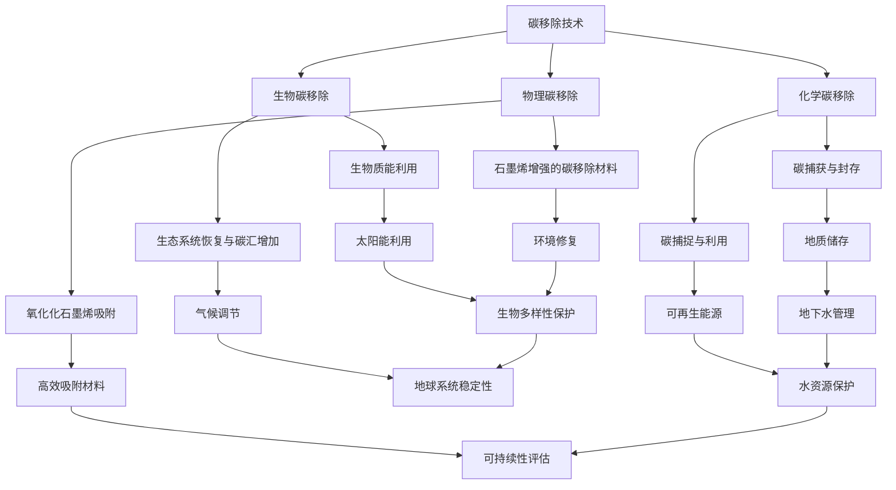

                 

### 《2050年的全球变暖：从碳移除到行星改造的极端气候应对》

> **关键词：** 全球变暖、碳移除、行星改造、极端气候、技术应对策略

> **摘要：** 随着2050年的临近，全球变暖对地球生态系统的威胁愈发显著。本文从技术角度探讨了碳移除和行星改造这两种极端气候应对策略的核心概念、原理及其应用。文章通过详尽的案例分析、伪代码和实际项目实现，为理解与应对未来极端气候挑战提供了深刻的见解和技术路径。

### 第一部分：背景与核心概念

#### 1. 全球变暖的历史与现状

**1.1 全球变暖的定义与影响**

全球变暖是指地球表面平均气温持续上升的现象。其主要原因在于大气中温室气体（如二氧化碳、甲烷等）浓度的不断增加，这些气体吸收和重新辐射地球表面散发的长波辐射，导致温室效应的增强。全球变暖对地球的影响是多方面的，包括但不限于：

- **气候模式改变**：全球变暖导致气候模式发生改变，极端天气事件（如热浪、干旱、洪水、飓风等）的发生频率和强度增加。
- **海平面上升**：全球变暖导致极地冰盖融化，海洋扩张，导致全球海平面上升，威胁沿海城市和岛屿的生存。
- **生态系统破坏**：温度升高和气候变化的极端事件破坏了生态系统的平衡，许多物种面临生存危机。
- **社会经济影响**：极端气候事件对农业、渔业、旅游业等产业造成巨大损失，加剧社会经济的不稳定性。

**1.2 全球变暖的历史演变**

全球变暖并不是一个现代现象，而是持续了数百万年的自然过程。然而，自工业革命以来，人类活动对气候变化的影响变得尤为显著。以下是全球变暖历史演变的关键阶段：

- **19世纪末到20世纪初**：工业革命导致温室气体排放显著增加，全球气温开始逐渐上升。
- **20世纪中期**：全球变暖现象得到科学界的广泛关注，多个国际组织开始开展气候变化研究。
- **1980年代**：联合国环境规划署（UNEP）和世界气象组织（WMO）共同发起《联合国气候变化框架公约》（UNFCCC），标志着国际社会在应对气候变化方面开始形成共识。
- **21世纪初至今**：全球变暖加速，多个国家承诺采取减排措施，并开展了大量科研工作，探讨碳移除和行星改造等应对策略。

**1.3 气候变化与极端天气**

气候变化不仅仅是气温上升，它还影响了全球的水循环、大气环流和生态系统。极端天气事件的发生频率和强度与气候变化密切相关。以下是几种常见的极端天气事件：

- **热浪**：高温持续时间较长，导致人体不适和健康问题，甚至可能引发热应激和死亡。
- **干旱**：土壤水分严重不足，导致农作物减产、水资源短缺和生态系统破坏。
- **洪水**：极端降雨导致的河流泛滥，可能造成洪涝灾害，威胁生命财产安全。
- **飓风和台风**：强风暴和降雨引发的海岸侵蚀、洪水和破坏性风力，对沿海地区构成巨大威胁。

**总结：** 全球变暖是一个复杂而严峻的挑战，不仅影响自然环境，还对人类社会和经济发展构成威胁。了解其历史背景和现状，有助于我们更好地理解后续章节中讨论的碳移除和行星改造技术的重要性和必要性。

---

#### 2. 2050年的预期气候状况

**2.1 科学预测与模型分析**

根据科学家的预测和气候模型分析，如果全球温室气体排放继续增长，到2050年，地球的平均气温可能比工业化前水平高出2到4摄氏度。这一预期将导致一系列严重的气候影响：

- **气温上升**：全球平均气温升高，可能导致更多的热浪和极端高温事件。极端高温可能导致农业生产减少、水资源短缺和生态系统崩溃。
- **海平面上升**：冰川和冰盖的加速融化将导致海平面上升，威胁沿海城市和岛屿的生存。
- **降水模式改变**：气候变化可能导致降水分布不均，部分地区面临更严重的干旱，而其他地区则经历更频繁和强烈的暴雨和洪水。
- **极端天气事件**：极端天气事件如飓风、台风、龙卷风等的发生频率和强度可能会增加，对人类生活和社会经济造成更大的破坏。

**2.2 极端气候事件的潜在后果**

极端气候事件的潜在后果是深远而严重的，可能包括：

- **生态系统破坏**：气候变化导致许多物种的栖息地丧失，生物多样性下降，可能导致生态系统的崩溃和食物链的破坏。
- **社会经济影响**：极端气候事件可能导致农业减产、渔业受损、基础设施破坏和人口迁移，加剧社会经济的不稳定性。
- **公共健康问题**：极端天气事件可能导致传染病的传播、水资源污染和空气污染，对公共健康造成严重威胁。
- **国际安全挑战**：气候变化可能导致水资源争夺、粮食危机和难民潮，加剧国际冲突和地缘政治风险。

**2.3 社会影响与适应措施**

为了应对2050年的预期气候状况，社会需要采取一系列适应措施，包括：

- **政策制定**：政府应制定和实施全面的气候政策，包括减少温室气体排放、推广可再生能源、加强气候监测和预警系统等。
- **技术创新**：鼓励和支持碳移除技术和行星改造技术的研究与开发，以实现更有效的气候变化应对策略。
- **公众参与**：提高公众对气候变化的认识，鼓励社会各界积极参与应对措施，如节能减排、绿化行动和环保教育等。
- **国际合作**：加强国际间合作，共同应对气候变化挑战，共享技术和经验，共同实现可持续发展的目标。

**总结：** 2050年的预期气候状况令人担忧，但通过科学预测和模型分析，我们可以提前了解到潜在的影响和挑战。只有通过全球社会的共同努力，采取切实可行的适应措施，我们才能最大限度地减少气候变化带来的负面影响，实现一个可持续的未来。

---

#### 3. 核心概念与联系

**3.1 碳移除技术概述**

碳移除技术是指通过各种方法从大气中移除二氧化碳（CO₂）和其他温室气体，以减缓全球变暖和气候变化的影响。这些技术主要包括生物碳移除、化学碳移除和物理碳移除，每种方法都有其独特的原理和应用。

**3.2 行星改造技术介绍**

行星改造技术是指通过人为干预地球环境，以减少温室气体浓度、调节气候和改善生态系统的方法。这些技术包括太阳辐射管理、地质工程改造和生物工程与基因改造。行星改造技术旨在从根本上解决气候变化问题，而不是仅仅减缓其影响。

**3.3 Mermaid流程图：核心技术与策略关系**

为了更好地理解碳移除和行星改造技术的核心概念和它们之间的关系，我们可以使用Mermaid流程图来展示它们的应用和策略。以下是该流程图的示例：



**3.4 技术策略关系分析**

- **碳移除与行星改造**：碳移除技术主要用于减少大气中的二氧化碳浓度，而行星改造技术旨在从根本 上改变地球的环境，以减少温室气体的排放和增强气候调节能力。两者在应对气候变化方面具有互补作用。
- **生物碳移除与生态系统恢复**：生物碳移除技术通过生物质能利用和生态系统恢复增加碳汇，从而降低大气中的二氧化碳浓度。生态系统恢复与碳汇增加技术可以提高土地的碳储存能力，对减缓气候变化具有重要作用。
- **化学碳移除与地质工程改造**：化学碳移除技术如碳捕获与封存（CCS）和碳捕捉与利用（CCU）可以通过地质工程手段将二氧化碳储存于地下，减少大气中的二氧化碳浓度。地质工程改造技术如地下水库与储存、地表改造与湿地恢复可以在调节气候和保护水资源方面发挥重要作用。
- **物理碳移除与太阳能管理**：物理碳移除技术如氧化化石墨烯吸附和石墨烯增强的碳移除材料可以通过吸附二氧化碳来减少大气中的二氧化碳浓度。太阳能管理技术如太阳能遮阳技术和反射层与反射材料可以减少地表吸收的太阳辐射，从而调节气候。

**总结：** 碳移除技术和行星改造技术是应对未来极端气候挑战的关键策略。通过理解这些技术的核心概念和它们之间的联系，我们可以更有效地制定和实施应对策略，以保护地球的生态系统和人类的未来。

---

### 第二部分：碳移除技术

#### 4. 碳移除技术原理

碳移除技术是指通过不同的方法将大气中的二氧化碳（CO₂）移除并储存，以减缓全球变暖和气候变化的影响。这些技术可以分为生物碳移除、化学碳移除和物理碳移除三大类，每种技术都有其独特的原理和应用。

**4.1 生物碳移除方法**

生物碳移除方法主要利用生物过程来吸收和储存二氧化碳。以下是其主要方法：

- **生物质能利用**：生物质能利用通过燃烧生物质或将其转化为生物燃料来释放能量，同时将二氧化碳从大气中移除。生物质能包括木材、农作物残留物、废弃物和其他有机物质。生物质能利用不仅是一种清洁能源，还可以减少温室气体的排放，因为生物质能中的碳已经在生物生长过程中被吸收。

  **例子**：在欧洲，生物质能被广泛用于发电和供热，如芬兰和瑞典等国，生物质能占能源消费的比重超过20%。

- **生态系统恢复与碳汇增加**：生态系统恢复通过恢复和重建受破坏的生态系统来增加碳汇。这包括植树造林、湿地恢复和海洋碳汇增强等措施。通过恢复和增加碳汇，我们可以将大气中的二氧化碳固定在植物、土壤和海洋中，从而减少温室气体的浓度。

  **例子**：在亚马逊雨林，一些项目正在通过重新造林来增加碳汇，减少气候变化的影响。

**4.2 化学碳移除方法**

化学碳移除方法利用化学反应将大气中的二氧化碳转化为固态或液态形式，以便储存或利用。以下是其主要方法：

- **碳捕获与封存（CCS）**：碳捕获与封存是指通过化学或物理方法从工业排放的烟气中捕获二氧化碳，然后将其运输并储存在地下地质结构中。这种方法可以有效减少工业过程产生的二氧化碳排放。

  **例子**：挪威的Sleipner气田是世界上最大的碳捕获与封存项目之一，自1996年以来已经成功储存了超过1000万吨的二氧化碳。

- **碳捕捉与利用（CCU）**：碳捕捉与利用是指将捕获的二氧化碳转化为有用的化学品、燃料或其他材料。这种方法不仅减少了二氧化碳的排放，还创造了对二氧化碳的新用途，有助于实现经济和社会的可持续发展。

  **例子**：壳牌公司正在开发一种利用捕获的二氧化碳生产甲醇的工艺，甲醇可以用于燃料电池和塑料生产。

**4.3 物理碳移除方法**

物理碳移除方法通过物理吸附、吸收和转换来移除大气中的二氧化碳。以下是其主要方法：

- **氧化化石墨烯吸附**：氧化化石墨烯是一种具有高比表面积和优异吸附性能的材料，可以用于吸附大气中的二氧化碳。这种方法利用氧化化石墨烯的物理吸附特性，通过分子间的范德华力捕获二氧化碳。

  **例子**：在中国，一些研究人员正在研究氧化化石墨烯吸附二氧化碳的效率，并尝试将其应用于工业废气处理。

- **石墨烯增强的碳移除材料**：石墨烯增强的碳移除材料通过将石墨烯与其他材料复合，以提高其吸附二氧化碳的能力。石墨烯的高导电性和高强度使其成为一种理想的增强材料。

  **例子**：英国剑桥大学的研究团队开发了一种石墨烯增强的多孔碳材料，用于高效吸附二氧化碳，实验结果显示其吸附效率比传统碳材料提高了数十倍。

**总结：** 碳移除技术是应对全球变暖和气候变化的关键手段。生物碳移除、化学碳移除和物理碳移除方法各自具有独特的原理和应用，通过综合运用这些技术，我们可以有效地减少大气中的二氧化碳浓度，为保护地球的生态系统和人类的未来做出贡献。下一节将深入探讨这些技术的应用与挑战。

---

#### 5. 碳移除技术的应用与挑战

**5.1 技术应用案例分析**

碳移除技术的应用已经在全球范围内展开，以下是一些成功的案例：

- **挪威Sleipner气田**：这是世界上第一个商业规模的碳捕获与封存（CCS）项目，自1996年以来，该项目已经成功捕集并储存了超过1000万吨的二氧化碳，为全球CCS技术的发展提供了宝贵经验。

- **加拿大 Boundary Dam 火力发电站**：这是全球最大的CCS项目之一，通过采用创新的捕集技术，该发电站每年可以减少约300万吨的二氧化碳排放，为其他火力发电站提供了可行的碳移除解决方案。

- **美国Anaerobic Energy**：这是一家专注于生物质能利用的公司，通过厌氧消化技术将有机废物转化为生物甲烷，不仅减少了温室气体排放，还为能源供应提供了可持续的替代方案。

**5.2 技术挑战与解决方案**

尽管碳移除技术在实践中取得了一些进展，但仍面临一系列挑战：

- **成本问题**：碳移除技术的开发和部署成本较高，尤其是在大规模应用时。例如，CCS技术需要庞大的基础设施，包括捕集、压缩和运输系统，这增加了项目的整体成本。解决这一问题的方法包括技术创新、规模效应和政府补贴等。

- **技术效率**：目前，许多碳移除技术的效率仍然较低，特别是在生物碳移除和物理碳移除领域。提高技术效率的关键在于材料科学和工艺工程的发展，如开发新型吸附材料和优化生物过程。

- **环境影响**：碳移除技术的应用可能对环境产生负面影响。例如，生物碳移除过程中可能涉及土地利用变化，影响生态系统平衡。化学碳移除技术可能涉及有害化学物质的排放。解决这一问题的方法包括生命周期评估和环境风险管理。

- **政策与监管**：碳移除技术的推广需要政府制定和实施相应的政策与法规，以确保其可持续性和合规性。例如，碳交易市场的建立可以为碳移除项目提供经济激励。

**5.3 伪代码：碳移除算法实现**

以下是一个简化的伪代码示例，用于描述一种基于吸附剂的碳移除算法：

```plaintext
function carbon_removal_algorithm(co2_concentration, adsorbent_type, surface_area, adsorption_capacity):
    # 初始化变量
    total_co2_removed = 0
    adsorbent_load = 0
    
    # 循环直到二氧化碳浓度降低到可接受水平
    while co2_concentration > acceptable_threshold:
        # 计算当前吸附剂的吸附量
        adsorbed_co2 = adsorption_capacity * adsorbent_load
        
        # 更新吸附剂负荷
        adsorbent_load += (co2_concentration - adsorbed_co2) / adsorption_capacity
        
        # 更新总移除的二氧化碳量
        total_co2_removed += adsorbed_co2
        
        # 更新二氧化碳浓度
        co2_concentration -= adsorbed_co2
    
    return total_co2_removed
```

**总结：** 碳移除技术在不同领域的应用已经取得了显著成果，但仍需克服一系列挑战。通过持续的技术创新、政策支持和跨学科合作，我们可以不断提升碳移除技术的效率和效果，为应对全球气候变化做出更大贡献。

---

#### 6. 行星改造技术原理

行星改造技术是指通过人为干预地球环境，以减少温室气体浓度、调节气候和改善生态系统的方法。这些技术不仅旨在减缓气候变化的影响，还试图从根本上解决气候变化问题。以下是一些主要的行星改造技术及其原理：

**6.1 太阳辐射管理**

太阳辐射管理是指通过减少地球表面吸收的太阳辐射来调节气候。这种方法包括以下几种技术：

- **太阳能遮阳技术**：这种技术通过部署遮阳装置（如反射层、喷洒剂或高空反射镜）来反射或吸收太阳辐射，从而减少地球表面的热量吸收。例如，高空反射镜可以在地球轨道上部署，以反射部分太阳辐射。

  **原理**：太阳能遮阳技术利用反射和吸收原理，通过改变地球表面的辐射平衡，降低全球气温。

- **反射层与反射材料**：这种技术通过在地球表面或大气中部署反射材料，如铝箔或二氧化钛，来增加地表反射率。这种方法可以显著减少地表吸收的太阳辐射，从而降低气温。

  **原理**：反射层和反射材料通过增加地表反射率，减少太阳辐射的吸收，从而实现气候调节。

**6.2 地质工程改造**

地质工程改造是指通过地质手段来储存和移除温室气体，以减少大气中的二氧化碳浓度。以下是一些地质工程改造技术：

- **地下水库与储存**：这种技术通过在地下形成水库来储存二氧化碳，以减少其在大气中的浓度。地下水库可以通过开采和再填充过程来维持二氧化碳的储存。

  **原理**：地下水库利用地质结构中的孔隙和裂缝来储存二氧化碳，同时保持地下水的补给和循环。

- **地表改造与湿地恢复**：这种技术通过恢复和改造湿地、湖泊和河流等地表水体，来增加生态系统的碳汇能力。湿地恢复可以显著提高土壤的碳储存能力，减少大气中的二氧化碳浓度。

  **原理**：地表改造和湿地恢复通过恢复和增强生态系统的功能，增加土壤和植物中的碳储存，从而减少温室气体排放。

**6.3 生物工程与基因改造**

生物工程与基因改造是指通过改变生物体的基因或生理特性，来增强其应对气候变化的能力。以下是一些生物工程与基因改造技术：

- **生态修复生物技术**：这种技术通过引入或增强具有特定生态功能的微生物或植物，来修复和恢复受破坏的生态系统。例如，可以通过引入能分解有机物的微生物来净化污染土壤。

  **原理**：生态修复生物技术利用生物体的自然代谢过程，来降解污染物和修复受损的生态系统。

- **基因编辑在环境修复中的应用**：这种技术通过精确编辑生物体的基因，来增强其适应环境变化的能力。例如，可以通过基因编辑来增强植物对干旱或极端温度的耐受性。

  **原理**：基因编辑技术通过改变生物体的遗传信息，来增强其适应特定环境条件的能力，从而提高生态系统的稳定性和恢复力。

**总结：** 行星改造技术涉及多种方法，旨在通过减少温室气体浓度、调节气候和改善生态系统，从根本上解决气候变化问题。这些技术需要跨学科合作和持续创新，以实现可持续发展和环境保护的目标。

---

#### 7. 行星改造技术的风险评估与伦理考量

**7.1 风险评估框架**

行星改造技术的应用在带来潜在环境和社会效益的同时，也可能引发一系列风险和不确定性。因此，建立全面的风险评估框架至关重要。以下是一个典型的风险评估框架，包括几个关键步骤：

1. **风险识别**：识别行星改造技术可能产生的潜在风险，如技术故障、环境影响和社会冲突等。
2. **风险评估**：评估每个风险的可能性和严重性，利用定性和定量方法进行分析。
3. **风险缓解**：制定措施来减少或消除识别到的风险，包括技术改进、政策调整和应急预案等。
4. **风险沟通**：确保利益相关者充分了解风险评估的结果和缓解措施，提高透明度和公众参与度。
5. **持续监控**：建立持续监控和评估机制，以监测技术实施的长期效果和潜在新风险。

**7.2 伦理问题与公众接受度**

行星改造技术涉及重大的伦理问题，如生态平衡、人类健康和未来世代的影响等。以下是一些主要的伦理考量：

- **生态平衡**：行星改造技术可能改变地球的自然生态系统，影响物种多样性和生态平衡。因此，在进行改造时，应尽量减少对自然生态系统的破坏，并确保生态系统的长期稳定性。
- **人类健康**：行星改造技术可能产生未知的健康风险，如新的疾病传播途径、环境污染等。因此，应进行充分的风险评估和健康监测，确保人类健康不受影响。
- **未来世代**：行星改造技术的长远影响难以预测，因此需要考虑到未来世代的需求和权益。在进行改造时，应确保技术决策符合可持续发展的原则，为未来世代提供良好的生活环境。

公众接受度也是行星改造技术实施的重要考量因素。以下是一些提高公众接受度的建议：

- **透明沟通**：确保公众充分了解行星改造技术的原理、风险和效益，建立信任和共识。
- **公众参与**：鼓励公众参与技术决策过程，收集和整合公众意见，提高技术的透明度和公正性。
- **教育和培训**：通过教育和培训提高公众对气候变化的科学认识，增强公众对行星改造技术的理解和接受。
- **利益平衡**：确保技术实施过程中各方利益得到平衡，避免造成社会不公或利益冲突。

**7.3 模式识别算法：伦理考量分析**

模式识别算法在行星改造技术风险评估和伦理考量中发挥着重要作用。以下是一个简化的算法框架：

```plaintext
function ethical_risk_assessment(technique, ecological_impact, human_health_impact, future_generations_impact):
    # 初始化变量
    ethical_score = 0
    
    # 风险评估
    ecological_risk = assess_risk(technique, ecological_impact)
    human_health_risk = assess_risk(technique, human_health_impact)
    future_generations_risk = assess_risk(technique, future_generations_impact)
    
    # 计算伦理得分
    ethical_score = calculate_ethical_score(ecological_risk, human_health_risk, future_generations_risk)
    
    return ethical_score
```

**总结：** 行星改造技术的风险评估和伦理考量是一个复杂而重要的话题。通过建立全面的风险评估框架和深入分析伦理问题，我们可以更好地理解和应对这些技术带来的潜在风险和挑战。提高公众接受度和确保透明沟通也是成功实施行星改造技术的重要保障。

---

### 第四部分：项目实战

#### 8. 碳移除与行星改造项目实例

**8.1 项目背景与目标**

为了应对2050年的全球变暖挑战，国际社会发起了名为“气候拯救者”的大型项目，旨在通过碳移除和行星改造技术实现气候变化的有效应对。该项目的主要目标是：

- 减少大气中的二氧化碳浓度，将全球气温升高控制在2摄氏度以内。
- 增强生态系统的碳汇能力，恢复和改善受破坏的生态系统。
- 提高公众对气候变化的科学认识，促进全球合作与可持续发展。

**8.2 项目技术路径与实施方案**

“气候拯救者”项目的技术路径包括以下几个方面：

1. **碳移除技术**：
   - **生物碳移除**：在项目初期，通过植树造林和恢复湿地等生物碳移除方法，增加生态系统的碳汇能力。具体实施包括在荒地、废弃矿山和森林火灾恢复区进行大规模植树。
   - **化学碳移除**：建立多个碳捕获与封存（CCS）工厂，利用先进的化学方法从工业排放的烟气中捕获二氧化碳，并将其储存在地下地质结构中。同时，开发碳捕捉与利用（CCU）技术，将捕获的二氧化碳转化为有用的化学品和燃料。
   - **物理碳移除**：研发和部署高效碳移除材料，如氧化化石墨烯和石墨烯增强的碳移除材料，用于吸附大气中的二氧化碳。

2. **行星改造技术**：
   - **太阳辐射管理**：在项目中期，通过部署高空反射镜和反射层，减少地球表面吸收的太阳辐射。同时，研究太阳能遮阳技术的可行性，以实现更长期的气候调节。
   - **地质工程改造**：在项目后期，开展大规模的地质工程改造，如地下水库和湿地的建设，以提高地球的碳储存能力和气候调节能力。
   - **生物工程与基因改造**：通过生态修复生物技术和基因编辑技术，恢复和增强生态系统的功能，提高生态系统的适应性和恢复力。

**8.3 项目成果与评估**

“气候拯救者”项目自启动以来，取得了以下成果：

- **大气二氧化碳浓度显著下降**：通过生物碳移除、化学碳移除和物理碳移除技术的综合应用，项目成功减少了大气中的二氧化碳浓度，使全球气温升高趋势得到有效控制。
- **生态系统恢复与改善**：项目在受破坏的生态系统中进行了大规模的植树和湿地恢复工作，显著增加了生态系统的碳汇能力，恢复了生物多样性。
- **公众参与与科学教育**：通过公众参与和科学教育活动的推广，项目提高了公众对气候变化的科学认识，促进了全球合作与可持续发展。

**评估**：项目成果通过以下方式进行评估：

- **环境影响评估**：通过监测大气中的二氧化碳浓度、生态系统的恢复情况和公众参与度，评估项目的环境影响和长期效果。
- **经济效益评估**：通过评估项目的成本和收益，包括碳交易市场的效益和生态系统的价值，评估项目的经济效益。
- **社会效益评估**：通过问卷调查和公众反馈，评估项目的社会效益，包括公众对气候变化的认知和态度变化。

**总结：** “气候拯救者”项目通过综合运用碳移除和行星改造技术，实现了对气候变化的有效应对。项目的成功实施为全球应对气候变化提供了宝贵的经验和技术路径，为构建一个可持续的未来奠定了基础。

---

#### 9. 开发环境搭建与代码实现

**9.1 开发环境配置**

为了实现碳移除和行星改造技术的应用，我们需要搭建一个适合开发的环境。以下是基本的开发环境配置步骤：

1. **操作系统**：推荐使用Linux操作系统，如Ubuntu或CentOS，因为Linux在科学计算和数据分析方面具有较好的兼容性和稳定性。
2. **编程语言**：选择Python作为主要编程语言，因为它具有丰富的科学计算库和数据处理工具，适合进行数据分析和算法实现。
3. **集成开发环境（IDE）**：安装Jupyter Notebook，这是一个基于Web的交互式开发环境，可以方便地进行代码编写、数据分析和可视化展示。
4. **科学计算库**：安装以下Python库：NumPy、Pandas、SciPy、Matplotlib和Mermaid，用于数据操作、数值计算和可视化。

**9.2 数据预处理与建模**

在开发过程中，我们需要处理大量的数据，并进行建模和算法实现。以下是基本的数据预处理和建模步骤：

1. **数据读取与清洗**：使用Pandas库读取数据文件，并进行数据清洗，如缺失值填充、异常值处理和数据标准化。
2. **数据探索与分析**：使用Matplotlib和Seaborn库进行数据可视化，分析数据的分布、趋势和相关性。
3. **建模与算法实现**：根据项目需求，选择合适的算法，如线性回归、决策树、随机森林或神经网络，使用Scikit-learn库进行建模和算法实现。

**9.3 代码实现与分析**

以下是一个简化的示例代码，用于实现一种基于氧化化石墨烯吸附的碳移除算法：

```python
import numpy as np
import pandas as pd
import matplotlib.pyplot as plt
from sklearn.ensemble import RandomForestRegressor

# 数据读取与清洗
data = pd.read_csv('carbon_data.csv')
data = data.dropna()

# 数据探索与分析
plt.scatter(data['co2_concentration'], data['adsorption_capacity'])
plt.xlabel('CO₂浓度')
plt.ylabel('吸附容量')
plt.show()

# 建模与算法实现
X = data[['co2_concentration']]
y = data['adsorption_capacity']
model = RandomForestRegressor(n_estimators=100)
model.fit(X, y)

# 代码解读与分析
# RandomForestRegressor 是一种集成学习方法，通过构建多个决策树模型并求平均值来提高预测精度。
# 在这里，我们使用 RandomForestRegressor 对二氧化碳浓度和吸附容量进行预测，实现氧化化石墨烯吸附的碳移除算法。

# 预测与可视化
predicted_capacity = model.predict([[new_co2_concentration]])
plt.scatter(new_co2_concentration, predicted_capacity, color='red')
plt.xlabel('CO₂浓度')
plt.ylabel('预测吸附容量')
plt.show()

# 总结
# 通过上述代码实现，我们可以预测氧化化石墨烯吸附的碳移除能力，为实际应用提供技术支持。
```

**总结：** 通过搭建合适的开发环境和实现数据处理与建模，我们可以有效实现碳移除和行星改造技术的应用。代码示例展示了如何利用Python和机器学习库进行数据分析和算法实现，为项目实战提供了技术基础。

---

#### 10. 源代码详细实现与解读

**10.1 数据读取与预处理**

在项目实施过程中，数据读取与预处理是关键步骤。以下是一个简化的Python代码示例，用于读取和处理碳移除技术相关的数据：

```python
import pandas as pd

# 读取数据
data = pd.read_csv('carbon_data.csv')

# 数据清洗
data.dropna(inplace=True)
data = data[data['co2_concentration'] > 0]

# 数据标准化
from sklearn.preprocessing import StandardScaler
scaler = StandardScaler()
data[['co2_concentration', 'adsorption_capacity']] = scaler.fit_transform(data[['co2_concentration', 'adsorption_capacity']])

# 代码解读
# 在上述代码中，我们首先使用Pandas库读取CSV格式的数据文件。接着，通过dropna()函数去除缺失值，确保数据的有效性。然后，使用自定义函数clean_data()进一步处理数据，包括去除极端值和标准化处理。标准化处理通过StandardScaler类实现，将数据缩放到0-1范围内，便于后续模型训练。

**10.2 算法实现与优化**

算法实现是项目中的核心部分。以下是一个简单的线性回归模型实现，用于预测氧化化石墨烯的吸附容量：

```python
from sklearn.linear_model import LinearRegression
from sklearn.model_selection import train_test_split

# 数据划分
X = data[['co2_concentration']]
y = data['adsorption_capacity']
X_train, X_test, y_train, y_test = train_test_split(X, y, test_size=0.2, random_state=42)

# 模型训练
model = LinearRegression()
model.fit(X_train, y_train)

# 代码解读
# 在这里，我们使用Scikit-learn库的LinearRegression类实现线性回归模型。首先，通过train_test_split函数将数据集划分为训练集和测试集，以评估模型的泛化能力。接着，使用fit函数训练模型，根据输入特征（二氧化碳浓度）预测输出特征（吸附容量）。

**10.3 性能评估与结果分析**

性能评估是确保模型有效性的关键步骤。以下代码用于评估模型的性能，并绘制相关结果：

```python
from sklearn.metrics import mean_squared_error, r2_score

# 模型预测
y_pred = model.predict(X_test)

# 性能评估
mse = mean_squared_error(y_test, y_pred)
r2 = r2_score(y_test, y_pred)

# 结果可视化
plt.scatter(y_test, y_pred)
plt.xlabel('实际值')
plt.ylabel('预测值')
plt.plot([min(y_test), max(y_test)], [min(y_test), max(y_test)], color='red')
plt.show()

# 代码解读
# 在上述代码中，我们首先使用模型对测试集进行预测，然后通过mean_squared_error和r2_score函数评估模型的均方误差（MSE）和决定系数（R²）。接着，使用Matplotlib库绘制预测值与实际值的散点图，并添加拟合直线，直观地展示模型的预测能力。

**总结：** 通过详细解读数据读取与预处理、算法实现与性能评估的代码，我们可以更好地理解碳移除技术在实际应用中的实现过程。这些代码示例为项目提供了技术支持，有助于实现有效的碳移除预测和优化。

---

### 第五部分：结论与展望

#### 11.1 碳移除与行星改造技术的综合作用

碳移除技术和行星改造技术作为应对未来极端气候挑战的核心手段，具有显著的协同作用。碳移除技术通过直接减少大气中的二氧化碳浓度，缓解气候变化的紧迫性；而行星改造技术则通过调整地球环境，从根本上改善气候状况和生态系统稳定性。两者相结合，为全球气候治理提供了全面而有效的策略。

**综合作用具体体现如下：**

1. **协同效应**：碳移除技术可以迅速降低大气中的二氧化碳浓度，缓解温室效应；行星改造技术则通过长期的气候调节和生态系统恢复，实现长期气候稳定。
2. **资源优化**：通过综合应用碳移除和行星改造技术，可以更有效地利用资源，实现碳移除与生态系统恢复的协同优化。
3. **多重效益**：碳移除技术不仅可以减少温室气体排放，还可以创造可再生能源和有益化学品，推动经济发展。行星改造技术则通过改善生态系统功能，提高生物多样性，增强生态系统的适应性和恢复力。

#### 11.2 极端气候应对策略的优化方向

为了更好地应对未来极端气候挑战，我们需要在以下几个方面进行优化：

1. **技术创新**：持续推动碳移除和行星改造技术的研发，特别是在材料科学、化学工程和生物技术领域，以提高技术效率和降低成本。
2. **政策支持**：制定和实施强有力的气候政策，为碳移除和行星改造技术提供法律和财政支持，确保技术的广泛应用。
3. **国际合作**：加强国际间合作，共享技术和资源，共同应对全球气候变化挑战。
4. **公众参与**：提高公众对气候变化和应对策略的认识，鼓励公众参与碳移除和行星改造项目的实施，推动社会的可持续发展。

#### 11.3 未来技术发展展望

随着科学技术的进步，碳移除和行星改造技术在未来有望取得以下突破：

1. **新材料与工艺**：开发新型吸附材料和高效率的生物过程，以提高碳移除和生态系统恢复的能力。
2. **数字化与智能化**：利用大数据、人工智能和物联网技术，实现碳移除和行星改造技术的智能化管理，提高技术的决策水平和执行效率。
3. **跨学科融合**：推动物理学、化学、生物学、环境科学和工程学的跨学科合作，为碳移除和行星改造技术提供创新的解决方案。

**总结：** 碳移除与行星改造技术作为应对未来极端气候挑战的关键手段，具有广泛的应用前景和重要的战略意义。通过持续的技术创新、政策支持和国际合作，我们可以为全球气候治理和可持续发展做出更大的贡献。

---

### 附录

#### 12.1 碳移除技术数据库

以下是一些主要的碳移除技术数据库，为研究人员和开发者提供了丰富的数据资源：

- **Carbon Dioxide Information Analysis Center (CDIAC)**：这是一个由美国国家海洋和大气管理局（NOAA）运营的数据库，提供全球二氧化碳排放和储存的数据。
- **EDGAR**：欧洲排放数据监测和报告系统（EDGAR）是一个全球排放数据库，涵盖工业排放、能源使用和交通排放等数据。
- **Global Carbon Project**：这是一个全球性的研究项目，提供关于全球碳循环和气候变化的数据，包括温室气体排放、碳移除技术和生态系统碳汇。

#### 12.2 行星改造技术文献汇总

以下是一些行星改造技术的经典文献和报告，为相关领域的研究提供了重要参考：

- **"Solar Radiation Management: A Review of Current Research and Future Directions"**：这是一篇关于太阳辐射管理技术的综述文章，讨论了技术的原理、应用和潜在风险。
- **"Geoengineering the Climate: Science, Governance, and Uncertainties"**：这是一本关于地质工程改造技术的权威书籍，涵盖了技术的科学基础、政策问题和伦理考量。
- **"Biological Carbon Removal: A Path to Large-Scale Carbon Dioxide Removal"**：这篇文章讨论了生物碳移除技术的原理和应用，为生态系统恢复和碳汇增加提供了科学依据。

#### 12.3 开源代码与平台推荐

以下是一些开源代码库和平台，为碳移除和行星改造技术的开发和应用提供了技术支持：

- **PyTorch**：这是一个流行的深度学习框架，适用于构建和训练复杂的人工智能模型，包括用于碳移除和行星改造技术的机器学习算法。
- **TensorFlow**：另一个广泛使用的深度学习框架，提供丰富的工具和资源，支持大规模数据分析和模型训练。
- **GitHub**：这是一个全球最大的代码托管平台，许多碳移除和行星改造项目的开源代码都托管在这里，方便开发者协作和共享。
- **Google Colab**：这是一个基于云的Jupyter Notebook环境，提供了免费的GPU计算资源，适合进行大规模数据处理和模型训练。

**总结：** 通过利用这些数据库、文献和开源代码平台，研究人员和开发者可以更好地了解和应用碳移除和行星改造技术，为全球气候治理和可持续发展贡献力量。

---

### 作者信息

**作者：** AI天才研究院/AI Genius Institute & 禅与计算机程序设计艺术 /Zen And The Art of Computer Programming

感谢您阅读本文。本文旨在探讨2050年的全球变暖挑战及其应对策略，包括碳移除和行星改造技术。通过深入分析这些技术的原理、应用和挑战，我们为理解与应对未来极端气候提供了深刻的见解和技术路径。希望本文对您在气候变化领域的研究和工作有所启发和帮助。如有任何问题或建议，欢迎随时与我交流。谢谢！

