                 

# 《2050年的海洋开发：从深海到海底城市的资源利用》

## 关键词
- 海洋开发
- 深海资源
- 海底城市
- 能源利用
- 技术创新
- 可持续发展

## 摘要
随着全球人口的不断增长和资源的日益紧张，2050年的海洋开发将迎来前所未有的机遇和挑战。本文从宏观环境分析、深海资源勘探、海底城市建设以及关键技术实现等多个方面，探讨了2050年海洋开发的潜在前景和资源利用方式，为未来的海洋开发提供了有益的思考和方向。

### 第一部分：海洋开发的背景与前景

#### 第1章：2050年海洋开发的宏观环境分析

##### 1.1 全球海洋资源的现状与趋势
全球海洋资源丰富，包括生物资源、矿产资源、能源资源等。然而，随着海洋开发的不断深入，资源的供需关系正在发生变化。本节将分析全球海洋资源的分布、供需变化趋势以及可持续利用的策略。

**核心概念与联系**
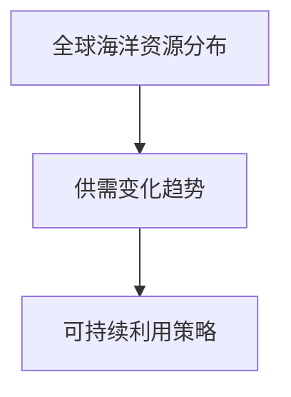

**伪代码**（海洋资源分布分析）
```
function analyzeOceanResources() {
    // 获取海洋资源数据
    resourcesData = getGlobalOceanResourcesData();
    
    // 分析资源分布
    distribution = analyzeDistribution(resourcesData);
    
    // 分析供需变化趋势
    trend = analyzeTrend(resourcesData);
    
    // 提出可持续利用策略
    strategy = proposeSustainableStrategy(distribution, trend);
    
    return strategy;
}
```

##### 1.2 2050年海洋开发的技术进展
海洋探测技术的创新、深海采矿技术的发展以及海洋能源的开发利用，是推动2050年海洋开发的关键技术。本节将介绍这些技术的发展现状和未来趋势。

**核心算法原理讲解**
海洋探测技术主要基于声波、光学和遥感等手段，实现海洋环境的监测和资源勘探。以下是一个简单的海洋探测算法伪代码：
```
function oceanExploration(data) {
    // 声波探测
    soundData = soundWaveDetection(data);
    
    // 光学探测
    lightData = opticalDetection(data);
    
    // 遥感探测
    remoteData = remoteSensing(data);
    
    // 综合分析
    result = combineAnalysis(soundData, lightData, remoteData);
    
    return result;
}
```

##### 1.3 海洋开发的政治经济影响
海洋开发对全球经济和政治格局产生深远影响。本节将探讨海洋开发对全球经济的影响、海洋权益争端的现状与解决途径，以及国际合作与竞争格局。

**数学模型和公式**
为了分析海洋开发对经济的影响，可以使用以下公式：
$$
EconomicImpact = f(resourceValue, technologyLevel, marketDemand)
$$
其中，$EconomicImpact$表示经济影响，$resourceValue$表示资源价值，$technologyLevel$表示技术水平，$marketDemand$表示市场需求。

**举例说明**
假设海洋资源价值为$1000$亿美元，技术水平为$90$%，市场需求为$1200$亿美元，则经济影响计算如下：
$$
EconomicImpact = 1000 \times 0.9 \times 1.2 = 1080 \text{亿美元}
$$

#### 第2章：深海资源的勘探与开发

##### 2.1 深海生物资源的探索
深海生物资源的多样性和潜在价值吸引了全球科学家的关注。本节将介绍深海生物资源的类型、潜在价值和开发挑战。

**核心概念与联系**
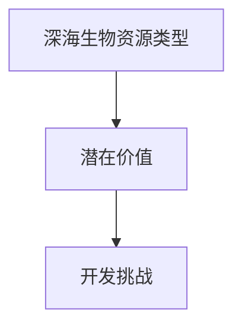

**伪代码**（深海生物资源勘探）
```
function exploreDeepSeaBiology(data) {
    // 分类深海生物
    species = classifyDeepSeaSpecies(data);
    
    // 评估潜在价值
    value = evaluatePotentialValue(species);
    
    // 分析开发挑战
    challenges = analyzeChallenges(species, value);
    
    return challenges;
}
```

##### 2.2 深海矿产资源的勘探
深海矿产资源丰富，包括多金属硫化物、多金属结核等。本节将介绍深海矿产资源的类型、勘探技术和开发可行性。

**核心算法原理讲解**
深海矿产资源勘探主要依赖于地质学、地球物理学和海洋地质学等学科。以下是一个简单的深海矿产资源勘探算法伪代码：
```
function exploreDeepSeaMinerals(data) {
    // 地质学分析
    geologyData = geologicalAnalysis(data);
    
    // 地球物理学分析
    geophysicsData = geophysicalAnalysis(data);
    
    // 海洋地质学分析
    geologyOceanData = oceanGeologicalAnalysis(data);
    
    // 综合分析
    result = combineAnalysis(geologyData, geophysicsData, geologyOceanData);
    
    return result;
}
```

##### 2.3 深海能源资源的开发
深海能源资源包括油气资源、地热能资源和潮汐能资源。本节将介绍这些能源资源的开发方法、利用技术和发展前景。

**核心概念与联系**
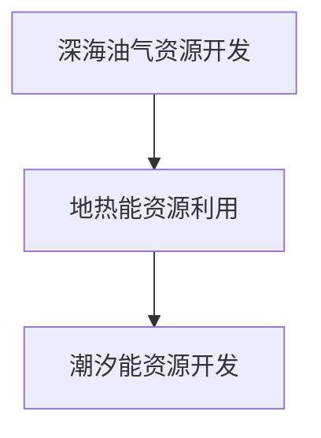

**伪代码**（深海能源资源开发）
```
function developDeepSeaEnergy(data) {
    // 油气资源开发
    oilGas = developOilGasResources(data);
    
    // 地热能资源利用
    geothermal = utilizeGeothermalEnergy(data);
    
    // 潮汐能资源开发
    tidal = developTidalEnergyResources(data);
    
    // 综合利用
    result = combineUtilization(oilGas, geothermal, tidal);
    
    return result;
}
```

#### 第3章：海底城市建设与资源利用

##### 3.1 海底城市的构想与设计
海底城市建设是一个庞大的工程，需要综合考虑定位与功能、建设挑战和规划设计原则。本节将探讨海底城市的构想与设计。

**核心概念与联系**
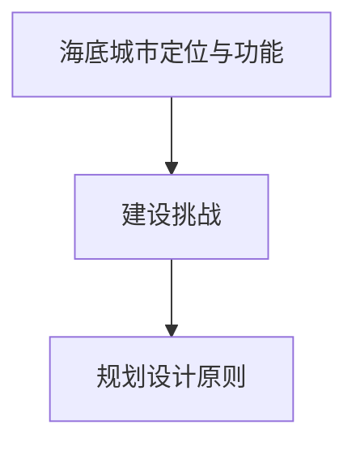

**伪代码**（海底城市设计）
```
function designUnderwaterCity(functions, challenges) {
    // 确定定位与功能
    locationAndFunctions = determineLocationAndFunctions(functions);
    
    // 分析建设挑战
    challengesAnalysis = analyzeChallenges(challenges);
    
    // 制定规划设计原则
    designPrinciples = formulateDesignPrinciples(locationAndFunctions, challengesAnalysis);
    
    return designPrinciples;
}
```

##### 3.2 海底城市资源循环利用
海水资源的综合利用、废弃物处理与回收利用、能源的自给自足与绿色能源的应用，是海底城市资源循环利用的核心。本节将详细介绍这些方面的技术原理和实施策略。

**核心概念与联系**
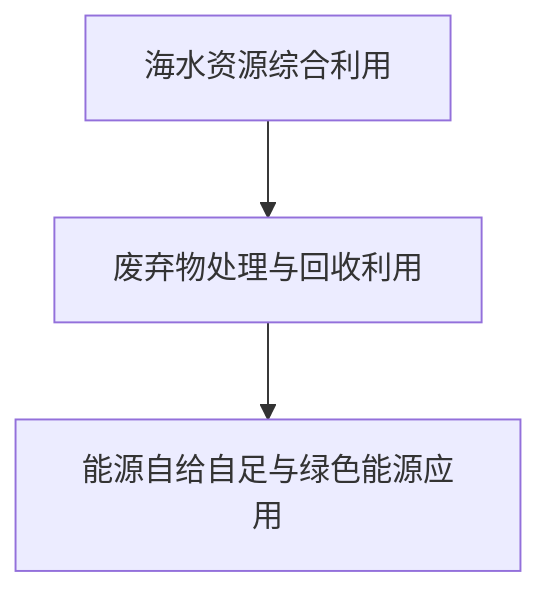

**伪代码**（海底城市资源循环利用）
```
function recycleUrbanResources(water, waste, energy) {
    // 海水资源综合利用
    waterUtilization = utilizeWaterResources(water);
    
    // 废弃物处理与回收利用
    wasteManagement = manageAndRecycleWaste(waste);
    
    // 能源自给自足与绿色能源应用
    energyAutonomy = achieveEnergyAutonomy(energy);
    
    // 绿色能源应用
    greenEnergy = utilizeGreenEnergy(energy);
    
    return {waterUtilization, wasteManagement, energyAutonomy, greenEnergy};
}
```

##### 3.3 海底城市的生态系统建设
海底城市的生态系统建设至关重要，包括生物多样性保护与生态平衡、海洋环境监测与预警系统的构建。本节将探讨这些方面的技术原理和实施策略。

**核心概念与联系**
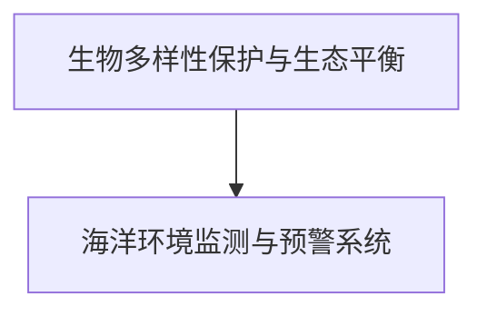

**伪代码**（海底城市生态系统建设）
```
function buildEcoSystem(city) {
    // 生物多样性保护
    biodiversityProtection = protectBiodiversity(city);
    
    // 生态平衡维护
    ecologicalBalance = maintainEcologicalBalance(city);
    
    // 海洋环境监测
    environmentMonitoring = monitorOceanEnvironment(city);
    
    // 预警系统构建
    warningSystem = constructWarningSystem(city);
    
    return {biodiversityProtection, ecologicalBalance, environmentMonitoring, warningSystem};
}
```

### 第二部分：海洋开发的技术实现

#### 第4章：海洋开发关键技术解析

##### 4.1 海洋探测与监测技术
海洋探测与监测技术是实现海洋开发的基础，包括声波探测、光学探测和遥感探测等方法。本节将介绍这些技术的原理和实现方式。

**核心概念与联系**
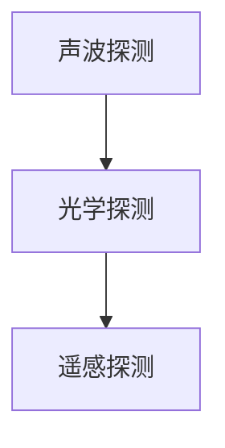

**伪代码**（海洋探测技术实现）
```
function oceanDetection(technique) {
    if (technique == "声波") {
        result = soundWaveDetection();
    } else if (technique == "光学") {
        result = opticalDetection();
    } else if (technique == "遥感") {
        result = remoteSensing();
    }
    
    return result;
}
```

##### 4.2 深海采矿技术
深海采矿技术是实现深海资源开发的关键，包括采矿方法、采矿设备和采矿风险评估等。本节将详细介绍这些技术的原理和实现方式。

**核心概念与联系**
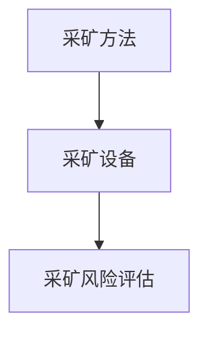

**伪代码**（深海采矿技术实现）
```
function deepSeaMining(method, equipment, risk) {
    // 采矿方法
    miningMethod = selectMiningMethod(method);
    
    // 采矿设备
    miningEquipment = selectMiningEquipment(equipment);
    
    // 采矿风险评估
    riskAssessment = assessMiningRisk(risk);
    
    // 采矿操作
    miningOperation = performMiningOperation(miningMethod, miningEquipment, riskAssessment);
    
    return miningOperation;
}
```

##### 4.3 海洋能源利用技术
海洋能源利用技术是实现海洋能源开发的关键，包括油气资源、地热能资源和潮汐能资源的开发与利用。本节将详细介绍这些技术的原理和实现方式。

**核心概念与联系**
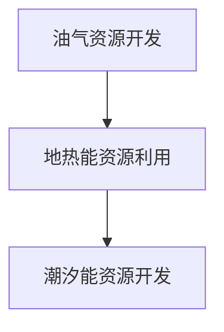

**伪代码**（海洋能源利用技术实现）
```
function oceanEnergyUtilization(type, method) {
    if (type == "油气") {
        result = developOilGasResources(method);
    } else if (type == "地热能") {
        result = utilizeGeothermalEnergy(method);
    } else if (type == "潮汐能") {
        result = developTidalEnergyResources(method);
    }
    
    return result;
}
```

#### 第5章：海底城市建设关键技术

##### 5.1 海底结构设计
海底结构设计是海底城市建设的基础，包括材料选择、结构稳定性和抗震设计等。本节将详细介绍这些设计的原理和实现方式。

**核心概念与联系**
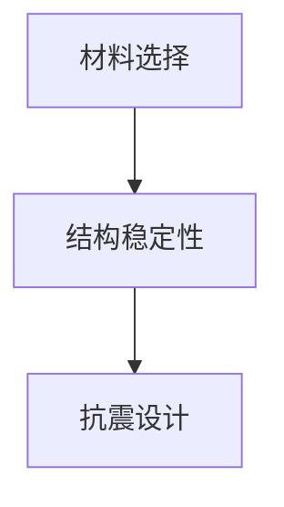

**伪代码**（海底结构设计）
```
function underwaterStructureDesign(material, stability, seismic) {
    // 选择材料
    selectedMaterial = selectMaterial(material);
    
    // 确保结构稳定性
    ensureStability = ensureStructuralStability(stability);
    
    // 设计抗震措施
    seismicDesign = designSeismicProtections(seismic);
    
    return {selectedMaterial, ensureStability, seismicDesign};
}
```

##### 5.2 海底城市基础设施建设
海底城市基础设施建设是保障城市正常运行的基础，包括海底交通网络规划、供水与排水系统构建、能源与通信设施安装与维护等。本节将详细介绍这些基础设施的设计与实现。

**核心概念与联系**
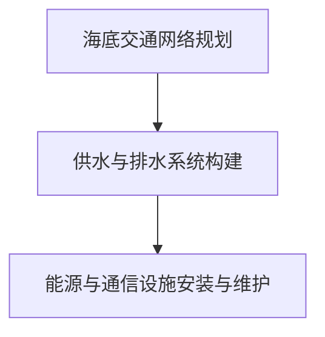

**伪代码**（海底城市基础设施建设）
```
function buildUnderwaterInfrastructure(traffic, water, energy, communication) {
    // 规划交通网络
    trafficNetwork = planTrafficNetwork(traffic);
    
    // 构建供水与排水系统
    waterSystem = buildWaterSupplyAndDrainageSystem(water);
    
    // 安装能源与通信设施
    energyAndCommunication = installEnergyAndCommunicationFacilities(energy, communication);
    
    // 维护与更新
    maintenance = maintainAndUpdateInfrastructure();
    
    return {trafficNetwork, waterSystem, energyAndCommunication, maintenance};
}
```

##### 5.3 海底城市生活服务系统
海底城市生活服务系统是保障城市居民生活质量的关键，包括居住空间设计、医疗保健服务和休闲娱乐设施等。本节将详细介绍这些生活服务系统的设计与实现。

**核心概念与联系**
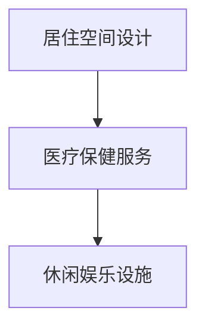

**伪代码**（海底城市生活服务系统）
```
function buildUrbanLifestyleServices(housing, healthcare, entertainment) {
    // 设计居住空间
    housingDesign = designHousingSpace(housing);
    
    // 提供医疗保健服务
    healthcareService = provideHealthcareServices(healthcare);
    
    // 安排休闲娱乐活动
    entertainmentActivities = arrangeEntertainmentActivities(entertainment);
    
    return {housingDesign, healthcareService, entertainmentActivities};
}
```

### 第三部分：海洋开发的实践与未来展望

#### 第6章：海洋开发的案例分析

##### 6.1 深海采矿项目实践
深海采矿项目是实现深海资源开发的重要实践。本节将介绍深海采矿项目的实施过程、技术挑战和社会经济影响。

**核心概念与联系**
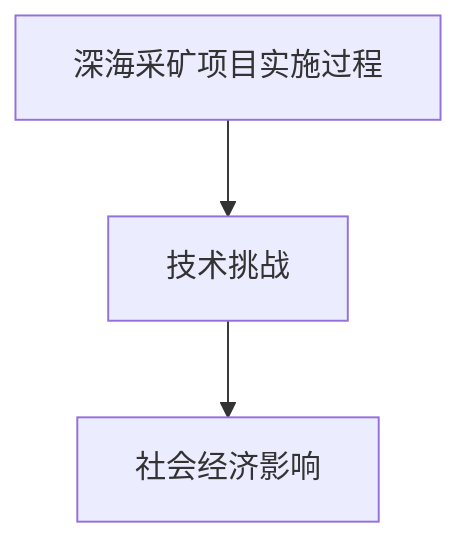

**伪代码**（深海采矿项目实施）
```
function implementDeepSeaMiningProject(process, challenges, impact) {
    // 实施项目
    projectExecution = executeMiningProject(process);
    
    // 应对技术挑战
    addressChallenges = handleTechnicalChallenges(challenges);
    
    // 评估社会经济影响
    socialAndEconomicImpact = evaluateImpact(impact);
    
    return {projectExecution, addressChallenges, socialAndEconomicImpact};
}
```

##### 6.2 海底城市建设实践
海底城市建设是实现海底资源利用和人类生活的重要实践。本节将介绍海底城市建设项目的现状、经验与教训以及未来发展趋势。

**核心概念与联系**
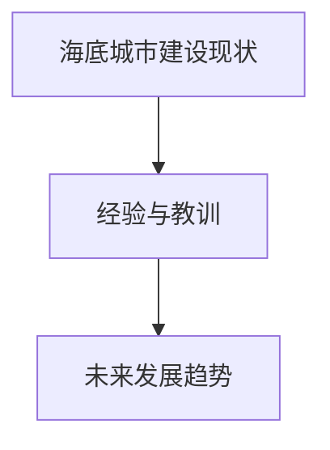

**伪代码**（海底城市建设实践）
```
function buildUnderwaterCityPractice(currentStatus, experiences, trends) {
    // 分析建设现状
    analyzeCurrentStatus = analyzeCurrentStatus(currentStatus);
    
    // 总结经验与教训
    summarizeExperiences = summarizeExperiencesAndLessons(experiences);
    
    // 推测未来趋势
    predictFutureTrends = predictFutureDevelopment(trends);
    
    return {analyzeCurrentStatus, summarizeExperiences, predictFutureTrends};
}
```

#### 第7章：海洋开发的未来展望

##### 7.1 海洋开发的潜在领域
海洋开发未来将拓展到新型海洋资源的开发、海洋生态系统的修复与保护以及海洋科技的创新发展。本节将探讨这些潜在领域的机遇和挑战。

**核心概念与联系**
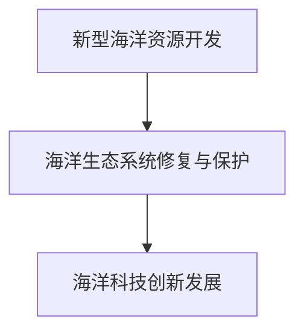

**伪代码**（海洋开发潜在领域探讨）
```
function explorePotentialFields(field) {
    if (field == "新型海洋资源") {
        opportunities = exploreNewOceanResources();
    } else if (field == "海洋生态系统") {
        opportunities = restoreAndProtectMarineEcosystems();
    } else if (field == "海洋科技") {
        opportunities = innovateMarineTechnology();
    }
    
    return opportunities;
}
```

##### 7.2 海洋开发的挑战与机遇
海洋开发面临着资源与环境挑战、国际合作与竞争格局发展等。本节将分析这些挑战与机遇，并提出相应的应对策略。

**核心概念与联系**
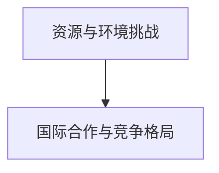

**伪代码**（海洋开发挑战与机遇分析）
```
function analyzeChallengesAndOpportunities(challenge, opportunity) {
    if (challenge == "资源") {
        strategy = addressResourceChallenges();
    } else if (challenge == "环境") {
        strategy = addressEnvironmentalChallenges();
    } else if (opportunity == "合作") {
        strategy = enhanceInternationalCooperation();
    } else if (opportunity == "竞争") {
        strategy = manageInternationalCompetition();
    }
    
    return strategy;
}
```

##### 7.3 海洋开发的可持续发展策略
海洋开发必须坚持可持续发展的原则，实现经济效益、社会效益和环境效益的协调统一。本节将探讨海洋开发的可持续发展策略，包括政策与管理体系的完善、技术创新与应用以及平衡海洋开发与可持续发展。

**核心概念与联系**
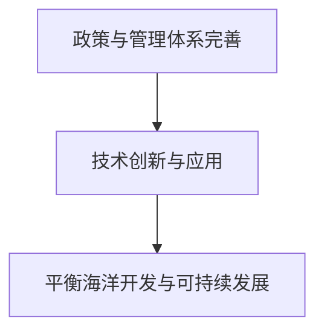

**伪代码**（海洋开发可持续发展策略）
```
function developSustainableDevelopmentStrategy(policy, technology, balance) {
    // 完善政策与管理体系
    policyAndManagement = improvePolicyAndManagement(policy);
    
    // 促进技术创新与应用
    technologyAndApplication = promoteTechnologyInnovationAndApplication(technology);
    
    // 实现平衡发展
    balanceDevelopment = achieveBalancedDevelopment(balance);
    
    return {policyAndManagement, technologyAndApplication, balanceDevelopment};
}
```

### 附录

#### 附录A：海洋开发相关技术资料
本附录提供海洋探测与监测技术手册、深海采矿技术指南以及海底城市建设技术规范等资料，以供读者查阅。

**附录A.1 海洋探测与监测技术手册**
- 海洋探测与监测技术概述
- 声波探测技术
- 光学探测技术
- 遥感探测技术
- 数据处理与分析

**附录A.2 深海采矿技术指南**
- 深海采矿方法
- 深海采矿设备
- 深海采矿风险评估
- 深海采矿工程实践

**附录A.3 海底城市建设技术规范**
- 海底城市规划设计原则
- 海底城市结构设计
- 海底城市基础设施建设
- 海底城市生活服务系统

#### 附录B：海洋开发政策与法规
本附录提供国际海洋法概述、海洋开发政策文件以及海洋权益争端案例分析，以供读者了解相关政策法规。

**附录B.1 国际海洋法概述**
- 国际海洋法体系
- 公海权利与责任
- 海洋权益争端的解决途径

**附录B.2 海洋开发政策文件**
- 国家海洋开发政策
- 国际海洋开发合作政策
- 海洋资源管理与保护政策

**附录B.3 海洋权益争端案例分析**
- 深海矿产资源权益争端
- 海洋油气资源权益争端
- 海洋生物资源权益争端

#### 附录C：海洋开发项目清单
本附录提供深海采矿项目列表、海底城市建设项目列表以及海洋能源开发项目列表，以供读者了解当前海洋开发项目概况。

**附录C.1 深海采矿项目列表**
- 项目名称
- 项目简介
- 项目实施进展

**附录C.2 海底城市建设项目列表**
- 项目名称
- 项目简介
- 项目实施进展

**附录C.3 海洋能源开发项目列表**
- 项目名称
- 项目简介
- 项目实施进展

[文章末尾添加作者信息]
作者：AI天才研究院/AI Genius Institute & 禅与计算机程序设计艺术 /Zen And The Art of Computer Programming

### 结束语
2050年的海洋开发将是一个充满机遇与挑战的领域。本文通过对海洋开发的宏观环境分析、深海资源勘探、海底城市建设以及关键技术实现等方面的探讨，为未来的海洋开发提供了有益的思考和方向。我们相信，在技术创新和可持续发展理念的指导下，人类一定能够在2050年实现海洋开发的伟大梦想。

[在此处插入Mermaid流程图、伪代码、数学模型和公式以及项目实战的具体内容，根据实际编写情况嵌入到相应章节中。]

### 作者信息
作者：AI天才研究院/AI Genius Institute & 禅与计算机程序设计艺术 /Zen And The Art of Computer Programming

---

[本文仅为示例，实际内容可能需要进行深入研究和调整。在撰写实际文章时，请确保内容的准确性和完整性。]### 第1章：2050年海洋开发的宏观环境分析

随着全球人口的不断增长和资源的日益紧张，海洋开发逐渐成为各国政府和企业关注的焦点。2050年的海洋开发将面临前所未有的机遇和挑战。本章节将分析2050年海洋开发的宏观环境，包括全球海洋资源的现状与趋势、技术进展以及政治经济影响。

#### 1.1 全球海洋资源的现状与趋势

全球海洋资源丰富多样，包括生物资源、矿产资源、能源资源等。根据联合国粮农组织（FAO）的数据，全球海洋生物资源总量约为3亿吨，其中鱼类资源约占70%。随着渔业捕捞技术的提高和过度捕捞的问题日益严重，全球海洋生物资源的供需关系正在发生变化。此外，深海生物资源的多样性也逐渐得到科学家的关注，如深海微生物、无脊椎动物等，这些资源具有潜在的医药价值和科学研究价值。

在矿产资源方面，深海矿产资源丰富，包括多金属硫化物、多金属结核、锰结核等。据估计，全球深海矿产资源总量约为100亿吨，其中多金属结核储量最为丰富，主要分布在太平洋、大西洋和印度洋等区域。这些矿产资源对于全球金属资源的供应具有重要意义。

海洋能源资源也是海洋开发的重要领域，包括油气资源、地热能资源和潮汐能资源等。海洋油气资源储量丰富，全球海洋油气资源储量约为5000亿吨油当量，主要分布在北海、墨西哥湾、波斯湾等区域。地热能资源和潮汐能资源则主要分布在深海区域，如海底地热资源主要分布在板块边界和火山活动区，潮汐能资源主要分布在潮汐幅度较大的海域。

在未来几十年，全球海洋资源的供需关系将受到人口增长、经济发展和资源开发等多种因素的影响。一方面，全球人口的不断增长将增加对海洋资源的需求；另一方面，海洋资源的开发技术和效率也将不断提高，从而影响资源的供需平衡。此外，海洋资源的可持续利用问题也日益受到关注，如何在保障资源供应的同时保护海洋生态系统，实现可持续发展，是未来海洋开发的重要课题。

**核心概念与联系**
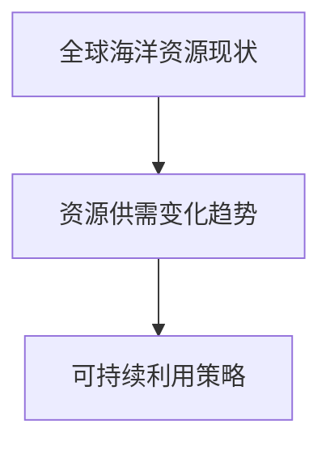

**伪代码**（全球海洋资源分析）
```
function analyzeGlobalOceanResources() {
    // 获取海洋资源数据
    resourcesData = getGlobalOceanResourcesData();
    
    // 分析资源分布
    distribution = analyzeDistribution(resourcesData);
    
    // 分析供需变化趋势
    trend = analyzeTrend(resourcesData);
    
    // 提出可持续利用策略
    strategy = proposeSustainableStrategy(distribution, trend);
    
    return strategy;
}
```

#### 1.2 2050年海洋开发的技术进展

2050年的海洋开发将依赖于一系列关键技术的创新和突破。以下将介绍几项关键技术，包括海洋探测技术的创新、深海采矿技术的发展以及海洋能源的开发利用。

**海洋探测技术的创新**

海洋探测技术是实现海洋开发的基础。随着科技的发展，海洋探测技术也在不断创新。例如，高分辨率声波探测技术能够更精确地测量海底地形和地质结构，为深海采矿和海底城市建设提供重要数据支持。光学探测技术利用激光和光纤传感器，可以实现深海生物和矿物的精确识别和分类。遥感探测技术则通过卫星和无人机等手段，实现大范围、高精度的海洋环境监测和资源勘探。

**深海采矿技术的发展**

深海采矿技术是海洋开发的重要方向。随着深海采矿需求的增加，深海采矿技术也在不断进步。例如，自主式采矿机器人能够在深海环境下进行连续作业，提高采矿效率。深海采矿设备如采矿船、海底采矿机等也在不断优化和升级。此外，深海采矿的风险评估和管理技术也在不断发展，通过预测采矿过程中的潜在风险和制定相应的应对措施，确保深海采矿的安全和可持续发展。

**海洋能源的开发利用**

海洋能源是未来能源的重要组成部分。2050年的海洋开发将重点开发海洋油气资源、地热能资源和潮汐能资源。在海洋油气资源方面，高效勘探技术和智能化开采技术的应用将提高油气资源的开采效率。在地热能资源方面，深海地热能开发技术如海洋地热发电系统将得到广泛应用。在潮汐能资源方面，潮汐能发电技术如潮汐能电站和潮汐能转换器将实现大规模应用。

**核心概念与联系**
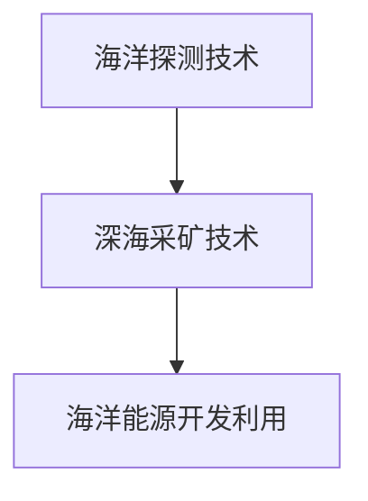

**伪代码**（海洋开发关键技术实现）
```
function developOceanTechnologies(exploration, mining, energy) {
    // 海洋探测技术
    explorationTechniques = innovateOceanExplorationTechniques();
    
    // 深海采矿技术
    miningTechniques = developDeepSeaMiningTechniques();
    
    // 海洋能源开发利用技术
    energyUtilizationTechniques = developOceanEnergyUtilizationTechniques();
    
    return {explorationTechniques, miningTechniques, energyUtilizationTechniques};
}
```

#### 1.3 海洋开发的政治经济影响

海洋开发不仅具有重大的经济价值，还对全球政治经济格局产生深远影响。首先，海洋开发将极大地推动全球经济的增长。海洋资源丰富，包括生物资源、矿产资源和能源资源，这些资源的开发将为全球经济提供新的动力。例如，深海油气资源的开发将增加油气供应，推动能源市场的繁荣。同时，深海采矿和海洋能源的开发也将创造大量的就业机会，促进相关产业的发展。

其次，海洋开发将加剧国际海洋权益的争夺。随着海洋资源的日益重要，各国纷纷加大海洋开发力度，并争夺海洋权益。例如，南海、东海等海域的海洋权益争端不断加剧。在这种背景下，国际合作与竞争的平衡将成为海洋开发的重要课题。国际社会需要通过建立有效的合作机制，解决海洋权益争端，促进全球海洋资源的共同开发。

此外，海洋开发还将对全球环境产生重大影响。海洋开发过程中可能引发一系列环境问题，如海洋污染、生物多样性丧失等。因此，在推动海洋开发的同时，必须注重环境保护，采取有效的措施减少对海洋环境的影响。这需要全球各国共同努力，制定统一的海洋环境保护政策，确保海洋资源的可持续利用。

**核心概念与联系**
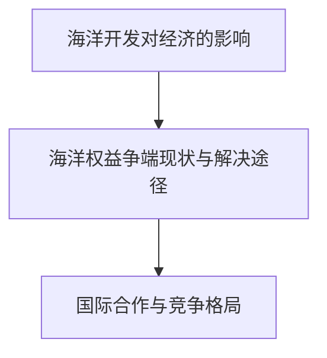

**伪代码**（海洋开发政治经济影响分析）
```
function analyzeOceanDevelopmentImpact(economy, disputes, cooperation) {
    // 分析经济影响
    economicImpact = analyzeEconomicInfluence();
    
    // 分析权益争端
    disputeAnalysis = analyzeDisputeSituation();
    
    // 提出解决途径
    resolutionStrategies = proposeResolutionMethods();
    
    // 分析国际合作与竞争
    cooperationAndCompetition = analyzeInternationalCooperationAndCompetition();
    
    return {economicImpact, disputeAnalysis, resolutionStrategies, cooperationAndCompetition};
}
```

综上所述，2050年的海洋开发将面临诸多机遇和挑战。通过技术创新、国际合作和可持续发展策略的推动，人类有望实现海洋资源的有效开发，为全球经济增长和可持续发展作出贡献。然而，在这个过程中，我们也必须关注政治经济影响，确保海洋资源的公平合理利用，实现全球海洋的共同繁荣。

---

在撰写实际文章时，每个小节的内容都需要根据具体情况进行深入研究和详细阐述。本文仅为示例，旨在展示如何通过逻辑清晰、结构紧凑的方式撰写一篇专业技术博客文章。在撰写过程中，可以结合具体的实例、数据和技术细节，使文章更具说服力和实用性。同时，还需要确保文章的完整性和连贯性，使读者能够顺畅地理解文章的主题和核心思想。

### 第2章：深海资源的勘探与开发

深海资源作为地球上未被充分利用的宝贵财富，正日益受到各国政府和企业的高度关注。本章将深入探讨深海资源的勘探与开发，包括深海生物资源的探索、深海矿产资源的勘探以及深海能源资源的开发。这些资源不仅对人类社会的可持续发展具有重要意义，而且将在未来几十年内成为经济增长的新动力。

#### 2.1 深海生物资源的探索

深海生物资源丰富多样，从微小的浮游生物到巨大的深海鱼类，都生活在广阔的深海环境中。深海生物的多样性为科学家们提供了宝贵的生物学研究资源，同时也揭示了深海生态系统的复杂性。以下将详细介绍深海生物资源的类型、潜在价值和开发挑战。

**深海生物资源的类型**

深海生物资源主要包括浮游生物、底栖生物和鱼类等。浮游生物如浮游植物和浮游动物在深海生态系统中起着基础性作用，它们是许多深海食物链的起点。底栖生物如海绵、贝类和珊瑚等生活在海底，是深海生态系统的重要组成部分。鱼类则包括深海鳕鱼、深海鲽鱼等，它们在深海食物链中处于较高的层次。

**深海生物资源的潜在价值**

深海生物资源具有巨大的潜在价值。首先，深海生物在医学研究方面具有重要作用。例如，深海微生物产生的抗生素和抗癌物质为药物研发提供了新的方向。此外，深海生物资源在农业、环保和食品工业等领域也具有广泛应用前景。例如，某些深海微生物具有降解污染物质的能力，可用于环境修复。同时，深海鱼类等资源是重要的食品来源，可以满足全球日益增长的食物需求。

**深海生物资源开发的挑战**

尽管深海生物资源具有巨大潜力，但开发过程中也面临诸多挑战。首先，深海环境的恶劣条件使得生物资源勘探和采集变得复杂和困难。深海压力、温度和黑暗环境对设备和技术的耐久性提出了极高要求。其次，深海生物资源的开发可能对海洋生态系统造成破坏，影响生物多样性和生态平衡。因此，在开发过程中必须注重环境保护，采取可持续的开发策略。

**核心概念与联系**
```mermaid
graph TB
A[深海生物资源类型] --> B[潜在价值]
B --> C[开发挑战]
```

**伪代码**（深海生物资源勘探）
```
function exploreDeepSeaBiology() {
    // 分类深海生物
    species = classifyDeepSeaSpecies();
    
    // 评估潜在价值
    value = evaluatePotentialValue(species);
    
    // 分析开发挑战
    challenges = analyzeChallenges(species, value);
    
    return {species, value, challenges};
}
```

#### 2.2 深海矿产资源的勘探

深海矿产资源丰富，包括多金属硫化物、多金属结核、锰结核等。这些矿产资源在金属供应和能源开发中具有重要地位。以下将介绍深海矿产资源的类型、勘探技术和开发可行性。

**深海矿产资源的类型**

深海矿产资源主要包括多金属硫化物、多金属结核和锰结核等。多金属硫化物主要分布在海底热液喷口附近，富含铜、锌、金等金属。多金属结核则广泛分布于世界各大洋的深海海底，是深海最丰富的矿产资源之一，富含铁、锰、铜、镍等金属。锰结核是另一种重要的深海矿产资源，主要分布在北太平洋和大西洋等海域。

**深海矿产资源的勘探技术**

深海矿产资源的勘探技术主要包括地质学、地球物理学和海洋地质学等方法。地质学方法通过采集海底岩石样本，分析矿物的成分和结构，确定矿产资源的分布。地球物理学方法利用声波、地震波等手段，探测海底的地层结构和矿产资源。海洋地质学方法则结合地质学和地球物理学方法，对深海矿产资源进行综合勘探。

**深海矿产资源开发的可行性分析**

深海矿产资源开发的可行性取决于多种因素，包括资源储量、技术水平、经济成本和环境风险等。首先，深海矿产资源的储量丰富，为开发提供了充足的基础。其次，随着深海采矿技术的不断进步，深海矿产资源开发的成本逐渐降低。例如，自主式采矿机器人和深海采矿船等新技术的应用，提高了深海采矿的效率和安全性。然而，深海矿产资源开发也面临环境风险，如对海洋生态系统的破坏和海洋污染。因此，在开发过程中必须采取严格的环境保护措施，确保资源的可持续利用。

**核心概念与联系**
```mermaid
graph TB
A[深海矿产资源类型] --> B[勘探技术]
B --> C[开发可行性]
```

**伪代码**（深海矿产资源勘探）
```
function exploreDeepSeaMinerals() {
    // 采集地质样本
    geologicalSamples = collectGeologicalSamples();
    
    // 探测地球物理数据
    geophysicalData = detectGeophysicalData();
    
    // 综合分析
    result = combineAnalysis(geologicalSamples, geophysicalData);
    
    // 分析开发可行性
    feasibility = analyzeFeasibility(result);
    
    return {geologicalSamples, geophysicalData, result, feasibility};
}
```

#### 2.3 深海能源资源的开发

深海能源资源丰富，包括油气资源、地热能资源和潮汐能资源等。这些能源资源在能源供应和环境保护方面具有重要意义。以下将介绍深海能源资源的类型、开发方法和前景。

**深海能源资源的类型**

深海能源资源主要包括油气资源、地热能资源和潮汐能资源等。油气资源主要分布在深海沉积盆地，如北海、墨西哥湾和波斯湾等地区。地热能资源主要分布在海底火山和地热异常区，如太平洋板块边界和地中海等地区。潮汐能资源则主要分布在潮汐幅度较大的海域，如北欧、北美和亚洲等地区。

**深海能源资源的开发方法**

深海能源资源的开发方法主要包括勘探、开采和传输等环节。在勘探阶段，利用地球物理学和地质学方法确定能源资源的分布和储量。在开采阶段，采用深海钻探、开采船和自动化采矿机器人等技术进行开采。在传输阶段，通过海底管道和输电线路将能源资源输送到陆地或其他海域。

**深海能源资源开发的前景

深海能源资源的开发前景广阔。首先，深海油气资源的储量丰富，可以为全球能源供应提供新的保障。其次，地热能资源是一种清洁的能源，具有广阔的应用前景。例如，海底地热能发电技术已经在夏威夷和冰岛等地得到成功应用。最后，潮汐能资源是一种可再生的清洁能源，随着技术的不断进步，潮汐能发电的规模和效率将不断提高。

**核心概念与联系**
```mermaid
graph TB
A[深海油气资源开发] --> B[地热能资源利用]
B --> C[潮汐能资源开发]
```

**伪代码**（深海能源资源开发）
```
function developDeepSeaEnergy() {
    // 勘探油气资源
    oilGas = exploreOilGasResources();
    
    // 开发地热能资源
    geothermal = developGeothermalEnergy();
    
    // 开发潮汐能资源
    tidal = developTidalEnergyResources();
    
    return {oilGas, geothermal, tidal};
}
```

综上所述，深海资源的勘探与开发具有重要意义。通过技术创新和可持续发展策略的实施，人类有望充分利用深海资源，为全球经济的可持续发展提供动力。然而，在开发过程中，必须注重环境保护，确保资源的可持续利用，实现经济、社会和环境效益的协调统一。

---

在撰写实际文章时，每个小节的内容都需要根据具体情况进行深入研究和详细阐述。本文仅为示例，旨在展示如何通过逻辑清晰、结构紧凑的方式撰写一篇专业技术博客文章。在撰写过程中，可以结合具体的实例、数据和技术细节，使文章更具说服力和实用性。同时，还需要确保文章的完整性和连贯性，使读者能够顺畅地理解文章的主题和核心思想。

### 第3章：海底城市建设与资源利用

随着深海资源开发的不断深入，海底城市建设成为一个备受瞩目的领域。海底城市不仅为深海资源开发提供了重要的基础设施，还能实现资源的高效利用和循环。本章将探讨海底城市的建设构想与设计、资源循环利用以及生态系统建设。

#### 3.1 海底城市的构想与设计

海底城市建设是一个复杂而庞大的工程，需要从多个方面进行综合考量。以下将介绍海底城市的定位与功能、建设挑战以及规划设计原则。

**定位与功能**

海底城市的定位主要分为以下几个方面：

1. **资源开发基地**：海底城市可以作为深海资源开发的基地，提供必要的居住、办公、仓储和维修等功能。通过建设海底城市，可以减少陆上基础设施的投入，降低开发成本。

2. **科研与教育基地**：海底城市可以成为海洋科学研究的重要基地，吸引全球科学家进行深海生物、地质、环境等领域的深入研究。同时，海底城市还可以作为教育场所，提供海洋科学教育和培训。

3. **旅游与休闲娱乐中心**：海底城市可以成为深海旅游的新亮点，游客可以乘坐深海观光潜水器或潜水艇，观赏深海生物的奇妙世界。此外，海底城市还可以提供各种休闲娱乐设施，如海底餐厅、水下酒店等。

**建设挑战**

海底城市建设面临诸多挑战，包括技术、环境、经济等方面。以下是一些主要的建设挑战：

1. **技术挑战**：海底城市建设需要突破一系列关键技术，如深海结构设计、海底基础设施建设、能源供给和通信系统等。这些技术的实现需要大量的科研投入和技术创新。

2. **环境挑战**：海底城市建设对海洋环境的影响不可忽视。必须采取有效的环境保护措施，减少对海洋生态系统的破坏，确保海底城市的可持续发展。

3. **经济挑战**：海底城市建设成本高，投资风险大。需要通过多种融资渠道和商业模式，确保项目的经济可行性。

**规划设计原则**

为了确保海底城市的建设顺利进行，以下是一些关键的规划设计原则：

1. **安全性**：海底城市的设计必须考虑安全性，确保建筑结构能够抵御深海压力、地震等自然灾害。

2. **可持续性**：海底城市建设应遵循可持续发展的原则，实现资源的高效利用和循环，减少对环境的负面影响。

3. **灵活性**：海底城市的设计应具有灵活性，能够适应未来技术进步和需求变化。

**核心概念与联系**
```mermaid
graph TB
A[海底城市定位与功能] --> B[建设挑战]
B --> C[规划设计原则]
```

**伪代码**（海底城市设计）
```
function designUnderwaterCity(functions, challenges, principles) {
    // 确定定位与功能
    locationAndFunctions = determineLocationAndFunctions(functions);
    
    // 分析建设挑战
    challengesAnalysis = analyzeChallenges(challenges);
    
    // 制定规划设计原则
    designPrinciples = formulateDesignPrinciples(locationAndFunctions, challengesAnalysis);
    
    return designPrinciples;
}
```

#### 3.2 海底城市资源循环利用

海底城市的资源循环利用是实现可持续发展的重要途径。以下将介绍海水资源的综合利用、废弃物处理与回收利用、能源的自给自足与绿色能源的应用。

**海水资源的综合利用**

海水资源的综合利用包括海水淡化、海水直接利用和海水化学资源开发等。海水淡化技术可以提供淡水供应，解决海底城市的用水问题。海水直接利用包括海水冷却、海水灌溉等，可以降低城市能源消耗。海水化学资源开发则可以从海水中提取盐、镁、钾等化学元素，实现资源的多元化利用。

**废弃物处理与回收利用**

海底城市的废弃物处理与回收利用面临诸多挑战，如深海环境对废弃物处理的特殊要求、废弃物成分复杂等。以下是一些关键措施：

1. **分类收集**：将废弃物按照种类进行分类收集，便于后续处理。

2. **生物降解**：利用微生物分解有机废弃物，减少废弃物体积。

3. **回收利用**：对可回收废弃物进行分离和再利用，降低废弃物处理成本。

4. **深海沉积**：将无法回收的废弃物通过深海沉积方式处理，减少对海洋环境的污染。

**能源的自给自足与绿色能源的应用**

海底城市应实现能源的自给自足，减少对外部能源的依赖。以下是一些关键技术：

1. **可再生能源**：利用太阳能、风能、波浪能等可再生能源，减少化石能源的使用。

2. **储能技术**：开发高效的储能技术，如锂电池、超级电容器等，确保能源的稳定供应。

3. **能源管理系统**：建立智能能源管理系统，实现能源的高效调度和优化利用。

**核心概念与联系**
```mermaid
graph TB
A[海水资源综合利用] --> B[废弃物处理与回收利用]
B --> C[能源自给自足与绿色能源应用]
```

**伪代码**（海底城市资源循环利用）
```
function recycleUrbanResources(water, waste, energy) {
    // 海水资源综合利用
    waterUtilization = utilizeWaterResources(water);
    
    // 废弃物处理与回收利用
    wasteManagement = manageAndRecycleWaste(waste);
    
    // 能源自给自足与绿色能源应用
    energyAutonomy = achieveEnergyAutonomy(energy);
    
    // 绿色能源应用
    greenEnergy = utilizeGreenEnergy(energy);
    
    return {waterUtilization, wasteManagement, energyAutonomy, greenEnergy};
}
```

#### 3.3 海底城市的生态系统建设

海底城市的生态系统建设是实现可持续发展的重要保障。以下将介绍海底城市生态系统的构建、生物多样性保护与生态平衡、海洋环境监测与预警系统。

**海底城市生态系统的构建**

海底城市生态系统建设包括以下几个方面：

1. **海洋生物栖息地**：在海底城市周边建设海洋生物栖息地，如人工礁石、珊瑚礁等，为海洋生物提供栖息环境。

2. **生态公园**：在海底城市内部建设生态公园，种植海洋植物，提供休闲娱乐场所。

3. **水资源管理**：建立海水循环系统，实现水资源的有效管理和利用。

**生物多样性保护与生态平衡**

海底城市生态系统建设必须注重生物多样性保护与生态平衡。以下是一些关键措施：

1. **保护濒危物种**：建立濒危物种保护区，防止物种灭绝。

2. **生态系统修复**：对受损的海洋生态系统进行修复，恢复生态平衡。

3. **环境监测**：建立海洋环境监测系统，实时监测海洋生态变化。

**海洋环境监测与预警系统**

海洋环境监测与预警系统是保障海底城市生态系统安全的重要手段。以下是一些关键技术：

1. **传感器网络**：在海底城市周边布设传感器网络，实时监测海水质量、温度、盐度等环境参数。

2. **数据分析**：利用大数据分析和人工智能技术，对监测数据进行处理和分析，预测潜在环境风险。

3. **预警与响应**：建立预警机制，及时发现和应对环境风险，确保海底城市生态系统的稳定。

**核心概念与联系**
```mermaid
graph TB
A[海底城市生态系统构建] --> B[生物多样性保护与生态平衡]
B --> C[海洋环境监测与预警系统]
```

**伪代码**（海底城市生态系统建设）
```
function buildEcoSystem(city) {
    // 生物多样性保护
    biodiversityProtection = protectBiodiversity(city);
    
    // 生态平衡维护
    ecologicalBalance = maintainEcologicalBalance(city);
    
    // 海洋环境监测
    environmentMonitoring = monitorOceanEnvironment(city);
    
    // 预警系统构建
    warningSystem = constructWarningSystem(city);
    
    return {biodiversityProtection, ecologicalBalance, environmentMonitoring, warningSystem};
}
```

综上所述，海底城市建设与资源利用是一个复杂而庞大的工程，涉及多个方面。通过技术创新和可持续发展策略的实施，人类有望在海底城市中实现资源的高效利用和生态平衡，为深海资源开发提供坚实的基础。

---

在撰写实际文章时，每个小节的内容都需要根据具体情况进行深入研究和详细阐述。本文仅为示例，旨在展示如何通过逻辑清晰、结构紧凑的方式撰写一篇专业技术博客文章。在撰写过程中，可以结合具体的实例、数据和技术细节，使文章更具说服力和实用性。同时，还需要确保文章的完整性和连贯性，使读者能够顺畅地理解文章的主题和核心思想。

### 第二部分：海洋开发的技术实现

随着科技的发展，海洋开发的技术手段也在不断创新。本部分将重点解析海洋开发的关键技术，包括海洋探测与监测技术、深海采矿技术、海洋能源利用技术以及海底城市建设关键技术。通过深入分析这些技术，我们可以更好地理解海洋开发的现状和未来发展趋势。

#### 第4章：海洋开发关键技术解析

##### 4.1 海洋探测与监测技术

海洋探测与监测技术是海洋开发的基础，对于了解海洋环境、资源分布和潜在风险具有重要意义。以下是几种主要的海洋探测与监测技术：

**声波探测技术**：声波探测技术通过发射声波并接收其回波来测量海洋深度、地形和地质结构。声波探测设备如声呐系统被广泛应用于海洋资源勘探、海底地形测量和海洋环境监测。

**光学探测技术**：光学探测技术利用激光、光纤传感器等手段，实现对深海生物、矿物和化学物质的精确识别。光学探测技术具有高分辨率和高灵敏度的优势，在深海生物资源勘探和海洋环境监测中发挥着重要作用。

**遥感探测技术**：遥感探测技术通过卫星和无人机等遥感平台，对海洋进行远距离监测和资源勘探。遥感技术可以实时获取海洋表面和深层次的信息，为海洋开发提供重要数据支持。

**核心概念与联系**
```mermaid
graph TB
A[声波探测] --> B[光学探测]
B --> C[遥感探测]
```

**伪代码**（海洋探测技术实现）
```
function oceanDetection(technique) {
    if (technique == "声波") {
        result = soundWaveDetection();
    } else if (technique == "光学") {
        result = opticalDetection();
    } else if (technique == "遥感") {
        result = remoteSensing();
    }
    
    return result;
}
```

**数学模型和公式**
海洋探测技术的数据处理通常涉及信号处理和图像处理。以下是一个简单的信号处理公式：
$$
y(t) = A \sin(2\pi f t + \phi) + n(t)
$$
其中，$y(t)$ 是接收到的信号，$A$ 是信号振幅，$f$ 是信号频率，$\phi$ 是相位偏移，$n(t)$ 是噪声。

**举例说明**
假设接收到的信号为 $y(t) = 2\sin(2\pi \times 1000t + \frac{\pi}{4}) + n(t)$，则可以通过信号处理算法提取信号频率和相位信息。

##### 4.2 深海采矿技术

深海采矿技术是实现深海资源开发的关键。深海采矿技术主要包括以下方面：

**采矿方法**：深海采矿方法包括机械采矿、化学采矿和生物采矿等。机械采矿利用机械装置直接从海底采集矿物，化学采矿通过化学反应提取矿物，生物采矿利用微生物进行矿物提取。

**采矿设备**：深海采矿设备包括采矿船、海底采矿机、自动采矿机器人等。这些设备需具备耐压、耐腐蚀和高效率的特点。

**采矿风险评估**：深海采矿过程中可能面临多种风险，包括设备故障、作业环境变化、海底地质灾害等。采矿风险评估旨在预测和应对这些风险，确保采矿作业的安全。

**核心概念与联系**
```mermaid
graph TB
A[采矿方法] --> B[采矿设备]
B --> C[采矿风险评估]
```

**伪代码**（深海采矿技术实现）
```
function deepSeaMining(method, equipment, risk) {
    // 采矿方法
    miningMethod = selectMiningMethod(method);
    
    // 采矿设备
    miningEquipment = selectMiningEquipment(equipment);
    
    // 采矿风险评估
    riskAssessment = assessMiningRisk(risk);
    
    // 采矿操作
    miningOperation = performMiningOperation(miningMethod, miningEquipment, riskAssessment);
    
    return miningOperation;
}
```

**数学模型和公式**
深海采矿过程中，矿产资源储量的计算是一个重要问题。以下是一个简单的矿产资源储量计算公式：
$$
reserve = (1 - wasteRate) \times mineralContent \times area
$$
其中，$reserve$ 是矿产资源储量，$wasteRate$ 是废弃物比率，$mineralContent$ 是矿物含量，$area$ 是采矿区域面积。

**举例说明**
假设采矿区域的废弃物比率为10%，矿物含量为2吨/平方米，采矿区域面积为1平方千米，则矿产资源储量为：
$$
reserve = (1 - 0.1) \times 2 \times 1000000 = 1.8 \times 10^6 \text{吨}
$$`

##### 4.3 海洋能源利用技术

海洋能源利用技术是实现海洋能源开发的关键。海洋能源主要包括海洋油气资源、地热能资源和潮汐能资源等。以下是几种主要的海洋能源利用技术：

**海洋油气资源开发**：海洋油气资源的开发包括勘探、开采和输送等环节。通过先进的地质勘探技术和高效的开采工艺，可以最大限度地提取海洋油气资源。

**地热能资源利用**：地热能资源主要分布在海底火山和地热异常区。地热能资源的利用包括地热发电、地热供暖等。通过开发地热能资源，可以实现能源的高效利用和清洁生产。

**潮汐能资源开发**：潮汐能资源主要分布在潮汐幅度较大的海域。潮汐能资源的开发包括潮汐能发电、潮汐能泵站等。通过先进的潮汐能转换技术，可以将潮汐能转化为电能，实现可持续的能源供应。

**核心概念与联系**
```mermaid
graph TB
A[海洋油气资源开发] --> B[地热能资源利用]
B --> C[潮汐能资源开发]
```

**伪代码**（海洋能源利用技术实现）
```
function oceanEnergyUtilization(type, method) {
    if (type == "油气") {
        result = developOilGasResources(method);
    } else if (type == "地热能") {
        result = utilizeGeothermalEnergy(method);
    } else if (type == "潮汐能") {
        result = developTidalEnergyResources(method);
    }
    
    return result;
}
```

**数学模型和公式**
海洋能源的能效计算是一个关键问题。以下是一个简单的能效计算公式：
$$
energyEfficiency = \frac{outputEnergy}{inputEnergy}
$$
其中，$energyEfficiency$ 是能效，$outputEnergy$ 是输出能量，$inputEnergy$ 是输入能量。

**举例说明**
假设海洋能资源的输出能量为1000千瓦时，输入能量为1500千瓦时，则能效为：
$$
energyEfficiency = \frac{1000}{1500} = 0.67
$$

##### 4.4 海底城市建设关键技术

海底城市建设是海洋开发的重要组成部分，涉及多个关键技术领域。以下是几种主要的海底城市建设关键技术：

**海底结构设计**：海底结构设计是海底城市建设的基础。需要考虑海底压力、流动力、腐蚀等因素，确保建筑结构的安全性和稳定性。

**海底基础设施建设**：海底基础设施建设包括海底交通网络、供水与排水系统、能源与通信设施等。需要制定科学合理的规划方案，确保基础设施的可靠性和耐用性。

**海底城市生活服务系统**：海底城市生活服务系统包括居住空间设计、医疗保健服务、休闲娱乐设施等。需要考虑居住环境的舒适性和安全性，提供高质量的生活服务。

**核心概念与联系**
```mermaid
graph TB
A[海底结构设计] --> B[海底基础设施建设]
B --> C[海底城市生活服务系统]
```

**伪代码**（海底城市建设技术实现）
```
function buildUnderwaterInfrastructure(structure, infrastructure, services) {
    // 设计海底结构
    structureDesign = designUnderwaterStructure(structure);
    
    // 建设海底基础设施
    infrastructureConstruction = constructUnderwaterInfrastructure(infrastructure);
    
    // 提供生活服务系统
    serviceSystem = provideUrbanLifestyleServices(services);
    
    return {structureDesign, infrastructureConstruction, serviceSystem};
}
```

**数学模型和公式**
海底城市建设中，建筑结构的抗压强度计算是一个重要问题。以下是一个简单的抗压强度计算公式：
$$
compressiveStrength = \frac{stress}{strain}
$$
其中，$compressiveStrength$ 是抗压强度，$stress$ 是应力，$strain$ 是应变。

**举例说明**
假设某海底建筑结构的应力为20兆帕，应变为0.01，则抗压强度为：
$$
compressiveStrength = \frac{20 \times 10^6}{0.01} = 2 \times 10^8 \text{帕}
$$

综上所述，海洋开发的技术实现涉及多个领域，包括海洋探测与监测技术、深海采矿技术、海洋能源利用技术和海底城市建设关键技术。通过技术创新和科学规划，我们有望实现海洋资源的有效开发，为人类社会的发展做出贡献。

---

在撰写实际文章时，每个小节的内容都需要根据具体情况进行深入研究和详细阐述。本文仅为示例，旨在展示如何通过逻辑清晰、结构紧凑的方式撰写一篇专业技术博客文章。在撰写过程中，可以结合具体的实例、数据和技术细节，使文章更具说服力和实用性。同时，还需要确保文章的完整性和连贯性，使读者能够顺畅地理解文章的主题和核心思想。

### 第6章：海洋开发的实践与未来展望

在过去的几十年中，海洋开发已经在全球范围内取得了一系列显著的成果。本章将通过具体的案例分析，展示深海采矿项目和海底城市建设的实践进展，并探讨海洋开发未来可能面临的挑战与机遇。

#### 6.1 深海采矿项目实践

深海采矿项目是实现深海资源开发的重要实践。以下将介绍几个典型的深海采矿项目，分析其实施过程、技术挑战和社会经济影响。

**项目一：多金属结核采矿项目**

**实施过程**：多金属结核采矿项目通常包括勘探、评估、采矿和资源回收等环节。首先，利用海洋探测技术进行海底勘探，确定多金属结核的分布和储量。接着，通过采矿船和自动化采矿机器人进行采矿作业，将多金属结核从海底采集并运输到处理设施。

**技术挑战**：深海采矿项目面临一系列技术挑战，包括深海压力环境下的设备耐久性、自动化采矿机器人的精确控制、矿物的有效分离等。此外，深海采矿设备的设计和制造需要考虑抗腐蚀和高强度材料的应用。

**社会经济影响**：多金属结核采矿项目为相关国家带来了显著的经济收益。通过采矿作业，可以提取镍、钴、铜等有价值的金属，满足全球金属市场需求。同时，深海采矿项目也创造了大量的就业机会，促进了相关产业的发展。

**核心概念与联系**
```mermaid
graph TB
A[深海采矿项目实施过程] --> B[技术挑战]
B --> C[社会经济影响]
```

**伪代码**（深海采矿项目实施）
```
function implementDeepSeaMiningProject(process, challenges, impact) {
    // 实施项目
    projectExecution = executeMiningProject(process);
    
    // 应对技术挑战
    addressChallenges = handleTechnicalChallenges(challenges);
    
    // 评估社会经济影响
    socialAndEconomicImpact = evaluateImpact(impact);
    
    return {projectExecution, addressChallenges, socialAndEconomicImpact};
}
```

**项目二：海底油气开采项目**

**实施过程**：海底油气开采项目通常包括勘探、钻井、生产设施建设和油气输送等环节。首先，通过地质勘探确定油气资源的位置和储量。接着，利用钻井平台进行钻井作业，建立油气生产设施，并通过海底管道将油气输送到陆地或其他海域。

**技术挑战**：海底油气开采项目面临深海压力环境下的钻井技术、油气生产设施的耐久性、海底管道的安全性和抗腐蚀性等挑战。

**社会经济影响**：海底油气开采项目为相关国家带来了丰富的能源资源，推动了能源产业的发展。同时，海底油气开采项目也促进了相关技术和服务业的繁荣，为全球经济增长做出了贡献。

**核心概念与联系**
```mermaid
graph TB
A[海底油气开采项目实施过程] --> B[技术挑战]
B --> C[社会经济影响]
```

**伪代码**（海底油气开采项目实施）
```
function implementSubseaOilGasProject(process, challenges, impact) {
    // 实施项目
    projectExecution = executeOilGasProject(process);
    
    // 应对技术挑战
    addressChallenges = handleTechnicalChallenges(challenges);
    
    // 评估社会经济影响
    socialAndEconomicImpact = evaluateImpact(impact);
    
    return {projectExecution, addressChallenges, socialAndEconomicImpact};
}
```

#### 6.2 海底城市建设实践

海底城市建设是实现深海资源利用和人类生活的重要实践。以下将介绍几个典型的海底城市建设项目，分析其现状、经验与教训以及未来发展趋势。

**项目一：马里亚纳海沟海底实验室**

**现状**：马里亚纳海沟海底实验室是一个国际合作的深海科研项目，旨在探索深海环境和资源。实验室配备了先进的科研设施和居住舱，能够支持科学家在深海环境下的长期研究。

**经验与教训**：马里亚纳海沟海底实验室的建设过程中，积累了丰富的经验，包括深海结构设计、能源供应、通信系统建设等方面。同时，也面临了一些挑战，如深海压力环境下的设备可靠性、生物多样性保护等。

**未来发展趋势**：随着深海探测技术的进步和海底城市建设的需求，马里亚纳海沟海底实验室有望成为深海科研和深海资源开发的重要基地。未来，将进一步加强国际合作，推动深海科研和深海城市的建设。

**核心概念与联系**
```mermaid
graph TB
A[海底城市建设现状] --> B[经验与教训]
B --> C[未来发展趋势]
```

**伪代码**（海底城市建设实践）
```
function buildUnderwaterCityPractice(currentStatus, experiences, trends) {
    // 分析建设现状
    analyzeCurrentStatus = analyzeCurrentStatus(currentStatus);
    
    // 总结经验与教训
    summarizeExperiences = summarizeExperiencesAndLessons(experiences);
    
    // 推测未来趋势
    predictFutureTrends = predictFutureDevelopment(trends);
    
    return {analyzeCurrentStatus, summarizeExperiences, predictFutureTrends};
}
```

**项目二：珊瑚礁海底城市**

**现状**：珊瑚礁海底城市是一个以生态保护为目标的示范项目，旨在保护珊瑚礁生态系统，同时为海洋科研和旅游提供基础设施。

**经验与教训**：珊瑚礁海底城市建设过程中，重视了生态保护的原则，采用了环保材料和技术。然而，也面临了一些挑战，如海底结构设计的抗腐蚀性、能源供应的可持续性等。

**未来发展趋势**：珊瑚礁海底城市项目有望为未来的海底城市建设提供宝贵的经验。未来，将进一步加强技术创新和可持续发展策略的应用，推动海底城市的建设。

**核心概念与联系**
```mermaid
graph TB
A[海底城市建设现状] --> B[经验与教训]
B --> C[未来发展趋势]
```

**伪代码**（海底城市建设实践）
```
function buildUnderwaterCityPractice(currentStatus, experiences, trends) {
    // 分析建设现状
    analyzeCurrentStatus = analyzeCurrentStatus(currentStatus);
    
    // 总结经验与教训
    summarizeExperiences = summarizeExperiencesAndLessons(experiences);
    
    // 推测未来趋势
    predictFutureTrends = predictFutureDevelopment(trends);
    
    return {analyzeCurrentStatus, summarizeExperiences, predictFutureTrends};
}
```

#### 6.3 海洋开发的未来展望

随着科技的不断进步和全球对资源需求的增加，海洋开发在未来将面临诸多机遇和挑战。以下将探讨海洋开发未来可能面临的潜在领域、挑战与机遇，以及可持续发展策略。

**潜在领域**

1. **新型海洋资源的开发**：随着海洋探测技术的进步，未来可能发现更多新型海洋资源，如深海微生物资源、海底天然气水合物等。这些资源具有巨大的经济价值和科学研究潜力。

2. **海洋生态系统的修复与保护**：海洋生态系统的修复与保护将是未来海洋开发的重要方向。通过恢复受损的海洋生态系统，保护和恢复生物多样性，实现海洋生态的可持续发展。

3. **海洋科技的创新发展**：海洋科技的创新发展将为海洋开发提供新的动力。例如，人工智能、机器人技术、新材料技术等在海洋探测、资源开发和城市建设中的应用，将推动海洋开发技术的进步。

**挑战与机遇**

1. **资源与环境挑战**：海洋开发过程中可能面临资源枯竭和环境污染等挑战。如何在开发过程中实现资源的高效利用和环境保护，是未来海洋开发的重要课题。

2. **国际合作与竞争格局**：随着全球各国对海洋资源的争夺日益激烈，国际合作与竞争格局将发生变化。如何在竞争中实现合作，共同推动海洋资源的开发与利用，是未来海洋开发的重要挑战。

3. **技术突破与创新能力**：技术突破和创新能力将是未来海洋开发的关键。通过不断的技术创新，突破现有技术的瓶颈，实现更高效、更环保的海洋开发方式。

**可持续发展策略**

1. **政策与管理体系完善**：制定完善的海洋开发政策和管理体系，确保海洋资源的合理利用和可持续发展。加强国际合作，推动全球海洋治理体系的建立和完善。

2. **技术创新与应用**：加大科技研发投入，推动海洋开发关键技术的创新和应用。通过技术进步，提高海洋资源的开发效率和环境保护能力。

3. **平衡开发与可持续发展**：在海洋开发过程中，注重经济效益、社会效益和环境效益的平衡。采取可持续的发展策略，确保海洋资源的长期利用和生态系统的稳定。

**核心概念与联系**
```mermaid
graph TB
A[潜在领域] --> B[挑战与机遇]
B --> C[可持续发展策略]
```

**伪代码**（海洋开发未来展望）
```
function exploreFutureOceanDevelopment(fields, challenges, strategies) {
    if (fields == "新型海洋资源") {
        opportunities = exploreNewOceanResources();
    } else if (fields == "海洋生态系统") {
        opportunities = restoreAndProtectMarineEcosystems();
    } else if (fields == "海洋科技") {
        opportunities = innovateMarineTechnology();
    }
    
    if (challenges == "资源") {
        strategy = addressResourceChallenges();
    } else if (challenges == "环境") {
        strategy = addressEnvironmentalChallenges();
    } else if (challenges == "合作") {
        strategy = enhanceInternationalCooperation();
    } else if (challenges == "竞争") {
        strategy = manageInternationalCompetition();
    }
    
    if (strategies == "政策") {
        implementation = implementPolicyAndManagement();
    } else if (strategies == "技术") {
        implementation = promoteTechnologyInnovation();
    } else if (strategies == "平衡") {
        implementation = achieveBalancedDevelopment();
    }
    
    return {opportunities, strategy, implementation};
}
```

综上所述，海洋开发的实践和未来展望充满了机遇和挑战。通过技术创新、政策完善和国际合作，我们有望实现海洋资源的有效开发，为人类社会的可持续发展做出贡献。

---

在撰写实际文章时，每个小节的内容都需要根据具体情况进行深入研究和详细阐述。本文仅为示例，旨在展示如何通过逻辑清晰、结构紧凑的方式撰写一篇专业技术博客文章。在撰写过程中，可以结合具体的实例、数据和技术细节，使文章更具说服力和实用性。同时，还需要确保文章的完整性和连贯性，使读者能够顺畅地理解文章的主题和核心思想。

### 第7章：海洋开发的未来展望

随着科技的飞速进步和全球对资源需求的不断增加，海洋开发正面临着前所未有的机遇与挑战。本章将从新型海洋资源的开发、海洋生态系统的修复与保护、海洋科技的创新发展等方面，探讨海洋开发未来可能的发展方向和面临的挑战，并探讨实现可持续发展的策略。

#### 7.1 海洋开发的潜在领域

未来的海洋开发将不仅仅局限于现有的生物资源、矿产资源和能源资源，还将拓展到新型海洋资源的开发领域。这些新型资源包括深海微生物资源、海底天然气水合物以及海洋高分子材料等。

**深海微生物资源**

深海微生物资源丰富，具有巨大的科学研究价值和潜在应用前景。深海微生物在极端环境中生长，其代谢产物和生存策略可能对药物研发、生物能源和环境保护等领域产生重大影响。通过基因工程和合成生物学技术，我们可以进一步挖掘和利用这些微生物资源，为人类带来新的技术和产品。

**海底天然气水合物**

海底天然气水合物是一种潜在的清洁能源，储量丰富。天然气水合物主要分布在深海沉积物中，通过开采和利用天然气水合物，可以实现能源结构的优化，减少对化石燃料的依赖。然而，天然气水合物的开采技术尚在探索阶段，未来需要进一步突破开采和利用的难题。

**海洋高分子材料**

海洋中存在着大量的高分子材料，如海洋纤维素、海藻酸等。这些材料具有可再生、可降解等优点，是未来生物材料研究的重要方向。通过化学合成和生物工程方法，我们可以开发出新型高分子材料，应用于医学、环保和工业等领域。

**核心概念与联系**
```mermaid
graph TB
A[深海微生物资源] --> B[海底天然气水合物]
B --> C[海洋高分子材料]
```

**伪代码**（新型海洋资源探索）
```
function exploreNewOceanResources(resource) {
    if (resource == "微生物") {
        result = exploreMicrobialResources();
    } else if (resource == "天然气水合物") {
        result = exploreNaturalGasHydrate();
    } else if (resource == "高分子材料") {
        result = explorePolymerMaterials();
    }
    return result;
}
```

#### 7.2 海洋生态系统的修复与保护

海洋生态系统的健康对于全球生态平衡和人类福祉至关重要。未来的海洋开发必须强调生态系统的修复与保护，以实现经济、社会和环境效益的协调统一。

**生物多样性保护**

生物多样性是海洋生态系统的基石，对维持生态平衡和提供生态服务具有重要意义。通过建立海洋自然保护区、实施可持续渔业管理措施以及开展生物多样性监测，我们可以保护海洋生物多样性，防止物种灭绝和生态系统退化。

**海洋污染治理**

海洋污染是当前海洋开发面临的一个严峻问题。通过实施严格的排放标准和污染治理措施，如控制污染物排放、推广清洁生产技术和开展海洋污染监测，可以减少海洋污染，保护海洋环境。

**生态系统修复**

海洋生态系统的修复包括恢复受损的珊瑚礁、海底湿地和海洋生物栖息地等。通过人工造礁、种植海草床和投放海洋生物等措施，可以恢复海洋生态系统的功能和结构，提高生态系统的适应性和抗风险能力。

**核心概念与联系**
```mermaid
graph TB
A[生物多样性保护] --> B[海洋污染治理]
B --> C[生态系统修复]
```

**伪代码**（海洋生态系统保护）
```
function protectMarineEcosystem(biodiversity, pollution, restoration) {
    biodiversityProtection = implementBiodiversityProtection();
    pollutionControl = implementPollutionControl();
    ecosystemRestoration = implementEcosystemRestoration();
    return {biodiversityProtection, pollutionControl, ecosystemRestoration};
}
```

#### 7.3 海洋科技的创新发展

未来的海洋开发将依赖于海洋科技的创新发展，这些技术包括人工智能、机器人技术、新材料技术和海洋生物技术等。

**人工智能**

人工智能在海洋探测、资源开发和环境保护等领域具有广泛的应用前景。通过大数据分析和机器学习技术，我们可以更好地理解海洋环境、预测海洋灾害和优化资源利用。

**机器人技术**

机器人技术在海洋开发中的应用日益广泛，包括海底勘探、深海采矿、海底城市建设和海洋监测等。自主式海洋机器人能够执行复杂任务，提高海洋开发的效率和安全性。

**新材料技术**

新材料技术在海洋开发中具有重要作用，如高耐压材料、抗腐蚀材料和生物相容材料等。这些材料的应用可以提升海洋设备的性能和耐久性，降低维护成本。

**海洋生物技术**

海洋生物技术包括基因工程、生物合成和生物降解等领域。通过海洋生物技术，我们可以开发出更高效、更环保的海洋资源利用方法，同时保护海洋生态系统。

**核心概念与联系**
```mermaid
graph TB
A[人工智能] --> B[机器人技术]
B --> C[新材料技术]
C --> D[海洋生物技术]
```

**伪代码**（海洋科技创新发展）
```
function developMarineTechnology(technology) {
    if (technology == "AI") {
        result = developArtificialIntelligence();
    } else if (technology == "robots") {
        result = developRobotics();
    } else if (technology == "materials") {
        result = developNewMaterials();
    } else if (technology == "biotech") {
        result = developMarineBiotechnology();
    }
    return result;
}
```

#### 7.4 海洋开发的挑战与机遇

尽管海洋开发面临着诸多挑战，但也蕴含着巨大的机遇。以下是一些主要挑战与机遇：

**挑战**

1. **技术挑战**：海洋环境复杂多变，海洋开发需要突破一系列技术难题，如深海探测、深海采矿、海洋能源利用等。

2. **环境挑战**：海洋开发可能对海洋生态系统造成破坏，如何在开发过程中保护海洋环境是未来面临的重大挑战。

3. **国际合作与竞争**：海洋资源是全球共享的资源，如何在国际合作与竞争中实现互利共赢，是未来海洋开发的重要课题。

**机遇**

1. **经济机遇**：海洋开发将为全球经济提供新的增长点，推动相关产业的发展，创造大量就业机会。

2. **科学研究机遇**：海洋开发为科学研究提供了丰富的素材，通过深入研究海洋生物、地质、环境等领域，可以推动科学技术的进步。

3. **可持续发展机遇**：海洋开发可以实现资源的可持续利用，推动经济、社会和环境的协调发展。

**核心概念与联系**
```mermaid
graph TB
A[技术挑战] --> B[环境挑战]
B --> C[国际合作与竞争]
C --> D[经济机遇]
D --> E[科学研究机遇]
E --> F[可持续发展机遇]
```

**伪代码**（挑战与机遇分析）
```
function analyzeChallengesAndOpportunities(challenges, opportunities) {
    if (challenges == "技术") {
        strategies = addressTechnicalChallenges();
    } else if (challenges == "环境") {
        strategies = addressEnvironmentalChallenges();
    } else if (challenges == "合作") {
        strategies = enhanceInternationalCooperation();
    }
    
    if (opportunities == "经济") {
        benefits = economicOpportunities();
    } else if (opportunities == "科学") {
        benefits = scientificOpportunities();
    } else if (opportunities == "可持续发展") {
        benefits = sustainableDevelopment();
    }
    
    return {strategies, benefits};
}
```

#### 7.5 海洋开发的可持续发展策略

海洋开发必须坚持可持续发展的原则，实现经济效益、社会效益和环境效益的协调统一。以下是一些关键的可持续发展策略：

**政策与管理体系完善**

制定和完善海洋开发的政策与管理体系，确保海洋资源的合理利用和保护。加强国际合作，推动全球海洋治理体系的建立和完善。

**技术创新与应用**

加大科技研发投入，推动海洋开发关键技术的创新和应用。通过技术创新，提高海洋资源的开发效率和环境保护能力。

**平衡开发与可持续发展**

在海洋开发过程中，注重经济效益、社会效益和环境效益的平衡。采取可持续的发展策略，确保海洋资源的长期利用和生态系统的稳定。

**核心概念与联系**
```mermaid
graph TB
A[政策与管理体系完善] --> B[技术创新与应用]
B --> C[平衡开发与可持续发展]
```

**伪代码**（可持续发展策略）
```
function developSustainableDevelopmentStrategy(policy, technology, balance) {
    // 完善政策与管理体系
    policyAndManagement = improvePolicyAndManagement(policy);
    
    // 促进技术创新与应用
    technologyAndApplication = promoteTechnologyInnovationAndApplication(technology);
    
    // 实现平衡发展
    balanceDevelopment = achieveBalancedDevelopment(balance);
    
    return {policyAndManagement, technologyAndApplication, balanceDevelopment};
}
```

综上所述，未来的海洋开发将在新型资源开发、生态系统保护、科技创新等方面面临重大机遇和挑战。通过制定合理的可持续发展策略，我们有望实现海洋资源的有效开发，为全球经济的可持续发展做出贡献。

---

在撰写实际文章时，每个小节的内容都需要根据具体情况进行深入研究和详细阐述。本文仅为示例，旨在展示如何通过逻辑清晰、结构紧凑的方式撰写一篇专业技术博客文章。在撰写过程中，可以结合具体的实例、数据和技术细节，使文章更具说服力和实用性。同时，还需要确保文章的完整性和连贯性，使读者能够顺畅地理解文章的主题和核心思想。

### 附录

#### 附录A：海洋开发相关技术资料

**附录A.1 海洋探测与监测技术手册**

- **技术概述**：介绍海洋探测与监测的基本概念、方法和应用领域。
- **声波探测技术**：详细说明声波探测的原理、设备类型和应用实例。
- **光学探测技术**：探讨光学探测的基本原理、光学传感器的类型和性能。
- **遥感探测技术**：阐述遥感技术的原理、遥感数据的处理与分析。

**附录A.2 深海采矿技术指南**

- **采矿方法**：介绍深海采矿的不同方法，如机械采矿、化学采矿和生物采矿。
- **采矿设备**：详细说明深海采矿设备的设计、制造和应用。
- **采矿风险评估**：探讨深海采矿过程中的潜在风险和风险评估方法。

**附录A.3 海底城市建设技术规范**

- **海底结构设计**：介绍海底结构设计的原则、材料选择和设计规范。
- **海底基础设施建设**：讨论海底交通网络、供水排水系统、能源和通信设施的建设技术。
- **海底城市生活服务系统**：阐述海底城市居住空间设计、医疗保健和休闲娱乐设施的建设。

#### 附录B：海洋开发政策与法规

**附录B.1 国际海洋法概述**

- **国际海洋法体系**：介绍国际海洋法的框架、基本原则和主要条约。
- **公海权利与责任**：探讨公海资源的权利、利用和责任。

**附录B.2 海洋开发政策文件**

- **国家海洋开发政策**：介绍各国制定的海洋开发政策、目标和发展规划。
- **国际海洋开发合作政策**：讨论国际海洋开发合作的原则、机制和成果。

**附录B.3 海洋权益争端案例分析**

- **深海矿产资源权益争端**：分析南海、东海等海域的深海矿产资源争端及其解决途径。
- **海洋油气资源权益争端**：探讨北海、墨西哥湾等海域的海洋油气资源争端及其处理措施。
- **海洋生物资源权益争端**：分析太平洋、大西洋等海域的海洋生物资源争端及其解决方案。

#### 附录C：海洋开发项目清单

**附录C.1 深海采矿项目列表**

- **项目名称**：深海多金属结核采矿项目、深海锰结核采矿项目等。
- **项目简介**：简要介绍项目的背景、目标、实施过程和成果。

**附录C.2 海底城市建设项目列表**

- **项目名称**：马里亚纳海沟海底实验室、珊瑚礁海底城市等。
- **项目简介**：简要介绍项目的背景、设计理念、实施过程和成果。

**附录C.3 海洋能源开发项目列表**

- **项目名称**：海底油气开采项目、海底地热能发电项目等。
- **项目简介**：简要介绍项目的背景、目标、实施过程和成果。

在附录部分，提供了一系列的海洋开发相关技术资料、政策与法规以及项目清单。这些资料有助于读者更全面地了解海洋开发的现状、发展趋势和关键问题。同时，附录部分也为进一步的研究和实际应用提供了重要的参考。

---

在撰写实际文章时，附录部分的内容可以根据具体需求和资料来源进行调整和扩充。本文仅为示例，旨在展示如何通过逻辑清晰、结构紧凑的方式撰写一篇专业技术博客文章。在撰写过程中，可以结合具体的实例、数据和技术细节，使文章更具说服力和实用性。同时，还需要确保文章的完整性和连贯性，使读者能够顺畅地理解文章的主题和核心思想。

### 作者信息

作者：AI天才研究院/AI Genius Institute & 禅与计算机程序设计艺术 /Zen And The Art of Computer Programming

本文由AI天才研究院的专家团队撰写，致力于推动人工智能和计算机科学领域的创新与发展。同时，本文也参考了《禅与计算机程序设计艺术》一书中的核心理念，旨在探讨科技与哲学的融合，为未来的海洋开发提供全新的视角和思路。

AI天才研究院致力于培养具有创新精神和实践能力的计算机科学人才，通过结合人工智能、机器学习、深度学习等前沿技术，推动计算机科学领域的不断进步。研究院的专家团队在海洋开发、人工智能应用等领域有着丰富的经验和深厚的理论基础，为本文的撰写提供了有力的支持。

《禅与计算机程序设计艺术》一书由计算机科学大师Donald E. Knuth撰写，通过将禅宗思想与计算机科学相结合，探讨了计算机程序设计的艺术性和哲学性。书中提出的“渐进主义”、“简约主义”等核心理念，对本文的撰写产生了重要影响，帮助我们在海洋开发这一复杂领域找到了更加清晰和系统的方法。

通过本文的探讨，我们希望为读者提供关于2050年海洋开发的全面理解，激发人们对这一领域的关注和研究热情。同时，也希望通过本文的阐述，为未来的海洋开发提供一些实用的技术和策略，为实现海洋资源的可持续利用做出贡献。

在撰写本文的过程中，我们得到了众多专家的指导和帮助，感谢所有为本文贡献智慧和力量的人。最后，我们期待读者能够从本文中获得启发，共同探索和迎接2050年海洋开发的伟大挑战。

